# FAST: An Efficient Scheduler for All-to-All GPU Communication

## 论文信息

- 标题：FAST: An Efficient Scheduler for All-to-All GPU Communication
- 年份：2026
- 版本：NSDI
- 作者：Yiran Lei、Dongjoo Lee、Liangyu Zhao、Daniar Kurniawan、Chanmyeong Kim、Heetaek Jeong、Changsu Kim、Hyeonseong Choi、Liangcheng Yu、Arvind Krishnamurthy、Justine Sherry、Eriko Nurvitadhi
- 机构：
  - Carnegie Mellon University：Yiran Lei、Justine Sherry
  - MangoBoost：Yiran Lei、Dongjoo Lee、Daniar Kurniawan、Chanmyeong Kim、Heetaek Jeong、Changsu Kim、Hyeonseong Choi、Eriko Nurvitadhi
  - University of Washington：Liangyu Zhao、Arvind Krishnamurthy
  - University of Pennsylvania：Liangcheng Yu

## 摘要

All-to-All(v) 通信是现代机器学习负载中的关键原语，尤其是在 mixture-of-experts（MoE）模型中。遗憾的是，由于工作负载倾斜、异构的两层网络结构以及 incast 拥塞，高效调度并不容易；MoE 工作负载本身又是动态的，流量每隔几百毫秒就会发生变化，使问题进一步复杂化。现有调度器的可扩展性很差，合成调度需要数秒到数小时，因此并不实用。

本文提出 FAST，一个高效的 All-to-All(v) 调度器。FAST 通过服务器内重平衡处理倾斜，并强制 scale-out 传输采用均衡的一对一模式，从而避免 incast。我们在 NVIDIA H200 和 AMD MI300X 集群上进行了广泛评估。结果表明，在倾斜负载下，FAST 持续优于最先进方案，同时把调度合成时间降低了数个数量级。

## 1. 引言

All-to-All 通信，即每个端点向所有其他端点发送数据，长期以来都是科学计算和并行计算中的基础 collective 通信原语，支持 3D FFT 等负载 [1]。早期系统通常把每台服务器视为通信端点，并通过带宽相对均匀的网络互连。在现代机器学习集群中，通信端点已经下移到单个 GPU；这些 GPU 通过两层 fabric 连接：更快的服务器内链路（scale-up）和更慢的服务器间链路（scale-out）。本文中，scale-up 与 intra-server network 互换使用，scale-out 与 inter-server network 互换使用。因此，All-to-All 已经成为许多机器学习应用的关键操作，包括推荐模型 [2, 3]、Gaussian Splatting [4] 和 mixture-of-experts（MoE）模型 [5, 6, 7, 8]。

All-to-All 在机器学习应用中的作用非常重要。尤其在 MoE 模型中，它的代价可能占训练时间的很大一部分。MoE 通过只为每个输入 token 激活一部分专家，而不是同时激活全部专家，来提升模型参数效率。但这种选择性也要求系统频繁执行 All-to-All 操作：先把 token 分发到跨 GPU 的专家，再汇总专家输出。已有研究 [9, 8] 表明，MoE 中的 All-to-All 可消耗 30% 到 55% 的训练时间，是大规模训练中的主要开销来源。

All-to-All 的挑战同时来自应用层和系统层。在应用层，流量通常是倾斜且动态的。在 MoE 中，一些专家会比其他专家更频繁地被选中，导致对应 GPU 在 All-to-All 中需要传输更多数据。这种不均衡会让某些 GPU 和 NIC 在其他端点已经完成后仍然忙碌，形成 straggler。当 All-to-All 中各端点通信量不同时，该操作通常称为 `alltoallv` [10]。此外，`alltoallv` 的流量模式每隔几百毫秒就会改变，因为 MoE gating 函数会在运行时重新把 token 分配给专家（图 1）。因此，某一时刻是热点的 GPU，下一次调用时可能几乎空闲。这种动态性使静态调度不再可行，也要求调度器能够实时适应。

  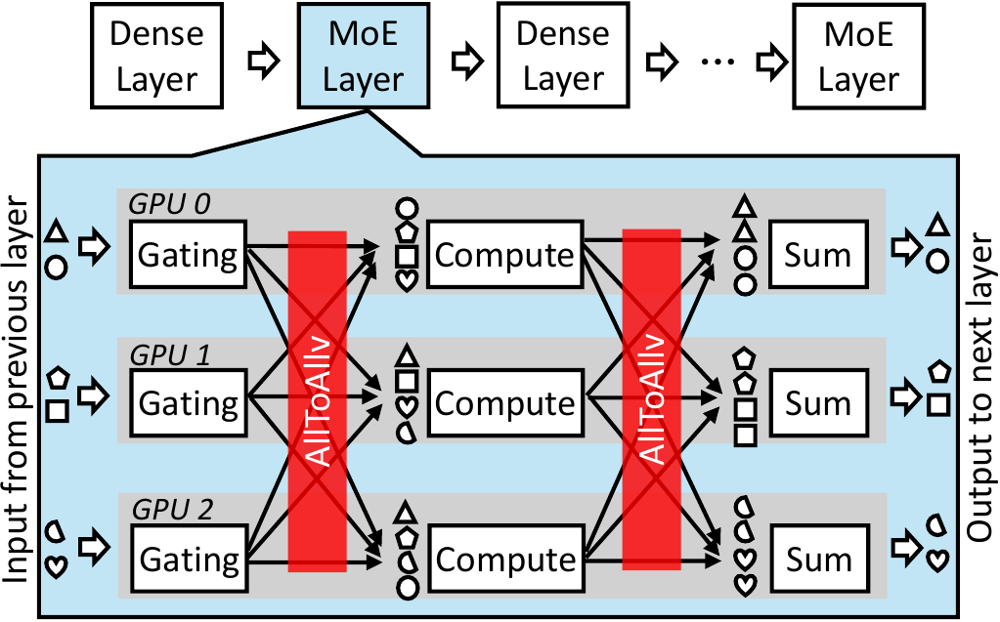
   <em>图 1：MoE 模型在每个 MoE 层调用两次 alltoallv，使其成为关键通信原语。</em>

在系统层，连接 GPU 的硬件 fabric 天然是两层结构：快速服务器内链路（scale-up）和慢得多的服务器间链路（scale-out）（图 4）。这种异构性意味着，同样大小的 flow 在服务器内可以很快完成，但跨服务器可能慢一个数量级；调度器必须在不匹配的带宽上协调成千上万个 flow。此外，`alltoallv` 的密集通信模式天然会触发 incast：大量发送端同时压向同一接收端的下行链路。即使采用现代拥塞控制，incast 也会造成交换机队列堆积和 goodput 下降，并且仍是大规模集群网络中的开放问题 [11, 12]。

这些因素叠加，使得在 MoE 所要求的短时间尺度下高效调度 `alltoallv` 尤其困难。TACCL [13] 和 TE-CCL [14] 等现有调度器使用求解器 [15] 生成近似最优调度。它们虽然克服了 NCCL、RCCL 等 collective 通信库中固定调度的低效问题，但得到的形式化问题是 NP-hard [13]；即使只有 32 个 GPU，合成一个调度也可能需要数分钟到数小时。最先进的调度器 SyCCL [16] 通过启发式方法和并行化加速这一过程，但对于均衡 All-to-All 仍需数秒到数分钟，而倾斜 `alltoallv` 仍未解决。因此，这些调度器对每几百毫秒就改变一次的 MoE `alltoallv` 负载来说太慢。

本文不再继续增加调度器复杂度，而是简化问题本身：只需要重点优化真正的瓶颈，即 scale-out 层。我们观察到，scale-up 大约比 scale-out 快一个数量级（图 4b）。因此，更快的 scale-up fabric 可以廉价地吸收每台服务器内部的倾斜，在流量到达 scale-out 之前先重塑它。随后，我们可以通过让瓶颈服务器始终以满速传输并避免 incast，最大化 scale-out 效率。要做到这一点，需要无冲突地配对发送端和接收端；这自然归约为端点之间的一对一匹配问题，并且可以在多项式时间内求解。

基于这一洞察，我们提出 FAST，一个面向倾斜且动态 `alltoallv` 负载的多项式时间、基于匹配的调度器。FAST 分两阶段工作。第一阶段是倾斜缓解：利用快速 scale-up fabric 重平衡 scale-out 工作负载，使所有 NIC 在经过慢速 scale-out 链路之前面对相同的数据量。第二阶段是均衡的一对一传输：使用 Birkhoff 分解 [17] 生成连续的发送端-接收端匹配，确保 scale-out 传输没有 incast，并让瓶颈服务器在完成前始终以线速工作。虽然 Birkhoff 分解已用于交换机设计 [18, 19, 20]，但据我们所知，FAST 是第一个把 Birkhoff 分解用于 GPU 端点 collective 通信调度的工作。

我们在 NVIDIA H200 [21] 和 AMD MI300X [22] 测试平台上实现 FAST，并与 DeepEP [23]、TACCL [13]、TE-CCL [14] 等最先进方案比较。在倾斜负载下，FAST 比最强 NVIDIA baseline 快 1.01 到 1.3 倍，比最强 AMD baseline 快 1.5 到 2.8 倍；把 FAST 集成到 AMD 上的 Megatron-LM [24] 后，相比严重受 incast 影响的 RCCL [25]，端到端 MoE 训练吞吐提升 4.48 倍。FAST 调度器也非常高效，在 64 个 GPU 上只需 221 微秒即可完成调度，足以应对流量矩阵每几百毫秒变化一次的 MoE 负载。代码可见 [26]。

## 2. 动机

All-to-All（`alltoallv`）通信，即每个端点与所有其他端点交换不同的数据，已经成为现代 GPU 集群中的关键原语。在这种环境中，通信端点是单个 GPU；GPU 由快速服务器内链路（scale-up）和较慢服务器间链路（scale-out）组成的两层 fabric 连接。

**MoE 模型中的 All-to-All 通信成本。** Mixture-of-experts（MoE）已经成为可扩展大语言模型的主流架构之一：它不会为每个输入 token 激活整个模型，而是由轻量级 gating 网络选择一部分“专家”，每个专家通常由一个 feed-forward network（FFN）实现。Expert parallelism（EP）提高了参数效率，但也引入了频繁的大规模 `alltoallv` 操作，用于把 token 分发给选中的专家，并收集结果；这些操作往往横跨数百个 GPU [27, 7]。如图 1 所示，每个 MoE 层会调用两次 `alltoallv`，而 MoE 层通常占模型的很大一部分。已有测量 [8, 9] 表明，`alltoallv` 可占训练时间的 30% 到 56%。

虽然本文主要关注 MoE，但 `alltoallv` 的重要性并不止于此。它支撑推荐系统 [2, 3]、Gaussian Splatting [4] 以及 3D FFT 这样的经典科学计算负载 [1]；在 3D FFT 中，它甚至可占运行时间的 97.3% [28]。尽管 `alltoallv` 只是一个 collective，它的性能却会不成比例地影响现代 AI 和传统 HPC 负载的效率。

**应用层挑战：倾斜性与动态性。** 为了研究这类通信，我们使用 Megatron-LM [24] 对 32 个专家（每个 GPU 一个专家）的 MoE 训练进行 profile。结果显示，`alltoallv` 负载天然具有倾斜性和动态性，这与近期对 Mixtral 模型的 profiling 结果一致 [9, 29]。不同于 All-Reduce 这类均衡 collective，MoE `alltoallv` 会生成高度不均匀的需求矩阵：某些 GPU pair 交换的数据量超过中位数的 12 倍（图 2a）。这种倾斜会产生 straggler：有些 NIC 在其他端点完成后仍长时间忙碌，拖慢整个 collective 并阻塞训练进度（图 3a）。在这种场景中，调度非常关键：一个智能调度器可以把重载 GPU 的部分流量路由到空闲 NIC，从而平滑倾斜并缓解 straggler，如图 3b 所示。

<table align="center">
  <tr>
    <td align="center" width="50%">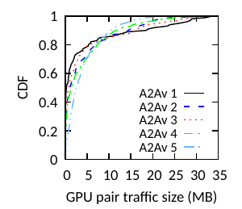 <em>图 2a：倾斜性。</em></td>
    <td align="center" width="50%">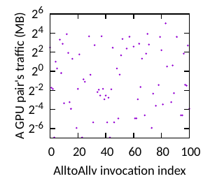 <em>图 2b：动态性。</em></td>
  </tr>
</table>

<em>图 2：使用 Megatron-LM 预训练 MoE 模型时，All-to-All 工作负载既倾斜又动态。</em>

<table align="center">
  <tr>
    <td align="center" width="50%">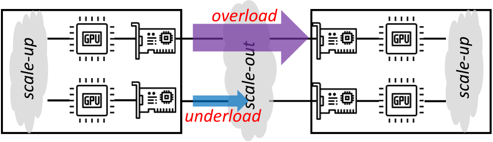 <em>图 3a：倾斜工作负载产生 straggler。</em></td>
    <td align="center" width="50%">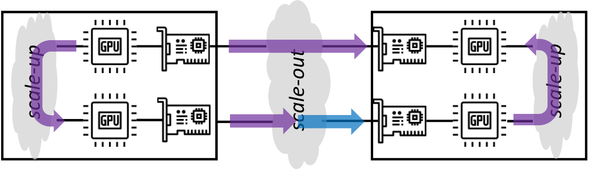 <em>图 3b：通过重平衡流量缓解 straggler。</em></td>
  </tr>
</table>

<em>图 3：工作负载倾斜会制造 straggler 和低利用率 NIC，从而降低性能；通过流量重平衡可以缓解这一问题。</em>

MoE 负载也具有动态性：`alltoallv` 流量模式每隔几百毫秒就会变化。如图 2b 所示，同一个 GPU pair 的流量在连续多次 `alltoallv` 调用之间可能显著变化，因为 token 路由由输入 token 和每个 MoE 层的 gating 函数共同决定（图 1），且无法提前预测。因此，通信调度必须以工作负载变化的时间尺度在线重算：一个 GPU pair 在某次 `alltoallv` 中负载很重，在下一次中可能几乎空闲。这使快速在线调度成为必要条件。

**系统层挑战：异构性与 incast。** 现代 GPU 集群进一步带来两个系统层挑战。第一，GPU 由异构的两层 fabric 连接（图 4a）：快速服务器内链路，例如 5 代 NVLink 900 GBps [30]；以及慢得多的服务器间链路，例如 800 Gbps Ethernet [31]。这种两层网络提高了调度复杂度：对于每次 `alltoallv`，调度器必须在不匹配的带宽上处理成千上万个 flow，并探索大量路由和 pacing 决策，调度本身也可能成为瓶颈。

第二，incast 是由 `alltoallv` 密集通信模式引发的经典网络问题：许多 flow 汇聚到 scale-out fabric 中同一个 NIC 的下行链路。小消息的突发性可能被交换机队列吸收，但 MoE `alltoallv` 的传输通常大得多，典型范围为 100 MB 到 1 GB [23]，会造成持续拥塞，需要主动控制。即使有 DCQCN、TIMELY 和 UEC 等先进方案 [32, 33, 12]，incast 也常导致带宽共享不公平和 goodput 降低。它仍是开放挑战 [11]，调度器通常会主动缓解它，而不是完全依赖传输层。

<table align="center">
  <tr>
    <td align="center" width="50%">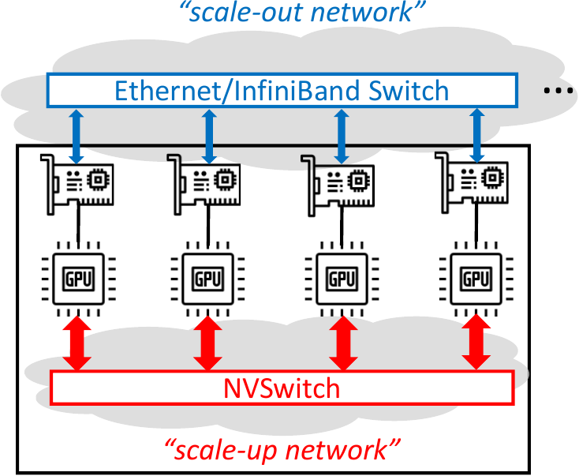 <em>图 4a：两层结构。</em></td>
    <td align="center" width="50%">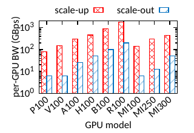 <em>图 4b：每 GPU 全双工带宽。</em></td>
  </tr>
</table>

<em>图 4：现代 GPU 集群具有两层 fabric：高带宽服务器内 scale-up 网络（例如 NVLink、Infinity Fabric）和较低带宽服务器间 scale-out 网络（例如 Ethernet、InfiniBand）。</em>

**现有方法的局限。** TACCL [13]、TE-CCL [14]、SyCCL [16] 等最先进调度器被设计为通用调度器：它们支持 All-Reduce、All-Gather、All-to-All 等多种 collective，并对任意拓扑进行推理。为了实现这种通用性，它们把调度表述为约束满足或优化问题，这些问题通常是 NP-hard [13]，并使用重型计算求解。对于 All-Reduce 这类通信模式重复的 collective，这种方式是可行的，因为较高的调度成本可以在多次迭代中摊销。

但对 `alltoallv` 来说，现有方法太慢。SyCCL [16] 是目前最快的方案之一，通过并行化和启发式加速，相比早期基于求解器的系统快数个数量级，但为 64 个 GPU 生成调度仍需数分钟；而 MoE 流量每几百毫秒就会变化一次。这些系统虽然擅长在任意拓扑下得到接近最优的完成时间，但其细粒度建模使它们很难扩展到本文场景。

另一个极端是 NCCL [34] 这样的生产库，它可以立即生成调度，但依赖固定调度，无法感知动态且倾斜的工作负载，结果常低于硬件可达吞吐。

**目标。** 我们能否为 `alltoallv` 设计一个快速在线调度器，同时保持高性能？本文不追求任意 collective 或任意拓扑的通用解，而是聚焦于当代两层 GPU 集群上的 `alltoallv` 专用方案；在这种环境中，倾斜性、动态性、非对称性和 incast 正是现有调度器受限的原因。FAST 可以与现有库集成：运行时把 `alltoallv` 分派给 FAST，而其他 collective 仍使用传统算法。

## 3. 设计概览

为了在现代 GPU 集群中为每次 `alltoallv` 调用生成单独调度，我们先退一步。不直接枚举复杂约束，而是先在简化的单层网络中解决 `alltoallv`，再把解法推广到今天非对称的两层 fabric。

**起点：单层网络中的 `alltoallv`。** 在具有均匀链路带宽的单层 full-bisection 网络中，目标是通过避免 incast 和拥塞来最大化通信效率。要做到这一点，需要保证任意时刻每个发送端只与一个接收端通信，并且每个接收端只接受一个发送端的数据。因此，通信可以组织成多个 stage：每个 stage 实现发送端和接收端之间的一对一匹配，连续多个 stage 共同完成所有发送端-接收端 pair 的数据交换。

要使这样的调度达到理论最小完成时间，必须满足两个条件。第一，每个 stage 是均衡的，所有活跃节点一起开始并一起结束。第二，瓶颈端点，即最重的发送端或接收端，在完成前始终以线速保持活跃。

为了解决这个问题，我们观察到，1946 年提出的数学定理 Birkhoff 分解 [17] 可以重新解释为 `alltoallv` 的最优调度策略。形式上，该定理说明，任意流量矩阵都可以表示为若干 permutation matrix 的加权和。严格来说，该定理适用于缩放后的双随机矩阵；任意矩阵可以通过后文描述的方法转换。放在调度视角下，每个 permutation 对应一个传输 stage：每个活跃行（发送端）和列（接收端）恰有一个非零项，且非零项大小相同（即传输大小），因此每个参与者只与一个 partner 交换数据，并同时完成该 stage。把这些 permutation matrix 累加起来，所有 flow 就按其需求比例推进，最终完成传输。

图 5 展示了这个 strawman 方法：上半部分显示分解得到的（可能是 partial 的）permutation matrix，下半部分显示对应传输。这个方法很有吸引力，因为：第一，完成时间达到下界，瓶颈节点（例如蓝色的发送端 $N_0$）在所有 stage 都传输；第二，在节点完成前，每个 stage 都是均衡的，因此参与者会一起进入下一 stage；第三，该分解可以高效计算。

  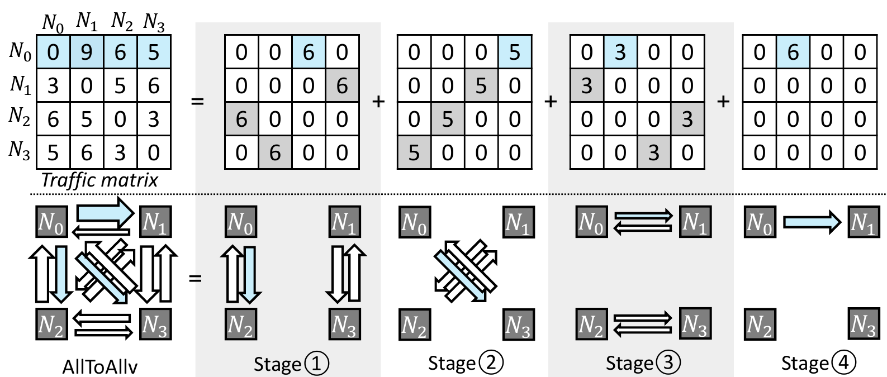
   <em>图 5：4 节点 alltoallv 的 Birkhoff 分解。完成时间由最大发送端（蓝色的 N0）决定；由于 N0 在每个 stage 都保持活跃，而较轻节点会提前退出，该调度是最优的。</em>

**把 Birkhoff 分解用于两层网络的挑战。** 遗憾的是，现代 GPU 集群与上述简化网络有两个偏差。第一，在两层 fabric 中，即使一个 permutation stage 在逻辑上“均衡”，它也可能完成得不均衡：服务器间链路上的传输会滞后，使更快的服务器内链路空转并浪费带宽。第二，在每台服务器 8 个 GPU 的集群中，例如 HGX [35]，完成时间由最忙的服务器间端点决定。由于大多数 GPU pair 跨服务器，较快的服务器内层很少成为限制。重度倾斜下，基于 Birkhoff 的 GPU 级调度无法缓解服务器间瓶颈，因此仍会停顿。

**FAST 的方法。** 我们把两层 fabric 视为简化调度的机会。由于服务器内（scale-up）带宽远高于服务器间（scale-out）带宽，它很少成为瓶颈。我们转而利用它提前重塑流量，在本地吸收不均衡，使 scale-out 层看到更均匀的工作负载，从而让 Birkhoff 分解生成更高效的调度。

这种重塑背后有一个简单但关键的观察：真正重要的是把数据送到正确的服务器。至于由目标服务器里的哪块 GPU 先处理传输，则是次要问题，因为服务器内 shuffle 相比 scale-out 通信便宜得多。这引出两阶段设计。

**服务器内调度：平衡与重分布。** 在每台服务器内，FAST 会在流量离开节点之前均衡各 GPU 之间的负载（图 6）：过载 GPU 使用 scale-up fabric 把多余流量交给较轻的 GPU，使每个 NIC 对每个目标服务器承载相同数据量。在接收侧，每个 GPU 从每个源服务器上一个指定发送端接收数据，从而均衡接收量。这个过程会让一部分数据先到达正确目标服务器上的“proxy”GPU，再通过廉价的服务器内重分布快速转发到真正的目标 GPU。

  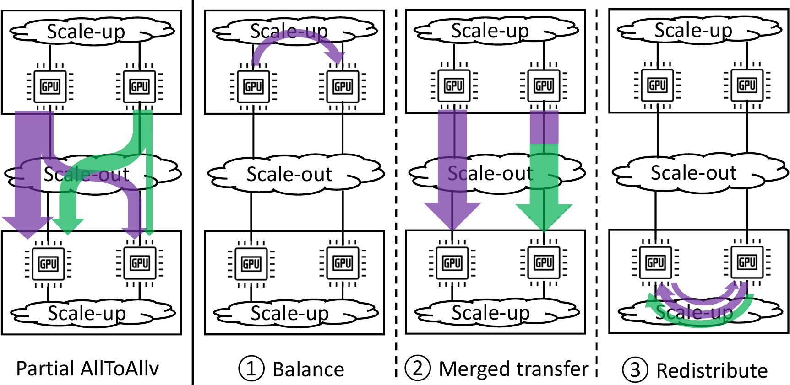
   <em>图 6：FAST 把带有发送端/接收端 straggler 的 alltoallv 工作负载转换成均衡 scale-out 传输。每个 GPU 都连接到专用 NIC（图中省略）。</em>

**服务器间调度：均衡的一对一传输。** 当服务器内倾斜被吸收之后，剩下的问题是服务器级不均衡和 incast。这里，FAST 应用 Birkhoff 分解构造连续的一对一、均衡传输 stage，保证瓶颈服务器在其流量完成之前始终以线速活跃。

最后，FAST 对两阶段进行流水化以缩短端到端传输时间，并分析关键性质，例如最优性和复杂度。

## 4. 两阶段调度器

本节介绍 FAST 的设计：先在服务器内缓解倾斜，再在服务器间处理 incast 与不均衡，随后通过流水化改进端到端传输，并分析调度器性质。

### 4.1 服务器内调度：平衡与重分布

第一个挑战出现在每台服务器内部：GPU 经常生成或吸收不均匀的数据量，形成 straggler，使一些 NIC 空闲而另一些 NIC 过载。借助快速 scale-up fabric，FAST 的目标是消除发送侧和接收侧的不均衡，让 scale-out 层面对更均匀的负载。

**示例设置。** 考虑一个简单的两服务器场景，服务器为 $A, B$，每台服务器有 2 个 GPU，分别为 $A_0, A_1, B_0, B_1$。工作负载表示为一个 $4 \times 4$ 的 GPU-to-GPU 流量矩阵（图 7）。每个行和表示某个 GPU 的总发送量；每个列和表示其总接收量。跨服务器传输以 2 × 2 tile 的形式出现，蓝色表示 A → B，绿色表示 B → A。由于 scale-out 是瓶颈，图中重点关注这些 tile，并为说明清晰省略灰色的服务器内对角块。

**缓解发送端倾斜。** 第一步是避免某个 GPU 成为“straggler sender”。在 $B \rightarrow A$ tile 中，GPU $B_0$ 必须发送 8 个单位，而 $B_1$ 只需发送 4 个单位。如果直接传输，后者会提前完成，留下前者成为 straggler。为避免这一点，FAST 在服务器 B 内重平衡：重载 GPU 使用 scale-up fabric 把部分流量转移到轻载 GPU。此处，重载 GPU 向轻载 GPU 转移 2 个单位，因此两者最终各发送 6 个单位。用矩阵语言说，就是把这个 tile 的行和均衡化，确保服务器 B 中每个 NIC 对服务器 A 贡献相同的总发送负载。

**缓解接收端倾斜。** 发送侧平衡之后，GPU $A_0$ 仍可能需要接收 8 个单位（列和），而 $A_1$ 只需接收 4 个单位，从而留下接收侧 straggler。解决办法是解耦“正确服务器”和“正确 GPU”这两个概念。每个发送端把它的全部流量转发给具有相同本地索引的 peer GPU，例如 $B_0 \rightarrow A_0,\ B_1 \rightarrow A_1$，先保证数据到达正确服务器。由于发送端已经均衡，这种 merged peer transfer 会保持接收负载均衡；一些数据虽然暂时到达了错误 GPU，但稍后会被纠正。在矩阵形式上，每一行都合并成位于同本地索引列的单个非零项，把 2 × 2 tile 变成一个对角项相等、非对角项为零的 scalar matrix（图 7 右侧）。结果是在 GPU 之间形成一对一、均衡的 scale-out 传输。

  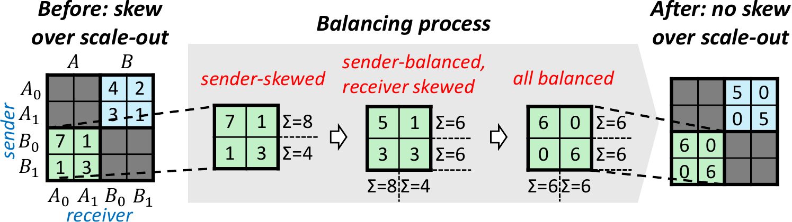
   <em>图 7：2 服务器、每服务器 2 GPU 的 alltoallv 平衡过程：倾斜 tile（左）被重塑为 scalar form（右），确保没有 GPU NIC 过载。灰色 tile（服务器内部分）为清晰起见被省略。</em>

**重分布。** 此时，所有流量都已经到达正确服务器，但可能还在错误 GPU 上。最后一步重分布会在服务器内部纠正放置，把数据从 proxy GPU 通过 scale-up fabric 路由到真正的目标 GPU。由于 scale-up 比 scale-out 快一个数量级，这个额外步骤的开销很小。

通过组合发送端平衡、merged peer transfer 和本地重分布，FAST 把每个跨服务器 tile 重塑成最均衡的 scalar form。这个变换消除了服务器内倾斜，并在 GPU 级别均衡了 scale-out 流量。剩下的是更高层的服务器到服务器倾斜，下一节处理这一问题。

### 4.2 服务器间调度：均衡的一对一传输

虽然服务器内调度把初始倾斜的 GPU 级 `alltoallv` 重塑成更均衡的形式，但每台服务器内部的 scale-up 平衡无法消除服务器到服务器的倾斜。某些服务器仍会发送或接收更多流量，形成必须处理的瓶颈，才能获得良好的端到端性能。

把 GPU-to-GPU 流量矩阵缩减成更简单的服务器到服务器视图后，这种不均衡会更加清楚。图 8 展示了一个 3 服务器、每服务器 2 GPU 的例子：原始 $6 \times 6$ GPU 矩阵（左）经过服务器内调度后被重塑为均衡形式（中），每个 $2 \times 2$ 的服务器到服务器 tile 都变成 scalar matrix。随后，每个 scalar tile 可以折叠成单个条目，得到缩减后的 $3 \times 3$ 服务器级矩阵（右）。直觉是：经过服务器内调度后，同一服务器内的 GPU 在 scale-out 上表现相同，每个 GPU 发送和接收相同数据量，因此可以抽象掉单个 GPU。这个缩减既暴露出服务器之间剩余的倾斜，也简化了调度，因为服务器级问题通常比 GPU 级问题小一个数量级，例如现代集群中常见的每服务器 8 个 GPU [35]。

  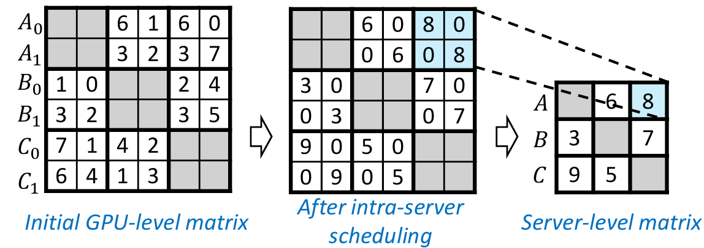
   <em>图 8：服务器内调度把 6×6 GPU 级矩阵（A0, A1, ..., C1）缩减为 3×3 服务器级矩阵（A, B, C）。</em>

在服务器级别，还剩两个调度挑战。第一是 incast：即使采用 peer access，来自多个服务器的 GPUj 仍可能汇聚到同一目标服务器的 GPUj，压垮它的 scale-out 链路。第二是吞吐最优性：最忙的服务器必须在其 flow 完成前始终以线速保持活跃，否则整体完成时间会落后于可达最小值。

**SpreadOut：一对一但非最优。** 一个自然的无 incast baseline 是 MPI 的 SpreadOut 算法 [36]。它沿 N × N 服务器矩阵中的“移位对角线”循环：在 stage $i$，服务器 $s$ 向服务器 $(s+i)\%N$ 发送。这样可以保证每个 stage 都是一对一发送端-接收端映射。

但 SpreadOut 不满足第二个要求：瓶颈服务器可能在许多 stage 中空闲。虽然瓶颈是行和或列和最大的服务器，但在某个 stage 中，该行或列所选择的条目不一定是对应对角线上最大的条目。当这种情况出现时，该 stage 会被另一个矩阵条目控制，例如来自非瓶颈的 flow，从而迫使真正瓶颈等待。

图 9 展示了一个例子：服务器 D 作为接收端是瓶颈，其列和为 14，是所有行/列中最重的。但在 stage 1 中，$D$ 只接收 3 个单位，而该 stage 被另一个 5 单位 flow（D → A，其中 D 是发送端）控制。因此，D 作为接收端额外空闲 2 个时间单位。stage 3 中同样情况再次发生，又增加 1 个时间单位的空闲。总之，SpreadOut 用 17 个单位完成，比 14 个单位的理论最小值慢 3 个单位。

  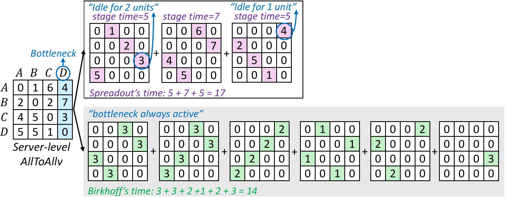
   <em>图 9：SpreadOut 与 Birkhoff。二者都使用一对一映射，但 SpreadOut（上）可能在每个 stage 留下瓶颈服务器空闲，而 Birkhoff（下）会让瓶颈持续活跃直到完成，因此达到最优。</em>

用矩阵语言说，SpreadOut 的完成时间等于每条对角线上最大条目的和。这个和可以证明不小于最大行和或列和，也就是真正的下界，因此 SpreadOut 无法保证最优性。

**Birkhoff 分解：一对一且最优。** 最优完成时间由最忙服务器决定，也就是矩阵中最大的行和或列和。在图 9 中，最忙服务器 $D$ 必须接收 14 个单位，所以可能的最小时间是 14。要达到这个下界，就要求 $D$ 在每个 stage 都以线速接收。

Birkhoff 分解 [17] 正好适合这个场景。它把一个流量矩阵表示为 permutation matrix 的加权和。每个 permutation matrix 每行和每列恰好有一个非零项，且所有非零项大小相同，代表一个一对一、均衡的传输 stage：每个活跃发送端向一个接收端发送相同数据量，每个接收端从一个发送端接收。某些 permutation matrix 可以是 partial 的，对已经完成的服务器包含零行或零列。在图 9 中，前四个 stage 是完整 permutation matrix，后两个是 partial。

作为调度来理解，这种分解会生成一系列一对一发送端-接收端匹配，让瓶颈服务器在完成前持续活跃。在该例中，Birkhoff 用 14 个单位完成，正好达到下界，因此是最优的。

**多服务器端到端调度。** FAST 调度器的最后一块，即 Birkhoff 分解，用于处理剩余的服务器级倾斜。图 10 用一个 3 服务器、每服务器 2 GPU 的例子展示完整调度过程；为清晰起见，图中省略服务器内传输（灰色对角 tile）。输入是一个 $6 \times 6$ GPU-to-GPU 流量矩阵（左）。如果不用 FAST，完成时间下界为 10 个单位，由最重发送 GPU（$B_1$，行和 10）和最重接收 GPU（$B_0$，列和 10）决定。

  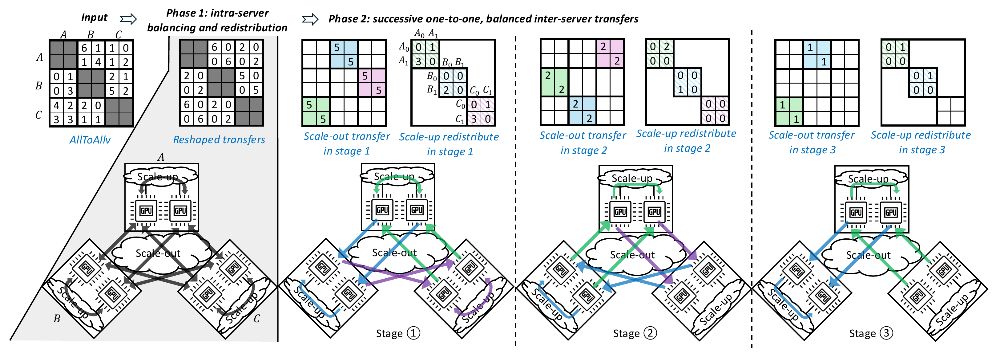
   <em>图 10：3 服务器、每服务器 2 GPU（6×6）alltoallv 工作负载的端到端调度示例。流量矩阵（上）和传输过程（下）展示了服务器内调度如何缓解倾斜，把每个 tile 重塑成 scalar form（左到中）；服务器间调度随后应用 Birkhoff 分解，调度连续的一对一服务器传输（中到右）。每个 stage 都均衡、一对一，并保持瓶颈服务器活跃，从而实现接近最优的 scale-out 性能。</em>

**步骤 1：平衡。** 这一步降低瓶颈的严重程度。在每个 2 × 2 tile 内，例如 A → B，发送端负载在 GPU 之间被均衡；peer transfer（例如 $A_i \rightarrow B_i$）确保接收端共享负载。服务器内倾斜被消除后，有效下界得到改善：在图 10 中间的重塑矩阵中，最大行/列和从 10 降到 8，即发送端 A、C 和接收端 A、B。直观地说，straggling NIC/GPU 的压力被平均到该服务器内所有 GPU 和 NIC 上，从而降低其影响。此时，$6 \times 6$ GPU 级矩阵可以干净地折叠为一个倾斜的 $3 \times 3$ 服务器级 `alltoallv`。

**步骤 2：均衡的一对一传输 stage。** Birkhoff 分解随后把服务器级矩阵划分为三个均衡的一对一传输 stage（图 10 右侧）。每个 stage 交付一部分工作负载，合起来完成全部传输。所得调度满足三个关键性质。第一，无 incast：在服务器级，Birkhoff 强制一对一匹配；结合步骤 1 的 peer-access 规则，每个 GPU 只与匹配服务器中相同索引的 GPU 通信，避免任何接收端过载。第二，均衡：每个 stage 中服务器发送相同数据量，而步骤 1 保证每台服务器内部 GPU 均衡。第三，最优：瓶颈服务器（此例中发送端 $A,C$ 和接收端 $A,B$）在所有 stage 中保持充分活跃，达到理论最小完成时间 8 个单位。

**步骤 3：逐 stage 重分布。** 步骤 2 的 scale-out 传输确保数据到达正确服务器，但不一定到达正确 GPU。轻量级重分布步骤会在本地修正放置，并与每个 stage 对齐。例如图 10 中，一旦 stage 1 的 $A \rightarrow B$（蓝色 tile）完成，对应部分就立即在 $B$ 内重分布（蓝色条纹 tile）。

总之，FAST 通过把重塑后的工作负载分解成一系列均衡的一对一 stage，完成服务器级调度。接下来我们说明这些 stage 如何实际执行，即如何通过流水化重叠服务器间和服务器内传输，以进一步降低延迟并隐藏平衡与重分布成本。

### 4.3 端到端传输流水线

FAST 把 scale-up 传输（平衡和重分布）与 scale-out 传输（由 Birkhoff 分解得到的 stage）组合在一起。虽然 scale-up 比 scale-out 快很多，但如果把所有步骤串行化，例如 `balance -> stage 1 scale-out -> stage 1 redistribute -> stage 2 scale-out -> ...`，仍会产生明显开销。为了最小化端到端完成时间，FAST 构造一条流水线，使真正瓶颈 scale-out 层尽可能保持忙碌，同时在后台隐藏 scale-up 传输。

需要考虑三类 scale-up 传输。第一是平衡，它在 scale-out 开始前均衡 GPU 负载。第二是重分布，它在 scale-out 完成后修正数据放置，并按 stage 对齐，例如图 10 中的条纹 tile。第三是 `alltoallv` 的服务器内部分，即图 10 中的灰色 tile。scale-out 部分比较直接：执行 Birkhoff 分解得到的一系列一对一 stage。

**流水线结构。** 图 11 展示了流水线如何运行。平衡（紫色）首先运行，因为所有后续 scale-out stage 都依赖重塑后的工作负载。平衡完成后，scale-out 立即开始。在 scale-out 期间，stage $i$ 的重分布（蓝色）与 stage $(i+1)$ 的 scale-out（绿色）重叠，从而隐藏重分布成本；最后一个 stage 因为没有后继，无法完全隐藏。`alltoallv` 的服务器内部分（灰色）与第一个 scale-out stage 同时执行，利用重分布被触发前的空闲 scale-up 带宽。虽然可以把平衡和 scale-out 进一步切成更小 chunk 来让流水线更紧，但收益很小，因此 FAST 采用这个简单设计。

  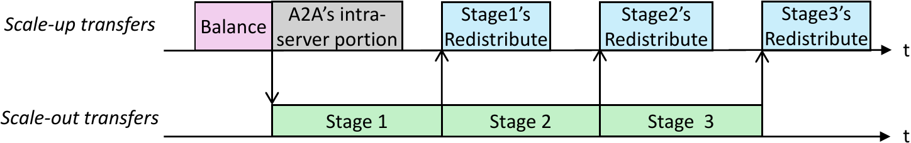
   <em>图 11：端到端流水线：scale-out 传输尽可能保持活跃，同时 scale-up 操作在后台重叠执行。箭头表示传输之间的触发关系。</em>

总体而言，流水线让真正瓶颈 scale-out 网络尽可能忙碌，而 scale-up 操作大多在后台被隐藏。至此，FAST 的设计完整：服务器内调度消除 GPU 级倾斜，服务器间调度生成均衡的服务器级传输，流水线把它们整合为顺畅的端到端执行。下面分析 FAST 的关键性质，包括最优性和计算复杂度。

### 4.4 调度器性质

除算法本身之外，调度器性质说明了 FAST 为什么是现代 GPU 集群中实用、高效且高性能的 `alltoallv` 解法。假设有 $N$ 台服务器，每台服务器有 $M$ 个 GPU。

**最优性。** 端到端传输的大部分，即由 Birkhoff 分解生成的分阶段 scale-out 传输，会在 scale-out fabric 上以完全效率运行。非最优性来自额外的服务器内操作，例如平衡和重分布。经验上，这些成本很小：在典型负载下，它们给总 scale-out 成本增加不到 5%（见 5.1.3 节）；即使在高度倾斜流量下（Zipfian 倾斜因子 0.9），开销也低于 8%。

我们还在附录中证明，即使在对抗性工作负载下，即专门最大化平衡开销（例如服务器内所有 GPU 都参与 `alltoallv`，但只有一个 GPU 持有数据）和重分布开销（例如每个目标服务器中只有一个 GPU 接收数据），FAST 与理论最优之间的性能差距仍有界。例如，在一个 4 节点集群中，scale-up 与 scale-out 带宽比为 9:1（450 GBps 4 代 NVLink [30] 对 400 Gbps Ethernet），即使在该最坏场景中，FAST 也能在最优值的 2.12 倍以内完成。

**stage 数量。** Birkhoff 分解生成的传输 stage 数取决于服务器级矩阵。最好情况下，一个完全均衡的 $N \times N$ 服务器级矩阵恰好需要 $N$ 个 stage，与 SpreadOut 相同。有倾斜时，可能引入更多 stage，但总数始终有上界 $(N^2 - 2N + 2)$ [37]。

stage 越少越好，因为每个 stage 都会增加同步开销。理想情况下，我们希望最小化 stage 数，但寻找这样的分解是 NP-hard [38]。FAST 不尝试进行这种昂贵搜索，而是高效产生一个有效分解。由于 stage 数有界，同步成本也有界；实践评估表明该成本可以忽略。

**计算复杂度与运行时间。** 服务器内调度非常轻量，只涉及简单负载平衡和簿记。主要成本来自服务器间调度，即 Birkhoff 分解；它以 $O(N^5)$ 的复杂度在多项式时间内运行，并且实践中很快。

如图 16 所示，假设每台服务器有 $M=8$ 个 GPU（现代集群中的常见配置 [35]），FAST 在 4 台服务器（32 个 GPU）上 25 微秒完成调度，在 8 台服务器（64 个 GPU）上 221 微秒完成，在 12 台服务器（96 个 GPU）上 805 微秒完成。当每个 GPU 承载一个专家时，这覆盖了当代 MoE 负载中的典型 expert-parallelism（EP）范围，从 EP8 到 EP128（例如 Perplexity AI [27]），也延伸到 EP320（DeepSeek [7]）这类更大部署。即使在 EP320（40 台服务器）下，调度开销也只有 77 ms，仍在可用范围内。

把它放到具体场景中看：考虑 EP64 的中等规模案例，每个 GPU 向其他 GPU 传输约 1 GB 数据，这是已有工作报告的流量规模 [9, 23]。在 400 Gbps 网络上，这样一次 All-to-All 至少需要 20 ms，而调度增加 221 微秒，约占总时间 1.1%。FAST 的调度步骤是一笔很小的前置“税”，换来完全优化的计划，相比无调度方案可以缩短端到端完成时间。

相比之下，已有方法 [13, 14, 16] 把调度表述为 NP-hard 问题，例如 MILP 或 multi-commodity flow，并依赖求解器 [15]，速度慢数个数量级：对于 16-GPU All-to-All，最快的基于求解器的调度器 SyCCL [16] 需要 3.6 秒，而 FAST 只需 3.1 微秒。

**不对 scale-up 上的 All-to-All 做复杂调度。** 平衡和重分布本身也是倾斜的 `alltoallv` 操作。由于它们完全运行在快速 scale-up fabric 上，不需要复杂调度。FAST 对这些步骤使用 MPI 的 SpreadOut 算法 [36]，以低成本提供简单的一对一发送端-接收端映射。虽然 Birkhoff 分解在这里也能给出最优调度，但额外计算没有必要，因为 scale-up 层不是瓶颈。

另一个注意点是，SpreadOut 可能不适合较老 GPU 中非对称的 scale-up 拓扑，例如 AMD MI250 的 ring [39] 和 NVIDIA V100 的 hybrid cube mesh [40]。但近期 GPU 采用对称 scale-up fabric，例如 switch-based 拓扑 [30] 和全连接 mesh [22]，这正是 FAST 的目标平台。

**把任意矩阵转换成有效形式。** Birkhoff 定理适用于缩放后的双随机矩阵，也就是所有行和列的和都相等。真实 $N \times N$ 服务器级流量矩阵是任意的，因此 FAST 先通过增加一个辅助矩阵把它嵌入到这种形式中；辅助矩阵可在 $O(N^2)$ 时间内构造。该过程只增加较轻的行或列，直到所有和都匹配最重项，而真正的瓶颈行或列保持不变。

辅助条目代表永不执行的虚拟传输，并在所有真实流量完成后被忽略。因此，分解产生的一些 permutation matrix 相对于真实流量看起来可能是 partial 的（图 9），其中零行或零列来自辅助矩阵。重要的是，这个转换保持正确性和最优性，因为最大行和或列和，也就是真正瓶颈，不会改变。

**Birkhoff 分解概览。** 算法输入一个 $N \times N$ 的缩放双随机矩阵，输出一系列 permutation matrix，其加权和重构输入矩阵。该矩阵可以视作一个二分图，包含 $N$ 个发送端（行）和 $N$ 个接收端（列），非零条目对应边。

高层看，算法反复在该图中寻找 perfect matching；每个 matching 为每个发送端选择一条出边，并为每个接收端选择一条入边，从而得到一个 permutation matrix。每个 matching 可用 Hungarian algorithm [41] 等方法以 $O(N^3)$ 复杂度计算。从矩阵中减去该 matching 对应的 permutation matrix 后，残差矩阵仍保持缩放双随机性，可以继续重复。最坏情况下，算法需要 $O(N^2 - 2N + 2)$ 次迭代 [37]，总复杂度为 $O(N^5)$。

该算法的一个关键优势是，它会以相同速率推进所有瓶颈行和列，包括多个具有相同最大负载的瓶颈。相比之下，贪心算法可能无法同时考虑所有瓶颈，常会优先处理单个大条目并得到次优结果。

## 5. 评估

我们评估 FAST 来回答四个关键问题：

1. 在不同工作负载、传输大小和倾斜程度下，FAST 与最先进调度器相比表现如何？
2. FAST 能给 MoE 训练带来多少端到端吞吐提升？
3. FAST 的调度运行时间与基于求解器的方案相比如何？
4. FAST 在更大集群和不同网络带宽下如何扩展？

**测试平台。** 第一是 NVIDIA 集群：4 台服务器，每台配备 8 个 NVIDIA H200 GPU [21]，通过带 credit-based flow control [42] 和 4 KB MTU 的 400 Gbps InfiniBand 互连。服务器内 scale-up 使用 NVLink，scale-up 到 scale-out 的带宽比为 9:1（450 GBps 对 50 GBps）。调度器运行在 Intel Xeon Platinum 8468 CPU 上。第二是 AMD 集群：4 台服务器，每台配备 8 个 AMD MI300X GPU [22]，通过 100 Gbps RoCEv2 Ethernet 连接，并使用开箱即用的 DCQCN [32] 作为拥塞控制，MTU 为 1 KB。服务器内 scale-up 是全连接 Infinity Fabric mesh，带宽比为 35:1（448 GBps 对 12.5 GBps）。调度器运行在 AMD EPYC 9534 CPU 上。在两个集群中，每个 GPU 都有专用 NIC，并支持 GPU Direct RDMA [43]。

**库与依赖。** FAST 提供一个 Python API `all_to_all_FAST`，接口模仿 PyTorch 的 `all_to_all_single`，便于集成到现有模型中。数据传输实现因硬件而异：在 H200 上，scale-up 和 scale-out 分别使用 CUDA IPC [44] 和 NVSHMEM [45]；在 MI300X 上，两者都使用 RCCL [25]。传输流水线使用多个 CUDA stream 和同步实现。

**集成到 MoE 系统。** FAST 以分布式方式运行：给定相同流量矩阵，每个 GPU 独立计算相同的全局调度，因此不需要中心协调器。唯一需要同步的是紧凑的整数数组流量矩阵；调度本身不需要交换。

这种集成方式很自然，因为 Megatron-LM [24] 等 MoE 框架在每次 `alltoallv` dispatch 之前已经会 materialize 流量矩阵。具体来说，Megatron-LM 会对每个专家的 token 数进行 All-Gather，例如 `num_global_tokens_per_expert` [46]，由此可构造完整流量矩阵。重要的是，这个 All-Gather 不是 FAST 新引入的。baseline NCCL `alltoallv` 实现本来就需要它来计算接收计数和 buffer offset，因为每个 GPU 只知道自己会发送多少 token，不知道会从其他 GPU 接收多少。FAST 只是消费这个已有流量矩阵，合成调度并执行传输。

**工作负载。** 我们在合成负载和真实 MoE 负载上评估 FAST。对于合成负载，我们使用两种分布改变 GPU pair 的传输大小来模拟倾斜：第一是 random `alltoallv`，大小均匀分布；第二是 skewed `alltoallv`，大小服从 Zipfian 分布。对于真实负载，我们聚焦 MoE 训练；已有工作认为 `alltoallv` 是其主要瓶颈 [8, 9, 6]，因此报告端到端吞吐提升。

我们还评估重复且均衡的 All-to-All 工作负载。在这种场景中，现有调度器可以摊销调度成本，因此更有利于已有方法，适合公平比较。

**指标。** 主要指标是 algorithmic bandwidth，这是已有工作常用指标 [34, 13]。它刻画一次传输完成得多快，定义为：

$$
\frac{\text{Total transfer size}}{\text{Number of GPUs} \times \text{Completion Time}}
$$

由于倾斜 `alltoallv` 可能有不同的 per-GPU 数据量，这个平均值会在所有 GPU 上归一化。Algorithmic bandwidth 可能超过原始 scale-out 链路带宽，因为一部分传输会在更快的 scale-up fabric 上本地完成。例如，在一个 4 节点集群中，scale-out 链路为 50 GBps；如果 25% 流量是服务器内流量，则最优 algorithmic bandwidth 是 $50 / 0.75 = 66.6$ GBps。该指标越高越好。

第二个指标是 scheduling runtime，即合成调度所需时间，越低越好。

**Baseline。** 我们把 FAST 与两类 baseline 比较。第一类是基于求解器的调度器：TACCL [13] 和 TE-CCL [14]，它们使用基于约束的求解器进行调度，并在 NVIDIA 和 AMD 集群上评估。第二类是工业库。在 NVIDIA 上包括 NCCL [34]（版本 2.27.3）、DeepEP [23]（来自 DeepSeek [7]）和 MSCCL [47]；在 AMD 上包括 RCCL [25]、SpreadOut [48]（缩写为 SPO）和 MSCCL。由于 DeepEP 只支持 NVIDIA，我们不在 AMD 上评估它。NCCL 在 NVIDIA 上优于 SpreadOut，因此那里省略 SpreadOut；在 AMD 上，RCCL 的 `alltoallv` 缺少有效调度，因此 SpreadOut 是更强 baseline，我们将其纳入比较。

### 5.1 All-to-All(v) 性能

#### 5.1.1 不同传输大小下的性能

FAST 在 NVIDIA 和 AMD 测试平台上都持续取得最好的 `alltoallv` 性能。对于 baseline，NCCL、DeepEP、SpreadOut 和 RCCL 原生支持 `alltoallv`，而 TACCL、TE-CCL、SyCCL 和 MSCCL 只支持均衡 All-to-All。把求解器适配到倾斜 `alltoallv` 有两种方式：第一，显式把可变 flow 大小编码到问题形式中；第二，把所有 flow padding 到统一大小，使求解器看到均衡负载，padding 数据只用于调度，不用于实际传输。我们尝试了第一种方式，但它使已经很慢的求解器更加无法在合理时间内完成，例如 TACCL 在 32 个 GPU 的均衡负载上已需超过 30 分钟。因此，我们采用 padding 来简化基于求解器的调度负载。

我们评估每 GPU 消息大小从 100 MB 到 1 GB 的范围，这代表已有工作报告的典型工作负载 [9, 23]。不同测试平台上的提升倍数不同，反映了网络硬件和软件实现差异，下面分别讨论。

**NVIDIA 测试平台结果。** 如图 12a 所示，在 random 负载下，FAST 达到最高 algorithmic bandwidth。它略优于 NCCL，提升 1.01 到 1.1 倍；同时超过 DeepEP（1.5 到 1.9 倍）和 TACCL（1.5 到 1.7 倍）。随着传输增大，性能提高，因为 scale-out 链路更容易饱和，FAST 的 stage 开销也被摊销。

<table align="center">
  <tr>
    <td align="center" width="50%">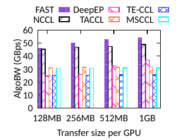 <em>图 12a：Random。</em></td>
    <td align="center" width="50%">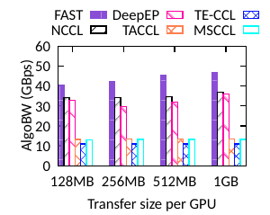 <em>图 12b：倾斜因子为 0.8 的 skewed 负载。</em></td>
  </tr>
</table>

<em>图 12：NVIDIA 测试平台上的 alltoallv 性能，scale-up 为 450 GBps，scale-out 为 50 GBps。</em>

带 PXN 的 NCCL [49] 使用发送侧聚合：在经过 scale-out 链路之前，将 outgoing flow 聚合到 proxy GPU 上。通过跨 flow 聚合，PXN 降低 per-GPU 方差并缓解轻度倾斜。因此，在轻度倾斜负载下，即使没有显式流量重平衡，NCCL 也能接近 FAST 性能。

DeepEP [23] 把聚合和 fan-out 放在接收侧。数据先送到目标服务器上的 ingress GPU，再通过 NVLink 转发给目标 GPU。在倾斜场景下，多个 ingress GPU 可能同时向相同目标转发大量数据，引发 NVLink 接收竞争和本地热点，限制吞吐；DeepEP 自己的 NVLink runtime profiler 也观察到这一点。

基于求解器的调度器，例如 TACCL 和 TE-CCL，会通过 padding 把倾斜 `alltoallv` 转换成虚构的均衡 All-to-All，这显著减少合成时间并使实际生成调度可行。然而，padding 传输不对应真实数据移动，却仍占用通信 slot，延迟真实传输。因此它们在实践中的性能远低于 FAST。

倾斜会放大 straggler 效应。在 Zipfian 负载下（图 12b），FAST 比 NCCL 快 1.2 到 1.3 倍，比 DeepEP 快 1.2 到 1.5 倍，比 TACCL 快超过 3 倍。随着工作负载从均匀变为 Zipfian，FAST 与 NCCL 的差距扩大：即使有 PXN 聚合，残余不均衡仍会产生 straggler，限制 NCCL 效率。

**AMD 测试平台结果。** 在 random 负载下，FAST 同样达到最佳性能（图 13a），比 TACCL 快 1.3 到 1.8 倍，比 TE-CCL 快 1.6 到 2.3 倍，比 SpreadOut 快 1.9 到 2.1 倍，比 RCCL 快 1.1 到 10 倍。与 NVIDIA 上类似，大多数算法都受益于更大的传输。

<table align="center">
  <tr>
    <td align="center" width="50%">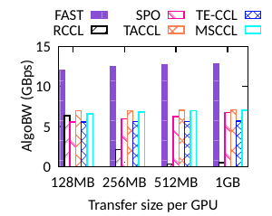 <em>图 13a：Random。</em></td>
    <td align="center" width="50%">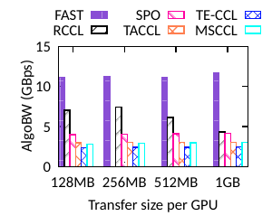 <em>图 13b：倾斜因子为 0.8 的 skewed 负载。</em></td>
  </tr>
</table>

<em>图 13：AMD 测试平台上的 alltoallv 性能，scale-up 为 448 GBps，scale-out 为 12.5 GBps。</em>

不过 RCCL 呈现相反趋势：吞吐会随传输大小增加而下降。主要原因是它的 `alltoallv` 实现没有调度，会同时发起所有 flow，从而造成严重 incast 和 goodput 降低。

在倾斜负载下（图 13b），FAST 的优势进一步扩大：比 TACCL 快 2.9 到 3.8 倍，比 TE-CCL 快 3.6 到 4.7 倍，比 SpreadOut 快 2.5 到 2.8 倍，比 RCCL 快 1.3 到 2.6 倍。有趣的是，RCCL 在这里相对 random 负载表现更好：倾斜把流量集中到少数 elephant flow 上，同时让多数 flow 成为短 mice transfer，减少大范围碰撞并缓解 incast 压力。

#### 5.1.2 均衡 All-to-All 下的性能

在简单、重复的均衡 All-to-All 工作负载上，DeepEP（60 GBps）、TACCL（59 GBps）和 NCCL（58 GBps）都取得良好性能。在该场景中，FAST 达到 58 GBps，略低于最佳方案，因为在负载本来就均衡时，它的平衡和重分布会带来小额且不必要的开销。已有工作能高效处理均衡 All-to-All，但缺少处理倾斜导致的 straggler 的机制；这正是 FAST 的优势所在。

#### 5.1.3 不同倾斜程度下的性能

我们使用不同倾斜因子的 Zipfian 分布生成倾斜负载。因子越大，mice flow 越多，elephant flow 越被放大，不均衡越强。我们在 MoE 预训练期间 profile 得到的 `alltoallv` trace 显示，倾斜因子位于 0.4 到 0.8 之间。

在 AMD 测试平台上，我们比较 FAST 与 TACCL、SpreadOut、RCCL 在不同倾斜程度下的性能（图 14a）。FAST 始终最好，比 RCCL 快 1.6 到 10 倍，比 SpreadOut 快 2.1 到 3.1 倍，比 TACCL 快 2.1 到 4.5 倍；TE-CCL 在这里被省略，因为它略差于 TACCL。

性能差异反映了各系统处理 straggler 的方式。第一，对 FAST 来说，更强倾斜会拉长平衡阶段，但开销仍很小，如图 14b 所示：即使倾斜因子为 0.9，平衡和重分布也只占 scale-out 时间的不到 8%，大多数情况下不到 5%。由于 scale-out 占主导且以完全效率运行，FAST 与最优值的差距保持在 1.08 倍以内。第二，TACCL 在倾斜下退化，因为更强倾斜需要更多 padding，降低有效效率。第三，SpreadOut 会因为倾斜放大每个 stage 的不均衡而受损，使整体传输时间由 straggler 主导。第四，RCCL 呈现相反趋势：更强倾斜产生更多 mice flow，其竞争可以被交换机 buffer 吸收，从而降低 incast 严重程度，并在 AMD 测试平台上改善性能。

<table align="center">
  <tr>
    <td align="center" width="50%">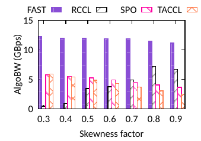 <em>图 14a：性能。</em></td>
    <td align="center" width="50%">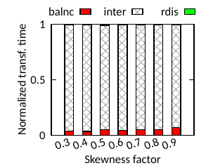 <em>图 14b：时间分解。</em></td>
  </tr>
</table>

<em>图 14：AMD 测试平台上，不同倾斜程度下的 alltoallv 性能和传输时间分解。</em>

### 5.2 端到端性能

为了在端到端场景中评估 FAST，我们把它集成到 AMD 测试平台上的 Megatron-LM [24] 中，使每次 MoE 训练中的 `alltoallv` 通信都进行 on-the-fly 调度。我们与 PyTorch [50] 默认的 `all_to_all_single` 操作比较，后者使用 RCCL 作为后端。由于调度开销过高，基于求解器的方法无法集成。

我们改变两个关键 MoE 配置，以研究 FAST 在不同训练场景下的表现。第一是 expert parallelism（EP）：EP 从 16 到 24 再到 32，直接决定 `alltoallv` 的规模。在每个 GPU 承载一个专家的配置下（类似 DeepSeek [7]），这对应于把传输从 16 个 GPU（2 台服务器）扩展到 32 个 GPU（4 台服务器）。第二是 Top-K routing：在 MoE 中，每个输入 token 被路由到最相关的 Top-K 个专家；更大的 $K$ 会增加 token 复制，从而增大 `alltoallv` 工作负载中的 flow size。该实验固定 EP 为 32，并改变 $K$。其他工作负载参数，例如 batch size 和 sequence length，也会类似地影响通信大小和训练性能。

如图 15a 所示，在 Top-2 routing 下，FAST 在不同 EP 级别上把端到端训练吞吐提升 1.18 到 4.48 倍。这里有两个主要趋势。第一，训练吞吐（左 y 轴）随 EP 增大而下降。这是预期结果，因为更高 EP 涉及更多 GPU 和服务器，因而有更多 scale-out 流量，降低通信效率并增加 GPU 空闲时间。第二，baseline 随 EP 增大急剧退化，原因是 incast 加剧。RCCL 不对跨传输进行调度，完全把拥塞留给传输层。例如，EP16 下一个接收 GPU/NIC 最多处理 8 个并发 flow，而 EP32 下增加到 24 个。开箱即用的 DCQCN 拥塞控制会在这种情况下严重吞吐崩溃。

<table align="center">
  <tr>
    <td align="center" width="50%">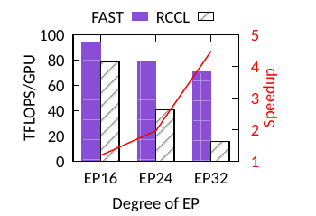 <em>图 15a：改变 EP。</em></td>
    <td align="center" width="50%">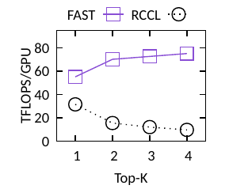 <em>图 15b：改变 Top-K routing。</em></td>
  </tr>
</table>

<em>图 15：AMD 测试平台上 Megatron-LM MoE 训练性能提升。</em>

如图 15b 所示，FAST 比 baseline 快 1.75 到 7.88 倍。值得注意的是，FAST 和 RCCL 随 $K$ 的变化趋势相反：增大 $K$ 会增大 flow 并摊销 stage 开销，从而提升 FAST；但它会增加 flow 碰撞和拥塞，从而降低 RCCL 性能。

### 5.3 调度开销

相对于 NCCL 这类非调度算法，FAST 引入两类开销：一是额外的调度运行时间，二是中间 buffer 所需的额外内存。

**调度运行时间。** 如图 16 所示，FAST 可扩展到 320 个 GPU 且只需 77 ms 开销；相比之下，最快的基于求解器的调度器 SyCCL 在 16 个 GPU 上就已经需要 3.6 秒。更早的基于求解器的方法通常无法扩展到 64 个 GPU 以上，因此无法用于 EP96、EP128 这类中等 expert-parallelism 规模。

  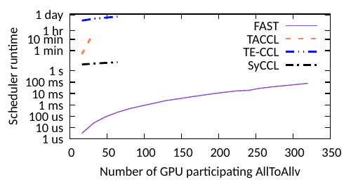
   <em>图 16：FAST 的调度运行时间与最先进的基于求解器的调度器对比（对数坐标）。</em>

即使在较小规模下，这些方法的调度时间也长得难以接受，从数秒到数小时不等，远超传输本身所需时间，也远长于工作负载再次变化前的间隔。相比之下，FAST 的轻量级调度支持 on-the-fly 规划。

**内存开销。** FAST 还需要额外内存用于临时 buffer，以存放被重平衡或重分布的数据。在 random 负载下，该开销约为原始 `alltoallv` buffer 大小的 30%。实践中影响很小：典型 `alltoallv` buffer 小于 1 GB，例如 DeepEP [23] 中的情况，因此额外成本低于 300 MB。在 NVIDIA H200 [21] 这类现代 GPU 上，显存为 141 GB，这只占总容量不到 0.22%，是换取性能提升可以接受的代价。

### 5.4 扩展性与带宽敏感性

我们使用仿真评估 FAST 超出物理测试平台限制时的表现，探索更大规模和不同 scale-up/scale-out 带宽配置。仿真器采用 TE-CCL 和 TACCL 等已有工作广泛使用的分析框架 [13, 14]：给定包含一系列传输步骤的调度，每个步骤有定义好的大小，完成时间通过累加每步成本得到。每步成本由固定链路唤醒延迟和传输时间组成，即 $\frac{\text{data size}}{\text{link bandwidth}}$。

我们聚焦于基于求解器的调度器无法扩展到的场景，因此不将其纳入比较。相应地，我们把 FAST 与 SpreadOut 以及一个最优带宽界比较。该界假设 scale-up 链路无限快，因此服务器内传输瞬时完成。在这个界下，scale-out 是唯一瓶颈，最优时间由最大均衡发送端或接收端负载除以 scale-out 带宽决定。

**更大规模下的性能。** 我们首先扩展 `alltoallv` 中的 GPU 数量，在 random 负载下每个 GPU pair 平均传输 50 MB，并仿真 H200 环境中的 400 Gbps scale-out 网络和 450 GBps scale-up 网络。如图 17a 所示，如果不计调度时间，FAST 与最优值的差距保持在 5% 以内（“FAST raw”）。计入调度时间后，较大规模下差距扩大到 10%，因为调度成本增长快于工作负载完成时间，而后者只随 GPU 数线性增长。极大规模上的 on-the-fly 调度留作未来工作。相比之下，SpreadOut 只达到 FAST 大约一半的吞吐。

**不同 scale-up/scale-out 比例下的性能。** 我们还在 32-GPU 配置上评估不同 scale-up/scale-out 带宽比例。如图 17b 所示，归一化带宽相对于 scale-out 容量报告；由于约 25% 流量是服务器内流量，该值可超过 1，上界约为 1.25。随着 scale-up/scale-out 比例增加，性能提升，因为更快的 scale-up 链路进一步降低平衡和重分布开销。这些结果表明，FAST 在具有先进 scale-up 互连的现代 GPU 上能够保持高效率。

<table align="center">
  <tr>
    <td align="center" width="50%">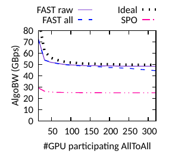 <em>图 17a：大规模性能。</em></td>
    <td align="center" width="50%">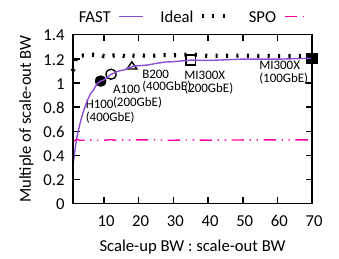 <em>图 17b：不同带宽比例。</em></td>
  </tr>
</table>

<em>图 17：在 random 负载下，FAST 的大规模仿真以及不同 scale-up/scale-out 带宽比例下的表现。</em>

## 6. 讨论

**其他 collective。** FAST 有意专门针对 `alltoallv`，因为倾斜性和动态性从根本上限制了现有方法；它并不是通用 collective 调度器。对于 All-Reduce 和 All-Gather 这类均衡 collective，通信模式静态且 flow size 均匀，通常可以通过现有库或基于求解器的实现达到近似最优；动态、流量感知调度带来的额外收益很小。实践中，现代库（例如 NCCL）已经会在运行时从多个 collective 算法中选择，FAST 很自然地适合作为倾斜 `alltoallv` 负载的专用实现。

**其他拓扑。** FAST 目标是结合 scale-up 和 scale-out fabric 的两层 GPU 集群拓扑，这类拓扑在现代部署 [51, 52] 和 HGX 风格平台 [35] 中越来越常见。FAST 的核心洞察是在流量到达较慢网络层之前先重塑它，以降低倾斜，从而简化瓶颈 fabric 面对的负载。虽然当前实现聚焦两层网络，但这个原则可以自然扩展到多层网络。

**混合并行。** 本文评估聚焦于纯 expert parallelism（EP）。在把 EP 与 tensor parallelism 或 pipeline parallelism 结合的混合部署中，如果 collective 在互不重叠的时间窗口执行，FAST 可以直接应用。让 FAST 与共享网络上的并发 collective 协调会引入额外复杂性，留作未来工作。

**scale-up 与 scale-out 带宽差距的持续性。** 我们预计 scale-up 与 scale-out fabric 之间的带宽差距会持续存在，因为 scale-up 互连受益于短距离和紧密软硬件协同设计，而 scale-out 网络必须跨越更长距离，并支持向后兼容和多租户。因此，利用 scale-up 带宽仍会是重要机会。

**与拥塞控制的交互。** FAST 运行在 collective 层，与传输层拥塞控制正交。即使在理想拥塞控制下，FAST 也能通过减少流量倾斜、提高 NIC 利用率来提供额外收益，避免通信被少数重载 NIC 限制。

## 7. 相关工作

**Collective 通信调度器。** SpreadOut [36] 等经典 All-to-All 算法假设工作负载均衡且网络为单层。NCCL [34]、RCCL [25] 等现代 GPU 库利用两层 fabric，但不处理倾斜、straggler 或 incast。SCCL、TACCL、TE-CCL 和 SyCCL [53, 13, 14, 16] 等基于求解器的调度器可以生成近似最优调度，但开销过高，不适合动态负载。相比之下，FAST 为现代 GPU 集群中的倾斜、动态 `alltoallv` 提供可扩展、on-the-fly 的调度器。

**MoE 优化。** 既有 MoE 训练工作 [54, 8, 6, 55, 5, 29, 7] 通过模型设计或通信-计算重叠提高效率，但通常把 `alltoallv` 当作黑盒。FAST 通过直接优化 `alltoallv` 来补充这些工作。

**利用 NIC 空闲。** 近期工作 FuseLink [56] 利用未充分使用的 NIC 带宽，但它运行在 collective 层之下，保持逻辑通信结构不变。虽然 FuseLink 会把流量转移到空闲 NIC 上，但它不会重新分配 flow pair，因此无法处理由倾斜或 incast 造成的瓶颈。FAST 则通过 overlay path 重塑通信，把传输 staging 到中间 GPU 上，显式缓解热点和竞争。

**交换机设计。** 既有工作把 Birkhoff 分解用于交换机调度 [18, 19] 和 circuit-switched All-to-All 通信 [20]。FAST 则把它应用在 GPU collective 层，并运行在普通 packet-switched 网络之上，不需要修改交换机。

## 8. 结论

All-to-All 通信对现代分布式系统至关重要。本文提出 FAST，第一个面向倾斜且动态 `alltoallv` 的多项式时间、on-the-fly 调度器。FAST 使用快速 scale-up 链路吸收倾斜，并在 scale-out 上强制均衡的一对一传输，从而实现高效 `alltoallv` 通信。在 NVIDIA 和 AMD 测试平台上，FAST 优于最先进系统，同时把调度合成时间降低数个数量级。

## 致谢

我们感谢 shepherd Kai Chen 以及匿名审稿人的建设性反馈。我们也感谢 Yonghao Zhuang、Zhihao Jia、Isabel Suizo 和 Hugo Sadok 对本文草稿的反馈。本工作得到 ONR Award N000142412059 和 Sloan Research Fellowship 支持。Justine Sherry 同时任 Carnegie Mellon University 副教授和 Amazon Scholar；本工作在 CMU 完成，与 Amazon 无关。本工作还部分得到 ACE 支持；ACE 是 JUMP 2.0 的七个中心之一，JUMP 2.0 是由 DARPA 赞助的 Semiconductor Research Corporation（SRC）项目。

## 附录

### A. 对抗性工作负载下的性能界

我们通过分析 FAST 在触发最坏执行路径的对抗性工作负载下的行为，建立其性能理论界。

首先介绍证明中使用的符号和假设。系统中有 $n$ 台服务器，每台服务器内各有 $m$ 个 GPU 和 NIC，因此共有 $m \times n$ 个 GPU 参与 All-to-All。

我们把 scale-up 和 scale-out 网络的 per-GPU 带宽分别记为 $B_1$ 和 $B_2$。这里假设 scale-up 网络拓扑是交换机；其他拓扑的性能界可以用类似方式推导。

不同服务器 $i, j$ 之间的总传输大小记为 $T_{ij}$，该服务器内 All-to-All 的服务器内部分记为 $S_i$。

当 i ≠ j 时，$T_{ij}$ 与 $S_i$ 构成完整 All-to-All 传输工作负载。注意，$T_{ii}$ 没有实际含义，为书写方便设为 0。本文不证明服务器内传输占主导的情况，因为多节点 All-to-All 中 scale-out pair 多于 scale-up pair，这种场景较少见。

因此，我们假设每台服务器的 intra-node 传输大小不大于所有 inter-node 传输的平均值，即 $S_i \leq \frac{1}{n}\sum_{j=0}^{n-1}(T_{ij})$。

**定理 1。** 最优传输完成时间 $t_{optimal}$ 为：

$$
\frac{1}{mB_2}\max\left(
\max_{i=0}^{n-1}\left(\sum_{j=0}^{n-1} T_{ij}\right),
\max_{j=0}^{n-1}\left(\sum_{i=0}^{n-1} T_{ij}\right)
\right)
$$

**证明。** 考虑一个理想世界，其中 intra-node 网络带宽无限大。因此，intra-node 传输 $S_i$、负载平衡和数据重分布都可以瞬时完成。负载平衡后，每个 GPU 有 $T_{ij}/m$ 的数据等待通过服务器间链路传输。服务器间传输受所有服务器中最大发送端或接收端约束，也就是：

$$
\max\left(
\max_{i=0}^{n-1}\left(\sum_{j=0}^{n-1} \frac{T_{ij}}{m}\right),
\max_{j=0}^{n-1}\left(\sum_{i=0}^{n-1} \frac{T_{ij}}{m}\right)
\right)
$$

因此，最短传输完成时间就是定理中的值。任何真实世界传输都必须慢于或等于这个理想传输。

**定理 2。** 在对抗性工作负载下，FAST 的最坏传输完成时间 $t_{FAST}$ 为：

$$
\begin{aligned}
t_{FAST} &= \frac{1}{mB_2} \max \left(
\max_{i=0}^{n-1} \sum_{j=0}^{n-1} T_{ij},
\max_{j=0}^{n-1} \sum_{i=0}^{n-1} T_{ij}
\right) \\
&+ \frac{m-1}{mB_1} \max_{i=0}^{n-1} \sum_{j=0}^{n-1} T_{ij}
+ \frac{1}{nB_1} \max_{i=0}^{n-1} \sum_{j=0}^{n-1} T_{ij} \\
&+ \frac{1}{mB_1} \max_{i,j=0}^{n-1} T_{ij}.
\end{aligned}
$$

**证明。** 我们通过累加每个传输步骤的最坏时间来计算 FAST 在对抗性工作负载下的性能：`balance -> intra-server portion of All-to-All -> Birkhoff stages -> final stage redistribution`。

对于负载平衡，最坏情况是 $T_{ij}$ 初始都位于单个 GPU 上，因为这会造成最大的数据平衡量，即 $\frac{m-1}{m}\cdot T_{ij}$。对于特定服务器 pair，源 GPU 需要 $\frac{m-1}{m}\cdot T_{ij}\cdot \frac{1}{B_1}$ 的时间来平衡数据。在所有服务器 pair 上，这个平衡步骤耗时：

$$
t_0 = \max_{i=0}^{n-1}\left(\sum_{j=0}^{n-1} T_{ij}\right)\frac{m-1}{mB_1}
$$

对于 All-to-All 的服务器内部分，最坏情况是所有 $S_i$ 数据只在两个 GPU 之间移动，使其余 scale-up 网络空闲。因此，所有服务器中的最坏时间为：

$$
t_1 = \max_{i=0}^{n-1}\frac{S_i}{B_1}
\leq \frac{1}{nB_1}\max_{i=0}^{n-1}\left(\sum_{j=0}^{n-1}T_{ij}\right)
$$

这里使用了假设 $S_i \leq \frac{1}{n}\sum_{j=0}^{n-1}(T_{ij})$。

对于分阶段服务器间传输，Birkhoff 定理最多生成 $n^2 - 2n + 2$ 个传输步骤。我们先按每步传输大小升序排序，得到 $l_0 \leq l_1 \leq \cdots \leq l_{n^2 - 2n + 1}$。

随后按该顺序执行这些步骤，能够用下一步服务器间传输隐藏当前步骤的数据重分布。第一，stage $i$ 的重分布时间成本是 $\frac{(m-1)l_i}{B_1}$，这是因为目标服务器上的每个 GPU 从 scale-out 收到 $l_i$ 数据，最坏情况下这些数据都需要转发到单个 GPU。

第二，stage $i+1$ 的 scale-out 传输成本是 $\frac{l_{i+1}}{B_2}$。第三，$\frac{(m-1)l_i}{B_1} < \frac{l_{i+1}}{B_2}$。

这是因为 $l_i \leq l_{i+1}$，且在当代 $m=8,\ m-1=7$ 集群中，$B_1, B_2$ 的带宽关系满足前者（例如 H100 上 450 GBps）快于后者的 7 倍（例如 50 GBps）。

这意味着 Birkhoff 定理生成的分阶段 scale-out 传输是连续的，使实际 scale-out 传输时间 $t_2$ 等于理想设置中的 $t_{optimal}$，因为 Birkhoff 让瓶颈服务器持续传输。

最后，对于最后一个 stage 的重分布，由于每个 stage 执行一对一服务器匹配，最坏情况是最后 stage 的 scale-out 传输选择了所有服务器 pair 中最大的传输大小，即 $\max_{i,j=0}^{n-1} T_{ij}/m$，因此最坏完成时间为：

$$
t_3 = \frac{1}{B_1}\max_{i,j=0}^{n-1}\frac{T_{ij}}{m}
$$

因此，FAST 在对抗性工作负载下的最坏传输时间为 $t_{FAST} = t_0 + t_1 + t_2 + t_3$，即定理所示。

有了最优性能和 FAST 的最坏性能，就可以计算性能界。

**定理 3。** FAST 最坏性能与最优性能之间的差距有如下上界：

$$
\frac{B_2}{B_1}\left(m+\frac{m}{n}\right)
$$

**证明。** 将 FAST 的最坏传输时间除以理想传输时间：

$$
\frac{t_{FAST}}{t_{optimal}}
= \frac{t_0+t_1+t_2+t_3}{t_{optimal}}
\leq 1+\frac{B_2}{B_1}\left(m+\frac{m}{n}\right)
$$

其中，我们用如下方式缩小分母以抵消分子：

$$
\max\left(
\max_{i=0}^{n-1}\left(\sum_{j=0}^{n-1}T_{ij}\right),
\max_{j=0}^{n-1}\left(\sum_{i=0}^{n-1}T_{ij}\right)
\right)
\geq
\max_{i=0}^{n-1}\left(\sum_{j=0}^{n-1}T_{ij}\right)
\geq
\max_{i,j=0}^{n-1}T_{ij}
$$

由此得到最终结果。

综上，在对抗性工作负载下，FAST 相对最优的最坏性能差距由 scale-up 与 scale-out 带宽比约束。以当前硬件为例，在一个 4 节点集群中，H100 上的 scale-up 为 450 GBps [30]，scale-out 为 400 Gbps，这个界意味着 FAST 的最坏场景会在理论最优的 2.12 倍以内完成。实践中，这种对抗性最坏负载很少发生，实际性能也更接近评估中展示的最优表现。

## 参考文献

[1] Dmitry Pekurovsky. P3DFFT: A Framework for Parallel Computations of Fourier Transforms in Three Dimensions. SIAM Journal on Scientific Computing, 2012.

[2] Dheevatsa Mudigere et al. Software-Hardware Co-design for Fast and Scalable Training of Deep Learning Recommendation Models. arXiv, 2023.

[3] Maxim Naumov et al. Deep Learning Training in Facebook Data Centers: Design of Scale-up and Scale-out Systems. arXiv, 2020.

[4] Hexu Zhao et al. On Scaling Up 3D Gaussian Splatting Training. arXiv, 2024.

[5] Samyam Rajbhandari et al. DeepSpeed-MoE: Advancing Mixture-of-Experts Inference and Training to Power Next-Generation AI Scale. arXiv, 2022.

[6] Dmitry Lepikhin et al. GShard: Scaling Giant Models with Conditional Computation and Automatic Sharding. arXiv, 2020.

[7] DeepSeek-AI et al. DeepSeek-V3 Technical Report. arXiv, 2024.

[8] Changho Hwang et al. Tutel: Adaptive Mixture-of-Experts at Scale. arXiv, 2023.

[9] Xudong Liao et al. MixNet: A Runtime Reconfigurable Optical-Electrical Fabric for Distributed Mixture-of-Experts Training. arXiv, 2025.

[10] MPI. MPI_Alltoallv. 2024.

[11] Ultra Ethernet Consortium. Overview of and Motivation for the Forthcoming Ultra Ethernet Consortium Specification. Technical report, 2023.

[12] Torsten Hoefler et al. Ultra Ethernet's Design Principles and Architectural Innovations. arXiv, 2025.

[13] Aashaka Shah et al. TACCL: Guiding Collective Algorithm Synthesis using Communication Sketches. arXiv, 2022.

[14] Xuting Liu et al. Rethinking Machine Learning Collective Communication as a Multi-Commodity Flow Problem. ACM SIGCOMM, 2024.

[15] Gurobi Optimization, LLC. Gurobi Optimizer Reference Manual. 2024.

[16] Jiamin Cao et al. SyCCL: Exploiting Symmetry for Efficient Collective Communication Scheduling. ACM SIGCOMM, 2025.

[17] Garrett Birkhoff. Three observations on linear algebra. Univ. Nac. Tucuman. Revista A., 1946.

[18] He Liu et al. Scheduling techniques for hybrid circuit/packet networks. ACM CoNEXT, 2015.

[19] Cheng-Shang Chang, Wen-Jyh Chen, and Hsiang-Yi Huang. Birkhoff-von Neumann input buffered crossbar switches. IEEE INFOCOM, 2000.

[20] Sundararajan Renganathan and Nick McKeown. Chronos: Prescheduled circuit switching for LLM training. NAIC, 2025.

[21] NVIDIA. NVIDIA H200 GPU. 2025.

[22] AMD. AMD CDNA3 Architecture.

[23] Chenggang Zhao et al. DeepEP: an efficient expert-parallel communication library. GitHub, 2025.

[24] Mohammad Shoeybi et al. Megatron-LM: Training Multi-Billion Parameter Language Models Using Model Parallelism. arXiv, 2020.

[25] AMD ROCm. ROCm Communication Collectives Library (RCCL).

[26] Yiran Lei et al. Github Repo for "FAST: An Efficient Scheduler for All-to-All GPU Communication". 2026.

[27] Perplexity AI. Efficient and Portable Mixture-of-Experts Communication. 2025.

[28] Alan Ayala et al. Impacts of Multi-GPU MPI Collective Communications on Large FFT Computation. ExaMPI, 2019.

[29] Albert Q. Jiang et al. Mixtral of Experts. arXiv, 2024.

[30] NVIDIA. NVIDIA H100 GPU Architecture. 2025.

[31] NVIDIA. ConnectX-8 SuperNIC. 2025.

[32] Yixiao Gao et al. DCQCN+: Taming Large-Scale Incast Congestion in RDMA over Ethernet Networks. IEEE ICNP, 2018.

[33] Radhika Mittal et al. TIMELY: RTT-based Congestion Control for the Datacenter. ACM SIGCOMM, 2015.

[34] NVIDIA. NVIDIA Collective Communications Library (NCCL).

[35] NVIDIA. NVIDIA HGX Platform. 2026.

[36] Naeris Netterville, Ke Fan, Sidharth Kumar, and Thomas Gilray. A Visual Guide to MPI All-to-all. HiPCW, 2022.

[37] Diane M. Johnson, A. L. Dulmage, and N. S. Mendelsohn. On an Algorithm of G. Birkhoff Concerning Doubly Stochastic Matrices. Canadian Mathematical Bulletin, 1960.

[38] Fanny Dufosse and Bora Ucar. Notes on Birkhoff-von Neumann decomposition of doubly stochastic matrices. Linear Algebra and its Applications, 2016.

[39] AMD. AMD CDNA2 Architecture.

[40] NVIDIA. NVIDIA V100 GPU Architecture. 2017.

[41] Harold W. Kuhn. The Hungarian Method for the Assignment Problem. Naval Research Logistics Quarterly, 1955.

[42] NVIDIA. InfiniBand Credit-based Flow Control. 2005.

[43] NVIDIA. NVIDIA GPUDirect.

[44] John Nickolls, Ian Buck, Michael Garland, and Kevin Skadron. Scalable parallel programming with CUDA. ACM SIGGRAPH Classes, 2008.

[45] NVIDIA. NVIDIA OpenSHMEM Library. 2025.

[46] NVIDIA. Megatron-LM's AllGather Operation Before AlltoAll.

[47] Meghan Cowan et al. MSCCLang: Microsoft Collective Communication Language. ASPLOS, 2023.

[48] J. Pjesivac-Grbovic et al. Performance analysis of MPI collective operations. IPDPS, 2005.

[49] Karthik Mandakolathur and Sylvain Jeaugey. Doubling all2all Performance with NVIDIA Collective Communication Library 2.12. Technical Blog, 2022.

[50] Adam Paszke et al. PyTorch: An Imperative Style, High-Performance Deep Learning Library. arXiv, 2019.

[51] Adithya Gangidi et al. RDMA over Ethernet for Distributed Training at Meta Scale. ACM SIGCOMM, 2024.

[52] Juniper Networks. Networking the AI Data Center. 2024.

[53] Zixian Cai et al. Synthesizing optimal collective algorithms. PPoPP, 2021.

[54] Jiamin Li, Yimin Jiang, Yibo Zhu, Cong Wang, and Hong Xu. Accelerating Distributed MoE Training and Inference with Lina. USENIX ATC, 2023.

[55] William Fedus, Barret Zoph, and Noam Shazeer. Switch Transformers: Scaling to Trillion Parameter Models with Simple and Efficient Sparsity. arXiv, 2022.

[56] Zhenghang Ren et al. Enabling efficient GPU communication over multiple NICs with FuseLink. USENIX OSDI, 2025.
