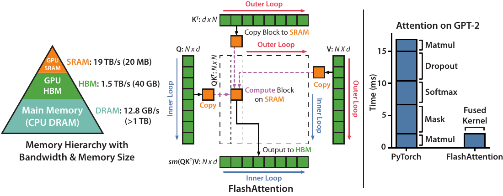
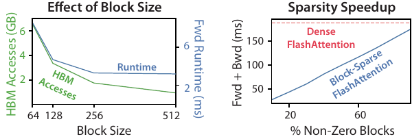
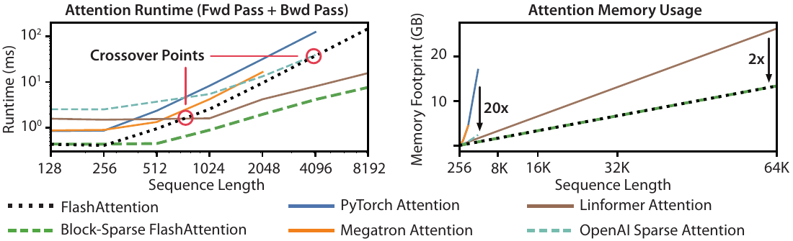
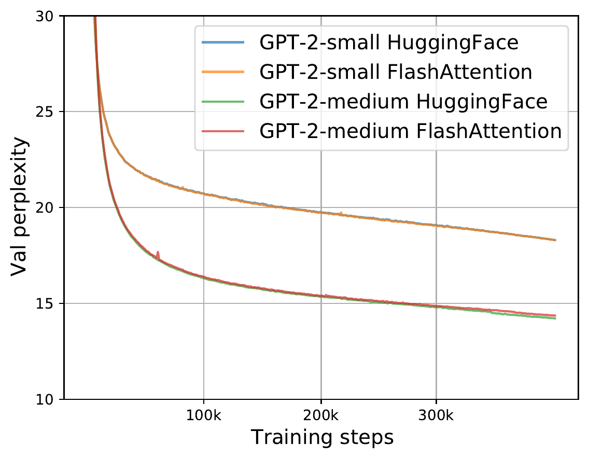
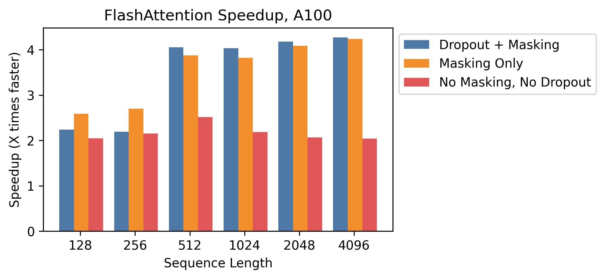
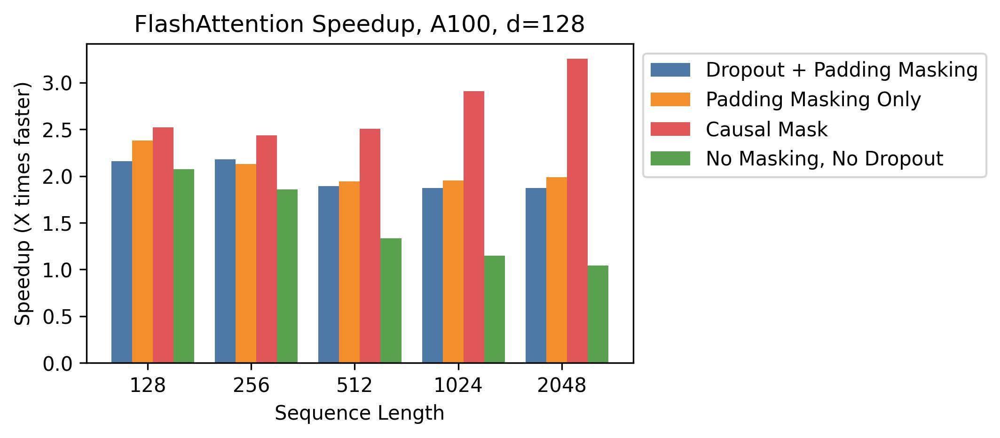
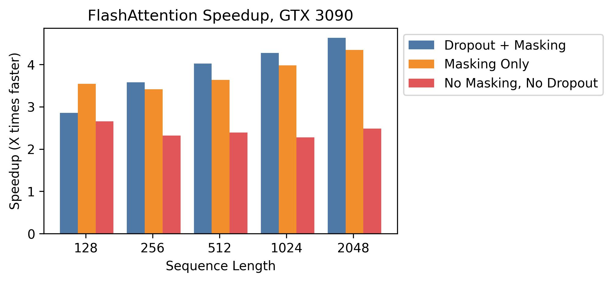
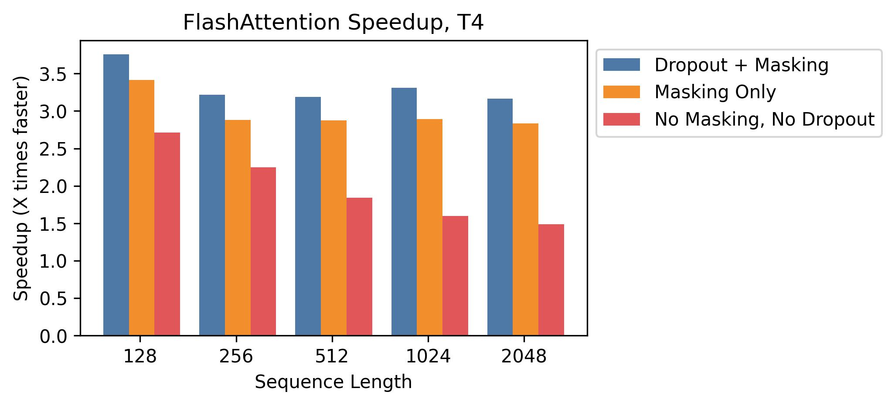
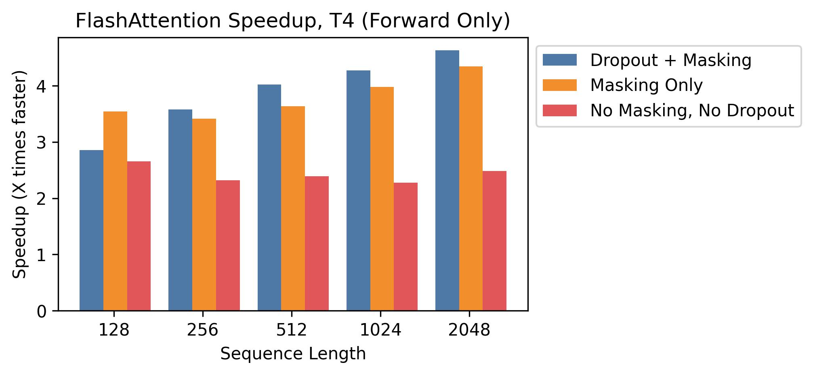

# FlashAttention：快速且内存高效的 IO-Aware 精确注意力

- 原文标题：FlashAttention: Fast and Memory-Efficient Exact Attention with IO-Awareness
- 会议/年份：NeurIPS 2022
- arXiv：2205.14135v2
- 作者与机构：
  - Department of Computer Science, Stanford University：Tri Dao, Daniel Y. Fu, Stefano Ermon, Christopher Ré
  - Department of Computer Science and Engineering, University at Buffalo, SUNY：Atri Rudra
- 联系方式：{trid, danfu}@cs.stanford.edu, ermon@stanford.edu, atri@buffalo.edu, chrismre@cs.stanford.edu

## 摘要

Transformer 在长序列上速度慢且占用大量内存，因为自注意力的时间复杂度和内存复杂度都随序列长度二次增长。近似注意力方法试图通过牺牲模型质量来降低计算复杂度，但往往没有带来端到端的实际加速。我们认为缺失的原则是让注意力算法具备 IO-aware 的性质，也就是把 GPU 内存层级之间的读写纳入算法设计。

我们提出 FlashAttention，这是一种 IO-aware 的精确注意力算法。它使用 tiling 来减少 GPU 高带宽内存（HBM）与 GPU 片上 SRAM 之间的读写次数。我们分析 FlashAttention 的 IO 复杂度，证明它比标准注意力需要更少的 HBM 访问，并且在一系列 SRAM 大小下是最优的。我们还将 FlashAttention 扩展到块稀疏注意力，得到一种比现有近似注意力方法更快的近似注意力算法。

FlashAttention 训练 Transformer 的速度快于现有基线：在 BERT-large 上，相比 MLPerf 1.1 训练速度纪录端到端墙钟时间提升 15%（序列长度 512）；在 GPT-2 上提升 3 倍（序列长度 1K）；在 Long-Range Arena 上提升 2.4 倍（序列长度 1K-4K）。FlashAttention 和块稀疏 FlashAttention 还让 Transformer 可以使用更长上下文，从而获得更高质量的模型：GPT-2 困惑度降低 0.7，长文档分类提升 6.4 个点，并带来全新的能力，即首个在 Path-X 挑战上超过随机水平的 Transformer（序列长度 16K，准确率 61.4%），以及首个在 Path-256 上超过随机水平的 Transformer（序列长度 64K，准确率 63.1%）。

## 1. 引言

Transformer 模型 [1] 已经成为自然语言处理和图像分类等应用中使用最广泛的架构。Transformer 变得越来越大 [2]、越来越深 [3]，但为它们配备更长上下文仍然困难 [4]，因为其核心自注意力模块的时间复杂度和内存复杂度都随序列长度二次增长。一个重要问题是：如果让注意力更快、更省内存，是否能帮助 Transformer 解决长序列上的运行时间和内存挑战。

许多近似注意力方法都试图降低注意力的计算和内存需求。这些方法包括稀疏近似 [5, 6]、低秩近似 [7, 8, 9] 以及二者的组合 [10, 11, 12]。虽然这些方法把计算需求降到了关于序列长度的线性或近线性，但其中很多在墙钟时间上并没有超过标准注意力，因此也没有被广泛采用。一个主要原因是它们关注 FLOP 减少，而 FLOP 未必和墙钟时间相关，并且往往忽略了内存访问（IO）的开销。

在本文中，我们认为缺失的原则是让注意力算法具备 IO-aware 的性质 [13]，也就是仔细核算快慢内存层级之间的读写，例如在快速的 GPU 片上 SRAM 与相对较慢的 GPU 高带宽内存 HBM [14] 之间的读写（见图 1 左）。现代 GPU 的计算速度提升已经超过内存速度提升 [15, 16, 17]，Transformer 中的大多数操作都受到内存访问瓶颈限制 [18]。对于类似的 memory-bound 操作，当读写数据占据运行时间的大部分时，IO-aware 算法一直非常关键，例如数据库 join [19]、图像处理 [20]、数值线性代数 [21] 等 [22, 23]。然而，PyTorch 和 TensorFlow 这类常见深度学习 Python 接口并不允许对内存访问做细粒度控制。

  
   <em>图 1：左：FlashAttention 使用 tiling，避免在相对较慢的 GPU HBM 上物化大的 N x N 注意力矩阵（虚线框）。外层循环遍历 K 和 V 矩阵块并把它们加载到快速片上 SRAM；每个块内再遍历 Q 矩阵块，将其加载到 SRAM，并把注意力计算输出写回 HBM。右：相对 PyTorch 注意力实现，在 GPT-2 上的加速。FlashAttention 不把大的 N x N 注意力矩阵读写到 HBM，因此注意力计算获得 7.6 倍加速。</em>

我们提出 FlashAttention，这是一种新的注意力算法，能够用远少于标准实现的内存访问来计算精确注意力。我们的主要目标是避免把注意力矩阵读入和写出 HBM。这需要做到两点：（i）在无法访问整个输入的情况下计算 softmax 归约；（ii）在反向传播中不存储大的中间注意力矩阵。我们用两个成熟技术解决这些挑战：（i）重构注意力计算，把输入切分成块，并对输入块做多次遍历，从而增量地执行 softmax 归约，这也称为 tiling；（ii）存储前向传播中的 softmax 归一化因子，以便在反向传播中快速在片上重算注意力，这比标准方法从 HBM 读取中间注意力矩阵更快。

我们用 CUDA 实现 FlashAttention，从而获得对内存访问的细粒度控制，并把所有注意力操作融合到一个 GPU kernel 中。虽然重算带来了额外 FLOP，但由于 HBM 访问量大幅减少，我们的算法既运行更快，在 GPT-2 上最高 7.6 倍 [24]（图 1 右），又更省内存，其内存占用关于序列长度线性增长。

我们分析 FlashAttention 的 IO 复杂度 [13]，证明它需要 $O(N^2 d^2 M^{-1})$ 次 HBM 访问，其中 $d$ 是 head 维度，$M$ 是 SRAM 大小；相比之下，标准注意力需要 $\Omega(Nd + N^2)$ 次访问。对于典型的 $d$ 和 $M$，FlashAttention 相比标准注意力需要少得多的 HBM 访问，最多少 9 倍，如图 2 所示。此外，我们给出一个下界，说明没有精确注意力算法能够在所有 SRAM 大小上渐近地改进 HBM 访问次数。

我们还展示 FlashAttention 可以作为一个有用 primitive，帮助释放近似注意力算法的潜力，因为它能克服这些算法中的内存访问开销问题。作为概念验证，我们实现了块稀疏 FlashAttention，这是一种稀疏注意力算法，比 FlashAttention 还快 2-4 倍，并可扩展到 64K 序列长度。我们证明块稀疏 FlashAttention 的 IO 复杂度比 FlashAttention 更好，改进因子与稀疏率成比例。第 7 节还讨论了面向其他操作的扩展，例如多 GPU 上的注意力、kernel regression 和块稀疏矩阵乘法。我们开源 FlashAttention，以便社区基于这个 primitive 继续构建。代码地址为 https://github.com/HazyResearch/flash-attention。

我们通过实验证明 FlashAttention 能加速模型训练，并通过建模更长上下文提升模型质量。我们还对 FlashAttention 和块稀疏 FlashAttention 的运行时间与内存占用进行 benchmark，并与此前的注意力实现比较。

- 训练更快：FlashAttention 在墙钟时间上更快地训练 Transformer。我们训练 BERT-large（序列长度 512）比 MLPerf 1.1 训练速度纪录 [25] 快 15%；训练 GPT-2（序列长度 1K）比 HuggingFace [26] 和 Megatron-LM [27] 的基线实现快 3 倍；在 Long-Range Arena（序列长度 1K-4K）上比基线快 2.4 倍。
- 模型质量更高：FlashAttention 让 Transformer 扩展到更长序列，从而提升质量并带来新能力。我们在 GPT-2 上观察到 0.7 的困惑度改进，在长文档分类 [28] 上因为建模更长序列获得 6.4 个点的提升。FlashAttention 使首个 Transformer 能够仅通过使用更长序列长度（16K）就在 Path-X [4] 挑战上超过随机水平。块稀疏 FlashAttention 进一步让 Transformer 扩展到更长序列（64K），得到首个能在 Path-256 上超过随机水平的模型。
- 注意力 benchmark：在从 128 到 2K 的常见序列长度上，FlashAttention 比标准注意力实现最高快 3 倍，并可扩展到 64K。到序列长度 512 为止，FlashAttention 比任何已有注意力方法都更快、更省内存；而在超过 1K 的序列长度上，一些近似注意力方法（例如 Linformer）开始变得更快。另一方面，块稀疏 FlashAttention 比我们所知的所有已有近似注意力方法都更快。

## 2. 背景

我们先介绍现代硬件（GPU）上常见深度学习操作的性能特征，并描述标准注意力实现。

### 2.1 硬件性能

本文聚焦 GPU。其他硬件加速器上的性能特征也类似 [29, 30]。

**GPU 内存层级。** GPU 内存层级（图 1 左）包含多种不同大小和速度的内存，越小的内存通常越快。例如，A100 GPU 拥有 40-80GB 高带宽内存 HBM，带宽 1.5-2.0TB/s；它的 108 个 streaming multiprocessor 各自有 192KB 片上 SRAM，其带宽估计约为 19TB/s [14, 31]。片上 SRAM 比 HBM 快一个数量级，但容量小很多个数量级。随着计算相对内存速度变得更快 [15, 16, 17]，越来越多操作受到内存（HBM）访问瓶颈限制。因此，利用快速 SRAM 变得更加重要。

**执行模型。** GPU 使用大量线程执行一个操作，这个操作称为 kernel。每个 kernel 都把输入从 HBM 加载到寄存器和 SRAM，完成计算，再把输出写回 HBM。

**性能特征。** 根据计算量与内存访问量之间的平衡，操作可以分为 compute-bound 或 memory-bound。常用度量是算术强度（arithmetic intensity）[22]，也就是每字节内存访问对应的算术操作数。

1. Compute-bound：操作耗时由算术操作数量决定，而访问 HBM 的时间要小得多。典型例子是内维度很大的矩阵乘法，以及通道数很多的卷积。
2. Memory-bound：操作耗时由内存访问次数决定，而计算耗时要小得多。例子包括大多数其他操作：逐元素操作（如 activation、dropout）和归约操作（如 sum、softmax、batch norm、layer norm）。

**Kernel fusion。** 加速 memory-bound 操作最常用的方法是 kernel fusion：如果有多个操作作用于同一输入，就可以只从 HBM 加载一次输入，而不是为每个操作分别加载。编译器可以自动融合许多逐元素操作 [32, 33, 34]。然而，在模型训练中，中间值仍然需要写入 HBM 以供反向传播使用，这降低了朴素 kernel fusion 的效果。

### 2.2 标准注意力实现

给定输入序列 $\mathbf{Q}, \mathbf{K}, \mathbf{V} \in \mathbb{R}^{N \times d}$，其中 $N$ 是序列长度，$d$ 是 head 维度，我们希望计算注意力输出 $\mathbf{O} \in \mathbb{R}^{N \times d}$：

$$
\mathbf{S} = \mathbf{Q} \mathbf{K}^\top \in \mathbb{R}^{N \times N}, \quad
\mathbf{P} = \mathrm{softmax}(\mathbf{S}) \in \mathbb{R}^{N \times N}, \quad
\mathbf{O} = \mathbf{P}\mathbf{V} \in \mathbb{R}^{N \times d},
$$

其中 $\mathrm{softmax}$ 按行应用。

标准注意力实现会把矩阵 $\mathbf{S}$ 和 $\mathbf{P}$ 物化到 HBM，这需要 $O(N^2)$ 内存。通常 $N \gg d$，例如 GPT-2 中 $N = 1024$ 且 $d = 64$。算法 0 描述了标准注意力实现。由于部分或大部分操作都是 memory-bound（例如 softmax），大量内存访问会转化成较慢的墙钟时间。

这个问题会被应用到注意力矩阵上的其他逐元素操作进一步放大，例如作用于 $\mathbf{S}$ 的 masking，或作用于 $\mathbf{P}$ 的 dropout。因此已有许多尝试把多个逐元素操作融合起来，例如把 masking 与 softmax 融合 [27]。

在第 3.2 节中，我们将说明标准注意力实现执行的 HBM 访问次数关于序列长度 $N$ 二次增长。我们还比较标准注意力与 FlashAttention 的 FLOP 数和 HBM 访问次数。

**算法 0：标准注意力实现**

输入：HBM 中的矩阵 $\mathbf{Q}, \mathbf{K}, \mathbf{V} \in \mathbb{R}^{N \times d}$。

1. 按块从 HBM 加载 $\mathbf{Q}, \mathbf{K}$，计算 $\mathbf{S} = \mathbf{Q}\mathbf{K}^\top$，并将 $\mathbf{S}$ 写入 HBM。
2. 从 HBM 读取 $\mathbf{S}$，计算 $\mathbf{P} = \mathrm{softmax}(\mathbf{S})$，并将 $\mathbf{P}$ 写入 HBM。
3. 按块从 HBM 加载 $\mathbf{P}$ 和 $\mathbf{V}$，计算 $\mathbf{O} = \mathbf{P}\mathbf{V}$，并将 $\mathbf{O}$ 写入 HBM。
4. 返回 $\mathbf{O}$。

## 3. FlashAttention：算法、分析与扩展

我们展示如何用更少的 HBM 读写计算精确注意力，并且在反向传播中不存储大的中间矩阵。这得到了一种既省内存、又在墙钟时间上更快的注意力算法。我们分析它的 IO 复杂度，说明它相比标准注意力需要少得多的 HBM 访问。进一步地，我们展示 FlashAttention 可作为一个有用 primitive，并把它扩展到块稀疏注意力。

为方便说明，本节聚焦前向传播；反向传播细节在附录 B。

### 3.1 使用 tiling 与 recomputation 的高效注意力算法

给定 HBM 中的输入 $\mathbf{Q}, \mathbf{K}, \mathbf{V} \in \mathbb{R}^{N \times d}$，目标是计算注意力输出 $\mathbf{O} \in \mathbb{R}^{N \times d}$ 并写入 HBM。我们的目标是减少 HBM 访问量，使其关于 $N$ 次二次。

我们使用两个成熟技术（tiling 与 recomputation）来克服以次二次 HBM 访问量计算精确注意力的技术挑战。算法 1 描述了这一过程。核心思想是：把输入 $\mathbf{Q}, \mathbf{K}, \mathbf{V}$ 切分成块，把它们从慢 HBM 加载到快 SRAM，然后相对于这些块计算注意力输出。只要在累加每个块输出前用正确的归一化因子缩放，最终就能得到正确结果。

**Tiling。** 我们按块计算注意力。Softmax 会耦合 $\mathbf{K}$ 的各列，因此我们用缩放分解大的 softmax [35, 5, 36]。为保证数值稳定，向量 $x \in \mathbb{R}^{B}$ 的 softmax 计算为：

$$
m(x) := \max_i x_i, \quad
f(x) := \begin{bmatrix} e^{x_1 - m(x)} & \cdots & e^{x_B - m(x)} \end{bmatrix}, \quad
\ell(x) := \sum_i f(x)_i, \quad
\mathrm{softmax}(x) := \frac{f(x)}{\ell(x)}.
$$

对于向量 $x^{(1)}, x^{(2)} \in \mathbb{R}^{B}$，可以把拼接向量 $x = \begin{bmatrix} x^{(1)}\\ x^{(2)} \end{bmatrix} \in \mathbb{R}^{2B}$ 的 softmax 分解为：

$$
\begin{aligned}
&m(x)=\max(m(x^{(1)}), m(x^{(2)})), \\
&f(x)=\begin{bmatrix} e^{m(x^{(1)})-m(x)}f(x^{(1)}) & e^{m(x^{(2)})-m(x)}f(x^{(2)}) \end{bmatrix}, \\
&\ell(x)=e^{m(x^{(1)})-m(x)}\ell(x^{(1)}) + e^{m(x^{(2)})-m(x)}\ell(x^{(2)}), \quad
\mathrm{softmax}(x)=\frac{f(x)}{\ell(x)}.
\end{aligned}
$$

因此，只要跟踪额外统计量 $m(x)$ 和 $\ell(x)$，就可以一次处理一个块来计算 softmax。这种聚合方式称为代数聚合（algebraic aggregation）[37]。于是我们把输入 $\mathbf{Q}, \mathbf{K}, \mathbf{V}$ 拆成块，计算 softmax 值及额外统计量，再把结果组合起来。

**Recomputation。** 我们的目标之一是在反向传播中不存储 $O(N^2)$ 个中间值。反向传播通常需要矩阵 $\mathbf{S}, \mathbf{P} \in \mathbb{R}^{N \times N}$ 来计算关于 $\mathbf{Q}, \mathbf{K}, \mathbf{V}$ 的梯度。但是，通过存储输出 $\mathbf{O}$ 和 softmax 归一化统计量 $(m, \ell)$，我们可以在反向传播中从 SRAM 内的 $\mathbf{Q}, \mathbf{K}, \mathbf{V}$ 块轻松重算注意力矩阵 $\mathbf{S}$ 和 $\mathbf{P}$。这可视为一种选择性 gradient checkpointing [38, 39]。虽然 gradient checkpointing 已被建议用于降低最大内存需求 [36]，但我们所知的所有实现都必须用速度换内存。相比之下，即使 FLOP 更多，我们的重算也由于减少 HBM 访问而加速了反向传播（图 2）。完整反向传播描述见附录 B。

**实现细节：kernel fusion。** Tiling 使我们能在一个 CUDA kernel 中实现算法：从 HBM 加载输入，执行所有计算步骤（矩阵乘法、softmax、可选的 masking 与 dropout、矩阵乘法），再把结果写回 HBM。masking 与 dropout 细节见附录 B。这避免了反复从 HBM 读写输入和输出。

**算法 1：FlashAttention**

输入：HBM 中的矩阵 $\mathbf{Q}, \mathbf{K}, \mathbf{V} \in \mathbb{R}^{N \times d}$；大小为 $M$ 的片上 SRAM。

1. 设置块大小 $B_c = \left\lceil \frac{M}{4d} \right\rceil$，$B_r = \min\left(\left\lceil \frac{M}{4d} \right\rceil, d\right)$。
2. 在 HBM 中初始化 $\mathbf{O}=(0)_{N \times d}$、$\ell=(0)_N$、$m=(-\infty)_N$。
3. 将 $\mathbf{Q}$ 划分为 $T_r=\left\lceil\frac{N}{B_r}\right\rceil$ 个大小为 $B_r \times d$ 的块 $\mathbf{Q}_1,\dots,\mathbf{Q}_{T_r}$；将 $\mathbf{K},\mathbf{V}$ 划分为 $T_c=\left\lceil\frac{N}{B_c}\right\rceil$ 个大小为 $B_c \times d$ 的块 $\mathbf{K}_1,\dots,\mathbf{K}_{T_c}$ 与 $\mathbf{V}_1,\dots,\mathbf{V}_{T_c}$。
4. 同样把 $\mathbf{O}$、$\ell$ 和 $m$ 按 $T_r$ 个 row-block 切分。
5. 外层循环遍历 $1 \le j \le T_c$。每次循环先将 $\mathbf{K}_j, \mathbf{V}_j$ 从 HBM 加载到片上 SRAM。
6. 内层循环遍历 $1 \le i \le T_r$。每次循环将 $\mathbf{Q}_i, \mathbf{O}_i, \ell_i, m_i$ 从 HBM 加载到片上 SRAM。
7. 在片上计算 $\mathbf{S}_{ij}=\mathbf{Q}_i\mathbf{K}_j^\top \in \mathbb{R}^{B_r \times B_c}$。
8. 在片上计算 $\tilde{m}_{ij}=\mathrm{rowmax}(\mathbf{S}_{ij})$、$\tilde{\mathbf{P}}_{ij}=\exp(\mathbf{S}_{ij}-\tilde{m}_{ij})$ 和 $\tilde{\ell}_{ij}=\mathrm{rowsum}(\tilde{\mathbf{P}}_{ij})$。
9. 在片上计算 $m_i^{\mathrm{new}}=\max(m_i,\tilde{m}_{ij})$ 与 $\ell_i^{\mathrm{new}}=e^{m_i-m_i^{\mathrm{new}}}\ell_i+e^{\tilde{m}_{ij}-m_i^{\mathrm{new}}}\tilde{\ell}_{ij}$。
10. 将 $\mathbf{O}_i$ 更新并写回 HBM：

$$
\mathbf{O}_i \leftarrow \mathrm{diag}(\ell_i^{\mathrm{new}})^{-1}
\left(\mathrm{diag}(\ell_i)e^{m_i-m_i^{\mathrm{new}}}\mathbf{O}_i + e^{\tilde{m}_{ij}-m_i^{\mathrm{new}}}\tilde{\mathbf{P}}_{ij}\mathbf{V}_j\right).
$$

11. 将 $\ell_i \leftarrow \ell_i^{\mathrm{new}}$、$m_i \leftarrow m_i^{\mathrm{new}}$ 写回 HBM。完成所有内外层循环后，返回 $\mathbf{O}$。

**定理 1。** 算法 1 返回 $\mathbf{O}=\mathrm{softmax}(\mathbf{Q}\mathbf{K}^\top)\mathbf{V}$，需要 $O(N^2d)$ FLOP，并且除输入和输出外只需要 $O(N)$ 额外内存。

### 3.2 分析：FlashAttention 的 IO 复杂度

我们分析 FlashAttention 的 IO 复杂度，说明其相比标准注意力显著减少了 HBM 访问。我们还给出一个下界，证明对于所有 SRAM 大小，没有精确注意力算法能渐近地进一步改进 HBM 访问次数。证明见附录 C。

**定理 2。** 设 $N$ 为序列长度，$d$ 为 head 维度，$M$ 为 SRAM 大小，并满足 $d \leq M \leq Nd$。标准注意力（算法 0）需要 $\Theta(Nd + N^2)$ 次 HBM 访问，而 FlashAttention（算法 1）需要 $\Theta(N^2 d^2 M^{-1})$ 次 HBM 访问。

对于 $d$（64-128）和 $M$（约 100KB）的典型取值，$d^2$ 比 $M$ 小很多倍，因此 FlashAttention 比标准实现需要少很多 HBM 访问。这会同时带来更快执行和更低内存占用，我们在第 4.3 节中验证这一点。

证明的主要思想是：给定 SRAM 大小 $M$，可以加载大小为 $\Theta(M)$ 的 $\mathbf{K}, \mathbf{V}$ 块。对于每个 $\mathbf{K}, \mathbf{V}$ 块，我们遍历所有 $\mathbf{Q}$ 块来计算中间值，导致对 $\mathbf{Q}$ 做 $\Theta(NdM^{-1})$ 次遍历。每次遍历加载 $\Theta(Nd)$ 个元素，总计 $\Theta(N^2 d^2 M^{-1})$ 次 HBM 访问。我们同样证明，标准注意力的反向传播需要 $\Theta(Nd + N^2)$ 次 HBM 访问，而 FlashAttention 的反向传播需要 $\Theta(N^2 d^2 M^{-1})$ 次访问（附录 B）。

我们证明一个下界：在计算精确注意力时，不可能对所有 $M$（SRAM 大小）都渐近地改进 HBM 访问次数。

**命题 1。** 设 $N$ 为序列长度，$d$ 为 head 维度，$M$ 为 SRAM 大小，并满足 $d \leq M \leq Nd$。不存在一种算法能够在区间 $[d, Nd]$ 内的所有 $M$ 上，以 $o(N^2d^2M^{-1})$ 次 HBM 访问计算精确注意力。

证明依赖这样一个事实：当 $M = \Theta(Nd)$ 时，任何算法都必须执行 $\Omega(N^2d^2M^{-1}) = \Omega(Nd)$ 次 HBM 访问。这类在 $M$ 的子区间上成立的下界在 streaming algorithms 文献中很常见 [40]。我们把证明关于 $M$ 的参数化复杂性 [41] 下界作为令人兴奋的未来工作。

我们验证了 HBM 访问次数是注意力运行时间的主要决定因素。图 2 左显示，虽然 FlashAttention 比标准注意力有更高 FLOP 数（因为反向传播中有重算），但它有少得多的 HBM 访问，因此运行时间快得多。图 2 中，我们改变 FlashAttention 的块大小 $B_c$，从而得到不同 HBM 访问量，并测量前向传播运行时间。随着块大小增加，HBM 访问次数下降（因为对输入的遍历更少），运行时间也下降。当块足够大（超过 256）后，运行时间转而受其他因素限制，例如算术操作。此外，更大的块大小也放不进小容量 SRAM。

  
   <em>图 2：左：A100 GPU 上，GPT-2 medium（序列长度 1024、head 维度 64、16 个 head、batch size 64）的标准注意力与 FlashAttention 前向+反向运行时间。HBM 访问是影响运行时间的主要因素。中：A100 GPU 上 FlashAttention 前向运行时间；更少 HBM 访问带来更快运行，直到其他瓶颈出现。右：序列长度 4K 时，块稀疏 FlashAttention 的运行时间相对 FlashAttention 的加速与稀疏率成比例。</em>

### 3.3 扩展：块稀疏 FlashAttention

我们把 FlashAttention 扩展到近似注意力：提出块稀疏 FlashAttention，其 IO 复杂度比 FlashAttention 低一个与稀疏率成比例的因子。

给定输入 $\mathbf{Q}, \mathbf{K}, \mathbf{V} \in \mathbb{R}^{N \times d}$ 和掩码矩阵 $\tilde{\mathbf{M}} \in \{0,1\}^{N \times N}$，我们要计算：

$$
\mathbf{S}=\mathbf{Q}\mathbf{K}^\top, \quad
\mathbf{P}=\mathrm{softmax}(\mathbf{S} \odot \mathbb{1}_{\tilde{\mathbf{M}}}), \quad
\mathbf{O}=\mathbf{P}\mathbf{V},
$$

其中当 $\tilde{\mathbf{M}}_{kl}=1$ 时，$(\mathbf{S} \odot \mathbb{1}_{\tilde{\mathbf{M}}})_{kl}=\mathbf{S}_{kl}$；当 $\tilde{\mathbf{M}}_{kl}=0$ 时，它为 $-\infty$。我们要求 $\tilde{\mathbf{M}}$ 具有块结构：对某些块大小 $B_r, B_c$，任意 $k,l$ 都有 $\tilde{\mathbf{M}}_{k,l}=\mathbf{M}_{ij}$，其中 $i=\lfloor k/B_r \rfloor$，$j=\lfloor l/B_c \rfloor$，且 $\mathbf{M} \in \{0,1\}^{N/B_r \times N/B_c}$。

给定预定义块稀疏掩码 $\mathbf{M}$ 后，可以很容易地调整算法 1，使它只计算注意力矩阵中的非零块。该算法与算法 1 相同，只是跳过零块。完整算法在附录 D 的算法 5 中给出。

**命题 2。** 设 $N$ 为序列长度，$d$ 为 head 维度，$M$ 为 SRAM 大小，且 $d \leq M \leq Nd$。块稀疏 FlashAttention（算法 5）需要 $\Theta(Nd + N^2 d^2 M^{-1}s)$ 次 HBM 访问，其中 $s$ 是块稀疏掩码中非零块的比例。

可以看到，应用块稀疏后，IO 复杂度中较大的项直接按稀疏率得到改进。对于较大的序列长度 $N$，$s$ 常设为 $N^{-1/2}$ [42] 或 $N^{-1}\log N$ [11, 10, 43]，从而得到 $\Theta(N\sqrt{N})$ 或 $\Theta(N\log N)$ 的 IO 复杂度。下游实验中，我们使用固定 butterfly 稀疏模式 [43]；已有工作表明它能近似任意稀疏模式 [44]。

图 2 右验证了随着稀疏性增加，块稀疏 FlashAttention 的运行时间按比例改善。在 LRA benchmark 上，块稀疏 FlashAttention 达到 2.8 倍加速，同时性能与标准注意力相当（第 4 节）。

## 4. 实验

我们评估使用 FlashAttention 训练 Transformer 模型的影响。我们验证关于训练时间和模型准确率的两个主张，并报告注意力运行时间与内存 benchmark。额外实验细节见附录 E。

- 训练速度：FlashAttention 在 BERT 上比 MLPerf 1.1 [25] 速度纪录快 15%，在 GPT-2 上相比 HuggingFace [26] 快最高 3 倍、相比 Megatron [27] 快 1.8 倍，并在 LRA benchmark 上加速 2.4 倍。
- 质量：FlashAttention 让 Transformer 可扩展到更长序列，从而提高质量。FlashAttention 训练上下文长度 4K 的 GPT-2，比 Megatron 训练上下文长度 1K 的 GPT-2 更快，同时困惑度好 0.7。在两个长文档分类任务上，建模更长序列带来 6.4 个点的提升。最后，FlashAttention 得到了第一个能在困难 Path-X 任务（序列长度 16K）上超过随机水平的 Transformer；块稀疏 FlashAttention 得到了我们所知第一个能在 Path-256（序列长度 64K）上超过随机水平的序列模型。
- 注意力 benchmark：我们按序列长度测量 FlashAttention 和块稀疏 FlashAttention 的运行时间与内存性能。我们确认 FlashAttention 内存占用随序列长度线性增长，并且在常见序列长度（最高 2K）上比标准注意力最高快 3 倍。我们确认块稀疏 FlashAttention 的运行时间随序列长度线性增长，并且比所有已有近似注意力基线都更快。

### 4.1 使用 FlashAttention 得到更快模型

**BERT。** FlashAttention 得到了我们所知最快的单节点 BERT 训练速度。我们使用 FlashAttention 在 Wikipedia 上训练 BERT-large [45]。表 1 比较了我们的训练时间与 Nvidia 实现，该实现曾创造 MLPerf 1.1 训练速度纪录 [25]。我们的实现快 15%。

表 1：BERT-large 训练时间。模型从 MLPerf benchmark 提供的相同初始化开始，达到 masked language modeling 72.0% 目标准确率；结果为 8 x A100 GPU 上 10 次运行的平均值。

| BERT 实现 | 训练时间（分钟） |
| --- | ---: |
| Nvidia MLPerf 1.1 [25] | 20.0 ± 1.5 |
| FlashAttention（ours） | **17.4 ± 1.4** |

**GPT-2。** 在大型 OpenWebText 数据集 [46] 上，FlashAttention 训练 GPT-2 [24] 比广泛使用的 HuggingFace [26] 和 Megatron-LM [27] 实现更快。表 2 显示，相比 HuggingFace 端到端最高加速 3 倍，相比 Megatron-LM 加速 1.7 倍。由于我们不改变模型定义，FlashAttention 与另外两个实现达到相同困惑度。附录 E 给出了训练期间验证困惑度曲线，确认 FlashAttention 与基线同样数值稳定，并产生相同的训练/验证曲线。

表 2：使用 FlashAttention 的 GPT-2 small 和 medium 相比 HuggingFace 实现最高加速 3 倍，相比 Megatron-LM 最高加速 1.7 倍。训练时间在 8 x A100 GPU 上报告。

| 模型实现 | OpenWebText（ppl） | 训练时间（加速） |
| --- | ---: | ---: |
| GPT-2 small - HuggingFace [26] | 18.2 | 9.5 天（1.0x） |
| GPT-2 small - Megatron-LM [27] | 18.2 | 4.7 天（2.0x） |
| GPT-2 small - FlashAttention | 18.2 | **2.7 天（3.5x）** |
| GPT-2 medium - HuggingFace [26] | 14.2 | 21.0 天（1.0x） |
| GPT-2 medium - Megatron-LM [27] | 14.3 | 11.5 天（1.8x） |
| GPT-2 medium - FlashAttention | 14.3 | **6.9 天（3.0x）** |

**Long-Range Arena。** 我们在 Long-Range Arena（LRA [4]）benchmark 上比较 vanilla Transformer（使用标准实现或 FlashAttention）。我们测量所有模型的准确率、吞吐量和训练时间。每个任务的序列长度不同，在 1024 到 4096 之间。我们沿用 Tay 等人 [4] 和 Xiong 等人 [47] 的实现与实验设置。LRA 准确率已知高度依赖调参流程 [47]；我们复现的基线优于原始比较 [4] 中报告的结果。表 3 显示，FlashAttention 相比标准注意力最高加速 2.4 倍。块稀疏 FlashAttention 比我们测试的所有近似注意力方法都更快。

表 3：标准注意力、FlashAttention、块稀疏 FlashAttention 与近似注意力基线在 Long-Range-Arena benchmark 上的表现。

| 模型 | ListOps | Text | Retrieval | Image | Pathfinder | Avg | Speedup |
| --- | ---: | ---: | ---: | ---: | ---: | ---: | ---: |
| Transformer | 36.0 | 63.6 | 81.6 | 42.3 | 72.7 | 59.3 | - |
| FlashAttention | 37.6 | 63.9 | 81.4 | 43.5 | 72.7 | 59.8 | 2.4x |
| Block-sparse FlashAttention | 37.0 | 63.0 | 81.3 | 43.6 | 73.3 | 59.6 | **2.8x** |
| Linformer [7] | 35.6 | 55.9 | 77.7 | 37.8 | 67.6 | 54.9 | 2.5x |
| Linear Attention [8] | 38.8 | 63.2 | 80.7 | 42.6 | 72.5 | 59.6 | 2.3x |
| Performer [9] | 36.8 | 63.6 | 82.2 | 42.1 | 69.9 | 58.9 | 1.8x |
| Local Attention [4] | 36.1 | 60.2 | 76.7 | 40.6 | 66.6 | 56.0 | 1.7x |
| Reformer [5] | 36.5 | 63.8 | 78.5 | 39.6 | 69.4 | 57.6 | 1.3x |
| Smyrf [48] | 36.1 | 64.1 | 79.0 | 39.6 | 70.5 | 57.9 | 1.7x |

### 4.2 更长序列带来更好模型

**长上下文语言建模。** FlashAttention 的运行时间和内存效率让我们可以把 GPT-2 上下文长度增加 4 倍，同时仍然比 Megatron-LM 的优化实现更快。表 4 显示，使用 FlashAttention、上下文长度 4K 的 GPT-2，相比 Megatron 中上下文长度 1K 的 GPT-2 仍快 30%，并且困惑度好 0.7。

表 4：使用 FlashAttention 的 GPT-2 small，在上下文长度比 Megatron-LM 大 4 倍时仍快 30%，并获得 0.7 更好的困惑度。训练时间在 8 x A100 GPU 上报告。

| 模型实现 | 上下文长度 | OpenWebText（ppl） | 训练时间（加速） |
| --- | ---: | ---: | ---: |
| GPT-2 small - Megatron-LM | 1k | 18.2 | 4.7 天（1.0x） |
| GPT-2 small - FlashAttention | 1k | 18.2 | **2.7 天（1.7x）** |
| GPT-2 small - FlashAttention | 2k | 17.6 | 3.0 天（1.6x） |
| GPT-2 small - FlashAttention | 4k | **17.5** | 3.6 天（1.3x） |

**长文档分类。** 使用 FlashAttention 以更长序列训练 Transformer，可以提升 MIMIC-III [49] 和 ECtHR [50, 51] 数据集上的性能。MIMIC-III 包含 ICU 患者出院小结，每个文档带有多标签标注。ECtHR 包含欧洲人权法院法律案例，每个案例映射到被指称违反的人权公约条款。这两个数据集都包含很长的文本文档；MIMIC 平均 token 数为 2,395，最长文档含 14,562 个 token；ECtHR 的平均与最长 token 数分别为 2,197 和 49,392。我们评估增加预训练 RoBERTa 模型 [52] 序列长度带来的 lift；位置 embedding 按 Longformer [10] 的方式重复。

表 5 显示，序列长度 16K 在 MIMIC 上比 512 长度高 4.3 个点，序列长度 8K 在 ECtHR 上比 512 长度高 8.5 个点。差异可能来自微妙的分布偏移：MIMIC-III 包含专业医学文本，因此可能更容易受到文档长度上的分布偏移影响；而 ECtHR 包含通用语言。

表 5：使用 FlashAttention 时，不同序列长度下的长文档性能（micro $F_1$）。

| 数据集 | 512 | 1024 | 2048 | 4096 | 8192 | 16384 |
| --- | ---: | ---: | ---: | ---: | ---: | ---: |
| MIMIC-III [49] | 52.8 | 50.7 | 51.7 | 54.6 | 56.4 | **57.1** |
| ECtHR [50] | 72.2 | 74.3 | 77.1 | 78.6 | **80.7** | 79.2 |

**Path-X 与 Path-256。** Path-X 和 Path-256 是 Long-Range Arena benchmark 中的困难任务，旨在测试长上下文。任务是判断黑白 128 x 128（或 256 x 256）图像中的两个点之间是否有路径相连，图像按一次一个像素输入给 Transformer。此前工作中，所有 Transformer 模型要么内存耗尽，要么只能达到随机表现 [4]。已有研究在寻找能够建模这种长上下文的替代架构 [53]。我们在这里给出首个 Transformer 模型能够解决 Path-X 和 Path-256 的结果（表 6）。我们先在 Path-64 上预训练 Transformer，然后通过空间插值位置 embedding 迁移到 Path-X。FlashAttention 在 Path-X 上达到 61.4 准确率。此外，块稀疏 FlashAttention 让 Transformer 能够扩展到 64K 序列长度，在 Path-256 上达到 63.1 准确率。Path-256 需要更长序列，但路径相对 Path-X 更短，因此更容易获得更高准确率。

表 6：首个能在 Path-X 和 Path-256 上达到非随机表现的 Transformer 模型。

| 模型 | Path-X | Path-256 |
| --- | ---: | ---: |
| Transformer | × | × |
| Linformer [7] | × | × |
| Linear Attention [8] | × | × |
| Performer [9] | × | × |
| Local Attention [4] | × | × |
| Reformer [5] | × | × |
| SMYRF [48] | × | × |
| FlashAttention | **61.4** | × |
| Block-sparse FlashAttention | 56.0 | **63.1** |

### 4.3 注意力 benchmark

我们改变序列长度，在一块拥有 40GB HBM 的 A100 GPU 上测量 FlashAttention 和块稀疏 FlashAttention 相比多种注意力基线的运行时间和内存用量，设置中包含 dropout 和 padding mask。我们与精确注意力、近似注意力和稀疏注意力的参考实现比较。正文中只报告基线的子集；附录 E 包含更多基线和完整细节。

  
   <em>图 3：左：前向传播+反向传播运行时间。右：注意力内存用量。</em>

**运行时间。** 图 3 左报告了 FlashAttention 和块稀疏 FlashAttention 相比精确、近似和稀疏注意力基线的前向+反向运行时间（毫秒）；精确数字见附录 E。运行时间随序列长度二次增长，但 FlashAttention 显著快于精确注意力基线，最高比 PyTorch 实现快 3 倍。许多近似/稀疏注意力机制的运行时间随序列长度线性增长，但由于内存访问更少，FlashAttention 在短序列上仍比近似和稀疏注意力更快。近似注意力的运行时间在序列长度 512 到 1024 之间开始与 FlashAttention 交叉。另一方面，块稀疏 FlashAttention 在所有序列长度上都比我们所知的所有精确、稀疏和近似注意力实现更快。

**内存占用。** 图 3 右显示 FlashAttention 与块稀疏 FlashAttention 相比多种精确、近似和稀疏注意力基线的内存占用。FlashAttention 与块稀疏 FlashAttention 具有相同内存占用，并随序列长度线性增长。FlashAttention 比精确注意力基线最高省内存 20 倍，也比近似注意力基线更省内存。除 Linformer 之外，其他所有算法都会在 A100 GPU 上于 64K 之前内存耗尽，而 FlashAttention 仍比 Linformer 省内存 2 倍。

## 5. 局限性与未来方向

我们讨论方法的局限性和未来方向。相关工作见附录 A。

**编译到 CUDA。** 当前构建 IO-aware 注意力实现的方法要求为每个新的注意力实现编写新的 CUDA kernel。这需要用比 PyTorch 低得多的语言编写注意力算法，也需要大量工程努力。实现也未必能跨 GPU 架构迁移。这些局限说明我们需要一种方法，支持用高级语言（例如 PyTorch）编写注意力算法，再编译为 CUDA 中的 IO-aware 实现；这类似图像处理中的 Halide [20] 等努力。

**IO-aware 深度学习。** 我们相信 IO-aware 方法可以扩展到注意力之外。注意力是 Transformer 中最占内存的计算，但深度网络中的每一层都会触碰 GPU HBM。我们希望本文能够激发更多模块的 IO-aware 实现。附录 D 讨论了这些潜在扩展。

**多 GPU IO-aware 方法。** 我们的 IO-aware 注意力实现在单 GPU 上计算注意力时，在常数因子内是最优的。然而，注意力计算可能可以跨多 GPU 并行 [54]。使用多 GPU 会给 IO 分析增加另一层：需要核算 GPU 之间的数据传输。我们希望本文能激发这一方向的后续研究。

### 致谢

我们的实现以 Apex 的 FMHA 代码（https://github.com/NVIDIA/apex/tree/master/apex/contrib/csrc/fmha）为起点。我们感谢 Young-Jun Ko 对其 FMHA 实现的深入解释，以及他对我们关于 CUDA 问题的周到回答。我们感谢 Sabri Eyuboglu、Megan Leszczynski、Laurel Orr、Yuhuai Wu、Beidi Chen 和 Xun Huang 对论文早期草稿提出的建设性反馈和建议。我们感谢 Markus Rabe 和 Charles Staats 就他们的注意力算法进行的有益讨论。

我们感谢 NIH U54EB020405（Mobilize）、NSF CCF1763315（Beyond Sparsity）、CCF1563078（Volume to Velocity）和 1937301（RTML）、ARL W911NF-21-2-0251（Interactive Human-AI Teaming）、ONR N000141712266（Unifying Weak Supervision）、ONR N00014-20-1-2480（Understanding and Applying Non-Euclidean Geometry in Machine Learning）、N000142012275（NEPTUNE）、NXP、Xilinx、LETI-CEA、Intel、IBM、Microsoft、NEC、Toshiba、TSMC、ARM、Hitachi、BASF、Accenture、Ericsson、Qualcomm、Analog Devices、Google Cloud、Salesforce、Total、HAI-GCP 与 HAI-Azure Cloud Credits for Research program、Stanford Data Science Initiative（SDSI）、美国国防部通过 National Defense Science and Engineering Graduate Fellowship（NDSEG）Program，以及 Stanford DAWN 项目成员 Facebook、Google 和 VMWare 的支持。尽管有任何版权声明，美国政府被授权为政府目的复制和分发重印本。本文材料中表达的任何观点、发现、结论或建议均属于作者，并不一定反映 NIH、ONR 或美国政府的观点、政策或认可。Atri Rudra 的研究由 NSF grant CCF-1763481 支持。

## 附录 A. 相关工作

**IO-aware 运行时优化。** 针对快/慢内存读写进行优化这一宽泛概念在计算机科学中有很长历史，并且以许多名称出现过。本文与 I/O 复杂度分析文献建立最直接联系 [13]，但内存层级概念是基础性的，并以多种形式出现：working set model [55]、数据局部性 [56]、算术强度的 Roofline 模型 [22]、可扩展性分析 [57]，以及计算机体系结构标准教材中的处理 [23]。我们希望本文鼓励社区在深度学习栈的更多部分采用这些思想。

**使用结构化矩阵的高效 ML 模型。** 矩阵乘法是大多数机器学习模型的核心计算瓶颈。为降低计算复杂度，已有大量方法学习更高效的矩阵集合。这些矩阵称为结构化矩阵，它们对 $n \times n$ 维度具有次二次（$o(n^2)$）参数量和运行时间。最常见的结构化矩阵例子包括稀疏矩阵和低秩矩阵，以及信号处理中常见的快速变换（Fourier、Chebyshev、sine/cosine、orthogonal polynomials）。机器学习中还提出过几类更一般的结构化矩阵：Toeplitz-like [58]、low-displacement rank [59]、quasi-separable [60]。我们用于块稀疏注意力的 butterfly 模式受到以下事实启发：butterfly 矩阵 [61, 62] 及其乘积已经被证明能够以几乎最优的运行时间和参数数量表达任意结构化矩阵 [63, 44]。然而，尽管结构化矩阵在理论上高效，但它们并没有被广泛采用，因为很难把这种效率转化为墙钟加速；原因是无约束稠密矩阵乘法拥有高度优化的实现，这种现象被称为 hardware lottery [64]。butterfly 矩阵的扩展 [43, 65] 旨在让 butterfly 矩阵对硬件更友好。

**稀疏训练。** 块稀疏 FlashAttention 可视为朝更高效稀疏模型训练迈出的一步。稀疏模型在通过稀疏化权重矩阵来压缩推理模型方面已经取得成功，例如 pruning [66, 67, 68, 69, 70]。对于模型训练，彩票假说 [71, 72, 73] 指出，从较大的稠密网络中可导出一组小的子网络，其表现与原始稠密网络相当。我们的块稀疏 FlashAttention 也可以看作注意力语境中的固定 lottery ticket：我们在训练期间把稀疏模式固定为 butterfly 模式，并观察到它在 Long-Range Arena 任务上的表现几乎与稠密 FlashAttention 一样好。

**高效 Transformer。** 基于 Transformer 的模型已经成为自然语言处理 [45] 和计算机视觉 [74, 75] 中最广泛使用的架构。然而，其计算瓶颈之一是时间和内存都随序列长度二次增长。已有许多方法试图克服这一瓶颈，包括基于 hashing 的近似（即稀疏）方法，例如 Reformer [5] 和 Smyrf [48]，以及低秩近似方法，例如 Performer [9, 76]。还可以组合稀疏和低秩近似以获得更高准确率，例如 Longformer [10]、BigBird [11]、Scatterbrain [12]、Long-short transformer [77] 和 Combiner [78]。其他方法包括沿序列维度压缩，使模型一次 attend 到多个 token [79, 80, 81, 82]。也可以 attend 到前序序列状态以延长上下文，例如 Transformer-XL [83] 和 Compressive Transformer [84]。更多细节可参见 survey [85]。

还有几条研究线尝试开发 attention 之外的模块来建模更长上下文。HiPPO [86] 及其扩展，尤其是 S4 [87, 53, 88]，把历史投影到多项式基上，使模型能够通过状态空间模型准确重构历史。它们结合了 CNN（训练高效）、RNN（推理高效）和连续模型（对采样率变化鲁棒）的优点。LambdaNetworks [89]、AFT [90] 和 FLASH [91] 是在图像分类和语言建模语境中替换注意力的其他尝试。

## 附录 B. 算法细节

我们先推导注意力的前向传播和反向传播，并说明它们可以以内存高效的方式计算，即额外内存关于序列长度线性而非二次。虽然这些推导降低了所需额外内存，朴素实现仍会导致二次 HBM 访问，因此运行速度较慢。随后我们描述 FlashAttention 算法如何在 GPU 上实现前向和反向传播，并减少 HBM 访问，从而同时获得更快运行时间和更小内存占用。

### B.1 内存高效的前向传播

让注意力内存高效的主要挑战是 softmax 会耦合 $\mathbf{K}$ 的列（以及 $\mathbf{V}$ 的列）。我们的方法是单独计算 softmax 归一化常数，从而解耦各列。这一技术 [35] 已在文献 [5, 36] 中用于说明注意力计算不需要二次额外内存，尽管 HBM 访问次数仍然是二次的，因而运行时间较慢。

为简化说明，这里省略 softmax 中的 max-shifting 步骤。附录 B.3 的完整算法包含所有步骤。

回忆给定输入序列 $\mathbf{Q}, \mathbf{K}, \mathbf{V} \in \mathbb{R}^{N \times d}$，我们要计算注意力输出 $\mathbf{O} \in \mathbb{R}^{N \times d}$：

$$
\mathbf{S}=\mathbf{Q}\mathbf{K}^\top, \quad
\mathbf{P}=\mathrm{softmax}(\mathbf{S}), \quad
\mathbf{O}=\mathbf{P}\mathbf{V}.
$$

有 $S_{ij}=q_i^T k_j$，其中 $q_i$ 和 $k_j$ 分别是 $\mathbf{Q}$ 和 $\mathbf{K}$ 的第 $i$ 与第 $j$ 个向量。定义 softmax 归一化常数：

$$
L_i = \sum_j e^{q_i^T k_j}. \tag{1}
$$

令 $v_j$ 为 $\mathbf{V}$ 的第 $j$ 个向量，则输出的第 $i$ 个向量为：

$$
o_i = P_{i:}\mathbf{V} = \sum_j P_{ij}v_j = \sum_j \frac{e^{q_i^T k_j}}{L_i}v_j. \tag{2}
$$

可以看到，一旦 $L_i$ 已计算出来，就能通过反复累加 $\frac{e^{q_i^T k_j}}{L_i}v_j$ 来计算 $o_i$，而不需要额外内存。因此，前向传播可用 $O(n)$ 额外内存计算：先按式 (1) 计算所有 $L_i$，这需要 $O(n)$ 额外内存；再按式 (2) 计算所有 $o_i$，这需要 $O(d)$ 额外内存。

### B.2 内存高效的反向传播

我们推导注意力反向传播，并说明它也可用线性内存计算。Rabe 和 Staats [36] 建议对内存高效前向传播应用 gradient checkpointing，从而在没有二次额外内存的情况下执行反向传播。我们则直接推导反向传播，并说明它如何以内存高效方式计算。

假设有标量损失函数 $\phi$，令输出梯度为 $\mathbf{dO} \in \mathbb{R}^{n \times d}$，其中 $\mathbf{dO}$ 表示 $\frac{\partial \phi}{\partial \mathbf{O}}$。我们希望计算输入梯度 $\mathbf{dQ}, \mathbf{dK}, \mathbf{dV} \in \mathbb{R}^{n \times d}$。

梯度 $\mathbf{dV}$ 很直接。手工应用反向模式自动微分（即链式法则）得到矩阵形式 $\mathbf{dV}=\mathbf{P}^T\mathbf{dO}$。因此：

$$
dv_j = \sum_i P_{ij}do_i = \sum_i \frac{e^{q_i^T k_j}}{L_i}do_i. \tag{3}
$$

由于我们已经计算了 $L_i$，$dv_j$ 可通过重复累加、无需额外内存地计算。

梯度 $\mathbf{dQ}$ 和 $\mathbf{dK}$ 稍复杂。先处理 $\mathbf{dP}$ 和 $\mathbf{dS}$。由式 (2) 可得 $\mathbf{dP}=\mathbf{dO}\mathbf{V}^T$，所以：

$$
dP_{ij}=do_i^Tv_j.
$$

回忆 $P_{i:}=\mathrm{softmax}(S_{i:})$。利用 $y=\mathrm{softmax}(x)$ 的 Jacobian 为 $\mathrm{diag}(y)-yy^T$，得到：

$$
dS_{i:}=(\mathrm{diag}(P_{i:})-P_{i:}P_{i:}^T)dP_{i:}=P_{i:}\circ dP_{i:}-(P_{i:}^TdP_{i:})P_{i:},
$$

其中 $\circ$ 表示逐点乘法。定义：

$$
D_i=P_{i:}^TdP_{i:}=\sum_j \frac{e^{q_i^Tk_j}}{L_i}do_i^Tv_j=do_i^T\sum_j \frac{e^{q_i^\top k_j}}{L_i}v_j=do_i^To_i. \tag{4}
$$

于是：

$$
dS_{i:}=P_{i:}\circ dP_{i:}-D_iP_{i:}, \quad
dS_{ij}=P_{ij}(dP_{ij}-D_i).
$$

现在可以得到 $\mathbf{dQ}$ 和 $\mathbf{dK}$。由于 $S_{ij}=q_i^Tk_j$，有：

$$
dq_i=\sum_j dS_{ij}k_j=\sum_j P_{ij}(dP_{ij}-D_i)k_j=\sum_j \frac{e^{q_i^Tk_j}}{L_i}(do_i^Tv_j-D_i)k_j, \tag{5}
$$

类似地：

$$
dk_j=\sum_i dS_{ij}q_i=\sum_i P_{ij}(dP_{ij}-D_i)q_i=\sum_i \frac{e^{q_i^Tk_j}}{L_i}(do_i^Tv_j-D_i)q_i. \tag{6}
$$

因此，反向传播也能用 $O(n)$ 额外内存计算：按式 (3) 计算所有 $dv_j$，需要 $O(d)$ 额外内存；按式 (4) 计算所有 $D_i$，需要 $O(n)$；按式 (5) 计算所有 $dq_i$，需要 $O(d)$；按式 (6) 计算所有 $dk_j$，需要 $O(d)$。

### B.3 FlashAttention 前向传播

我们描述 FlashAttention 前向传播完整细节。给定输入序列 $\mathbf{Q}, \mathbf{K}, \mathbf{V} \in \mathbb{R}^{N \times d}$，我们希望计算注意力输出 $\mathbf{O} \in \mathbb{R}^{N \times d}$：

$$
\begin{aligned}
&\mathbf{S}=\tau\mathbf{Q}\mathbf{K}^\top, \quad
\mathbf{S}^{\mathrm{masked}}=\operatorname{mask}(S), \quad
\mathbf{P}=\mathrm{softmax}(\mathbf{S}^{\mathrm{masked}}), \\
&\mathbf{P}^{\mathrm{dropped}}=\mathrm{dropout}(\mathbf{P},p_\mathrm{drop}), \quad
\mathbf{O}=\mathbf{P}^{\mathrm{dropped}}\mathbf{V},
\end{aligned}
$$

其中 $\tau \in \mathbb{R}$ 是 softmax scaling，通常为 $\frac{1}{\sqrt{d}}$；$\operatorname{mask}$ 是某种 masking 函数，将输入中的一些项置为 $-\infty$，其余项保持不变，例如 batch 中序列长度不同时的 key padding mask；$\mathrm{dropout}(x,p)$ 对 $x$ 逐元素应用 dropout，即每个元素以概率 $1-p$ 输出 $\frac{x}{1-p}$，以概率 $p$ 输出 0。

完整算法见算法 2。我们保存输出 $\mathbf{O}$、softmax 统计量 $\ell$ 和 $m$，以及伪随机数生成器状态 $\mathcal{R}$，供反向传播使用。

**算法 2：FlashAttention 前向传播**

输入：HBM 中的 $\mathbf{Q}, \mathbf{K}, \mathbf{V} \in \mathbb{R}^{N \times d}$；大小为 $M$ 的片上 SRAM；softmax scaling 常数 $\tau$；masking 函数 $\operatorname{mask}$；dropout 概率 $p_\mathrm{drop}$。

1. 初始化伪随机数生成器状态 $\mathcal{R}$ 并保存到 HBM。
2. 设置 $B_c=\left\lceil\frac{M}{4d}\right\rceil$，$B_r=\min(\left\lceil\frac{M}{4d}\right\rceil,d)$。
3. 在 HBM 中初始化 $\mathbf{O}$、$\ell$ 和 $m$。
4. 按 $B_r$ 和 $B_c$ 将 $\mathbf{Q},\mathbf{K},\mathbf{V},\mathbf{O},\ell,m$ 切成块。
5. 对每个 $\mathbf{K}_j,\mathbf{V}_j$ 块，加载到 SRAM；再对每个 $\mathbf{Q}_i$ 块，在片上计算 $\tau\mathbf{Q}_i\mathbf{K}_j^T$，应用 mask，计算稳定 softmax 的局部 rowmax、指数项和 rowsum，更新全局 $m_i$ 与 $\ell_i$，应用 dropout，并按归一化后的块结果更新 $\mathbf{O}_i$。
6. 返回 $\mathbf{O},\ell,m,\mathcal{R}$。

### B.4 FlashAttention 反向传播

我们描述 FlashAttention 反向传播完整细节。给定输入序列 $\mathbf{Q}, \mathbf{K}, \mathbf{V} \in \mathbb{R}^{N \times d}$、输出 $\mathbf{O} \in \mathbb{R}^{N \times d}$ 和输出梯度 $\mathbf{dO}$，目标是计算输入梯度 $\mathbf{dQ}, \mathbf{dK}, \mathbf{dV} \in \mathbb{R}^{N \times d}$。

为完整性，算法 3 先描述标准注意力反向传播。

**算法 3：标准注意力反向传播**

输入：HBM 中的 $\mathbf{Q},\mathbf{K},\mathbf{V},\mathbf{dO} \in \mathbb{R}^{N \times d}$ 和 $\mathbf{P} \in \mathbb{R}^{N \times N}$。

1. 按块加载 $\mathbf{P},\mathbf{dO}$，计算 $\mathbf{dV}=\mathbf{P}^\top\mathbf{dO}$，写入 HBM。
2. 按块加载 $\mathbf{dO},\mathbf{V}$，计算 $\mathbf{dP}=\mathbf{dO}\mathbf{V}^\top$，写入 HBM。
3. 从 HBM 读取 $\mathbf{P},\mathbf{dP}$，计算 $\mathbf{dS}$，其中 $dS_{ij}=P_{ij}(dP_{ij}-\sum_l P_{il}dP_{il})$，写入 HBM。
4. 按块加载 $\mathbf{dS}$ 和 $\mathbf{K}$，计算 $\mathbf{dQ}=\mathbf{dS}\mathbf{K}$，写入 HBM。
5. 按块加载 $\mathbf{dS}$ 和 $\mathbf{Q}$，计算 $\mathbf{dK}=\mathbf{dS}^\top\mathbf{Q}$，写入 HBM。
6. 返回 $\mathbf{dQ},\mathbf{dK},\mathbf{dV}$。

FlashAttention 的反向传播有两个观察：第一，不需要存储前向传播中大小为 $O(N^2)$ 的 dropout mask；相反，可以保存前向传播的伪随机数生成器状态，并在反向传播中重新生成 dropout mask，因此只需 $O(N)$ 额外内存。第二，在计算 softmax 梯度时，可以使用式 (4) 通过 $D_i=do_i^To_i$ 计算 $D_i=P_{i:}^TdP_{i:}$，不必对可能无法放入 SRAM 的 $P_{i:}$ 和 $dP_{i:}$ 做长度 $N$ 的归约。

完整 FlashAttention 反向传播见算法 4。概念上，它就是附录 B.2 推导的块版本。

**算法 4：FlashAttention 反向传播**

输入：HBM 中的 $\mathbf{Q},\mathbf{K},\mathbf{V},\mathbf{O},\mathbf{dO} \in \mathbb{R}^{N \times d}$，HBM 中的向量 $\ell,m \in \mathbb{R}^N$，大小为 $M$ 的片上 SRAM，softmax scaling 常数 $\tau$，masking 函数 $\operatorname{mask}$，dropout 概率 $p_\mathrm{drop}$，以及来自前向传播的伪随机数生成器状态 $\mathcal{R}$。

1. 将伪随机数生成器状态设置为 $\mathcal{R}$。
2. 设置块大小并按块划分 $\mathbf{Q},\mathbf{K},\mathbf{V},\mathbf{O},\mathbf{dO},\ell,m$，与前向传播相同。
3. 在 HBM 中初始化 $\mathbf{dQ},\mathbf{dK},\mathbf{dV}$ 并按块划分。
4. 对每个 $\mathbf{K}_j,\mathbf{V}_j$ 块，加载到 SRAM，并在 SRAM 中初始化局部 $\tilde{\mathbf{dK}}_j,\tilde{\mathbf{dV}}_j$。
5. 对每个 $\mathbf{Q}_i$ 块，加载 $\mathbf{Q}_i,\mathbf{O}_i,\mathbf{dO}_i,\mathbf{dQ}_i,\ell_i,m_i$ 到 SRAM；在片上重算 $\mathbf{S}_{ij}$、mask 后的 $\mathbf{S}_{ij}$ 和 $\mathbf{P}_{ij}$；根据保存的随机数状态重算 dropout mask；计算局部 $\mathbf{dV}$、$\mathbf{dP}$、$D_i$、$\mathbf{dS}$；更新并写回 $\mathbf{dQ}_i$，累加局部 $\tilde{\mathbf{dK}}_j$。
6. 处理完所有 $i$ 后，把 $\mathbf{dK}_j$ 与 $\mathbf{dV}_j$ 写回 HBM。
7. 返回 $\mathbf{dQ},\mathbf{dK},\mathbf{dV}$。

与前向传播类似，反向传播执行 $O(N^2)$ FLOP，并且除输入、输出、输出梯度和输入梯度外，只需要 $O(N)$ 额外内存。

**定理 3。** 设 $N$ 为序列长度，$d$ 为 head 维度，$M$ 为 SRAM 大小，并满足 $d \leq M \leq Nd$。标准注意力反向传播需要 $\Theta(Nd + N^2)$ 次 HBM 访问，而 FlashAttention 反向传播（算法 4）需要 $\Theta(N^2d^2M^{-1})$ 次 HBM 访问。证明见附录 C。

### B.5 与 Rabe 和 Staats [36] 的比较

这里描述 FlashAttention 与 Rabe 和 Staats [36] 算法的一些相同点与不同点。

概念上，FlashAttention 和 Rabe 与 Staats [36] 都使用成熟的 tiling（或 softmax scaling）技术 [35, 5, 36] 在注意力矩阵块上操作。为了减少内存占用，两种方法都避免在前向传播中存储大的注意力矩阵，并在反向传播中重算它。

第一个主要区别是，Rabe 和 Staats [36] 关注降低总内存占用（所需 GPU 内存的最大量），而 FlashAttention 关注减少内存访问（读/写次数）。如第 2 节所述，内存访问量是运行时间的主要决定因素。减少内存访问也必然降低所需总内存量；例如，如果某操作产生 $A$ 次内存访问，则其总内存需求至多为 $A$。因此，FlashAttention 比标准注意力更快（2-4 倍），而 Rabe 和 Staats [36] 的方法速度大约与标准注意力相同或略慢。就所需总内存而言，两种方法都能显著节省。

第二个区别是每个块向后续块传递摘要信息的方式。Rabe 和 Staats [36] 用临时输出和 softmax 归一化统计量来概括每个块。前向传播结束时，再使用这些统计量组合所有块的临时输出，得到最终输出。FlashAttention 则在处理每个块后增量更新输出，因此只需要一份输出副本，而不是为 $K$ 个块保存 $K$ 份副本。这意味着 FlashAttention 相比 Rabe 和 Staats [36] 的方法有更小的总内存需求。

最后一个主要区别是反向传播的计算方式。Rabe 和 Staats [36] 使用 gradient checkpointing 来重算注意力矩阵和每个块的临时输出。FlashAttention 则从解析上简化反向传播（附录 B.2 和 B.4）。它只重算注意力矩阵，不重算每个块的临时输出，从而减少反向传播内存需求并带来加速。

## 附录 C. 证明

**定理 1 证明。** 我们先计算 FLOP 数和所需额外内存。主导 FLOP 来自矩阵乘法。在内层循环中，计算 $\mathbf{Q}_i\mathbf{K}_j^\top \in \mathbb{R}^{B_r \times B_c}$，其中 $\mathbf{Q}_i \in \mathbb{R}^{B_r \times d}$，$\mathbf{K}_j \in \mathbb{R}^{B_c \times d}$，需要 $O(B_rB_cd)$ FLOP。还要计算 $\tilde{\mathbf{P}}_{ij}\mathbf{V}_j \in \mathbb{R}^{B_r \times d}$，其中 $\tilde{\mathbf{P}}_{ij} \in \mathbb{R}^{B_r \times B_c}$，$\mathbf{V}_j \in \mathbb{R}^{B_c \times d}$，同样需要 $O(B_rB_cd)$ FLOP。内层循环执行 $T_cT_r=\left\lceil\frac{N}{B_c}\right\rceil\left\lceil\frac{N}{B_r}\right\rceil$ 次。因此总 FLOP 数为：

$$
O\left(\frac{N^2}{B_cB_r}B_rB_cd\right)=O(N^2d).
$$

额外内存方面，我们需要 $O(N)$ 内存存储统计量 $(\ell,m)$。

现在用关于 $j$ 的归纳证明算法正确性，其中 $0 \leq j \leq T_c$。令 $\mathbf{K}_{:j} \in \mathbb{R}^{jB_c \times d}$ 为 $\mathbf{K}$ 的前 $jB_c$ 行，$\mathbf{V}_{:j}$ 类似。令 $\mathbf{S}_{:,:j}=\mathbf{Q}\mathbf{K}_{:j}^\top$，$\mathbf{P}_{:,:j}=\mathrm{softmax}(\mathbf{S}_{:,:j})$，softmax 按行应用。令 $m^{(j)},\ell^{(j)},\mathbf{O}^{(j)}$ 为外层循环第 $j$ 次迭代后 HBM 中 $m,\ell,\mathbf{O}$ 的值。我们要证明外层循环第 $j$ 次迭代后，HBM 中已经计算出：

$$
m^{(j)}=\mathrm{rowmax}(\mathbf{S}_{:,:j}), \quad
\ell^{(j)}=\mathrm{rowsum}(\exp(\mathbf{S}_{:,:j}-m^{(j)})), \quad
\mathbf{O}^{(j)}=\mathbf{P}_{:,:j}\mathbf{V}_{:j}.
$$

根据初始化，该断言对 $j=0$ 成立。假设它对某个 $j=0,\dots,T_c-1$ 成立。第 $j+1$ 次外层循环中，统计量更新为 $m^{(j+1)}=\max(m^{(j)},\tilde{m})$，其中 $\tilde{m}$ 是 $\mathbf{S}$ 从第 $jB_c$ 列到第 $(j+1)B_c-1$ 列切片的 row-max。因此 $m^{(j+1)}=\mathrm{rowmax}(\mathbf{S}_{:,:j+1})$。类似地，

$$
\ell^{(j+1)}=e^{m^{(j)}-m^{(j+1)}}\ell^{(j)}+e^{\tilde{m}-m^{(j+1)}}\tilde{\ell},
$$

其中 $\tilde{\ell}=\mathrm{rowsum}(\exp(\mathbf{S}_{:,j:j+1}-\tilde{m}))$。根据第 3.1 节中的相同代数变换可得：

$$
\ell^{(j+1)}=\mathrm{rowsum}(\exp(\mathbf{S}_{:,:j+1}-m^{(j+1)})).
$$

令 $\mathbf{V}_{j:j+1}$ 为 $\mathbf{V}$ 从第 $jB_c$ 行到第 $(j+1)B_c-1$ 行的切片。输出更新可化为：

$$
\begin{aligned}
\mathbf{O}^{(j+1)}
&=\mathrm{diag}(\ell^{(j+1)})^{-1}
\left(e^{-m^{(j+1)}}\exp(\mathbf{S}_{:,:j})\mathbf{V}_{:j}+e^{-m^{(j+1)}}\exp(\mathbf{S}_{j:j+1})\mathbf{V}_{j:j+1}\right) \\
&=\mathrm{diag}(\ell^{(j+1)})^{-1}
\left(\exp(\mathbf{S}_{:,:j}-m^{(j+1)})\mathbf{V}_{:j}+\exp(\mathbf{S}_{j:j+1}-m^{(j+1)})\mathbf{V}_{j:j+1}\right) \\
&=\mathrm{softmax}(\mathbf{S}_{:j+1})\mathbf{V}_{:j+1}.
\end{aligned}
$$

因此断言对 $j+1$ 也成立。由归纳法，断言对所有 $j=0,\dots,T_c$ 成立。当 $j=T_c$ 时，HBM 中最终的 $\mathbf{O}$ 为 $\mathrm{softmax}(\mathbf{S})\mathbf{V}=\mathrm{softmax}(\mathbf{Q}\mathbf{K}^\top)\mathbf{V}$。

**定理 2 证明。** 先分析标准注意力实现的 IO 复杂度。输入 $\mathbf{Q},\mathbf{K},\mathbf{V}$ 位于 HBM，算法结束时输出 $\mathbf{O}$ 写入 HBM。在第一步计算 $\mathbf{S}=\mathbf{Q}\mathbf{K}^\top$ 时，输入 $\mathbf{Q},\mathbf{K}$ 从 HBM 读取，输出 $\mathbf{S} \in \mathbb{R}^{N \times N}$ 写入 HBM，产生 $\Theta(Nd+N^2)$ 次 HBM 访问。第二步计算 $\mathbf{P}=\mathrm{softmax}(\mathbf{S})$ 时，输入 $\mathbf{S}$ 从 HBM 读取，输出 $\mathbf{P}$ 写入 HBM，产生 $\Theta(N^2)$ 次访问。最后计算 $\mathbf{O}=\mathbf{P}\mathbf{V}$ 时，读取 $\mathbf{P},\mathbf{V}$ 并写入 $\mathbf{O}$，产生 $\Theta(Nd+N^2)$ 次访问。总体上，标准注意力实现需要 $\Theta(Nd+N^2)$ 次全局内存访问。

现在分析 streaming attention 的 IO 复杂度。按照算法 1，$\mathbf{K}$ 和 $\mathbf{V}$ 的每个元素从 HBM 加载一次。我们对 $\mathbf{Q}$ 和 $\mathbf{O}$ 做 $T_c$ 次遍历，每次遍历把全部 $\mathbf{Q}$ 和全部 $\mathbf{O}$ 加载到 HBM。因此 HBM 访问次数为 $\Theta(Nd+NdT_c)=\Theta(NdT_c)$。

块大小 $B_c$ 与 $B_r$ 需要满足如下条件：$\mathbf{K}_j$ 和 $\mathbf{V}_j$ 块大小为 $B_c \times d$，必须放入片上内存，因此 $B_cd=O(M)$，即 $B_c=O(M/d)$；$\mathbf{Q}_i$ 和 $\mathbf{O}_i$ 块大小为 $B_r \times d$，也必须放入片上内存，因此 $B_r=O(M/d)$；最后，$\mathbf{S}_{ij}$ 大小为 $B_r \times B_c$，也要放入片上内存，因此 $B_rB_c=O(M)$。于是设置：

$$
B_c=\Theta\left(\frac{M}{d}\right), \qquad
B_r=\Theta\left(\min\left(\frac{M}{d},d\right)\right).
$$

由此：

$$
T_c=\frac{N}{B_c}=\Theta\left(\frac{Nd}{M}\right),
$$

因此 HBM 访问次数为：

$$
\Theta(NdT_c)=\Theta\left(\frac{N^2d^2}{M}\right).
$$

**命题 1 证明。** 反证。假设存在一种计算精确注意力的算法，使得对所有 $M \in [d,Nd]$，HBM 访问次数为：

$$
o\left(\frac{N^2d^2}{M}\right).
$$

在 $M=\Theta(Nd)$ 的区域内，这意味着 HBM 访问次数为：

$$
o\left(\frac{N^2d^2}{Nd}\right)=o(Nd).
$$

然而，注意力的输入（矩阵 $\mathbf{Q},\mathbf{K},\mathbf{V}$）和输出 $\mathbf{O}$ 的大小都是 $Nd$，并且初始都位于 HBM；如果算法要计算精确注意力，它至少必须产生 $\Omega(Nd)$ 次 HBM 访问。这与假设矛盾。

**定理 3 证明。** 注意力反向传播的 IO 复杂度与前向传播非常相似。这里给出证明草图。标准注意力反向传播中，输入 $\mathbf{Q},\mathbf{K},\mathbf{V},\mathbf{dO}$ 位于 HBM，算法结束时输出 $\mathbf{dQ},\mathbf{dK},\mathbf{dV}$ 写入 HBM。在标准反向传播的每一步，都需要从 HBM 加载大小为 $Nd$ 或 $N^2$ 的输入，并写入大小为 $N^2$ 或 $Nd$ 的输出。这产生 $\Theta(Nd+N^2)$ 次 HBM 访问。

对于 FlashAttention 反向传播，类似定理 2，可见 $\mathbf{K}$ 和 $\mathbf{V}$ 的每个元素从 HBM 加载一次，$\mathbf{dK}$ 和 $\mathbf{dV}$ 的每个元素只写入 HBM 一次。我们对 $\mathbf{Q},\mathbf{O},\mathbf{dO}$ 做 $T_c$ 次遍历，每次都从 HBM 加载它们。还对 $\mathbf{dQ}$ 做 $T_c$ 次遍历，每次都从/向 HBM 读写所有 $\mathbf{dQ}$。因此 HBM 访问次数为 $\Theta(Nd+NdT_c)=\Theta(NdT_c)$。如定理 2 的证明，块大小约束给出 $T_c=\Theta(Nd/M)$，因此 HBM 访问次数为：

$$
\Theta(NdT_c)=\Theta\left(\frac{N^2d^2}{M}\right).
$$

## 附录 D. 扩展细节

### D.1 块稀疏 FlashAttention

我们在算法 5 中描述完整的块稀疏 FlashAttention 算法。它与算法 2 相同，只是跳过零块。

**算法 5：块稀疏 FlashAttention 前向传播**

输入：HBM 中的 $\mathbf{Q},\mathbf{K},\mathbf{V} \in \mathbb{R}^{N \times d}$；大小为 $M$ 的片上 SRAM；softmax scaling 常数 $\tau$；masking 函数 $\operatorname{mask}$；dropout 概率 $p_\mathrm{drop}$；块大小 $B_c=\left\lceil\frac{M}{4d}\right\rceil$、$B_r=\min(\left\lceil\frac{M}{4d}\right\rceil,d)$；块稀疏掩码 $\mathbf{M} \in \{0,1\}^{N/B_r \times N/B_c}$。

1. 初始化伪随机数生成器状态 $\mathcal{R}$ 并保存到 HBM。
2. 在 HBM 中初始化 $\mathbf{O},\ell,m$。
3. 按块划分 $\mathbf{Q},\mathbf{K},\mathbf{V},\mathbf{O},\ell,m$。
4. 对每个列块 $j$，加载 $\mathbf{K}_j,\mathbf{V}_j$ 到 SRAM。
5. 对每个行块 $i$，仅当 $\mathbf{M}_{ij} \ne 0$ 时才执行 FlashAttention 的块内计算：加载 $\mathbf{Q}_i,\mathbf{O}_i,\ell_i,m_i$，计算 $\mathbf{S}_{ij}$、mask、局部 softmax 统计量，更新 $m_i$、$\ell_i$ 和 $\mathbf{O}_i$，并写回 HBM。
6. 返回 $\mathbf{O},\ell,m,\mathcal{R}$。

**命题 2 证明。** 证明与定理 2 非常相似。对块稀疏情形，注意只需要加载与非零块对应的块。因此，HBM 访问次数会按块稀疏掩码中非零块比例 $s$ 缩放。不过，当 $s$ 很小时，仍然需要写入结果 $\mathbf{O} \in \mathbb{R}^{N \times d}$。因此 HBM 访问次数为：

$$
\Theta\left(Nd + \frac{N^2d^2}{M}s\right).
$$

### D.2 潜在扩展

这里讨论几个可能的扩展，用 IO-aware 方法加速深度学习训练。

**多 GPU 注意力。** 大语言模型在数百或数千个 GPU 上训练，通常会在同一节点的 4-8 个 GPU 之间拆分注意力计算 [27]。这引入了另一层内存层级：除了 GPU SRAM 和 GPU HBM，还有其他 GPU 的 HBM。对于很长的序列，同一节点上的不同 GPU 可以合作计算注意力，并把不同内存层级的不对称性纳入考虑。

**稀疏 MLP 层。** 典型稠密 MLP 层是 compute-bound 而非 memory-bound。为提高效率，可以使用具有稀疏权重矩阵的 MLP 层 [43]。然而，许多稀疏 MLP 层反而是 memory-bound，其加速往往不与稀疏率成比例。我们相信 IO-aware 实现可以缓解这一问题并实现稀疏性的收益。我们期待这一方向上的未来工作，以降低大模型的计算需求并改善墙钟运行时间。

**Kernel machine learning。** FlashAttention 方法依赖这样一个事实：$N \times N$ 注意力矩阵是低秩矩阵 $\mathbf{Q}\mathbf{K}^\top$（秩 $d \ll N$）的函数。因此，可以反复加载输入 $\mathbf{Q},\mathbf{K}$，并重算所需的注意力矩阵块，从而显著降低 HBM 访问。Kernel machine learning 中也有类似场景：$N \times N$ kernel 矩阵 $\mathbf{K}$ 的每个元素 $K_{ij}$ 都是两个大小为 $d \ll N$ 的向量的函数，用于度量两个数据点 $x_i$ 与 $x_j$ 的相似度。KeOps 库 [92, 93] 是通过减少内存读写来加速 kernel 操作的成功例子。我们希望这能推动 kernel 方法更多关注减少 IO，而不仅是减少 FLOP。

## 附录 E. 完整实验结果

### E.1 BERT

我们按照 MLPerf 1.1 参考实现的训练流程和超参数训练 BERT-large。具体来说，我们使用 LAMB optimizer，学习率 3.75e-3，batch size 448，最多训练 7100 步。当验证准确率（masked language modeling）达到目标 72.0% 时停止训练，并测量墙钟运行时间。训练使用 FP16 精度和 Apex AMP（O2 优化级别）。

我们将结果与 Nvidia 提交到 MLPerf 1.1 的训练速度报告比较（表 1）。我们使用 MLPerf 1.1 参考实现提供的相同训练/验证数据划分；具体来说，在与 Nvidia 基线相同的 10000 个验证样本上评估。模型在 8 x A100-80GB GPU 上训练。每次训练运行耗时 16 到 19 分钟，我们对 10 次运行取平均。

### E.2 GPT-2

我们使用 HuggingFace `transformers` 库和 Nvidia Megatron-LM repo 中 GPT-2 [24] 的标准实现。我们沿用 Megatron-LM repo 的训练 recipe。

我们使用有效 batch size 512，并使用 gradient accumulation 适配可用 GPU 内存。优化器为 AdamW；GPT-2 small 的学习率为 6e-4，GPT-2 medium 为 1.5e-4；weight decay 为 0.1。所有模型使用相同超参数训练 400K 步。所有实现都使用混合精度训练（PyTorch AMP）。

我们使用 OpenWebText 数据集和 GPT-2 BPE tokenizer。随机选择数据集的 0.5% 作为验证集，其余作为训练集。该验证集随机选择只执行一次，所有模型都在同一验证集上评估。

我们在 8 x A100-40GB GPU 上训练模型，并测量墙钟训练时间。GPT-2 small 训练耗时 2.7-9.5 天，GPT-2 medium 训练耗时 6.9-21.0 天（表 2）。图 4 展示 GPT-2 small/medium 在使用 HuggingFace 实现或 FlashAttention 实现时，整个训练过程中的验证困惑度。可以看到 FlashAttention 与基线实现行为相同，两种实现的验证困惑度曲线几乎重合。

  
   <em>图 4：GPT-2 small/medium 使用两种实现时的验证困惑度。FlashAttention 与 HuggingFace 基线实现得到相同验证曲线。</em>

**长文档分类。** 对于 MIMIC-III 和 ECtHR，我们沿用 Dai 等人 [28] 的超参数。

### E.3 LRA 细节

我们沿用 Long-Range Arena 论文 [4]、Long-Range Arena repo（https://github.com/google-research/long-range-arena）以及 Nyströmformer 复现 [47] 中的超参数。为了对基线方法宽容，如果我们无法在五个任务中的某个任务上复现任何基线的表现，则报告 Tay 等人 [4] 或 Xiong 等人 [47] 中该基线在该任务上的更好表现。

经过超参数调优后，几乎所有注意力方法在五个 LRA 任务上都达到相似准确率。除 Performer（混合精度下不稳定）和 Local Attention（实现不支持 FP16）外，所有方法都使用混合精度训练。为了计算总体墙钟时间加速，我们取五个任务墙钟时间加速的几何平均。

**Path-X。** 对于 Path-X 和 Path-256，我们沿用 Long-Range Arena 论文 [4] 中 PathFinder-32 实验的超参数。两者都先在 Path-64 上预训练模型。我们取 200 个 epoch 后的 checkpoint，将其位置 embedding 上采样（按空间网格复制位置 embedding），再在下游任务上微调 200 个 epoch，其中 1 个 epoch 为线性 warmup，之后使用 cosine learning-rate decay。对 Path-X，我们取验证准确率最好的 checkpoint，再用相同 warmup 和学习率额外微调 200 个 epoch；这让 FlashAttention 在 Path-X 上大约增加 4 个点准确率，但之后模型开始过拟合。

### E.4 与 Apex FMHA 比较

我们将方法/实现与 Apex FMHA（https://github.com/NVIDIA/apex/tree/master/apex/contrib/csrc/fmha）进行比较。

在项目开始时，Apex FMHA 是我们所知最快的注意力实现，专为长度最多 512 的短序列设计。事实上，截至 MLPerf 1.1 [25]，几乎所有在 Nvidia GPU 上运行的 BERT 训练 benchmark 提交都在模型代码中使用 FMHA。由于 FMHA 面向 BERT 模型，它只支持 head 维度 64，并且只在 A100 GPU 上运行。FMHA 将注意力计算 $\mathrm{dropout}(\mathrm{softmax}(\operatorname{mask}(\mathbf{Q}\mathbf{K}^\top)))\mathbf{V}$ 融合为一个 CUDA kernel。在前向传播中，它会把注意力矩阵 $\mathrm{softmax}(\operatorname{mask}(\mathbf{Q}\mathbf{K}^T))$ 存到 HBM，以便用于梯度计算。因此，它并不能显著节省内存，尽管对较短序列而言内存占用通常不是主要问题。

我们以 FMHA 代码为起点，并应用两个成熟技术（tiling 和 recomputation）来处理长序列并节省内存，如第 3 节所述。因此，我们能够支持长得多的序列，例如最高 64K。我们还支持更多 head 维度（16、32、64、128）和更广泛的 GPU 类型（写作时所有 Turing 和 Ampere GPU）。

表 7 比较了短序列上 FlashAttention 与 Apex FMHA 的性能，因为 FMHA 仅支持最大 512 的序列长度。总体而言，FlashAttention 在前向传播中略快于 FMHA，在反向传播中略慢于 FMHA。这是因为我们前向传播不存储注意力矩阵，而是在反向传播中重算。相比 FMHA，FlashAttention 的整体运行时间在序列长度 128 时慢约 4%，在 256 时快 8%，在 512 时快 5%。

表 7：在 A100-SXM4-40GB GPU 上，带 masking 和 dropout 时 FlashAttention 与 FMHA 按序列长度的运行时间（ms）。Batch size 64、16 个 head、head 维度 64，即 BERT-large 规模。

| Attention Method | 128 | 256 | 512 |
| --- | ---: | ---: | ---: |
| Apex FMHA forward | 0.10 | 0.29 | 1.14 |
| FlashAttention forward | **0.08** | **0.22** | **0.81** |
| Apex FMHA backward | **0.17** | **0.52** | **1.81** |
| FlashAttention backward | 0.20 | 0.53 | 2.00 |
| Apex FMHA forward + backward | **0.27** | 0.81 | 2.95 |
| FlashAttention forward + backward | 0.28 | **0.75** | **2.81** |

### E.5 不同硬件和配置上的加速

加速会随 GPU 类型和代际变化而变化，具体取决于 HBM 带宽和 SRAM 大小。本节在不同 GPU 和配置上 profile FlashAttention 加速。

  
   <em>图 5：A100 上，不同序列长度相对标准 PyTorch 注意力的加速。</em>

**A100。** 图 5 显示 A100 GPU 上的加速，设置为 batch size 8、head 维度 64、12 个注意力 head，并跨不同序列长度测试。总体上我们看到 2-4 倍加速，并且在使用 dropout 和 masking 时，由于 kernel fusion，加速更明显。

  
   <em>图 6：A100 上 head 维度 128 时，不同序列长度相对标准 PyTorch 注意力的加速。</em>

**A100，head 维度 128。** 当增加 head 维度时，加速也会变化。每个块需要更多内存，因此必须使用更小块大小来放入 SRAM。图 6 显示 A100 上 head 维度 128 时的加速（batch size 16、12 个 head）。总体上加速较少，但在 causal mask 场景下仍能看到显著加速（最高 3 倍），因为一半块被 mask 掉。

  
   <em>图 7：RTX 3090 上，不同序列长度相对标准 PyTorch 注意力的加速。</em>

**RTX 3090。** 图 7 显示 RTX 3090 GPU 上的加速。这里使用 batch size 12 和 12 个注意力 head。我们在 RTX 3090 上观察到略高的加速（2.5-4.5 倍），因为 RTX 3090 的内存带宽低于 A100（约 900 GB/s 对 1.5 TB/s）。

<table align="center">
  <tr>
    <td align="center" width="50%"> <em>图 8a：前向+反向。</em></td>
    <td align="center" width="50%"> <em>图 8b：仅前向。</em></td>
  </tr>
</table>

<em>图 8：T4 上，不同序列长度相对标准 PyTorch 注意力的加速。左：前向+反向。右：仅前向。</em>

**T4。** 图 8 显示 T4 GPU 上的加速。T4 SRAM 小于 A100，因此 FlashAttention 需要使用更小的块大小。因此，我们在 T4 上观察到较少加速，这与第 3.2 节的 IO 复杂度分析一致。T4 GPU 常用于推理，因此我们也报告了仅前向传播的加速。

### E.6 完整 benchmark 结果

我们报告 A100 上完整的 benchmark 结果和实验细节。

**基线。** 我们比较 PyTorch/HuggingFace 和 Megatron 中的精确注意力参考实现、近似注意力以及稀疏注意力。近似注意力包括 Reformer [5]、Local Attention [94]、Linformer Attention [7]、Smyrf [48] 和 LongShortFormer（LSFormer）[77] 的参考实现。稀疏注意力包括 OpenAI 的 Block-Sparse Attention [42]、Longformer [10] 和 BigBird Attention [11] 的参考实现。对于近似和稀疏注意力，我们使用 1/8 压缩率，或者使用压缩后序列长度 256，二者取较小值。

**设置。** 我们在一台拥有单块 A100 GPU（40GB GPU HBM）的机器上，测量注意力计算的运行时间和内存用量。设置为 8 个 head、每个 head 维度 64、batch size 16，并在实验中改变序列长度。我们在随机向量 $\mathbf{Q},\mathbf{K},\mathbf{V}$ 上计算注意力，不测量从 hidden layer 做 projection 的时间。Dropout 使用 0.1；masking 使用 padding mask，其 mask 长度在总序列长度和总序列长度减 20 之间均匀随机。运行时间取 100 次注意力调用的平均值。内存占用只测一次，因为它在运行之间不变。

我们报告前向传播、反向传播以及前向+反向组合的计时结果。除 Block Sparse、Longformer 和 BigBird 外，每种方法都分别在有/无 dropout、有/无 masking 及二者同时存在的情况下测量。这些方法由于外部库 bug，未能在带 masking 时成功运行反向传播，因此我们为了宽容起见在无 masking 下测量。除 Local Attention 的实现只支持 FP32 外，所有测量都使用 FP16。

对于每个基线，我们增加序列长度直到它在 GPU 上内存耗尽，以下例外除外：Megatron 实现不支持超过 2048 的序列长度；OpenAI Block-Sparse 不支持超过 4096 的序列长度；Longformer 和 BigBird 不支持超过 8092 的序列长度。我们在没有 dropout 或 masking 的前向+反向组合中测量内存用量。

**结果。** 表 8 总结所有实验配置，并指向结果表。

表 8：结果表索引。

| Dropout | Masking | Pass | 表 |
| --- | --- | --- | --- |
| Yes | Yes | Forward | 表 9 |
| Yes | Yes | Backward | 表 10 |
| Yes | Yes | Combined | 表 11 |
| No | Yes | Forward | 表 12 |
| No | Yes | Backward | 表 13 |
| No | Yes | Combined | 表 14 |
| Yes | No | Forward | 表 15 |
| Yes | No | Backward | 表 16 |
| Yes | No | Combined | 表 17 |
| No | No | Forward | 表 18 |
| No | No | Backward | 表 19 |
| No | No | Combined | 表 20 |
| No | No | Memory Usage（Combined） | 表 21 |

表 9：带 dropout 和 masking 时，各类精确/近似/稀疏注意力机制按序列长度的前向传播运行时间（ms）。最佳加粗，次优标下划线。

| Attention Method | 128 | 256 | 512 | 1024 | 2048 | 4096 | 8192 | 16384 | 32768 | 65536 |
| --- | ---: | ---: | ---: | ---: | ---: | ---: | ---: | ---: | ---: | ---: |
| PyTorch Attention | 0.36 | 0.34 | 0.78 | 2.54 | 9.33 | 36.33 | - | - | - | - |
| Megatron | 0.40 | 0.40 | 1.10 | 3.65 | 16.19 | - | - | - | - | - |
| Reformer | 2.03 | 3.15 | 5.67 | 11.02 | 22.59 | 46.14 | 97.38 | 212.13 | - | - |
| Local Attention | 0.83 | 0.86 | 1.01 | 2.20 | 7.13 | 14.32 | 28.60 | 57.79 | 117.67 | - |
| Linformer | 0.67 | 0.52 | 0.69 | <u>0.71</u> | <u>1.65</u> | <u>3.18</u> | <u>6.15</u> | <u>12.16</u> | <u>24.17</u> | <u>52.39</u> |
| Smyrf | 2.27 | 2.34 | 3.91 | 7.44 | 14.71 | 29.22 | 58.27 | 116.41 | - | - |
| LSformer | 1.18 | 1.27 | 1.34 | 3.38 | 11.40 | 22.55 | 44.95 | 89.76 | 179.66 | - |
| Block Sparse | 1.12 | 1.11 | 2.13 | 2.77 | 6.95 | 20.91 | - | - | - | - |
| Longformer | 1.22 | 1.14 | 1.08 | 1.95 | 5.72 | 12.98 | - | - | - | - |
| BigBird | 1.13 | 1.12 | 1.12 | 1.77 | 6.03 | 13.68 | - | - | - | - |
| FlashAttention | **0.04** | <u>0.06</u> | <u>0.21</u> | 0.82 | 2.85 | 10.41 | 41.74 | 167.19 | 670.76 | 2682.35 |
| Block-Sparse FlashAttention | <u>0.06</u> | **0.06** | **0.06** | **0.12** | **0.44** | **0.86** | **1.70** | **3.29** | **6.55** | **13.34** |

表 10：带 dropout 和 masking 时，各类注意力机制按序列长度的反向传播运行时间（ms）。

| Attention Method | 128 | 256 | 512 | 1024 | 2048 | 4096 | 8192 | 16384 | 32768 | 65536 |
| --- | ---: | ---: | ---: | ---: | ---: | ---: | ---: | ---: | ---: | ---: |
| PyTorch Attention | 0.37 | 0.49 | 1.66 | 5.81 | 22.32 | 87.67 | - | - | - | - |
| Megatron | 0.35 | 0.32 | 0.77 | 2.42 | 8.43 | - | - | - | - | - |
| Reformer | 2.37 | 4.59 | 8.91 | 17.68 | 35.13 | 70.05 | 140.01 | - | - | - |
| Local Attention | 0.55 | 0.62 | 1.49 | 4.03 | 13.78 | 27.61 | 55.20 | 110.27 | 221.40 | - |
| Linformer | 0.89 | 0.80 | 0.81 | <u>0.93</u> | <u>2.48</u> | <u>4.75</u> | <u>9.29</u> | <u>18.27</u> | <u>36.53</u> | - |
| Smyrf | 1.41 | 2.83 | 5.43 | 10.72 | 21.25 | 42.31 | 84.48 | 168.95 | - | - |
| LSformer | 1.75 | 1.76 | 3.01 | 7.50 | 20.07 | 39.08 | 76.39 | 150.82 | - | - |
| Block Sparse | 1.29 | 1.28 | 2.18 | 3.04 | 7.27 | 21.16 | - | - | - | - |
| Longformer | 1.27 | 1.31 | 1.29 | 2.04 | 5.24 | 10.74 | 25.95 | - | - | - |
| BigBird | 1.33 | 1.28 | 1.32 | 1.81 | 5.55 | 11.44 | 27.45 | - | - | - |
| FlashAttention | **0.30** | **0.26** | <u>0.68</u> | 2.02 | 6.84 | 26.89 | 105.70 | 418.96 | 1666.89 | <u>6660.44</u> |
| Block-Sparse FlashAttention | **0.30** | <u>0.27</u> | **0.29** | **0.59** | **1.50** | **2.94** | **5.82** | **11.85** | **23.98** | **47.61** |

表 11：带 dropout 和 masking 时，各类注意力机制按序列长度的前向+反向运行时间（ms）。

| Attention Method | 128 | 256 | 512 | 1024 | 2048 | 4096 | 8192 | 16384 | 32768 | 65536 |
| --- | ---: | ---: | ---: | ---: | ---: | ---: | ---: | ---: | ---: | ---: |
| PyTorch Attention | 0.84 | 0.86 | 2.35 | 8.29 | 31.75 | 124.19 | - | - | - | - |
| Megatron | 0.87 | 0.89 | 1.33 | 4.21 | 16.50 | - | - | - | - | - |
| Reformer | 4.30 | 7.76 | 14.60 | 28.74 | 57.79 | 116.34 | 237.57 | - | - | - |
| Local Attention | 1.40 | 1.60 | 2.06 | 6.06 | 20.94 | 42.01 | 84.08 | 168.48 | 339.45 | - |
| Linformer | 1.57 | 1.49 | 1.55 | <u>1.60</u> | <u>4.19</u> | <u>8.04</u> | <u>15.71</u> | <u>30.92</u> | <u>61.47</u> | - |
| Smyrf | 3.41 | 5.08 | 9.35 | 18.18 | 36.03 | 71.68 | 143.04 | 285.87 | - | - |
| LSformer | 3.08 | 3.10 | 4.26 | 10.90 | 31.59 | 61.72 | 121.51 | 241.18 | - | - |
| Block Sparse | 2.54 | 2.52 | 3.71 | 5.44 | 13.29 | 39.19 | - | - | - | - |
| Longformer | 2.47 | 2.49 | 2.51 | 3.10 | 10.39 | 22.49 | 60.44 | - | - | - |
| BigBird | 2.51 | 2.49 | 2.52 | 3.40 | 10.97 | 23.89 | 63.28 | - | - | - |
| FlashAttention | **0.43** | **0.41** | <u>0.95</u> | 2.55 | 9.56 | 37.49 | 147.75 | 586.61 | 2339.11 | <u>9341.30</u> |
| Block-Sparse FlashAttention | <u>0.44</u> | <u>0.44</u> | **0.45** | **0.89** | **1.95** | **4.12** | **7.64** | **16.60** | **32.73** | **64.11** |

表 12：带 masking、无 dropout 时，各类注意力机制按序列长度的前向传播运行时间（ms）。

| Attention Method | 128 | 256 | 512 | 1024 | 2048 | 4096 | 8192 | 16384 | 32768 | 65536 |
| --- | ---: | ---: | ---: | ---: | ---: | ---: | ---: | ---: | ---: | ---: |
| PyTorch Attention | 0.30 | 0.30 | 0.63 | 1.93 | 7.08 | 27.45 | 112.90 | - | - | - |
| Megatron | 0.45 | 0.41 | 0.43 | 1.52 | 5.80 | - | - | - | - | - |
| Reformer | 1.87 | 3.00 | 5.37 | 10.43 | 21.40 | 43.83 | 92.80 | 203.24 | - | - |
| Local Attention | 0.70 | 0.81 | 1.02 | 2.09 | 6.64 | 13.34 | 26.77 | 54.02 | 110.11 | - |
| Linformer | 0.63 | 0.50 | 0.67 | <u>0.65</u> | <u>1.36</u> | <u>2.60</u> | <u>5.04</u> | <u>9.92</u> | <u>19.69</u> | <u>43.47</u> |
| Smyrf | 2.38 | 2.32 | 3.76 | 7.16 | 14.14 | 28.09 | 55.98 | 111.73 | - | - |
| LSformer | 1.22 | 1.29 | 1.44 | 3.28 | 10.99 | 21.72 | 43.29 | 86.32 | 172.76 | - |
| Block Sparse | 0.96 | 1.04 | 1.66 | 2.16 | 5.41 | 16.15 | - | - | - | - |
| Longformer | 0.99 | 0.98 | 0.99 | 1.56 | 4.79 | 11.07 | 32.98 | - | - | - |
| BigBird | 0.96 | 1.02 | 1.02 | 1.48 | 5.05 | 11.59 | 34.16 | - | - | - |
| FlashAttention | **0.03** | **0.04** | <u>0.17</u> | 0.68 | 2.28 | 8.40 | 33.55 | 134.14 | 537.50 | 2150.88 |
| Block-Sparse FlashAttention | <u>0.05</u> | **0.04** | **0.05** | **0.11** | **0.35** | **0.68** | **1.33** | **2.54** | **5.34** | **10.73** |

表 13：带 masking、无 dropout 时，各类注意力机制按序列长度的反向传播运行时间（ms）。

| Attention Method | 128 | 256 | 512 | 1024 | 2048 | 4096 | 8192 | 16384 | 32768 | 65536 |
| --- | ---: | ---: | ---: | ---: | ---: | ---: | ---: | ---: | ---: | ---: |
| PyTorch Attention | 0.44 | 0.46 | 1.53 | 5.33 | 20.34 | 79.87 | - | - | - | - |
| Megatron | 0.29 | 0.31 | 0.65 | 1.95 | 6.49 | - | - | - | - | - |
| Reformer | 2.31 | 4.47 | 8.68 | 17.20 | 34.14 | 68.09 | 136.02 | - | - | - |
| Local Attention | 0.51 | 0.62 | 1.30 | 3.81 | 13.33 | 26.72 | 53.41 | 106.82 | 214.15 | - |
| Linformer | 0.76 | 0.81 | 0.94 | <u>0.87</u> | <u>2.24</u> | <u>4.25</u> | <u>8.35</u> | <u>16.38</u> | <u>32.67</u> | <u>72.11</u> |
| Smyrf | 1.34 | 2.77 | 5.30 | 10.46 | 20.73 | 41.27 | 82.41 | 164.86 | - | - |
| LSformer | 1.66 | 1.61 | 3.09 | 7.42 | 19.68 | 38.35 | 74.92 | 147.86 | - | - |
| Block Sparse | 1.24 | 1.25 | 2.04 | 2.91 | 6.78 | 19.67 | - | - | - | - |
| Longformer | 1.27 | 1.23 | 1.24 | 1.85 | 4.99 | 10.21 | 24.89 | - | - | - |
| BigBird | 1.43 | 1.50 | 1.44 | 1.69 | 5.25 | 10.86 | 26.26 | - | - | - |
| FlashAttention | **0.21** | **0.22** | <u>0.62</u> | 1.84 | 5.77 | 22.25 | 86.21 | 338.91 | 1343.91 | 5361.09 |
| Block-Sparse FlashAttention | <u>0.22</u> | <u>0.22</u> | **0.26** | **0.57** | **1.55** | **3.13** | **5.98** | **12.21** | **23.49** | **47.85** |

表 14：带 masking、无 dropout 时，各类注意力机制按序列长度的前向+反向运行时间（ms）。

| Attention Method | 128 | 256 | 512 | 1024 | 2048 | 4096 | 8192 | 16384 | 32768 | 65536 |
| --- | ---: | ---: | ---: | ---: | ---: | ---: | ---: | ---: | ---: | ---: |
| PyTorch Attention | 0.80 | 0.81 | 2.08 | 7.23 | 27.51 | 107.58 | - | - | - | - |
| Megatron | 0.81 | 0.83 | 1.09 | 3.36 | 12.39 | - | - | - | - | - |
| Reformer | 4.16 | 7.46 | 14.06 | 27.68 | 55.66 | 112.15 | 229.37 | - | - | - |
| Local Attention | 1.39 | 1.68 | 2.08 | 5.83 | 20.04 | 40.16 | 80.44 | 161.35 | 325.11 | - |
| Linformer | 1.51 | 1.42 | 1.56 | <u>1.67</u> | <u>3.67</u> | <u>6.99</u> | <u>13.63</u> | <u>26.77</u> | <u>53.36</u> | <u>117.56</u> |
| Smyrf | 3.38 | 4.93 | 9.07 | 17.66 | 34.94 | 69.55 | 138.72 | 277.41 | - | - |
| LSformer | 3.08 | 3.10 | 4.26 | 10.90 | 31.59 | 61.72 | 121.51 | 241.18 | - | - |
| Block Sparse | 2.39 | 2.40 | 3.31 | 5.02 | 12.25 | 35.94 | - | - | - | - |
| Longformer | 2.36 | 2.34 | 2.38 | 2.94 | 9.83 | 21.35 | 58.12 | - | - | - |
| BigBird | 2.35 | 2.35 | 2.37 | 3.25 | 10.36 | 22.57 | 60.63 | - | - | - |
| FlashAttention | **0.32** | **0.30** | <u>0.83</u> | 2.37 | 7.95 | 30.77 | 119.98 | 473.65 | 1883.43 | 7513.01 |
| Block-Sparse FlashAttention | <u>0.34</u> | <u>0.34</u> | **0.36** | **0.69** | **1.85** | **3.89** | **7.16** | **14.85** | **30.46** | **60.03** |

表 15：带 dropout、无 masking 时，各类注意力机制按序列长度的前向传播运行时间（ms）。

| Attention Method | 128 | 256 | 512 | 1024 | 2048 | 4096 | 8192 | 16384 | 32768 | 65536 |
| --- | ---: | ---: | ---: | ---: | ---: | ---: | ---: | ---: | ---: | ---: |
| PyTorch Attention | <u>0.26</u> | <u>0.24</u> | 0.57 | 1.80 | 6.56 | 25.34 | - | - | - | - |
| Megatron | 0.27 | 0.27 | 0.56 | 1.88 | 6.56 | - | - | - | - | - |
| Reformer | 1.83 | 2.96 | 5.31 | 10.33 | 21.19 | 43.42 | 91.96 | 201.34 | - | - |
| Local Attention | 0.51 | 0.60 | 0.78 | 2.01 | 6.23 | 12.52 | 25.07 | 50.50 | 102.18 | - |
| Linformer | 0.47 | 0.37 | <u>0.49</u> | **0.52** | <u>1.37</u> | <u>2.65</u> | <u>5.12</u> | <u>10.13</u> | <u>20.25</u> | <u>44.16</u> |
| Smyrf | 2.12 | 2.01 | 3.15 | 5.97 | 11.83 | 23.36 | 46.48 | 92.72 | - | - |
| LSformer | 1.28 | 1.33 | 1.51 | 3.39 | 11.40 | 22.54 | 44.96 | 89.85 | 179.73 | - |
| Block Sparse | 1.03 | 1.00 | 1.72 | 2.39 | 5.96 | 17.88 | - | - | - | - |
| Longformer | 1.02 | 1.03 | 1.03 | 1.73 | 5.10 | 11.63 | 34.22 | - | - | - |
| BigBird | 0.99 | 1.03 | 1.01 | 1.58 | 5.36 | 12.27 | 35.56 | - | - | - |
| FlashAttention | **0.10** | **0.10** | **0.22** | 0.83 | 2.81 | 10.38 | 41.63 | 167.01 | 668.74 | 2678.11 |
| Block-Sparse FlashAttention | 0.54 | 0.51 | 0.68 | <u>0.61</u> | **0.67** | **1.10** | **1.89** | **3.71** | **7.18** | **14.41** |

表 16：带 dropout、无 masking 时，各类注意力机制按序列长度的反向传播运行时间（ms）。

| Attention Method | 128 | 256 | 512 | 1024 | 2048 | 4096 | 8192 | 16384 | 32768 | 65536 |
| --- | ---: | ---: | ---: | ---: | ---: | ---: | ---: | ---: | ---: | ---: |
| PyTorch Attention | 0.44 | 0.35 | 0.90 | 2.94 | 10.77 | 41.67 | - | - | - | - |
| Megatron | 0.28 | 0.33 | 0.92 | 2.94 | 10.80 | - | - | - | - | - |
| Reformer | 2.24 | 4.34 | 8.39 | 16.62 | 33.02 | 65.77 | 131.52 | - | - | - |
| Local Attention | 0.51 | 0.58 | 1.41 | 3.71 | 12.96 | 25.98 | 51.94 | 103.72 | 207.78 | - |
| Linformer | 0.84 | 0.74 | 0.79 | <u>0.85</u> | <u>2.28</u> | <u>4.37</u> | <u>8.66</u> | <u>17.02</u> | <u>33.78</u> | - |
| Smyrf | 1.27 | 2.56 | 4.90 | 9.66 | 19.16 | 38.13 | 76.17 | 152.39 | - | - |
| LSformer | 1.67 | 1.77 | 3.03 | 7.52 | 20.10 | 39.13 | 76.35 | 150.83 | - | - |
| Block Sparse | 1.27 | 1.36 | 2.15 | 3.04 | 7.27 | 21.18 | - | - | - | - |
| Longformer | 1.28 | 1.34 | 1.38 | 1.98 | 5.24 | 10.74 | 25.95 | - | - | - |
| BigBird | 1.48 | 1.47 | 1.50 | 1.81 | 5.57 | 11.38 | 27.43 | - | - | - |
| FlashAttention | **0.15** | <u>0.18</u> | <u>0.58</u> | 1.86 | 6.50 | 26.21 | 104.27 | 416.10 | 1661.92 | <u>6643.01</u> |
| Block-Sparse FlashAttention | <u>0.17</u> | **0.17** | **0.17** | **0.40** | **1.10** | **2.04** | **4.43** | **9.33** | **18.28** | **37.31** |

表 17：带 dropout、无 masking 时，各类注意力机制按序列长度的前向+反向运行时间（ms）。

| Attention Method | 128 | 256 | 512 | 1024 | 2048 | 4096 | 8192 | 16384 | 32768 | 65536 |
| --- | ---: | ---: | ---: | ---: | ---: | ---: | ---: | ---: | ---: | ---: |
| PyTorch Attention | <u>0.66</u> | <u>0.67</u> | 1.43 | 4.82 | 17.47 | 67.29 | - | - | - | - |
| Megatron | 0.88 | 0.90 | 1.49 | 4.73 | 17.41 | - | - | - | - | - |
| Reformer | 4.06 | 7.28 | 13.68 | 26.98 | 54.27 | 109.39 | 223.80 | - | - | - |
| Local Attention | 1.09 | 1.40 | 1.99 | 5.61 | 19.23 | 38.62 | 77.30 | 154.63 | 311.12 | - |
| Linformer | 1.31 | 1.21 | 1.30 | <u>1.39</u> | <u>3.73</u> | <u>7.15</u> | <u>14.05</u> | <u>27.69</u> | <u>55.00</u> | - |
| Smyrf | 3.00 | 4.37 | 8.05 | 15.66 | 31.04 | 61.64 | 123.04 | 245.65 | - | - |
| LSformer | 3.07 | 3.17 | 4.31 | 10.89 | 31.54 | 61.78 | 121.56 | 240.94 | - | - |
| Block Sparse | 2.54 | 2.52 | 3.71 | 5.44 | 13.29 | 39.19 | - | - | - | - |
| Longformer | 2.47 | 2.49 | 2.51 | 3.10 | 10.39 | 22.49 | 60.44 | - | - | - |
| BigBird | 2.51 | 2.49 | 2.52 | 3.40 | 10.97 | 23.89 | 63.28 | - | - | - |
| FlashAttention | **0.35** | **0.36** | **0.80** | 2.52 | 9.16 | 36.70 | 146.13 | 583.45 | 2332.01 | <u>9323.63</u> |
| Block-Sparse FlashAttention | 0.91 | 0.83 | <u>0.94</u> | **0.92** | **1.83** | **3.50** | **7.02** | **13.56** | **26.71** | **53.92** |

表 18：无 dropout、无 masking 时，各类注意力机制按序列长度的前向传播运行时间（ms）。

| Attention Method | 128 | 256 | 512 | 1024 | 2048 | 4096 | 8192 | 16384 | 32768 | 65536 |
| --- | ---: | ---: | ---: | ---: | ---: | ---: | ---: | ---: | ---: | ---: |
| PyTorch Attention | <u>0.21</u> | <u>0.22</u> | 0.43 | 1.27 | 4.32 | 16.47 | 67.77 | - | - | - |
| Megatron | 0.24 | 0.26 | <u>0.42</u> | 1.33 | 4.28 | - | - | - | - | - |
| Reformer | 1.77 | 2.82 | 5.01 | 9.74 | 20.03 | 41.11 | 87.39 | 192.40 | - | - |
| Local Attention | 0.48 | 0.57 | 0.80 | 1.90 | 5.76 | 11.56 | 23.13 | 46.65 | 94.74 | - |
| Linformer | 0.46 | 0.36 | 0.45 | **0.50** | <u>1.09</u> | <u>2.09</u> | <u>4.01</u> | <u>7.90</u> | <u>15.70</u> | <u>35.40</u> |
| Smyrf | 1.94 | 1.96 | 3.01 | 5.69 | 11.26 | 22.23 | 44.21 | 88.22 | - | - |
| LSformer | 1.21 | 1.34 | 1.34 | 3.31 | 11.01 | 21.71 | 43.27 | 86.32 | 172.85 | - |
| Block Sparse | 0.96 | 1.04 | 1.66 | 2.16 | 5.41 | 16.15 | - | - | - | - |
| Longformer | 0.99 | 0.98 | 0.99 | 1.56 | 4.79 | 11.07 | 32.98 | - | - | - |
| BigBird | 0.96 | 1.02 | 1.02 | 1.48 | 5.05 | 11.59 | 34.16 | - | - | - |
| FlashAttention | **0.08** | **0.09** | **0.18** | 0.68 | 2.40 | 8.42 | 33.54 | 134.03 | 535.95 | 2147.05 |
| Block-Sparse FlashAttention | 0.56 | 0.52 | 0.63 | <u>0.65</u> | **0.61** | **0.96** | **1.69** | **3.02** | **5.69** | **11.77** |

表 19：无 dropout、无 masking 时，各类注意力机制按序列长度的反向传播运行时间（ms）。

| Attention Method | 128 | 256 | 512 | 1024 | 2048 | 4096 | 8192 | 16384 | 32768 | 65536 |
| --- | ---: | ---: | ---: | ---: | ---: | ---: | ---: | ---: | ---: | ---: |
| PyTorch Attention | 0.26 | 0.29 | 0.78 | 2.44 | 8.82 | 33.87 | - | - | - | - |
| Megatron | 0.29 | 0.30 | 0.80 | 2.59 | 8.86 | - | - | - | - | - |
| Reformer | 2.18 | 4.21 | 8.14 | 16.12 | 32.02 | 63.84 | 127.60 | - | - | - |
| Local Attention | 0.51 | 0.64 | 1.28 | 3.60 | 12.52 | 25.08 | 50.22 | 100.23 | 200.66 | - |
| Linformer | 0.69 | 0.76 | 0.69 | <u>0.80</u> | <u>2.04</u> | <u>3.88</u> | <u>7.67</u> | <u>15.04</u> | <u>30.11</u> | <u>63.15</u> |
| Smyrf | 1.24 | 2.49 | 4.77 | 9.42 | 18.65 | 37.12 | 74.15 | 148.35 | - | - |
| LSformer | 1.68 | 1.61 | 3.02 | 7.40 | 19.72 | 38.27 | 74.89 | 147.99 | - | - |
| Block Sparse | 1.24 | 1.25 | 2.04 | 2.91 | 6.78 | 19.67 | - | - | - | - |
| Longformer | 1.27 | 1.23 | 1.24 | 1.85 | 4.99 | 10.21 | 24.89 | - | - | - |
| BigBird | 1.43 | 1.50 | 1.44 | 1.69 | 5.25 | 10.86 | 26.26 | - | - | - |
| FlashAttention | **0.11** | <u>0.16</u> | <u>0.52</u> | 1.62 | 5.45 | 21.57 | 84.75 | 336.00 | 1338.56 | 5343.19 |
| Block-Sparse FlashAttention | <u>0.11</u> | **0.12** | **0.16** | **0.38** | **1.20** | **2.34** | **4.69** | **9.10** | **18.74** | **37.04** |

表 20：无 dropout、无 masking 时，各类注意力机制按序列长度的前向+反向运行时间（ms）。

| Attention Method | 128 | 256 | 512 | 1024 | 2048 | 4096 | 8192 | 16384 | 32768 | 65536 |
| --- | ---: | ---: | ---: | ---: | ---: | ---: | ---: | ---: | ---: | ---: |
| PyTorch Attention | <u>0.67</u> | 0.70 | 1.18 | 3.67 | 13.22 | 50.44 | - | - | - | - |
| Megatron | 0.74 | <u>0.65</u> | 1.23 | 3.80 | 13.21 | - | - | - | - | - |
| Reformer | 3.93 | 7.01 | 13.15 | 25.89 | 52.09 | 105.00 | 215.13 | - | - | - |
| Local Attention | 1.09 | 1.27 | 1.99 | 5.38 | 18.32 | 36.77 | 73.67 | 147.29 | 296.35 | - |
| Linformer | 1.31 | 1.25 | 1.30 | <u>1.29</u> | <u>3.20</u> | <u>6.10</u> | <u>11.93</u> | <u>23.39</u> | <u>46.72</u> | <u>100.52</u> |
| Smyrf | 2.98 | 4.23 | 7.78 | 15.12 | 29.96 | 59.45 | 118.60 | 237.02 | - | - |
| LSformer | 3.03 | 3.05 | 4.26 | 10.70 | 30.77 | 60.15 | 118.33 | 234.94 | - | - |
| Block Sparse | 2.39 | 2.40 | 3.31 | 5.02 | 12.25 | 35.94 | - | - | - | - |
| Longformer | 2.36 | 2.34 | 2.38 | 2.94 | 9.83 | 21.35 | 58.12 | - | - | - |
| BigBird | 2.35 | 2.35 | 2.37 | 3.25 | 10.36 | 22.57 | 60.63 | - | - | - |
| FlashAttention | **0.31** | **0.31** | **0.73** | 2.29 | 7.64 | 30.09 | 118.50 | 470.51 | 1876.08 | 7492.85 |
| Block-Sparse FlashAttention | 0.74 | 0.77 | <u>0.82</u> | **0.88** | **1.71** | **3.21** | **6.56** | **12.60** | **24.93** | **50.39** |

表 21：各类精确/近似/稀疏注意力机制按序列长度的内存用量（MB）。最佳加粗，次优标下划线。

| Attention Method | 128 | 256 | 512 | 1024 | 2048 | 4096 | 8192 | 16384 | 32768 | 65536 |
| --- | ---: | ---: | ---: | ---: | ---: | ---: | ---: | ---: | ---: | ---: |
| PyTorch Attention | 36 | 104 | 336 | 1184 | 4416 | 17024 | - | - | - | - |
| Megatron | 36 | 104 | 336 | 1184 | 4416 | - | - | - | - | - |
| Reformer | 377 | 754 | 1508 | 3016 | 6033 | 12067 | 24134 | - | - | - |
| Local Attention | 53 | 110 | 232 | 592 | 1696 | 3392 | 6784 | 13568 | 27136 | - |
| Linformer | 25 | 52 | 114 | 287 | 832 | 1652 | 3292 | 6572 | 13132 | 26252 |
| Smyrf | 217 | 434 | 868 | 1737 | 3474 | 6947 | 13894 | 27788 | - | - |
| LSformer | 72 | 152 | 333 | 796 | 2540 | 5068 | 10125 | 20240 | - | - |
| Block Sparse | 33 | 82 | 228 | 408 | 910 | 2401 | - | - | - | - |
| Longformer | 30 | 61 | 124 | 277 | 681 | 1370 | 2748 | - | - | - |
| BigBird | 33 | 66 | 131 | 294 | 708 | 1431 | 2872 | - | - | - |
| FlashAttention | **22** | **44** | **104** | **209** | **418** | **836** | **1672** | **3344** | **6688** | **13376** |
| Block-Sparse FlashAttention | <u>22</u> | <u>44</u> | <u>104</u> | <u>209</u> | <u>418</u> | <u>836</u> | <u>1672</u> | <u>3344</u> | <u>6690</u> | <u>13384</u> |

## 参考文献

[1] Ashish Vaswani, Noam Shazeer, Niki Parmar, Jakob Uszkoreit, Llion Jones, Aidan N. Gomez, Łukasz Kaiser, and Illia Polosukhin. Attention is all you need. Advances in Neural Information Processing Systems, 30, 2017.

[2] Tom Brown, Benjamin Mann, Nick Ryder, Melanie Subbiah, Jared D. Kaplan, Prafulla Dhariwal, Arvind Neelakantan, Pranav Shyam, Girish Sastry, Amanda Askell, et al. Language models are few-shot learners. Advances in Neural Information Processing Systems, 33:1877-1901, 2020.

[3] Hongyu Wang, Shuming Ma, Li Dong, Shaohan Huang, Dongdong Zhang, and Furu Wei. Deepnet: Scaling transformers to 1,000 layers. arXiv preprint arXiv:2203.00555, 2022.

[4] Yi Tay, Mostafa Dehghani, Samira Abnar, Yikang Shen, Dara Bahri, Philip Pham, Jinfeng Rao, Liu Yang, Sebastian Ruder, and Donald Metzler. Long range arena: A benchmark for efficient transformers. International Conference on Learning Representations, 2020.

[5] Nikita Kitaev, Łukasz Kaiser, and Anselm Levskaya. Reformer: The efficient transformer. International Conference on Machine Learning (ICML), 2020.

[6] Aurko Roy, Mohammad Saffar, Ashish Vaswani, and David Grangier. Efficient content-based sparse attention with routing transformers. Transactions of the Association for Computational Linguistics, 9:53-68, 2021.

[7] Sinong Wang, Belinda Z. Li, Madian Khabsa, Han Fang, and Hao Ma. Linformer: Self-attention with linear complexity. arXiv preprint arXiv:2006.04768, 2020.

[8] Angelos Katharopoulos, Apoorv Vyas, Nikolaos Pappas, and Francois Fleuret. Transformers are RNNs: Fast autoregressive transformers with linear attention. International Conference on Machine Learning, pages 5156-5165. PMLR, 2020.

[9] Krzysztof Marcin Choromanski, Valerii Likhosherstov, David Dohan, Xingyou Song, Andreea Gane, Tamas Sarlos, Peter Hawkins, Jared Quincy Davis, Afroz Mohiuddin, Lukasz Kaiser, et al. Rethinking attention with performers. International Conference on Learning Representations (ICLR), 2020.

[10] Iz Beltagy, Matthew E. Peters, and Arman Cohan. Longformer: The long-document transformer. arXiv preprint arXiv:2004.05150, 2020.

[11] Manzil Zaheer, Guru Guruganesh, Kumar Avinava Dubey, Joshua Ainslie, Chris Alberti, Santiago Ontanon, Philip Pham, Anirudh Ravula, Qifan Wang, Li Yang, et al. Big bird: Transformers for longer sequences. Advances in Neural Information Processing Systems, 33, 2020.

[12] Beidi Chen, Tri Dao, Eric Winsor, Zhao Song, Atri Rudra, and Christopher Ré. Scatterbrain: Unifying sparse and low-rank attention. Advances in Neural Information Processing Systems (NeurIPS), 2021.

[13] Alok Aggarwal and Jeffrey S. Vitter. The input/output complexity of sorting and related problems. Communications of the ACM, 31(9):1116-1127, 1988.

[14] Zhe Jia, Marco Maggioni, Benjamin Staiger, and Daniele P. Scarpazza. Dissecting the Nvidia Volta GPU architecture via microbenchmarking. arXiv preprint arXiv:1804.06826, 2018.

[15] NVIDIA. Nvidia Tesla V100 GPU architecture, 2017.

[16] NVIDIA. Nvidia A100 tensor core GPU architecture, 2020.

[17] NVIDIA. Nvidia H100 tensor core GPU architecture, 2022.

[18] Andrei Ivanov, Nikoli Dryden, Tal Ben-Nun, Shigang Li, and Torsten Hoefler. Data movement is all you need: A case study on optimizing transformers. Proceedings of Machine Learning and Systems, 3:711-732, 2021.

[19] Raghu Ramakrishnan, Johannes Gehrke, and Johannes Gehrke. Database management systems, volume 3. McGraw-Hill New York, 2003.

[20] Jonathan Ragan-Kelley, Connelly Barnes, Andrew Adams, Sylvain Paris, Fredo Durand, and Saman Amarasinghe. Halide: A language and compiler for optimizing parallelism, locality, and recomputation in image processing pipelines. ACM SIGPLAN Notices, 48(6):519-530, 2013.

[21] L. Susan Blackford, Antoine Petitet, Roldan Pozo, Karin Remington, R. Clint Whaley, James Demmel, Jack Dongarra, Iain Duff, Sven Hammarling, Greg Henry, et al. An updated set of basic linear algebra subprograms (BLAS). ACM Transactions on Mathematical Software, 28(2):135-151, 2002.

[22] Samuel Williams, Andrew Waterman, and David Patterson. Roofline: An insightful visual performance model for multicore architectures. Communications of the ACM, 52(4):65-76, 2009.

[23] John Hennessy and David Patterson. Memory hierarchy design. Computer Architecture: A Quantitative Approach, pages 390-525, 2003.

[24] Alec Radford, Jeffrey Wu, Rewon Child, David Luan, Dario Amodei, Ilya Sutskever, et al. Language models are unsupervised multitask learners. OpenAI blog, 1(8):9, 2019.

[25] Peter Mattson, Christine Cheng, Gregory Diamos, Cody Coleman, Paulius Micikevicius, David Patterson, Hanlin Tang, Gu-Yeon Wei, Peter Bailis, Victor Bittorf, et al. MLPerf training benchmark. Proceedings of Machine Learning and Systems, 2:336-349, 2020.

[26] Thomas Wolf, Lysandre Debut, Victor Sanh, Julien Chaumond, Clement Delangue, Anthony Moi, Pierric Cistac, Tim Rault, Rémi Louf, Morgan Funtowicz, Joe Davison, Sam Shleifer, Patrick von Platen, Clara Ma, Yacine Jernite, Julien Plu, Canwen Xu, Teven Le Scao, Sylvain Gugger, Mariama Drame, Quentin Lhoest, and Alexander M. Rush. Transformers: State-of-the-art natural language processing. EMNLP System Demonstrations, pages 38-45, 2020. URL https://www.aclweb.org/anthology/2020.emnlp-demos.6.

[27] Mohammad Shoeybi, Mostofa Patwary, Raul Puri, Patrick LeGresley, Jared Casper, and Bryan Catanzaro. Megatron-LM: Training multi-billion parameter language models using model parallelism. arXiv preprint arXiv:1909.08053, 2019.

[28] Xiang Dai, Ilias Chalkidis, Sune Darkner, and Desmond Elliott. Revisiting transformer-based models for long document classification. arXiv preprint arXiv:2204.06683, 2022.

[29] Norman P. Jouppi, Cliff Young, Nishant Patil, David Patterson, Gaurav Agrawal, Raminder Bajwa, Sarah Bates, Suresh Bhatia, Nan Boden, Al Borchers, et al. In-datacenter performance analysis of a tensor processing unit. ISCA, pages 1-12, 2017.

[30] Zhe Jia, Blake Tillman, Marco Maggioni, and Daniele Paolo Scarpazza. Dissecting the Graphcore IPU architecture via microbenchmarking. arXiv preprint arXiv:1912.03413, 2019.

[31] Zhe Jia and Peter Van Sandt. Dissecting the Ampere GPU architecture via microbenchmarking. GPU Technology Conference, 2021.

[32] Mingzhen Li, Yi Liu, Xiaoyan Liu, Qingxiao Sun, Xin You, Hailong Yang, Zhongzhi Luan, Lin Gan, Guangwen Yang, and Depei Qian. The deep learning compiler: A comprehensive survey. IEEE Transactions on Parallel and Distributed Systems, 32(3):708-727, 2020.

[33] Adam Paszke, Sam Gross, Francisco Massa, Adam Lerer, James Bradbury, Gregory Chanan, Trevor Killeen, Zeming Lin, Natalia Gimelshein, Luca Antiga, et al. PyTorch: An imperative style, high-performance deep learning library. Advances in Neural Information Processing Systems, 32, 2019.

[34] Amit Sabne. XLA: Compiling machine learning for peak performance. 2020.

[35] Maxim Milakov and Natalia Gimelshein. Online normalizer calculation for softmax. arXiv preprint arXiv:1805.02867, 2018.

[36] Markus N. Rabe and Charles Staats. Self-attention does not need $O(n^2)$ memory. arXiv preprint arXiv:2112.05682, 2021.

[37] Jim Gray, Surajit Chaudhuri, Adam Bosworth, Andrew Layman, Don Reichart, Murali Venkatrao, Frank Pellow, and Hamid Pirahesh. Data cube: A relational aggregation operator generalizing group-by, cross-tab, and sub-totals. Data Mining and Knowledge Discovery, 1(1):29-53, 1997.

[38] Andreas Griewank and Andrea Walther. Evaluating derivatives: Principles and techniques of algorithmic differentiation. SIAM, 2008.

[39] Tianqi Chen, Bing Xu, Chiyuan Zhang, and Carlos Guestrin. Training deep nets with sublinear memory cost. arXiv preprint arXiv:1604.06174, 2016.

[40] David P. Woodruff. Optimal space lower bounds for all frequency moments. SODA, volume 4, pages 167-175, 2004.

[41] Jörg Flum and Martin Grohe. Parameterized Complexity Theory. Springer, 2006.

[42] Rewon Child, Scott Gray, Alec Radford, and Ilya Sutskever. Generating long sequences with sparse transformers. arXiv preprint arXiv:1904.10509, 2019.

[43] Tri Dao, Beidi Chen, Kaizhao Liang, Jiaming Yang, Zhao Song, Atri Rudra, and Christopher Ré. Pixelated butterfly: Simple and efficient sparse training for neural network models. International Conference on Learning Representations (ICLR), 2022.

[44] Tri Dao, Nimit Sohoni, Albert Gu, Matthew Eichhorn, Amit Blonder, Megan Leszczynski, Atri Rudra, and Christopher Ré. Kaleidoscope: An efficient, learnable representation for all structured linear maps. International Conference on Learning Representations (ICLR), 2020.

[45] Jacob Devlin, Ming-Wei Chang, Kenton Lee, and Kristina Toutanova. BERT: Pre-training of deep bidirectional transformers for language understanding. 2019.

[46] Aaron Gokaslan, Vanya Cohen, Ellie Pavlick, and Stefanie Tellex. OpenWebText corpus, 2019.

[47] Yunyang Xiong, Zhanpeng Zeng, Rudrasis Chakraborty, Mingxing Tan, Glenn Fung, Yin Li, and Vikas Singh. Nyströmformer: A Nyström-based algorithm for approximating self-attention. AAAI Conference on Artificial Intelligence, 35:14138, 2021.

[48] Giannis Daras, Nikita Kitaev, Augustus Odena, and Alexandros G. Dimakis. Smyrf-efficient attention using asymmetric clustering. Advances in Neural Information Processing Systems, 33:6476-6489, 2020.

[49] Alistair E. W. Johnson, Tom J. Pollard, Lu Shen, Li-wei H. Lehman, Mengling Feng, Mohammad Ghassemi, Benjamin Moody, Peter Szolovits, Leo Anthony Celi, and Roger G. Mark. MIMIC-III, a freely accessible critical care database. Scientific Data, 3(1):1-9, 2016.

[50] Ilias Chalkidis, Ion Androutsopoulos, and Nikolaos Aletras. Neural legal judgment prediction in English. ACL, pages 4317-4323, 2019. doi: 10.18653/v1/P19-1424. URL https://www.aclweb.org/anthology/P19-1424.

[51] Ilias Chalkidis, Manos Fergadiotis, Dimitrios Tsarapatsanis, Nikolaos Aletras, Ion Androutsopoulos, and Prodromos Malakasiotis. Paragraph-level rationale extraction through regularization: A case study on European Court of Human Rights cases. NAACL, 2021.

[52] Yinhan Liu, Myle Ott, Naman Goyal, Jingfei Du, Mandar Joshi, Danqi Chen, Omer Levy, Mike Lewis, Luke Zettlemoyer, and Veselin Stoyanov. RoBERTa: A robustly optimized BERT pretraining approach. arXiv preprint arXiv:1907.11692, 2019.

[53] Albert Gu, Karan Goel, and Christopher Ré. Efficiently modeling long sequences with structured state spaces. International Conference on Learning Representations (ICLR), 2022.

[54] Benjamin Recht and Christopher Ré. Parallel stochastic gradient algorithms for large-scale matrix completion. Mathematical Programming Computation, 5(2):201-226, 2013.

[55] Peter J. Denning. The working set model for program behavior. Communications of the ACM, 11(5):323-333, 1968.

[56] Michael E. Wolf and Monica S. Lam. A data locality optimizing algorithm. PLDI, pages 30-44, 1991.

[57] Frank McSherry, Michael Isard, and Derek G. Murray. Scalability! but at what COST? HotOS XV, 2015.

[58] Vikas Sindhwani, Tara Sainath, and Sanjiv Kumar. Structured transforms for small-footprint deep learning. Advances in Neural Information Processing Systems, pages 3088-3096, 2015.

[59] Thomas Kailath, Sun-Yuan Kung, and Martin Morf. Displacement ranks of matrices and linear equations. Journal of Mathematical Analysis and Applications, 68(2):395-407, 1979.

[60] Y. Eidelman and I. Gohberg. On a new class of structured matrices. Integral Equations and Operator Theory, 34(3):293-324, 1999.

[61] D. Stott Parker. Random butterfly transformations with applications in computational linear algebra. 1995.

[62] Tri Dao, Albert Gu, Matthew Eichhorn, Atri Rudra, and Christopher Ré. Learning fast algorithms for linear transforms using butterfly factorizations. International Conference on Machine Learning (ICML), 2019.

[63] Christopher De Sa, Albert Gu, Rohan Puttagunta, Christopher Ré, and Atri Rudra. A two-pronged progress in structured dense matrix vector multiplication. SODA, pages 1060-1079. SIAM, 2018.

[64] Sara Hooker. The hardware lottery. arXiv preprint arXiv:2009.06489, 2020.

[65] Tri Dao, Beidi Chen, Nimit Sohoni, Arjun Desai, Michael Poli, Jessica Grogan, Alexander Liu, Aniruddh Rao, Atri Rudra, and Christopher Ré. Monarch: Expressive structured matrices for efficient and accurate training. International Conference on Machine Learning (ICML), 2022.

[66] Song Han, Huizi Mao, and William J. Dally. Deep compression: Compressing deep neural networks with pruning, trained quantization and huffman coding. International Conference on Learning Representations, 2016.

[67] Song Han, Jeff Pool, John Tran, and William J. Dally. Learning both weights and connections for efficient neural networks. arXiv preprint arXiv:1506.02626, 2015.

[68] Victor Sanh, Thomas Wolf, and Alexander M. Rush. Movement pruning: Adaptive sparsity by fine-tuning. arXiv preprint arXiv:2005.07683, 2020.

[69] Ji Lin, Yongming Rao, Jiwen Lu, and Jie Zhou. Runtime neural pruning. Advances in Neural Information Processing Systems, 30, 2017.

[70] Xin Dong, Shangyu Chen, and Sinno Jialin Pan. Learning to prune deep neural networks via layer-wise optimal brain surgeon. arXiv preprint arXiv:1705.07565, 2017.

[71] Jonathan Frankle and Michael Carbin. The lottery ticket hypothesis: Finding sparse, trainable neural networks. International Conference on Learning Representations, 2018.

[72] Jonathan Frankle, Gintare Karolina Dziugaite, Daniel M. Roy, and Michael Carbin. Stabilizing the lottery ticket hypothesis. arXiv preprint arXiv:1903.01611, 2019.

[73] Jonathan Frankle, Gintare Karolina Dziugaite, Daniel Roy, and Michael Carbin. Linear mode connectivity and the lottery ticket hypothesis. International Conference on Machine Learning, pages 3259-3269. PMLR, 2020.

[74] Alexey Dosovitskiy, Lucas Beyer, Alexander Kolesnikov, Dirk Weissenborn, Xiaohua Zhai, Thomas Unterthiner, Mostafa Dehghani, Matthias Minderer, Georg Heigold, Sylvain Gelly, et al. An image is worth 16x16 words: Transformers for image recognition at scale. International Conference on Learning Representations, 2020.

[75] Li Yuan, Yunpeng Chen, Tao Wang, Weihao Yu, Yujun Shi, Zi-Hang Jiang, Francis E. H. Tay, Jiashi Feng, and Shuicheng Yan. Tokens-to-token ViT: Training vision transformers from scratch on ImageNet. ICCV, pages 558-567, 2021.

[76] Valerii Likhosherstov, Krzysztof Choromanski, Jared Davis, Xingyou Song, and Adrian Weller. Sub-linear memory: How to make performers slim. arXiv preprint arXiv:2012.11346, 2020.

[77] Chen Zhu, Wei Ping, Chaowei Xiao, Mohammad Shoeybi, Tom Goldstein, Anima Anandkumar, and Bryan Catanzaro. Long-short transformer: Efficient transformers for language and vision. Advances in Neural Information Processing Systems, 34, 2021.

[78] Hongyu Ren, Hanjun Dai, Zihang Dai, Mengjiao Yang, Jure Leskovec, Dale Schuurmans, and Bo Dai. Combiner: Full attention transformer with sparse computation cost. Advances in Neural Information Processing Systems, 34, 2021.

[79] Felix Wu, Angela Fan, Alexei Baevski, Yann N. Dauphin, and Michael Auli. Pay less attention with lightweight and dynamic convolutions. International Conference on Learning Representations (ICLR), 2019.

[80] Sainbayar Sukhbaatar, Edouard Grave, Piotr Bojanowski, and Armand Joulin. Adaptive attention span in transformers. Annual Meeting of the Association for Computational Linguistics, 2019.

[81] Zhenzhong Lan, Mingda Chen, Sebastian Goodman, Kevin Gimpel, Piyush Sharma, and Radu Soricut. ALBERT: A lite BERT for self-supervised learning of language representations. International Conference on Learning Representations (ICLR), 2020.

[82] Xuezhe Ma, Xiang Kong, Sinong Wang, Chunting Zhou, Jonathan May, Hao Ma, and Luke Zettlemoyer. Luna: Linear unified nested attention. Advances in Neural Information Processing Systems, 34, 2021.

[83] Zihang Dai, Zhilin Yang, Yiming Yang, Jaime G. Carbonell, Quoc Le, and Ruslan Salakhutdinov. Transformer-XL: Attentive language models beyond a fixed-length context. ACL, pages 2978-2988, 2019.

[84] Jack W. Rae, Anna Potapenko, Siddhant M. Jayakumar, and Timothy P. Lillicrap. Compressive transformers for long-range sequence modelling. International Conference on Learning Representations (ICLR), 2020.

[85] Yi Tay, Mostafa Dehghani, Dara Bahri, and Donald Metzler. Efficient transformers: A survey. arXiv preprint arXiv:2009.06732, 2020.

[86] Albert Gu, Tri Dao, Stefano Ermon, Atri Rudra, and Christopher Ré. HiPPO: Recurrent memory with optimal polynomial projections. Advances in Neural Information Processing Systems (NeurIPS), 2020.

[87] Albert Gu, Isys Johnson, Karan Goel, Khaled Saab, Tri Dao, Atri Rudra, and Christopher Ré. Combining recurrent, convolutional, and continuous-time models with linear state space layers. Advances in Neural Information Processing Systems, 34, 2021.

[88] Karan Goel, Albert Gu, Chris Donahue, and Christopher Ré. It's raw! audio generation with state-space models. International Conference on Machine Learning (ICML), 2022.

[89] Irwan Bello. LambdaNetworks: Modeling long-range interactions without attention. arXiv preprint arXiv:2102.08602, 2021.

[90] Shuangfei Zhai, Walter Talbott, Nitish Srivastava, Chen Huang, Hanlin Goh, Ruixiang Zhang, and Josh Susskind. An attention free transformer. arXiv preprint arXiv:2105.14103, 2021.

[91] Weizhe Hua, Zihang Dai, Hanxiao Liu, and Quoc V. Le. Transformer quality in linear time. arXiv preprint arXiv:2202.10447, 2022.

[92] Jean Feydy, Joan Glaunès, Benjamin Charlier, and Michael Bronstein. Fast geometric learning with symbolic matrices. Advances in Neural Information Processing Systems, 33, 2020.

[93] Benjamin Charlier, Jean Feydy, Joan-Alexis Glaunès, François-David Collin, and Ghislain Durif. Kernel operations on the GPU, with autodiff, without memory overflows. Journal of Machine Learning Research, 22(74):1-6, 2021. URL http://jmlr.org/papers/v22/20-275.html.

[94] Jack Rae and Ali Razavi. Do transformers need deep long-range memory? ACL, 2020. URL https://www.aclweb.org/anthology/2020.acl-main.672.
