# From ATOP to ZCube: Automated Topology Optimization Pipeline and A Highly Cost-Effective Network Topology for Large Model Training

## 论文信息

- 标题：From ATOP to ZCube: Automated Topology Optimization Pipeline and A Highly Cost-Effective Network Topology for Large Model Training
- 年份：2025
- 会议/期刊：ACM SIGCOMM 2025
- DOI：https://doi.org/10.1145/3718958.3750503
- 作者：Zihan Yan、Dan Li、Li Chen、Dian Xiong、Kaihui Gao、Yiwei Zhang、Rui Yan、Menglei Zhang、Bochun Zhang、Zhuo Jiang、Jianxi Ye、Haibin Lin
- 机构：
  - Tsinghua University：Zihan Yan、Dan Li、Yiwei Zhang、Rui Yan
  - Zhongguancun Laboratory：Li Chen、Kaihui Gao
  - Harnets.AI：Dian Xiong
  - ByteDance：Menglei Zhang、Bochun Zhang、Zhuo Jiang、Jianxi Ye、Haibin Lin

## 摘要

大语言模型（LLM）的发展给数据中心网络拓扑设计带来了新的挑战。为辅助拓扑设计探索，本文提出 ATOP（Automated Topology Optimization Pipeline），它将网络拓扑建模为一组超参数，从而发现潜在拓扑。借助多种优化算法和可定制的优化目标，ATOP 可以在数万 GPU 规模上实现自动化拓扑优化。我们将 ATOP 应用于 256、1024、4096 和 16384 个 GPU 的网络拓扑，在 LLM 训练流量模式、集合通信性能、容错能力和网络成本等目标下进行优化。我们还在构建、优化和扩展数据中心这几类场景中评估了 ATOP。

从 ATOP 的结果中，我们发现了一种新的拓扑 ZCube。它在不同 GPU 规模上都达到最高的成本效率。仿真结果表明，相比此前先进拓扑，包括 Rail-optimized Fat-tree（ROFT）、Rail-only 和 HPN，ZCube 将端到端 LLM 训练速度提升 3% 到 7%，并将网络硬件成本降低 26% 到 46%。我们还在真实测试床上构建了 ZCube。结果显示，在保持相同 all-reduce 和 all-to-all 性能的同时，ZCube 相比 Rail-Optimized Topology 将硬件成本降低了 25%。

CCS Concepts：Networks → Data center networks；Topology analysis and generation。

关键词：数据中心网络，网络拓扑，AI 基础设施。

## 1. 引言

随着生成式 AI 兴起，模型规模指数级增长，训练集群也变得越来越大、越来越昂贵。例如，ByteDance 已经构建了超过 1 万 GPU 的集群 [29]；Meta 为 Llama-3 训练构建了 2.4 万 GPU 集群 [23]；X.AI 也至少投入 30 亿美元建设 AI 基础设施 [18]。

为大规模集群设计服务器间拓扑时，需要同时优化多个目标，其中最重要的是性能、容错和成本。这些目标之间存在复杂权衡，几乎不可能在所有维度上同时最优。因此，更实际的目标是寻找成本效率高的拓扑：在给定预算内提供最佳性能，或在给定性能水平下成本最低，也就是 Pareto 最优拓扑 [9]。

当前拓扑设计流程通常从 HPC 和 DCN 文献中选择已有拓扑 [23, 29]。然而，我们发现一些知名拓扑并没有达到 Pareto 最优。大量实验表明，Rail-optimized Fat-tree（ROFT）[39]、Rail-only [51] 和 HPN 7.0 [44] 都不是 Pareto 最优。图 1 展示了性能与总网络硬件成本之间的 Pareto 前沿，其中性能用 GPT-3 模型训练迭代时间表示（x 轴），成本用总网络硬件成本表示（y 轴）。每个点代表一种拓扑，点的详细生成方法见第 3 节。结果表明，在成本和性能两方面，许多替代设计都优于这些先进拓扑。

  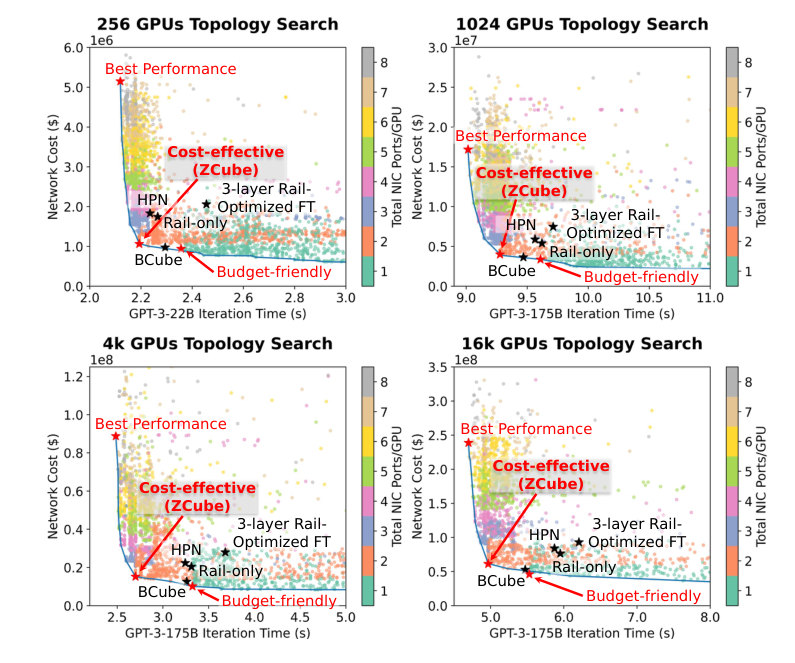
   <em>图 1：不同 GPU 规模下 ATOP 的搜索结果，每个点代表一种拓扑。每个规模中标出最佳性能、最高成本效率和预算友好三类代表点。</em>

拓扑设计也不是“一次性”工作。至少有三类运行场景会触发设计流程：1. 初始构建，即运营者为新数据中心设计架构，以满足新的模型架构（例如 Mixture-of-Experts 模型 [33]）或新的网络硬件（例如下一代交换芯片 [22]）等需求；2. 增量调整，例如重新布线以缓解瓶颈或降低运维成本；3. 扩展，例如在保留容错能力的同时从 1k GPU 扩展到 4k GPU。因此，自动化设计流程具有实际价值。

集群拓扑设计是一项同时涉及目标工作负载端到端性能、容错、成本约束、硬件可用性等多个目标的实际难题。目前主要有两类设计方法：人工设计和自动化设计。人工专家设计最常见，但存在三个问题。

- 大规模集群的拓扑设计空间极大，人工设计很难高效探索。
- 人类专家往往偏好美观、对称的拓扑，可能忽略性质更好的非直观拓扑。
- 人工设计也很难同时考虑多个目标。

因此，工业界和学术界都在研究自动化拓扑设计方法。朴素方法是用邻接矩阵建模拓扑，但这会引入巨大的搜索空间，实际不可搜索。代表性工作 Condor [48] 通过引入拓扑约束的领域专用语言（DSL），将拓扑设计建模为约束可满足性问题。然而，它仍依赖人类专家用 DSL 表达自己的直觉。DSL 虽然易于描述硬件约束（例如每台交换机端口数）和容错性质（例如单交换机故障下保持全连通），却很难、也不直观地表达应用层端到端性能优化目标，例如最小化 LLM 训练迭代时间。

于是我们提出一个问题：能否在具有多目标的集群拓扑设计中结合人类直觉和自动化探索？为此，我们提出 ATOP，即自动化拓扑优化流水线。具体而言，ATOP 从三个方面弥补现有拓扑设计方法的不足。

- 直觉驱动的建模：我们研究流行的 DCN 和 HPC 拓扑，提炼每种设计背后的专家直觉，并将这些直觉形式化为 11 类可搜索超参数，从而构造一个规模合理的拓扑空间。ATOP 的建模方法覆盖了大多数已知拓扑，例如 CLOS [13, 23, 29]、Fat-Tree [2]、ROFT [39]、Rail-only [51]、HPN [44]、BCube [25]、DCell [26]、HyperX [1]、Torus [30]、Dragonfly [32] 等。ATOP 生成的拓扑不限于这些已有设计的变体或组合，也能够产生新的非对称拓扑，在合理约束搜索范围的同时保留较高自由度。
- 通过引导仿真实现多目标优化：ATOP 将 NSGA-II 进化算法 [15] 与高性能、高保真仿真器结合，高效探索拓扑设计。优化器通过非支配排序和拥挤距离度量迭代生成候选拓扑，仿真器则用真实工作负载按照用户定义目标评估候选拓扑，包括吞吐、容错、成本和网络直径。
- 效率和可扩展性：ATOP 从三个方面提升效率和可扩展性。首先，拓扑建模方法合理缩小了搜索空间。其次，我们用强调保真的流级仿真器提升 Astra-Sim [54] 的可扩展性，使其可以用真实 LLM 训练工作负载高效评估大规模拓扑性能。最后，我们设计了两阶段评估方法来显著减少评估次数：第一阶段使用模型训练工作负载的代表性片段，生成 Pareto 最优拓扑集合；第二阶段对这些拓扑运行完整 LLM 训练工作负载，得到最终结果。借助这些技术，ATOP 可以在单台 CPU 服务器上用 3 天内为 16384 GPU 集群发现新的优秀拓扑。

我们在上述三类设计场景中评估 ATOP（第 4 节）。例如，在初始构建场景中，我们用 ATOP 为不同集群规模（从 256 到 16384 GPU）优化拓扑。结果中一个令人惊讶的发现是，在实际性能目标（LLM 训练迭代时间、真实网络成本模型和当前硬件物理约束）下，我们搜索到的三个场景中成本效率最高的拓扑具有相似结构，而且据我们所知此前尚未公开。我们将这种新拓扑形式化，并命名为 ZCube。我们通过包级仿真、理论分析，以及构建包含 16 个 GPU 和 32 个 200GbE 端口的真实测试床来验证 ZCube 性能。运行 nccl-tests [40] 后发现，相比非阻塞 ROFT，ZCube 在保持相同 all-reduce 和 all-to-all 性能的同时将硬件成本降低了 25%。

本文主要贡献如下。

- 我们总结了大多数现有 DCN 和 HPC 拓扑中的专家洞察，提出一种包含 11 类可搜索超参数的新抽象模型，得到一个规模合理、覆盖流行拓扑的搜索空间。
- 我们提出 ATOP 这一新的拓扑设计系统。ATOP 通过进化算法引导高性能、高保真仿真器，实现多目标优化。用户可以自由定义目标和约束，使 ATOP 适配不同场景。
- 我们开发了两阶段评估方法，将 ATOP 拓扑优化所需的全规模模型训练仿真数量减少 95%。对于 16384 GPU 集群，ATOP 能在单台 CPU 服务器上 3 天内发现新的优秀拓扑。
- 借助 ATOP，我们发现了 ZCube。它是一种新的拓扑，在不同 GPU 规模上具有低直径、强 LLM 训练性能、稳健容错和高成本效率。仿真结果表明，相比 ROFT、Rail-only 以及 ROFT 的双端口设计 HPN 等此前先进拓扑，ZCube 将端到端 LLM 训练速度提升 3% 到 7%，并将网络硬件成本降低 26% 到 46%。我们还在真实测试床上构建了 ZCube，结果表明在保持相同 all-reduce 和 all-to-all 性能的同时，它相比 Rail-Optimized Topology 将硬件成本降低 25%。

局限性。本文提出了用于自动拓扑优化的 ATOP，以及新的高成本效率拓扑 ZCube。我们的局限性如下，并希望在未来工作中改进。首先，ATOP 的拓扑建模不会生成任意拓扑，因为它利用拓扑设计先验知识，在搜索空间大小和搜索效率之间取得权衡。尽管如此，ATOP 已发现许多新拓扑，在性能和成本效率上都优于已有拓扑。其次，优化结果也受优化算法限制。本文使用 NSGA-II 已取得较好结果，但更大的采样规模或更强优化算法可能产生更好结果。第三，由于时间和资源限制，我们优化的最大规模是 16384 GPU，未来可以将 ATOP 用于更大规模。我们也无法在包含更多服务器的大型真实测试床上测试 ZCube；为了验证其大规模性能，只能依赖包级离散事件仿真。伦理：本工作不涉及伦理问题。

## 2. 背景与动机

本节介绍大模型训练、大规模 AI 集群拓扑和拓扑设计方法的背景，并说明 ATOP 的设计动机。

LLM 训练流量模式。分布式训练技术会将 LLM 训练工作负载并行化，不同并行方式产生不同通信模式。理解这些模式对设计高效集群拓扑非常关键。为研究这些通信模式，我们记录了生产环境 4k GPU 集群中大规模训练运行的流量轨迹，也使用 SimAI [3] 中的 AICB 工作负载生成器，并采访了 LLM 研究者和实践者。本文只关注服务器间流量，因此排除张量并行（TP）。

- 数据并行（DP）将训练数据划分到多个 GPU。每个 GPU 在本地分片上计算梯度，然后聚合这些梯度来更新全局模型参数，由此产生 all-gather（AG）和 reduce-scatter（RS）集合通信 [35]，消息大小在 10 到 100 MB 之间。
- 流水线并行（PP）将模型切分到多个设备，每个 GPU 处理一层或若干层。输入沿流水线前向传递，每个 GPU 执行计算并将激活传给下一个 GPU。梯度沿相同流水线反向传递，产生点到点（P2P）通信 [35]，消息大小为 1 到 10 MB。
- 专家并行（EP）用于 Mixture-of-Experts（MoE）模型，会在 GPU 之间产生 all-to-all 流量 [45]。我们从 LLM 研究者和训练框架了解到，EP 流量可能与 DP 流量共存，但很少与 PP 流量共存 [45, 49, 53, 55, 57]。
- 共存。通过分析真实流量轨迹（例如图 2），我们发现实际训练中存在五类流量阶段：仅 DP、仅 PP、仅 EP、混合 DP-PP、混合 DP-EP。

  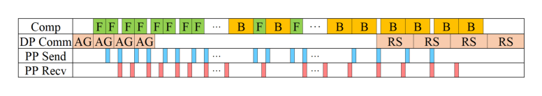
   <em>图 2：经典交错 1F1B 调度中 rank 0 上的 GPT-3 训练时间线；由于 TP 通信通常发生在服务器内部网络中，这里不包含 TP 通信。</em>

我们发现这些流量有一个共同特征：跨服务器通信通常发生在相同索引的 GPU 之间，例如从 Server_1 上的 GPU_2 到 Server_64 上的 GPU_2。all-to-all 通信中这一点仍然成立，因为 NCCL 中的 PXN 会先通过 NVLink 将流量转发到相同索引的 GPU，再转发到目标服务器 [42]。这种流量特征称为 rail-aligned [51]。相反，inter-rail 流量指发生在不同索引 GPU 之间的服务器间通信。我们观察到，在 ROFT 中 rail-aligned 流量也会经过 spine 交换机，因为通信服务器可能属于不同 pod，例如 PP 流量和大 DP 组产生的集合通信通常如此。在一个采用 ROFT 拓扑的生产 GPU 集群中，我们进行了一个月监测，发现 35% 的 rail-aligned 流量会经过 spine 交换机。

基于上述分析，我们为 ATOP 的两阶段评估机制准备了每类流量阶段的代表性工作负载，并确保所有流量都是 rail-aligned，没有 inter-rail 流量。

大规模 GPU 互连拓扑。训练 LLM 需要数千 GPU（1k 到 10k）[35, 45]，因此高效 GPU 互连至关重要。服务器内部 GPU 连接使用 NVLink 或 PCIe，服务器之间则依赖 Ethernet、InfiniBand（IB）或 RDMA over Converged Ethernet（RoCE）。由于服务器内部网络通常由厂商优化，本文聚焦服务器间网络拓扑。当前实践中最常用的拓扑包括 CLOS 和 ROFT [23, 29, 39]。ROFT 通过单个 ToR 交换机连接不同服务器中相同索引的 GPU，例如连接同一 pod 中所有服务器的 GPU_0。Rail-only 为每台服务器上相同索引的 GPU 构造 Rail-interconnection，去除 inter-rail 互连。Alibaba 的 HPN [44] 使用双端口 NIC 构建 ROFT 的双端口设计，即双平面架构。附录 K 给出了使用 51.2 Tbps 交换机构建 16k GPU 集群时 ROFT、Rail-only 和 HPN 的拓扑图。

当前拓扑在性能、成本和容错之间做出不同权衡。

- 性能目标推动拓扑设计走向全双剖分带宽。ROFT [23, 29, 39]、Rail-only 和 HPN [44] 在理论上都达到这一最大值。但理论性能并不保证实际性能。ROFT 在 EP 驱动的 all-to-all 流量下会因 ECMP 哈希冲突和哈希极化而出现负载均衡低效。图 3(a) 展示了 256 GPU 下三种场景中每 100 Gbps 的最大冲突流数量，分别为 Ideal LB、ECMP + PXN ON、ECMP + PXN OFF。NCCL PXN [42] 可以带来性能提升，而拓扑设计带来的增益更大。
- 成本约束推动设计者减少硬件需求。BCube 降低了硬件成本，但不能提供全双剖分带宽，会损害 MoE 模型训练。ROFT 和 Rail-only 以标准硬件成本实现全双剖分带宽。HPN 通过双平面架构提升容错，但相比 Rail-only 增加 10% 网络硬件成本。
- 容错是拓扑设计的另一个关键问题。ROFT 和 Rail-only 的容错较弱：单个 ToR 故障会影响许多 GPU，迫使这些 GPU 使用 PXN 经服务器内部互连转发流量。这会造成服务器内部带宽竞争，并影响其他并行策略。图 3(b) 显示，在 4k GPU 集群中，单个 ToR 故障会使 ROFT 的 LLM 训练性能下降 46.9%，使 Rail-only 下降 46.2%。HPN 通过双平面架构缓解这一弱点，但代价是成本增加。

  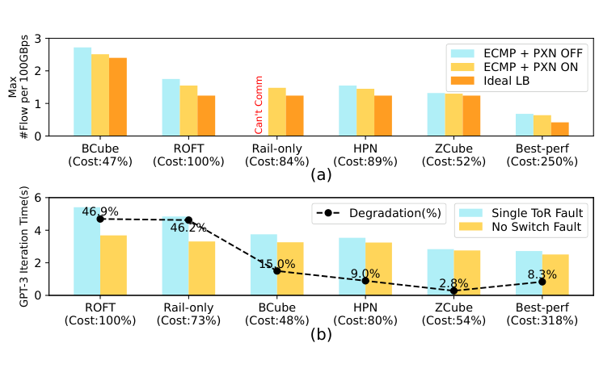
   <em>图 3：(a) 256 GPU 拓扑中 all-to-all 流量下每 100 Gbps 的最大流数量。(b) 4k GPU 拓扑中单 ToR 故障后的 GPT-3 训练性能下降。ZCube 和 Best-Perf 是 ATOP 生成的新拓扑。</em>

性能、成本和容错之间的复杂权衡促使我们开发一种自动化拓扑设计工具，用于识别 Pareto 最优拓扑，并发现同时具备高成本效率和强容错能力的新拓扑。

现有拓扑设计方法。目前拓扑设计主要有两种方法：人工和自动化。人工方法中，设计者通常依靠专家知识选择高度对称的拓扑。这种对称性偏好可能忽略潜在的高性能非对称拓扑。此外，在拓扑需要满足多个性能标准时，设计会变得困难，例如 ROFT 在 all-reduce 上表现很好，但在成本和容错上不足。

自动化方法中，一个朴素思路是用邻接矩阵建模拓扑并穷举搜索 [14]，但搜索空间极其庞大。对于 $N$ 个 GPU，空间规模增长为 $O(2^{N^2})$，很难快速找到优秀设计。例如，我们实现了一个用邻接矩阵搜索 16k GPU 拓扑的程序，10 小时内甚至没有产生一个连通拓扑，因为表示拓扑需要数亿个参数。将 ROFT 拓扑变换为 Dragonfly 需要修改数亿个参数。

早期代表性工作 Condor [48] 部分解决了自动化设计问题。Schlinker 等人开发了拓扑描述语言，并将约束求解引入该领域。然而，描述有利于应用性能的拓扑特征仍依赖人类直觉，因此该方法不能直接推理端到端应用性能。因此，我们认为，随着现代工作负载在复杂度和规模上的需求增长，现有方法正在接近极限。朴素自动化方法缺乏领域洞察来有效约束搜索，而人工设计依赖人类直觉，也难以推理越来越大的设计空间。

本文提出结合人类洞察和自动化探索。ATOP 基于两个核心思想：1. 将既有拓扑中的专家设计直觉提炼为一组统一的可搜索超参数，从而简洁覆盖丰富拓扑空间；2. 用高保真仿真引导的可扩展多目标进化算法搜索这一超参数空间。这样可以有原则地发现新的高性能拓扑，并针对每个特定工作负载和集群的需求，在吞吐、成本和可靠性等指标上灵活优化。

## 3. ATOP 设计

我们提出 ATOP（Automated Topology Optimization Pipeline）来解决第 1 节中的挑战。ATOP 包含三个主要组件：拓扑超参数化建模（第 3.2 节），定义拓扑搜索空间；拓扑优化器（第 3.3 节），搜索并优化拓扑；拓扑评估器（第 3.4 节），评估给定拓扑。ATOP 总览如图 4 所示。

  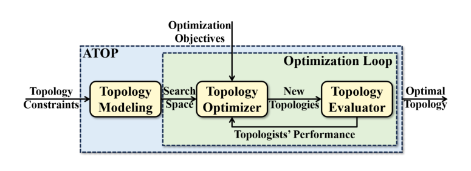
   <em>图 4：ATOP 概览。</em>

### 3.1 来自现有拓扑的洞察

现有拓扑利用专家知识解决特定问题。Fat-Tree 提升树形拓扑中的汇聚带宽，ROFT 优化 GPU 集群中的服务器间 all-reduce，HPN 通过双 ToR 架构增强 ROFT 的容错。BCube 加速模块化数据中心中的一对多流量，Dragonfly 则用低 radix 交换机降低网络直径和成本。这些拓扑包含分层结构和对称性，来源于专家经验。

我们的目标是开发一种设计方法，在专家洞察与拓扑搜索空间灵活性之间取得平衡，以高效发现高性能、可部署的拓扑，并允许某些非对称结构。为此，我们从专家直觉中总结出 11 类超参数，构造可搜索拓扑空间，使系统能够自动探索新的拓扑设计，而不限于已有拓扑的变体或组合。它可以产生高性能非对称拓扑，例如 ZCube（第 5 节），其中中间层交换机需要额外端口。

### 3.2 洞察驱动的拓扑建模

ATOP 的建模设计基于对现有 DCN 拓扑的分析。这些拓扑通常具有分层结构、对称性（例如 HPN、Fat-Tree、BCube），也可能包含层内连接（例如 Dragonfly、HyperX、DCell）。因此，ATOP 的拓扑建模包含两个主要部分：“节点分层与层间连接”和“层内连接”。表 1 总结了本节使用的符号。

<table align="center" style="display: table; margin-left: auto; margin-right: auto; text-align: center;">
  <tr><th align="center" style="text-align: center;">类别</th><th align="center" style="text-align: center;">符号</th><th align="center" style="text-align: center;">说明</th></tr>
  <tr><td align="center" style="text-align: center;">用户输入</td><td align="center" style="text-align: center;">Lmax</td><td align="center" style="text-align: center;">拓扑中的最大层数。</td></tr>
  <tr><td align="center" style="text-align: center;">用户输入</td><td align="center" style="text-align: center;">N1</td><td align="center" style="text-align: center;">GPU 数量，即第一层节点数。</td></tr>
  <tr><td align="center" style="text-align: center;">用户输入</td><td align="center" style="text-align: center;">Dmax</td><td align="center" style="text-align: center;">一层中的节点最多可被划分成多少个维度。</td></tr>
  <tr><td align="center" style="text-align: center;">层间连接超参数</td><td align="center" style="text-align: center;">Ni</td><td align="center" style="text-align: center;">第 i 层节点数。</td></tr>
  <tr><td align="center" style="text-align: center;">层间连接超参数</td><td align="center" style="text-align: center;">Hiij</td><td align="center" style="text-align: center;">第 i 层在第 i 层与第 j 层互连中的块数。</td></tr>
  <tr><td align="center" style="text-align: center;">层间连接超参数</td><td align="center" style="text-align: center;">Hjij</td><td align="center" style="text-align: center;">第 j 层在第 i 层与第 j 层互连中的块数。</td></tr>
  <tr><td align="center" style="text-align: center;">层间连接超参数</td><td align="center" style="text-align: center;">Eij</td><td align="center" style="text-align: center;">第 i 层一个节点到第 j 层节点的链路数。</td></tr>
  <tr><td align="center" style="text-align: center;">层间连接超参数</td><td align="center" style="text-align: center;">Bij</td><td align="center" style="text-align: center;">第 i 层与第 j 层之间互连的链路带宽因子。</td></tr>
  <tr><td align="center" style="text-align: center;">层内连接超参数</td><td align="center" style="text-align: center;">Di</td><td align="center" style="text-align: center;">第 i 层节点的维度数。</td></tr>
  <tr><td align="center" style="text-align: center;">层内连接超参数</td><td align="center" style="text-align: center;">Ski</td><td align="center" style="text-align: center;">第 i 层第 k 个维度中的节点数。</td></tr>
  <tr><td align="center" style="text-align: center;">层内连接超参数</td><td align="center" style="text-align: center;">Pki</td><td align="center" style="text-align: center;">第 i 层第 k 个维度中节点的外向连接数。</td></tr>
  <tr><td align="center" style="text-align: center;">层内连接超参数</td><td align="center" style="text-align: center;">Aikrt</td><td align="center" style="text-align: center;">在第 i 层第 k 个维度的外向连接中，计算目标节点第 t 个坐标时，源节点第 r 个坐标的系数。</td></tr>
  <tr><td align="center" style="text-align: center;">层内连接超参数</td><td align="center" style="text-align: center;">Cikt</td><td align="center" style="text-align: center;">在第 i 层第 k 个维度的外向连接中，计算目标节点第 t 个坐标时的偏置项。</td></tr>
  <tr><td align="center" style="text-align: center;">层内连接超参数</td><td align="center" style="text-align: center;">Bii</td><td align="center" style="text-align: center;">第 i 层层内互连的链路带宽因子。</td></tr>
</table>

<em>表 1：拓扑建模中使用的符号。</em>

节点分层与层间连接。基于对 CLOS、Fat-Tree、BCube 等经典 DCN 拓扑的观察，我们发现这些拓扑中的节点通常呈现分层结构。例如，第一层由服务器组成，随后是多层交换机。我们也发现，现有拓扑的层间连接具有一定对称性。具体来说，两层之间的连接可以划分成多个大小相同的块，并具有相同连接模式。ATOP 的拓扑建模遵循这些设计原则。

首先，用户指定 GPU 数量 $N_1$ 和最大层数 $L_{\max}$。第 $i$ 层交换机数量为 $N_i$（$2 \le i \le L_{\max}$），这是一个超参数。

基于上述观察，我们以对称方式建模层间连接，将每层划分为块。第 $i$ 层有 $H^i_{ij}$ 个块，第 $j$ 层有 $H^j_{ij}$ 个块，其中 $H^i_{ij}$ 和 $H^j_{ij}$ 分别是 $N_i$ 和 $N_j$ 的因子，也是可搜索超参数。如果 $H^i_{ij}=0$ 或 $H^j_{ij}=0$，则不存在互连。第 $i$ 层中的每个块连接到第 $j$ 层中的一个块。具体而言，第 $i$ 层第 $k$ 个块连接到第 $j$ 层第 $(k \bmod H^j_{ij}+1)$ 个块。为保证连通性，我们设置 $H^i_{ij} \ge H^j_{ij}$，使第 $j$ 层每个块至少连接到第 $i$ 层一个块。

块之间的连接模式也以对称方式定义，即第 $i$ 层与第 $j$ 层之间每一对已连接块共享相同连接模式。第 $i$ 层每个块包含 $N_i/H^i_{ij}$ 个节点，第 $j$ 层每个块包含 $N_j/H^j_{ij}$ 个节点。对于第 $i$ 层块中的每个节点，有 $E_{ij}$ 条链路连接到第 $j$ 层节点，其中 $1 \le E_{ij} \le N_j/H^j_{ij}$。第 $i$ 层块中的第 $k$ 个节点连接到第 $j$ 层的第 $([E_{ij}(k-1)+m] \bmod (N_j/H^j_{ij})+1)$ 个节点。如果 $E_{ij}=N_j/H^j_{ij}$，两个块中的节点形成完全二分图。$E_{ij}$ 是决定块对内部连接模式的超参数。图 5 展示了层间连接构造示例。

**算法 1：在 ATOP 中生成层间连接超参数**

输入：最大层数 $L_{\max}$；GPU 数量 $N_1$  
输出：可搜索超参数集合 $\mathcal{H}$

1. 对 $i=2$ 到 $L_{\max}$，将 $N_i \in [0,N_1]$ 加入 $\mathcal{H}$。
2. 对 $i=1$ 到 $L_{\max}-1$，并对 $j=i+1$ 到 $L_{\max}$：
3. 将 $H^i_{ij} \in \{d \mid d>0,\; N_i \bmod d = 0\} \cup \{0\}$ 加入 $\mathcal{H}$。
4. 将 $H^j_{ij} \in \{d \mid d>0,\; N_j \bmod d = 0\} \cup \{0\}$ 加入 $\mathcal{H}$。
5. 将 $E_{ij} \in [1, N_j/H^j_{ij}]$ 加入 $\mathcal{H}$。
6. 将 $B_{ij} \in [1,4]$ 加入 $\mathcal{H}$。
7. 返回 $\mathcal{H}$。

ATOP 不为每条链路分配独立带宽，而是使同一层间连接中的链路具有一致带宽。典型 RDMA 网络链路带宽为 200 Gbps、400 Gbps 或 800 Gbps。因此，ATOP 使用 200 Gbps 作为基准，并用带宽因子缩放。层 $i$ 与层 $j$ 之间链路的带宽因子 $B_{ij}$ 是一个超参数（$1 \le B_{ij} \le 4$），决定链路带宽为 $B_{ij} \times 200\mathrm{Gbps}$。这一方法允许拓扑内存在不同链路带宽。例如在 HPN [44] 中，GPU 与 ToR 交换机之间的链路带宽为 200 Gbps，而 ToR 交换机与 Aggregate 交换机之间为 400 Gbps。总之，层节点数 $N_i$、层间连接块数 $H^i_{ij}$ 和 $H^j_{ij}$、块对间节点连接数 $E_{ij}$、带宽因子 $B_{ij}$ 都是超参数，如算法 1 所示。除了本文给出的范围，用户也可以根据需求动态调整这些超参数，例如固定或限制部分超参数。

  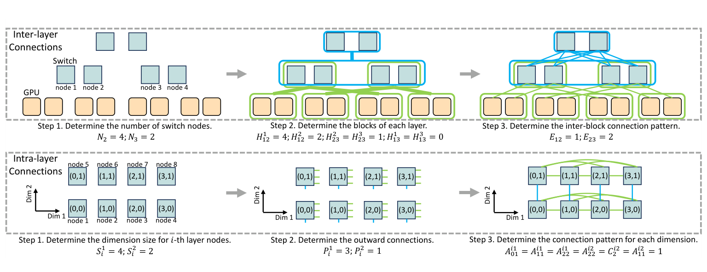
   <em>图 5：ATOP 中构造层间连接和层内连接的示例。未提及的超参数均为 0。</em>

层内连接。除了分层架构之外，我们观察到 DCN 拓扑还包括维度结构和复杂连接模式，例如 Dragonfly、Torus 和 HyperX。因此，我们提出“层内互连”方法，并将其集成到分层架构中。该方法通过把同一层中的节点划分为多个维度，允许同层节点之间直接连接。例如，32 个节点可以划分为 $4 \times 8$ 的两个维度，并为每个维度定义连接模式。用户指定最大维度数，记为 $D_{\max}$。

对于第 $i$ 层的 $N_i$ 个节点（$1 \le i \le L_{\max}$），它们被划分成 $D_i$ 个维度（$0 \le D_i \le D_{\max}$），其中 $D_i$ 是可搜索超参数。如果 $D_i=0$，该层不存在层内连接。每个维度的节点数记为 $S^k_i$（$1 \le k \le D_i$），也是一组超参数，并满足 $\prod_{k=1}^{D_i} S^k_i = N_i$。该层中的每个节点可以用多维坐标 $(X_1, X_2, \ldots, X_{D_i})$ 表示，其中 $0 \le X_1 < S^1_i$，$0 \le X_2 < S^2_i$，依此类推。

接着，我们把每个节点在每个维度中的外向连接数定义为超参数，记为 $P^k_i$（$1 \le k \le D_i$，$0 \le P^k_i < S^k_i$）。“外向连接”指一个节点尝试连接其他节点的次数，而不是节点度数。并行连接会被合并并视为一条连接。

对于每个节点和每个维度，需要构造连接。坐标为 $(X_1, X_2, \ldots, X_{D_i})$ 的节点在第 $k$ 个维度形成 $P^k_i$ 条连接。第 $m$ 条连接（$1 \le m \le P^k_i$）的目标节点坐标为 $(X'_1, X'_2, \ldots, X'_{D_i})$，计算方式如下：

$$
X'_t = \left[A^{ik}_{0t} m + \sum_{r=1}^{D_i}\left(A^{ik}_{rt} X_r\right) + C^{ik}_t\right] \bmod S^k_i
\tag{1}
$$

其中 $1 \le t \le D_i$，$A^{ik}_{rt}$（$0 \le r \le D_i$）和 $C^{ik}_t$ 是超参数。$A^{ik}_{rt}$ 和 $C^{ik}_t$ 是根据源节点坐标及其不同连接来计算目标节点坐标的因子，其中 $i$ 表示第 $i$ 层内的互连，$k$ 表示外向连接的第 $k$ 个维度，$t$ 表示目标节点第 $t$ 个坐标，$r$ 表示源节点第 $r$ 个坐标。换句话说，第一项刻画来自源节点的不同连接的影响，第二项根据源节点每个维度坐标计算目标坐标，第三项为偏置项。最终结果保证目标坐标位于给定维度边界内。

该方程来自对复杂层内多维互连结构的观察，可以为层内互连提供较高灵活性，使其能够建模多维 Torus、多维 FullMesh、Dragonfly、HyperX 等拓扑结构。图 5 展示了构造层内连接的示例。与层间连接类似，层内链路带宽因子 $B_{ii}$（$1 \le B_{ii} \le 4$）也是超参数。总之，层内连接的超参数包括每层维度 $D_i$、每个维度节点数 $S^k_i$、外向连接数 $P^k_i$、坐标计算因子 $A^{ik}_{rt}$ 和 $C^{ik}_t$，以及层内链路带宽因子 $B_{ii}$，如算法 2 所示。

**算法 2：在 ATOP 中生成层内连接超参数**

输入：最大维度数 $D_{\max}$；最大层数 $L_{\max}$；每层节点数 $N_i$  
输出：可搜索超参数集合 $\mathcal{H}$

1. 对 $i=1$ 到 $L_{\max}$，将 $D_i \in [0,D_{\max}]$ 加入 $\mathcal{H}$，并令 $N_{\mathrm{remained}} \leftarrow N_i$。
2. 对 $k=1$ 到 $D_i$：
3. 如果 $k \ne D_i$，将 $S^k_i \in \{d \mid N_{\mathrm{remained}}>0,\; N_{\mathrm{remained}} \bmod d = 0\}$ 加入 $\mathcal{H}$；否则令 $S^k_i = N_{\mathrm{remained}}$。
4. 令 $N_{\mathrm{remained}} = N_{\mathrm{remained}} / S^k_i$。
5. 将 $P^k_i \in [0,S^k_i-1]$ 加入 $\mathcal{H}$。
6. 对 $t=1$ 到 $D_i$，并对 $r=0$ 到 $D_i$，将 $A^{ik}_{rt} \in [-S^k_i,S^k_i]$ 加入 $\mathcal{H}$。
7. 对 $t=1$ 到 $D_i$，将 $C^{ik}_t \in [-S^k_i,S^k_i]$ 加入 $\mathcal{H}$。
8. 将 $B_{ii} \in [1,4]$ 加入 $\mathcal{H}$。
9. 返回 $\mathcal{H}$。

### 3.3 拓扑优化器

优化目标。优化目标是 ATOP 的输入，可以根据用户需求定制。我们的优化目标包括：使用网络仿真器仿真的 LLM 训练代表性流量作业完成时间（JCT）、ForestColl all-gather [58]、单交换机故障下平均路径长度，以及网络成本。详细实现见第 4.1 节。

拓扑优化器。优化器对超参数空间采样，生成待评估拓扑，并接收性能反馈来指导后续采样。由于 NSGA-II 在性能和效率方面表现较好 [31, 34, 47]，ATOP 的优化器使用 NSGA-II 作为优化算法。为提升搜索效率，我们还实现了并行优化，允许多个处理器同时评估多个拓扑，从而获得线性效率增益。附录 D 验证了 ATOP 的收敛性和效率，附录 J 比较了 NSGA-II 与其他优化算法。

### 3.4 拓扑评估器

流级仿真器。高效评估大规模拓扑具有挑战性。NS-3 [46] 等包级仿真器可以在几分钟内评估小规模拓扑，但在数千 GPU 规模下会因时间和内存开销过大而不实用 [24]。为此，我们实现了一个流级网络仿真器，建模 GPU 之间的通信流。仿真器为每条流应用 max-min fairness 带宽分配算法 [36]。对于流冲突，我们只使用 max-min fairness 分配带宽，不使用额外惩罚函数。对于拥塞建模和交换机时延，我们采用 SimGrid [8] 的方法以提升准确性。每条链路的时延可以在拓扑描述文件中配置。我们通过在相同配置下与 NS-3 比较来验证仿真器准确性。结果（附录 I 表 4）显示，在 LLM 训练场景中，两个仿真器在不同规模和拓扑上的平均作业完成时间误差为 1.5%。

两阶段评估。我们设计了两阶段评估方法，以减少耗时的端到端大模型训练仿真数量。第一阶段将模型训练工作负载的代表性片段、容错和网络成本作为优化目标。由于使用多目标优化，ATOP 可以生成一组 Pareto 最优拓扑（定义见附录 C）作为第一阶段结果。第二阶段，我们使用 Astra-Sim 2.0 [54] 评估这些拓扑的端到端训练时间，并以我们的流级网络仿真器作为后端、SimAI [3] 作为工作负载生成器。最终，我们得到所有 Pareto 最优拓扑的端到端训练结果。

集合通信性能。尽管流级仿真器会在 LLM 流量下评估拓扑，但已有集合通信算法（例如 Ring [42] 和 RHD [50]）对给定拓扑可能并非最优。因此，ATOP 实现 ForestColl [58] 算法来计算理论最小 all-gather 时间。ForestColl 算法包含两部分：第一部分计算给定拓扑上最优集合算法完成时间的理论下界；第二部分推导实际集合算法。虽然 ForestColl 可以快速计算理论最优完成时间（第一部分），但获取具体集合算法和路由（第二部分）耗时较长。因此，我们只使用第一部分来评估拓扑，并将其作为搜索过程中的一个优化目标。该评估不使用仿真器，而是通过理论方法评估理想算法和理想负载均衡下的性能。

容错。我们关注单交换机故障，并提出引入 $APL_{\mathrm{fail}}$ 指标的理论分析方法。该指标表示拓扑在单交换机故障下 GPU 对之间的平均路径长度。对于网络拓扑 $G=(V=V_s \cup V_g,E)$，其中 $V_s$ 表示交换机节点，$V_g$ 表示 GPU，$APL_{\mathrm{fail}}$ 会在每个交换机节点故障时计算 GPU 间通信路径长度的平均值，再对所有交换机求平均，形式化如下：

$$
APL_{\mathrm{fail}} =
\frac{1}{|V_s|}
\cdot
\frac{1}{|V_g|^2-|V_g|}
\sum_{v_s \in V_s}
\sum_{\substack{u,v \in V_g \\ u \ne v}}
d_{G'=(V-\{v_s\},E)}(u,v)
\tag{2}
$$

其中 $d_{G'=(V-\{v_s\},E)}(u,v)$ 表示删除交换机 $v_s$ 后，拓扑中 GPU $u$ 与 GPU $v$ 之间的最短路径长度。

网络成本。对于网络成本估计，我们使用真实网络硬件成本模型。详细描述见第 4.1 节。

## 4. ATOP 实现与评估

本节讨论 ATOP 的通用配置、三个使用场景，以及 ATOP 的搜索结果。

### 4.1 方法与设置

测试平台。我们在一台服务器上评估 ATOP，该服务器包含 256 个 AMD EPYC 7Y83 CPU 核心和 1 TB 内存。

搜索空间。我们将 $L_{\max}$ 设为 4，因为更多层数的拓扑可能具有更大的网络直径，导致更高延迟。我们将 $D_{\max}$ 设为 4，因为大多数拓扑的层内互连不超过四个维度。

优化器和目标。我们使用 NSGA-II 进行超参数优化，包含 4 类共 14 个目标：1. 使用流级网络仿真器仿真的训练流量模式作业完成时间（JCT），包括 DP-only、PP-only、EP-only、Mixed DP-PP、Mixed DP-EP。对于非 MoE 模型，我们考虑不同常见并行策略。我们为 NVIDIA H100 服务器设置 $\mathrm{TP}=8$，该服务器使用 NVLink 连接 8 个 GPU，并考虑 $\mathrm{PP}$ 为 4、8 和 16。$\mathrm{DP}$ 等于 GPU 数量除以 $\mathrm{TP}$ 和 $\mathrm{PP}$，集合通信算法使用 RHD [50]。这些流量模式产生 9 个目标（3 种并行策略乘以 3 种流量模式）。对于 MoE 模型，我们考虑 256 个 expert，$\mathrm{EP}=256$，$\mathrm{DP}$ 等于 GPU 数量除以 $\mathrm{EP}$，由此得到 2 个目标（EP-only 和 Mixed DP-EP）。上述流量模式共生成 11 个优化目标。2. 对于 ForestColl all-gather，我们将数据量设为 1 GB，这是大模型训练中 DP 的典型规模。3. 对于容错，我们使用式 (2) 中的单交换机故障下平均路径长度来估计拓扑在故障期间的性能。4. 对于拓扑成本估计，我们考虑交换机、线缆（铜缆、光纤）、光模块和 NIC。价格来源为 FS [19] 和 Colfax Direct [16]。我们使用不同吞吐的交换机：Broadcom N8550-40CD（8 Tbps）、N9550-32D（12.8 Tbps）、N9550-64D（25.6 Tbps）和 N9600-64OD（51.2 Tbps）。NIC 包括 NVIDIA ConnectX-6 和 ConnectX-7，光模块根据带宽选取 NVIDIA OSFP Optical Modules 系列。线缆选择取决于距离：短距离（不超过 3 米）使用 Direct Attach Cable（DAC），长距离使用光模块和 MTP 跳线（光纤）。对于 NIC 到第一层交换机的互连，如果使用 rail-optimized 方法，即同一服务器上的 NIC 连接到不同交换机，我们假设使用 15 米线缆、MTP 跳线和光模块。如果同一服务器上的所有 NIC 连接到同一 ToR，则使用 3 米 DAC。相邻层交换机之间使用 30 米 MTP 跳线，跨层连接（例如第 1 层到第 3 层）和层内连接使用 50 米 MTP 跳线。

拓扑搜索数量和搜索时长。尽管搜索空间已经缩小，评估所有拓扑仍不可行。我们限制优化器最多探索 $10^5$ 个拓扑。ATOP 完成搜索和两阶段评估的时间分别为：256 GPU 6.5 小时，1k GPU 10.6 小时，4k GPU 25.4 小时，16k GPU 71.2 小时，其中 80% 时间用于拓扑评估。我们已将搜索并行化，并使用 256 个 CPU 核心运行搜索过程。与数据中心部署所需的数月时间相比，这些时间是合理的。此外，HyperVolume [60] 等指标也可以作为停止准则。附录 D 进一步讨论了 ATOP 的收敛性。

第二阶段评估设置。在第二阶段，我们使用 Astra-Sim 2.0 对 Pareto 最优拓扑进行端到端大模型训练仿真。我们评估 256 GPU 上 GPT-3-22B 训练，以及 1k、4k、16k GPU 上 GPT-3-175B 训练。对于并行策略，我们采用常见配置 [4, 11, 35, 56]：$\mathrm{TP}=8$、$\mathrm{PP}=8$，$\mathrm{DP}$ 等于 GPU 数量除以 $\mathrm{TP}$ 和 $\mathrm{PP}$，并使用交错 1F1B 策略。$\mathrm{TP}$ 通信使用服务器内部互连，$\mathrm{DP}$ 和 $\mathrm{PP}$ 使用服务器间互连。我们按照 Megatron-LM [35] 的方式安排并行策略，尽量把紧密耦合的一组 GPU 放得更近，以最小化交换机跳数。我们记录 NVIDIA H100 GPU 上每个模型算子的计算时间。详细模型参数和训练配置见附录表 8。两阶段评估方法避免了 $10^5$ 次全规模模型训练仿真，将评估缩减到约 5000 个（5%）Pareto 最优拓扑，实现 20 倍加速。

拓扑评估器与仿真配置。在流级网络仿真器中，服务器间链路基准带宽设为 200 Gbps，可通过带宽因子调整。链路时延为 5 微秒，每条流的总时延取决于跳数。对于 8 GPU NVIDIA H100 服务器，服务器内部 GPU 通过 NVLink 和 NVSwitch 互连，双向带宽为 900 GB/s，时延为 1 微秒，与 NVIDIA DGX H100 服务器 [39] 规格一致。在仿真评估中，我们启用 PXN，并在有利时通过 NVLink 路由流量以最小化跳数。路由和负载均衡使用 ECMP [28]，因为它是商用 RoCE 交换机 [20-22] 中实际标准，且具备可部署性。在理想负载均衡下表现良好、但在 ECMP 下表现较差的拓扑，很难直接用商用 RoCE 交换机部署。考虑可部署性和仿真效率，我们使用 ECMP 进行评估。对于容错，我们考虑服务器内部互连，并同样启用 PXN。我们把每台 8 GPU 服务器视为 GPU 之间点到点连接，通信路径长度为 1。由于 Pareto 最优拓扑是从 ATOP 生成的所有拓扑中选择的，一个在 ToR 故障后断连但在其他指标上出色的拓扑仍可能被选中，因此 ATOP 不会只生成多 ToR 拓扑。

### 4.2 ATOP 使用场景

接下来，我们展示 ATOP 在第 1 节三类运行场景中的用途。

#### 4.2.1 使用场景 1：设计新数据中心

设置。在设计新数据中心时，ATOP 用于探索不同规模的拓扑：256、1024、4096 和 16384 个 GPU。交换机吞吐上限分别设为 256 GPU 下 6.4 Tbps、1024 GPU 下 12.8 Tbps、4096 GPU 下 25.6 Tbps、16384 GPU 下 51.2 Tbps。对于 NIC，我们考虑每个 GPU 多 NIC 配置，包括多端口 NIC；每个 GPU 最多可配置 8 个 NIC 端口，每个端口至少 200 Gbps 带宽。每个 GPU 最大出站带宽限制为 1.6 Tbps。具有 400 Gbps 出站带宽的 GPU 可以使用单端口 400 Gbps NIC，也可以使用双端口 $2 \times 200\mathrm{Gbps}$ NIC。ATOP 可以自由探索每个 GPU 的 NIC 端口数量和带宽配置。

结果。图 1 可视化了不同规模数据中心的搜索结果。由于第一阶段评估使用 14 个优化目标，我们只展示 Pareto 最优拓扑的端到端 LLM 训练评估结果。每个点代表一种拓扑。ATOP 识别出训练时间与成本之间的 Pareto 前沿，Pareto 最优拓扑位于该前沿附近。图 6 展示了 4k GPU 规模下 ATOP 发现的 100000 个拓扑与 Pareto 最优拓扑的对比。结果表明，ATOP 能捕获性能成本 Pareto 前沿上的拓扑，验证了用训练期间代表性流量模式评估拓扑的可行性。根据结果，我们观察到一个模式：在一定范围内，成本增加会提升性能；但一旦达到某个性能阈值，进一步增加成本收益会递减。我们为每个 GPU 规模识别出三类关键拓扑：最高成本效率拓扑、最佳性能拓扑和预算友好拓扑。

  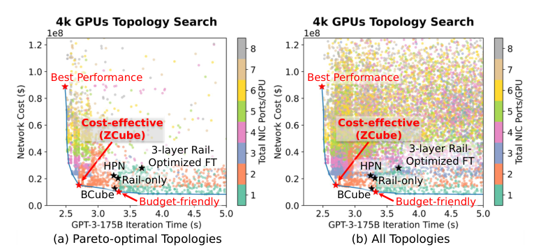
   <em>图 6：4k GPU 搜索过程中：(a) ATOP 生成的 Pareto 最优拓扑；(b) ATOP 生成的全部拓扑。</em>

最高成本效率拓扑位于 Pareto 前沿的拐点。最佳性能拓扑具有最小迭代时间。预算友好拓扑通过每个 GPU 只配置一个 NIC 端口，在较低成本下提供强性能。值得注意的是，各规模下位于拐点的最高成本效率拓扑具有相似架构。我们将该拓扑命名为 ZCube，并由用户选择用于小规模部署和测试。第 5 节和第 6 节给出了 ZCube 在不同 GPU 规模下的形式化描述和分析。

#### 4.2.2 使用场景 2：调整现有数据中心

设置。在该场景中，我们使用 ATOP 优化一个 4k GPU 数据中心的拓扑。初始拓扑是三层非阻塞 ROFT 架构。目标是在不额外购买交换机和 NIC 的情况下，通过重新布线提升性能并降低网络成本。允许修改光模块和线缆。交换机吞吐为 25.6 Tbps，交换机数量为 320，每个 GPU 可以使用双端口 NIC。这些约束严格限制了拓扑搜索空间。

结果。图 7(a) 展示了该场景中的 ATOP 搜索结果。我们发现，在该受限搜索空间内，ZCube 同时是最佳性能和高成本效率拓扑。交换机数量和吞吐的严格限制使得构造更高性能拓扑较为困难。在该场景中，ATOP 也识别出了训练时间与网络成本的 Pareto 前沿。前沿上的拓扑代表潜在候选，用户可以根据预算选择。

  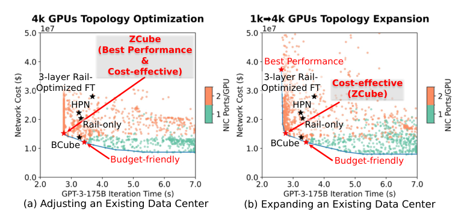
   <em>图 7：(a) 调整现有 4k GPU DCN 时的 ATOP 搜索结果。(b) 从 1k GPU 扩展到 4k GPU 时的 ATOP 搜索结果。</em>

#### 4.2.3 使用场景 3：扩展

设置。在该场景中，我们考虑将现有 1k GPU 数据中心扩展为 4k GPU 数据中心。初始拓扑是两层非阻塞 ROFT，使用 25.6 Tbps 交换机，每个 GPU 配置双端口 NIC。在 ATOP 中，扩展后的拓扑应保留原有交换机和 NIC。新增交换机吞吐限制为 51.2 Tbps。每个 GPU 限制为使用一个双端口 NIC。此外，我们引入一个新的优化目标来衡量扩展后拓扑 $G_e=(V_e,E_e)$ 与原始拓扑 $G_o=(V_o,E_o)$ 之间的差异。具体而言，我们使用修改链路数作为指标，定义为 $M_{\mathrm{Link}}=|E_e|+|E_o|-2|E_e \cap E_o|$。我们希望最小化该目标以降低人力成本。在 Case 2 中不使用该指标，是因为它会得到零值，即不修改拓扑，这对其他拓扑不公平。但在 Case 3 中，即使直接扩展为三层 ROFT 也需要添加一些链路。

结果。图 7(b) 展示了该场景下 ATOP 的搜索结果，比较了网络成本和训练性能。附录图 13 进一步比较了修改链路数量（另一种成本指标）和训练性能。结果显示，ATOP 在两种成本指标下都识别出了 Pareto 前沿。我们还发现 ZCube 仍是最高成本效率拓扑。

  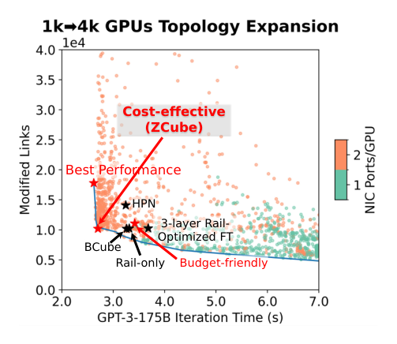
   <em>图 13：Case 3 搜索结果中，修改链路数量（另一成本指标）与训练性能的比较。</em>

### 4.3 讨论

ATOP 是数据中心架构师的有用工具，并不限于以上三种应用。不断演化的硬件配置、变化的流量模式和动态用户需求，常常要求发现新拓扑。通过调整输入，ATOP 可以动态适配这些变化，并高效识别满足更新约束的优化拓扑。例如，附录 A 和 B 显示，ATOP 也可以为多租户数据中心和异构数据中心产生新的高质量拓扑。

从 ATOP 的结果中，我们观察到位于拐点（成本效率高）的拓扑具有相似架构。它们大多包含两层或三层交换机，GPU 与每层交换机之间都有连接，同时交换机之间也有连接。用户和我们都认为这种拓扑非常有趣，并进行了小规模部署（第 6.2 节）。我们将这类拓扑总结并定义为 ZCube。第 5 节和第 6 节给出了 ZCube 在不同 GPU 规模下的形式化描述和分析。

## 5. ZCube：从 ATOP 发现的新拓扑

本节首先在第 5.1 节用数学定义形式化 ZCube 的构造，然后在第 5.2 节分析 ZCube 的性质，包括可扩展性和直径。关于其容错能力，附录 G 提供了详细分析。

### 5.1 ZCube 构造

ZCube 的构造采用递归方法。最小单元 $\mathrm{ZCube}(n,1)$ 是一台连接 $n$ 个 GPU 的单交换机。一般地，$\mathrm{ZCube}(n,k+1)$（$k \ge 1$）由 $n$ 个 $\mathrm{ZCube}(n,k)$ 和 $n^k$ 台交换机构成。因此，$\mathrm{ZCube}(n,k+1)$ 具有 $N=n^{k+1}$ 个 GPU 和 $k+1$ 级交换机，每级有 $n^k$ 台交换机。$\mathrm{ZCube}(n,k+1)$ 中每个 GPU 配备 $k+1$ 个 NIC 端口，编号从 level-0 到 level-$k$。除了为每个 GPU 配备多端口 NIC [41]，ZCube 也可以通过为每个 GPU 使用多个 NIC 实现。例如，构造 $\mathrm{ZCube}(n,2)$ 时，每个 GPU 只需配备一个 400 Gbps NIC，并将其划分为 $2 \times 200\mathrm{Gbps}$ 端口连接到不同交换机；也可以使用两个独立的 200 Gbps NIC。

在 $\mathrm{ZCube}(n,k+1)$ 中，交换机与 GPU 的连接可以按如下方式构造。我们将 $n$ 个 $\mathrm{ZCube}(n,k)$ 编号为 $0$ 到 $n-1$，并将每个 $\mathrm{ZCube}(n,k)$ 中的 GPU 编号为 $0$ 到 $n^k-1$。然后，将第 $j$ 个 $\mathrm{ZCube}(n,k)$（$j \in [0,n-1]$）中第 $i$ 个 GPU（$i \in [0,n^k-1]$）的 level-$k$ NIC 连接到第 $i$ 台 level-$k$ 交换机的第 $j$ 个端口。

对于交换机之间的连接，每台 level-$(k-1)$ 交换机连接到 $n$ 台 level-$k$ 交换机。第 $j$ 个 $\mathrm{ZCube}(n,k)$（$j \in [0,n-1]$）中的第 $i$ 台 level-$(k-1)$ 交换机（$i \in [0,n^{k-1}-1]$）连接到 level-$k$ 中的 $n$ 台交换机，这些交换机表示为第 $m$ 台交换机，其中 $m \in [i \times n,(i+1)\times n-1]$，如图 8(a) 所示。图 8(b) 给出了 $\mathrm{ZCube}(2,3)$ 的示意图。

在 $\mathrm{ZCube}(n,k)$ 中，level-0 和 level-$(k-1)$ 交换机需要 $2n$ 个端口，中间层交换机需要 $3n$ 个端口，这体现了 ZCube 的非对称性。在 Fat-Tree、BCube、Dragonfly 等传统拓扑中，交换机通常使用相同数量的端口，反映出对称性偏好。这种对称性偏好可能导致设计者忽略非对称但高性能的拓扑。使用 ATOP 可以帮助设计者探索非对称拓扑。

  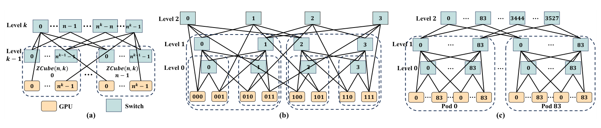
   <em>图 8：(a) ZCube(n,k+1) 由 n 个 ZCube(n,k) 和 n^k 台交换机构造。(b) ZCube(2,3) 示例。(c) ZCube(84,3)-partial 示例。</em>

### 5.2 ZCube 的性质

可扩展性和直径。对于一个网络，直径是所有 GPU 对之间最短路径的最大跳数。在 $\mathrm{ZCube}(n,2)$ 中，每个 GPU 有 2 个 NIC 端口，使用 $2n$ 端口交换机可以连接 $n^2$ 个 GPU。使用 256 端口交换机构建的 $\mathrm{ZCube}(128,2)$ 拓扑可以互连 16384 个 GPU，网络直径仅为 2。在 $\mathrm{ZCube}(n,4)$ 中，每个 GPU 有 4 个 NIC 端口，使用 $3n$ 端口交换机可以连接 $n^4$ 个 GPU。使用 128 端口交换机构建的 $\mathrm{ZCube}(42,4)$ 拓扑可支持 3111696 个 GPU，网络直径为 4。相比之下，使用 128 端口交换机的三层 Fat-Tree 拓扑只能连接 524288 个 GPU（16.8%），网络直径为 5。

对于受双端口 NIC 限制的更大 GPU 集群，可以通过 core 交换机组合多个 $\mathrm{ZCube}(n,2)$ 拓扑。例如，$n$ 个 $\mathrm{ZCube}(n,2)$ 拓扑通过 $n^2/2$ 台 level-2 交换机连接，形成 CLOS 拓扑，由此得到 $\mathrm{ZCube}(n,3)$-partial 拓扑。该设计省略了 level-2 交换机与 GPU 的直接连接。使用 256 端口交换机时，$\mathrm{ZCube}(84,3)$-partial 拓扑（如图 8(c)）可以互连 592704 个 GPU，网络直径为 4。它包含 84 个 $\mathrm{ZCube}(84,2)$ pod，每个 pod 包含 7056 个 GPU，网络直径为 2。

定理 1：$\mathrm{ZCube}(n,k)$ 的网络直径为 $k$。

定理 2：$\mathrm{ZCube}(n,3)$-partial 的直径为 4。

定理证明见附录 E。表 2 展示了与其他拓扑的比较。

<table align="center" style="display: table; margin-left: auto; margin-right: auto; text-align: center;">
  <tr><th align="center" style="text-align: center;">拓扑</th><th align="center" style="text-align: center;">最大跳数</th></tr>
  <tr><td align="center" style="text-align: center;">3-layer Rail-Optimized FT</td><td align="center" style="text-align: center;">5</td></tr>
  <tr><td align="center" style="text-align: center;">2-layer Rail-only</td><td align="center" style="text-align: center;">3</td></tr>
  <tr><td align="center" style="text-align: center;">2-layer HPN</td><td align="center" style="text-align: center;">3</td></tr>
  <tr><td align="center" style="text-align: center;">BCube(<i>n</i>,2)</td><td align="center" style="text-align: center;">3</td></tr>
  <tr><td align="center" style="text-align: center;">BCube(<i>n</i>,3)</td><td align="center" style="text-align: center;">5</td></tr>
  <tr><td align="center" style="text-align: center;">3D-Torus</td><td align="center" style="text-align: center;">⌈(3/2)∛<i>N</i>⌉</td></tr>
  <tr><td align="center" style="text-align: center;">Dragonfly</td><td align="center" style="text-align: center;">4</td></tr>
  <tr><td align="center" style="text-align: center;">SlimFly [6]</td><td align="center" style="text-align: center;">3</td></tr>
  <tr><td align="center" style="text-align: center;">ZCube(<i>n</i>,2)</td><td align="center" style="text-align: center;">2</td></tr>
  <tr><td align="center" style="text-align: center;">ZCube(<i>n</i>,3)</td><td align="center" style="text-align: center;">3</td></tr>
  <tr><td align="center" style="text-align: center;">ZCube(<i>n</i>,3)-partial</td><td align="center" style="text-align: center;">4</td></tr>
  <tr><td align="center" style="text-align: center;">ZCube(<i>n</i>,4)</td><td align="center" style="text-align: center;">4</td></tr>
</table>

<em>表 2：不同拓扑的网络直径。N 表示端点数量。</em>

硬件成本估计。在相同规模连接 GPU 时，相比 ROFT、Rail-only 和 HPN，ZCube 需要更少交换机和更低带宽线缆，例如 ZCube 的 200G 链路相比 ROFT 的 400G 链路。附录 K 给出了使用 51.2 Tbps 交换机构建 16384 GPU 集群时不同拓扑的拓扑图，以及对应交换机和线缆需求。所有服务器都配置 8 个 GPU 和 $8 \times 400\mathrm{G}$ NIC，这是最常见配置之一 [39]。为尽量减少交换机数量，所有交换机的所有端口都被充分利用。相比 ROFT、Rail-only 和 HPN，ZCube 将交换机数量减少 33% 到 60%，并将光收发器成本降低 25% 到 50%。这为 DCN 构建者带来显著成本降低。详细数据见附录 K 和 L。

容错。如图 3(b) 所示，ZCube 展现出强容错性。此外，相比 ROFT、HPN 和 Rail-only，ZCube 使用更少交换机，也就是更少故障点，因此故障概率更低。基于真实 GPU 集群观察，单台交换机故障概率为 0.03%。对于 16384 GPU 集群，同一时刻没有交换机故障的概率在 ZCube 中为 93%，在 HPN 和 Rail-only 中为 89%，在 ROFT 中为 83%。附录 G 进一步讨论了两种常见网络故障场景，即单交换机故障和链路故障。基于理论分析和仿真实验，ZCube 在两种场景中都表现稳健。

## 6. ZCube 评估

我们评估 ZCube 性能，并在不同规模下与多种拓扑比较。在第 6.1 节中，为评估这些拓扑在 packet-spraying [17] 负载均衡下的性能，我们采用包级仿真器 htsim [7] 作为 Astra-Sim 2.0 [54] 后端，并测量 GPT-3 175B 和 MoE-GPT 模型训练的端到端迭代时间。我们还在第 6.1 节评估这些拓扑的理论 ForestColl all-gather 性能，结果显示这些拓扑具有相同的理论 ForestColl all-gather 性能。在第 6.2 节中，我们在 4 台服务器、16 个 H800 GPU 上部署真实 $\mathrm{ZCube}(4,2)$ 和 ROFT，并测试 NCCL 性能。

### 6.1 端到端 LLM 训练性能

我们评估不同拓扑在 1024、4096 和 16384 GPU 规模下的 LLM 训练迭代时间（拓扑配置见附录 L）。所有拓扑使用相同服务器配置：每台服务器有 8 个 H100 GPU，并通过 900 GB/s NVLink 连接。每台服务器配备 8 个 NIC，总出站带宽为 3.2 Tbps。我们部署两个模型：GPT-3 175B 和 MoE-GPT。对于 GPT-3 175B 训练，并行策略与第 4.1 节一致。对于 MoE-GPT，我们遵循 DeepSpeed-MoE [45] 中的配置，设置 256 个 expert，$\mathrm{EP}=256$。MoE 层的 $\mathrm{DP}$ 等于 GPU 数量除以 $\mathrm{EP}$。对于非 MoE 层，我们设置 $\mathrm{TP}=8$，$\mathrm{DP}$ 等于 GPU 数量除以 $\mathrm{TP}$。其他配置与 GPT-3 175B 训练一致。在所有评估中，我们启用 PXN，并确保所有流量都是 rail-aligned。

在包级网络仿真器 htsim [7] 中，我们集成 Broadcom Tomahawk5 RoCE 交换机模型，并启用 Dynamic Load Balancing（DLB）特性。这是一种 packet-spraying 机制，会根据端口状态、队列深度和时延等因素为每个包动态选择端口。附录 H 比较了仿真器和第 6.2 节真实测试床上的集合通信结果，平均相对误差仅为 5%。

如图 9 所示，ZCube 在非 MoE 和 MoE 模型训练中都表现最佳。相比 ROFT、Rail-only 和 HPN，ZCube 将端到端 LLM 训练时间提升 3% 到 7%，并将网络硬件成本降低 26% 到 46%。这一加速来自 ZCube 的低直径性质。例如，图 10 展示了 PP 流量的流完成时间 CDF。在 ROFT、Rail-only 和 HPN 中，PP 流量通常需要 3 跳甚至 5 跳，而在 ZCube 中只需要 2 跳。附录 K 展示了 16384 GPU 规模下 ROFT、Rail-only、HPN 和 ZCube 的拓扑图，突出 ZCube 的成本效率。

  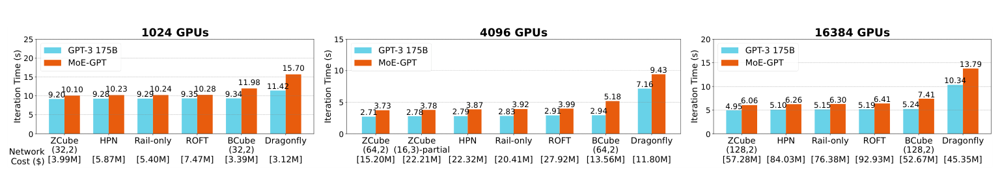
   <em>图 9：不同 GPU 数量下，各拓扑中 GPT-3 175B 和 MoE-GPT 模型的训练迭代时间以及对应网络成本。</em>

  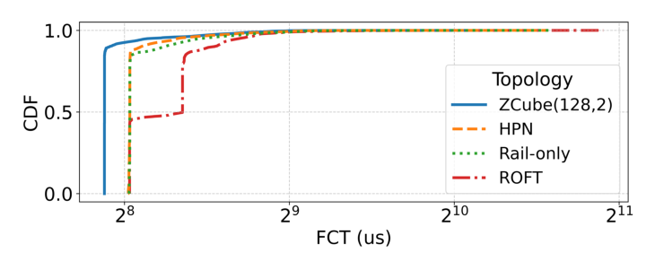
   <em>图 10：16384 GPU 上一次 GPT-3 175B 训练迭代期间 PP 流完成时间的 CDF。</em>

### 6.2 构建并测试真实 ZCube

我们在真实环境中部署 ZCube 拓扑并进行基于 NCCL 的集合通信测试（不含 PP），确认其更高成本效率。测试床包含 4 台服务器和 8 台 Mellanox QM9790 InfiniBand 交换机 [37]。每台服务器有 8 个 NVIDIA H800 GPU，同一服务器内 GPU 通过 200 GB/s NVLink 互连。我们使用 16 个 NVIDIA ConnectX-7 单端口 400GbE NIC [38] 构建 ROFT 拓扑，并使用 16 个 ConnectX-7 双端口 $2 \times 200\mathrm{GbE}$ NIC [38] 构建 ZCube 拓扑，如图 11 所示。为避免测试期间 GPU 之间产生 NIC 带宽竞争，每台服务器只使用 4 个 GPU，总共使用 16 个 GPU 进行集合通信测试。在该配置中，ZCube 和 ROFT 中每个 GPU 都有 400 Gbps 出站带宽，每台服务器总出站带宽为 1.6 Tbps。

对于路由和负载均衡，我们使用手工设计的静态最优路由，以消除流冲突。我们使用 NCCL 2.21.5 [42] 和 nccl-tests [40] 评估性能，并使用 NCCL 中默认集合通信算法。图 12 展示了结果。对于每个数据大小，我们重复测试 100 次，并报告均值和标准差。

  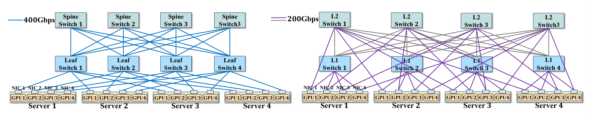
   <em>图 11：真实测试床上的 ROFT 和 ZCube 拓扑图。</em>

  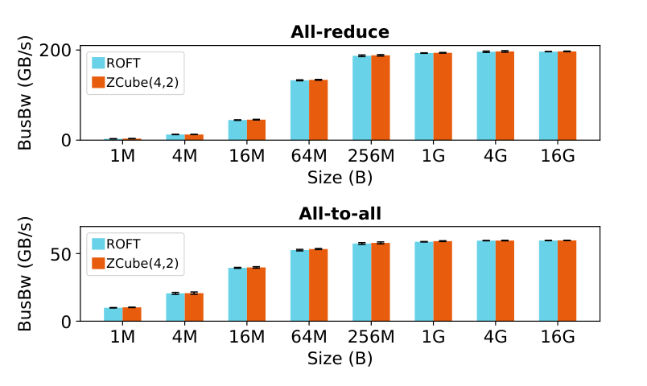
   <em>图 12：真实部署中的集合通信性能。</em>

ZCube 和 ROFT 达到相同 all-reduce 与 all-to-all 性能，而 ZCube 只使用 $48 \times 200\mathrm{G}$ 链路，相比 ROFT 的 $32 \times 400\mathrm{G}$ 链路将硬件成本降低 25%。总之，相比 ROFT、Rail-only 和 HPN 等先进拓扑，ZCube 达到相同理想带宽性能（由相同理论 ForestColl all-gather 性能和图 12 展示），同时具有更低网络成本（图 9 和附录 K）。其更低网络直径（表 2）加速 PP 流，从而提升端到端大模型训练性能（图 9 和图 10）。ZCube 还提供强容错能力（图 3(b)、第 5.2 节和附录 G）。

## 7. 相关工作

DCN 拓扑。Rail-Optimized 拓扑 [39] 常用于大规模集群，但容错较差且成本较高。Rail-only 降低了成本，但仍存在容错能力有限的问题。HPN [44] 通过双 ToR 结构解决容错问题；然而，该设计需要额外链路，因此增加了网络成本。HammingMesh [27] 基于现有深度学习流量模式设计拓扑，降低网络成本。但模型架构变化可能引入更复杂流量，使其无法提升 all-to-all 性能。SlimFly [6] 基于 MMS 图论设计低直径网络拓扑。

拓扑设计方法。虽然目前有多种方法辅助网络设计者进行拓扑设计，大规模自动化拓扑设计和优化仍未被充分探索。Condor [48] 引入拓扑描述语言进行建模，但新拓扑仍需要人工设计。Yijia Chang 等人 [10] 提出统一拓扑建模框架。然而，这些工作仍依赖专家经验，不支持面向性能的优化，因此不能与 ATOP 直接比较。TopoOpt [52] 提出拓扑和并行策略联合优化方法，但它局限于小规模直连拓扑，并需要光交换机。Liangyu Zhao 等人 [59] 关注直连拓扑和集合通信优化。这些工作需要光交换机且可扩展性有限，而 ATOP 的目标是解决基于电交换机的 DCN 拓扑设计问题。因此，我们在评估中不与这些方法比较。

## 8. 结论

本文提出自动化拓扑优化流水线 ATOP，它能够在较短时间内识别优秀的大规模数据中心网络拓扑。ATOP 支持同时优化多个目标，包括网络拓扑性能、硬件成本和容错。ATOP 也支持多种拓扑设计场景，例如构建、优化和扩展数据中心。借助 ATOP，我们发现了 ZCube 这一新拓扑，它具有更高成本效率、低网络直径和强容错。仿真实验表明，相比此前先进拓扑，包括 Rail-optimized Fat-tree（ROFT）、Rail-only 和 HPN，ZCube 将端到端 LLM 训练速度提升 3% 到 7%，并将网络硬件成本降低 26% 到 46%。我们还在真实测试床上构建了 ZCube。结果显示，在保持相同 all-reduce 和 all-to-all 性能的同时，ZCube 相比 ROFT 将硬件成本降低 25%。

## 致谢

作者感谢 shepherd Dr. Manya Ghobadi、匿名 SIGCOMM 评审以及 Weiyang Wang 提出的建设性意见。作者也感谢 ByteDance 的 Weirong Jiang、Lei Wang 和 Lulu Chen 在网络仿真器和真实测试床开发中的帮助。Dan Li 教授和 Li Chen 博士为共同通讯作者。本工作得到国家重点研发计划（2022YFB3105000）、北京市杰出青年科学家计划（No. JWZQ20240101008）和中关村实验室支持。

## 附录

附录为尚未经过同行评审的补充材料。

### A. ATOP 使用场景 4：为多租户设计新数据中心

设置。本节考虑如下场景：建立一个包含 16k GPU 的新数据中心，固定分配给四家公司，每家公司分别使用 4k GPU，范围为 0-4k、4k-8k、8k-12k 和 12k-16k。在该情况下，需要考虑拓扑同时运行多个任务的能力。因此，我们按如下方式修改优化目标：在模拟大模型训练流量时，考虑每 4k GPU 训练一个大模型，总共四个作业。每种流量模式下四个作业的平均作业完成时间作为优化目标。对于拓扑的第二阶段端到端训练评估，我们也使用四个 GPT-3-175B 模型的平均迭代时间，每个模型使用 4k GPU。其他优化目标和配置保持不变，与第 4.1 节和第 4.2.1 节一致。

结果。图 14 展示了该场景下 ATOP 的搜索结果。我们发现，在多租户场景中，ZCube 仍位于 Pareto 前沿拐点，因此是最高成本效率拓扑。

  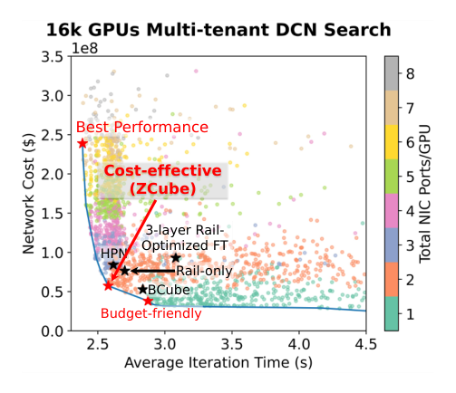
   <em>图 14：为多租户构建新数据中心时 ATOP 的搜索结果。</em>

### B. ATOP 使用场景 5：设计新的异构数据中心

设置。本节考虑如下场景：一个数据中心包含 2048 个 NVIDIA H100 GPU 和 2048 个 NVIDIA A100 GPU，目标是构建 4k GPU 数据中心，并同时使用两种 GPU 训练模型。用户已经购买 NIC，每个 GPU 使用一个单端口 NIC。交换机吞吐限制为 12.8 Tbps。这些严格的拓扑搜索空间约束将 BCube、ZCube 和 HPN 等拓扑排除在搜索空间之外。优化目标与第 4.2.1 节一致，但训练工作负载变为异构。

结果。搜索结果如图 15 所示。最佳性能拓扑在性能（+6%）和成本（-11%）上都优于 ROFT。高成本效率拓扑的性能略低于 ROFT（-2%），但成本仅为 ROFT 的 68%，展示了其成本效率。在该场景中，ATOP 也识别出训练时间和网络成本的 Pareto 前沿，前沿上的拓扑代表潜在候选。用户可以根据预算选择拓扑。该场景还表明，ATOP 可以处理异构集群设置，并在严格受限的搜索空间中识别更好拓扑。

  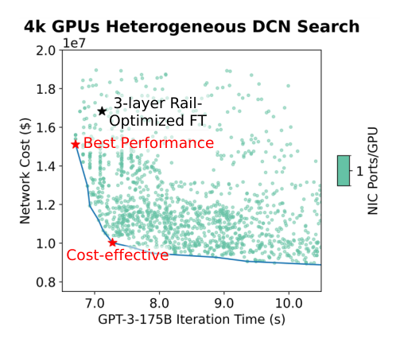
   <em>图 15：在严格搜索空间约束下为异构数据中心构建新拓扑时 ATOP 的搜索结果。</em>

### C. Pareto 最优定义

在多目标优化问题中，目标函数之间通常存在复杂权衡。为保证所有目标之间的公平性，通常使用 Pareto 最优 [9] 解集作为问题解集。在拓扑多目标优化问题中，Pareto 最优拓扑可以形式化描述如下。

定义 1（Pareto 最优拓扑）。对于包含 $m$ 个目标的多目标优化问题：

$$
\min F(x)=\left(f_1(x), f_2(x), \ldots, f_m(x)\right)
$$

拓扑 $x \in X$（其中 $X$ 为所有已发现拓扑的集合）是 Pareto 最优，当且仅当不存在 $x' \in X$，使得对所有 $i \in [1,m]$ 都有 $f_i(x') \le f_i(x)$，并且存在 $j \in [1,m]$ 使得 $f_j(x') < f_j(x)$。

Pareto 最优定义表明，不存在一个拓扑 $x' \in X$ 可以在所有目标上至少与 Pareto 最优拓扑 $x$ 一样好，并在至少一个目标上严格更好。Pareto 最优性保证了优化目标之间的公平性，因为只有在所有指标上都较差的拓扑会被排除出 Pareto 最优集合。该方法也保证了两阶段评估的可行性，因为如果一个拓扑在所有代表性 LLM 训练流量模式上表现都差，它很可能在端到端训练性能上也较差。

### D. ATOP 的收敛性与效率

本节讨论 ATOP 中 NSGA-II 算法的收敛性和搜索效率。

收敛性。我们使用三个指标评估收敛性，如图 16 所示。这些指标包括：随着搜索拓扑总数增加，Pareto 最优拓扑数量的变化；NSGA-II 中不同代 Pareto 最优集合之间的 Jaccard Distance [12]，用于衡量集合变化；以及 HyperVolume [60]，这是多目标优化任务中常用的收敛指标。图 16(a) 和 (b) 展示了 ATOP 在 Pareto 最优集合上的收敛。图 16(c) 展示了 ATOP 在 HyperVolume 指标上的收敛。随着搜索推进，Pareto 最优拓扑数量趋于稳定，没有显著变化；Jaccard Distance 下降并稳定，说明搜索后期 Pareto 最优集合趋于稳定。

  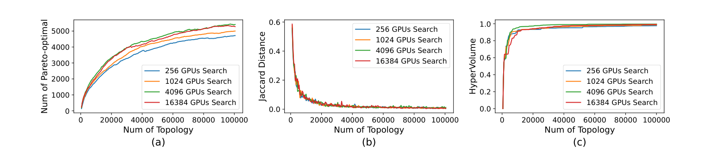
   <em>图 16：ATOP 优化过程中：(a) Pareto 最优拓扑数量与 ATOP 生成拓扑总数之间的关系；(b) 不同代 Pareto 最优拓扑集合之间的 Jaccard 距离；(c) HyperVolume 指标与拓扑总数之间的关系。</em>

效率。在我们的配置中，每个 GPU 规模搜索 100000 个拓扑。对于 256 GPU，ATOP 搜索和两阶段评估总时间为 6.5 小时；对于 1k GPU 为 10.6 小时；对于 4k GPU 为 25.4 小时；对于 16k GPU 为 71.2 小时。大部分时间用于拓扑评估。与数据中心部署通常需要数月相比，这些时间是合理的。

### E. ZCube 直径证明

为了证明 $\mathrm{ZCube}(n,k)$ 的直径，我们首先建立如下引理。

引理 1：在 $\mathrm{ZCube}(n,k+1)$ 中，从任意 level-$k$ 交换机到任意 GPU 的最长最短路径最多为 $k$ 跳。

证明：该引理可用数学归纳法证明。对于 $\mathrm{ZCube}(n,1)$，单台交换机连接 $n$ 个 GPU，路径长度为 0 跳。假设对于 $\mathrm{ZCube}(n,k)$，从任意 level-$(k-1)$ 交换机到任意 GPU 的最长最短路径最多为 $k-1$ 跳。当使用 $n$ 个 $\mathrm{ZCube}(n,k)$ 和 $n^k$ 台交换机构造 $\mathrm{ZCube}(n,k+1)$ 时，每个 $\mathrm{ZCube}(n,k)$ 中每台 level-$(k-1)$ 交换机连接到 $n$ 台不同的 level-$k$ 交换机，并且该过程重复 $n$ 次。因此，任意 level-$k$ 交换机都连接到每个 $\mathrm{ZCube}(n,k)$ 中的一台 level-$(k-1)$ 交换机。由归纳假设，从 level-$k$ 交换机到任意 GPU 的最长路径为 $1+(k-1)=k$ 跳。

接下来证明 $\mathrm{ZCube}(n,k)$ 的网络直径。

定理 1：$\mathrm{ZCube}(n,k)$ 的直径，即所有 GPU 对之间最长最短路径跳数，为 $k$。

证明：可以为 $\mathrm{ZCube}(n,k)$ 中任意一对 GPU 构造如下路径：源 GPU 通过其第 $k$ 个端口将数据发送到 level-$(k-1)$ 交换机。根据引理 1，从任意 level-$(k-1)$ 交换机到任意 GPU 的最长路径最多为 $k-1$ 跳。将这两段路径连接，总路径长度为 $k$ 跳。因此，任意 GPU 对之间的路径长度不超过 $k$ 跳。

定理 2：$\mathrm{ZCube}(n,3)$-partial 的直径为 4。

证明：根据 $\mathrm{ZCube}(n,3)$-partial 定义，它由 $n$ 个 $\mathrm{ZCube}(n,2)$ 结构和 $n^2/2$ 台 level-2 交换机组成。如果源 GPU 和目的 GPU 位于同一个 $\mathrm{ZCube}(n,2)$ 中，则二者通信路径长度不超过 2 跳（定理 1）。如果它们位于不同 $\mathrm{ZCube}(n,2)$ 中，路径可按如下构造：源 GPU 通过第二个端口将数据发送到 level-1 交换机。level-1 与 level-2 交换机以类似 CLOS 的方式互连，可以一跳转到目标 $\mathrm{ZCube}(n,2)$ 中的 level-1 交换机。由于 level-1 交换机与 level-0 交换机形成完全二分图，路径可直接到达目的端的 level-0 交换机。在该构造中，总路径长度不超过 4 跳。

### F. ZCube 的集合通信性能

在第 2 节图 3(a) 和第 6.2 节图 12 中，我们展示了在理想负载均衡下 ZCube 和 ROFT 具有相同 all-to-all 集合通信性能。本节讨论它们在基于 ECMP 的负载均衡下的性能。非阻塞 ROFT 实现全双剖分带宽。然而，理论带宽不保证实际性能。

ROFT 在 all-to-all 流量下会因 ECMP 哈希冲突和哈希极化而出现负载均衡低效。如图 17(a) 所示，穿越不同 pod 的 all-to-all 流可能发生哈希冲突。ROFT 更长的路径长度增加了 ECMP 冲突概率。相比之下，ZCube 的低直径性质减少跳数，因此降低 ECMP 冲突概率。对于 BCube，图 17(b) 表明它在 all-to-all 通信中需要 NIC 级包转发。这不仅消耗 NIC 带宽，也意味着 BCube 不是全双剖分带宽拓扑，因为每个 NIC 必须帮助其他 NIC 转发流量。在 ZCube 中，不需要 NIC 级转发。

  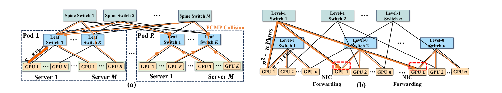
   <em>图 17：两类会降低 all-to-all 性能的场景：(a) ECMP 哈希冲突：在非阻塞两层 Rail-Optimized Fat-Tree 中，N 表示 GPU 总数，N=RMK；跨 pod all-to-all 通信可能因 ECMP 产生流冲突。(b) 非全双剖分带宽拓扑：在 BCube(n,2) 中，GPU 的 NIC 需要为其他 GPU 转发流量，因此它不是全双剖分带宽拓扑。</em>

### G. ZCube 的容错能力

对于 ZCube 的容错能力，我们讨论两种场景：单交换机故障和链路故障。ZCube 在两类故障下都表现优异。

单交换机故障。ZCube 对单交换机故障具有稳健性。当单台交换机故障时，连接到故障交换机的 GPU 可以切换到另一个 NIC 端口。基于流级仿真，我们在图 3(b) 中给出了 4096 GPU ZCube 在单交换机故障下训练 GPT-3 175B 模型时的性能下降。ZCube 的下降仅为 2.8%，而 ROFT 下降 46.9%，HPN 下降 9.0%；同时 ZCube 相比 HPN 降低了 32% 成本。

我们还使用第 3.4 节引入的 $APL_{\mathrm{fail}}$ 评估容错。我们计算无交换机故障时 GPU 对之间的平均路径长度，记为 $APL$。为评估故障前后变化，我们使用 Average Path Stretch（APS），定义为 $APS=(APL_{\mathrm{fail}}-APL)/APL$。我们在拓扑搜索中选择 $APL_{\mathrm{fail}}$ 而非 $APS$ 作为优化目标，是因为 $APL_{\mathrm{fail}}$ 同时考虑了单交换机故障下性能和拓扑直径。

我们考虑两种场景：8 GPU 服务器内部互连，以及不存在服务器内部互连。对于包含服务器内部连接的场景，我们把同一服务器内 GPU 对之间通信路径长度视为 1，其中 8 个 GPU 构成 full-mesh 拓扑。表 3 的结果表明，$\mathrm{ZCube}(n,2)$ 因低网络直径而具有最低 $APL$ 和 $APL_{\mathrm{fail}}$，并且相比 ROFT 和 Dragonfly 拓扑受单交换机故障影响更小。由于双 ToR 架构，HPN 拓扑在故障前后 GPU 对平均路径长度没有变化。

<table align="center" style="display: table; margin-left: auto; margin-right: auto; text-align: center;">
  <tr><th align="center" style="text-align: center;">GPU 规模</th><th align="center" style="text-align: center;">拓扑</th><th align="center" style="text-align: center;">APL</th><th align="center" style="text-align: center;">APLfail</th><th align="center" style="text-align: center;">APS (×10-4)</th><th align="center" style="text-align: center;">APL∗</th><th align="center" style="text-align: center;">APL∗fail</th><th align="center" style="text-align: center;">APS∗ (×10-4)</th></tr>
  <tr><td align="center" style="text-align: center;">1024 GPUs</td><td align="center" style="text-align: center;">ROFT</td><td align="center" style="text-align: center;">5.47214</td><td align="center" style="text-align: center;">-</td><td align="center" style="text-align: center;">-</td><td align="center" style="text-align: center;">5.34897</td><td align="center" style="text-align: center;">5.36011</td><td align="center" style="text-align: center;">20.82644</td></tr>
  <tr><td align="center" style="text-align: center;">1024 GPUs</td><td align="center" style="text-align: center;">Rail-only</td><td align="center" style="text-align: center;">-</td><td align="center" style="text-align: center;">-</td><td align="center" style="text-align: center;">-</td><td align="center" style="text-align: center;">4.61388</td><td align="center" style="text-align: center;">4.61631</td><td align="center" style="text-align: center;">5.26672</td></tr>
  <tr><td align="center" style="text-align: center;">1024 GPUs</td><td align="center" style="text-align: center;">Dragonfly</td><td align="center" style="text-align: center;">4.67867</td><td align="center" style="text-align: center;">-</td><td align="center" style="text-align: center;">-</td><td align="center" style="text-align: center;">4.62732</td><td align="center" style="text-align: center;">4.63901</td><td align="center" style="text-align: center;">25.26300</td></tr>
  <tr><td align="center" style="text-align: center;">1024 GPUs</td><td align="center" style="text-align: center;">BCube(32,2)</td><td align="center" style="text-align: center;">3.87879</td><td align="center" style="text-align: center;">3.88258</td><td align="center" style="text-align: center;">9.77109</td><td align="center" style="text-align: center;">3.65982</td><td align="center" style="text-align: center;">3.66224</td><td align="center" style="text-align: center;">6.61235</td></tr>
  <tr><td align="center" style="text-align: center;">1024 GPUs</td><td align="center" style="text-align: center;">HPN</td><td align="center" style="text-align: center;">3.93939</td><td align="center" style="text-align: center;">3.93939</td><td align="center" style="text-align: center;">0</td><td align="center" style="text-align: center;">3.76918</td><td align="center" style="text-align: center;">3.76918</td><td align="center" style="text-align: center;">0</td></tr>
  <tr><td align="center" style="text-align: center;">1024 GPUs</td><td align="center" style="text-align: center;">ZCube(32,2)</td><td align="center" style="text-align: center;">2.93939</td><td align="center" style="text-align: center;">2.94129</td><td align="center" style="text-align: center;">6.46393</td><td align="center" style="text-align: center;">2.93255</td><td align="center" style="text-align: center;">2.93423</td><td align="center" style="text-align: center;">5.72880</td></tr>
  <tr><td align="center" style="text-align: center;">4096 GPUs</td><td align="center" style="text-align: center;">ROFT</td><td align="center" style="text-align: center;">5.48523</td><td align="center" style="text-align: center;">-</td><td align="center" style="text-align: center;">-</td><td align="center" style="text-align: center;">5.42711</td><td align="center" style="text-align: center;">5.43301</td><td align="center" style="text-align: center;">10.87135</td></tr>
  <tr><td align="center" style="text-align: center;">4096 GPUs</td><td align="center" style="text-align: center;">Rail-only</td><td align="center" style="text-align: center;">-</td><td align="center" style="text-align: center;">-</td><td align="center" style="text-align: center;">-</td><td align="center" style="text-align: center;">4.74725</td><td align="center" style="text-align: center;">4.74851</td><td align="center" style="text-align: center;">2.65417</td></tr>
  <tr><td align="center" style="text-align: center;">4096 GPUs</td><td align="center" style="text-align: center;">Dragonfly</td><td align="center" style="text-align: center;">4.79810</td><td align="center" style="text-align: center;">-</td><td align="center" style="text-align: center;">-</td><td align="center" style="text-align: center;">4.77709</td><td align="center" style="text-align: center;">4.78088</td><td align="center" style="text-align: center;">7.93370</td></tr>
  <tr><td align="center" style="text-align: center;">4096 GPUs</td><td align="center" style="text-align: center;">BCube(64,2)</td><td align="center" style="text-align: center;">3.93846</td><td align="center" style="text-align: center;">3.93942</td><td align="center" style="text-align: center;">2.43750</td><td align="center" style="text-align: center;">3.82906</td><td align="center" style="text-align: center;">3.82973</td><td align="center" style="text-align: center;">1.74978</td></tr>
  <tr><td align="center" style="text-align: center;">4096 GPUs</td><td align="center" style="text-align: center;">BCube(16,3)</td><td align="center" style="text-align: center;">5.62637</td><td align="center" style="text-align: center;">5.62643</td><td align="center" style="text-align: center;">0.10664</td><td align="center" style="text-align: center;">5.18877</td><td align="center" style="text-align: center;">5.18889</td><td align="center" style="text-align: center;">0.23127</td></tr>
  <tr><td align="center" style="text-align: center;">4096 GPUs</td><td align="center" style="text-align: center;">HPN</td><td align="center" style="text-align: center;">3.93797</td><td align="center" style="text-align: center;">3.93797</td><td align="center" style="text-align: center;">0</td><td align="center" style="text-align: center;">3.71575</td><td align="center" style="text-align: center;">3.71575</td><td align="center" style="text-align: center;">0</td></tr>
  <tr><td align="center" style="text-align: center;">4096 GPUs</td><td align="center" style="text-align: center;">ZCube(64,2)</td><td align="center" style="text-align: center;">2.96923</td><td align="center" style="text-align: center;">2.96971</td><td align="center" style="text-align: center;">1.61658</td><td align="center" style="text-align: center;">2.96752</td><td align="center" style="text-align: center;">2.96798</td><td align="center" style="text-align: center;">1.55012</td></tr>
  <tr><td align="center" style="text-align: center;">4096 GPUs</td><td align="center" style="text-align: center;">ZCube(16,3)</td><td align="center" style="text-align: center;">3.80975</td><td align="center" style="text-align: center;">3.81007</td><td align="center" style="text-align: center;">0.83995</td><td align="center" style="text-align: center;">3.78561</td><td align="center" style="text-align: center;">3.78591</td><td align="center" style="text-align: center;">0.79247</td></tr>
  <tr><td align="center" style="text-align: center;">4096 GPUs</td><td align="center" style="text-align: center;">ZCube(16,3)-partial</td><td align="center" style="text-align: center;">4.75092</td><td align="center" style="text-align: center;">4.75130</td><td align="center" style="text-align: center;">0.79985</td><td align="center" style="text-align: center;">4.74921</td><td align="center" style="text-align: center;">4.74959</td><td align="center" style="text-align: center;">0.80013</td></tr>
  <tr><td align="center" style="text-align: center;">16384 GPUs</td><td align="center" style="text-align: center;">ROFT</td><td align="center" style="text-align: center;">5.49240</td><td align="center" style="text-align: center;">-</td><td align="center" style="text-align: center;">-</td><td align="center" style="text-align: center;">5.46420</td><td align="center" style="text-align: center;">5.46724</td><td align="center" style="text-align: center;">5.56349</td></tr>
  <tr><td align="center" style="text-align: center;">16384 GPUs</td><td align="center" style="text-align: center;">Rail-only</td><td align="center" style="text-align: center;">-</td><td align="center" style="text-align: center;">-</td><td align="center" style="text-align: center;">-</td><td align="center" style="text-align: center;">4.81182</td><td align="center" style="text-align: center;">4.81246</td><td align="center" style="text-align: center;">1.33006</td></tr>
  <tr><td align="center" style="text-align: center;">16384 GPUs</td><td align="center" style="text-align: center;">Dragonfly</td><td align="center" style="text-align: center;">4.85422</td><td align="center" style="text-align: center;">-</td><td align="center" style="text-align: center;">-</td><td align="center" style="text-align: center;">4.85379</td><td align="center" style="text-align: center;">4.85455</td><td align="center" style="text-align: center;">1.56579</td></tr>
  <tr><td align="center" style="text-align: center;">16384 GPUs</td><td align="center" style="text-align: center;">BCube(128,2)</td><td align="center" style="text-align: center;">3.96899</td><td align="center" style="text-align: center;">3.96923</td><td align="center" style="text-align: center;">0.60469</td><td align="center" style="text-align: center;">3.91430</td><td align="center" style="text-align: center;">3.91448</td><td align="center" style="text-align: center;">0.45985</td></tr>
  <tr><td align="center" style="text-align: center;">16384 GPUs</td><td align="center" style="text-align: center;">HPN</td><td align="center" style="text-align: center;">3.98450</td><td align="center" style="text-align: center;">3.98450</td><td align="center" style="text-align: center;">0</td><td align="center" style="text-align: center;">3.92895</td><td align="center" style="text-align: center;">3.92895</td><td align="center" style="text-align: center;">0</td></tr>
  <tr><td align="center" style="text-align: center;">16384 GPUs</td><td align="center" style="text-align: center;">ZCube(128,2)</td><td align="center" style="text-align: center;">2.98450</td><td align="center" style="text-align: center;">2.98462</td><td align="center" style="text-align: center;">0.40208</td><td align="center" style="text-align: center;">2.98407</td><td align="center" style="text-align: center;">2.98419</td><td align="center" style="text-align: center;">0.40214</td></tr>
</table>

<em>表 3：单交换机故障前后，不同拓扑中 GPU 对之间的平均通信路径长度和平均路径拉伸。∗ 表示考虑服务器内部互连，同一服务器内通信路径长度视为 1。</em>

链路故障。ZCube 在链路故障下表现出平滑性能下降。我们随机选择一部分网络链路作为故障链路，并使用流级网络仿真器在故障拓扑上测量 10 GB group all-to-all 通信的作业完成时间（JCT）。我们在 4096 GPU 规模上评估 8 种拓扑，将 RDMA 网络链路故障率从 1% 改变到 15%，每个测试重复 100 次以计算 JCT 均值和标准差。与第 4.1 节设置一致，8 GPU 服务器内部连接被考虑但不会故障。图 18 的结果表明，ZCube 在链路故障下性能下降更平滑，标准差也更小。

  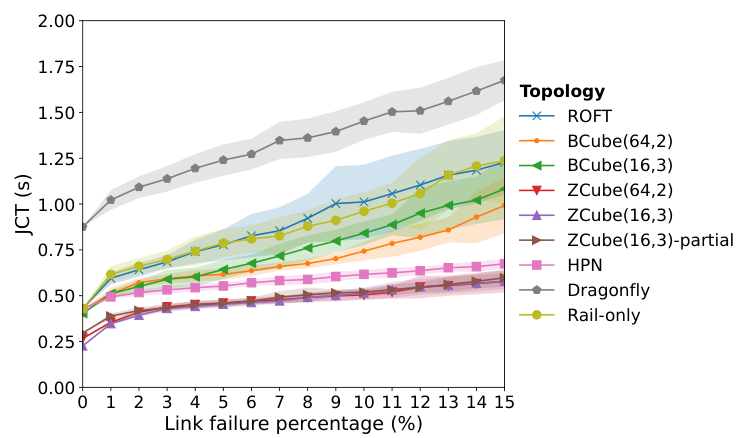
   <em>图 18：4096 GPU 上链路故障时，不同拓扑下 group all-to-all 通信的平均 JCT；阴影表示 JCT 标准差。</em>

### H. 包级网络仿真器与真实测试床的比较

本节比较我们的包级网络仿真器与第 6.2 节中的真实测试床。我们在仿真器中复现第 6.2 节相同拓扑配置，并评估两种集合通信原语：all-reduce 和 all-to-all。仿真器设置遵循第 6.1 节配置，使用 packet spraying 进行路由和负载均衡。如图 19 所示，仿真器与真实测试床之间的平均误差仅为 5%。

  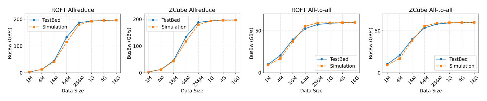
   <em>图 19：包级网络仿真（使用 packet spraying 负载均衡）与第 6.2 节真实测试床的比较。</em>

### I. 流级网络仿真器与 NS-3 的比较

本节比较 NS-3 网络仿真器结果与我们流级网络仿真器结果之间的相对误差。由于 NS-3 仿真效率较低，我们只比较 64 和 256 GPU 规模下的拓扑，包括 ROFT、Dragonfly、BCube、HPN 和 ZCube。流级仿真器配置与第 4.1 节一致。对于 NS-3 配置，我们将链路时延设为 5 微秒，并使用 ECMP 进行负载均衡。

我们首先评估在 64 和 256 GPU 规模下，使用 “Astra-Sim 2.0 + NS-3” 与 “Astra-Sim 2.0 + flow-level simulator” 仿真 GPT-3-22B 模型训练时迭代时间的相对误差，如表 4 所示。训练迭代时间平均相对误差仅为 1.5%，说明流级仿真精度足以用于评估拓扑性能。此外，我们评估了 64 GPU 上存在流冲突和拥塞场景时，一个 64 MB all-to-all 集合通信任务作业完成时间的相对误差。如表 5 所示，作业完成时间平均相对误差仅为 4.3%，进一步验证了流级仿真器精度。最后，图 20 展示了 256 GPU ZCube 拓扑上 GPT-3-22B 模型训练工作负载的流完成时间（FCT）CDF 比较，以及 64 GPU ZCube 拓扑上 all-to-all 集合通信的 FCT CDF 比较，进一步验证了流级网络仿真器的高保真度。

  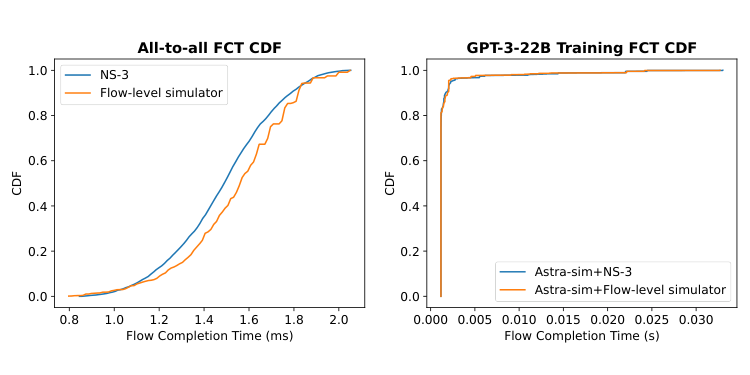
   <em>图 20：NS-3 与流级仿真器之间流完成时间 CDF 的比较。</em>

<table align="center" style="display: table; margin-left: auto; margin-right: auto; text-align: center;">
  <tr><th align="center" style="text-align: center;">GPU 规模</th><th align="center" style="text-align: center;">拓扑</th><th align="center" style="text-align: center;">NS-3 结果 (s)</th><th align="center" style="text-align: center;">流级结果 (s)</th><th align="center" style="text-align: center;">相对误差</th></tr>
  <tr><td align="center" style="text-align: center;">64 GPUs</td><td align="center" style="text-align: center;">ROFT</td><td align="center" style="text-align: center;">2.497</td><td align="center" style="text-align: center;">2.457</td><td align="center" style="text-align: center;">1.6%</td></tr>
  <tr><td align="center" style="text-align: center;">64 GPUs</td><td align="center" style="text-align: center;">Dragonfly</td><td align="center" style="text-align: center;">3.383</td><td align="center" style="text-align: center;">3.257</td><td align="center" style="text-align: center;">3.7%</td></tr>
  <tr><td align="center" style="text-align: center;">64 GPUs</td><td align="center" style="text-align: center;">BCube(8,2)</td><td align="center" style="text-align: center;">2.479</td><td align="center" style="text-align: center;">2.423</td><td align="center" style="text-align: center;">2.3%</td></tr>
  <tr><td align="center" style="text-align: center;">64 GPUs</td><td align="center" style="text-align: center;">HPN</td><td align="center" style="text-align: center;">2.413</td><td align="center" style="text-align: center;">2.395</td><td align="center" style="text-align: center;">0.8%</td></tr>
  <tr><td align="center" style="text-align: center;">64 GPUs</td><td align="center" style="text-align: center;">ZCube(8,2)</td><td align="center" style="text-align: center;">2.373</td><td align="center" style="text-align: center;">2.364</td><td align="center" style="text-align: center;">0.3%</td></tr>
  <tr><td align="center" style="text-align: center;">256 GPUs</td><td align="center" style="text-align: center;">ROFT</td><td align="center" style="text-align: center;">2.421</td><td align="center" style="text-align: center;">2.455</td><td align="center" style="text-align: center;">1.4%</td></tr>
  <tr><td align="center" style="text-align: center;">256 GPUs</td><td align="center" style="text-align: center;">Dragonfly</td><td align="center" style="text-align: center;">3.121</td><td align="center" style="text-align: center;">3.220</td><td align="center" style="text-align: center;">3.2%</td></tr>
  <tr><td align="center" style="text-align: center;">256 GPUs</td><td align="center" style="text-align: center;">BCube(16,2)</td><td align="center" style="text-align: center;">2.277</td><td align="center" style="text-align: center;">2.295</td><td align="center" style="text-align: center;">0.8%</td></tr>
  <tr><td align="center" style="text-align: center;">256 GPUs</td><td align="center" style="text-align: center;">HPN</td><td align="center" style="text-align: center;">2.247</td><td align="center" style="text-align: center;">2.235</td><td align="center" style="text-align: center;">0.5%</td></tr>
  <tr><td align="center" style="text-align: center;">256 GPUs</td><td align="center" style="text-align: center;">ZCube(16,2)</td><td align="center" style="text-align: center;">2.198</td><td align="center" style="text-align: center;">2.193</td><td align="center" style="text-align: center;">0.2%</td></tr>
</table>

<em>表 4：使用不同网络仿真器作为 Astra-Sim 2.0 [54] 网络后端时，GPT-3-22B 模型训练时间仿真结果。</em>

<table align="center" style="display: table; margin-left: auto; margin-right: auto; text-align: center;">
  <tr><th align="center" style="text-align: center;">拓扑</th><th align="center" style="text-align: center;">NS-3 结果 (ms)</th><th align="center" style="text-align: center;">流级结果 (ms)</th><th align="center" style="text-align: center;">相对误差</th></tr>
  <tr><td align="center" style="text-align: center;">ROFT</td><td align="center" style="text-align: center;">4.511</td><td align="center" style="text-align: center;">4.841</td><td align="center" style="text-align: center;">7.3%</td></tr>
  <tr><td align="center" style="text-align: center;">Dragonfly</td><td align="center" style="text-align: center;">5.204</td><td align="center" style="text-align: center;">5.473</td><td align="center" style="text-align: center;">5.2%</td></tr>
  <tr><td align="center" style="text-align: center;">BCube(8,2)</td><td align="center" style="text-align: center;">3.977</td><td align="center" style="text-align: center;">4.057</td><td align="center" style="text-align: center;">2.0%</td></tr>
  <tr><td align="center" style="text-align: center;">HPN</td><td align="center" style="text-align: center;">2.608</td><td align="center" style="text-align: center;">2.742</td><td align="center" style="text-align: center;">5.1%</td></tr>
  <tr><td align="center" style="text-align: center;">ZCube(8,2)</td><td align="center" style="text-align: center;">2.052</td><td align="center" style="text-align: center;">2.011</td><td align="center" style="text-align: center;">2.0%</td></tr>
</table>

<em>表 5：使用不同网络仿真器时，64 MB all-to-all 集合通信作业完成时间。</em>

### J. 不同超参数优化算法的评估

目前，ATOP 拓扑优化器支持多种超参数优化算法，包括 NSGA-II、Bayesian optimization [5]、Quasi Monte Carlo（QMC）[43] 和 Random Search。

通过实践实验，我们发现 NSGA-II 在我们定义的问题和搜索空间中表现最佳，在效率和性能之间取得了平衡。使用 NSGA-II，我们在测试床上用 10.6 小时完成了 1024 GPU 下 100000 个拓扑的搜索。在相同环境和时间内，Bayesian optimization 只探索了 1000 个拓扑，QMC 探索了 26000 个拓扑，random search 探索了 130000 个拓扑。这些算法都没有使 Pareto 最优拓扑集合收敛，也没有识别出 GPT-3 训练时间与网络成本之间的 Pareto 前沿。

### K. 构建 16384 GPU 集群时 ROFT、Rail-only、HPN 和 ZCube 的拓扑图与比较

本节给出使用常见 Broadcom Tomahawk 5 [22] 交换机（交换芯片吞吐为 51.2 Tbps）构建 16384 GPU 集群时 ROFT（图 21）、Rail-only（图 22）、HPN（图 23）和 $\mathrm{ZCube}(128,2)$（图 24）的拓扑图。所有服务器都配置 8 个 GPU 和 $8 \times 400\mathrm{G}$ NIC，这是最常见配置之一 [39]。为尽可能减少交换机数量，所有交换机端口都被充分利用。

  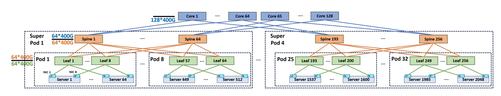
   <em>图 21：基于 51.2 Tbps 交换机的 16384 GPU 集群 ROFT 拓扑。</em>

  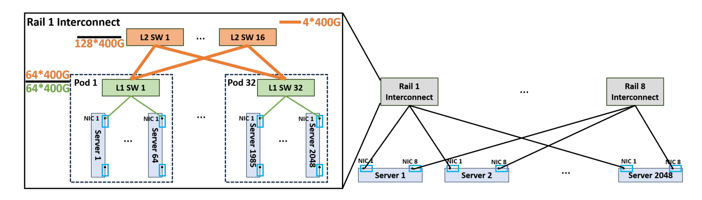
   <em>图 22：基于 51.2 Tbps 交换机的 16384 GPU 集群 Rail-only 拓扑。每个 Rail-interconnection 采用两层 CLOS 架构，与 [51] 和 [57] 一致。</em>

  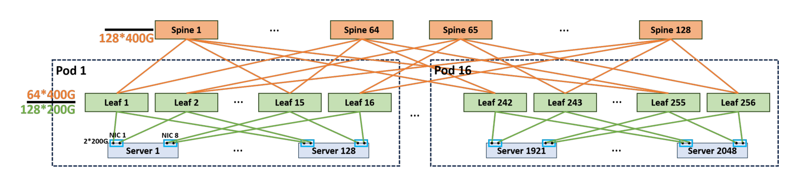
   <em>图 23：基于 51.2 Tbps 交换机的 16384 GPU 集群 HPN 拓扑，即 ROFT 的双端口设计。</em>

  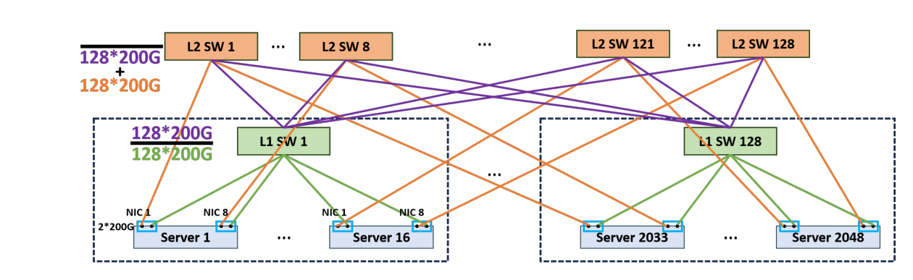
   <em>图 24：基于 51.2 Tbps 交换机的 16384 GPU 集群 ZCube(128,2) 拓扑。</em>

表 6 总结了构建这些拓扑所需的交换机和线缆数量，展示了 ZCube 的低成本。这些拓扑提供相同 ForestColl all-gather 性能。然而，由于 ZCube 网络直径较低，它加速了 PP 流量，因此相比其他拓扑具有更好的训练性能，如第 6.1 节所述。

<table align="center" style="display: table; margin-left: auto; margin-right: auto; text-align: center;">
  <tr><th align="center" style="text-align: center;">拓扑</th><th align="center" style="text-align: center;">交换机 (51.2 Tbps)</th><th align="center" style="text-align: center;">线缆（数量 × 带宽）</th></tr>
  <tr><td align="center" style="text-align: center;">ROFT</td><td align="center" style="text-align: center;">640</td><td align="center" style="text-align: center;">49152 × 400G</td></tr>
  <tr><td align="center" style="text-align: center;">Rail-only</td><td align="center" style="text-align: center;">384</td><td align="center" style="text-align: center;">32768 × 400G</td></tr>
  <tr><td align="center" style="text-align: center;">HPN</td><td align="center" style="text-align: center;">384</td><td align="center" style="text-align: center;">16384 × 400G + 32768 × 200G</td></tr>
  <tr><td align="center" style="text-align: center;">ZCube(128,2)</td><td align="center" style="text-align: center;">256</td><td align="center" style="text-align: center;">49152 × 200G</td></tr>
</table>

<em>表 6：使用 51.2 Tbps 交换机构建 16384 GPU 集群时，不同拓扑所需交换机和线缆数量。</em>

### L. 被评估拓扑的配置

表 7 给出了第 6.1 节中评估拓扑的配置，包括交换机数量和 radix、线缆数量（铜缆和光纤）、光模块数量以及每 GPU 网络接口卡（NIC）端口数。对于 ROFT，我们构造非阻塞三层 Rail-Optimized Fat-Tree。对于 Dragonfly 拓扑，我们设置参数 $a=2p=2h$ [32]。对于 HPN 拓扑，我们与 Alibaba HPN [44] 设计保持一致。每个 segment 内的连接遵循多 rail 策略和双 ToR 架构。我们也使用非阻塞配置。具体来说，对于 16k GPU 规模，每台 ToR 交换机下行带宽为 $128 \times 200\mathrm{Gbps}$，上行带宽为 $64 \times 400\mathrm{Gbps}$。

对于 ROFT 和 HPN，由于它们在 NIC 和 ToR 交换机之间采用 multi-rail 互连方法，需要更长距离，因此使用光纤。对于 BCube 和 ZCube，由于同一服务器上的 NIC 连接到同一 ToR，NIC 与第一层交换机之间使用铜缆，其他互连使用光纤。对于 Dragonfly，组内互连使用铜缆，组间互连使用光纤。

<table align="center" style="display: table; margin-left: auto; margin-right: auto; text-align: center;">
  <tr><th align="center" style="text-align: center;">GPU 规模</th><th align="center" style="text-align: center;">拓扑</th><th align="center" style="text-align: center;">交换机数</th><th align="center" style="text-align: center;">Radix</th><th align="center" style="text-align: center;">铜缆</th><th align="center" style="text-align: center;">光纤</th><th align="center" style="text-align: center;">光模块</th><th align="center" style="text-align: center;">NIC 端口/GPU</th></tr>
  <tr><td align="center" style="text-align: center;">1024 GPUs</td><td align="center" style="text-align: center;">ROFT</td><td align="center" style="text-align: center;">160</td><td align="center" style="text-align: center;">32 × 400G</td><td align="center" style="text-align: center;">0</td><td align="center" style="text-align: center;">3072</td><td align="center" style="text-align: center;">6144</td><td align="center" style="text-align: center;">1</td></tr>
  <tr><td align="center" style="text-align: center;">1024 GPUs</td><td align="center" style="text-align: center;">Rail-only</td><td align="center" style="text-align: center;">96</td><td align="center" style="text-align: center;">32 × 400G</td><td align="center" style="text-align: center;">0</td><td align="center" style="text-align: center;">2048</td><td align="center" style="text-align: center;">4096</td><td align="center" style="text-align: center;">1</td></tr>
  <tr><td align="center" style="text-align: center;">1024 GPUs</td><td align="center" style="text-align: center;">Dragonfly</td><td align="center" style="text-align: center;">264</td><td align="center" style="text-align: center;">15 × 400G</td><td align="center" style="text-align: center;">1980</td><td align="center" style="text-align: center;">528</td><td align="center" style="text-align: center;">1056</td><td align="center" style="text-align: center;">1</td></tr>
  <tr><td align="center" style="text-align: center;">1024 GPUs</td><td align="center" style="text-align: center;">BCube(32,2)</td><td align="center" style="text-align: center;">64</td><td align="center" style="text-align: center;">32 × 200G</td><td align="center" style="text-align: center;">1024</td><td align="center" style="text-align: center;">1024</td><td align="center" style="text-align: center;">2048</td><td align="center" style="text-align: center;">2</td></tr>
  <tr><td align="center" style="text-align: center;">1024 GPUs</td><td align="center" style="text-align: center;">HPN</td><td align="center" style="text-align: center;">96</td><td align="center" style="text-align: center;">64 × 200G</td><td align="center" style="text-align: center;">0</td><td align="center" style="text-align: center;">3072</td><td align="center" style="text-align: center;">6144</td><td align="center" style="text-align: center;">2</td></tr>
  <tr><td align="center" style="text-align: center;">1024 GPUs</td><td align="center" style="text-align: center;">ZCube(32,2)</td><td align="center" style="text-align: center;">64</td><td align="center" style="text-align: center;">64 × 200G</td><td align="center" style="text-align: center;">1024</td><td align="center" style="text-align: center;">2048</td><td align="center" style="text-align: center;">4096</td><td align="center" style="text-align: center;">2</td></tr>
  <tr><td align="center" style="text-align: center;">4096 GPUs</td><td align="center" style="text-align: center;">ROFT</td><td align="center" style="text-align: center;">320</td><td align="center" style="text-align: center;">64 × 400G</td><td align="center" style="text-align: center;">0</td><td align="center" style="text-align: center;">12288</td><td align="center" style="text-align: center;">24576</td><td align="center" style="text-align: center;">1</td></tr>
  <tr><td align="center" style="text-align: center;">4096 GPUs</td><td align="center" style="text-align: center;">Rail-only</td><td align="center" style="text-align: center;">192</td><td align="center" style="text-align: center;">64 × 400G</td><td align="center" style="text-align: center;">0</td><td align="center" style="text-align: center;">8192</td><td align="center" style="text-align: center;">16384</td><td align="center" style="text-align: center;">1</td></tr>
  <tr><td align="center" style="text-align: center;">4096 GPUs</td><td align="center" style="text-align: center;">Dragonfly</td><td align="center" style="text-align: center;">876</td><td align="center" style="text-align: center;">23 × 400G</td><td align="center" style="text-align: center;">10074</td><td align="center" style="text-align: center;">2628</td><td align="center" style="text-align: center;">5256</td><td align="center" style="text-align: center;">1</td></tr>
  <tr><td align="center" style="text-align: center;">4096 GPUs</td><td align="center" style="text-align: center;">BCube(64,2)</td><td align="center" style="text-align: center;">128</td><td align="center" style="text-align: center;">64 × 200G</td><td align="center" style="text-align: center;">4096</td><td align="center" style="text-align: center;">4096</td><td align="center" style="text-align: center;">8192</td><td align="center" style="text-align: center;">2</td></tr>
  <tr><td align="center" style="text-align: center;">4096 GPUs</td><td align="center" style="text-align: center;">HPN</td><td align="center" style="text-align: center;">192</td><td align="center" style="text-align: center;">128 × 200G</td><td align="center" style="text-align: center;">0</td><td align="center" style="text-align: center;">12288</td><td align="center" style="text-align: center;">24576</td><td align="center" style="text-align: center;">2</td></tr>
  <tr><td align="center" style="text-align: center;">4096 GPUs</td><td align="center" style="text-align: center;">ZCube(16,3)-partial</td><td align="center" style="text-align: center;">640</td><td align="center" style="text-align: center;">48 × 200G</td><td align="center" style="text-align: center;">4096</td><td align="center" style="text-align: center;">12288</td><td align="center" style="text-align: center;">24576</td><td align="center" style="text-align: center;">2</td></tr>
  <tr><td align="center" style="text-align: center;">4096 GPUs</td><td align="center" style="text-align: center;">ZCube(64,2)</td><td align="center" style="text-align: center;">128</td><td align="center" style="text-align: center;">128 × 200G</td><td align="center" style="text-align: center;">4096</td><td align="center" style="text-align: center;">8192</td><td align="center" style="text-align: center;">16384</td><td align="center" style="text-align: center;">2</td></tr>
  <tr><td align="center" style="text-align: center;">16384 GPUs</td><td align="center" style="text-align: center;">ROFT</td><td align="center" style="text-align: center;">640</td><td align="center" style="text-align: center;">128 × 400G</td><td align="center" style="text-align: center;">0</td><td align="center" style="text-align: center;">49152</td><td align="center" style="text-align: center;">98304</td><td align="center" style="text-align: center;">1</td></tr>
  <tr><td align="center" style="text-align: center;">16384 GPUs</td><td align="center" style="text-align: center;">Rail-only</td><td align="center" style="text-align: center;">384</td><td align="center" style="text-align: center;">128 × 400G</td><td align="center" style="text-align: center;">0</td><td align="center" style="text-align: center;">32768</td><td align="center" style="text-align: center;">65536</td><td align="center" style="text-align: center;">1</td></tr>
  <tr><td align="center" style="text-align: center;">16384 GPUs</td><td align="center" style="text-align: center;">Dragonfly</td><td align="center" style="text-align: center;">2064</td><td align="center" style="text-align: center;">31 × 400G</td><td align="center" style="text-align: center;">31992</td><td align="center" style="text-align: center;">8256</td><td align="center" style="text-align: center;">16512</td><td align="center" style="text-align: center;">1</td></tr>
  <tr><td align="center" style="text-align: center;">16384 GPUs</td><td align="center" style="text-align: center;">BCube(128,2)</td><td align="center" style="text-align: center;">256</td><td align="center" style="text-align: center;">128 × 200G</td><td align="center" style="text-align: center;">16384</td><td align="center" style="text-align: center;">16384</td><td align="center" style="text-align: center;">32768</td><td align="center" style="text-align: center;">2</td></tr>
  <tr><td align="center" style="text-align: center;">16384 GPUs</td><td align="center" style="text-align: center;">HPN (16 Segment)</td><td align="center" style="text-align: center;">384</td><td align="center" style="text-align: center;">256 × 200G</td><td align="center" style="text-align: center;">0</td><td align="center" style="text-align: center;">49152</td><td align="center" style="text-align: center;">98304</td><td align="center" style="text-align: center;">2</td></tr>
  <tr><td align="center" style="text-align: center;">16384 GPUs</td><td align="center" style="text-align: center;">ZCube(128,2)</td><td align="center" style="text-align: center;">256</td><td align="center" style="text-align: center;">256 × 200G</td><td align="center" style="text-align: center;">16384</td><td align="center" style="text-align: center;">32768</td><td align="center" style="text-align: center;">65536</td><td align="center" style="text-align: center;">2</td></tr>
</table>

<em>表 7：第 6 节中被评估拓扑的配置。</em>

<table align="center" style="display: table; margin-left: auto; margin-right: auto; text-align: center;">
  <tr><th align="center" style="text-align: center;">GPU 规模</th><th align="center" style="text-align: center;">模型大小</th><th align="center" style="text-align: center;">Attention Heads</th><th align="center" style="text-align: center;">Hidden Size</th><th align="center" style="text-align: center;">Layers</th><th align="center" style="text-align: center;">TP Size</th><th align="center" style="text-align: center;">DP Size</th><th align="center" style="text-align: center;">PP Size</th><th align="center" style="text-align: center;">Global Batch Size</th><th align="center" style="text-align: center;">Micro-batch Size</th><th align="center" style="text-align: center;">Number of Interleaved Stages</th></tr>
  <tr><td align="center" style="text-align: center;">256 GPUs</td><td align="center" style="text-align: center;">22B</td><td align="center" style="text-align: center;">64</td><td align="center" style="text-align: center;">6144</td><td align="center" style="text-align: center;">48</td><td align="center" style="text-align: center;">8</td><td align="center" style="text-align: center;">4</td><td align="center" style="text-align: center;">8</td><td align="center" style="text-align: center;">384</td><td align="center" style="text-align: center;">1</td><td align="center" style="text-align: center;">3</td></tr>
  <tr><td align="center" style="text-align: center;">1024 GPUs</td><td align="center" style="text-align: center;">175B</td><td align="center" style="text-align: center;">96</td><td align="center" style="text-align: center;">12288</td><td align="center" style="text-align: center;">96</td><td align="center" style="text-align: center;">8</td><td align="center" style="text-align: center;">16</td><td align="center" style="text-align: center;">8</td><td align="center" style="text-align: center;">1536</td><td align="center" style="text-align: center;">1</td><td align="center" style="text-align: center;">3</td></tr>
  <tr><td align="center" style="text-align: center;">4096 GPUs</td><td align="center" style="text-align: center;">175B</td><td align="center" style="text-align: center;">96</td><td align="center" style="text-align: center;">12288</td><td align="center" style="text-align: center;">96</td><td align="center" style="text-align: center;">8</td><td align="center" style="text-align: center;">64</td><td align="center" style="text-align: center;">8</td><td align="center" style="text-align: center;">1536</td><td align="center" style="text-align: center;">1</td><td align="center" style="text-align: center;">3</td></tr>
  <tr><td align="center" style="text-align: center;">16384 GPUs</td><td align="center" style="text-align: center;">175B</td><td align="center" style="text-align: center;">96</td><td align="center" style="text-align: center;">12288</td><td align="center" style="text-align: center;">96</td><td align="center" style="text-align: center;">8</td><td align="center" style="text-align: center;">256</td><td align="center" style="text-align: center;">8</td><td align="center" style="text-align: center;">6144</td><td align="center" style="text-align: center;">1</td><td align="center" style="text-align: center;">3</td></tr>
</table>

<em>表 8：第 4.1 节中的详细模型超参数和训练配置。</em>

## 参考文献

[1] Jung Ho Ahn, Nathan Binkert, Al Davis, Moray McLaren, and Robert S Schreiber. 2009. HyperX: topology, routing, and packaging of efficient large-scale networks. In Proceedings of the Conference on High Performance Computing Networking, Storage and Analysis . 1–11.

[2] Mohammad Al-Fares, Alexander Loukissas, and Amin Vahdat. 2008. A scalable, commodity data center network architecture. ACM SIGCOMM computer communication review 38, 4 (2008), 63–74.

[3] Alibaba. 2024. SimAI. https://github.com/aliyun/SimAI

[4] Ebtesam Almazrouei, Hamza Alobeidli, Abdulaziz Alshamsi, Alessandro Cappelli, Ruxandra Cojocaru, Mérouane Debbah, Étienne Goffinet, Daniel Hesslow, Julien Launay, Quentin Malartic, et al . 2023. The falcon series of open language models. arXiv preprint arXiv:2311.16867 (2023).

[5] Syrine Belakaria, Aryan Deshwal, and Janardhan Rao Doppa. 2019. Max-value entropy search for multi-objective Bayesian optimization. Advances in neural information processing systems 32 (2019).

[6] Maciej Besta and Torsten Hoefler. 2014. Slim fly: A cost effective low-diameter network topology. In SC’14: proceedings of the international conference for high performance computing, networking, storage and analysis . IEEE, 348–359.

[7] Broadcom. 2023. htsim. https://github.com/Broadcom/csg-htsim

[8] Henri Casanova, Arnaud Giersch, Arnaud Legrand, Martin Quinson, and Frédéric Suter. 2014. Versatile, Scalable, and Accurate Simulation of Distributed Applications and Platforms. J. Parallel and Distrib. Comput. 74, 10 (June 2014), 2899–2917. http://hal.inria.fr/hal-01017319

[9] Yair Censor. 1977. Pareto optimality in multiobjective problems. Applied Mathematics and Optimization 4, 1 (1977), 41–59.

[10] Yijia Chang, Xi Huang, Longxiulin Deng, Ziyu Shao, and Junshan Zhang. 2020. Systematic topology design for large-scale networks: A unified framework. In IEEE INFOCOM 2020-IEEE Conference on Computer Communications . IEEE, 347–356.

[11] Bo Chen, Xingyi Cheng, Pan Li, Yangli-ao Geng, Jing Gong, Shen Li, Zhilei Bei, Xu Tan, Boyan Wang, Xin Zeng, et al . 2024. xTrimoPGLM: unified 100B-scale pre-trained transformer for deciphering the language of protein. arXiv preprint arXiv:2401.06199 (2024).

[12] Seung-Seok Choi, Sung-Hyuk Cha, Charles C Tappert, et al . 2010. A survey of binary similarity and distance measures. Journal of systemics, cybernetics and informatics 8, 1 (2010), 43–48.

[13] Charles Clos. 1953. A study of non-blocking switching networks. Bell System Technical Journal 32, 2 (1953), 406–424.

[14] Andrew R Curtis, Tommy Carpenter, Mustafa Elsheikh, Alejandro López-Ortiz, and Srinivasan Keshav. 2012. Rewire: An optimization-based framework for unstructured data center network design. In 2012 Proceedings IEEE INFOCOM . IEEE, 1116–1124.

[15] Kalyanmoy Deb, Amrit Pratap, Sameer Agarwal, and TAMT Meyarivan. 2002. A fast and elitist multiobjective genetic algorithm: NSGA-II. IEEE transactions on evolutionary computation 6, 2 (2002), 182–197.

[16] Colfax Direct. 2024. https://www.colfaxdirect.com

[17] Advait Dixit, Pawan Prakash, Y Charlie Hu, and Ramana Rao Kompella. 2013. On the impact of packet spraying in data center networks. In 2013 proceedings ieee infocom . IEEE, 2130–2138.

[18] Elon Musk. 2024. Colossus Cluster. https://x.com/elonmusk/status/1830650370336473253

[19] FS. 2024. https://www.fs.com/

[20] FS. 2024. N8550-24CD8D, 24-Port Ethernet L3 Data Center Switch. https://www.fs.com/products/207079.html?now_cid=4369

[21] FS. 2024. N9510-64D, 64-Port Ethernet L3 Data Center Switch. https://www.fs.com/products/149853.html?now_cid=3255

[22] FS. 2024. N9600-128QC, 128-Port Ethernet L3 Data Center Switch. https://www.fs.com/products/241601.html?now_cid=3255

[23] Adithya Gangidi, Rui Miao, Shengbao Zheng, Sai Jayesh Bondu, Guilherme Goes, Hany Morsy, Rohit Puri, Mohammad Riftadi, Ashmitha Jeevaraj Shetty, Jingyi Yang, et al . 2024. RDMA over Ethernet for Distributed Training at Meta Scale. In Proceedings of the ACM SIGCOMM 2024 Conference . 57–70.

[24] Kaihui Gao, Li Chen, Dan Li, Vincent Liu, Xizheng Wang, Ran Zhang, and Lu Lu. 2023. Dons: Fast and affordable discrete event network simulation with automatic parallelization. In Proceedings of the ACM SIGCOMM 2023 Conference . 167–181.

[25] Chuanxiong Guo, Guohan Lu, Dan Li, Haitao Wu, Xuan Zhang, Yunfeng Shi, Chen Tian, Yongguang Zhang, and Songwu Lu. 2009. BCube: a high performance, server-centric network architecture for modular data centers. In Proceedings of the ACM SIGCOMM 2009 conference on Data communication . 63–74.

[26] Chuanxiong Guo, Haitao Wu, Kun Tan, Lei Shi, Yongguang Zhang, and Songwu Lu. 2008. Dcell: a scalable and fault-tolerant network structure for data centers. In Proceedings of the ACM SIGCOMM 2008 conference on Data communication . 75–86.

[27] Torsten Hoefler, Tommaso Bonato, Daniele De Sensi, Salvatore Di Girolamo, Shigang Li, Marco Heddes, Jon Belk, Deepak Goel, Miguel Castro, and Steve Scott. 2022. HammingMesh: a network topology for large-scale deep learning. In SC22: International Conference for High Performance Computing, Networking, Storage and Analysis . IEEE, 1–18.

[28] Christian Hopps. 2000. Analysis of an equal-cost multi-path algorithm . Technical Report.

[29] Ziheng Jiang, Haibin Lin, Yinmin Zhong, Qi Huang, Yangrui Chen, Zhi Zhang, Yanghua Peng, Xiang Li, Cong Xie, Shibiao Nong, et al . 2024. { MegaScale } : Scaling large language model training to more than 10,000 { GPUs } . In 21st USENIX Symposium on Networked Systems Design and Implementation (NSDI 24) . 745–760.

[30] Norm Jouppi, George Kurian, Sheng Li, Peter Ma, Rahul Nagarajan, Lifeng Nai, Nishant Patil, Suvinay Subramanian, Andy Swing, Brian Towles, et al . 2023. Tpu v4: An optically reconfigurable supercomputer for machine learning with hardware support for embeddings. In Proceedings of the 50th Annual International Symposium on Computer Architecture . 1–14.

[31] Florian Karl, Tobias Pielok, Julia Moosbauer, Florian Pfisterer, Stefan Coors, Martin Binder, Lennart Schneider, Janek Thomas, Jakob Richter, Michel Lang, et al . 2023. Multi-objective hyperparameter optimization in machine learning—An overview. ACM Transactions on Evolutionary Learning and Optimization 3, 4 (2023), 1–50.

[32] John Kim, Wiliam J Dally, Steve Scott, and Dennis Abts. 2008. Technology-driven, highly-scalable dragonfly topology. ACM SIGARCH Computer Architecture News 36, 3 (2008), 77–88.

[33] Juncai Liu, Jessie Hui Wang, and Yimin Jiang. 2023. Janus: A unified distributed training framework for sparse mixture-of-experts models. In Proceedings of the ACM SIGCOMM 2023 Conference . 486–498.

[34] Alejandro Morales-Hernández, Inneke Van Nieuwenhuyse, and Sebastian Rojas Gonzalez. 2023. A survey on multi-objective hyperparameter optimization algorithms for machine learning. Artificial Intelligence Review 56, 8 (2023), 8043–8093.

[35] Deepak Narayanan, Mohammad Shoeybi, Jared Casper, Patrick LeGresley, Mostofa Patwary, Vijay Korthikanti, Dmitri Vainbrand, Prethvi Kashinkunti, Julie Bernauer, Bryan Catanzaro, et al . 2021. Efficient large-scale language model training on gpu clusters using megatron-lm. In Proceedings of the International Conference for High Performance Computing, Networking, Storage and Analysis . 1–15.

[36] Anh Tuan Nguyen and Frank Eliassen. 2009. An efficient solution for max-min fair rate allocation in p2p simulation. In 2009 International Conference on Ultra Modern Telecommunications & Workshops . IEEE, 1–5.

[37] NVIDIA. 2022. Mellanox QM9790 InfiniBand Switch. https://docs.nvidia.com/networking/display/qm9700-and-qm9790-1u-ndr-400gbps-infiniband-switch-systems-user-manual.pdf.

[38] NVIDIA. 2022. NVIDIA ConnectX-7 400G Adapters Accelerated Networking for Modern Data Center Infrastructures. https://resources.nvidia.com/en-usaccelerated-networking-resource-library/connectx-7-datasheet

[39] NVIDIA. 2023. SuperPOD: Next Generation Scalable Infrastructure for AI Leadership. https://docs.nvidia.com/https:/docs.nvidia.com/dgx-superpod-referencearchitecture-dgx-h100.pdf

[40] NVIDIA. 2024. nccl-tests. https://github.com/NVIDIA/nccl-tests/

[41] NVIDIA. 2024. NVIDIA Bluefield-3 DPU Programmable Data Center Infrastructure On-a-chip. https://www.nvidia.com/content/dam/en-zz/Solutions/Data-Center/documents/datasheet-nvidia-bluefield-3-dpu.pdf

[42] NVIDIA. 2024. NVIDIA Collective Communications Library (NCCL). https://developer.nvidia.com/nccl

[43] Art B Owen. 2000. Monte Carlo, quasi-Monte carlo, and randomized quasi-Monte Carlo. In Monte-Carlo and Quasi-Monte Carlo Methods 1998: Proceedings of a Conference held at the Claremont Graduate University, Claremont, California, USA, June 22–26, 1998 . Springer, 86–97.

[44] Kun Qian, Yongqing Xi, Jiamin Cao, Jiaqi Gao, Yichi Xu, Yu Guan, Binzhang Fu, Xuemei Shi, Fangbo Zhu, Rui Miao, Chao Wang, Peng Wang, Pengcheng Zhang, Xianlong Zeng, Eddie Ruan, Zhiping Yao, Ennan Zhai, and Dennis Cai. 2024. Alibaba HPN: A Data Center Network for Large Language Model Training. In Proceedings of the ACM SIGCOMM 2024 Conference . 486–498.

[45] Samyam Rajbhandari, Conglong Li, Zhewei Yao, Minjia Zhang, Reza Yazdani Aminabadi, Ammar Ahmad Awan, Jeff Rasley, and Yuxiong He. 2022. Deepspeed-moe: Advancing mixture-of-experts inference and training to power next-generation ai scale. In International conference on machine learning . PMLR, 18332–18346.

[46] George F Riley and Thomas R Henderson. 2010. The ns-3 network simulator. In Modeling and tools for network simulation . Springer, 15–34.

[47] Anthony Sarah, Sharath Nittur Sridhar, Maciej Szankin, and Sairam Sundaresan. 2024. LLaMA-NAS: Efficient Neural Architecture Search for Large Language Models. arXiv preprint arXiv:2405.18377 (2024).

[48] Brandon Schlinker, Radhika Niranjan Mysore, Sean Smith, Jeffrey C Mogul, Amin Vahdat, Minlan Yu, Ethan Katz-Bassett, and Michael Rubin. 2015. Condor: Better topologies through declarative design. In Proceedings of the 2015 ACM Conference on Special Interest Group on Data Communication . 449–463.

[49] Siddharth Singh, Olatunji Ruwase, Ammar Ahmad Awan, Samyam Rajbhandari, Yuxiong He, and Abhinav Bhatele. 2023. A hybrid tensor-expert-data parallelism approach to optimize mixture-of-experts training. In Proceedings of the 37th International Conference on Supercomputing . 203–214.

[50] Rajeev Thakur, Rolf Rabenseifner, and William Gropp. 2005. Optimization of collective communication operations in MPICH. The International Journal of High Performance Computing Applications 19, 1 (2005), 49–66.

[51] Weiyang Wang, Manya Ghobadi, Kayvon Shakeri, Ying Zhang, and Naader Hasani. 2024. Rail-only: A low-cost high-performance network for training llms with trillion parameters. In 2024 IEEE Symposium on High-Performance Interconnects (HOTI) . IEEE, 1–10.

[52] Weiyang Wang, Moein Khazraee, Zhizhen Zhong, Manya Ghobadi, Zhihao Jia, Dheevatsa Mudigere, Ying Zhang, and Anthony Kewitsch. 2023. { TopoOpt } : Co-optimizing Network Topology and Parallelization Strategy for Distributed Training Jobs. In 20th USENIX Symposium on Networked Systems Design and Implementation (NSDI 23) . 739–767.

[53] Tianwen Wei, Bo Zhu, Liang Zhao, Cheng Cheng, Biye Li, Weiwei Lü, Peng Cheng, Jianhao Zhang, Xiaoyu Zhang, Liang Zeng, et al . 2024. Skywork-MoE: A Deep Dive into Training Techniques for Mixture-of-Experts Language Models. arXiv preprint arXiv:2406.06563 (2024).

[54] William Won, Taekyung Heo, Saeed Rashidi, Srinivas Sridharan, Sudarshan Srinivasan, and Tushar Krishna. 2023. Astra-sim2. 0: Modeling hierarchical networks and disaggregated systems for large-model training at scale. In 2023 IEEE International Symposium on Performance Analysis of Systems and Software (ISPASS) . IEEE, 283–294.

[55] Fuzhao Xue, Zian Zheng, Yao Fu, Jinjie Ni, Zangwei Zheng, Wangchunshu Zhou, and Yang You. 2024. Openmoe: An early effort on open mixture-of-experts language models. arXiv preprint arXiv:2402.01739 (2024).

[56] Aohan Zeng, Xiao Liu, Zhengxiao Du, Zihan Wang, Hanyu Lai, Ming Ding, Zhuoyi Yang, Yifan Xu, Wendi Zheng, Xiao Xia, et al . 2022. Glm-130b: An open bilingual pre-trained model. arXiv preprint arXiv:2210.02414 (2022).

[57] Chenggang Zhao, Chengqi Deng, Chong Ruan, Damai Dai, Huazuo Gao, Jiashi Li, Liyue Zhang, Panpan Huang, Shangyan Zhou, Shirong Ma, et al . 2025. Insights into deepseek-v3: Scaling challenges and reflections on hardware for ai architectures. arXiv preprint arXiv:2505.09343 (2025).

[58] Liangyu Zhao, Saeed Maleki, Ziyue Yang, Hossein Pourreza, Aashaka Shah, Changho Hwang, and Arvind Krishnamurthy. 2024. ForestColl: Efficient Collective Communications on Heterogeneous Network Fabrics. arXiv preprint arXiv:2402.06787 (2024).

[59] Liangyu Zhao, Siddharth Pal, Tapan Chugh, Weiyang Wang, Jason Fantl, Prithwish Basu, Joud Khoury, and Arvind Krishnamurthy. 2022. Efficient Direct-Connect Topologies for Collective Communications. arXiv preprint arXiv:2202.03356 (2022).

[60] Eckart Zitzler and Lothar Thiele. 1998. Multiobjective optimization using evolutionary algorithms—a comparative case study. In International conference on parallel problem solving from nature . Springer, 292–301.
