# Heterogeneity at Hyperscale: Characterization and Scheduling of Large Production AI Clusters at Alibaba (Operational Systems)

## 论文信息

- 标题：Heterogeneity at Hyperscale: Characterization and Scheduling of Large Production AI Clusters at Alibaba（超大规模异构性：阿里巴巴大型生产 AI 集群的刻画与调度）
- 年份：2026
- 会议：20th USENIX Symposium on Operating Systems Design and Implementation（OSDI 2026）
- 作者：Suyi Li、Lingyun Yang、Haoxuan Yu、Sheng Yao、Tianyuan Wu、Xiaoxiao Jiang、Hanfeng Lu、Kangjin Wang、Chenhao Wang、Shenglin Xu、Lun Wang、Qingyang Duan、Shenghao Liang、Xiu Lin、Meng Zhang、Wenchao Wu、Yinghao Yu、Guodong Yang、Liping Zhang、Wei Wang
- 机构：
  - 香港科技大学（HKUST）：Suyi Li、Lingyun Yang、Haoxuan Yu、Sheng Yao、Tianyuan Wu、Xiaoxiao Jiang、Hanfeng Lu、Wei Wang
  - 阿里巴巴集团：Lingyun Yang、Kangjin Wang、Shenglin Xu、Lun Wang、Qingyang Duan、Shenghao Liang、Xiu Lin、Meng Zhang、Wenchao Wu、Yinghao Yu、Guodong Yang、Liping Zhang
  - 复旦大学：Chenhao Wang

Suyi Li 与 Lingyun Yang 为共同一作。

## 摘要

生成式 AI（GenAI）的快速扩张，加上经典深度神经网络（DNN）仍被广泛使用，正在推动生产 AI 基础设施转向规模庞大、硬件异构的 GPU 集群。本文基于阿里巴巴无服务器基础设施（Alibaba Serverless Infrastructure，ASI）长达六个月的追踪数据，对这一超大规模生产集群进行全面刻画。数据覆盖来自 81 个部门的作业，以及来自多个厂商、多个代际的 155,410 块 GPU，涵盖临时开发、训练、在线推理和离线推理。

核心发现是：GPU 需求高并不等于有效利用率高。空闲 GPU 经常无法分配，因为可用容量被分散在不同节点上、缺少匹配的 CPU、违反网络局部性约束，或因用户为保障生产安全而预留了充足余量。值得注意的是，先前工作重点研究的分数 GPU 碎片已经可以忽略，因为 GPU 共享现在很少使用。本文详细介绍了已部署、可回收这些容量的方案：实用的 GPU 碎片整理算法将仍有剩余资源的节点数减少 20.2%；SpotGPU 是一个考虑抢占代价的调度框架，可安全利用空闲资源，将 GPU 分配率从 68% 提高到 93%。我们还指出若干开放挑战：多厂商 GPU 的采用不均衡、异构 GPU 间的带宽瓶颈，以及共置工作负载之间的干扰。为支持后续研究，我们发布 ASI 追踪数据；就工作负载多样性和集群规模而言，这是迄今最全面的数据集。

## 1. 引言

生产 AI 集群不再只为某一类机器学习工作负载而建。大型生成式 AI 模型，尤其是大语言模型（LLM）和图像/视频生成模型，推动了 GPU 需求的快速增长 [1, 7, 12, 57, 58, 62]。与此同时，经典 DNN 与推荐模型仍是时延敏感业务服务的核心 [5, 51, 59, 66]。这些工作负载在模型规模、执行时间、优先级、资源形状，以及对通信和干扰的敏感程度上均有差异。因此，现代生产集群必须把庞大的 GPU 队列作为高价值的共享基础设施来管理，并将这些异构工作负载作为一等公民对待。

本文研究 ASI——一个超大规模的共享生产 GPU 集群。我们分析其六个月追踪数据，覆盖 155,410 块 GPU 和来自 81 个内部部门提交的作业。数据涵盖临时开发、训练、在线推理和离线推理，包括 LLM [12, 57, 58]、生成式图像/视频模型 [1, 6, 7, 25, 41]、DNN [5, 51] 和推荐模型 [59, 66]。每个作业都会声明所需 GPU、CPU、内存和副本数，集群据此完成资源分配和计费。不同于主要研究同构 GPU 队列 [16] 或过时硬件代际 [15, 51] 的既有追踪数据，本数据集记录了近期、多代际、多厂商的异构 GPU 队列（表 1）。

ASI 的核心经验是，高需求本身并不意味着有效利用率高。ASI 集群是一项巨大的资金投入，即使利用率变化 1%，也有显著的运营影响。然而，空闲 GPU 仍可能无法利用：可用资源分散在错误的节点上、缺少匹配的 CPU、不符合网络局部性要求，或者被预留为应对随时间变化的生产需求的余量。因此，资源管理的主要问题并不只是填满空闲 GPU，而是在拓扑、优先级和干扰约束下，使异构工作负载需求与异构硬件正确匹配。本文从测量走向实践：先刻画资源为何会变得不可用（碎片化），再说明已部署的机制如何挽回部分损失容量，最后确定仍需要新系统支持的挑战。

### 1.1 诊断 GPU 碎片化

我们首先表明，GPU 碎片化是 ASI 中空闲 GPU 无法分配的主要原因 [9, 43, 52]。碎片化有多种来源：分数 GPU 分配、多 GPU 节点中遗留的 GPU、原本可用 GPU 节点上 CPU 容量不足，以及网络拓扑约束。虽然先前工作讨论过前三类来源 [52]，我们的追踪数据表明，分数 GPU 碎片在 ASI 中已是次要因素，因为 GPU 共享很少使用；占主导地位的是遗留 GPU、CPU 瓶颈与拓扑约束。拓扑影响对于大规模 GenAI 训练和服务作业尤为重要：这些作业依赖并行化策略 [34]，因此需要跨多个 GPU 节点的高带宽部署。

为缓解碎片化，我们开发了 IPC（iterative partitioned consolidation，迭代分区整合），这是一种面向超大规模 GPU 集群的实用碎片整理算法。IPC 通过快速分区搜索和驱逐链调度生成迁移决策，同时遵守亲和性规则和锁定任务约束。我们还引入基于熵的、拓扑感知的分配指标；在可行时，它偏好将分配置于更少的接入交换机之下（§4.1）。回放实验表明，IPC 能在数分钟内作出迁移决策，并将具有剩余资源的节点数量减少 20.2%。

### 1.2 缓解资源利用不足

接下来，我们表明生产环境中的资源预留构成第二类容量损失。用户会为昼夜流量、故障切换冗余和峰值事件余量预留容量，导致大量 GPU 在低峰期闲置。追踪数据显示，午夜前后空闲备用容量峰值可达 10,000 GPU 小时。普通的尽力装箱无法解决这个问题：生产作业必须保持资源可用性保证，而灵活作业只应在不危及高优先级工作负载时使用空闲容量。

ASI 通过两类优先级和已部署的抢占式调度框架 SpotGPU 处理这一矛盾。高优先级（HP）作业获得有保障的资源，并可从低优先级（LP）竞价作业中收回资源；LP 作业则以折扣价格使用灵活容量。与既有工作负载刻画不同，本追踪数据包含作业优先级元数据，使我们可以直接研究这一策略。SpotGPU 将“Standby”机制——HP 用户显式释放暂时空闲资源——与考虑抢占代价的调度器结合：后者安排 LP 作业时尽量减少 HP 作业收回容量导致的无效工作量。两种机制共同利用空闲资源，同时保持 HP 的资源可用性（§4.2）。

### 1.3 理解仍存的异构性挑战

即使针对碎片化和利用不足的机制已部署，仍有一些问题尚未解决，因为它们根植于硬件、网络拓扑和工作负载行为更深层的异构性。

第一，ASI 使用多个厂商的 GPU 以降低供应链风险，但用户最初采用 XPU-A 的速度慢于采用 NVIDIA GPU。尽管 XPU-A 的理论规格强于 NVIDIA H20，其开箱即用的 GenAI 性能仅为 H20 的 80%，因为关键 kernel 尚未适配其执行模式。我们针对 LLM 服务的初步 XPU-A 优化最高将性能提高 43%，并使 XPU-A 的 HP 需求增长 2.5 倍；但如何在异构加速器上支持多样的模型架构仍是开放问题。

第二，硬件异构性与网络局部性配合不佳。系统可以用异构 GPU 来匹配工作负载不同阶段的硬件能力 [14, 18, 33, 39, 61, 65]。但在 ASI 中，异构 GPU 常位于不同接入交换机（ASW）之下；我们的基准测试显示，相比跨 ASW 部署，同一 ASW 内的部署将 AllReduce 带宽提升 27%。对于 Prefill-Decode（PD）解耦等通信敏感工作负载 [14, 39, 65]，调度器必须权衡硬件专化带来的收益与把通信实例放得更远的代价。

第三，在线推理留下大量可共置空间，但现有隔离机制尚难以利用这一机会。在线推理的 GPU SM 利用率中位数仅为 6%。GenAI 服务常耗尽 GPU 内存却让计算资源闲置，而经典 DNN 服务往往同时低用内存与计算。尽管共置这些工作负载可以提高效率，静态分区 [36] 和时间共享 [2, 53, 56, 60] 等现有 GPU 共享技术要么划分过于死板，要么无法为在线服务提供所需的时延隔离。同样，ASI 也将纯 CPU 作业与 GPU 作业共置以利用空闲 CPU 周期，但这会使 GPU 训练工作负载的 P90 SM 利用率降低 18%。

我们相信，ASI 的观察对部署之外的场景也有价值，因为它揭示了大规模 AI 基础设施同时混合异构工作负载、加速器、优先级和拓扑时出现的资源管理问题。通过发布脱敏 ASI 追踪数据1，并分享生产经验中的机制与开放挑战，我们希望为更高效的 GPU 集群管理研究提供支持。

1 https://github.com/alibaba/clusterdata/tree/master/cluster-trace-gpu-v2026

## 2. 背景

### 2.1 ASI 集群

ASI 是一个共享、多租户 GPU 集群，为数十个内部部门提供基础设施服务；这些部门的业务覆盖电商、广告、本地生活、物流、金融科技和内容平台。各部门从 ASI 租用计算资源以开发和部署 ML 服务，而无需自行运营独立 GPU 集群。为保证资源分配公平，ASI 按配额分配资源：租户不能请求超过其配额的资源。自 2022 年建立以来，ASI 一直支持这些部门的关键业务。

图 1 展示了集群组织结构。ASI 使用 fat-tree 网络 [26, 40]：8 GPU 节点连接到接入交换机（ASW），ASW 再经由汇聚交换机（AGG）互连。每个 ASW 汇聚 32–64 个节点，因而单个 ASW 域约包含 256–512 块 GPU，且同一 ASW 下的 GPU 是同构的。由于网络并非完全无阻塞，部署在同一 ASW 内的作业以满带宽通信；跨 ASW 的作业会经过额外交换层，有效带宽随之下降。这一拓扑直接塑造了部署：通信敏感作业会请求 ASW 局部的分配，进而限制调度器自由装箱的程度。我们会在 §4.1 量化其对碎片化的影响。

  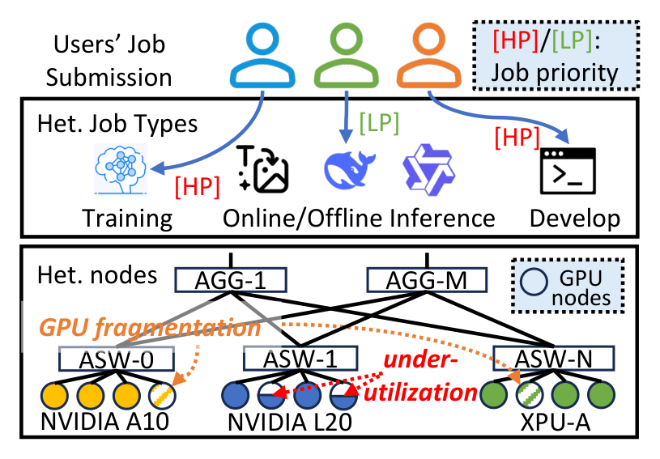
   <em>图 1：作为共享 GPU 基础设施服务的 ASI 概览。ASW：接入交换机；AGG：汇聚交换机。</em>

### 2.2 工作负载范围

ASI 必须同时服务两类工作负载：快速增长的 GenAI 模型和成熟的经典 DNN。LLM、基于扩散的图像/视频生成等 GenAI 模型 [1, 12, 48, 57, 58] 可申请极大的资源量；追踪数据中最大的单个 GenAI 作业同时使用超过 2,000 块高端 GPU，消耗逾 800,000 GPU 小时。经典 DNN 对点击率（CTR）预测、推荐和光学字符识别（OCR）等高吞吐生产服务仍不可或缺 [51, 59, 66]：它们仍占追踪数据中在线推理 GPU 小时约 70%（图 3）。将两类工作负载共置，要求 ASI 管理资源形状、执行时间、优先级和部署约束截然不同的任务。追踪数据覆盖这个共享集群中的大规模训练和推理，但不包括超大规模基础模型的预训练；后者通常在使用最前沿硬件的专用集群上运行 [47]。

### 2.3 追踪数据

ASI 记录研究生产资源管理问题所需的元数据，包括作业类型、优先级、模型信息、硬件类型、利用率指标和网络拓扑——已有公开追踪数据不会同时公开这些字段。如表 1 所示，ASI 追踪数据在作业量和集群规模上比先前研究最高大两个数量级，并覆盖远为异构的 GPU 队列。这些字段将 §3.1 的工作负载刻画连接到后文的碎片化（§4.1）、基于优先级的资源回收（§4.2）以及硬件/拓扑异构性（§5）分析。

<table>
  <tr><th>追踪数据</th><th>ASI</th><th>Acme [16]</th><th>PAI [51]</th><th>Helios [15]</th></tr>
  <tr><td>年份</td><td>2025</td><td>2023</td><td>2020</td><td>2020</td></tr>
  <tr><td>时长</td><td>6 个月</td><td>6 个月</td><td>2 个月</td><td>6 个月</td></tr>
  <tr><td>作业数</td><td>14M</td><td>1.09M</td><td>1.26M</td><td>3.36M</td></tr>
  <tr><td>作业优先级</td><td>高、低</td><td>—</td><td>—</td><td>—</td></tr>
  <tr><td>作业类型</td><td>训练、开发、在线推理、离线推理</td><td>训练、开发、评估</td><td>—</td><td>—</td></tr>
  <tr><td>模型类型</td><td>LLM、DM、DNN、推荐</td><td>LLM</td><td>DNN</td><td>DNN</td></tr>
  <tr><td>GPU 型号2</td><td>H20、H800、A10、A30、A100、A800、L20、XPU-A、XPU-B、XPU-C、XPU-D、XPU-E</td><td>A100</td><td>T4、P100、V100</td><td>1080Ti、V100</td></tr>
  <tr><td>GPU 数</td><td>155,410</td><td>4,704</td><td>6,742</td><td>6,416</td></tr>
  <tr><td>GPU 节点数</td><td>37,707</td><td>588</td><td>1,814</td><td>802</td></tr>
</table>
 <em>表 1：ASI 追踪数据与既有分析工作中公开 GPU 集群追踪数据的比较。Dev.：开发；On-Infer.：在线推理；Off-Infer.：离线推理。</em>

2 为脱敏，本文以 XPU 指代非 NVIDIA GPU。

## 3. 工作负载刻画

本节刻画 ASI 工作负载。我们先概述追踪数据——其记录的工作单元，以及作业类型、优先级、模型和硬件——然后分析资源需求和使用的时间与空间模式。

### 3.1 追踪数据概览

#### 3.1.1 追踪信息

ASI 追踪数据记录了在主流框架 [10, 24, 45, 64] 上运行的训练、推理和开发作业，它们执行多样的 ML 模型。对于每个作业，数据细述其资源请求、执行时长、调度延迟，以及作业、任务和实例粒度上的 GPU、CPU、GPU 内存和主内存利用率。我们还用用户提供的应用元数据（如作业与模型类型）和机器级遥测数据丰富追踪数据；遥测由守护进程周期性查询 Linux 内核和 GPU 驱动（如 NVML [35]）以收集 GPU 规格、节点容量与随时间变化的利用率。

#### 3.1.2 作业、任务和实例

与先前研究 [16, 51] 相似，用户以作业为基本工作单元提交请求。每个作业由一个或多个承担不同计算职责的任务组成；每项任务运行一个或多个实例，每个实例封装在一个 Kubernetes pod 中（即一个或多个协同调度的容器）。我们使用定制化 Kubernetes 管理这些 pod，用户可以指定细粒度资源请求和限制 [21, 22]。

#### 3.1.3 作业类型

ASI 的作业覆盖 ML 模型开发和部署的完整生命周期，分为四大类：

- 开发（Dev）作业通常是通过编码界面进行模型原型开发和调试的交互式、临时会话。
- 训练作业执行迭代优化算法来更新模型参数。其时长从从头训练所需的数千小时到微调任务的较短时段不等。
- 离线推理作业执行模型评估、数据生成等批量推理任务 [50]，通常对时延不敏感。
- 在线推理作业支撑面向用户或时延关键的模型服务应用。

图 2 左侧展示了集群中这些作业类型的分布。在线推理占比最大，超过全部工作负载的 50%。

#### 3.1.4 作业优先级

我们允许用户指定作业优先级，使调度器能够区分工作负载。为便于脱敏，追踪数据将作业粗略归为高优先级（HP）作业和低优先级（LP）竞价作业。HP 资源价格较高，但不受抢占、可用性有保障；LP 作业价格较低，但可被 HP 作业抢占。

如图 2 右侧所示，在线推理和训练作业以 HP 为主：在线推理为时延关键服务提供高可用性，训练则需要长期稳定的分配来支撑迭代优化。相对地，离线推理通常为 LP，因为它不受时延约束，适合通过低优先级执行以提高经济效率。值得注意的是，开发作业几乎全为 HP：开发者需要稳定环境，必须避免突然终止，以便保存中间状态到 checkpoint。

  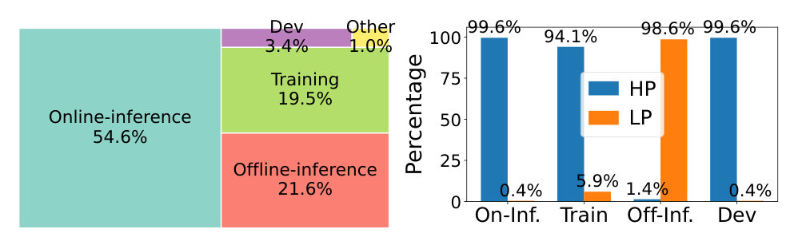
   <em>图 2：左：作业类型分布。右：各作业类型内部的作业优先级分布。</em>

#### 3.1.5 部署了多种模型

ASI 上运行的模型大致可分五类：GenAI（包括文本、图像和视频生成）、推荐模型（Rec，例如 CTR 预测 [66]）、计算机视觉模型（CV，例如 OCR）、嵌入模型（Embedding）和开发中的模型（Dev）。我们观察到多个热门模型家族，包括 Qwen [57, 58]、TBStars [1, 7]、WanX [48]、DeepSeek [12] 和 BERT [5]。

图 3 左侧展示每类作业内部的模型类型分布。GenAI 工作负载主导训练（71%）和离线推理（98%），反映出对大规模训练、模型评估和数据生成的强劲需求。反之，在线推理主要是推荐模型（63%），这与面向用户服务的低时延需求相符。图 3 右侧按 GPU 类型拆分工作负载。A10、L20 等较老或中端 GPU 主要运行包括推荐与 CV 在内的经典 DNN；H800 等较新的高端加速器则几乎完全专用于 GenAI。这种显著专化表明，用户有意将硬件能力与工作负载需求相匹配以控制成本。

  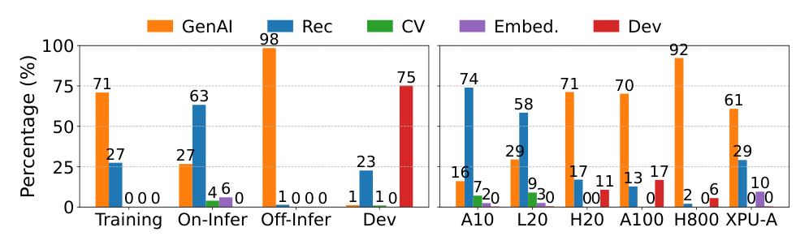
   <em>图 3：按作业类型（左）与 GPU（右）分组的模型类型分布。</em>

#### 3.1.6 可选择的多种 GPU

我们提供异构 GPU（表 1），并让用户为其任务请求指定 GPU 类型。醒目的是，超过 99% 的作业显式绑定所需 GPU 型号，而早期研究报告的比例仅为 6% [51]。

图 4 左侧给出库存中 GPU 类型的分布，覆盖 NVIDIA 和其他厂商的硬件。图 4 右侧再按运行所消耗的 GPU 小时展示 HP 与 LP 作业如何采用这些类型，表明作业优先级与加速器算力相关。A10（83% 为 HP）和 L20（85% 为 HP）等早期或中端加速器由生产关键 HP 工作负载主导，部分原因是它们主要服务于已支撑业务多年的成熟传统 DNN 模型（见图 3 右）。反之，LP 作业偏好 H800 等较新、性能更强的硬件，因为其中大部分运行 GenAI 模型（图 3 左），而对时延不敏感的离线推理在低优先级下运行更具成本效益。最后，绝大多数作业请求同构 GPU；使用异构 GPU 的不足 1%。

  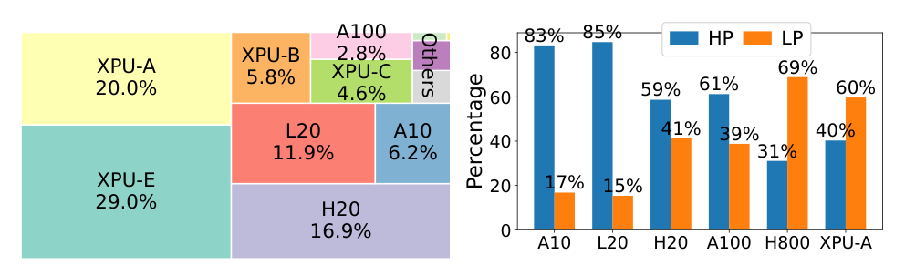
   <em>图 4：左：GPU 分布。右：按其运行的 GPU 小时统计的作业优先级分布。</em>

### 3.2 时间模式

#### 3.2.1 昼夜请求与利用率模式

ASI 的 GPU 需求具有强烈的昼夜周期。图 5 上半部分给出一个代表性周内请求 GPU 的数量：训练和在线推理作业在白天请求的 GPU 都显著多于深夜。

然而，GPU SM 利用率呈现更细致的图景（图 5 下半部分）。在线推理利用率保持昼夜周期，因为它跟随即时用户需求；训练利用率则没有这种周期，因为长期运行的迭代会让 GPU 全天持续繁忙。离线推理反而具有周周期，SM 利用率在周末会急剧下降。

  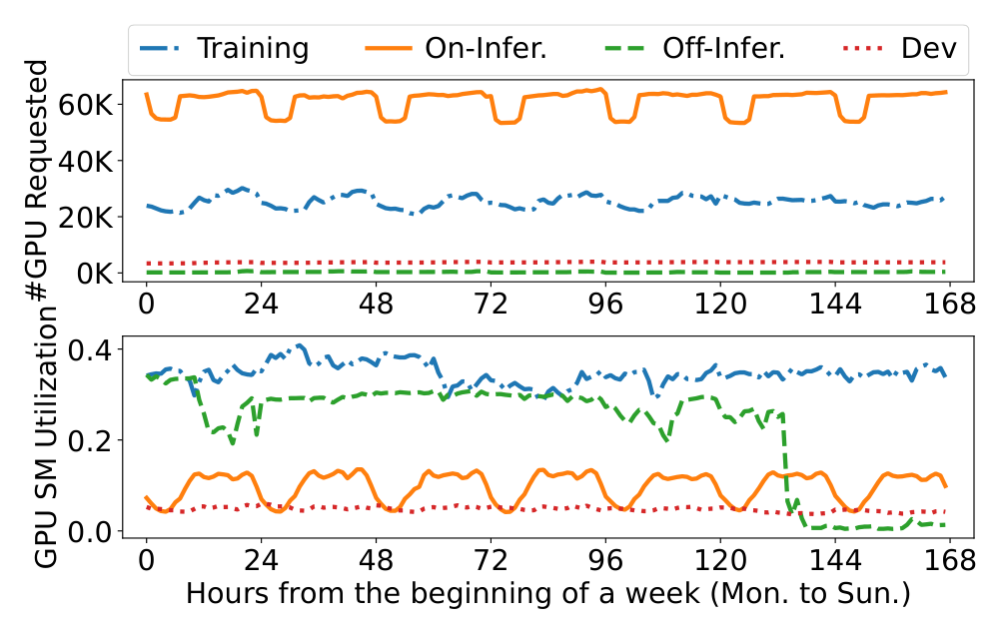
   <em>图 5：上：一周内请求 GPU 的数量；下：同一周内的 GPU SM 利用率。</em>

#### 3.2.2 GPU 采用

随着硬件供给的多元化，ASI 中的 GPU 采用情况发生了变化。NVIDIA GPU 已部署多年，需求相对稳定。为缓解供应链约束并建设更可持续的基础设施，我们近来开始采购其他厂商的 GPU；这些非 NVIDIA 设备在文中被称为 XPU，现在已占 GPU 队列的可观比例（见图 4 左）。用户最初不愿采用 XPU-A，因为其开箱即用性能低于预期。不过从第 120 天左右开始，XPU-A 的采用量快速上升（图 6），这是因为我们发布了一套专用优化套件，显著改善了 XPU-A 上的模型性能（§5.1）。

  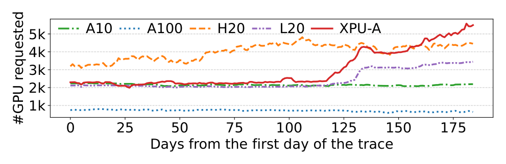
   <em>图 6：不同 GPU 类型的请求 GPU 数量。</em>

#### 3.2.3 任务实例运行时长

图 7 给出了按作业类型和模型类型分组的任务执行时间 CDF。开发任务运行最久，因为开发者会保持长期存在的交互式编码会话。除去开发任务，在线推理和训练任务的执行时间相近，且都长于离线推理任务。按模型类型看，Rec 和 CV 模型的运行时间相应最长，因为它们以在线推理工作负载为主；GenAI 模型以离线推理为主，因此运行时间短于 CV 和 Rec 模型。

  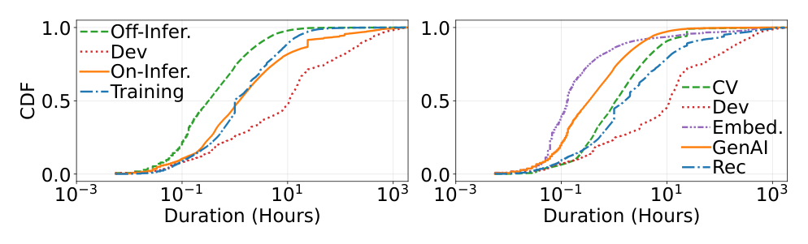
   <em>图 7：按作业类型（左）和模型类型（右）分组的任务执行时间。</em>

总体而言，ASI 的作业执行时间中位数为 5 小时，远长于 PAI [51] 的 23 分钟和 Acme [16] 的 2 分钟。我们将此归因于 ASI 同时包含长期在线服务和大规模训练：PAI 只覆盖 DNN 作业，而 Acme 以短时评估作业为主（占其作业数 93%）[16]。相反，调度延迟很低：中位数仅为 1 秒，即使 HP 任务的 P90 也只有 101 秒，相对于其 24 小时的 P90 执行时间可以忽略。

### 3.3 空间模式

下面转向空间模式，即任务如何在集群中请求和使用资源。ASI 以 20 秒为间隔采样每个运行中任务的遥测数据。

#### 3.3.1 GPU 与 CPU 请求

ASI 中每个作业请求的 GPU 数显著高于旧追踪数据。图 8 使用箱线图，将请求 GPU 与 CPU 的分布同 PAI [51] 和 Acme [16] 比较；对 ASI，我们同时报告全量数据（ASI）和仅 GenAI 子集（ASI(GenAI)）。受 PAI 时代尚未出现的 GenAI 模型推动，GPU 请求的中位数和均值从 PAI 的 1 和 2.6 上升至 ASI 的 2 和 11.0，并在 ASI(GenAI) 中达到 4 和 11.0。面向 LLM 训练的 Acme 中位数和均值为 1 和 5.0；其数值较低是因为短时评估作业主导作业数量却消耗很少资源 [16]，这也解释了 CPU 图中的离群点。CPU 请求也呈现从 PAI 到 ASI 的相似增长趋势。

  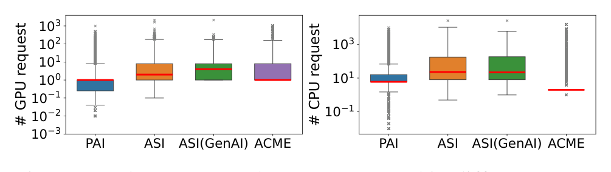
   <em>图 8：不同追踪数据中作业请求的 GPU 数和 CPU 数。</em>

#### 3.3.2 GPU 分配

我们测量 GPU 分配率，即被作业占用的 GPU 容量占总 GPU 容量的比例；它反映资源被有效认领的程度，并直接影响收入。我们进一步区分仅由 HP 作业贡献的分配率与 HP、LP 作业合计的分配率（HP+LP），以说明 LP 工作负载提高利用率的效果。如图 9 所示，LP 作业提高了所有 GPU 类型的分配率，对高端 GPU 尤为明显：全局平均值从仅 HP 作业的 68% 升至 HP 与 LP 合计的 93%。§4.2 将详细说明我们如何支持 LP 竞价作业。

  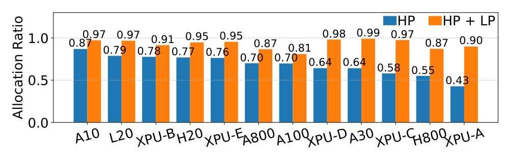
   <em>图 9：按 GPU 类型统计的 GPU 分配率。HP：仅 HP 作业；HP+LP：HP 与 LP 作业合计。</em>

#### 3.3.3 罕见的 GPU 共享

GPU 共享允许多个请求分数 GPU（小于 1.0）的作业复用一块设备，先前系统把它视为关键的效率杠杆 [51–53]。但在 ASI 中，GPU 共享现已很少使用，原因将在 §4.2 讨论。图 10 左侧同时报告请求分数 GPU 的任务比例和它们请求的 GPU 总量比例；与 PAI 相比，两者在 ASI 中都可以忽略。

#### 3.3.4 CPU/GPU 比

尽管 ML 工作负载在 GPU 上训练和推理，许多数据处理工作（如拉取和采样）运行在 CPU 上，CPU 可能成为瓶颈 [51]。图 10 右侧展示每项任务请求 CPU 数与 GPU 数之比，即 CPU/GPU 比。大多数任务的比值适中，但有些极端；这是因为 ASI 的 GPU 服务器具有很广的 CPU/GPU 配置范围：一台 8 GPU 的 H20 服务器可以有 192 个 CPU 核，而一台单 GPU A10 服务器可以有 128 个。为使请求可行，我们依照目标服务器类型限制每个请求的 CPU/GPU 比。

  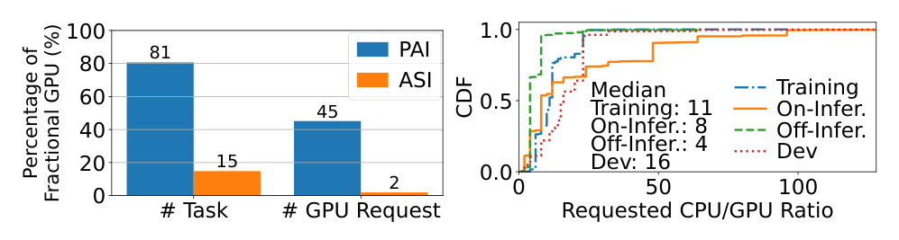
   <em>图 10：左：GPU 共享（分数 GPU）使用比例。右：任务请求的 CPU/GPU 数量之比。</em>

#### 3.3.5 资源利用率

图 11 展示按作业类型统计的任务级资源利用率。开发任务在各指标上的利用率都最低，反映了其临时性；训练任务最高，反映其计算密集特征。在线和离线推理使用主机内存的方式相近，但 CPU 与 GPU SM 利用率差异显著，因为在线推理由交互式用户请求驱动，离线推理则以批处理方式运行。在线推理使用的 GPU 内存也少于离线推理，因为它主要运行标准 DNN，而离线推理主要运行 GenAI 模型。

  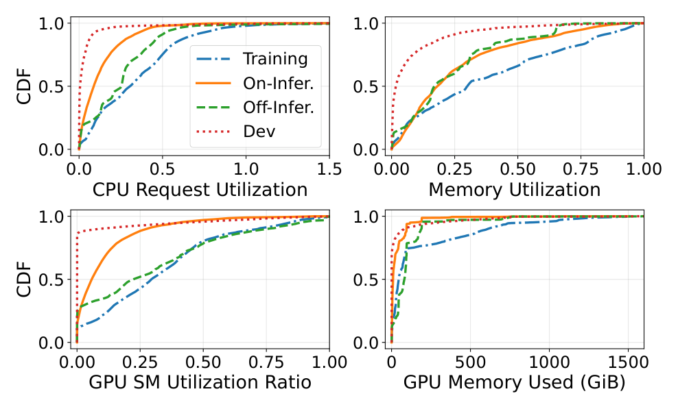
   <em>图 11：任务级资源利用率。</em>

接着考察节点级网络利用率（接收和发送带宽）。由于不同作业类型的任务可共享一个节点，我们按节点承载的任务组合分组，并展示最常见的六种组合。如图 12 所示，仅运行训练任务的节点网络利用率最高，因为 ASI 中的大多数训练使用依赖并行化的 GenAI 模型，因此节点间通信很重。

  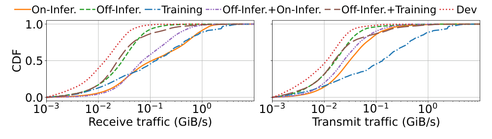
   <em>图 12：节点级网络利用率。</em>

### 3.4 案例研究

最后，我们通过 ASI 中在线 LLM 服务的三个案例结束工作负载刻画。

#### 3.4.1 PD 解耦 LLM 服务

ASI 中采用 Prefill-Decode（PD）解耦 [14, 39, 65] 的 LLM 服务迅速增长：在追踪期间，这类工作负载的日均 GPU 数从 1,041 增至 3,841，增长 3.7 倍。然而，与让异构 GPU 匹配 prefill 和 decode 不同计算特征的策略 [65] 相反，用户请求的是同构 GPU；他们认为部署复杂性高，且跨异构 GPU 类型时网络性能会下降（见 §5.2）。

#### 3.4.2 较小 LLM 更受欢迎

在一个月运行 Qwen 系列 LLM [57, 58] 的在线推理任务中，较小模型主导使用量。按参数量分组，0–30B、30–100B 和 100B 以上三个档位分别消耗 60.9%、35.0% 和 4.1% 的 GPU 小时。用户偏爱较小模型，因为其成本较低，且经微调后在目标领域中已具备足够好的表现。

#### 3.4.3 代表性 LLM 与 DNN 的比较

我们比较在线推理任务中最流行的三种模型：BERT [5]、Qwen [57, 58] 和 CTR 预测 [66]。CTR、BERT 和 Qwen 请求的 CPU 核数中位数分别为 24、8 和 4，这与推荐模型更消耗 CPU 的既有报告一致 [51, 59]。在 GPU 计算方面，Qwen 的 GPU SM 利用率中位数为 26%，是 CTR 的 2.7 倍、BERT 的 9.6 倍。

## 4. 提高资源利用率

本节描述在 ASI 集群中观察到的两类资源管理挑战——GPU 碎片化和资源利用不足——并给出生产中已部署的应对机制。

### 4.1 应对 GPU 碎片化

GPU 碎片化会把空闲 GPU 资源拆成无法整体分配、无法满足资源请求的碎片 [43, 52]，从而缩小集群有效容量。我们先诊断 ASI 中碎片化的原因，再介绍两种针对主要成因的机制：IPC 碎片整理将作业整合起来，以回收遗留 GPU 并缓解 CPU 瓶颈；拓扑感知分配缓解由网络拓扑要求引起的碎片化。

#### 4.1.1 GPU 碎片化的成因

先前工作 [52] 给出三种常见成因：

1. **分数 GPU 碎片。** 生产中的 ML 模型可能很小。例如，ResNet-152 只有 6,000 万参数，无法独占一整块 GPU。因此，我们允许用户请求分数 GPU，例如 0.25 GPU，使多个小模型可以共置在一块 GPU 上以高效共享 GPU [51]。但分数分配会在单块 GPU 内遗留不可用的剩余容量，尤其会阻止需要整卡 GPU 的作业部署，从而造成 GPU 内部碎片。
2. **遗留 GPU 碎片。** 在多 GPU 节点中，当作业未请求节点的全部 GPU 时会出现碎片。例如，在一台 8 GPU 节点上分配一个 2 GPU 任务会造成节点内碎片；剩下 6 块 GPU 成为遗留资源，无法满足后续对整节点（8 GPU）分配的请求。
3. **CPU 不足。** 虽然 GenAI 模型大量使用 GPU，我们发现 CPU 也可能成为 GPU 分配的瓶颈。当节点可满足 GPU 请求、却因 CPU/GPU 比过高（见图 10 右）无法满足相应 CPU 请求时，就会发生这种情况。节点 CPU 耗尽会导致 GPU 碎片化。

在 ASI 中，碎片化很少由分数 GPU 引起，主要受遗留 GPU 和 CPU 不足两类瓶颈驱动。图 13 通过测量不同资源请求配置下不可分配的空闲 GPU 数来诊断这一点。分数 GPU 的贡献很小，这与图 10 左侧 GPU 共享罕见的结果一致。对于 CPU/GPU 比高的请求（如 1G8C 和 8G128C），主导瓶颈是“CPU 不足”：CPU 耗尽使 GPU 无法分配。对于中等规模配置（如 4G32C 至 8G64C），则是“遗留 GPU”（橙色柱）占主导：总 GPU 容量存在，却分散在各节点上，无法调度需要连续多 GPU 分配的作业。

  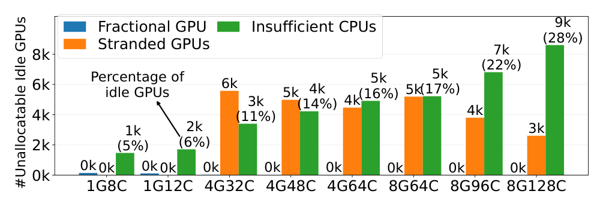
   <em>图 13：不同资源请求下的 GPU 碎片化。8G128C 表示请求 8 块 GPU 与 128 个 CPU。</em>

除上述三种已知成因外，当用户提交带网络拓扑要求的多 GPU 请求时，我们观察到第四种 GPU 碎片化来源。

4. **网络拓扑。** LLM 等极大 ML 模型往往需要超过单台 GPU 服务器可提供的总 GPU 内存，通常做法是把模型划分为块并分布在多个 GPU 节点上 [34]。此类模型的训练和推理均包含密集的跨节点通信。为降低通信瓶颈，用户经常请求拓扑感知部署，例如要求所有分配的 GPU 位于同一 ASW 之下。如 §2 所述，ASI 的 fat-tree 网络并非完全无阻塞；跨多个 ASW 部署的作业会经过额外交换层而丧失有效带宽。我们的基准测试表明，把所有 GPU 共置于单个 ASW 下，相比跨 ASW 部署，AllReduce 带宽提高 27%。

然而，严格执行这些拓扑要求引入一种新的碎片化：分散在不同交换机下的 GPU 无法为同一个作业所用，大幅缩小有效可用资源池。为说明其在 ASI 中的严重程度，我们构造两个大规模配置：分别请求 128 和 256 块 GPU，且每块 GPU 请求 12 个 CPU，并测量 ASI 可满足的此类请求数量。图 14 报告 ASW 约束对分配的影响。

基线（跨 ASW）与强制 ASW 约束（单 ASW 内）的比较显示，实施 ASW 约束会显著减少可满足作业数量。请求大规模同构 NVIDIA GPU 时下降尤其严重，容量降至接近零，表明严格拓扑要求对这些高需求资源的影响不成比例。相反，对不那么热门的 XPU-A，影响较轻。此外，允许异构 GPU 分配时，集群对大规模请求仍保有较高容量。因此，促进使用较不热门 GPU 并允许异构 GPU，可以有效缓解拓扑要求引起的瓶颈。

  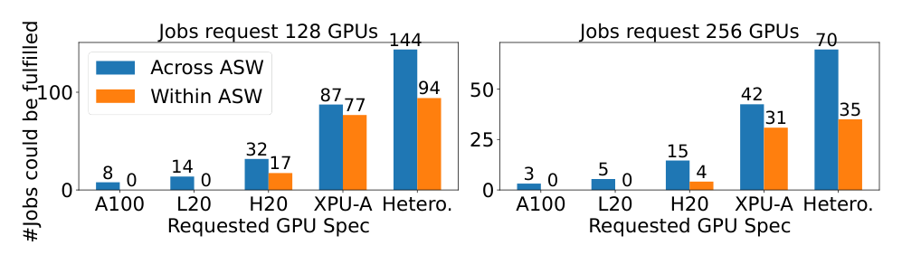
   <em>图 14：网络拓扑对 GPU 分配的影响。</em>

#### 4.1.2 GPU 碎片整理

为回收遗留 GPU 并缓解 CPU 瓶颈，ASI 将 GPU 碎片整理作为例行维护任务运行：把只占用部分服务器资源的作业整合起来，释放整机 GPU 容量给需要多 GPU 和大量 CPU 的新到工作负载。

#### 4.1.3 挑战

这种整合通过将运行中的作业迁移到更少服务器上实现，但在在线生产集群中执行迁移有三项挑战。第一，新作业可随时提交，动态改变资源可用性和分配。因此，GPU 作业迁移的决策必须很快，在数分钟内完成迁移与调度决策；这在大规模集群中颇具挑战。第二，跨节点迁移工作负载必须遵守实际的集群级约束 [28]，包括已有的亲和性与反亲和性规则 [20]；它们规定任务能否在特定节点运行，或一组任务能否共置。另有 40% 的 ASI 任务标记为“locked”，表示业务关键、不可移动。第三，GPU 作业迁移和碎片整理必须对用户透明：我们不能给作业底层 ML 框架施加约束，操作也不能引入服务停机 [29]。

#### 4.1.4 IPC 算法

我们设计并部署 IPC（迭代分区整合），这是一种实用的碎片整理算法。它获取当前节点和任务状态的快照，生成一组任务迁移决策，目标是腾空尽可能多的节点。上述三项挑战分别对应 IPC 的三项设计：分治使大规模集群的决策保持快速；驱逐链调度在迁移过程中遵守亲和性、反亲和性和锁定任务约束；迭代过程则使多轮后腾空的节点数持续增加。为使迁移对用户透明，IPC 采用先建后拆（make-before-break）：先在目标节点启动新实例，再终止旧实例，从而消除服务停机。

##### 4.1.4.1 分治

为快速生成迁移决策，IPC 随机将集群节点划分为不相交的组，每组都是一个独立子问题；IPC 在其中尽量腾空更多节点。这些子问题可完全并行运行，从而加快大规模集群上的决策。

##### 4.1.4.2 驱逐链调度

在每个分区内，IPC 根据优先级和启发式为每个节点评分（如其承载 pod 数），优先选择 pod 较少、因而更容易腾空的高优先级节点；算法 1 给出了一个分区的伪代码。如图 15 所示，IPC 递归构建驱逐链（第 6 行的 `Eject(·)`）：如果目标节点容纳不下某任务，它会递归移动该目标节点上的任务，直到放置所有 pod，或达到递归深度上限 $K$（第 6 行）。实践中设定 $K=3$。

  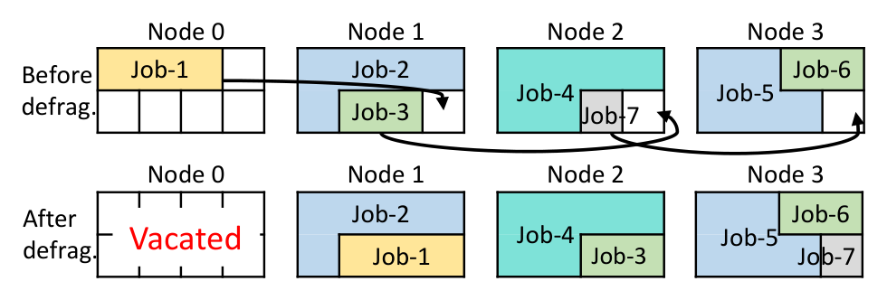
   <em>图 15：IPC 中驱逐链的示例。为腾空节点 0，必须先迁移其上的 Job-1。碎片整理前，节点 1–3 没有任何一个能单独容纳 Job-1，尽管它们合计有三个空闲 GPU 槽。借助驱逐链，先将 Job-7 从节点 2 移至节点 3，再把 Job-3 从节点 1 移至节点 2，最后把 Job-1 从节点 0 移至节点 1，因而腾空节点 0。为清晰起见，图中省略 CPU。</em>

算法 1 的流程如下：将迁移动作集合 $M$ 初始化为空，并按节点优先级对分区 $N$ 排序。依次考察节点 $n$；对其上的每项任务 $\tau$，调用 `Eject(τ, K)` 搜索满足实际约束、资源请求且长度不超过 $K$ 的可行驱逐链 $C$。若能为节点上所有任务找到链，就把相应动作并入 $M$；否则将节点标记为不可迁移。最终返回 $M$。

##### 4.1.4.3 迭代

为尽量腾空更多节点，IPC 迭代运行分治与驱逐链调度，在每一轮中尝试腾空节点。我们通过实验证明，第三轮之后边际收益较小，因此最大轮数限制为五轮。

#### 4.1.5 IPC 的效果

IPC 已在调度器中稳定运行多年，可在 2 分钟内作出迁移决策；在两个月追踪数据的回放中，它将未完全占满节点数减少 20.2%。它取代了先前依赖 Kubernetes [21] 驱逐的方式，后者会把被驱逐作业随机重新分布到集群中。我们使用启发式而非最优规划，因为在线环境中最优碎片整理不现实：优化求解代价高，且最优方案可能要求生产环境无法承受的大规模 pod 迁移。若把碎片整理表述为整数线性规划（ILP），25 节点集群会产生 4,000 个二元变量和 800 个约束，Gurobi [13] 在 16 CPU 节点上约需 5 分钟才可求至最优；100 节点则需两天，而实际每个 IPC 分区有 500 节点。

#### 4.1.6 拓扑感知 GPU 分配

为处理图 14 所示的拓扑诱导碎片化，ASI 部署一种分配策略，将大规模请求的 GPU 集中到尽可能少的 ASW 中。这里描述已部署的单作业策略；它在多作业场景下的最优推广仍是开放问题（§5），所以我们不报告总收益。我们引入熵来量化一个作业获分配 GPU 的分布。假设作业请求的 GPU 分布在 $n$ 个 ASW 上，令 $g_1,g_2,\ldots,g_n$ 为每个 ASW 中的 GPU 数，$G$ 为 GPU 总数（$G=\sum_{i=1}^{n}g_i$）。作业的 GPU 熵定义为：

$$
H=-\sum_{i=1}^{n}p_i\log p_i,\qquad p_i=\frac{g_i}{G}.
\tag{1}
$$

熵越高代表分布越均匀，熵越低代表集中在较少 ASW 中。我们的策略希望把分给作业的 GPU 集中到尽可能少的 ASW，因而偏好较低熵。

算法 2 给出为大规模作业生成 GPU 分配计划的过程。每轮遍历全部 ASW；对每个 ASW，计算若尽量从该 ASW 向作业分配 GPU 后的拓扑分布，然后选择可得到最小熵的 ASW，分配其空闲 GPU 并继续下一轮。这个贪心算法对单个作业是最优的，但对多个作业并不最优，因为调度顺序会影响结果、问题成为组合问题。实践中，我们按作业规模降序排序，先调度最大的作业；跨 ASW 迁移复用 IPC，并把网络拓扑作为实际约束加入。大规模拓扑感知分配留作 §5 的开放挑战。

### 4.2 应对资源利用不足

我们的刻画揭示了集群中显著的时间和空间资源利用不足（图 5 和图 11）。与用户的交流表明，主要原因是一种常见做法：用户为承受昼夜流量高峰、维持故障切换冗余并预留峰值事件余量而过度配置 GPU 容量。这种防御性预留使相当一部分资源长时间空闲，降低全局集群效率。

#### 4.2.1 将 GPU 共享作为一个稻草人方案

回收利用不足资源的自然方法是 GPU 共享：把多个作业共置到一块 GPU 上，使它们进行时间复用并填补空闲周期 [51, 52, 55]。ASI 虽支持 GPU 共享，但使用率仍低（图 10 左），有两个原因。第一，GPU 的隔离性弱于 CPU，因此共置作业会相互干扰；即使 MPS（Multi-Process Service）[37] 和 MIG（Multi-Instance GPU）[36] 等虚拟化机制也只提供粗粒度、缺乏弹性的分区。第二，新兴 GenAI 模型需要大量 GPU 内存存放参数和中间状态（如 KV-Cache）[24]，使多个作业共享一块 GPU 不可行。因此，在 ASI 中，分数 GPU 请求几乎只来自经典 CV 和推荐模型；它们启用 MPS 后预留 GPU 来服务小模型。GPU 共享只能回收单个设备内的空闲容量；为了回收规模更大、跨作业的“已预留但空闲”容量，我们转而通过 SpotGPU 在作业粒度上运行。

#### 4.2.2 SpotGPU

SpotGPU 设计为达成两项目标。第一，回收已预留但空闲的 GPU 容量，并重新投入生产性用途，以提高集群级利用率。第二，将这部分回收容量连同其他空闲资源，以打折的竞价价格提供给运行灵活工作负载的用户。具体而言，SpotGPU 可安全超售 HP 作业预留的容量，并把由此产生的闲置容量分给 LP 竞价作业。给 LP 作业的资源没有保证，故价格较低；当 HP 作业收回其预留资源时，SpotGPU 会近乎实时地抢占运行中的 LP 作业。

#### 4.2.3 “Standby” HP 任务

为了在不干扰 HP 作业的情况下回收其预留容量，SpotGPU 提供“Standby”机制，并以财务返利激励参与。用户可通过 API 在选定的时间窗口将 HP 任务标记为“Standby”，例如更新 Kubernetes pod 的标签 [23]，表示愿意临时将该任务占用资源释放给 LP 竞价作业。图 16 显示，“Standby”GPU 小时有明显昼夜模式：午夜最高可激增至 10,000 小时。

  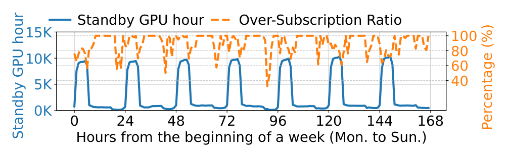
   <em>图 16：“Standby”任务 GPU 小时，以及“Standby”GPU 小时超售率的时间模式。</em>

Standby 任务必须快速重新激活，因此 SpotGPU 不会销毁其容器。它会断开任务的请求流量，并用 sleep 命令替换容器的主服务进程，在保持容器预热的同时释放 CPU 和 GPU；重新激活因而跳过昂贵的重新调度和镜像拉取步骤。当 HP 任务必须恢复时，SpotGPU 先对共置的竞价作业执行优雅驱逐，再通知 HP 任务继续，从而保持 HP 的 SLO。驱逐过程如下：

1. 节点代理观察到 HP pod 抵达本节点；
2. 它向共置的 spot pod 发送 `SIGTERM`；
3. 容器内的优雅关闭逻辑运行，执行用户定义逻辑，终止期上限为 60 秒；
4. 容器退出，GPU 被回收。

其中第 1、2、4 步由平台侧执行，快速且确定；驱逐延迟主要由用户定义的第 3 步决定。部署中平均驱逐时间为 13 秒，P95 为 48 秒，均在 60 秒窗口内；未在窗口内退出的容器会被 `SIGKILL` 强制终止，占全部驱逐的不到 5%。为恢复 HP 任务，SpotGPU 原地将原命令恢复，替换掉 sleep。如图 16 所示，平均而言可收获 90% 的“Standby”GPU 小时。

#### 4.2.4 抢占式任务调度

对新提交的作业，ASI 使用抢占式调度策略：优先采用非抢占分配以保持稳定；但当必须从 LP 竞价作业收回资源时，会将相应抢占代价纳入考虑。由于 GPU 任务通常在执行期间设置 checkpoint [31, 46]，被抢占任务可以从上一个 checkpoint 恢复，而不必重新开始。ASI 允许用户指定 checkpoint 间隔，我们把任务的抢占代价定义为无效计算量，即其自上次成功 checkpoint 以来完成的工作。

我们把抢占式调度决策建模为混合整数线性规划（MILP），具体形式见附录 A。由于 MILP 无法用于在线调度，我们转而使用高效启发式。算法会先为 HP 任务在可用 GPU 上尝试非抢占式分配；若失败，则切换到抢占模式，驱逐选择出的 LP 竞价任务以为 HP 任务腾出资源。与之相反，新的竞价任务始终严格以非抢占方式调度。

##### 4.2.4.1 非抢占式调度

对于 HP 或竞价任务，调度器首先过滤可满足任务 GPU 要求的节点，形成候选集合；随后按下列三个依次应用的标准排名节点，前一标准留下的并列由后一标准打破：

- **任务装箱：** 优先空闲 GPU 容量最少的节点，把任务装入更少节点，以限制碎片化。
- **同类共置：** 将 HP 任务放在已有其他 HP 任务的节点，将竞价任务放到专用于竞价任务的节点。这能隔离并优先保障 HP 任务，也使后续需要时可通过抢占竞价任务进行高效调度。
- **驱逐历史：** 新竞价任务选择历史驱逐次数最低的节点，以降低被抢占概率；新 HP 任务则选择驱逐次数最高的节点。这会把未来抢占集中在已较不稳定的节点，为长期竞价任务保留稳定节点，减少同一竞价任务被反复驱逐。

##### 4.2.4.2 抢占式调度

当新 HP 任务无法以非抢占方式部署时，调度器抢占竞价任务。由于抢占会打断竞价任务的进度，调度器选择牺牲对象时要最小化无效计算：它找出在移除其竞价任务后可以容纳 HP 任务的节点，按抢占代价评分，并选择代价最低的节点。

具体来说，考虑一个在 $\tau_{now}$ 时刻到达、需要 $G_{hp}$ 块 GPU 的 HP 任务。对于运行中的竞价任务 $t$，其使用 $G_t$ 块 GPU、上一次 checkpoint 位于 $\tau_{ck}$，抢占代价定义为按资源用量加权的已损失工作：

$$
C_t=G_t\cdot(\tau_{now}-\tau_{ck}).
$$

为给一个节点评分，调度器将其竞价任务按抢占代价升序排列，取最小前缀 $\{t_1,\ldots,t_k\}$，使其合计资源满足 HP 任务需求，即 $\sum_{j=1}^{k}G_{t_j}\geq G_{hp}$。该节点的总抢占代价因而为 $\sum_{j=1}^{k}C_{t_j}$。完成全部节点评分后，调度器将 HP 任务部署到总抢占代价最小的节点，并驱逐该节点上选中的竞价任务。对于异构 GPU，$G_{hp}$ 和 $G_t$ 变为资源向量，元素给出每种 GPU 的需求数量。

#### 4.2.5 SpotGPU 的收益

SpotGPU 将平均 GPU 分配率从 68% 提高到 93%（图 9），这意味着更大比例的资源被投入生产性使用；图 16 还表明用户会主动通过“Standby”释放预留容量，从而缩短空闲时段。为单独评估抢占式调度器的贡献，我们把它同一个基线比较：基线在非抢占式调度中关闭共置与驱逐感知，并用随机选择牺牲者替代抢占式调度。我们的调度器在不影响 HP 任务性能的前提下，将 LP 任务完成时间缩短 24%；这项收益源于将抢占代价纳入考虑，避免丢弃即将完成的竞价任务的工作。

## 5. 开放挑战

§4 的机制处理了已在生产环境中基本得到控制的资源管理问题。本节转向仍开放的问题。我们先讨论异构 GPU 的采用不均衡；随着我们不再依赖单一厂商，这一问题愈发紧迫，同时介绍缩小相应性能差距的初步努力（§5.1）。随后讨论尚未完全解决的三个分配和共置挑战（§5.2）。

### 5.1 异构 GPU 的采用不均衡

#### 5.1.1 采用差距

为满足不断增长的高端 GPU 需求并避免依赖单一供应商的风险，我们正在多样化硬件。我们最近把另一家厂商的 XPU-A 集成为主要替代品，看重它的大内存容量和有竞争力的计算能力。但采用高度倾斜：我们观察到异构 GPU 采用不均衡，HP 作业请求 NVIDIA GPU 和其他 XPU 的频率远高于 XPU-A（图 9）。缩小该差距不止是在做负载均衡。由于多数 XPU-A 能满足 NVIDIA GPU 往往无法满足的严格网络拓扑要求（图 14），更广泛采用 XPU-A 也能缓解 §4.1 的拓扑诱导碎片化。

<table>
  <tr><th></th><th>每节点 GPU 数</th><th>单卡内存</th><th>HBM 带宽（TBps）</th><th>GPU 间带宽（GBps）</th><th>FP16 Tensor Core 算力</th></tr>
  <tr><td>H20</td><td>8</td><td>96</td><td>4.0</td><td>900</td><td>148 TFLOPS</td></tr>
  <tr><td>XPU-A</td><td>8</td><td>192</td><td>5.2</td><td>896</td><td>203 TFLOPS</td></tr>
</table>
 <em>表 2：H20 与 XPU-A 的硬件规格。</em>

这种不均衡源于性能，而不是容量。按纸面规格，XPU-A 在 FP16 算力上超过最接近的 NVIDIA H20，提供更大内存和更高带宽（表 2）。但在实践中它运行 GenAI 模型时表现未达预期：图 17 左侧显示 XPU-A 服务 DeepSeek-R1 时落后于 H20。对 XPU 团队的性能剖析和讨论将原因追溯到同一根源：标准 kernel 实现与 XPU-A 的硬件特性不匹配，这促成下面的优化。

  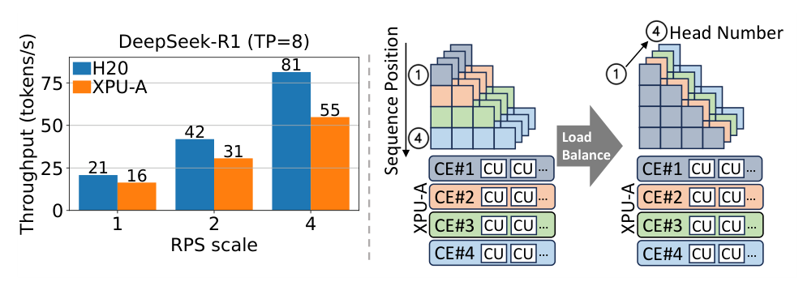
   <em>图 17：左：DeepSeek-R1 [12] 吞吐量。右：优化后的 prefill。CE：Compute Engine；CU：Compute Unit。</em>

#### 5.1.2 为 LLM 优化 XPU-A

根据这一诊断，我们已在 vLLM [24] 和阿里巴巴开发的生产级推理引擎 RTP-LLM [10] 上，对 Qwen 系列 LLM 的 XPU-A 性能做了基准测试与优化。为简明起见，下面介绍两个代表性优化，分别面向 prefill 阶段和 decoding 阶段。

##### 5.1.2.1 Prefill

在 prefill 阶段，XPU-A 官方库中的 Flash Attention kernel 在 causal mask 下分配工作不佳。该 mask 使每个 token 只能关注序列中在它之前的 token，形成三角形计算：每个 token 的工作量随其在序列中的位置线性增长（图 17 右）。现有 kernel 沿序列长度维度把线程块映射到逻辑网格，再以固定轮询方式将它们分派至 XPU-A 的 Compute Engine（CE），造成严重负载不均：处理序列尾部的 CE 成为瓶颈，而其他 CE 提前完成并空闲。我们改为沿 attention head 维度并行分配 CE，使各 CE 的负载均衡。这个简单改动在 4k token、64 个 head 的序列上将 prefill 计算加速 1.58 倍。

##### 5.1.2.2 Decoding

在 decoding 期间，大多数服务引擎采用 Paged Attention（PA）kernel [24]；它受内存带宽限制，因为每生成一个 token 都要从 GPU 内存读取完整的 KV-cache 历史。为让 XPU 的 Compute Unit（CU）饱和，PA 使用 SplitKV 策略，把 KV-cache 划为块，在各 CU 上并行处理。然而，将 PA 用 Triton [38] 移植到 XPU-A 时，编译器反转了线程块布局，使每个线程子组都冗余重算完整矩阵，而不是划分工作，浪费了大部分计算。我们通过向 Triton 注入自定义编译器 pass 来强制正确并行方式，并已将修复贡献回 Triton 生态。

#### 5.1.3 效果

我们已将上述及更多优化整合进 RTP-LLM [10]，产生两方面效果。第一，用户对 XPU-A 的需求显著上升：优化后 HP 作业请求的 XPU-A GPU 数增至原来的 2.5 倍（图 6）。第二，优化缩小了性能差距：对于不同规模的 Qwen LLM [57, 58]，优化后的 XPU-A 性能可匹配 H20，且显著优于未优化基线（图 18）。在 vLLM [24, 44] 上对同一套模型进行基准测试，优化后的 XPU-A 相比未优化 XPU-A，在每秒 1 个和 2 个请求（RPS）时分别将请求时延降低 33% 和 43%，并分别比 H20 快 2% 和 21%；RPS=2 时优势更大，来自 XPU-A 的较大内存可容纳更大的 KV-cache、减少排队延迟。

  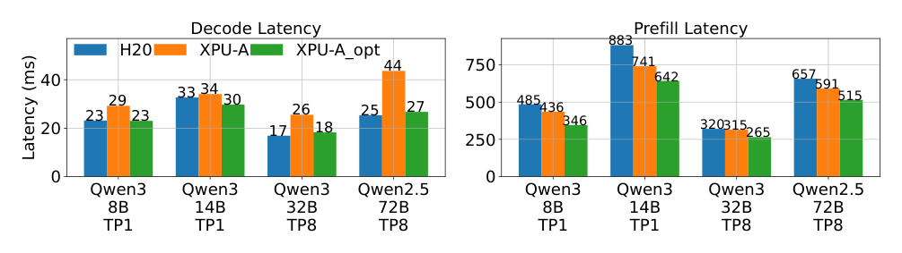
   <em>图 18：不同 GPU 上、使用张量并行（TP）的 Qwen LLM 性能。XPU-A_opt：经优化的 XPU-A。左：batch size=64 时的 decoding 性能；右：batch size=1 时的 prefill 性能。</em>

#### 5.1.4 编程接口

为使这些优化易于采用，我们通过可直接替换的 API 暴露它们。在 PyTorch 中，用户只需改变一条 import 语句即可启用优化（图 19）；前端 API 保持与已有代码兼容，其余适配由 API 层透明处理。

  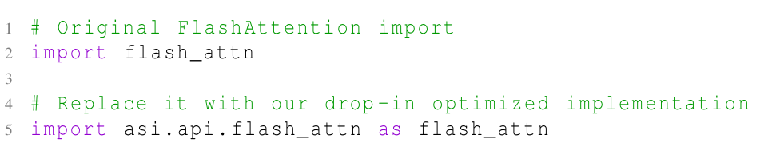
   <em>图 19：集成优化的一个示例。</em>

#### 5.1.5 超越 LLM

我们的更广目标是在异构 GPU 上提供高性能服务，使平衡的 GPU 使用改善资源管理，并扩大可行硬件的选择范围。上述优化针对 LLM；多模态模型（如 Qwen Next [42]）以及生成式图像/视频模型仍面临重大挑战，因为它们不同的架构与注意力机制需要独立的硬件特定调优 [30]。

### 5.2 其他资源管理挑战

#### 5.2.1 异构性下的拓扑感知分配

§4.1 表明网络拓扑约束会限制 GPU 分配；这些约束也与硬件异构性冲突。在 ASI 中，同一 ASW 下的 GPU 是同构的，因此强制 ASW 级局部性就无法让一个作业混用异构 GPU——而异构性正成为重要的 GenAI 优化 [39]。例如，PD 解耦范式现在已广泛用于 LLM 服务，在 ASI 中每天最多使用 12,000 块 GPU：prefill 是计算受限的，偏好高性能 GPU；decoding 是内存受限的，需要高带宽 [65]。这种异构匹配更具成本效益，却会将解耦节点之间的 KV-cache 传输置于关键路径：KV cache 到达前 decoding 无法开始，使网络性能成为瓶颈。因此，成本效率依赖在硬件专化与拓扑约束之间取得平衡；这种张力不仅存在于 LLM 服务，也存在于任何基于异构 GPU 的系统 [8, 18, 33, 49, 61]。

#### 5.2.2 在线推理作业利用不足

在线推理作业在 ASI 中占主导，却运行得很低效：汇总所有此类作业，SM 利用率中位数仅为 6%，GPU 内存利用率中位数也仅为 30%。这种整体低利用率掩盖两种不同的工作负载模式。GenAI 推理受内存限制，消耗 94% GPU 内存但仅使用 5% SM；它耗尽内存却让计算闲置。传统 DNN 推理则对两种资源都很轻，仅使用 20% 内存和 6% SM。两种模式互补：DNN 作业需要很少内存，可运行在内存受限 GenAI 作业留下的计算资源上，在不争夺内存的情况下提高 SM 利用率。但在实践中实现这种共置很困难。面向时延敏感的在线推理，GPU 共享能力不足且缺乏大规模支持 [56]；MIG [36] 等硬件分区对动态工作负载过于静态；GPU 时间共享则因隔离性弱而违反严格时延 SLO [51, 53]。

#### 5.2.3 共置 CPU 与 GPU 作业的干扰

与 Acme [16] 一样，ASI 节点的 CPU 利用率较低（中位数 31%）。我们通过把纯 CPU 作业与 GPU 工作负载共置来缓解此问题，使 80% 的节点成为 CPU 作业主导节点，即 CPU 作业的核使用量超过 GPU 作业。但这种共置会干扰 GPU 训练：与 GPU 作业主导节点相比，CPU 作业主导节点上 SM 利用率的中位数和 P90 分别降低 10% 和 18%，表明这种朴素共置并不理想。利用 GPU 节点空闲 CPU 的既有方法 [4, 27] 针对特定模型架构（如 LoRA adapter），且需要高端 CPU，适用范围有限。缩小此差距需要多资源调度器同时考虑 GPU 与 CPU 等关联资源，并需要新的隔离技术控制干扰。

## 6. 局限性与相关工作

最后，我们说明 ASI 追踪数据的范围，并将其置于既有工作负载刻画研究中。我们的目标并非覆盖 AI 集群的每一种工作负载，而是揭示一个混合异构工作负载、优先级、加速器和拓扑约束的大型共享生产集群中出现的资源管理问题。

### 6.1 局限性

ASI 追踪数据不覆盖大规模基础模型预训练；这类任务通常在配备最先进 GPU 的专用集群中运行。它也不区分每类作业的细粒度子类别；例如训练作业可同时包括有监督微调和 LoRA 微调，但追踪数据并未将它们分开。最后，尽管我们收集了 CPU、内存、网络与 GPU 资源的利用率数据，受篇幅所限，本文主要关注 GPU 工作负载，纯 CPU 作业留待未来分析。

### 6.2 相关工作

工作负载刻画长期以来为集群管理提供依据，但已有公开追踪数据只覆盖现代生产 AI 集群面对环境的一部分。表 1 将 ASI 与最接近的公开 GPU 集群追踪数据 Acme [16] 和 PAI [51] 比较。其他近期研究关注 AI 基础设施栈中更窄的切片：ServeGen [54] 提供 LLM 服务的细粒度请求级数据；ByteRobust 和 MegaScale [19, 47] 研究数万块 NVIDIA GPU 上基础模型训练的稳定性问题。相比之下，ASI 公开的是在同一集群内同时包含异构工作负载、优先级、GPU 类型与拓扑约束的共享生产基础设施。更早的 DNN 工作负载研究 [3, 11, 15, 17, 32, 55, 63] 仍是有用参考，但它们依赖旧 GPU 代际，因此较难代表今天的 GPU 集群管理问题。

## 7. 结论

我们刻画了 ASI——一个拥有 155,410 块 GPU、服务 81 个内部部门的共享 AI 集群——六个月的生产工作负载。追踪数据表明，现代 AI 集群必须同时管理工作负载与硬件的异构性：经典 DNN 服务、GenAI 训练和 GenAI 服务共存于跨多个代际、多个厂商的 GPU 队列中。

本文的关键经验是，高 GPU 需求并不代表有效利用率高。空闲 GPU 常因容量遗留在节点中、受 CPU 短缺阻塞、受网络局部性限制，或被保留作生产余量而仍不可用。我们还展示了这些观察如何塑造生产机制。剩余挑战已超出简单装箱：异构加速器需要经过软件优化才会被用户采用，在线推理留下大量闲置计算能力，CPU/GPU 共置虽回收 CPU 周期却会干扰 GPU 训练。通过发布脱敏 ASI 追踪数据，我们希望支持在工作负载、硬件、拓扑和优先级相互耦合的异构环境下开展 GPU 集群管理研究。

## 致谢

感谢 OSDI 2026 的 shepherd 和匿名审稿人的宝贵意见，它们帮助改进了论文质量。我们也感谢阿里巴巴集团的 Dongqing Bao、Yujie Deng、Zhiwei Han、Wenhu Hu 和 Zhuo Yuan 的有益讨论。本工作部分得到香港科技大学—阿里巴巴大数据与 AI 联合实验室、RGC CRF Grant（Ref. #C6015-23G）、RGC GRF Grant（Ref. #16217124）以及 NSFC/RGC CRS Grant（Ref. #CRS_HKUST601/24）的支持。

## 附录 A. MILP 形式化

这里给出 §4.2 所述抢占式调度问题的 MILP 形式化。设任务集合为 $\mathcal{T}=\{\tau_1,\tau_2,\ldots,\tau_{|\mathcal{T}|}\}$，提交到一个由 $M$ 个节点组成的集群 $\mathcal{G}=\{n_1,n_2,\ldots,n_M\}$；每个节点 $n_j$ 拥有 $S_j$ 块 GPU。每项任务记为五元组 $\tau_i=\langle w_i,g_i,\zeta_i,\psi_i,\iota_i\rangle$，请求 $w_i$ 个 pod、每个 pod 请求 $g_i$ 块 GPU。任务类型 $\zeta_i\in\{0,1\}$ 分别表示 LP/spot 和 HP；任务还包含 $D$ 个 checkpoint 里程碑 $\psi_i=\{c_{i,1},\ldots,c_{i,D}\}$。

此外，令 $\iota_i=\{\langle t^s_{i,1},t^e_{i,1},f_{i,1}\rangle,\ldots,\langle t^s_{i,E_i},t^e_{i,E_i},f_{i,E_i}\rangle\}$ 表示任务 $\tau_i$ 的 $E_i$ 条运行日志。每条日志对应第 $k$ 次执行：从 $t^s_{i,k}$ 开始，到 $t^e_{i,k}$ 结束，并完成第 $f_{i,k}$ 个 checkpoint。调度器在离散时间域 $t\in\{1,\ldots,T\}$ 上优化下列双重目标：第一项最小化任务重启/抢占，第二项在权重 $\alpha$ 下最大化加权有效进度。

$$
\min\quad
\frac{\sum_{i=1}^{|\mathcal{T}|}\sum_{j=1}^{M}\sum_{t=1}^{T}x_{i,j,t}(E_i-1)}
{\sum_{i=1}^{|\mathcal{T}|}\sum_{j=1}^{M}\sum_{t=1}^{T}x_{i,j,t}E_i}
-\alpha\cdot
\frac{\sum_{i=1}^{|\mathcal{T}|}\sum_{j=1}^{M}\sum_{t=1}^{T}x_{i,j,t}w_i g_i c_{i,f_{i,E_i}}}
{\sum_{j=1}^{M}S_jT}
\tag{2a}
$$

约束为：

$$
\sum_{i=1}^{|\mathcal{T}|}x_{i,j,t}g_i\leq S_j,
\qquad \forall j,t
\tag{2b}
$$

$$
\sum_{j=1}^{M}x_{i,j,t}=w_i,
\qquad \forall i,k,\ \forall t\in[t^s_{i,k},t^e_{i,k})
\tag{2c}
$$

$$
(E_i-1)\zeta_i=0,
\qquad \forall i
\tag{2d}
$$

$$
\sum_{j=1}^{M}x_{i,j,t^e_{i,k}}=0,
\qquad \forall i,k
\tag{2e}
$$

$$
c_{i,f_{i,k}}-c_{i,f_{i,k-1}}
\leq t^e_{i,k}-t^s_{i,k}
<c_{i,f_{i,k}+1}-c_{i,f_{i,k-1}},
\qquad \forall i,k
\tag{2f}
$$

$$
x_{i,j,t}\in\mathbb{Z}_{\geq0},
\qquad \forall i,j,t .
\tag{2g}
$$

其中，$x_{i,j,t}$ 是决策变量，表示时刻 $t$ 分配给任务 $\tau_i$、位于节点 $n_j$ 上的 pod 数；$\alpha$ 是权重系数。约束 (2b) 强制每节点的物理 GPU 上限；(2c) 确保每个活跃执行期间的 gang-scheduling 要求；(2d) 和 (2e) 强制严格优先级，只允许对 spot 任务进行驱逐和中断；(2f) 将任务运行时长与完成 checkpoint 关联。按约定，设 $f_{i,0}\triangleq0$、$c_{i,0}\triangleq0$，使约束在 $k=1$ 时有定义。最后，(2g) 限制决策变量为非负整数。

## 参考文献

[1] AIBase. *Ali Mama launches Taobao Star video generation model and image-to-video application*. 2025.

[2] AliyunContainerService. *gpushare-scheduler-extender*. GitHub, 2025.

[3] Shubham Chaudhary, Ramachandran Ramjee, Muthian Sivathanu, Nipun Kwatra, Srinidhi Viswanatha. *Balancing efficiency and fairness in heterogeneous GPU clusters for deep learning*. ACM EuroSys, 2020.

[4] Hongtao Chen et al. *KTransformers: Unleashing the full potential of CPU/GPU hybrid inference for MoE models*. ACM SOSP, 2025.

[5] Jacob Devlin, Ming-Wei Chang, Kenton Lee, Kristina Toutanova. *BERT: Pre-training of deep bidirectional transformers for language understanding*. ACL, 2019.

[6] Patrick Esser et al. *Scaling rectified flow transformers for high-resolution image synthesis*. ICML, 2024.

[7] Hao Fang, Zechao Zhan, Weixin Feng, Ziwei Huang, Xubin Li, Tiezheng Ge. *TBStar-Edit: From image editing pattern shifting to consistency enhancement*. arXiv:2510.04483, 2025.

[8] Hao Ge et al. *Enabling parallelism hot switching for efficient training of large language models*. ACM SOSP, 2024.

[9] Robert Grandl, Ganesh Ananthanarayanan, Srikanth Kandula, Sriram Rao, Aditya Akella. *Multi-resource packing for cluster schedulers*. ACM SIGCOMM, 2014.

[10] Alibaba Group. *RTP-LLM*. GitHub, 2025.

[11] Juncheng Gu et al. *Tiresias: A GPU cluster manager for distributed deep learning*. USENIX NSDI, 2019.

[12] Daya Guo et al. *DeepSeek-R1 incentivizes reasoning in LLMs through reinforcement learning*. Nature, 2025.

[13] Gurobi Optimization, LLC. *Gurobi Optimizer Reference Manual*. 2024.

[14] Cunchen Hu et al. *ShuffleInfer: Disaggregate LLM inference for mixed downstream workloads*. ACM Transactions on Architecture and Code Optimization, 2025.

[15] Qinghao Hu et al. *Characterization and prediction of deep learning workloads in large-scale GPU datacenters*. ACM/IEEE SC, 2021.

[16] Qinghao Hu et al. *Characterization of large language model development in the datacenter*. USENIX NSDI, 2024.

[17] Myeongjae Jeon et al. *Analysis of large-scale multi-tenant GPU clusters for DNN training workloads*. USENIX ATC, 2019.

[18] Youhe Jiang et al. *Hexgen: Generative inference of large language model over heterogeneous environment*. ICML, 2024.

[19] Ziheng Jiang et al. *MegaScale: Scaling large language model training to more than 10,000 GPUs*. USENIX NSDI, 2024.

[20] Kubernetes. *Assigning Pods to Nodes*. 2025.

[21] Kubernetes. *Kubernetes: Production-grade container orchestration*. 2025.

[22] Kubernetes. *Resource management for Pods and Containers*. 2025.

[23] Kubernetes Documentation. *Labels and Selectors*. 2026.

[24] Woosuk Kwon et al. *Efficient memory management for large language model serving with PagedAttention*. ACM SOSP, 2023.

[25] Black Forest Labs. *FLUX*. GitHub, 2024.

[26] Charles E. Leiserson. *Fat-trees: Universal networks for hardware-efficient supercomputing*. IEEE Transactions on Computers, 1985.

[27] Suyi Li et al. *TOPPINGS: CPU-assisted, rank-aware adapter serving for LLM inference*. USENIX ATC, 2025.

[28] Suyi Li, Luping Wang, Wei Wang, Yinghao Yu, Bo Li. *George: Learning to place long-lived containers in large clusters with operation constraints*. ACM SoCC, 2021.

[29] Suyi Li, Wei Wang, Jun Yang, Guangzhen Chen, Daohe Lu. *Golgi: Performance-aware, resource-efficient function scheduling for serverless computing*. ACM SoCC, 2023.

[30] Suyi Li et al. *Katz: Efficient workflow serving for diffusion models with many adapters*. USENIX ATC, 2025.

[31] Xinyu Lian et al. *Universal checkpointing: A flexible and efficient distributed checkpointing system for large-scale DNN training with reconfigurable parallelism*. USENIX ATC, 2025.

[32] Kshiteej Mahajan et al. *Themis: Fair and efficient GPU cluster scheduling*. USENIX NSDI, 2020.

[33] Yixuan Mei et al. *Helix: Serving large language models over heterogeneous GPUs and network via max-flow*. ACM ASPLOS, 2025.

[34] Deepak Narayanan et al. *Efficient large-scale language model training on GPU clusters using Megatron-LM*. ACM/IEEE SC, 2021.

[35] NVIDIA. *NVIDIA Management Library (NVML)*. 2025.

[36] NVIDIA. *NVIDIA Multi-Instance GPU*. 2025.

[37] NVIDIA. *NVIDIA Multi-Process Service*. 2025.

[38] OpenAI. *Triton*. GitHub, 2025.

[39] Pratyush Patel et al. *Splitwise: Efficient generative LLM inference using phase splitting*. ACM/IEEE ISCA, 2024.

[40] F. Petrini, M. Vanneschi. *k-ary n-trees: High performance networks for massively parallel architectures*. IPPS, 1997.

[41] Dustin Podell et al. *SDXL: Improving latent diffusion models for high-resolution image synthesis*. ICLR, 2024.

[42] Qwen Team. *Qwen3-Next revolutionary AI model architecture*. 2025.

[43] Abhishek Verma, Madhukar Korupolu, John Wilkes. *Evaluating job packing in warehouse-scale computing*. IEEE CLUSTER, 2014.

[44] vLLM. *Benchmark CLI*. 2025.

[45] Patrick von Platen et al. *Diffusers: State-of-the-art diffusion models*. GitHub, 2022.

[46] Borui Wan et al. *ByteCheckpoint: A unified checkpointing system for large foundation model development*. USENIX NSDI, 2025.

[47] Borui Wan et al. *Robust LLM training infrastructure at ByteDance*. ACM SOSP, 2025.

[48] Team Wan et al. *Wan: Open and advanced large-scale video generative models*. arXiv:2503.20314, 2025.

[49] Yujie Wang et al. *FlexSP: Accelerating large language model training via flexible sequence parallelism*. ACM ASPLOS, 2025.

[50] Yuxin Wang et al. *HARMONIC: Harnessing LLMs for tabular data synthesis and privacy protection*. NeurIPS, 2024.

[51] Qizhen Weng et al. *MLaaS in the wild: Workload analysis and scheduling in large-scale heterogeneous GPU clusters*. USENIX NSDI, 2022.

[52] Qizhen Weng et al. *Beware of fragmentation: Scheduling GPU-sharing workloads with fragmentation gradient descent*. USENIX ATC, 2023.

[53] Bingyang Wu et al. *Transparent GPU sharing in container clouds for deep learning workloads*. USENIX NSDI, 2023.

[54] Yuxing Xiang et al. *ServeGen: Workload characterization and generation of large language model serving in production*. USENIX NSDI, 2026.

[55] Wencong Xiao et al. *AntMan: Dynamic scaling on GPU clusters for deep learning*. USENIX OSDI, 2020.

[56] Jiarong Xing et al. *Towards efficient and practical GPU multitasking in the era of LLM*. arXiv:2508.08448, 2025.

[57] An Yang et al. *Qwen3 technical report*. arXiv:2505.09388, 2025.

[58] An Yang et al. *Qwen2.5 technical report*. arXiv:2412.15115, 2025.

[59] Lingyun Yang et al. *GPU-disaggregated serving for deep learning recommendation models at scale*. USENIX NSDI, 2025.

[60] Shan Yu et al. *Prism: Unleashing GPU sharing for cost-efficient multi-LLM serving*. arXiv:2505.04021, 2025.

[61] Binhang Yuan et al. *Decentralized training of foundation models in heterogeneous environments*. NeurIPS, 2022.

[62] Susan Zhang et al. *OPT: Open pre-trained transformer language models*. arXiv:2205.01068, 2022.

[63] Hanyu Zhao et al. *HiveD: Sharing a GPU cluster for deep learning with guarantees*. USENIX OSDI, 2020.

[64] Lianmin Zheng et al. *SGLang: Efficient execution of structured language model programs*. NeurIPS, 2024.

[65] Yinmin Zhong et al. *DistServe: Disaggregating prefill and decoding for goodput-optimized large language model serving*. USENIX OSDI, 2024.

[66] Guorui Zhou et al. *Deep interest network for click-through rate prediction*. ACM SIGKDD, 2018.
