# HybridFlow: A Flexible and Efficient RLHF Framework

- 会议：EuroSys '25，2025 年 3 月 30 日至 4 月 3 日，Rotterdam, Netherlands
- DOI：10.1145/3689031.3696075
- 作者与机构：
  - The University of Hong Kong：Guangming Sheng，Chuan Wu
  - ByteDance：Chi Zhang，Zilingfeng Ye，Xibin Wu，Wang Zhang，Ru Zhang，Yanghua Peng，Haibin Lin
- 关键词：Distributed systems；Reinforcement Learning from Human Feedback
- 源代码：<https://github.com/volcengine/verl>

## 摘要

基于人类反馈的强化学习（Reinforcement Learning from Human Feedback, RLHF）已经被广泛用于大语言模型（Large Language Model, LLM）对齐。传统强化学习可以建模为一种 dataflow：每个节点表示一个神经网络（NN）的计算，每条边表示神经网络之间的数据依赖。RLHF 使这一 dataflow 复杂得多：每个节点被扩展成分布式 LLM 训练或生成程序，每条边则扩展成多对多 multicast。传统 RL 框架使用单控制器同时指挥节点内计算和节点间通信；但在 RLHF 中，由于分布式节点内计算会产生很大的控制分发开销，这种方式可能低效。已有 RLHF 系统采用多控制器范式，但由于分布式计算和数据通信相互嵌套，这种方式又可能缺乏灵活性。

本文提出 HybridFlow，它以混合方式结合单控制器和多控制器范式，使 RLHF dataflow 既能灵活表达，又能高效执行。我们精心设计了一组分层 API，将复杂 RLHF dataflow 中的计算和数据依赖解耦并封装起来，使系统能够高效编排操作、实现 RLHF 算法，并灵活地把计算映射到不同设备上。我们还设计了 3D-HybridEngine，用于在训练和生成阶段之间高效地重新分片 actor 模型，实现零内存冗余，并显著降低通信开销。实验结果表明，与最先进的基线相比，HybridFlow 在运行多种 RLHF 算法时获得了 1.53 倍到 20.57 倍的吞吐提升。

## 1 引言

GPT、Llama 和 Claude 等大语言模型已经改变了写作、搜索、编程等多种人工智能应用 [1, 2, 3, 4, 5, 6]。LLM 通常先通过下一词预测在来自书籍、网页等来源的万亿级 token 上预训练，以积累广泛知识 [1]；随后通过监督微调（SFT）在特定领域数据集上训练，使模型能够遵循人类指令 [1]。尽管预训练和 SFT 后的 LLM 在自然语言任务上表现突出，训练数据中的有害或偏见内容仍可能诱导模型生成有毒或不期望的输出。RLHF 被引入来进一步把 LLM 与人类价值对齐，从而构建有帮助且无害的 AI 应用 [3, 7]。

RLHF 建立在传统 RL 算法之上，例如近端策略优化（Proximal Policy Optimization, PPO）和 REINFORCE [8, 9, 10]。广泛使用的 PPO-based RLHF 系统一般包含四个 LLM：actor、critic、reference policy 网络和 reward model [3, 7]。PPO-based RLHF 以迭代方式执行，每次迭代包含三个阶段：第一，actor 使用一批 prompts 进行响应生成；第二，critic、reference policy 和 reward model 各自做一次前向计算，对生成响应打分并准备训练数据；第三，actor 和 critic 通过前向、反向计算进行人类偏好学习。其他 RLHF 变体遵循相似阶段，但模型数量和模型之间的数据依赖不同 [11, 12]。

传统 RL 可以建模为 dataflow，即有向无环图（DAG）[13]。RL dataflow 中的每个节点表示一个神经网络计算，例如 actor 或 critic 网络；每条边表示神经网络计算之间的数据依赖，例如 critic 的输出被用作 actor 训练的输入 [8]。RLHF dataflow 更复杂：它涉及 actor、critic、reference、reward 等 LLM，每个 LLM 执行不同计算，模型之间还存在更多样的数据依赖，通常是分布式模型分片之间的 multicast。RLHF 中 LLM 的训练和生成需要张量并行、流水线并行、数据并行等分布式计算 [14, 15]。因此，RLHF dataflow 的每个节点本身都是一个复杂分布式程序，边则对应数据 resharding，常常是多对多 multicast。复杂且资源密集的 RLHF 因而必须同时满足灵活表达和高效执行。

RLLib 和 RLLib Flow 等传统 RL 框架使用层次化单控制器范式执行 RL dataflow [16, 13]。集中式控制器把 dataflow 节点分配到不同进程，并协调它们的执行顺序；每个节点进程也可以进一步生成 worker 来计算，仍然遵循单控制器范式。然而，这些框架只提供数据并行训练原语，并且受限于规模最多数百 MB 的神经网络 [13, 16]。在 RLHF 中，一个节点对应的是拥有数十亿算子的 LLM，并且要用复杂并行方式执行。由于向分布式加速器分发算子的开销很大，单控制器范式会变得低效 [17, 18]。

已有 RLHF 系统使用多控制器范式管理节点内计算和节点间数据 resharding [19, 20, 21]。每个控制器独立管理一个设备的计算，并用多个点对点操作协调不同节点之间的数据依赖。在执行 LLM 计算时，多控制器范式几乎不产生控制分发开销。不过，由于缺少集中式控制，它也难以灵活实现多样化的 RLHF dataflow：为了适配不同数据依赖而修改一个节点，通常会牵连所有依赖节点的实现，阻碍代码复用。

为解决这些限制，本文提出 HybridFlow，一个灵活且高效的 RLHF 框架，用于方便地表示和执行多样化 RLHF dataflow，并实现高吞吐。我们的关键观察是：在节点间层面使用单控制器，可以灵活表达各种数据依赖，并以很小开销协调节点间数据 resharding；在节点内计算中使用多控制器，则能显著提升计算效率。基于这一观察，我们提出层次化混合编程模型来生成 RLHF dataflow。在节点层面，系统提供多个 model class，把 dataflow 中不同 LLM 的训练、推理、生成等分布式计算封装成原语 API。这些 API 可以无缝支持 3D parallelism、ZeRO、PyTorch FSDP 等已有 LLM 框架中的并行策略 [14, 22, 23]，并在多控制器范式下执行分布式计算。在节点之间，系统设计了一组 transfer protocol，由单控制器协调，向用户隐藏数据 resharding 的复杂性。

这一编程模型抽象了分布式计算复杂性，使用户能够用几行代码实现一个 RLHF dataflow，并通过单控制器的单进程运行 RLHF。它还有效解耦节点内计算和节点间数据传输，使每个模型可以独立优化，而不必修改 dataflow 中其他模型的代码。

actor 模型的训练和生成构成 RLHF dataflow 中的主要计算。我们进一步设计 3D-HybridEngine，用于高效执行 actor 的训练与生成，在训练和生成阶段之间进行模型参数 resharding 时实现零内存冗余，并显著降低通信开销。混合编程模型也支持把模型灵活放置到相同或不同 GPU 集合上。因此，我们能够提供一个有效算法，为任意 RLHF dataflow 在不同模型大小、不同 workload 和不同集群规模下优化 GPU 分配与模型放置。

本文贡献如下。第一，我们提出层次化混合编程模型，方便构建 RLHF dataflow，并同时支持节点内高效分布式执行与节点间灵活数据 resharding，适用于多种 RLHF 算法。第二，我们设计 3D-HybridEngine，在 actor 模型训练和生成之间实现高效执行以及零冗余转换。第三，我们提出自动映射算法，自动识别 RLHF dataflow 中每个节点（模型）的优化 GPU 分配和放置。第四，我们在多种 RLHF 算法、模型规模和集群规模下与先进 RLHF 系统进行了广泛比较，实验显示吞吐提升为 1.53 倍到 20.57 倍 [19, 20, 24]。我们已经开源 HybridFlow，并相信它能推动未来 RLHF 研究和开发。

## 2 背景与动机

### 2.1 基于人类反馈的强化学习

RLHF 使用一组针对给定 prompt 的人类排序候选样本，把 LLM 的语言空间与人类价值对齐 [7, 3, 11, 25, 12, 26, 27]。一个 RLHF 系统一般包含多个模型，例如 actor、critic、reference policy，以及一个或多个 reward model。actor 和 reference 通常是预训练或微调后的 LLM，也就是正在进行 RLHF 的 LLM；critic 和 reward model 可以是在人类偏好数据集上微调的不同 LLM，其语言建模 head 被替换成标量输出 head [7, 3]。

RLHF workflow 可以分解成三个阶段，图 1 以 PPO 为例展示了这一过程。阶段 1 是生成：actor 基于一批 prompts 自回归生成 responses。阶段 2 是准备：critic 使用 prompts 和 generated responses 计算 value [8, 28]，reference policy 计算 reference log probability，reward model 计算 reward [7, 3]，这些都通过对应模型的一次前向计算完成。阶段 3 是学习/训练：actor 和 critic 使用前一阶段产生的数据 batch 和损失函数，通过 Adam 更新 [29, 7]。

其他 RLHF 算法大体也遵循三阶段 workflow。Safe-RLHF 在 PPO-ptx 基础上引入辅助预训练损失，并增加一个 cost model，以同时拟合人类偏好和安全标签 [11, 7]。ReMax 为方差降低增加一次额外 generation pass，并在 dataflow 中去掉 critic model [12]。研究者还在持续探索新的 RLHF 算法，并把传统 RL 方法引入 RLHF 领域 [25, 27, 26, 30]。这些变体要求系统能够灵活表达 RLHF dataflow graph。

<p align="center">
  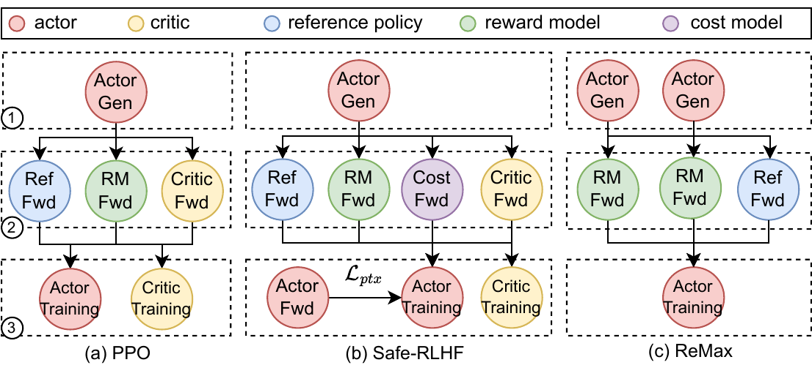
  <br><em>图 1：三种 RLHF 算法的 dataflow graph。阶段 1、2、3 分别表示生成、准备和训练。</em>
</p>

### 2.2 分布式 ML 的编程模型

LLM 通常通过数据并行、流水线并行和张量并行进行训练和服务 [31, 32, 15]。数据并行（DP）把输入数据切成多个子集，每个子集由一个独立设备处理 [33]。ZeRO 是面向 DP 训练的内存优化方案，它逐步在 GPU 间分片 optimizer states、gradients 和 model parameters [22]。流水线并行（PP）和张量并行（TP）则把模型参数、梯度和 optimizer states 分布到多个 GPU 上 [34, 35, 14]。Megatron-LM 和 MegaScale 等现代分布式训练框架使用 3D parallelism 或 PTD parallelism，其中 P、T、D 分别表示 PP、TP、DP [14, 32, 31]。在 3D parallelism 中，PP size 是模型训练的 pipeline stage 数，TP size 是一个 tensor 被分片的份数，DP size 是模型副本数。LLM serving 系统也使用类似训练的 3D parallelism，不过只有 model parameters 和 KVCache 被分片 [15, 36, 37]。

RLHF dataflow 中的 LLM 模型会执行训练、推理或生成等不同计算。训练包含一次前向、一次反向和一次模型更新；推理包含一次前向；生成是多次前向的自回归过程。具体来说，actor 执行训练和生成，critic 执行训练和推理，reference policy 与 reward model 执行推理。不同模型和不同计算具有不同 workload，因此需要为各模型选择不同并行策略，以达到最佳吞吐。

在单控制器范式中，集中式控制器管理分布式程序的整体执行流。由于控制逻辑集中，用户可以把 dataflow 的核心功能构建为单进程，而控制器自动生成 distributed workers 来执行计算。凭借对硬件和 dataflow graph 的全局视图，单控制器范式可以灵活优化 dataflow tasks 的资源映射和执行顺序。但控制消息需要从控制器发给所有 workers，在大集群上执行大规模 dataflow graph 时会产生显著 dispatch overhead [18, 17]。

在多控制器范式中，每个设备（worker）都有自己的 controller。最先进的分布式 LLM 训练和服务系统使用多控制器范式，因为它可扩展且 dispatch overhead 低，控制消息主要经由快速 PCIe 链路从 CPU 传到 GPU [14, 32, 38, 15]。图 2a 展示了一个使用多控制器的 RLHF 实现：每个模型运行一个单独程序，同一模型的所有 worker 执行同一程序。每个 worker 只拥有局部系统状态，需要通过模型之间的点对点通信来协调执行顺序。为了在多控制器架构中实现 RLHF workflow，用户必须在每个设备运行的程序中仔细集成 collective communication、computation 和 point-to-point data transfer。这会让计算与数据传输深度嵌套，使系统难以开发、维护和优化。

<p align="center">
  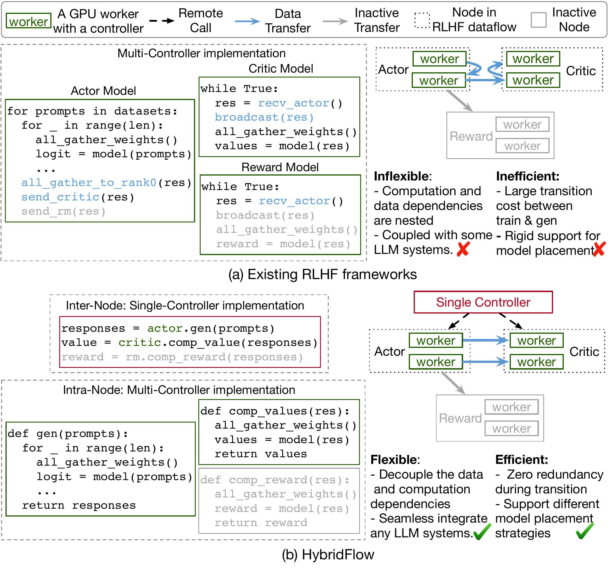
  <br><em>图 2：RLHF 系统使用的编程模型。a) 已有 RLHF 系统采用多控制器范式。b) HybridFlow 使用混合编程模型：单控制器协调模型，每个模型在分布式计算中使用多控制器范式。灰色节点表示当前未执行的操作。</em>
</p>

### 2.3 RLHF 的系统特征

RLHF 中 actor、critic、reference 和 reward models 在不同阶段执行训练、推理或生成，具有不同内存占用和计算需求。reference policy 与 reward models 只执行前向计算，因此 GPU 内存中只需要存储参数；actor 与 critic 需要训练，因此必须存储参数、梯度和 optimizer states。此外，一个小 actor，例如 7B 预训练/微调 LLM，可以与更大的 critic 和 reward model，例如 70B LLM，配对使用，以获得更好的对齐效果 [3]。这种异构性要求系统为每个模型设计不同并行策略和定制优化。

actor 的训练和生成在 RLHF dataflow 中表示为两个节点，往往占据一次 RLHF 迭代的大部分 workload，例如在 HybridFlow 中占 58.9%。actor 训练是 compute-bound [39]，通常需要更大的模型并行（MP）规模，并把 workload 分布到更多 GPU 上，例如把 7B 模型切成 8 个 partition 放在 8 个 GPU 上。若 generation 仍使用相同并行策略，可能因 generation 的 memory-bound 特性导致 GPU 计算资源利用不足 [15]。已有研究表明，较大的 DP size 搭配较小的 MP size，例如把 7B 模型切成 2 份并在 8 个 GPU 上复制 4 次，可以提升 generation throughput [40, 41]。不过，在 actor training 和 generation 中使用不同并行策略，会要求运行时在两个阶段之间 reshard actor weights，带来显著通信和内存开销。例如对齐 70B actor model 时，每个 RLHF iteration 需要从 training 到 generation 传输 140GB model weights；当两个阶段放在不同设备上时，这一过程最多占一次迭代时间的 36.4% [19]。

<p align="center">
  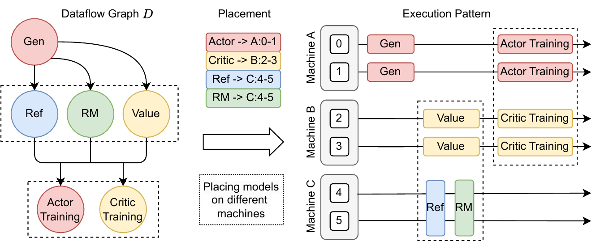
  <br><em>图 3：给定模型放置方案下的 dataflow 执行。带编号的块表示 GPU。虚线框中的模型放在不同设备集合上，可以并发计算。reference model 和 reward model colocate 在同一组 GPU 上并顺序执行。</em>
</p>

模型放置也会显著影响 RLHF 性能。根据模型的计算 workload 和数据依赖，RLHF dataflow 需要策略性地把模型放到设备上。图 3 给出了一个模型放置计划及相应执行流。没有数据依赖时，放在不同设备集合上的模型可以并行执行；放在同一组 GPU 上的模型称为 colocated models，它们共享 GPU 内存并以 time-sharing 方式顺序执行，因为 colocated LLM 若并发执行很容易触发 OOM。

这里存在一个折中：把模型放在不同设备上允许并行处理，但由于 RLHF 是分阶段执行的，可能产生 GPU 空闲时间。在图 3 中，actor 和 critic 分开放置，可以并行训练，但在其他 RLHF 阶段中有三分之一 GPU 时间处于空闲。支持多种放置策略并最大化设备利用率，对于在任意模型规模和集群规模下优化 RLHF 性能都很关键。

表 1 总结了已有 RLHF 系统采用的并行策略、模型放置和执行模式。DeepSpeed-Chat 和 OpenRLHF 使用 ZeRO-3 进行 actor 训练、TP 进行 actor generation [24, 19]。OpenRLHF 在不同设备上为 training 与 generation 使用不同 actor copy，导致冗余内存使用和频繁的权重同步。DeepSpeed-Chat 在同一组设备上维护同一份 actor copy，并在 training 与 generation 之间 reshard weights；由于两个阶段使用不同 parallelism，大模型仍会产生显著内存与通信开销。NeMo-Aligner 在 actor training 与 generation 中使用相同 3D parallelism configuration，导致 generation throughput 较低 [20]。

表 1：RLHF 框架对比。执行模式图展示一个 PPO iteration 的执行过程，数字 1-6 分别表示 response generation、reward model inference、reference model inference、critic inference、actor training 和 critic training。

| 维度 | DeepSpeed-Chat | OpenRLHF | NeMo-Aligner | HybridFlow |
| --- | --- | --- | --- | --- |
| Parallelism | Training: ZeRO；Generation: TP | Training: ZeRO；Generation: TP | training 和 generation 都使用 3D parallelism | Training: 3D、ZeRO、FSDP；Generation: 3D parallelism |
| training 与 generation 中的 actor weights | 从 ZeRO 到 TP 进行 model resharding | 两个阶段使用两份 actor weights | 两阶段使用相同模型分片，共享 weights | 零冗余 model resharding |
| Model placement | 所有模型 colocate 在同一组设备上 | 每个模型放在单独设备上 | Actor/Ref colocate，Critic/RM colocate | 支持多种 model placement |
| Execution pattern | 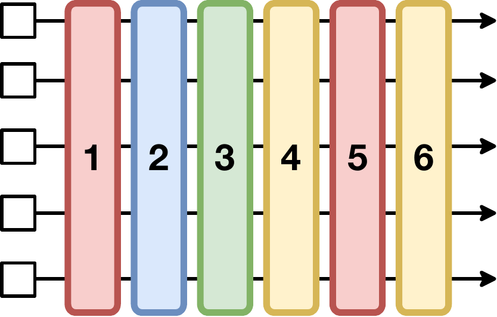 | 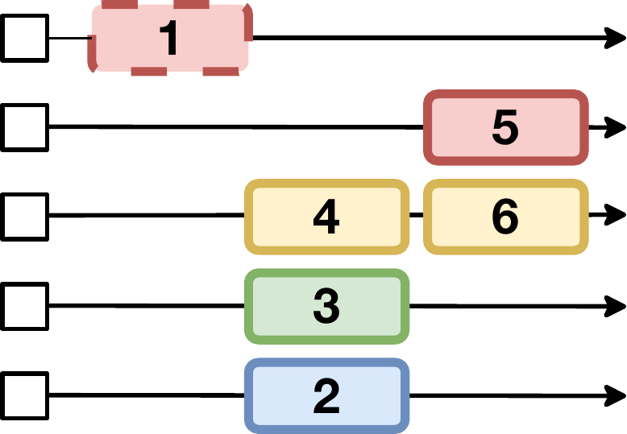 | 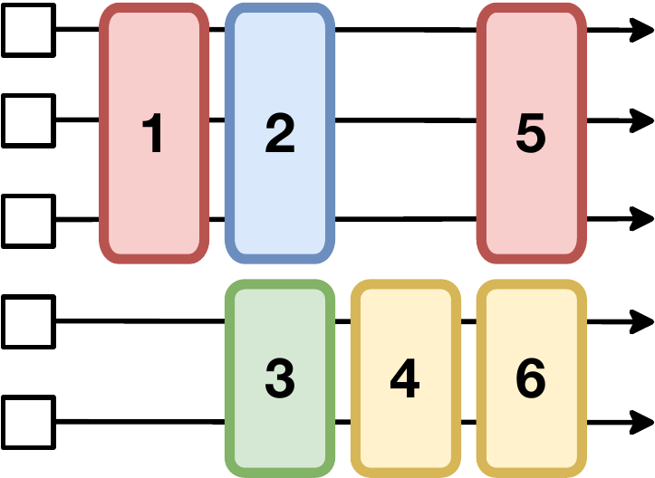 | 支持多种 execution pattern |

<p align="center">
  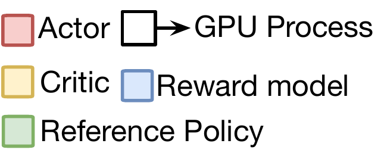
  <br><em>表 1 附图：执行模式编号的含义。</em>
</p>

已有 RLHF 系统还受限于固定模型放置计划和固定执行模式。OpenRLHF 和 NeMo-Aligner 在 preparation 和 learning 阶段允许模型并发计算，但 generation 阶段除 actor 外其他模型空闲，浪费它们占用的 GPU。DeepSpeed-Chat 把所有模型 colocate 到同一组设备上，每个设备按照 RLHF dataflow 顺序执行每个模型；当模型 workload 不均衡时，这种放置会降低资源利用率。

因此，关键问题是：如何设计一个既灵活又高效的编程模型来实现 RLHF dataflow？单控制器在节点间层面具有优势，因为它能够灵活协调不同模型分布式计算之间的数据传输、执行顺序和资源虚拟化 [17, 42]。RLHF dataflow graph 通常只有少量节点，从单控制器向不同节点分发控制消息的开销相对于节点本身的分布式计算来说可以忽略。多控制器范式则适合每个模型的分布式计算，因为它向加速器分发算子的延迟低 [43]。基于这些洞察，HybridFlow 采用层次化混合编程模型，将单控制器和多控制器以混合方式结合起来，使 RLHF dataflow 在节点间和节点内都保持低控制开销。

## 3 HybridFlow 概览

图 4 展示了 HybridFlow 的架构，它由三个主要组件构成：Hybrid Programming Model、3D-HybridEngine 和 Auto-Mapping algorithm。Hybrid Programming Model 包含一组分层 API，用于灵活表达 RLHF dataflow，并高效执行 dataflow 中的模型计算。3D-HybridEngine 专门用于高效执行 actor 模型的训练与生成，它允许两个阶段使用不同 3D parallel configuration，并在阶段转换时实现零内存冗余和最小通信开销。Auto-Mapping algorithm 则确定每个模型的优化设备放置，以最大化 RLHF 吞吐。

<p align="center">
  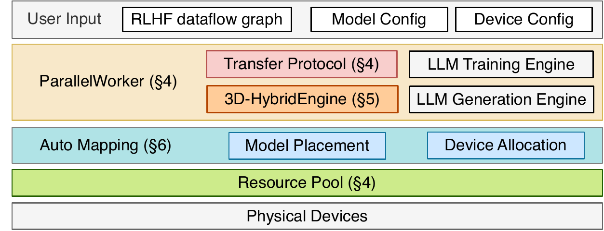
  <br><em>图 4：HybridFlow 架构。</em>
</p>

HybridFlow 的 workflow 如下。用户提供三类输入来启动 RLHF 系统：第一，模型规格，包括 RLHF dataflow 中 actor、critic、reference policy、reward model 的架构和规模；第二，在给定 GPU 集群配置下运行 auto-mapping algorithm 得到的模型设备放置；第三，每个模型在每个阶段的并行策略，例如 3D parallelism 的 `(p, t, d)` 元组，其中 `p`、`t`、`d` 分别表示 PP size、TP size 和 DP size。

单控制器程序根据这些输入初始化 RLHF dataflow 中的模型和虚拟化资源池，按照 placement plan 把 operation/model 分发到设备，并调用设备上的多控制器函数来执行每个模型的分布式计算。多控制器程序实现 ParallelWorker class：它根据并行策略在分配到的设备之间构建每个模型的 parallel groups，调用 3D-HybridEngine 进行 actor training 和 generation，并能无缝集成 Megatron-LM、DeepSpeed、PyTorch、vLLM 等已有 LLM engines，用于其他模型的训练、推理和生成 [14, 38, 23, 15]。transfer protocols 由单控制器协调，用于支持 prompts、responses 和其他 RLHF model outputs 在不同并行策略模型之间 resharding；actor 在 training 与 generation 之间的数据 resharding 则由 3D-HybridEngine 处理。

## 4 混合编程模型

### 4.1 分层 API

HybridFlow 为每个模型在不同 RLHF 阶段的分布式计算提供基础类 `3DParallelWorker`。给定已分配设备后，它负责分布式模型权重初始化，并为每个模型建立 3D parallel groups。一个 parallel group 包含承载某个模型并行维度的一组 GPU，例如 TP 中不同 tensor shards，或 DP 中不同 model replicas。图 5a 展示了使用这些 API 初始化 actor model 的过程，其他模型初始化方式类似。

<p align="center">
  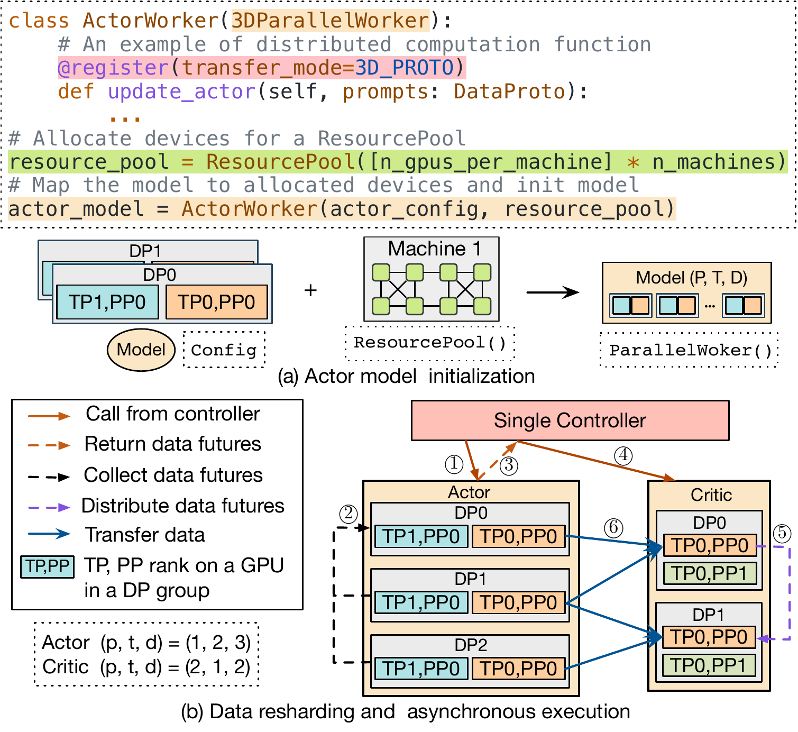
  <br><em>图 5：分层 API 示例。a) 使用 3D parallel configuration、resource allocation 和 3DParallelWorker 初始化模型。b) 通过 3D_PROTO 中的 collect 与 distribute 函数，在两个模型之间进行异步数据 resharding。</em>
</p>

在继承 `3DParallelWorker` 的基础上，HybridFlow 提供 actor、critic、reference、reward 等 model classes。每个 model class 封装用于实现分布式 forward/backward computation、自回归生成和 optimizer update 的 API，使模型分布式计算代码与其他模型的数据依赖解耦。这些 API 可以直接复用已有 LLM 系统中的计算脚本。例如，`ActorWorker` 的 `update_actor` 函数涉及的计算与 Megatron-LM 中预训练脚本类似 [14]。model class 封装了实现各种 RLHF 算法所需的基本操作，例如 actor model class 中基于 prompts 生成 responses 的 `generate_sequences`，以及 reward model class 中通过 forward pass 评估 responses 的 `compute_reward`。除实现 3D parallelism 的 `3DParallelWorker` 外，HybridFlow 还为 PyTorch FSDP 和 ZeRO 提供 `FSDPWorker` 与 `ZeROWorker` 基类及对应 model classes，从而支持不同模型计算并行策略。

节点间数据传输涉及在不同设备、不同并行策略的模型之间进行多对多 multicast。HybridFlow 通过 `@register` 将每个 model class 中的每个 operation 与一个 transfer protocol 关联起来，统一实现数据传输。每个 transfer protocol 由 collect function 和 distribute function 组成，分别根据模型并行策略聚合输出数据和分发输入数据。在图 5a 的例子中，`update_actor` operation 被注册到 `3D_PROTO`，因为 actor training 使用 3D parallelism。在 `3D_PROTO` 中，collect function 从每个 DP group 中收集对应模型函数的输出数据，例如 `update_actor` 返回的 loss scalar；distribute function 把输入数据，例如 `update_actor` 需要的 advantages，分发到每个 DP group。

数据 resharding 由源模型的 output collect function 和目标模型的 input distribute function 配合完成。图 5b 展示了 actor generation 和 critic inference 之间的数据 resharding；这两个模型采用不同 3D parallelism strategies。单控制器先通过 actor 的 `3D_PROTO` collect function 收集 data futures，然后发送给 critic；critic 再使用自己的 `3D_PROTO` distribute function 把这些 futures 分发到每个 DP group。随后，远程数据从 actor 被 critic 拉取，critic 的每个 GPU 只根据自己的 DP rank 获取 actor 输出数据中的本地 batch。实际数据传输只发生在 GPU 之间，避免了中心瓶颈。HybridFlow 提供 8 种 transfer protocols，包括 `3D_PROTO`、`DP_PROTO`、`ONE_TO_ALL` 等，覆盖大多数数据 resharding 场景；用户也可以通过实现自定义 collect 和 distribute 函数扩展协议。

HybridFlow 还提供 `ResourcePool` class 来虚拟化一组 GPU 设备。当一个 `ResourcePool` 实例应用到某个 model class 时，该模型的分布式计算会映射到这些设备上。使用同一个 `ResourcePool` 的模型 colocate 在同一组 GPU 上；使用不同 `ResourcePool` 的模型则被放在不同 GPU 集合上。HybridFlow 假设不同 `ResourcePool` 之间没有重叠。

当模型放在不同设备集合上时，只要输入可用，其执行就会被自动触发 [42]。在图 5b 中，actor 的 data future 在控制器调用后立即返回；控制器随后调用 critic，并根据 transfer protocol 分发 futures。若某些模型放在同一组设备上，则它们按调用顺序顺序执行。借助这一编程模型，HybridFlow 可以在不修改 RLHF algorithm 代码的情况下支持多样化分布式执行模式。

### 4.2 实现不同 RLHF 算法

HybridFlow API 支持以精简方式开发各种 RLHF 算法和 dataflows。用户可以用几行代码实现单进程 RLHF 算法程序，在单控制器上运行，并通过一系列 primitive API calls 调用各模型的分布式计算。图 6 给出了 PPO、ReMax 和 Safe-RLHF 的例子。PPO 只需调用 `compute_values`、`generate_sequences` 等 model operations，即可用 8 行代码实现；这些操作会在多 GPU 的多控制器范式下执行。为了适配 Safe-RLHF，只需要在 PPO 上额外添加 5 行代码，引入 cost model 来评估 safety preferences，并加入 actor 的 pretraining loss。适配 ReMax 时，则只需要额外调用一次 actor generation，并移除 critic 相关代码。

<p align="center">
  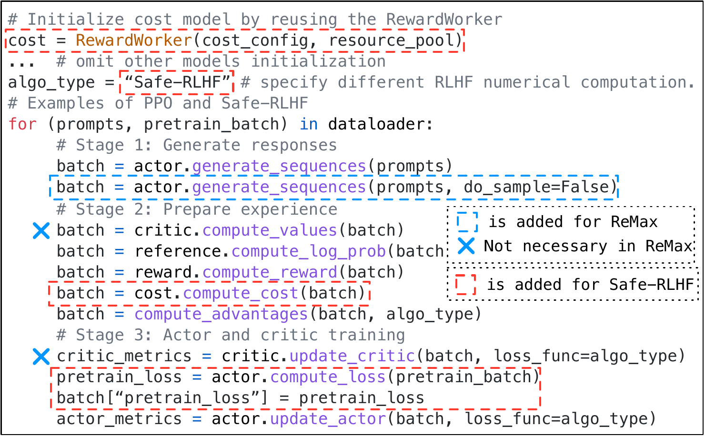
  <br><em>图 6：PPO、ReMax 和 Safe-RLHF 的实现。用户可以通过添加或删除少量代码适配不同 RLHF 算法。</em>
</p>

这种扩展灵活性对于研究人员探索不同 RLHF 算法非常关键。研究人员可以复用每个 model class 中封装的分布式计算，并只根据具体算法调整数值计算代码，例如在 `compute_advantage`、actor loss 和 critic loss 中实现 GAE 或 KL divergence [44]。简化开发得益于 HybridFlow 的混合编程模型。模块化 API 简化了开发，提升了代码复用，并允许直接纳入已有 LLM training/serving 框架的 codebase。由于模型计算与模型间数据传输被解耦，分布式框架的任何变化都不会影响 RLHF algorithm 代码，从而允许独立优化每个模型的执行。灵活的模型放置也使系统能够把 RLHF dataflow 优化映射到不同设备上。

## 5 3D-HybridEngine

HybridFlow 设计 3D-HybridEngine，以支持 actor 模型高效训练和生成，从而显著提升 RLHF 吞吐。为了消除冗余 actor model copies，HybridFlow 主张把 actor training 和 generation 部署在同一组设备上，即分配给 actor 的 $N_a$ 个 GPU，并在同一份 actor weights 上顺序执行两个阶段。然而，actor training 和 generation 可能采用不同 3D parallelism strategies：generation 通常需要比 training 更小的 TP/PP size 和更大的 DP size。3D-HybridEngine 在这一背景下实现同一组设备上 training 与 generation 之间的高效模型参数 resharding。

<p align="center">
  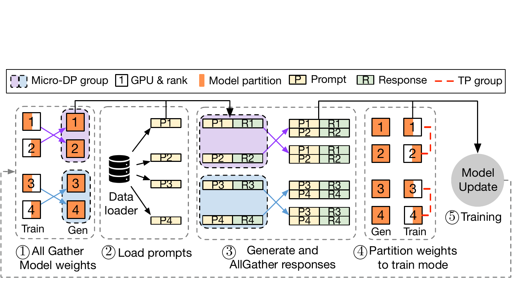
  <br><em>图 7：一次 RLHF iteration 中 3D-HybridEngine 的 workflow。4 个 GPU 用于 actor training 和 generation；training 使用 1-2-2（p-t-d）parallel groups，generation 使用 1-1-2-2（p_g-t_g-d_g-d）parallel groups。</em>
</p>

设 $p$-$t$-$d$ 表示 actor training 的 3D parallel groups，分别对应承载 $p$ 个 pipeline stages、$t$ 个 tensor shards 和 $d$ 个 model replicas 的 GPU 集合 [31]。3D-HybridEngine 会根据两个阶段不同的 3D parallelism strategies，为 actor training 和 generation 构建不同 parallel groups。在 generation 阶段，使用 $p_g$、$t_g$、$d_g$ 分别表示 generation pipeline parallel group、generation tensor parallel group 和 micro data parallel group 的大小。$d_g$ 表示 generation 中 model replica 数量相对于 training 的比例，即 training 中的每个 DP replica 在 generation 中变成 $d_g$ 个 micro DP replicas，以处理 $d_g$ 个 prompt/response microbatches。于是有 $N_a = p \times t \times d = p_g \times t_g \times d_g \times d$，且 $d_g = \frac{pt}{p_g t_g}$。micro DP groups 只在 actor generation 阶段使用，用于形成更大的 DP size、充分利用设备。

在 RLHF 第 $i$ 次迭代的 actor training 与第 $i+1$ 次迭代的 actor generation 之间，actor model parameters 需要根据两个阶段的 parallel group configuration 重新分片，prompts data 也需要分发。在第 $i+1$ 次迭代中，3D-HybridEngine 先收集第 $i$ 次迭代更新后的 actor parameters，用于每个 micro DP group 内的 generation；然后把 prompts batch 加载到每个 model replica，执行 RLHF generation 阶段。之后，3D-HybridEngine 在每个 micro DP group 内对 generation results 执行 all-gather，并根据 actor training 的 3D parallelism 重新划分 model parameters。随着 model weights、prompts 和 responses 被正确重新分布，系统计算 actor model loss 并根据 RLHF 算法更新 actor weights，完成第 $i+1$ 次迭代的 actor training 阶段。

### 5.1 零冗余模型 resharding

3D parallelism 中的 parallel grouping 通常如下：PP 和 TP groups 由连续 ranks 分配给 pipeline stages 和 tensor shards 形成；DP groups 则按 PP size 与 TP size 的乘积作为间隔，从 ranks 中选取。在图 8a 中，actor training 使用 1-4-2 3D parallel groups：TP groups 为 `[G1, G2, G3, G4]` 和 `[G5, G6, G7, G8]`，DP groups 为 `[G1, G5]`、`[G2, G6]`、`[G3, G7]`、`[G4, G8]`。若 generation 仍使用相同 grouping 方法但换成不同 parallel sizes，例如图 8a 中的 1-2-2-2，training 到 generation 转换时，3D-HybridEngine 需要在 model parallel groups 中执行 all-gather 聚合所有参数，再根据设备所属 generation parallel groups 只保留一部分 generation weights。在部分 GPU 上，例如 G2、G3、G6、G7，training weights 和 generation weights 没有重叠，因此还需要额外内存保留后续 training 所需的 weights。本文称这种使用 vanilla grouping 的系统为 HybridFlow-V。

<p align="center">
  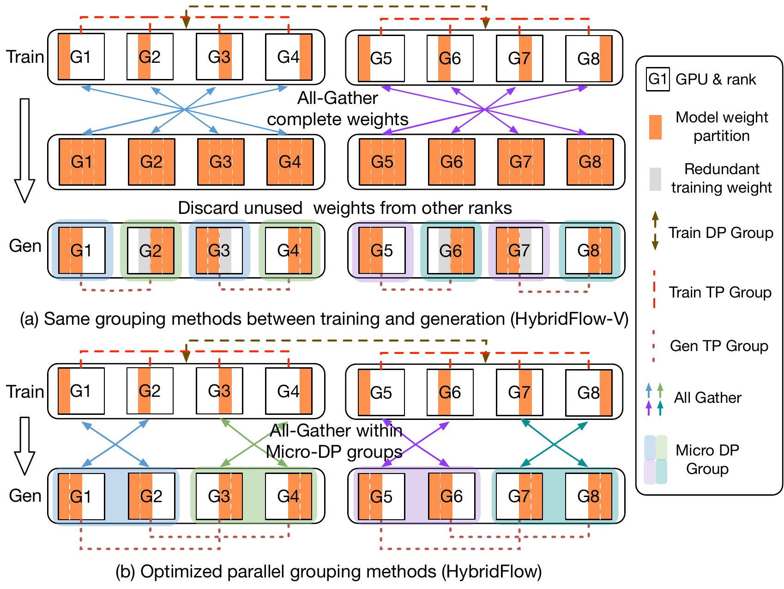
  <br><em>图 8：模型权重 resharding。actor training 和 generation 使用两台机器，每台机器 4 个 GPU。</em>
</p>

HybridFlow 进一步为 generation 阶段设计新的 parallel grouping 方法，以消除 weights 存储冗余，并把 actor model resharding 带来的内存占用和通信降到最低。具体来说，generation TP 和 PP groups 通过按 $\frac{t}{t_g}$ 和 $\frac{p}{p_g}$ 的固定间隔选取 ranks 形成；micro DP groups 则沿 generation TP 或 PP 维度顺序分配 ranks。图 8b 中 generation 使用 1-2-2-2 parallel groups：generation TP groups 为 `[G1, G3]`、`[G2, G4]`、`[G5, G7]`、`[G6, G8]`，micro DP groups 为 `[G1, G2]`、`[G3, G4]`、`[G5, G6]`、`[G7, G8]`。这种 generation parallel groups 的重排使每个设备上的 training weights 与 generation weights 产生重叠，从而在 generation 中复用 training weights，并在 model resharding 导致的 device memory usage 中实现零冗余。此外，3D-HybridEngine 在每个 micro DP group 内并发执行 all-gather，显著降低通信开销。

表 2：training 与 generation 之间的 transition overhead。

| 指标 | DS-Chat | HybridFlow-V | HybridFlow |
| --- | --- | --- | --- |
| 通信量 | $\frac{tpd - 1}{tpd}M$ | $\frac{tp - 1}{tp}M$ | $\frac{tp - t_g p_g}{t_g p_g tp}M$ |
| 峰值内存 | $M$ | $M$ | $\frac{1}{t_g p_g}M$ |
| 冗余 | $\frac{1}{tpd}M$ | $\frac{1}{tp}M$ | 0 |

表 2 比较了不同 actor engine designs 在 training 与 generation 转换期间的通信开销和内存占用。假设 actor model size 为 $M$，使用 $N_a$ 个 GPU 进行 training 与 generation。DeepSpeed-Chat 的 actor engine 在 transition 时跨所有 GPU 执行 all-gather；HybridFlow-V 在 training TP 和 PP groups 内执行 all-gather。根据 collective communication 分析，这些操作的通信量分别为 $\frac{N_a-1}{N_a}M=\frac{tpd-1}{tpd}M$ 和 $\frac{tp-1}{tp}M$ [45]。两个 engine 都先在每个 GPU 内存中聚合全部 model parameters，再按 generation parallel groups 划分 model states，因此 model parameters 的峰值内存为 $M$。由于部分 GPU 无法在 generation 中复用 training weights，还会产生 $\frac{1}{tpd}$ 和 $\frac{1}{tp}$ 的冗余内存消耗。

使用 HybridFlow 的 generation parallel grouping 后，all-gather 被限制在每个 micro DP group 内。通信开销降低为 $\frac{d_g-1}{tp}M = \frac{tp-t_g p_g}{t_g p_g tp}M$。每个 GPU 只需要在其 micro DP group 内收集远程参数，并且可以在 generation 中复用 training weights。因此，HybridFlow 中 model parameters 的峰值内存精确等于 generation 时每个 GPU 上的 model partition size，消除了 GPU memory usage 中的任何冗余。

## 6 自动设备映射

HybridFlow 的混合编程模型要求用户输入 RLHF dataflow 到给定设备的映射，也就是：模型在 dataflow 中的设备放置，以及每个模型在每个阶段运行时的并行策略。HybridFlow 提供一个高效算法，帮助用户识别在给定设备集群上执行 RLHF dataflow 的优化映射，使每次 RLHF iteration 的端到端延迟最小。

给定 dataflow $D$，算法首先探索模型在给定集群中的所有可能 placement plans $\mathcal{P}$。例如 PPO 算法包含四个模型，因而有 15 种可能 placement，来自 Bell partition problem [46, 47]，范围从所有模型放在不同设备上的 fully standalone placement，例如 OpenRLHF，到所有模型 colocate 在同一组设备上的 placement，例如 DeepSpeed-Chat。HybridFlow 将 colocate 在同一组 GPU 上的模型称为 colocated set。一个 colocated set 中的模型可以在同一组 GPU 上使用不同并行策略。系统根据 colocated models 的内存消耗，为每个 colocated model set 识别最小 GPU 分配 $A_{min}$，以避免 OOM。

随后，算法从 $A_{min}$ 出发，枚举每个 colocated model set 的所有可行设备分配。给定分配 $A$ 和 set 中模型的 workload $W$，`auto_parallel` 模块为每个模型探索优化并行策略，以最小化模型执行延迟。workload $W$ 包括每个模型的输入/输出形状以及计算类型（training、inference 或 generation）。在 `auto_parallel` 中，系统使用 `simu` simulator 估计不同 parallel strategies 的延迟，方法遵循已有研究 [41, 48, 49, 50]。

`d_cost` 模块在给定 model placement 与 parallelism strategies 下估计 RLHF dataflow 的端到端延迟。它遍历 dataflow graph 中的所有阶段，并累加各阶段延迟。对于同一个 colocated set 中、在同一阶段执行计算的模型，例如 RLHF training 阶段同时执行 model update 的 actor 和 critic，延迟相加；对于不同 colocated sets 中的模型，它们在同一阶段可以并行，因此该阶段延迟由不同 sets 的最大执行时间决定。算法最终识别出使每次 RLHF iteration 执行时间最小的 model placement 及其对应 parallelism strategies。

算法 1：RLHF dataflow 的设备映射。

```text
Input:
  RLHF dataflow graph D
  LLM 列表 L = [l_1, l_2, ..., l_k]
  LLM workload W
  GPU 总数 N
  每个 GPU 的内存容量 Q

Output:
  dataflow 中模型的 device mapping

P <- get_placements(D, L, N)
C* <- infinity
best_mapping <- empty

for each placement plm in P:
  C_plm <- infinity
  best_plm_alloc <- empty
  A_min <- get_min_alloc(plm, Q, N)
  for each A in enum_alloc(N, A_min):
    L_hat <- []
    for each colocated set in plm:
      for each model l in set:
        l_hat <- auto_parallel(A, A_min, l, W)
        append l_hat to L_hat
    update plm with L_hat
    C_alloc <- d_cost(D, plm, W)
    if C_alloc < C_plm:
      C_plm <- C_alloc
      best_plm_alloc <- (plm, A)
  if C_plm < C*:
    C* <- C_plm
    best_mapping <- best_plm_alloc

return best_mapping

Procedure d_cost(D, plm, W):
  s <- number of stages in D
  c <- zeros(s)
  for each colocated set in plm:
    c_g <- zeros(s)
    for i in {0, ..., s-1}:
      for each model l_hat in set:
        c_g[i] <- c_g[i] + simu(l_hat, W[i])
      c[i] <- max(c[i], c_g[i])
  return sum(c)
```

算法 1 的复杂度为 $O(\frac{(N-1)!}{(k-1)!(N-k)!})$，其中 $k$ 是 dataflow 中的模型数量，$N$ 是运行 dataflow 的设备总数。这是枚举某个 placement strategy（最坏情况下为 standalone placement）所有可能设备分配的最坏复杂度，其来源是把 $N$ 个设备分配给 $k$ 个模型的 integer partition problem [51]。为了提升效率，HybridFlow 会缓存每个模型在 $A$ 个设备上识别出的 parallelism strategies，以避免同一模型在不同 placement strategy 中被放到 $A$ 个 GPU 上时重复搜索。虽然本文运行 auto-mapping algorithm 时假设 $N$ 个 GPU 是同构的，但算法可以通过在 `simu` 和 `auto_parallel` 模块中考虑异构设备，扩展到异构设备上的 model mapping 优化 [52]。

## 7 实现

HybridFlow 使用约 12k 行 Python 代码实现。分层 API 使用 1.8k 行代码实现。集中式单控制器构建在 Ray 之上，并使用 Remote Process Calls（RPC）按照 dataflow 协调不同模型的执行顺序，以及模型之间的数据传输 [42]。中间数据存储在 TensorDict 中 [23]。在用于分布式计算的多控制器范式中，每个 model function 在不同设备上的独立进程中运行，控制消息从每个控制器的 CPU 进程转发到相应 GPU。实现支持 Megatron-LM、PyTorch FSDP、DeepSpeed 作为 LLM training 和 inference engines，并支持 vLLM 进行自回归生成。对于 vLLM，HybridFlow 将集中式 KVCache manager 替换成分布式 manager，以匹配多控制器范式。

3D-HybridEngine 的主要逻辑使用 2.4k 行代码实现，构建在 Megatron-LM 和 vLLM 之上。HybridFlow 将 actor model 在 training 和 generation 阶段的 weights 存储在独立 memory buffers 中，在 training 期间把 generation weights offload 到 CPU memory，在 transition 时重新加载到 GPU memory，并在 generation 中同时使用两个 buffers。系统使用 NCCL communication primitives 在 training 与 generation 转换期间，在每个 micro DP group 中收集并拼接 model parameters [53]。generation 后，KVCache 会被 offload 到 CPU memory，并在下一次迭代中重新加载回 GPU。

Auto-Mapping Algorithm 连同 training、inference、generation 三类 workload simulator 一起使用 1.9k 行代码实现。该算法在 RLHF dataflow 启动前于 CPU 上运行，用于生成 dataflow 初始化所需的 device mapping 和 parallelism strategies。

## 8 评估

### 8.1 实验设置

实验将 HybridFlow 部署在一个包含 16 台机器、128 个 GPU 的集群上。每台机器配备 8 块 NVIDIA A100-80GB GPU，GPU 之间通过 600GB/s NVLink 互连；机器间带宽为 200Gbps。实验软件版本包括 CUDA 12.1、PyTorch 2.1.2、Megatron-core 0.6.0、NCCL 2.18.1 和 vLLM 0.3.1。

实验运行 PPO、ReMax 和 Safe-RLHF 三种算法的 RLHF dataflow [8, 12, 11]。PPO 是最常用的 RLHF 算法之一 [3, 7]，包含 actor、critic、reference policy 和 reward models。每个模型都是 Llama 模型，规模从 7B 到 70B [2]。Safe-RLHF 额外包含一个 cost model，其架构和规模与 reward model 相同；ReMax 则去掉 critic model。所有实验中，actor 和 critic 训练使用 mixed precision，即 model parameters 使用 BF16，gradient 和 optimizer states 使用 FP32，并使用 Adam optimizer [29]。模型推理和自回归生成使用 BF16。除非特别说明，实验结果来自 PPO。

HybridFlow 与 DeepSpeed-Chat v0.14.0、OpenRLHF v0.2.5、NeMo-Aligner v0.2.0 进行比较 [24, 19, 20]。NeMo-Aligner 不支持 ReMax。其他框架如 Trlx、HuggingFaceDDP 和 Collosal-Chat 由于代表性较弱且慢于上述 baselines，本文不进行比较 [54, 55, 56, 24]。性能指标使用 RLHF throughput（tokens/sec），计算方式为 global batch 中 prompts 和 responses 的 token 总数除以一次 RLHF iteration 时间。所有报告的性能数字都在 10 次 warm-up iteration 后，对 5 次 training iteration 取平均。

实验在 HuggingFace 的 `Dahoas/ful-hh-rlhf` 数据集上执行 RLHF，该数据集被广泛用于 LLM alignment [3, 57, 58]。由于 baseline systems 可能没有在 generation 中使用 continuous batching optimization，为公平比较，实验强制所有系统生成相同长度的 responses [59]。每个实验中，input prompt length 和 output response length 都是 1024，actor model 的 input prompts global batch size 为 1024。PPO epochs 数为 1，每个 epoch 的 PPO update iterations 数为 8，与已有 RLHF 研究一致 [7, 60, 61]。

### 8.2 端到端性能

图 9、图 10 和图 11 分别展示运行 PPO、ReMax 和 Safe-RLHF 时的 RLHF throughput。本组实验中，actor、critic、reference 和 reward models 规模相同，遵循已有实践 [3, 24, 7]。不同模型规模实验使用的 GPU 数量从不 OOM 地运行 RLHF 所需最小 GPU 数到 128 个 GPU。为公平比较，实验未启用 optimizer states offloading [62]。

<table align="center">
  <tr>
    <td align="center" width="50%"><br><em>图 9a：7B，1.68x 到 8.63x。</em></td>
    <td align="center" width="50%">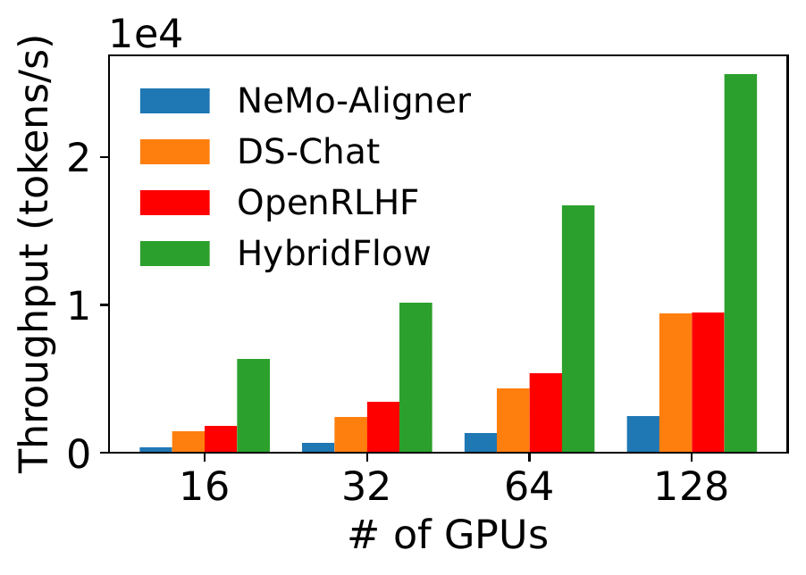<br><em>图 9b：13B，2.70x 到 18.96x。</em></td>
  </tr>
  <tr>
    <td align="center" width="50%">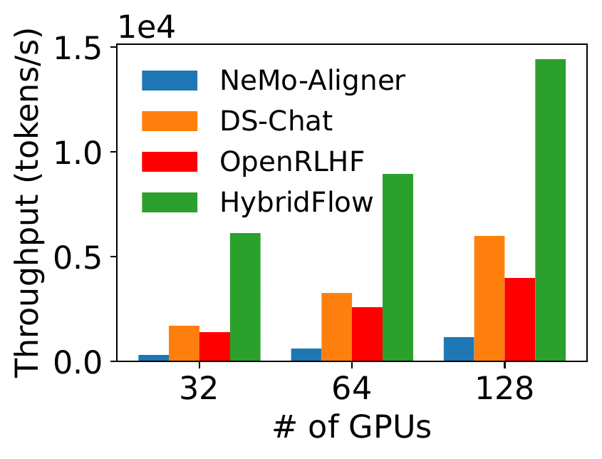<br><em>图 9c：34B，2.41x 到 20.57x。</em></td>
    <td align="center" width="50%">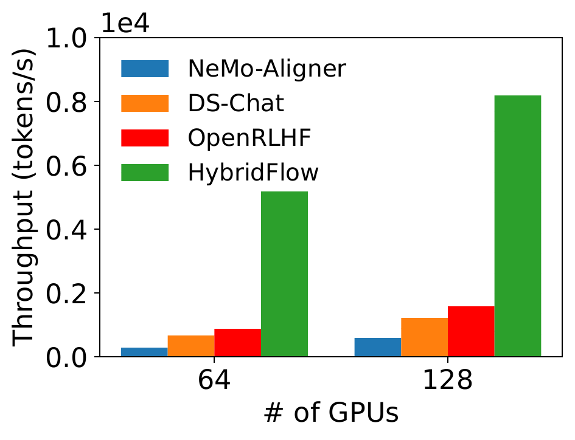<br><em>图 9d：70B，5.17x 到 17.98x。</em></td>
  </tr>
</table>

<p align="center"><em>图 9：PPO throughput。括号中的数字表示 HybridFlow 相对 baselines 的 speedup。</em></p>

<table align="center">
  <tr>
    <td align="center" width="50%">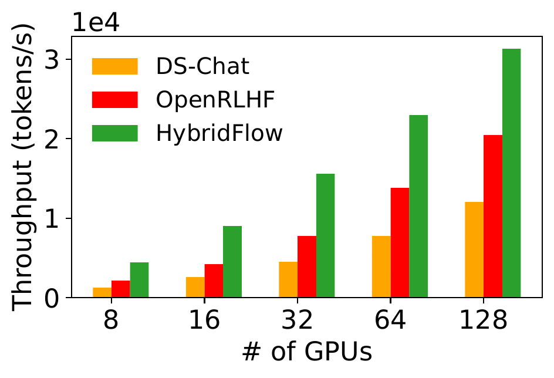<br><em>图 10a：7B，1.53x 到 2.56x。</em></td>
    <td align="center" width="50%">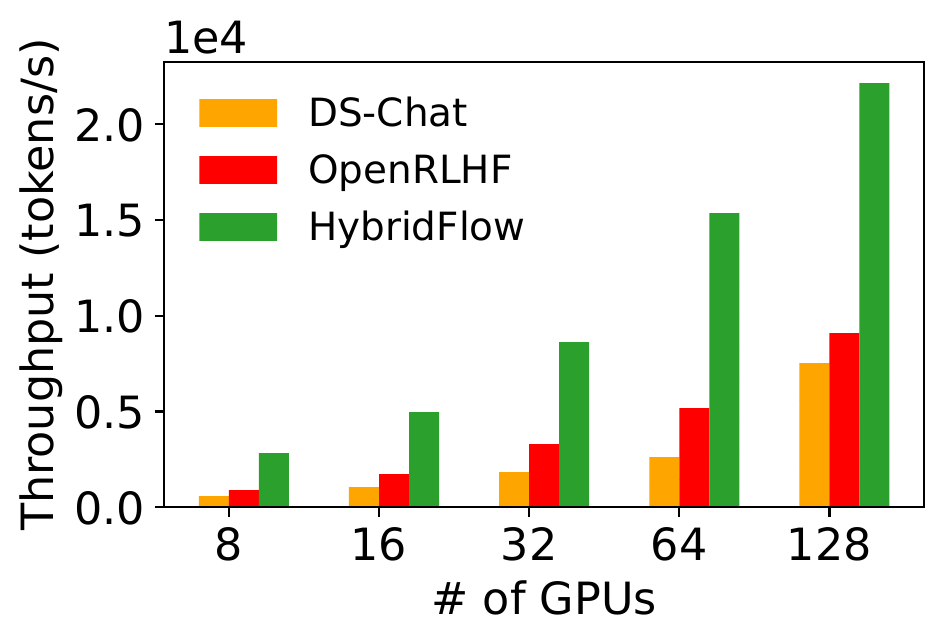<br><em>图 10b：13B，2.49x 到 3.66x。</em></td>
  </tr>
  <tr>
    <td align="center" width="50%">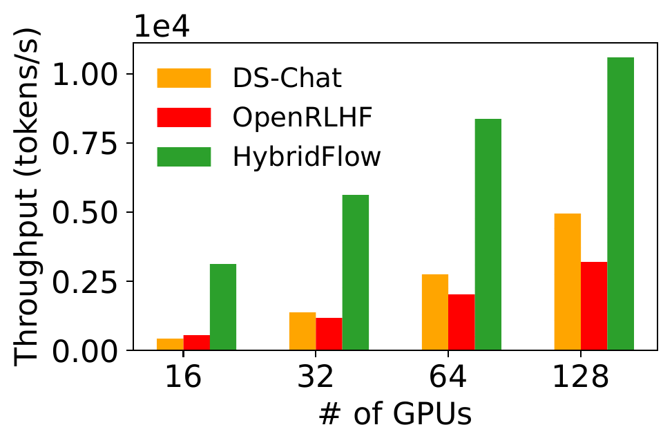<br><em>图 10c：34B，2.14x 到 4.80x。</em></td>
    <td align="center" width="50%">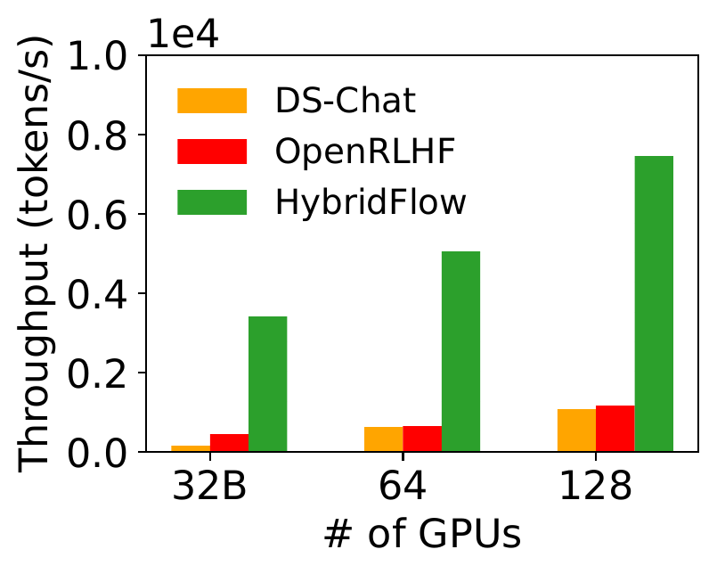<br><em>图 10d：70B，6.46x 到 9.78x。</em></td>
  </tr>
</table>

<p align="center"><em>图 10：ReMax throughput。括号中的数字表示 HybridFlow 相对 baselines 的 speedup。</em></p>

<table align="center">
  <tr>
    <td align="center" width="50%">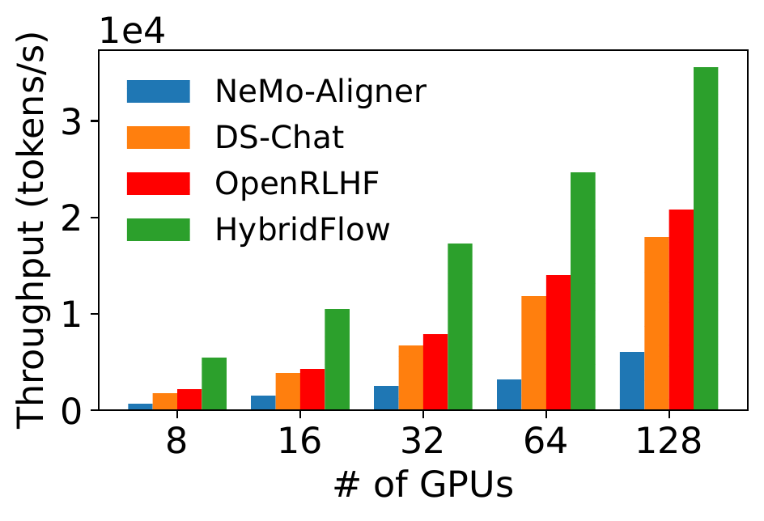<br><em>图 11a：7B，1.71x 到 12.87x。</em></td>
    <td align="center" width="50%">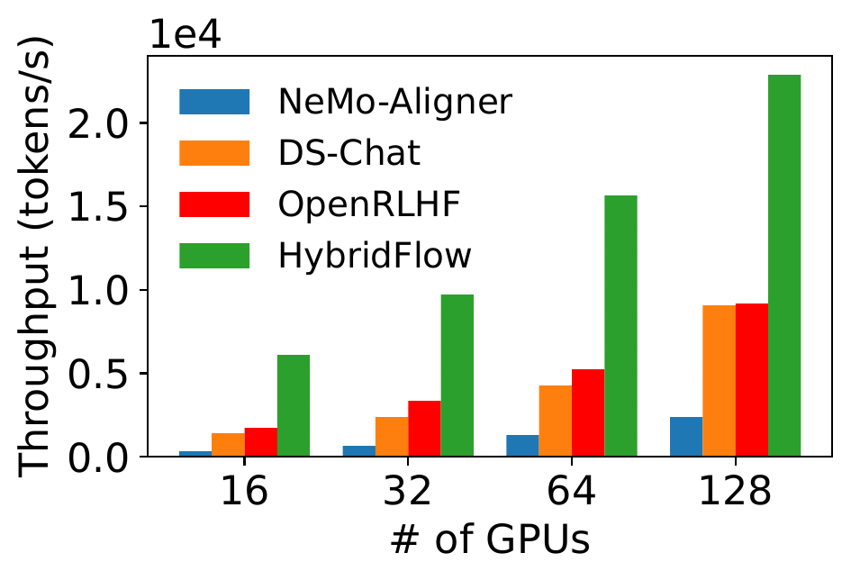<br><em>图 11b：13B，2.49x 到 18.47x。</em></td>
  </tr>
  <tr>
    <td align="center" width="50%">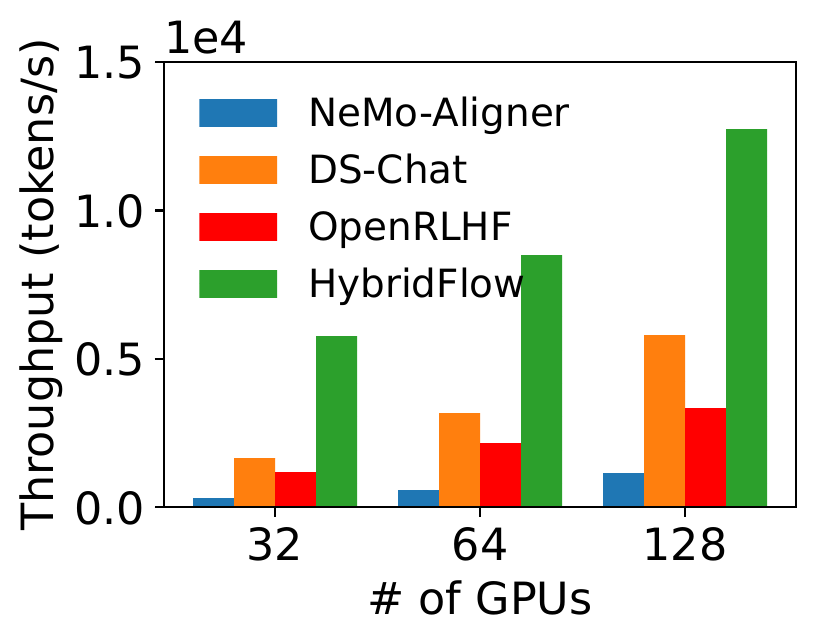<br><em>图 11c：34B，2.20x 到 19.76x。</em></td>
    <td align="center" width="50%">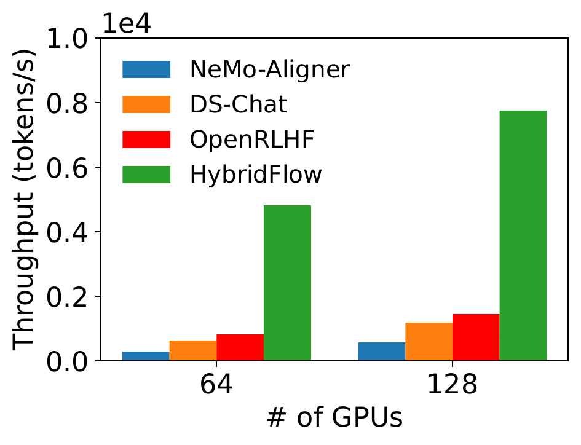<br><em>图 11d：70B，4.89x 到 16.86x。</em></td>
  </tr>
</table>

<p align="center"><em>图 11：Safe-RLHF throughput。括号中的数字表示 HybridFlow 相对 baselines 的 speedup。</em></p>

总体来看，HybridFlow 在所有模型规模上都持续优于 baselines。对于图 9 的 PPO，HybridFlow 相对 DeepSpeed-Chat、OpenRLHF 和 NeMo-Aligner 的平均提升分别为 3.67 倍（最高 7.84 倍）、3.25 倍（最高 5.93 倍）和 12.52 倍（最高 20.57 倍）。主要原因是 HybridFlow 能够根据不同 computation workloads，用不同 parallelism strategies 对模型进行 sharding，从而高效执行 generation、inference 和 training 等 RLHF 阶段。训练 70B 模型时，HybridFlow 获得最高平均 speedup 9.64 倍，因为它相对 DeepSpeed-Chat 和 OpenRLHF 分别最高降低 71.2% 和 89.1% 的 transition overhead；这些 baselines 在使用 ZeRO-3 训练时也会产生大量机器间通信。由于 generation engine 缺少 KVCache，NeMo-Aligner 的主要瓶颈在 generation 阶段，该阶段最高占 RLHF iteration time 的 81.2%。图 10 和图 11 显示了类似结果，验证了 HybridFlow 对多种 RLHF 算法的效率。

在可扩展性方面，HybridFlow 在 8 个 GPU 上至少获得 2.09 倍 speedup。随着 GPU 数量增加，HybridFlow 在不同模型规模上的 strong scaling efficiency 平均为 66.8%，计算方式是 $\frac{\text{largest scale throughput}}{\text{smallest scale throughput}}$ 除以 $\frac{\text{max GPU count}}{\text{min GPU count}}$，并在三种算法与所有模型规模上取平均 [63]。当 global batch size 固定时，扩展到大量 GPU 会使每个 worker 的 local batch size 变小，可能导致 GPU 利用不足。即便在 128 个 GPU 上运行 7B 模型，HybridFlow 仍分别在 PPO、ReMax 和 Safe-RLHF 上比最好的 baseline OpenRLHF 快 1.68 倍、1.53 倍和 1.71 倍。这源于 HybridFlow 能够为不同模型与集群规模选择最佳 placement strategies，以最小化 RLHF time。

### 8.3 模型放置

本实验在 HybridFlow 中实现 PPO 的多种模型放置策略，并使用与端到端性能实验相同的模型和集群设置：colocate，即 DeepSpeed-Chat 的放置策略；standalone，即 OpenRLHF 的策略；split，即 NeMo-Aligner 的 colocated placement（actor 与 reference policy 在一组设备上，critic 与 reward model 在另一组设备上）；以及 hybridflow，即算法 1 得到的优化放置。

<table align="center">
  <tr>
    <td align="center" width="50%">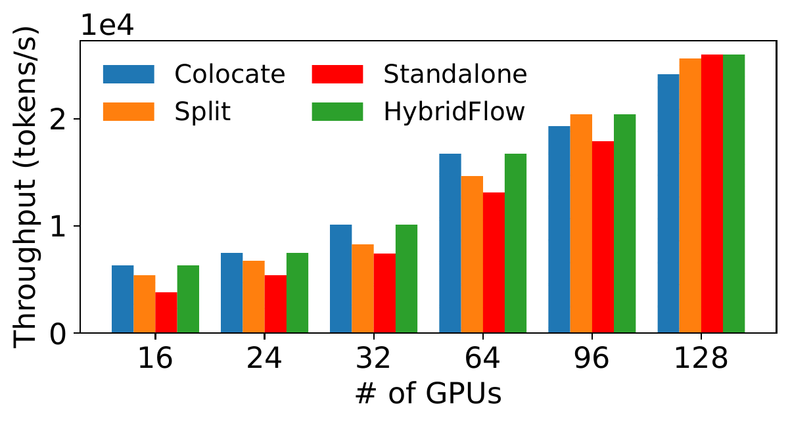<br><em>图 12a：13B。</em></td>
    <td align="center" width="50%">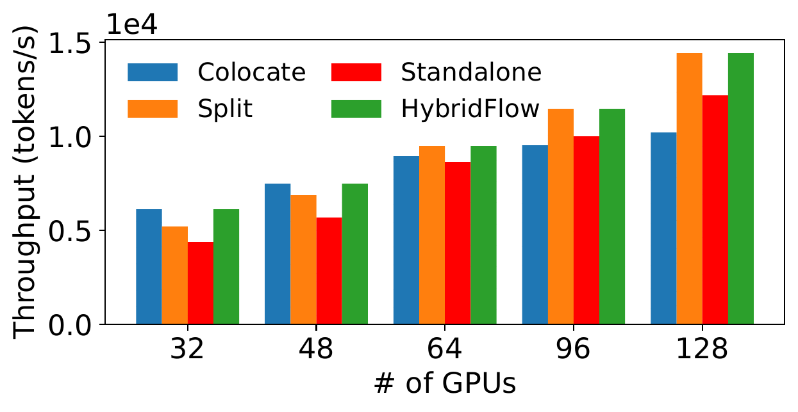<br><em>图 12b：34B。</em></td>
  </tr>
</table>

<p align="center"><em>图 12：不同 placement 下 HybridFlow 的 throughput。</em></p>

<p align="center">
  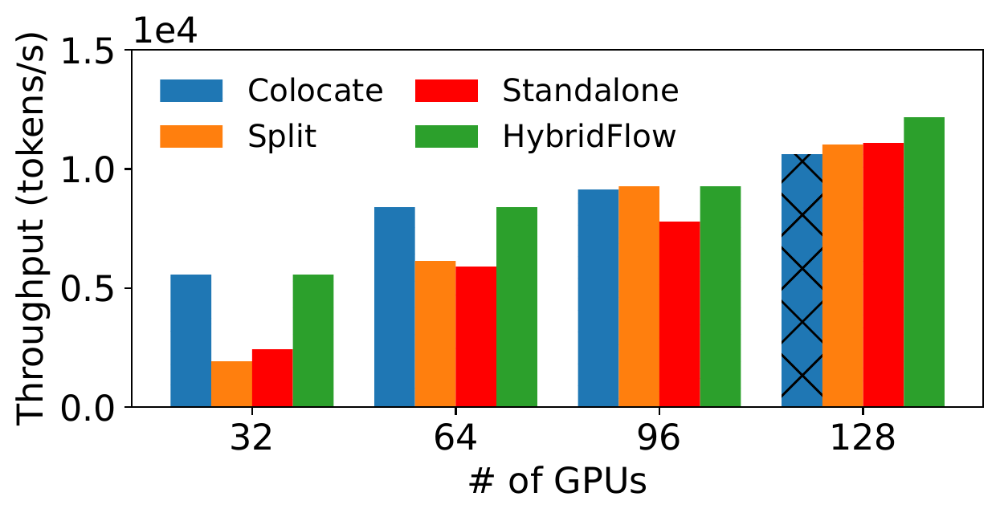
  <br><em>图 13：13B actor 和 reference policy 与 70B critic 和 reward model 下的 placement 对比。</em>
</p>

图 12 显示，HybridFlow 在不同 GPU 数量下的优化 placement 会变化。从 16 到 64 个 GPU，把所有模型 colocate 到同一组设备上性能最好。对于 96 到 128 个 GPU 的 34B 模型，以及 96 个 GPU 的 13B 模型，split strategy 变成最优；由于模型规模相同，split strategy 将 GPU 在两组模型之间平均划分。对于 128 个 GPU 上的 13B 模型，standalone strategy 获得最高吞吐；此时 HybridFlow 为 actor 分配 64 个 GPU，为 critic 分配 32 个 GPU，为 reference 和 reward model 各分配 16 个 GPU。在较小集群中，所有模型计算都能充分利用 GPU，colocate strategy 能保证不同 RLHF 阶段的最大 GPU 使用率。在较大集群中，fixed batch size 与更大 DP size 会降低 computation-to-communication ratio，使 colocate placement 的 RLHF throughput 无法线性扩展。standalone 和 split strategies 在较大集群中把模型放到不同设备上，并为每个模型使用较小 DP size，从而促进同一阶段内不同模型并行执行。所有情况下，算法 1 都能产生最高 training throughput 的最佳 placement。

本文还评估了 13B actor/reference policy 与 70B critic/reward models 的 PPO 运行场景，因为更大的 critic 和 reward models 被预期能产生更好的对齐效果 [3]。图 13 显示，在最多 64 个 GPU 上，colocate strategy 平均仍比其他策略高 44.8%。在 96 个 GPU 上，split strategy 获得更高吞吐。扩展到 128 个 GPU 时，算法 1 得到的最佳 placement 将 actor、reference 和 reward models colocate 到 64 个 GPU 上，并把剩余 64 个 GPU 分配给 critic。在相同 GPU 数量下，actor 和 reference policy 的计算时间远小于 critic 和 reward model；把 reward model 与 actor/reference colocate 可以减少 experience preparation 阶段的 GPU idle time。总体而言，在大集群中把 actor 和 critic 分布到不同设备上并行执行 training stage 会带来更高吞吐。

### 8.4 3D-HybridEngine

图 14 展示了不同模型规模下 actor training 与 generation 阶段之间的 transition time，也就是把 model weights 从 training reshard 到 generation 的时间，设置与端到端性能实验相同。OpenRLHF 的 transition time 包含不同设备上两份 actor copy 之间的 weight synchronization time。HybridFlow 平均将 transition time 降低 55.2%（11.7 秒），在 70B 模型上最多将 transition overhead 降低 89.1%（78.2 秒），并且在不同集群规模下保持稳定开销。这得益于 HybridFlow 为 generation 阶段设计的新 parallel grouping 方法。在 baseline methods 中，transition 时必须收集所有 model parameters，为避免 OOM 还需要逐层多次收集。HybridFlow 在 transition 中实现零内存冗余，并且每个 micro DP group 只需要一次 all-gather。

<table align="center">
  <tr>
    <td align="center" width="50%">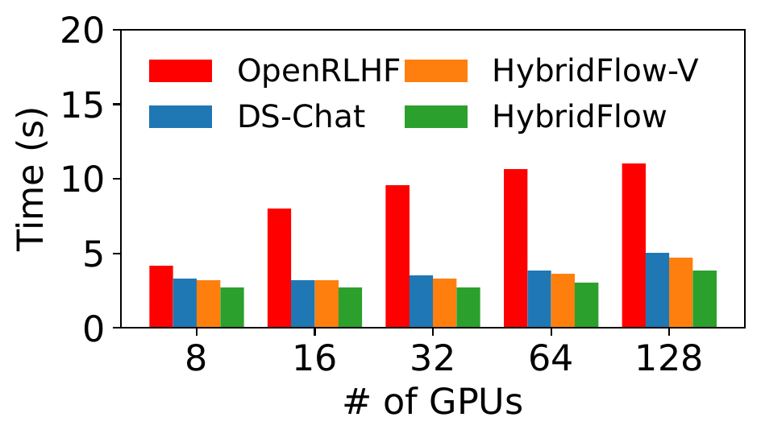<br><em>图 14a：7B，T_g=2，P_g=1，T=8，P=1。</em></td>
    <td align="center" width="50%">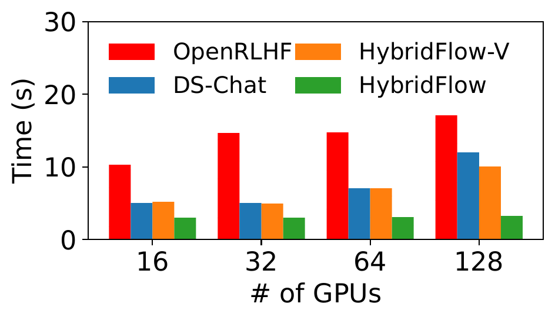<br><em>图 14b：13B，T_g=4，P_g=1，T=8，P=1。</em></td>
  </tr>
  <tr>
    <td align="center" width="50%">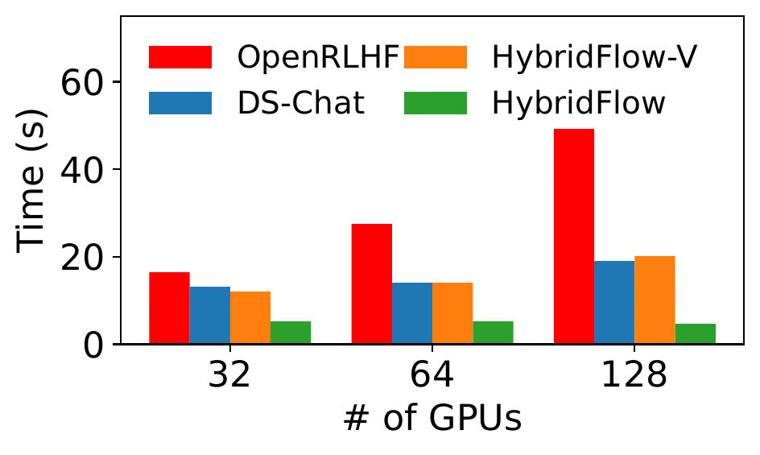<br><em>图 14c：34B，T_g=8，P_g=1，T=8，P=4。</em></td>
    <td align="center" width="50%">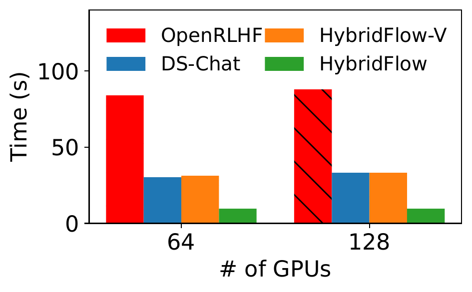<br><em>图 14d：70B，T_g=8，P_g=1，T=8，P=8。</em></td>
  </tr>
</table>

<p align="center"><em>图 14：actor training 与 generation 之间的 transition time。</em></p>

HybridFlow 还验证了 actor training 和 generation 中使用不同 parallel sizes 的必要性。该实验把所有模型 colocate 在同一组 GPU 上，generation 的 KVCache 使用剩余 GPU memory 进行 best-effort allocation。图 15 给出了在 16 个 GPU 上运行 7B 与 13B 模型 RLHF 时的 transition 与 generation time。training parallel groups 使用 1-8-2（p-t-d），generation TP group size $t_g$ 从 1 变化到 8；generation PP group size 固定为 $p_g=1$，micro DP group size 为 $\frac{8}{t_g}$。结果显示，对 7B 模型使用较小 generation TP group size $t_g=2$，对 13B 模型使用 $t_g=4$，可分别降低 60.3% 和 36.4% 的 generation latency。相反，沿用与 training 相同的 TP size（$t_g=8$），即 NeMo-Aligner 的做法，会因 GPU underutilization 产生最高 generation latency。进一步降低 $t_g$ 没有带来更高 speedup，因为更小 $t_g$ 需要每个 GPU 维护更大的 KVCache。

<table align="center">
  <tr>
    <td align="center" width="50%">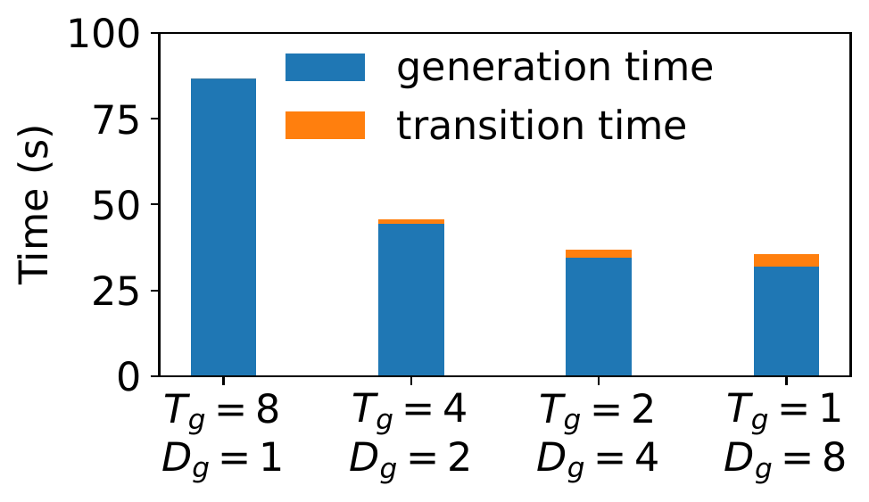<br><em>图 15a：7B。</em></td>
    <td align="center" width="50%">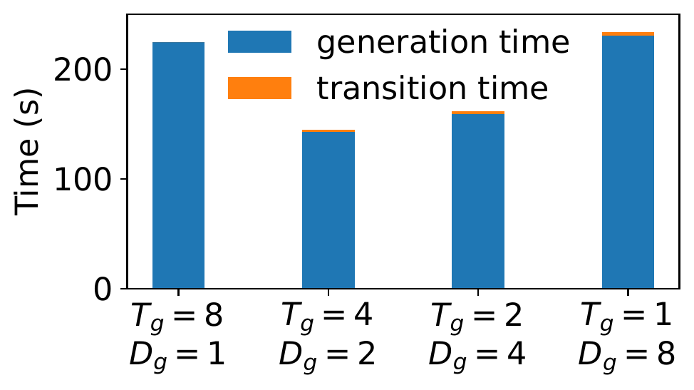<br><em>图 15b：13B。</em></td>
  </tr>
</table>

<p align="center"><em>图 15：16 个 GPU 上不同 actor generation parallel sizes 的时间分解。</em></p>

### 8.5 算法运行时间

图 16 展示了算法 1 的运行时间。相对于实际 RLHF 训练通常需要数天，算法运行时间显著更短。运行时间随模型规模和集群规模线性增长，显示了设备映射算法良好的可扩展性。大部分运行时间用于估计每个模型不同 parallel strategies 的执行延迟。更大的模型具有更多可选 parallelism strategies，需要更多 simulation 来为每个 placement plan 找到最优策略。通过缓存模型的最优 parallelism strategies 并在不同 placements 中复用，HybridFlow 将最佳 placement 的搜索时间降低到最多半小时。

<p align="center">
  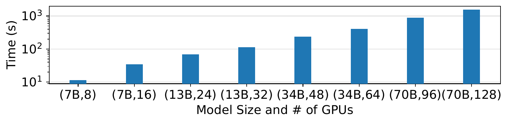
  <br><em>图 16：设备映射算法运行时间。模型规模和 GPU 数量同时扩展。</em>
</p>

## 9 讨论

HybridFlow 与已有 fault-tolerance 方法正交，并且已经纳入 checkpointing [64, 65, 66, 67, 68]。系统可以通过 NCCL errors 检测 failures，通过 checksums 检测 silent data corruption。HybridFlow 的编程模型使单控制器能够通过 RPC 协调 checkpoint operations，从而在每个 ParallelWorker Group 内保存 model states，包括 actor/critic model parameters、dataloader IDs 和 random number generator states，以保证系统级一致性。此外，如果有足够健康的 model replicas，HybridFlow 也可以使用基于冗余的 fault-tolerance 方法，例如 broadcast parameters 和 CPU checkpoint，以实现快速恢复 [64, 65]。

对 RLHF training 中的模型放置和 GPU 分配，本文总结出三点洞察。第一，为 actor model 分配更多 GPU 可以降低耗时的 generation latency，而这一阶段无法与其他模型并行。第二，当每个模型计算都能充分利用 GPU resources 时，在相对小规模集群上把所有模型 colocate 是最有效的策略。第三，当扩展到大规模集群，即进行 strong scaling 时，把 actor 和 critic models 分布在不同设备上，使 training 和 preparation stages 并行执行，有助于获得更高吞吐。

HybridFlow 通过对 GPU computation 使用 time-sharing，使模型能够 colocate 在共享设备上。近期 DNN task scheduling 研究提出了细粒度资源复用技术，主要目标是满足单个任务的 service-level objectives [69, 70, 71, 72, 73, 74]。虽然 `ResourcePool` 实现支持 colocated models 的并行执行，但 HybridFlow 通常采用顺序执行，以避免 GPU resource contention 或 OOM。将 GPU sharing 和异构资源引入 RLHF training 会带来独特挑战，因为它需要平衡不同任务之间的 computation workload，并管理复杂数据依赖。面向 RLHF training 研究 GPU sharing 的细粒度 auto-mapping algorithms，并结合 model offload optimization 与 heterogeneous devices，是有前景的未来方向。

在 LLM alignment 的 RLHF 中，reward signal 由 reward model 生成。除了 alignment tasks，类似 PPO 和 GRPO 的算法也可以应用到代码生成、数学推理等领域 [25]。对这些任务，每个 prompt 可能存在 ground truth，可以通过评估每个代码测试用例的输出正确性、或验证数学结果正确性来确定。因此，reward model 可以被非神经网络 reward modules 替代，例如用于评估生成代码的 sandbox environment，或用于验证数学结果的 reward function [75, 76, 77]。HybridFlow 可以把这些 reward modules 包装为 remote functions，并在单进程脚本中编排它们的执行，从而为多样化 reinforcement learning 应用提供灵活且高效的框架。

## 10 相关工作

强化学习框架种类很多，从面向小规模 DNN 的通用 RL 系统，到专门为 LLM 优化的 RLHF 系统 [16, 13, 78, 79, 80, 81, 24, 19, 20, 21, 56]。前文已经详细讨论了与本文最接近的 RLHF 系统，这里补充更多 RL frameworks。这些 RL frameworks 与近期 RLHF 系统一样，通常使用混杂的多控制器框架实现算法 [78, 79, 80, 81, 82]。它们建立多个长期运行的分布式程序，由各组件通过硬编码数据同步协调执行顺序。Gear 进一步优化了 RL pipeline 的 experience replay 部分 [82]。然而，这些框架都不能支持 RLHF 中的 LLM training、inference 和 generation。

LLM training 与 serving systems 方面，TorchDDP 和 Horovod 支持数据并行训练 [23, 33]。ByteScheduler 和 DeepSpeed 通过通信与内存优化扩展了数据并行 [83, 38]。许多系统通过张量并行和流水线并行等模型并行方式，把模型切分到设备上，从而优化大模型训练 [14, 32, 84, 85, 31, 86, 87]。LLM serving systems 也采用数据并行和模型并行来加速自回归生成，并使用 continuous batching 与 chunked prefill 等专门优化 [15, 88, 41, 59, 36, 89]。上述框架都采用多控制器范式来实现高效计算。

Dataflow systems 方面，MapReduce、Spark、Dryad 和 Naiad 等系统广泛用于 analytics 与 ML workloads，但缺少对动态 task graphs 的支持 [90, 91, 92, 93]。Ray 在单一动态 task graph 中统一了 task-parallel 和 actor programming models，并实现了可扩展的 distributed scheduler 和 global control store；许多 RL frameworks 都采用了 Ray [42, 16, 13]。Pathways 是一个面向 TPU 的闭源项目，用于在单个 DNN model 内表达复杂 parallelism patterns 和细粒度 control flow，例如 pipeline parallelism 和带稀疏计算的 Mixture-of-Experts。它采用异步分布式 dataflow 设计，能够在存在数据依赖时并行执行 control plane，从而降低单控制器范式的 dispatch overhead [17]。Pathways 主要关注单模型训练，需要对 DNN model 的每个 sub-network 进行复杂编译；HybridFlow 可以把 Pathways 作为子模块集成，用于实现 RLHF dataflow 中模型的计算。

## 11 结论

HybridFlow 是一个 RLHF 框架，能够灵活表示并高效执行多样化 RLHF 算法。本文提出混合编程模型，通过把不同 LLM 的分布式计算封装成 primitive APIs，并隐藏节点之间数据 resharding 的复杂性，使用户能够用几行代码轻松构建 RLHF dataflow。3D-HybridEngine 保证 actor model 的 training 和 generation 高效执行，并在 model parameter resharding 中实现零内存冗余和显著降低通信开销。此外，HybridFlow 的映射算法可以优化 RLHF dataflow 中模型的 GPU 分配和放置。大量实验表明，在多种模型规模和集群规模下，HybridFlow 相对最先进 RLHF 系统获得 1.53 倍到 20.57 倍 speedup。

## 致谢

作者感谢 shepherd Y. Charlie Hu 和匿名审稿人的建设性反馈。作者也感谢 Xin Liu、Yangrui Chen 和 Ningxin Zheng 对本项目的深入反馈。本工作部分由 ByteDance Research Collaboration Project 以及 Hong Kong RGC grants HKU 17204423 和 C7004-22G (CRF) 支持。

## 附录 A HybridFlow 中的 transfer protocols

HybridFlow 实现了覆盖 RLHF dataflow 中模型间数据 resharding 常见用例的 transfer protocols。用户可以利用这些预定义协议生成任意 RLHF dataflow，也可以通过实现 collect function 与 distribute function 轻松定义自己的 transfer protocol。transfer protocols 将复杂的数据 resharding 与分布式训练解耦。这里用 $p$、$t$、$d$ 分别表示 worker 在 pipeline、tensor 和 data parallel group 中的 rank。

表 3：HybridFlow 中的 transfer protocols。

| Transfer protocol | Distribute function | Collect function | Use case |
| --- | --- | --- | --- |
| `ONE_TO_ALL` | 将数据广播到所有 ranks | 从所有 ranks 收集数据 | 所有 worker method 输入相同并运行相同代码，例如模型初始化 |
| `3D_PROTO` | 按数据切分，scatter 到所有 DP ranks，并在 group 内 broadcast | 从所有 DP groups 中 `p=-1, t=0` worker 收集并拼接数据 | 模型在每个 data-parallel group 内被多个 workers 分片；模型输出只存在于最后一个 pipeline stage，并在 data-parallel groups 中复制。这是 Megatron-LM、DeepSpeed 等 3D parallel training 的典型场景 |
| `3D_ALL_MICRO_DP` | 按 micro DP size 切分数据，scatter 到所有 micro DP groups，并在 group 内 broadcast | 从所有 micro DP groups 中 `local_rank=0` worker 收集并拼接数据 | 与 HybridEngine 配合，用于 policy model 在 training 与 inference 切换时处理 3D parallel scheme |
| `3D_PP_ONLY` | 将数据广播到所有 ranks | 从所有 PP groups 中 `t=0, d=0` worker 收集并拼接数据 | 用于检查 weight names，因为它们在 TP 和 DP groups 中相同 |
| `DP_PROTO` | 把数据切成 batches，并 scatter 到所有 DP ranks | 从所有 DP ranks 收集并拼接数据 | 数据并行模式下的 training model |
| `ALL_TO_ALL` | 无操作 | 从所有 ranks 收集数据 | 调试时使用；用户可以手动定义每个 worker 的输入并分别检查输出 |

## 附录 B HybridFlow 中的 primitive APIs

在 HybridFlow 中，RLHF training 中每个模型的 primitive 通过继承 `3DParallelWorker`、`FSDPWorker` 和 `ZeROWorker` 实现。这些 model classes 的函数旨在解耦分布式计算代码，并向用户提供 RLHF 的基本操作。这一 primitive design 与已有分布式 inference/training 框架中的 auto-regressive generation、forward pass、backward pass 和 model update 操作兼容。用户可以根据算法设计调整所提供函数中的数值计算，轻松自定义 RLHF training dataflow，并复用底层分布式计算实现。

表 4：每个 model class 提供的关键函数。用户可以用这些函数通过几行代码构建多种 RLHF 算法。

| Model | API | Computation | Interpretation |
| --- | --- | --- | --- |
| Actor | `generate_sequence` | 自回归生成 | 基于一批 prompts，actor model 生成一批 responses，并返回 responses 中每个 token 的 log probability |
| Actor | `compute_log_prob` | 一次 forward pass | actor model 计算 prompts 和 responses 中每个 token 的 log probability；如果使用相同 model precision，这一 log probability 与 generation 返回的 log probability 相同，在 PPO 中可选 |
| Actor | `compute_loss` | 一次 forward pass | actor model 基于 pretraining dataset 计算 pretrain loss [3, 11, 7] |
| Actor | `update_actor` | 一次 forward、backward pass 和 model update | 基于 advantages、returns（由 `compute_advantage` 计算）和 pretraining loss，actor model 计算 training loss 并更新权重。HybridFlow 为 PPO、Safe-RLHF、ReMax、GRPO 等多种 RLHF 算法实现了不同 loss [7, 11, 12, 25] |
| Critic | `compute_values` | 一次 forward pass | critic model 为每个 prompt 和 response 计算 values |
| Critic | `update_critic` | 一次 forward、backward pass 和 model update | 基于 values 和 returns，critic 计算 squared-error loss 并更新权重。HybridFlow 也为 PPO、Safe-RLHF、ReMax、GRPO 等算法实现了 critic loss [7, 11, 12, 25] |
| Reference Policy | `compute_ref_log_prob` | 一次 forward pass | reference model 计算 prompts 和 responses 中每个 token 的 reference log probability，用作评估 actor model divergence 并约束其学习过程的基准 |
| Reward | `compute_reward` | 一次 forward pass | reward model 对一组 prompts 和 responses 执行 forward computation 以计算 scores；rewards 可以是 token-level 或 sample-level |
| - | `compute_advantage` | 数值计算 | 基于 value model 和 reward model 分别产生的 values 与 rewards，该函数估计给定 prompts 和 current policy model responses 上的 advantages；该计算不涉及模型 forward pass |

## 附录 C Auto-Parallelism Algorithm

算法 2 概述了每个模型最优 parallelism strategy 的搜索过程。系统从每个模型的最小 model parallelism size 开始，以防 colocate 多个 workers 时 OOM，并基于 GPU 数量和每台机器的 GPU 数 $U$ 枚举所有可行 parallel configurations。默认 $U$ 设为 8。系统使用 `simu` 模块根据 workload 估计每个模型的延迟，该模块包括 training、inference 和 generation 三个 simulator，都是遵循已有研究的 analytical models [49, 41, 50]。training 和 inference workloads 是 compute-bound，generation workload 是 memory-bound。

算法 2：Auto Parallelism Algorithm。

```text
Input:
  Device allocation A
  set 中每个模型的 minimal device allocation 与 model parallel size A_min
  workload W
  每台机器的 GPU 数 U

Output:
  set 中模型的 parallelism strategy

Procedure auto_parallel(A, A_min, l, W):
  N_l = A[l]
  t_min = A_min[l].t
  p_min = A_min[l].p
  best_para <- empty
  best_para.cost <- infinity
  for t in {t_min, t_min + 1, ..., U}:
    for p in {p_min, p_min + 1, ..., N_l / U}:
      d <- N_l / (p * t)
      para_plan <- (p, t, d)
      cost <- simu(para_plan, l, W[l])
      if best_para.cost > cost:
        best_para.cost <- cost
        best_para <- para_plan
  return best_para
```

对于 actor model，HybridFlow 先找到 training 的 parallelism strategy，并记录 training 阶段的 memory usage。在 actor generation 期间，KVCache 需求根据 batch size 和 max sequence length 计算。如果 generation 阶段的 model-parallel size 无法同时容纳 parameters 和 KVCache，系统会增加该 size。随后，系统比较延迟估计，寻找带有对应 KVCache allocation 的最优策略。开发一个能考虑可变 KVCache size 的全面自回归 generation simulator，将进一步增强 RLHF research 中的 auto-mapping process。

## 参考文献

[1] Tom B. Brown, Benjamin Mann, Nick Ryder, et al.。Language Models are Few-Shot Learners。CoRR, 2020。https://arxiv.org/abs/2005.14165。

[2] Hugo Touvron, Louis Martin, Kevin Stone, et al.。Llama 2: Open foundation and fine-tuned chat models。arXiv preprint arXiv:2307.09288, 2023。

[3] Yuntao Bai, Andy Jones, Kamal Ndousse, et al.。Training a helpful and harmless assistant with reinforcement learning from human feedback。arXiv preprint arXiv:2204.05862, 2022。

[4] Josh Achiam, Steven Adler, Sandhini Agarwal, et al.。Gpt-4 technical report。arXiv preprint arXiv:2303.08774, 2023。

[5] Reiichiro Nakano, Jacob Hilton, Suchir Balaji, et al.。Webgpt: Browser-assisted question-answering with human feedback。arXiv preprint arXiv:2112.09332, 2021。

[6] Baptiste Rozière, Jonas Gehring, Fabian Gloeckle, et al.。Code Llama: Open Foundation Models for Code。arXiv preprint arXiv: 2308.12950, 2023。

[7] Long Ouyang, Jeffrey Wu, Xu Jiang, et al.。Training language models to follow instructions with human feedback。Advances in Neural Information Processing Systems, 2022。

[8] John Schulman, Filip Wolski, Prafulla Dhariwal, Alec Radford and Oleg Klimov。Proximal policy optimization algorithms。arXiv preprint arXiv:1707.06347, 2017。

[9] Ronald J Williams。Simple statistical gradient-following algorithms for connectionist reinforcement learning。Machine learning, 1992。

[10] Riad Akrour, Marc Schoenauer and Michele Sebag。Preference-based policy learning。Machine Learning and Knowledge Discovery in Databases: European Conference, ECML PKDD 2011, Athens, Greece, September 5-9, 2011. Proceedings, Part I 11, 2011。

[11] Josef Dai, Xuehai Pan, Ruiyang Sun, et al.。Safe RLHF: Safe Reinforcement Learning from Human Feedback。The Twelfth International Conference on Learning Representations, 2024。https://openreview.net/forum?id=TyFrPOKYXw。

[12] Ziniu Li, Tian Xu, Yushun Zhang, et al.。ReMax: A Simple, Effective, and Efficient Reinforcement Learning Method for Aligning Large Language Models。arXiv preprint arXiv: 2310.10505, 2023。

[13] Eric Liang, Zhanghao Wu, Michael Luo, Sven Mika, Joseph E Gonzalez and Ion Stoica。RLlib Flow: Distributed Reinforcement Learning is a Dataflow Problem。Advances in Neural Information Processing Systems, 2021。

[14] Mohammad Shoeybi, Mostofa Patwary, Raul Puri, Patrick LeGresley, Jared Casper and Bryan Catanzaro。Megatron-lm: Training multi-billion parameter language models using model parallelism。arXiv preprint arXiv:1909.08053, 2019。

[15] Woosuk Kwon, Zhuohan Li, Siyuan Zhuang, et al.。Efficient memory management for large language model serving with pagedattention。Proceedings of the 29th Symposium on Operating Systems Principles, 2023。

[16] Eric Liang, Richard Liaw, Robert Nishihara, et al.。RLlib: Abstractions for distributed reinforcement learning。International conference on machine learning, 2018。

[17] Paul Barham, Aakanksha Chowdhery, Jeff Dean, et al.。Pathways: Asynchronous distributed dataflow for ml。Proceedings of Machine Learning and Systems, 2022。

[18] Martín Abadi。TensorFlow: learning functions at scale。Proceedings of the 21st ACM SIGPLAN international conference on functional programming, 2016。

[19] Jian Hu, Xibin Wu, Xianyu, et al.。OpenRLHF: A Ray-based High-performance RLHF framework。GitHub repository, 2023。

[20] NVIDIA Corporation。NeMo-Aligner: Scalable toolkit for efficient model alignment.。https://github.com/NVIDIA/NeMo-Aligner, 2024。

[21] Youshao Xiao, Weichang Wu, Zhenglei Zhou, et al.。An Adaptive Placement and Parallelism Framework for Accelerating RLHF Training。arXiv preprint arXiv: 2312.11819, 2023。

[22] Samyam Rajbhandari, Jeff Rasley, Olatunji Ruwase and Yuxiong He。Zero: Memory optimizations toward training trillion parameter models。SC20: International Conference for High Performance Computing, Networking, Storage and Analysis, 2020。

[23] Adam Paszke, Sam Gross, Francisco Massa, et al.。Pytorch: An imperative style, high-performance deep learning library。Advances in neural information processing systems, 2019。

[24] Zhewei Yao, Reza Yazdani Aminabadi, Olatunji Ruwase, et al.。DeepSpeed-Chat: Easy, Fast and Affordable RLHF Training of ChatGPT-like Models at All Scales。arXiv preprint arXiv:2308.01320, 2023。

[25] Zhihong Shao, Peiyi Wang, Qihao Zhu, et al.。Deepseekmath: Pushing the limits of mathematical reasoning in open language models。arXiv preprint arXiv:2402.03300, 2024。

[26] Rui Zheng, Wei Shen, Yuan Hua, et al.。Improving generalization of alignment with human preferences through group invariant learning。arXiv preprint arXiv:2310.11971, 2023。

[27] Harrison Lee, Samrat Phatale, Hassan Mansoor, et al.。Rlaif: Scaling reinforcement learning from human feedback with ai feedback。arXiv preprint arXiv:2309.00267, 2023。

[28] John Schulman, Sergey Levine, Pieter Abbeel, Michael Jordan and Philipp Moritz。Trust region policy optimization。International conference on machine learning, 2015。

[29] Diederik P. Kingma and Jimmy Ba。Adam: A Method for Stochastic Optimization。2017。

[30] Timo Kaufmann, Paul Weng, Viktor Bengs and Eyke Huellermeier。A survey of reinforcement learning from human feedback。arXiv preprint arXiv:2312.14925, 2023。

[31] Deepak Narayanan, Mohammad Shoeybi, Jared Casper, et al.。Efficient large-scale language model training on gpu clusters using megatron-lm。Proceedings of the International Conference for High Performance Computing, Networking, Storage and Analysis, 2021。

[32] Ziheng Jiang, Haibin Lin, Yinmin Zhong, et al.。MegaScale: Scaling Large Language Model Training to More Than 10,000 GPUs。arXiv preprint arXiv:2402.15627, 2024。

[33] Alexander Sergeev and Mike Del Balso。Horovod: fast and easy distributed deep learning in TensorFlow。arXiv preprint arXiv:1802.05799, 2018。

[34] Yanping Huang, Youlong Cheng, Ankur Bapna, et al.。Gpipe: Efficient training of giant neural networks using pipeline parallelism。Advances in neural information processing systems, 2019。

[35] Deepak Narayanan, Aaron Harlap, Amar Phanishayee, et al.。PipeDream: generalized pipeline parallelism for DNN training。Proceedings of the 27th ACM symposium on operating systems principles, 2019。

[36] NVIDIA Corporation。TensorRT-LLM: A TensorRT Toolbox for Optimized Large Language Model Inference.。https://github.com/NVIDIA/TensorRT-LLM, 2023。

[37] Connor Holmes, Masahiro Tanaka, Michael Wyatt, et al.。DeepSpeed-FastGen: High-throughput Text Generation for LLMs via MII and DeepSpeed-Inference。arXiv preprint arXiv:2401.08671, 2024。

[38] Jeff Rasley, Samyam Rajbhandari, Olatunji Ruwase and Yuxiong He。Deepspeed: System optimizations enable training deep learning models with over 100 billion parameters。Proceedings of the 26th ACM SIGKDD International Conference on Knowledge Discovery & Data Mining, 2020。

[39] X Yu Geoffrey, Yubo Gao, Pavel Golikov and Gennady Pekhimenko。Habitat: A Runtime-Based computational performance predictor for deep neural network training。2021 USENIX Annual Technical Conference (USENIX ATC 21), 2021。

[40] Zhuohan Li, Lianmin Zheng, Yinmin Zhong, et al.。AlpaServe: Statistical multiplexing with model parallelism for deep learning serving。17th USENIX Symposium on Operating Systems Design and Implementation (OSDI 23), 2023。

[41] Yinmin Zhong, Shengyu Liu, Junda Chen, et al.。DistServe: Disaggregating Prefill and Decoding for Goodput-optimized Large Language Model Serving。arXiv, 2024。

[42] Philipp Moritz, Robert Nishihara, Stephanie Wang, et al.。Ray: A distributed framework for emerging AI applications。13th USENIX symposium on operating systems design and implementation (OSDI 18), 2018。

[43] Frederica Darema。The spmd model: Past, present and future。Recent Advances in Parallel Virtual Machine and Message Passing Interface: 8th European PVM/MPI Users’ Group Meeting Santorini/Thera, Greece, September 23--26, 2001 Proceedings 8, 2001。

[44] John Schulman, Philipp Moritz, Sergey Levine, Michael Jordan and Pieter Abbeel。High-Dimensional Continuous Control Using Generalized Advantage Estimation。2018。

[45] Ernie Chan, Marcel Heimlich, Avi Purkayastha and Robert Van De Geijn。Collective communication: theory, practice, and experience。Concurrency and Computation: Practice and Experience, 2007。

[46] Eric Temple Bell。Exponential polynomials。Annals of Mathematics, 1934。

[47] Gian-Carlo Rota。The number of partitions of a set。The American Mathematical Monthly, 1964。

[48] Lianmin Zheng, Zhuohan Li, Hao Zhang, et al.。Alpa: Automating inter-and Intra-Operator parallelism for distributed deep learning。16th USENIX Symposium on Operating Systems Design and Implementation (OSDI 22), 2022。

[49] Zhihang Yuan, Yuzhang Shang, Yang Zhou, et al.。LLM Inference Unveiled: Survey and Roofline Model Insights。arXiv preprint arXiv: 2402.16363, 2024。

[50] Cheng Li。LLM-Analysis: Latency and Memory Analysis of Transformer Models for Training and Inference。https://github.com/cli99/llm-analysis, 2023。

[51] George E Andrews and Kimmo Eriksson。Integer partitions。Cambridge University Press, 2004。

[52] Shiwei Zhang, Lansong Diao, Chuan Wu, Zongyan Cao, Siyu Wang and Wei Lin。HAP: SPMD DNN Training on Heterogeneous GPU Clusters with Automated Program Synthesis。arXiv preprint arXiv:2401.05965, 2024。

[53] Sylvain Jeaugey。Nccl 2.0。GPU Technology Conference (GTC), 2017。

[54] Alexander Havrilla, Maksym Zhuravinskyi, Duy Phung, et al.。trlX: A framework for large scale reinforcement learning from human feedback。Proceedings of the 2023 Conference on Empirical Methods in Natural Language Processing, 2023。

[55] Thomas Wolf, Lysandre Debut, Victor Sanh, et al.。HuggingFace's Transformers: State-of-the-art Natural Language Processing。arXiv preprint arXiv: 1910.03771, 2019。

[56] Collosal-AI Corporation。Collosal-Chat.。https://github.com/binmakeswell/ColossalChat, 2023。

[57] Zheng Yuan, Hongyi Yuan, Chuanqi Tan, Wei Wang, Songfang Huang and Fei Huang。Rrhf: Rank responses to align language models with human feedback without tears。arXiv preprint arXiv:2304.05302, 2023。

[58] Michael Santacroce, Yadong Lu, Han Yu, Yuanzhi Li and Yelong Shen。Efficient RLHF: Reducing the Memory Usage of PPO。arXiv preprint arXiv: 2309.00754, 2023。

[59] Gyeong-In Yu, Joo Seong Jeong, Geon-Woo Kim, Soojeong Kim and Byung-Gon Chun。Orca: A distributed serving system for Transformer-Based generative models。16th USENIX Symposium on Operating Systems Design and Implementation (OSDI 22), 2022。

[60] Shengyi Huang, Michael Noukhovitch, Arian Hosseini, Kashif Rasul, Weixun Wang and Lewis Tunstall。The N+ Implementation Details of RLHF with PPO: A Case Study on TL; DR Summarization。arXiv preprint arXiv:2403.17031, 2024。

[61] Shusheng Xu, Wei Fu, Jiaxuan Gao, et al.。Is dpo superior to ppo for llm alignment? a comprehensive study。arXiv preprint arXiv:2404.10719, 2024。

[62] Jie Ren, Samyam Rajbhandari, Reza Yazdani Aminabadi, et al.。Zero-offload: Democratizing billion-scale model training。2021 USENIX Annual Technical Conference (USENIX ATC 21), 2021。

[63] Gene M Amdahl。Validity of the single processor approach to achieving large scale computing capabilities。Proceedings of the April 18-20, 1967, spring joint computer conference, 1967。

[64] Yuchen Zhong, Guangming Sheng, Juncheng Liu, Jinhui Yuan and Chuan Wu。Swift: Expedited Failure Recovery for Large-Scale DNN Training。Proceedings of the 28th ACM SIGPLAN Annual Symposium on Principles and Practice of Parallel Programming, 2023。https://doi.org/10.1145/3572848.3577510。

[65] Zhuang Wang, Zhen Jia, Shuai Zheng, et al.。Gemini: Fast failure recovery in distributed training with in-memory checkpoints。Proceedings of the 29th Symposium on Operating Systems Principles, 2023。

[66] Insu Jang, Zhenning Yang, Zhen Zhang, Xin Jin and Mosharaf Chowdhury。Oobleck: Resilient distributed training of large models using pipeline templates。Proceedings of the 29th Symposium on Operating Systems Principles, 2023。

[67] Jayashree Mohan, Amar Phanishayee and Vijay Chidambaram。CheckFreq: Frequent, Fine-Grained DNN Checkpointing。19th USENIX Conference on File and Storage Technologies (FAST 21), 2021。

[68] Assaf Eisenman, Kiran Kumar Matam, Steven Ingram, et al.。Check-N-Run: A checkpointing system for training deep learning recommendation models。19th USENIX Symposium on Networked Systems Design and Implementation (NSDI 22), 2022。

[69] Mingcong Han, Hanze Zhang, Rong Chen and Haibo Chen。Microsecond-scale preemption for concurrent GPU-accelerated DNN inferences。16th USENIX Symposium on Operating Systems Design and Implementation (OSDI 22), 2022。

[70] Jason Jong Kyu Park, Yongjun Park and Scott Mahlke。Dynamic resource management for efficient utilization of multitasking GPUs。Proceedings of the twenty-second international conference on architectural support for programming languages and operating systems, 2017。

[71] Zhenning Wang, Jun Yang, Rami Melhem, Bruce Childers, Youtao Zhang and Minyi Guo。Simultaneous multikernel GPU: Multi-tasking throughput processors via fine-grained sharing。2016 IEEE international symposium on high performance computer architecture (HPCA), 2016。

[72] Yun Liang, Huynh Phung Huynh, Kyle Rupnow, Rick Siow Mong Goh and Deming Chen。Efficient GPU spatial-temporal multitasking。IEEE Transactions on Parallel and Distributed Systems, 2014。

[73] Zhihao Bai, Zhen Zhang, Yibo Zhu and Xin Jin。PipeSwitch: Fast pipelined context switching for deep learning applications。14th USENIX Symposium on Operating Systems Design and Implementation (OSDI 20), 2020。

[74] Weihao Cui, Han Zhao, Quan Chen, et al.。DVABatch: Diversity-aware Multi-Entry Multi-Exit batching for efficient processing of DNN services on GPUs。2022 USENIX Annual Technical Conference (USENIX ATC 22), 2022。

[75] Chi Zhang, Guangming Sheng, Siyao Liu, et al.。A Framework for Training Large Language Models for Code Generation via Proximal Policy Optimization。NL2Code Workshop of ACM KDD 2024, 2024。

[76] Karl Cobbe, Vineet Kosaraju, Mohammad Bavarian, et al.。Training verifiers to solve math word problems。arXiv preprint arXiv:2110.14168, 2021。

[77] Grefenstette, Hill, Kohli Saxton。Analysing Mathematical Reasoning Abilities of Neural Models。arXiv:1904.01557, 2019。

[78] C. Hesse, M. Plappert, A. Radford, J. Schulman, S. Sidor and Y. Wu。OpenAI baselines。https://github.com/openai/baselines, 2017。

[79] I. Caspi。Reinforcement learning coach by Intel。https://github.com/NervanaSystems/coach, 2017。

[80] Danijar Hafner, James Davidson and Vincent Vanhoucke。Tensorflow agents: Efficient batched reinforcement learning in tensorflow。arXiv preprint arXiv:1709.02878, 2017。

[81] I. Kostrikov。PyTorch implementation of advantage actor critic (A2C), proximal policy optimization (PPO) and scalable trust-region method for deep reinforcement learning.。https://github.com/ikostrikov/pytorch-a2c-ppo-acktr, 2017。

[82] Hanjing Wang, Man-Kit Sit, Congjie He, et al.。GEAR: a GPU-centric experience replay system for large reinforcement learning models。International Conference on Machine Learning, 2023。

[83] Yanghua Peng, Yibo Zhu, Yangrui Chen, et al.。A Generic Communication Scheduler for Distributed DNN Training Acceleration。Proceedings of the 27th ACM Symposium on Operating Systems Principles, 2019。

[84] Wenyan Lu, Guihai Yan, Jiajun Li, Shijun Gong, Yinhe Han and Xiaowei Li。Flexflow: A flexible dataflow accelerator architecture for convolutional neural networks。2017 IEEE International Symposium on High Performance Computer Architecture (HPCA), 2017。

[85] Minjie Wang, Chien-chin Huang and Jinyang Li。Supporting very large models using automatic dataflow graph partitioning。Proceedings of the Fourteenth EuroSys Conference 2019, 2019。

[86] Shiqing Fan, Yi Rong, Chen Meng, et al.。DAPPLE: A pipelined data parallel approach for training large models。Proceedings of the 26th ACM SIGPLAN Symposium on Principles and Practice of Parallel Programming, 2021。

[87] Shiwei Zhang, Lansong Diao, Chuan Wu, Siyu Wang and Wei Lin。Accelerating large-scale distributed neural network training with SPMD parallelism。Proceedings of the 13th Symposium on Cloud Computing, 2022。

[88] Amey Agrawal, Ashish Panwar, Jayashree Mohan, Nipun Kwatra, Bhargav S Gulavani and Ramachandran Ramjee。Sarathi: Efficient llm inference by piggybacking decodes with chunked prefills。arXiv preprint arXiv:2308.16369, 2023。

[89] Yixin Song, Zeyu Mi, Haotong Xie and Haibo Chen。PowerInfer: Fast Large Language Model Serving with a Consumer-grade GPU。2023。

[90] Jeffrey Dean and Sanjay Ghemawat。MapReduce: simplified data processing on large clusters。Communications of the ACM, 2008。

[91] Matei Zaharia, Reynold S Xin, Patrick Wendell, et al.。Apache spark: a unified engine for big data processing。Communications of the ACM, 2016。

[92] Michael Isard, Mihai Budiu, Yuan Yu, Andrew Birrell and Dennis Fetterly。Dryad: distributed data-parallel programs from sequential building blocks。Proceedings of the 2nd ACM SIGOPS/EuroSys European conference on computer systems 2007, 2007。

[93] Derek G Murray, Frank McSherry, Rebecca Isaacs, Michael Isard, Paul Barham and Martín Abadi。Naiad: a timely dataflow system。Proceedings of the Twenty-Fourth ACM Symposium on Operating Systems Principles, 2013。
