# Jellyfish: Networking Data Centers Randomly

## 论文信息

- 标题：Jellyfish: Networking Data Centers Randomly
- 年份：2012
- 会议/期刊：NSDI 2012
- 作者：Ankit Singla、Chi-Yao Hong、Lucian Popa、P. Brighten Godfrey
- 机构：
  - University of Illinois at Urbana-Champaign：Ankit Singla、Chi-Yao Hong、P. Brighten Godfrey
  - HP Labs：Lucian Popa
- 备注：前两位作者的排序由抛硬币决定。

## 摘要

行业经验表明，数据中心具备增量扩展能力是至关重要的。然而，现有高带宽网络设计具有刚性的结构，这会妨碍增量扩展。我们提出 Jellyfish，这是一种高容量网络互连；它采用随机图拓扑，因此天然适合增量扩展。稍令人意外的是，Jellyfish 比胖树更具成本效率：在几千个节点的规模上，使用相同设备时，它能够以满容量支持最多多出 $25\%$ 的服务器，并且这种优势会随着规模扩大而提高。Jellyfish 还允许非常灵活地构建不同超额订阅程度的网络。不过，Jellyfish 的非结构化设计也带来了路由、物理布局和布线方面的新挑战。我们描述了解决这些挑战的方法，评估结果表明 Jellyfish 可以部署在今天的数据中心中。

## 1. 介绍

一个配置充足的数据中心网络至关重要：它可以确保服务器在利用率上不受带宽瓶颈限制，帮助服务彼此隔离，并在工作负载放置上获得更大自由，而不是必须根据哪里还有可用带宽来定制放置策略 [1]。因此，已有大量工作研究如何构建高容量网络互连 [2, 3, 4, 5, 6, 7, 8, 9]。

这些设计遇到的一个关键问题是增量网络扩展，也就是逐步向数据中心添加服务器和网络容量。用户规模增长会要求更多服务器，部署更耗带宽的应用也会促使扩展。数据中心内部的扩展可以通过提前为机房空间和电力做过量规划来实现，也可以通过把旧服务器升级为数量更多、性能更强且更节能的新服务器来实现。计划性的扩展是一种降低前期资本支出的实用策略 [10]。

行业经验也表明，增量扩展很重要。以 Facebook 的数据中心服务器数量增长为例：它从 2009 年 11 月的大约 $30{,}000$ 台增长到 2010 年 6 月的 $>60{,}000$ 台 [11]。虽然 Facebook 也增加了全新的数据中心设施，但很大一部分增长来自对现有设施的逐步扩展，即“每天增加容量”[12]。例如，Facebook 曾宣布，到 2012 年初会把其位于俄勒冈州 Prineville 的设施规模扩大一倍 [13]。一项 2011 年针对 300 家运营不同规模数据中心企业的调查发现，$84\%$ 的公司可能或肯定会在 2012 年扩展自己的数据中心 [14]。若干工业产品也宣传服务器池的增量可扩展性，包括 SGI 的 IceCube（宣传为 “The Expandable Modular Data Center”；每次扩展 4 个机架）[15]，以及 HP 的 EcoPod [16]（一种支持“按增长付费”的技术 [17]）。

当前的高带宽数据中心网络方案是否支持增量增长？以文献 [2] 提出的胖树互连为例。整个结构完全由可用交换机的端口数决定，这至少带来两方面限制。首先，它使设计空间非常粗粒度：全二分带宽的胖树只能构建为 $3456$、$8192$、$27648$ 和 $65536$ 台服务器的规模，分别对应常见的 $24$、$32$、$48$ 和 $64$ 端口交换机。其他拓扑也有类似问题：超立方体只允许 $2$ 的幂次规模 [18]，类似 de Bruijn 的构造只允许 $3$ 的幂次规模 [19]，等等。其次，即便假设存在 $50$ 端口交换机，从 $48$ 端口交换机胖树出发的最小“增量”升级也会增加 $3602$ 台服务器，并且需要替换每一台交换机。

当然也有一些变通办法。可以把某台交换机替换为端口数更多的交换机，或者对某些交换机做超额订阅，但这会让服务器之间的容量分配受到约束且变得不均匀。也可以为未来的网络连接预留空闲端口 [6, 20]，但在真正扩展发生之前，这些投资会被浪费。因此，如果不在带宽或成本上做妥协，这类拓扑并不适合增量增长。

既然结构似乎阻碍了增量扩展，我们提出相反方向的方案：随机网络互连。我们称这种互连为 **Jellyfish**。它是在架顶（Top-of-Rack, ToR）交换机之间构建的度有界随机图拓扑；这里的“度有界”指每个节点的连接数量受限，在本场景中就是受交换机端口数限制。这种设计天然带有的“不规整”性质，使它有潜力比过去的设计灵活得多。额外组件，例如服务器机架，或用于提升容量的交换机，都可以通过少量随机边交换并入网络。该设计自然支持异构性：当端口数更高的新网络设备出现时，可以把它们加入网络；这不同于过去依赖某些规则端口数的方案 [2, 3, 4, 5, 6, 9]。Jellyfish 还允许构建任意规模的网络，而不像前述拓扑那样被结构限制在非常粗粒度的设计点上。

稍令人意外的是，在使用相同网络设备构建时，Jellyfish 比胖树 [2] 支持更多服务器，同时能提供至少同样高的每服务器带宽；这里的带宽既可以用二分带宽衡量，也可以用随机排列流量模式下的吞吐量衡量。此外，Jellyfish 的平均路径长度更短，并且对故障和错误接线具有恢复能力。

不过，缺乏规则结构的数据中心网络与传统设计相比是一个相当激进的背离；要让 Jellyfish 可行，必须解决若干重要挑战。其中包括路由（依赖结构化拓扑的方案不再适用）、物理构建以及布线布局。我们描述了一些简单方法来解决这些问题，这些方法表明 Jellyfish 可以有效部署在今天的数据中心中。

我们的主要贡献和结论如下：

- 我们提出 Jellyfish，这是一种基于随机图的、可增量扩展的高带宽数据中心互连。

- 我们表明，与先前关于 Clos 网络增量扩展的工作 [20] 相比，Jellyfish 在数量上提供了更容易的增量扩展：它只需要文献 [20] 成本的 $40\%$ 就能逐步增长。

- 我们对几种已提出的数据中心网络拓扑的带宽进行了比较研究。使用相同交换机设备并提供至少同样高带宽时，Jellyfish 可以比胖树多支持 $25\%$ 的服务器。这一优势会随着网络规模和交换机端口数增加而扩大。此外，我们提出把“度-直径最优图”[21] 作为低成本高容量拓扑的基准，并表明 Jellyfish 与这些精心优化网络的差距保持在 $10\%$ 以内。

- 尽管缺乏规则结构，数据包级模拟表明，通过能够提供高路径多样性的现有转发技术，可以有效利用 Jellyfish 的带宽。

- 我们讨论了实现 Jellyfish 物理布局和布线的有效技术。由于 Jellyfish 的电缆可能更长，它的布线成本可能高于其他拓扑；但当我们限制 Jellyfish 使用与胖树长度相近的电缆时，它的吞吐量仍然优于胖树。

**大纲：** 接下来，我们讨论相关工作，然后描述 Jellyfish 拓扑，并在不受路由和拥塞控制影响的前提下评估拓扑属性。之后，我们使用路由和拥塞控制机制评估拓扑性能。随后讨论 Jellyfish 在不同部署场景下的有效布线方案和物理构建方式，最后总结全文。

## 2. 相关工作

最近若干高容量网络方案利用了拓扑和路由上的特殊结构。这些方案包括折叠 Clos（或胖树）设计 [2, 3, 5]，若干使用服务器参与转发的设计 [4, 6, 22]，以及使用光网络技术的设计 [7, 8]。高性能计算领域也研究过精心构造的扩展图拓扑 [23]。

然而，这些架构都没有解决增量扩展问题。对于其中一些架构（包括胖树），如果要在保持结构属性的同时增加服务器，就需要替换大量网络元件并进行大规模重新布线。MDCube [22] 允许以非常粗的粒度扩展，即一次扩展数千台服务器。DCell 和 BCube [4, 6] 允许扩展到一个事先已知的目标规模，但要求服务器预留空闲端口，以便未来按计划扩展。

最近两个方案 Scafida [24]（基于无标度图）和 Small-World Datacenters（SWDC）[25] 与 Jellyfish 有相似之处，因为它们也使用随机性；但它们与我们的设计有显著差异，因为它们要求边之间存在相关性，也就是仍然存在结构。这种结构化设计使得拓扑在增量扩展后是否还能保留其特性变得不清楚；这两个方案都没有研究这个问题。进一步说，在 SWDC 中，拓扑底层使用规则晶格，这会产生与增量扩展相关的常见问题。例如，如果使用 $2$D 环面作为晶格，那么在扩展一个 $n$ 节点网络时，为了维护网络结构，需要添加 $\Theta(\sqrt n)$ 个新节点；晶格维度越高，扩展就越复杂。Jellyfish 相比这两个方案还具有容量优势：Scafida 的二分带宽和直径略差于胖树，而 Jellyfish 在两个指标上都优于胖树。我们在效率评估中表明，使用相同设备构建时，Jellyfish 的带宽高于 SWDC 拓扑。

LEGUP [20] 通过为 Clos 网络寻找最优升级来处理扩展问题。然而，这种方法从根本上受限于一个事实：它必须从刚性结构出发，并在升级过程中继续遵守该结构。除非为这种扩展保留空闲端口（这是 LEGUP 方法的一部分），否则即使只添加少量新服务器，也可能造成拓扑的大幅修改。本文表明，Jellyfish 提供了一种简单方法，可以把网络扩展到几乎任何期望规模。进一步地，我们在一系列网络扩展上的 LEGUP 比较表明，Jellyfish 在增量扩展中提供了显著的成本效率收益。

REWIRE [26] 是一种启发式优化方法，它在给定成本预算下寻找高容量拓扑，同时考虑随长度变化的电缆成本。虽然文献 [26] 与随机图进行了比较，但结果并不确定。REWIRE 会尝试改进一个给定的“种子”图；种子可以是随机图，因此原则上 REWIRE 应该能够得到至少与 Jellyfish 一样好的结果。但在文献 [26] 中，种子是空图。其结果显示，在某些情况下，胖树得到的二分带宽比随机图差一个数量级以上，而随机图又比 REWIRE 拓扑差一个数量级以上，且三者成本相同；在其他情况下，文献 [26] 展示的随机图是不连通的。这些显著差异可能来自三个原因：（a）把网络端口成本与电缆成本分开，而不是在总预算上优化，导致随机图购买了超过其电缆预算可连接数量的端口；（b）假设所有机架按线性物理方式放置，因此远距离服务器之间的电缆成本按 $\Theta(n)$ 缩放，而在更典型的二维布局中应按 $\Theta(\sqrt n)$ 缩放；（c）评估的二分带宽非常低（从 **0.04** 到 $0.37$），事实上，在所评估的最高二分带宽点上，文献 [26] 表明随机图吞吐量高于 REWIRE。作者向我们表示，REWIRE 很难扩展到超过几百个节点。由于文献 [26] 比较新，我们把直接的定量比较留给未来工作。

随机图此前也曾在通信网络背景下被研究 [27]。我们的贡献在于把随机图应用于支持增量扩展，并量化这类图相对于传统数据中心拓扑带来的效率收益。

## 3. Jellyfish 拓扑

**构建：** Jellyfish 的方法是在架顶（ToR）交换机层构造随机图。每个 ToR 交换机 $i$ 有若干端口 $k_i$，其中 $r_i$ 个用于连接其他 ToR 交换机，其余 $k_i-r_i$ 个用于连接服务器。在本文默认考虑的最简单情形中，每台交换机具有相同数量的端口和服务器：对所有 $i$，有 $k=k_i$ 且 $r=r_i$。若有 $N$ 个机架，则网络支持 $N(k-r)$ 台服务器。在这种情况下，网络是一个随机正则图，我们记为 RRG($N$, $k$, $r$)。这是图论中一个众所周知的构造，并具有若干理想属性，后文会继续讨论。

形式上，RRG 是从所有 $r$-正则图的空间中均匀采样得到的。这在图论中是一个复杂问题 [28]；不过，一个简单过程可以产生“足够均匀”的随机图，并且经验上具有所需性能特性。具体做法是：随机选择一对仍有空闲端口且彼此尚非邻居的交换机，用一条链路连接它们，重复该过程直到无法再添加链路。如果某台交换机仍有 $\geq 2$ 个空闲端口 $(p_1, p_2)$，这也包括通过添加新交换机来做增量扩展的情形，那么可以随机均匀地删除一条已有链路 $(x,y)$，并添加链路 $(p_1,x)$ 和 $(p_2,y)$ 来并入这些端口。这样，在整个网络中最多只会留下一个无法匹配的端口。

利用上述想法，我们为物理互连生成蓝图。（如果让人工操作员“想怎么连就怎么连”，可能会因为人为偏好而产生较差拓扑，例如偏好短电缆而不是长电缆。）后文会讨论布线问题。

**直觉：** 我们有两个核心目标：高带宽和灵活性。后一个属性的直觉很简单：由于缺乏结构，RRG 的网络容量变得“流动”，可以通过少量随机链路交换，轻松接入任意数量的交换机、异构度分布以及新增交换机。

那么，为什么随机图应该具有高带宽？我们稍后会给出定量结果，这里先说明直觉。拓扑的端到端吞吐量不仅取决于网络容量，也与传递每个字节所消耗的网络容量成反比，也就是与平均路径长度成反比。因此，假设路由协议能够利用网络的全部容量，较低的平均路径长度能让我们以高吞吐量支持更多流。为了理解 Jellyfish 为什么有较低路径长度，图 1a 和图 1b 分别展示了使用完全相同设备的胖树和一个代表性的 Jellyfish 拓扑。两个拓扑的直径都是 $6$，也就是说任一服务器都可以在 $6$ 跳内到达所有其他服务器。然而，在胖树中，每台服务器只能在 $\leq 5$ 跳内到达另外 $3$ 台服务器。相比之下，在随机图中，标记为 $o$ 的典型源服务器可以在 $\leq 5$ 跳内到达 $12$ 台服务器，并在 $\leq 4$ 跳内到达 $6$ 台服务器。原因是，从对路径长度的影响看，胖树中的许多边并没有用；例如，删除图 1a 中标记为 “X” 的两条边，不会增加任意服务器对之间的路径长度。相比之下，RRG 多样化的随机连接会降低平均路径长度。这也与 RRG 是扩展图这一事实有关 [29]。图 1c 在更大规模上展示了这种效果：在 $686$ 台服务器的 Jellyfish 中，$>99.5\%$ 的源-目的服务器对可以在少于 $6$ 跳内到达，而胖树中对应比例只有 $7.5\%$。

<table align="center">
  <tr>
    <td align="center" width="33%">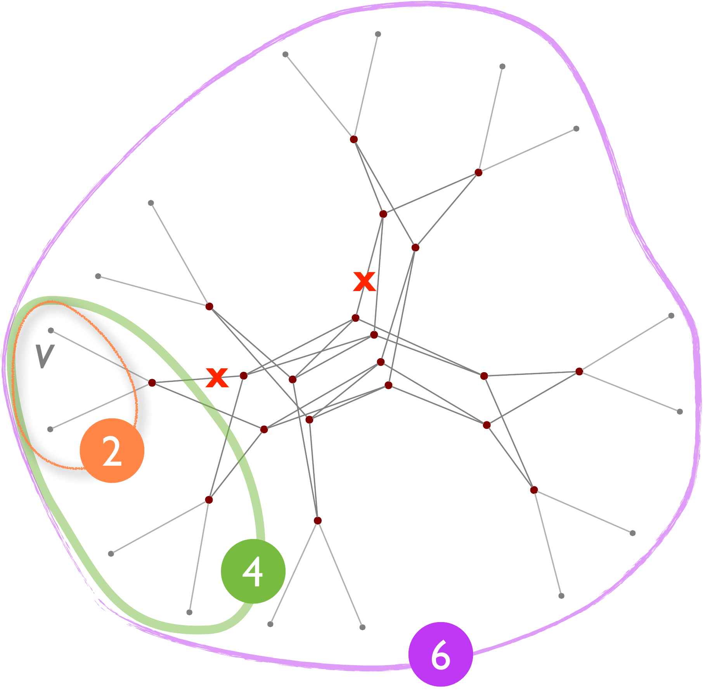 <em>图 1a：具有 16 台服务器和 20 台四端口交换机的胖树。</em></td>
    <td align="center" width="33%">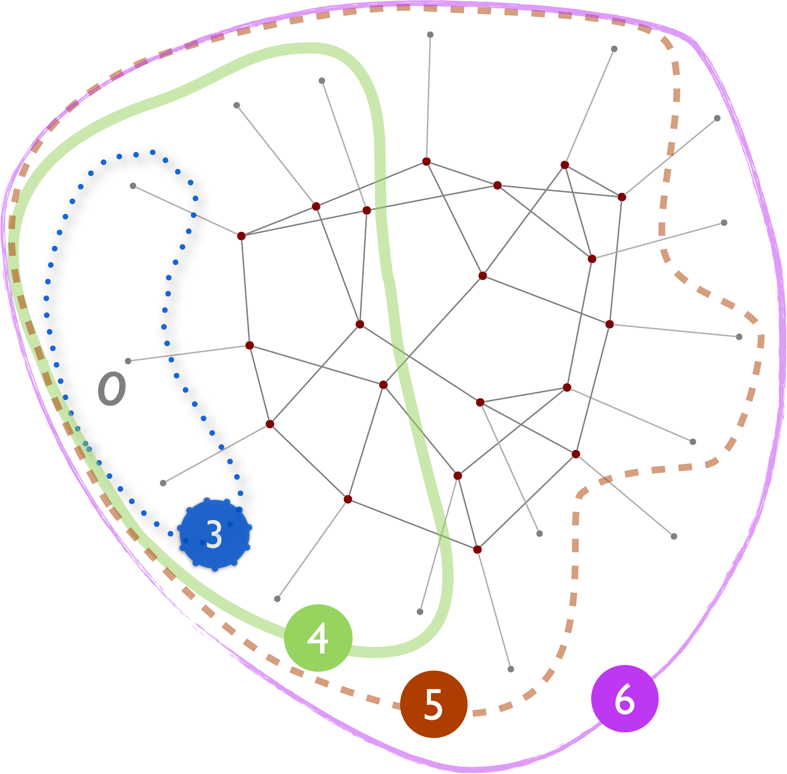 <em>图 1b：使用相同设备的 Jellyfish。</em></td>
    <td align="center" width="33%">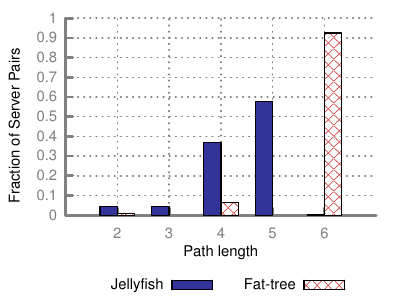 <em>图 1c：686 台服务器 Jellyfish 与相同设备胖树之间的服务器路径长度分布。</em></td>
  </tr>
</table>

<em>图 1：随机图具有高吞吐量，因为它们的平均路径长度较短，因此传递每个数据包所需的工作更少。服务器是叶节点，交换机是内部节点。每个“同心环”包含在标记跳数以内可到达的服务器；Jellyfish 能够在较少跳数内到达更多服务器。</em>

## 4. Jellyfish 拓扑属性

本节评估 Jellyfish 以及其他拓扑的效率、灵活性和弹性。我们的目标是在假设它们结合最优路由和拥塞控制的情况下，测量这些拓扑的原始能力。后文会单独研究如何执行路由和拥塞控制。

这些实验的主要发现如下：

- 在少于 $900$ 台服务器的规模上，Jellyfish 可以在满容量下比使用相同交换设备的胖树多支持 $27\%$ 的服务器。趋势表明，这一优势会随着规模扩大而提高。

- Jellyfish 的网络容量达到最知名度-直径图的 $>91\%$；我们把这些图作为带宽效率基准 [21]。

- Jellyfish 的平均路径比胖树更短，并且在我们测试的所有规模中，最大最短路径长度（直径）与胖树相同或更低。

- Jellyfish 的增量扩展产生的拓扑，在吞吐量和路径长度上与从头生成的 Jellyfish 拓扑基本相同。

- 相比先前关于 Clos 网络增量扩展的工作 LEGUP [20]，Jellyfish 具有显著的成本效率优势。在一个我们能够测试的网络扩展场景中，Jellyfish 只用 LEGUP 成本的 $40\%$ 就构建出容量略高的扩展网络。

- Jellyfish 对故障具有很强的弹性，甚至强于胖树。随机使所有链路中的 $15\%$ 失效，只会导致容量下降不到 $16\%$。

**评估方法：** 本节中部分网络容量结果基于对正则随机图二分带宽理论界限的显式计算。所有吞吐量结果都基于针对特定流量需求矩阵类别、在最优路由下计算得到的吞吐量。我们使用的流量矩阵是随机排列流量：每台服务器以其完整输出链路速率向另一台服务器发送流量，并从另一台服务器接收流量；这个排列是均匀随机选择的。直观地说，随机排列流量表示流量没有局部性的情况，例如在不考虑网络便利性的情况下放置虚拟机时可能出现这种情况。支持这种灵活的、网络无关的虚拟机放置而不造成性能损失，是一个非常理想的特性 [1]。不过，评估其他流量模式仍是我们留给未来工作的重要问题。

给定一个流量矩阵，我们通过把流视作可拆分且连续的方式，并使用“理想”负载均衡，刻画拓扑的原始容量。这对应于求解一个标准多商品网络流问题。（我们使用 CPLEX 线性规划求解器 [31]。）

在所有吞吐量比较中，每组被比较的拓扑都使用相同的交换设备，也就是相同数量的交换机，以及每台交换机相同的端口数。吞吐量结果始终归一化到 0 到 1 的范围，并对所有流取平均。

对于与全二分带宽胖树的比较，我们尝试通过二分搜索过程找到 Jellyfish 在使用与胖树相同交换设备时，可以在满足完整流量需求的前提下支持的最大服务器数量。具体来说，二分搜索的每一步都会选择一个服务器数量 $m$，抽样三个随机排列流量矩阵，并检查 Jellyfish 是否能在三个矩阵中为所有流提供满容量。如果可以，我们就说 Jellyfish 能以满容量支持 $m$ 台服务器。二分搜索结束后，我们会再用 10 个随机排列流量矩阵样本验证返回的服务器数量是否都能达到满容量。

### 4.1 效率

**二分带宽与胖树：** 二分带宽是衡量网络容量的常用指标，指网络任意两个等规模分区之间的最坏情况带宽。这里，我们直接根据胖树参数计算胖树的二分带宽；对于 Jellyfish，我们把网络建模为 RRG，并应用 Bollobás 的下界 [30]。我们把二分带宽除以一个分区中服务器的总线速带宽进行归一化；大于 $1$ 的值表示过量配置。

图 2a 表明，在相同成本下，Jellyfish 可以在全二分带宽（$y$ 轴为 $1$）下支持更多服务器（$x$ 轴）。例如，以与一棵 $16{,}000$ 台服务器胖树相同的成本，Jellyfish 可以在全二分带宽下支持 $>20{,}000$ 台服务器。此外，Jellyfish 允许自由地接受较低二分带宽，以换取支持更多服务器，或通过使用更少交换机来削减成本。

图 2b 表明，对于 Jellyfish 而言，构建全二分带宽网络的成本随服务器数量增长得比胖树更慢，尤其在高端口数交换机下更明显。此外，Jellyfish 的设计选择本质上是连续的，而胖树（遵循文献 [2] 的设计）只允许某些离散规模跳跃，并且这些跳跃进一步受可用交换机端口数限制。（注意，即使对于超额订阅的胖树，这一观察也成立。）

Jellyfish 的优势会随着端口数增加而扩大，并接近胖树二分带宽的两倍。原因如下：使用 $k$ 端口交换机构建的胖树有 $k^3/4$ 台服务器；作为全二分互连，它在每个二分上有 $k^3/8$ 条边。胖树共有 $k^3/2$ 条交换机-交换机链路，因此其二分带宽只占交换机-交换机链路的 $\frac{1}{4}$。而对于 Jellyfish，期望上有 $\frac{1}{2}$ 的交换机-交换机链路会跨越任意给定的交换机二分；在两者使用相同数量交换机和服务器的假设下，这正好是胖树的两倍。直观上，Jellyfish 的最坏情况二分会比这个平均二分稍差。文献 [30] 的界限也支持这一点：在几乎每个具有 $N$ 个节点的 $r$-正则图中，每个 $N/2$ 节点集合与图中其余部分之间至少有 $N(\frac{r}{4}-\frac{\sqrt{r\ln 2}}{2})$ 条边。随着网络端口数 $r\to\infty$，这个量接近 $Nr/4$，也就是 $Nr/2$ 条链路的一半。

**吞吐量与胖树：** 图 2c 使用随机排列流量模型，在容量和交换设备都与胖树匹配的情况下，寻找 Jellyfish 在满容量下可以支持的服务器数量。在我们能用 CPLEX 评估的最大胖树规模（$874$ 台服务器）上，Jellyfish 的改进达到多支持 $27\%$ 的服务器。与基于 Bollobás 二分带宽理论下界得到的结果（图 2a 和图 2b）一致，这一趋势表明改进会随着规模扩大而增加。

<table align="center">
  <tr>
    <td align="center" width="33%">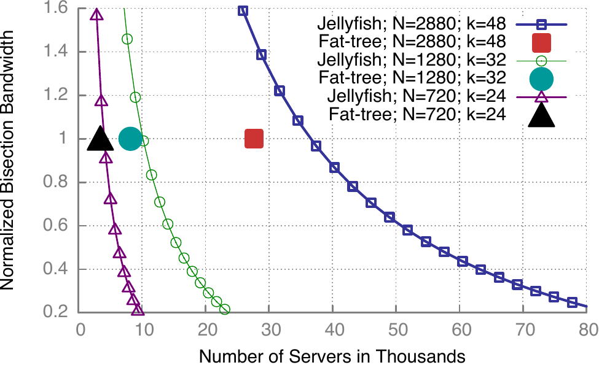 <em>图 2a：归一化二分带宽与支持服务器数量。</em></td>
    <td align="center" width="33%">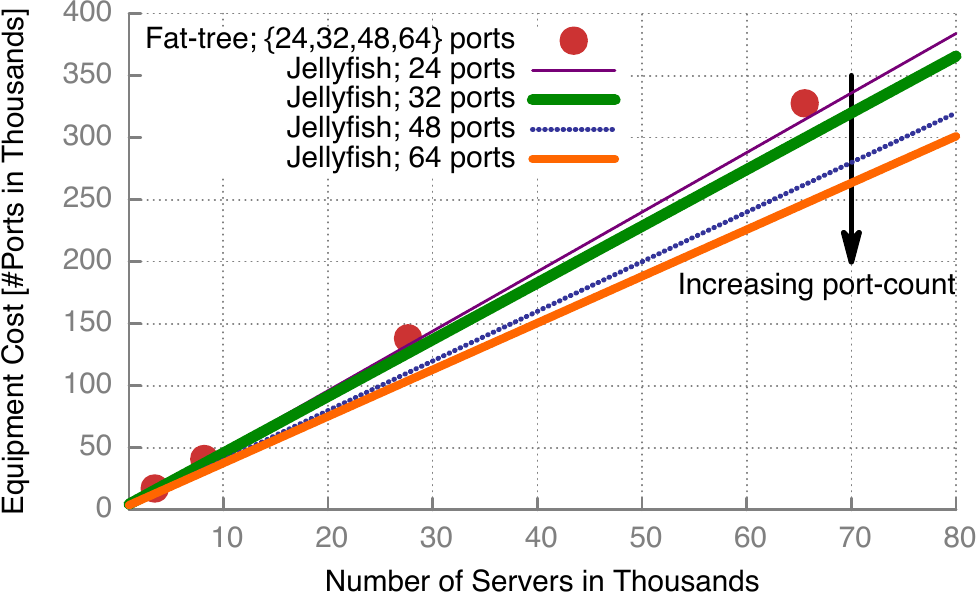 <em>图 2b：全二分带宽下，设备成本与服务器数量。</em></td>
    <td align="center" width="33%">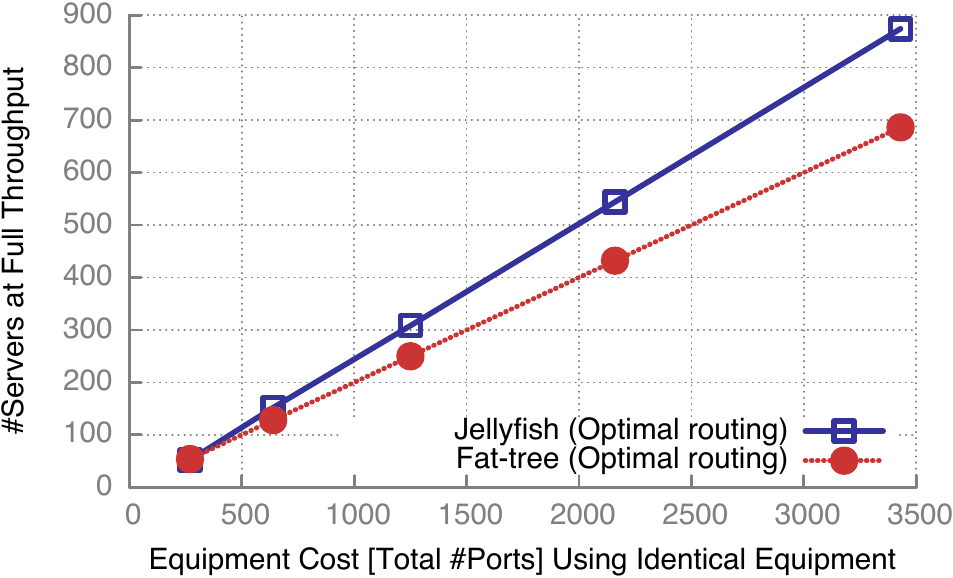 <em>图 2c：最优路由下可满容量支持的服务器数量。</em></td>
  </tr>
</table>

<em>图 2：Jellyfish 提供近乎连续的设计空间，并且在与胖树相同成本下，以高网络容量容纳更多服务器。图 2c 的结果为 8 次运行的平均值。</em>

**吞吐量与度-直径图：** 我们把 Jellyfish 的容量与最知名的度-直径图进行比较。下面先简要解释这些图是什么，以及为什么这种比较有意义。

对于固定顶点集合（例如大小为 $N$）的图，度和直径之间存在基本权衡。一个极端是团：度达到最大可能值 $N-1$，直径达到最小可能值 $1$。另一个极端是度为 $0$、直径为 $\infty$ 的不连通图。在给定直径和度约束下构造节点数 $N$ 尽可能大的图，这个问题被称为度-直径问题，并在图论中受到大量关注。该问题非常困难，最优图只在非常小的规模上已知：已知最大的最优度-直径图有 $N=50$ 个节点，度为 $7$，直径为 $2$ [21]。其他度-直径组合的最优图和最佳已知图也由文献 [21] 维护。

度-直径问题与我们的目标相关，因为较短的平均路径长度意味着较低资源使用量，从而意味着较高网络容量。直观地看，最知名的度-直径拓扑应该可以用高网络带宽和低成本（小度）支持大量服务器。虽然平均路径长度与网络容量的关系比直径更直接，但度-直径图通常也具有较小平均路径长度。

因此，我们提出把最知名度-直径图作为比较基准。注意，这类图并不满足我们的增量扩展目标；我们只是把它们作为 Jellyfish 拓扑的容量基准。不过，这些图（以及我们对它们的测量）也可能具有独立意义，因为在不需要增量升级的环境中，例如预制容器式数据中心，它们可以作为高效拓扑部署。

在与最知名度-直径图比较时，我们选择连接到交换机的服务器数量，使度-直径图不会触及全二分带宽，从而确保测量的是度-直径图的完整容量。图 3 的结果显示，最知名度-直径图确实达到比 Jellyfish 更高的吞吐量，因此也比胖树改进更多。但在这些比较中最差的情况下，Jellyfish 仍能达到度-直径图吞吐量的大约 $91\%$。虽然针对度-直径问题最优的图并不一定被证明对我们的带宽优化问题也是最优的，但这些结果强烈表明，即使使用非常精心优化的拓扑，Jellyfish 的随机拓扑也几乎没有留下多少改进空间。而可能获得的改进，未必值得牺牲 Jellyfish 的增量可扩展性。

  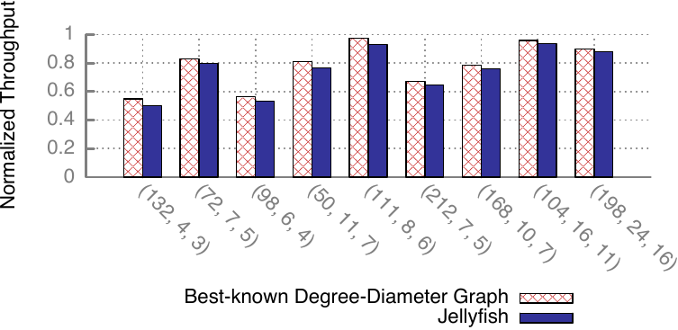
   <em>图 3：Jellyfish 的网络容量接近最知名度-直径图，在每种情况下约为 91% 或更高。x 轴标签 (A, B, C) 分别表示交换机数量、交换机端口数和网络度。吞吐量相对于非阻塞吞吐量归一化，结果为 10 次运行的平均值。</em>

**吞吐量与小世界数据中心（SWDC）：** SWDC [25] 受小世界分布启发，提出了一种新的数据中心拓扑。我们使用 SWDC 论文中描述的相同 $6$ 度拓扑与 SWDC 进行比较。我们通过使用每台交换机连接 $1$ 台服务器和 $6$ 个网络端口的方式，模拟其 $6$ 接口、基于服务器的设计。我们构建了文献 [25] 中描述的三个 SWDC 变体，并在我们可模拟的规模范围内，使各拓扑规模尽可能接近（受制于这些拓扑底层晶格结构）。因此，对于 Jellyfish、SWDC-Ring 和 SWDC-2D-Torus 拓扑，我们使用 $484$ 台交换机；对于 SWDC-3D-Hex-Torus，我们使用 $450$ 个节点。注意，这给后者带来优势，因为它使用相同度但节点数量更少，不过这是该拓扑结构良好的最近规模。

在这些规模下，前三个拓扑都能达到完整吞吐量；因此，为了区分它们的容量，我们把每个拓扑超额订阅：每台交换机连接 $2$ 台服务器，而不是只连接一台。结果如图 4 所示。Jellyfish 的吞吐量大约是最接近竞争者，即基于环的小世界拓扑的 $119\%$。

  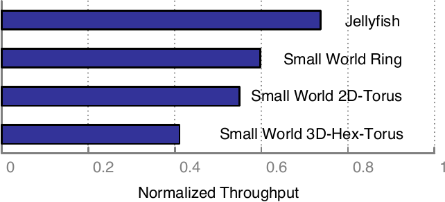
   <em>图 4：Jellyfish 的容量高于使用环、2D-Torus 和 3D-Hex-Torus 作为底层晶格构建的相同设备小世界数据中心拓扑 [25]。结果为 10 次运行的平均值。</em>

**路径长度：** 短路径长度对于确保低延迟、最小化网络利用率很重要。在此背景下，我们注意到随机正则图直径的理论上界相当小：Bollobás 和 de la Vega [32] 证明，在几乎每个具有 $N$ 个节点的 $r$-正则图中，对任意 $\epsilon>0$，直径至多为 $1+\lceil\log_{r-1}((2+\epsilon)rN\log N)\rceil$。因此，服务器到服务器直径至多为 $3+\lceil\log_{r-1}((2+\epsilon)rN\log N)\rceil$。也就是说，路径长度随网络节点数按以 $r$ 为底的对数增长。考虑到具有大端口数的商品交换机已经可用，这一增长率在实践中非常小。

我们使用全对最短路径算法测量路径长度。Jellyfish 的平均路径长度（图 5）显著小于胖树。需要注意的是，图 5 中结果始终使用 $48$ 端口交换机，这意味着与胖树做直接公平比较的唯一点是最大规模；即使在该点，Jellyfish 相比使用 $48$ 端口交换机和 $27{,}648$ 台服务器构建的胖树仍然有优势。例如，对于 RRG($3200$, $48$, $36$) 且 $38{,}400$ 台服务器的 Jellyfish，交换机之间平均路径长度小于 $2.7$；而胖树的平均值在最小规模为 $3.71$，在 $27{,}648$ 台服务器规模为 $3.96$。尽管 Jellyfish 在最大规模下直径为 $4$，但在图 5 中任意规模的 10 次运行中，第 $99.99$ 百分位路径长度都没有超过 $3$。

  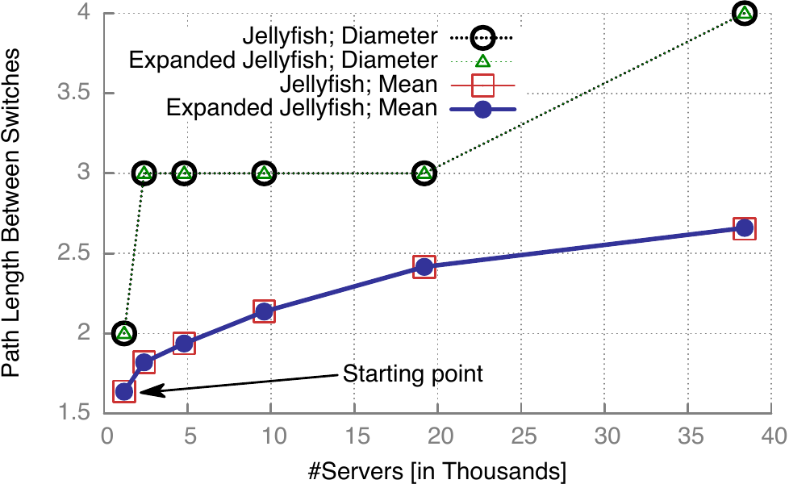
   <em>图 5：Jellyfish 的路径较短。图中展示路径长度与服务器数量的关系，使用 k=48 端口交换机，其中 r=36 个端口连接其他交换机，12 个端口连接服务器。每个数据点来自 10 个图。在这些规模下，直径不超过 4。该图还显示，从头构建 Jellyfish 或使用增量增长，会得到路径长度特性非常相似的拓扑。</em>

### 4.2 灵活性

**任意规模网络：** 一些现有方案只允许用非常粗粒度的参数构建互连。例如，3 层胖树只允许 $k^3/4$ 台服务器，其中 $k$ 又受限于可用交换机端口数，除非留下某些端口不用。这是一个与运营需求无关的任意约束。相比之下，Jellyfish 允许任意数量的机架被高效联网。

**增量可扩展性：** Jellyfish 的构造使它适合通过添加服务器和/或网络容量来增量扩展；如果网络尚未达到全二分带宽，扩展粒度可以小到一个机架或一台交换机。Jellyfish 可以以这样的方式扩展：重新布线的范围只限于新加入网络的端口数量；同时保留理想特性，即低成本下的高带宽和短路径。

举例来说，考虑从 RRG($N$, $k$, $r$) 拓扑扩展到 RRG($N+1$, $k$, $r$)。换句话说，我们向现有网络添加一个服务器机架及其 ToR 交换机 $u$。我们选择一条随机链路 $(v,w)$，要求新的 ToR 交换机尚未与 $v$ 或 $w$ 相连；删除这条链路，并添加两条链路 $(u,v)$ 和 $(u,w)$，从而使用 $u$ 上的 $2$ 个端口。重复这个过程，直到所有端口都填满（或者留下一个奇数空闲端口，它可以与现有机架上的另一个空闲端口匹配、用于服务器，或保持空闲）。这样就完成了该机架的并入，并且可按需要对任意数量的新机架重复该过程。

类似过程也可用于扩展配置不足的 Jellyfish 网络的网络容量。在这种情况下，不是添加带服务器的机架，而是只添加交换机，并把其所有端口连接到网络。

Jellyfish 还允许异构扩展：上述过程中没有要求新交换机必须与现有交换机具有相同端口数。因此，当具有更高端口数的新交换机可用时，它们可以很容易被用于机架中，或用于增强互连带宽。当然，也可以在随机图构造中显式考虑异构性，并改进普通随机图模型的结果；这项工作目前留给未来。

我们注意到，Jellyfish 的扩展过程（类似其构建过程）可能不会产生均匀随机的 RRG。然而，我们证明，按增量方式构建的拓扑，其路径长度和容量测量结果与从头构建的拓扑非常接近。图 5 展示了平均路径长度和直径的比较，其中我们从一个有 $1200$ 台服务器的 RRG 开始并逐步扩展。图 6 比较了随机排列流量模型下，增量构建拓扑和从头构建拓扑的归一化每服务器吞吐量。这里的增量拓扑从一个包含 $20$ 台交换机和 $80$ 台服务器的初始拓扑开始，每次连续添加 $20$ 台交换机和 $80$ 台服务器。在整个实验中，每台交换机有 $12$ 个端口，其中 $4$ 个连接服务器。每种情况下，结果都非常接近。

  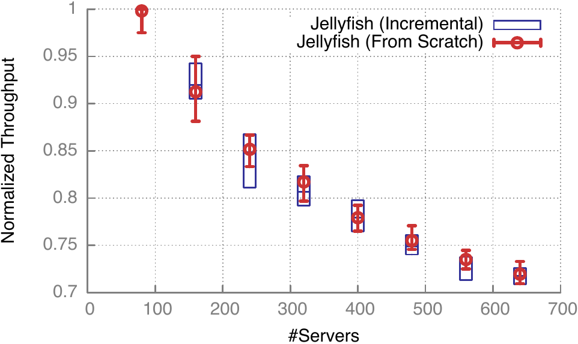
   <em>图 6：增量构建的 Jellyfish 与从头构建的 Jellyfish 具有相同容量。我们以 20 台交换机为增量，从 20 台交换机扩展到 160 台交换机，并比较增量增长拓扑与从头构建拓扑的每服务器吞吐量。图中展示 20 次运行的平均、最小和最大吞吐量。</em>

**扩展中的网络容量：** 注意，在按服务器数量 $N(k-r)$ 归一化后，Jellyfish 归一化二分带宽的下界与网络规模 $N$ 无关。当然，当固定网络度 $r$ 而 $N$ 增加时，平均路径长度也会增加，因此对额外每服务器容量的需求也会增加。这一点也提醒我们：二分带宽虽然是网络容量的良好指标，但并不等同于例如最坏情况流量模式下的容量。不过，由于路径长度增长非常缓慢（如上文所述），即使增长因子相对较大，每服务器带宽仍然保持较高。因此，即便进行大规模扩展，运营商也可以保持每台交换机连接的服务器数量比例不变，只付出很小的带宽损失。只添加交换机（不添加服务器）也是另一种扩展路径，可以保持甚至增加网络容量。下面与 LEGUP 的比较同时使用了这两种扩展形式。

**与 LEGUP 的比较 [20]：** 虽然 LEGUP 实现尚未公开，但作者很友善地提供了一系列由 LEGUP 生成的拓扑。在这条扩展轨迹中，初始网络以及每个后续扩展步骤都有预算约束；在约束内，LEGUP 尝试最大化网络带宽，并且可能保留一些端口空闲，以便未来扩展。初始网络由 $480$ 台服务器和 $34$ 台交换机构成；第一次扩展增加 $240$ 台服务器和若干交换机；后续每次扩展只添加交换机。为了构建可比较的 Jellyfish 网络，我们在每个扩展步骤、相同预算约束下（对交换机、布线和重新布线使用相同成本模型），购买并随机接入尽可能多的新交换机。每个阶段支持的服务器数量与 LEGUP 相同。

LEGUP 针对二分带宽进行优化，因此我们使用 LEGUP 作者提供的代码 [20]，在该指标上比较 LEGUP 和 Jellyfish，而不是使用前面的随机排列吞吐量指标。结果如图 7 所示。Jellyfish 在每个阶段都获得明显高于 LEGUP 的二分带宽。事实上，到第 2 阶段时，Jellyfish 已经达到高于 LEGUP 第 8 阶段的二分带宽，这意味着（基于每个阶段成本）Jellyfish 构建等价网络的成本比 LEGUP 低 $60\%$。

  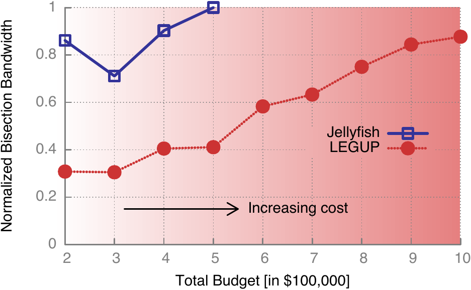
   <em>图 7：Jellyfish 的增量扩展比 LEGUP 的 Clos 网络扩展更具成本效率。在每个扩展阶段具有相同设备和重新布线预算时，Jellyfish 获得显著更高的二分带宽。结果为 10 次运行平均值。从阶段 0 到阶段 1 的二分带宽下降，是因为该步中服务器数量增加。</em>

这些节省中的一小部分可以由 Jellyfish 比 Clos 网络具有更高带宽效率来解释，这一点已经由我们前面对胖树的比较展示。但除此之外，LEGUP 似乎为了能够逐步扩展 Clos 拓扑而付出了显著成本；例如，它会保留一些未使用端口，以便后续扩展。我们推测，这种更高的增量扩展成本在某种程度上是 Clos 拓扑的内在特性。

### 4.3 故障恢复能力

Jellyfish 提供良好的路径冗余；特别地，一个 $r$-正则随机图几乎必然是 $r$-连通的 [33]。此外，在面对链路或节点故障时，随机拓扑仍保持其“无结构”特性：有少量故障的随机图拓扑，只是另一张规模略小、某些交换机上有少量未匹配端口的随机图。

图 8 显示，Jellyfish 拓扑甚至比相同设备的胖树更具弹性，而胖树本身并不脆弱。需要注意的是，这个比较中的胖树服务器更少，但成本相同。这样做是为了同时从容量、路径长度和弹性三个方面证明 Jellyfish 的主张：使用与胖树相同的设备，可以支持更多服务器。

  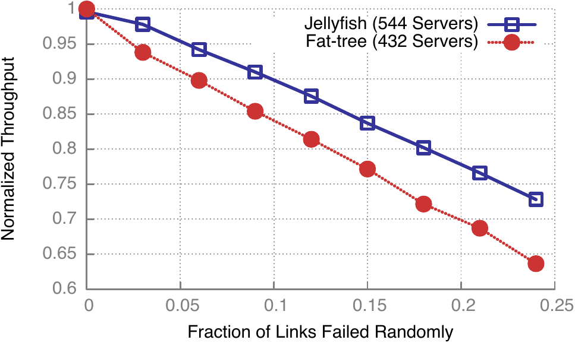
   <em>图 8：Jellyfish 对故障具有高度弹性。随着故障链路比例增加，Jellyfish 的归一化每服务器吞吐量比相同设备胖树下降得更平缓。注意 y 轴从 60% 吞吐量开始；两种拓扑都具有很强故障恢复能力。</em>

## 5. 路由和拥塞控制

前面的实验说明 Jellyfish 拓扑具有高容量，但这种潜力是否能在真实网络中实现仍不清楚。真实部署中有两层会影响性能：路由和拥塞控制。在我们对 Jellyfish 的多种路由与拥塞控制组合实验中发现，标准 ECMP 不能为 Jellyfish 提供足够的路径多样性；要利用完整容量，还需要使用更长的路径。随后，我们使用前面发现的最佳设置，即 $k$-最短路径和多路径 TCP，对 Jellyfish 的吞吐量和公平性给出深入结果。最后，我们讨论部署 $k$-最短路径路由的实用策略。

### 5.1 ECMP 还不够

**评估方法：** 我们对 Jellyfish 和胖树都使用 MPTCP 作者开发的模拟器。对于路由，我们测试：（a）ECMP（等价多路径路由）；我们使用 $8$ 路 ECMP，不过 $64$ 路 ECMP 表现并没有好太多，见图 9。ECMP 是一种在最短路径上分配流量的标准策略。（b）$k$-最短路径路由，这可能对 Jellyfish 有用，因为它可以利用比最短路径更长的路径。对于 $k$-最短路径，我们使用 Yen 的无环路径排序算法 [34, 35]，并设 $k=8$。对于拥塞控制，我们测试标准 TCP（每个服务器对 $1$ 条或 $8$ 条流）以及近期提出的多路径 TCP（MPTCP）[36]，其中 MPTCP 使用推荐值 $8$ 条子流。流量模型仍为服务器级随机排列；与前文一样，在与胖树比较时，我们用与胖树相同的交换设备构建 Jellyfish。

**结果摘要：** 表 1 展示了两个样例 Jellyfish 和胖树拓扑在不同路由和负载均衡方案下，平均每服务器吞吐量占服务器 NIC 速率的百分比。我们有两个观察：（1）ECMP 在 Jellyfish 上表现较差，不能提供足够路径多样性。对于随机排列流量，图 9 显示，在 ECMP 下，大约 $55\%$ 的链路被不超过 $2$ 条路径使用；而在 $8$-最短路径路由下，这个比例为 $6\%$。因此，我们需要使用 $k$-最短路径。（2）一旦使用 $k$-最短路径，每种拥塞控制协议在 Jellyfish 上的效果至少与胖树一样好。

表 1 的结果取决于网络的超额订阅水平。在这个背景下，考虑到路由和拥塞控制效率损失，我们尝试匹配胖树性能。我们发现，与之前使用理想化路由相比，Jellyfish 在这种背景下的优势略有降低：相对于相同设备的胖树（$686$ 台服务器），现在使用 TCP 时，Jellyfish 能在相同或更高性能下支持 $780$ 台服务器，即比胖树多 $13.7\%$；使用 MPTCP 时能支持 $805$ 台服务器，即多 $17.3\%$。在理想路由和拥塞控制下，Jellyfish 可以支持 $874$ 台服务器，即多 $27.4\%$。不过，正如后文定量展示的，Jellyfish 的优势会随规模扩大而显著提高。在我们能模拟的最大规模上，Jellyfish 支持 $3330$ 台服务器，而胖树支持 $2662$ 台；在考虑路由和拥塞控制低效后，改进仍然 $>25\%$。

表 1：不同路由和拥塞控制协议下，Jellyfish（$780$ 台服务器）和相同设备胖树（$686$ 台服务器）的数据包模拟结果。结果展示 5 次运行中，归一化每服务器平均吞吐量占服务器 NIC 速率的百分比。我们没有用 $8$-最短路径模拟胖树，因为 ECMP 严格更好，并且对胖树而言在实践中更容易实现。

| 拥塞控制 | Fat-tree ($686$ servers), ECMP | Jellyfish ($780$ servers), ECMP | Jellyfish ($780$ servers), $8$-shortest paths |
| --- | ---: | ---: | ---: |
| TCP 1 flow | $48.0\%$ | $57.9\%$ | $48.3\%$ |
| TCP 8 flows | $92.2\%$ | $73.9\%$ | $92.3\%$ |
| MPTCP 8 subflows | $93.6\%$ | $76.4\%$ | $95.1\%$ |

  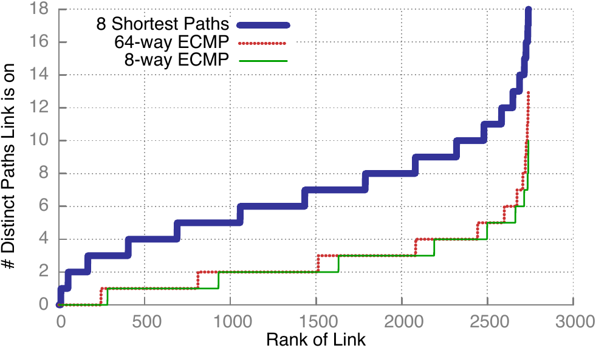
   <em>图 9：ECMP 不能为 Jellyfish 提供路径多样性。图中展示一个典型 686 台服务器 Jellyfish 上，在服务器级随机排列流量下，ECMP 与 k-最短路径路由中的交换机间链路路径计数。该 Jellyfish 使用与支持 686 台服务器的胖树相同设备构建。对每条链路，我们统计其位于多少条不同路径上。每根网络电缆按两个方向视作两条链路。</em>

### 5.2 使用 MPTCP 的 $k$-最短路径

前面的结果用一组有代表性的拓扑表明，使用 $k$-最短路径和 MPTCP 能获得高于 ECMP/TCP 的性能。本节测量带 MPTCP 拥塞控制的 $k$-最短路径路由相对于最优性能的效率，并随后在多种规模上与胖树比较。

**路由与拥塞控制效率：** 图 10 展示了最优性能与在路由和拥塞控制低效下实现的性能之间的差距。在每种规模下，我们对两种设置使用相同、略有超额订阅的 Jellyfish 拓扑；如果网络订阅不足，可能会直接显示 $100\%$ 吞吐量，从而掩盖某些路由和传输低效。在这些比较中最差的情况下，Jellyfish 的数据包级吞吐量约为 CPLEX 最优吞吐量的 $86\%$。（相比之下，胖树在 MPTCP/ECMP 下的吞吐量为其最优值的 $93$-$95\%$。）用更智能的路由方案可能缩小这一差距，但如下面所述，从在相同吞吐量下支持的服务器数量看，Jellyfish 仍保留了它相对于胖树的大部分优势。

  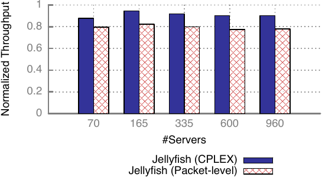
   <em>图 10：使用 MPTCP 的简单 k-最短路径转发很好地利用了 Jellyfish 高容量。我们在相同 Jellyfish 拓扑上比较最优路由吞吐量与使用 MPTCP 的简单路由机制吞吐量；后者在每种情况下达到最优路由的 86% 到 90%。结果为 10 次运行平均值。</em>

**胖树吞吐量比较：** 为了比较 Jellyfish 与胖树的性能，我们首先在数据包模拟中找到胖树产生的平均每服务器吞吐量。然后，我们通过二分搜索找到一个 Jellyfish 服务器数量，使对应 Jellyfish 拓扑的平均每服务器吞吐量与胖树相同或更高；这与表 1 使用的方法相同。我们对若干胖树规模重复这一过程。结果（图 11）与图 2c 类似，尽管由于路由和拥塞控制低效，Jellyfish 的收益略有降低。即便如此，在实验最大规模下，Jellyfish 比胖树多支持 $25\%$ 的服务器（Jellyfish 为 $3330$ 台，胖树为 $2662$ 台）。不过我们也注意到，即使在较小规模上，例如 Jellyfish 的 $496$ 台服务器对胖树的 $432$ 台服务器，改进也可能达到约 $15\%$。

  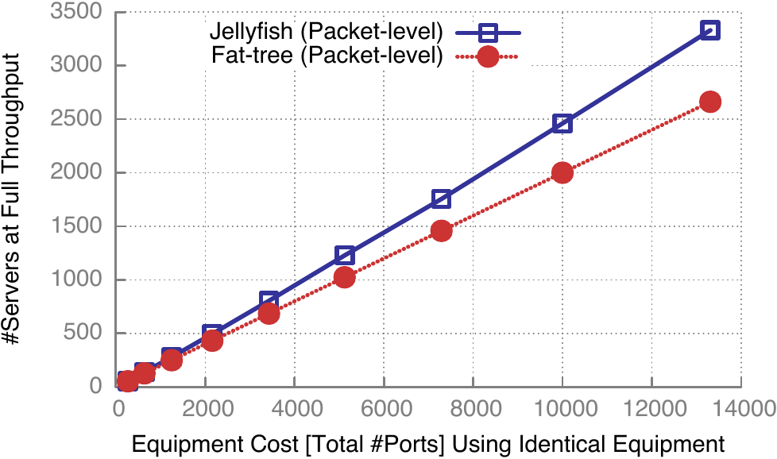
   <em>图 11：即使考虑路由和拥塞控制低效，Jellyfish 也能在相同或更高吞吐量下比相同设备胖树支持更多服务器；最大展示规模下改进超过 25%，且趋势继续增加。小于 1400 台服务器的拓扑结果为 20 次运行平均值，更大拓扑为 10 次运行平均值。</em>

我们在图 12 中展示实验稳定性：对小规模实验，我们在 $20$ 次运行中改变拓扑和流量；对 $>1400$ 台服务器的规模，运行 $10$ 次。图中绘制了 Jellyfish 与胖树在每个规模上的平均、最小和最大吞吐量。

  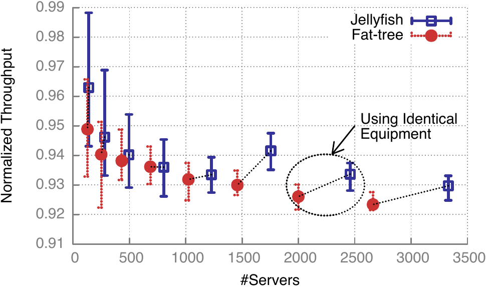
   <em>图 12：Jellyfish 的数据包模拟吞吐量结果显示出与胖树相似的稳定性。注意 y 轴从 91% 吞吐量开始。图中展示平均、最小和最大每服务器吞吐量值。数据来自与图 11 相同的实验。Jellyfish 支持更多服务器，同时平均吞吐量与胖树相同或更高。每个 Jellyfish 数据点使用与其左侧最近胖树数据点相同的设备。</em>

**公平性：** 我们评估 Jellyfish 中路由和拥塞控制的流公平性。我们使用数据包模拟器测量两种拓扑中每条流的吞吐量，并在图 13 中按递增顺序展示归一化每流吞吐量。注意，Jellyfish 有更多流，因为所有比较都使用相同网络设备，并使用 Jellyfish 能支持的更多服务器。两种拓扑都具有类似良好的公平性；基于这些流吞吐量值计算 Jain 公平性指数 [37]，胖树为 $0.991$，Jellyfish 为 $0.988$。

  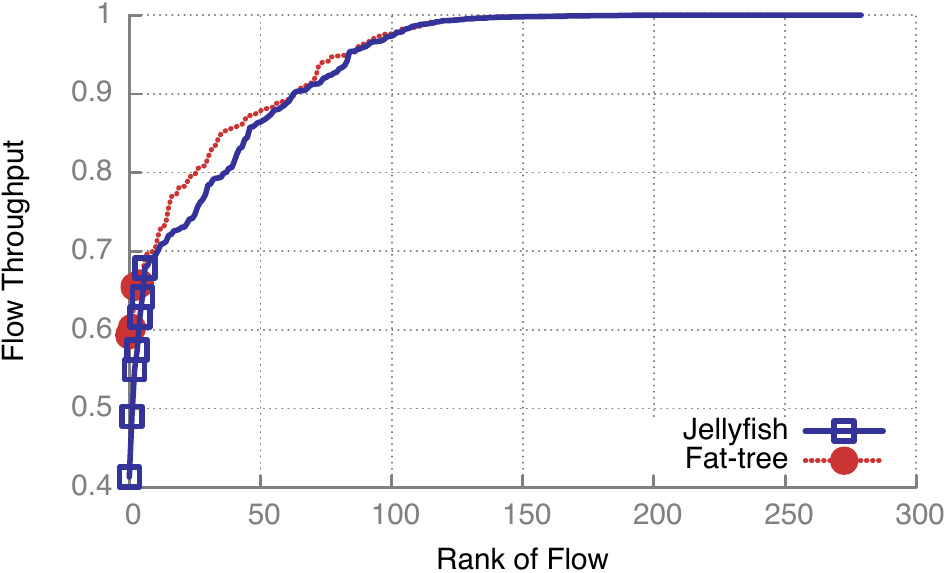
   <em>图 13：Jellyfish 和胖树都显示出良好的流公平性。图中展示一次典型运行中 Jellyfish 与胖树的归一化流吞吐量分布。除了少数离群值（以点表示）之外，曲线基本连续。Jellyfish 的流更多，因为它在相同或更高每服务器吞吐量下支持更多服务器。两种拓扑的 Jain 公平性指数都约为 99%。</em>

### 5.3 实现 $k$-最短路径路由

本节讨论实现 $k$-最短路径路由的实际可能性。为此，每台交换机需要维护一个路由表，其中为每台其他交换机保存 $k$ 条最短路径。

**OpenFlow [38]：** OpenFlow 交换机可以把端到端连接匹配到路由规则，并可用于沿预先计算的 $k$-最短路径对流进行路由。最近，DevoFlow [39] 表明，可以用一小组本地路由动作增强 OpenFlow 规则，从而在不调用 OpenFlow 控制器的情况下，在允许路径上随机分配负载。

**SPAIN [40]：** SPAIN 利用商品现货交换机中的 VLAN 支持实现多路径路由。给定一组预先计算的路径，SPAIN 会把这些路径合并成多棵树，每棵树映射到一个单独 VLAN。SPAIN 支持任意拓扑，并可在 Jellyfish 中启用 $k$-最短路径路由。

**MPLS [41]：** 可以在交换机之间建立 MPLS 隧道，使一对交换机之间所有预先计算的 $k$-最短路径都被配置为相同成本。这样交换机就可以在这些路径之间执行标准等价负载均衡。

## 6. 物理构建和布线

数据中心布线中的关键考虑因素包括：

- **电缆数量：** 每根电缆都代表材料成本和人工成本。

- **电缆长度：** 电缆的每米价格对电缆和光缆而言都是约 $\$5$ 到 $\$6$，但一个光收发器的成本可接近 $\$200$ [42]。我们对电缆长度的关注限于它是否足够短，也就是是否短于 $10$ 米 [8, 43]，从而可以使用电缆。

- **布线复杂性：** Jellyfish 是否会造成令人畏惧的线缆乱团？复杂且不规则的布线布局可能难以操作，并因此更容易发生接线错误。我们会考虑这是否是一个显著因素。此外，我们尝试设计能够把电缆聚合成束的布局，以减少布线的人工工作量，从而降低费用。

本节剩余部分首先处理所有数据中心部署中共同关心的问题：如何处理接线错误。然后，我们在两种部署场景中考察 Jellyfish 布线，并使用上述指标（电缆数量、长度和复杂性）与胖树网络布线比较。第一种部署场景以小型集群为代表（约 $1000$ 台服务器）；这一类别中还包括“容器数据中心”（Container Data Centers, CDC）的容器内部集群。早在 2006 年，Sun Blackbox 就推广了使用集装箱建设数据中心的想法 [44]；市场上也出现了利用类似物理设计理念的新产品 [15, 16, 45]。第二种部署场景以大规模数据中心为代表。本文只分析使用容器构建的大规模数据中心，把更传统的数据中心布局留给未来工作。使用基于容器的数据中心似乎是一种行业趋势，包括 Google 和 Microsoft 在内的若干参与者已经有基于容器的部署 [8]。

### 6.1 处理接线错误

我们设想 Jellyfish 布线使用一份自动生成的蓝图执行；该蓝图基于拓扑和数据中心物理布局生成，然后交给工人手动连接电缆。

虽然布线中不可避免会出现一些人为错误，但这些错误容易检测和修复。考虑到 Jellyfish 拓扑本身并不规整，在许多情况下，少量错误接线甚至未必需要修复。尽管如此，我们认为修复错误接线的成本相对较低。例如，布线人工成本估计约为总布线成本的 $10\%$ [42]。如果悲观估计总布线成本为网络成本的 $50\%$，那么修复例如 $10\%$ 错误接线的成本也只有网络成本的 $0.5\%$。我们还注意到，接线错误可以用链路层发现协议检测 [46]。

### 6.2 小型集群和 CDC

小型集群和 CDC 构成了数据中心市场的重要部分，因此值得单独考虑。在一项 2011 年对 300 家美国企业的调查中，这些企业收入范围从 $\$1$B 到 $\$40$B，且都运营数据中心；其中 $57\%$ 的数据中心占地在 $5000$ 到 $15{,}000$ 平方英尺之间，$75\%$ 的数据中心功率负载小于 $2$MW，这意味着这些数据中心容纳几千台服务器 [14, 26]。正如效率评估所示，即使在几百台服务器规模上，Jellyfish 的成本效率收益也可能很显著；在 $1000$ 台服务器时约为 $20\%$。因此，在这些场景中部署 Jellyfish 是有用的。

我们提出一种布线优化方案，其思路与文献 [2] 类似。关键观察是，在高容量 Jellyfish 拓扑中，交换机之间的电缆数量比服务器到交换机的电缆数量多两倍以上。因此，把所有交换机彼此靠近放置，可以减少电缆长度和人工劳动量。这也简化了增量扩展或修复接线错误所需的少量重新布线。

**电缆数量：** 对于同一服务器池，Jellyfish 需要更少网络交换机，这也意味着它比胖树需要更少电缆（取决于规模，少 $15$-$20\%$）。这还意味着，在相同机房空间中会有更多空间和预算用于容纳更多服务器。

**电缆长度：** 对于小型集群，以及使用上述优化的 CDC 容器内部，电缆长度足够短，可以使用不带中继器的电缆。

**复杂性：** 对于几千台服务器，使用现有 $64$ 端口交换机时，相当于 $3$ 到 $5$ 个标准机架的空间就可以容纳全二分带宽网络所需的交换机。这些机架可以放置在数据中心的物理中心，并在它们之间运行聚合电缆束。从这个“交换机集群”出发，聚合电缆可以连到每个服务器机架。采用这种方案，手动布线相当简单。因此，随机图网络可能让人联想到的可怕线缆混乱场景，最多只是危言耸听。

CDC 的流水线装配特性带来一种独特可能性：可以制造随机连接的配线板。这样，工人只需按规则且易于布线的模式把交换机电缆插入面板，而面板内部设计则编码随机互连。这可以大幅加快手动布线。

无论是否使用配线板，对于 CDC 而言，布局和布线问题只需要在设计时解决一次。借助标准布局和构建方式，用于验证和检测错误接线的自动化工具也只需构建一次。因此，Jellyfish 引入的任何额外复杂性成本，都会在许多容器的生产中被摊销。

**扩展中的布线：** 小型 Jellyfish 集群可以通过在“交换机集群”附近预留足够空间来扩展，使服务器在网络外围增加时能够添加交换机。如果现有交换机集群没有空间容纳额外交换机，则可以启动一个新的集群。从这个新的交换机集群出发，电缆聚合束会连接到所有新服务器机架以及所有其他交换机集群。我们注意到，如果要只用电缆实现这一点，交换机集群之间以及交换机集群与服务器之间都需要位于 $10$ 米以内。考虑到支撑基础设施已经对此类设施施加限制，我们预计这不会成为显著问题。

如前所述，Jellyfish 扩展过程需要少量重新布线。每增加两个网络端口，就需要移动两根电缆（或者等价地，断开一根旧电缆并添加两根新电缆），因为每个新端口都会连接到一个已有端口。需要断开的电缆和需要连接的新电缆都可以自动识别。注意，在“交换机集群”配置中，所有这些活动都发生在一个位置；如果有多个集群，也只发生在这些集群之间。唯一不在交换机集群中的电缆，是新交换机与其连接的服务器（如果有）之间的电缆。这只是一束电缆聚合。

我们注意到，CDC 的使用可能面向增量扩展，也可能不面向增量扩展。在后一种情况下，Jellyfish 的主要价值在于效率和可靠性。

### 6.3 大规模数据中心中的 Jellyfish

现在考虑通过连接多个上述类型的容器来构建大规模数据中心。在这种场景中，随着容器数量增长，大多数 Jellyfish 电缆很可能位于容器之间。因此，容器间电缆又需要昂贵的光连接器，与胖树相比，Jellyfish 可能导致过高布线成本。

然而，我们认为，可以调整 Jellyfish，使它以低于胖树的布线成本连接大规模数据中心，同时仍然达到更高容量并容纳更多服务器。为了在这一场景中为胖树布线，我们应用文献 [2] 建议的布局优化：把每个胖树 pod 作为一个容器，并把核心交换机均匀分配到这些 pod 中。在这种物理结构下，我们可以计算胖树使用的容器内电缆（下文称为“本地”电缆）和容器间电缆（“全局”电缆）数量。然后，我们构建一个 Jellyfish 网络：每个容器中放置与一个胖树 pod 相同数量的交换机，并使用相同数量的容器。所得 Jellyfish 网络可以视为一个两层随机图：每个容器内部有一个随机图，容器之间也有一个随机图。我们改变本地连接和全局连接的数量，观察这相对于不受限制的 Jellyfish 网络如何影响性能。

需要注意的是，在与胖树使用相同交换设备时，如果使用相同数量的服务器，Jellyfish 网络会被过度配置。为了确保由电缆优化导致的任何吞吐量损失都清晰可见，我们在每台交换机上连接更多服务器，使 Jellyfish 处于超额订阅状态。

图 14 展示了 $4$ 种规模下两层 Jellyfish 能达到的容量（平均服务器吞吐量）；这些规模离真正的大规模还很远，但这些模拟旨在观察总体趋势，更大规模模拟超出了我们模拟器能力。我们改变本地和全局连接数量，同时保持拓扑总连接数不变。吞吐量归一化到对应的不受限制 Jellyfish。当每台交换机 $60\%$ 的网络连接被“本地化”时，吞吐量下降不到 $6\%$。等价胖树的本地链路比例为 $53.6\%$。因此，Jellyfish 可以达到更高的本地化程度，同时仍然拥有更高容量的网络；回想一下，在最大规模上，Jellyfish 比胖树高效 $27\%$。在我们测试的不同规模中，电缆本地化对吞吐量的影响相似。对于胖树，使用 $k$ 端口交换机构建时，本地链路比例可以方便地写为 $0.5(1+1/k)$，并且会随规模略微下降。

  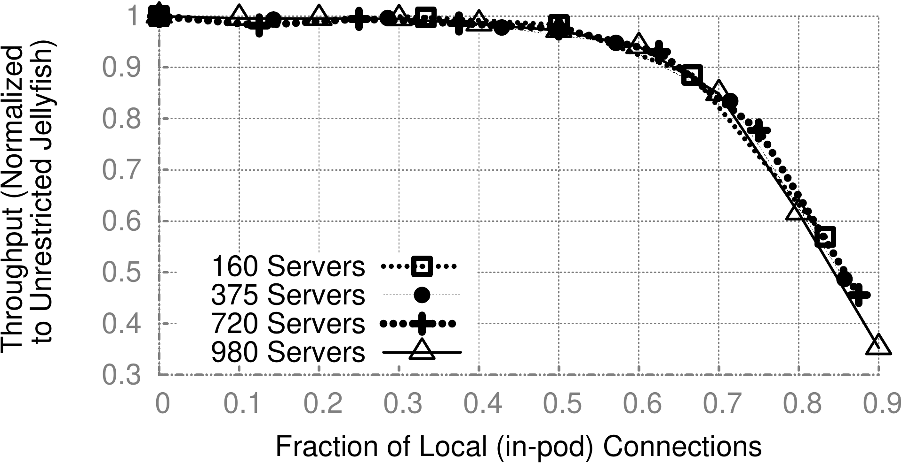
   <em>图 14：Jellyfish 随机链路的本地化，是处理大规模数据中心布线的一种有前景方法。随着链路越来越被限制为本地，网络容量会下降，这是预期之内的；但当每台交换机 50% 的随机链路被限制在 pod 内时，吞吐量损失小于 3%。</em>

**复杂性：** 在均匀分布于容器中的交换机上构建 Jellyfish，很可能会在每对容器之间产生电缆组件。一个 $100{,}000$ 台服务器的数据中心可以由大约 $40$ 个容器构建。即使每个容器中每台交换机的所有端口（除连接服务器的端口外）都连接到其他容器，我们也可以把每对容器之间的电缆聚合起来，得到大约 $800$ 个这样的电缆组件，每个组件少于 $200$ 根电缆。由于 $10$GBASE-SR 电缆的外径仅为 $245um$，每个这样的组件都可以装入半径小于 $1cm$ 的管道中。当然，如果容器间层采用更高的超额订阅，这些数字还会大幅降低。

**扩展中的布线：** 在大规模数据中心中，可以通过添加新容器，或在允许的情况下扩展容器来实现扩展。在容器扩展场景中，随容器间聚合束一起铺设备用电缆会很有帮助。当添加新容器时，必须把新的电缆聚合束铺设到每个其他容器。配线板可以再次通过暴露应连接到其他容器的端口来简化该过程。

## 7. 结论

我们认为，随机图是数据中心网络的一种高度灵活架构。它们代表了一种处理增量扩展和异构扩展这些重要问题的新方法，同时能够提供高容量、短路径，以及对故障和错误接线的恢复能力。

我们感谢 Chandra Chekuri、Indranil Gupta、Gianluca Iannaccone、Steven Lumetta、Sylvia Ratnasamy、Marc Snir 以及匿名审稿人的有益评论；感谢 Andy Curtis 提供二分带宽计算代码，并分享 LEGUP 拓扑用于比较；也感谢 MPTCP 作者分享他们的模拟器。本工作部分受到美国国家科学基金会 CNS 10-40396 资助。

## 参考文献

[1] J. Hamilton. Datacenter networks are in my way. http://goo.gl/Ho6mA.

[2] M. Al-Fares, A. Loukissas, and A. Vahdat. A scalable, commodity data center network architecture. In SIGCOMM, 2008.

[3] A. Greenberg, J. R. Hamilton, N. Jain, S. Kandula, C. Kim, P. Lahiri, D. A. Maltz, P. Patel, and S. Sengupta. VL2: a scalable and flexible data center network. In SIGCOMM, 2009.

[4] C. Guo, G. Lu, D. Li, H. Wu, X. Zhang, Y. Shi, C. Tian, Y. Zhang, and S. Lu. BCube: A high performance, server-centric network architecture for modular data centers. In SIGCOMM, 2009.

[5] R. N. Mysore, A. Pamboris, N. Farrington, N. Huang, P. Miri, S. Radhakrishnan, V. Subramanya, and A. Vahdat. Portland: A scalable fault-tolerant layer 2 data center network fabric. In SIGCOMM, 2009.

[6] C. Guo, H. Wu, K. Tan, L. Shi, Y. Zhang, and S. Lu. DCell: a scalable and fault-tolerant network structure for data centers. In SIGCOMM, 2008.

[7] G. Wang, D. G. Andersen, M. Kaminsky, K. Papagiannaki, T. S. E. Ng, M. Kozuch, and M. Ryan. c-Through: Part-time optics in data centers. In SIGCOMM, 2010.

[8] N. Farrington, G. Porter, S. Radhakrishnan, H. H. Bazzaz, V. Subramanya, Y. Fainman, G. Papen, and A. Vahdat. Helios: A hybrid electrical/optical switch architecture for modular data centers. In SIGCOMM, 2010.

[9] A. Singla, A. Singh, K. Ramachandran, L. Xu, and Y. Zhang. Proteus: a topology malleable data center network. In HotNets, 2010.

[10] A. Licis. Data center planning, design and optimization: A global perspective. http://goo.gl/Sfydq.

[11] R. Miller. Facebook server count: 60,000 or more. http://goo.gl/79J4.

[12] R. Miller. Facebook now has 30,000 servers. http://goo.gl/EGD2D.

[13] Facebook. Facebook to expand Prineville data center. http://goo.gl/fJAoU.

[14] Digital Reality Trust. What is driving the us market? http://goo.gl/qiaRY, 2001.

[15] SGI ICE Cube Air expandable line of modular data centers. http://sgi.com/products/data_center/ice_cube_air.

[16] HP. Pod 240a data sheet. http://goo.gl/axHPp.

[17] HP. HP EcoPOD. http://goo.gl/8A0Ad.

[18] L. N. Bhuyan and D. P. Agrawal. Generalized hypercube and hyperbus structures for a computer network. IEEE Transactions on Computers, 1984.

[19] L. Popa, S. Ratnasamy, G. Iannaccone, A. Krishnamurthy, and I. Stoica. A cost comparison of datacenter network architectures. In ACM CoNEXT, 2010.

[20] A. R. Curtis, S. Keshav, and A. Lopez-Ortiz. LEGUP: using heterogeneity to reduce the cost of data center network upgrades. In ACM CoNEXT, 2010.

[21] F. Comellas and C. Delorme. The (degree, diameter) problem for graphs. http://maite71.upc.es/grup_de_grafs/table_g.html/.

[22] H. Wu, G. Lu, D. Li, C. Guo, and Y. Zhang. MDCube: a high performance network structure for modular data center interconnection. In ACM CoNEXT, 2009.

[23] F. T. Leighton. Introduction to parallel algorithms and architectures: Arrays, trees, hypercubes. 1991.

[24] L. Gyarmati and T. A. Trinh. Scafida: A scale-free network inspired data center architecture. In SIGCOMM CCR, 2010.

[25] J.-Y. Shin, B. Wong, and E. G. Sirer. Small-world datacenters. ACM Symposium on Cloud Computing (SOCC), 2011.

[26] A. R. Curtis, T. Carpenter, M. Elsheikh, A. Lopez-Ortiz, and S. Keshav. REWIRE: an optimization-based framework for unstructured data center network design. In INFOCOM, 2012.

[27] A. B. Michael, M. Nolle, and G. Schreiber. A message passing model for communication on random regular graphs. In International Parallel Processing Symposium (IPPS), 1996.

[28] B. D. McKay and N. C. Wormald. Uniform generation of random regular graphs of moderate degree. J. Algorithms, 1990.

[29] A. Broder and E. Shamir. On the second eigenvalue of random regular graphs. In FOCS, 1987.

[30] B. Bollobás. The isoperimetric number of random regular graphs. Eur. J. Comb., 1988.

[31] CPLEX Linear Program Solver. http://www-01.ibm.com/software/integration/optimization/cplex-optimizer/.

[32] B. Bollobás and W. F. de la Vega. The diameter of random regular graphs. In Combinatorica 2, 1981.

[33] B. Bollobás. Random graphs, 2nd edition. 2001.

[34] J. Yen. Finding the k shortest loopless paths in a network. Management Science, 1971.

[35] An implementation of k-shortest path algorithm. http://code.google.com/p/k-shortest-paths/.

[36] D. Wischik, C. Raiciu, A. Greenhalgh, and M. Handley. Design, implementation and evaluation of congestion control for Multipath TCP. In NSDI, 2011.

[37] R. K. Jain, D.-M. W. Chiu, and W. R. Hawe. A quantitative measure of fairness and discrimination for resource allocation in shared computer systems. Technical report, Digital Equipment Corporation, 1984.

[38] N. McKeown, T. Anderson, H. Balakrishnan, G. Parulkar, L. Peterson, J. Rexford, S. Shenker, and J. Turner. OpenFlow: enabling innovation in campus networks. SIGCOMM CCR, 2008.

[39] J. C. Mogul, J. Tourrilhes, P. Yalagandula, P. Sharma, A. R. Curtis, and S. Banerjee. DevoFlow: cost-effective flow management for high performance enterprise networks. In Hotnets, 2010.

[40] J. Mudigonda, P. Yalagandula, M. Al-Fares, and J. C. Mogul. SPAIN: COTS data-center ethernet for multipathing over arbitrary topologies. In NSDI, 2010.

[41] E. Rosen, A. Viswanathan, and R. Callon. Multiprotocol Label Switching Architecture. RFC 3031, 2001.

[42] J. Mudigonda, P. Yalagandula, and J. Mogul. Taming the flying cable monster: A topology design and optimization framework for data-center networks. 2011.

[43] J. Kim, W. J. Dally, S. Scott, and D. Abts. Technology-driven, highly-scalable dragonfly topology. ACM SIGARCH, 2008.

[44] Project blackbox. http://www.sun.com/emrkt/blackbox/story.jsp.

[45] Rackable systems. ICE Cube modular data center. http://www.rackable.com/products/icecube.aspx.

[46] Microsoft. Link layer topology discovery protocol. http://goo.gl/bAcZ5.
