# MixNet: A Runtime Reconfigurable Optical-Electrical Fabric for Distributed Mixture-of-Experts Training

## 论文信息

- 标题：MixNet: A Runtime Reconfigurable Optical-Electrical Fabric for Distributed Mixture-of-Experts Training
- 年份：2025
- 会议/期刊：ACM SIGCOMM 2025
- DOI：10.1145/3718958.3750465
- 作者：Xudong Liao、Yijun Sun、Han Tian、Xinchen Wan、Yilun Jin、Zilong Wang、Zhenghang Ren、Xinyang Huang、Wenxue Li、Kin Fai Tse、Zhizhen Zhong、Guyue Liu、Ying Zhang、Xiaofeng Ye、Yiming Zhang、Kai Chen
- 机构：
  - Hong Kong University of Science and Technology：Xudong Liao、Yijun Sun、Han Tian、Xinchen Wan、Yilun Jin、Zilong Wang、Zhenghang Ren、Xinyang Huang、Wenxue Li、Kin Fai Tse、Kai Chen
  - Massachusetts Institute of Technology：Zhizhen Zhong
  - Peking University：Guyue Liu
  - Meta：Ying Zhang
  - EmbedWay：Xiaofeng Ye
  - Xiamen University：Yiming Zhang

## 摘要

Mixture-of-Experts（MoE）模型通过按 token 选择性激活不同的子网络，也就是专家（expert），从而优于传统模型。这种门控计算会产生事先无法确定的动态通信，而现有 GPU 互连在分布式训练期间保持静态，因此难以适配这种通信模式。本文提出首个名为 MixNet 的系统，使分布式 MoE 训练能够在训练运行过程中进行拓扑重构。围绕这一目标，作者首先在生产集群中进行测量，发现 MoE 的动态通信模式具有很强的局部性，因此无需进行全局重构。基于这一观察，MixNet 设计并实现了一个区域可重构高带宽域，用光路交换（OCS）增强现有电互连，在保持可扩展性的同时提供快速适配能力。作者使用商用硬件和定制集合通信运行时构建了一个完整原型，在 32 块 A100 GPU 上训练先进 MoE 模型，并在训练过程中执行拓扑重构。大规模 packet-level 仿真表明，MixNet 的性能可接近无阻塞 Fat-tree，同时在 100 Gbps 和 400 Gbps 链路带宽下，分别将四个代表性 MoE 模型的网络成本效率（如 performance per dollar）提升 1.2×–1.5× 和 1.9×–2.3×。

## 1. 介绍

Mixture-of-Experts（MoE）模型 [1, 2, 3, 4, 5, 6, 7, 8, 9, 10, 11] 已经成为机器学习社区提升大语言模型（LLM）性能的重要方向 [6, 3]。传统扩展 LLM 的方法通常堆叠 dense layer，模型规模变大时计算成本也线性增长；而 MoE 使用多个并行专家层，并在每个训练迭代中根据输入 token 只激活其中一部分。例如，xAI 披露 Grok-1 仅激活 25% 的权重 [6]，DeepSeek-V3 则在总计 671B 参数中只激活 37B 参数 [9]。这种动态机制让模型可以扩展到很大规模，而计算成本不必同比例增加。

然而，这种动态专家激活要求每次训练迭代都在进入和离开专家层时执行 all-to-all 通信。在各种并行策略中，专家并行（expert parallelism, EP）把专家层分配到不同 GPU 上，其通信量可与张量并行（tensor parallelism, TP）相当，并显著高于其它并行方式。更重要的是，EP 中每个 token 对专家的选择会让通信模式随训练迭代变化，呈现时间上的非确定性和空间上的非均匀性，从而挑战现有 GPU 互连。

当代 GPU 互连通常包含服务器内的 scale-up 网络（如 NVSwitch [12] 或 NVLink [13]）以及服务器间的 scale-out 网络（如 Ethernet 或 InfiniBand）。两者目前都按均匀、静态的网络拓扑来配置：scale-up 网络通常使用全互连 crossbar，scale-out 网络通常使用 Clos 风格 Fat-tree [14, 15]。在承载 MoE 通信的时间和空间变化时，这些网络必须预留完整二分带宽，但其中大部分资源会被低效利用。近期一些基于 OCS 的方案会针对空间非均匀流量做拓扑重构，但它们假设时间模式稳定，因此整个训练过程只在开始前重构一次 [16, 17]。结果是，这些互连架构在分布式 MoE 训练中会遇到瓶颈，造成资源浪费和训练减速。

因此，要充分释放 MoE 模型的计算优势，需要一种新的 GPU 互连 fabric，能够在运行时适配动态 all-to-all 通信模式。实现这种适配性意味着拓扑必须能在分布式 MoE 训练期间重构。这一点很难，因为当前商用 OCS 技术在低重构延迟（支持训练期间重构）和高可扩展性（连接数万 GPU）之间存在根本权衡，后文会给出更多细节。

为了理解问题空间，作者首先在生产 GPU 集群中进行全面测量，研究分布式 MoE 训练的真实通信模式。测量显示，虽然 EP 在训练期间产生显著变化，但其动态范围严格限制在一个 MoE block 内，因此全局尺度上的 all-to-all 流量具有很强局部性。

基于这一洞察，作者提出 MixNet：一种通过在分布式 MoE 训练期间高效重构拓扑来解决上述问题的新系统。MixNet 的核心是一个基于毫秒级可重构 OCS 的区域可重构高带宽域，位于 scale-up 与 scale-out 网络的边界。该设计在保留现有静态电互连可扩展性的同时，为其补充快速区域重构能力。

MixNet 包含三个关键组件。第一，MixNet 利用 all-to-all 通信的部分可预测性，在运行时跟踪区域流量需求。第二，在获得需求后，MixNet 使用贪心算法生成定制网络拓扑，并通过重构 OCS 实现它。第三，在重构后的拓扑上，MixNet 使用定制集合通信运行时，在 EPS 和区域 OCS fabric 上编排跨主机 DP 与 EP 通信。

为了展示 MixNet，作者使用 32 块 Nvidia A100 GPU、16 张 Mellanox NIC [18]、一个 Polatis 毫秒级 OCS [19] 和一台 Ethernet 交换机构建了完整原型。此外，作者基于 Nvidia Collective Communications Library（NCCL）[20] 开发了定制集合通信运行时，以支持训练期间拓扑重构。该原型成功展示了 MixNet 在先进 MoE 模型上的收益。

为了评估 MixNet 在大规模场景中的性能，作者使用四个代表性真实 MoE 模型进行 packet-level 仿真。结果表明，MixNet 优于现有 fabric：其训练速度可与 Rail-optimized [21] 和 Fat-tree [14] fabric 相当，同时显著提升成本效率。具体而言，在 100 Gbps（400 Gbps）链路下，相比 Fat-tree，MixNet 将网络基础设施成本效率提升 1.2×–1.5×（1.9×–2.3×）；相比 Rail-optimized，提升 1.4×–1.5×（2.3×–2.4×）。作者还观察到，MixNet 相比 TopoOpt [16] 最高可提升 2.5×，并能扩展到 30K+ GPU。当连接到直接附着 GPU 的 co-packaged optical ports 时，MixNet 可将 NVL72 这类高 radix scale-up 系统增强 1.3×。

更多信息见项目网站：https://mixnet-project.github.io/。

## 2. 背景

本节首先介绍 MoE 模型架构及其训练并行策略，然后讨论几种用于分布式训练的 GPU 互连。

### 2.1 分布式 MoE 训练

**MoE 模型架构。** MoE 模型由多个顺序排列的 MoE block 组成 [1, 2]。如图 1a 所示，每个 MoE block 包含一个 attention layer、一个 gate unit，以及若干并行前馈网络（feed-forward networks, FFN），这些 FFN 被称为专家。输入 token x 首先进入 attention layer，随后 gate unit 根据 attention layer 的输出选择最相关的专家。这称为 computation-based routing，是 MoE 稀疏架构的关键：它让模型参数规模增长，而计算成本不线性增长。输出 token y 是所有被激活专家输出的加权和。

<table align="center">
  <tr>
    <td align="center" width="50%">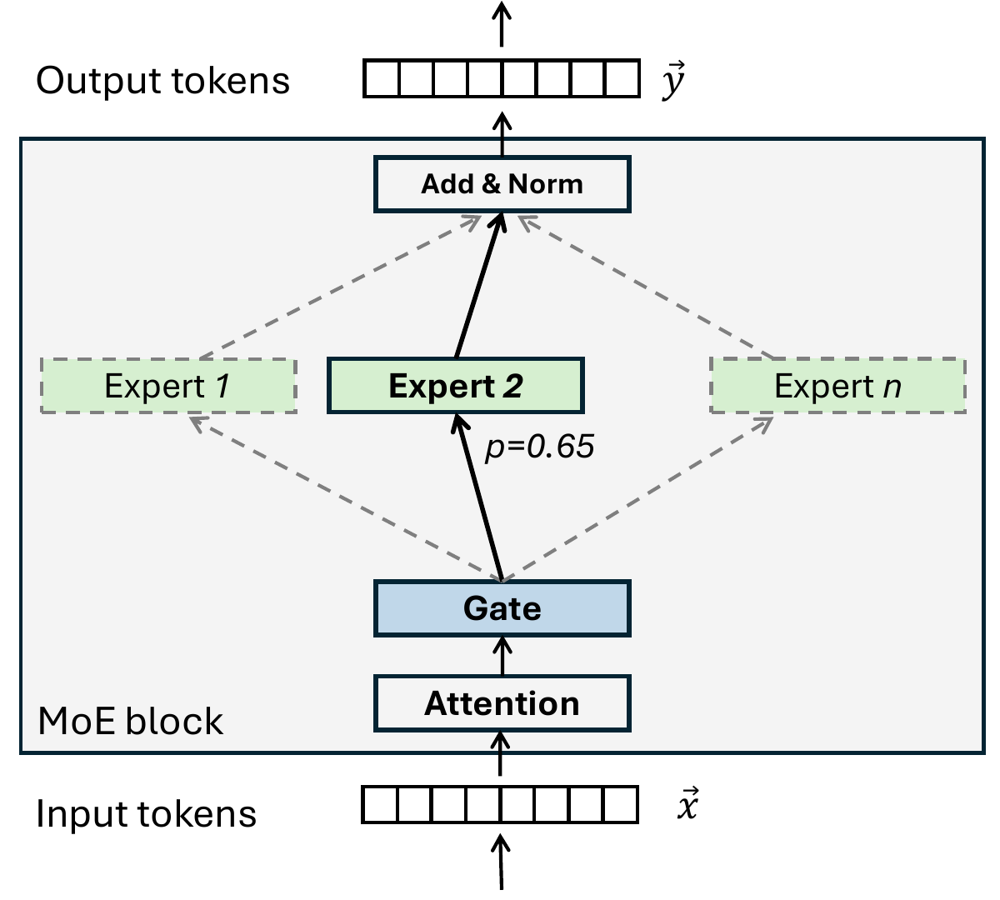<br><em>图 1a：包含多个专家的 MoE block，在该例中 gate 只激活 Expert 2。</em></td>
    <td align="center" width="50%">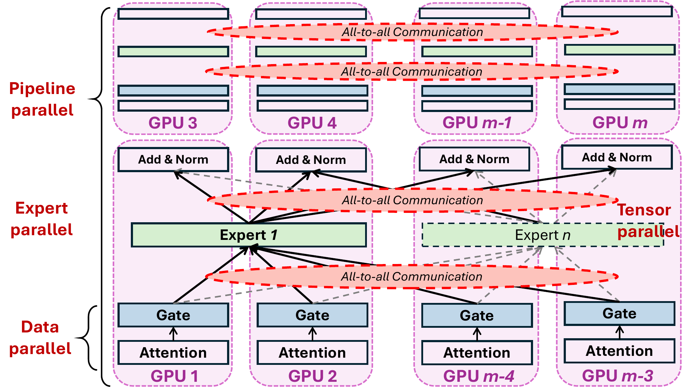<br><em>图 1b：结合 DP、EP、PP 和 TP 的混合并行示例。</em></td>
  </tr>
</table>

<p align="center"><em>图 1：MoE 的门控专家架构及其分布式训练策略。</em></p>

**数据并行（DP）。** 在 DP [22] 中，模型参数会复制到多个 GPU 上，每个 GPU 持有不同训练数据子集。由于跨 GPU 传输的只有梯度，DP 的流量相对其它并行方式较小。在 MoE 模型中，DP 通常用于 gate unit 以及 add & norm layer（图 1b）。当整个模型被复制到多个不同集群时，也会使用 DP。

**张量并行（TP）。** TP [23] 将一个 layer 切分到多个 GPU 上。在分布式 MoE 训练中（图 1b），专家层通常分布到不同 GPU，中间 hidden state 通过 broadcast、all-gather、reduce-scatter 等集合通信原语传输。因此，TP 是通信最密集的操作，但其实用空间规模通常限制在少量 GPU 内 [23]。

**流水线并行（PP）。** 在 PP [24, 23] 中，模型的多个顺序 stage 被分配到不同 GPU（图 1b）。因此，它只通过点到点和 all-reduce 集合通信原语传输 hidden activation state，产生的通信量最少，且流量大小确定。

**专家并行（EP）。** 在 MoE 模型中，一个 MoE block 内的不同专家会被放到不同 GPU [2, 25, 26, 27]（图 1b）。由于每个 GPU 都需要把本地状态发送给其它专家，并从远端 GPU 接收状态，系统需要通过两次 all-to-all 通信完成中间 hidden state 的 dispatch 和专家输出的 collect。EP 的 all-to-all 通信在不同训练迭代之间既非均匀，也非确定。

**不同并行方式的流量大小。** 作者使用 Megatron-LM [23] 对三个先进 MoE 模型（Mixtral 8×7B MoE [3]、LLaMA-MoE [4] 和 Qwen-MoE [5]）进行 profile，并测量总数据传输量。详细模型配置见表 1。图 2 展示一个 MoE 训练迭代中的流量分布。对 Mixtral 8×7B，TP 产生最高流量（总流量的 60%），EP 次之（30%），PP 和 DP 合计少于 6%。对 LLaMA-MoE 和 Qwen-MoE，EP 成为最通信密集的并行方式（超过 80%）。这是因为这些模型最大的 layer，即 expert，可以放入单块 GPU 显存。

<p align="center"><em>表 1：先进 MoE 训练配置。</em></p>

<table align="center" style="margin-left:auto; margin-right:auto; text-align:center;">
  <thead>
    <tr><th>模型</th><th>Mixtral</th><th>LLaMA-MoE</th><th>Qwen-MoE</th></tr>
  </thead>
  <tbody>
    <tr><td>规模</td><td>8×7B</td><td>6.7B</td><td>14.3B</td></tr>
    <tr><td>MoE block 数</td><td>32</td><td>32</td><td>24</td></tr>
    <tr><td>专家数</td><td>8</td><td>16</td><td>64</td></tr>
    <tr><td>EP degree</td><td>8</td><td>16</td><td>16</td></tr>
    <tr><td>TP degree</td><td>4</td><td>1</td><td>1</td></tr>
    <tr><td>PP degree</td><td>4</td><td>4</td><td>4</td></tr>
    <tr><td>序列长度</td><td>4096</td><td>4096</td><td>4096</td></tr>
    <tr><td>Micro-batch size</td><td>8</td><td>8</td><td>8</td></tr>
  </tbody>
</table>

<p align="center">
  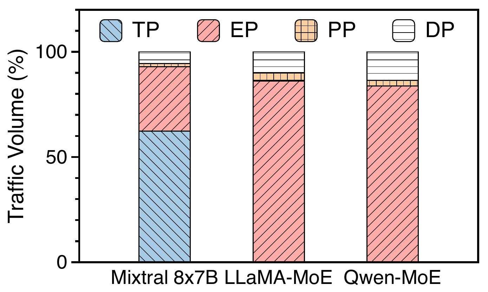
  <br><em>图 2：三个先进 MoE 模型中不同并行方式的流量分布。</em>
</p>

### 2.2 GPU 互连

**使用 NVLink 和 NVSwitch 的 scale-up fabric。** NVLink 和 NVSwitch 是 Nvidia 提供的专有技术，用于支持单台主机内的 GPU 通信 [13, 28]。它们提供的带宽（1.8 TB/s）高于 PCIe（128 GB/s）。

**使用电分组交换（EPS）的 scale-out fabric。** 基于 Ethernet 和 InfiniBand 的 EPS 已经广泛用于采用 Clos 风格拓扑的数据中心网络 [14, 29, 30, 31, 32, 15]。在这类网络中，数据被封装成 packet，并在二层或更高层交换。EPS 的优势是可以扩展到现代数据中心中的数十万台主机 [14]。但 EPS 网络拓扑固定，难以轻易重构。

**使用光路交换（OCS）的 scale-out fabric。** OCS 是一种一层交换技术，可在主机之间建立专用的可重构光路。如表 2 所示，当代商用 OCS 在可扩展性（端口数量）与敏捷性（重构延迟）之间存在根本权衡。机器人光配线架 [16] 可扩展到上千端口，但重构需要数分钟。另一端，硅光 [33] 和 PLZT [34] 等 waveguide-based OCS 可达到微秒或纳秒级延迟，但端口数量有限。

<p align="center"><em>表 2：商用 OCS 技术在端口数量与重构延迟之间的权衡。</em></p>

<table align="center" style="margin-left:auto; margin-right:auto; text-align:center;">
  <thead>
    <tr><th>商用 OCS</th><th>端口数量</th><th>重构延迟</th></tr>
  </thead>
  <tbody>
    <tr><td>Robotic（Telescent）[16]</td><td>1008×1008</td><td>数分钟</td></tr>
    <tr><td>Piezo（Polatis）[19]</td><td>576×576</td><td>10–25 ms</td></tr>
    <tr><td>3D MEMS（Calient）</td><td>320×320</td><td>10–15 ms</td></tr>
    <tr><td>2D MEMS（Google Palomar）[56]</td><td>136×136</td><td>未报告</td></tr>
    <tr><td>RotorNet（InFocus）[77, 92]</td><td>128×128</td><td>10 μs</td></tr>
    <tr><td>Silicon Photonics（Lightmatter）[33]</td><td>32×32</td><td>7 μs</td></tr>
    <tr><td>PLZT（EpiPhotonics）[34]</td><td>16×16</td><td>10 ns</td></tr>
  </tbody>
</table>

## 3. 生产环境测量

传统并行方式（如 TP、PP、DP）的通信模式是确定的；与之不同，EP 通信由 gate unit 在运行时根据输入 token 的语义异质性决定。为了理解 EP 流量模式的动态性，作者在生产数据中心中 profile Mixtral 8×7B [3]，使用 EP degree 为 8、TP degree 为 4、PP degree 为 4 的混合并行，序列长度为 4096，micro-batch size 为 8 [35]。

**生产 fabric。** 作者使用生产数据中心中的 Certified Nvidia DGX SuperPOD 平台 [36]，包含 128 块 H800 GPU 和 128 张 ConnectX-7 400 Gbps NIC。计算 fabric 采用 rail-optimized 拓扑 [21]，并使用 NCCL [20] 优化 DGX 平台上的通信。

**训练迭代内的 all-to-all 通信。** 作者首先测量 Mixtral 8×7B forward pass 中各步骤耗时，结果见图 3。对生产中典型的 micro-batch size（如 8），专家计算耗时超过 100 ms，远大于现有光交换机的重构延迟（例如表 2 中的 MEMS OCS）。因此，系统有机会在专家计算阶段为第二次 all-to-all 重构 OCS。在 backward propagation 中，由于反向计算通常比前向更耗时，重构延迟可以隐藏在后续 layer 的 attention computation（针对第二次 all-to-all）以及 expert computation 阶段（针对第一次 all-to-all）中。其它 MoE 模型的结果见附录“MoE 模型 profiling”。

<p align="center">
  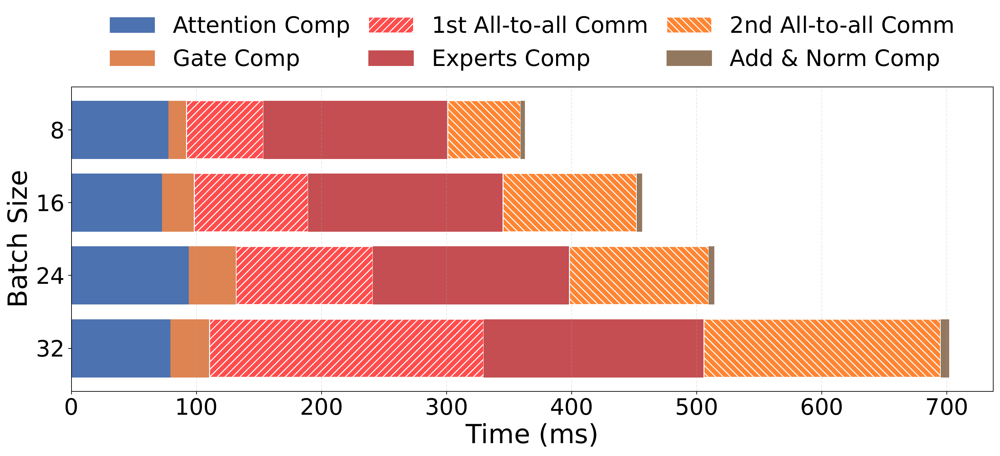
  <br><em>图 3：生产环境中的 Mixtral 8×7B，EP all-to-all 在 400 Gbps 网络中占总训练迭代时间的 33% 到 55%。</em>
</p>

**All-to-all 通信在时间上是动态的。** 图 4a 展示每个 MoE layer 中每个专家在 all-to-all 通信中接收的总通信量，它表示专家的激活强度。作者发现，每个专家的激活强度在不同迭代之间变化显著，这说明 EP 流量具有非确定性。随着训练推进，专家整体通信量的变异性会降低，这是因为 MoE 训练通常使用 load balancing loss 来让 token load 在专家之间尽量均匀分布。不过，即便专家总体通信量看似收敛，all-to-all 流量矩阵仍保持稀疏，如图 4b 所示。此外，ML 社区近期也提出了一些 MoE 训练技术，会在部分训练阶段有意让某些专家低利用，以提升模型性能 [37, 38]。这进一步说明分布式 MoE 训练中的通信是动态的。

**All-to-all 通信在空间上是非均匀的。** 图 4b 展示选定 layer 在不同迭代中的详细 all-to-all 通信矩阵。作者观察到，每个 all-to-all 通信矩阵都是非均匀的，重流量只集中在少数 GPU pair 之间。具体而言，先进 LLM DeepSeek-V3 也显示，在绕过 load-balancing loss 的同时显式制造专家间 token 分布非均匀性，可以改善 MoE 训练过程 [9]。

<table align="center" style="margin-left:auto; margin-right:auto; width:100%;">
  <tr>
    <td align="center" style="width:100%; vertical-align:top;">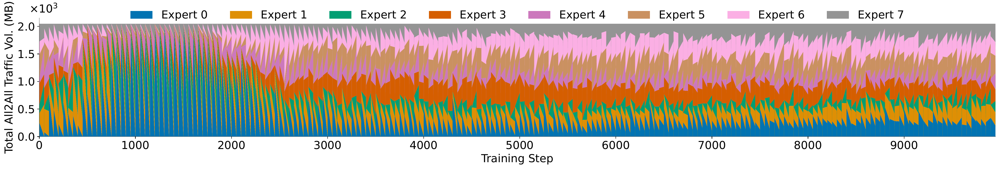<br><em>图 4a：时间维度上，各节点 all-to-all 流量随训练迭代变化。</em></td>
  </tr>
  <tr>
    <td align="center" style="width:100%; vertical-align:top;">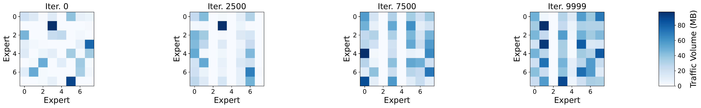<br><em>图 4b：空间维度上，不同专家之间 all-to-all 流量非均匀。</em></td>
  </tr>
</table>

<p align="center"><em>图 4：生产环境中 Mixtral 8×7B 的 MoE 训练 all-to-all 流量动态。</em></p>

**All-to-all 通信具有强局部性。** 图 5 展示训练 Mixtral 8×7B 时 128 块 GPU 之间的 all-to-all 通信。作者观察到，EP 流量具有很强的局部性。原因是只有同一 MoE block 内的专家层需要 all-to-all 通信，而位于不同 PP stage 的不同 MoE block 之间不会直接通信。

<p align="center">
  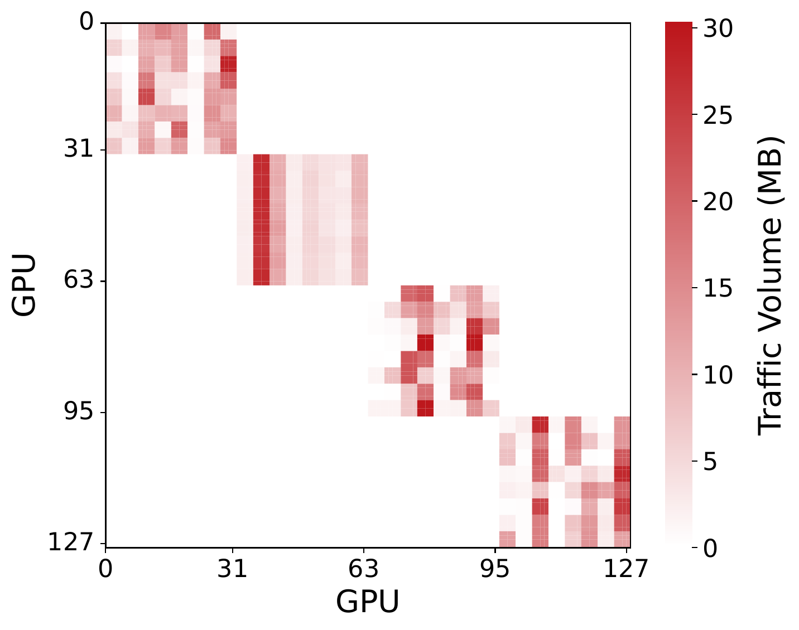
  <br><em>图 5：生产环境中 Mixtral 8×7B 的全 GPU 流量矩阵，显示强局部性。</em>
</p>

上述观察来自 MoE layer 固有的稀疏激活特性以及训练过程中 gate unit 的逐步收敛。作者指出，ML 社区其它工作 [9, 39] 也观察到类似行为，说明这些特性在不同 MoE 模型中具有普遍性。

## 4. MixNet 架构设计

到目前为止，作者已经说明 MoE 会产生时间上非确定、空间上非均匀的独特流量模式。接下来的问题是：如何设计一种最适合分布式 MoE 训练需求的网络架构？本节先从第一性原理出发讨论一种理想但实际的分布式 MoE 训练 fabric，然后介绍 MixNet 的核心方案：基于 OCS 的区域可重构高带宽域。

### 4.1 走向理想但实际的 fabric

作者首先通过思想实验分析分布式 MoE 训练所需的理想且实际可落地的 fabric。

**理想 fabric。** 设计用于分布式 MoE 训练的理想 fabric，需要让不同并行策略产生的流量模式与互连技术最佳匹配。表 3 首先从流量大小、时间模式和空间模式总结不同并行方式的需求，然后从带宽、可重构性和可扩展性分析所需 fabric。TP、DP、PP 这类传统并行方式的通信模式是确定的，因此只需要一次性重构。TP 需要在承载单个 layer 的少量 GPU 内提供高带宽；DP 和 PP 覆盖更多 GPU，但通信带宽相对较低。EP 则显著不同：其时间上非确定的流量模式要求训练过程中重构拓扑，专家之间的 all-to-all 通信又需要中等规模的 fabric radix。因此，MoE 训练的理想 fabric 应当是可重构网络，并能在流量模式跨训练迭代变化时及时调整拓扑。更进一步，拓扑重构必须在每个 all-to-all 通信阶段开始前完成，以免打断计算。基于图 3 的测量，留给拓扑重构的时间窗口大约是几十毫秒。

<p align="center"><em>表 3：互连 fabric 与 MoE 并行策略之间的适配关系。</em></p>

<table align="center" style="margin-left:auto; margin-right:auto; text-align:center;">
  <thead>
    <tr><th>并行方式</th><th>流量大小</th><th>时间模式</th><th>空间模式</th><th>带宽需求</th><th>重构需求</th><th>可扩展性</th><th>最适合的互连技术</th></tr>
  </thead>
  <tbody>
    <tr><td>DP</td><td>低</td><td>确定</td><td>全局 All-Reduce</td><td>低</td><td>慢速、一次性</td><td>大</td><td>电分组交换（Ethernet）</td></tr>
    <tr><td>TP</td><td>最高</td><td>确定</td><td>局部 All-Reduce</td><td>高</td><td>慢速、一次性</td><td>小</td><td>Crossbar Switch（NVSwitch）</td></tr>
    <tr><td>PP</td><td>低</td><td>确定</td><td>全局点到点</td><td>低</td><td>慢速、一次性</td><td>大</td><td>电分组交换（Ethernet）</td></tr>
    <tr><td>EP</td><td>高</td><td>非确定</td><td>区域稀疏 All-to-All</td><td>高</td><td>快速、训练中</td><td>中等</td><td>光路交换（Optical）</td></tr>
  </tbody>
</table>

**理想 fabric 的挑战。** 实现上述 fabric 面临显著挑战。表 2 展示了商用 OCS 技术在重构延迟和端口数量之间的权衡。虽然一些小规模原型可通过可调激光器配合 AWGR [40]、硅光 [41] 等先进器件打破该权衡，但它们不属于本文关注范围；本文主要关注可在大规模场景中直接部署的商用方案。当前 OCS 若要达到毫秒级重构时间，端口数通常只有几百个，难以连接大规模 MoE 互连所需的数十万节点；反过来，若把端口数扩展到几十万，重构时间会变慢，无法满足训练迭代内的快速重构需求。

**在实践中落地理想 fabric。** 为调和这些挑战，MixNet 利用一个关键观察：尽管 MoE all-to-all 流量具有非确定和非均匀特性，但由于 MoE block 通常被放在 pipeline 中 [23, 9]，流量变化具有强局部性。因此，MixNet 不构建全局可重构 OCS fabric，而是设计多个区域可重构 OCS 网络。图 6 展示 MixNet 的网络架构。通过把网络划分为多个通信局部性强的区域，每个区域 OCS 可以快速适配 EP 的流量需求，而无需承担全局重构复杂度。这种区域可重构 OCS 既在较小、可管理的范围内实现快速重构，又规避了硬件端口规模限制，从而支持 MoE 训练的动态通信模式。

<p align="center">
  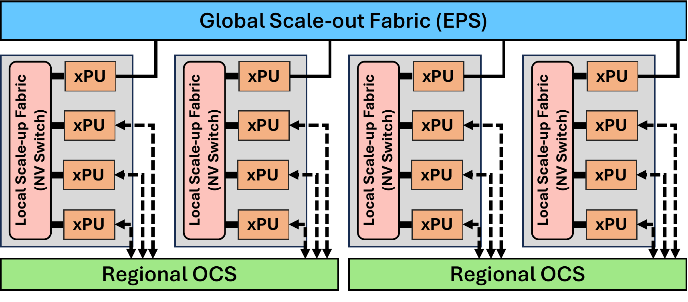
  <br><em>图 6：MixNet 网络架构。</em>
</p>

### 4.2 区域可重构 OCS

MixNet 是首个支持训练期间拓扑重构的 fabric，其核心思想是在现有电 fabric 中构建区域可重构 OCS，用来卸载动态 EP 流量。通过利用 MoE all-to-all 流量固有的强局部性，MixNet 将网络划分为多个区域，每个区域内专家层之间的通信需求是非确定的。区域化设计让每个分区能够快速重构，有效缓解 OCS 技术中重构速度和端口数量之间的根本权衡。通过聚焦区域可重构性，MixNet 在保持可扩展性的同时快速适配 MoE 训练的动态通信模式，并避免全局网络重构复杂度。

**区域可重构 OCS 部署在哪里？** 为了服务分布式 MoE 训练中的区域稀疏 all-to-all 流量，区域 OCS 连接一组 GPU server，每台 server 把自己的 NIC 分配到 EPS 和 OCS 两侧。短期内，MixNet 的区域 OCS 通过 NIC 上的 optical transceiver 来保证部署就绪；长期看，随着 co-packaged optics（CPO）普及，MixNet 的区域 OCS 可兼容直接连接计算芯片（GPU、TPU 等）的商用 optical I/O 方案，例如 Ayar Labs 的 TeraPHY [42]。考虑到今天的毫秒级快速 OCS 支持最多约 500 个端口（表 2），而典型 server 有 8 张 NIC，一个通过 OCS 互连的可重构高带宽域大约可支持 80 到 250 台 server（每台 server 把 2 到 6 张 NIC 分给 OCS）。

**何时重构拓扑？** EPS 网络是无连接的，而 OCS 网络是面向连接的，需要主动控制才能重构。在拓扑重构期间，OCS 网络无法承载 packet。多数商用光交换机需要几十纳秒到数毫秒来完成拓扑重构。因此，必须选择合适时间，在实际数据传输开始前启动拓扑重构，避免阻塞训练流程。

**如何重构拓扑？** 在 MixNet 中，OCS fabric 被组织成多个彼此隔离的 slice，分别服务每个可重构高带宽区域。因此，区域 OCS 拓扑由本地拓扑控制器控制，控制器频繁从 host server 收集流量需求。每个训练迭代包含四次 all-to-all 通信，其流量模式相同或互为转置；但这些流量模式在不同训练迭代之间是非确定的。因此，系统需要一种机制，根据流量模式定制拓扑。区域拓扑重构也意味着 MixNet 不需要中心化拓扑控制器，从而避免控制平面的可扩展性问题。

**走向混合光电 fabric。** MixNet 试图把并行策略的流量模式与对应交换技术最佳匹配。因此，MixNet 使用 server-scale NVSwitch 承载 TP，使用区域可重构 OCS 承载 EP，使用大规模 EPS 承载 DP 和 PP。为了把不同数据搬运任务分配到不同 fabric 上，还需要一个支持拓扑重构的新集合通信库。

## 5. MixNet 系统实现

为了支持上述 MixNet 架构，作者设计并实现了控制面与数据面的几个核心组件。如图 7 所示，MixNet 的实现包含一个 traffic monitor，用来跟踪 EP 的流量需求，从而刻画后续 all-to-all 通信；多个去中心化 topology controller 根据被监控到的流量需求，为区域 OCS 生成并执行拓扑；随后 collective communication manager 负责在 MixNet fabric 中引导流量。此外，本节也讨论故障处理机制。

<p align="center">
  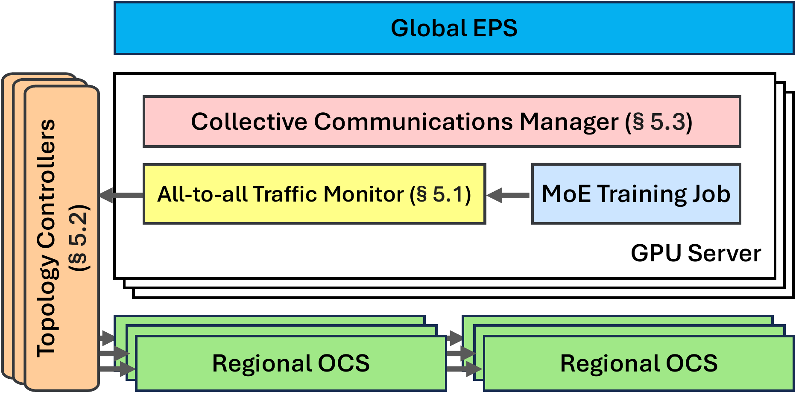
  <br><em>图 7：MixNet 系统实现。</em>
</p>

### 5.1 All-to-All 流量刻画

在每个 MoE block 中，每个训练迭代包含四个 all-to-all 通信阶段：forward pass 两个，backward pass 两个（图 1b）。第一次 all-to-all 发生在 gate unit 计算之后。gate unit 的实际输出是每个 token 的 dispatch probability distribution，expert load 可直接由该分布和 top-k 参数得到。跨 EP group 的 gate 输出决定了该通信阶段的流量矩阵。由于 token dispatch 和 collection 过程具有对称性，这四个 all-to-all 流量矩阵严格相同或互为转置。

对 forward pass 中第一次 all-to-all 来说，由于 MixNet 网络架构配置了毫秒级可重构 OCS，有两种选择：要么重构 OCS 并阻塞训练流程，因为这段重构时间无法隐藏在计算中；要么使用随机拓扑或复用前一个 MoE layer 的拓扑，但这样无法获得高效 circuit schedule 的收益。

作者还观察到，forward pass 第一次 all-to-all 具有部分可预测性，因此可以提前主动为其重构 OCS，例如在 attention computation 阶段执行。具体预测算法见附录“流量需求预测”。MixNet 不引入额外 demand monitoring 开销，因为先进 MoE 训练框架本身已经包含收集这些信息的机制 [43]，用于执行按需 all-to-all 传输。

算法 1：重构 OCS。

```text
Procedure ReconfigureOCS(E, alpha, N, V)
Input:  E: 专家的 all-to-all 通信需求
        alpha: 当前 optical degree
        N: server 数量
        V: server 节点集合
Output: S: OCS 中 NIC 级映射

C <- N x N 零矩阵
avail_ocs[v] <- alpha, for v in V
若 D[i][j] != 0，则初始化完成时间 T = infinity，否则 T = 0

Step 1: 将 D 转换为上三角矩阵
D <- calculate_server_demand(E)

while True:
    Step 2: 查找瓶颈链路
    (i, j) <- findBottleneckLink(T, C, V)
    if avail_ocs[i] > 0 and avail_ocs[j] > 0:
        Step 3: 在 i 与 j 之间创建链路
        C[i][j] <- C[i][j] + 1
        C[j][i] <- C[j][i] + 1
        for v in {i, j}:
            avail_ocs[v] <- avail_ocs[v] - 1
    else:
        break
    更新时间矩阵：
    T[i][j] <- D[i][j] / C[i][j]
    T[j][i] <- D[j][i] / C[j][i]

Step 4: 生成 OCS 拓扑
S <- GetNICMapping(C)
S <- permuteLinks(S)

Step 5: 重构 OCS
reconfigureOCS(S)
return S
```

### 5.2 拓扑重构

在 MixNet 中，寻找最优拓扑并推导 optical schedule 是 NP-hard 问题 [44]。作者用轻量级贪心算法处理这一挑战。关键洞察是，all-to-all 通信时间由最大传输的延迟决定，这意味着对应 GPU pair 应获得更多 circuit。因此，MixNet 在每个迭代中识别传输时间最长的通信 pair，并在 OCS 拓扑中为它们分配直接光链路。算法 1 展示了详细 OCS 重构算法。

**步骤 1：获得 server 间 demand（第 5 行）。** 给定预测到的 all-to-all 通信需求后，算法先根据每个 GPU 上的专家数和每台 server 上的 GPU 数，把流量矩阵映射为真实 server 间通信需求。由于 MixNet 同时配置每条 OCS 链路的 TX 和 RX 带宽，因此会把 TX 和 RX demand 相加，将 server 间 demand 矩阵变成上三角矩阵。

**步骤 2：查找瓶颈链路（第 7 行）。** 算法随后迭代查找当前已分配链路中的瓶颈。瓶颈链路定义为：在 demand 矩阵 D 和已分配链路矩阵 C 下，完成时间最长的链路。算法贪心计算每条链路的完成时间，并返回完成时间最长的 server pair。

**步骤 3：分配 OCS circuit（第 9–11 行）。** 算法首先为找到的瓶颈 server pair 分配 OCS 链路。如果两台 server 的 OCS NIC 尚未完全分配，算法就为它们分配相应链路。

**步骤 4：生成 OCS 拓扑（第 15–16 行）。** 算法根据已分配链路矩阵 C 映射 TX 和 RX NIC，从而生成拓扑。若两台 server 之间存在多条链路，算法会对连接做 permutation，以形成 NUMA 优化拓扑并避免主机内拥塞。例如，如果 server A 和 server B 之间有两条链路，算法会确保对应 TX/RX NIC 位于两个不同 NUMA node，以便后续主机内流量转发。

**步骤 5：重构 OCS（第 17 行）。** 最后一步是据此重构 OCS 交叉连接。拓扑管理器利用 TX/RX pair 映射，为这些 pair 建立光路径。

### 5.3 集合通信分配

生成拓扑后，下一步是把来自不同并行方式的网络流量分配到 MixNet，并生成路由 schedule。下面说明 MixNet 的集合通信管理器如何在数据路径中路由不同并行方式的流量。

**TP 和 PP。** TP 流量被限制在主机内高带宽域中，例如 NVSwitch。PP 流量发生在不同 PP stage 之间，依赖 MixNet 架构中的高 fanout EPS fabric。因此，这两类并行不需要特殊配置。

**DP。** DP 流量通常跨越整个训练集群，因此 MixNet 将其路由到 EPS fabric。为了进一步提高 DP 传输效率，MixNet 使用 hierarchical all-reduce 算法 [45, 46]，减少每台 server 的出站流量。首先，同一 server 内的 GPU 通过主机内 reduction 聚合参数，将参数汇总到连接 EPS NIC 的 gateway DP GPU。接着，所有 server 的 gateway DP GPU 参与全局 ring all-reduce，同步模型参数。最后，每台 server 再把同步后的参数从 gateway DP GPU broadcast 给其它 GPU。第一和第三阶段使用高速 NVSwitch，第二阶段依赖相对低带宽的 EPS fabric。如果 fabric 中有多张 EPS NIC，MixNet 使用 multi-ring all-reduce 充分利用带宽并减少通信时间。

**拓扑感知 EP。** EP 流量应使用区域可重构高带宽域。完成重构后，MixNet 本质上为 EP 传输形成了直接连接拓扑。基于这一点，MixNet 按以下步骤路由 EP 流量。图 8 展示四台 server、总计 16 块 GPU（EP degree 为 16）构成的重构拓扑。

<p align="center">
  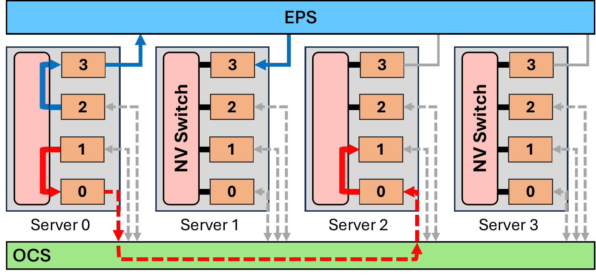
  <br><em>图 8：MixNet 中 all-to-all 通信的路由方式。为便于展示，每台 server 只包含 4 块 GPU，TX/RX 链路被合并成单条链路；实际中 MixNet 支持 8 块或更多 GPU 的标准配置。</em>
</p>

1. 每块 GPU 查找拓扑，识别每个通信 pair 在 server 内的通信代理 GPU。MixNet 优先使用直接连接的 optical circuit，再使用 EPS。例如，server 0 到 server 2 的代理 GPU 是 GPU 2，因为二者通过 optical circuit 连接。若 server 0 与 server 1 通信，则必须使用连接到 EPS 的 GPU。
2. 获得 gateway 信息后，每台 server 通过 NVSwitch 执行主机内 gather，将出站数据聚合到对应代理 GPU。如拓扑重构步骤所述，当一对 server 之间配置多条链路时，MixNet 会平衡各 NUMA node 上的 NIC 数量，缓解主机内拥塞，并尽可能均匀分散代理 NIC 上的流量负载。
3. 每台 server 使用 EPS 和 OCS fabric 中的 NIC，在所有代理 GPU 之间启动跨主机 all-to-all 通信。
4. 每台 server 通过 NVSwitch 在本地专家之间执行主机内 all-to-all 通信。
5. 每台 server 中的代理 GPU 将收到的 all-to-all 数据 scatter 到最终目的地。

由于步骤 3 和步骤 4 的数据流互不干扰，MixNet 会重叠这两步通信，以降低总体完成时间。

### 5.4 故障处理

分布式 MoE 训练中的故障分为两类：网络（NIC/link）故障和 GPU 故障。MixNet 能容忍训练期间的瞬态和永久故障。

**网络故障韧性。** 在实践中，MixNet 中每台 server 都使用多张 NIC 同时连接全局 EPS fabric 和区域 OCS 域。具体而言，EPS 侧通常每台 server 至少使用两张 NIC，以便为 packet-switched 通信提供冗余。根据已有报告 [47]，单张 NIC 或单条链路在训练作业期间的故障率约为 0.057%，双 EPS NIC 足以把同时故障概率降到 0.00003% 以下。如果某台 server 的两张 EPS NIC 都故障，这虽罕见但可能发生，MixNet 会通过 OCS 域重路由流量：发往故障 NIC 的流量先通过光路路由到健康 peer，再经由该 peer 可用的 EPS 接口转发。同样，如果 OCS 链路或端口故障，EPS 也可作为 fallback path。这种双路径设计保证了连接韧性，代价是增加少量集群内转发开销。

**GPU 故障容忍。** 当一块或多块 GPU 不可用时，MixNet 也支持故障恢复。作者考虑两个现实故障级别。

- 单 GPU 故障：如果训练期间某块 GPU 失败，MixNet 将 workload 重映射到指定备用 GPU。这与 NVL72 等高可用系统的设计一致，这些系统会为每个 group 预留 spare GPU。在 MixNet 中，备用 GPU 可通过 EPS 或 OCS 连接：若可经 EPS 到达，训练无需额外路由即可恢复；若只能经 OCS 到达，MixNet 会在拓扑重构后，通过与备用 GPU 有光连接的 peer GPU 转发流量，只需小幅调整拓扑即可维持功能性互连。
- 整节点故障：若整台 server 故障（例如 8 块 GPU 全部不可用），则需要从全局备用池中取一台替换节点。这些备用节点通过 EPS uplink 连接，因此无需依赖区域 OCS 即可保持网络连接。checkpoint 恢复后，MixNet 可用较小扰动继续训练。

**运行时重构。** 为在故障存在时保持拓扑有效，MixNet 的去中心化拓扑控制器会检测通信故障并重新生成 OCS 拓扑，包括从候选集合中排除故障节点并重新计算光映射。由于 MixNet 依赖区域控制，这些重构是局部的，不会引发大的全局扰动。作者在后续评估中分析了多种故障场景的影响。

## 6. MixNet 原型

为了评估 MixNet，作者使用商用硬件构建了一个完整原型，可训练先进 MoE 模型。由于 Nvidia warranty 限制，作者无法重构测量实验中使用的 DGX SuperPOD 拓扑，因此使用搭载 Nvidia GPU 的商用 server 搭建 testbed。

**硬件配置。** 图 9 是原型照片。原型包含四台商用 server，每台配备 8 块 Nvidia A100 GPU 和 4 张 Mellanox ConnectX-6 100G NIC。每台 server 中，3 张 NIC 连接到一个 Polatis 毫秒级 OCS [19]，剩余 1 张 NIC 连接到 Nvidia SN3700 Ethernet 交换机 [48]。作者使用 100 Gbps QSFP28 optical transceiver 和 duplex LC fiber [49]。所有 NIC 都运行在 RoCEv2 模式。每台 server 共有 4 条 NVLink，连接相邻 GPU。附录“原型细节”提供更多 testbed 信息。

<p align="center">
  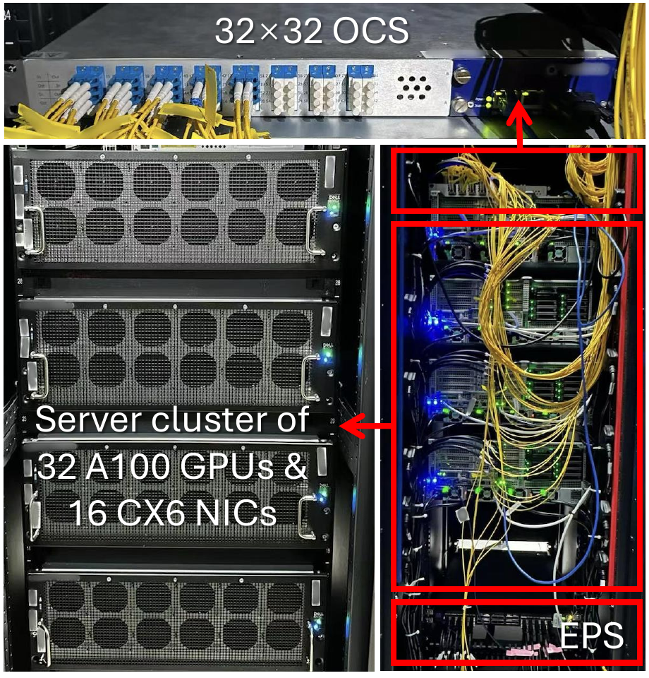
  <br><em>图 9：使用商用硬件构建的 MixNet testbed。</em>
</p>

**软件栈。** MixNet 软件栈使用约 6K 行 C++ 实现，包括拓扑生成器、OCS controller，以及支持训练中拓扑重构的定制集合通信运行时。对于静态 EPS fabric 上的 DP 和 PP 通信，MixNet 使用 NCCL [20] 提供高速主机内和跨主机 all-reduce/点到点通信。对于同时涉及 EPS 和 OCS 的 EP all-to-all 通信，定制集合通信运行时基于 FuseLink [50]，使用原始 `ibverbs` 库通过 RDMA 完成高速数据传输。作者还将 MixNet runtime 移植到 Python，以集成到 Megatron-LM [23] 并训练真实 MoE 模型。具体而言，作者实现了类似 `torch.dist` 的通信原语，并暴露为 `mixnet.all_to_all` 和 `mixnet.all_reduce`。

**训练先进 MoE 模型。** 作者使用该原型训练三个先进 MoE 模型，并与一个 baseline 配置比较：baseline 中全部 4 张 NIC 都连接到 Ethernet 交换机（理想交换机 baseline）。图 10 显示，MixNet 可达到与 4×100G EPS baseline 相当的性能。MixNet 使用 1 张 NIC 连接 EPS fabric，将剩余 3 张 NIC 配置到 optical circuit fabric 中（总计 12 个 optical port 和 4 个 electronic port）。相比之下，EPS baseline 在无阻塞 EPS fabric 中使用 4 张 100 Gbps ConnectX-6 NIC，总计 16 个 electronic port。MixNet 的性能来自其能力：在稀疏且非均匀的 all-to-all 流量中，为通信密集 pair 高效配置高带宽 optical circuit，同时不损害 DP 和 TP 流量传输速度。需要注意的是，MixNet 不改变 MoE 训练使用的并行策略，只通过架构设计和高效 circuit-switching 算法优化数据传输。因此，MixNet 不影响 MoE 模型训练精度。

<p align="center">
  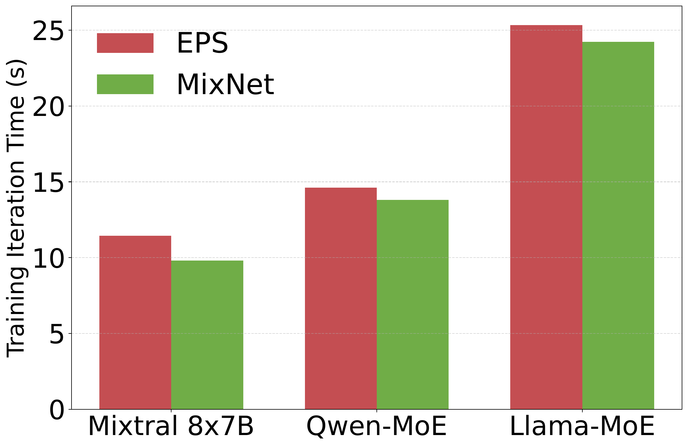
  <br><em>图 10：32 GPU 原型上的端到端训练迭代时间。</em>
</p>

## 7. 大规模仿真

本节通过大规模仿真评估 MixNet 性能。附录还探索了若干设计空间因素，例如网络可扩展性、EPS 链路选项以及重构延迟。

### 7.1 设置

**Packet-level 仿真方法。** 仿真过程分为两个阶段。首先，作者基于 FlexFlow [51] 开发 simulator，扩展 FlexFlow 以支持 pipeline parallelism，并校正其 profiler，使被 profile 的计算时间与 testbed 真实运行时间一致。simulator 输入 micro-batch size、MoE 模型和指定并行策略，生成描述集群计算与通信任务的 task DAG。随后，作者使用基于 `htsim` [52] 的 event-driven packet-level simulator，根据该 DAG 仿真 GPU 间 packet-based 通信。链路传播延迟设为 1 μs。每台 server 的 NIC 数和 GPU 数都设为 8，每张 NIC 带宽为 B。实验设置中，每台 server 有 8 块 GPU，通过高速 NVSwitch（900 GB/s）互连，并配有 8 张 NIC，反映生产环境中的典型配置。MoE 模型训练过程会跨多个迭代仿真。模型和并行策略细节见附录“大规模仿真细节”。

**被仿真的 GPU 互连 fabric。** 作者将 MixNet 与以下互连比较。

- MixNet（本文工作）：MixNet 中，每台 server 默认把 2 张 NIC 通过 Fat-tree 拓扑连接到 EPS fabric，剩余 6 张 NIC 连接到 OCS fabric。根据区域可重构高带宽域架构，OCS 只需连接单个 EP group 内的 GPU；在作者配置中最多为 64 块 GPU，可由商用 OCS 技术轻松支持（表 2）。对 forward pass 第一次 all-to-all，MixNet 在重构 OCS 时阻塞网络 25 ms；后续 all-to-all 的重构时间则隐藏在计算中。
- Fat-tree [14]：1:1 无阻塞 Fat-tree 网络。
- OverSub. Fat-tree：过订阅比为 3:1 的 Fat-tree 互连。
- Rail-optimized [21]：Nvidia 推荐使用的 GPU 互连。它不同于 Fat-tree，会把相同 rank 的 GPU 连接到同一个 ToR switch，从而为同一 rail 内 GPU 提供低延迟。
- TopoOpt [16]：先进光互连方案，通过联合优化模型并行和网络拓扑来最小化通信开销。对 TopoOpt，作者乐观地假设所有 NIC 都通过大型扁平 optical patch panel 连接。

### 7.2 网络成本分析

图 11 展示 MixNet 的成本分析。作者采用每台 server 含 8 块 GPU 的常见生产配置，并沿用 TopoOpt 的方法 [16]。网络成本在 100 Gbps 到 800 Gbps 链路带宽、不同集群规模下分析。需要注意的是，计算成本时只统计实际使用的 switch port 数，因为集群规模未必能完美适配某个合理 K 值的 Fat-tree 或 Rail-optimized 拓扑。各网络组件成本的更多细节见附录。

第一，相比无阻塞 Fat-tree 和 Rail-optimized 拓扑，MixNet 平均降低网络成本 2.0×，因为它用 OCS 互连组织高带宽域，而在高链路带宽下 OCS fabric 明显比 EPS fabric 便宜。具体如图 11c 所示，在 400 Gbps 下，MixNet 的 OCS fabric 平均比 Fat-tree 拓扑成本低 2.3×。

第二，作者承认，在 128 台 server（1024 块 GPU）规模下，MixNet 成本略高于 TopoOpt。这有两个原因：1) MixNet 需要 EPS fabric 来维持全网连通性；2) MixNet 的高带宽域假设使用毫秒级可重构 OCS 来适配运行时 MoE 流量，这比 TopoOpt 中重构较慢的 patch panel 更贵。不过，TopoOpt 若要形成超过 1K GPU 的网络，需要多层 patch panel fabric；这要求大量 patch panel 端口以及昂贵的长距 transceiver 来补偿多层光交换中的插入损耗。因此，TopoOpt 是否能互连这种大规模集群并保持成本效率仍不清楚。

<table align="center" style="margin-left:auto; margin-right:auto; width:100%;">
  <tr>
    <td align="center" style="width:50%; vertical-align:top;">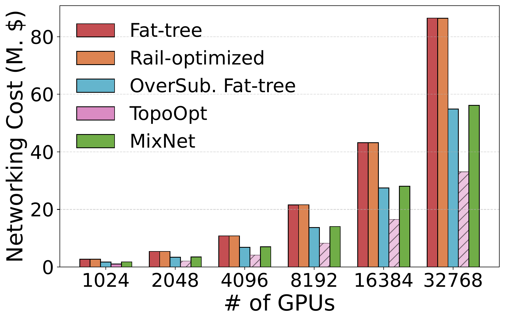<br><em>图 11a：100 Gbps。</em></td>
    <td align="center" style="width:50%; vertical-align:top;">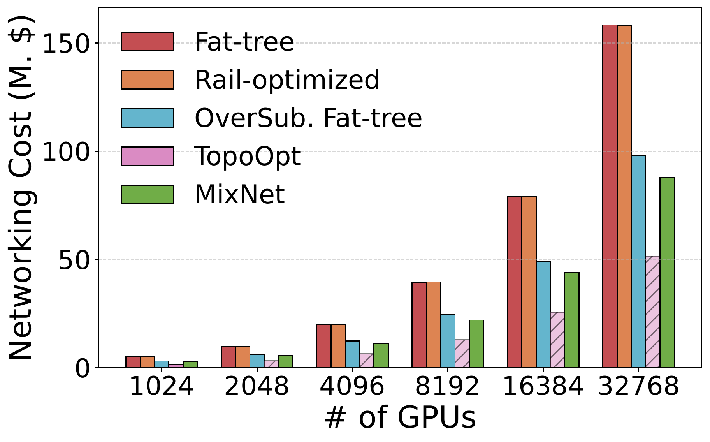<br><em>图 11b：200 Gbps。</em></td>
  </tr>
  <tr>
    <td align="center" style="width:50%; vertical-align:top;">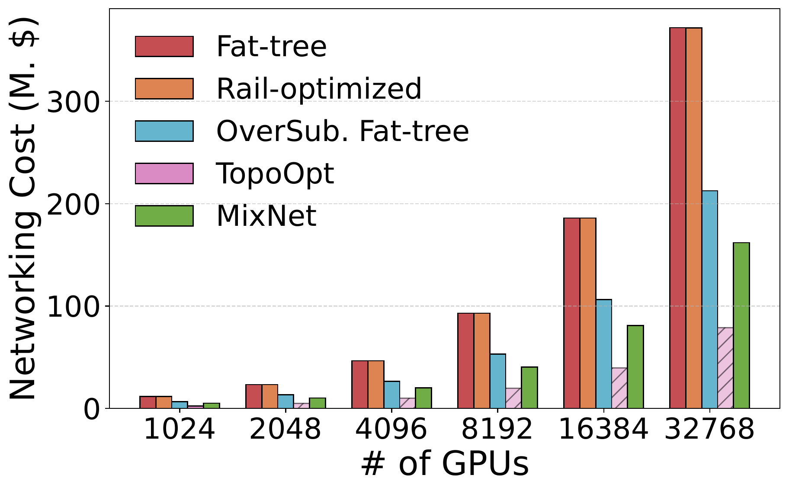<br><em>图 11c：400 Gbps。</em></td>
    <td align="center" style="width:50%; vertical-align:top;">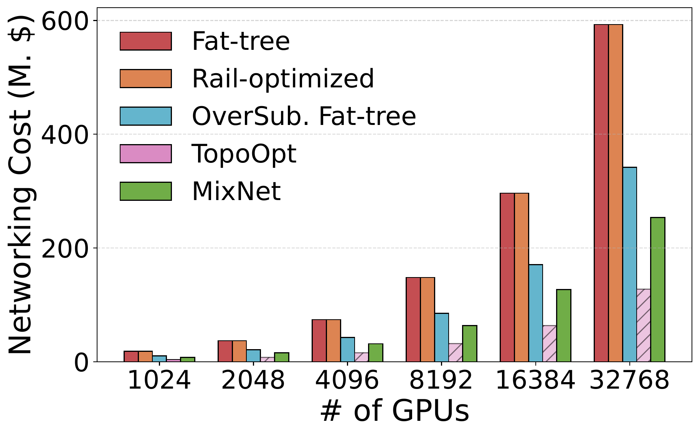<br><em>图 11d：800 Gbps。</em></td>
  </tr>
</table>

<p align="center"><em>图 11：仿真中的网络成本分析。</em></p>

### 7.3 性能：训练加速

本节比较 128 台 server、1024 块 GPU 集群中，MixNet 与其它互连在四个 MoE 模型上的端到端训练迭代时间。

图 12a 比较 Mixtral 8×22B 模型在不同互连上的训练迭代时间。得益于高效带宽分配，MixNet 的性能非常接近理想 Fat-tree 和 Rail-optimized 拓扑。尤其在 TP degree 为 8 时，MixNet 会在 all-to-all 通信期间为几乎所有高流量 server pair 提供直接 optical circuit（8 个 EP participant 对应 24 条 optical circuit）。相比 TopoOpt，MixNet 平均将训练迭代时间降低 1.5×，因为 TopoOpt 的静态拓扑无法适配实时流量变化。MixNet 也比过订阅 Fat-tree 最高快 1.6×。图 12b 中 Mixtral 8×7B 也呈现类似趋势，相比 TopoOpt，MixNet 平均将迭代时间降低 1.4×。两个 Mixtral 模型在 micro-batch size 为 8 时偏计算受限（图 3），因此增加链路带宽的收益递减；带宽越高，通信开销越小，MixNet 与其它方案之间的性能差距也缩小。更大 batch size 的 Mixtral 结果见附录。

图 12c 和图 12d 分别比较 MixNet 在 Qwen-MoE（32 个专家、32-way EP）和 DeepSeek-R1（256 个专家、64-way EP）上的表现。这两个模型的专家数和 EP degree 都高于 Mixtral。作者观察到，MixNet 性能可与 Rail-optimized 和 Fat-tree 相当，并且相比 TopoOpt，在 Qwen-MoE 上平均快 1.5×，在 DeepSeek-R1 上平均快 1.3×。与 Fat-tree 相比，当专家数增加时，MixNet 在低带宽下的性能差距略大，例如 Qwen-MoE 的 32 个专家对比 Mixtral 8×22B 的 8 个专家。这是因为更多带宽密集的 GPU pair 需要专用 optical circuit，略微超出 8-GPU 配置下 MixNet 默认 optical fanout（32 个 EP participant 对应 6 条 circuit）。不过，由于 EP 流量稀疏，随着链路带宽增加，MixNet 会缩小性能差距。作者还观察到，与 Qwen-MoE 不同，MixNet 在 DeepSeek-R1 上随着带宽增加获得的性能提升较小；原因是 DeepSeek-R1 虽然 EP degree 更高，但模型规模更大，通信与计算比更低，额外带宽收益更弱。

<table align="center" style="margin-left:auto; margin-right:auto; width:100%;">
  <tr>
    <td align="center" style="width:50%; vertical-align:top;">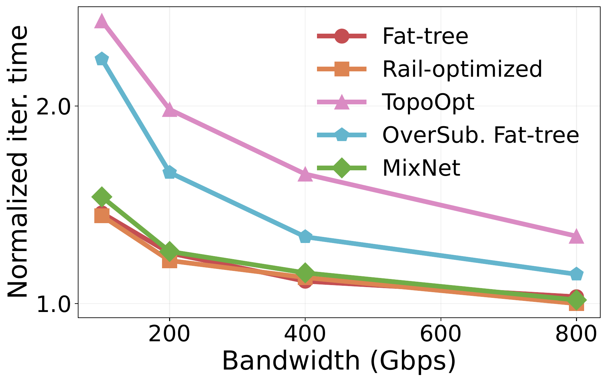<br><em>图 12a：Mixtral 8×22B。</em></td>
    <td align="center" style="width:50%; vertical-align:top;">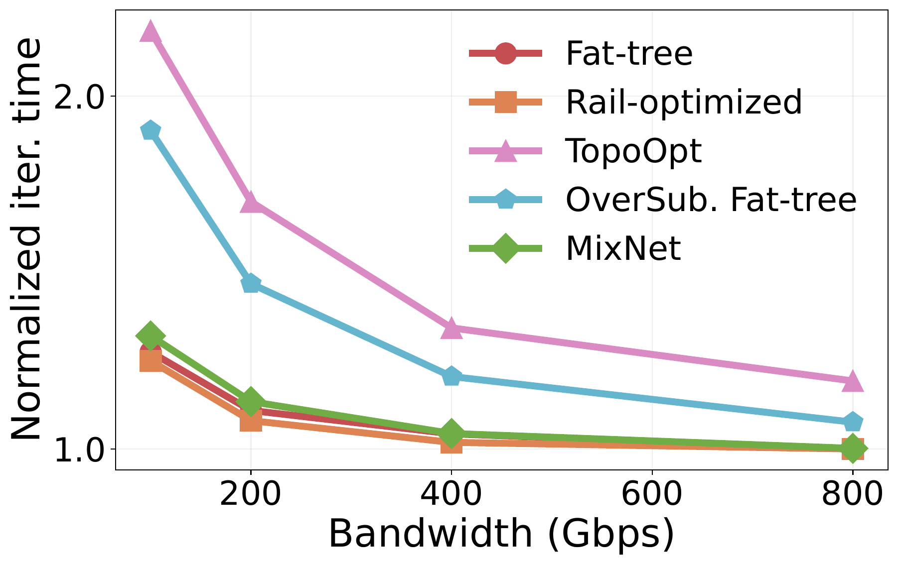<br><em>图 12b：Mixtral 8×7B。</em></td>
  </tr>
  <tr>
    <td align="center" style="width:50%; vertical-align:top;">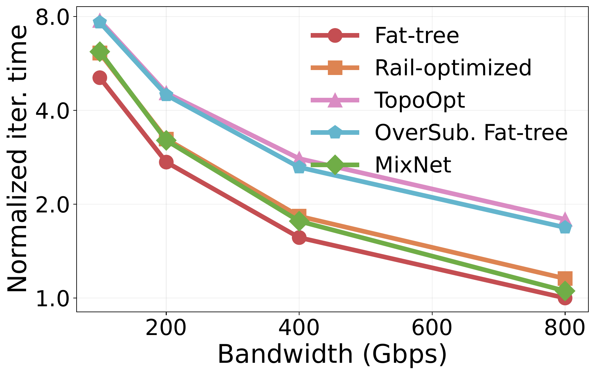<br><em>图 12c：Qwen-MoE。</em></td>
    <td align="center" style="width:50%; vertical-align:top;">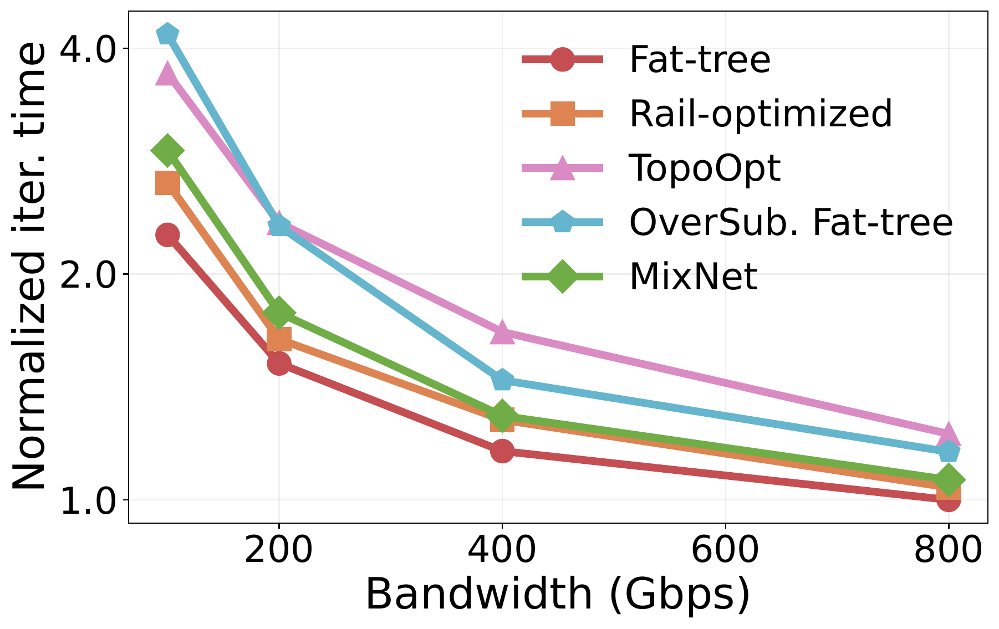<br><em>图 12d：DeepSeek-R1。</em></td>
  </tr>
</table>

<p align="center"><em>图 12：128 台 server、1024 块 GPU 集群中的训练加速仿真结果。</em></p>

### 7.4 成本效率：Pareto Front 分析

为了更好刻画网络成本与性能之间的权衡，作者在图 13 中给出不同互连的 Pareto Front 分析。这种方式避免偏向低成本但低性能的设计，例如 TopoOpt 或过订阅拓扑；这些设计虽然成本低，但实践上可能并不有用。作者观察到，在所有四个模型上，MixNet 都稳定构成 Pareto Front，并在成本效率上显著优于 Fat-tree 和 Rail-optimized。这里的成本效率定义为 performance-per-dollar，即训练迭代时间倒数按网络成本归一化。

在 100 Gbps 链路带宽下，相比 Fat-tree，MixNet 的成本效率提升 1.2× 到 1.5×，其中 Mixtral 8×7B 提升最高；相比 Rail-optimized，MixNet 提升 1.4× 到 1.5×。在 200 Gbps 下，优势扩大到相比 Fat-tree 提升 1.4× 到 1.8×，相比 Rail-optimized 提升 1.7× 到 1.9×。在 400 Gbps 网络中，MixNet 获得更高成本效率收益：Mixtral 8×7B 为 2.3×，Mixtral 8×22B 为 2.2×；对 DeepSeek-R1，MixNet 相比 Fat-tree 将训练成本效率提升 2.1×。

值得注意的是，MixNet 在不同链路带宽下都表现出很强成本效率。即使在面向未来的 800 Gbps 网络中，MixNet 仍保持相比 Fat-tree 2.0×–2.4×、相比 Rail-optimized 2.2×–2.6× 的优势。这些收益来自两个因素：1) MixNet 用 optical circuit 直接连接高流量区域 GPU pair，降低 Fat-tree 对大量电交换机和 optical transceiver 的需求；2) 与 Fat-tree 利用率不足的均匀二分带宽不同，MixNet 将资源分配匹配到 MoE 稀疏、非均匀通信模式，在削减硬件成本的同时保持高性能。

<table align="center" style="margin-left:auto; margin-right:auto; width:100%;">
  <tr>
    <td align="center" colspan="2" style="width:100%; vertical-align:top;"></td>
  </tr>
  <tr>
    <td align="center" style="width:50%; vertical-align:top;">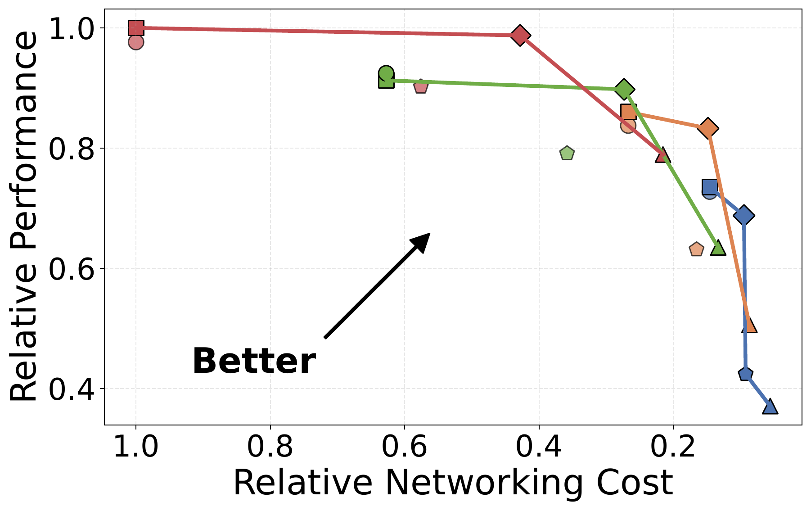<br><em>图 13b：Mixtral 8×22B。</em></td>
    <td align="center" style="width:50%; vertical-align:top;">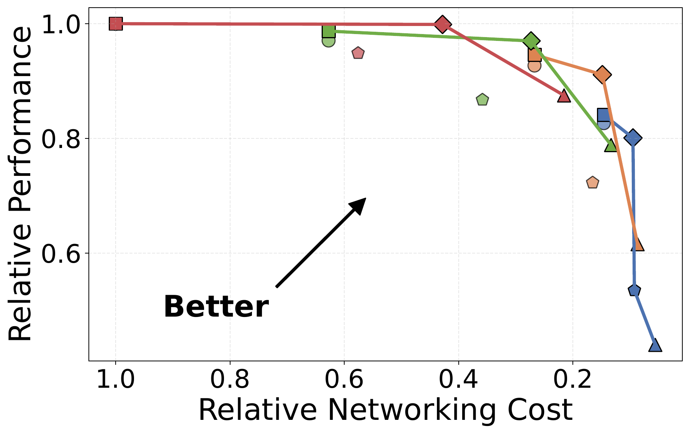<br><em>图 13c：Mixtral 8×7B。</em></td>
  </tr>
  <tr>
    <td align="center" style="width:50%; vertical-align:top;">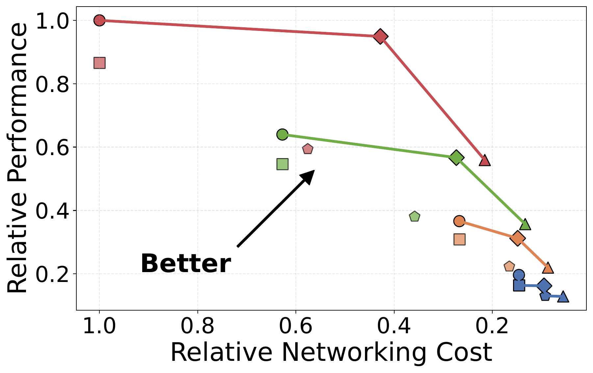<br><em>图 13d：Qwen-MoE。</em></td>
    <td align="center" style="width:50%; vertical-align:top;">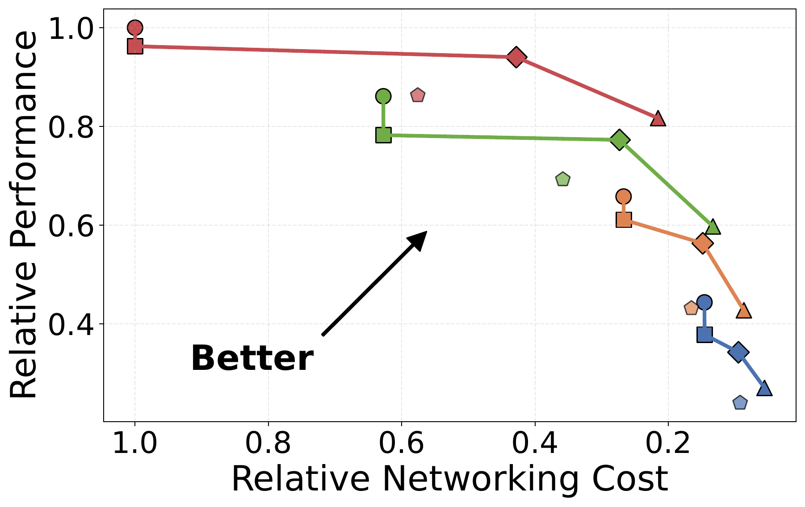<br><em>图 13e：DeepSeek-R1。</em></td>
  </tr>
</table>

<p align="center"><em>图 13：四个先进 MoE 模型上不同互连的性能-成本比较。</em></p>

### 7.5 故障韧性

沿着故障处理设计，作者在 1024-GPU 集群、400 Gbps 链路带宽下，使用 Mixtral 8×22B 和 DeepSeek-R1 模型评估不同故障场景对训练性能的影响。

**NIC 故障。** 图 14a 展示 MixNet 遇到 NIC 故障时的训练性能，此时系统使用间接转发绕过故障 NIC。作者观察到，MixNet 仍保持可接受性能，在 DeepSeek-R1 模型上的总训练时间仅增加 3.3%。这一较小开销来自系统内生的全网备份策略：EPS 与 OCS 可互为 fallback path，主机内 scale-up 域也提供足够转发带宽。

**GPU 故障。** 图 14b 展示 GPU 故障影响。例如，在 Mixtral 8×22B 中，通过区域备用 GPU 和 OCS-based indirect forwarding 绕过单 GPU 故障，会使总训练时间增加 5.1%。额外开销的原因是，Mixtral 8×22B 中的 TP 通信原本在主机内高带宽 scale-up 域中进行，绕过故障后却需要通过较低带宽的跨 server scale-out fabric。在更严重的整台 server 故障（8 块 GPU 全故障）中，性能下降更大，因为进出备用 GPU 的全部 EP 流量都必须经过两张相连 EPS NIC。类似地，在 DeepSeek-R1 中替换整台故障 GPU server 会带来 6.5% 的性能退化，原因是该场景下 EP 流量受限于备用节点的网络连接。

<table align="center">
  <tr>
    <td align="center" width="50%">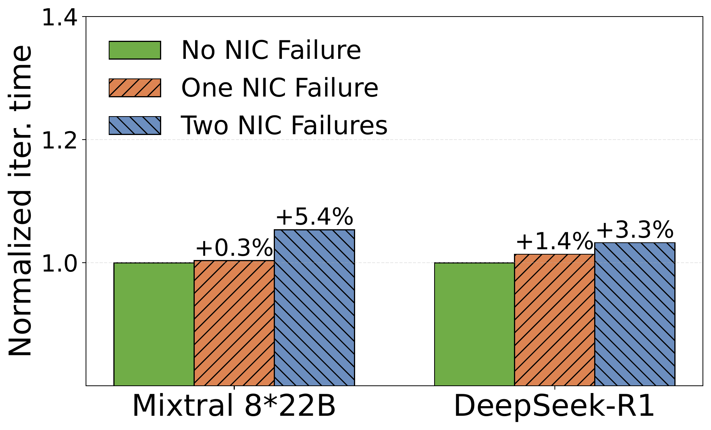<br><em>图 14a：NIC 故障。</em></td>
    <td align="center" width="50%">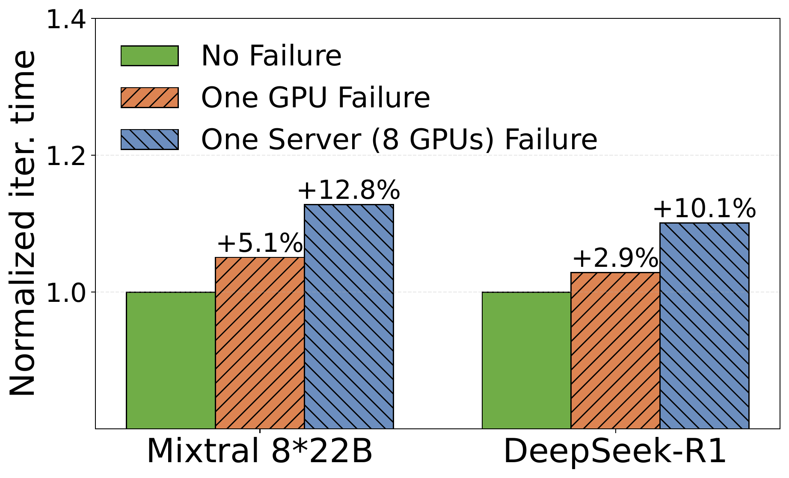<br><em>图 14b：GPU 故障。</em></td>
  </tr>
</table>

<p align="center"><em>图 14：MixNet 的故障韧性仿真。</em></p>

总体而言，MixNet 对网络和 GPU 故障都具有韧性，在评估场景中都能持续提供可接受性能。

## 8. 展望：高 Radix Scale-Up 域

到目前为止，MixNet 被讨论为一个生产可用系统，只使用商用 OCS（表 2）和不依赖本地 scale-up 高带宽域的网络设备（如 NIC、transceiver）。本节给出前瞻性研究，将 MixNet 概念扩展到新兴高 radix scale-up 域，例如 Nvidia GB200 NVL72 系统把 72 块 GPU 互连在单个 scale-up 高带宽域内 [28]。MixNet 可通过在 OCS 和 EPS 之间拆分 scale-out NIC 与 NVL72 配合。在这些系统中，EP all-to-all 通信在 scale-up 高带宽域中消耗的带宽高于 scale-out fabric。因此，与常规设置不同，作者考虑让区域 OCS 端口直接连接到 GPU chip，这由 co-packaged optical I/O [42, 33] 支持。基于此，作者设想 MixNet 演进为一种区域 OCS 架构，能直接从 xPU（如 GPU、TPU、NPU 等）接收光信号，如图 15 所示。这种光交换架构将支持长距、高速（例如 4 Tbps 或更高）的区域 fabric，位于 scale-up 与 scale-out 域边界，可提供比先进 NVL72 铜互连更大的交换 fabric。

<p align="center">
  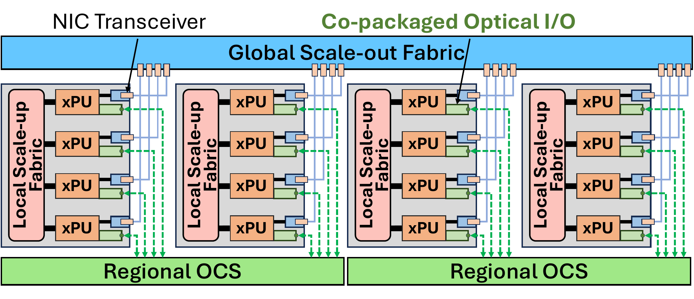
  <br><em>图 15：MixNet 通过 co-packaged optical ports 直接连接 xPU。</em>
</p>

作者使用 packet-level 仿真，将带 optical I/O 的 MixNet 与 Nvidia GB200 NVL72 [28] 比较训练迭代时间。仿真考虑一个 2048-GPU 集群训练先进 MoE 模型 DeepSeek-V3 [9]，EP degree 为 128，PP degree 为 16，micro-batch size 为 240；这些参数与 DeepSeek-V3 [9] 一致，但使用更大的 EP size 来探索更大的训练 batch size 和专家容量。NVL72 系统建模为 scale-up 域中每 GPU NVLink 带宽 7.2 Tbps [28, 53]，并配合 800 Gbps Ethernet 进行 scale-out 通信。作者将每个 NVL72 域内使用的 GPU 数设为 64，以满足并行分配约束；生产实践中通常只使用 NVL72 中 72 块 GPU 里的 64 块，因为训练并行度通常是 2 的幂。为保证公平比较，作者让 MixNet 的总 GPU 带宽与 NVL72 的 8 Tbps 匹配：800 Gbps 分配给 Ethernet，剩余带宽在 NVLink 和带 optical I/O 的 MixNet 区域 OCS 之间均分。

图 16 展示归一化训练迭代时间。作者观察到，带 optical I/O 的 MixNet 相比 NVL72 将迭代时间降低 1.3×，因为它把密集跨节点通信开销卸载到区域可重构 OCS；而 NVL72 必须使用 scale-out 网络进行跨节点传输。此外，即便下一代系统中 GPU 总 I/O 带宽扩展到 16 Tbps，MixNet 仍能继续提供性能收益。

<p align="center">
  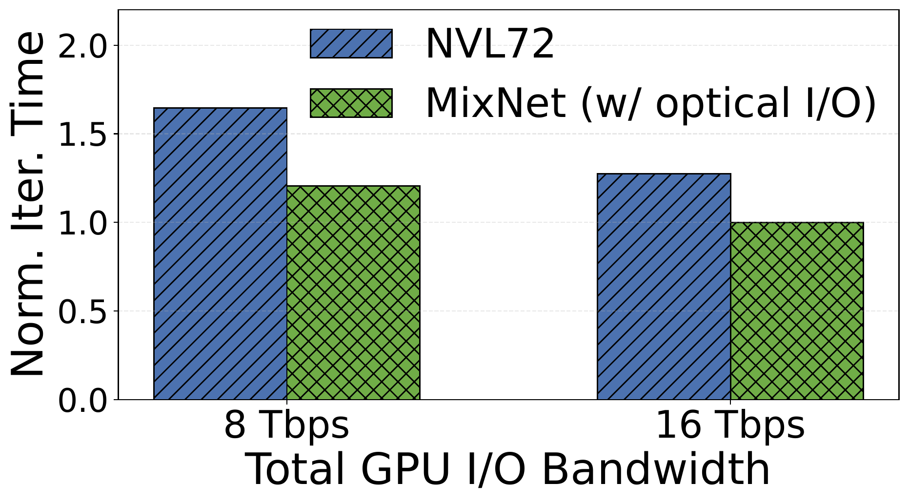
  <br><em>图 16：2048-GPU NVL72 系统集群中的性能比较。</em>
</p>

## 9. 讨论

**额外训练并行方式。** LLM 训练还可能使用其它并行方式，例如 context parallelism [54]，它优化 attention module 中长序列计算。值得注意的是，其流量是静态的，并且不与 EP all-to-all 通信重叠。MixNet 可以通过主机内 scale-up fabric 或可重构 OCS fabric 承载这类流量。

**模型扩展支持。** 当前 MoE 模型有两种扩展趋势。一方面，Mixtral（8×7B 和 8×22B）与 Grok-2 等近期模型包含少量巨大专家。这适合 MixNet 设计，因为每个可重构高带宽域内包含多个 scale-up 网络，可支持巨大的专家层。另一方面，一些模型 [5, 8, 9] 选择包含大量小专家。因此，EP all-to-all 通信半径不会随专家数线性增长，因为多个小专家会被打包到同一块 GPU 上以提升训练效率。例如，先进 MoE 模型 DeepSeek-V3 [9] 使用 EP degree 64 和 PP degree 16，可被 MixNet fabric 中多个 64-port OCS 容纳。

**NIC 光 fanout 选项。** 到目前为止，作者假设 MixNet 的 NIC 为连接区域可重构 OCS 的每个 TX/RX channel 配备专用端口。实践中，MixNet 架构也兼容其它 optical fanout 选项。例如，使用 optical circulator 的双向 transceiver 可以把 TX 和 RX 端口合并成一个 fiber port [55, 56]；optical breakout cable 可以把单个 MPO/MTP 端口中的多条 fiber channel 分离为独立 LC 连接 [57]。

**支持 MoE 之外的模型。** 虽然 MixNet 主要针对大规模 MoE 训练优化，但它也适用于其它非 MoE LLM，例如 GPT-3 和 LLaMA [58, 59]。MixNet 的核心收益是能在本地 scale-up 网络与全局 scale-out 网络之间的区域范围内，为非均匀流量模式重构网络拓扑。通过用可重构 OCS 模糊 scale-up 与 scale-out 的边界，MixNet 可以支持那些非 MoE LLM 中需要优化拓扑的非均匀流量。例如，ring-based topology 可比其它拓扑更高成本效率地服务 DP all-reduce 流量。同时，ML 社区正在提出一些基于 dense LLM 构建的非传统 MoE-like 模型，它们也会在区域尺度表现出非均匀流量 [60, 61]，这凸显了 MixNet 可重构拓扑对分布式训练的必要性。

**多租户训练支持。** 与传统小规模训练作业不同，工业实践中通常不希望在同一组 GPU 上运行多个并发 MoE 训练作业。例如，Alibaba HPN [47] 指出单个训练作业已经占用 3K GPU；Meta 分享了使用 15K GPU 训练 Llama-3 405B 的经验 [35]；DeepSeek-V3 使用 2K GPU 训练 [9]；xAI 披露其使用 100K GPU 训练 Grok 模型 [62]。不过，如果确有需要，MixNet 支持集群级多租户，因为其区域 OCS 高带宽域可被重构为每个小规模租户作业的隔离子网络。

**与其它 OCS 技术的兼容性。** MixNet 的区域重构设计与具体 OCS 技术选择正交。作者注意到新 OCS 技术正在出现，例如 iPronics [63]，可提供微秒级重构延迟以及与 MEMS-based OCS 可比的低端口成本。这为 MixNet 在 MoE 训练中为每个 all-to-all 通信阶段重构拓扑提供了机会，可在保持成本效率的同时进一步提升训练性能。此外，主文主要讨论能在网络核心主动切换光信号的 OCS 技术。其它新兴 OCS 技术，例如端点（transceiver）处的可调激光器配合基于 AWGR 的 optical switch，把可重构性推到网络端点并让网络核心保持 passive [40, 64, 65]，也与 MixNet 兼容。例如，为关键 expert pair 分配专用波长，可消除 all-to-all EP 通信的带宽竞争，同时为 TP 的 all-reduce 通信组织 ring-based topology。不过，这些 AWGR 和 endpoint-based OCS 主要仍处研究阶段，尚未达到大规模商用生产就绪，距离集成进当前计算系统还有较长路径。

## 10. 相关工作

**分布式训练网络架构。** 工业界和学术界已经提出了一系列用于大规模分布式训练的网络架构。ByteDance MegaScale [66] 使用基于 Clos 的拓扑互连超过 10,000 块 GPU。Meta [67] 分享了通过调优路由策略、优化集合操作和增强网络韧性来设计大规模 RoCE AI 训练网络的经验。Alibaba HPN [47] 引入 dual-plane 网络以增强故障韧性。Nvidia 开发了 Rail-optimized 网络 [21]，充分利用不同 fabric 的异构网络能力，并已在其计算集群中广泛采用。除这些工业方案外，学术界还提出了 Rail-only 设计，它为跨 rail GPU 移除核心交换层，但代价是降低 cross-rail 流量性能 [68]。

**面向分布式训练的可重构网络。** SiP-ML [41] 探索使用硅光为传统 DP 和 model-parallel 通信中的静态通信提供高带宽光互连。TopoOpt [16] 使用一次性 optical reconfigurable network，为分布式训练作业优化网络拓扑。就作者所知，MixNet 是首个使用商用硬件、面向 MoE 训练提出 optically reconfigurable network 的系统。

**可重构数据中心网络。** 数据中心可重构网络已经有数十年研究积累 [69, 70, 71, 72, 73, 40, 74, 75, 76, 77, 78, 79, 16, 80, 81, 82, 83, 84, 85, 86, 87, 88, 89, 90, 91]。这些方案面向通用数据中心网络，并未针对大规模 MoE 训练提供成本高效设计。特别是 RotorNet [77, 92] 和 Opera [78] 等 traffic-oblivious 方案无法为带宽密集的 all-to-all 流量及时交付传输，因此在 MoE 训练中表现次优。与此同时，Sirius [40] 这类硬件创新提供更快的光交换延迟，可让 MixNet 获得更快拓扑重构。Shoal [93] 在 rack-scale 网络中提出可重构电子 circuit switch，并不适合大规模 MoE 训练。

**数据中心中的 OCS 部署。** Google 是生产数据中心 OCS 技术部署的先行者。多年来，它们从电分组交换（EPS）逐步走向混合光电方案 [14, 32, 15, 94, 55, 56, 95]。早期 Jupiter [15] 使用 Clos 拓扑和 EPS 获得可扩展性与高带宽，但在功耗效率以及对动态 workload 的适配性上存在限制。后续 Jupiter Evolving [55] 引入 OCS 作为 EPS 补充，在混合架构中提升成本和功耗效率。最近 Google 的 Lightwave Fabrics [56] 使用可重构 MEMS-based OCS 为 TPU supercomputer 建立拓扑 [17]。它在训练前执行一次性拓扑重构，使拓扑在整个训练过程保持固定。相比之下，MixNet 提出训练期间的运行时拓扑重构，以适配动态 MoE 流量模式。此外，TPU 的光互连只重构 4×4×4 cube 之间的链路，而 OCS 重构期间 cube 内拓扑保持静态（3D Torus）。这种固定 cube 内结构不适合动态 all-to-all 通信，因为后者需要根据变化且稀疏的流量需求进行多跳转发 [17]。

**用于 scale-up 互连的 OCS。** MixNet 中的区域可重构 OCS 设计也可用于扩展 NVLink 和 NVSwitch 所提供的高带宽 circuit-switched 连接。例如，Lightmatter Passage 光互连 [33] 等前瞻技术可从 MixNet 中受益，在 chip 级别重构同一 EP group 内所有 GPU。这将支持高 radix on-chip photonic communication，并提供大量带宽来处理 MoE 训练中 TP 和 EP 的通信密集需求。

**新兴 OCS 硬件设备与系统。** 近期有一些工作提出面向 chip-to-chip 互连的 server-scale 新型 OCS 硬件 [33, 96, 97, 98]。作者强调，这些新兴设备需要系统级设计才能实用。类似其它系统级工作 [99]，MixNet 的区域 OCS 及其算法设计与这一活跃的新型 OCS 硬件探索方向兼容。

## 11. 结论

本文提出 MixNet，这是一种面向大规模 MoE 训练、使用商用硬件构建的新型可重构 fabric。MixNet 的核心是基于分布式 OCS 的区域可重构高带宽域设计与实现。通过 proof-of-concept 原型和大规模 packet 仿真，作者展示 MixNet 可提供与先进电互连和光互连相当的分布式训练性能，同时显著降低网络成本。

**伦理声明：** 本工作不引发任何伦理问题。

## 致谢

作者感谢匿名 SIGCOMM 评审以及 shepherd Alex C. Snoeren 提供的深刻反馈，也感谢 Haiyang Chen、Decang Sun、Jipeng Zhang 和 Polatis 团队对 testbed 构建的支持。本工作部分受 Hong Kong RGC TRS T41–603/20R、ITC ACCESS、TACC [100]、EmbedWay research project、北京市科技计划项目 No. Z241100004224023、NSFC Excellent Young Scientists Fund Program（Overseas）支持。Zhizhen Zhong 和 Kai Chen 为通讯作者。

附录为未经同行评审的支撑材料。

## 附录 A. 生产测量细节

### A.1 MoE 模型 Profiling

图 17 展示 LLaMA-MoE 和 Qwen-MoE 的 MoE layer profiling 结果。与 Mixtral 模型相比，EP 通信在这些模型中占比更高。例如，在 LLaMA-MoE 中，两次 all-to-all 通信阶段占迭代时间的 42%–58%；相比之下，Qwen-MoE 中 EP 通信更占主导，最高达到 68%。

<table align="center">
  <tr>
    <td align="center" width="50%">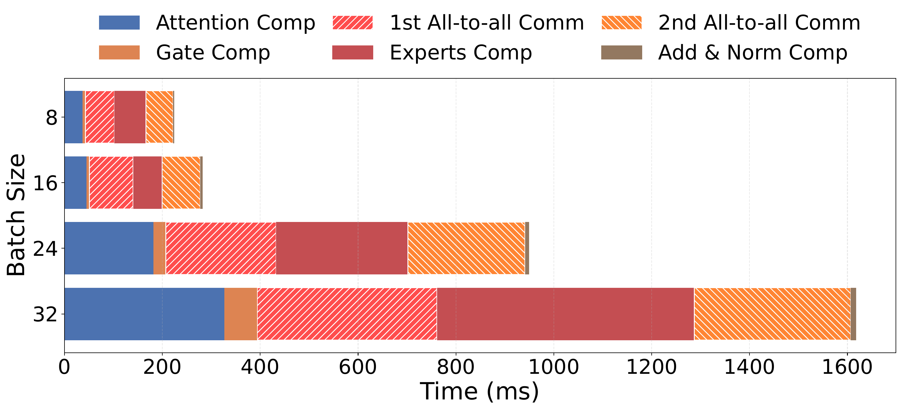<br><em>图 17a：LLaMA-MoE。</em></td>
    <td align="center" width="50%">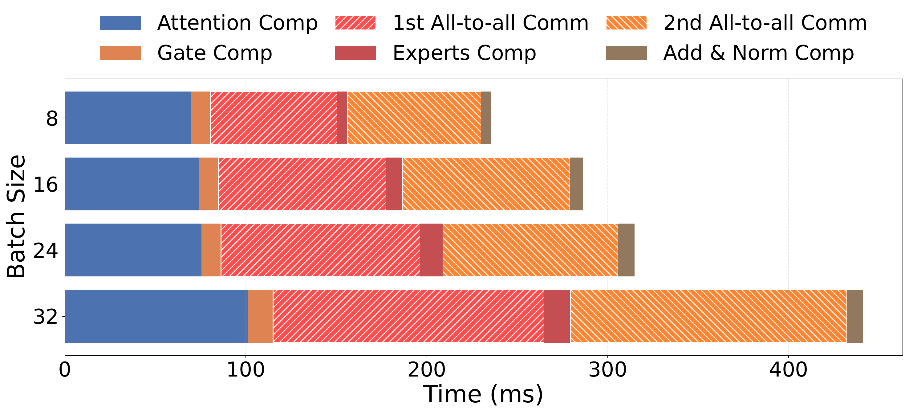<br><em>图 17b：Qwen-MoE。</em></td>
  </tr>
</table>

<p align="center"><em>图 17：MoE 模型时间线。</em></p>

### A.2 已训练 MoE 模型中的非均匀 Token 分布

作者测量了预训练 Mixtral 8×7B [101] 在 forward pass 中的 all-to-all token 分布，如图 18 所示。结果显示，被分发到每个专家的 token 数量是非均匀的，并且会随不同 MoE block 变化。这说明即使模型已经基本收敛，EP 中仍需要一种机制来适配动态流量。

<p align="center">
  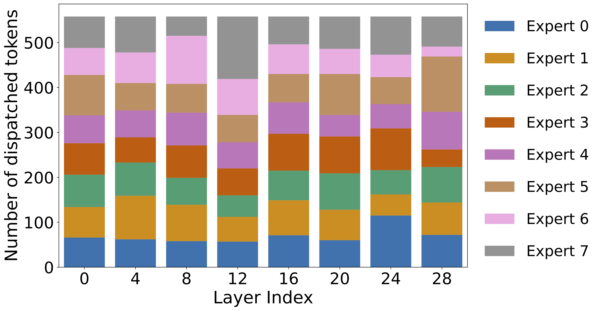
  <br><em>图 18：生产环境中 Mixtral 8×7B 跨 MoE block 的非均匀 token 分布。</em>
</p>

## 附录 B. 实现细节

### B.1 流量需求预测

MixNet 旨在通过预测方法处理 forward pass 中第一次 all-to-all 通信。默认情况下，这次初始通信的 OCS 拓扑要么随机生成，例如第一层中的第一次 all-to-all；要么保持为此前使用的拓扑，例如第二层中的第一次 all-to-all。流量需求预测算法预测流量矩阵的条件概率，即若 token 在上一层被 gate 到 expert i，那么它在当前层被 gate 到 expert j 的条件概率。基于该条件概率矩阵以及上一层的经验 token 分布，MixNet 可以预测当前层的流量分布。

**矩阵估计。** 对每个 layer，MixNet 使用近期迭代中的流量需求记录估计条件概率矩阵。它关注近期专家负载分布，并在固定时间窗口内对流量记录序列使用加权平均。对每个 layer，优化目标是最小化预测负载分布与真实值之间的平方误差；为简化表示，这里省略 layer index：

min over P: Σ(i=1..k) wᵢ · Σᵢ((Yᵢ - P Xᵢ)²)

其中 k 是窗口大小。转移矩阵 P 大小为 N × N，表示在已知上一层 expert load distribution 时，当前层 expert load distribution 的条件概率。Xᵢ 和 Yᵢ 是相邻两层的归一化 expert load distribution vector。P 中每个元素被约束在 0 到 1 范围内，每一列之和被约束为 1，以确保 P 是合法概率矩阵。

作者使用 Sequential Least Squares Programming（SLAP）方法进行优化，因为它适用于带线性约束的非线性问题。该算法通过 Python 中的 `scipy.optimize` 库实现。推理时，在已知第 i 层负载分布后，MixNet 可以提前预测下一层的 expert load distribution，用于其第一次 all-to-all 通信。

作者将该方法命名为 MixNet-Copilot。图 19 比较 MixNet-Copilot 与上述方法、随机分配 token 分布（均匀带宽分配）、以及不修改上一层 token 分布（unchanged topology）的预测准确率，数据来自测量 trace。Top-K accuracy 衡量 MixNet 是否能够找到 top-k 激活密集专家。结果显示，MixNet-Copilot 的准确率显著高于其它方法，说明它能以高概率找到 all-to-all 通信中最密集的 pair。因此，MixNet-Copilot 为提前主动重构 forward pass 第一次 all-to-all 拓扑提供了机会。

<p align="center">
  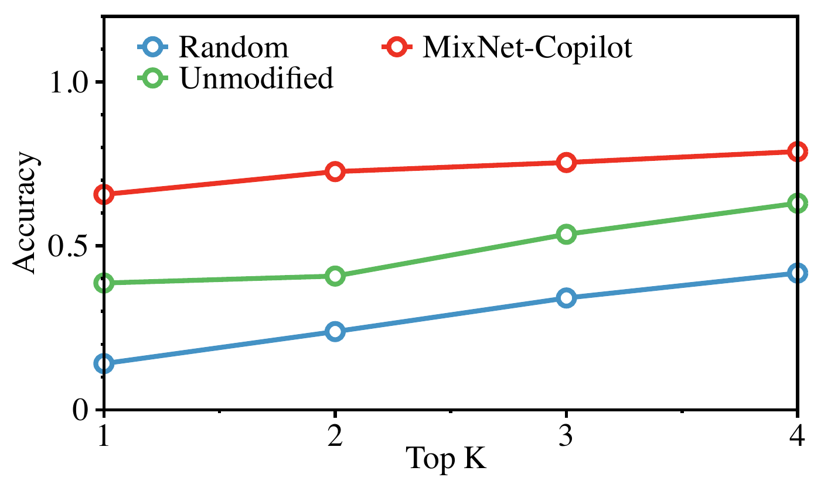
  <br><em>图 19：MixNet-Copilot 的平均预测准确率。</em>
</p>

### B.2 拓扑重构细节

图 20 展示 MixNet 的运行时重构方法。每个 MoE layer 包含四个 all-to-all 通信阶段。根据前文讨论，MixNet 可以确定性刻画 forward pass 第二次 all-to-all 以及 backward pass 两次 all-to-all 的流量模式。

因此，从概念上看，MixNet 每个 MoE layer 重构两次拓扑：forward pass 一次，backward pass 一次。不过，对于 forward pass 第一次 all-to-all，由于该迭代阶段缺少运行时信息，MixNet 无法提前完全刻画流量矩阵。为解决这一问题，MixNet 会基于部分估计执行一次不精确重构，或复用上一 layer 的拓扑；随后它会为 forward pass 第二次 all-to-all 通过小幅 OCS 调整重新校准拓扑，确保后续通信阶段配置更准确。

<p align="center">
  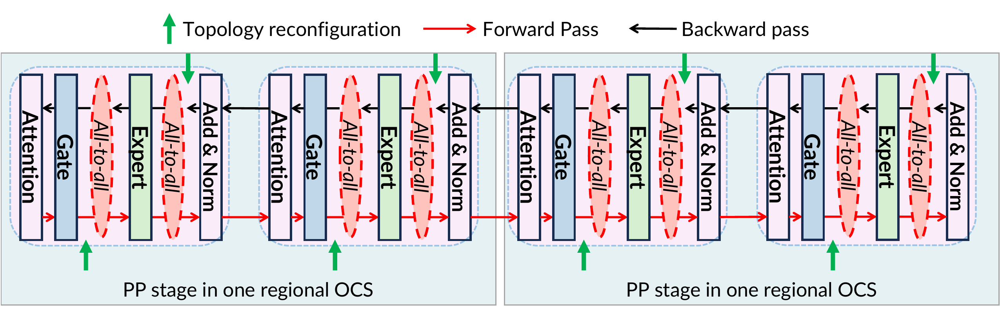
  <br><em>图 20：运行时重构时间线。</em>
</p>

## 附录 C. 原型细节

**原型 profiling。** 作者 profile 了 OCS 的整体重构 turnaround time，结果见图 21。OCS 通过 Ethernet 上的 TL1 命令控制。作者观察到，随着 pair 数增加，重构时间略有上升。1 个 pair 的平均重构时间约为 41.44 ms，4 个 pair 为 42.44 ms，16 个 pair 为 46.75 ms。99 分位重构时间分别约为 60 ms、62 ms 和 68 ms。值得注意的是，99% 的重构时间都低于 70 ms；考虑到实践中 MoE 专家计算时间通常较长，例如 batch size 16 时为 122 ms，这一延迟是可以接受的。

<p align="center">
  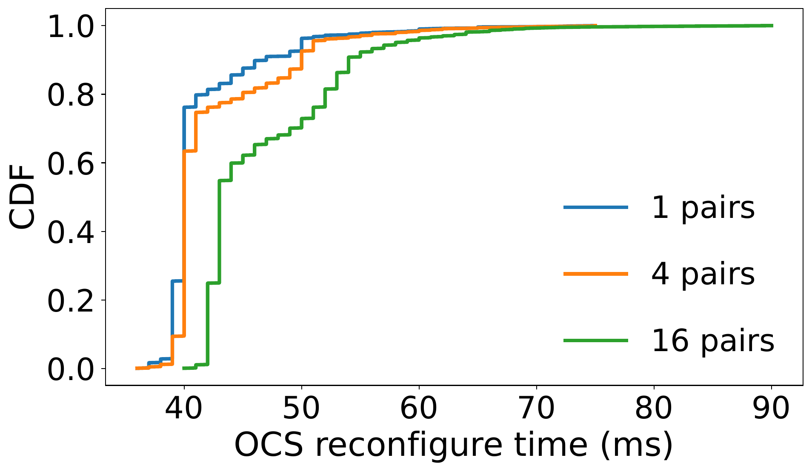
  <br><em>图 21：不同 pair 数量下的 OCS 重构延迟。</em>
</p>

图 22 展示从发出 OCS 重构控制命令到 RDMA send 成功完成的整体时间线，提供了控制过程的细节。该过程包括两个主要阶段：1) control server 向 OCS 发送重构命令；2) transceiver 和 NIC 初始化物理链路并设置网络设备。观察显示，一次重构的整体 turnaround time 主要受物理链路初始化和 NIC 设备初始化影响。

<p align="center">
  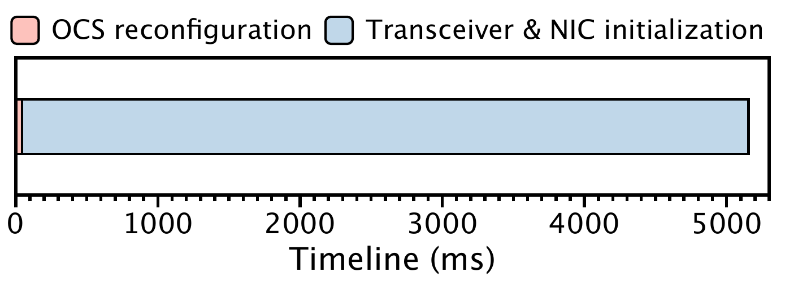
  <br><em>图 22：一次 OCS 控制的整体时间线。</em>
</p>

作者进一步绘制了从 OCS 重构完成到 NIC 变为 active 的时间 CDF，结果见图 23。平均 NIC activation time 约为 5.67 s，99 分位约为 6.33 s。这些发现与 RotorNet 实践观察 [92] 一致，说明一些商用 transceiver 和 NIC 尚未针对快速重构优化。作者与 transceiver vendor 讨论后确认，多秒级 NIC reactivation latency 不是根本限制，而是当前商用 transceiver module 未针对数据中心环境中的快速可重构光交换优化所导致。burst-mode transceiver [102, 103] 已经部署在接入网中的 passive optical network（PON）里，能够处理间歇上行传输，并支持快速 CDR locking 与信号恢复。因此，把 PON transceiver 中的 burst-mode 特性扩展到数据中心 transceiver，是工程问题而不是架构障碍。具体工程方向包括：1) 传统接收端 CDR 电路需要连续数据流来维持 CDR 状态。为避免 OCS 重构期间 loss-of-signal（LOS），optical transceiver 可在切换事件前配置为 local Tx/Rx loopback mode [104]，确保接收端在转换期间持续观察到有效信号。2) OCS 重构后，可使用 fast-locking CDR design [105] 优化 CDR 逻辑，使其在检测到新信号后快速恢复和重新同步。

<p align="center">
  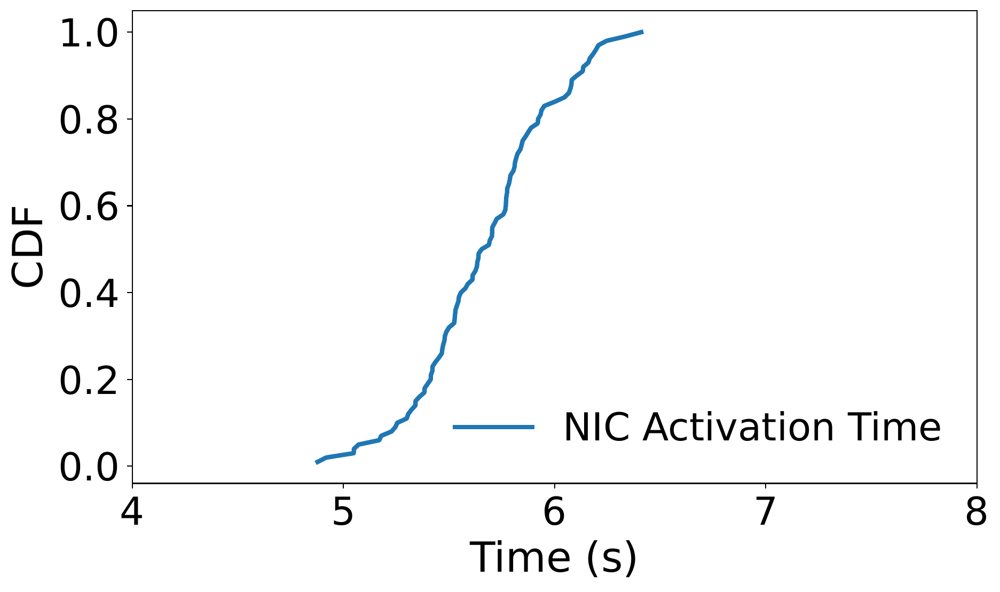
  <br><em>图 23：从 OCS 重构完成到 NIC 变为 active 的耗时 CDF。</em>
</p>

因此，在 testbed 实验中，作者当前排除了 NIC activation time 来计算实际训练时间。受 GPU 数量限制，作者无法训练表 1 中完整 MoE 模型，只运行 Mixtral 8×7B 的 7 层、LLaMA-MoE 的 16 层和 Qwen-MoE 的 12 层。

## 附录 D. 大规模仿真细节

### D.1 被仿真的 MoE 模型与并行策略

作者仿真四个 MoE 模型的训练过程：Mixtral 8×22B [106]、Mixtral 8×7B [3]、Qwen-MoE [5] 和 DeepSeek-R1 [10]。对 Mixtral 8×22B，作者使用 EP degree 8、TP degree 8、PP degree 8 的混合并行，序列长度 4096，micro-batch size 8。对 DeepSeek-R1，作者遵循 [10] 中默认训练并行设置，使用 64-way EP 和 16-way PP。其它模型复用表 1 中的配置。

### D.2 成本分析细节

表 4 列出了大规模仿真成本分析中使用的网络组件成本。作者复用 TopoOpt [16] 中 100G、200G 电交换机端口以及 NIC、OCS 端口、patch panel 端口价格，并补充 400 Gbps 和 800 Gbps 链路下的 transceiver、NIC 和电交换机端口价格。计算 fiber 成本时，作者也沿用 TopoOpt 的方法。

<p align="center"><em>表 4：网络组件成本。</em></p>

<table align="center" style="margin-left:auto; margin-right:auto; text-align:center;">
  <thead>
    <tr><th>链路带宽</th><th>Transceiver（美元）</th><th>NIC（美元）</th><th>电交换机端口（美元）</th><th>OCS 端口（美元）</th><th>Patch panel 端口（美元）</th></tr>
  </thead>
  <tbody>
    <tr><td>100 Gbps</td><td>99</td><td>659</td><td>187</td><td>520</td><td>100</td></tr>
    <tr><td>200 Gbps</td><td>239</td><td>1079</td><td>374</td><td>520</td><td>100</td></tr>
    <tr><td>400 Gbps</td><td>659</td><td>1499</td><td>1090</td><td>520</td><td>100</td></tr>
    <tr><td>800 Gbps</td><td>1399</td><td>2248</td><td>1400</td><td>520</td><td>100</td></tr>
  </tbody>
</table>

<p align="center"><em>注：800G NIC 产品尚未商用，表中保守估计为 400G NIC 价格的 1.5 倍。</em></p>

### D.3 不同 EPS 链路选项

MixNet 的 OCS 部分需要带 pluggable fiber 的 optical transceiver，以支持光交换。对 MixNet 的 EPS 部分，尤其是 server 到 ToR switch 的短距机架级链路，Direct Attach Copper（DAC）或 Active Optical Cable（AOC）通常比 optical transceiver 加 fiber 的组合更具成本效率；后者一般用于长距链路。作者在图 24 中分析这些链路选项的成本影响。结果显示，将 EPS 链路替换为 DAC 或 AOC，会稍微降低 Fat-tree 互连和 MixNet 的成本。更重要的是，MixNet 的成本效率与 EPS 链路选择正交，并继续保持相对 Fat-tree 的显著成本优势。例如，在 4096-GPU 集群中使用 400 Gbps DAC cable 时，MixNet 相比 Fat-tree 拓扑总成本降低 2.2×。

<p align="center">
  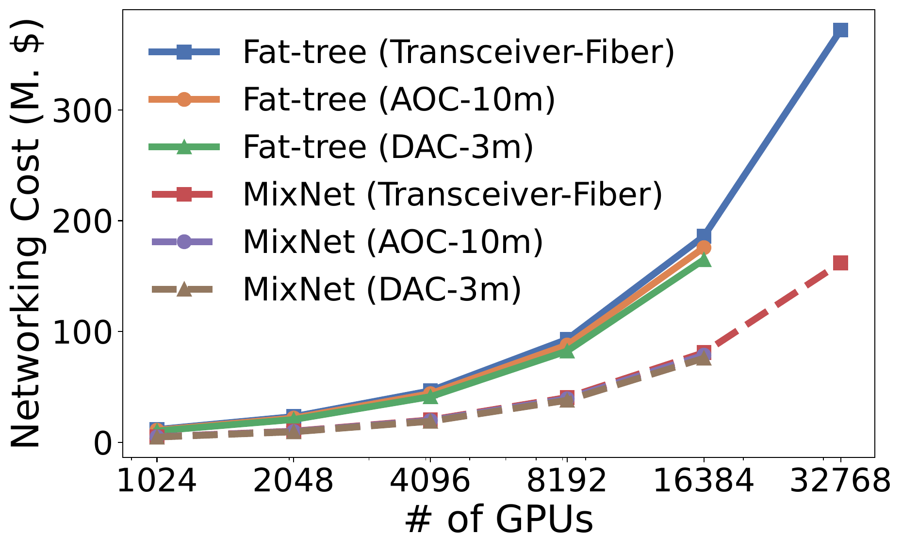
  <br><em>图 24：400 Gbps 带宽下不同 EPS 链路的成本比较。</em>
</p>

### D.4 更大 Batch Size 下 Mixtral 模型训练加速

作者进一步使用两个 Mixtral MoE 模型（Mixtral 8×7B 和 Mixtral 8×22B）评估 MixNet 在更大 batch size 下的性能。对每个模型，作者在不同网络带宽（100–800 Gbps）下测试 batch size 32 和 64。图 25 显示，MixNet 在所有配置下都稳定优于 TopoOpt。具体而言，随着训练相比图 12 的设置更通信密集，MixNet 在 Mixtral 8×7B、batch size 32 下获得平均 1.8× 加速，在 batch size 64 下获得平均 2.0× 加速。此外，随着链路带宽增加，MixNet 性能逐渐接近 Fat-tree 和 Rail-optimized 架构。

<table align="center" style="margin-left:auto; margin-right:auto; width:100%;">
  <tr>
    <td align="center" style="width:50%; vertical-align:top;">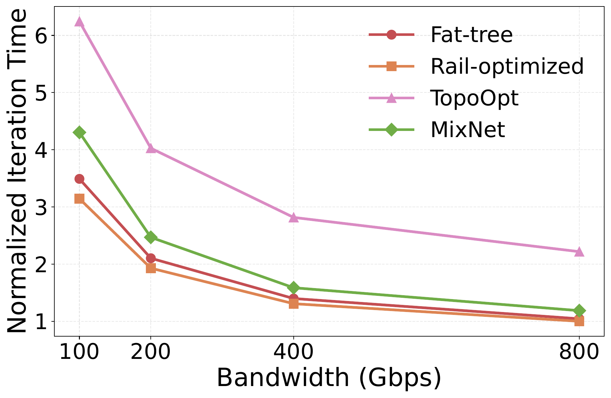<br><em>图 25a：Mixtral 8×22B，batch size 32。</em></td>
    <td align="center" style="width:50%; vertical-align:top;">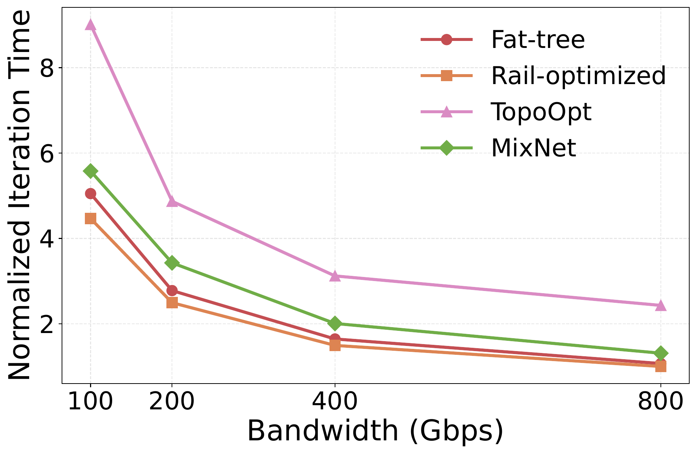<br><em>图 25b：Mixtral 8×22B，batch size 64。</em></td>
  </tr>
  <tr>
    <td align="center" style="width:50%; vertical-align:top;">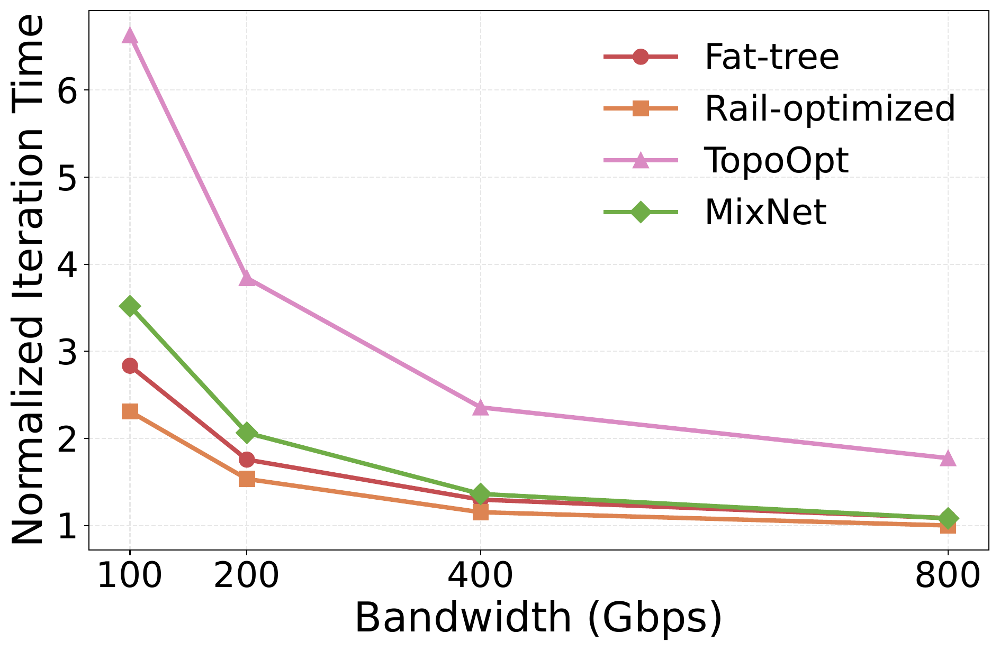<br><em>图 25c：Mixtral 8×7B，batch size 32。</em></td>
    <td align="center" style="width:50%; vertical-align:top;">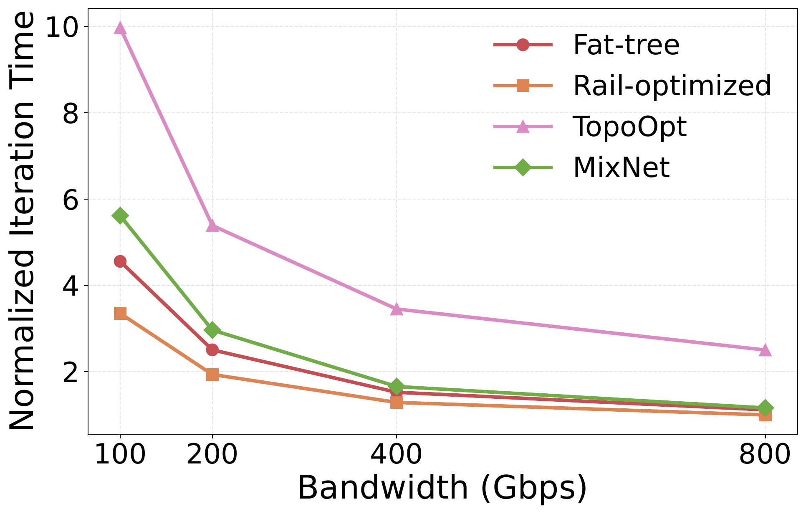<br><em>图 25d：Mixtral 8×7B，batch size 64。</em></td>
  </tr>
</table>

<p align="center"><em>图 25：大 batch size 下 Mixtral 模型的训练加速仿真。</em></p>

### D.5 可扩展性

作者在图 26 中展示 MixNet 的可扩展性。Mixtral 8×7B 在 400 Gbps 带宽下评估，集群规模从 128 台 server 到 4096 台 server，覆盖最多 32768 块 GPU。通过设计多个去中心化区域可重构域，MixNet 从根本上放宽 OCS 端口限制，使其能像 Fat-tree 拓扑一样扩展。结果显示，随着 GPU 数增加，MixNet 仍能有效扩展，在每秒处理 token 数上达到与无阻塞 Fat-tree 和 Rail-optimized 拓扑相当的训练吞吐。图 26b 进一步展示性能-成本比较：随着 GPU 数增加，MixNet 稳定获得更好的性能-成本权衡，相比 Fat-tree 和 Rail-optimized 约有 2× 更高的 performance-per-dollar。这说明即使集群规模增长，MixNet 仍能维持训练成本效率。

<table align="center">
  <tr>
    <td align="center" width="50%">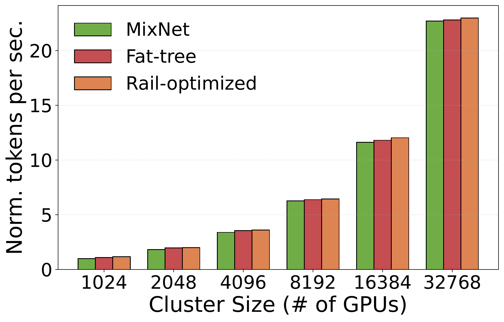<br><em>图 26a：性能比较。</em></td>
    <td align="center" width="50%">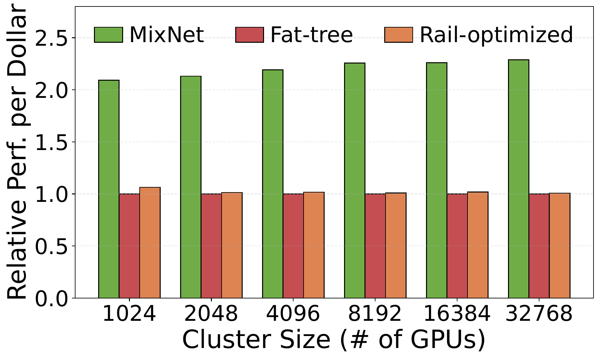<br><em>图 26b：性能-成本比较。</em></td>
  </tr>
</table>

<p align="center"><em>图 26：不同集群规模下 MixNet 的可扩展性分析。</em></p>

### D.6 Optical Degree 的影响

图 27 展示 optical degree 对 MixNet 性能的影响。作者在 128 台 server、100 Gbps 链路带宽的集群上评估 Mixtral 8×22B 模型。MixNet 中 optical degree α 被改变，以调节 OCS 连接性。为保证成本等价比较，当增加 electronic port 数量时，作者会降低每个 electronic port 的带宽。结果显示，随着 optical degree 增加，MixNet 进一步降低迭代时间，因为更多通信密集 GPU pair 可以获得专用高带宽 optical circuit。

<p align="center">
  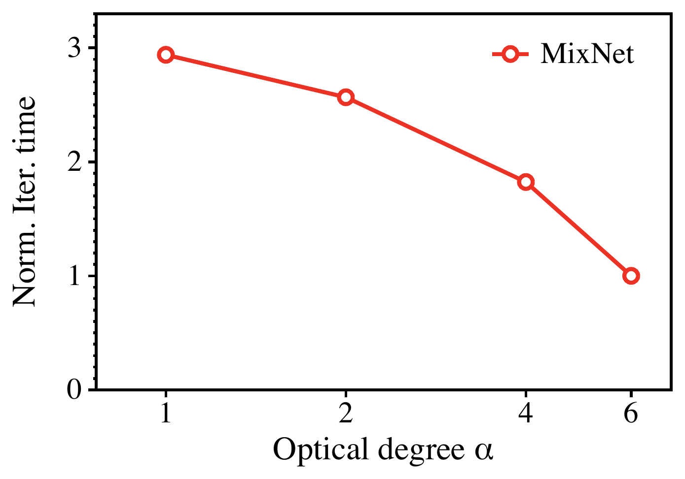
  <br><em>图 27：MixNet 中 optical degree alpha 的影响。</em>
</p>

### D.7 重构延迟的影响

为了研究 MixNet 对 OCS 重构延迟的敏感性，作者在 128 台 server、400 Gbps 链路带宽的集群上评估 Mixtral 8×22B 模型，并将重构延迟从 1 μs 改变到 10 s。图 28 展示归一化迭代时间。MixNet 当前实现假设使用毫秒级可重构 OCS（25 ms）。作者观察到，进一步降低重构延迟不会带来显著性能收益，因为 OCS 重构过程已经可以完全隐藏在计算阶段。不过，如果使用微秒级可重构 OCS，MixNet 可为 forward pass 第一次 all-to-all 执行完全准确的拓扑重构，从而在该特定阶段获得边际性能提升。另一方面，当重构延迟超过 1000 ms 时，性能会明显下降，因为 OCS 重构可能无法被隐藏并开始阻塞训练流程。因此，MixNet 不适合秒级可重构 OCS 系统。

<p align="center">
  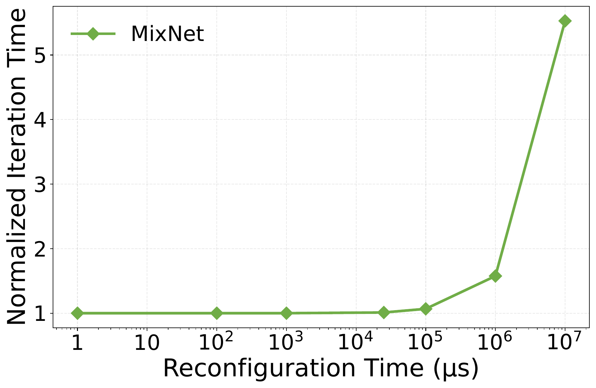
  <br><em>图 28：重构延迟的影响。</em>
</p>

## 参考文献

[1] Shazeer, Noam、Mirhoseini, Azalia、Maziarz, Krzysztof、Davis, Andy、Le, Quoc、Hinton, Geoffrey、Dean, Jeff。Outrageously large neural networks: The sparsely-gated mixture-of-experts layer。arXiv preprint arXiv:1701.06538。2017。

[2] Fedus, William、Zoph, Barret、Shazeer, Noam。Switch transformers: Scaling to trillion parameter models with simple and efficient sparsity。Journal of Machine Learning Research, 23(120): 1–39。2022。

[3] Mixtral of experts。未注明日期。URL: https://mistral.ai/news/mixtral-of-experts/。

[4] Tong Zhu、Xiaoye Qu、Daize Dong、Jiacheng Ruan、Jingqi Tong、Conghui He、Yu Cheng。LLaMA-MoE: Building Mixture-of-Experts from LLaMA with Continual Pre-training。arXiv preprint arXiv:2406.16554。2024。URL: https://arxiv.org/abs/2406.16554。

[5] Qwen1.5-MoE-A2.7B。未注明日期。URL: https://huggingface.co/Qwen/Qwen1.5-MoE-A2.7B。

[6] Grok。未注明日期。URL: https://x.ai/blog/grok-1.5v。

[7] XVERSE-MoE-A36B MoE base model。未注明日期。URL: https://huggingface.co/xverse/XVERSE-MoE-A36B。

[8] DeepSeek-AI、Aixin Liu、Bei Feng、Bin Wang、Bingxuan Wang、Bo Liu、Chenggang Zhao、Chengqi Dengr、Chong Ruan、Damai Dai、Daya Guo、Dejian Yang、Deli Chen、Dongjie Ji、Erhang Li、Fangyun Lin、Fuli Luo、Guangbo Hao、Guanting Chen、Guowei Li、H. Zhang、Hanwei Xu、Hao Yang、Haowei Zhang、Honghui Ding、Huajian Xin、Huazuo Gao、Hui Li、Hui Qu、J. L. Cai、Jian Liang、Jianzhong Guo、Jiaqi Ni、Jiashi Li、Jin Chen、Jingyang Yuan、Junjie Qiu、Junxiao Song、Kai Dong、Kaige Gao、Kang Guan、Lean Wang、Lecong Zhang、Lei Xu、Leyi Xia、Liang Zhao、Liyue Zhang、Meng Li、Miaojun Wang、Mingchuan Zhang、Minghua Zhang、Minghui Tang、Mingming Li、Ning Tian、Panpan Huang、Peiyi Wang、Peng Zhang、Qihao Zhu、Qinyu Chen、Qiushi Du、R. J. Chen、R. L. Jin、Ruiqi Ge、Ruizhe Pan、Runxin Xu、Ruyi Chen、S. S. Li、Shanghao Lu、Shangyan Zhou、Shanhuang Chen、Shaoqing Wu、Shengfeng Ye、Shirong Ma、Shiyu Wang、Shuang Zhou、Shuiping Yu、Shunfeng Zhou、Size Zheng、T. Wang、Tian Pei、Tian Yuan、Tianyu Sun、W. L. Xiao、Wangding Zeng、Wei An、Wen Liu、Wenfeng Liang、Wenjun Gao、Wentao Zhang、X. Q. Li、Xiangyue Jin、Xianzu Wang、Xiao Bi、Xiaodong Liu、Xiaohan Wang、Xiaojin Shen、Xiaokang Chen、Xiaosha Chen、Xiaotao Nie、Xiaowen Sun、Xiaoxiang Wang、Xin Liu、Xin Xie、Xingkai Yu、Xinnan Song、Xinyi Zhou、Xinyu Yang、Xuan Lu、Xuecheng Su、Y. Wu、Y. K. Li、Y. X. Wei、Y. X. Zhu、Yanhong Xu、Yanping Huang、Yao Li、Yao Zhao、Yaofeng Sun、Yaohui Li、Yaohui Wang、Yi Zheng、Yichao Zhang、Yiliang Xiong、Yilong Zhao、Ying He、Ying Tang、Yishi Piao、Yixin Dong、Yixuan Tan、Yiyuan Liu、Yongji Wang、Yongqiang Guo、Yuchen Zhu、Yuduan Wang、Yuheng Zou、Yukun Zha、Yunxian Ma、Yuting Yan、Yuxiang You、Yuxuan Liu、Z. Z. Ren、Zehui Ren、Zhangli Sha、Zhe Fu、Zhen Huang、Zhen Zhang、Zhenda Xie、Zhewen Hao、Zhihong Shao、Zhiniu Wen、Zhipeng Xu、Zhongyu Zhang、Zhuoshu Li、Zihan Wang、Zihui Gu、Zilin Li、Ziwei Xie。DeepSeek-V2: A Strong, Economical, and Efficient Mixture-of-Experts Language Model。2024。arXiv:2405.04434。URL: https://arxiv.org/abs/2405.04434。

[9] DeepSeek-V3。未注明日期。URL: https://github.com/deepseek-ai/DeepSeek-V3/blob/main/DeepSeek_V3.pdf。

[10] DeepSeek-AI、Daya Guo、Dejian Yang、Haowei Zhang、Junxiao Song、Ruoyu Zhang、Runxin Xu、Qihao Zhu、Shirong Ma、Peiyi Wang、Xiao Bi、Xiaokang Zhang、Xingkai Yu、Yu Wu、Z. F. Wu、Zhibin Gou、Zhihong Shao、Zhuoshu Li、Ziyi Gao、Aixin Liu、Bing Xue、Bingxuan Wang、Bochao Wu、Bei Feng、Chengda Lu、Chenggang Zhao、Chengqi Deng、Chenyu Zhang、Chong Ruan、Damai Dai、Deli Chen、Dongjie Ji、Erhang Li、Fangyun Lin、Fucong Dai、Fuli Luo、Guangbo Hao、Guanting Chen、Guowei Li、H. Zhang、Han Bao、Hanwei Xu、Haocheng Wang、Honghui Ding、Huajian Xin、Huazuo Gao、Hui Qu、Hui Li、Jianzhong Guo、Jiashi Li、Jiawei Wang、Jingchang Chen、Jingyang Yuan、Junjie Qiu、Junlong Li、J. L. Cai、Jiaqi Ni、Jian Liang、Jin Chen、Kai Dong、Kai Hu、Kaige Gao、Kang Guan、Kexin Huang、Kuai Yu、Lean Wang、Lecong Zhang、Liang Zhao、Litong Wang、Liyue Zhang、Lei Xu、Leyi Xia、Mingchuan Zhang、Minghua Zhang、Minghui Tang、Meng Li、Miaojun Wang、Mingming Li、Ning Tian、Panpan Huang、Peng Zhang、Qiancheng Wang、Qinyu Chen、Qiushi Du、Ruiqi Ge、Ruisong Zhang、Ruizhe Pan、Runji Wang、R. J. Chen、R. L. Jin、Ruyi Chen、Shanghao Lu、Shangyan Zhou、Shanhuang Chen、Shengfeng Ye、Shiyu Wang、Shuiping Yu、Shunfeng Zhou、Shuting Pan、S. S. Li、Shuang Zhou、Shaoqing Wu、Shengfeng Ye、Tao Yun、Tian Pei、Tianyu Sun、T. Wang、Wangding Zeng、Wanjia Zhao、Wen Liu、Wenfeng Liang、Wenjun Gao、Wenqin Yu、Wentao Zhang、W. L. Xiao、Wei An、Xiaodong Liu、Xiaohan Wang、Xiaokang Chen、Xiaotao Nie、Xin Cheng、Xin Liu、Xin Xie、Xingchao Liu、Xinyu Yang、Xinyuan Li、Xuecheng Su、Xuheng Lin、X. Q. Li、Xiangyue Jin、Xiaojin Shen、Xiaosha Chen、Xiaowen Sun、Xiaoxiang Wang、Xinnan Song、Xinyi Zhou、Xianzu Wang、Xinxia Shan、Y. K. Li、Y. Q. Wang、Y. X. Wei、Yang Zhang、Yanhong Xu、Yao Li、Yao Zhao、Yaofeng Sun、Yaohui Wang、Yi Yu、Yichao Zhang、Yifan Shi、Yiliang Xiong、Ying He、Yishi Piao、Yisong Wang、Yixuan Tan、Yiyang Ma、Yiyuan Liu、Yongqiang Guo、Yuan Ou、Yuduan Wang、Yue Gong、Yuheng Zou、Yujia He、Yunfan Xiong、Yuxiang Luo、Yuxiang You、Yuxuan Liu、Yuyang Zhou、Y. X. Zhu、Yanhong Xu、Yanping Huang、Yaohui Li、Yi Zheng、Yuchen Zhu、Yunxian Ma、Ying Tang、Yukun Zha、Yuting Yan、Z. Z. Ren、Zehui Ren、Zhangli Sha、Zhe Fu、Zhean Xu、Zhenda Xie、Zhengyan Zhang、Zhewen Hao、Zhicheng Ma、Zhigang Yan、Zhiyu Wu、Zihui Gu、Zijia Zhu、Zijun Liu、Zilin Li、Ziwei Xie、Ziyang Song、Zizheng Pan、Zhen Huang、Zhipeng Xu、Zhongyu Zhang、Zhen Zhang。DeepSeek-R1: Incentivizing Reasoning Capability in LLMs via Reinforcement Learning。2025。arXiv:2501.12948。URL: https://arxiv.org/abs/2501.12948。

[11] Qwen Team。Qwen2.5 technical report。arXiv preprint arXiv:2412.15115。2024。

[12] NVIDIA NVSwitch Technical Overview。未注明日期。URL: https://images.nvidia.com/content/pdf/nvswitch-technical-overview.pdf。

[13] NVIDIA NVLink and NVLink Switch。未注明日期。URL: https://www.nvidia.com/en-us/data-center/nvlink/。

[14] Al-Fares, Mohammad、Loukissas, Alexander、Vahdat, Amin。A scalable, commodity data center network architecture。In ACM SIGCOMM Computer Communication Review, pp. 63–74。2008。

[15] Singh, Arjun、Ong, Joon、Agarwal, Amit、Anderson, Glen、Armistead, Ashby、Bannon, Roy、Boving, Seb、Desai, Gaurav、Felderman, Bob、Germano, Paulie、Kanagala, Anand、Provost, Jeff、Simmons, Jason、Tanda, Eiichi、Wanderer, Jim、Hölzle, Urs、Stuart, Stephen、Vahdat, Amin。Jupiter Rising: A Decade of Clos Topologies and Centralized Control in Google's Datacenter Network。In Proceedings of the 2015 ACM Conference on Special Interest Group on Data Communication。2015。URL: https://doi.org/10.1145/2785956.2787508。

[16] Weiyang Wang、Moein Khazraee、Zhizhen Zhong、Manya Ghobadi、Zhihao Jia、Dheevatsa Mudigere、Ying Zhang、Anthony Kewitsch。TopoOpt: Co-optimizing Network Topology and Parallelization Strategy for Distributed Training Jobs。In 20th USENIX Symposium on Networked Systems Design and Implementation (NSDI 23), pp. 739–767。2023。URL: https://www.usenix.org/conference/nsdi23/presentation/wang-weiyang。

[17] Jouppi, Norm、Kurian, George、Li, Sheng、Ma, Peter、Nagarajan, Rahul、Nai, Lifeng、Patil, Nishant、Subramanian, Suvinay、Swing, Andy、Towles, Brian、others。Tpu v4: An optically reconfigurable supercomputer for machine learning with hardware support for embeddings。In Proceedings of the 50th Annual International Symposium on Computer Architecture, pp. 1–14。2023。

[18] NVIDIA Mellanox MCX515A-CCAT ConnectX®-5 EN Network Interface Card, 100GbE Single-Port QSFP28。未注明日期。URL: https://www.fs.com/products/119648.html。

[19] Polatis Optical Switches。未注明日期。URL: http://www.polatis.com/series-7000-384x384-port-software-controlled-optical-circuit-switch-sdn-enabled.asp。

[20] NVIDIA Collective Communications Library (NCCL)。未注明日期。URL: https://developer.nvidia.com/nccl。

[21] Doubling all2all Performance with NVIDIA Collective Communication Library 2.12。未注明日期。URL: https://developer.nvidia.com/blog/doubling-all2all-performance-with-nvidia-collective-communication-library-2-12/。

[22] Li, Shen、Zhao, Yanli、Varma, Rohan、Salpekar, Omkar、Noordhuis, Pieter、Li, Teng、Paszke, Adam、Smith, Jeff、Vaughan, Brian、Damania, Pritam、others。Pytorch distributed: Experiences on accelerating data parallel training。arXiv preprint arXiv:2006.15704。2020。

[23] Mohammad Shoeybi、Mostofa Patwary、Raul Puri、Patrick LeGresley、Jared Casper、Bryan Catanzaro。Megatron-LM: Training Multi-Billion Parameter Language Models Using Model Parallelism。2020。arXiv:1909.08053。URL: https://arxiv.org/abs/1909.08053。

[24] Narayanan, Deepak、Harlap, Aaron、Phanishayee, Amar、Seshadri, Vivek、Devanur, Nikhil R、Ganger, Gregory R、Gibbons, Phillip B、Zaharia, Matei。PipeDream: Generalized pipeline parallelism for DNN training。In Proceedings of the 27th ACM symposium on operating systems principles, pp. 1–15。2019。

[25] Lepikhin, Dmitry、Lee, HyoukJoong、Xu, Yuanzhong、Chen, Dehao、Firat, Orhan、Huang, Yanping、Krikun, Maxim、Shazeer, Noam、Chen, Zhifeng。Gshard: Scaling giant models with conditional computation and automatic sharding。arXiv preprint arXiv:2006.16668。2020。

[26] Liu, Juncai、Wang, Jessie Hui、Jiang, Yimin。Janus: A unified distributed training framework for sparse mixture-of-experts models。In Proceedings of the ACM SIGCOMM 2023 Conference, pp. 486–498。2023。

[27] Li, Wenxue、Liu, Xiangzhou、Li, Yuxuan、Jin, Yilun、Tian, Han、Zhong, Zhizhen、Liu, Guyue、Zhang, Ying、Chen, Kai。Understanding communication characteristics of distributed training。In Proceedings of the 8th Asia-Pacific Workshop on Networking, pp. 1–8。2024。

[28] NVIDIA GB200 NVL72 Delivers Trillion-Parameter LLM Training and Real-Time Inference。未注明日期。URL: https://developer.nvidia.com/blog/nvidia-gb200-nvl72-delivers-trillion-parameter-llm-training-and-real-time-inference/。

[29] Guo, Chuanxiong、Wu, Hui、Tan, Kai、Shiy, Lei、Zhang, Yongguang、Lu, Songnian。Bcube: A high performance, server-centric network architecture for modular data centers。In ACM SIGCOMM Computer Communication Review, pp. 63–74。2009。

[30] Guo, Chuanxiong、Wu, Hui、Tan, Kai、Shiy, Lei、Zhang, Yongguang、Lu, Songnian。Dcell: A scalable and fault-tolerant network structure for data centers。In ACM SIGCOMM Computer Communication Review, pp. 63–74。2010。

[31] Greenberg, Albert、Hamilton, James R、Jain, Navendu、Kandula, Srikanth、Kim, Changhoon、Lahiri, Parantap、Maltz, David A、Patel, Parveen、Sengupta, Sushant、Rexford, Jennifer、others。VL2: A scalable and flexible data center network。In ACM SIGCOMM Computer Communication Review, pp. 51–62。2009。

[32] Jain, Sushant、Kumar, Alok、Mandal, Subhasree、Ong, Joon、Poutievski, Leon、Singh, Arjun、Venkata, Subbaiah、Wanderer, Jim、Zhou, Junlan、Zhu, Min、Zolla, Jon、Hölzle, Urs、Stuart, Stephen、Vahdat, Amin。B4: experience with a globally-deployed software defined wan。In Proceedings of the ACM SIGCOMM 2013 Conference on SIGCOMM, pp. 3–14。2013。URL: https://doi.org/10.1145/2486001.2486019。

[33] LightMatter。未注明日期。URL: https://lightmatter.co/products/passage/。

[34] Nano-Second Speed PLZT Photonics。未注明日期。URL: http://epiphotonics.com/products.html。

[35] Dubey, Abhimanyu、Jauhri, Abhinav、Pandey, Abhinav、Kadian, Abhishek、Al-Dahle, Ahmad、Letman, Aiesha、Mathur, Akhil、Schelten, Alan、Yang, Amy、Fan, Angela、others。The Llama 3 Herd of Models。arXiv preprint arXiv:2407.21783。2024。

[36] NVIDIA DGX SuperPOD。未注明日期。URL: https://www.nvidia.com/en-us/data-center/dgx-superpod/。

[37] Lu, Xudong、Liu, Qi、Xu, Yuhui、Zhou, Aojun、Huang, Siyuan、Zhang, Bo、Yan, Junchi、Li, Hongsheng。Not All Experts are Equal: Efficient Expert Pruning and Skipping for Mixture-of-Experts Large Language Models。arXiv preprint arXiv:2402.14800。2024。

[38] Chen, Tianyu、Huang, Shaohan、Xie, Yuan、Jiao, Binxing、Jiang, Daxin、Zhou, Haoyi、Li, Jianxin、Wei, Furu。Task-specific expert pruning for sparse mixture-of-experts。arXiv preprint arXiv:2206.00277。2022。

[39] Li, Pingzhi、Zhang, Zhenyu、Yadav, Prateek、Sung, Yi-Lin、Cheng, Yu、Bansal, Mohit、Chen, Tianlong。Merge, then compress: Demystify efficient SMoe with hints from its routing policy。arXiv preprint arXiv:2310.01334。2023。

[40] Ballani, Hitesh、Costa, Paolo、Behrendt, Raphael、Cletheroe, Daniel、Haller, Istvan、Jozwik, Krzysztof、Karinou, Fotini、Lange, Sophie、Shi, Kai、Thomsen, Benn、others。Sirius: A flat datacenter network with nanosecond optical switching。In Proceedings of the Annual conference of the ACM Special Interest Group on Data Communication on the applications, technologies, architectures, and protocols for computer communication, pp. 782–797。2020。

[41] Khani, Mehrdad、Ghobadi, Manya、Alizadeh, Mohammad、Zhu, Ziyi、Glick, Madeleine、Bergman, Keren、Vahdat, Amin、Klenk, Benjamin、Ebrahimi, Eiman。SiP-ML: high-bandwidth optical network interconnects for machine learning training。In Proceedings of the 2021 ACM SIGCOMM 2021 Conference, pp. 657–675。2021。

[42] Rethinking AI Architectures with Optical I/O。未注明日期。URL: https://ayarlabs.com/artificial-intelligence/。

[43] All-to-all traffic demand collection in Megatron-LM。未注明日期。URL: https://github.com/NVIDIA/Megatron-LM/blob/461b06cd6d1fb4a625cebdbca499dac9484087fc/megatron/core/transformer/moe/token_dispatcher.py#L432。

[44] Foerster, Klaus-Tycho、Ghobadi, Manya、Schmid, Stefan。Characterizing the algorithmic complexity of reconfigurable data center architectures。In Proceedings of the 2018 Symposium on Architectures for Networking and Communications Systems, pp. 89–96。2018。

[45] Wan, Xinchen、Zhang, Hong、Wang, Hao、Hu, Shuihai、Zhang, Junxue、Chen, Kai。Rat-resilient allreduce tree for distributed machine learning。In Proceedings of the 4th Asia-Pacific Workshop on Networking, pp. 52–57。2020。

[46] Jiang, Yimin、Zhu, Yibo、Lan, Chang、Yi, Bairen、Cui, Yong、Guo, Chuanxiong。A unified architecture for accelerating distributed DNN training in heterogeneous GPU/CPU clusters。In 14th USENIX Symposium on Operating Systems Design and Implementation (OSDI 20), pp. 463–479。2020。

[47] Qian, Kun、Xi, Yongqing、Cao, Jiamin、Gao, Jiaqi、Xu, Yichi、Guan, Yu、Fu, Binzhang、Shi, Xuemei、Zhu, Fangbo、Miao, Rui、Wang, Chao、Wang, Peng、Zhang, Pengcheng、Zeng, Xianlong、Ruan, Eddie、Yao, Zhiping、Zhai, Ennan、Cai, Dennis。Alibaba HPN: A Data Center Network for Large Language Model Training。In Proceedings of the ACM SIGCOMM 2024 Conference。2024。

[48] NVIDIA Spectrum SN3700。未注明日期。URL: https://marketplace.nvidia.com/en-us/enterprise/networking/sn3700/。

[49] LC UPC to LC UPC, Duplex, 2 Fibers。未注明日期。URL: https://www.fs.com/products/40191.html。

[50] Ren, Zhenghang、Li, Yuxuan、Wang, Zilong、Huang, Xinyang、Li, Wenxue、Xu, Kaiqiang、Liao, Xudong、Sun, Yijun、Liu, Bowen、Tian, Han、Zhang, Junxue、Wang, Mingfei、Zhong, Zhizhen、Liu, Guyue、Zhang, Ying、Chen, Kai。Enabling Efficient GPU Communication over Multiple NICs with FuseLink。In 19th USENIX Symposium on Operating Systems Design and Implementation (OSDI 25), pp. 91–108。2025。

[51] FlexFlow。未注明日期。URL: https://github.com/flexflow/FlexFlow。

[52] htsim simulator。未注明日期。URL: https://github.com/nets-cs-pub-ro/NDP/wiki/NDP-Simulator。

[53] NVLink Switch Specifications。未注明日期。URL: https://www.nvidia.com/en-us/data-center/nvlink/?ncid=no-ncid#nvlink-switch-specifications。

[54] Context parallelism overview。未注明日期。URL: https://docs.nvidia.com/megatron-core/developer-guide/latest/api-guide/context_parallel.html。

[55] Poutievski, Leon、Mashayekhi, Omid、Ong, Joon、Singh, Arjun、Tariq, Mukarram、Wang, Rui、Zhang, Jianan、Beauregard, Virginia、Conner, Patrick、Gribble, Steve、Kapoor, Rishi、Kratzer, Stephen、Li, Nanfang、Liu, Hong、Nagaraj, Karthik、Ornstein, Jason、Sawhney, Samir、Urata, Ryohei、Vicisano, Lorenzo、Yasumura, Kevin、Zhang, Shidong、Zhou, Junlan、Vahdat, Amin。Jupiter evolving: transforming google's datacenter network via optical circuit switches and software-defined networking。In Proceedings of the ACM SIGCOMM 2022 Conference。2022。URL: https://doi.org/10.1145/3544216.3544265。

[56] Liu, Hong、Urata, Ryohei、Yasumura, Kevin、Zhou, Xiang、Bannon, Roy、Berger, Jill、Dashti, Pedram、Jouppi, Norm、Lam, Cedric、Li, Sheng、Mao, Erji、Nelson, Daniel、Papen, George、Tariq, Mukarram、Vahdat, Amin。Lightwave Fabrics: At-Scale Optical Circuit Switching for Datacenter and Machine Learning Systems。In Proceedings of the ACM SIGCOMM 2023 Conference。2023。URL: https://doi.org/10.1145/3603269.3604836。

[57] Breakout optical cables。未注明日期。URL: https://arubanetworking.hpe.com/techdocs/Switches/xcvrs/xcvr_guide/Content/Chp_overview/spl-opt-cab.htm。

[58] GPT-3 apps。未注明日期。URL: https://openai.com/index/gpt-3-apps/。

[59] LLaMA。未注明日期。URL: https://llama.meta.com。

[60] Lin, Bin、Tang, Zhenyu、Ye, Yang、Cui, Jiaxi、Zhu, Bin、Jin, Peng、Zhang, Junwu、Ning, Munan、Yuan, Li。Moe-llava: Mixture of experts for large vision-language models。arXiv preprint arXiv:2401.15947。2024。

[61] Sukhbaatar, Sainbayar、Golovneva, Olga、Sharma, Vasu、Xu, Hu、Lin, Xi Victoria、Rozière, Baptiste、Kahn, Jacob、Li, Daniel、Yih, Wen-tau、Weston, Jason、others。Branch-Train-MiX: Mixing Expert LLMs into a Mixture-of-Experts LLM。arXiv preprint arXiv:2403.07816。2024。

[62] Grok training cluster。未注明日期。URL: https://www.windowscentral.com/software-apps/elon-musk-flaunts-the-most-powerful-training-cluster-in-the-world-that-will-transform-grok-into-the-most-powerful-ai-by-december-to-take-on-microsoft-and-openai。

[63] IPRONICS One。未注明日期。URL: https://ipronics.com/ipronics-optical-networking-engine/。

[64] Zhang, Shicheng、Xue, Xuwei、Guo, Bingli、Li, Yixuan、Li, Wenzhe、Shen, Shikui、Qian, Haoze、Yin, Xiaojie、Wei, Buzheng、Yuan, Guojun、others。Fast-tunable Graphene-based AWGR for Deep Learning Training Networks。In Proceedings of the 1st SIGCOMM Workshop on Hot Topics in Optical Technologies and Applications in Networking, pp. 14–20。2024。

[65] Ye, Xiaohui、Yoo, SJ Ben、Akella, Venkatesh。AWGR-based optical topologies for scalable and efficient global communications in large-scale multi-processor systems。Journal of Optical Communications and Networking, 4(9): 651–662。2012。

[66] Jiang, Ziheng、Lin, Haibin、Zhong, Yinmin、Huang, Qi、Chen, Yangrui、Zhang, Zhi、Peng, Yanghua、Li, Xiang、Xie, Cong、Nong, Shibiao、others。MegaScale: Scaling large language model training to more than 10,000 GPUs。In 21st USENIX Symposium on Networked Systems Design and Implementation (NSDI 24), pp. 745–760。2024。

[67] Gangidi, Adithya、Miao, Rui、Zheng, Shengbao、Bondu, Sai Jayesh、Goes, Guilherme、Morsy, Hany、Puri, Rohit、Riftadi, Mohammad、Shetty, Ashmitha Jeevaraj、Yang, Jingyi、others。RDMA over Ethernet for Distributed Training at Meta Scale。In Proceedings of the ACM SIGCOMM 2024 Conference, pp. 57–70。2024。

[68] Weiyang Wang、Manya Ghobadi、Kayvon Shakeri、Ying Zhang、Naader Hasani。Rail-only: A Low-Cost High-Performance Network for Training LLMs with Trillion Parameters。2024。arXiv:2307.12169。URL: https://arxiv.org/abs/2307.12169。

[69] Farrington, Nathan、Porter, George、Radhakrishnan, Sivasankar、Bazzaz, Hamid Hajabdolali、Subramanya, Vikram、Fainman, Yeshaiahu、Papen, George、Vahdat, Amin。Helios: a hybrid electrical/optical switch architecture for modular data centers。In Proceedings of the ACM SIGCOMM 2010 Conference。2010。DOI: 10.1145/1851182.1851223。URL: https://doi.org/10.1145/1851182.1851223。

[70] Wang, Guohui、Andersen, David G、Kaminsky, Michael、Papagiannaki, Konstantina、Ng, TS Eugene、Kozuch, Michael、Ryan, Michael。c-Through: Part-time optics in data centers。In Proceedings of the ACM SIGCOMM 2010 Conference, pp. 327–338。2010。

[71] Chen, Kai、Singla, Ankit、Singh, Atul、Ramachandran, Kishore、Xu, Lei、Zhang, Yueping、Wen, Xitao、Chen, Yan。OSA: An Optical Switching Architecture for Data Center Networks with Unprecedented Flexibility。In 9th USENIX Symposium on Networked Systems Design and Implementation (NSDI 12)。2012。

[72] Porter, George、Strong, Richard、Farrington, Nathan、Forencich, Alex、Chen-Sun, Pang、Rosing, Tajana、Fainman, Yeshaiahu、Papen, George、Vahdat, Amin。Integrating microsecond circuit switching into the data center。ACM SIGCOMM Computer Communication Review, 43(4): 447–458。2013。

[73] He Liu、Feng Lu、Alex Forencich、Rishi Kapoor、Malveeka Tewari、Geoffrey M. Voelker、George Papen、Alex C. Snoeren、George Porter。Circuit Switching Under the Radar with REACToR。In 11th USENIX Symposium on Networked Systems Design and Implementation (NSDI 14), pp. 1–15。2014。URL: https://www.usenix.org/conference/nsdi14/technical-sessions/presentation/liu_he。

[74] Xia, Yiting、Schlansker, Mike、Ng, TS Eugene、Tourrilhes, Jean。Enabling Topological Flexibility for Data Centers Using OmniSwitch。In 7th USENIX Workshop on Hot Topics in Cloud Computing (HotCloud 15)。2015。

[75] Liu, He、Mukerjee, Matthew K、Li, Conglong、Feltman, Nicolas、Papen, George、Savage, Stefan、Seshan, Srinivasan、Voelker, Geoffrey M、Andersen, David G、Kaminsky, Michael、others。Scheduling techniques for hybrid circuit/packet networks。In Proceedings of the 11th ACM Conference on Emerging Networking Experiments and Technologies, pp. 1–13。2015。

[76] Li Chen、Kai Chen、Zhonghua Zhu、Minlan Yu、George Porter、Chunming Qiao、Shan Zhong。Enabling Wide-Spread Communications on Optical Fabric with MegaSwitch。In 14th USENIX Symposium on Networked Systems Design and Implementation (NSDI 17), pp. 577–593。2017。URL: https://www.usenix.org/conference/nsdi17/technical-sessions/presentation/chen。

[77] Mellette, William M、McGuinness, Rob、Roy, Arjun、Forencich, Alex、Papen, George、Snoeren, Alex C、Porter, George。Rotornet: A scalable, low-complexity, optical datacenter network。In Proceedings of the Conference of the ACM Special Interest Group on Data Communication, pp. 267–280。2017。

[78] Mellette, William M、Das, Rajdeep、Guo, Yibo、McGuinness, Rob、Snoeren, Alex C、Porter, George。Expanding across time to deliver bandwidth efficiency and low latency。In 17th USENIX Symposium on Networked Systems Design and Implementation (NSDI 20), pp. 1–18。2020。

[79] Hamedazimi, Navid、Qazi, Zafar、Gupta, Himanshu、Sekar, Vyas、Das, Samir R、Longtin, Jon P、Shah, Himanshu、Tanwer, Ashish。Firefly: A reconfigurable wireless data center fabric using free-space optics。In Proceedings of the 2014 ACM conference on SIGCOMM, pp. 319–330。2014。

[80] Amir, Daniel、Saran, Nitika、Wilson, Tegan、Kleinberg, Robert、Shrivastav, Vishal、Weatherspoon, Hakim。Shale: A Practical, Scalable Oblivious Reconfigurable Network。In Proceedings of the ACM SIGCOMM 2024 Conference。2024。URL: https://doi.org/10.1145/3651890.3672248。

[81] Mellette, William Maxwell、Schuster, Glenn M、Porter, George、Papen, George、Ford, Joseph E。A scalable, partially configurable optical switch for data center networks。Journal of Lightwave Technology, 35(2): 136–144。2016。

[82] Farrington, Nathan、Forencich, Alex、Porter, George、Sun, P-C、Ford, Joseph E、Fainman, Yeshaiahu、Papen, George C、Vahdat, Amin。A multiport microsecond optical circuit switch for data center networking。IEEE Photonics Technology Letters, 25(16): 1589–1592。2013。

[83] Saran, Nitika、Amir, Daniel、Wilson, Tegan、Kleinberg, Robert、Shrivastav, Vishal、Weatherspoon, Hakim。Semi-Oblivious Reconfigurable Datacenter Networks。In Proceedings of the 23rd ACM Workshop on Hot Topics in Networks, pp. 150–158。2024。

[84] Wilson, Tegan、Amir, Daniel、Saran, Nitika、Kleinberg, Robert、Shrivastav, Vishal、Weatherspoon, Hakim。Breaking the VLB Barrier for Oblivious Reconfigurable Networks。In Proceedings of the 56th Annual ACM Symposium on Theory of Computing, pp. 1865–1876。2024。

[85] Amir, Daniel、Wilson, Tegan、Shrivastav, Vishal、Weatherspoon, Hakim、Kleinberg, Robert。Poster: Scalability and congestion control in oblivious reconfigurable networks。In Proceedings of the ACM SIGCOMM 2023 Conference, pp. 1138–1140。2023。

[86] Wilson, Tegan、Amir, Daniel、Shrivastav, Vishal、Weatherspoon, Hakim、Kleinberg, Robert。Extending optimal oblivious reconfigurable networks to all n。In 2023 Symposium on Algorithmic Principles of Computer Systems (APOCS), pp. 1–16。2023。

[87] Amir, Daniel、Wilson, Tegan、Shrivastav, Vishal、Weatherspoon, Hakim、Kleinberg, Robert、Agarwal, Rachit。Optimal oblivious reconfigurable networks。In Proceedings of the 54th Annual ACM SIGACT Symposium on Theory of Computing, pp. 1339–1352。2022。

[88] Raja, Arslan Sajid、Lange, Sophie、Karpov, Maxim、Shi, Kai、Fu, Xin、Behrendt, Raphael、Cletheroe, Daniel、Lukashchuk, Anton、Haller, Istvan、Karinou, Fotini、Thomsen, Benn、Jozwik, Krzysztof、Liu, Junqiu、Costa, Paolo、Kippenberg, Tobias Jan、Ballani, Hitesh。Ultrafast optical circuit switching for data centers using integrated soliton microcombs。Nature Communications, 12(1)。2021。DOI: 10.1038/s41467-021-25841-8。URL: http://dx.doi.org/10.1038/s41467-021-25841-8。

[89] Gerard, Thomas、Clark, Kari、Funnell, Adam、Shi, Kai、Thomsen, Benn、Watts, Philip、Jozwik, Krzysztof、Haller, Istvan、Williams, Hugh、Costa, Paolo、others。Fast and uniform optically-switched data centre networks enabled by amplitude caching。In 2021 Optical Fiber Communications Conference and Exhibition (OFC), pp. 1–3。2021。

[90] Zhang, Mingyang、Zhang, Jianan、Wang, Rui、Govindan, Ramesh、Mogul, Jeffrey C、Vahdat, Amin。Gemini: Practical reconfigurable datacenter networks with topology and traffic engineering。arXiv preprint arXiv:2110.08374。2021。

[91] Yufang Yu、Nan Hua、Zhizhen Zhong、Jialong Li、Ruijie Luo、Zelin Zheng、Xiaoping Zheng。Fast-Reconfigurable Optical Interconnect Architecture Based on Time-Synchronized Node Coordination for High Performance Computing。Asia Communications and Photonics Conference: S4C.6。2017。DOI: 10.1364/ACPC.2017.S4C.6。URL: https://opg.optica.org/abstract.cfm?URI=ACPC-2017-S4C.6。

[92] Mellette, William M、Forencich, Alex、Athapathu, Rukshani、Snoeren, Alex C、Papen, George、Porter, George。Realizing RotorNet: Toward Practical Microsecond Scale Optical Networking。In Proceedings of the ACM SIGCOMM 2024 Conference, pp. 392–414。2024。

[93] Shrivastav, Vishal、Valadarsky, Asaf、Ballani, Hitesh、Costa, Paolo、Lee, Ki Suh、Wang, Han、Agarwal, Rachit、Weatherspoon, Hakim。Shoal: A network architecture for disaggregated racks。In 16th USENIX Symposium on Networked Systems Design and Implementation (NSDI 19), pp. 255–270。2019。

[94] Gibson, Dan、Hariharan, Hema、Lance, Eric、McLaren, Moray、Montazeri, Behnam、Singh, Arjun、Wang, Stephen、Wassel, Hassan MG、Wu, Zhehua、Yoo, Sunghwan、others。Aquila: A unified, low-latency fabric for datacenter networks。In 19th USENIX Symposium on Networked Systems Design and Implementation (NSDI 22), pp. 1249–1266。2022。

[95] Zu, Yazhou、Ghaffarkhah, Alireza、Dang, Hoang-Vu、Towles, Brian、Hand, Steven、Huda, Safeen、Bello, Adekunle、Kolbasov, Alexander、Rezaei, Arash、Du, Dayou、others。Resiliency at Scale: Managing Google's TPUv4 Machine Learning Supercomputer。In 21st USENIX Symposium on Networked Systems Design and Implementation (NSDI 24), pp. 761–774。2024。

[96] Seok, Tae Joon、Quack, Niels、Han, Sangyoon、Muller, Richard S、Wu, Ming C。Large-scale broadband digital silicon photonic switches with vertical adiabatic couplers。Optica, 3(1): 64–70。2016。

[97] Zhang, Xiaosheng、Wu, Ming Chiang A、Michaels, Andrew S、Henriksson, Johannes。Beam-steering system based on a MEMS-actuated vertical-coupler array。Google Patents；US Patent 11,441,353。2022。

[98] Bunandar, Darius、Gupta, Shashank、Rosenberg, Jessie、Chao, Clifford、Liu, Kuang、Harris, Nicholas C。Optical communication substrate using glass interposer。Google Patents；US Patent App. 18/638,820。2024。

[99] Kumar, Abhishek Vijaya、Devraj, Arjun、Bunandar, Darius、Singh, Rachee。A case for server-scale photonic connectivity。In Proceedings of the 23rd ACM Workshop on Hot Topics in Networks, pp. 290–299。2024。

[100] Xu, Kaiqiang、Sun, Decang、Wang, Hao、Ren, Zhenghang、Wan, Xinchen、Liao, Xudong、Wang, Zilong、Zhang, Junxue、Chen, Kai。Design and Operation of Shared Machine Learning Clusters on Campus。In Proceedings of the 30th ACM International Conference on Architectural Support for Programming Languages and Operating Systems, Volume 1, pp. 295–310。2025。DOI: 10.1145/3669940.3707266。URL: https://doi.org/10.1145/3669940.3707266。

[101] Mixtral-8x7B-Instruct-v0.1。未注明日期。URL: https://huggingface.co/mistralai/Mixtral-8x7B-Instruct-v0.1。

[102] Calix® 100-04482 Compatible TAA 10GBs XGS-PON OLT XFP Transceiver with Burst Mode (SMF, 1577nmTx/1270nmRx, SC, N1, DOM)。未注明日期。URL: https://www.addonnetworks.com/products/transceivers/calix/xfp/10gbase/100-04482-ao。

[103] PON/Burst-mode Transceivers。未注明日期。URL: https://oesolutions.com/product-type/burst-mode-transceivers/。

[104] Chenchen Shou、Guyue Liu、Hao Nie、Huaiyu Meng、Yu Zhou、Yimin Jiang、Wenqing Lv、Yelong Xu、Yuanwei Lu、Zhang Chen、Yanbo Yu、Yichen Shen、Yibo Zhu、Daxin Jiang。InfiniteHBD: Building Datacenter-Scale High-Bandwidth Domain for LLM with Optical Circuit Switching Transceivers。2025。arXiv:2502.03885。URL: https://arxiv.org/abs/2502.03885。

[105] Clark, Kari、Ballani, Hitesh、Bayvel, Polina、Cletheroe, Daniel、Gerard, Thomas、Haller, Istvan、Jozwik, Krzysztof、Shi, Kai、Thomsen, Benn、Watts, Philip、others。Sub-nanosecond clock and data recovery in an optically-switched data centre network。In 2018 European Conference on Optical Communication (ECOC), pp. 1–3。2018。

[106] Mixtral 8x22B。未注明日期。URL: https://huggingface.co/mistralai/Mixtral-8x22B-Instruct-v0.1。
