# Re-architecting datacenter networks and stacks for low latency and high performance

## 论文信息

- 标题：Re-architecting datacenter networks and stacks for low latency and high performance
- 年份：2017
- 会议：SIGCOMM '17
- DOI：10.1145/3098822.3098825
- 关键词：Datacenters；Network Stacks；Transport Protocols
- 作者：Mark Handley、Costin Raiciu、Alexandru Agache、Andrei Voinescu、Andrew W. Moore、Gianni Antichi、Marcin Wójcik
- 机构：
  - University College London：Mark Handley
  - University Politehnica of Bucharest：Costin Raiciu、Alexandru Agache、Andrei Voinescu
  - University of Cambridge：Andrew W. Moore、Gianni Antichi、Marcin Wójcik

## 摘要

现代数据中心网络通过冗余 Clos 拓扑提供很高的容量，交换机本身的转发延迟也很低，但传输协议很少能提供与底层网络相匹配的性能。本文提出 NDP，一种新的数据中心传输架构。NDP 在包括 incast 在内的多种场景中，为短传输提供接近最优的完成时间，同时为长流提供高吞吐。

NDP 交换机使用非常浅的 buffer。当这些 buffer 被填满时，交换机会把数据包裁剪成只剩 header，并优先转发这些 header。这样，接收端可以看到所有发送端的瞬时需求，并据此运行一种新的、高性能、支持多路径的传输协议。该协议能够优雅地处理大规模 incast，并在 RTT 时间尺度上对不同发送端的流量进行优先级控制。

本文在 Linux 主机中基于 DPDK [13] 实现了 NDP，在软件交换机、NetFPGA [41] 硬件交换机和 P4 [29] 中实现了 NDP 交换机，并通过这些实现和大规模仿真评估 NDP 的性能，展示其可以同时支持很低的延迟和很高的吞吐。

## 1. 引言

近几年，数据中心网络快速演进，Clos 拓扑变得越来越普遍 [1, 17]，业界也越来越重视低延迟。从 DCTCP 这样的改进型传输协议 [4]，到 RoCEv2 这样的 RDMA over Converged Ethernet 方案 [25]，很多系统都试图通过交换机中的以太网流控 [23] 来避免拥塞造成的丢包。

在轻载网络中，以太网流控可以为数据中心中常见的 request/response 流量提供很好的低延迟表现 [20]。必要时，包会被排队而不是被丢弃；如果继续拥塞，还会产生 back-pressure，使上游交换机暂停转发。这样一来，协议不需要在启动时过于保守，也不需要等待重传超时。

但是，大规模部署 RoCEv2 的经验表明，lossless 网络并不保证低延迟 [20]。当拥塞出现时，队列会积累，PFC pause frame 会被触发 [24]。队列和 pause frame 都会增加网络延迟。因此，如何同时实现低网络延迟和高网络吞吐，仍然是 RDMA 数据中心中的开放问题。

NDP 采用不同路径来同时追求低延迟和高吞吐。NDP 没有连接建立握手，允许流一开始就按全速发送。网络内部使用 per-packet multipath 负载均衡，以避免核心网络拥塞，但代价是包会乱序。交换机采用类似 Cut Payload 的方式 [9]：当队列填满时，裁掉数据包 payload，只保留 header。这使网络对 metadata 近似无损，但对数据 payload 不保持无损。

尽管 per-packet multipath 会引入乱序，但 metadata 的无损性使接收端能够完整看到入方向流量需求。NDP 利用这一点构建了一种新的传输协议：短流延迟很低，不同目的端的流之间干扰很小，即使在病态流量模式下也能工作。

本文展示 NDP 能实现：

- 短流性能优于 DCTCP [4] 和 DCQCN [40]。
- 重载网络下，交换机每端口只需要 8 个包的队列，就能达到 95% 以上网络容量。
- 在 incast 场景下保持接近最优的延迟和公平性 [18]。
- 不同目的主机的流之间干扰较小。
- 能在 incast 中优先处理 straggler 流量。

## 2. 设计空间

数据中心内部流量主要由 request/response 形式的 RPC-like 协议构成。平均网络利用率通常并不高 [7]，但应用流量可能非常突发。当前最重要的问题是延迟，尤其是短 RPC-like 工作负载的延迟。为了摊销 TCP 握手成本，今天的应用经常复用 TCP 连接，但这也带来了 head-of-line blocking 的代价。

本文要回答的问题是：能否把协议栈改进到这样的程度，使每个请求都可以使用新连接，同时又在重载下接近底层网络的原始延迟和带宽？本文认为这个目标可以实现，但需要同时改变流量路由方式、交换机处理过载的方式，以及端到端传输协议。

### 2.1 端到端服务需求

应用对数据中心网络的需求主要有四类。

第一，位置无关性。分布式应用的组件运行在哪台机器上，不应该影响应用性能。这通常通过高容量并行 Clos 拓扑实现 [1, 17]。这类拓扑提供足够高的截面带宽，使核心网络不应成为瓶颈。

第二，低延迟。Clos 网络可以提供带宽，但如果路径间负载均衡不好，或者队列积压，仍然难以提供低延迟服务。可预测的、非常低延迟的 request/response 行为是关键需求，也是最难满足的需求。相比大文件传输性能，短流低延迟更重要；当然，高吞吐仍然是存储服务器等场景的必要条件。因此设计策略应优先优化低延迟。

第三，incast。数据中心工作负载经常需要向大量 worker 发送请求，并处理几乎同时返回的响应。这种模式会导致 incast。好的网络栈应该优雅地屏蔽 incast 的副作用，同时提供低延迟。

第四，优先级。一个接收端常常同时处理多个请求对应的流。例如，它可能已经向 worker fan-out 了两个不同请求，第一个请求的最后几个响应和第二个请求的首批响应重叠到达。很多应用必须等一个请求的所有响应到齐后才能继续，因此接收端能够优先处理 straggler 流量是一种很有价值的性质。接收端是唯一能动态决定入方向流量优先级的实体，这会影响传输协议设计。

### 2.2 传输协议需求

当前数据中心传输协议只能满足其中一部分应用需求。要同时满足这些需求，会给传输协议带来几项不寻常的要求。

零 RTT 连接建立。为了最小化延迟，很多应用希望小传输可以零 RTT 发送出去，或者让 request/response 在一个 RTT 内完成。因此协议不能等握手完成后才发送数据。但这会带来安全性和正确性问题。

快速启动。零 RTT 交付意味着传输协议不能先探测可用带宽。为了最小化延迟，协议必须乐观地假设带宽可用，发送完整的初始窗口，然后在假设错误时做出反应。和互联网不同，数据中心的链路速率和基础 RTT 通常可以预先知道，因此可以使用更简单、更激进的方案。

Per-packet ECMP。Clos 拓扑中的一个问题是 per-flow ECMP 哈希可能导致流碰撞，影响吞吐；已有部署经验发现这种碰撞会明显降低吞吐 [20]。大流可以通过 MPTCP 等多路径协议建立足够多子流来寻找空闲路径 [31]，但这对短流延迟帮助有限。短流唯一可行的方式是按包粒度分散到多条路径，这会显著增加传输协议设计复杂度。

容忍乱序的握手。如果一个零 RTT 传输又使用 per-packet multipath，那么首个窗口中的包也可能随机乱序到达。这影响连接建立：第一个到达的包不一定是连接的第一个包。协议必须能在初始窗口中的任意包先到达时建立连接状态。

为 incast 优化。虽然 Clos 网络的核心容量充足，但当应用同时向大量 worker fan out 请求时，incast 流量会给任何传输协议制造困难。尤其当协议在第一个 RTT 非常激进时，可能造成很高的丢包率。因此需要交换机提供某种帮助。

### 2.3 交换机服务模型

应用需求、传输协议和交换机服务模型强耦合，必须整体优化。尤其重要的问题是：当一个交换机端口拥塞时，交换机应该怎样处理过载？交换机服务模型强烈影响协议和拥塞控制算法的设计空间，也和转发行为耦合在一起。Per-packet multipath 负载均衡可以最小化热点，但它也让端系统更难推断网络拥塞，因此更需要优雅的过载处理。

直接丢包的优点是简单，并且丢掉的包不再消耗瓶颈链路带宽；缺点是发送端不知道包到底怎样了，尤其在短流和 per-packet multipath 下，超时重传会很慢。

ECN 比直接丢包好。DCTCP 使用 ECN [32] 标记降低长流队列 [4]，但短流太短，来不及对 ECN 反馈做出反应。

PFC/lossless Ethernet 可以避免丢包 [23, 24]，但 pause frame 会把压力传给上游，影响经过同一输入端口的无关流。大规模 incast 时，pause 还可能向核心交换机级联扩散。

Cut Payload 只丢 payload，保留 header [9]，这比完全丢包更可控。但原始 CP 仍有两个问题：严重拥塞时大量 header 占据链路，导致 congestion collapse；另外 CP 使用 FIFO 队列，tail loss 反馈至少要等一个 RTT。

Packet trimming 类似 CP，是一种介于 loss 和 lossless 之间的折中。交换机可以使用很小的队列，而接收端仍然能通过收到的 trimmed header 发现哪些包被发送过。为了最小化重传延迟，trimmed header 和控制包必须被优先处理。到达的 trimmed header 准确告诉接收端当前需求，因此如果协议由接收端拉取数据，接收端就可以精确控制入方向流量。这避免了持续过载，也允许接收端优先拉取更重要的包。

## 3. 设计

NDP 的主要目标是降低短流完成延迟，并为长流提供可预测的高吞吐。为了完全满足这些目标，NDP 影响整个网络栈：交换机行为、路由方式，以及一个全新的传输协议。本文先给出简化的设计依据，说明图 1 中各个组件如何组合起来，然后再展开细节。

  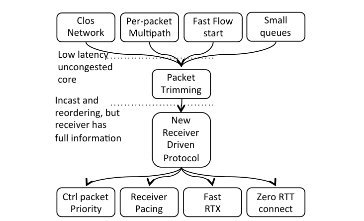
   <em>图 1：NDP 的关键组件。</em>

Clos 拓扑在核心网络中有足够带宽，只要负载均衡足够完美，就能满足所有需求。为了避免核心链路上的流碰撞，必须把每条流分散到多条路径上。短流也需要负载均衡，因此需要 per-packet multipath，但这必然导致包乱序。

为了获得最小的短流延迟，发送端不能先探测再发送；它必须在第一个 RTT 以线速发送。多数时候这可以工作。若发送端执行 per-packet multipath 负载均衡，那么线速发送造成拥塞通常意味着多个发送端正在向同一个接收端发送。即便如此，只要接收端链路被充分利用，这本身并不是问题。

要保证低延迟，交换机队列必须很小。这意味着冲突流会使队列溢出。如果使用普通丢包，再叠加多路径乱序，端系统很难快速判断发生了什么并及时重传，这会破坏低延迟目标。如果完全避免丢包，又会引入排队延迟；如果通过 lossless Ethernet 的 pause 实现，还会影响无关流。NDP 寻找的是 loss 和 lossless 之间的中间点。

### 3.1 NDP 交换机服务模型

在 CP 中，当交换机队列超过固定阈值时，交换机不丢弃整个包，而是裁掉 payload，只把 header 入队 [9]。这样做的目的是：包不会静默丢失，接收端可以快速触发重传，而不需要等待超时。数据中心距离短，因此这些重传可以很快到达。

CP 还提出对 TCP 做少量修改以改善 incast 性能。NDP 希望在 CP 之上走得更远，把 packet trimming 作为极低延迟网络架构的基础。但如果直接使用原始 CP，会出现几个问题。

第一，CP 会出现 congestion collapse。图 2 展示了当大量包以远高于出链路容量的速率到达交换机时会发生什么。许多无响应的流汇聚到一个 10Gb/s 链路上，而这个链路实际只能承载其中一部分流。随着越来越多链路带宽被 trimmed header 占据，CP 流的平均 goodput 会下降。图中还是 CP 的较好情形，因为使用了 9KB jumbo packet；如果使用 1500B 包，collapse 会更快发生。

第二，数据中心网络非常规则，因此可能出现 phase effect [14]。图 2 中虚线展示了最差 10% 流的平均 goodput。phase effect 会让 CP 非常不公平。虽然真实系统中 OS 调度带来的时间扰动可能缓解部分相位问题，但这不能作为协议设计的依赖。

  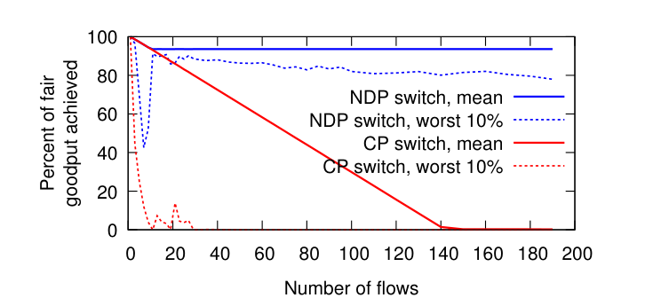
   <em>图 2：CP 的 collapse 和 phase problem。</em>

第三，CP 的目的是提供低延迟的丢包反馈，但它使用 FIFO 队列。反馈必须等前面所有包处理完后才能发出，这会导致触发重传之前存在额外延迟。NDP 希望交换机使用很小的 buffer，并让重传在队列还没排空前就到达；FIFO 队列无法做到这一点。

NDP 交换机相对 CP 做了三点修改。

第一，维护两个队列：低优先级数据队列，以及高优先级 header/control 队列。trimmed header、ACK、NACK、PULL 都进入高优先级队列。这样一旦数据包被裁剪，接收端可以很快看到 header，并快速触发重传或 pull。

第二，高低优先级队列之间不是让 header 完全压制数据，而是做加权轮询。论文中采用 10:1 的比例，既保证反馈快，又避免 header 把链路占满导致 collapse。

第三，当低优先级数据队列满时，交换机以 50% 概率裁剪新来的包，或者裁剪队尾包。这用于打破相位效应，避免某些流长期倒霉。

这三点改变使 NDP switch 避免 CP 的 congestion collapse，也避免强烈的 phase effect。高优先级队列让反馈尽早到达；加权轮询保证数据包仍然占据主要带宽；随机裁剪新包或队尾包打散规则网络中的相位同步。

### 3.1.1 路由

NDP 希望交换机进行 per-packet multihop forwarding，把源和目的之间所有可用并行路径都用于均衡突发流量。这至少有四种实现方式：交换机 per-packet ECMP 随机选择下一跳；发送端显式 source routing；使用 label-switched path，由发送端选择 label；或者通过不同目的地址表示路径，由发送端选择目的地址。

对负载均衡而言，后三种方式等价：路径由发送端选择。实验表明，发送端选路径比交换机随机选路径能做得更好，也允许使用更小的交换机 buffer。

与互联网不同，数据中心中的发送端可以知道拓扑，因此也知道到目的端有多少条路径。每个 NDP 发送端维护一组到目的端的路径，先随机打乱路径列表，然后按这个顺序发包。每条路径发一个包之后，再重新随机打乱并重复。这种方式把包均匀分散到所有路径上，同时避免两个发送端之间无意同步。对于 L2 或 L3 网络，可以分别用 label-switched path 或目的地址来表达所选路径。

### 3.2 传输协议

NDP 使用 receiver-driven 传输协议，专门利用 multipath forwarding、packet trimming 和短交换机队列。协议设计首先最小化短传输延迟，其次最大化大传输吞吐。

传统 TCP 在连接开始时是悲观的：先完成三次握手，再从较小拥塞窗口开始发送 [11]，每个 RTT 加倍，直到填满管道。这适用于互联网，因为 RTT 和带宽差异巨大，激进发送的后果也严重。数据中心不同，链路速率和基础 RTT 更同质，也可以预先知道。为了降低延迟，NDP 必须乐观地假设网络有足够容量，并在第一个 RTT 发送一个完整窗口。

如果容量不足，普通传输协议会陷入混乱：一些包到达，顺序随机，一些包丢失，发送端无法快速知道发生了什么，只能依赖保守的重传超时。增大交换机 buffer 可以缓解，但会增加延迟；ECN 也不能阻止激进短流导致的丢包；pause frame 可以避免丢包，但会带来对无关流的显著影响。

Packet trimming 正是在这里发挥作用。被裁剪包的 header 到达接收端，只消耗少量瓶颈带宽，却精确告诉接收端哪些包被发送过。包到达顺序不影响接收端推断。优先级队列保证这些 header 和 NACK 等控制包快速传输，从而让重传在队列还没排空前到达。

图 3 表示：多个源同时向同一个目的发送数据时，ToR 到目的主机的队列可能满。第 9 个包被 trim 成 header，header 因为高优先级先到接收端，接收端立即发 NACK/PULL，请发送端重传第 9 个包。重传包在原队列还没完全排空前就到达，因此目的链路不会空转。

  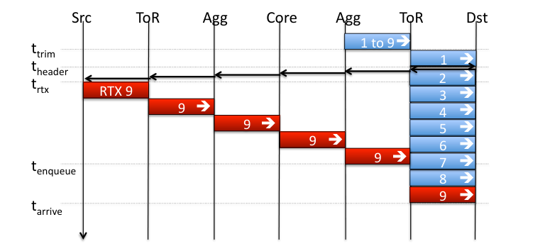
   <em>图 3：packet trimming 如何实现低延迟重传。</em>

协议流程大致如下：

- 发送端首 RTT 发满初始窗口。
- 接收端收到数据包后交付数据，收到 trimmed header 后知道对应 payload 需要重传。
- 接收端为发送端生成 PULL 包，PULL 包按接收端链路速率被发出。
- 发送端收到 PULL 后发送对应数量的数据包，重传优先于新数据。
- 如果发送端没有更多数据，会在最后一个包中标记结束；接收端清理对应 pull 队列状态。

首 RTT 之后，发送端停止主动发送，协议变成接收端驱动。接收端根据收到的数据包或 trimmed header，向发送端发送 PULL 包；PULL 包被 pacing，使其触发的数据包以接收端链路速率到达。接收端可以请求重传被裁剪的包，也可以请求传输后续新数据。PULL 包默认对不同连接公平服务，也可以在某些流有更高优先级时严格优先。

PULL 的作用类似 TCP 的 ACK-clock，但通常和 ACK 分离，以便 PULL 可以按接收端速率 pacing，而 ACK/NACK 可以尽快返回。这样不会因为 PULL 在接收端队列中等待而影响重传超时判断。在大规模 incast 中，第一个 RTT 可能造成很多 trimming；但之后接收端 pacing 会使所有发送端的聚合到达速率匹配接收链路速率，从而很少再发生 trimming。

### 3.2.1 乱序处理

由于 per-packet multipath forwarding，数据包和控制包乱序都是正常情况。NDP 因此不能依赖 TCP 中常见的顺序假设。接收端根据序号和 header 管理缺口，发送端根据 ACK、NACK 和每个包经过的路径维护状态。协议将乱序作为基本工作模式，而不是异常情况。

### 3.2.2 第一个 RTT

与 TCP 先 SYN/SYN-ACK 再交换数据不同，NDP 要在第一个 RTT 发送数据。这带来三个要求：要能抵抗伪造源地址请求；要保证连接不会被错误处理两次；要能处理第一个 RTT 内部的 multipath 乱序。

T/TCP [8] 和 TCP Fast Open [10] 也允许第一个 RTT 发送数据。TFO 通过服务器先前给出的 token 防止伪造，但不保证 at-most-once 语义；T/TCP 使用单调递增连接 ID 保证 at-most-once，但不能抵抗伪造。两者都不能很好处理 SYN 不是第一个到达包的情况。

NDP 的需求略有不同。在数据中心中，伪造源地址可以由 hypervisor、NIC 或 VXLAN 等机制处理；at-most-once 语义更关键。NDP 在客户端和服务端都保留 time-wait 状态，使任一端都能拒绝重复连接。由于最大 segment lifetime 小于 1ms，这些额外状态很小。对于首 RTT 中的多个数据包，每个包都携带 SYN flag 以及它相对连接首包的偏移，因此任意一个包先到达都能建立连接状态。

### 3.2.3 鲁棒性优化

如果网络行为正常，上述协议表现很好。但链路或交换机可能故障，链路也可能降速而未被路由协议立即检测到。NDP packet 是 source-routed，因此 NDP host 需要接收路由更新以知道哪些路径应避免。不过在路由协议收敛之前，发送端还需要自己检测异常路径；这和已有对 packet spraying 以及 MPTCP 的观察一致 [12, 31]。

NDP 发送端维护路径 scoreboard，记录每条路径上的 ACK、NACK 和丢包情况。正常 Clos 拓扑下，所有路径的 ACK/NACK 比例应接近。如果某些路径 NACK 明显过多，说明这些路径可能故障或拥塞；发送端在重新随机排列路径列表时，会临时移除这些 outlier。类似地，如果发生真正丢包，发送端重传时会选择不同路径，并更新 path loss counter。丢包异常的路径也会被临时移除。

### 3.2.4 Return-to-Sender

Packet trimming 可以处理大规模 incast，而不需要丢弃 header。但极端 incast 仍可能使 header queue 溢出，造成 header 丢失。缺失包最终会在发送端 RTO 到期后重发。由于 NDP 交换机队列很短，最大 RTT 可以设置得很小，RTO 可以比 TCP 更激进。

但如果整个传输只包含一个包，且该包优先级很高，依赖 RTO 会增加不必要延迟。作为优化，当 header queue 溢出时，交换机可以交换发送端和接收端地址，把 header 返回发送端。发送端收到返回 header 后可以重发对应包。为了避免形成 incast echo，NDP 只有在发送端不期待更多 PULL，或者首窗口中其他包也都返回时才立即重发。Return-to-sender 因此主要是极大 incast 下的优化；在 Clos 拓扑中，它让 metadata 近似无损。

图 4 用 432 节点 FatTree 仿真验证这些机制。Permutation 和 Random 场景都能把网络打满，包确认延迟中位数约 100 微秒。100:1 incast 即使有大量 trimming，也能接近理论最优完成时间。

  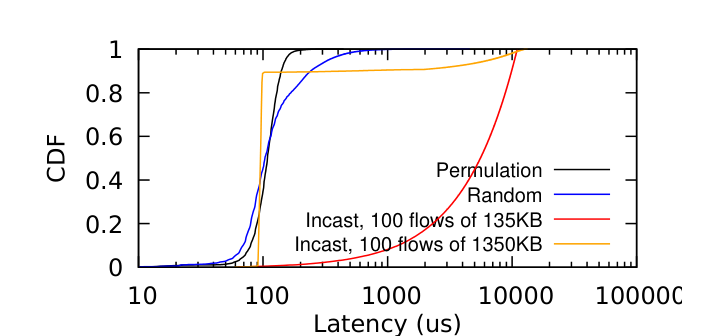
   <em>图 4：不同流量矩阵下的交付延迟。</em>

### 3.2.5 拥塞控制

读者可能会问，NDP 如何做拥塞控制。答案很简单：在 Clos 拓扑中，NDP 不执行传统意义上的拥塞控制。本文后续会展示，在合适的网络服务模型和传输协议组合下，拥塞控制不是必要条件。

一般来说，互联网拥塞控制有两个作用：避免 congestion collapse，并保证公平性。NDP 在没有显式窗口自适应机制的情况下同时实现这两点。

避免 congestion collapse。NDP switch 通过确保链路的大部分容量用于数据包，避免 CP 中 header 占满链路造成的 collapse [9]。由于 packet trimming，发送端很少依赖 RTO [26]，也不依赖 fragmentation [27, 33]，因此不会因为不必要的重传导致 collapse。真正大量 trimming 通常发生在 incast 中，且多发生在 ToR 到主机方向；被 ToR trim 的包通常没有在更早路径上挤掉其他包 [15]。

公平性。NDP 不需要额外公平机制也能获得良好公平性。竞争容量的主要位置是接收端入链路，而接收端拥有完整视图。接收端通过 pull queue 中的公平队列为不同连接分配 PULL。接收端也可以故意不公平，因为它知道自身优先级，并可以更频繁地 pull 高优先级流。

仍有一种接收端无法完全管理的不公平：某个接收端上的 incast 和另一个接收端上的普通流竞争同一 ToR switch。NDP 在一个 RTT 内缓解这种情况，因为首 RTT 后接收端 pacing 会移除过载。

NDP 也有边界。在非对称拓扑，如 BCube [19] 和 Jellyfish [36] 中，不同路径长度不同，在网络高负载时，把包喷洒到不同长度路径上代价较高，NDP 表现会较差。严重 oversubscribed 网络中，核心持续拥塞，NDP 的激进设计会导致第一个 RTT 后仍持续 trimming，此时某种拥塞控制有助于降低服务器重传负载。部署上，NDP 还需要考虑和 TCP 共存；一种简单方法是让 NDP 和 TCP 使用不同队列，并在两者之间做公平队列。

## 4. 实现

本文实现了 Linux 端系统、基于 DPDK [13] 的软件交换机、基于 10Gb/s NetFPGA-SUME [41] 的硬件交换机、P4 [29] 交换机，以及 htsim 中的高速网络仿真版本。Linux 和 NetFPGA 实现用于在小规模真实硬件上展示性能，仿真用于展示 NDP 的扩展性质。P4 实现用于证明 NDP switch 逻辑足够简单，可以部署在可编程交换机中。

图 5 展示 Linux 端系统的软件实现架构。

  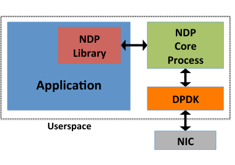
   <em>图 5：NDP 软件实现架构。</em>

Linux 实现的目标是研究 NDP 性能并验证协议设计。理想情况下，NDP 应该实现在 OS kernel 中，以便准确控制时序。为了快速实验，本文把 NDP 放在用户态，使用 DPDK [13] 实现低延迟网络访问，并使用专用 CPU core 保证 PULL pacing 和低延迟重传。

NDP core process 负责仲裁 NIC 访问，并维护所有连接共享的 pull queue。NDP library 向应用提供 API，并通过共享内存和 core process 交互。共享内存中包含用于命令的 communication ring buffer、每个 active socket 的 RX/TX/RTX 三个 ring buffer，以及共享 buffer pool。library 还处理由 timeout 触发的重传。

NDP core 的主循环负责：

- 处理应用注册和 connect/listen 命令。
- 新连接发送首 RTT 数据。
- 接收 data、ACK、NACK、PULL。
- 把 NACK 对应的 buffer 放入重传队列。
- 维护 pull queue，并按时发送 PULL。

由于 NDP 是零 RTT 协议，connect 命令只是通知 NDP core 存在新的主动 socket；真正连接会在发送数据时建立。listen 命令则通知 NDP core 存在新的被动 socket，同时预留若干 socket 以便接收随时到来的初始包列，因为没有初始握手可用于提前分配状态。

图 6 展示 NetFPGA-SUME 上的 NDP 交换机架构。

  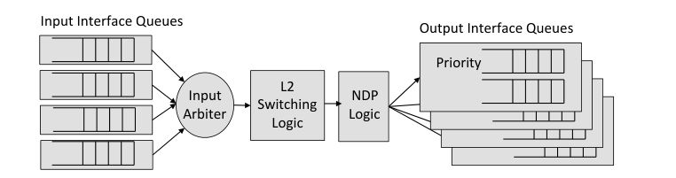
   <em>图 6：NetFPGA-SUME 上的 NDP 交换机架构。</em>

硬件交换机基于 NetFPGA-SUME [41]。理想情况下，NDP 的 trimming 和 priority queuing 应该由交换机 ASIC 实现。NetFPGA-SUME 原型具有四个 10Gb/s Ethernet 接口，内部使用 Xilinx Virtex-7 FPGA 以及 QDRII+ 和 DDR3 存储资源。

包从 10Gb/s 接口进入，先存入输入队列。arbiter 使用 deficit round-robin 从输入队列取包，再通过足以支撑 40Gb/s 以上吞吐的内部总线送入 L2 switching logic。随后包到达 NDP logic。每个输出端口都有低优先级队列和高优先级队列。NDP control 包直接进入高优先级队列。普通包检查低优先级队列长度；如果还有空间，就进入低优先级队列；否则被 trim 并放入高优先级队列。如果高优先级队列也满，包会被丢弃。

NetFPGA 实现使用的额外硬件资源较少。相对于参考 L2 switch，NDP 增加的主要资源消耗来自优先级输出队列。

图 7 给出 P4 中的 NDP 交换机实现。

  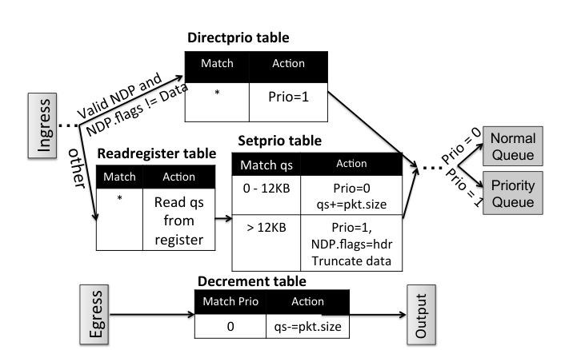
   <em>图 7：P4 中的 NDP 交换机实现。</em>

P4 实现 [29] 假设 ingress pipeline 和 egress pipeline 之间至少存在两个队列，并由 egress_priority metadata 决定包进入哪个队列。该实现需要知道每个端口队列大小，以决定包是否应该被 trim。由于 match/action table 只能匹配包数据，P4 版本使用 register 记录 normal queue 当前大小，并在 ingress pipeline 中读取该值，写入 packet metadata。

如果 normal queue 大小低于阈值，包进入 normal queue；超过阈值后，包通过 P4 的 truncate 原语裁剪 payload，并进入 priority queue。没有 data payload 的 NDP 包会通过 Directprio table 自动进入 priority queue。egress pipeline 只做队列大小记账：如果包来自 normal queue，就减少对应 register。

## 5. 评估

本文希望理解 NDP 在大型数据中心和真实工作负载中的表现，但无法直接在这种规模上实验。因此评估分三步：首先使用 NetFPGA NDP switch 对 Linux 实现做 profiling，理解小规模性能以及 NDP 和 host OS 的交互；其次比较 Linux 实现和仿真器，判断真实系统因素会如何影响仿真可信度；最后在仿真中评估 NDP 的扩展性。对比对象包括 MPTCP [31]、使用 ECN 的 DCTCP [4, 32]，以及使用 lossless Ethernet 的 DCQCN [40]。P4 NDP switch 也用于正确性验证，但由于参考 P4 软件交换机性能较差，结果未展示。

### 5.1 Linux NDP 性能

为评估 Linux NDP 实现的低延迟能力，实验连接两台服务器，运行一个反复发起 RPC 的应用，每次发送和接收 1KB 数据，并测量应用级延迟。对比对象是 Linux kernel TCP 和 TCP Fast Open [10]。TCP Fast Open 允许在 TCP SYN 中发送数据，但不保证连接只被处理一次，而 NDP 保证这一点。

图 8 显示，NDP 1KB RPC 中位延迟约 62 微秒，TCP Fast Open 大约是它的 4 倍，普通 TCP 大约是它的 5 倍。进一步的 DPDK [13] ping 测试为 22 微秒，说明 NDP RPC 延迟里约 40 微秒来自协议和应用处理。TCP 和 TFO 的延迟较高，主要来自中断、内核栈处理、数据拷贝、进程调度和 CPU sleep state 等因素。

小规模 incast 使用 8 台服务器和 6 台四端口 NetFPGA NDP switch 构建两层 FatTree。实验中，一个前端服务器同时向其他 7 台服务器发送请求，后者立即回复。响应大小从 10KB 到 1MB 变化，并测量最后一个流的完成时间。图 9 显示，NDP 的中位数和 90 分位完成时间接近理论最优；TCP 的中位数也随响应大小线性增长，但 NDP 大约快 4 倍，TCP 的 90 分位主要受重传超时影响。

优先级实验中，一个接收端同时从一个发送端接收短流，并从其他六个发送端接收长流。默认情况下，NDP 会让所有发送端各获得接收链路的 1/7；开启优先级后，接收端在 pull queue 中优先发送短流的 PULL。图 10 显示，短流完成时间在有优先级时只比空闲情况多约 50 微秒，而没有优先级时增加约 500 微秒。

<table align="center">
  <tr>
    <td align="center" width="33%">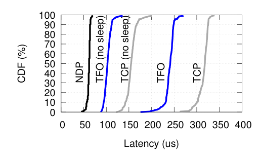 <em>图 8：1KB RPC 延迟。</em></td>
    <td align="center" width="33%">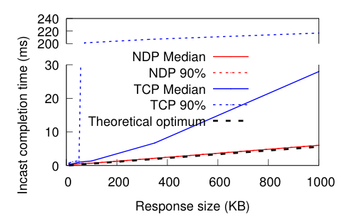 <em>图 9：7 对 1 incast。</em></td>
    <td align="center" width="33%">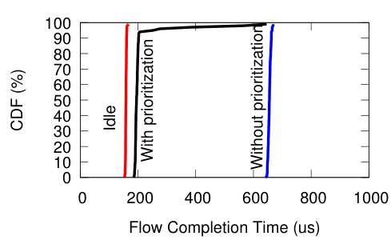 <em>图 10：短流优先级效果。</em></td>
  </tr>
</table>

## 6. 仿真

在进入大规模实验之前，本文先检查仿真器行为和 Linux 实现之间的差异。主要差异来自 host processing delay 和 PULL pacing。仿真器可以完美地 pace PULL，而真实实现不能。

为了理解处理延迟影响，实验把两台服务器背靠背连接，并测量初始窗口不同取值下的吞吐。图 11 显示，为了达到相似吞吐，真实原型的初始窗口需要 25 个包，而仿真器中 15 个包即可；额外的包缓存在端系统中，用于覆盖仿真器未建模的主机处理延迟。这意味着仿真中的 NDP 延迟结果略偏乐观。不过，TCP 的未建模处理延迟更高，因此对比结果并不一定偏向 NDP。

图 12 展示发送端测到的 PULL 间隔。对 1500B 和 9000B 包，中位数间隔分别接近目标值 1.2 微秒和 7.2 微秒，但 1500B 包存在一定方差。为了观察这种不完美 pacing 的影响，本文把实测 PULL spacing 分布加入仿真。图 11 中标记为 Sender CDF 的曲线和 Perfect 曲线重合，说明窗口足够覆盖 PULL 中的小间隙。图 13 中，200:1 incast 的完成时间在完美 pacing 和实测 pacing 下也几乎没有可见差异。这些实验表明真实系统因素对 NDP 结论影响较小。

<table align="center">
  <tr>
    <td align="center" width="33%">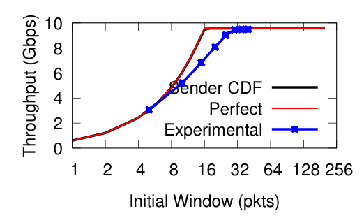 <em>图 11：吞吐随初始窗口变化。</em></td>
    <td align="center" width="33%">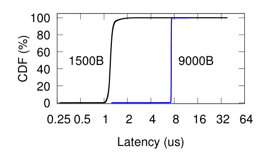 <em>图 12：发送端测到的 PULL 间隔。</em></td>
    <td align="center" width="33%">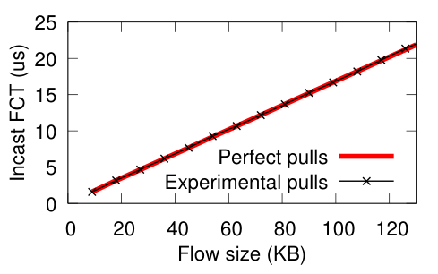 <em>图 13：完美 PULL 与实测 PULL 的 incast 性能。</em></td>
  </tr>
</table>

### 6.1 与已有工作的对比

本文使用 permutation 流量矩阵测试 NDP 对 Clos 数据中心网络的利用能力。这是一个最坏情况流量矩阵：每台服务器向另一个随机服务器打开一个长连接，同时每台服务器也恰好接收一个入连接。对比对象包括 MPTCP [31]、DCTCP [4] 和 DCQCN [40]。NDP switch 使用 8 包输出队列；DCTCP 和 MPTCP 为保证性能使用 200 包输出队列；DCQCN 使用每端口 200 个 buffer 并在接口之间共享。

图 14 显示 DCTCP/DCQCN 由于单路径 ECMP 碰撞，平均利用率约 40%，某些流甚至不到 1Gb/s，尽管理论上每条流都可以获得 10Gb/s。MPTCP 表现好得多，利用率约 89%，最慢流约 6Gb/s。NDP 达到约 92% 利用率，并且最慢流也有约 9Gb/s，因此跨流公平性更好。

  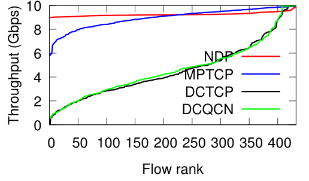
   <em>图 14：Permutation 流量矩阵下每条流的吞吐。</em>

随后实验考察 buffer 大小对短流完成时间的影响。两个节点反复交换 90KB 流，其他节点各自向随机目的端发送 4 条长连接。由于 90KB 流的源和目的端不发生竞争，这个实验主要测量网络中常驻队列对空闲短流的影响。图 15 显示，NDP 最坏情况延迟约为理想空闲网络传输时间的 2 倍，其中位数比 DCTCP 低 3 倍，99 分位低 4 倍。主要原因是 NDP 的网络 buffer 远小于 DCTCP 在 overloaded FatTree 中形成的队列。DCQCN 因为偶发 PAUSE frame，表现略差于 DCTCP；MPTCP 由于贪婪填充网络 buffer，短流完成时间最差。

大规模 incast 实验中，前端向大量后端 fan out 请求并接收回复。同步到达的回复会给前端方向的交换机端口造成巨大 buffer 压力，进而导致同步丢包。实验改变后端服务器数量，并保持每个响应大小为 450KB。通常最晚完成的流是主要指标；图 16 同时展示最快流，用于观察公平性。

即使使用非常激进的小 RTO [38]，MPTCP 和其他 tail-loss TCP 变体也会被同步丢包拖垮，产生大且不可预测的 FCT。DCTCP 通过 ECN 和较大 shared buffer 吸收初始突发，因此明显优于传统 TCP。DCQCN 和 NDP 更接近最优。不同协议的完成时间分布也不同：DCTCP 最快和最慢流之间差距可达 7 倍；NDP 分配更均衡，最慢流最多比最快流多 20% 完成时间；DCQCN 在一定响应大小前也很均衡，但进入 lossless 工作模式后，完成时间会严重倾斜。

当 NDP 对某个 incast sender 开启优先级时，该 sender 的 PULL 会被放到接收端 pull queue 头部。结果显示，优先级很有效：100 个 incast sender 时，被优先流完成时间约 1ms；432 个 sender 时约 3.5ms。

图 17 展示 NDP 的两个重要参数：初始窗口和交换机 buffer。Permutation 流量矩阵是这里最重要的指标。初始窗口小于 15 时，交换机 buffer 大小影响不明显，因为网络无法被充分填满；初始窗口约 20 个包时可以充分利用网络。6 包 buffer 会略微低估网络利用率，8 包 buffer 可以达到 95% 以上利用率，因此论文后续主要使用 8 包队列。继续增加初始窗口反而会略微降低吞吐，因为更大的首 RTT 突发会制造更多 header 压力。使用 1.5KB 包时，30 包初始窗口也能达到约 95% 网络利用率。

<table align="center">
  <tr>
    <td align="center" width="33%">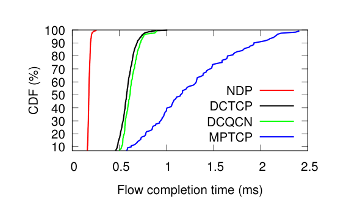 <em>图 15：随机背景负载下 90KB 流完成时间。</em></td>
    <td align="center" width="33%">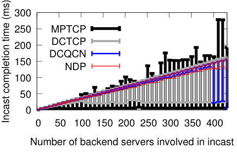 <em>图 16：Incast 发送方数量变化时的完成时间。</em></td>
    <td align="center" width="33%">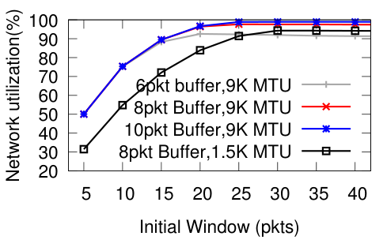 <em>图 17：初始窗口和交换机 buffer 对吞吐的影响。</em></td>
  </tr>
</table>

### 6.1.1 Incast 对附近流的副作用

本文进一步测试 incast 对附近流的副作用。第一个实验中，长时间 incast 与 permutation 流量矩阵同时运行。关注指标是总网络利用率：NDP 仍能达到约 92%，DCTCP 约 40%，和单独 permutation 时相同；DCQCN 则因为 incast 触发 PFC 而出现拥塞 collapse，利用率下降到 17%，严重影响数据中心中多数流的吞吐。

第二个实验如图 18 所示：先运行一个到 host 1 的长流，然后启动一个短生命周期 64:1 incast 到 host 2，每个 incast 流发送 900KB，两个 host 位于同一个 ToR 下。图 19 展示结果。DCTCP 在 ToR 以及到 ToR 的 aggregation switch 端口都出现丢包，长流和 incast 流都需要时间恢复；DCQCN 防止了丢包，但 PFC 导致上游交换机反复 pause，影响长流；NDP 在第一个 RTT 中发生 trimming，长流吞吐短暂下降不到 1ms，此后接收端 pacing 剩余 incast 包，长流恢复到满吞吐。

  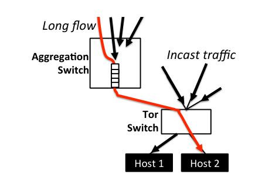
   <em>图 18：测量 incast 对附近流干扰的实验设置。</em>

  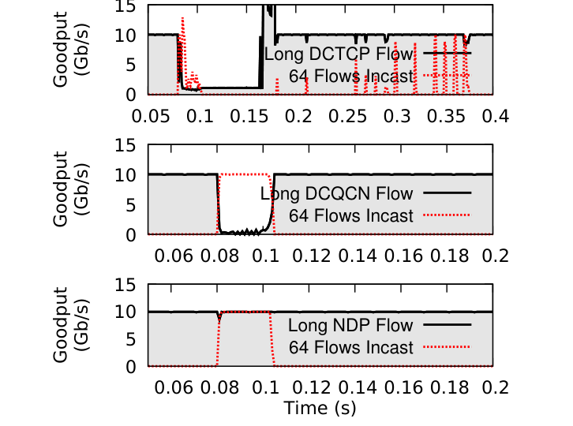
   <em>图 19：64-flow incast 对 DCTCP、DCQCN、NDP 长流的影响。</em>

### 6.2 敏感性分析

NDP 使用非常小的 switch buffer 和固定 sender 初始窗口，这是 NDP 网络中的两个主要参数。初始窗口编码了瓶颈速率和网络延迟等信息，并由管理员设置。敏感性分析用于理解这些参数如何影响性能，以及是否需要精细调参。

更大拓扑实验中，使用 8 包 buffer、9KB MTU 和 30 包初始窗口，在越来越大的 FatTree 中运行 permutation。网络利用率从 128 节点 FatTree 的 98% 缓慢下降到 8192 节点 FatTree 的 90%。NDP 的利用率比 8 subflow MPTCP [31] 高约 5%，但 buffer 不到后者的十分之一。

图 20 分析 8192 节点 FatTree 中 incast 规模的影响。实验从 1 个流一直到 8000 个并发流，每个流大小为 270,000 字节，并测量最后一个流的完成时间。图 20a 显示，23 包初始窗口在小 incast 下开销最大，但仍在最优完成时间 2% 以内；大 incast 下，时间开销可以忽略。图 20b 显示发送端为低延迟付出的重传开销。小 incast 中 NACK 是主要机制；超过 100 个流后，return-to-sender 成为主要机制；超过 2000 个流后，一些包会经历第二次 return-to-sender。即使在最大 incast 和 23 包初始窗口下，平均每包重传次数也刚刚超过 1。

<table align="center">
  <tr>
    <td align="center" width="50%">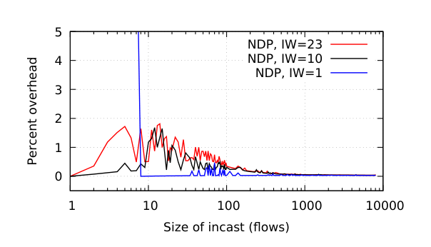 <em>图 20a：相对最优完成时间的开销。</em></td>
    <td align="center" width="50%">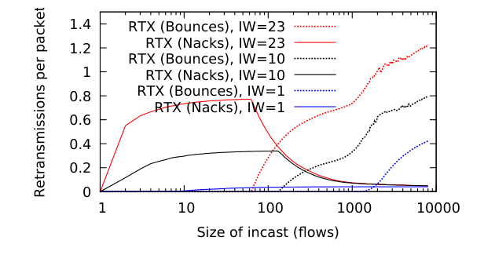 <em>图 20b：重传开销。</em></td>
  </tr>
</table>

<em>图 20：8192 节点 FatTree 中 incast 规模带来的开销。</em>

发送端受限场景如图 21：host A 向 B、C、D、E 发送，host F 也向 E 发送。普通 incast 下，到 E 的流量会在 A 和 F 之间平均分配；但这里 A 无法发送足够数据来填满 E 链路的一半。问题是：E 发往 A 的 PULL 是否会被浪费？

  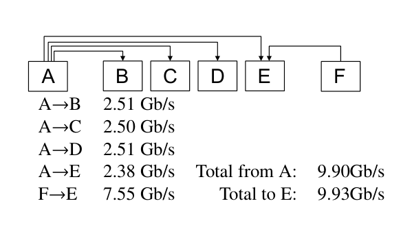
   <em>图 21：发送端受限拓扑与吞吐。</em>

仿真结果显示不会。A 的出链路和 E 的入链路都被填满，A 发出的四条流几乎平均分享 A 的出链路容量。原因是 E 对 pull queue 执行公平队列。E 总是有发往 F 的 PULL 排队；但当 A 的包较少到达时，公平队列保证 A 的数据包一旦到达并生成 PULL，这些 PULL 就会尽快发出。这样，E 向 A 发 PULL 的速率与 A 向 E 发数据的速率匹配，剩余 PULL 给 F，从而保证 E 入链路保持满载。

没有 packet trimming 是否也能获得 NDP 的收益？为回答这个问题，本文比较了 pHost [16]。pHost 同样是 receiver-driven transport，使用小 buffer 和 per-packet ECMP，但不使用 packet trimming。本文在 htsim 中实现 pHost，并在普通 drop-tail 432 节点 FatTree 上运行。432:1 incast 中，pHost 需要 1 到 1.5 秒完成，比 NDP 慢 10 倍，也比 MPTCP 慢 4 到 5 倍。Permutation 流量下，pHost 只有 70% 利用率，而 NDP 达到 95%。这说明 trimming 是 NDP 的关键组成部分。

对称网络中 per-packet ECMP 工作良好；非对称网络，例如故障场景，则更困难。图 22 中，一个 128 节点拓扑里，某条 core 到 upper pod switch 的链路被降速到 1Gb/s。NDP 和 MPTCP [31] 都能较好处理，因为它们维护 per-path 拥塞信息并把流量从拥塞路径移走。NDP 的 path penalty 机制在非对称拓扑中很关键；没有它，NDP 表现明显变差，部分流只有约 3Gb/s。

  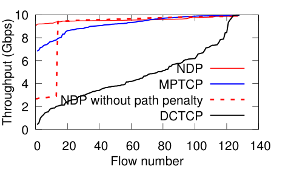
   <em>图 22：链路故障下的 permutation 吞吐。</em>

图 23 使用 Facebook 数据中心测量 [34] 构造 4:1 oversubscribed 三层 FatTree，并选择对 NDP 最不利的 web traffic：包很小、压缩收益低、几乎没有 rack-level locality。中等负载下，NDP 中位 FCT 是 DCTCP 的一半，99 分位约为 DCTCP 的三分之一。更高负载下，约 70% 包在首个 ToR 被 trim，接近最坏情况；尽管如此，NDP 的中位和尾部仍略优于 DCTCP，并且没有 congestion collapse。论文也指出，NDP 不应原样用于持续严重拥塞的网络；这种场景中，简单拥塞控制可以降低 pull rate，减少持续过载。

  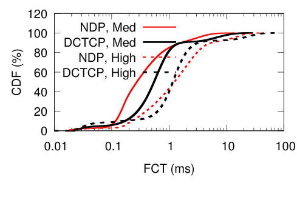
   <em>图 23：Facebook web workload 下的 FCT。</em>

## 7. 相关工作

数据中心传输相关工作很多，大多数要么关注低延迟 [5, 6, 16, 22, 28, 30]，要么关注高吞吐 [2, 12, 31]。本文已经详细比较了最相关且已部署的工作：面向低延迟的 DCTCP/DCQCN，以及面向高吞吐的 MPTCP。

pFabric [6] 通过严格优先级调度实现近似 shortest-flow first；理论上有吸引力，但依赖主机正确设置优先级，部署困难。HULL [5] 预留容量以保障短流低延迟，并用 phantom queue 识别潜在拥塞；它需要端点准确 pacing。Fastpass [30] 用集中式调度实现低延迟，但可扩展性有限。如果应用能显式声明 deadline，PDQ、D2TCP、D3 等方案可以帮助满足 deadline [22, 37, 39]。

TIMELY [28] 是 lossless 网络中 DCQCN 的另一种替代方案，使用 RTT 作为拥塞指标。但与 DCQCN 类似，TIMELY 不能完全阻止 pause frame 及其对无关流的影响。这些低延迟方案的共同限制是：它们通常忽略网络利用率或大流性能。

另一类工作试图解决 per-flow ECMP 碰撞，例如 Hedera 的集中式调度 [2]、Packet Spraying [12] 和 Presto [21] 的协议变化、Conga 的网络内 subflow 处理 [3]，以及 LocalFlow 的交换机重设计 [35]。这些工作不以短流完成时间为目标，FCT 接近使用大 buffer 的未优化网络。NDP 的区别在于，它在各种流量条件下同时追求低延迟和高吞吐。

## 8. 结论

本文提出 NDP，一种新的数据中心网络架构。它包括修改后的交换机排队算法、per-packet multipath forwarding，以及一种利用这些网络机制的新传输协议。NDP 在实现和大规模仿真中都表现出优秀的低延迟行为，并且相比依赖 lossless Ethernet 的 DCQCN [40] 等机制，能为不同工作负载提供更好的隔离。

当前实现对端系统 CPU 资源的要求中等偏高，原因是需要准确 pacing PULL，并进行低延迟重传。这两个功能对 Ethernet NIC 来说很容易实现；廉价 WiFi NIC 已经能处理重传和精细包定时。如果 NDP 大规模部署，smart NIC 可以大幅降低 NDP 的 CPU 开销。

## 参考文献

[1] M. Al-Fares, A. Loukissas, and A. Vahdat. A scalable, commodity data center network architecture. In Proc. ACM SIGCOMM, Aug. 2010.

[2] M. Al-Fares, S. Radhakrishnan, B. Raghavan, N. Huang, and A. Vahdat. Hedera: Dynamic flow scheduling for data center networks. In Proc. USENIX NSDI, 2010.

[3] M. Alizadeh, T. Edsall, S. Dharmapurikar, R. Vaidyanathan, K. Chu, A. Fingerhut, V. T. Lam, F. Matus, R. Pan, N. Yadav, and G. Varghese. CONGA: Distributed Congestion-aware Load Balancing for Datacenters. In Proc. ACM SIGCOMM 2014, pages 503-514.

[4] M. Alizadeh, A. Greenberg, D. A. Maltz, J. Padhye, P. Patel, B. Prabhakar, S. Sengupta, and M. Sridharan. Data center TCP (DCTCP). In Proc. ACM SIGCOMM, Aug. 2010.

[5] M. Alizadeh, A. Kabbani, T. Edsall, B. Prabhakar, A. Vahdat, and M. Yasuda. Less is more: trading a little bandwidth for ultra-low latency in the data center. In Proc. USENIX NSDI, pages 253-266, 2012.

[6] M. Alizadeh, S. Yang, M. Sharif, S. Katti, N. McKeown, B. Prabhakar, and S. Shenker. pFabric: Minimal near-optimal datacenter transport. In Proc. ACM SIGCOMM 2013.

[7] T. Benson, A. Akella, and D. A. Maltz. Network traffic characteristics of data centers in the wild. In Proceedings of the 10th ACM SIGCOMM conference on Internet measurement, pages 267-280. ACM, 2010.

[8] R. Braden. RFC 1644: T/TCP - TCP extensions for transactions functional specification. Technical report, RFC Editor, July 1994.

[9] P. Cheng, F. Ren, R. Shu, and C. Lin. Catch the whole lot in an action: Rapid precise packet loss notification in data centers. In Proc. USENIX NSDI, 2014.

[10] Y. Cheng, J. Chu, S. Radhakrishnan, and A. Jain. RFC 7413: TCP fast open. Technical report, RFC Editor, Dec. 2014.

[11] J. Chu, N. Dukkipati, Y. Cheng, and M. Mathis. RFC 6928: Increasing TCP's initial window. Technical report, RFC Editor, Apr. 2013.

[12] A. Dixit, P. Prakash, Y. Hu, and R. Kompella. On the impact of packet spraying in data center networks. In Proc. IEEE INFOCOM 2013, 2013.

[13] DPDK Data Plane Development Kit. http://dpdk.org. Accessed: 2017-01-27.

[14] S. Floyd and V. Jacobson. Traffic phase effects in packet-switched gateways. SIGCOMM Comput. Commun. Rev., 21(2):26-42, Apr. 1991.

[15] S. Floyd and J. Kempf. RFC 3714: IAB concerns regarding congestion control for voice traffic in the internet. Technical report, RFC Editor, Mar. 2004.

[16] P. X. Gao, A. Narayan, G. Kumar, R. Agarwal, S. Ratnasamy, and S. Shenker. pHost: Distributed Near-optimal Datacenter Transport Over Commodity Network Fabric. In Proc. ACM CoNEXT, 2015.

[17] A. Greenberg et al. VL2: a scalable and flexible data center network. In Proc. ACM SIGCOMM, Aug. 2009.

[18] R. Griffith, Y. Chen, J. Liu, A. Joseph, and R. Katz. Understanding TCP incast throughput collapse in datacenter networks. In Proc. WREN Workshop, 2009.

[19] C. Guo, G. Lu, D. Li, H. Wu, X. Zhang, Y. Shi, C. Tian, Y. Zhang, and S. Lu. BCube: A high performance, server-centric network architecture for modular data centers. In Proc. ACM SIGCOMM 2009.

[20] C. Guo, H. Wu, Z. Deng, G. Soni, J. Ye, J. Padhye, and M. Lipshteyn. RDMA over commodity ethernet at scale. In Proc. ACM SIGCOMM 2016, pages 202-215.

[21] K. He, E. Rozner, K. Agarwal, W. Felter, J. Carter, and A. Akella. Presto: Edge-based load balancing for fast datacenter networks. In Proc. ACM SIGCOMM 2015, pages 465-478.

[22] C.-Y. Hong, M. Caesar, and P. B. Godfrey. Finishing flows quickly with preemptive scheduling. In Proc. ACM SIGCOMM 2012.

[23] IEEE DCB. 802.3bd - MAC Control Frame for Priority-based Flow Control Project. http://www.ieee802.org/3/bd/, 2010. Superseding IEEE 802.3x Full Duplex and Flow Control.

[24] IEEE DCB. 802.1Qbb - Priority-based Flow Control. http://www.ieee802.org/1/pages/802.1bb.html, 2011.

[25] Infiniband Trade Association. RoCEv2. https://cw.infinibandta.org/document/dl/7781, Sept. 2014.

[26] V. Jacobson and M. J. Karels. Congestion avoidance and control. In Proc. ACM SIGCOMM, Stanford, CA, Aug. 1988.

[27] C. Kent and J. Mogul. Fragmentation considered harmful. In Proc. ACM SIGCOMM, Aug. 1987.

[28] R. Mittal, V. T. Lam, N. Dukkipati, E. Blem, H. Wassel, M. Ghobadi, A. Vahdat, Y. Wang, D. Wetherall, and D. Zats. TIMELY: RTT-based congestion control for the datacenter. In Proc. ACM SIGCOMM 2015, pages 537-550.

[29] The P4 Language Consortium. P416 language specification version 1.0.0. 2016.

[30] J. Perry, A. Ousterhout, H. Balakrishnan, D. Shah, and H. Fugal. Fastpass: A centralized "zero-queue" datacenter network. In Proc. ACM SIGCOMM 2014.

[31] C. Raiciu, S. Barre, C. Pluntke, A. Greenhalgh, D. Wischik, and M. Handley. Improving datacenter performance and robustness with Multipath TCP. In Proc. ACM SIGCOMM, Aug. 2011.

[32] K. Ramakrishnan, S. Floyd, and D. Black. RFC 3168: the addition of explicit congestion notification (ECN) to IP. Technical report, RFC Editor, Sept. 2001.

[33] A. Romanow and S. Floyd. Dynamics of TCP traffic over ATM networks. In Proc. ACM SIGCOMM, London, 1994.

[34] A. Roy, H. Zeng, J. Bagga, G. Porter, and A. C. Snoeren. Inside the social network's (datacenter) network. In Proc. ACM SIGCOMM 2015, pages 123-137.

[35] S. Sen, D. Shue, S. Ihm, and M. J. Freedman. Scalable, optimal flow routing in datacenters via local link balancing. In Proc. ACM CoNEXT 2013, pages 151-162.

[36] A. Singla, C.-Y. Hong, L. Popa, and P. B. Godfrey. Jellyfish: Networking data centers randomly. In Proc. USENIX NSDI 2012.

[37] B. Vamanan, J. Hasan, and T. Vijaykumar. Deadline-aware datacenter TCP (D2TCP). ACM SIGCOMM Computer Communication Review, 42(4):115-126, 2012.

[38] V. Vasudevan, A. Phanishayee, H. Shah, E. Krevat, D. G. Andersen, G. R. Ganger, G. A. Gibson, and B. Mueller. Safe and effective fine-grained TCP retransmissions for datacenter communication. In Proc. ACM SIGCOMM 2009, pages 303-314.

[39] C. Wilson, H. Ballani, T. Karagiannis, and A. Rowstron. Better never than late: Meeting deadlines in datacenter networks. In Proc. SIGCOMM '11, 2011.

[40] Y. Zhu, H. Eran, D. Firestone, C. Guo, M. Lipshteyn, Y. Liron, J. Padhye, S. Raindel, M. H. Yahia, and M. Zhang. Congestion control for large-scale RDMA deployments. In Proc. ACM SIGCOMM 2015, pages 523-536.

[41] N. Zilberman, Y. Audzevich, G. A. Covington, and A. W. Moore. NetFPGA SUME: Toward 100 Gbps as research commodity. IEEE Micro, 34(5), 2014.
