# Load Balancing for AI Training Workloads

## 论文信息

- 标题：Load Balancing for AI Training Workloads
- 年份：2025
- 主题：AI 训练集群中的负载均衡、packet spraying、故障场景、Ofan、destination-based rotation
- 作者：Sarah McClure、Evyatar Cohen、Alexander Shpiner、Mark Silberstein、Scott Shenker、Sylvia Ratnasamy、Isaac Keslassy
- 机构：
  - UC Berkeley：Sarah McClure、Scott Shenker、Sylvia Ratnasamy、Isaac Keslassy
  - Technion：Evyatar Cohen、Mark Silberstein、Isaac Keslassy
  - NVIDIA：Alexander Shpiner、Mark Silberstein
  - ICSI：Scott Shenker

## 摘要

AI 训练集群对网络带宽极其敏感，因此负载均衡已经成为决定训练吞吐和尾延迟的重要组件。虽然业界已经提出了很多负载均衡方案，但仍然缺少一个清晰的结论：哪类方案在 AI 训练负载下最好？不同条件下应该选择哪类方案？现有方案离理论最优还有多远？

本文把负载均衡算法从拥塞控制和丢包恢复中拆出来，单独比较当前最有代表性的设计。结论可以概括为四点：第一，packet-level spraying 明显优于 flow、flowlet、subflow 这类粗粒度方案；第二，在没有故障时，host 侧和 switch 侧 packet spraying 的性能很接近，但在链路故障和路由收敛较慢时，host 侧因为有端到端视角而更有优势；第三，即使是当前领先的 spraying 方案，在最大利用率下也无法达到最优的 $O(1)$ 队列长度；第四，按目的端进行轮转的 Destination-Based Rotation 可以达到 $O(1)$ 队列，本文提出的 Ofan 是一种 switch 侧实现方式，既保留最优队列性质，又避免 host 侧维护全局拓扑状态。

## 1. 引言

传统数据中心负载均衡长期受 TCP 约束。TCP 不喜欢乱序，因此主流系统通常会让一个 flow 固定走一条路径，典型例子是 ECMP 或 PLB 这类方案 [1, 2]。这在普通数据中心服务里通常够用，但 AI 训练集群不同：训练通信带宽需求巨大，collective 通信会反复制造同步、规则、持续的大流。为了榨干网络，系统越来越倾向于 packet-level spraying，也就是把一个 flow 的不同 packet 发往不同路径。

业界已经在朝这个方向移动。UEC 正在围绕 packet spraying、packet trimming 等机制标准化以太网 AI 网络 [3, 5]；NVIDIA Spectrum-X 通过 switch 侧 packet spraying 和支持 out-of-order placement 的 RDMA NIC 来应对乱序 [6, 7]；此前的 pFabric、NDP 等也展示了 packet 级调度的潜力 [8, 9]。但是，现有系统往往是“完整协议栈”的比较：负载均衡、拥塞控制、丢包恢复绑在一起，很难判断究竟是哪一部分带来收益。

本文的问题是：如果只看负载均衡本身，在 AI training workloads 里，我们应该怎样选？论文围绕几个问题展开：

1. packet spraying 是否一定优于 flow、flowlet、subflow？
2. host 侧 spraying 和 switch 侧 spraying 各自适合什么场景？
3. 故障和路由收敛时间会如何改变结论？
4. 当前主流方案是否达到理论最优？如果没有，应该怎样设计？

论文最后提出 Ofan。Ofan 的关键不是简单“随机喷包”，而是按 destination 维护轮转指针，使特定目的端的流量在上行和下行都均衡。这一点是它区别于普通 RR/JSQ spraying 的核心。

## 2. 背景

AI 训练通信以 collective 为核心，例如 AllReduce、AllGather、AllToAll。一次训练迭代中，GPU 会先计算，再进入通信阶段；通信阶段里，只要有少数节点慢，整个 collective 的完成时间都会被拖住。因此本文主要关注 Collective Completion Time，简称 CCT。

AI 训练负载和普通 RPC/存储流量不同。它通常有以下特点：

- 流量更同步：很多 GPU 几乎同时发起 collective。
- 流量更规则：很多 collective 可以抽象成 permutation 或 all-to-all traffic matrix。
- 目标更特殊：重点不是某个 flow 的 FCT，而是整个 collective 的完成时间。
- 可隔离性更强：大规模训练集群经常独占一片网络资源。

论文也讨论了 MoE。MoE 的 AllToAll 看起来可能很不均匀，但在训练里通常有 token 数量大、router/aux-loss 或 placement 策略平衡、expert 跨卡切分等机制，因此在宏观上仍然适合用近似均匀的 collective 模型来分析 [18, 19]。

## 3. 负载均衡设计空间

负载均衡设计可以从三个维度看：

- 粒度：按 packet、flowlet、subflow 还是 flow 分流。
- 位置：host 做决定，还是 switch 做决定。
- 自适应性：是否根据负载状态调整，状态是 local 还是 global。

表 1 总结了这个设计空间。论文重点评估带勾的代表性方案，并提出带 dagger 的 Ofan 方向。

<table>
  <tr><th>状态</th><th>Host: Packet</th><th>Host: Flowlet</th><th>Host: Subflow</th><th>Host: Flow</th><th>Switch: Packet</th><th>Switch: Flowlet</th><th>Switch: Subflow</th><th>Switch: Flow</th></tr>
  <tr><td>None</td><td>✓ NDP/EQDS</td><td>× Presto/LetItFlow</td><td>✓ MPTCP</td><td>×</td><td>✓ pFabric/RPS/dcPIM</td><td>×</td><td>×</td><td>✓ ECMP</td></tr>
  <tr><td>Local</td><td>✓ REPS/STrack</td><td>✓ PLB/FlowBender/Hermes/CLOVE</td><td>×</td><td>×</td><td>✓ Ofan/Spectrum-X/DeTail</td><td>× Flowlet/ConWeave</td><td>× LocalFlow</td><td>× Broadcom TOM</td></tr>
  <tr><td>Global</td><td>✓ Fastpass/DRB</td><td>×</td><td>× Ethereal</td><td>× Mahout</td><td>× ByteDance GLB</td><td>× CONGA/HULA/Expeditus</td><td>×</td><td>× Hedera/MicroTE</td></tr>
</table>
 <em>表 1：已有负载均衡方案在状态、粒度和实现位置上的分类。</em>

本文重点比较七类 leading contenders：

1. Per-flow LB：类似 ECMP。包根据五元组加 flow label 哈希到一条路径。
2. Per-subflow LB：类似 MPTCP。host 把一个 flow 拆成多个 subflow，每个 subflow 有自己的 label。
3. Per-flowlet LB：类似 PLB。如果 host 检测到拥塞，就在 flowlet 边界附近改变 flow label。
4. Host Per-Packet LB：host 每个 packet 换一个 flow label。
5. Switch Per-Packet LB：switch 对目的 next-hop 端口组做 round-robin。
6. Adaptive Host Per-Packet LB：类似 REPS。host 先随机选 label，再根据 ACK/ECN 反馈丢弃拥塞 label，复用不拥塞的 label。
7. Adaptive Switch Per-Packet LB：switch 选择最短队列的 next-hop 端口，队列长度会先被量化成几个区间。

## 4. 方法：把 LB 和协议栈拆开

完整网络协议栈里，负载均衡、拥塞控制、丢包恢复会互相影响。为了单独看 LB，论文先构造了两个理想组件。

第一是理想 fixed-rate CCA。没有故障时，host 直接按线速发送；有故障时，论文计算在“所有 flow 均匀分摊到可用最短路径”的假设下网络可支持的最大速率。若瓶颈链路承载的总 flow 单位为 $F$，链路带宽为 $B$，则每个 flow 的最大速率为：

$$
\rho_{max}=\frac{B}{F}
$$

这个速率可能偏保守，因为更复杂的 traffic engineering 可能找到更高的可行速率，但它符合普通 LB 的行为，也能区分不同 LB 算法。

第二是理想 loss recovery。论文用零开销 rateless erasure coding 抽象丢包恢复：发送端持续发送编码包，直到接收端确认收到了足够字节。这样可以避免把 packet-specific retransmission 机制和 LB 混在一起。

随后论文也评估了更实际的组件：SACK-based loss recovery，以及适合 packet spraying 的 MSwift 拥塞控制 [49, 54]。

## 5. 负载均衡方案评估

### 5.1 仿真设置

论文使用 htsim 仿真器 [45]。默认网络是 128 个节点的三层 fat-tree，链路速率 800 Gbps，链路延迟 0.5 微秒，每端口 buffer 800 KB。数据包采用 RoCE-v2 尺寸：4096 B payload、62 B header、64 B ACK、20 B gap。每个场景运行 10 次。

<table>
  <tr><th>方案</th><th>模拟对象</th><th>仿真配置</th></tr>
  <tr><td>Flow</td><td>ECMP</td><td>-</td></tr>
  <tr><td>Subflow</td><td>MPTCP</td><td>subflows = 4</td></tr>
  <tr><td>Flowlet</td><td>PLB</td><td>ECN 阈值 50%，label change 阈值 40%</td></tr>
  <tr><td>Host Pkt</td><td>OPS/RPS</td><td>-</td></tr>
  <tr><td>Switch Pkt</td><td>Round-robin</td><td>每 5 次 wraparound 后重排</td></tr>
  <tr><td>Host Pkt AR</td><td>REPS</td><td>ECN 阈值 10%</td></tr>
  <tr><td>Switch Pkt AR</td><td>Spectrum-X 风格</td><td>队列量化区间 5%、10%、20%</td></tr>
</table>
 <em>表 2：评估的负载均衡代表方案及其配置。</em>

工作负载使用两种 traffic matrix：All-to-All 和 random permutation。Permutation 中，每个节点只向一个其他节点发送，同时也只从一个节点接收。许多 collective，例如 ring AllGather、ring AllReduce，可以抽象成 permutation 的迭代；AllToAll 也可以被看成一组 permutation 的组合。

指标是 CCT 相对理想下界的增长百分比。All-to-All 的下界主要是 host 发送时间加传播延迟；permutation 的下界还需要考虑数据包和 ACK 包的对称交互，附录给出了计算方式。

### 5.2 无故障场景

图 1 展示了无故障时各类 LB 的表现。核心结论很直接：粒度越细越好，packet-level LB 明显优于 flowlet、subflow、flow。没有故障时，不同 packet spraying 之间差距较小。

<table align="center">
  <tr>
    <td align="center" width="50%">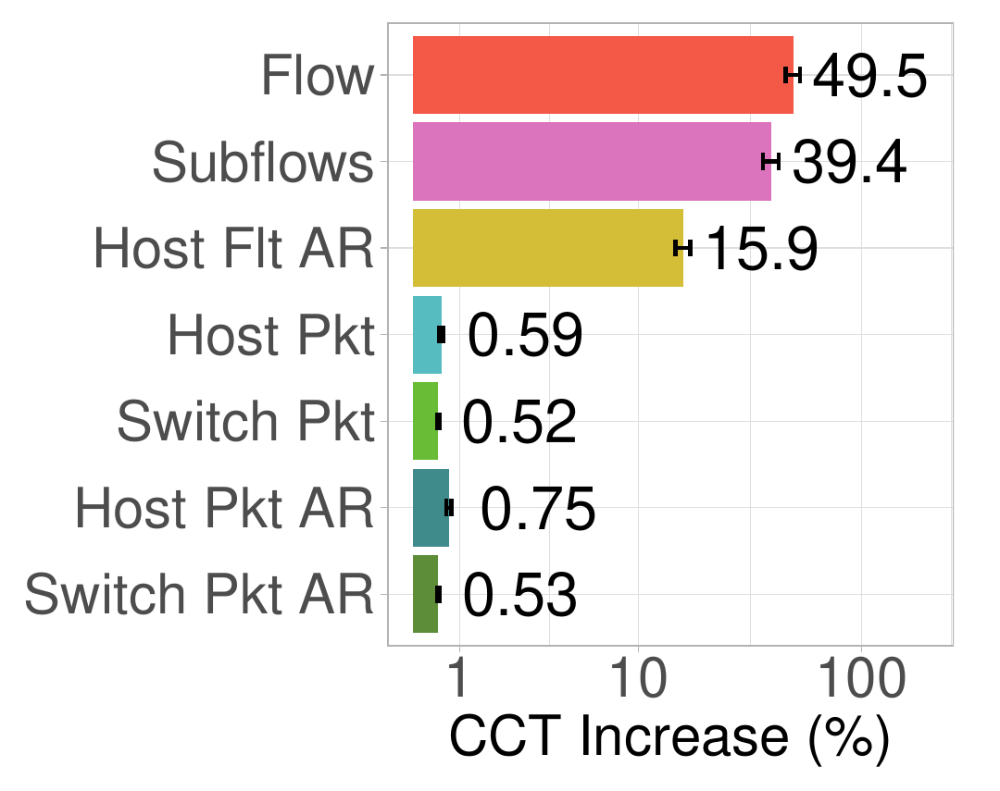 <em>图 1a：All-to-All。</em></td>
    <td align="center" width="50%">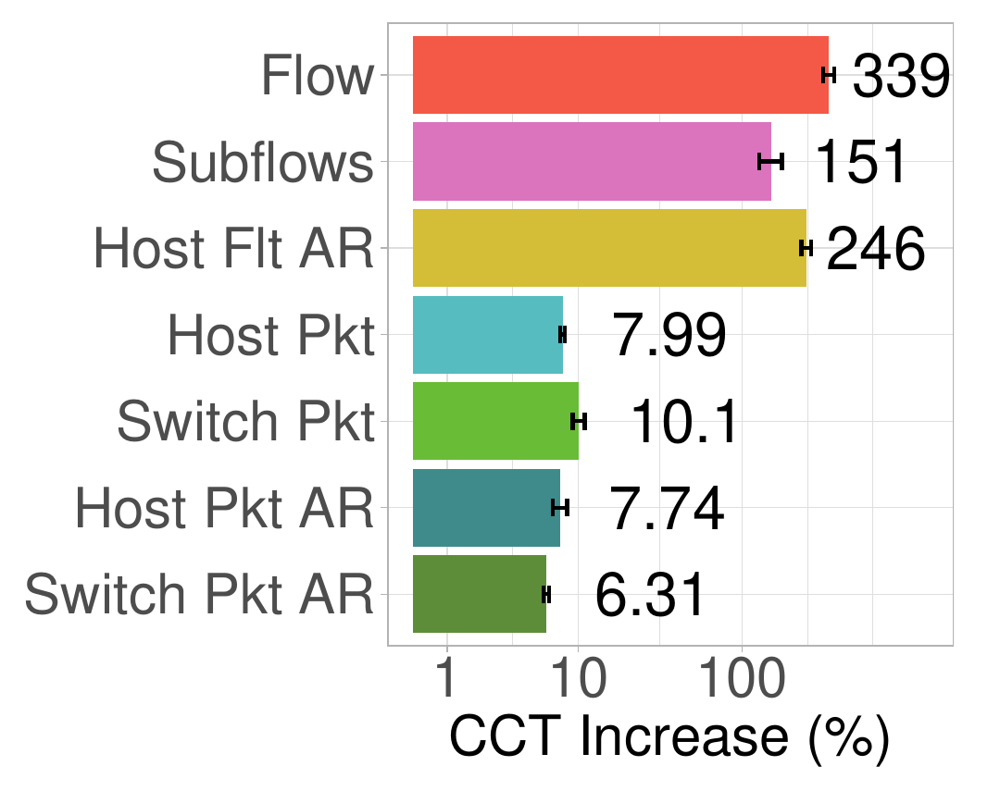 <em>图 1b：Permutation。</em></td>
  </tr>
</table>

<em>图 1：理想丢包恢复下，不同负载均衡方案的完成时间增长。AR 表示 adaptive routing。</em>

All-to-All 中，packet-based 方案基本能做到距离下界 1% 以内。Permutation 的归一化差距更大，因为它的理想完成时间更短，任何队列或乱序开销在百分比上都会被放大。Subflow 在 permutation 里比 All-to-All 更有帮助，因为 permutation 的 flow 数较少，额外 subflow 能增加路径熵；而 All-to-All 本身已经有很多 flow。

Flowlet 的表现不稳定。它在 All-to-All 中还可以接近最优，但在 permutation 中甚至不如 subflow。原因是 permutation 里大部分流量会在第一个 BDP 内发完，等拥塞反馈回来再换路径已经偏晚。

### 5.3 故障场景

故障会让网络不再对称，因此“所有路径平均分”未必合理。论文先随机让 edge-aggregation 和 aggregation-core 链路以 1% 概率失效，然后讨论路由收敛时间 $G$ 的影响。

  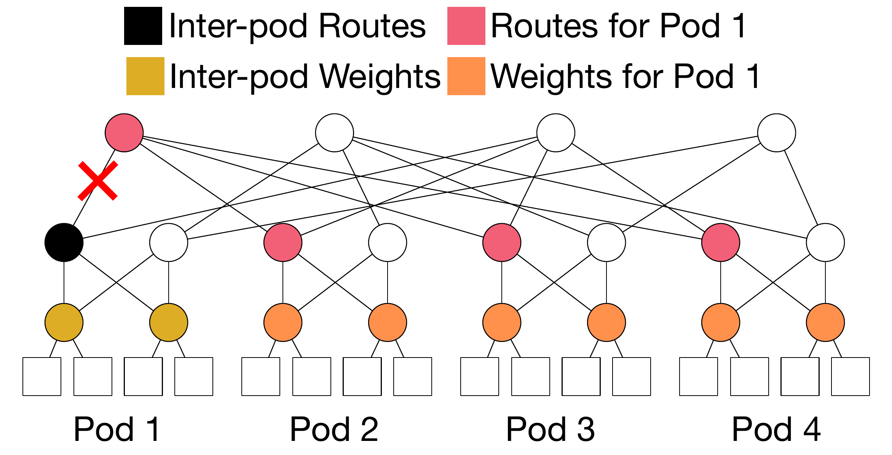
   <em>图 2：链路故障后需要更新路由或负载均衡状态的交换机。</em>

当一条链路失败时，本地 switch 需要把这条链路从 next-hop 组里移除，其他 switch 也需要通过 BGP 等路由协议获知故障并更新路由或 W-ECMP 权重 [60, 61]。不同系统报告的收敛时间跨度很大，从几十微秒到几百毫秒都有。论文用 $G$ 表示全局收敛时间。

如果 $G=∞$，也就是 collective 完成前路由一直没有收敛，那么 Host Pkt AR 明显占优。原因是 host 可以通过 timeout/ACK 看到端到端路径 label 的表现，识别失败路径并避免它；switch 侧 AR 只能看到本地队列，失败链路的队列可能反而很短，导致 switch 仍然继续选择它。

<table align="center">
  <tr>
    <td align="center" width="50%">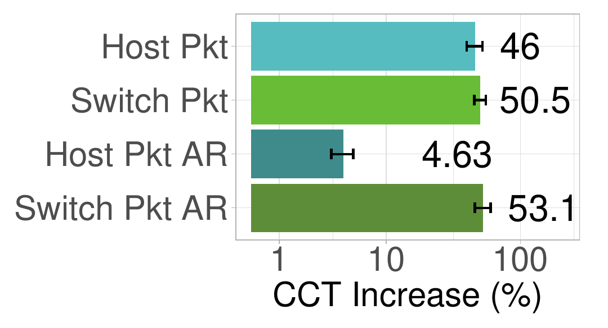 <em>图 3a：All-to-All。</em></td>
    <td align="center" width="50%">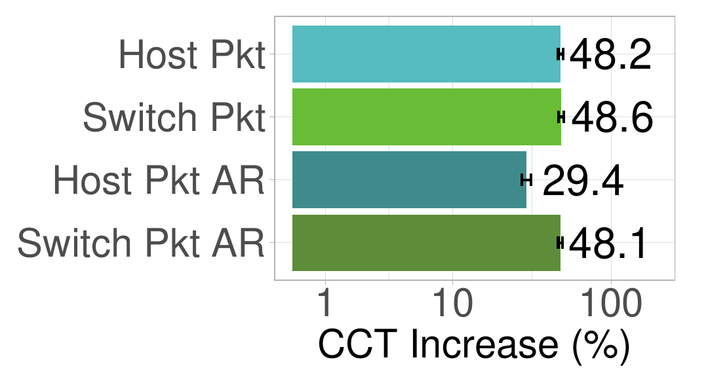 <em>图 3b：Permutation。</em></td>
  </tr>
</table>

<em>图 3：随机链路故障，单链路故障率 1%，且 G=∞ 时的 CCT 增长。</em>

当 $G$ 从很小逐步变大时，switch 侧和 host 侧方案的差距也逐步拉开。对于 All-to-All，低 $G$ 时两者接近；当 $G$ 增大，host 侧 adaptive 方案更好。Permutation 的 CCT 很短，只有 2 到 3 个 RTT，因此它需要非常快的收敛，通常 1 RTT 左右才能明显限制性能退化。

<table align="center">
  <tr><td align="center" colspan="2"></td></tr>
  <tr>
    <td align="center" width="50%">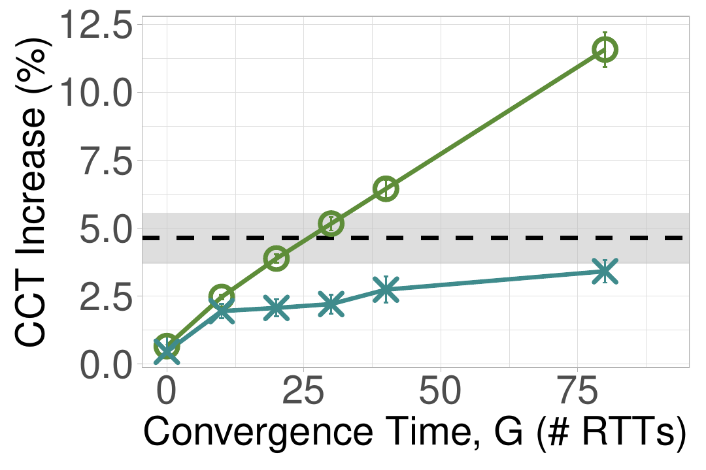 <em>图 4a：All-to-All。</em></td>
    <td align="center" width="50%">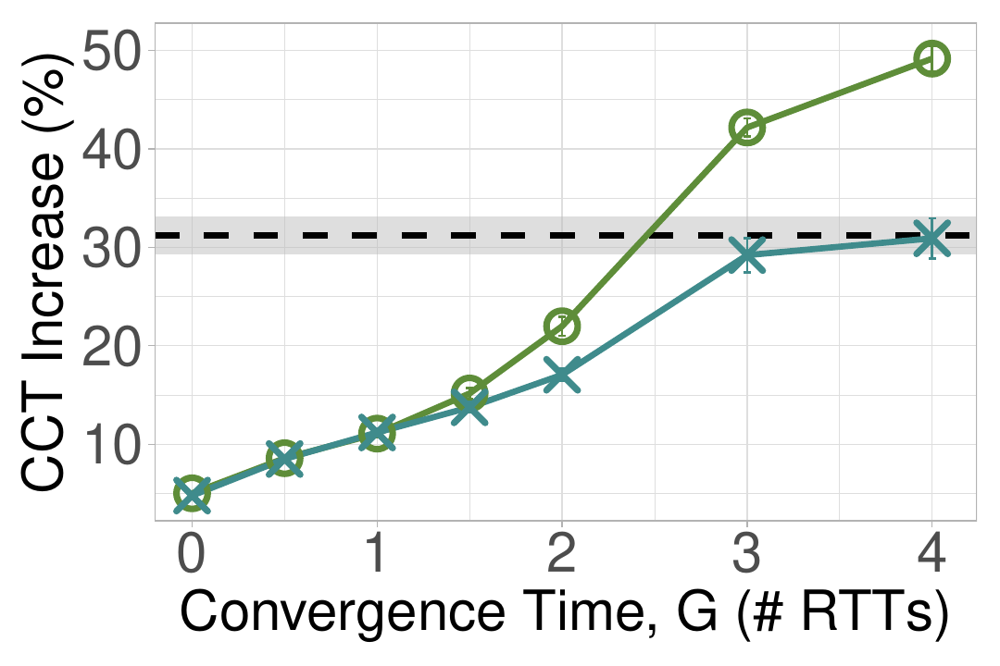 <em>图 4b：Permutation。</em></td>
  </tr>
</table>

<em>图 4：随机链路故障下，不同收敛时间对 CCT 的影响。下界已经考虑故障后的 rho_max。</em>

如果 $G=0$，即 collective 开始前路由已经收敛，那么 host spraying 和 switch spraying 又重新变得接近。随着故障率增大，整体性能会变差，但不同 spraying 方案之间的相对差距不大。

<table align="center">
  <tr><td align="center"></td></tr>
  <tr><td align="center">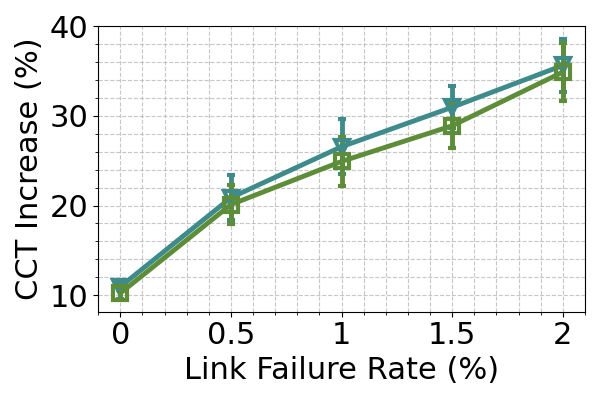</td></tr>
</table>

<em>图 5：G=0 时，随机链路故障率对 CCT 的影响。CCT 相对无故障最佳情况归一化。</em>

这一节的 takeaway 是：packet 粒度是必要的；无故障或已收敛故障场景里，host 和 switch packet spraying 接近；慢收敛故障场景里，host 侧端到端视角更有价值。

## 6. 负载均衡最优性

前面的实验说明 packet spraying 很强，但还没有回答“它是不是最优”。本文把最优性定义为：在最大利用率下，消息大小为 $m$ 时，所有 switch 队列在整个发送期间的平均队列长度 $q(m)$ 是否能保持为常数。若 $q(m)=O(1)$，就称其达到最优队列尺度。

为什么用队列长度作为标准？因为在固定传播延迟、均匀流量、理想发送速率、零开销丢包恢复这些假设下，队列长度是 CCT 可变部分的主要来源。$O(1)$ 队列也意味着延迟更可预测，拥塞检测和丢包检测更容易。

论文分析了三层 $k$-ary fat-tree 上，$n$ 个 host 执行 random permutation collective 的情况。被分析的简化算法包括：

- Simple RR：switch 侧简单 round-robin，不周期性重排。
- JSQ：Join Shortest Queue，switch 选择最短队列端口。
- RSQ：Randomized Switch Queueing，switch 随机选择 next-hop。
- Host Pkt：host 随机 packet spraying。
- Host DR：DRB，也就是 host 侧 destination-based rotation。
- Ofan：本文提出的 switch 侧 destination-based rotation。

<table>
  <tr><th>方案</th><th>队列增长</th><th>对应简化对象</th><th>简化点</th></tr>
  <tr><td>Simple RR</td><td>Θ(m)</td><td>Switch Pkt</td><td>不周期性重排</td></tr>
  <tr><td>JSQ</td><td>Θ(m)</td><td>Switch Pkt AR</td><td>不做队列量化</td></tr>
  <tr><td>RSQ</td><td>Ω(√m)</td><td>Switch Pkt AR</td><td>只有一个量化桶</td></tr>
  <tr><td>Host Pkt</td><td>Ω(√m)</td><td>-</td><td>-</td></tr>
  <tr><td>Host DR/DRB</td><td>Θ(1)</td><td>-</td><td>-</td></tr>
  <tr><td>Ofan</td><td>Θ(1)</td><td>-</td><td>-</td></tr>
</table>
 <em>表 3：理论分析中的算法模型与队列增长结果。</em>

论文的第一个结论是 Simple RR 和 JSQ 都会出现线性队列增长：

$$
q=\Theta(m)
$$

这个结果有点反直觉，因为 JSQ 经常被认为是接近最优的局部负载均衡方式。问题来自 collective 的同步性。所有 sender 发相同大小的消息、相同大小的包，并以相同速率发送。这样会导致一个 sender 的连续 packet 黏在同一条上行链路上；在 fat-tree 结构中，它们又会被迫从源 pod 的某个 aggregation switch 黏到目的 pod 对应位置的 aggregation switch，最后在目的 edge 的下行链路上和其他 sticky flow 相撞，队列线性增长。

第二个结论是随机 spraying 也不是最优：

$$
q=\Omega(\sqrt{m})
$$

随机选择让队列像零漂移随机游走，平均不会爆炸到线性，但标准差会随 $\sqrt{m}$ 增长，因此不能保持 $O(1)$。

为达到 $O(1)$，论文借鉴 DRB [39]，抽象出 Destination-Based Rotation，简称 DR。DR 的核心是：按目的端维护 round-robin 指针。同一个目的端的流量被周期性、均匀地分配到可用路径上。这样一来，不仅上行链路均衡，下行到目的端的链路也均衡。

Host DR 通常在每个源 host 上为每个 `(destination host, packet-size bin)` 维护指针。对每个源宿对，它找到拓扑中最低公共层，然后在这一层的公共 switch 之间 round-robin。例如跨 pod 通信会在 core switch 之间轮转。它可以达到近似：

$$
q \approx \Theta(1)
$$

但是 Host DR 有两个问题：host 需要知道完整拓扑和故障可达性；并且它的 per-destination 指针太细，流量被分散到太多指针上，小消息时不够平滑。

图 6 验证了理论趋势。Simple RR 和 JSQ 的队列接近线性增长；Host Pkt、RSQ、Host Pkt AR、Switch Pkt AR 更接近平方根增长；Host DR 和 Ofan 接近 $O(1)$。

<table align="center">
  <tr><td align="center" colspan="2">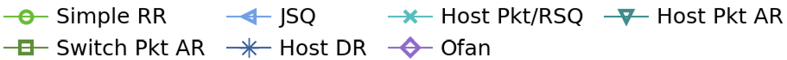</td></tr>
  <tr>
    <td align="center" width="42%">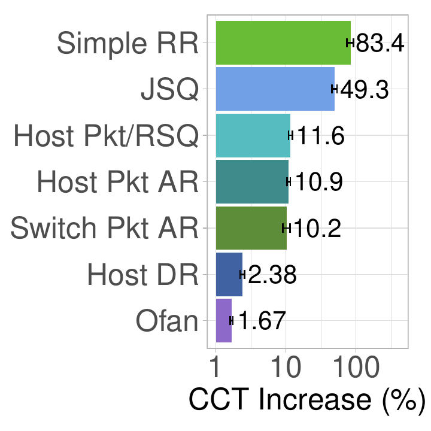 <em>图 6a：CCT 增长。</em></td>
    <td align="center" width="58%">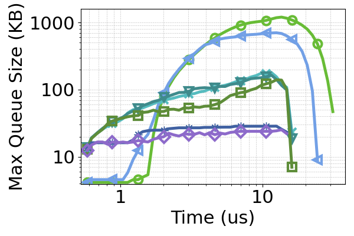 <em>图 6b：最大队列长度。</em></td>
  </tr>
</table>

<em>图 6：packet-based LB 算法比较。</em>

## 7. Ofan

Ofan 是本文提出的 switch 侧 DR 实现。它的目标是在不改 host、不要求 host 掌握全局拓扑的前提下，获得 DR 的 $O(1)$ 队列性质。

### 7.1 为什么 DR 最优

普通 Simple RR 只按 next-hop group 做轮转。packet 的 destination 决定它属于哪个 next-hop group，但不决定它在这个 group 里选择哪条具体链路。因此 Simple RR 能把上行链路打匀，却不能保证“到某个特定目的端”的流量被均匀分配到所有下行链路。Fat-tree 的 southbound 路径从 core 到 destination 往往没有再次负载均衡的机会，一旦某个 destination 的流量偏向某个 core，就会在下行阶段形成热点。

DR 的区别在于：它显式按 destination 做轮转。对任意特定 destination，它的流量在 core 等关键层上都是均衡的，因此下行链路也均衡。这是它可以避免 collective 同步效应的关键。

### 7.2 Ofan 如何减少指针数量

如果每台 switch 为每个 destination host 维护指针，状态会太大。Ofan 利用 fat-tree 的结构，把 destination 按拓扑位置合并。

具体来说：

- 源 edge switch $E$ 为每个 destination edge switch $F$ 维护一个指针，其中 $F \ne E$。
- 源 aggregation switch $A$ 为每个 destination aggregation switch 或 destination pod 维护一个指针。
- 一个 edge switch 对所有发往同一个 destination edge 的流量做轮转。
- 一个 aggregation switch 对所有发往同一个 destination aggregation/pod 的流量做轮转。

为什么这样仍然正确？因为某些 switch 是 mandatory waypoint。比如目的 host 所在的 edge switch 是所有到该 host 路径必经的；在三层 fat-tree 中，aggregation 层也有类似的结构约束。Ofan 把共享 mandatory waypoint 的 destination 合并到一个虚拟 flow 里，从而减少指针数量，同时保留 per-destination balancing 的性质。

以 $k=64$、约 65K GPU 的 fat-tree 为例，每台 edge switch 需要约 2K 个指针，每台 aggregation switch 只需要 63 个指针。这个规模比 host per-destination 更可控。

Ofan 的理论结果是：

$$
q \approx \Theta(1)
$$

### 7.3 实现

Ofan 只需要修改 switch 的调度逻辑，不需要 host 修改，也不需要 host 封装、tunneling 或掌握全局拓扑。故障信息仍然可以通过 BGP W-ECMP 传播 [74, 75, 76]。

实现上，edge switch 维护 `(destination edge switch, quantized packet size)` 的指针；aggregation switch 维护 `(destination pod, quantized packet size)` 的指针。论文仿真中只使用两个 packet-size bin：data packet 和 ACK packet。每个指针启动时随机选择初始 uplink port 和随机 round-robin 顺序，避免不同指针同步。

图 7 展示了为什么 Ofan 有优势。Simple RR 和 JSQ 在上行链路上负载均衡很好，但在下行链路上过载；Host DR 在大消息上好，但小消息因为指针太多、每个指针流量太薄而不稳；Ofan 合并 destination 后，小消息和大消息都更稳定。

<table align="center">
  <tr><td align="center" colspan="2"></td></tr>
  <tr>
    <td align="center" width="50%">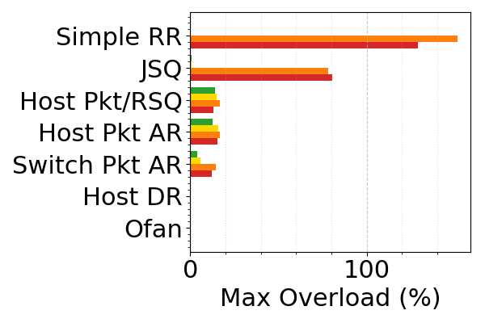 <em>图 7a：1 MB 消息。</em></td>
    <td align="center" width="50%">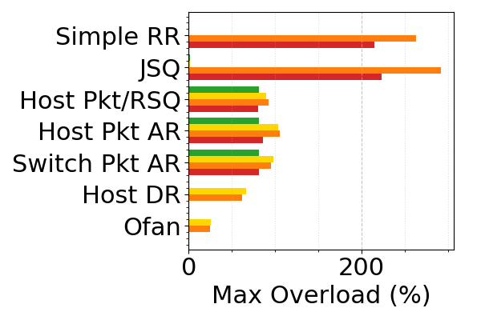 <em>图 7b：32 KB 消息。</em></td>
  </tr>
</table>

<em>图 7：不同阶段链路的 worst-case overload，分别对应 1 MB 和 32 KB 消息。</em>

## 8. 敏感性分析

论文继续检查网络规模、buffer 大小、message size、packet size、loss recovery、CCA 以及真实训练场景。整体结论是：相对排序基本稳定，Ofan 一直是最强的方案之一。

### 8.1 网络规模

随着网络节点数增加，方案之间的相对排序和性能差距仍然保持。也就是说，Ofan 的收益不是小规模仿真的偶然现象。

<table align="center">
  <tr><td align="center" colspan="2"></td></tr>
  <tr>
    <td align="center" width="50%">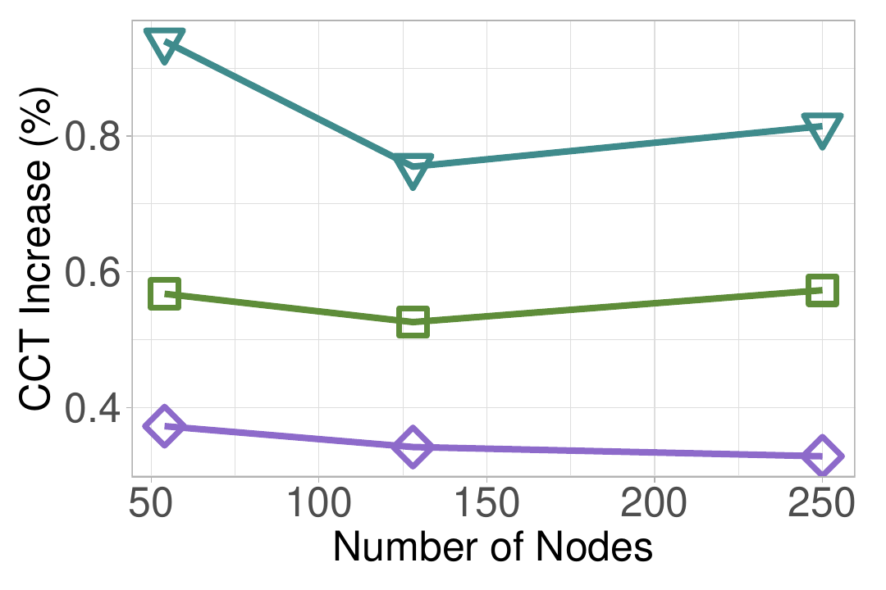 <em>图 8a：All-to-All。</em></td>
    <td align="center" width="50%">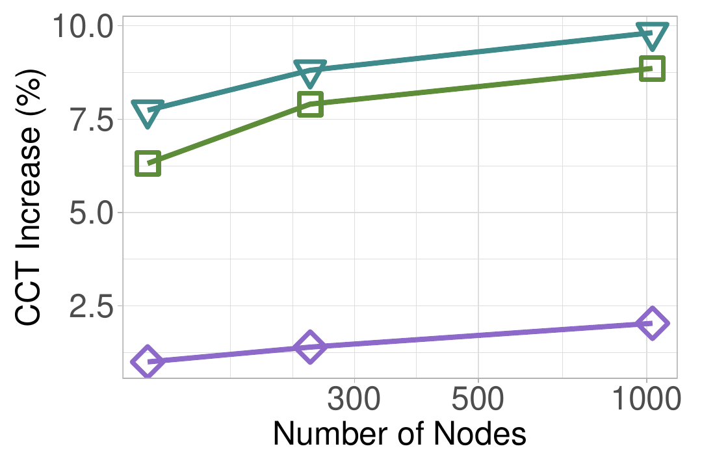 <em>图 8b：Permutation。</em></td>
  </tr>
</table>

<em>图 8：网络规模增加时的 CCT 增长。</em>

### 8.2 Buffer 大小

当 buffer 只有 20 个 data packet，也就是默认值的十分之一时，permutation 场景下 Switch Pkt AR 有时会超过 Host Pkt AR，因为 switch 更直接地控制局部队列长度。但 Ofan 依然持续优于其他方案。

<table align="center">
  <tr>
    <td align="center" width="50%">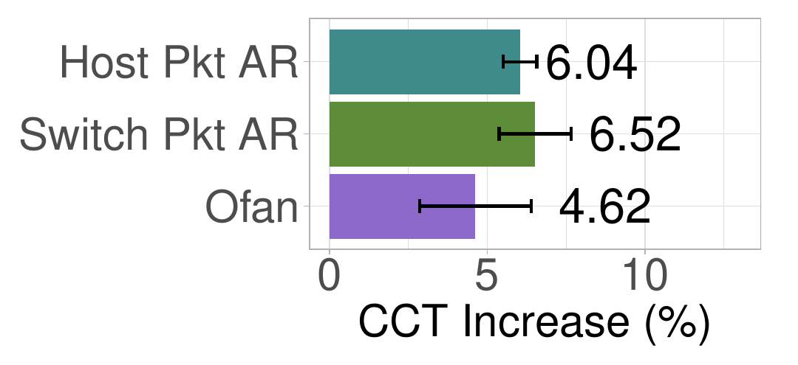 <em>图 9a：All-to-All。</em></td>
    <td align="center" width="50%">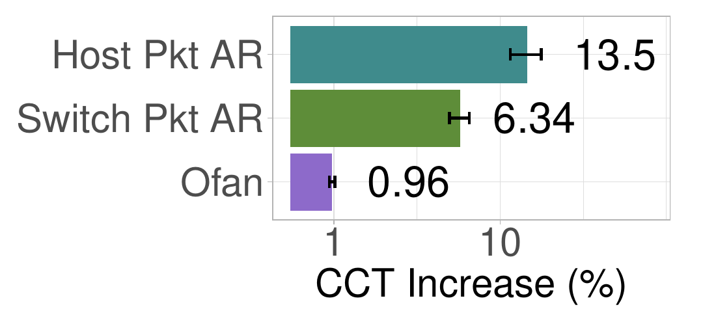 <em>图 9b：Permutation。</em></td>
  </tr>
</table>

<em>图 9：短 buffer，即 20 个 packet buffer 时的 CCT 增长。</em>

### 8.3 Message size

随着 message size 增加，方案排序基本不变，但归一化差距会缩小。原因是 message 越大，理想 CCT 本身越大，固定量级的队列开销在百分比上变小。Host Pkt AR 在特别大的 message 下会变差，论文推测原因是 REPS 的 freezing mode 被 timeout 触发。

<table align="center">
  <tr><td align="center" colspan="2"></td></tr>
  <tr>
    <td align="center" width="50%">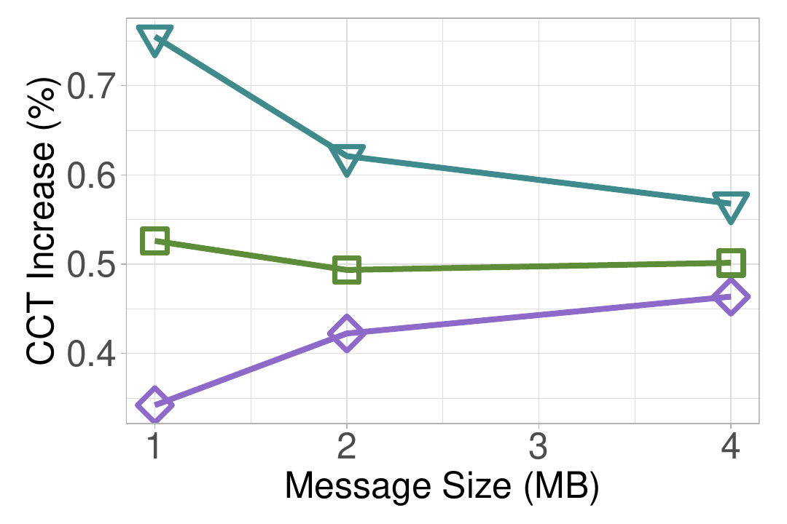 <em>图 10a：All-to-All。</em></td>
    <td align="center" width="50%">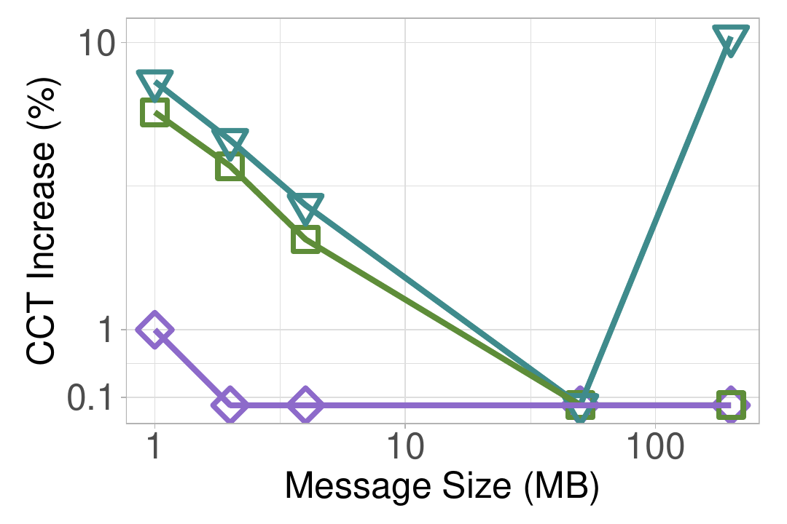 <em>图 10b：Permutation。</em></td>
  </tr>
</table>

<em>图 10：message size 增加时的 CCT 增长。</em>

### 8.4 Packet size

Packet size 是一个重要但经常被忽略的参数。大包减少 header 开销，但会增加 queueing delay；小包降低队列粒度，但 header 和 gap 开销更高。论文给出一个简单模型：发送 $D$ 字节消息，packet 总大小为 $P$，header/gap 等开销为 $H$。对 DR 这类 $O(1)$ 队列方案，如果网络队列可建模为常数 $\alpha$ 个 packet，则最优 payload 大小满足：

$$
P-H=\sqrt{\frac{H}{\alpha}\cdot D}
$$

也就是说，对于 Ofan 这类 $O(1)$ 队列方案，最优 payload 随 $\sqrt{D}$ 增长。而对于队列按平方根增长的 spraying 算法，最优 packet size 只按 $\Theta(D^{1/3})$ 增长。

<table align="center">
  <tr><td align="center" colspan="2"></td></tr>
  <tr>
    <td align="center" width="50%">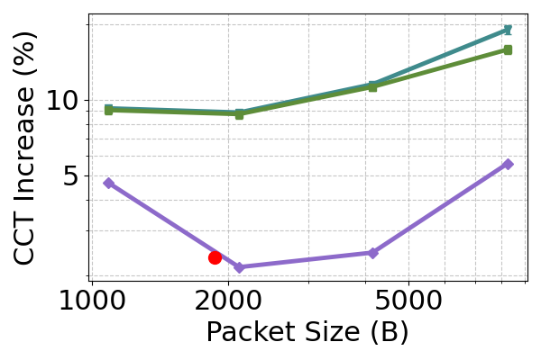 <em>图 11a：0.5 MB 消息。</em></td>
    <td align="center" width="50%">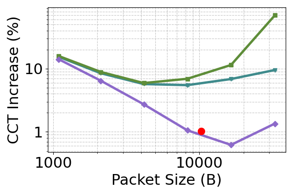 <em>图 11b：16 MB 消息。</em></td>
  </tr>
</table>

<em>图 11：两种 message size 下，packet size 对 CCT 的影响。</em>

### 8.5 Loss recovery

论文用 SACK-based loss recovery 评估更真实的丢包恢复。因为 packet spraying 会造成乱序，系统需要一个阈值 $x$ 来区分“只是乱序”还是“真的丢包”。经验 sweep 后，ATA 的最佳阈值约为 $x=6$，permutation 的最佳阈值约为 $x=32$。加入 SACK 后，核心结论不变：已有 spraying 方案接近，而 Ofan 仍然最好。

<table align="center">
  <tr>
    <td align="center" width="50%">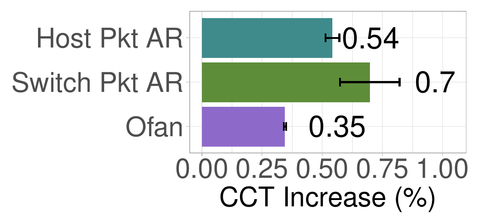 <em>图 12a：All-to-All。</em></td>
    <td align="center" width="50%">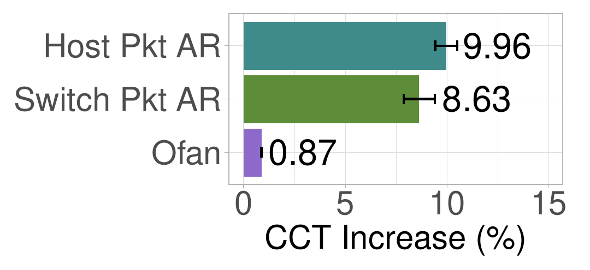 <em>图 12b：Permutation。</em></td>
  </tr>
</table>

<em>图 12：使用 SACK-based loss recovery 时各 LB 方案的 CCT 增长。</em>

### 8.6 Congestion control

Swift 原本面向单路径，遇到 packet spraying 时会出现吞吐崩塌，所以论文使用 MSwift。MSwift 通过 LTCP 风格机制处理乱序导致的 duplicate ACK，并加入机制避免 Swift 在 spraying 下的 throughput collapse [49, 85]。

短消息时，CCA 影响不大；长消息时，CCA 会让 Host Pkt AR 和 Switch Pkt AR 降速来维持稳定队列，CCT inflation 增加约 10%。Ofan 因为队列本身接近常数，不需要明显降速，因此在长消息下收益更大。

<table align="center">
  <tr>
    <td align="center" width="50%">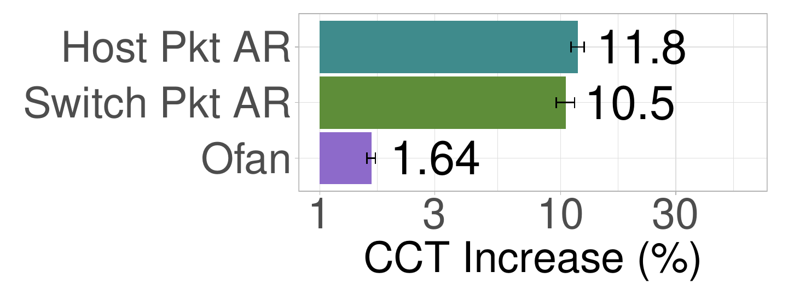 <em>图 13a：1 MB 消息 CCT。</em></td>
    <td align="center" width="50%">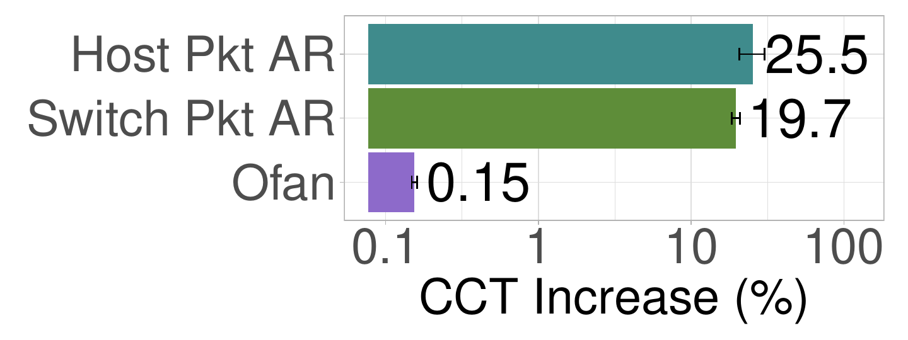 <em>图 13b：16 MB 消息 CCT。</em></td>
  </tr>
</table>

<em>图 13：使用 MSwift CCA 时的 packet-based LB 算法比较。</em>

### 8.7 训练场景

最后，论文模拟 Llama-3 7B、70B、405B 在 1024 GPU 集群上用 FSDP 训练的通信。集群为 128 台服务器，每台 8 个 GPU。论文关注 FSDP backward pass 的主要网络瓶颈：gradient 的 ReduceScatter 和 weight 的 AllGather。

仿真假设 FP8 精度、4 KB packet payload。每个 flow 的 packet 数量约为：7B 模型 104 个，70B 模型 418 个，405B 模型 1570 个。开启 MSwift 和 loss recovery 后，Ofan 的相对优势随模型规模增大而增大。在 405B 场景下，Ofan 相对 baseline 将 CCT increase 降低了 52 倍。原因是 Host/Switch Pkt AR 需要被 CCA 限速以保持队列稳定，而 Ofan 队列更短、利用率更高。

<table align="center">
  <tr><td align="center" colspan="3"></td></tr>
  <tr>
    <td align="center" width="33%">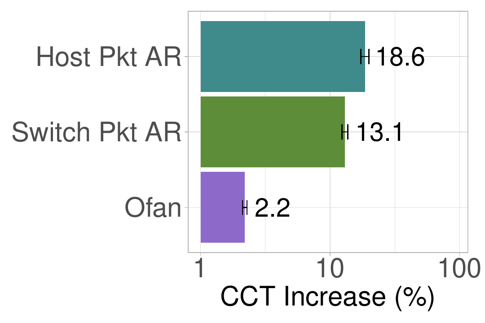 <em>图 14a：7B CCT 增长。</em></td>
    <td align="center" width="33%">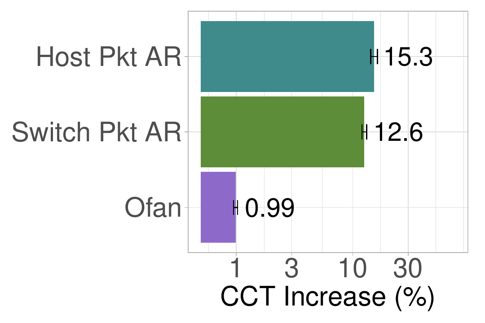 <em>图 14b：70B CCT 增长。</em></td>
    <td align="center" width="33%">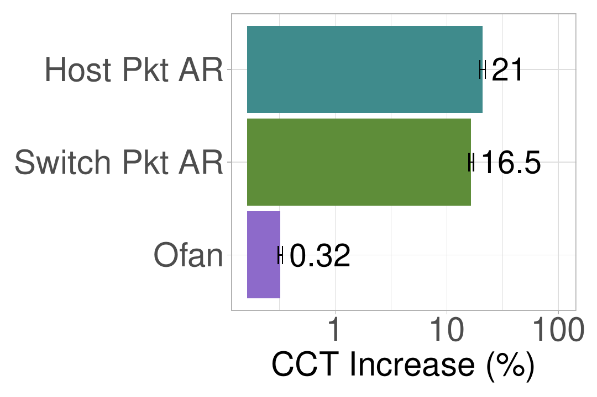 <em>图 14c：405B CCT 增长。</em></td>
  </tr>
  <tr>
    <td align="center" width="33%">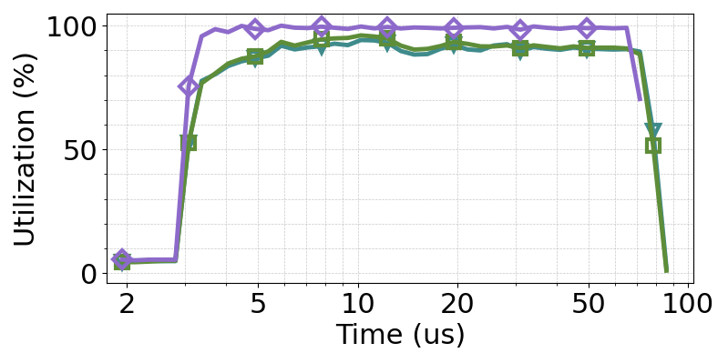 <em>图 14d：405B 利用率。</em></td>
    <td align="center" width="33%">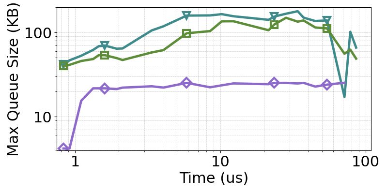 <em>图 14e：405B 最大队列。</em></td>
    <td width="33%"></td>
  </tr>
</table>

<em>图 14：Llama 7B、70B、405B 使用 FSDP 时的通信表现。</em>

## 9. 相关工作与结论

已有负载均衡研究非常多，从 ECMP、MPTCP、flowlet、CONGA/HULA，到 pFabric、NDP、REPS、Spectrum-X 等都有不同取舍。本文和许多工作的区别在于：它不评估一个完整协议栈，而是把负载均衡单独抽出来比较，并把 AI training collective 作为目标负载。

结论是：AI 训练网络中，packet-level spraying 基本是必要方向；host 和 switch spraying 在无故障时性能接近，但慢收敛故障下 host 有优势；现有主流 packet spraying 仍然无法达到最优队列尺度；destination-based rotation 是达到 $O(1)$ 队列的关键；Ofan 则展示了这种思想可以在 switch 侧以较少状态实现。

## 附录 A. 随机故障下的发送速率

随机故障可能导致网络容量不足。即使理论上存在一个 traffic engineering 解，可以让流量以某个最优速率 $\rho_{opt}$ 通过网络，普通负载均衡也未必能达到，因为它通常只会在可用路径上平均分流。

因此论文定义 $\rho_{max}$：在所有 flow 均匀分配到可用路径的假设下，网络可支持的最大每流速率。计算方式是统计每条链路承载的 flow 单位，找到最重的瓶颈链路。若瓶颈链路总 flow 为 $F$，链路带宽为 $B$，则：

$$
\rho_{max}=\frac{B}{F}
$$

这个值偏保守，但保证在故障下需求不会超过网络容量，并且仍然能区分不同 LB 方案。

## 附录 B. Permutation CCT 下界

Permutation collective 中，每个 host 同时是发送者和接收者，因此 data packet 和 ACK packet 会产生对称交互。论文把过程分成三个阶段：只发送 data；data 和 ACK 交替；最后只发送 ACK。

  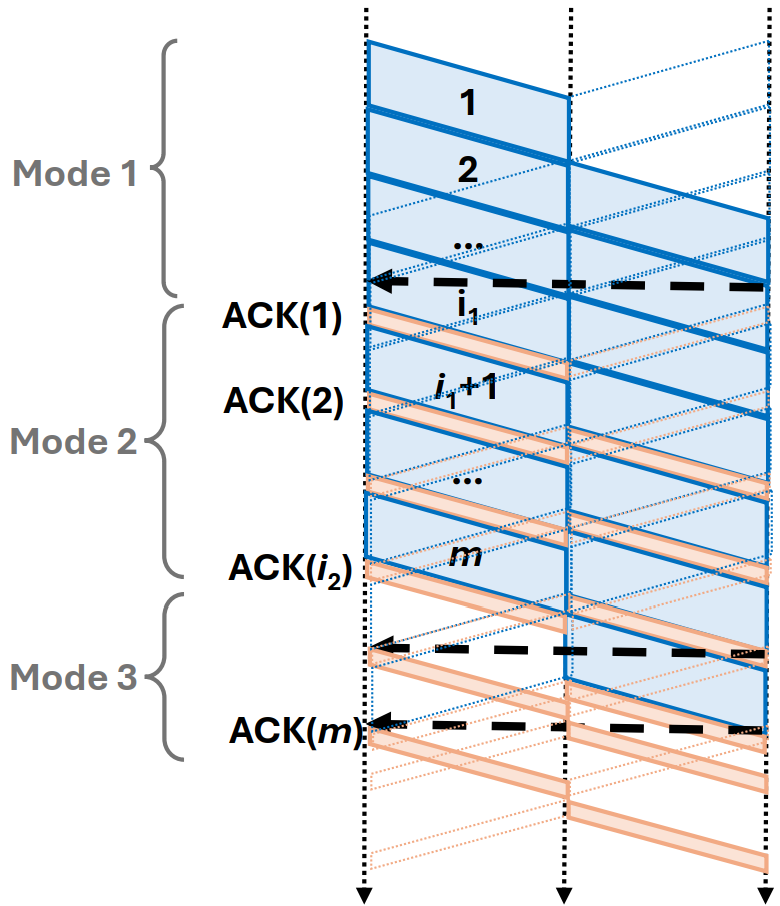
   <em>图 15：Permutation collective 中 data 与 ACK 的对称动态。</em>

设 data 和 ACK 的序列化时间分别为 $T_d$ 和 $T_a$，packet gap 为 $T_g$，单向传播时间为 $p$，跳数为 $H=6$，并设 $d=T_d+T_g$、$a=T_a+T_g$。第一个 data packet 到达接收端时间为：

$$
t_1=p+H\cdot T_d
$$

接收端开始发送 ACK 前，自己已经发送了若干 data packet。该数量为：

$$
i_1=\left\lceil\frac{p+(H-1)T_d}{d}\right\rceil+1
$$

在默认设置中，$i_1=78$。也就是说，在开始发送 ACK 前，每个 sender 至少会连续发送 78 个 data packet。对于 $m=256$ 的消息大小，论文得到 permutation CCT 下界为 17.05694 微秒，仿真实测最小值为 17.0587 微秒，说明这个下界非常紧。

## 附录 C. 同步效应证明

Simple RR 和 JSQ 的线性队列来自三件事。

第一，第一批 packet 会形成 perfect match。一个 edge switch 若没有内部流量，多个 flow 的第一批 packet 会被分到不同 uplink 端口。

第二，后续 packet 会 sticky。对于 RR，round-robin 的周期使同一 flow 的下一包回到同一端口；对于 JSQ，由于服务完成时刻和 packet 到达时刻同步，原端口往往又成为唯一最短队列。

第三，fat-tree 的 aggregation switch 编号会把这种 sticky 从源 pod 带到目的 pod。若两个 flow 选择了同一个 aggregation index，并且目的 edge 相同，它们就会在目的 aggregation 到目的 edge 的下行链路上同步碰撞，队列线性增长。

<table align="center">
  <tr>
    <td align="center" width="50%">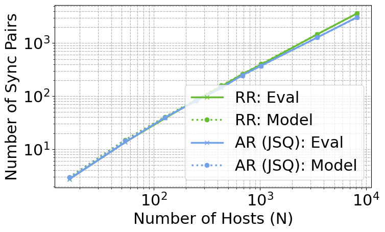 <em>图 16a：同步 flow pair 数量。</em></td>
    <td align="center" width="50%">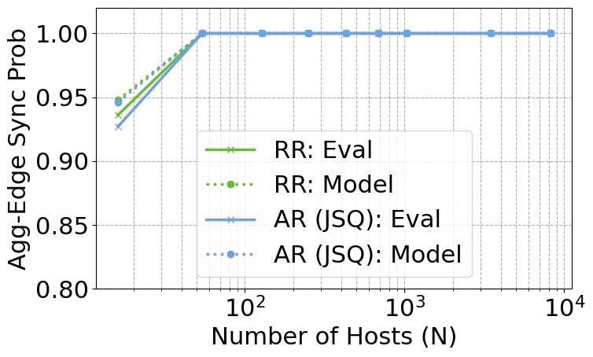 <em>图 16b：aggregation-edge 同步概率。</em></td>
  </tr>
</table>

<em>图 16：aggregation-edge 链路上的同步模式。</em>

## 附录 D. 平方根增长证明

随机 spraying 的队列可以近似看作临界负载下的随机游走。一个 edge switch 的某个 uplink 接收来自 $k/2$ 个周期流的稀疏随机采样，每个 flow 以概率 $1/(k/2)$ 进入该队列，因此到达率等于服务率，漂移为零。队列长度随时间呈反射 Brownian motion 风格增长：

$$
Q(m)\approx \sqrt{1-\frac{1}{k/2}}\cdot\sqrt{\frac{2}{\pi}m}
$$

这解释了为什么 Host Pkt 和 RSQ 至少是 $\Omega(\sqrt{m})$，而不是 $O(1)$。

## 附录 E. Host DR 和 Ofan 的队列模型

Host DR 的流量可以看作许多带随机相位的周期流叠加，因此论文用 $N\cdot D/D/1$ 队列模型近似。这个模型在到达率等于服务率时仍然可以有有界平均队列，这是 Host DR 能达到 $\Theta(1)$ 的直观原因。

<table align="center">
  <tr><td align="center">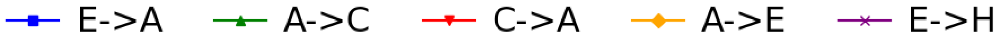</td></tr>
  <tr><td align="center">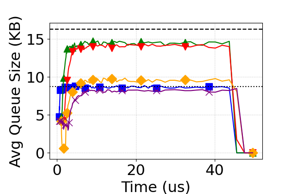</td></tr>
</table>

<em>图 17：Host DR 的队列模型。五个 switch 层的平均队列长度与模型预测对比。</em>

Ofan 的模型类似，但由于 Ofan 会合并 destination 指针，指针数和每个指针承载的流量都不同。对于 source edge switch，$k/2$ 个 flow 会落到约 $k^2/2$ 个 destination edge bin 中，distinct destination edge 的期望约为 $k/2-1/4$。aggregation 层最多有 $k-1$ 个 destination pod 指针。

  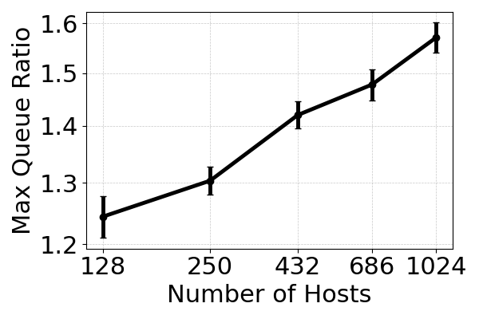
   <em>图 18：Ofan 与 Host DR 最大队列比值随 host 数变化。</em>

图 18 说明网络越大，Ofan 相对 Host DR 的优势越明显。原因是 Host DR 的指针粒度太细，网络越大，流量越被摊薄；Ofan 的 destination consolidation 反而让每个指针有更多流量，轮转更平滑。

<table align="center">
  <tr><td align="center"></td></tr>
  <tr><td align="center">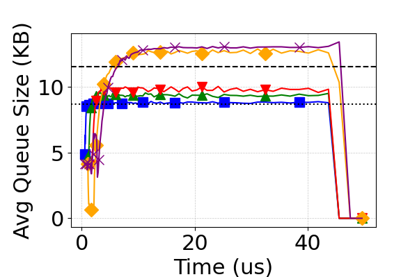</td></tr>
</table>

<em>图 19：Ofan 的队列模型。五个 switch 层的平均队列长度与模型预测对比。</em>

## 附录 F. 实现细节

Ofan 需要处理故障后的非对称网络。论文建议复用 W-ECMP。对每个 destination switch，source switch 先得到各端口的原始权重，再除以最大公约数得到简化权重，随机打乱端口顺序，最后抽取一个 Interleaved Weighted Round-Robin schedule。

例如 4 个 uplink 端口权重为 `[1600, 1600, 1600, 800]`，可以简化为 `[2, 2, 2, 1]`。若随机顺序是 `[P3, P2, P4, P1]`，一个可用 IWRR schedule 是 `[P3, P2, P4, P1, P3, P2, P1]`，其中 `P4` 出现次数是其他端口的一半。

对于 $k=64$、约 65K host 的三层 fat-tree，edge switch 原本可能需要最多 2047 个 destination-edge schedule。论文利用三层 fat-tree 的性质，把 schedule 共享到 per-destination-pod 级别，只保留 $k$ 个 schedule，即在 $k=64$ 时减少 32 倍。

论文还指出一个 corner case：All-to-All、无初始故障、满线速、无 CCA，然后 core 链路突然失败。在这种情况下，round-robin 可能让每个 flow 锚定到唯一 core，失败会导致该 flow 的包持续丢失。实际系统中 CCA 应该会在几个 RTT 内降速并打破同步。

## 附录 G. 最优 packet size

CCT 中和 packet size 相关的部分主要有两项：发送消息的时间和排队时间。发送 $D$ 字节消息，packet 总大小为 $P$，header/gap 开销为 $H$，链路速率为 $C$，发送时间为：

$$
\frac{D}{P-H}\cdot\frac{P}{C}
$$

如果队列开销是常数 $\alpha$ 个 packet，则排队时间为：

$$
\alpha\cdot\frac{P}{C}
$$

因此需要最小化：

$$
P\left(\frac{D}{P-H}+\alpha\right)
$$

求导得到最优 payload：

$$
P-H=\sqrt{\frac{H}{\alpha}\cdot D}
$$

论文图 11 的近似取 $H=82$ B，$\alpha=10$ 个 data packet。

## 参考文献

[1] Adithya Gangidi et al. RDMA over Ethernet for distributed training at Meta scale. ACM SIGCOMM, 2024.

[2] Mubashir Adnan Qureshi et al. PLB: Congestion Signals are Simple and Effective for Network Load Balancing. ACM SIGCOMM, 2022.

[3] Ultra Ethernet Consortium. Ultra Ethernet Consortium. 2026.

[4] Vamsi Addanki, Prateesh Goyal, Ilias Marinos, Stefan Schmid. Ethereal: Divide and Conquer Network Load Balancing in Large-Scale Distributed Training. arXiv, 2025.

[5] Ultra Ethernet Consortium. Ultra Ethernet Specification v1.0.2. 2026.

[6] NVIDIA Corporation. NVIDIA Spectrum SN5000 Series Switches.

[7] NVIDIA. Out-of-order Data Placement.

[8] Mohammad Alizadeh et al. pFabric: Minimal near-optimal datacenter transport. ACM SIGCOMM CCR, 2013.

[9] Mark Handley et al. Re-architecting datacenter networks and stacks for low latency and high performance. ACM SIGCOMM, 2017.

[10] Tommaso Bonato et al. REPS: Recycled Entropy Packet Spraying for Adaptive Load Balancing and Failure Mitigation. EuroSys, 2026.

[11] Dan Lenoski, Nandita Dukkipati. Google opens Falcon, a reliable low-latency hardware transport, to the ecosystem. Google Cloud Blog, 2023.

[12] Jie Lu et al. Alibaba Stellar: A New Generation RDMA Network for Cloud AI. ACM SIGCOMM, 2025.

[13] Kun Qian et al. Alibaba HPN: A Data Center Network for Large Language Model Training. ACM SIGCOMM, 2024.

[14] Chenchen Qi et al. SGLB: Scalable and Robust Global Load Balancing in Commodity AI Clusters. ACM SIGCOMM, 2025.

[15] NVIDIA Corporation. Collective Operations. NCCL Documentation, 2020.

[16] Shenggui Li, Siqi Mai. Paradigms of Parallelism. Colossal-AI Documentation.

[17] NVIDIA Corporation. NVIDIA Collective Communications Library (NCCL). 2025.

[18] Lean Wang et al. Auxiliary-Loss-Free Load Balancing Strategy for Mixture-of-Experts. arXiv, 2024.

[19] Samyam Rajbhandari et al. DeepSpeed-MoE: Advancing Mixture-of-Experts Inference and Training to Power Next-Generation AI Scale. arXiv, 2022.

[20] Jennifer Langston. Microsoft announces new supercomputer, lays out vision for future AI work. Microsoft, 2020.

[21] Naga Katta et al. Clove: Congestion-aware load balancing at the virtual edge. ACM CoNEXT, 2017.

[22] Erico Vanini et al. Let it flow: Resilient asymmetric load balancing with flowlet switching. USENIX NSDI, 2017.

[23] Mohammad Alizadeh et al. CONGA: Distributed congestion-aware load balancing for datacenters. ACM SIGCOMM, 2014.

[24] Vladimir Olteanu et al. An edge-queued datagram service for all datacenter traffic. USENIX NSDI, 2022.

[25] Qizhe Cai, Mina Tahmasbi Arashloo, Rachit Agarwal. dcPIM: Near-optimal proactive datacenter transport. ACM SIGCOMM, 2022.

[26] Christian Hopps. Analysis of an Equal-Cost Multi-Path Algorithm. RFC 2992, 2000.

[27] Costin Raiciu et al. Opportunistic mobility with multipath TCP. MobiArch, 2011.

[28] Srikanth Kandula et al. Dynamic load balancing without packet reordering. ACM SIGCOMM CCR, 2007.

[29] Siddhartha Sen et al. Scalable, optimal flow routing in datacenters via local link balancing. ACM CoNEXT, 2013.

[30] Advait Dixit et al. On the impact of packet spraying in data center networks. IEEE INFOCOM, 2013.

[31] Keqiang He et al. Presto: Edge-based load balancing for fast datacenter networks. ACM SIGCOMM CCR, 2015.

[32] Yanfang Le et al. STrack: A Reliable Multipath Transport for AI/ML Clusters. arXiv, 2024.

[33] Abdul Kabbani et al. FlowBender: Flow-level adaptive routing for improved latency and throughput in datacenter networks. ACM CoNEXT, 2014.

[34] Hong Zhang et al. Resilient datacenter load balancing in the wild. ACM SIGCOMM, 2017.

[35] David Zats et al. DeTail: Reducing the flow completion time tail in datacenter networks. ACM SIGCOMM, 2012.

[36] Cha Hwan Song et al. Network Load Balancing with In-network Reordering Support for RDMA. ACM SIGCOMM, 2023.

[37] Broadcom. Tomahawk3 / BCM56980 Series.

[38] Jonathan Perry et al. Fastpass: A centralized zero-queue datacenter network. ACM SIGCOMM, 2014.

[39] Jiaxin Cao et al. Per-packet load-balanced, low-latency routing for Clos-based data center networks. ACM CoNEXT, 2013.

[40] Andrew R. Curtis et al. Mahout: Low-overhead datacenter traffic management using end-host-based elephant detection. IEEE INFOCOM, 2011.

[41] Naga Katta et al. HULA: Scalable load balancing using programmable data planes. ACM SOSR, 2016.

[42] Peng Wang et al. Expeditus: Congestion-aware load balancing in Clos data center networks. ACM SoCC, 2016.

[43] Mohammad Al-Fares et al. Hedera: Dynamic flow scheduling for data center networks. NSDI, 2010.

[44] Theophilus Benson et al. MicroTE: Fine grained traffic engineering for data centers. ACM CoNEXT, 2011.

[45] Broadcom. csg-htsim. GitHub, 2023.

[46] Alexander Shpiner et al. Dragonfly+: Low Cost Topology for Scaling Datacenters. IEEE HiPINEB, 2017.

[47] NVIDIA. NVIDIA InfiniBand Adaptive Routing Technology Accelerating HPC and AI Applications. Whitepaper, 2023.

[48] Gautam Kumar et al. Swift: Delay is simple and effective for congestion control in the datacenter. ACM SIGCOMM, 2020.

[49] Barak Gerstein, Mark Silberstein, Isaac Keslassy. Making congestion control robust to per-packet load balancing in datacenters. arXiv, 2025.

[50] A. Shokrollahi. Raptor codes. IEEE Transactions on Information Theory, 2006.

[51] Lorenz Minder et al. RaptorQ Forward Error Correction Scheme for Object Delivery. RFC 6330, 2011.

[52] Michael Luby. LT Codes. FOCS, 2002.

[53] Yang Nie et al. An Out-of-Order Packet Processing Algorithm of RoCE Based on Improved SACK. IEEE IAEAC, 2022.

[54] Sally Floyd et al. TCP Selective Acknowledgment Options. RFC 2018, 1996.

[55] Rajeev Thakur, William D. Gropp. Improving the Performance of Collective Operations in MPICH. PVM/MPI, 2003.

[56] Cliff Woolley. NCCL: Accelerated multi-GPU collective communications. NVIDIA, 2015.

[57] Zixian Cai et al. Synthesizing optimal collective algorithms. ACM PPoPP, 2021.

[58] NVIDIA Corporation. NVIDIA H100 Tensor Core GPU.

[59] Phillipa Gill, Navendu Jain, Nachiappan Nagappan. Understanding network failures in data centers: measurement, analysis, and implications. ACM SIGCOMM, 2011.

[60] Anubhavnidhi Abhashkumar et al. Running BGP in Data Centers at Scale. USENIX NSDI, 2021.

[61] Petr Lapukhov, Ariff Premji, Jon Mitchell. Use of BGP for Routing in Large-Scale Data Centers. RFC 7938, 2016.

[62] Jose Duato, Sudhakar Yalamanchili, Lionel Ni. Interconnection Networks: An Engineering Approach. Morgan Kaufmann, 2002.

[63] NVIDIA. NVIDIA Spectrum-X Network Platform Architecture. 2024.

[64] Crispín Gómez et al. Deterministic versus adaptive routing in fat-trees. IEEE IPDPS, 2007.

[65] Isaac Keslassy et al. Scaling internet routers using optics. ACM SIGCOMM, 2003.

[66] Isaac Keslassy. The load-balanced router. Stanford University, 2004.

[67] J. J. Jaramillo, F. Milan, R. Srikant. Padded frames: A novel algorithm for stable scheduling in load-balanced switches. IEEE/ACM Transactions on Networking, 2008.

[68] Michael Menth, Stefan Muehleck. Packet waiting time for multiplexed periodic on/off streams in the presence of overbooking. International Journal of Communication Networks and Distributed Systems, 2010.

[69] James Roberts, Ugo Mocci, Jorma Virtamo. Broadband network traffic: Performance evaluation and design of broadband multiservice networks. Springer, 1996.

[70] Kevin Lee, Adi Gangidi, Mathew Oldham. Building Meta’s GenAI Infrastructure. Meta Engineering, 2024.

[71] NVIDIA. NVIDIA DGX SuperPOD Reference Architecture Featuring DGX H100. 2026.

[72] Broadcom. Tomahawk4 / BCM56990 Series. 2026.

[73] FS. NVIDIA 64-Port NDR 400G InfiniBand Data Center Switch. 2026.

[74] Stephane Litkowski et al. BGP link bandwidth extended community use cases. IETF Internet-Draft, 2025.

[75] Prodosh Mohapatra et al. BGP Link Bandwidth Extended Community. IETF Internet-Draft, 2026.

[76] Petr Lapukhov, Ariff Premji, Jon Mitchell. Use of BGP for Routing in Large-Scale Data Centers. RFC 7938, 2016.

[77] NOKIA. BGP. Nokia SR Linux Documentation, 2026.

[78] NVIDIA. BGP Weighted Equal Cost Multipath. Cumulus Linux Documentation, 2026.

[79] HPE Juniper. BGP Link-Bandwidth Community. Juniper Documentation, 2026.

[80] Arista. UCMP. Arista Documentation, 2026.

[81] Huawei. CloudEngine 9800, 8800, and 6800 Configuration Guide - IP Routing. Huawei Documentation, 2026.

[82] Llama Team, AI @ Meta. The Llama 3 Herd of Models. arXiv, 2024.

[83] Samyam Rajbhandari et al. ZeRO: Memory optimizations toward training trillion parameter models. SC, 2020.

[84] Yanli Zhao et al. PyTorch FSDP: Experiences on scaling fully sharded data parallel. PVLDB, 2023.

[85] Jie Zhang, Dafang Zhang, Kun Huang. Improving datacenter throughput and robustness with Lazy TCP over packet spraying. Computer Communications, 2015.

[86] Ronald G. Addie, Moshe Zukerman. An approximation for performance evaluation of stationary single server queues. IEEE Transactions on Communications, 2002.

[87] Manolis Katevenis, Stefanos Sidiropoulos, Costas Courcoubetis. Weighted round-robin cell multiplexing in a general-purpose ATM switch chip. IEEE JSAC, 1991.

[88] Seyed Mohammadhossein Tabatabaee, Jean-Yves Le Boudec, Marc Boyer. Interleaved weighted round-robin: A network calculus analysis. IEICE Transactions on Communications, 2021.
