# OneFlow: Redesign the Distributed Deep Learning Framework from Scratch

## 论文信息

- 标题：OneFlow: Redesign the Distributed Deep Learning Framework from Scratch
- 年份：2022
- 版本：MLSys 2022 accepted，arXiv:2110.15032v6
- 主题：分布式深度学习框架、SBP 抽象、actor runtime、数据并行、模型并行、流水线并行
- 作者：Jinhui Yuan、Xinqi Li、Cheng Cheng、Juncheng Liu、Ran Guo、Shenghang Cai、Chi Yao、Fei Yang、Xiaodong Yi、Chuan Wu、Haoran Zhang、Jie Zhao
- 机构：
  - OneFlow Research：Jinhui Yuan、Xinqi Li、Cheng Cheng、Juncheng Liu、Ran Guo、Shenghang Cai、Chi Yao
  - Zhejiang Laboratory：Fei Yang
  - The University of Hong Kong：Xiaodong Yi、Chuan Wu
  - University of Pennsylvania：Haoran Zhang
  - State Key Laboratory of Mathematical Engineering and Advanced Computing：Jie Zhao

## 摘要

TensorFlow 和 PyTorch 等深度学习框架为在单设备上表达和训练深度神经网络，或使用数据并行训练模型，提供了高生产力接口。然而，在分布式设备上训练新兴大模型时，它们可能不够灵活，也不够高效，因为这些模型需要超越数据并行的更复杂并行方式。已有插件或封装器被开发出来，用于增强这些框架的模型并行或流水线并行能力，但它们也让分布式深度学习的使用和实现变得更加复杂。

为针对多种并行范式重新设计一个简单、清爽的分布式深度学习框架，本文提出 OneFlow。OneFlow 是一个新的分布式训练框架，基于 SBP（split、broadcast 和 partial-value）抽象和 actor model。SBP 让数据并行和模型并行的编程比现有框架更容易；actor model 则提供了简洁的运行时机制，用来管理分布式深度学习中由资源约束、数据移动和计算共同施加的复杂依赖。本文通过案例研究和大量实验展示 OneFlow 在训练多种大型 DNN 模型时的通用性和效率。结果表明，OneFlow 优于许多构建在最先进框架之上的知名定制库。OneFlow 代码地址为：https://github.com/Oneflow-Inc/oneflow。

## 1. 引言

深度学习（DL）模型正在变得越来越复杂、越来越大 [1, 2, 3, 4]。这给 TensorFlow [5]、PyTorch [6] 等既有深度学习框架带来了严峻挑战：这些框架诞生较早，最初并没有预见到大型模型训练会提出的新需求，例如大模型的模型并行和流水线并行 [2, 7, 8]。

不同神经网络结构和硬件配置适合不同的并行方案 [9]。数据并行特别适用于参数规模较小的深度学习模型，通常是低于数千万参数的模型；只要反向传播能够和梯度或参数通信充分重叠，数据并行就可以达到接近线性的加速 [10, 11, 12, 13]。模型并行和流水线并行则更适合参数量更大的模型，因为这类模型可能无法装入单个设备，或者数据并行的通信成本过高。Stanza [14] 和 DLPlacer [15] 在 CNN 模型中对卷积层使用数据并行，对其他层使用模型并行。OptCNN [16] 通过沿 batch 维和 channel 维切分操作，在同构设备上并行化 CNN 训练。Tofu [8] 使用 partition-n-reduce 方法，把单个操作切成子操作并部署到多块 GPU 上。FlexFlow [17] 则搜索 SOAP，即 sample、operation、attribute、parameter 空间，以利用操作内和操作间并行。

理想情况下，分布式深度学习框架应该能够针对任意选定的并行方案自动生成物理执行计划，从而最小化用户的手工编程负担。更进一步，框架还应该能够为任意神经网络结构与硬件配置组合找到最合适的并行策略 [18]。然而，现有深度学习框架连第一个目标都还没有很好完成，也就是还无法灵活支持多种并行策略。本文正是针对这个问题，提出一种新的分布式训练框架重设计。

一些新兴开源项目通过专用系统或定制库更好地支持模型并行或流水线并行。例如，HugeCTR [19] 面向大规模点击率估计提供模型并行能力；Megatron-LM [20, 21] 和 DeepSpeed [22, 23, 24] 支持大规模 NLP 模型预训练中的模型并行；InsightFace [25] 使用模型并行训练大规模人脸识别模型。然而，这些系统通常为特定应用定制，受兼容性限制，不能直接拼装成一个通用解决方案。

另一条路径是在主流深度学习框架上提供封装器或插件，以更好地支持复杂并行方案。Mesh-TensorFlow [18] 和 GShard [26] 在 TensorFlow 之上提供 API，让开发者表达更广泛的 DNN 并行计算模式。GPipe [7] 和 PipeDream [27] 分别在 TensorFlow 与 PyTorch 上使用跨分布式设备的流水线，以缓解训练大型 DNN 时单设备内存有限的问题。FairScale [28] 集成 Megatron-LM 和 DeepSpeed 的技术，使 PyTorch 支持模型并行和流水线并行。由于既有训练框架一开始并不是为这类复杂并行而设计，在这些框架上做增量改造往往会带来不可忽略的系统开销，也要求用户付出大量工程工作。

如果我们在设计深度学习框架之初就知道大型 AI 模型会快速演进，并提前理解多种并行方案的需求，那么一个通用且高效的分布式深度学习框架应该是什么样子？系统是否可以更简单、更干净？本文探索这一可能性，提出从零构建的新 DNN 训练框架 OneFlow。OneFlow 包含从 compiler 到 runtime 的整体设计，并基于 actor model。它采用 SBP（split、broadcast 和 partial-value）抽象，使数据并行和模型并行的多种混合方式比现有框架更容易表达。Actor model 则提供了简洁的运行时机制，用来管理分布式训练中由资源约束、数据移动和计算产生的复杂依赖。

本文通过大量实验展示 OneFlow 在训练多种大型 DNN 模型时的通用性和效率，并与许多代表性的最先进系统比较。结果表明，在实现更简单、更通用的前提下，OneFlow 能达到与主流定制库相当甚至略优的性能，而这些定制库通常构建在最先进的深度学习框架之上。

## 2. 背景与动机

DNN 在深度学习框架中通常表示为由 operator（下文简称 op）组成的逻辑计算图；这个逻辑图可以由用户手写，也可以由 compiler 自动转换成由优化 kernel 组成的物理图，也就是运行时的执行计划 [5]。分布式训练必须包含用于在设备间交换数据的通信 op，这些数据包括梯度、参数或 activation [29, 30, 31]。设备间带宽仍然比单个设备内部的数据访问带宽低一到两个数量级 [13, 27]。因此，一个分布式深度学习框架应该像对待计算一样，把数据移动视为一等公民。

图 1 展示一个典型深度学习框架如何把三层神经网络的逻辑图翻译成 4 个互连设备上的物理图或执行计划。

<p align="center">
  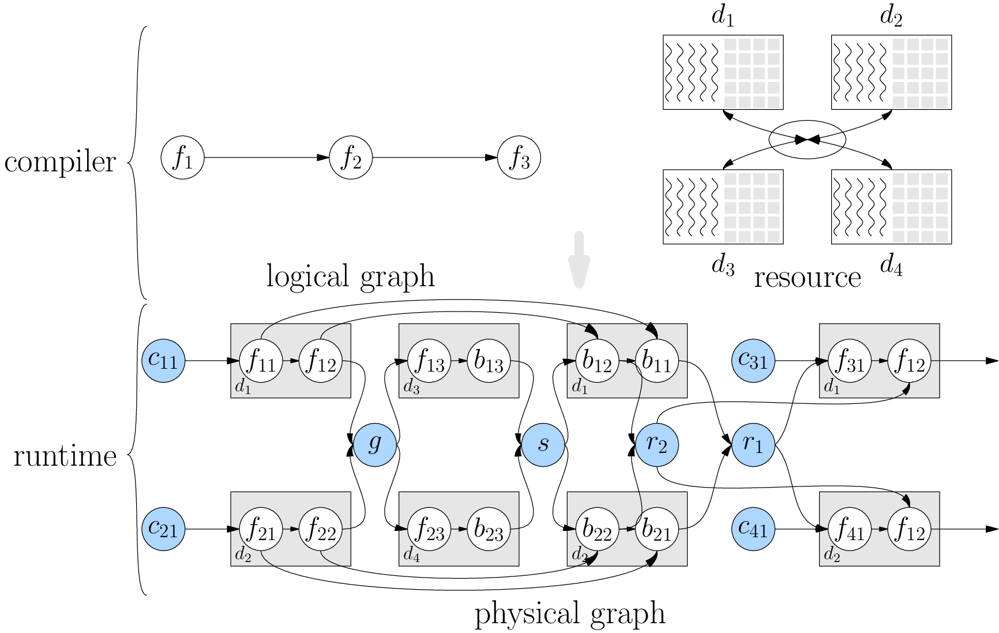
  <br><em>图 1：典型深度学习框架把三层神经网络的逻辑图转换为四个互连设备上的物理图或执行计划。</em>
</p>

### 2.1 在空间维度分布工作负载

空间调度（spatial scheduling）指定如何把多个 op 分散到多个设备上。图 1 中，一个包含三个计算 op $f_1,f_2,f_3$ 的训练任务被调度到四个互连设备 $d_1,d_2,d_3,d_4$ 上。$f_1$ 和 $f_2$ 以数据并行方式运行在 $d_1$ 和 $d_2$ 上，$f_3$ 以模型并行方式运行在 $d_3$ 和 $d_4$ 上。在前向传播中，需要在 $\{f_{12},f_{22}\}$ 和 $\{f_{13},f_{23}\}$ 之间插入一个 all-gather 通信 op $g$；反向传播中，需要在 $\{b_{13},b_{23}\}$ 和 $\{b_{12},b_{22}\}$ 之间插入一个 reduce-scatter 通信 op $s$。两个 all-reduce collective 通信 op $r_1$ 和 $r_2$ 用于同步采用数据并行的 $f_1$ 和 $f_2$ 的模型参数。

针对这种混合并行场景，逐个案例手工安排通信 op 非常费力，也会显著阻碍复杂并行在新深度学习模型中的应用。

### 2.2 在时间维度分布工作负载

时间调度（temporal scheduling）指在深度学习任务的数据流中按特定顺序调度 op 的执行，从而最大化硬件利用率和系统吞吐。性能提升最常见的机会来自尽可能重叠通信和计算。在同步随机梯度下降训练中，执行依赖会在一个物理图的不同实例内部和实例之间被强制满足，其中每个 mini-batch 对应一个实例 [31]。以图 1 为例，前向 op $f_{31}$ 和 $f_{41}$ 不能早于 all-reduce op $r_1$ 调度。另一方面，数据加载与预处理 op $c_{31}$ 和 $c_{41}$ 可以在设备处理上一批数据时同时执行；反向传播 $\{b_{11},b_{21}\}$ 和 all-reduce op $r_2$ 也可以并行执行，而不会破坏正确性。

### 2.3 管理复杂依赖

在主流深度学习框架中，数据依赖和控制依赖都用执行图中的边表示 [5, 6, 32]。每个 op 完成后，scheduler 会更新剩余 op 的依赖，并识别依赖已经全部解除、可以运行的 op。分布式深度学习经常面对更复杂的执行依赖和资源约束 [24, 7]。

**资源共享引起的依赖。** 当多个 op 共享同一种资源时，scheduler 必须决定合适的执行顺序，以避免 out-of-memory（OOM）错误或死锁。图 2 给出一个简单例子。$M_1$ 和 $M_2$ 是两个数据移动 op，分别服务同一设备上的两个计算 op $O_1$ 和 $O_2$。$O_1$ 和 $O_2$ 彼此不依赖，而 $O_1$ 执行所需设备内存多于 $O_2$。$M_1$ 和 $M_2$ 也需要设备内存保存输出数据。当 $M_1$ 和 $M_2$ 已经占用内存后，剩余空闲内存只够运行 $O_2$，不够运行 $O_1$，但 $O_1$ 和 $O_2$ 同时出现在 scheduler 的 ready set 中。如果先调度 $O_1$，内存就会不足；系统可能报告 OOM，或者阻塞调度线程，而后者可能导致死锁。

<p align="center">
  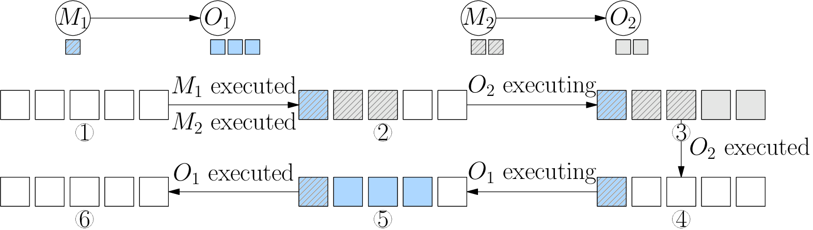
  <br><em>图 2：现有框架的 scheduler 可能导致死锁的例子。</em>
</p>

为了避免这类风险，框架最好提前指定合适的执行顺序，例如在 TensorFlow 中在 op 之间添加控制依赖。如果系统还通过流水线重叠数据移动和计算，问题会更加严重，因为在上述例子中，$M_1$ 可能在 $O_1$ 处理前一份数据时同时执行。因此，编译期资源规划和运行时流控是保证执行稳定性的必要条件。

**数据移动引起的依赖。** 现有深度学习框架没有把数据移动，例如 host memory 与 device memory 之间的移动，作为计算图中的普通 op。结果是，数据移动和计算之间的依赖没有通过计算图中的边表示。以 TensorFlow 为例，它把节点内数据移动包装在 callback function 中，并在需要的位置插入这些回调。于是，一部分依赖由图边表示，另一部分依赖由 callback 调用描述。在图 3 中，$O_2$ 被包装在一个 callback function 中，预期在 $O_1$ 完成时被调用。然而，如果 $O_2$ 还有其他依赖，例如其他 op 的输出或控制依赖，那么 $O_1$ 完成并不足以调用 $O_2$。为了正确调度 $O_2$，callback function 必须告诉 scheduler $O_1$ 已完成；如果 scheduler 返回其他依赖也已全部解除，$O_2$ 才能立即调度，否则 $O_2$ 会进入等待列表，等其他依赖解除后再调度。

<p align="center">
  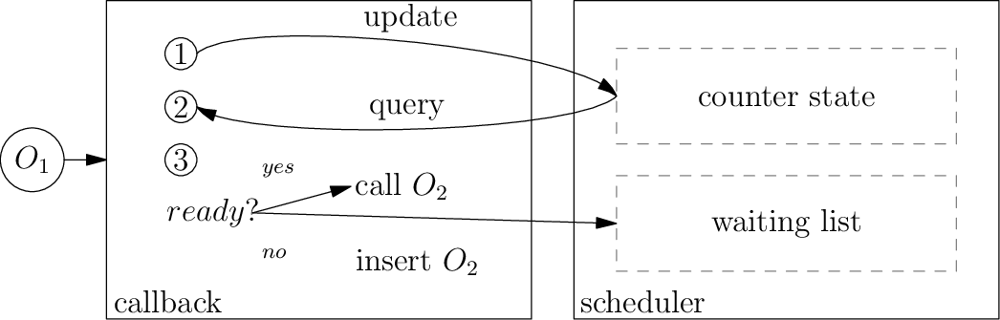
  <br><em>图 3：callback function 与 scheduler 的交互。</em>
</p>

在上述例子中，框架必须向用户暴露内部 scheduler，插入的 callback function 才能和 scheduler 正确交互。然而，要对既有深度学习框架做这种修改，需要大量工程工作，因为目前没有现有深度学习框架向用户暴露底层 scheduler。理想情况下，框架应该在图中显式表示所有 op 之间的所有依赖，包括数据移动。一旦做到这一点，运行时的 graph executor 也可以被大幅简化。

### 2.4 小结

本文设计 OneFlow，其 compiler 可以为数据并行、模型并行和流水线并行自动生成物理图。Compiler 在编译期支持对所有类型依赖的完整分析，例如资源依赖、数据移动依赖和计算依赖。进一步地，本文基于 actor model 为 OneFlow 设计一个简洁 runtime，把所有类型的依赖统一实例化为 actor 之间的消息传递。

## 3. Compiler

OneFlow 的 compiler 以逻辑计算图和指定硬件配置作为输入，生成描述实际执行过程的物理图。本文假设每个逻辑 op 已经被赋予一个 placement 属性，表示该逻辑 op 会部署到哪些 node，也就是物理机器，以及哪些 device 上。相应地，一个 global tensor，即逻辑 op 的输入或输出，也会映射到多个 local tensor，也就是该逻辑 op 所在多个设备上的对应张量。

### 3.1 为每个 tensor 和每个 operator 指定设备间并行方式

本文设计 SBP 这一数学抽象，用来描述 global tensor 与对应 local tensor 之间的映射，包括 split（简称 S）、broadcast（B）和 partial-value（P）。图 4 展示一个形状为 $2\times2$ 的 global tensor 如何在 4 种 SBP 映射下映射为两个 local tensor；每种映射也称为一个 SBP signature，分别是 split(0)、split(1)、broadcast 和 partial-sum。

Split 表示沿某个轴把 global tensor 均衡切分得到 local tensor。例如，图 4 第一列中的两个张量由 global $2\times2$ tensor 按行轴切分得到，第二列中的两个张量由按列轴切分得到。Broadcast 表示每个 local tensor 都是 global tensor 的完整副本。Partial-value 表示 local tensor 的形状与 global tensor 相同，而 global tensor 可以通过对所有 local tensor 执行逐元素 reduction，例如 sum 或 max，得到。

<p align="center">
  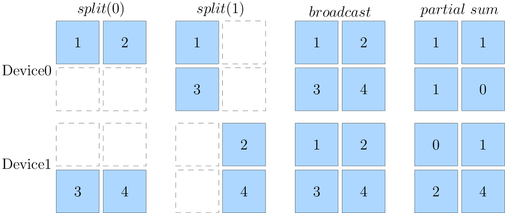
  <br><em>图 4：四种 SBP signature 把 2x2 global tensor 映射到两个设备的例子。图中的每个 block 表示 tensor 的一个 entry。</em>
</p>

当一个 op 的输入 tensor 的 SBP signature 已知时，其输出 tensor 的 SBP signature 也可以确定。以 MatMul 为例。给定数据 tensor $X$ 和权重 tensor $W$，它们乘积 $Y=XW$ 的 SBP signature 可以由 $X$ 和 $W$ 的 SBP signature 推导得到，如表 1 所示。对多数 operator 来说，从输入 tensor 的 SBP 推导输出 tensor 的 SBP 是直接的。以表 1 第一行为例，如果 $X$ 按行切分，即 $S(0)$，而 $W$ 被 broadcast，那么结果 $Y$ 也会按行切分，即 $S(0)$。目前，OneFlow 为所有 operator 逐个提供 SBP 推导规则，并期望未来自动化这一过程。

有了 op 输入和输出的 SBP signature，op 的并行策略就被完整指定。例如，表 1 第一行中 $X,W$ 的 $S(0),B$ 对应数据并行，第二行中的 $B,S(1)$ 对应模型并行。

表 1：MatMul 的有效 SBP signature。

| $X$ | $W$ | $Y=XW$ |
| --- | --- | --- |
| $S(0)$ | $B$ | $S(0)$ |
| $B$ | $S(1)$ | $S(1)$ |
| $S(1)$ | $S(0)$ | $P(\mathit{sum})$ |
| $P(\mathit{sum})$ | $B$ | $P(\mathit{sum})$ |
| $B$ | $P(\mathit{sum})$ | $P(\mathit{sum})$ |
| $B$ | $B$ | $B$ |

### 3.2 建模数据路由

同一个 global tensor 的 producer 和 consumer 可能希望该 tensor 使用不同 SBP signature。如图 5 所示，两个 MatMul op 通过 global tensor $Y_0$ 连接。$S(0)$ 是 $MatMul_0$ 推导出的 $Y_0$ 的 SBP signature；然而，$MatMul_1$ 期望 $Y_0$ 的 SBP signature 为 $B$。在这种情况下，需要在 $MatMul_0$ 和 $MatMul_1$ 之间插入一个 data-routing op，用于重排或转换 $Y_0$ 的 local tensor。在分布式深度学习中，用于自动转换中间 local tensor 的 data-routing op 通常是常见 collective communication primitive 之一，例如 all2all、broadcast、reduce-scatter、all-reduce、all-gather 等。本文把这类 op 统一称为 boxing op。在图 5 的例子中，boxing op 内部执行 all-gather 操作。

<p align="center">
  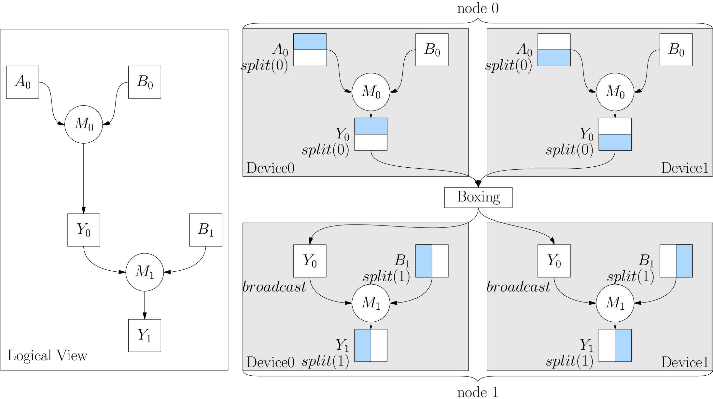
  <br><em>图 5：把逻辑图转换为物理图时插入 boxing op 执行数据移动的例子。</em>
</p>

插入的 boxing op 可能产生通信成本，也可能不产生通信成本。表 2 列出了连续 SBP signature 之间传输的数据量，分别对应 boxing op 的输入 tensor 和输出 tensor 位于同一组设备或互不相交设备集合的情况。跨不相交设备集合的 tensor 转换总会产生通信成本，而同一组设备内的 tensor 转换不一定导致数据移动。例如表中的 $B\rightarrow S$，输出 tensor 可以直接由同一设备上的输入 tensor 得到。这对选择最优并行策略很有帮助，也就是选择通信成本最低的 SBP signature。

表 2：连续 SBP signature 之间传输的数据量。$p_1$ 和 $p_2$ 分别是输入和输出 tensor 所在设备数，$\lvert T\rvert$ 是 global tensor $T$ 的大小。

| $\mathit{SBP}_1\rightarrow\mathit{SBP}_2$ | 同一设备集合成本 | 不相交设备集合成本 |
| --- | --- | --- |
| $S(i)\rightarrow S(i)$ | $0$ | $\lvert T\rvert$ |
| $S(i)\rightarrow S(j)$，$i\neq j$ | $\frac{p_1-1}{p_1}\lvert T\rvert$，all2all | $\lvert T\rvert$ |
| $S\rightarrow B$ | $(p_1-1)\cdot \lvert T\rvert$，all-gather | $p_2\cdot \lvert T\rvert$ |
| $S\rightarrow P$ | $0$ | $\lvert T\rvert$ |
| $B\rightarrow S$ | $0$ | $\lvert T\rvert$ |
| $B\rightarrow B$ | $0$ | $p_2\cdot \lvert T\rvert$ |
| $B\rightarrow P$ | $0$ | $\lvert T\rvert$ |
| $P\rightarrow S$ | $(p_1-1)\cdot \lvert T\rvert$，reduce-scatter | $p_1\cdot \lvert T\rvert$ |
| $P\rightarrow B$ | $2(p_1-1)\cdot \lvert T\rvert$，all-reduce | $(p_1+p_2-1)\cdot \lvert T\rvert$ |
| $P\rightarrow P$ | $0$ | $p_1\cdot \lvert T\rvert$ |

### 3.3 与 GShard 抽象的区别

OneFlow 的 SBP 抽象与 GShard [26] 中的抽象有一些相似性，例如 split，对应 GShard 中的 split，以及 broadcast，对应 GShard 中的 replicate。SBP 和 GShard 是彼此不知道对方的情况下独立开发的，这一点可以通过追踪 OneFlow 在 GitHub 中的 commit log 验证。GShard 进一步添加 shard annotation，把 split 泛化到多维 split。在 OneFlow 中，本文使用多维 split 来统一 GShard 中的 split 和 shard。除了 split 之外，OneFlow 也把其他所有 SBP signature 泛化到多维。例如，一个矩阵可以具有 $(S(0),B)$ 这样的 SBP signature，其中 $S(0)$ 指定 node 层级的并行策略，$B$ 指示同一 node 内设备之间的并行策略。根据表 3 中的推导规则，多维 SBP 可以方便地支持更高级的分布式矩阵乘法，例如 2D SUMMA 算法 [33]。

此外，OneFlow 创建了 partial-value signature，而 GShard 没有考虑这一类型；但 partial-value 对于让 annotation system 完备是必要的。例如，表 1 给出了矩阵乘法 op $Y=XW$ 的所有有效 SBP signature。如果 $X$ 使用 $S(1)$，$W$ 使用 $S(0)$，那么 $Y$ 的 signature 将是 $P(sum)$；它既不能由 split，也不能由 broadcast 描述。GShard 建议在生成未 reduce 的数据之后立即执行 reduce，把 partial data 合并为最终结果。

然而，有时把中间结果保持为 partial-value 比立即 reduce partial result 更高效。借助 partial-value，OneFlow 允许系统选择插入 boxing op，即 reduce 或 all-reduce op，的最优时机。以 $Y=U\times V\times W$ 为例。假设 $U,V,W$ 的 SBP signature 分别是 $S(1),S(0),B$。根据表 1，$U\times V$ 结果的 SBP signature 是 $P(sum)$。这个 partial result 可以继续与 $W$ 相乘，因为 $P(sum)$ 与 $B$ 相乘是有效的，结果 signature 仍然是 $P(sum)$。如果没有 partial-value signature，在执行第二次矩阵乘法之前就必须插入 boxing op，从而产生额外通信成本。

表 3：MatMul 的两个有效二维 SBP signature。

| $X$ | $W$ | $Y=XW$ |
| --- | --- | --- |
| $(S(0),B)$ | $(B,S(1))$ | $(S(0),S(1))$ |
| $(S(0),S(1))$ | $(B,S(0))$ | $(S(0),P)$ |

表 4：实现图 5 中 $MatMul_0$ 和 $MatMul_1$ 的 SBP signature 与并行方式的示例程序。

```python
import oneflow as flow
P0 = flow.placement("cuda", {0: list((0, 1))})
P1 = flow.placement("cuda", {1: list((0, 1))})
a0_sbp = flow.sbp.split(0)
b0_sbp = flow.sbp.broadcast
y0_sbp = flow.sbp.broadcast
b1_sbp = flow.sbp.split(1)

A0 = flow.randn(4, 5, placement=P0, sbp=a0_sbp)
B0 = flow.randn(5, 8, placement=P0, sbp=b0_sbp)
Y0 = flow.matmul(A0, B0)

Y0 = Y0.to_global(placement=P1, sbp=y0_sbp)
B1 = flow.randn(8, 6, placement=P1, sbp=b1_sbp)
Y2 = flow.matmul(Y0, B1)
```

### 3.4 编程接口

OneFlow 编程接口的设计目标是：单设备版本和分布式版本之间，operator API 与模型描述保持一致。对于不同分布式策略，用户只需要指定某些 tensor 的 placement 和 SBP signature。考虑图 5 中 $MatMul_0$ 和 $MatMul_1$ 分别使用数据并行和模型并行的例子，表 4 的代码片段展示 OneFlow 如何实现相应并行方式。

第 2 行和第 3 行创建两个不同 placement，其中 `cuda` 表示使用 NVIDIA GPGPU 作为 accelerator；`P0` 表示 node 0 上的 device 0 和 device 1，`P1` 表示 node 1 上的 device 0 和 device 1。第 4 行到第 7 行创建 SBP signature。第 9、10、14 行分别指定 tensor $A_0$、$B_0$ 和 $B_1$ 的 placement 与 SBP 属性。第 11 行中，$Y_0$ 的 SBP signature 被推导出来，即 split(0)。然而，第 15 行的 $MatMul_1$ 期望 $Y_0$ 的 SBP signature 是 broadcast。因此，第 13 行使用 `to_global()` 方法，在 $MatMul_0$ 和 $MatMul_1$ 之间添加一个 boxing op，如第 3.2 节所述，并显式转换 tensor $Y_0$ 的 placement 和 SBP signature。第 13 行中，`to_global()` 把 $Y_0$ 的 placement 和 SBP signature 从 split(0) 转换为 broadcast。需要注意的是，由于 $MatMul_0$ 和 $MatMul_1$ 的输入 tensor placement 不同，分别是 $P0$ 和 $P1$，这两个 op 实际上也以流水线并行方式工作。

借助这些 API，OneFlow 不要求用户直接使用各种低层通信 primitive 编程，但用户可能需要为每个 tensor 指定适当的 placement 和 SBP signature。Placement 与并行策略制定本身需要单独深入研究，已有工作对此进行了探索 [17, 26, 8, 27, 7]。当 OneFlow 集成这些策略以自动推导最优 placement 和并行策略后，用户将不再需要手工指定 tensor 属性，也不再需要显式调用 `to_global()`。

## 4. Runtime

OneFlow 在 runtime 设计中采用 actor model [34]。它把每个 op 包装成一个很薄的 actor，并把该 op 专属的依赖和资源抽象为 actor 的状态。Actor 之间通过消息传递交互，而不是通过函数调用交互。每当一个 actor 收到其他 actor 的消息，它的状态就会更新。本文展示 actor model 可以优雅解决许多对现有深度学习框架而言很复杂的问题。

### 4.1 Actor model

OneFlow runtime 中的 actor 关联四类组件。

第一是 register。Register 本质上是保存 tensor 内存地址的容器。一个 actor 通常关联两类 register：in register，用于保存该 actor 消费的 tensor；out register，用于保存该 actor 产生的 tensor。

第二是 message。Actor 通过交换消息与其他 actor 通信：producer，即生成输出的 actor，向 consumer，即使用输出的 actor，发送 req message，通知 consumer 某个包含新生成 tensor 的 register 可以读取；consumer 向 producer 发送 ack message，表示 consumer 已不再需要该 register。

第三是 action。Action 对应一个 actor 绑定的 op 的执行，例如启动 GPU kernel 或执行数据移动。第四是 state machine。每个 actor 跟踪它的所有依赖是否已经解除。接下来，本文讨论每个 actor 的 state machine 内部机制和消息传递协议。

### 4.2 显式表示资源依赖

**同时为 in register 和 out register 设置计数器。** 每个 actor 在开始时分配预先确定数量的 out register，相当于为每个 actor 固定一份内存 quota。如果一个 actor 用完了 quota，那么即使所有输入 tensor 都已就绪，下一个 action 也不会被调度，直到之前分配给该 actor 的某些内存可以回收。为实现这一点，OneFlow 为每个 register 关联一个 counter。初始为 0 的 in counter 记录 in register 中已经就绪、可被消费的 tensor 数量；非零初始化的 out counter 表示可用的空闲内存 quota。每个 action 会导致某些 out counter 减少。只有当 in counter 等于预期的非零值，并且 out counter 非零，也就是 actor 有空闲内存可用时，actor 才能触发 action。

在现有深度学习框架中，scheduler 通常认为只要一个 op 的输入 tensor 就绪，该 op 就可以启动，而不考虑它之后能否成功获得输出所需内存。Op 被调度后，runtime 只会在实际执行 action 之前尝试动态为该 op 分配内存，但分配可能成功，也可能失败。借助 in counter 和 out counter，OneFlow 把资源可用性显式表示为一种依赖，供 scheduler 判断一个 op 是否真正 ready。因此，编译期资源规划和运行时流控成为可能。

图 6 展示 OneFlow 基于 actor 的 runtime 中的流水线示例。空白 block 表示不包含有用数据的 register，填充 block 表示包含其他 actor 仍然需要的数据的 register。

<p align="center">
  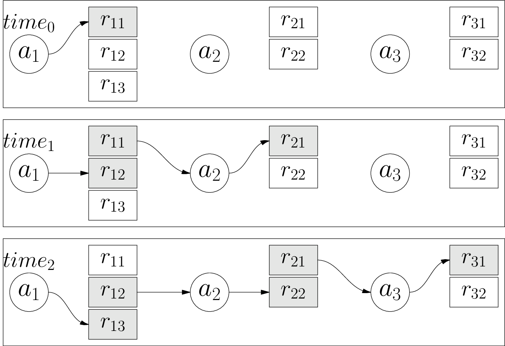
  <br><em>图 6：OneFlow actor runtime 的流水线示例。空白 block 表示不含有用数据的 register；填充 block 表示含有其他 actor 仍需使用的数据。</em>
</p>

**基于消息传递的引用计数。** 除了 in counter 和 out counter，OneFlow 还为每个 out register 引入一个额外的、初始为 0 的 reference counter，用于记录有多少 consumer 正在引用其内容。一个 out register 的 reference counter 非零，表示该 register 正在使用中，其内容不能被修改。因此，out counter 依赖 reference counter。Reference counter 可以按如下消息传递协议更新。

Producer 向 consumer 发送 req message，并把与该消息相关的 out register 的 reference counter 加一。Reference counter 从 0 变为非零会导致 out counter 减一。

Consumer 收到 req message 后，知道某个 in register 已经可用，并把 in counter 加一。

Consumer 使用完 in register 中的数据后，把 in counter 减一，并向 producer 发送 ack message。

Producer 收到来自 consumer 的 ack message 后，减少与该 ack message 相关的 out register 的 reference counter，表示该 out register 上的一个引用被消除。如果 reference counter 再次变为 0，对应的 out counter 加一，表示相应 out register 可以被回收供未来使用。

在上述协议中，如果一个 out register 正在被某个 consumer 消费，其 reference counter 必然非零，producer 就不会再用它放置新生成的 tensor。这种互斥属性安全地启用了 zero-copy 机制：如果一对 producer 和 consumer 位于同一设备上，consumer 可以直接把 producer 的输出作为输入使用，而无需再复制一份内容。

### 4.3 应用：流水线与背压

允许某个 register 的 out counter 初始值大于 1，可以方便地并行处理不同版本的数据。每个 actor 独立运行，自然成为流水线中的一个 stage。同一 register 的多个版本可以看作传统深度学习框架中 double buffering 技术的一种泛化 [35]。在图 6 中，$actor_1$ 有 3 个 out register，$actor_2$ 和 $actor_3$ 各有 2 个 out register。

在 $time_0$，$actor_1$ 产生一个 register $r_{11}$，而 $actor_2$ 和 $actor_3$ 因为它们的 in counter 为 0 而空闲。

在 $time_1$，$actor_2$ 触发 action，因为它的 in counter 和 out counter 都非零。同时，$actor_1$ 也可以在另一个 micro-batch 上再次触发 action，因为它的 out counter 仍然非零。

在 $time_2$，所有三个 actor 的 action 都可以触发，因为它们对 register 的所有需求都已经满足。

本质上，基于 actor 的协议等价于 asynchronous transfer mode 网络中的 credit-based flow control 方法 [36]。它天然支持背压，从而保存资源。如果一个 producer 的所有 out register 都正在使用中，那么由于 out counter 变为 0，且没有可用空闲 out register 保存新的输出 tensor，producer 就会停止处理。没有这种背压机制时，像现有框架那样，如果 consumer 被阻塞，producer 可能很快耗尽内存。

## 5. 实现

OneFlow 使用约 26K 行 Python、120K 行 C++ 和 10K 行 CUDA 实现。Actor runtime 使用 3K 行 C++，compiler 模块使用 20K 行 C++ 实现。OneFlow 代码可见：https://github.com/Oneflow-Inc/oneflow。下面介绍 actor system 的一些实现细节。

**Actor 地址与消息路由。** 类似 NVIDIA GPGPU 中的 CUDA stream，OneFlow 也把其他类型的硬件资源，例如网络和 CPU，抽象为 FIFO queue。OneFlow 保证共享资源不会引入隐式依赖。例如，在一个设备上，copy engine 和 compute engine 分别创建两个独立 CUDA stream。为了最小化 device context switch，OneFlow 为每个硬件 queue 创建专用 OS thread，并把使用同一 queue 或硬件资源的 actor 绑定到同一个 OS thread 上，例如图 7 中的 $actor_a$ 和 $actor_b$。在 actor、device、OS thread 和 node 之间建立静态绑定后，OneFlow 为每个 actor 分配唯一且层次化组织的 64-bit 地址，或者等价地称为 ID，如图 8 所示。Device、OS thread 和 actor 所在 node 的 ID 可以从 actor ID 的特定字段解析出来。借助这种 ID translation 机制，只要在消息中附带 receiver actor ID，就足以把消息路由到目的地。

<p align="center">
  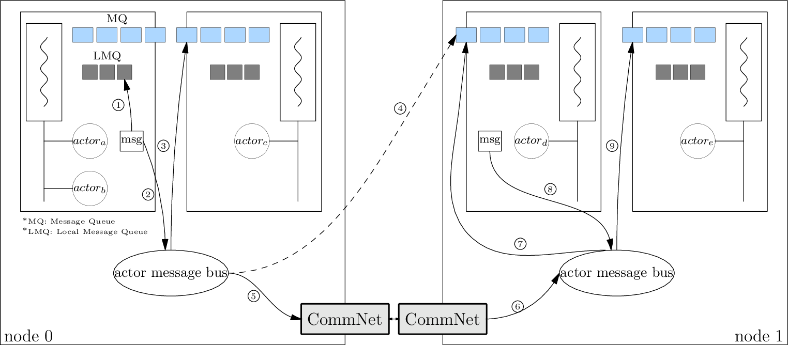
  <br><em>图 7：三类消息路由场景：向同一 thread 上的 actor 发送消息，向同一 node 中另一 thread 上的 actor 发送消息，以及向另一 node 上的 actor 发送消息。图中的 CommNet 表示 OneFlow 中的低层网络模块。</em>
</p>

<p align="center">
  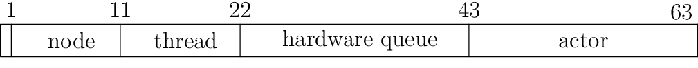
  <br><em>图 8：actor 地址编码。</em>
</p>

在 OneFlow 中，运行在同一 OS thread 上的 actor 共享一个 FIFO message queue。一个 actor 要接收消息时，消息先被放入对应 OS thread 的 message queue；该 OS thread 会重复轮询 queue，取出消息并路由给目标 receiver，例如图 7 中的情况 3。每个 OS thread 还有一个 local message queue。发送给同一 OS thread 上 receiver 的消息会被放入 local message queue，并由 receiver 直接处理，无需被绑定的 OS thread 轮询，例如图 7 中的情况 1。

**统一节点内和节点间 actor system。** OneFlow 引入 actor message bus 作为抽象层，提供统一接口，将消息路由到 receiver，不论 receiver 位于同一 node 还是另一个 node。在图 7 中，从 $actor_a$ 到 $actor_d$ 的消息沿逻辑路径 {2,4} 传播，而实际路径是 {2,5,6,7}。这种抽象隐藏了跨网络的低层通信。

不同于现有框架和库在节点间通信两端都插入 Send 和 Recv op 来连接不同 node 上的子图执行，OneFlow 的 compiler 在检测到节点间通信时，只在 consumer 侧插入一个 networking actor，用于把数据从 producer 所在 node 拉到 consumer 所在 node。在图 7 中，假设 node 1 上的 $actor_e$ 需要 node 0 上 $actor_a$ 的输出；生成物理图时，compiler 在 node 1 上创建 $actor_d$，它唯一的职责是把 $actor_a$ 的输出从 node 0 拉到 node 1，使 $actor_e$ 可以像 producer 位于同一 node 一样消费数据。

## 6. 评估

本文通过实现具有代表性的并行方式，并在不同场景中与最先进库比较，展示 OneFlow 的通用性、灵活性和效率。除非另有说明，实验运行在一个由 4 台机器组成的集群上，机器之间通过 100Gbps RoCE 网络互连。每台机器配备 8 块 NVIDIA Tesla V100 16G GPU，GPU 之间通过 NVLink 互连。

### 6.1 数据预处理流水线

在许多场景中，例如在高端 GPGPU 上以混合精度训练小型深度学习模型时，向计算侧供给数据会成为 DNN 训练瓶颈 [37]。图 9 比较 OneFlow 和主流框架在不同 data loader 下达到的吞吐。DALI 是 NVIDIA 开发的插件，用于优化深度学习框架的数据加载 [35]。在 synthetic data 场景中，实验使用内存中生成的假数据，不需要从磁盘加载数据，代表各框架的理想情况。

<p align="center">
  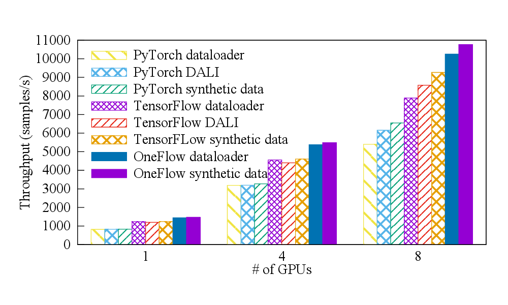
  <br><em>图 9：使用混合精度训练 ResNet50-V1.5 时，不同框架和 data loader 的吞吐比较。</em>
</p>

TensorFlow 和 PyTorch 的 data loader 能够重叠数据加载与计算，但表现明显差于使用 NVIDIA DALI。不同于使用 DALI 这样的定制插件，OneFlow 只需按照第 4.3 节所述，为数据加载、预处理以及 host-to-device copy op 分别分配两个 out register，就可以支持流水线。OneFlow data loader 的性能接近 synthetic data 场景，说明数据加载 actor 与预处理 actor 之间实现了近乎完美的流水线。OneFlow 无需 DALI 那样的额外工程工作即可达到这一点。

### 6.2 数据并行

现有深度学习框架已经对数据并行训练进行了最充分的优化。在图 10 的实验中，MXNet 基于 Horovod [38]；TensorFlow 和 PyTorch 使用自身原生通信策略，这比使用 Horovod 有更好性能。

<table align="center">
  <tr>
    <td align="center" width="50%">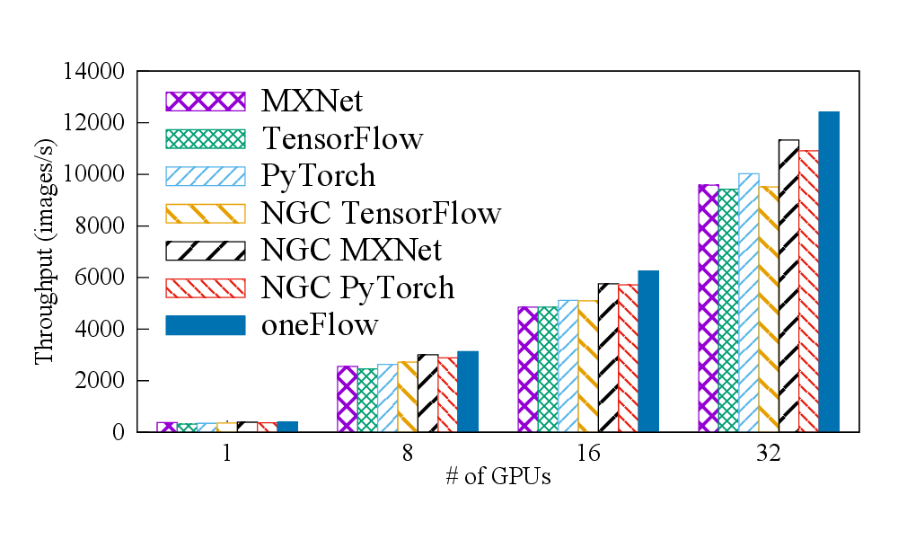<br><em>图 10a：ResNet，FP32。</em></td>
    <td align="center" width="50%">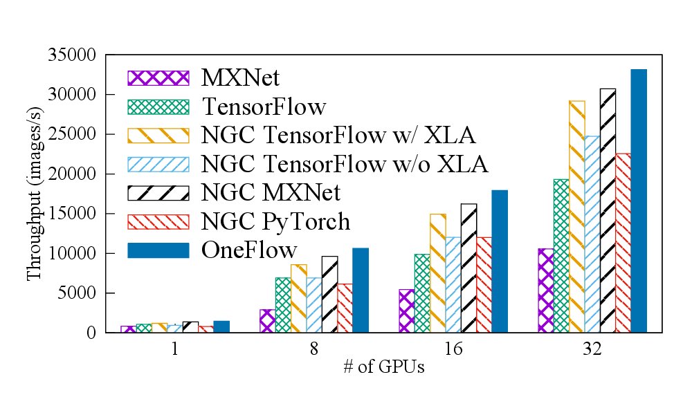<br><em>图 10b：ResNet，FP16。</em></td>
  </tr>
  <tr>
    <td align="center" width="50%">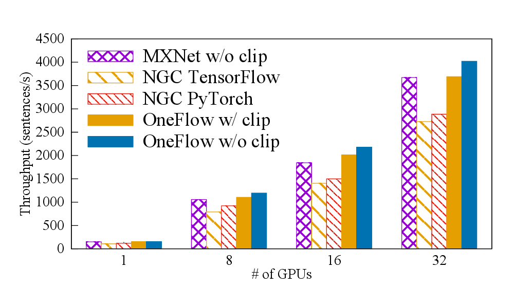<br><em>图 10c：BERT-base，FP32。</em></td>
    <td align="center" width="50%">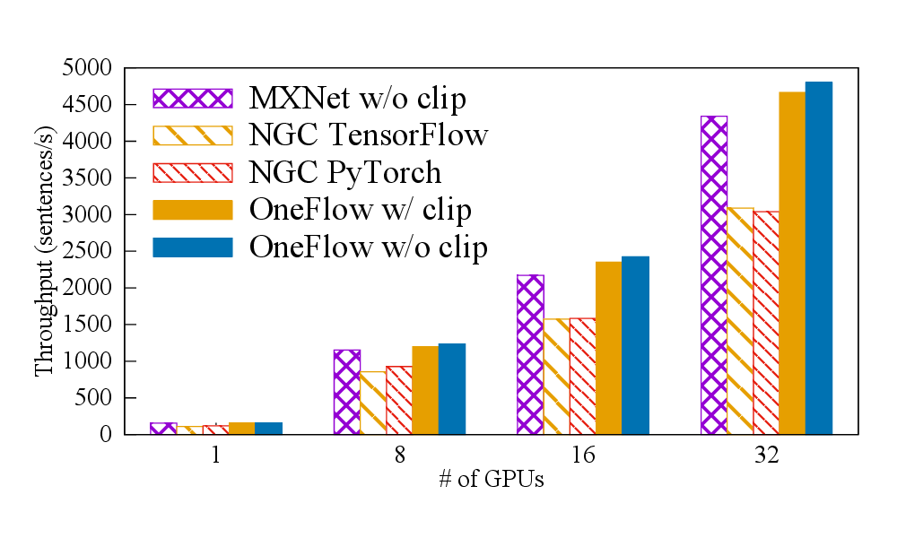<br><em>图 10d：BERT-base，FP16。</em></td>
  </tr>
</table>

<p align="center"><em>图 10：ResNet 和 BERT-base 的数据并行训练。</em></p>

在 ResNet [39] 场景中，OneFlow 不仅在 FP32 下比官方 TensorFlow、PyTorch 和 MXNet 高 23%-31%，在 FP16 [40] 下高 71%-213%，也比这些框架的高度优化版本，即带有 NGC 前缀并使用 NVIDIA 提交给 MLPerf [41] 的同一脚本的版本，在 FP32 下高 9%-30%，在 FP16 下高 8%-47%。对于 BERT [1]，OneFlow 的训练吞吐也高于 NGC 版本：FP32 下高 9%-47%，FP16 下约高 55%。对每个模型，本文都做了大量性能优化，以确保 OneFlow 在单设备上的吞吐与其他框架相当或略高。这样，不同框架的可扩展性才能在近似相同 baseline 上比较。需要注意的是，MXNet 的 BERT 实现没有执行 gradient clipping，因此计算量更少。为公平比较 MXNet 和 OneFlow，本文在 OneFlow 上实现了两个 BERT 版本，分别带 gradient clipping 和不带 gradient clipping。

### 6.3 模型并行

官方版本的 TensorFlow 和 PyTorch 不支持模型并行，因此本文将 OneFlow 与两个支持模型并行训练、具有实际影响力的定制深度学习库进行比较。

#### 6.3.1 InsightFace

InsightFace [25] 被广泛用于训练大型人脸识别模型，其中模型并行是必要的。它基于 PyTorch 支持模型并行，但实现中包含复杂定制。相比之下，OneFlow 只需要为需要模型并行的 MatMul 和 softmax op 配置合适的 SBP signature。

图 11a 展示将权重矩阵的 SBP signature 设置为 S(1) 后，四块 GPU 上 local tensor 的转换。图 11b 展示 compiler 生成的物理图中 softmax op 的细节。需要注意的是，softmax op 内部有两个 reduce 计算。为了最小化 global reduction 引起的通信成本，OneFlow 在执行 max 和 sum op 时先在设备内进行 local reduction。

<table align="center">
  <tr>
    <td align="center" width="100%">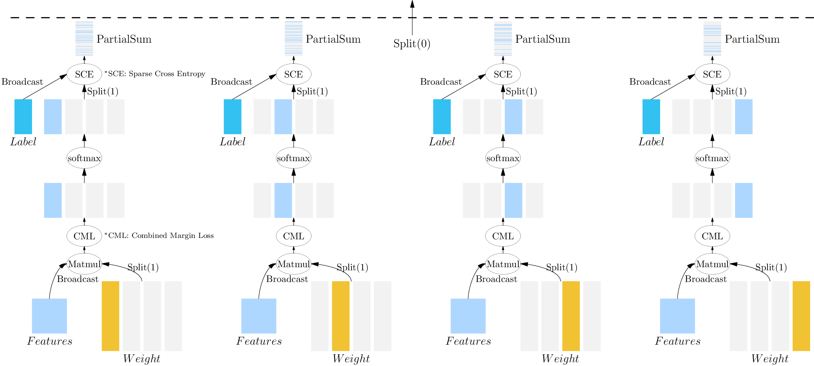<br><em>图 11a：权重矩阵的 SBP signature 为 S(1) 时的 MatMul、softmax 和 sparse cross entropy operator。</em></td>
  </tr>
  <tr>
    <td align="center" width="100%">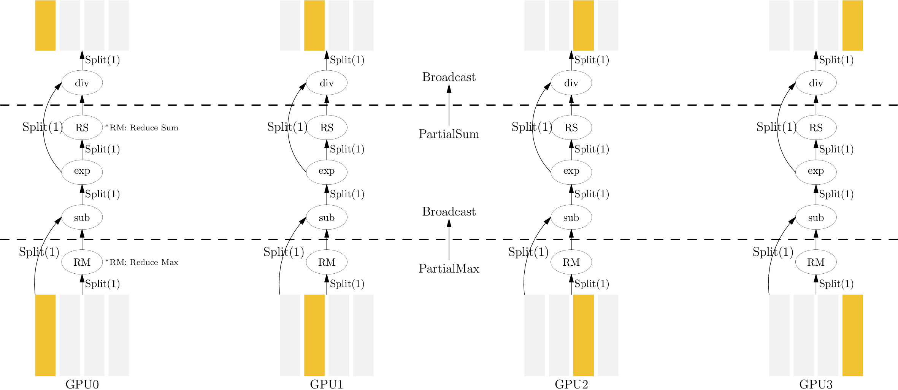<br><em>图 11b：compiler 生成的物理图中 softmax op 的细节。</em></td>
  </tr>
</table>

<p align="center"><em>图 11：在四块 GPU 上实现 InsightFace 的模型并行。</em></p>

图 12 展示以 ResNet 和 MobileFaceNet [42] 为 backbone 训练人脸识别模型时的吞吐。可以看到，OneFlow 的吞吐略高于 InsightFace。两个框架使用的物理执行计划本质上相同；但 InsightFace 的执行计划需要手工编程生成，而 OneFlow 的执行计划由 compiler 自动产生。因此，OneFlow 显著降低了模型并行的编程负担。

<table align="center">
  <tr>
    <td align="center" width="50%">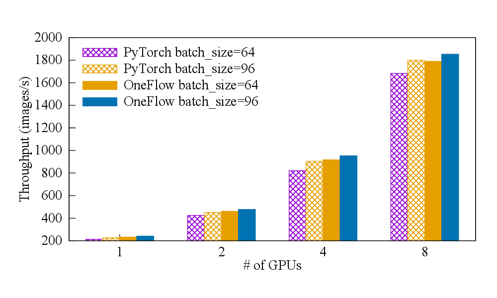<br><em>图 12a：ResNet。</em></td>
    <td align="center" width="50%">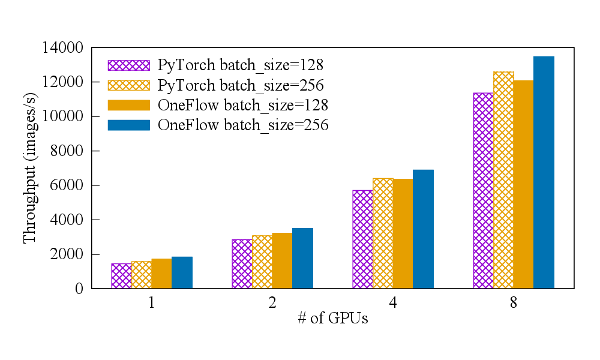<br><em>图 12b：MobileFaceNet。</em></td>
  </tr>
</table>

<p align="center"><em>图 12：模型并行训练：OneFlow 与 InsightFace 对比。</em></p>

#### 6.3.2 HugeCTR

Wide & Deep Learning [43] 被广泛用于推荐系统，例如点击率估计。在生产环境中，为了支持数十亿 ID 的点击率估计，embedding matrix 会大到无法放入单块 GPU 的内存，因此需要对 embedding table 做模型并行。如图 13 所示，基于 OneFlow 的 Wide & Deep Learning 优于 NVIDIA Merlin [19] 中的 HugeCTR。HugeCTR 是一个面向点击率估计模型训练、支持模型并行的专用框架。与 HugeCTR 相比，OneFlow 实现了更低的 latency，也就是更短的每迭代训练时间，并使用更少的内存。HugeCTR 在 vocabulary size 超过 51.2 million 时会 OOM。不同于 HugeCTR 所需的大量工程工作，使用 OneFlow 时，用户只需为 embedding table 设置合适的 SBP signature，即用 S(0) 切分 vocabulary ID、用 S(1) 切分 hidden dimension，compiler 就会自动在需要的位置插入 collective communication op 以实现模型并行。

<table align="center">
  <tr>
    <td align="center" width="50%">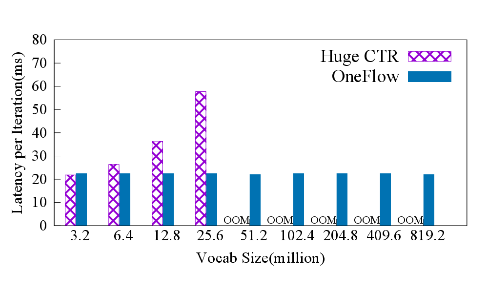<br><em>图 13a：每迭代训练时间。</em></td>
    <td align="center" width="50%">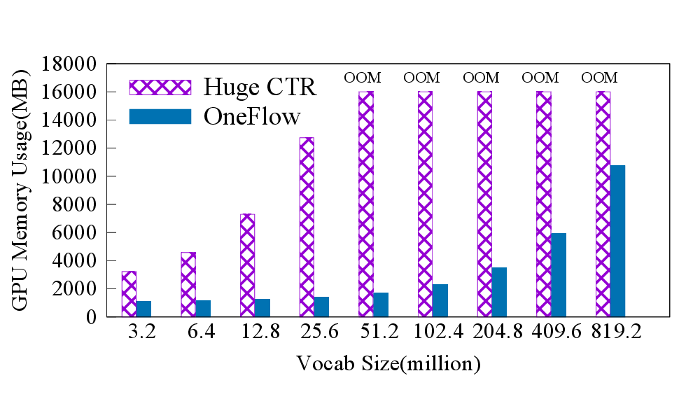<br><em>图 13b：内存占用。</em></td>
  </tr>
</table>

<p align="center"><em>图 13：模型并行训练：OneFlow 与 HugeCTR 对比。</em></p>

### 6.4 并行化 optimizer

在数据并行中，模型状态，例如 Adam [44] 中的梯度、参数、momentum 和 variance，存在内存冗余；把这些状态切分到多个设备上可以显著减少冗余。ZeRO-DP [24] 利用这一事实，在内存有限的设备上支持大模型的分布式训练，使每个设备只保存切分后模型状态的一部分。当需要完整模型状态时，可以使用 all-gather collective communication primitive。OneFlow 能用更少工程工作实现同样思想。

图 14 展示 OneFlow 在两块设备上生成物理图的过程，并实现与 ZeRO-DP 相同的技术，同时启用 mixed precision [40]。首先插入一个 conversion op，例如 fp16 cast。其次，OneFlow 把 cast op 输入的 SBP signature 配置为 $S(0)$，把 cast op 输出的 SBP signature 配置为 $B$。Compiler 自动为 forward pass（图 14a）和 backward pass（图 14b）生成物理图，并在合适位置自动插入 data routing op。ZeRO-DP 基于 PyTorch 实现，约使用 2K 行代码；OneFlow 只需 300 行代码即可实现这一思想，明显更简单。

<table align="center">
  <tr>
    <td align="center" width="100%">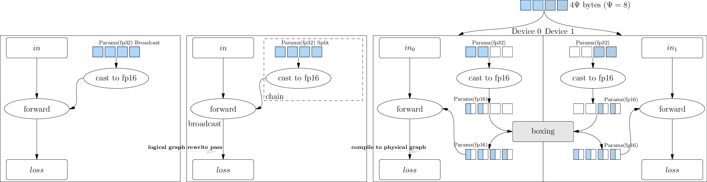<br><em>图 14a：ZeRO optimizer forward pass。</em></td>
  </tr>
  <tr>
    <td align="center" width="100%">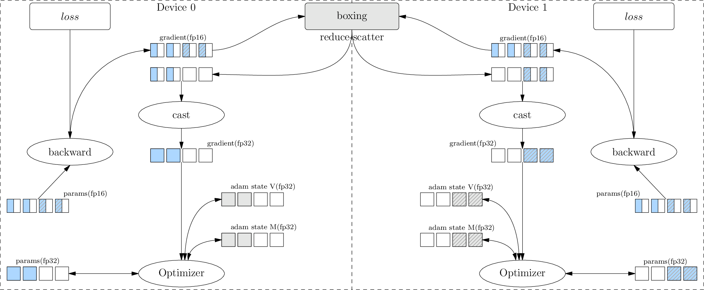<br><em>图 14b：ZeRO optimizer backward pass。</em></td>
  </tr>
</table>

<p align="center"><em>图 14：在 OneFlow 中并行化 optimizer。</em></p>

图 15 比较训练 GPT-2 时每设备内存占用与吞吐，并分别打开或关闭 activation checkpoint [45]，即 opt on 或 opt off。可以看到，无论是否启用 activation checkpointing，OneFlow 都比 ZeRO-DP 消耗更少设备内存，同时达到更高吞吐。

<table align="center">
  <tr>
    <td align="center" width="50%">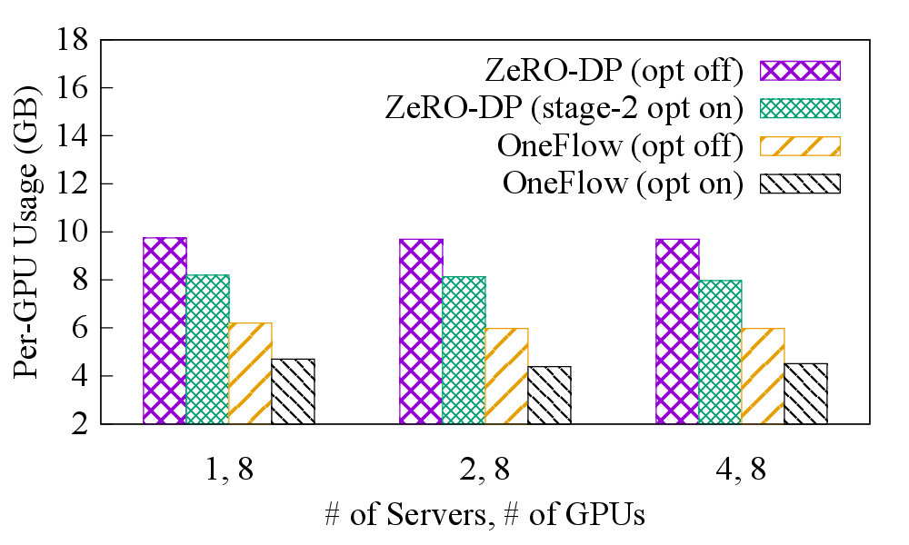<br><em>图 15a：内存占用。</em></td>
    <td align="center" width="50%">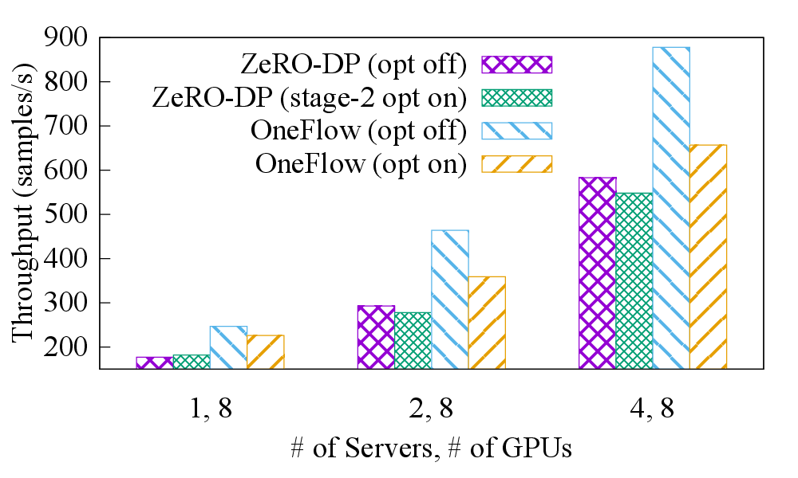<br><em>图 15b：吞吐。</em></td>
  </tr>
</table>

<p align="center"><em>图 15：Optimizer sharding 性能：OneFlow 与 ZeRO-DP 对比。</em></p>

### 6.5 混合并行

Megatron-LM [20] 是一个基于 PyTorch、用于预训练 GPT-3 等大规模模型的定制库。它支持数据并行、模型并行，以及结合数据并行与模型并行的混合并行，这相当于第 3.3 节中描述的二维 SBP。它还实现了 activation checkpointing 和使用 1F1B pipeline schedule 的同步流水线。

本文比较 OneFlow 和 Megatron-LM 在代表性配置下训练 GPT-2 的表现，如图 16 所示。四个子图分别展示纯数据并行、纯模型并行、数据并行与模型并行的混合、以及数据并行、模型并行和流水线并行组合的实验结果。作为通用框架，OneFlow 实现了 Megatron-LM 支持的全部特性，例如 activation checkpointing 和 1F1B pipeline schedule，并对齐所有 hyper-parameter。两个框架的物理执行计划本质上相同。然而，OneFlow 执行了比 Megatron-LM 更多的 kernel fusion。因此，即使在单设备上，OneFlow 也优于 Megatron-LM。这也是 OneFlow 在分布式场景中相对定制库达到更高训练效率的主要原因。

<table align="center">
  <tr>
    <td align="center" width="50%">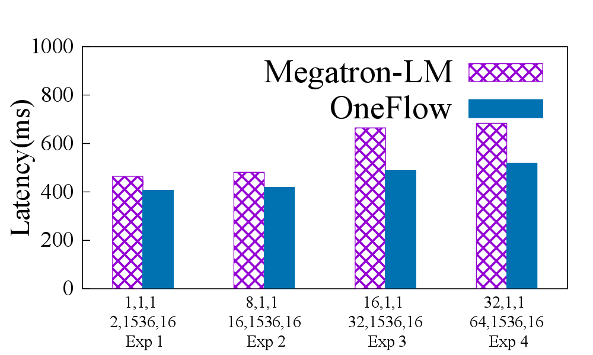<br><em>图 16a：DP。</em></td>
    <td align="center" width="50%">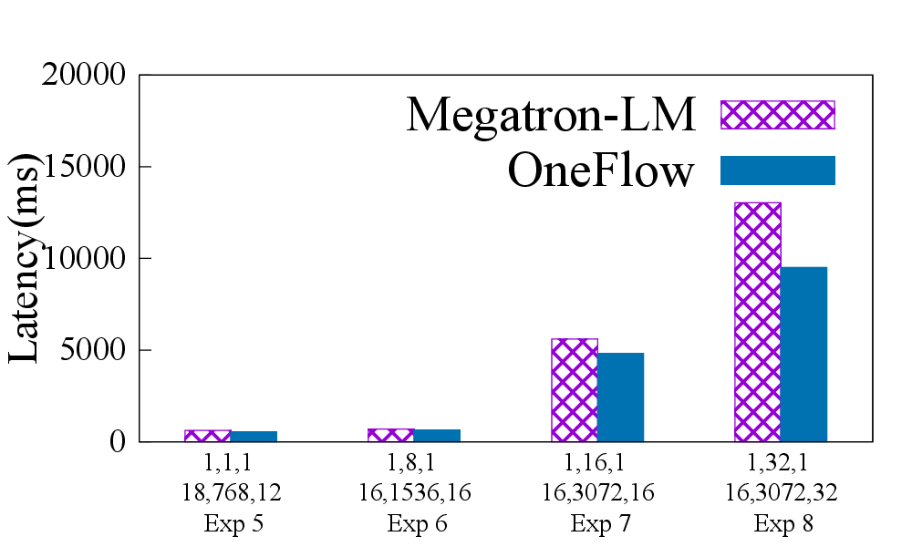<br><em>图 16b：MP。</em></td>
  </tr>
  <tr>
    <td align="center" width="50%">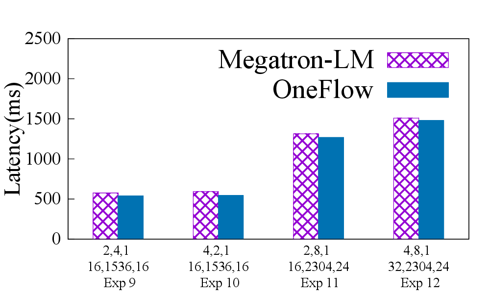<br><em>图 16c：DP combined with MP。</em></td>
    <td align="center" width="50%">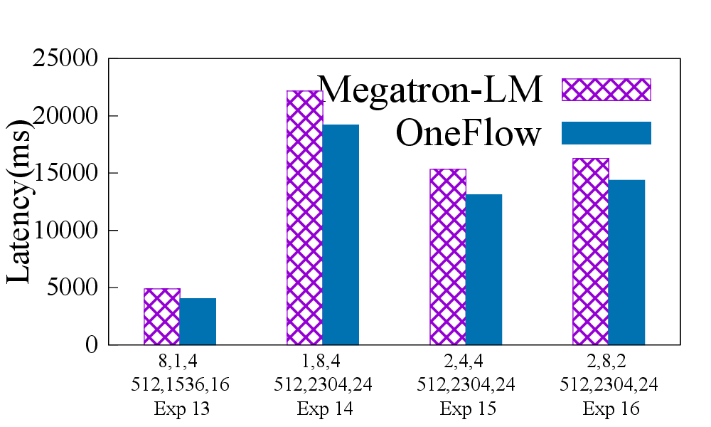<br><em>图 16d：DP、MP combined with PP。</em></td>
  </tr>
</table>

<p align="center"><em>图 16：使用多种并行方式训练 GPT-2 的每迭代训练时间：OneFlow 与 Megatron-LM 对比。每个实验列出的数字依次表示 Megatron-LM 中定义的 data-parallel-size、tensor-model-parallel-size、pipeline-model-parallel-size、global batch size、hidden-size 和 number-of-layers。</em></p>

## 7. 结论与讨论

本文提出一个新的分布式深度学习框架 OneFlow，基于 SBP 概念和 actor model。OneFlow 克服了现有框架在支持多种并行方式训练大型深度学习模型时的复杂性与效率问题。Compiler 使用简洁的 SBP 抽象，为 actor 自动生成有效执行计划，并支持空间调度和时间调度。Actor model 把多种依赖统一为消息传递，并自然支持流水线，为分布式深度学习框架的 runtime 提供了一种新的机制。最后，本文在真实数据集上的一系列挑战性任务中给出实验结果，展示该设计比现有方案更灵活、更高效。

虽然 OneFlow 和 Ray [46] 都使用 actor 概念，但二者粒度不同。在 Ray 中，单个 actor 用于在深度学习训练中管理完整神经网络。到目前为止，Ray 只能作为插件为 TensorFlow 和 PyTorch 启用数据并行；它不支持模型并行和流水线并行。

OneFlow 仍有若干正在积极推进的改进方向，包括：第一，在朴素 global checkpointing 之外，为 OneFlow 启用 elastic scaling [47, 48] 和细粒度 fault resilience [49, 50]；第二，设计更高效的 cost model，实现 auto placement 和 auto parallelism，从而让系统更易使用。

## 致谢

作者感谢 OSDI 2021、SOSP 2021 和 MLSys 2022 的匿名审稿人对本文提出的有益意见。开发 OneFlow 这样的深度学习框架需要大量工程工作。作者感谢 OneFlow Inc. 和 Zhejiang Lab. 内部同事以及 OneFlow 用户的贡献。特别是 Wenxiao Zhang、Xiaoyu Zhang、Binbin Han、Jianhao Zhang、Houjiang Chen、Luyang Zhao、Yu Ouyang、Zekang Zheng、Xuan Xie、Yinggang Wang、Yipeng Li、Fengwei Liu、Shijie Wang、Xiaoyu Xu、Depeng Liang、Mingyang Liu、Shiyuan Shangguan、Jing Qiao、Chong Niu、Wei Zhang、Xuefei Jiang 为 OneFlow 贡献了大量代码。

## 参考文献

[1] Devlin, J., Chang, M.-W., Lee, K., and Toutanova, K. BERT: Pre-training of Deep Bidirectional Transformers for Language Understanding. In Proceedings of the North American Chapter of the Association for Computational Linguistics: Human Language Technologies, 2019.

[2] Brown, T., Mann, B., Ryder, N., Subbiah, M., Kaplan, J. D., Dhariwal, P., Neelakantan, A., Shyam, P., Sastry, G., Askell, A., Agarwal, S., Herbert-Voss, A., Krueger, G., Henighan, T., Child, R., Ramesh, A., Ziegler, D., Wu, J., Winter, C., Hesse, C., Chen, M., Sigler, E., Litwin, M., Gray, S., Chess, B., Clark, J., Berner, C., McCandlish, S., Radford, A., Sutskever, I., and Amodei, D. Language Models are Few-Shot Learners. In Proceedings of Advances in Neural Information Processing Systems, 2020.

[3] Fedus, W., Zoph, B., and Shazeer, N. Switch Transformers: Scaling to Trillion Parameter Models with Simple and Efficient Sparsity. arXiv preprint arXiv:2101.03961, 2021.

[4] Kaplan, J., McCandlish, S., Henighan, T., Brown, T. B., Chess, B., Child, R., Gray, S., Radford, A., Wu, J., and Amodei, D. Scaling Laws for Neural Language Models. arXiv preprint arXiv:2001.08361, 2020.

[5] Abadi, M., Barham, P., Chen, J., Chen, Z., Davis, A., Dean, J., Devin, M., Ghemawat, S., Irving, G., Isard, M., Kudlur, M., Levenberg, J., Monga, R., Moore, S., Murray, D. G., Steiner, B., Tucker, P., Vasudevan, V., Warden, P., Wicke, M., Yu, Y., and Zheng, X. TensorFlow: A System for Large-scale Machine Learning. In Proceedings of the 12th USENIX Conference on Operating Systems Design and Implementation, 2016.

[6] Paszke, A., Gross, S., Massa, F., Lerer, A., Bradbury, J., Chanan, G., Killeen, T., Lin, Z., Gimelshein, N., Antiga, L., Desmaison, A., Kopf, A., Yang, E., DeVito, Z., Raison, M., Tejani, A., Chilamkurthy, S., Steiner, B., Fang, L., Bai, J., and Chintala, S. PyTorch: An Imperative Style, High-Performance Deep Learning Library. In Proceedings of Advances in Neural Information Processing Systems, 2019.

[7] Huang, Y., Cheng, Y., Bapna, A., Firat, O., Chen, D., Chen, M., Lee, H., Ngiam, J., Le, Q. V., Wu, Y., and Chen, z. GPipe: Efficient Training of Giant Neural Networks using Pipeline Parallelism. In Proceedings of Advances in Neural Information Processing Systems, 2019.

[8] Wang, M., Huang, C.-c., and Li, J. Supporting Very Large Models Using Automatic Dataflow Graph Partitioning. In Proceedings of the Fourteenth EuroSys Conference, 2019.

[9] Ben-Nun, T. and Hoefler, T. Demystifying Parallel and Distributed Deep Learning: An In-Depth Concurrency Analysis. ACM Computing Surveys, 2019.

[10] NVIDIA NCCL. https://developer.nvidia.com/nccl, 2021.

[11] Hashemi, S. H., Jyothi, S. A., and Campbell, R. H. TicTac: Accelerating Distributed Deep Learning with Communication Scheduling. In Proceedings of Machine Learning and Systems, 2019.

[12] Peng, Y., Zhu, Y., Chen, Y., Bao, Y., Yi, B., Lan, C., Wu, C., and Guo, C. A Generic Communication Scheduler for Distributed DNN Training Acceleration. In Proceedings of the 27th ACM Symposium on Operating Systems Principles, 2019.

[13] Jiang, Y., Zhu, Y., Lan, C., Yi, B., Cui, Y., and Guo, C. A Unified Architecture for Accelerating Distributed DNN Training in Heterogeneous GPU/CPU Clusters. In Proceedings of the 14th USENIX Symposium on Operating Systems Design and Implementation, 2020.

[14] Wu, X., Xu, H., Li, B., and Xiong, Y. Stanza: Distributed Deep Learning with Small Communication Footprint. arXiv preprint arXiv:1812.10624, 2018.

[15] Pal, S., Ebrahimi, E., Zulfiqar, A., Fu, Y., Zhang, V., Migacz, S., Nellans, D., and Gupta, P. Optimizing Multi-GPU Parallelization Strategies for Deep Learning Training. IEEE Micro, 2019.

[16] Jia, Z., Lin, S., Qi, C. R., and Aiken, A. Exploring Hidden Dimensions in Parallelizing Convolutional Neural Networks. In Proceedings of the International Conference on Machine Learning, 2018.

[17] Jia, Z., Zaharia, M., and Aiken, A. Beyond Data and Model Parallelism for Deep Neural Networks. In Proceedings of Machine Learning and Systems, 2019.

[18] Shazeer, N., Cheng, Y., Parmar, N., Tran, D., Vaswani, A., Koanantakool, P., Hawkins, P., Lee, H., Hong, M., Young, C., et al. Mesh-tensorflow: Deep learning for supercomputers. In Proceedings of Advances in Neural Information Processing Systems, 2018.

[19] Oldridge, E., Perez, J., Frederickson, B., Koumchatzky, N., Lee, M., Wang, Z.-H., Wu, L., Yu, F., Zamora, R., Yilmaz, O., Gunny, A. M., Nguyen, V. P., and Lee, S. Merlin: A GPU Accelerated Recommendation Framework. 2020.

[20] Shoeybi, M., Patwary, M., Puri, R., LeGresley, P., Casper, J., and Catanzaro, B. Megatron-LM: Training Multi-Billion Parameter Language Models Using Model Parallelism. arXiv preprint arXiv:1909.08053, 2020.

[21] Narayanan, D., Shoeybi, M., Casper, J., LeGresley, P., Patwary, M., Korthikanti, V., Vainbrand, D., Kashinkunti, P., Bernauer, J., Catanzaro, B., Phanishayee, A., and Zaharia, M. Efficient Large-Scale Language Model Training on GPU Clusters. arXiv preprint arXiv:2104.04473, 2021.

[22] Microsoft DeepSpeed. https://github.com/microsoft/DeepSpeed, 2021.

[23] Rajbhandari, S., Ruwase, O., Rasley, J., Smith, S., and He, Y. ZeRO-Infinity: Breaking the GPU Memory Wall for Extreme Scale Deep Learning. arXiv preprint arXiv:2104.07857, 2021.

[24] Rajbhandari, S., Rasley, J., Ruwase, O., and He, Y. ZeRO: Memory Optimizations Toward Training Trillion Parameter Models. In Proceedings of International Conference for High Performance Computing, Networking, Storage and Analysis, 2020.

[25] InsightFace Project. https://github.com/deepinsight/insightface, 2021.

[26] Lepikhin, D., Lee, H., Xu, Y., Chen, D., Firat, O., Huang, Y., Krikun, M., Shazeer, N., and Chen, Z. GShard: Scaling Giant Models with Conditional Computation and Automatic Sharding. In Proceedings of International Conference on Learning Representations, 2020.

[27] Narayanan, D., Harlap, A., Phanishayee, A., Seshadri, V., Devanur, N. R., Ganger, G. R., Gibbons, P. B., and Zaharia, M. PipeDream: Generalized Pipeline Parallelism for DNN Training. In Proceedings of the 27th ACM Symposium on Operating Systems Principles, 2019.

[28] fairscale. Facebook Fairscale project. https://github.com/facebookresearch/fairscale.

[29] Li, M., Andersen, D. G., Park, J. W., Smola, A. J., Ahmed, A., Josifovski, V., Long, J., Shekita, E. J., and Su, B.-Y. Scaling Distributed Machine Learning with the Parameter Server. In Proceedings of the 11th USENIX Symposium on Operating Systems Design and Implementation, 2014.

[30] Goyal, P., Dollar, P., Girshick, R., Noordhuis, P., Wesolowski, L., Kyrola, A., Tulloch, A., Jia, Y., and He, K. Accurate, Large Minibatch SGD: Training ImageNet in 1 Hour. arXiv preprint arXiv:1706.02677, 2017.

[31] Chen, J., Monga, R., Bengio, S., and Jozefowicz, R. Revisiting Distributed Synchronous SGD. arXiv preprint arXiv:1604.00981, 2016.

[32] Chen, T., Li, M., Li, Y., Lin, M., Wang, N., Wang, M., Xiao, T., Xu, B., Zhang, C., and Zhang, Z. MXNet: A Flexible and Efficient Machine Learning Library for Heterogeneous Distributed System. In Proceedings of LearningSys, 2015.

[33] Xu, Q., Li, S., Gong, C., and You, Y. An efficient 2d method for training super-large deep learning models, 2021.

[34] Hewitt, C., Bishop, P., and Steiger, R. A Universal Modular ACTOR Formalism for Artificial Intelligence. In Proceedings of the 3rd International Joint Conference on Artificial Intelligence, 1973.

[35] NVIDIA Data Loading Library (DALI). https://developer.nvidia.com/DALI, 2021.

[36] Kung, H. T., Blackwell, T., and Chapman, A. Credit-based flow control for atm networks: Credit update protocol, adaptive credit allocation and statistical multiplexing. SIGCOMM Comput. Commun. Rev., 24(4):101-114, October 1994.

[37] Kumar, S., Bradbury, J., Young, C., Wang, Y. E., Levskaya, A., Hechtman, B., Chen, D., Lee, H., Deveci, M., Kumar, N., et al. Exploring the Limits of Concurrency in ML Training on Google TPUs. arXiv preprint arXiv:2011.03641, 2020.

[38] Sergeev, A. and Balso, M. D. Horovod: Fast and Easy Distributed Deep Learning in TensorFlow. arXiv preprint arXiv:1802.05799, 2018.

[39] He, K., Zhang, X., Ren, S., and Sun, J. Deep Residual Learning for Image Recognition. In Proceedings of the IEEE Conference on Computer Vision and Pattern Recognition, 2016.

[40] Micikevicius, P., Narang, S., Alben, J., Diamos, G., Elsen, E., Garcia, D., Ginsburg, B., Houston, M., Kuchaiev, O., Venkatesh, G., and Wu, H. Mixed Precision Training. In Proceedings of International Conference on Learning Representations, 2018.

[41] Mattson, P., Cheng, C., Diamos, G., Coleman, C., Micikevicius, P., Patterson, D., Tang, H., Wei, G.-Y., Bailis, P., Bittorf, V., Brooks, D., Chen, D., Dutta, D., Gupta, U., Hazelwood, K., Hock, A., Huang, X., Kang, D., Kanter, D., Kumar, N., Liao, J., Narayanan, D., Oguntebi, T., Pekhimenko, G., Pentecost, L., Janapa Reddi, V., Robie, T., St John, T., Wu, C.-J., Xu, L., Young, C., and Zaharia, M. MLPerf Training Benchmark. In Proceedings of Machine Learning and Systems, 2020.

[42] Chen, S., Liu, Y., Gao, X., and Han, Z. Mobilefacenets: Efficient CNNs for Accurate Real-time Face Verification on Mobile Devices. In Proceedings of Chinese Conference on Biometric Recognition, 2018.

[43] Cheng, H.-T., Koc, L., Harmsen, J., Shaked, T., Chandra, T., Aradhye, H., Anderson, G., Corrado, G., Chai, W., Ispir, M., Anil, R., Haque, Z., Hong, L., Jain, V., Liu, X., and Shah, H. Wide & Deep Learning for Recommender Systems. In Proceedings of the 1st Workshop on Deep Learning for Recommender Systems, 2016.

[44] Kingma, D. P. and Ba, J. Adam: A Method for Stochastic Optimization. In Proceedings of International Conference on Learning Representations, 2015.

[45] Chen, T., Xu, B., Zhang, C., and Guestrin, C. Training Deep Nets with Sublinear Memory Cost. arXiv preprint arXiv:1604.06174, 2016.

[46] Moritz, P., Nishihara, R., Wang, S., Tumanov, A., Liaw, R., Liang, E., Paul, W., Jordan, M. I., and Stoica, I. Ray: A Distributed Framework for Emerging AI Applications. In Proceedings of the 13th USENIX Symposium on Operating Systems Design and Implementation, 2018.

[47] Mai, L., Li, G., Wagenlander, M., Fertakis, K., Brabete, A.-O., and Pietzuch, P. KungFu: Making Training in Distributed Machine Learning Adaptive. In Proceedings of the 14th USENIX Symposium on Operating Systems Design and Implementation, 2020.

[48] Or, A., Zhang, H., and Freedman, M. Resource Elasticity in Distributed Deep Learning. 2020.

[49] Wang, S., Liang, E., Oakes, E., Hindman, B., Luan, F. S., Cheng, A., and Stoica, I. Ownership: A Distributed Futures System for Fine-Grained Tasks. In Proceedings of the 18th USENIX Symposium on Networked Systems Design and Implementation, 2021.

[50] Zaharia, M., Das, T., Li, H., Hunter, T., Shenker, S., and Stoica, I. Discretized streams: Fault-tolerant streaming computation at scale. In Proceedings of the twenty-fourth ACM Symposium on Operating Systems Principles, 2013.
