# Expanding across time to deliver bandwidth efficiency and low latency

## 论文信息

- 标题：Expanding across time to deliver bandwidth efficiency and low latency
- 年份：2020
- 会议/期刊：USENIX NSDI 2020
- 作者：William M. Mellette、Rajdeep Das、Yibo Guo、Rob McGuinness、Alex C. Snoeren、George Porter
- 机构：
  - University of California San Diego：William M. Mellette、Rajdeep Das、Yibo Guo、Rob McGuinness、Alex C. Snoeren、George Porter

## 摘要

数据中心需要同时支持低延迟和高带宽的数据包传输，才能满足现代应用的严格要求。本文提出 Opera，这是一种动态网络：它像基于扩展器图的方法一样依靠多跳转发快速承载延迟敏感流量，同时又通过时变的源到目的电路直接转发批量流，为批量流提供接近最优的带宽。Opera 设计的关键，是以快速、确定性的方式逐块重配置网络，使网络在任意时刻都实现一个扩展器图；而从时间维度积分来看，又能在所有机架之间提供带宽高效的单跳路径。我们表明，Opera 支持低延迟流量，其流完成时间与同等成本的静态拓扑相当；同时，它可为 all-to-all 流量提供最高 4 倍带宽，并让已发表数据中心工作负载的可支持负载提高 60%。

## 1. 引言

数据中心网络的任务是在数量不断增加的终端主机之间提供连接，这些主机的链路速率每隔几年就会提高一个数量级。通过相应地增加网络的内部交换容量来保持全平分带宽 [1, 2] 的“大交换机”幻觉，其成本越来越高，并且可能很快就不可行了 [3]。长期以来，从业者一直青睐超额订阅的网络，这些网络提供全面的连接，但速度仅为主机链路速度的一小部分 [2, 4]。此类网络通过大幅减少网络内容量（就网络结构内部的链路和交换机的数量和速率而言）、仅在一部分主机之间提供全速连接以及在其他主机之间提供更有限的容量来实现成本节约。

当然，问题在于任何配置不足的拓扑都会固有地使网络偏向某些工作负载。传统的超额订阅 Clos 拓扑仅支持全线速率的机架本地流量；研究人员提出了部署有限交换容量的替代方法（通过不同的链路和交换技术 [5, 6, 7, 8]、非分层拓扑 [9, 10, 11, 12] 或两者同时使用 [13, 14]），可以以相似的成本为已发布的工作负载 [15, 16] 提供更高的性能。由于工作负载可能是动态的，因此许多建议都实现了可重新配置的网络，这些网络以时变的方式分配链路容量，要么按照固定的时间表 [14, 7]，要么响应最近的需求 [13, 5, 8]。不幸的是，实际的可重新配置技术需要相当大的延迟来重新定位容量，从而限制了它们对于具有严格延迟要求的工作负载的实用性。

资源配置不足的网络通常会采用某种类型的间接流量路由来解决不合时宜的流量需求；由于应用程序工作负载并不总是与网络结构保持良好一致，因此某些流量可能会传输更长、效率较低的路径。然而，间接的好处是以巨大的成本为代价的：通过网络遍历超过一跳会产生“带宽税”。换句话说，通过两个端点之间的直接链路发送的 $x$ 字节仅消耗 $x$ 字节的网络容量。如果通过 $k$ 链路发送相同的流量（可能间接通过多个交换机），则会消耗 $(k x)$ 字节的网络容量，其中 $(k-1)x$ 对应于带宽税。因此，网络的有效承载能力（即净带宽税）可能明显小于其原始交换能力； 200--500% 的总税率在现有提案中很常见。

可重构网络试图通过在具有最高需求的端点之间提供直接链路来降低给定工作负载的总体带宽税率，从而消除最大的“批量”流的税收，其完成时间由可用网络容量而不是传播延迟决定。然而，识别此类流 [5, 8] 和重新配置网络 [13, 14] 所需的时间通常比甚至通过网络的间接路由的单向延迟大几个数量级，这是小流的最佳完成时间的主要驱动因素。因此，动态网络面临着摊销重新配置的开销与次优配置的低效率之间的基本权衡。结果是现有的建议要么不适合延迟敏感的流量（在所谓的混合架构 [5, 14, 6] 中经常分流到完全独立的网络），要么支付大量的带宽税来提供低延迟连接，特别是在面临高度动态或不可预测的工作负载时。

Opera 是一种网络架构，可最大限度地减少批量流量（构成当今网络 [15, 16] 中的绝大多数字节）所支付的带宽税，同时确保无法容忍额外延迟的（一小部分）流量的低延迟传输。 Opera 实现了动态电路交换拓扑，不断重新配置每个架顶 (ToR) 交换机的少量上行链路，通过一系列随时间变化的扩展器图移动（无需运行时电路选择算法或网络范围的流量需求收集）。 Opera 不断变化的拓扑确保每对端点定期分配直接链路，为批量流量提供带宽高效的连接，同时通过同一低直径网络间接传输延迟敏感的流量，以提供接近最佳的流完成时间。

通过在每个时刻预先、策略性地分配机架到机架电路，使这些电路形成扩展器图，Opera 总能在无需等待任何电路重新配置的情况下，通过扩展器转发低延迟流量。因此，对每个数据包而言，Opera 可以选择：（1）立即通过当前实例化的静态扩展器发送数据包，让这一小部分流量承担适度带宽税；或（2）缓冲数据包并等待，直到到最终目的地的直接链路建立，从而消除绝大多数字节的带宽税。模拟结果表明，相比同等成本的静态拓扑，这种取舍可让 shuffle 工作负载吞吐量最高提升 4 倍。此外，对已发表的倾斜数据中心工作负载，Opera 的有效带宽税率为 8.4%，可让吞吐量最高提高 60%，同时在所有流大小上保持等效的流完成时间。我们还在一系列工作负载、网络规模和成本因子下验证了这一结果的稳定性。

## 2. 网络效率

数据中心网络的现实是不断变化的：开发人员不断部署新应用程序并更新现有应用程序，而用户行为处于不断变化的状态。因此，运营商不能冒险设计仅支持小范围工作负载的网络，而必须选择支持大范围工作负载、应用程序和用户行为的设计。

### 2.1 工作负载属性

需要为广泛的工作负载提供服务的一个优点是，实际上，在实践中可能存在一系列需求。一个具体的例子是流量大小的分布，众所周知，它在当今的网络中高度倾斜：图 1 显示了 Microsoft [15, 2]（Web 搜索和数据挖掘）和 Facebook [16] (Hadoop) 发布的数据，描述了我们在本文中考虑的根据单个流量（顶部）和传输字节总数（底部）的流量分布。绝大多数字节都是批量流，而不是短的、对延迟敏感的字节，这表明为了充分利用可用容量，理想的网络必须设法最大限度地减少批量流量所支付的带宽税，同时又不会显著影响短流所经历的传播延迟。

<table align="center">
  <tr>
    <td align="center" width="50%">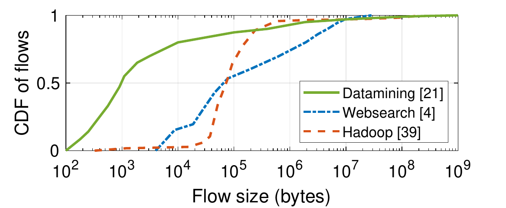 <em>图 1a</em></td>
    <td align="center" width="50%">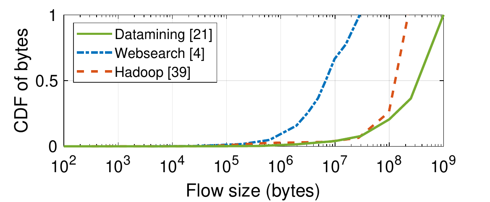 <em>图 1b</em></td>
  </tr>
</table>

<em>图 1：已发布经验流量大小分布。</em>

虽然有多种方法可以衡量网络对给定工作负载的适用性，但由于流完成时间 (FCT) 适用于各种工作负载，因此经常将其作为有用的品质因数 [17]。小流的流完成时间受到底层网络传播延迟的限制。因此，降低网络直径和/或减少排队会降低此类流量的 FCT。另一方面，批量流量的 FCT 由流路径上的可用容量控制。

由于短流的 FCT 由传播延迟决定，这类流量通常称为“延迟敏感”（latency-sensitive）或“低延迟”（low-latency）流量。（较大流的完成时间同样可能被应用关注，但它们的 FCT 主要由可用带宽主导。）在今天的网络中，流会被显式地划入这些类别（例如根据应用类型、端口号或发送端规则），也可能被隐式分类（例如最短剩余时间优先 SRTF 调度中的剩余流大小）。Opera 不关心流量具体如何分类；在本文语境中，延迟敏感流和短流是同义词。由于在今天的工作负载中，延迟敏感流量对网络总容量的影响可以忽略，使用优先级队列就足以保证短流获得不受阻塞的服务，同时允许批量流量消耗剩余容量 [18, 19]。挑战在于：既要提供高容量路径，又要保持较短的路径长度。

### 2.2 “大开关”抽象

如果成本（和实用性）不成为问题，那么一个完美的网络将由一个连接所有端点的大型无阻塞交换机组成。基于折叠 Clos 拓扑 [1, 2, 20] 的横向扩展分组交换网络结构正是为了提供这种“大交换机”错觉而设计的。这些拓扑依赖于与随机网络互连的多级分组交换机。每个阶段的大量数据包交换机以及它们之间的过多链路确保有足够的容量来支持任何（允许的）服务器间通信的混合。 Hedera [21]、pHost [22]、HULL [23]、NDP [24]、PIAS [18] 和 Homa [25] 等提案引入了流调度技术，将流量分配给精心选择的路径，以最大限度地提高吞吐量，同时在服务大量和低延迟流量的混合时最大限度地减少网络内排队。

### 2.3 减少网络容量

尽管全带宽的“大交换机”网络设计很理想，因为它给运营者提供了部署服务、调度作业以及解耦存储和计算的最大灵活性，但这种设计在大规模下并不现实。已有公开报告确认，现有最大规模的数据中心网络虽然基于 folded-Clos 拓扑，却并非全量配置 [26, 4]。此外，也有人观察到，当链路速率超过 400 Gb/s 时，分组交换技术可能无法继续跟上，因此“大交换机”抽象本身还能可行多久也并不明确 [3]。因此，研究者和实践者都开始考虑许多方式来降低网络配置量，或者说对网络拓扑进行“超额订阅”。

理解基于机架的数据中心中的超额订阅，一种方式是看每台 ToR 交换机如何配置。假设集群或数据中心中的服务器组织成机架，每个机架有一台 $k$ 端口 ToR 分组交换机，将该机架连接到网络其余部分。若一台 ToR 连接了 $d$ 台服务器，我们称它有 $d$ 个“向下”（downward）端口；若它有 $u$ 个端口连接到网络其余部分，则称这些端口为“向上”（upward）端口或上行链路。（在满配 ToR 中，$d+u=k$。）在这个背景下，我们接下来概述已有方案如何互连这些机架。

#### 2.3.1 超额订阅的 Fat Tree

如图 2 最左侧部分所示，设计人员可以构建 $M$:1 超额订阅折叠 Clos 网络，其中网络只能为 $(1/M=u/d)$ 提供完全配置设计的带宽。 $(d:u)$ 的常用值介于 3:1 和 5:1 [4] 之间。折叠 Clos 网络中提供的成本和带宽几乎根据超额订阅因子线性扩展，因此降低总体成本需要降低最大网络吞吐量，反之亦然。然而，路由仍然是直接的，因此超额订阅不会引入带宽税；相反，它严重降低了不同机架中端点之间的可用网络容量。因此，MapReduce [27] 和 Hadoop [28] 等应用程序框架在安排作业时会考虑到位置，以努力将流量控制在机架内。

  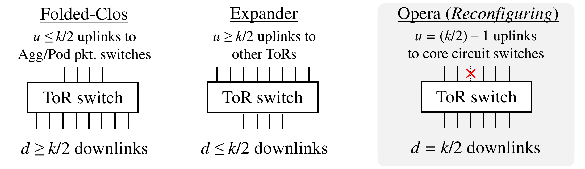
   <em>图 2：超额订阅的折叠 Clos 网络分配的上行链路少于下行链路，而基于静态扩展器图的网络通常分配的上行端口多于下行端口。在 Opera 中，ToR 交换机按 1:1 进行配置。当电路交换机重新配置时，关联的 ToR 端口无法通过该上行链路承载流量。</em>

#### 2.3.2 扩展器拓扑

为了解决超额订阅胖树中可用的有限跨网络带宽问题，研究人员提出了基于扩展图的替代容量减少网络拓扑。在这些提案中，每个 ToR 的 $u$ 上行链路直接连接到其他 ToR（随机 [11] 或确定性 [9, 10, 12] ），从而减少网络本身内部交换机和交换机间链路的数量。基于扩展图的网络拓扑是稀疏图，其特性是从给定源到特定目的地存在许多潜在的短路径。

由于没有网络内交换机，数据包必须在 ToR 之间“跳跃”多次才能到达最终目的地，从而产生带宽税。平均 ToR 到 ToR 跳数为 $L_{Avg}$ 的扩展器图预期支付的总体带宽税率为 $(L_{Avg}-1)\times$，因为各个数据包必须间接跨越多个网络内链路。大型网络的平均路径长度可能在 4--5 跳范围内，导致带宽税率为 300--400%。此外，最近的一项提案 [10] 采用了 Valiant 负载平衡 (VLB)——它施加了额外的显式间接级别——来解决倾斜的流量需求，在某些情况下使带宽税加倍。扩展器抵消高带宽税率的一种方法是过度配置：扩展器拓扑中的 ToR 通常具有比向下更多的向上端口（$u > d$，如图 2 中心所示），因此，向上端口比超额订阅的胖树多得多，从而提供了更多的网络内容量。换句话说，带宽税的影响减少了 $u/d$ 倍。

#### 2.3.3 可重构拓扑

为了减少带宽税，其他建议依赖于某种形式的可重构链路技术，包括 RF [29, 30]、自由空间光学 [13, 31] 和电路交换 [32, 5, 6, 7, 8]。尽管 RotorNet [14] 采用固定的确定性调度，但大多数可重构拓扑都会在网络核心内动态建立端到端路径，以响应流量需求。无论哪种情况，这些网络都会随着时间的推移建立和拆除物理层链路。当拓扑可以满足需求并抛开延迟问题时，流量可以通过单跳从源传送到目的地，从而避免任何带宽税。在某些情况下，与基于扩展器的拓扑类似，它们采用 2 跳 VLB [14, 7]，从而实现 100% 的带宽税率。

然而，任何可重构拓扑的一个基本限制是，在配置链路/波束/电路（为简单起见，我们将在本文的其余部分中使用后一个术语）期间，它无法传输数据。此外，大多数提案并不总是在所有源和目的地之间提供链路，这意味着流量在等待提供适当的电路时可能会产生显著的延迟。对于现有提案，这种端到端延迟约为 10--100 毫秒。因此，先前关于可重新配置网络拓扑的建议依赖于独特的、通常是分组交换的网络来服务延迟敏感的流量。对采用不同技术构建的单独网络的要求是一个重大的实际限制以及成本和功耗的来源。

## 3. 设计

在进行示例之前，我们首先概述我们的设计。然后，我们继续描述如何构建给定网络的拓扑、如何选择路由、网络如何通过其固定配置集移动，并解决布线复杂性、交换速度和容错等实际考虑因素。

### 3.1 概述

Opera 的结构为两层叶-主干拓扑，分组交换 ToR 通过可重新配置的电路交换机互连，如图拓扑所示。 Opera 的设计基于两个基本起始块，这两个基本起始块直接遵循小网络直径和低带宽税的要求。

#### 3.1.1 短路径的扩展

由于短的、延迟敏感的流的流完成时间由端到端延迟控制，因此我们寻求具有尽可能低的预期路径长度的拓扑。基于扩展器的拓扑被认为是理想的 [9]。扩展器还具有良好的容错特性；如果交换机或链路发生故障，可能还会有替代路径。因此，为了有效支持低延迟流量，我们需要始终具有良好扩展性能的拓扑。

#### 3.1.2 可重新配置以避免带宽税

全连接图（即全网格）可以完全避免带宽税，但大规模构建是不可行的。可重新配置的电路交换机不是在空间中提供全网状网络，而是能够随着时间的推移使用相对较少数量的链路在每个机架对之间建立直接的单跳路径。由于批量流量通常可以分摊适度的重新配置开销（如果它们导致吞吐量增加），因此我们将可重新配置性纳入我们的设计中，以最大限度地减少批量流量的带宽税。

Opera 将扩展器和可重配置两类元素结合起来，以较低的流完成时间同时高效服务低延迟流量和批量流量。与 RotorNet [14] 类似，Opera 使用可重配置电路交换机，周期性地建立和拆除 ToR 之间的直接连接；经过一个连接“周期时间”（cycle time）后，每个 ToR 都已经与每个其他 ToR 直接连接过一次。我们利用 ToR 上行链路的并行性，让多个电路交换机的重配置错开进行，从而在所有 ToR 对之间提供“始终在线”的多跳连接。

至关重要的是，任何时候的电路组合都会形成一个扩展图。因此，在单个周期内，每个数据包都可以选择是等待避免带宽税的直接连接，还是立即通过时变扩展器通过多跳路径发送。最终结果是支持大量和低延迟流量的单个结构，而不是混合方法中使用的两个单独的网络。正如我们将展示的，Opera 不需要任何电路分配的运行时选择或系统范围的流量需求收集，相对于 ProjecToR [13] 和 Mordia [6] 等动态方法，大大简化了其控制平面。

#### 3.1.3 消除重新配置中断

电路交换机会带来取决于具体技术的重配置延迟，因此必须在重配置前重新路由相关流。即使一个网络有多个电路交换机，如果所有交换机同时重配置（图 3a），全局连接中断也会要求路由重新收敛。对今天的交换技术而言，这会造成流量延迟，并可能严重影响短的、延迟敏感流的流完成时间。为避免这种情况并支持低延迟数据包传输，Opera 将电路交换机的重配置错开。例如，在交换机数量较少的小型拓扑中，任意时刻最多只有一台交换机处于重配置状态（图 3b），因此即将经过待重配置电路的流可以迁移到该时间段内仍保持活动的其他电路上。（对包含许多电路交换机的大规模网络，同时重配置多台交换机反而有利，见附录“在大规模下缩短周期时间”。）因此，虽然 Opera 几乎一直处在变化中，但变化是渐进的，连接性在时间上保持连续。

<table align="center">
  <tr>
    <td align="center" width="50%">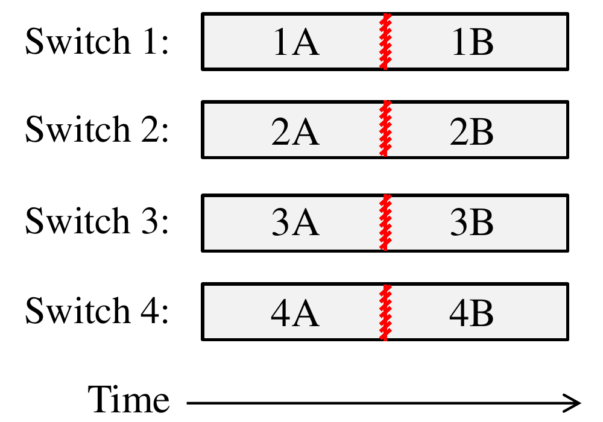 <em>图 3a：同时重配置。</em></td>
    <td align="center" width="50%">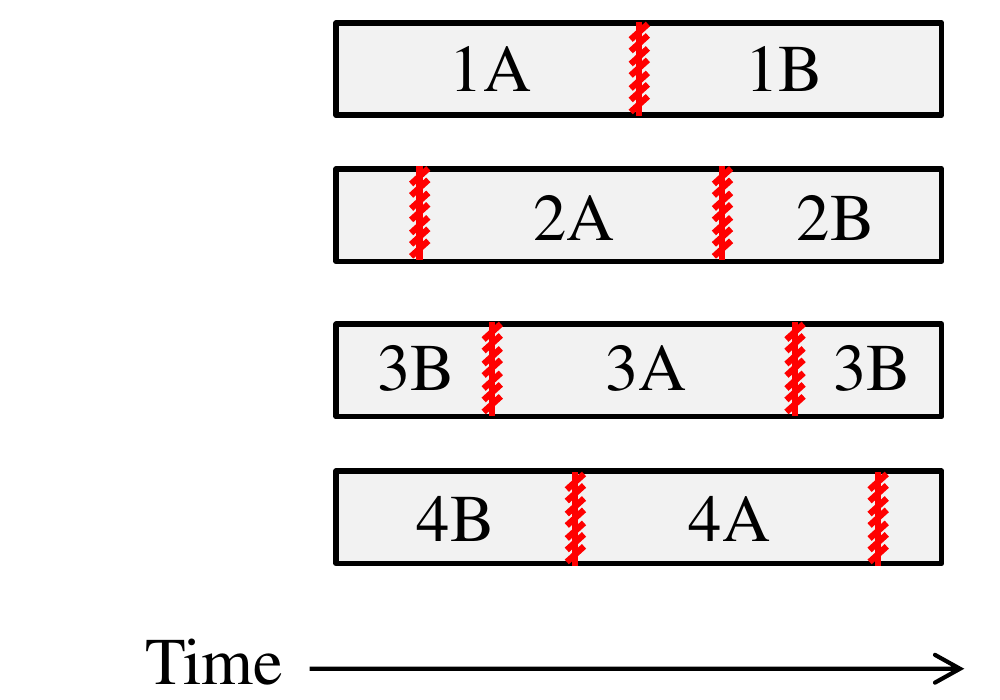 <em>图 3b：错开重配置。</em></td>
  </tr>
</table>

<em>图 3：所有交换机同时重配置会导致周期性中断；错开重配置可确保始终有路径可用。</em>

#### 3.1.4 确保良好的扩展性

虽然偏移重新配置保证了连续连接，但它本身并不能保证完全连接。 Opera 必须同时确保 (1) 每个时间点的所有机架之间都存在多跳路径，以支持低延迟流量；(2) 在固定时间段内的每个机架对之间配置直接路径，以支持低带宽税的批量流量。我们通过在电路交换机组上实现（时变）扩展图来保证两者。

在 Opera 中，每个 ToR 的 $u$ 上行链路都连接到一个（转子）电路交换机 [33]，该交换机在任何时间点都会在输入和输出端口之间实现（预先确定的）随机排列（即“匹配”）。 ToR 间网络拓扑是 $u$ 随机匹配的并集，对于 $u\geq 3$ 而言，这会产生具有高概率 [34] 的扩展图。而且，即使交换机正在重新配置，仍然存在 $u-1$ 主动匹配，这意味着如果是 $u\geq 4$，则无论哪台交换机正在重新配置，网络仍然很有可能是扩展器。在 Opera 中，$u=k/2$ 和 $k$ 相当于当今数据包交换机的数十个端口。

图 4 显示了我们评估中考虑的一个 648 主机网络示例中的路径长度分布，其中 $u=6$。 Opera 的路径长度几乎总是比连接相同数量主机的 Fat Tree 中的路径长度短得多，并且仅比带有 $u=7$ 的扩展器稍长，我们稍后认为后者具有类似的成本，但对于某些工作负载性能较差。显然，仅确保良好的扩展对于适度的交换机基数来说并不是问题。然而，随着时间的推移，Opera 还必须直接连接每个机架对。我们通过让每个开关循环通过一组匹配来实现这一点；我们通过构造不相交集来最小化匹配总数。

  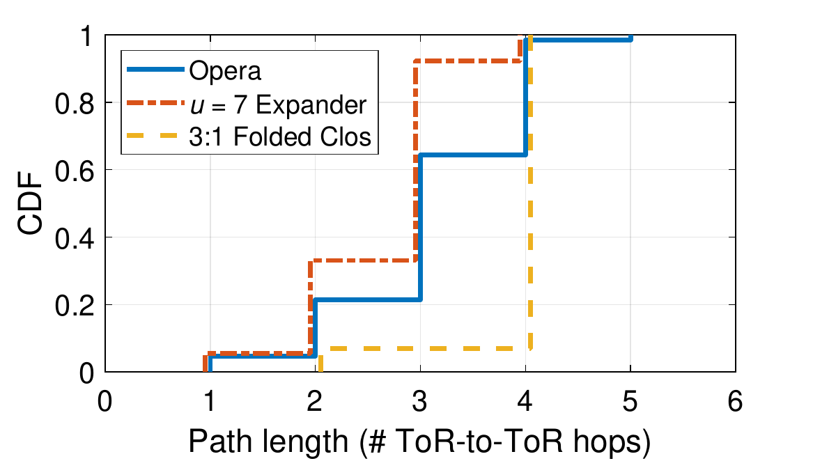
   <em>图 4：同等成本的 648 主机 Opera、650 主机 u=7 扩展器和 648 主机 3:1 folded-Clos 网络的路径长度 CDF。（为清晰起见，CDF 略微错开。）</em>

### 3.2 例子

图 5 描绘了一个小型 Opera 网络。八个 ToR 中的每一个都有四个上行链路连接到四个不同的电路交换机（其中一个可能由于在任何特定时刻重新配置而发生故障）。通过通过这些 ToR 转发流量，它们可以到达它们所连接的任何 ToR。每个电路开关都有两个匹配项，标记为 $A$ 和 $B$（请注意，所有匹配项彼此不相交）。在此示例拓扑中，任何 ToR 对都可以利用任意三个匹配集进行通信，这意味着无论交换机在给定时间恰好实现了哪些匹配，都可以保持完整的连接。图 5 描述了两种网络范围的配置。图 5 中开关 2--4 实现匹配 $A$，图 5 中开关 2--4 实现匹配 $B$。在这两种情况下，交换机 1 由于重新配置而不可用。

<table align="center">
  <tr>
    <td align="center" width="50%">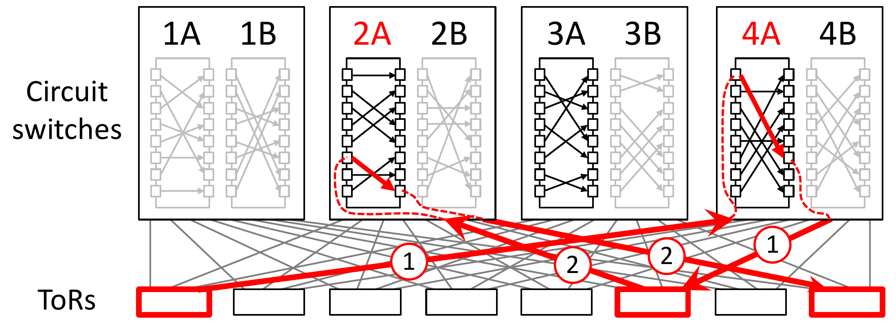 <em>图 5a：间接路径。</em></td>
    <td align="center" width="50%">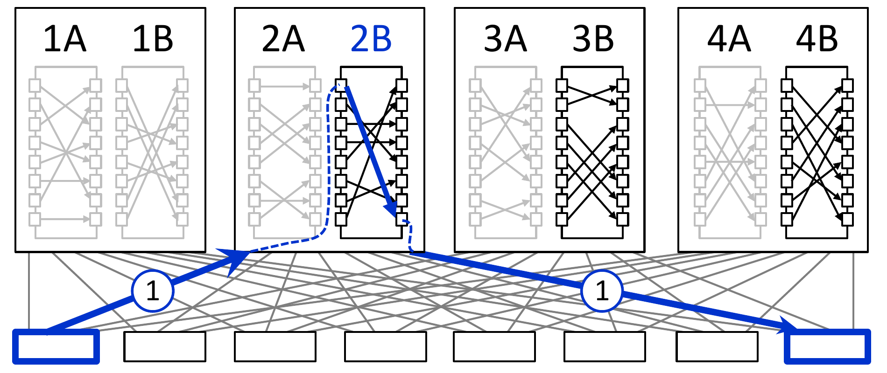 <em>图 5b：直接路径。</em></td>
  </tr>
</table>

<em>图 5：包含 8 台 ToR 交换机和 4 台转子电路交换机的 Opera 拓扑。图中突出显示从机架 1 到机架 8 的两条路径：(a) 红色两跳路径，(b) 蓝色一跳路径。每条直接机架间连接在每个配置中只实现一次，而任意机架对之间始终存在多跳路径。</em>

在此示例中，机架 1 和 8 通过图 5 中所示的配置直接连接，因此从 1 到 8 发送批量数据的最低带宽税方式是等待匹配的 $B$ 在交换机 2 中实例化，然后通过该电路发送数据；此类流量将在一跳中到达 ToR 8。另一方面，从 ToR 1 到 ToR 8 的低延迟流量可以立即发送，例如在图 5 所示的配置过程中，只需采取更长的路径即可到达 ToR 8。流量将从 ToR 1 跳到 ToR 6（通过交换机 4），然后跳到 ToR 8（通过交换机 2），并产生 100% 的带宽税。尽管图中未突出显示，但所有机架对都存在类似的替代方案。

### 3.3 拓扑生成

生成 Opera 拓扑的算法如下。首先，我们将完整的图（即 $N\times N$ 全 1 矩阵）随机分解为 $N$ 不相交（和对称）匹配。由于这种分解对于大型网络来说计算成本可能很高，因此我们采用图提升来从较小的分解中生成较大的分解。接下来，我们将 $N$ 匹配随机分配给电路交换机，以便每个开关都分配有 $N/u$ 匹配。最后，我们随机选择每个开关循环匹配的顺序。这些选择是在设计时、网络投入运行之前确定的；网络运行期间没有拓扑计算。

由于构造方法是随机的，某个具体 Opera 拓扑实现有可能（尽管概率很低）并非在所有时间点都具有良好的扩展器性质。例如，某一时刻给定的 $u-1$ 台交换机上的匹配组合可能并不构成扩展器。遇到这种情况时，可以在设计阶段继续生成并测试额外实现，直到找到性质良好的解。根据我们的经验，这通常没有必要，因为算法第一次迭代总是生成具有接近最优性质的拓扑。我们在附录“谱间隙和路径长度”中详细讨论这些图的性质。

### 3.4 转发

接下来需要决定如何服务给定流或数据包：（1）立即通过多跳扩展器路径发送，并支付带宽税，本文称为“间接”（indirect）路径；或（2）延迟传输，通过一跳路径发送以避免带宽税，本文称为“直接”（direct）路径。对能够容忍延迟的倾斜流量模式，也可以使用基于 Valiant 负载均衡的两跳路径。我们的基线方法是根据流大小做决定。由于等待直接路径可能带来整个周期时间的延迟，我们只让足够长、能够摊销该延迟的流使用直接路径，其余流量走间接路径。不过，如果已知应用行为，还可以做得更好。考虑一种 all-to-all shuffle 操作：大量主机同时需要彼此交换少量数据。虽然每条流都很小，但竞争会很明显，并延长这些流的完成时间。在这类场景中，最小化带宽税至关重要。借助基于应用的标记，Opera 可以把这类流量路由到直接路径上。

### 3.5 同步

Opera 使用可重配置电路交换机，因此系统内部必须具备一定同步能力才能正确运行。具体有三个同步要求：（1）ToR 交换机必须知道核心电路交换机何时重配置；（2）ToR 交换机必须与变化的核心电路同步更新转发表；（3）当 ToR 与目的地直接相连时，终端主机必须向本地 ToR 发送批量流量，以防止 ToR 中过度排队。对第一点，由于每个 ToR 的上行链路直接连接到某个电路交换机，ToR 可以监测连接到该链路的收发器信号强度，与电路交换机重新同步。另一种方式是依靠 IEEE 1588（PTP），它可以把交换机同步到 $\pm 1\ \mu s$ 以内 [35]。对低延迟流量，终端主机无需任何协调或同步，直接发送数据包即可。对批量流量，终端主机在其连接的 ToR 轮询时发送。为评估这种同步方法的实用性，我们构建了一个基于可编程 P4 交换机的小型原型，见“原型”一节。

Opera 可以通过在每个配置周围引入“保护带”（guard band）来容忍有界的失同步：保护带内不发送数据，以保证真正传输时网络已按预期配置。在我们的设计中，每 $1\ \mu s$ 保护时间会让低延迟容量相对减少 1%，让批量流量容量相对减少 0.2%。实践中，如果任何组件的失同步程度超过保护带容忍范围，可以直接将其声明为故障（见“容错能力”一节）。

### 3.6 实际考虑

虽然 Opera 的设计从图论基础中汲取力量，但它也易于部署。在这里，我们考虑现实世界网络的两个重要限制。

#### 3.6.1 布线和交换机复杂性

当今的数据中心网络基于折叠式 Clos 拓扑，该拓扑在交换机层之间使用完美的混洗布线模式。虽然静态扩展器图的提议改变了 [11] 的布线模式，导致人们担心布线复杂性，但 Opera 却没有。在 Opera 中，互连的复杂性包含在电路交换机本身内，而交换机间的布线仍然是熟悉的完美混排。原则上，Opera可以用多种电子或光路交换技术来实现。由于光开关的成本和数据速率透明性优势，我们重点关注光开关进行分析。此外，由于 Opera 中的每个电路交换机必须仅实现 $N/u$ 匹配（而不是 $O(N!)$），因此 Opera 可以利用可配置性有限的光交换机，例如 RotorNet [14] 中提出的光交换机，这些交换机已被证明比光交叉开关 [36, 33] 具有更好的扩展性。

#### 3.6.2 容错能力

Opera 使用通用路由协议实践从链路、ToR 和电路交换故障中恢复：ToR 使用在每个新匹配开始时启动的“hello”协议来检测故障并与其他 ToR 共享故障信息。在收到新故障的信息后，ToR 会重新计算并更新其路由表以绕过故障组件进行路由。我们利用 Opera 的循环连接来检测和通信故障：每次配置新电路时，链路两端的 ToR CPU 都会交换短序列的 hello 消息（如果适用，还包含新故障的信息）。如果在可配置的时间内没有收到问候消息，ToR 会将相关链接标记为坏链接。由于所有 ToR 对连接都是在每个周期建立的，因此任何保持连接到网络的 ToR 将在最多两个周期（1--10ms）内获悉任何故障事件。

## 4. 实现

这里，我们描述一下Opera的实现细节。为了奠定我们的讨论的基础，我们参考了一个基于 $k=12$ 的 108 机架、648 主机拓扑示例（我们在评估中概括了这一分析）。

### 4.1 定义批量和低延迟流量

在 Opera 中，如果流量无法等到直接的带宽高效路径可用，则流量被定义为低延迟。因此，低延迟和批量流量之间的划分取决于 Opera 电路交换机通过直接匹配循环的速率。 Opera 执行这些匹配的速度越快，在直接路径上发送流量的开销就越低，因此可以利用这些路径的流量比例就越大。有两个因素影响周期速度：电路摊销和端到端延迟。

#### 4.1.1 电路摊销

电路交换机改变匹配的速率取决于具体技术。具备实际数据中心部署所需端口数和插入损耗特性的先进光交换机，其重配置延迟约为 $10\ \mu s$ [14, 6, 13]。若要对该延迟进行 90% 摊销，电路重配置事件之间至少要间隔 $100\ \mu s$。对使用并行电路交换机的大型网络，大约需要 10--20 个这样的匹配 [14]；这意味着任何能够摊销 1--2 ms FCT 增量的流，都可以走带宽高效的直接路径，而更短的流则走间接路径。

#### 4.1.2 端到端延迟

也许令人惊讶的是，第二个时序约束（端到端延迟）对周期时间有更大的影响。特别是，考虑从主机 NIC 发出的低延迟数据包。在第一个 ToR 处，数据包被路由至其目的地，并且一般来说，在沿途的每一跳，每个 ToR 都沿着扩展器图路径路由数据包。如果在数据包的传输过程中，电路拓扑发生变化，则数据包可能会陷入环路或沿着次优路径重定向。立即丢弃数据包（并期望发送方重新发送它）将显著延迟该流的流完成时间。

为避免上述问题，图 6 所示的方法要求相邻电路重配置之间的间隔，至少等于最坏情况排队下的端到端延迟 $\varepsilon$ 与重配置延迟 $r$ 之和。我们将这段时间 $\varepsilon+r$ 称为“拓扑切片”。在某个切片内发送的数据包，不会被路由到该切片中即将重配置的电路上。这样，在交换机重配置之前，数据包总是至少有 $\varepsilon$ 时间穿过网络。

  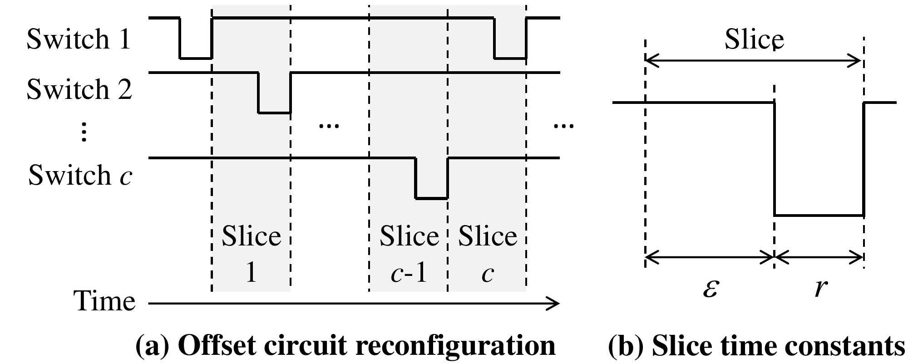
   <em>图 6：(a) 一组采用错开重配置的 c 个电路交换机形成一系列拓扑切片。(b) 单个切片相关的时间常数：epsilon 是低延迟数据包穿越网络的最坏情况端到端延迟，r 是电路交换机重配置延迟。</em>

参数 $\varepsilon$ 取决于最坏情况路径长度（以跳数计）、队列深度、链路速率和传播延迟。路径长度由扩展器决定，而数据速率和传播延迟是固定的；$\varepsilon$ 的关键驱动因素是队列深度。如下节所述，我们选择 24 KB 的浅队列深度（8 个 1500 字节完整数据包 + 187 个 64 字节头）。结合 5 个 ToR 到 ToR 跳的最坏情况路径长度（图 4）、每跳 500 ns 传播延迟（100 米光纤）以及 10 Gb/s 链路速率，我们将 $\varepsilon$ 设为 $90\ \mu s$。单个交换机上的重配置间隔约为 $6\varepsilon$，对应 98% 的占空比和 10.7 ms 的周期时间。对这些时间常数，$\geq 15$ MB 的流，其完成时间会落在理想（链路速率受限）FCT 的 2 倍以内。正如“评估”一节将展示的，取决于流量条件，更短的流也可能受益于直接路径。

### 4.2 传输协议

Opera 需要的传输协议能够 (1) 立即将低延迟流量发送到网络中，同时 (2) 将批量流量延迟到适当的时间。为了避免队头阻塞，NIC 和 ToR 均执行优先级排队。

#### 4.2.1 低延迟传输

如上一节所述，最小化周期时间取决于最小化 ToR 处低延迟数据包的队列深度。最近提出的 NDP 协议 [24] 是一个有前途的选择，因为它通过非常浅的队列实现了高吞吐量。我们发现 12 KB 队列对于 Opera 效果很好（每个端口都有一个额外的相同大小的标头队列）。 NDP 还具有其他对 Opera 有利的特性，例如零 RTT 收敛和无数据包元数据丢失以消除 RTO。尽管是为完全配置的折叠 Clos 网络而设计的，但我们在模拟中发现，尽管 Opera 的拓扑结构不断变化，NDP 只需在 Opera 中进行最少的修改即可正常工作。其他传输，例如最近提出的 Homa 协议 [25]，也可能非常适合 Opera 中的低延迟流量，但我们将其留给未来的工作。

#### 4.2.2 批量传输

Opera 的批量传输协议相对简单。我们大量借鉴 RotorNet [14] 中提出的 RotorLB 协议：该协议在终端主机上缓冲流量，直到到目的地的直接连接可用。当批量流量高度倾斜、网络其他位置必然存在空闲容量时，RotorLB 会自动切换到两跳路由（即 Valiant 负载均衡）以提高吞吐。不同于随时可发送的低延迟流量，批量流量的准入需要与电路交换机状态协调，如“同步”一节所述。除扩展 RotorLB 以支持错开重配置外，我们还实现了 NACK 机制，用于处理如下情况：大突发的、优先级排队的低延迟流量可能使 ToR 中排队的批量流量延迟超过传输窗口，并在 ToR 被丢弃。重传少量到中等数量的数据包不会显著影响批量流量的 FCT。

### 4.3 数据包转发

Opera 依靠 ToR 交换机根据所请求的网络服务模型沿直接或多跳路径路由数据包。我们使用 P4 编程语言实现此路由功能。每个 ToR 交换机都有一个内置寄存器，代表当前的网络配置，可以带内更新或通过 PTP 更新。当数据包到达第一个 ToR 交换机时，它会使用配置寄存器的值来注释数据包的元数据。接下来以及后续 ToR 切换时发生的情况取决于 DSCP 字段的值。如果该字段指示低延迟数据包，则交换机会查阅低延迟表以确定当前配置的扩展器路径上的下一跳，然后将数据包转发出该端口。如果该字段指示批量流量，则交换机会查阅批量流量表，该表指示哪个电路交换机（如果有）提供直接连接，并将数据包转发到该端口。我们在“路由状态可扩展性”一节中测量了针对不同数据中心规模实现该程序所需的交换机内存量。

## 5. 评估

我们在模拟中评估 Opera。最初，我们关注具体的 648 主机网络，与成本等效的折叠 Clos、静态扩展器、非混合 RotorNet 和（非成本等效）混合 RotorNet 网络进行比较。然后，我们根据一系列网络规模、倾斜的工作负载和潜在的成本假设进行验证。我们使用 `htsim` 数据包模拟器 [37]，该模拟器之前用于评估 NDP 协议 [24]，并将其扩展到对静态扩展器网络和动态网络进行建模。我们还修改了 NDP 以处理 $<1500$ 字节数据包，这对于所考虑的某些工作负载是必要的。折叠 Clos 和静态扩展器都使用 NDP 作为传输协议。 Opera 和 RotorNet 使用 NDP 传输低延迟流量，使用 RotorLB 传输批量流量。由于 Opera 明确使用优先级排队，因此我们在适当的情况下使用理想化优先级排队来模拟静态网络，以保持公平的比较。根据之前的工作 [13, 10]，我们将链路带宽设置为 10 Gb/s。我们使用 1500 字节 MTU，并将 ToR 之间的传播延迟设置为 500 ns（相当于 100 m 光纤）。

### 5.1 真实世界流量

我们首先考虑 Opera 的目标场景，即天然混合批量流量和低延迟流量的工作负载。这里我们采用 Microsoft [2] 的 Datamining 工作负载，并用泊松流到达过程生成流。我们改变泊松率来调整网络负载，并将负载定义为相对于所有主机链路聚合带宽的比例（也就是说，100% 负载意味着所有主机都以满速驱动边缘链路，这对任何超额订阅网络都是不可接纳的负载）。如图 1 顶部所示，该工作负载中的流大小从 100 字节到 1 GB 不等。我们使用 Opera 的默认配置决定如何路由流量：$<15$ MB 的流视为低延迟流，经由间接路径路由；$\geq 15$ MB 的流视为批量流，经由直接路径路由。

图 7 展示 Opera 在不同 offered load 下的性能，并与成本可比的 3:1 folded Clos 和 $u=7$ 静态扩展器网络比较。我们还比较了混合 RotorNet：它把 6 条 ToR 上行链路中的 1 条连接到多级分组交换网络以承载低延迟流量，因此成本为其他网络的 1.33 倍；同时也比较了成本等价的非混合 RotorNet，后者在 ToR 之上没有分组交换。除 1% 负载外，我们报告第 99 百分位 FCT；在 1% 负载下，尾部方差会掩盖趋势，因此改为报告平均值。注意，Opera 会对所有低延迟流进行优先级排队，而静态网络默认不会。为公平起见，我们也给出带“理想”优先级队列的扩展器和 folded Clos，即移除所有 $\geq 15$ MB 的流。作为参考，我们还根据端到端延迟和链路容量绘制了每个网络可达到的最小延迟。

<table align="center">
  <tr>
    <td align="center" width="50%">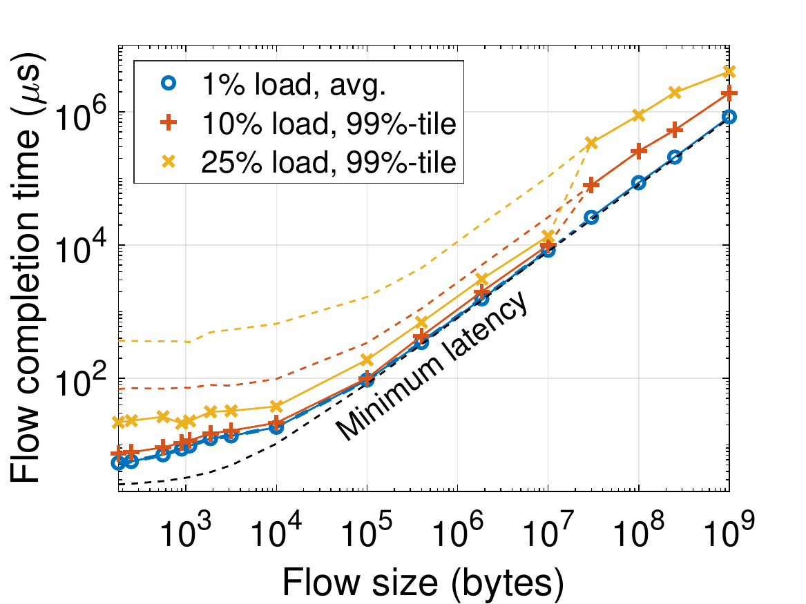 <em>图 7a</em></td>
    <td align="center" width="50%">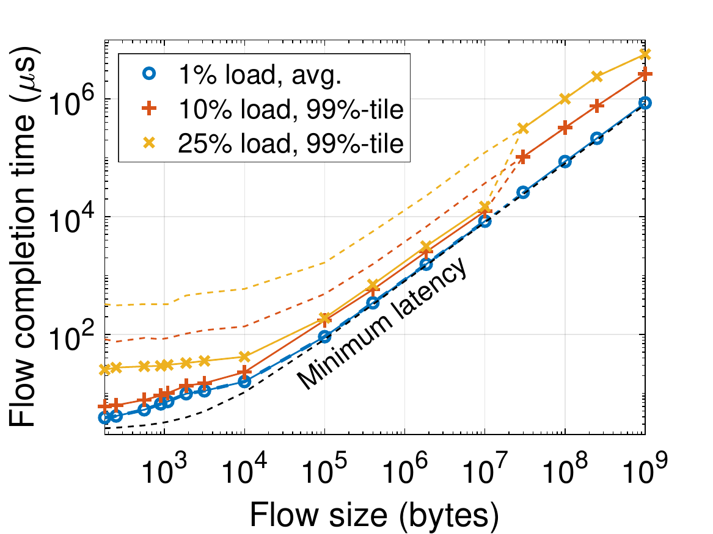 <em>图 7b</em></td>
  </tr>
  <tr>
    <td align="center" width="50%">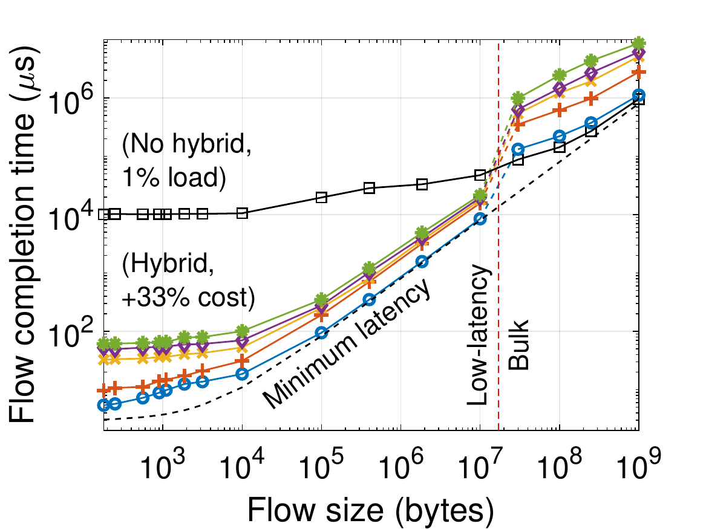 <em>图 7c</em></td>
    <td align="center" width="50%">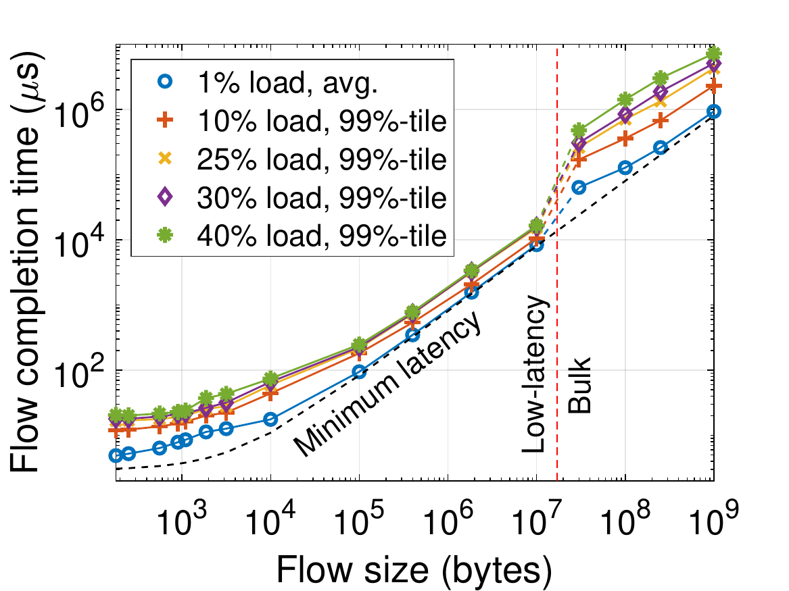 <em>图 7d</em></td>
  </tr>
</table>

<em>图 7：Datamining 工作负载的 FCT。除混合 RotorNet 外，所有网络成本可比；混合 RotorNet 成本高 1.33 倍。在 (a) 和 (b) 中，虚线表示无优先级队列，实线表示理想优先级队列。</em>

静态网络在超过 25% 负载时开始饱和：折叠 Clos 的网络容量有限，而扩展器的带宽税很高。另一方面，尽管 Opera 的固有容量低于成本相当的静态扩展器，但它仍能够服务 40% 的负载。 Opera 将大量流量卸载到带宽高效的路径上，并且仅对传输间接路径的一小部分低延迟流量 (4%) 支付带宽税，因此该工作负载的有效总带宽税为 8.4%。即使使用其核心容量的 1/6 进行数据包交换（成本比其他网络高 33%），混合 RotorNet 也能在负载超过 10% 的情况下为短流提供比 Opera 更长的流完成时间。非混合（即全光核心）RotorNet 的成本与其他网络相当，但其短流延迟将比其他网络高三个数量级，如图 7 所示。

### 5.2 批量流量

Opera 在混合情况下的优势完全源于其避免对批量流量支付带宽税的能力。我们通过关注所有流都通过直接路径路由的工作负载来强调这种能力。我们考虑全对全的洗牌操作（MapReduce 风格应用程序常见），并根据 Facebook Hadoop 集群 [16] 中报告的机架间流大小中位数选择流大小为 100 KB（参见图 1）。在这里，我们假设应用程序将其流标记为批量，因此我们不采用基于流长度的分类；即，Opera 在这种情况下不会间接任何流。我们让所有流在 Opera 中同时启动，因为 RotorLB 可以很好地适应这种情况，并且静态网络的流到达时间错开 10 毫秒以上，否则静态网络会遭受严重的启动影响。

图 8 显示了不同网络随时间推移提供的带宽。 3:1 Clos 的有限容量和扩展器的高带宽税率显著延长了混洗操作的 FCT，分别产生 227 ms 和 223 ms 的 99% FCT。 Opera 的直接路径无需带宽税，可实现更高的吞吐量，并将 99% 的 FCT 降低至 60 毫秒。

  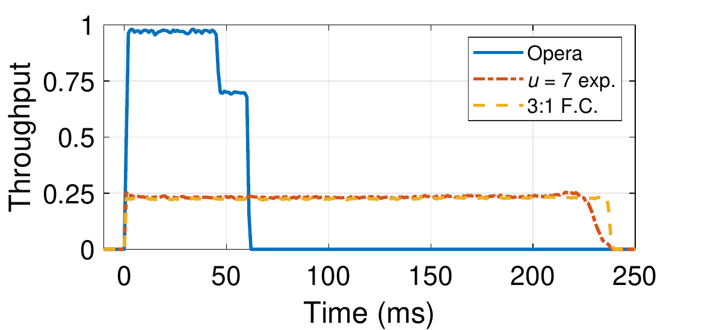
   <em>图 8：100 KB all-to-all Shuffle 工作负载随时间变化的网络吞吐量。 Opera 通过直接路径承载所有流量，大大增加了交付的带宽。 （Opera 吞吐量在 50 毫秒左右小幅“下降”是由于某些流程在一个额外的周期内完成。）</em>

### 5.3 仅低延迟流

相反，所有流都通过间接低延迟路径路由的工作负载对于 Opera 来说是最坏的情况，即它总是支付带宽税。鉴于我们的批量流量阈值为 15 MB，从图 1 的底部可以清楚地看出，Web 搜索工作负载 [15] 代表了这种情况。较低的阈值可以避免带宽税，但需要更短的周期时间来防止这些短“批量”流的 FCT 显著增加。

图 9 显示了 Websearch 工作负载的结果，同样是在泊松流到达过程下。对于 10% 或以下的负载，所有网络都在所有流量大小上提供等效的 FCT，此时 Opera 无法接受额外的负载。 3:1 折叠 Clos 和扩展器在 25% 负载以上时都会（稍微）饱和，但此时两者的 FCT 性能都比 1% 负载时差近 $100\times$。虽然 Opera 在这种情况下以与扩展器相同的方式转发流量，但它只有 60% 的容量，并且由于其预期路径长度较长而额外支付 41% 的带宽税。

<table align="center">
  <tr>
    <td align="center" width="50%">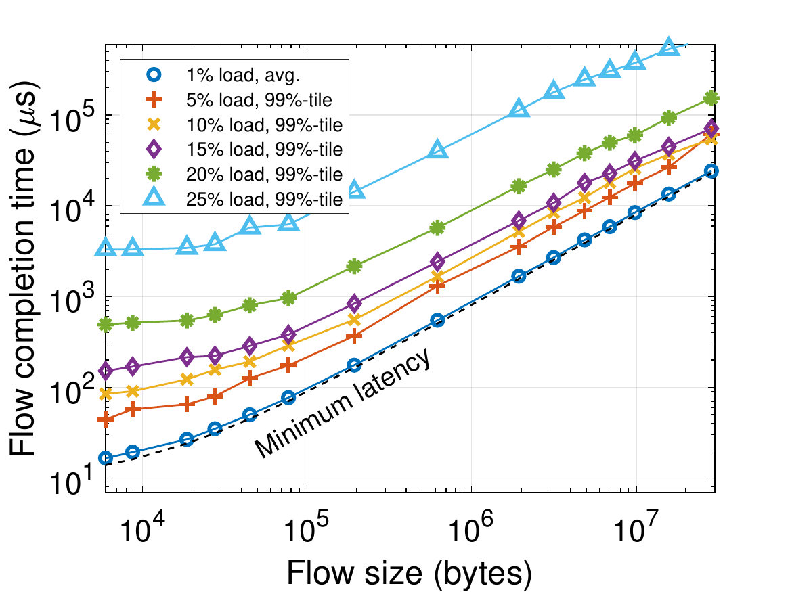 <em>图 9a</em></td>
    <td align="center" width="50%">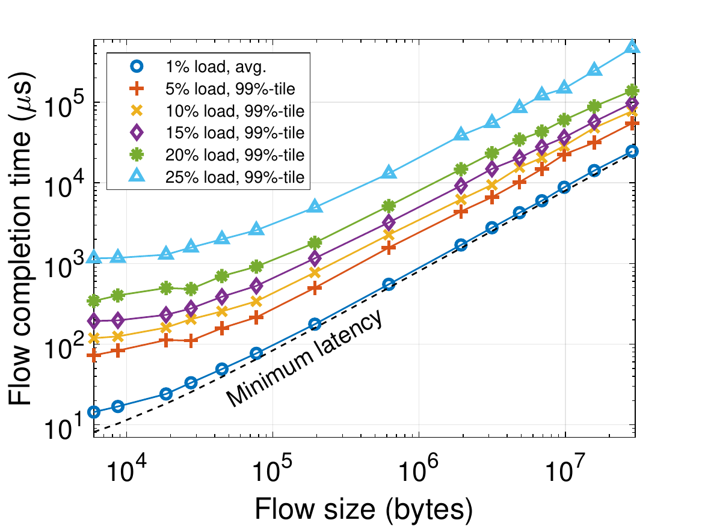 <em>图 9b</em></td>
  </tr>
  <tr>
    <td align="center" width="50%">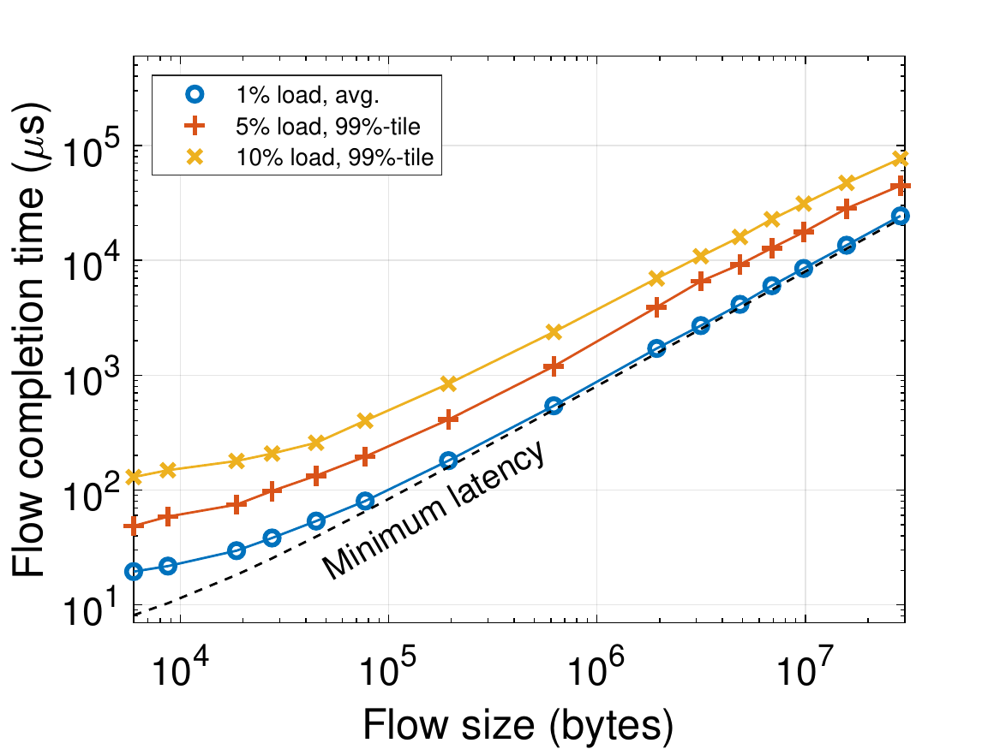 <em>图 9c</em></td>
  </tr>
</table>

<em>图 9：Websearch 工作负载的 FCT。Opera 将所有流量都承载在间接路径上；在最高 10% 的低延迟流量负载下，Opera 的 FCT 接近 3:1 folded Clos 和 u=7 扩展器。</em>

### 5.4 混合流量

为了强调 Opera 以低延迟容量换取更低有效带宽税的能力，我们明确地将上面的 Websearch（低延迟）和 Shuffle（批量）工作负载按不同比例组合。图 10 展示聚合网络吞吐量随 Websearch（低延迟）流量负载变化的情况；吞吐量同样定义为聚合主机链路容量的一部分。我们看到，在低 Websearch 负载下，Opera 提供的吞吐量最高可达静态拓扑的 $4\times$。即使 Websearch 负载为 10%（接近其最大可接纳负载），Opera 仍能提供接近 $2\times$ 的吞吐量。本质上，Opera 因 ToR 相对配置不足而“放弃”了 2 倍低延迟容量，但凭借极低的有效带宽税换来了 2--4 倍的批量容量。

  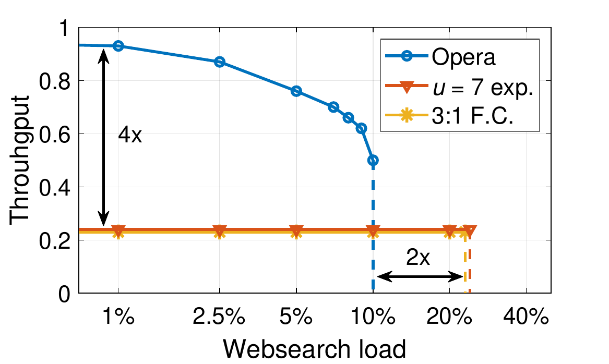
   <em>图 10：组合 Websearch/Shuffle 工作负载的网络吞吐量与 Websearch 流量负载。</em>

### 5.5 容错能力

接下来，我们通过向网络中注入随机链路、ToR 和电路交换故障来演示 Opera 在组件故障时维持和重新建立连接的能力。然后，我们逐步遍历拓扑切片并记录 (1) 在最坏情况拓扑切片中断开连接的 ToR 对的数量，以及 (2) 在所有切片中集成的唯一断开连接的 ToR 对的数量。图 11 显示 Opera 可以承受大约 4% 的链路故障、7% 的 ToR 故障或 33%（六分之二）的电路交换机故障，而不会造成任何连接损失。 Opera 对故障的鲁棒性源于扩展图良好的容错特性。正如附录“额外的故障分析”中所讨论的，Opera 比 3:1 折叠 Clos 具有更好的容错能力，并且比 $u=7$ 扩展器（具有更高的扇出）的容错能力较差。在发生故障时保持连接确实需要 Opera 中一定程度的路径延伸；附录“额外的故障分析”也更详细地讨论了这一点。

<table align="center">
  <tr>
    <td align="center" width="50%">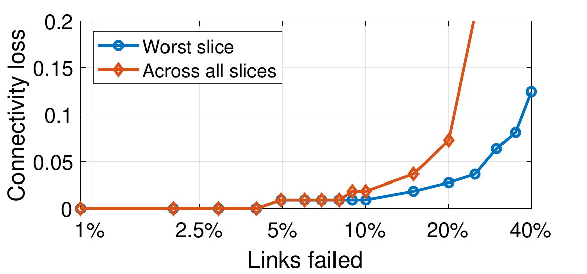 <em>图 11a</em></td>
    <td align="center" width="50%">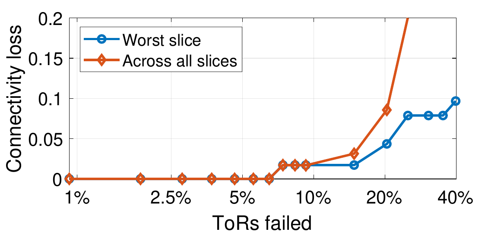 <em>图 11b</em></td>
  </tr>
  <tr>
    <td align="center" width="50%">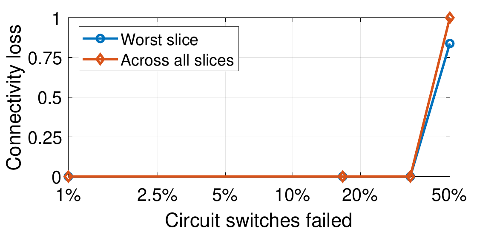 <em>图 11c</em></td>
  </tr>
</table>

<em>图 11：具有 648 台主机、108 机架 Opera 网络（具有 6 个电路交换机和 k=12 端口 ToR）的容错能力。连接丢失是断开的 ToR 对的比例。在涉及 ToR 故障的情况下，连接丢失是指未发生故障的 ToR。</em>

### 5.6 网络规模和成本敏感性

最后，我们考察 Opera 在一系列网络规模和成本假设下的相对性能。我们引入参数 $\alpha$，沿用 [10] 的定义：$\alpha$ 等于 Opera 一个“端口”的成本（包括 ToR 端口、光收发器、光纤和电路交换机端口）除以静态网络一个“端口”的成本（包括 ToR 端口、光收发器和光纤）。完整的成本标准化方法见附录“成本标准化方法”。如果 $\alpha>1$（即电路交换机端口并非免费），则同等成本的静态网络可以用额外资本购买更多分组交换机，并增加其总容量。

我们使用 htsim 模拟器评估三种工作负载：（1）hot rack，代表一个机架与另一个机架通信的高度倾斜工作负载；（2）skew[0.2,1]，其中 20% 的机架处于活跃状态（定义见 [10]）；（3）host permutation，其中每台主机都向另一台非本机架主机发送。对每种工作负载，我们考虑一系列相对 Opera 端口成本，并把静态网络中由此节省的成本重新分配给额外容量。我们考虑 $k=12$ 和 $k=24$ 两种 ToR 基数，分别对应 648 主机和 5,184 主机网络。图 12 展示 $k=24$ 的结果；$k=12$ 情况具有几乎相同的性能-成本缩放趋势，并与路径长度缩放分析一起放在附录“额外的缩放分析”中。

<table align="center">
  <tr>
    <td align="center" width="50%">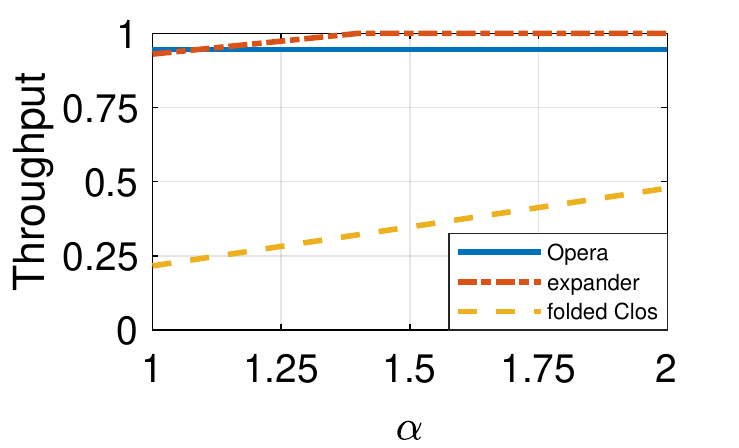 <em>图 12a</em></td>
    <td align="center" width="50%">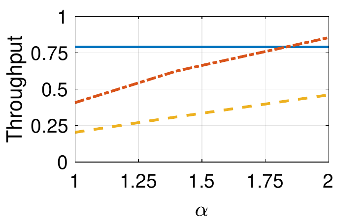 <em>图 12b</em></td>
  </tr>
  <tr>
    <td align="center" width="50%">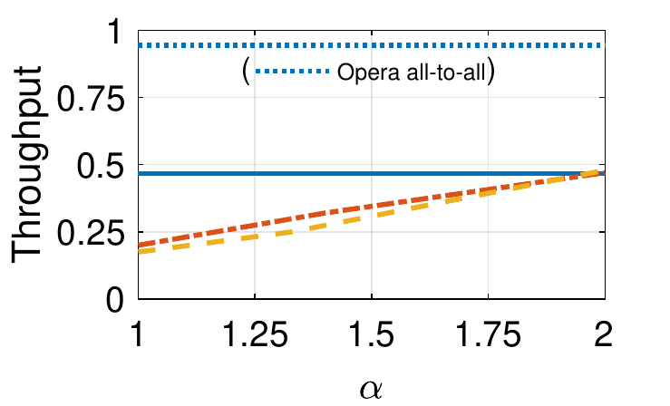 <em>图 12c</em></td>
  </tr>
</table>

<em>图 12：k=24 端口的（左）hotrack、（中）skew[0.2,1] 和（右）排列工作负载的吞吐量。</em>

folded-Clos 拓扑的吞吐量与流量模式无关，而扩展器拓扑的吞吐量会随着工作负载倾斜程度降低而下降。Opera 的吞吐量起初随倾斜程度降低而下降，随后又随流量变得更均匀而上升。只要 $\alpha<1.8$（Opera 电路交换端口的成本低于配备光收发器的分组交换端口），Opera 就能在 permutation 流量和中等倾斜流量（例如 20% 机架通信）上提供高于扩展器或 folded Clos 的吞吐量。对于单个 hot rack，Opera 提供与静态扩展器相当的性能。对于 shuffle（all-to-all）流量，即使 $\alpha=2$，Opera 的吞吐量也比扩展器或 folded Clos 高 2 倍。

当 Opera 端口的相对成本显著高于分组交换机（$\alpha>2$），或者部署中超过 10% 的链路速率专用于紧急、不能容忍延迟的流量时（见“仅低延迟流”一节），Opera 对倾斜和 permutation 工作负载就不再具备优势。

## 6. 原型

优先级队列在 Opera 的设计中发挥着重要作用，确保低延迟数据包不会在终端主机和交换机中缓冲在大容量数据包后面，我们的模拟研究反映了这种设计。在实际系统中，到达交换机的低延迟数据包可能会暂时缓冲在从出口端口传输出的较低优先级批量数据包后面。为了更好地了解这种效应对 Opera 端到端延迟的影响，我们构建了一个小型硬件原型。

该原型由八个 ToR 交换机组成，每个交换机都有四个上行链路，连接到四个仿真电路交换机之一（图 5 中所示的拓扑相同）。所有八个 ToR 和四个电路交换机均作为虚拟交换机在单个物理 6.5-Tb/s Barefoot Tofino 交换机中实现。我们编写了一个 P4 程序来模拟电路交换机，它根据状态寄存器转发到达入口端口的批量数据包，而不管数据包的目标地址如何。我们使用环回模式下的 8 条物理 100 Gb/s 电缆（逻辑上划分为 32 条 10 Gb/s 链路）将虚拟 ToR 交换机连接到四个虚拟电路交换机。每个虚拟 ToR 交换机都通过电缆连接到一台连接的终端主机，该终端主机托管 Mellanox ConnectX-5 NIC。有八个这样的终端主机（每个 ToR 交换机一个），每个配置为以 10 Gb/s 的速度运行。

连接的控制服务器定期向 Tofino 的 ASIC 发送数据包，以更新交换机的状态寄存器。配置该寄存器后，控制器将 RDMA 消息发送到每个连接的主机，表示其中一个模拟电路交换机已重新配置。终端主机运行两个进程：一个基于 MPI 的 shuffle 程序，以所有 Hadoop 工作负载为模式，以及一个简单的“乒乓”应用程序，该应用程序将低延迟 RDMA 消息发送到随机选择的接收方，该接收方只是将响应返回给发送方。乒乓应用相对较低的发送速率不需要我们为此流量实现 NDP。

### 6.1 端到端延迟

图 13 展示了从随机源向随机目的地发送 ping 消息并返回时观察到的应用级延迟。我们分别绘制有无批量背景流量时的分布。无批量流量时的延迟来自路径长度与数据包经过 Tofino P4 程序转发的时间；我们观察到每跳约 $3\ \mu s$，因此延迟会随路径长度最高达到 $9\ \mu s$。尾部来自终端主机上的 RoCE/MPI 方差。存在批量流量时，低延迟数据包可能需要排在当前正从出口端口发出的批量数据包之后。由于我们在 Barefoot 交换机内部模拟电路交换机，每次穿越电路交换机会引入真实部署中不存在的额外延迟。对测试床而言，从源到目的地最多有 8 个序列化点，每次 ping-pong 交换最多有 16 个序列化点。每个序列化点最多引入 $1.2\ \mu s$（10 Gb/s 下一个 MTU），总计可达 $19.2\ \mu s$，如图 13 所示。分布是平滑的，因为当低延迟数据包排在正在离开交换机的批量数据包后面时，剩余等待时间本质上是随机变量。

  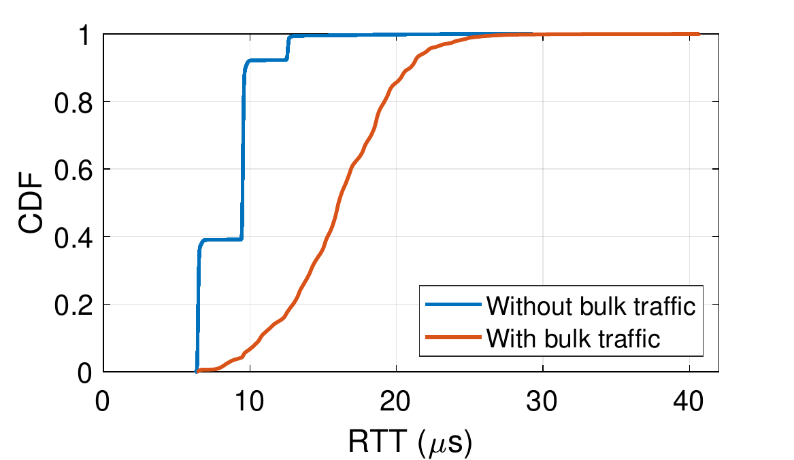
   <em>图 13：原型中具有和不具有大量后台流量的低延迟流量的 RTT 值。</em>

### 6.2 路由状态可扩展性

<em>表 1：不同规模数据中心中 Opera 规则集的条目数量及资源利用率。</em>

<table align="center">
  <thead>
    <tr>
      <th align="right">机架数</th>
      <th align="right">条目数</th>
      <th align="right">利用率</th>
    </tr>
  </thead>
  <tbody>
    <tr>
      <td align="right">108</td>
      <td align="right">12,096</td>
      <td align="right">0.7</td>
    </tr>
    <tr>
      <td align="right">252</td>
      <td align="right">65,268</td>
      <td align="right">3.8</td>
    </tr>
    <tr>
      <td align="right">520</td>
      <td align="right">276,120</td>
      <td align="right">16.2</td>
    </tr>
    <tr>
      <td align="right">768</td>
      <td align="right">600,576</td>
      <td align="right">35.3</td>
    </tr>
    <tr>
      <td align="right">1008</td>
      <td align="right">1,032,192</td>
      <td align="right">60.7</td>
    </tr>
    <tr>
      <td align="right">1200</td>
      <td align="right">1,461,600</td>
      <td align="right">85.9</td>
    </tr>
  </tbody>
</table>

Opera 比静态拓扑需要更多的路由状态。简单的实现将要求每个交换机中的表包含 $O(N_{rack})^2$ 条目，因为每个切片内有 $N_{rack}$ 个拓扑切片和 $N_{rack}-1$ 个可能的目的地。我们使用 Barefoot 的 Capilano 编译器工具来测量各种数据中心大小的规则集大小，并将该大小与 Tofino 65x100GE 交换机的容量进行比较。该规则集由批量规则和低延迟非机架本地规则组成。表 1 显示了生成的规则数量和交换机内存的利用率百分比。由于交换机内的哈希冲突，实际规则大小限制可能低于编译器预测的大小，因此我们将生成的规则加载到物理交换机中，以验证规则是否适合资源限制。这些结果表明，当今的硬件能够保存实施 Opera 所需的规则，同时还为其他非 Opera 规则留出备用容量。

## 7. 相关工作

Opera 建立在以前专注于集群和低延迟环境的网络设计之上。除了迄今为止描述的折叠 Clos 和扩展图拓扑之外，还为集群和数据中心提出了许多附加的静态和动态网络拓扑。

### 7.1 静态拓扑

Dragonfly [38] 和 SlimFly [39] 拓扑将局部高横截面带宽池与稀疏集群间链路集连接起来，并已在 HPC 环境中采用。 Diamond [40] 和 WaveCube [41] 将交换机与光波长复用器静态互连，从而无需重新配置即可实现连接拓扑。 Quartz [42] 将交换机互连成环，并依靠多跳转发来实现低延迟流量。

### 7.2 动态拓扑

已经提出了几种动态网络拓扑，我们可以将其分为两类：不能支持低延迟流量的和可以支持低延迟流量的。在前一种情况下，Helios [32]、Mordia [6] 和 C-Through [8] 旨在根据观察到的流量模式被动地建立高带宽连接；它们都依赖于单独的数据包交换网络来支持低延迟流量。 RotorNet [14] 依靠确定性重新配置在所有端点之间提供恒定带宽，然后依靠使用 Valiant 负载平衡注入流量的端点来支持倾斜流量。 RotorNet 需要一个单独的数据包交换网络来实现低延迟流量。

另一方面，ProjecToR [13] 始终维护一个由已连接链路构成的“基础网格”（base mesh），用于承载低延迟流量，同时机会式地根据流量模式变化重配置自由空间链路。该工作的作者最初评估过使用随机基础网络，但因其对倾斜流量支持较差而排除；随后他们提出源与目的之间的加权匹配，不过这种网络的一般期望直径并不明确。与 ProjecToR 类似，Opera 也维护一个“始终在线”的基础网络；不同的是，这个基础网络由重复的时变扩展器图序列组成，其结构和性能特征更清楚。

还有一些可重新配置的网络提案，依靠多跳间接来支持低延迟流量。在 OSA [43] 中，在重新配置期间，某些端到端路径可能不可用，因此可以专门保留一些电路交换机端口，以确保低延迟流量的连接。 Megaswitch [44] 可能以类似的方式支持低延迟流量。

## 8. 结论

静态拓扑（例如超额订阅的 folded-Clos 和扩展器图）支持低延迟流量，但总体网络带宽有限。最近提出的动态拓扑提供高带宽，却不能支持低延迟流量。本文提出 Opera：它实现一系列支持低延迟流量的时变扩展器图；从时间维度积分来看，又能在所有端点之间提供直接连接，从而为批量流量提供高吞吐。与同等成本的静态网络相比，Opera 可将 shuffle 工作负载吞吐量提高 4 倍，将倾斜数据中心工作负载的可支持负载提高 60%，且不会损害短流的流完成时间。

## 附录

### A.1 成本标准化方法

本节详细介绍我们用于分析不同网络规模和技术成本点下一系列成本等价网络拓扑的方法。沿用 [10]，我们首先将 $\alpha$ 定义为 Opera 一个“端口”的成本（包括 ToR 端口、光收发器、光纤和电路交换机端口）除以静态网络一个“端口”的成本（包括 ToR 端口、光收发器和光纤）。

也可以把 $\alpha$ 理解为每个边缘端口（即面向服务器的 ToR 端口）对应的“核心”端口成本（即向上 ToR 端口及其以上部分）。核心端口会推高网络成本，因为它们需要光收发器。因此，对 folded Clos，可写为 $\alpha = 2(T-1)/F$，其中 $T$ 是层数，$F$ 是超额订阅因子。对静态扩展器，可写为 $\alpha = u/(k-u)$，其中 $u$ 是 ToR 上行链路数量，$k$ 是 ToR 基数。

我们使用 $T=3$ 的三层 folded Clos 作为标准化基础，并在每个网络比较点保持分组交换机基数 $k$ 和主机数量 $H$ 恒定。为确定主机数量作为 $k$ 和 $\alpha$ 的函数，我们先求解超额订阅因子关于 $\alpha$ 的函数：$F=2(T-1)/\alpha$（注意 $T=3$）。然后，将 folded Clos 中的主机数量 $H$ 写成 $F$、$k$ 和 $\alpha$ 的函数：$H=(4F/(F+1))(k/2)^T$（注意 $T=3$，且 $F$ 是 $\alpha$ 的函数）。这让我们能够比较不同 $k$ 和 $\alpha$ 取值下的网络；同时，我们也会基于下述技术假设估计 $\alpha$。

Opera 的成本很大程度上取决于所使用的电路交换技术。虽然原则上可以使用多种技术，但使用光学转子开关 [14] 可能是最具成本效益的，因为 (1) 它们提供低光信号衰减（约 3 dB）[33]，并且 (2) 它们凭借基于成像中继的设计 [33] 与单模或多模信令兼容。这些因素意味着 Opera 可以使用传统网络中使用的相同（成本）多模或单模收发器，这与许多其他需要昂贵且复杂的电信级设备（例如波长可调收发器或光放大器）的光网络方案不同。根据对 [10] 和转子开关组件的商品组件的成本估算（在表 2 中进行了总结），我们估计 Opera 端口的成本比静态网络端口高出约 1.3 倍（即 $\alpha=1.3$）。

<em>表 2：静态网络与 Opera 中每个“端口”的成本。静态网络中的一个“端口”包括分组交换端口、光收发器和光纤；Opera 中的一个“端口”包括分组交换（ToR）端口、光收发器、光纤，以及构建转子交换机所需的组件。转子交换机组件成本按单个转子交换机上的端口数量摊销，这个数量可以是数百或数千；表中数值假设使用 512 端口转子交换机。（† 表示每个双工光纤端口）</em>

<table align="center">
  <thead>
    <tr>
      <th align="left">Component</th>
      <th align="right">Static</th>
      <th align="right">Opera</th>
    </tr>
  </thead>
  <tbody>
    <tr>
      <td>SR transceiver</td>
      <td align="right">&#36;80</td>
      <td align="right">&#36;80</td>
    </tr>
    <tr>
      <td>Optical fiber (&#36;0.3/m)</td>
      <td align="right">&#36;45</td>
      <td align="right">&#36;45</td>
    </tr>
    <tr>
      <td>ToR port</td>
      <td align="right">&#36;90</td>
      <td align="right">&#36;90</td>
    </tr>
    <tr>
      <td>Optical fiber array</td>
      <td align="right">-</td>
      <td align="right">&#36;30 †</td>
    </tr>
    <tr>
      <td>Optical lenses</td>
      <td align="right">-</td>
      <td align="right">&#36;15 †</td>
    </tr>
    <tr>
      <td>Beam-steering element</td>
      <td align="right">-</td>
      <td align="right">&#36;5 †</td>
    </tr>
    <tr>
      <td>Optical mapping</td>
      <td align="right">-</td>
      <td align="right">&#36;10 †</td>
    </tr>
    <tr>
      <td>Total</td>
      <td align="right">&#36;215</td>
      <td align="right">&#36;275</td>
    </tr>
    <tr>
      <td>alpha ratio</td>
      <td align="right">1</td>
      <td align="right">1.3</td>
    </tr>
  </tbody>
</table>

### A.2 大规模缩短周期时间

更大的 Opera 网络由更高基数的 ToR 交换机实现，这相应地增加了电路交换机的数量。为了防止周期时间与 ToR 基数成二次方缩放，我们允许多个电路交换机同时重新配置（确保其余交换机始终提供完全连接的网络）。例如，将 ToR 基数加倍会使电路交换机的数量加倍，但可以通过一次重新配置两个电路交换机来将周期时间缩短一半。这种方法提供了周期时间与 ToR 基数的线性缩放，如图 14 所示。假设我们将电路交换机分为 6 个组，并行化每个组的周期，周期时间从 $k=12$（648 个主机网络）增加到 $k=64$（98,304 个主机网络）的 6 倍，对应于后者中 90 MB 的“批量”流的流长度截断案例。

  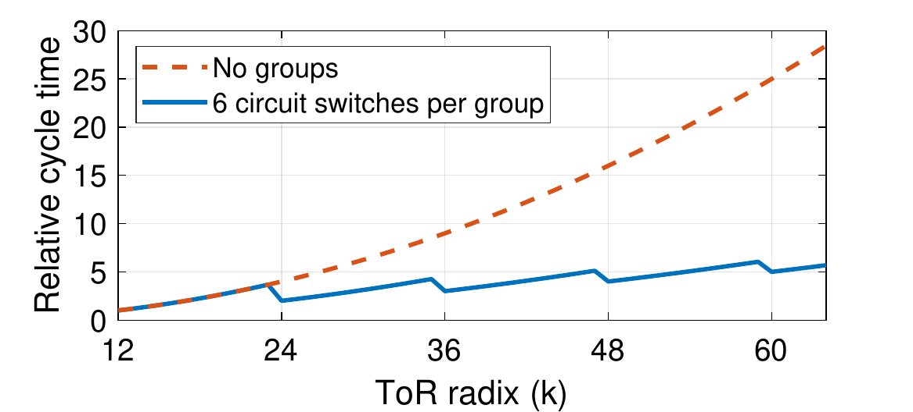
   <em>图 14：通过对电路开关进行分组并允许每组中的一个开关同时重新配置，可以更大规模地改善相对周期时间。</em>

### A.3 额外的缩放分析

图 15 显示了具有 $k=12$ 端口 ToR 的网络的各种流量模式的性能成本扩展趋势。与图 12 相比，我们观察到 $k=12$ 和 $k=24$ 网络之间的性能几乎相同，这表明（成本标准化）网络性能几乎与所考虑的所有网络（折叠 Clos、静态扩展器和 Opera）的规模无关。

<table align="center">
  <tr>
    <td align="center" width="50%">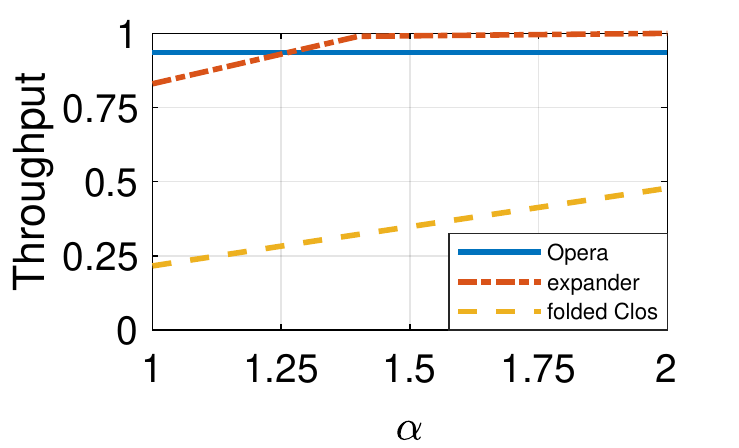 <em>图 15a</em></td>
    <td align="center" width="50%">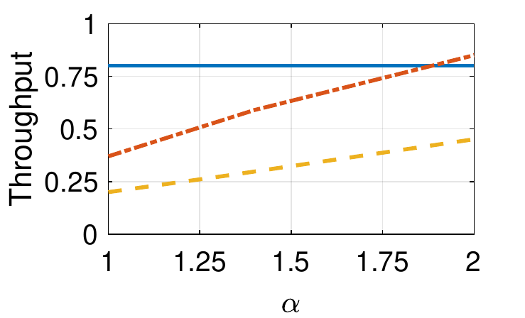 <em>图 15b</em></td>
  </tr>
  <tr>
    <td align="center" width="50%">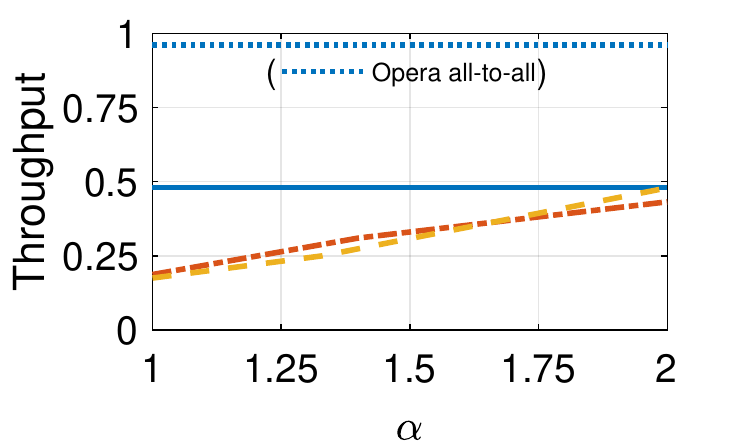 <em>图 15c</em></td>
  </tr>
</table>

<em>图 15：k=12 端口 ToR 下，（左）hotrack、（中）skew[0.2,1] 和（右）permutation 工作负载的吞吐量。</em>

为了在更基础的层面上分析这一结果，我们评估了 Opera 和静态扩展器在不同成本点 ($\alpha$) 之间 $k=12$ 和 $k=48$ 之间 ToR 基数的平均和最坏情况路径长度。图 16 显示大型网络规模的平均路径长度收敛（对于 $k=24$ 及更高版本，包括 Opera 在内的所有网络的最坏情况路径长度为 4 个 ToR 到 ToR 跳）。鉴于静态扩展器的网络性能属性与其路径长度属性 [34] 相关，图 16 支持我们的观察，即网络的成本性能属性不会随网络规模而发生重大变化。

  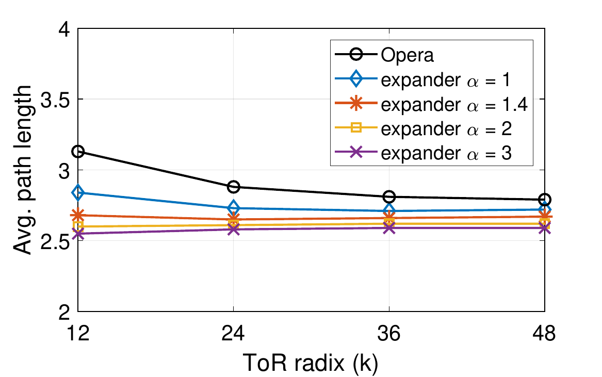
   <em>图 16：不同网络规模的路径长度（从 k=12、约 650 台主机，到 k=48、约 98,000 台主机）和相对成本假设 alpha。</em>

### A.4 光谱效率和路径长度

网络的谱间隙（spectral gap）是一种图论指标，用来衡量一个图有多接近最优 Ramanujan 扩展器 [45]。谱间隙越大，表示扩展性越好。我们评估了正文中分析的 648 主机、108 机架 Opera 示例网络中 108 个拓扑切片各自的谱间隙，并将它们与若干随机生成、具有不同 $d:u$ 比例的静态扩展器的谱间隙比较。所有网络都使用 $k=12$ 基数的 ToR，并约束为拥有近似相同数量的主机。结果如图 17 所示。注意，$u$ 更大的扩展器需要更多 ToR 交换机（也就是成本更高）才能支持相同数量的主机。

  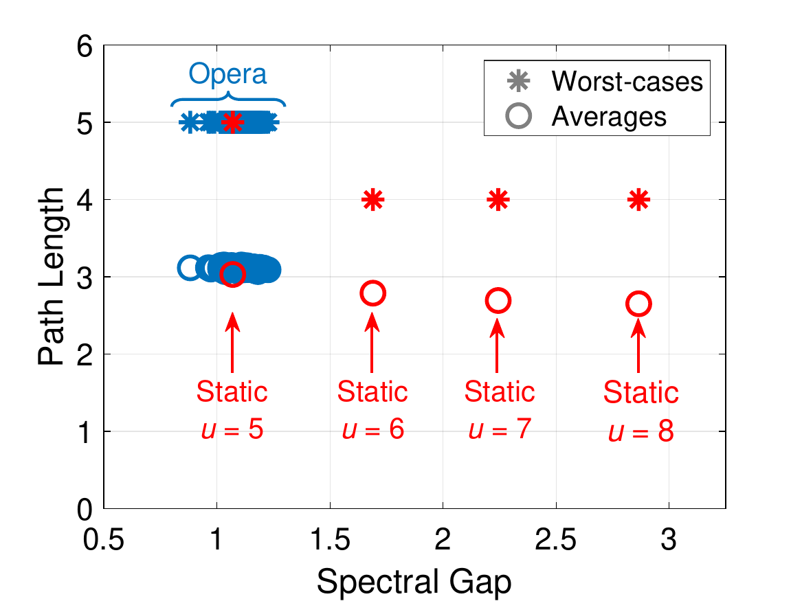
   <em>图 17：Opera 与静态扩展器网络的平均/最坏情况路径长度和谱间隙。所有网络都使用 k=12 端口 ToR 交换机，并拥有 644 到 650 台主机；Opera 的每个数据点对应其 108 个拓扑切片之一。</em>

有意思的是，当主机数量固定时，我们观察到平均路径长度和最坏情况路径长度并不强烈依赖谱间隙。此外，Opera 非常接近静态扩展器可达到的最佳平均路径长度，说明它在每个拓扑切片中都很好地利用了 ToR 上行链路。尽管 Opera 为了以低带宽税支持批量流量施加了额外约束，它仍然取得了这样的性能：不同于静态扩展器，Opera 必须在时间维度上提供一组 $N_{racks}=108$ 个扩展器，而且这些扩展器还要由底层的一组不相交匹配构成。

### A.5 额外故障分析

Opera 会重新计算路径以绕过故障链路、ToR 和电路交换机；通常，这些路径会比无故障时更长。图 18 展示了每类故障程度与平均路径长度、最大路径长度之间的相关性（跨所有拓扑切片统计）。

<table align="center">
  <tr>
    <td align="center" width="50%">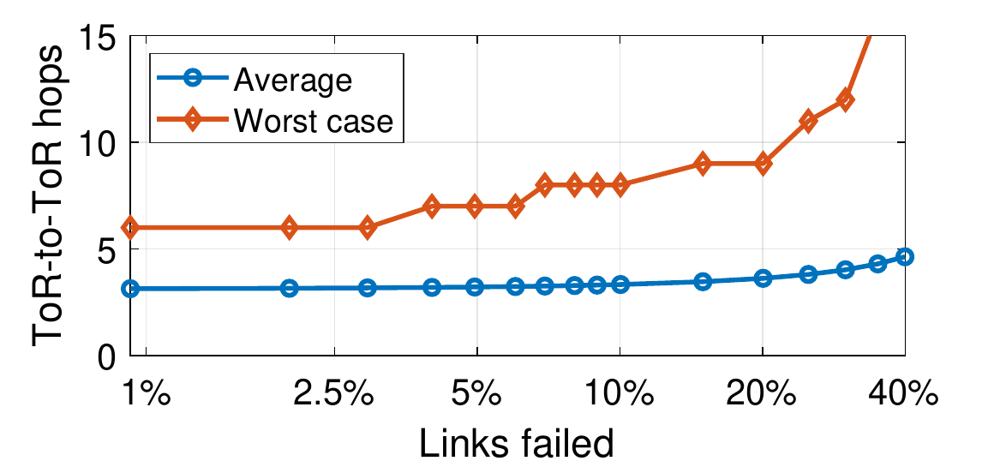 <em>图 18a</em></td>
    <td align="center" width="50%">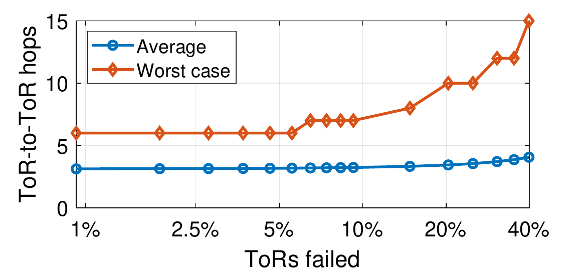 <em>图 18b</em></td>
  </tr>
  <tr>
    <td align="center" width="50%">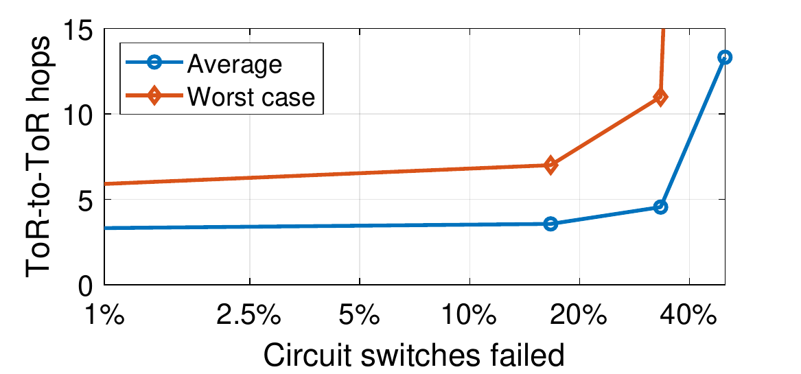 <em>图 18c</em></td>
  </tr>
</table>

<em>图 18：在不同故障条件下，具有 6 个电路交换机和 k=12 端口 ToR 的 108 机架 Opera 网络的平均与最坏情况路径长度。路径长度只针对所有有限长度路径报告；图 11 展示有多少 ToR 对断连（即路径长度为无穷）。</em>

作为参考，我们还分析了文中讨论的 3:1 folded Clos 和 $u=7$ 扩展器的容错性质。图 19 展示 3:1 Clos 的结果，图 20 展示 $u=7$ 扩展器的结果。Opera 的容错性优于 3:1 folded Clos，但 $u=7$ 扩展器更好；考虑到 $u=7$ 扩展器拥有显著更多链路和交换机，并且每个 ToR 的扇出更高，这并不意外。

<table align="center">
  <tr>
    <td align="center" width="50%">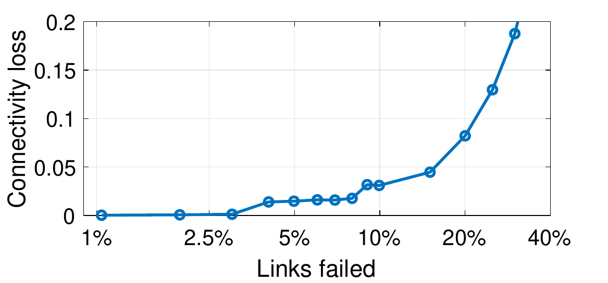 <em>图 19a</em></td>
    <td align="center" width="50%">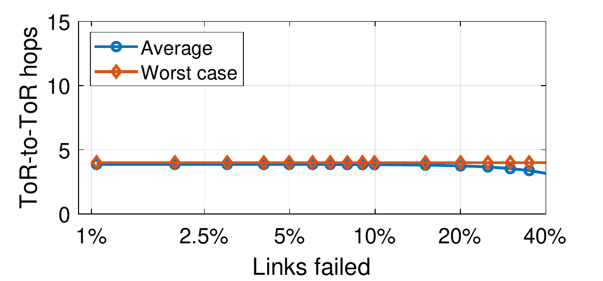 <em>图 19b</em></td>
  </tr>
  <tr>
    <td align="center" width="50%">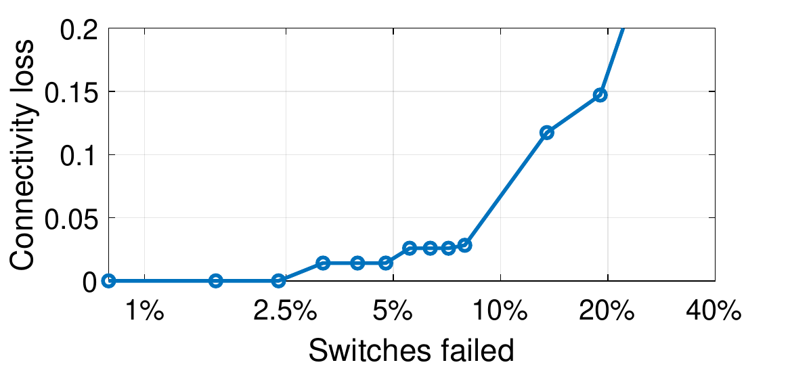 <em>图 19c</em></td>
    <td align="center" width="50%">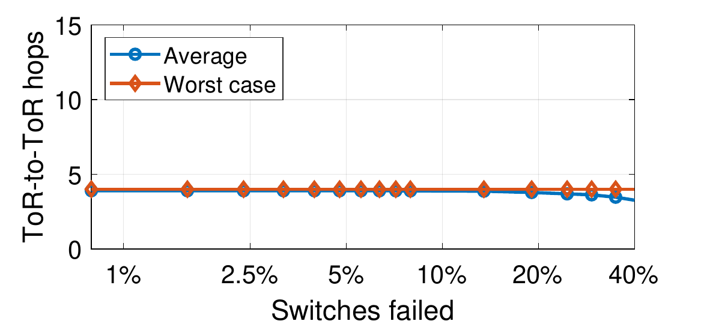 <em>图 19d</em></td>
  </tr>
</table>

<em>图 19：3:1 folded Clos 中链路故障（上两图）和 ToR 故障（下两图）造成的连接丢失及其对路径长度的影响。</em>

<table align="center">
  <tr>
    <td align="center" width="50%">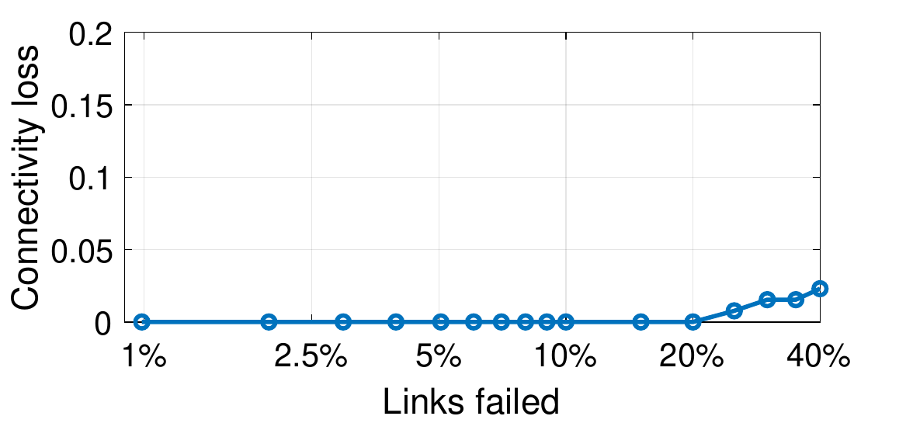 <em>图 20a</em></td>
    <td align="center" width="50%">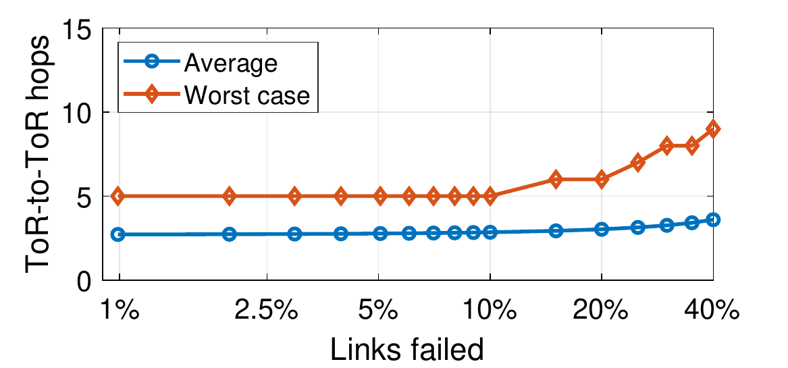 <em>图 20b</em></td>
  </tr>
  <tr>
    <td align="center" width="50%">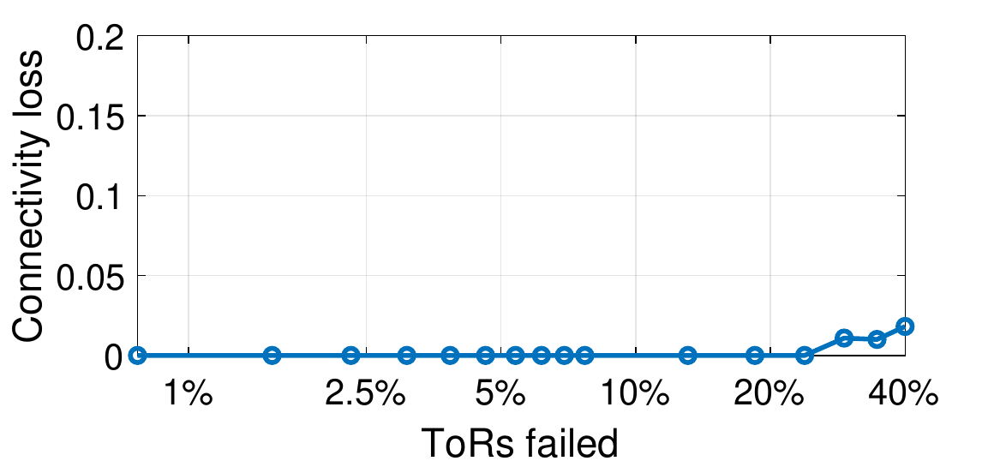 <em>图 20c</em></td>
    <td align="center" width="50%">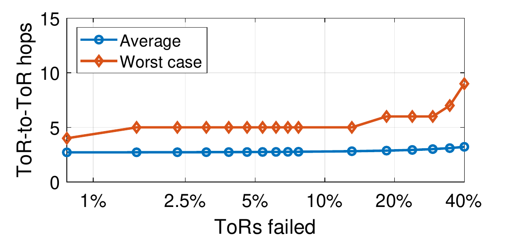 <em>图 20d</em></td>
  </tr>
</table>

<em>图 20：u=7 扩展器中链路故障（上两图）和 ToR 故障（下两图）造成的连接丢失及其对路径长度的影响。</em>

## 参考文献

[1] Mohammad Al-Fares, Alex Loukissas, and Amin Vahdat。A scalable, commodity, data center network architecture。In Proceedings of the ACM SIGCOMM Conference, Seattle, WA, August 2008。

[2] Albert Greenberg, James R. Hamilton, Navendu Jain, Srikanth Kandula, Changhoon Kim, Parantap Lahiri, David A. Maltz, Parveen Patel, and Sudipta Sengupta。VL2: A scalable and flexible data center network。In Proceedings of the ACM SIGCOMM Conference on Data Communication, pages 51--62, Barcelona, Spain, 2009。

[3] William M. Mellette, Alex C. Snoeren, and George Porter。P-FatTree: A multi-channel datacenter network topology。In Proceedings of the 15th ACM Workshop on Hot Topics in Networks (HotNets-XV), Atlanta, GA, November 2016。

[4] Arjun Singh, Joon Ong, Amit Agarwal, Glen Anderson, Ashby Armistead, Roy Bannon, Seb Boving, Gaurav Desai, Bob Felderman, Paulie Germano, Anand Kanagala, Jeff Provost, Jason Simmons, Eiichi Tanda, Jim Wanderer, Urs H\"olzle, Stephen Stuart, and Amin Vahdat。Jupiter rising: A decade of clos topologies and centralized control in google's datacenter network。In Proceedings of the ACM Conference on Special Interest Group on Data Communication, pages 183--197, London, United Kingdom, 2015。

[5] He Liu, Feng Lu, Alex Forencich, Rishi Kapoor, Malveeka Tewari, Geoffrey M. Voelker, George Papen, Alex C. Snoeren, and George Porter。Circuit Switching Under the Radar with REACToR。In Proceedings of the 11th ACM/USENIX Symposium on Networked Systems Design and Implementation (NSDI), pages 1--15, Seattle, WA, April 2014。

[6] George Porter, Richard Strong, Nathan Farrington, Alex Forencich, Pang-Chen Sun, Tajana Rosing, Yeshaiahu Fainman, George Papen, and Amin Vahdat。Integrating microsecond circuit switching into the data center。In Proceedings of the ACM SIGCOMM Conference, Hong Kong, China, August 2013。

[7] Vishal Shrivastav, Asaf Valadarsky, Hitesh Ballani, Paolo Costa, Ki Suh Lee, Han Wang, Rachit Agarwal, and Hakim Weatherspoon。Shoal: A lossless network for high-density and disaggregated racks。Technical report, Cornell, https://hdl.handle.net/1813/49647, 2017。

[8] Guohui Wang, David G. Andersen, Michael Kaminsky, Konstantina Papagiannaki, T.S. Eugene Ng, Michael Kozuch, and Michael Ryan。c-through: Part-time optics in data centers。In Proceedings of the ACM SIGCOMM Conference, pages 327--338, New Delhi, India, 2010。

[9] Sangeetha Abdu Jyothi, Ankit Singla, P. Brighten Godfrey, and Alexandra Kolla。Measuring and understanding throughput of network topologies。In Proceedings of the International Conference for High Performance Computing, Networking, Storage and Analysis, pages 65:1--65:12, Salt Lake City, Utah, 2016。

[10] Simon Kassing, Asaf Valadarsky, Gal Shahaf, Michael Schapira, and Ankit Singla。Beyond fat-trees without antennae, mirrors, and disco-balls。In Proceedings of the Conference of the ACM Special Interest Group on Data Communication, pages 281--294, Los Angeles, CA, USA, 2017。

[11] Ankit Singla, Chi-Yao Hong, Lucian Popa, and P. Brighten Godfrey。Jellyfish: Networking data centers randomly。In Proceedings of the 9th USENIX Conference on Networked Systems Design and Implementation, pages 17--17, San Jose, CA, 2012。

[12] Asaf Valadarsky, Gal Shahaf, Michael Dinitz, and Michael Schapira。Xpander: Towards optimal-performance datacenters。In Proceedings of the 12th International on Conference on Emerging Networking EXperiments and Technologies, pages 205--219, Irvine, California, USA, 2016。

[13] Monia Ghobadi, Ratul Mahajan, Amar Phanishayee, Nikhil Devanur, Janardhan Kulkarni, Gireeja Ranade, Pierre-Alexandre Blanche, Houman Rastegarfar, Madeleine Glick, and Daniel Kilper。ProjecToR: Agile reconfigurable data center interconnect。In Proceedings of the ACM SIGCOMM Conference, pages 216--229, Florianopolis, Brazil, 2016。

[14] William M. Mellette, Rob McGuinness, Arjun Roy, Alex Forencich, George Papen, Alex C. Snoeren, and George Porter。RotorNet: a scalable, low-complexity, optical datacenter network。In Proceedings of the ACM SIGCOMM Conference, Los Angeles, California, August 2017。

[15] Mohammad Alizadeh, Albert Greenberg, David A. Maltz, Jitendra Padhye, Parveen Patel, Balaji Prabhakar, Sudipta Sengupta, and Murari Sridharan。Data center TCP (DCTCP)。In Proceedings of the ACM SIGCOMM Conference, pages 63--74, New Delhi, India, 2010。

[16] Arjun Roy, Hongyi Zeng, Jasmeet Bagga, George Porter, and Alex C. Snoeren。Inside the social network's (datacenter) network。In Proceedings of the ACM SIGCOMM Conference, London, England, August 2015。

[17] Nandita Dukkipati and Nick McKeown。Why flow-completion time is the right metric for congestion control。SIGCOMM Comput. Commun. Rev., 36(1):59--62, January 2006。

[18] Wei Bai, Li Chen, Kai Chen, Dongsu Han, Chen Tian, and Hao Wang。Information-agnostic flow scheduling for commodity data centers。In 12th USENIX Symposium on Networked Systems Design and Implementation, pages 455--468, Oakland, CA, 2015。

[19] Matthew P. Grosvenor, Malte Schwarzkopf, Ionel Gog, Robert N. M. Watson, Andrew W. Moore, Steven Hand, and Jon Crowcroft。Queues don't matter when you can jump them!。In Proceedings of the 12th USENIX Conference on Networked Systems Design and Implementation, pages 1--14, Oakland, CA, 2015。

[20] Radhika Niranjan Mysore, Andreas Pamboris, Nathan Farrington, Nelson Huang, Pardis Miri, Sivasankar Radhakrishnan, Vikram Subramanya, and Amin Vahdat。Portland: A scalable fault-tolerant layer 2 data center network fabric。In Proceedings of the ACM SIGCOMM Conference on Data Communication, pages 39--50, Barcelona, Spain, 2009。

[21] Mohammad Al-Fares, Sivasankar Radhakrishnan, Barath Raghavan, Nelson Huang, and Amin Vahdat。Hedera: Dynamic Flow Scheduling for Data Center Networks。In Proceedings of the 7th ACM/USENIX Symposium on Networked Systems Design and Implementation (NSDI), San Jose, CA, April 2010。

[22] Peter X. Gao, Akshay Narayan, Gautam Kumar, Rachit Agarwal, Sylvia Ratnasamy, and Scott Shenker。pHost: Distributed near-optimal datacenter transport over commodity network fabric。In Proceedings of the 11th ACM Conference on Emerging Networking Experiments and Technologies, pages 1:1--1:12, Heidelberg, Germany, 2015。

[23] Mohammad Alizadeh, Abdul Kabbani, Tom Edsall, Balaji Prabhakar, Amin Vahdat, and Masato Yasuda。Less is more: Trading a little bandwidth for ultra-low latency in the data center。In Proceedings of the 9th USENIX Conference on Networked Systems Design and Implementation, pages 19--19, San Jose, CA, 2012。

[24] Mark Handley, Costin Raiciu, Alexandru Agache, Andrei Voinescu, Andrew W. Moore, Gianni Antichi, and Marcin W\'ojcik。Re-architecting datacenter networks and stacks for low latency and high performance。In Proceedings of the Conference of the ACM Special Interest Group on Data Communication, pages 29--42, Los Angeles, CA, USA, 2017。

[25] Behnam Montazeri, Yilong Li, Mohammad Alizadeh, and John Ousterhout。Homa: A receiver-driven low-latency transport protocol using network priorities。In Proceedings of the Conference of the ACM Special Interest Group on Data Communication, pages 221--235, Budapest, Hungary, 2018。

[26] Facebook。Facebook's fabric topology。https://code.facebook.com/posts/360346274145943/introducing-data-center-fabric-the-\-next-generation-facebook-data-center-network/, 2018。

[27] Jeffrey Dean and Sanjay Ghemawat。MapReduce: Simplified data processing on large clusters。In Proceedings of the 6th Conference on Symposium on Opearting Systems Design \& Implementation, pages 10--10, San Francisco, CA, 2004。

[28] The Apache Software Foundation。Apache Hadoop。https://hadoop.apache.org/, 2018。

[29] Srikanth Kandula, Jitendra Padhye, and Paramvir Bahl。Flyways to de-congest data center networks。In Proceedings of the 8th ACM Workshop on Hot Topics in Networks (HotNets-VIII), New York City, NY, October 2009。

[30] Xia Zhou, Zengbin Zhang, Yibo Zhu, Yubo Li, Saipriya Kumar, Amin Vahdat, Ben Y. Zhao, and Haitao Zheng。Mirror mirror on the ceiling: Flexible wireless links for data centers。In Proceedings of the ACM SIGCOMM Conference on Applications, Technologies, Architectures, and Protocols for Computer Communication, pages 443--454, Helsinki, Finland, 2012。

[31] Navid Hamedazimi, Zafar Qazi, Himanshu Gupta, Vyas Sekar, Samir R. Das, Jon P. Longtin, Himanshu Shah, and Ashish Tanwer。Firefly: A reconfigurable wireless data center fabric using free-space optics。In Proceedings of the ACM Conference on SIGCOMM, pages 319--330, Chicago, Illinois, USA, 2014。

[32] Nathan Farrington, George Porter, Sivasankar Radhakrishnan, Hamid Bazzaz, Vikram Subramanya, Yeshaiahu Fainman, George Papen, and Amin Vahdat。Helios: A hybrid electrical/optical switch architecture for modular data centers。In Proceedings of the ACM SIGCOMM Conference, New Delhi, India, August 2010。

[33] W. M. Mellette, G. M. Schuster, G. Porter, G. Papen, and J. E. Ford。A scalable, partially configurable optical switch for data center networks。Journal of Lightwave Technology, 35(2):136--144, Jan 2017。

[34] N Alon。Eigen values and expanders。Combinatorica, 6(2):83--96, January 1986。

[35] IEEE standard for a precision clock synchronization protocol for networked measurement and control systems。IEEE Std 1588-2008 (Revision of IEEE Std 1588-2002), pages 1--300, July 2008。

[36] Joseph E. Ford, Yeshayahu Fainman, and Sing H. Lee。Reconfigurable array interconnection by photorefractive correlation。Appl. Opt., 33(23):5363--5377, Aug 1994。

[37] Ht-sim。The htsim simulator。https://github.com/nets-cs-pub-ro/NDP/wiki/NDP-Simulator, 2018。

[38] John Kim, Wiliam J. Dally, Steve Scott, and Dennis Abts。Technology-driven, highly-scalable dragonfly topology。In Proceedings of the 35th Annual International Symposium on Computer Architecture, pages 77--88, Beijing, China, 2008。

[39] Maciej Besta and Torsten Hoefler。Slim fly: A cost effective low-diameter network topology。In Proceedings of the International Conference for High Performance Computing, Networking, Storage and Analysis, pages 348--359, New Orleans, Louisana, 2014。

[40] Yong Cui, Shihan Xiao, Xin Wang, Zhenjie Yang, Chao Zhu, Xiangyang Li, Liu Yang, and Ning Ge。Diamond: Nesting the data center network with wireless rings in 3D space。In 13th USENIX Symposium on Networked Systems Design and Implementation, pages 657--669, Santa Clara, CA, 2016。

[41] K. Chen, X. Wen, X. Ma, Y. Chen, Y. Xia, C. Hu, and Q. Dong。Wavecube: A scalable, fault-tolerant, high-performance optical data center architecture。In IEEE Conference on Computer Communications (INFOCOM), pages 1903--1911, April 2015。

[42] Yunpeng James Liu, Peter Xiang Gao, Bernard Wong, and Srinivasan Keshav。Quartz: A new design element for low-latency DCNs。In Proceedings of the ACM Conference on SIGCOMM, pages 283--294, Chicago, Illinois, USA, 2014。

[43] Kai Chen, Ankit Singlay, Atul Singhz, Kishore Ramachandranz, Lei Xuz, Yueping Zhangz, Xitao Wen, and Yan Chen。OSA: An optical switching architecture for data center networks with unprecedented flexibility。In Proceedings of the 9th USENIX Conference on Networked Systems Design and Implementation, pages 18--18, San Jose, CA, 2012。

[44] Li Chen, Kai Chen, Zhonghua Zhu, Minlan Yu, George Porter, Chunming Qiao, and Shan Zhong。Enabling wide-spread communications on optical fabric with MegaSwitch。In 14th USENIX Symposium on Networked Systems Design and Implementation, pages 577--593, Boston, MA, 2017。

[45] Shlomo Hoory, Nathan Linial, and Avi Wigderson。Expander graphs and their applications。BULL. AMER. MATH. SOC., 43(4):439--561, 2006。
