# Pathways: Asynchronous Distributed Dataflow for ML

## 论文信息

- 年份：2022
- 会议：MLSys 2022
- 机构：Google
- 作者：Paul Barham、Aakanksha Chowdhery、Jeff Dean、Sanjay Ghemawat、Steven Hand、Dan Hurt、Michael Isard、Hyeontaek Lim、Ruoming Pang、Sudip Roy、Brennan Saeta、Parker Schuh、Ryan Sepassi、Laurent El Shafey、Chandramohan A. Thekkath、Yonghui Wu
- 关键词：machine learning, dataflow, accelerators

## 摘要

本文介绍一种新的大规模加速器编排层的设计。我们的系统 Pathways 被明确设计为支持对新系统和机器学习研究思想的探索，同时仍为当前模型保持最先进的性能。Pathways 使用由异步算子组成的分片数据流图；这些算子消费和产生 future，并能在数千个加速器上高效地成组调度异构并行计算，同时协调它们通过专用互连进行的数据传输。Pathways 采用一种新的异步分布式数据流设计，使控制平面即使在数据平面存在依赖关系时也能并行执行。结合细致的工程实现，这一设计让 Pathways 能采用单控制器模型，从而更容易表达复杂的新型并行模式。我们证明，在 2048 个 TPU 上运行 SPMD 计算时，Pathways 能达到与最先进系统相当的性能，即约 100% 的加速器利用率；同时，对于跨 16 个阶段流水线化的 Transformer 模型，或跨两个由数据中心网络连接的加速器岛分片的 Transformer 模型，Pathways 也能提供与 SPMD 情形相近的吞吐量。

## 1. 引言

过去十年中，深度学习在从图像理解 [1, 2] 到自然语言处理 [3, 4] 的多个领域取得了显著成就。机器学习（ML）近期的快速进展，体现为 ML 模型、加速器硬件以及连接二者的软件系统之间的共同演化。这种共同演化带来一个危险：系统可能过度专门化于当前工作负载，而无法预见未来需求。本文描述 Pathways，这是一个面向分布式 ML 构建的新系统。Pathways 的设计目标，是支持我们认为未来 ML 工作负载会需要的特定能力 [5]，也因此现在就需要这些能力来支撑对未来工作负载的研究；然而，当前最先进系统对这些能力的支持并不好。

例如，今天大多数最先进的 ML 工作负载使用“单程序多数据”（single program multiple data，SPMD）模型。这一模型受 MPI [6] 启发，所有加速器以锁步方式运行相同计算，加速器之间的通信则用 AllReduce 这样的集合通信来描述。近来，研究者已经开始触及 SPMD 在 ML 计算中的边界。超大语言模型已经通过流水线而非纯数据并行方式扩展 [7, 8, 9]；Mixture of Experts（MoE）这样的模型 [10] 也开始探索计算稀疏性，而这种稀疏性最自然的表达方式是跨加速器的细粒度控制流和异构计算。系统设计者已经采用巧妙技术，在 MPI 风格系统上执行流水线模型 [9, 8, 7, 11] 和同构 MoE 模型 [12, 13]；但正如后文将详细论证的，MPI 编程模型对用户和底层系统都过于受限。

另一方面，随着每一代新加速器的出现，ML 集群正变得越来越异构 [14, 15, 16]。为用户提供由高带宽互连连接的大型同构加速器“岛”的独占访问既昂贵又常常浪费，因为单个用户程序必须试图让所有加速器持续保持忙碌。这些约束进一步推动研究者转向“多程序多数据”（multiple program multiple data，MPMD）计算：它允许把整体计算的不同子部分映射到一组更容易获得的较小加速器岛上，从而获得更高灵活性。为了提高利用率，一些 ML 硬件资源管理研究 [17, 18, 19, 20, 21, 22] 在工作负载之间以细粒度方式复用硬件，支持工作负载弹性，并提升容错性。

最后，研究者正开始围绕一组基础模型（foundation models）[23, 5] 形成标准化实践。这些模型在大规模数据上训练，可以适配多个下游任务。此类模型的训练和推理提供了提升集群利用率的机会：系统可以在许多任务之间复用资源，并高效共享状态。例如，多个研究者可能并发地针对不同任务微调同一个基础模型 [24, 25]，并使用相同加速器保存固定的基础模型层。对共享子模型进行训练或推理时，如果能够把来自不同任务的样本合并到同一个向量化 batch 中，就能获得更好的加速器利用率 [26]。

本文描述的 Pathways 既匹配最先进 ML 系统的功能和性能，又提供支撑未来 ML 工作负载所需的能力。Pathways 使用客户端-服务器架构，使 Pathways 运行时能代表许多客户端，在由系统管理的计算岛上执行程序。Pathways 是第一个被设计为能够透明且高效地执行跨多个 TPU pod 程序的系统 [27]，并通过采用新的数据流执行模型扩展到数千个加速器。Pathways 的编程模型让非 SPMD 计算更容易表达，并支持集中式资源管理和虚拟化，以改善加速器利用率。

本文其余部分首先讨论当前分布式 ML 系统的局限，并说明 Pathways 的设计选择动机（第 2 节）；随后描述 Pathways 支持的灵活编程模型（第 3 节）。我们介绍 Pathways 的体系结构（第 4 节），重点说明如何通过分片数据流模型和异步成组调度，解决旧式客户端-服务器 ML 系统的关键限制。我们用微基准和真实 ML 模型的端到端评测表明，对于现实工作负载，Pathways 已经达到匹配最先进多控制器性能的目标（第 5 节）；同时验证 Pathways 的机制适合支撑新型高效 ML 方法的研究和部署所需的特性。

## 2. 设计动机

分布式 ML 系统的设计选择通常由底层目标硬件加速器的性质驱动。关于这些性质以及它们通常如何影响分布式 ML 系统，读者可参见附录 A。这里我们聚焦于现有分布式 ML 系统中的某些设计和实现选择为何难以支持大型、稀疏或不规则模型。

用于训练最先进 SPMD 模型的分布式 ML 系统通常采用多控制器（multi-controller）架构：同一个客户端可执行程序直接运行在系统中的所有主机上，并在程序执行期间独占这些主机上的资源。采用这种架构的例子包括 MPI [6]、PyTorch [28]、JAX [29]，以及 TensorFlow 的较新配置 [30, 31]。这一架构的关键优势是调度加速器计算的延迟很低（见图 1a），因为用户代码的相同副本运行在每台加速器主机上，调度只需要通过相对较快的 PCIe 链路通信。所有其他跨主机通信只通过集合通信发生，并使用 NVLink [32] 和 ICI [33] 这样的专用互连，不经过主机内存。然而，这种架构并不适合使用流水线或计算稀疏性的现代 ML 工作负载。在多控制器系统中，任何超出标准集合通信的通信都要求用户自己实现协调原语。多控制器方法通常还假设硬件资源被独占拥有。这不仅把确保昂贵加速器高利用率的责任转移给用户，也让资源虚拟化和复用等特性的设计复杂化，而这些特性对于构建高效的集群级 ML 基础设施是必要的。

<table align="center">
  <tr>
    <td align="center" width="50%">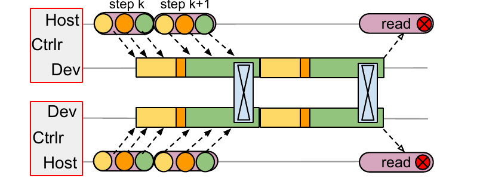<br><em>图 1a：JAX/PyTorch SPMD。</em></td>
    <td align="center" width="50%">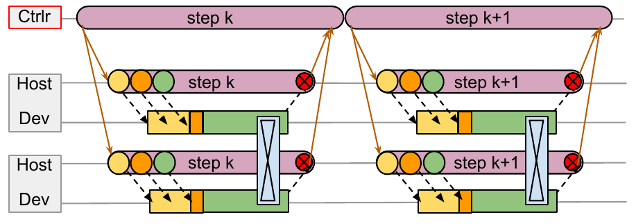<br><em>图 1b：TF1 SPMD。</em></td>
  </tr>
  <tr>
    <td align="center" width="50%">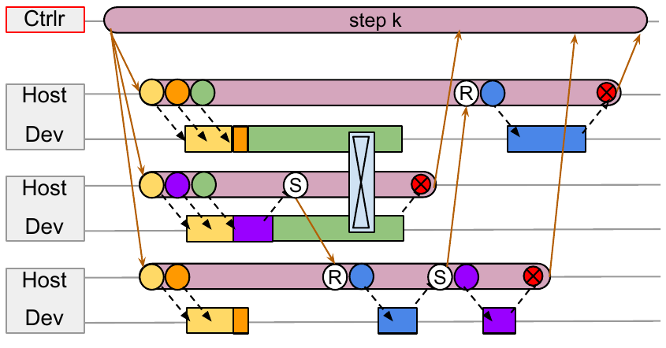<br><em>图 1c：TF1 非 SPMD。</em></td>
    <td align="center" width="50%">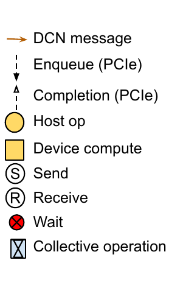<br><em>图例。</em></td>
  </tr>
</table>

<p align="center"><em>图 1：多控制器系统与单控制器系统之间的调度开销和通信模式比较。(a) JAX 或 PyTorch SPMD 通过快速 PCIe 独立、异步地入队加速器计算；(b) TensorFlow v1 SPMD 需要通过较慢的 DCN 传递控制消息；(c) TensorFlow v1 非 SPMD 程序需要跨主机协调，或通过显式 send (S) 与 recv (R) 算子进行数据传输。</em></p>

TensorFlow v1 [34] 这样的单控制器系统提供了非常通用的分布式数据流模型，包括经过优化的图内控制流 [35]。TensorFlow（TF）Python 客户端构建计算图并交给协调器运行时；协调器运行时把图划分成每个 worker 的子图，再把这些子图的执行委派给 worker 上的本地运行时。worker 之间的协调通过数据边和控制边实现，这些边会在数据中心网络（DCN）上传递消息。单控制器设计提供了灵活的编程模型和资源虚拟化能力，但也带来实现挑战。

第一，多控制器系统只需要通过 PCIe 通信来调度加速器计算（图 1a），而单控制器系统中的客户端“更远”，调度延迟涉及 DCN 通信，通常比 PCIe 慢一个数量级（图 1b）。第二，为了支持 MPMD 程序与 SPMD 子计算的并发执行，其中每个子计算覆盖从共享集群中抽取的一部分加速器，运行时必须有某种机制支持加速器计算的成组调度（gang-scheduling）。在 TPU 场景下，成组调度是必不可少的，因为 TPU 是单线程的，并且只运行不可抢占的 kernel；如果相互通信的计算没有以一致顺序入队，系统就会死锁。即使对于能够执行并发计算的 GPU 或其他加速器，成组调度也能让集合通信执行得更高效 [36]。因此，面向 ML 的单控制器系统需要一种分布式调度机制，用来为代表不同程序入队的计算排序。最后，现代 ML 工作负载的系统必须被设计为能在数千个加速器上运行分布式计算，并一等支持分片表示和分片数据结构。例如，如果用朴素数据流图表示一个 M 路分片计算与一个 N 路分片计算之间的边，就需要 $M+N$ 个节点和 $M\times N$ 条边，规模很快会变得难以管理。

TF v1 的实现选择过度专门化地假设存在一个单一、较小、独占拥有的加速器岛。这种过度专门化让 TF 在实践中很难用于当代或未来 ML 工作负载。虽然 TF 可以运行那些需要通过 send 和 recv 算子进行跨主机协调或数据传输的计算（图 1c），但目标端的主机侧工作，例如调度加速器计算，只有在传输完成后才会被触发。在包含许多跨主机传输的程序中，例如具有大量阶段的流水线模型，这些调度延迟会累积起来，导致加速器利用率低下。TF v1 用户可以通过控制边在单个程序内低效地强制成组调度的一致顺序，但像 TF v1 这样的单控制器系统缺少集中式调度器，因而无法确保跨程序计算之间的一致顺序。TF 还会物化完整的分片计算图；当分片数达到数千时，子计算之间会产生数百万条图边，在图序列化和执行中都引入显著开销。

Pathways 结合了单控制器框架的灵活性和多控制器的性能。我们采用单控制器模型，因为我们相信，相比多控制器，它能为新型且高效的 ML 计算提供更好的机会：既能利用计算稀疏性和异构性，也能支持促进资源共享和虚拟化的集群管理系统。我们的设计不同于旧式单控制器 ML 系统：它使用异步调度以匹配多控制器系统的性能，支持集中式资源管理和调度，并一等支持由 SPMD 加速器计算组成的 gang，同时使用分片数据流系统实现高效协调。

## 3. Pathways 编程模型

我们已经实现了对以 TensorFlow 和 JAX 编写的源程序面向 Pathways 的支持，但本文评测主要关注 JAX。JAX 用户可以用 decorator 显式包裹标准 Python 代码，指示其中某些片段应被编译成可能采用 SPMD 的 XLA 计算。这些 XLA 计算通常具有已知的输入和输出类型及形状、有界循环，并且只有很少的条件分支（如果有的话；更多细节见附录 B），因此系统可以提前估计计算的资源需求。我们把这类具有已知资源需求的计算称为“已编译函数”（compiled functions）。每个这样的函数都会映射为 Pathways 程序中的一个分片计算节点。

今天的 JAX 无法扩展到单个 TPU pod 之外，因为在多控制器配置中运行的 JAX 程序使用 XLA 集合通信传输所有数据，而目前在 TPU 上这些集合通信只可通过 ICI 使用。Pathways 可以作为 JAX 后端的插件式替代品，使 JAX 代码无需修改即可运行；不同之处在于，SPMD 计算现在不仅能访问本地连接的 TPU core，还能访问系统中被配置出来的任意数量 core。由于 Pathways 能通过 ICI 和 DCN 通信，它首次让 JAX 程序能够扩展到多个 TPU pod，包含数千个 TPU core。

能够运行未修改的 JAX 代码很方便，但并不能释放 Pathways 的全部性能。Pathways 用户可以请求多组“虚拟设备”，并可选择对设备类型、位置或互连拓扑施加约束；随后用户可以把特定已编译函数放置到这些设备上（图 2）。系统会自动处理相互依赖计算之间的所有数据移动和重新分片。

默认情况下，我们把每个已编译函数转换成一个独立的 Pathways 程序，其中只包含一个分片计算。这意味着，如果用户想连续运行许多函数，那么每个函数都需要一次从客户端到协调器的独立 Python 调用和 RPC。因此，我们还实现了一个新的程序 tracer（图 2），用户可以把它包裹在一段调用多个已编译函数的 Python 代码外。tracer 会生成单个 Pathways 程序，在该程序中，每个已编译函数都表示为数据流图中的一个计算节点。

```python
def get_devices(n):
  """Allocates `n` virtual TPU devices on an island."""
  device_set = pw.make_virtual_device_set()
  return device_set.add_slice(tpu_devices=n).tpus

a = jax.pmap(lambda x: x * 2., devices=get_devices(2))
b = jax.pmap(lambda x: x + 1., devices=get_devices(2))
c = jax.pmap(lambda x: x / 2., devices=get_devices(2))

@pw.program  # Program tracing (optional)
def f(v):
  x = a(v)
  y = b(x)
  z = a(c(x))
  return (y, z)

print(f(numpy.array([1., 2.])))
# output: (array([3., 5.]), array([2., 4.]))
```

<p align="center"><em>图 2：Pathways 的 Python 用户代码示例，在多个 TPU 岛之间运行分片计算。</em></p>

JAX 支持对 traced code 做变换的理念，与我们希望探索的研究方向非常契合。例如，JAX 有一个名为 FLAX [37] 的配套库，用来表达分层 DNN 模型；我们已经编写了一个库，可自动把 FLAX 模型转换成流水线化的 Pathways 程序。此外，JAX 支持把“逐样本”Python 函数向量化的 transform，从而生成高效 batched 代码；这类 transform 是探索数据依赖向量化控制流新形式的良好基础，后文第 6.3 节会简要描述。

## 4. Pathways 系统架构

Pathways 大量建立在既有系统之上，包括用来表示和执行 TPU 计算的 XLA [38]、用来表示和执行分布式 CPU 计算的 TensorFlow 图和执行器 [34]，以及包括 JAX [29] 和 TensorFlow API 在内的 Python 编程框架。通过利用这些构件，我们能够把精力集中在 Pathways 的新型协调机制上，同时以很少的代码修改运行已有 ML 模型。

图 3 给出了 Pathways 的系统概览：分布式计算表示为 DAG，资源管理器负责为已编译函数分配虚拟 slice，而每个岛上的集中式调度器对计算做成组调度，再由每个 shard 的执行器分发执行。

<table align="center">
  <tr>
    <td align="center" width="34%">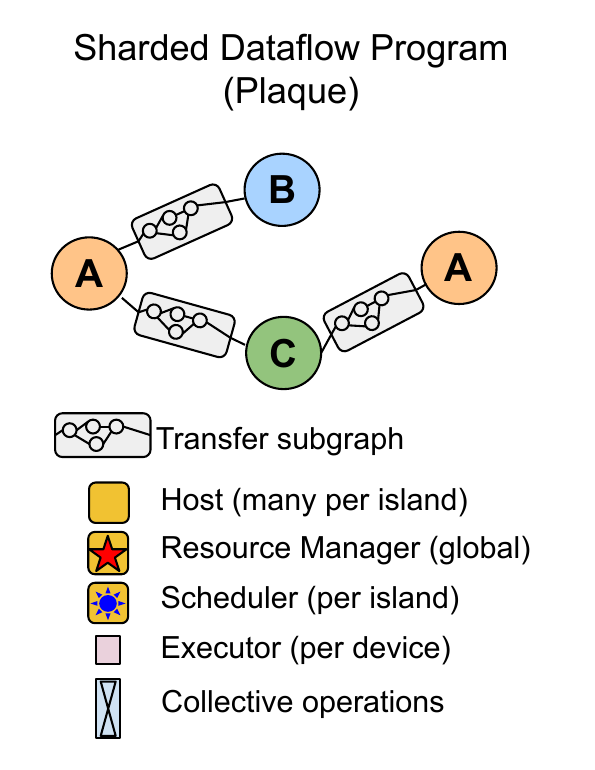<br><em>左：分片数据流图。</em></td>
    <td align="center" width="40%">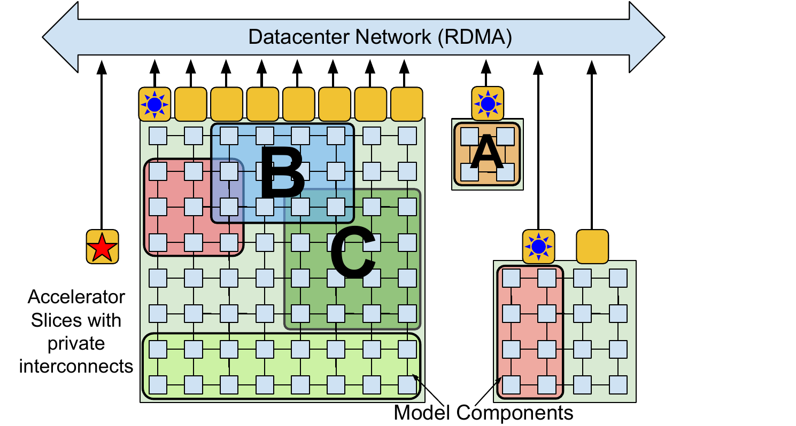<br><em>中：资源管理器分配虚拟 slice。</em></td>
    <td align="center" width="26%">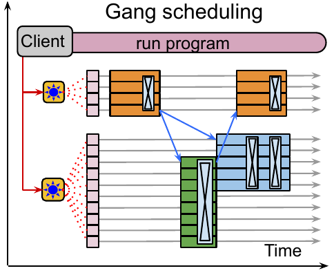<br><em>右：集中式成组调度。</em></td>
  </tr>
</table>

<p align="center"><em>图 3：Pathways 系统概览。左：分布式计算表达为 DAG，其中每个节点表示一个独立的已编译函数，节点之间的边表示函数之间的数据流。中：资源管理器为每个已编译函数分配一个加速器岛中的子集，即“虚拟 slice”。右：每个岛的集中式调度器对计算进行成组调度，随后由每个 shard 的执行器分发。红色箭头表示控制消息，蓝色箭头表示数据路径传输。</em></p>

### 4.1 资源管理器

Pathways 后端由一组加速器组成，这些加速器被组织成紧密耦合的岛，岛与岛之间再通过 DCN 连接（图 3）。Pathways 有一个“资源管理器”，负责对所有岛上的设备进行集中管理。客户端可以请求具有特定二维或三维 mesh 形状的岛内“虚拟 slice”，以适配自身通信模式。每个虚拟 slice 包含“虚拟设备”，使客户端能够表达计算如何布局在 mesh 上。资源管理器会动态地为虚拟设备分配物理设备，并满足期望的互连拓扑、内存容量等约束。

我们最初的资源管理器实现使用一种简单启发式方法：尝试通过把计算分散到所有可用设备上来静态地平衡负载，并保持虚拟设备和物理设备之间的一对一映射。如果未来工作负载需要，我们可以采用更复杂的分配算法，例如综合考虑所有客户端计算的资源需求和系统当前状态，近似求解物理设备到计算的最优分配。

Pathways 允许动态添加和移除后端计算资源，并由资源管理器跟踪可用设备。单控制器设计所支持的虚拟设备与物理设备之间的间接层，使我们将来能够支持透明挂起/恢复和迁移等特性：客户端的虚拟设备可以被临时回收或重新分配，而无需用户程序配合。

### 4.2 客户端

当用户希望运行 traced program 时，会调用 Pathways 客户端库。客户端库首先为此前未运行过的计算分配虚拟设备，并把这些计算注册到资源管理器，从而触发服务器在后台编译计算。随后，客户端为程序构造与设备位置无关的 Pathways 中间表示（IR），该 IR 表达为一种自定义 MLIR [39] dialect。IR 通过一系列标准编译器 pass 逐步“lower”，最终输出低层表示，其中包括物理设备位置。这个低层程序会考虑物理设备之间的网络连通性，并包含用于把源计算 shard 的输出传输到目标 shard 位置的操作；当需要数据交换时，还会包含 scatter 和 gather 操作。在虚拟设备位置不变的常见情况下，重复运行低层程序很高效；如果资源管理器改变了虚拟设备和物理设备之间的映射，程序也可以重新 lower。

在旧式单控制器系统中，当客户端需要协调分布在数千个加速器上的数千个计算 shard 以及与其对应的各个数据 buffer 时，很快会成为性能瓶颈。Pathways 客户端使用分片 buffer 抽象来表示一个可能分布在多个设备上的逻辑 buffer。这个抽象通过在逻辑 buffer 粒度而非单个 shard 粒度摊销 bookkeeping 任务的成本，帮助客户端扩展；这些任务包括引用计数。

### 4.3 协调实现

Pathways 依赖 Plaque 完成所有使用 DCN 的跨主机协调。Plaque 是 Google 现有的闭源生产级分片数据流系统，用于许多面向客户的服务；这些服务需要高 fan-out 或高 fan-in 通信，并且对可扩展性和延迟都很敏感。低层 Pathways IR 会直接转换成 Plaque 程序，并表示为数据流图。Pathways 对其协调底座有严格要求，而 Plaque 满足这些要求。

首先，用来描述 Pathways IR 的表示必须为每个分片计算只包含一个节点，以保证跨许多 shard 的计算也能有紧凑表示。也就是说，若 $A$ 和 $B$ 两个计算各有 $N$ 个计算 shard，并以链式方式执行，那么无论 $N$ 如何选择，其数据流表示都应只有 4 个节点：$Arg \xrightarrow{} Compute(A) \xrightarrow{} Compute(B) \xrightarrow{} Result$。在 Plaque 运行时实现中，每个节点都会生成带有目标 shard 标签的输出数据 tuple；因此，在进行数据并行执行时，会有 $N$ 个数据 tuple 流动，分别位于每对相邻 IR 节点之间。

协调运行时还必须支持沿分片边进行稀疏数据交换。在这种交换中，消息可以发送给动态选择的 shard 子集，并使用标准进度跟踪机制 [40, 41] 检测某个 shard 的所有消息是否已经收到。高效的稀疏通信是必要条件，否则 DCN 会成为加速器上数据依赖控制流的瓶颈，而这正是 Pathways 希望支持的关键能力之一。

协调底座用于发送位于关键路径上的 DCN 消息，这些消息传输调度消息和数据 handle（图 4），因此它必须以低延迟发送关键消息，并在需要高吞吐时批量发送发往同一主机的消息。

使用可扩展的通用数据流引擎处理 DCN 通信也很方便，因为这意味着 Pathways 还可以用它执行后台 housekeeping 任务，例如分发配置信息、监控程序、清理程序、在失败时传递错误，等等。

我们相信，可以用 Ray [42] 这样的其他分布式框架重新实现完整的 Pathways 设计，而不一定要用 Plaque 来实现低层协调框架。在这种实现中，Pathways 执行器和调度器会被长时间运行的 Ray actor 取代，这些 actor 在底层 Ray 集群调度之上实现 Pathways 调度；执行器则可以用 PyTorch 完成 GPU 计算和集合通信。为了达到可比性能（见第 5 节），可能还需要增加一些能力，因为 Ray 例如缺少 HBM object store，也缺少通过 GPU 互连高效传输远程对象的原语。

### 4.4 成组调度的动态分发

如前文第 2 节所述，要支持在一组共享加速器上运行 SPMD 计算，一个要求是支持高效成组调度。Pathways 运行时在每个岛内包含一个集中式调度器，对岛内所有计算进行一致排序。当 Pathways 把一个程序入队执行时，Plaque 数据流程序负责：(i) 在每个加速器上以 buffer future 作为输入，入队本地已编译函数的执行；(ii) 对函数执行输出的 buffer future，入队发往远程加速器的网络 send；以及 (iii) 与调度器通信，以确定该岛中所有运行程序的函数执行一致顺序。调度器必须以毫秒量级时间尺度实现加速器分配策略。当前实现只是按 FIFO 顺序入队工作，但更复杂的调度器可以例如根据估计执行时间重新排序计算。

### 4.5 并行异步分发

在加速器上运行计算时，系统可以利用异步 API 将计算与协调重叠 [43]。考虑图 4a 中的三节点图，其中方块对应运行在连接到主机 A、B、C 的加速器上的三个节点 A、B、C。所有节点计算都是规则的已编译函数。主机 A 入队节点 A，收到 A 输出的 future，并把该 future 传给主机 B。主机 B 为 B 的输入分配空间，把输入 buffer 地址传给主机 A，并完成启动节点 B 函数的大部分准备工作。当节点 A 完成时，它的输出会通过加速器互连直接发送到节点 B 的输入 buffer 中，随后主机 B 启动节点 B。一个节点完成到下一个节点启动之间的延迟可以做得只比数据传输时间略多一点。

<table align="center">
  <tr>
    <td align="center" width="50%">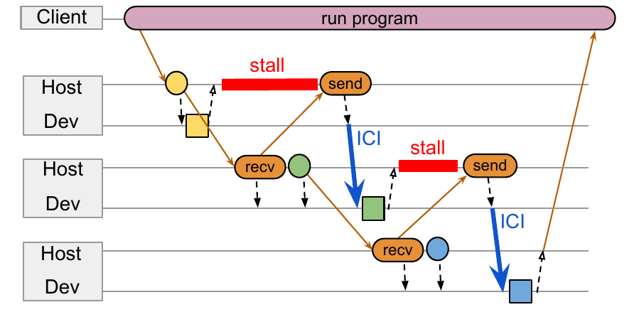<br><em>图 4a：顺序分发。</em></td>
    <td align="center" width="50%">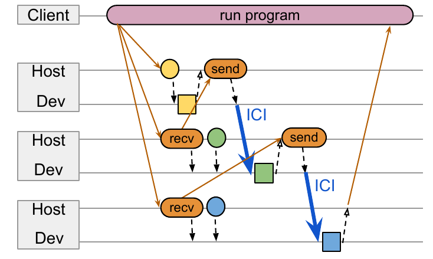<br><em>图 4b：并行分发。</em></td>
  </tr>
</table>

<p align="center"><em>图 4：三节点程序的顺序分发与并行分发。当计算在设备上的执行时间短于调度、资源分配和协调所花时间时，顺序分发中的主机侧工作会导致异步流水线停顿。并行异步分发利用规则已编译函数静态已知的资源使用情况，通过并行运行主机侧工作来克服这一瓶颈。为简洁起见，图中省略调度器。</em></p>

上述设计在前驱节点计算时间长于调度、资源分配和主机间协调所用时间时效果很好。然而，如果计算时间太短，如图中所示，异步流水线会停顿，主机侧工作会成为执行整个计算序列的关键瓶颈。鉴于所有已编译函数都是规则的，后继节点的输入形状在实践中甚至可以在前驱计算入队之前就算出。

因此，我们引入图 4b 所示的新型并行异步分发设计。该设计利用规则已编译函数静态已知的资源使用情况，将一个计算节点的大部分主机侧工作并行执行，而不是串行化到其前驱节点入队之后再执行。由于只有规则函数才能并行调度，Pathways 把并行调度视为一种优化；当某个节点的资源需求必须等前驱计算完成后才能知道时，例如由数据依赖控制流造成，Pathways 会回退到传统模型。当某个计算子图可以静态调度时，程序会向调度器发送一条消息，描述整个子图；调度器便能把该子图中所有活跃 shard 的执行连续排序。使用单条消息的目的在于最小化网络流量，但并不要求调度器真的把该子图所有 shard 作为一个批次入队：这些计算仍然可以与其他并发执行程序提交的计算交错。我们在第 5 节评测不同分发机制的成本。

### 4.6 数据管理

每台主机管理一个分片 object store，它类似 Ray 的 object store [42]，但扩展为还跟踪每个 shard 上保存在加速器 HBM 中的 buffer。客户端程序可以持有远程主机或加速器内存中对象的引用，客户端和服务器通过不透明 handle 引用这些对象，从而允许系统在需要时迁移它们。中间程序值也保存在 object store 中，例如系统等待把它们在加速器之间传输，或传给后续计算时。对象带有所有权标签，因此当某个程序或客户端失败时可以被垃圾回收。如果某个计算因为其他计算的 buffer 暂时占用 HBM 而无法分配内存，系统可以用简单的反压机制让该计算停顿。

## 5. 评测

为了在 TPU 上评测 JAX、Pathways 和 TensorFlow，我们使用三种不同配置。配置 A 每台主机有 4 个 TPU，我们报告的最大实例有 512 台主机，总共 2048 个通过 ICI 连接的 TPU。配置 B 每台主机有 8 个 TPU，我们报告的最大实例有 64 台主机，总共 512 个 TPU。配置 C 使用四个 TPU 岛，每个岛有 4 台主机和 32 个 TPU。实验使用某一配置中 TPU 子集时，我们会在正文中说明。

在 GPU 上评测 Ray 时，我们使用 Ray v1.3 和 PyTorch 1.8.1，运行在 `p3.2xlarge` VM 上。这些 VM 拥有 $1\times$ V100 GPU 和 $8\times$ CPU core；主机通过 DCN 连接，并使用 Amazon placement group 调度。

我们主要将 Pathways 与多控制器 JAX 比较，因为 JAX 在工业标准基准 [44] 中展现了最先进性能，而且我们可以在相同硬件配置上轻松运行 JAX 和 Pathways（PW）。我们还在微基准中与 TensorFlow（TF）和 Ray 比较，以检查 Pathways 分布式系统性能的特定方面，并展示运行在 Pathways 上的 TF 模型的流水线性能。

### 5.1 单控制器分发开销

第一个实验是一个微基准，用来比较 JAX 多控制器与单控制器框架的开销。我们构造反复运行平凡成组调度计算的程序：每个计算包含一次对标量的 AllReduce，随后做一次标量加法，并把一个计算的输出送入下一个计算。我们测量吞吐量，即每秒在加速器上执行的计算数。我们比较用户代码入队计算的三种方式：

- **OpByOp (-O)：** 用户代码为计算的每次执行分别调用一次。
- **Chained (-C)：** 用户代码包含一系列调用，每个调用执行由 128 个节点组成的链，每个节点执行该计算。系统响应一次客户端调用时执行整条链。
- **Fused (-F)：** 用户代码包含一系列调用，每个调用执行一个计算节点，而该节点内部包含 128 个计算组成的链。

对于 JAX 多控制器，OpByOp 表示 JIT 编译包含一个计算的函数，并从 Python 反复调用；Fused 表示 JIT 编译包含一条计算链的函数。多控制器没有 Chained 的对应形式。对于 Pathways，OpByOp 和 Fused 使用与多控制器相同的 JAX 源代码；Chained 使用 Pathways 程序 tracer 来形成多节点程序，其中每个节点包含一个简单计算。TF 与 Pathways 类似：我们构造相同 TPU 计算，并使用 TF 图而不是 Pathways 执行它们。对于 Ray，OpByOp 表示每个计算执行一个单独 actor method，而该 method 执行一次 PyTorch AllReduce。Chained 表示把一系列 actor method 通过传递 Ray future 连接起来，每个 method 执行一次 PyTorch AllReduce。Fused 表示执行一个 actor method，在循环中运行一条 PyTorch AllReduce 命令链。

图 5 给出了结果。请注意，OpByOp 是一个最坏情况实验，对任何框架而言都不是惯用方式；它只是用来对底层系统施压。正如预期，在 OpByOp 下，JAX 多控制器的吞吐量远好于单控制器系统，尤其当加速器数量增加时。Pathways 的大部分开销来自这样一个事实：客户端会等待协调器入队一个计算并返回其输出 handle 后，才入队下一个计算。我们可以通过允许用户代码与入队 RPC 并行推进，以及机会性地把多个小计算批量放入单个 Pathways 程序，来消除大部分开销。我们没有集中优化很小计算的开销，因为对于包含不止标量计算的真实模型，Pathways 已经能匹配多控制器 JAX 的性能（见第 5.3 节）。一旦足够多的工作被 Fused 到单个节点中，Pathways 在最高 1000 个 TPU core 时可匹配 JAX 性能；Pathways Chained 在最高 256 个 core 时优于 JAX OpByOp，因为 Pathways 能直接从 C++ 连续执行加速器计算，而 JAX OpByOp 每个计算都要切换到 Python。

<p align="center">
  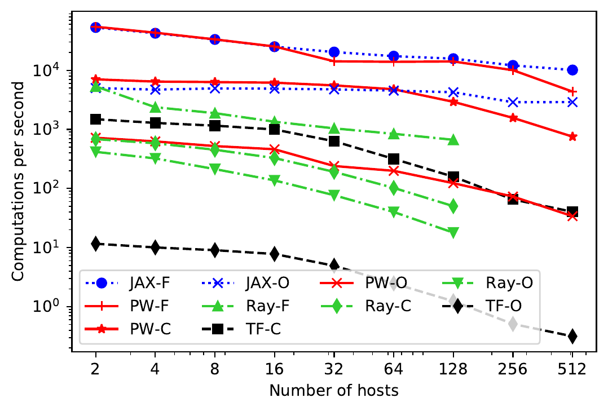
  <br><em>图 5：Pathways 与 TF、JAX、Ray 的分发开销比较。Pathways 在所有配置上都优于 TF 和 Ray 这样的单控制器系统，并在 Fused (-F) 和 Chained (-C) 配置中，分别在最高 1000 和 256 个 TPU core 时匹配多控制器 JAX 的性能。每个计算包含一次单标量 AllReduce，随后做一次标量加法。</em>
</p>

TensorFlow 和 Ray 受制于缺少设备 object store：Ray 必须先把计算结果从 GPU 传到 DRAM，才能把 object handle 返回给客户端；TensorFlow 则会把数据本身传回客户端。这一开销损害了它们的 OpByOp 性能，但在 Chained 和 Fused 中大体被摊销。Ray 与 Pathways 的性能不能直接比较，因为它们使用不同硬件；但我们把结果理解为：如果把完整 Pathways 设计中的 Plaque 替换为 Ray 来实现，应当可以达到可比性能。开箱即用时，Ray 每个计算的性能大约比 Pathways 慢一个数量级，但这并不令人意外，因为 Ray 能执行通用 Python actor，而 Pathways 专门面向从 C++ 启动的 TPU 计算。通过仔细工程实现，也许可以给 Ray 增加快速路径，例如 GPU 上的 object store，以及通过 GPU 互连高效传输对象的原语，从而消除大部分额外开销。TensorFlow 在许多 core 上运行时较慢，因为它使用由控制边实现的集中式 barrier 来串行化成组调度的计算。

图 6 改变每个计算所花的时间，以找到 Pathways 能匹配 JAX 吞吐量的最小计算规模。对于配置 B 上 16 台主机、128 个 TPU 的场景，只需 $2.3$ ms 即可达到持平；即使在配置 A 上 512 台主机、2048 个 TPU 的场景中，只要计算至少持续 $35$ ms，就能掩盖 Pathways 的全部单控制器开销。

<p align="center">
  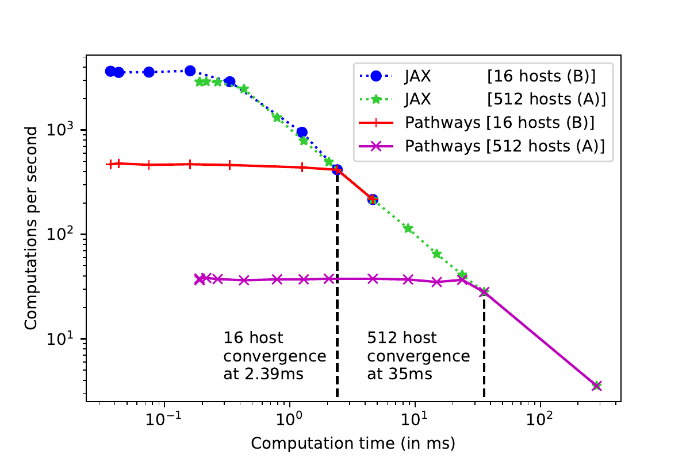
  <br><em>图 6：为了让 Pathways 与 JAX 吞吐量持平并掩盖单控制器开销所需的最小计算。对于配置 B 中 16 台主机、128 个 TPU，Pathways 在计算规模至少为 2.3 ms 时匹配 JAX 吞吐量；对于配置 A 中 512 台主机、2048 个 TPU，计算规模至少为 35 ms 时匹配。</em>
</p>

下一个微基准同样运行在配置 B 上，用来评测第 4.5 节所述并行异步分发机制的收益。我们构造一个更现实的流水线基准：与前一个基准一样，把简单计算串接起来；但现在每个计算运行在不同的一组 4 个 TPU core 上，每组位于不同主机，并且一个计算输出的数据必须先通过 ICI 发送，下一计算才能执行。图 7 展示三个“阶段”：起初，随着主机数增加，固定客户端开销被摊销；随后，增加更多阶段带来的传输成本开始占主导；最后，系统开始摊销固定调度开销。我们预计，最终传输开销会再次占主导。为了比较，我们还展示了强制 Pathways 数据流执行使用顺序异步分发时的性能，即等待一个计算入队后才入队下一个计算，以测量并行异步分发带来的收益。

<p align="center">
  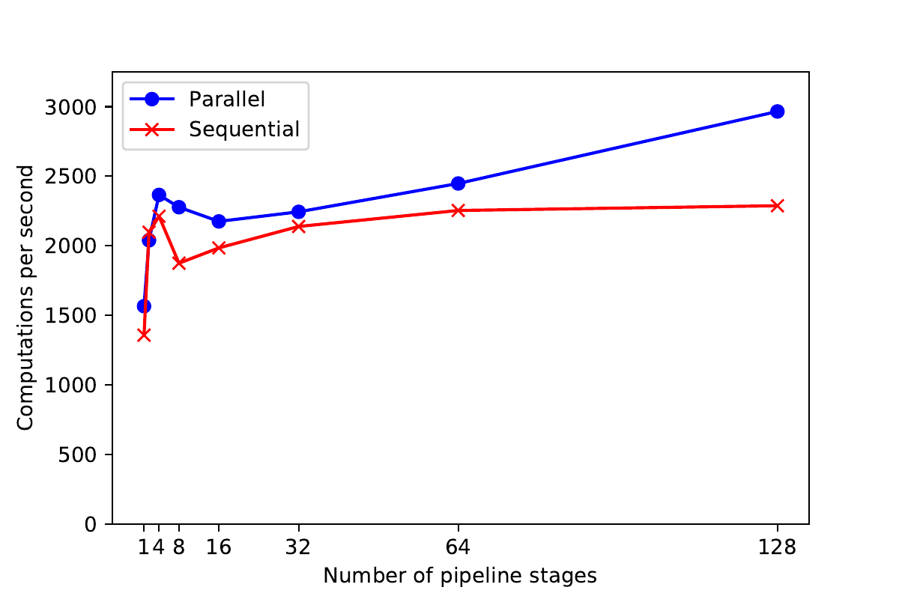
  <br><em>图 7：Pathways 中并行与顺序异步分发的比较。每个流水线阶段运行在不同的一组 4 个 TPU core 上，即不同主机，并通过 ICI 把数据传给下一阶段。使用并行异步分发时，Pathways 能在大量流水线阶段上摊销固定客户端开销和调度开销。</em>
</p>

### 5.2 多租户

图 8 验证 Pathways 能够在并发程序之间对加速器进行时间复用，该实验在配置 B 上执行。当多个客户端并发提交不同的 Pathways 程序时，Pathways 至少能达到与 JAX 相同的聚合吞吐量；也就是说，来自不同客户端的程序之间进行上下文切换没有开销，至少当它们的资源能同时装入 HBM 时如此（trace 见附录 D）。如图 6 已经显示的，匹配吞吐量所需的并发度对更大的计算规模而言更低，因为 TPU core 更早达到满利用率。值得注意的是，对于非常小的计算，Pathways 的最大吞吐量超过 JAX，从而实现更高 TPU 利用率。这是因为 Pathways worker 可以从远程客户端接收比 JAX 通过本地 Python 分发更多的计算。

<p align="center">
  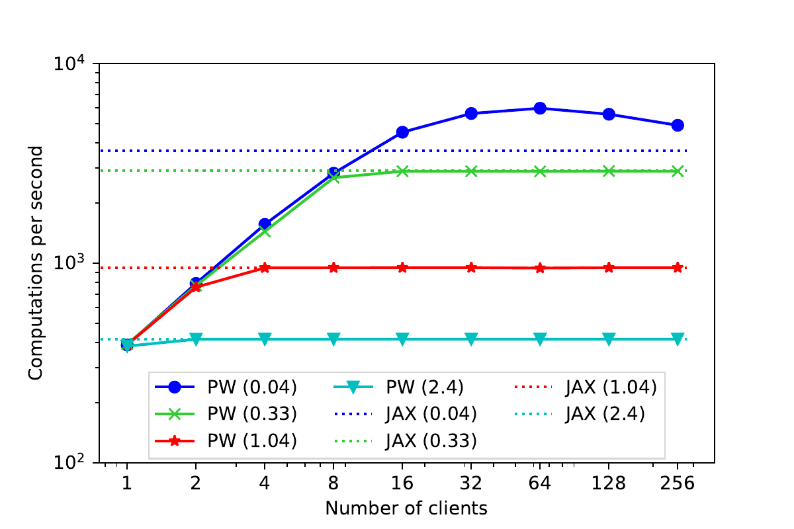
  <br><em>图 8：并发程序的聚合吞吐量，计算时间单位为 ms。Pathways 在程序之间高效地时间复用加速器，并且上下文切换没有开销。</em>
</p>

图 9 展示了上述工作负载中 Pathways 上 128 个 core 样本的 trace。该实验强调，Pathways 能对 4 个独立客户端提交的程序执行成组调度，同时控制加速器时间分配以保证公平性；例如，调度器可以在这种多租户设置中执行 proportional share。

<table align="center">
  <tr>
    <td align="center" width="100%">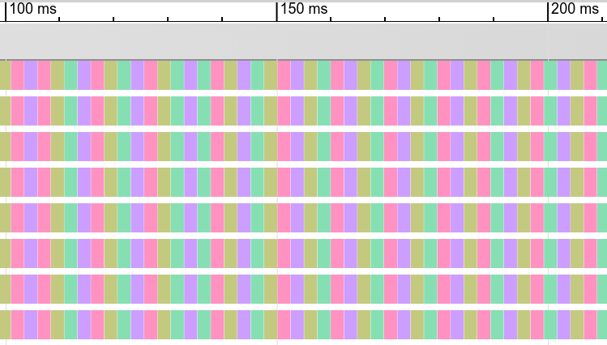<br><em>图 9a：4 个客户端之间 proportional-share 比例为 1:1:1:1。</em></td>
  </tr>
  <tr>
    <td align="center" width="100%">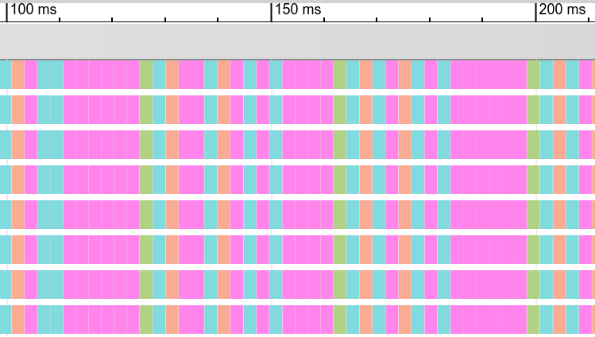<br><em>图 9b：4 个客户端之间 proportional-share 比例为 1:2:4:8。</em></td>
  </tr>
</table>

<p align="center"><em>图 9：Pathways 上 core 样本的 trace，显示 4 个客户端之间成组调度的并发程序如何交错，上图 proportional-share 比例为 1:1:1:1，下图为 1:2:4:8。</em></p>

### 5.3 大规模模型性能

最后，我们展示 Pathways 在训练可表达为 SPMD 程序的真实机器学习模型时的性能。我们比较在原生系统上运行的 JAX 和 TF 模型，与运行在 Pathways 上的相同模型，并验证数值结果完全一致，因此这里只关注性能。

首先，我们与运行 Encoder-Decoder 架构 Transformer 模型的 JAX 多控制器进行比较。该模型用于多种 text-to-text 自然语言处理任务。我们使用来自文献 [45] 的模型配置，并在每个加速器有 16GB 内存的 TPUv3 上运行实验。表 1 展示 Text-to-text Transformer 模型在不同模型规模（最高 110 亿参数）和不同加速器数量下的训练吞吐量（tokens/s）。正如预期，由于模型代码相同，在 JAX 和 Pathways 上训练的模型会在相同步数达到相同困惑度。在所有测试模型规模上，两个系统表现出相同性能，因为现实计算足够大，可以掩盖单控制器开销。虽然我们没有报告详细结果，但我们有大量在 Pathways 上运行 JAX 模型的经验，这支持了两套系统在广泛设置下性能相当的结论。

表 1：来自文献 [45] 的 Text-to-text Transformer 模型配置在 JAX 多控制器和 Pathways 上的训练吞吐量（tokens/s）。

| 模型 | 参数量 | TPU core | JAX | Pathways |
| --- | ---: | ---: | ---: | ---: |
| T5-Base | 270M | 32 | 618k | 618k |
| T5-Large | 770M | 32 | 90.4k | 90.4k |
| T5-3B | 3B | 512 | 282.8k | 282.8k |
| T5-11B | 11B | 512 | 84.8k | 84.8k |

接下来，我们比较在配置 B 和配置 C 上，Pathways 训练基于 Transformer 的 Decoder-only 语言模型时的性能。该实验使用一个用 TF 通过 Python 表达的模型。模型包含 62 个 Transformer 层，model dimension 为 2048，hidden dimension 为 8192，总计 30 亿参数。我们比较一种 SPMD 配置与一种使用类似 GPipe 调度 [11] 的流水线配置。流水线模型被切分成多个阶段，每个阶段的计算量保持平衡。由于第一阶段额外包含 embedding lookup 层，最后阶段额外包含 softmax 层，我们从第一阶段和最后阶段各移除一个 Transformer 层，以平衡每个阶段的计算量。每个阶段被分配给跨多台主机的一组不同加速器。

表 2 展示在保持全局 batch size 和训练超参数固定的情况下，不同阶段数（S）和 micro-batch 数（M）的训练吞吐量。与 Megatron [46] 不同，这里评测的 SPMD 分片模型类似 GShard [12]，其通信量不与 batch size 成正比，因此在相同 batch size 下评测流水线与 SPMD 是公平的。所有情形中，每个 micro-batch 的样本数固定为 4；因此，128-core 配置下每步的全局 batch size 为 2048，512-core 配置下为 8192。

Pathways 的训练吞吐量与每个流水线阶段的 TPU core 数成比例提升（表 2），这与其他系统 [8, 9] 一致。该结果也与图 5 一致，即 Pathways 的吞吐量随主机数线性扩展。增加流水线阶段只引入很小开销：阶段数从 4 增加到 16 时，吞吐量从 133.7k tokens/s 降到 131.4k tokens/s。我们把流水线模型的性能与使用 SPMD 表达的等价模型比较，并观察到至少在这一实例中，流水线性能与 SPMD 具有竞争力，因为 SPMD 计算中的集合通信开销高于流水线 bubble 开销。

表 2：30 亿参数 Transformer 语言模型在 Pathways 上使用 SPMD 或多个流水线阶段、并使用 $C$ 个 TPU core 时的训练吞吐量（tokens/s）。对于流水线并行模型，$S$ 为阶段数，每个 batch 被切分成 $M$ 个 $\mu$-batch。

| 模型配置 | TPU core | Pathways |
| --- | ---: | ---: |
| Model-parallel (SPMD) | 128 | 125.7k |
| Pipelining, S=4, M=16 | 128 | 133.7k |
| Pipelining, S=8, M=32 | 128 | 132.7k |
| Pipelining, S=16, M=64 | 128 | 131.4k |
| Pipelining, S=16, M=64 | 512 | 507.8k |

我们还证明，Pathways 可以在通过 DCN 连接的 TPU 岛上高效训练模型。在 $S=16,\ M=64$、128 core 的配置中，我们测得使用配置 B 上单个 128-core 岛，或使用配置 C 上 4 个各 32-core 的岛，吞吐量相同，均为 131.4k tokens/s。图 10 展示当阶段被划分到多个岛上时，一部分 core 的 trace。DCN 传输发生在 trace 中每 8 行之间，但由于通信时间与计算有效重叠，在 trace 中不可见。

<p align="center">
  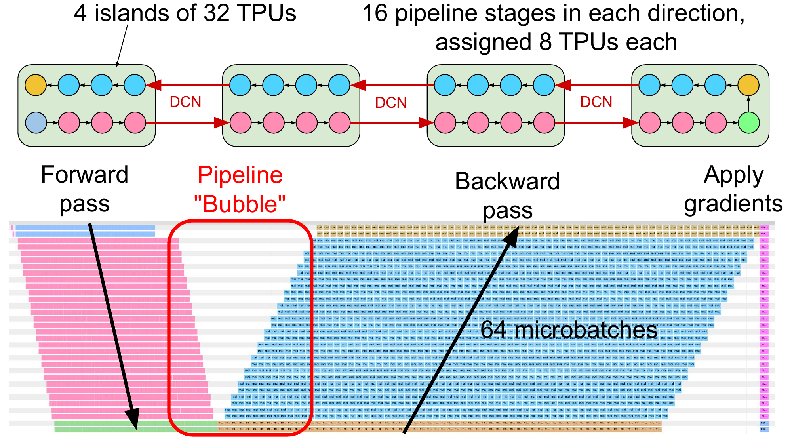
  <br><em>图 10：在 128 个 TPU 上流水线化的 3B Transformer 模型。Pathways 能在通过 DCN 连接的 TPU 岛上高效训练模型：在配置 C 中使用 4 个各 32-core 的岛，与在配置 B 中使用单个 128-core 岛达到相同吞吐量，即 131.4k tokens/s。</em>
</p>

最后，我们使用两个加速器岛，将大型 Decoder-only Transformer 模型训练扩展到 640 亿和 1360 亿参数。当通过 DCN 连接的两个计算岛使用 Pathways 训练时，相比使用设备数翻倍的单个岛，Pathways 达到约 97% 的吞吐量。对于 136B（64B）LM 模型，我们在两个各有 1024（512）个 core 的岛上训练；执行过程使用岛内快速 ICI 归约，随后通过 DCN 在岛间传输 1030GB（457GB）数据用于全局归约。执行 trace 见附录 D。

## 6. 讨论

### 6.1 Pathways 设计与实现

Pathways 被设计为面向大规模 TPU 加速器集合。使用 TPU 而非 GPU 会影响许多低层设计决策。TPU 与 GPU 最大的差别在于：TPU 可以把运行时间远长、复杂得多的计算融合成单个 TPU kernel，因为 TPU 支持丰富控制流和通信原语；在 GPU 系统中，这些能力则必须由 driver code 执行。相比之下，GPU 与主机内存系统和 DCN 的集成更紧密 [47]；更多细节见附录 A.5。TPU 很适合 Pathways，因为 XLA 可以编译包含融合集合通信的高性能函数，而大型高性能 TPU 互连岛允许灵活调度许多不同规模的计算。尽管如此，我们相信，本文描述的 Pathways 大多数高层架构选择也适用于大规模 GPU 系统。

### 6.2 资源管理

Pathways 被设计为允许多种细粒度动态资源管理策略。我们的初始研究聚焦于 TPU 计算的高效动态时间复用。对于未来更复杂的多租户用例，Pathways 需要处理更多样的资源类型，包括但不限于设备和主机内存，以及 ICI、DCN 和 PCIe 带宽。Pathways 的单控制器模型赋予系统大规模跟踪可用资源和分配资源的广泛能力。我们计划探索常见多租户需求，如优先级、性能隔离、访问控制和资源记账，但时间尺度会显著小于已有工作，资源池规模也会大几个数量级，例如数千个 core 和 TB 级加速器内存。

### 6.3 数据依赖的向量化控制流

当前几乎所有 ML 模型都会在每个训练 step 中，基于每个训练样本更新每一个模型权重。我们希望支持使用细粒度控制流的研究，使不同模型权重可以针对每个样本，甚至每个子样本，例如图像 patch 或句子中的词，分别更新。Mixture of Experts（MoE）[10] 和 routed capsule network [48, 49] 这样的模型利用计算稀疏性：它们基于训练过程中持续更新的学习函数，把不同的子样本路由到托管不同模型权重子集的加速器。该路由需要节点之间进行细粒度、数据依赖的数据交换。我们的 ML 研究同事告诉我们，在训练越来越大的模型、处理越来越多任务时，他们希望更有效地使用稀疏性，但当前框架限制了他们实验新型模型架构的能力。以清晰编程模型和良好性能支持数据依赖的向量化控制流，是未来工作的主题。

## 7. 相关工作

我们已经在第 2 节详细考察了紧密相关工作。本节扩展讨论那些面向超出 SPMD 多控制器能力范围的 ML 工作负载的相关研究，并验证 Pathways 的设计选择。

在多个任务之间共享加速器，对于实现高资源利用率至关重要。传统资源共享以粗粒度方式完成。例如，通用虚拟化使云应用能够在提供性能隔离的同时高效共享多租户资源 [50, 51, 52, 53]，但云提供商仍会把加速器专用于单个用户。集群调度器针对 ML 工作负载异构性 [54] 以及多作业、多用户公平性和性能 [55, 56, 57, 58] 做优化，但资源仍然在较长时间尺度上（数秒或更长）独占分配给单个作业。

近期工作表明，更细粒度的共享可以进一步提升资源效率：加速器虚拟化 [59, 60, 61] 避免把整个加速器专用于单个用户。大型模型 [4] 可能受限于可用加速器内存，因而需要 GPU 内存虚拟化 [62, 63] 或 DRAM offload [64]。并发的、时间复用或重叠的 ML 任务执行 [65, 17, 18, 19, 20, 21] 有助于收获加速器内部的空闲资源。这些细粒度共享技术展示了共享加速器的机会；但如果没有像 Pathways 这样的单控制器系统，就很难在规模化场景中利用这些机会。

许多工作已经表明，偏离 SPMD 计算可以提升大型工作负载的效率：流水线 [11, 7, 66] 把 ML 模型划分为跨加速器的静态异构计算。图神经网络训练 [67]、神经架构搜索 [68]，以及多模态多任务学习系统 [69, 12, 70]，都是天然异构且动态的任务示例，它们并不自然适配 SPMD 模型。我们预计，即将出现的大规模高效 ML 模型可能会形成一组共享层和独占层 [23]，这很自然地表达为 MPMD。

## 8. 结论

Pathways 在当前单租户 SPMD ML 模型上匹配最先进多控制器性能。我们确保了与多控制器 JAX 的严格兼容性；正如第 5 节所展示的，除最小计算外，Pathways 在非常大的系统规模上都能匹配 JAX 性能。

与此同时，Pathways 改变了 JAX 程序的执行模型：它把用户代码拉回单控制器模型，并在客户端和加速器之间插入集中式资源管理与调度框架。单控制器编程模型使用户能够简单访问丰富得多的计算模式。资源管理和调度层则允许重新引入集群管理策略，包括多租户共享、虚拟化和弹性，并使这些策略都适配 ML 工作负载和加速器的需求。我们的微基准展示了并发客户端工作负载的交错执行，以及高效流水线执行；这有力证明，我们构建的系统机制既快速又灵活，并为研究利用这些机制的新策略奠定了坚实基础。

我们已经证明，细致的系统设计和工程实现使我们能够“两全其美”：既匹配今天 ML 模型的性能，又提供编写明日模型所需的特性。

## 致谢

我们感谢 Google 的许多同事以及更广泛机器学习社区成员对 Pathways 系统设计和实现的贡献。我们也感谢 Martín Abadi、James Laudon、Martin Maas 以及匿名 MLSys 审稿人对本文表述提出的有益建议。

## 附录 A. 加速器设计考虑

硬件加速对现代深度学习至关重要；遗憾的是，要在加速器上实现高性能，是一项并不简单的系统工程。以下小节列出了深度学习系统中常用于获得良好性能的成熟技术。

### A.1 Batching

随着 Dennard scaling 的终结，加速器通过硬件并行来实现性能，常见设计包括 SIMT [71] 和 systolic array [33]。虽然这些硬件架构消除了算术瓶颈，内存带宽很快成为关键资源，因此需要高带宽内存（HBM）这种昂贵且容量有限的内存技术。现代神经网络训练方案利用 batching 来释放并行性，这有利于喂饱并行 ALU；同时，batching 也支持内存复用，例如一个 `float` 从内存读出一次后可用于多次计算，从而大幅降低计算的内存带宽需求。尽管如此，batching 并非万灵药：它会给有限 HBM 容量带来压力，而非常大的 batch size 会减慢模型收敛速度 [72, 73, 74, 75]。现代 GPU 支持统一内存，即在加速器之间，或从 HBM 到主机 DRAM 之间透明分页内存的能力；但如果用户不谨慎，一个受 HBM 带宽限制的计算可能降速到 PCIe 带宽，使加速器利用率下降一个数量级 [21]。

### A.2 异步编程

加速器抽象依赖异步编程模型来获得性能；同步抽象会在 PCIe 延迟、kernel 调度开销和中断延迟之间浪费过多加速器计算资源。计算被入队到 stream 中，并在未来某个时刻由加速器执行。只要维持足够大的工作流水线，这一异步抽象就能有效掩盖小操作的分发延迟。

### A.3 高性能互连

现代深度神经网络比加速器 HBM 内存容量大几个数量级 [12, 11]。这些神经网络内部的并行性适合跨多个加速器同时分片；然而，此时加速器之间的高速互连就成为性能关键。GPU 使用 NVLink 这样的互连，在少量主机上的加速器“小岛”之间进行高速通信 [76]，并使用以太网和 Infiniband NIC 的 RDMA 能力（GPUDirect）在岛之间快速通信。TPU 则有直接内建在芯片中的定制 mesh 网络，芯片之间可以直接通信，不需要主机或数据中心网络参与。

专用 GPU 和 TPU 互连通常通过已有 30 年历史的 MPI 原语暴露给应用，例如 AllReduce；这些原语必须成组调度，使每个程序在同一时间进入相同原语。随着运行的计算变大，例如训练更大的神经网络，或通过一种称为数据并行扩展的弱扩展形式在更多加速器上训练固定大小神经网络，为了维持聚合集群资源的高效利用，就需要更快集合操作以及更高网络带宽。这推动了围绕替代芯片网络拓扑的显著实验，包括 hypercube、二维和三维 mesh torus [76]。

### A.4 单租户

与计算机中的大多数资源不同，加速器通常不会被多个程序同时共享。深度学习模型很容易通过增加参数量或 batch size 来使用更多内存，因此实践中的程序会消耗大部分可用加速器 HBM 内存。PCIe 带宽远小于 HBM 或加速器互连带宽。这意味着细粒度上下文切换，也就是把 HBM 中大量数据通过 PCIe 换出到主机 DRAM，会浪费相当大一部分加速器周期。因此，当主机程序没有充分利用加速器时，计算资源会被搁置，无法被有效使用。此外，实践中会尽量减少对加速器资源的抢占，这导致面向异构工作负载的大型共享集群中资源调度并不理想；系统很难分配大量物理上相近的设备来利用网络局部性。

### A.5 GPU 与 TPU 对比

虽然 GPU 和 TPU 有许多相似之处，但也存在一些重要差异。GPU 系统往往拥有较小的 NVLink 连接设备岛，例如单台主机内 8 个 GPU；更大聚合则通过 Infiniband 或数据中心网络技术连接。GPU 通常通过把许多小型预编译 kernel 分发给加速器来编程；由于这些 kernel 已预编译，它们必须支持动态形状。GPU 之间的任何通信，无论通过 NVLink 还是 DCN，都会由 NCCL 库执行，并由主机发起。

TPU 系统则有数千个设备全互连，一个“岛”内有数百台主机（图 3 中部）。TPU 包含能力较强的“标量 core”，用于协调 TPU 的向量计算单元，使 TPU 能在没有任何主机交互的情况下执行用 XLA [38] 编写的长运行函数；这些函数可以包含跨专用 ICI 网络的集合通信。因此，在 TPU 上，ML 框架通常构造一个大型 XLA 程序，将其即时编译（JIT）并分发给加速器。单个 XLA 计算的运行时间可能比 GPU kernel 长几个数量级，这使编译器投入更多优化努力是合理的，例如静态 buffer 分配和中间程序值的自动重物化，以节省内存容量。由于这种静态 buffer 分配，TPU 对动态形状的支持有限，因此非常适合 Pathways 的规则已编译函数概念。

TPU 被限制为一次运行一个程序，没有本地抢占，主要是因为设备之间的高性能 RDMA 通信实现使安全抢占在缺少分布式协调时非常困难。由于计算不可抢占，必须以一致顺序在设备之间入队相互通信的计算，否则系统会死锁。这一要求转化为 Pathways 必须执行集中式成组调度。不过，正如正文所指出的，成组调度对 GPU 效率也非常有利。对于以 ML 训练工作负载为优先的集群，吞吐量比延迟更重要；相比允许 GPU driver 和硬件运行时在竞争的并发计算之间动态复用计算资源，把整个 GPU 或 GPU 的静态比例一次专用于单个精心设定规模的计算会更高效。因此，即使 GPU 能在没有集中式调度的情况下执行并发程序，使用 Pathways 这样的设计仍然有助于更高效地利用资源。

## 附录 B. 典型 ML 程序结构

本节从高层结构的角度描述典型当代 ML 计算：一方面说明如何把子计算映射到加速器，另一方面说明如何把子计算 lower 成加速器 kernel。

运行 ML 工作负载的加速器所执行的计算，主要由我们称为“已编译函数”的对象主导。这些子计算具有以下特征：

- 在输入数据被计算出来之前，输入和输出类型，以及任意输入/输出张量的形状已知。
- 任意循环的边界在节点计算被调度时已知，或被指定为最大 trip count 并可能提前终止。
- 条件分支是“函数式”的：两个分支具有相同输出类型，并且系统会提前分配足以覆盖任一分支的资源。

已编译函数的约束主要源于 ML 模型与硬件的共同演化，附录 A 已经详细讨论。这里我们讨论已编译函数资源需求可提前知道这一事实的一些影响。

今天几乎所有高性能 ML 计算都表达为很长的已编译函数序列，并且只会偶尔，甚至从不，基于某个已编译函数计算出的数据进行分支。由于系统可以提前为已编译函数执行资源分配，当代 ML 框架利用这一性质，在前驱函数运行之前就异步入队已编译函数，从而让主机侧工作与加速器计算并行执行 [29, 28]。只要可能，框架会把已编译函数图提交给即时（JIT）编译器 [77, 38]，后者能够利用 layout assignment 和 fusion 等优化，显著提升生成的加速器代码效率。

为了达到峰值加速器性能而优化已编译函数图的需求，意味着框架通常会 trace 高层 Python 代码片段的执行，并把这些片段 lower 成已编译函数。因此，尽管客户端代码可能用高层语言编写，并带有绑定到主机运行上下文中的复杂状态，性能敏感的节点计算通常会被 lower 成一种内部表示（IR）。这种 IR 可序列化，并且相对容易发送给远程主机执行。

## 附录 C. 输入数据处理

JAX 有意避免重新实现数据加载流水线，而 `tensorflow/datasets` [78] 常用于 JAX 输入处理。因此，JAX 程序并不难被改造成把输入处理卸载到运行在 Pathways worker 上、基于 CPU 的 TensorFlow executor。Pathways 在每台主机上实例化一个基于 CPU 的 TensorFlow executor，使用户程序能够把输入处理序列化成 TensorFlow 图，并将其分布到 worker 上。我们计划支持流式数据协议，使基于 CPU 的计算可以在一组独立管理的服务器上执行，从而把昂贵的 TPU 连接主机与可用于输入处理的 CPU 资源解耦。

## 附录 D. 评测工作负载 Trace

图 11 展示了图 8 工作负载在不同并发客户端数量下提交程序的 trace（第 5.2 节）。单个客户端使用非常小的每程序计算时间，即 0.33 ms，这不足以让加速器饱和。借助 Pathways 的多租户支持，使用多个客户端能把设备利用率提高到约 100%。所有客户端程序都在所有 core 上成组调度，并以毫秒或更小尺度交错执行，表现出很小的上下文切换开销。

<table align="center">
  <tr>
    <td align="center" width="50%">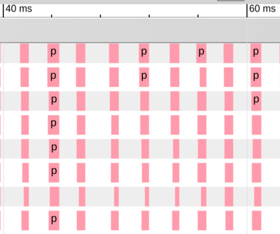<br><em>图 11a：1 个客户端。</em></td>
    <td align="center" width="50%">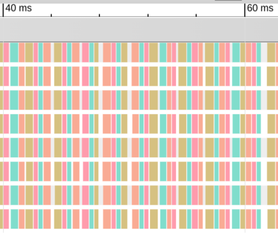<br><em>图 11b：4 个客户端。</em></td>
  </tr>
  <tr>
    <td align="center" width="50%">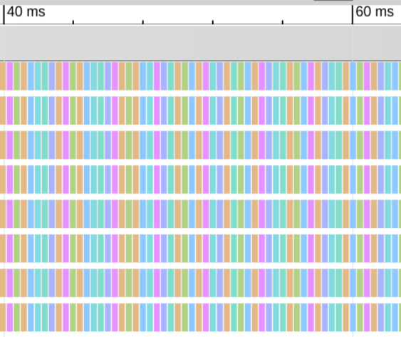<br><em>图 11c：8 个客户端。</em></td>
    <td align="center" width="50%">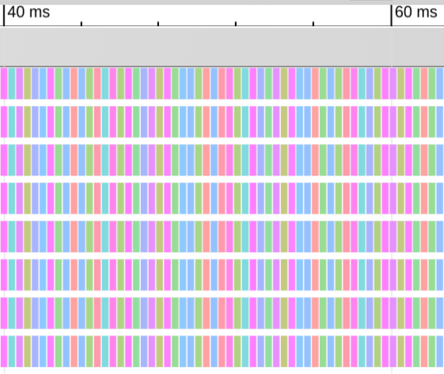<br><em>图 11d：16 个客户端。</em></td>
  </tr>
</table>

<p align="center"><em>图 11：图 8 中 TPU core 样本的 trace。Pathways 显示成组调度的并发程序如何交错。</em></p>

图 12 展示了当 64B Decoder-only Transformer 模型以数据并行方式在两个各 512 个芯片的加速器岛上训练时，多个训练 step 的 trace profile（第 5.3 节）。前 8 行（蓝色）对应第一个岛中一台主机上的 TPU 计算，接下来的 8 行（绿色）对应第二个岛中一台主机上的 TPU 计算。在该场景中，每个岛先计算梯度，然后入队把这些梯度传输到另一个岛。当通过 DCN 的梯度传输完成后，每个岛应用收到的梯度，并开始下一个训练 step。即使在成对 128 台主机的规模下，DCN 传输也只产生很小开销；与使用等量芯片总数、但通过 ICI 通信的 SPMD 配置相比，训练吞吐量达到 97.2%。

<p align="center">
  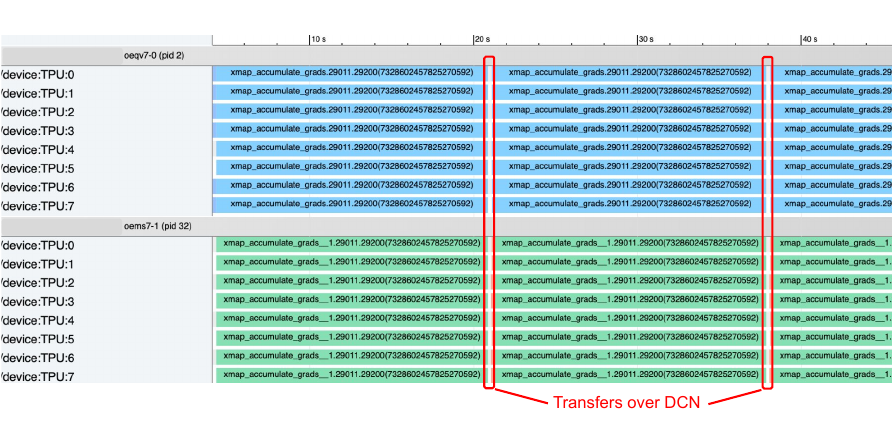
  <br><em>图 12：64B Transformer 模型在两个各 512 个 TPU 的岛上数据并行训练。trace 突出了通过 DCN 进行跨岛传输的开销相对较小。</em>
</p>

## 参考文献

[1] Alex Krizhevsky, Ilya Sutskever, and Geoffrey E. Hinton. ImageNet classification with deep convolutional neural networks. Advances in Neural Information Processing Systems, 2012.

[2] Kaiming He, Xiangyu Zhang, Shaoqing Ren, and Jian Sun. Deep residual learning for image recognition. CVPR, 2016.

[3] Jacob Devlin, Ming-Wei Chang, Kenton Lee, and Kristina Toutanova. BERT: Pre-training of deep bidirectional transformers for language understanding. NAACL-HLT, 2019.

[4] Tom Brown et al. Language models are few-shot learners. Advances in Neural Information Processing Systems, 2020.

[5] Jeff Dean. Introducing Pathways: A next-generation AI architecture. Google AI Blog, 2021.

[6] Lyndon Clarke, Ian Glendinning, and Rolf Hempel. The MPI message passing interface standard. Programming Environments for Massively Parallel Distributed Systems, 1994.

[7] Deepak Narayanan et al. PipeDream: Generalized pipeline parallelism for DNN training. SOSP, 2019.

[8] Jeff Rasley, Samyam Rajbhandari, Olatunji Ruwase, and Yuxiong He. DeepSpeed: System optimizations enable training deep learning models with over 100 billion parameters. KDD, 2020.

[9] Deepak Narayanan et al. Efficient large-scale language model training on GPU clusters using Megatron-LM. arXiv:2104.04473, 2021.

[10] Noam Shazeer et al. Outrageously large neural networks: The sparsely-gated mixture-of-experts layer. ICLR, 2017.

[11] Yanping Huang et al. GPipe: Efficient training of giant neural networks using pipeline parallelism. Advances in Neural Information Processing Systems, 2019.

[12] Dmitry Lepikhin et al. GShard: Scaling giant models with conditional computation and automatic sharding. arXiv:2006.16668, 2020.

[13] William Fedus, Barret Zoph, and Noam Shazeer. Switch Transformers: Scaling to trillion parameter models with simple and efficient sparsity. arXiv:2101.03961, 2021.

[14] Myeongjae Jeon et al. Analysis of large-scale multi-tenant GPU clusters for DNN training workloads. USENIX ATC, 2019.

[15] Shubham Chaudhary et al. Balancing efficiency and fairness in heterogeneous GPU clusters for deep learning. EuroSys, 2020.

[16] Qizhen Weng et al. MLaaS in the wild: Workload analysis and scheduling in large-scale heterogeneous GPU clusters. NSDI, 2022.

[17] Wencong Xiao et al. Antman: Dynamic scaling on GPU clusters for deep learning. OSDI, 2020.

[18] Zhihao Bai, Zhen Zhang, Yibo Zhu, and Xin Jin. PipeSwitch: Fast pipelined context switching for deep learning applications. OSDI, 2020.

[19] Peifeng Yu and Mosharaf Chowdhury. Fine-grained GPU sharing primitives for deep learning applications. Proceedings of Machine Learning and Systems, 2020.

[20] Guanhua Wang, Kehan Wang, Kenan Jiang, Xiangjun Li, and Ion Stoica. Wavelet: Efficient DNN training with Tick-Tock scheduling. Proceedings of Machine Learning and Systems, 2021.

[21] Gangmuk Lim, Jeongseob Ahn, Wencong Xiao, Youngjin Kwon, and Myeongjae Jeon. Zico: Efficient GPU memory sharing for concurrent DNN training. USENIX ATC, 2021.

[22] Shixiong Zhao et al. vPipe: A virtualized acceleration system for achieving efficient and scalable pipeline parallel DNN training. IEEE Transactions on Parallel and Distributed Systems, 2022.

[23] Rishi Bommasani et al. On the opportunities and risks of foundation models. arXiv:2108.07258, 2021.

[24] Neil Houlsby et al. Parameter-efficient transfer learning for NLP. ICML, 2019.

[25] Biao Zhang, Ankur Bapna, Rico Sennrich, and Orhan Firat. Share or not? Learning to schedule language-specific capacity for multilingual translation. ICLR, 2021.

[26] Daniel Crankshaw et al. Clipper: A low-latency online prediction serving system. NSDI, 2017.

[27] Google. Cloud TPU. https://cloud.google.com/tpu, 2021.

[28] Adam Paszke et al. PyTorch: An imperative style, high-performance deep learning library. Advances in Neural Information Processing Systems, 2019.

[29] James Bradbury et al. JAX: Composable transformations of Python+NumPy programs. http://github.com/google/jax, 2018.

[30] Noam Shazeer et al. Mesh-TensorFlow: Deep learning for supercomputers. Advances in Neural Information Processing Systems, 2018.

[31] Akshay Agrawal et al. TensorFlow Eager: A multi-stage, Python-embedded DSL for machine learning. arXiv:1903.01855, 2019.

[32] Denis Foley and John Danskin. Ultra-performance Pascal GPU and NVLink interconnect. IEEE Micro, 2017.

[33] Norman P. Jouppi et al. A domain-specific supercomputer for training deep neural networks. Communications of the ACM, 2020.

[34] Martín Abadi et al. TensorFlow: A system for large-scale machine learning. OSDI, 2016.

[35] Yuan Yu et al. Dynamic control flow in large-scale machine learning. EuroSys, 2018.

[36] Dror G. Feitelson and Larry Rudolph. Gang scheduling performance benefits for fine-grain synchronization. Journal of Parallel and Distributed Computing, 1992.

[37] Jonathan Heek et al. Flax: A neural network library and ecosystem for JAX. http://github.com/google/flax, 2020.

[38] TensorFlow. XLA: Optimizing compiler for TensorFlow. https://www.tensorflow.org/xla, 2019.

[39] Chris Lattner et al. MLIR: Scaling compiler infrastructure for domain specific computation. CGO, 2021.

[40] Tyler Akidau et al. MillWheel: Fault-tolerant stream processing at internet scale. PVLDB, 2013.

[41] Derek Murray, Frank McSherry, Rebecca Isaacs, Michael Isard, Paul Barham, and Martin Abadi. Naiad: A timely dataflow system. SOSP, 2013.

[42] Philipp Moritz et al. Ray: A distributed framework for emerging AI applications. OSDI, 2018.

[43] Woosuk Kwon, Gyeong-In Yu, Eunji Jeong, and Byung-Gon Chun. Nimble: Lightweight and parallel GPU task scheduling for deep learning. Advances in Neural Information Processing Systems, 2020.

[44] Peter Mattson et al. MLPerf: An industry standard benchmark suite for machine learning performance. IEEE Micro, 2020.

[45] Colin Raffel et al. Exploring the limits of transfer learning with a unified text-to-text Transformer. arXiv:1910.10683, 2019.

[46] Mohammad Shoeybi et al. Megatron-LM: Training multi-billion parameter language models using model parallelism. arXiv:1909.08053, 2019.

[47] NVIDIA. NVIDIA GPUDirect technology. http://developer.download.nvidia.com/devzone/devcenter/cuda/docs/GPUDirect_Technology_Overview.pdf, 2021.

[48] Geoffrey E. Hinton, Sara Sabour, and Nicholas Frosst. Matrix capsules with EM routing. ICLR, 2018.

[49] Paul Barham and Michael Isard. Machine learning systems are stuck in a rut. HotOS, 2019.

[50] Sebastian Angel, Hitesh Ballani, Thomas Karagiannis, Greg O'Shea, and Eno Thereska. End-to-end performance isolation through virtual datacenters. OSDI, 2014.

[51] David Wentzlaff et al. An operating system for multicore and clouds: Mechanisms and implementation. ACM Symposium on Cloud Computing, 2010.

[52] Mohammad Shahrad and David Wentzlaff. Availability knob: Flexible user-defined availability in the cloud. ACM Symposium on Cloud Computing, 2016.

[53] Andrew Baumann et al. The multikernel: A new OS architecture for scalable multicore systems. SOSP, 2009.

[54] Deepak Narayanan et al. Heterogeneity-aware cluster scheduling policies for deep learning workloads. OSDI, 2020.

[55] Wencong Xiao et al. Gandiva: Introspective cluster scheduling for deep learning. OSDI, 2018.

[56] Xiaoqi Ren, Ganesh Ananthanarayanan, Adam Wierman, and Minlan Yu. Hopper: Decentralized speculation-aware cluster scheduling at scale. SIGCOMM, 2015.

[57] Kshiteej Mahajan et al. Themis: Fair and efficient GPU cluster scheduling. NSDI, 2020.

[58] Myeongjae Jeon et al. Multi-tenant GPU clusters for deep learning workloads: Analysis and implications. Microsoft Research technical report, 2018.

[59] Hangchen Yu, Arthur Michener Peters, Amogh Akshintala, and Christopher J. Rossbach. AvA: Accelerated virtualization of accelerators. ASPLOS, 2020.

[60] Vishakha Gupta, Karsten Schwan, Niraj Tolia, Vanish Talwar, and Parthasarathy Ranganathan. Pegasus: Coordinated scheduling for virtualized accelerator-based systems. USENIX ATC, 2011.

[61] Nandita Vijaykumar et al. Zorua: A holistic approach to resource virtualization in GPUs. MICRO, 2016.

[62] Minsoo Rhu et al. vDNN: Virtualized deep neural networks for scalable, memory-efficient neural network design. MICRO, 2016.

[63] Rachata Ausavarungnirun et al. Mask: Redesigning the GPU memory hierarchy to support multi-application concurrency. ACM SIGPLAN Notices, 2018.

[64] Samyam Rajbhandari, Olatunji Ruwase, Jeff Rasley, Shaden Smith, and Yuxiong He. ZeRO-Infinity: Breaking the GPU memory wall for extreme scale deep learning. arXiv:2104.07857, 2021.

[65] Vineet Gupta, Tomer Koren, and Yoram Singer. Shampoo: Preconditioned stochastic tensor optimization. ICML, 2018.

[66] Bowen Yang et al. Pipemare: Asynchronous pipeline parallel DNN training. Proceedings of Machine Learning and Systems, 2021.

[67] Zhihao Jia, Sina Lin, Mingyu Gao, Matei Zaharia, and Alex Aiken. Improving the accuracy, scalability, and performance of graph neural networks with Roc. Proceedings of Machine Learning and Systems, 2020.

[68] Hieu Pham, Melody Guan, Barret Zoph, Quoc Le, and Jeff Dean. Efficient neural architecture search via parameter sharing. ICML, 2018.

[69] Jiaqi Ma, Zhe Zhao, Xinyang Yi, Jilin Chen, Lichan Hong, and Ed H. Chi. Modeling task relationships in multi-task learning with multi-gate mixture-of-experts. KDD, 2018.

[70] Zhe Zhao et al. Recommending what video to watch next: A multitask ranking system. ACM Conference on Recommender Systems, 2019.

[71] David Kirk. NVIDIA CUDA software and GPU parallel computing architecture. ISMM, 2007.

[72] Christopher J. Shallue et al. Measuring the effects of data parallelism on neural network training. arXiv:1811.03600, 2018.

[73] Yang You, Igor Gitman, and Boris Ginsburg. Large batch training of convolutional networks. arXiv:1708.03888, 2017.

[74] Jack Lanchantin, Arshdeep Sekhon, and Yanjun Qi. Neural message passing for multi-label classification. Machine Learning and Knowledge Discovery in Databases, 2020.

[75] Rohan Anil, Vineet Gupta, Tomer Koren, Kevin Regan, and Yoram Singer. Scalable second order optimization for deep learning. arXiv:2002.09018, 2021.

[76] Maxim Naumov et al. Deep learning training in Facebook data centers: Design of scale-up and scale-out systems. arXiv:2003.09518, 2020.

[77] Tianqi Chen et al. TVM: An automated end-to-end optimizing compiler for deep learning. OSDI, 2018.

[78] TensorFlow. TensorFlow Datasets: A collection of ready-to-use datasets. https://www.tensorflow.org/datasets, 2021.
