# REPS：用于自适应负载均衡与故障缓解的回收熵包喷洒

原题：REPS: Recycled Entropy Packet Spraying for Adaptive Load Balancing and Failure Mitigation

年份：2026

会议：EUROSYS '26，2026 年 4 月 27-30 日，Edinburgh, Scotland, UK

作者：
- ETH Zürich：Tommaso Bonato、Lukas Gianinazzi、Mikhail Khalilov、Elias Achermann、Torsten Hoefler
- Microsoft：Tommaso Bonato、Abdul Kabbani、Ahmad Ghalayini、Michael Papamichael、Mohammad Dohadwala、Torsten Hoefler
- Sapienza University of Rome：Daniele De Sensi

备注：Michael Papamichael、Mohammad Dohadwala 的工作完成于 Microsoft；二人之后已离开该公司。

## 摘要

下一代数据中心需要更高效的网络负载均衡，以支撑不断扩大的人工智能训练流量和通用数据中心流量。已有的以太网方案，例如 ECMP 和 oblivious packet spraying，随着流量需求和拓扑规模增长，很难长期保持高网络利用率；同时，拓扑规模越大，网络故障的影响也越明显。

为了解决这些限制，本文提出 REPS，即 Recycled Entropy Packet Spraying。REPS 是一个轻量级、去中心化、逐包粒度的自适应负载均衡算法。它通过缓存表现良好的网络路径来适应网络状态，在链路故障发生时，可以在 100 微秒以内把流量从故障路径上迁移出去。REPS 面向下一代支持乱序交付的传输协议，例如 Ultra Ethernet；无论拓扑规模多大，每个连接只需要少于 25 字节状态。论文通过大规模仿真和基于 FPGA 的 NIC 实验评估 REPS。

关键词：load balancing；packet spraying；out-of-order transport；RDMA；Ultra Ethernet

## 1. 引言

现代 AI 训练集群网络同时吸收了 HPC 网络和云原生网络的设计经验 [1][2][3]。这些系统依赖 RDMA 来获得低延迟和高吞吐。InfiniBand 是专用 RDMA 传输，性能强，因此广泛用于训练集群 [4]；同时，越来越多系统采用基于商用以太网的 RoCEv2，以便用现成交换机和 NIC 降低成本 [5]。

问题在于，当训练集群从约 1 万个端点扩展到 10 万个以上端点时，InfiniBand 和 RoCEv2 都会遇到维持峰值带宽的根本困难。原因主要有两个：

1. 训练中的 collective 通信比传统工作负载流量更大、更突发 [6][7][8][9]。
2. 在大规模、无损、有序网络中管理拥塞、故障和性能退化的复杂度很高 [3]。

因此，业界开始提出面向分布式训练流量、同时兼容商用数据中心以太网的新网络栈，例如 Amazon SRD、Google Falcon、Tesla TTPoE 和 Ultra Ethernet [10][11][12][13]。这些方案中仍然有两个关键问题：如何做负载均衡，以及如何缓解链路故障。

当前基于有序以太网的训练系统通常依赖 ECMP。ECMP 对五元组做哈希，为同一个流选择一条路径，因此可以保持包内顺序 [14]。但 ECMP 的弱点也很直接：如果多个流被哈希到同一条链路，即使其他链路空闲，也会产生队列堆积、拥塞、丢包和 go-back-N 重传 [15][16][17]。

链路故障对训练任务尤其昂贵。已有工作指出，单个链路故障对分布式训练工作负载的成本影响可以比云工作负载高约 20 倍 [2][3]。随着系统规模扩大，传输层和负载均衡机制必须能在几个 RTT 内适应网络故障以及拓扑带宽不对称。

已有方案各有局限。MPTCP、PLB、FlowBender、Flowlet Switching 和 Flowcell 会把流拆成子流或 flowlet，再分别路由 [18][19][20][21][22]。这些方案仍然面向有序网络，对碰撞敏感，故障处理慢，而且每连接状态较多 [23]。OPS 和 MPRDMA 这种逐包粒度负载均衡可以缓解 ECMP 碰撞，但在网络故障下缺少有效机制；MPRDMA 还受限于乱序接收支持和逐包 ACK 开销 [23][24]。

本文的核心洞察是：如果传输层天然支持乱序交付，那么逐包喷洒不一定必须是盲目的。可以把 packet spraying 做成自适应的：缓存“好路径”，避免拥塞或故障路径。REPS 正是这个思路。它使用一个循环缓冲区缓存表现良好的 Entropy Value，并在故障时通过发现或冻结路径快速恢复。Ultra Ethernet 1.0 规范也把 REPS 明确列为 UET 的参考负载均衡机制 [25][26][27]。

  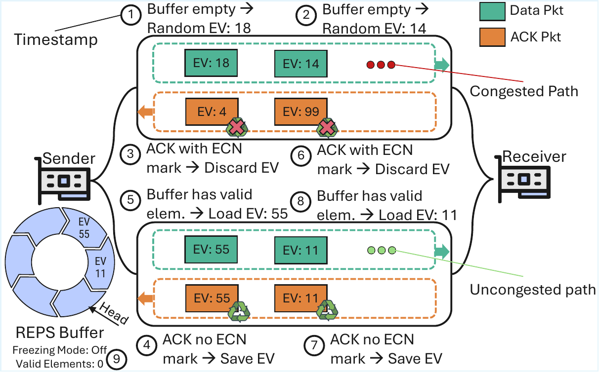
   
  <em>图 1：REPS 示意图。图中没有展示循环缓冲区中 EV 55 和 EV 11 使用后的失效过程。</em>

REPS 不要求交换机支持特殊硬件，只需要现代交换机已有的 ECMP 哈希和 ECN 标记 [17][28]。它每个连接只需要约 25 字节状态，而 MPTCP 使用 8 个子流时需要额外 368 字节 [23]。

论文在仿真和真实 FPGA NIC 上评估 REPS。在大规模网络仿真中，REPS 在对称网络下相比 ECMP 和 OPS 分别最高提升 6 倍和 1.25 倍；在非对称网络下分别最高提升 5 倍和 2 倍；在短时瞬态链路故障中，相比 OPS 最高提升可达 100 倍。

## 2. REPS 的基础组件

### 2.1 拥塞信号

**ECN 标记。** ECN 允许交换机在 IP 头部 traffic class 字段里标记拥塞。接收端会把这个 ECN 位通过 ACK 返回给发送端，发送端再据此调整发送速率 [29][30][31][32]。例如 RED 会根据队列长度在两个阈值之间概率性标记包 [33]。

REPS 使用 ECN 作为检测路径拥塞的主要信号。ECN 简单且部署广泛 [17][28]。由于队列小于 $K_{min}$ 时不会标记 ECN，ECN 可以过滤掉多跳轻微队列碰撞，把注意力集中到真正的瓶颈拥塞上。相比之下，基于 delay 的信号如果没有 INT 等高级交换机特性，就更难区分这些情况 [34]。

**丢包。** 丢包长期以来是严重拥塞的重要信号 [33][35]。但如果只用丢包检测拥塞，反应会偏慢，因为丢包通常意味着拥塞已经很重。REPS 把丢包分成两类：拥塞导致的丢包，以及网络故障导致的丢包。为了区分二者，可以使用 packet trimming：拥塞丢包触发 trimming，故障丢包则更可能表现为 timeout [36][37][38][39][40][41]。当前网络上 REPS 可以用 timeout 部署；下一代网络中可以结合 trimming 提升故障判断能力。

**拥塞控制。** CC 算法依赖 ECN 或丢包等信号调节发送窗口或发送速率，目标是在防止队列堆积的同时保持高利用率。REPS 可以与多种 CC 算法配合，只要该 CC 不会因为同一消息内乱序包而过度反应。论文后续展示 REPS 可以与 EQDS、DCTCP 变体以及内部专有 CC 算法配合 [31][39]。

### 2.2 负载均衡概念

**ECMP。** ECMP 是最常见的负载均衡机制之一，通过哈希在可用路径中选择一条路径。典型哈希输入是五元组：协议号、源地址、目的地址、源端口、目的端口 [14]。有些方案还会把 TTL 或 IPv6 Flow Label 放进哈希 [19][20]。

ECMP 在正常情况下会把同一流静态映射到同一路径，因为同一流的哈希输入不变。这种静态映射不会观察当前拥塞和故障状态。因此，多个流可能碰撞到同一路径，造成拥塞和丢包。这就是 ECMP hash collision [3][16][42]。

**Entropy Value。** EV 是包头中可以被配置为 ECMP 哈希输入的一个值，由发送端设置，用来影响包经过的路径。EV 可以使用 UDP 源端口，也可以使用 IPv6 Flow Label [19][20][21][23]。REPS 利用 EV 来改善负载均衡，并不需要知道“某个 EV 到底映射到哪条物理路径”。只要交换机哈希函数设计合理，不同 EV 诱导出的路径分布就应该接近均匀随机。

**Entropy Values Set。** EVS 是可选 EV 的固定集合。比如 UDP 源端口有 16 bit，因此理论上有 65536 个可选值。EVS 越大，越容易覆盖更多路径，但状态或实现复杂度可能上升。论文后续会分析 EVS 需要多大才能达到接近最优的效果。

**OPS。** Oblivious Packet Spraying，也叫 Random Packet Spraying，会把每个包随机分散到所有可用路径上 [24]。它能减少 ECMP 的流级碰撞，但不知道哪些路径拥塞、哪些路径故障，因此在非对称网络和故障场景下会明显变差。论文还指出，即使在完全对称网络中，OPS 也可能因为短时间随机碰撞产生队列。

## 3. REPS

REPS 的完整名称是 Recycled Entropy Packet Spraying。它是一个端侧负载均衡算法，核心思想很简单：当某条路径表现好，就缓存对应 EV 并复用；当路径出现拥塞，就探索其他 EV；当怀疑网络故障时，就进入 freezing mode，避免继续随机探索可能映射到故障路径的 EV。

REPS 只需要一个固定大小循环缓冲区来缓存未拥塞路径的 EV。它可以实现在 NIC 硬件或固件中，内存和面积开销都很小；交换机侧除了 ECMP 哈希和 ECN 标记，不需要额外功能。

### 3.1 核心逻辑：路径探索与复用

对于新连接或长时间空闲后的连接，REPS 在第一个 BDP 范围内先随机探索 EVS 中的 EV。这个阶段没有新鲜的网络状态知识，因此行为接近 OPS。

当接收端收到数据包时，会把这个包使用的 EV 复制到 ACK 中返回给发送端。ACK 可以直接复用该 EV 作为自己的头部字段，因此不需要新的包头字段。

发送端收到 ACK 后：

- 如果 ACK 没有 ECN 标记，说明该 EV 对应路径表现良好，将其写入循环缓冲区，并把 valid bit 设置为 1。
- 如果 ACK 带 ECN 标记，说明路径拥塞，不缓存该 EV。
- 发送下一个数据包时，如果缓冲区里有 valid EV，则复用最旧的 valid EV，并把它标记为 invalid。
- 如果没有 valid EV，则从 EVS 中随机探索一个新 EV。

循环缓冲区的作用是缓存突发 ACK 中返回的一批好 EV，同时在故障场景下维持稳定的路径集合。论文基于经验和定理 1 的界限，使用 8 个元素的循环缓冲区。

**算法 1：收到 ACK 与检测故障时的 REPS 逻辑**

| 事件 | 逻辑 |
| --- | --- |
| 初始化 | `repsBuffer=[]`，`isFreezingMode=false`，`head=0`，`numberOfValidEVs=0`，`exploreCounter=0` |
| 收到 ACK 且 ACK 带 ECN | 直接返回，不缓存该 EV |
| 收到 ACK 且 ACK 不带 ECN | 把 `ackPacket.ev` 写入 `repsBuffer[head]`，设为 valid，更新 `head` |
| freezing mode 到期 | 退出 freezing mode，并设置一个短暂的探索计数器 |
| 检测到故障 | 如果当前不在 freezing mode 且探索计数器为 0，则进入 freezing mode，并设置退出时间 |

**算法 2：发送数据包时的 REPS 逻辑**

| 条件 | 发送时选择的 EV |
| --- | --- |
| `exploreCounter > 0` | 每隔 `REPS_BUFFER_SIZE` 个包随机选择一个新 EV |
| 缓冲区为空，或没有 valid EV 且不在 freezing mode | 从 EVS 随机选择 EV |
| 有 valid EV | 复用最旧的 valid EV |
| 在 freezing mode 且没有 valid EV | 循环复用缓冲区已有 EV，即使它们已经被标为 invalid |

### 3.2 故障缓解：Freezing Mode

如果网络没有 REPS，发生链路 flap、链路故障或交换机故障后，系统可能需要数毫秒更新 ECMP routing group；如果需要重启或替换设备，时间会更长 [43][44]。在恢复期间，ECMP 仍可能把包发往故障路径。

假设需要 10 ms 才能把故障线缆从 routing group 中排除，在 4 KiB MTU 和 400 Gbps 链路下，理论上会有超过 12 万个包，也就是约 0.5 GB 数据，被继续送往故障路径并丢失。

REPS 的默认核心逻辑已经会减少故障路径使用，因为只有还能返回无 ECN ACK 的路径才会被回收。但如果缓冲区为空，它仍可能随机选到故障路径。因此论文引入 freezing mode。

进入 freezing mode 后，REPS：

1. 不再随机探索新 EV，因为新 EV 可能映射到故障路径。
2. 复用循环缓冲区里已有的 EV，即使这些 EV 的 valid bit 已经被清掉。

这可能略微牺牲负载均衡，因为同一批 EV 会被重复使用；但好处是显著降低再选到故障路径的概率。对于前面的 10 ms 故障例子，启用 freezing mode 后，丢包数可以从 12 万以上降到约 1000。

退出 freezing mode 有两种方式：一种是发送 probe 包测试故障路径是否恢复；另一种是在没有 probing 的情况下，固定时间后退出。退出后，REPS 会偶尔使用随机 EV 重新探索，避免长期卡在次优路径集合里。如果故障未恢复，REPS 会很快再次进入 freezing mode。

### 3.3 REPS 的设计优势

**算法简单且通用。** REPS 不修改包头格式，也不要求修改现有交换机。代码短，适合 NIC 硬件或固件实现。它最适合逐包 ACK，但在 ACK coalescing 下也能工作。虽然论文主要讨论 fat-tree，作者认为 REPS 也能适配 Dragonfly、HammingMesh 等拓扑 [45][46]。如果使用 source routing，REPS 缓存的可以不是 EV，而是实际 path ID。

**NIC 内存占用极小。** REPS 不维护每个 EV 的统计量。假设 EVS 有 64K 个值，如果每个 EV 存 1 bit 状态，也要 64 Kib；而 REPS 只需要固定大小状态。8 元素缓冲区时每连接约 193 bit，也就是约 25 字节。

<table>
  <thead>
    <tr>
      <th align="left">组件</th>
      <th align="right">占用 bit 数</th>
    </tr>
  </thead>
  <tbody>
    <tr><td align="left">循环缓冲区元素：cachedEV</td><td align="right">16</td></tr>
    <tr><td align="left">循环缓冲区元素：isValid</td><td align="right">1</td></tr>
    <tr><td align="left">全局变量：head</td><td align="right">8</td></tr>
    <tr><td align="left">全局变量：numberOfValidEVs</td><td align="right">8</td></tr>
    <tr><td align="left">全局变量：exitFreezingMode</td><td align="right">32</td></tr>
    <tr><td align="left">全局变量：isFreezingMode</td><td align="right">1</td></tr>
    <tr><td align="left">全局变量：exploreCounter</td><td align="right">8</td></tr>
    <tr><td align="left">1 个缓冲区元素总计</td><td align="right">74，约 10 字节</td></tr>
    <tr><td align="left">8 个缓冲区元素总计</td><td align="right">193，约 25 字节</td></tr>
  </tbody>
</table>

<em>表 1：REPS 每连接内存占用。</em>

还有一个重要观察：REPS 的很多状态其实不在 NIC 内存里，而是在“线上”的 data packet 和 ACK packet 中。飞行中的包和 ACK 会持续把好路径信息带回来。

**故障缓解快。** REPS 只追踪好路径，不记录坏路径。这样它可以快速从拥塞或故障链路上迁移。相反，如果一个算法试图记录坏 EV，就需要记录所有映射到故障路径的 EV，包括还在飞行中的 EV，NIC 内存开销会很大。

## 4. 评估

论文用大规模仿真和真实 FPGA NIC 实验评估 REPS，关注四个问题：

1. 在健康对称网络中，REPS 是否优于现有负载均衡器？
2. 在拓扑非对称或与非 REPS 流量共存时，REPS 表现如何？
3. REPS 是否能快速从故障中恢复？能否处理严重故障？
4. REPS 在不同 ACK coalescing、EVS 大小、CC 算法和拓扑规模下是否稳定？

### 4.1 评估设置

**基线负载均衡器。** 仿真中比较 REPS、ECMP、OPS、PLB、MPRDMA、Flowlet Switching、MPTCP-like 算法、类似 STrack 的 per-EV bitmap 方法，以及 NVIDIA Adaptive RoCE [14][19][21][23][24][26][47]。

**拥塞控制。** 仿真中所有基线使用同一个 DCTCP 变体，它允许接收端乱序接收和 ACK，并在丢包时把拥塞窗口降低一个 MTU。FPGA 实验中使用基于 ECN、拥塞通知包和 per-flow cwnd 调整的内部专有 CC。

**网络设置。** 论文测试三类场景：健康对称网络、非对称网络、网络故障。仿真基于 htsim packet-level 模拟器 [38]，使用 1024 节点和 128 节点 fat-tree，oversubscription 从 1:1 到 4:1；测试 2 层和 3 层 fat-tree。链路和交换机参数反映当前交换机：4 KiB MTU、400 Gbps、交换机 traversal latency 500 ns、链路 latency 500 ns [48][49][50]。RTO 设置为 70 微秒。每个队列的 $K_{min}$ 为队列大小 20%，$K_{max}$ 为 80%。

**REPS-FPGA。** 论文还在修改过的生产级 FPGA RDMA NIC 上实现 REPS。该传输协议支持乱序包，并通过 RDMA 直接把 payload 放入内存。SACK 携带 256-bit bitmap 跟踪完成状态和选择性重传。每连接有 8-entry REPS buffer，保存 UDP 源端口。实验最多支持 256 个连接，总 REPS buffer 占用 4KB。由于同时只有一个连接活跃，所有 buffer 可以放在一块 SRAM 中复用，逻辑资源占用低于 0.04%。硬件 testbed 是两层 fat-tree 以太网，100G NIC 和 12.8T 交换机，FPGA NIC 默认 MTU 是 8KB。

### 4.2 工作负载

**合成 benchmark。** 包括 incast、permutation 和 tornado。Incast 是多个发送端同时发给一个接收端，常见于存储和训练场景 [3][51][52]。Permutation 中每个节点随机选择一个接收端，并保证每个节点正好发送和接收一个流 [31]。Tornado 是 permutation 的特殊情况，每个节点发送给树另一半的“孪生节点”，是负载均衡的 worst case，因为每个包都必须穿越完整树 [53]。

**数据中心 trace。** 使用已有工作中的真实数据中心 trace，主要是生产 WebSearch trace [31][54]。多数 flow 很小，少量 flow 很大。

**AI collective。** 评估 AllReduce 和 AllToAll。AllReduce 使用 ring 和 butterfly；AllToAll 限制每节点并行连接数 [8][46][55]。FPGA 基线流量是 128 个端点在两个 T0 交换机下持续做 4 MB ring AllReduce，并让逻辑 ring 尽量经过 T1 spine，以压测 spine。

### 4.3 仿真结果：健康对称网络

直觉上，完全对称且无故障的网络应该最适合 OPS，因为随机把包均匀喷到多条链路上即可。但论文发现，即使在这种场景下，REPS 仍然最高可比 OPS 快 25%。原因是 OPS 的随机选择在短时间尺度仍然会碰撞，产生队列；虽然长期看每条链路使用率接近均匀，但短期队列会触发 CC，降低利用率。

  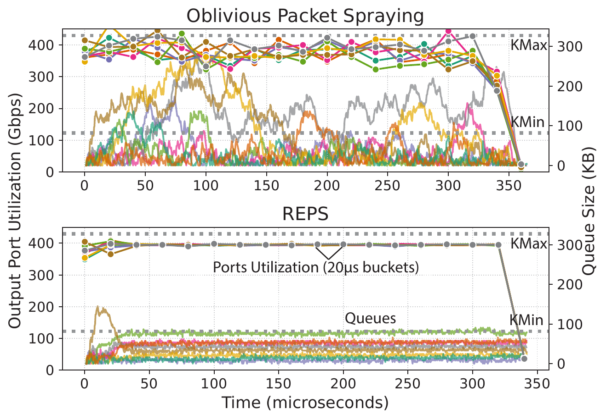
   
  <em>图 2：16 MiB tornado 工作负载下 OPS 与 REPS 的负载均衡表现；上图为 OPS，下图为 REPS。</em>

在微观分析中，论文观察一个 T0 交换机的 uplink 利用率和队列长度。OPS 会因为随机性让端口短时利用率上下波动，部分时间高于 400 Gbps，造成排队；REPS 很快收敛到每个队列都低于 $K_{min}$ 的状态，并让所有端口趋近 400 Gbps 的理想选择率。单次完成时间只比 OPS 快约 4%，但队列更小，对低延迟流量更友好；随着 message size 增大，差距会扩大。

  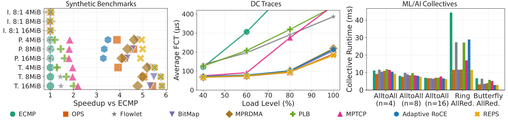
   
  <em>图 3：REPS 在合成 benchmark、数据中心 trace 和 AI collective 上的整体表现。I 表示 Incast，P 表示 Permutation，T 表示 Tornado。</em>

宏观分析中，incast 主要受 CC 支配，因此各负载均衡算法差异不大；permutation 和 tornado 开始明显暴露 ECMP collision。多数情况下，REPS 优于其他算法。Tornado 中 Adaptive RoCE 能匹配 REPS，因为这是它的理想场景；但在 permutation 中，局部最优决策不一定带来全局最优，REPS 更稳。AllReduce 因 ring 结构本身不容易堆积拥塞，多数算法表现接近；AllToAll 中 REPS 最高有约 20% 优势。

### 4.4 仿真结果：非对称网络

论文考虑两类非对称：一是部分线缆缺失或降速；二是网络中存在 background ECMP traffic，也就是 REPS 与非 REPS 流量共存。

  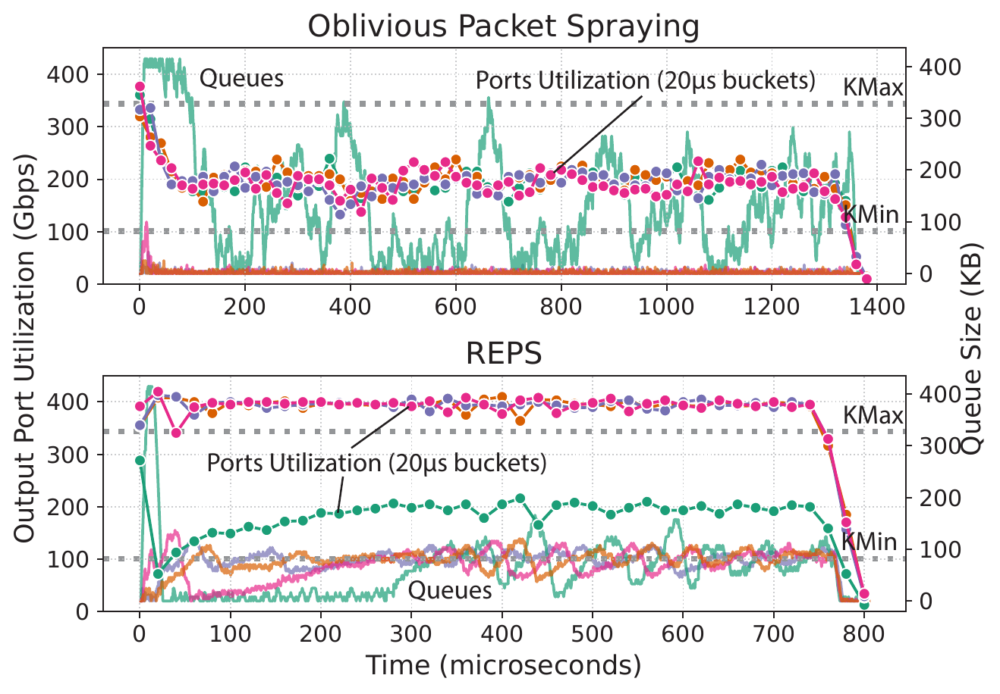
   
  <em>图 4：32 MiB 消息发送中，非对称拓扑下 REPS 与 OPS 的对比。</em>

微观例子里，一个交换机有 $n$ 个输入端口和 $n$ 个输出端口，$n$ 个 flow 同时活跃。为了制造非对称，论文把一条 uplink 从 400 Gbps 降到 200 Gbps。OPS 仍然等概率选择所有端口，因此会过度使用慢链路；REPS 会逐渐收敛到更少使用慢链路的稳定配置。该实验中 OPS 完成时间是 1400 微秒，REPS 是 799 微秒。

  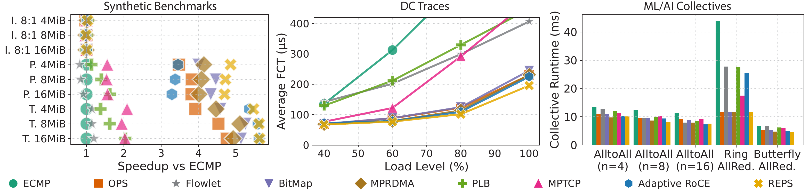
   
  <em>图 5：3% TOR uplink 降速导致非对称网络时，REPS 在合成 benchmark、数据中心 trace 和 AI collective 上的表现。</em>

宏观结果中，随机选择 3% TOR uplink 降到 200 Gbps。REPS 相比 ECMP 最高可快 500%，相比第二名算法通常也有约 10% 优势。在数据中心 trace 的 100% 负载下，REPS 相比第二名有 25% 优势，相比 ECMP 有 1000% 优势。AllToAll 中 REPS 保持小但显著的优势；AllReduce 中相比第二名约有 30% 优势。

  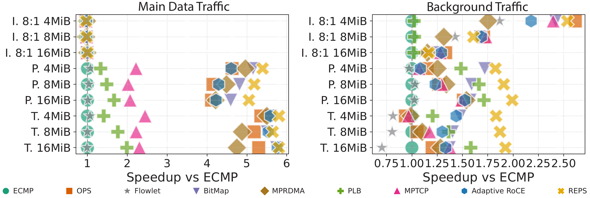
   
  <em>图 6：混合流量场景，REPS 流量与非 REPS 的 ECMP 背景流量共存。</em>

混合流量中，论文假设 10% 流量是 ECMP。REPS 会主动把自己的流量从 ECMP 背景流量所在路径上移开，既避免 REPS 被拖慢，也避免 REPS 拖慢背景流量。这说明 REPS 可以渐进部署在已有 ECMP 系统中。WCMP 可以处理已知非对称，但对不可预测背景流量或突发临时非对称帮助有限 [56]。

### 4.5 仿真结果：网络故障

论文根据已有故障研究和内部日志，模拟最常见故障，包括线缆和交换机的完全或部分故障 [57][58][59]。由于短仿真中自然发生故障概率较低，论文强制在运行期间插入 worst-case 故障，但保证故障组件不会让工作负载彻底无法完成。

  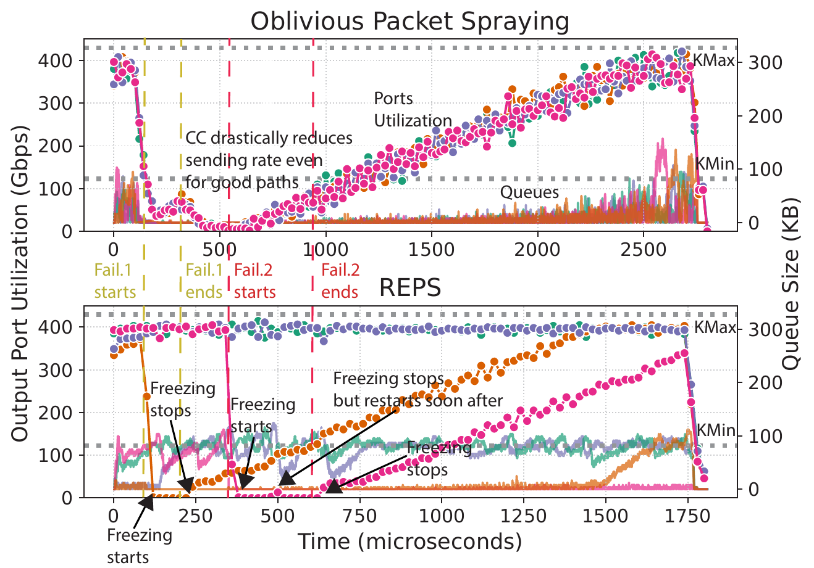
   
  <em>图 7：64 MiB permutation 中，发生两次线缆故障时 REPS 与 OPS 的对比。</em>

微观实验中，两个 TOR uplink 在不同时间故障：第一个从 100 微秒开始持续 100 微秒，第二个从 350 微秒开始持续 200 微秒。OPS 仍然等概率选择所有路径，只能依赖 CC 降速；REPS 进入 freezing mode 后，在一个 timeout 量级内停止选择故障路径。故障结束后，REPS 退出 freezing mode 并重新收敛到使用所有路径。相比 OPS，REPS 完成时间快 35% 以上，丢包减少 2.5 倍。

  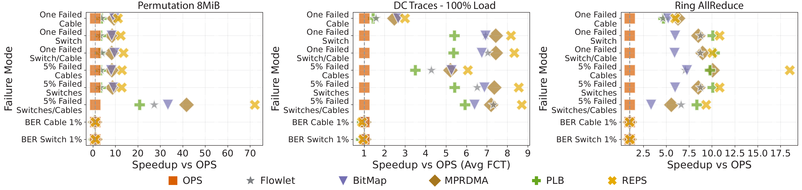
   
  <em>图 8：8 MiB permutation、100% 负载 DC trace 和 ring AllReduce 中，不同故障模式下 REPS 的表现。</em>

宏观分析中，REPS 在 total failure 下相比 OPS 和其他负载均衡算法都有明显优势，原因就是 freezing mode 可以让 REPS 使用缓存中的安全路径集合，响应速度远快于 ECMP routing 收敛。故障越多，REPS 的收益越大。随机丢包不会明显影响 REPS。MPRDMA 由于 self-clocking，平均表现也不错。

  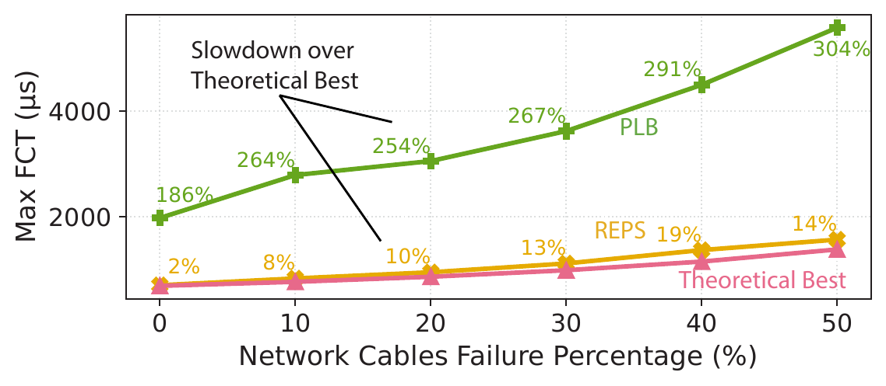
   
  <em>图 9：极端故障场景。</em>

在极端且不太可能发生的场景中，permutation 期间出现越来越多、持续越来越久的网络故障。即使 50% 网络线缆故障，REPS 仍接近理想负载均衡器；第二名 PLB 明显落后。这个实验说明 REPS 对短故障、长故障以及灾难性高故障率都有较好韧性。

### 4.6 REPS-FPGA 评估

硬件实验首先关注健康对称网络。论文用 OPS 与 REPS 比较两种配置：setup-1 中两个 T0 下所有 FPGA 端点都活跃；setup-2 中 64 个端点里有 40 个活跃。实验发现，当使用所有交换机端口并接近峰值性能时，交换机微架构细节会带来小幅性能变化，例如端口-buffer affinity 和厂商调度策略。限制 FPGA NIC 发送速率到 95 Gbps 后，setup-1 中 REPS 的轻微退化会消失。

<table align="center">
  <tr>
    <td align="center">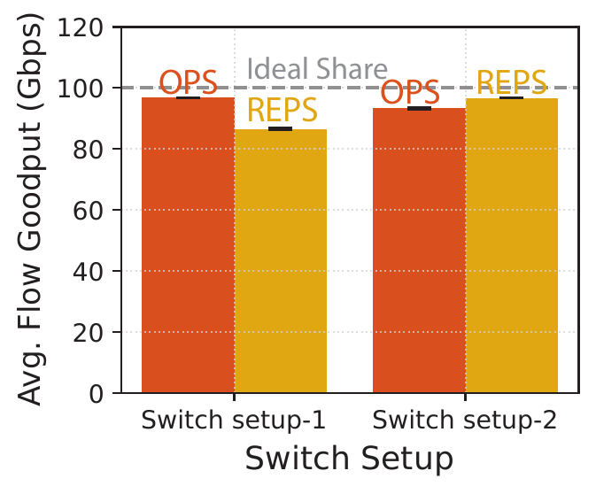 <em>(a) 对称网络</em></td>
    <td align="center">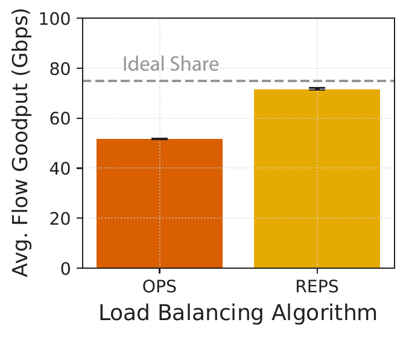 <em>(b) 非对称网络</em></td>
  </tr>
</table>

<em>图 10：REPS-FPGA 对 goodput 的影响。</em>

非对称硬件实验中，16 个端点通过两个 T0 交换机连接，每个 T0 有 8 个端点，总共有 4 条链路连接到一对 T1 交换机。论文把一条 T0-T1 链路从 400 Gbps 降到 200 Gbps。OPS 仍等概率发往所有路径，包括 200 Gbps 慢链路；慢链路上的 ECN 让 CC 限制所有 flow，导致其他 400 Gbps 链路只跑到约 50% 利用率。REPS 会根据缓存中的 EV 自然偏向高容量路径，平均 per-flow goodput 距离理想 fair-share 目标不超过 5%。

<table align="center">
  <tr>
    <td align="center">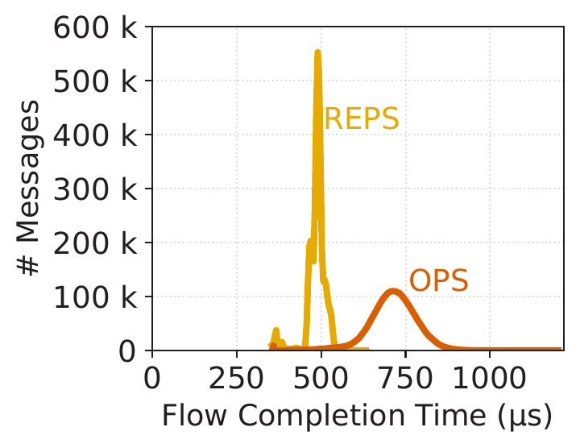 <em>(a) 非对称网络</em></td>
    <td align="center">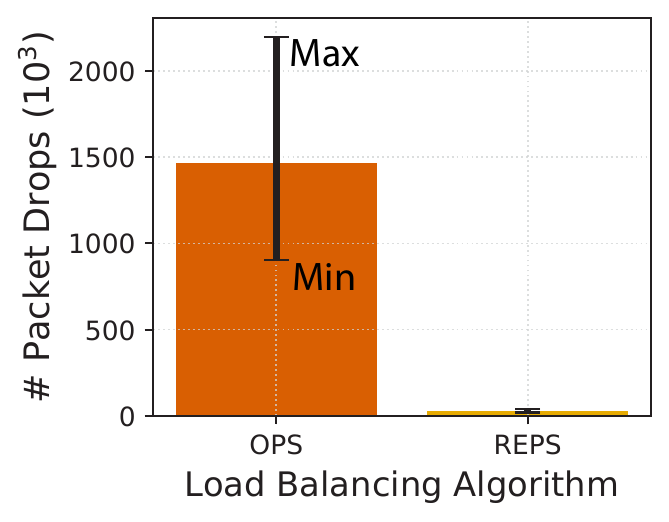 <em>(b) 链路故障</em></td>
  </tr>
</table>

<em>图 11：REPS-FPGA 对 FCT 与丢包的影响。</em>

链路故障硬件实验中，128 个端点分布在 2 个 T0 下，并通过 8 个 T1 连接。实验中突然关闭一条 T0-T1 链路。网络恢复该事件可能需要数百毫秒；OPS 在这段时间仍会向受影响路径发包。REPS 的 freezing mode 可以在一个 RTO 量级内适应故障，并从健康路径返回的 ACK 中补充 entropy cache，显著减少丢包。

### 4.7 REPS 的适用性

#### ACK Coalescing

论文主要在无 ACK coalescing 的情况下评估 REPS，因为这样反馈最新。但有些传输协议会每收到 $n$ 个数据包才发一个 ACK。理论上，coalesced ACK 可以携带之前所有未 ECN 标记的 EV，称为 ACK+Carry EVs；另一种做法是给每个 EV 设置 lifespan，让它在 REPS buffer 中复用 $n$ 次，称为 ACK+Reuse EVs。

  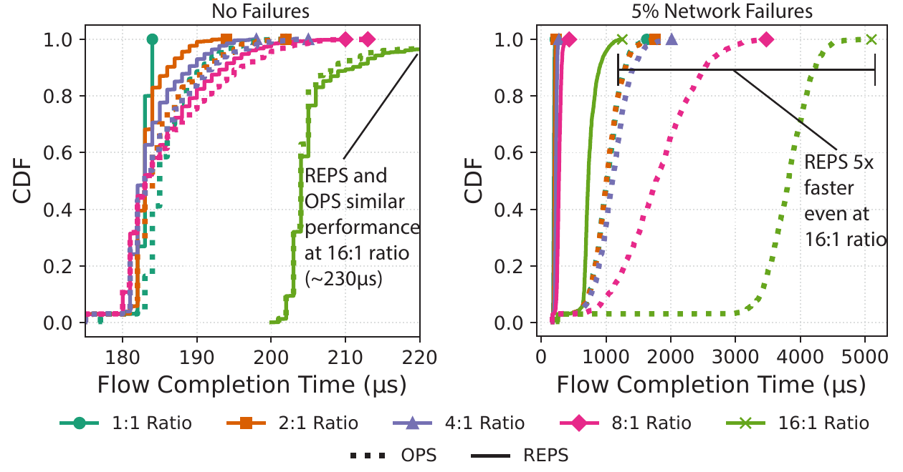
   
  <em>图 12：8 MiB permutation 中，不同 ACK coalescing ratio 下的性能。</em>

标准 REPS 在 2:1、4:1、8:1 ACK coalescing 下仍明显优于 OPS；16:1 时优势开始下降。但在非对称或故障场景下，即使 16:1，REPS 仍明显更好。附录中的理论模型也支持这一点。

  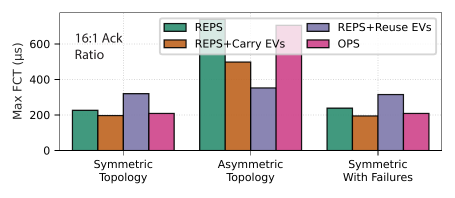
   
  <em>图 13：ACK coalescing 下的不同 REPS 变体。</em>

图 13 表明，高 coalescing ratio 下，Carry EVs 和 Reuse EVs 是更好的变体。论文把更完整的扩展留给未来工作。作者也指出，如果硬件能承受 ACK 速率，且对网络流量影响很小，发送更多 ACK 是值得的；该影响大约在 1% 左右。

#### EVS 大小

实践中，哈希函数会把 EV 映射到输出端口。论文先从理论上，再用仿真说明：EVS 太小会造成明显负载不均衡；$2^{16}$ 个 EV 已经非常接近均匀随机。

作者用 balls-into-bins 模型来分析：$m$ 个 ball 均匀随机扔到 $n$ 个 bin。最大负载是 $l(m,n)$，负载不均衡定义为：

$$
\lambda_{m,n}=\frac{l(m,n)}{m/n}-1
$$

在这里，输出端口对应 bin，EV 对应 ball。若 $m=n$，最大负载不均衡为 $\Theta(\frac{\log n}{\log\log n})$；如果 $m/n \gg \log n$，负载不均衡会以高概率趋近于 0 [60]。

<table align="center">
  <tr>
    <td align="center">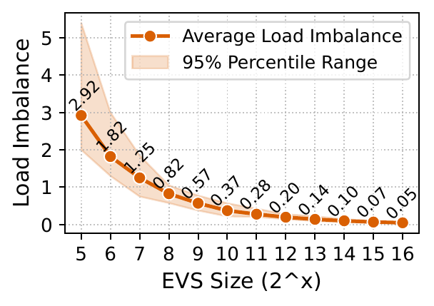 <em>(a) 1 个 flow 活跃</em></td>
    <td align="center">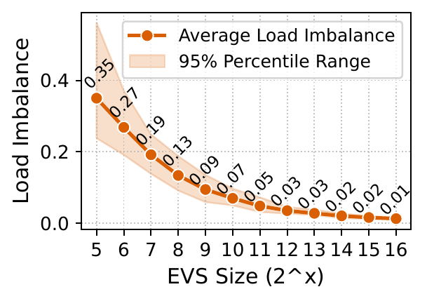 <em>(b) 32 个 flow 活跃</em></td>
  </tr>
</table>

<em>图 14：32 条 uplink 的交换机上，期望负载不均衡。</em>

仿真表明，32 个 flow 下，如果 EV 少于 $2^8$，负载不均衡可能超过 10%；$2^{16}$ 个 EV 可以把不均衡压到 1% 以内。另一方面，REPS 由于是自适应的，即使 EVS 更小也能工作。图 15 左图显示，REPS 使用 256 和 64K EV 时表现几乎一样，使用 32 EV 时只慢 8%；OPS 使用 256 和 32 EV 时分别比 64K 慢 21% 和 64%。

  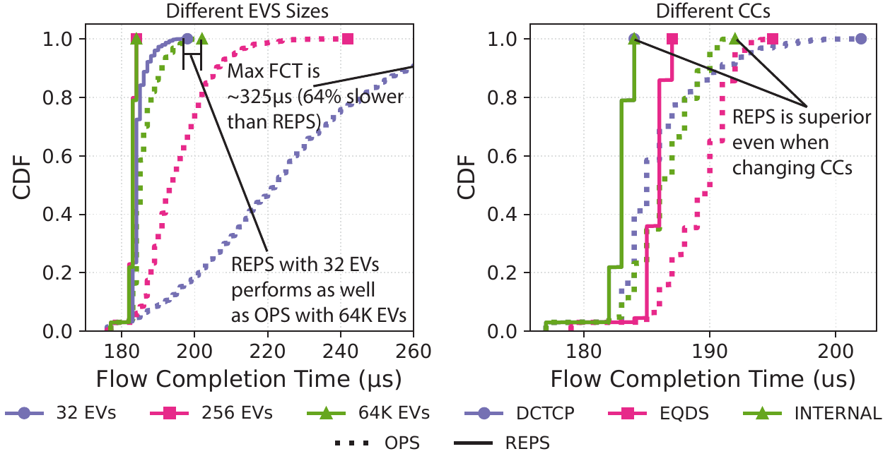
   
  <em>图 15：8 MiB permutation 中，不同 EVS 大小和 CC 算法下的性能。</em>

#### 不同 CC 算法

REPS 可以与多种 CC 算法配合，只要该 CC 不会因为乱序包和局部 ECN 过度反应。图 15 右图展示了 DCTCP、EQDS 和内部专有 CC 下的结果，REPS 相比 OPS 都有帮助。

直觉是：REPS 在逐包粒度同时使用多条路径。如果某条路径拥塞，REPS 会很快避开它；CC 可能临时稍微降低窗口，但来自其他无拥塞路径的非 ECN 包会很快恢复窗口。如果所有路径都拥塞，REPS 无法创造额外容量，这时 CC 应该降低窗口。这也是 incast 中所有负载均衡器都表现接近的原因。

#### 拓扑规模

论文用 8 MiB tornado workload 测试拓扑规模，从 128 节点、16 端口交换机，到 8192 节点、128 端口交换机。结果显示，REPS 在不同拓扑规模和大多数 EVS 大小下都表现良好，只有 16 EV 时有小幅退化。OPS 则在 EVS 受限时明显变差；16 个 EV 比完整 16 bit EV 慢超过 2 倍。

  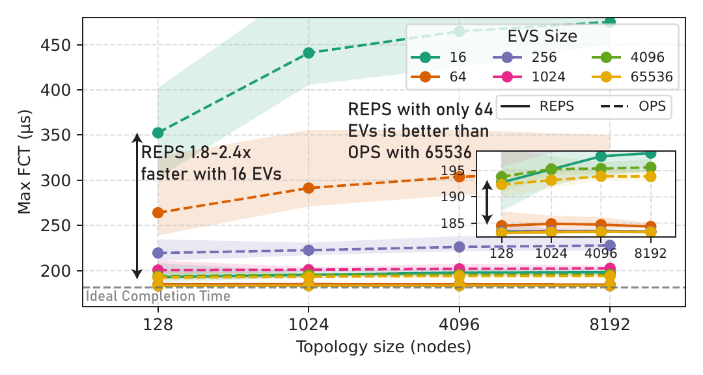
   
  <em>图 16：8 MiB permutation 中，不同 EVS 大小和拓扑规模下的性能。</em>

核心结论是：即使有限 EV 阻止每个 flow 使用所有路径，REPS 的自适应能力也能弥补这一点；并且交换机哈希还会结合其他包头字段，提供额外随机性。

## 5. 理论验证

论文用第一性原理解释为什么 OPS 可能产生任意长队列，并提出 recycled balls-into-bins 模型证明 REPS 背后的局部收敛直觉。

### 5.1 Recycled Balls-into-Bins 模型

在最大注入速率下，OPS 会出现严重负载不均衡，最终导致队列无限增长。作者用 infinite batched balls-into-bins 模型解释这一现象 [61][62][63]。

交换机模型中，每个输出端口是一个 bin。每个时间步，每个非空 bin 移除一个元素；之后，一批新的 ball，也就是 packet，到达并分配到 bins。论文关注每个时间步有 $n$ 个 ball 到达的满吞吐情况。最大队列长度就是任意 bin 的最大负载。

OPS 中，ball 被均匀随机分配到 bins。若 ball 到达速率是 $\lambda n$ 且 $\lambda<1$，过程稳定；但随着 $\lambda\to1$，最大负载会无界增长。这意味着在最大注入速率下，盲目的随机 spraying 会导致无界队列长度。原因很简单：每步一定引入 $n$ 个 ball，但由于某些输出端口可能没有被选中，移除的 ball 数可能少于 $n$。

  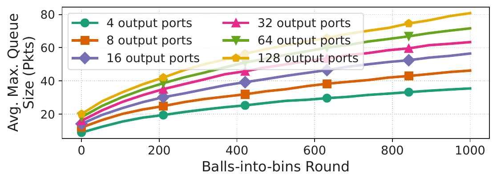
   
  <em>图 17：balls-into-bins 运行 1000 轮的仿真。</em>

REPS 对应的是 recycled balls-into-bins。模型中有 $b\cdot n$ 种颜色和一个阈值 $\tau$。每个时间步从每个非空 bin 移除一个 ball。如果该 bin 中 ball 数不超过 $\tau$，被移除 ball 的颜色会记住这个 bin；如果该 bin 超过 $\tau$，颜色就忘记这个 bin。下一轮中，记住 bin 的颜色会继续扔回原 bin；没记住的颜色则随机扔。

论文证明：对于单个交换机，recycled balls-into-bins 会收敛，即所有颜色最终都记住一个 bin，并保持该记忆。

**定理 1。** 对于 $n\ge16$、$\tau\ge4\ln n$、$b\ge2.4\ln n$，recycled balls-into-bins 在 $O(n\log n)$ 步内收敛。整个过程中，每个 bin 都以 $1-o(1)$ 的概率保持 $O(\log n)$ 个元素。

  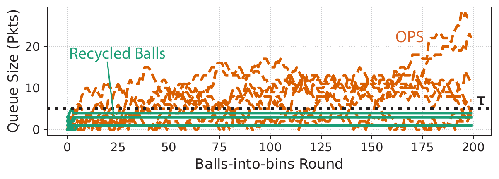
   
  <em>图 18：balls-into-bins 运行 200 轮的仿真。</em>

图 18 中，OPS 的队列不断增长，而 recycled balls 模型收敛并保持所有队列低于阈值 $\tau$。这与网络仿真里的 REPS 行为一致。

### 5.2 局限与替代方案

理论模型是理想化的。在真实网络中，如果队列变大，CC 会降低发送速率，从而避免无限增长；但这也会增加 workload 完成时间。论文只证明 REPS 的局部收敛。静态路径分配、round-robin 等方法在理想模型中也可能避免排队，但现实中很难处理局部故障、多层拓扑和未知工作负载，因此不实用 [3]。

## 6. 相关工作

负载均衡文献很丰富，但多数工作关注 TCP 风格部署，因为这类网络不希望出现乱序包 [15][21][24][54][65]。REPS 对应的是另一种趋势：Ultra Ethernet、NVIDIA Adaptive RoCE 和 Falcon 这类新传输范式都接受甚至利用乱序包，以便使用多路径容量 [11][13][26]。

按粒度看，负载均衡可以是 per-flow、sub-flow 或 per-packet。ECMP 是 per-flow，容易受 hash collision 影响，也无法感知拥塞 [14]。Hedera、MicroTE 需要全局控制器，不适合生产数据中心 [3][15][65]。Flowlet Switching、Flowcut、Presto、CONGA、PLB、FlowBender 属于 sub-flow 或更粗粒度方案，但部分方案拥塞无感，部分对 AI/ML 的突发流量反应太慢，部分需要特殊交换机 [16][19][20][21][22][66]。

OPS 和 DRILL 这类 per-packet 方案可以减少 ECMP collision，但 OPS 不感知非对称，DRILL 需要交换机支持 [24][67]。MPRDMA 和 REPS 一样使用 ECN，但它需要 probing 和 ACK clocking，也没有 entropy cache [23]。Hermes 同时使用 ECN 和 delay，但更适合 TCP-like 协议，参数也更复杂 [54]。ConWeave 面向 RDMA 网络，通过 in-network reordering 支持来屏蔽乱序，但需要修改 TOR 交换机且扩展性有限 [68]。Proteus 优化无损 PFC 网络中的负载均衡，而 REPS 面向有损网络 [69]。

## 7. 结论

本文提出 REPS，一个简单、轻量但高效的负载均衡机制，面向下一代 AI 数据中心网络。REPS 通过自适应 entropy caching 改善端到端性能，包括平均 FCT、运行时间和丢包。在对称网络中，REPS 相比 ECMP 和 OPS 分别最高提升 6 倍和 1.25 倍；在非对称网络中分别最高提升 5 倍和 2 倍；在短时瞬态链路故障中，相比 OPS 最高提升 100 倍，并把丢包减少超过 70 倍。REPS 在所有评估场景中都能匹配或超过其他先进算法，并且每连接只需要 25 字节状态。

## 致谢

作者感谢 shepherd Daniel Amir 以及 EuroSys '26 匿名评审的反馈。该工作受欧盟 Horizon Europe 项目 NET4EXA、Sapienza University Grants ADAGIO 与 D2QNeT、European Research Council 项目 PSAP、CAF America grant 支持。作者感谢 Swiss National Supercomputing Center 提供计算资源，也感谢 Marcin Copik、Ales Kubicek 和 Nadeen Gebara 的反馈。作者声明仅使用 ChatGPT 做文本编辑和质量检查。

## 附录 A：REPS 中的 Freezing Mode

理想情况下，REPS 只应在检测到网络故障时进入 freezing mode。论文使用两种策略：

1. 如果支持 packet trimming，区分拥塞丢包和故障丢包会更容易；trimming 可用于更准确地识别拥塞丢包。
2. 如果不支持 packet trimming，则观察 timeout 前一段时间内的最大 RTT。如果 timeout 前 RTT 很高，说明更可能是拥塞丢包；如果 RTT 很低，则更可能是网络故障。

论文主要关注不支持 packet trimming 的场景。但支持 trimming 时，REPS 可同时获得更准确的丢包分类和更灵敏的 CC loop。

即使 REPS 误进入 freezing mode，性能也仍然较高。因为 freezing mode 本质上只是缩小了 REPS 可用 EVS；而前文已经说明，REPS 使用少至 32 个 EV 仍能工作。作者用 16 MiB permutation 测试：在 50 微秒后强制进入 freezing mode，REPS 与普通 REPS 完成时间接近，且仍比 OPS 更稳定。

  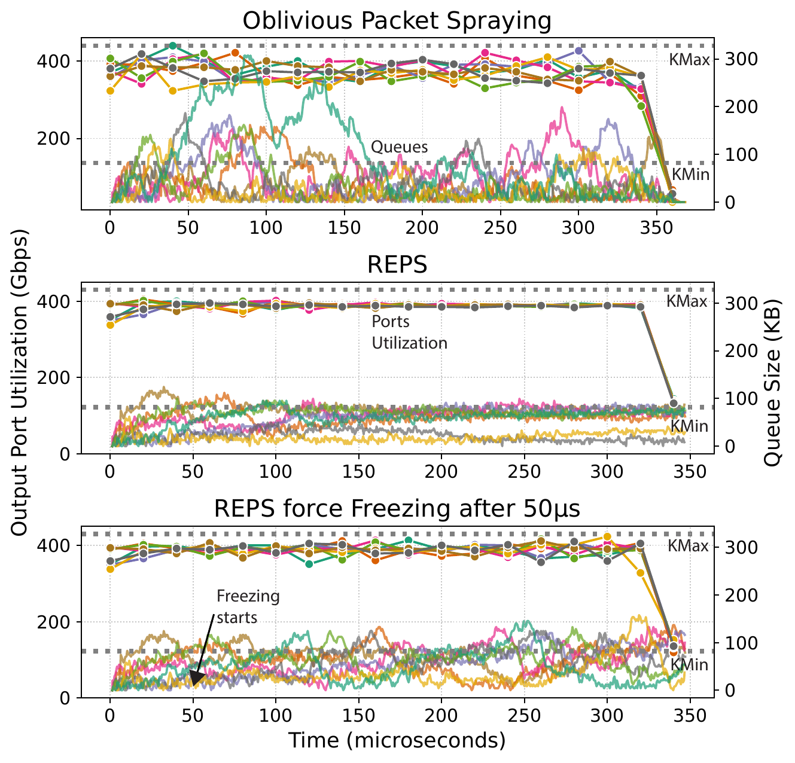
   
  <em>附图 A.1：强制 REPS 在固定时间后进入 freezing mode 的实验。</em>

REPS 还可以加入 probing 来提升故障检测精度，但作者为了保持核心框架清晰，没有把它集成进主算法。快速 loss recovery 与 REPS 正交，也可以进一步提升性能。

## 附录 B：单交换机收敛证明

附录证明 recycled balls-into-bins 对单个交换机的收敛性。过程分两阶段：

- 第一阶段仍有空 bin，ball 数量可能增长。作者用 coupon collector 问题证明，抛出 $m=2n\ln n$ 个 fresh ball 后，每个 bin 都至少收到一个 fresh ball 的概率为 $1-1/n$ [64]。同时每个 bin 收到的 fresh ball 数为 $O(\log n)$ [60]。
- 第二阶段所有 bin 都非空。此时每移除一个 ball，就会再抛入一个 ball，总 ball 数保持不变。作者定义势函数 $Y_t=\sum_i \max(0,X_t^i-\tau)$，其中 $X_t^i$ 是第 $i$ 个 bin 在时间 $t$ 的 ball 数。目标是证明势函数具有负漂移。

证明中用到 additive drift theorem、Chernoff bound 和二项分布尾界 [70][71][72][73]。关键结论是期望漂移至多为负常数，因此到达 $Y_t=0$ 的期望时间为 $O(n\ln n)$；并且整个过程中队列长度以高概率保持 $O(\log n)$。

## 附录 C：额外结果

### C.1 ACK Coalescing 的理论建模

作者用 Section 5 的理论模型验证不同 ACK coalescing ratio 下的 REPS 表现。recycled balls 模型即使降低 recycling 频率仍然表现良好；2:1 和 4:1 时队列几乎不超过阈值，8:1 仍略优于 OPS。

  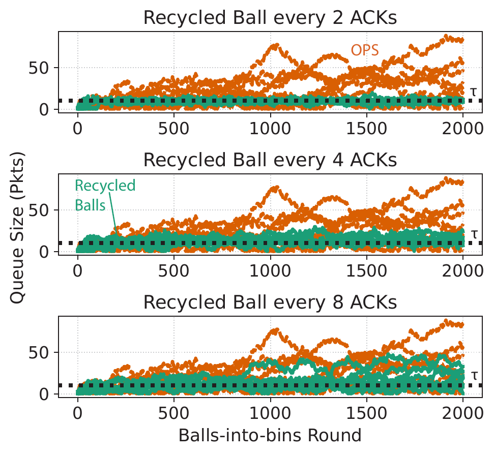
   
  <em>附图 A.2：balls-into-bins 模型中，不同 ACK coalescing ratio 下的性能。</em>

### C.2 三层 Fat-tree

三层 fat-tree 对 REPS 更难，因为一个 EV 要同时影响两跳。但实验显示，REPS 在三层拓扑中与两层拓扑表现相近。

  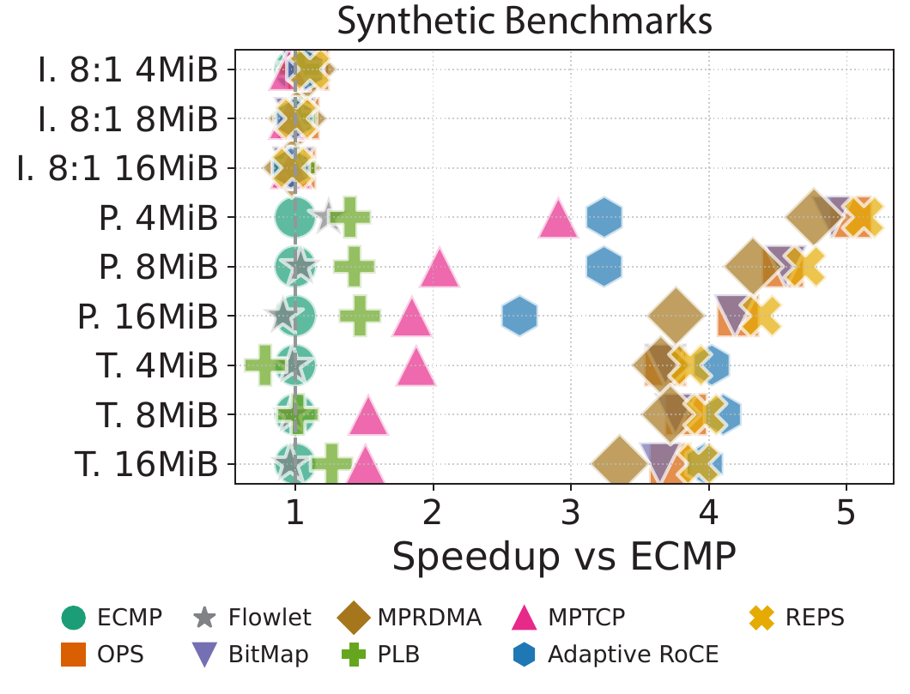
   
  <em>附图 A.3：三层 fat-tree 拓扑下的 REPS。</em>

### C.3 增量故障

作者逐步让某个交换机除一条 uplink 外的其他 uplink 失效，每 200 微秒失效一条。REPS 在第一次故障后立即进入 freezing mode，避免故障端口。永久故障期间，REPS 退出 freezing mode 做恢复检查时，会在故障链路上看到小的利用率尖峰；发现问题未解决后又重新进入 freezing mode。OPS 在该场景中比 REPS 慢 40 倍。

  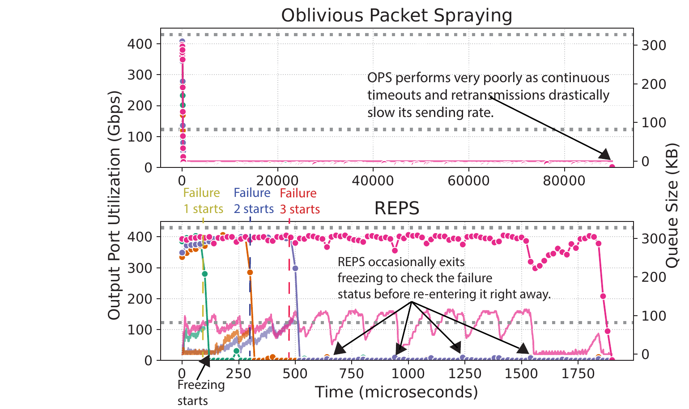
   
  <em>附图 A.4：32 MiB permutation 中，增量永久故障下 REPS 与 OPS 的对比。</em>

### C.4 Freezing Mode 的影响

没有故障时，是否启用 freezing mode 对 REPS 几乎没有影响；当加入 1% cable failure 时，freezing mode 带来约 25% 收益。即使禁用 freezing mode，REPS 仍具竞争力，因此若部署想简化实现，也可考虑禁用。

  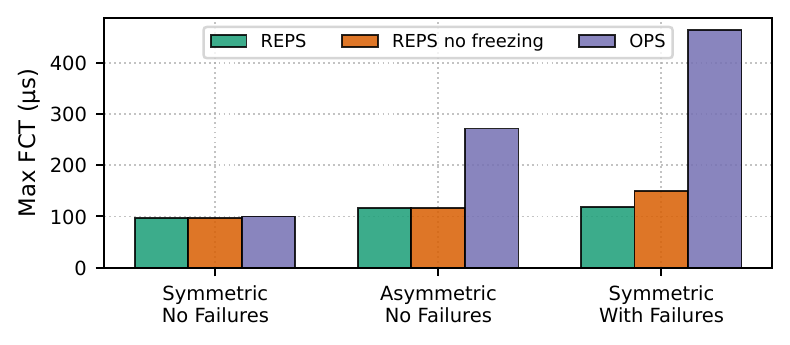
   
  <em>附图 A.5：禁用 freezing mode 对 REPS 运行时间的影响。</em>

## 附录 D：额外数据

论文使用的数据中心 trace 来自已有类似工作，包括 Facebook trace 和生产 WebSearch trace [21][31]。正文主要使用 WebSearch trace。

  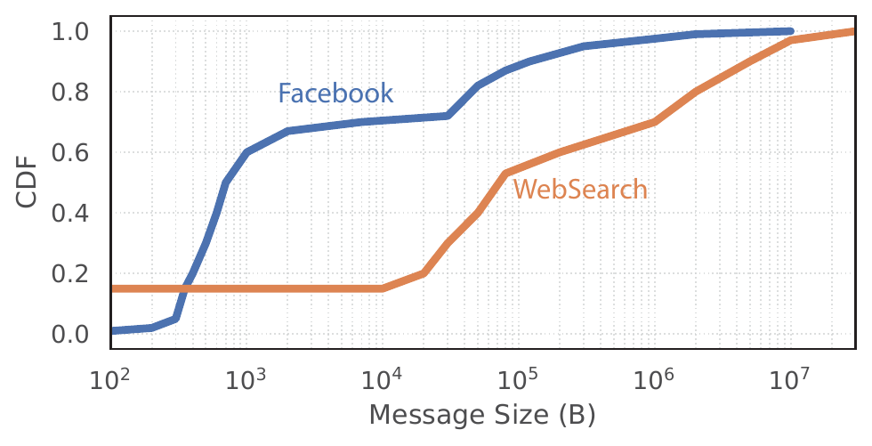
   
  <em>附图 A.6：不同数据中心 trace 的 CDF。</em>

## 附录 E：Artifact Appendix

论文 artifact 提供 GitHub 仓库和 Zenodo DOI：

- GitHub：https://github.com/tommasobo/REPS_EuroSys_Artifact
- Zenodo：https://doi.org/10.5281/zenodo.17054005

硬件方面不需要专用硬件，普通 x86 CPU 即可。作者实验使用 40GB RAM，预期 32GB RAM 也可运行；16GB RAM 可能需要降低并行仿真数量。软件依赖包括 C++17 和 Python 3.8，用于构建 htsim 和运行 Python 绘图脚本。实验在 Ubuntu 22.04 LTS + WSL2 上运行。Python 包包括 seaborn、scipy、numpy、pandas 等。

仓库提供三个脚本：

- `reps_quick.sh`：少量图，2 小时以内。
- `reps_medium.sh`：大多数图，约 6 小时。
- `reps_full.sh`：全部实验，最长约 1 天。

实验结果生成在 `artifact_results/` 目录，每个实验有自己的子目录，包含图和必要的 raw data。

## 参考文献

[1] Hoefler, Torsten and Hendel, Ariel and Roweth, Duncan. “The Convergence of Hyperscale Data Center and High-Performance Computing Networks”. Computer. 2022. https://doi.org/10.1109/MC.2022.3158437.

[2] Kun Qian and Yongqing Xi and Jiamin Cao and Jiaqi Gao and Yichi Xu and Yu Guan and Binzhang Fu and Xuemei Shi Fangbo Zhu and Rui Miao and Chao Wang and Peng Wang and Pengcheng Zhang and Xianlong Zeng Zhiping Yao and Ennan Zhai and Dennis Cai. “Alibaba HPN: A Data Center Network for Large Language Model Training”. 2024.

[3] Gangidi, Adithya and Miao, Rui and Zheng, Shengbao and Bondu, Sai Jayesh and Goes, Guilherme and Morsy, Hany and Puri, Rohit and Riftadi, Mohammad and Shetty, Ashmitha Jeevaraj and Yang, Jingyi and Zhang, Shuqiang and Fernandez, Mikel Jimenez and Gandham, Shashidhar and Zeng, Hongyi. “RDMA over Ethernet for Distributed Training at Meta Scale”. Proceedings of the ACM SIGCOMM 2024 Conference. 2024. https://doi.org/10.1145/3651890.3672233.

[4] “Infiniband Performance Review”. 2004 USENIX Annual Technical Conference (USENIX ATC 04). 2004. https://www.usenix.org/conference/2004-usenix-annual-technical-conference/infiniband-performance-review.

[5] Infiniband Trade Association. “Supplement to InfiniBand Architecture Specification Volume 1 Release 1.2.1 Annex A17: RoCEv2”. 2024.

[6] Achiam, Josh and Adler, Steven and Agarwal, Sandhini and Ahmad, Lama and Akkaya, Ilge and Aleman, Florencia Leoni and Almeida, Diogo and Altenschmidt, Janko and Altman, Sam and Anadkat, Shyamal and others. “Gpt-4 technical report”. arXiv preprint arXiv:2303.08774. 2023.

[7] Dubey, Abhimanyu and Jauhri, Abhinav and Pandey, Abhinav and Kadian, Abhishek and Al-Dahle, Ahmad and Letman, Aiesha and Mathur, Akhil and Schelten, Alan and Yang, Amy and Fan, Angela and others. “The llama 3 herd of models”. arXiv preprint arXiv:2407.21783. 2024.

[8] Li, Shen and Zhao, Yanli and Varma, Rohan and Salpekar, Omkar and Noordhuis, Pieter and Li, Teng and Paszke, Adam and Smith, Jeff and Vaughan, Brian and Damania, Pritam and others. “Pytorch distributed: Experiences on accelerating data parallel training”. arXiv preprint arXiv:2006.15704. 2020.

[9] Zhao, Yanli and Gu, Andrew and Varma, Rohan and Luo, Liang and Huang, Chien-Chin and Xu, Min and Wright, Less and Shojanazeri, Hamid and Ott, Myle and Shleifer, Sam and others. “Pytorch fsdp: experiences on scaling fully sharded data parallel”. arXiv preprint arXiv:2304.11277. 2023.

[10] Shalev, Leah and Ayoub, Hani and Bshara, Nafea and Sabbag, Erez. “A Cloud-Optimized Transport Protocol for Elastic and Scalable HPC”. IEEE Micro. 2020. 10.1109/MM.2020.3016891.

[11] Singhvi, Arjun and Dukkipati, Nandita and Chandra, Prashant and Wassel, Hassan M. G. and Sharma, Naveen Kr. and Rebello, Anthony and Schuh, Henry and Kumar, Praveen and Montazeri, Behnam and Bansod, Neelesh and Thomas, Sarin and Cho, Inho and Seibert, Hyojeong Lee and Wu, Baijun and Yang, Rui and Li, Yuliang and Huang, Kai and Yin, Qianwen and Agarwal, Abhishek and Vaduvatha, Srinivas and Wang, Weihuang and Moshref, Masoud and Ji, Tao and Wetherall, David and Vahdat, Amin. “Falcon: A Reliable, Low Latency Hardware Transport”. Proceedings of the ACM SIGCOMM 2025 Conference. 2025. https://doi.org/10.1145/3718958.3754353.

[12] Tesla Motors. “Tesla Transport Protocol (TTPoE)”. https://github.com/teslamotors/ttpoe (accessed 09/24). 2024.

[13] Ultra Ethernet Consortium. “Ultra Ethernet”. https://ultraethernet.org/. 2024.

[14] C. Hopps. “Analysis of an Equal-Cost Multi-Path Algorithm”. RFC Editor. 2009. https://www.ietf.org/rfc/rfc2992.txt.

[15] Al-Fares, Mohammad and Radhakrishnan, Sivasankar and Raghavan, Barath and Huang, Nelson and Vahdat, Amin. “Hedera: dynamic flow scheduling for data center networks”. Proceedings of the 7th USENIX Conference on Networked Systems Design and Implementation. 2010.

[16] Alizadeh, Mohammad and Edsall, Tom and Dharmapurikar, Sarang and Vaidyanathan, Ramanan and Chu, Kevin and Fingerhut, Andy and Lam, Vinh The and Matus, Francis and Pan, Rong and Yadav, Navindra and Varghese, George. “CONGA: distributed congestion-aware load balancing for datacenters”. Proceedings of the 2014 ACM Conference on SIGCOMM. 2014. https://doi.org/10.1145/2619239.2626316.

[17] Hoefler, Torsten and Roweth, Duncan and Underwood, Keith and Alverson, Robert and Griswold, Mark and Tabatabaee, Vahid and Kalkunte, Mohan and Anubolu, Surendra and Shen, Siyuan and McLaren, Moray and Kabbani, Abdul and Scott, Steve. “Data Center Ethernet and Remote Direct Memory Access: Issues at Hyperscale”. Computer. 2023. 10.1109/MC.2023.3261184.

[18] Raiciu, Costin and Barre, Sebastien and Pluntke, Christopher and Greenhalgh, Adam and Wischik, Damon and Handley, Mark. “Improving datacenter performance and robustness with multipath TCP”. SIGCOMM Comput. Commun. Rev.. 2011. https://doi.org/10.1145/2043164.2018467.

[19] Qureshi, Mubashir Adnan and Cheng, Yuchung and Yin, Qianwen and Fu, Qiaobin and Kumar, Gautam and Moshref, Masoud and Yan, Junhua and Jacobson, Van and Wetherall, David and Kabbani, Abdul. “PLB: congestion signals are simple and effective for network load balancing”. Proceedings of the ACM SIGCOMM 2022 Conference. 2022. https://doi.org/10.1145/3544216.3544226.

[20] Kabbani, Abdul and Vamanan, Balajee and Hasan, Jahangir and Duchene, Fabien. “FlowBender: Flow-level Adaptive Routing for Improved Latency and Throughput in Datacenter Networks”. Proceedings of the 10th ACM International on Conference on Emerging Networking Experiments and Technologies. 2014. https://doi.org/10.1145/2674005.2674985.

[21] Erico Vanini and Rong Pan and Mohammad Alizadeh and Parvin Taheri and Tom Edsall. “Let It Flow: Resilient Asymmetric Load Balancing with Flowlet Switching”. 14th USENIX Symposium on Networked Systems Design and Implementation (NSDI 17). 2017. https://www.usenix.org/conference/nsdi17/technical-sessions/presentation/vanini.

[22] He, Keqiang and Rozner, Eric and Agarwal, Kanak and Felter, Wes and Carter, John and Akella, Aditya. “Presto: Edge-Based Load Balancing for Fast Datacenter Networks”. Proceedings of the 2015 ACM Conference on Special Interest Group on Data Communication. 2015. https://doi.org/10.1145/2785956.2787507.

[23] Lu, Yuanwei and Chen, Guo and Li, Bojie and Tan, Kun and Xiong, Yongqiang and Cheng, Peng and Zhang, Jiansong and Chen, Enhong and Moscibroda, Thomas. “Multi-path transport for RDMA in datacenters”. Proceedings of the 15th USENIX Conference on Networked Systems Design and Implementation. 2018.

[24] Dixit, Advait and Prakash, Pawan and Hu, Y. Charlie and Kompella, Ramana Rao. “On the impact of packet spraying in data center networks”. 2013 Proceedings IEEE INFOCOM. 2013. 10.1109/INFCOM.2013.6567015.

[25] Torsten Hoefler and Karen Schramm and Eric Spada and Keith Underwood and Cedell Alexander and Bob Alverson and Paul Bottorff and Adrian Caulfield and Mark Handley and Cathy Huang and Costin Raiciu and Abdul Kabbani and Eugene Opsasnick and Rong Pan and Adee Ran and Rip Sohan. “Ultra Ethernet's Design Principles and Architectural Innovations”. 2025. https://arxiv.org/abs/2508.08906.

[26] NVIDIA. “NVIDIA Spectrum-X Network Platform Architecture”. https://resources.nvidia.com/en-us-accelerated-networking-resource-library/nvidia-spectrum-x. 2024.

[27] Ultra Ethernet Consortium. “Ultra Ethernet Specification Version 1.0”. Accessed on August 29, 2025. 2025. https://ultraethernet.org/uec-1-0-spec.

[28] Nvidia. “Networking for the Era of AI: The Network Defines the Data Center”. https://nvdam.widen.net/s/bvpmlkbgzt/networking-overall-whitepaper-networking-for-ai-2911204 (accessed 01/24). 2024.

[29] Sally Floyd and Dr. K. K. Ramakrishnan and David L. Black. “The Addition of Explicit Congestion Notification (ECN) to IP”. RFC Editor. 2001. https://www.rfc-editor.org/info/rfc3168.

[30] Zhu, Yibo and Zhu, Yibo and Eran, Haggai and Firestone, Daniel and Guo, Chuanxiong and Lipshteyn, Marina and Liron, Yehonatan and Padhye, Jitendra and Raindel, Shachar and Yahia, Mohamad Haj and Zhang, Ming and Padhye, Jitu. “Congestion Control for Large-Scale RDMA Deployments”. SIGCOMM. 2015. https://www.microsoft.com/en-us/research/publication/congestion-control-for-large-scale-rdma-deployments/.

[31] Alizadeh, Mohammad and Greenberg, Albert and Maltz, David A. and Padhye, Jitendra and Patel, Parveen and Prabhakar, Balaji and Sengupta, Sudipta and Sridharan, Murari. “Data Center TCP (DCTCP)”. SIGCOMM Comput. Commun. Rev.. 2010. https://doi.org/10.1145/1851275.1851192.

[32] Ye, Jin and Liu, Renzhang and Xie, Ziqi and Feng, Luting and Liu, Sen. “EMPTCP: An ECN Based Approach to Detect Shared Bottleneck in MPTCP”. 2019 28th International Conference on Computer Communication and Networks (ICCCN). 2019. 10.1109/ICCCN.2019.8847013.

[33] Floyd, S. and Jacobson, V.. “Random early detection gateways for congestion avoidance”. IEEE/ACM Transactions on Networking. 1993. 10.1109/90.251892.

[34] Weitao Wang and Masoud Moshref and Yuliang Li and Gautam Kumar and T. S. Eugene Ng and Neal Cardwell and Nandita Dukkipati. “Poseidon: An Efficient Congestion Control using Deployable INT for Data Center Networks”. 2023. https://www.usenix.org/system/files/nsdi23-wang-weitao.pdf.

[35] Nichols, Kathleen and Jacobson, Van. “Controlling Queue Delay: A modern AQM is just one piece of the solution to bufferbloat.”. Queue. 2012. https://doi.org/10.1145/2208917.2209336.

[36] Popa Adrian and Dumitrescu Dragos and Handley Mark and Nikolaidis Georgios and Lee Jeongkeun and Raiciu Costin. “Implementing packet trimming support in hardware”. 2022.

[37] Peng Cheng and Fengyuan Ren and Ran Shu and Chuang Lin. “Catch the Whole Lot in an Action: Rapid Precise Packet Loss Notification in Data Center”. 11th USENIX Symposium on Networked Systems Design and Implementation (NSDI 14). 2014. https://www.usenix.org/conference/nsdi14/technical-sessions/presentation/cheng.

[38] Handley, Mark and Raiciu, Costin and Agache, Alexandru and Voinescu, Andrei and Moore, Andrew W. and Antichi, Gianni and W\'ojcik, Marcin. “Re-Architecting Datacenter Networks and Stacks for Low Latency and High Performance”. Proceedings of the Conference of the ACM Special Interest Group on Data Communication. 2017. https://doi.org/10.1145/3098822.3098825.

[39] Vladimir Olteanu and Haggai Eran and Dragos Dumitrescu and Adrian Popa and Cristi Baciu and Mark Silberstein and Georgios Nikolaidis and Mark Handley and Costin Raiciu. “An edge-queued datagram service for all datacenter traffic”. 19th USENIX Symposium on Networked Systems Design and Implementation (NSDI 22). 2022. https://www.usenix.org/conference/nsdi22/presentation/olteanu.

[40] Li, Wenxue and Liu, Xiangzhou and Zhang, Yunxuan and Wang, Zihao and Gu, Wei and Qian, Tao and Zeng, Gaoxiong and Ren, Shoushou and Huang, Xinyang and Ren, Zhenghang and Liu, Bowen and Zhang, Junxue and Chen, Kai and Liu, Bingyang. “Revisiting RDMA Reliability for Lossy Fabrics”. Proceedings of the ACM SIGCOMM 2025 Conference. 2025. https://doi.org/10.1145/3718958.3750480.

[41] Ultra Ethernet Consortium. “Ultra Ethernet Specification Update - Ultra Ethernet Consortium --- ultraethernet.org”. https://ultraethernet.org/ultra-ethernet-specification-update/.

[42] Zhehui Zhang and Haiyang Zheng and Jiayao Hu and Xiangning Yu and Chenchen Qi and Xuemei Shi and Guohui Wang. “Hashing Linearity Enables Relative Path Control in Data Centers”. 2021 USENIX Annual Technical Conference (USENIX ATC 21). 2021. https://www.usenix.org/conference/atc21/presentation/zhang-zhehui.

[43] Anix Anbiah and Krishna M. Sivalingam. “Efficient failure recovery techniques for segment-routed networks”. Computer Communications. 2022. https://www.sciencedirect.com/science/article/pii/S0140366421004138.

[44] Iselt, A. and Kirstadter, A. and Pardigon, A. and Schwabe, T.. “Resilient routing using MPLS and ECMP”. 2004 Workshop on High Performance Switching and Routing, 2004. HPSR.. 2004. 10.1109/HPSR.2004.1303507.

[45] Kim, John and Dally, Wiliam J. and Scott, Steve and Abts, Dennis. “Technology-Driven, Highly-Scalable Dragonfly Topology”. 2008 International Symposium on Computer Architecture. 2008. 10.1109/ISCA.2008.19.

[46] Hoefler, Torsten and Bonato, Tommaso and De Sensi, Daniele and Di Girolamo, Salvatore and Li, Shigang and Heddes, Marco and Belk, Jon and Goel, Deepak and Castro, Miguel and Scott, Steve. “HammingMesh: A Network Topology for Large-Scale Deep Learning”. Proceedings of the International Conference on High Performance Computing, Networking, Storage and Analysis. 2022.

[47] Yanfang Le and Rong Pan and Peter Newman and Jeremias Blendin and Abdul Kabbani and Vipin Jain and Raghava Sivaramu and Francis Matus. “STrack: A Reliable Multipath Transport for AI/ML Clusters”. 2024. https://arxiv.org/abs/2407.15266.

[48] Arjun Singh and Joon Ong and Amit Agarwal and Glen Anderson and Ashby Armistead and Roy Bannon and Seb Boving and Gaurav Desai and Bob Felderman and Paulie Germano and Anand Kanagala and Jeff Provost and Jason Simmons and Eiichi Tanda and Jim Wanderer and Urs Hölzle and Stephen Stuart and Amin Vahdat. “Jupiter Rising: A Decade of Clos Topologies and Centralized Control in Google’s Datacenter Network”. Sigcomm '15. 2015.

[49] Broadcom. “Tomahawk 5 Switch”. https://www.broadcom.com/products/ethernet-connectivity/switching/strataxgs/bcm78900-series (accessed 01/24). 2024.

[50] De Sensi, Daniele and Di Girolamo, Salvatore and McMahon, Kim H. and Roweth, Duncan and Hoefler, Torsten. “An In-Depth Analysis of the Slingshot Interconnect”. SC20: International Conference for High Performance Computing, Networking, Storage and Analysis. 2020. 10.1109/SC41405.2020.00039.

[51] Jiao Zhang and Fengyuan Ren and Chuang Lin. “Modeling and understanding TCP incast in data center networks”. 2011 Proceedings IEEE INFOCOM. 2011. https://api.semanticscholar.org/CorpusID:16461175.

[52] Chen, Yanpei and Griffith, Rean and Liu, Junda and Katz, Randy H. and Joseph, Anthony D.. “Understanding TCP incast throughput collapse in datacenter networks”. Proceedings of the 1st ACM Workshop on Research on Enterprise Networking. 2009. https://doi.org/10.1145/1592681.1592693.

[53] Prisacari, Bogdan and Rodriguez, German and Minkenberg, Cyriel and Hoefler, Torsten. “Bandwidth-optimal all-to-all exchanges in fat tree networks”. Proceedings of the 27th International ACM Conference on International Conference on Supercomputing. 2013. https://doi.org/10.1145/2464996.2465434.

[54] Zhang, Hong and Zhang, Junxue and Bai, Wei and Chen, Kai and Chowdhury, Mosharaf. “Resilient Datacenter Load Balancing in the Wild”. Proceedings of the Conference of the ACM Special Interest Group on Data Communication. 2017. https://doi.org/10.1145/3098822.3098841.

[55] Naumov, Maxim and Mudigere, Dheevatsa and Shi, Hao-Jun Michael and Huang, Jianyu and Sundaraman, Narayanan and Park, Jongsoo and Wang, Xiaodong and Gupta, Udit and Wu, Carole-Jean and Azzolini, Alisson G and others. “Deep learning recommendation model for personalization and recommendation systems”. arXiv preprint arXiv:1906.00091. 2019.

[56] Zhou, Junlan and Tewari, Malveeka and Zhu, Min and Kabbani, Abdul and Poutievski, Leon and Singh, Arjun and Vahdat, Amin. “WCMP: weighted cost multipathing for improved fairness in data centers”. Proceedings of the Ninth European Conference on Computer Systems. 2014. https://doi.org/10.1145/2592798.2592803.

[57] Haryadi S. Gunawi and Riza O. Suminto and Russell Sears and Casey Golliher and Swaminathan Sundararaman and Xing Lin and Tim Emami and Weiguang Sheng and Nematollah Bidokhti and Caitie McCaffrey and Gary Grider and Parks M. Fields and Kevin Harms and Robert B. Ross and Andree Jacobson and Robert Ricci and Kirk Webb and Peter Alvaro and H. Birali Runesha and Mingzhe Hao and Huaicheng Li. “Fail-Slow at Scale: Evidence of Hardware Performance Faults in Large Production Systems”. 16th USENIX Conference on File and Storage Technologies (FAST 18). 2018. https://www.usenix.org/conference/fast18/presentation/gunawi.

[58] Singh, Preeti and Rai, J. K. and Sharma, Ajay K.. “Bit Error Rate Analysis of AWG Based Add-Drop Hybrid Buffer Optical Packet Switch”. 2020 2nd International Conference on Advances in Computing, Communication Control and Networking (ICACCCN). 2020. 10.1109/ICACCCN51052.2020.9362921.

[59] Singh, Rachee and Mukhtar, Muqeet and Krishna, Ashay and Parkhi, Aniruddha and Padhye, Jitendra and Maltz, David. “Surviving switch failures in cloud datacenters”. SIGCOMM Comput. Commun. Rev.. 2021. https://doi.org/10.1145/3464994.3464996.

[60] Martin Raab and Angelika Steger. “Balls into Bins - A Simple and Tight Analysis”. Randomization and Approximation Techniques in Computer Science, Second International Workshop, RANDOM'98, Barcelona, Spain, October 8-10, 1998, Proceedings. 1998. https://doi.org/10.1007/3-540-49543-6_13.

[61] Petra Berenbrink and Tom Friedetzky and Peter Kling and Frederik Mallmann-Trenn and Lars Nagel and Chris Wastell. “Self-Stabilizing Balls and Bins in Batches - The Power of Leaky Bins”. Algorithmica. 2018. https://doi.org/10.1007/s00453-018-0411-z.

[62] Luca Becchetti and Andrea Clementi and Emanuele Natale and Francesco Pasquale and Gustavo Posta. “Self-stabilizing repeated balls-into-bins”. Distributed Comput.. 2019. https://doi.org/10.1007/s00446-017-0320-4.

[63] Dimitrios Los and Thomas Sauerwald. “Tight Bounds for Repeated Balls-Into-Bins”. 40th International Symposium on Theoretical Aspects of Computer Science, STACS 2023, March 7-9, 2023, Hamburg, Germany. 2023. https://doi.org/10.4230/LIPIcs.STACS.2023.45.

[64] Benjamin Doerr. “Probabilistic Tools for the Analysis of Randomized Optimization Heuristics”. Theory of Evolutionary Computation - Recent Developments in Discrete Optimization. 2020. https://doi.org/10.1007/978-3-030-29414-4_1.

[65] Benson, Theophilus and Anand, Ashok and Akella, Aditya and Zhang, Ming. “MicroTE: fine grained traffic engineering for data centers”. Proceedings of the Seventh COnference on Emerging Networking EXperiments and Technologies. 2011. https://doi.org/10.1145/2079296.2079304.

[66] Bonato, Tommaso and De Sensi, Daniele and Di Girolamo, Salvatore and Bataineh, Abdulla and Hewson, David and Roweth, Duncan and Hoefler, Torsten. “Flowcut Switching: High-Performance Adaptive Routing With In-Order Delivery Guarantees”. IEEE Transactions on Networking. 2026. 10.1109/TON.2025.3636209.

[67] Ghorbani, Soudeh and Yang, Zibin and Godfrey, P. Brighten and Ganjali, Yashar and Firoozshahian, Amin. “DRILL: Micro Load Balancing for Low-Latency Data Center Networks”. Proceedings of the Conference of the ACM Special Interest Group on Data Communication. 2017. https://doi.org/10.1145/3098822.3098839.

[68] Song, Cha Hwan and Khooi, Xin Zhe and Joshi, Raj and Choi, Inho and Li, Jialin and Chan, Mun Choon. “Network Load Balancing with In-network Reordering Support for RDMA”. Proceedings of the ACM SIGCOMM 2023 Conference. 2023. https://doi.org/10.1145/3603269.3604849.

[69] Hu, Jinbin and Zeng, Chaoliang and Wang, Zilong and Zhang, Junxue and Guo, Kun and Xu, Hong and Huang, Jiawei and Chen, Kai. “Enabling Load Balancing for Lossless Datacenters”. 2023 IEEE 31st International Conference on Network Protocols (ICNP). 2023. https://doi.ieeecomputersociety.org/10.1109/ICNP59255.2023.10355615.

[70] Johannes Lengler. “Drift Analysis”. Theory of Evolutionary Computation - Recent Developments in Discrete Optimization. 2020. https://doi.org/10.1007/978-3-030-29414-4_2.

[71] Jun He and Xin Yao. “A study of drift analysis for estimating computation time of evolutionary algorithms”. Nat. Comput.. 2004. https://doi.org/10.1023/B:NACO.0000023417.31393.c7.

[72] Fan Chung and Linyuan Lu. “Concentration inequalities and martingale inequalities: a survey”. Internet Mathematics. 2006.

[73] Christos Pelekis. “Lower bounds on binomial and Poisson tails: an approach via tail conditional expectations”. 2017. https://arxiv.org/abs/1609.06651.
