# RNG：大规模扁平数据中心网络

原题：RNG: Flat Datacenter Networks at Scale

年份：2026

作者：

- Amazon Web Services：Giacomo Bernardi、Ratul Mahajan、C. Seshadhri、Enrico Carlesso、Chinchu Merine Joseph、Saurabh Kumar、Pavan Manikonda、Luiza Popa、Randy Ram、Steven Robinson、Elizabeth Tennent

## 摘要

本文设计并在生产环境部署了第一种扁平数据中心网络。这个设计称为 RNG，基于准随机图。类似拓扑的成本和容错优势很早就为人所知，但真正落地一直受限于两个问题：缺少可扩展的路由方法，也缺少可部署的布线方法。RNG 提出了一种新的分布式路由协议，它利用随机图的性质，在端点对之间寻找大量边不相交路径；同时使用一种新的无源光学设备在内部打乱线缆连接，使布线复杂度接近 fat-tree。实验显示，虽然 RNG 成本最高可降低 45%，但在多种流量模式下性能可以匹配甚至超过 fat-tree。RNG 现在已经成为 Amazon 大多数工作负载的默认数据中心网络。

## 1. 引言

Fat-tree 拓扑简单，因此长期是数据中心网络的主力。但它在成本和性能之间有一个很硬的取舍：要么构建任意端点都能全速收发的 non-blocking fabric，要么构建 oversubscribed fabric，并接受少数不利端点高负载时可能拥塞的风险。大规模 non-blocking fabric 成本极高，所以现实中很多组织会选择 oversubscription，并让性能敏感工作负载承担拥塞风险 [1, 2, 3]。

根因在于 fat-tree 缺少容量可替代性，也就是 capacity fungibility。严格层次结构意味着某一对端点之间的流量只能使用拓扑中的一小部分链路。这些链路可能拥塞，而大量其他链路却空闲。要提供稳定、无拥塞体验，就必须在所有地方都过量配置容量，即使任意时刻真正需要高容量的只是少数端点对。

已有研究尝试用可重构拓扑解决这个问题，例如光交换机、可转向无线天线、自由空间光设备等，让端点之间的容量动态变化 [4, 5, 6, 7, 8, 9, 10, 11, 12]。但这些硬件尚未在超大规模环境中充分验证；很多方案还需要集中式控制平面推断全网需求并配置硬件。对于 Web 服务这类突发、时延敏感工作负载，这种控制平面很难在大规模下可靠运行。

一个更有希望的替代方向是：用商用路由器组成扁平 expander graph [13, 14, 15, 16, 17]。这种拓扑不仅更便宜，也更容错，因为任何故障的影响半径都较小，不像 fat-tree 上层设备故障会影响大量端点对。Expander 网络拓扑的好处已经被认识十多年 [13]，但它一直没有成为现实，主要有三个未解决挑战 [18, 3]。

**1. 路由。** Fat-tree 常用最短路由，但最短路由并不适合 expander，因为它不能利用 expander 中存在的大量路径多样性。有些节点对之间只有一条最短路径，最短路由会把流量压到少数链路上。先前工作建议使用 $k$-shortest paths，在源和目的之间的 $k$ 条最短路径上分流 [13, 14]。问题是，大规模网络中用商用交换机难以实现这种路由；它通常需要隧道或者基于源地址的转发，所需高速内存比当前硬件多一个数量级。

**2. 布线。** Expander 会连接物理空间中相距很远的设备对，因此布线复杂且昂贵 [18]。更麻烦的是，增量加入新机架时需要打断已有连接。如果每台路由器有 $d$ 条到其他路由器的链路，那么每加入一台路由器，平均需要打断 $d/2$ 条物理分散在数据中心里的既有链路。这种操作容易造成连带影响，也会拖慢机架上线。

**3. 性能可预测性。** 过去对 expander 的评估多集中在固定参数的具体拓扑上。运营者很难知道换一组参数后 fabric 会怎样，更难根据性能目标自动生成拓扑。相对地，fat-tree 已经可以根据性能目标自动生成设计 [19, 20, 21]。

本文解决这些问题，并部署了据作者所知第一种基于 expander 的生产数据中心 fabric。RNG 使用随机和确定性布线段的混合方式连接路由器，形成准随机图，其统计性质类似真正随机图 [22]。路由算法 Spraypoint 专门为随机图设计，可以在商用硬件上全分布式实现。它在端点对之间找到数量接近节点度数的大量边不相交路径，并让不同端点对的路径重叠尽量少，由此带来容量可替代性和高吞吐。

本文还提出了一种基于无源光学设备 ShuffleBox 的布线方法。ShuffleBox 在内部混合路由器之间的连接，并被放置在数据中心中少量预规划位置。这样，真实需要物理连接的位置对数量可以接近 fat-tree，而不是接近随机图的逻辑连接数量。

随机图的集中性质和 Spraypoint 路由的去相关特性，使 RNG fabric 的性能可以根据拓扑参数建模。本文建立了路径长度、边不相交路径数和 oversubscription 的模型。运营者可以用这些模型设计满足目标性能的拓扑。

作者部署了两个 RNG 生产 fabric。传输层和应用层 benchmark 显示，RNG 性能与 fat-tree 相当，并没有受到 expander 特有因素影响，例如同一端点对之间路径长度可变。分析还显示，在相同 oversubscription ratio 下，RNG 比 fat-tree 便宜 9% 到 45%；并且在多种流量模式下，RNG 的吞吐高于 fat-tree。

## 2. 扁平 Expander 的潜力

Expander graph 最重要的性质是边扩展性：对于任意少数节点集合 $S$，从 $S$ 指向外部的边，也就是 cut，都足够大 [23]。这直接带来容量可替代性，因为每个 $S$ 都拥有通向其他节点的大带宽。相反，在 fat-tree 这类层次拓扑中，一个子树的 cut 只连向父节点，扩展性较差。

图 1 对比了一个 generalized fat-tree 和一个 expander 拓扑 [24]。在 fat-tree 中，T1--T12 是 ToR，向上连到 aggregation 层和 spine 层。T1--T3 及其两个父节点组成的子集，通往 spine 的 cut 只有两条链路；即使 fabric 里大量链路空闲，这些节点也无法向 T4--T12 发送超过两单位的流量，容量被困在局部。

<table align="center">
  <tr>
    <td align="center" width="50%">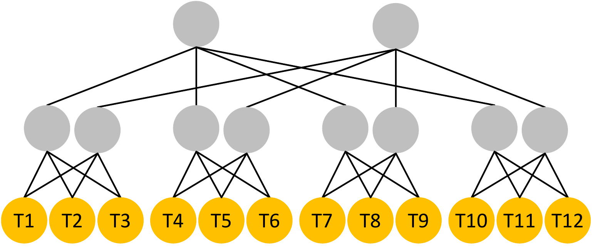 <em>图 1a：fat-tree 示例。</em></td>
    <td align="center" width="50%">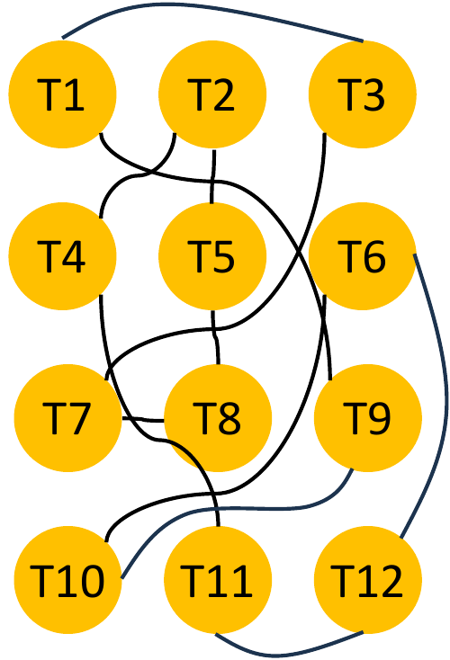 <em>图 1b：expander 示例。</em></td>
  </tr>
</table>

<em>图 1：fat-tree 与 expander 拓扑示例。每个交换机有四个端口；每个 ToR 有两个端口连接服务器，图中未画出。</em>

Fat-tree 不仅在偏斜流量下会困住容量，在均匀流量下也会。以 all-to-all 为例，每个 ToR 都想向其他 ToR 发送相同数据，跨 aggregation-spine 的 $12 \times 9$ 条流只能共享 8 条上层链路。给定每个 ToR 两单位上行容量，这会让约 60% 的 ToR 上行容量无法被有效使用。

像图 1b 中 T1--T12 之间的随机图这样的 expander 可以做得更好。若 T1--T3 是唯一发送方，只要其他节点安静，它们基本只会受本地容量限制；由于扩展性好，不存在限制流量的小 cut。即使面对 all-to-all，只要路由算法足够好，也能有效利用拓扑中的所有链路。

容量可替代性降低成本，因为部署容量使用得更充分，网络规模可以更小。一个简单理解是：扁平 expander 移除了所有上层路由器。但与 fat-tree 性能等价的 expander 可能需要更多 ToR 上行，因为部分上行容量会用于中继其他 ToR 的流量。因此在固定 ToR 端口数下，可能需要更多 ToR 承载同样数量服务器。即便如此，本文后续显示 expander 仍可最高降低 45% 成本。

Expander 也更容错。边扩展性让网络难以被分区；扁平结构降低了故障影响。在 fat-tree 中，上层路由器承载大量端点对流量，一个 spine 故障就可能让多数 ToR 对的可用容量减半。而在随机扁平图中，没有这种特殊的上层路由器。

本文聚焦多租户、异构负载的数据中心。作者也指出，大规模 AI 训练这类专用工作负载可能需要 rail-optimized fat-tree 之类特殊拓扑，也可能需要 aggregation 层那样的局部容量岛 [25, 26]。扁平随机拓扑没有 aggregation island；但对于多租户通用数据中心，这不是核心问题，因为租户持续进出、服务器数量和类型各异，超大规模运营者更希望获得全 fabric 统一容量池 [27]。

## 3. 需求与挑战

Expander 在理论上很有吸引力，但要在 Amazon 规模替代 fat-tree，必须满足三个要求。Jellyfish、Xpander、Slim Fly 等先前方案并没有同时满足这些要求 [13, 14, 28]。

**可用商用交换机实现。** 网络应能用商用交换机和转发 ASIC 实现。定制硬件当然可以做，但会增加成本，并带来技术和供应链风险。先前 expander 设计通常依赖 $k$-shortest paths 来克服最短路径的局限；典型实现需要 MPLS/VLAN 隧道 [29] 或同时基于源、目的地址转发。如果 $n=10K$ 台路由器，$k=8$，每条路径经过 4 台路由器，则每台路由器平均需要 320K 个转发表项。当前交换机只能支持 4K 到 16K 这类表项，少 20 到 80 倍。状态压缩技术也难以弥合这个差距 [30, 31]。基于 VRF 构造非最短路径的方案也受商用交换机 VRF 数量限制 [32]。

**部署和运维简单。** 网络可靠性很依赖部署和运维的简单性。控制平面上，作者希望保留今天常见的 demand-oblivious、全分布式路由；物理操作上，希望布线步骤少且快，以降低风险并加快扩容。Jellyfish 通过把 ToR 从机架中移出、集中放置来简化随机布线，但这会增加同机架服务器之间的时延，也会把便宜的机架内铜缆换成昂贵光缆。现有方法还通常要求每次新增机架都改动大量既有连接。

**性能可预测。** 运营者部署 fabric 是为了满足容量和性能目标，例如服务器数量、oversubscription 等。若 expander 要被接受，就必须能方便而有信心地设计出达标拓扑。先前工作多只 benchmark 固定参数拓扑，没有说明如何按目标性能生成拓扑。

RNG 分别用三件事满足这些要求：第一，Spraypoint 路由能找到大量边不相交路径，且像 OSPF/BGP 一样 demand-oblivious、可全分布式运行在商用硬件上；第二，ShuffleBox 这种无源光学设备将数据中心扩容时需要物理布线/重布线的端点数量限制住；第三，高保真模型给出吞吐、路径长度等关键性能指标。

## 4. RNG 总览

RNG 基于扁平图，路由器通过确定性和随机选择的混合方式互连。由于这种随机性受控，RNG 图不是真正随机图，而是行为类似真正随机图的准随机图，并且是优秀的 expander [33, 34, 22]。与 Xpander、Slim Fly 这类结构化构造不同，随机图还能支持不同度数的路由器 [14, 28, 13]。

RNG 路由器彼此连接，也连接到服务器或其他 fabric。作者把每个面向 fabric 的物理端口拆成独立 lane，例如一个 400Gbps 端口拆成 4 条 100Gbps lane；每条 lane 使用独立光纤对，并可与不同远端路由器建立邻接。Breakout 提高图的 degree，从而降低跳数和 oversubscription。后文中 router uplink 指的就是一条 breakout lane。

RNG 的控制平面和负载均衡沿用今天常见范式：Spraypoint 作为路由协议，为每个目的地在每台路由器上计算 next hop；路由器使用 ECMP 在目的地的所有 next hop 上分摊流量。图 2 总结了 RNG 的关键参数。

<table align="center">
  <thead>
    <tr>
      <th align="left">类别</th>
      <th align="left">参数</th>
      <th align="left">含义</th>
    </tr>
  </thead>
  <tbody>
    <tr>
      <td>Graph</td>
      <td>$n$, $d$</td>
      <td>路由器数量、路由器上行数</td>
    </tr>
    <tr>
      <td>Spraypoint</td>
      <td>$p$, $h$</td>
      <td>waypoint 数量、next hop 数量</td>
    </tr>
    <tr>
      <td>Spraypoint</td>
      <td>$\ell$</td>
      <td>level 数量</td>
    </tr>
    <tr>
      <td>ShuffleBoxes</td>
      <td>$d_r$, $d_c$</td>
      <td>r-port 数量、c-port 数量</td>
    </tr>
    <tr>
      <td>ShuffleBoxes</td>
      <td>$f_r$, $f_c$</td>
      <td>每个 r-port/c-port 的光纤对数量</td>
    </tr>
  </tbody>
</table>

<em>图 2：RNG 的关键设计参数。</em>

## 5. Spraypoint 路由

Spraypoint 在端点对之间构造大量边不相交路径，为 ECMP 等负载均衡机制提供更多独立选择。虽然本文在随机图上分析和部署它，但 Spraypoint 可以工作在任意 expander graph 上。它的核心观察是：在源端有高 fan-out，在目的端有高 fan-in，就足以在 expander 中产生大量边不相交路径；中间部分的边数由 expander 的扩展性保证。

Spraypoint 通过在源端 spraying 来实现高 fan-out：源节点的所有邻居都是候选 next hop，并由 ECMP hash 选择一个。它通过围绕目的节点分布的 waypoints 来实现高 fan-in。

**转发路径。** Spraypoint 有两个主参数 $p$ 和 $h$，分别控制每个目的地的 waypoint 数量，以及 spraying 后的候选 next hop 数量。它们在路径长度和边不相交路径数量之间形成权衡。另有辅助参数 $\ell$，取决于这些参数和图规模 $n$。

对目的节点 $t$，Spraypoint 把所有节点划成几个 level：

1. $WP_0(t)$：基本 waypoint level，即 $t$ 的所有邻居。
2. $WP_l(t), l \in [1, \ell]$：高层 waypoint。$WP_l(t)$ 从 $WP_{l-1}(t)$ 中每个节点的邻居里随机选 $p$ 个；早期 waypoint level 和 $t$ 自身不能再被选。
3. $IR(t)$：inner ring，即 $WP_\ell(t)$ 的所有邻居，但不包含之前 level 中的节点。
4. $OR(t)$：outer ring，即不属于上述任何 level 的节点。

图 3 展示了 $\ell=1, p=2$ 时的例子。$WP_0(t)$ 是 $t$ 的所有邻居 $\{v_1,v_2,v_3,v_4\}$。$WP_1(t)$ 从每个 $v_i$ 中随机选两个邻居，例如 $w_1,w_2$ 来自 $v_1$，$w_3,w_4$ 来自 $v_2$。没有被选入 $WP_1(t)$ 的邻居以及 $WP_1(t)$ 的邻居，会落入 ring。

  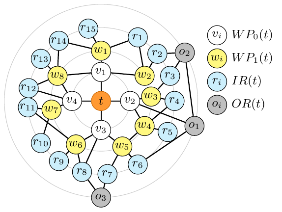
   <em>图 3：目的节点 t 的 Spraypoint level 示例。</em>

这些 level 控制任意源 $s$ 到目的 $t$ 的流量。第一步是 spraying：$s$ 随机转发到一个邻居。这个步骤与 $t$ 无关，即使 $s$ 和 $t$ 相邻也会发生。之后，中间节点 $u$ 遵循 pointing 规则：

1. 若 $u \in WP_0(t)$，转发给 $t$。
2. 若 $u \in WP_l(t)$，从 $WP_{l-1}(t)$ 中随机选的 $h$ 个邻居中 ECMP 转发。
3. 若 $u \in IR(t)$，转发到 $WP_\ell(t)$ 中随机选出的 $h$ 个邻居之一。
4. 若 $u \in OR(t)$，转发到通向 $IR(t)$ 最短路径上的 $h$ 个随机邻居之一。

以图 3 中从 $v_2$ 到 $t$ 的包为例，假设 $h=1$。首先 $v_2$ spray 到 $t$、$w_3$、$w_4$ 或 $o_1$ 之一。如果到 $t$，路径结束；如果到 $w_3$ 或 $w_4$，它会按第二条规则回到 $v_2$，然后到 $t$。Spraying 只在源端发生；如果包回到源端，就按 pointing 规则继续。如果 spray 到 $o_1$，它会经 $r_6,w_5,v_3$ 到达 $t$。

**为什么要 spraying。** Spraying 用 expander 的扩展性在源-目的对之间生成很多路径。一般情况下，源 $s$ 到目的 $t$ 的最短路径可能很少，但 expander 中存在很多边不相交的短路径。一个简单启发式是：从 $s$ 的所有邻居出发，分别沿最短路径去 $t$。Spraying 正是在实现这种启发式，也让人联想到 Valiant Load Balancing [35]。

**为什么要 waypoint。** 只做 spraying 在一些场景会失败。若 $s$ 是 $t$ 的邻居，$s$ spray 后，邻居们按最短路径去 $t$；除非某个邻居直接连到 $t$，否则最短路径往往经 $s$ 返回，于是几乎所有流量都会回到 $s$，导致 $s \rightarrow t$ 链路拥塞。高层 waypoint 会把流量进一步拉开，避免坍缩到这条链路上。每个节点选 $p$ 个邻居，也构造出以 $t$ 的每个邻居为根的 $p$-ary 转发图，帮助把流量扩散到所有邻居。

**设置 $\ell$。** 为实现 spraying 和 waypoint 的目标，作者设置 $\ell=\max(1, \lceil \log_p(n/2d^2) \rceil)$。这样 $WP_\ell(t) \cup IR(t)$ 的规模至少为 $n/2$，从而减少路径长度，因为 outer ring 中每个节点都很可能直接连到这个集合。

**路径长度可变。** 与其他 expander 路由方案一样，Spraypoint 对同一端点对可能计算出不同长度的路径 [32, 13, 14]。这不会影响 TCP 这类单路径传输，因为 ECMP 只会采一条路径；但可能影响 MPTCP、SRD、Falcon 等多路径传输，因为它们会把流量分到多条路径上，并可能用时延差作为拥塞或负载均衡信号 [36, 37, 38]。不过在一个跨度 300 米、100Gbps 链路的数据中心中，2 跳差异最多带来约 4.4 微秒差异，这相对 endhost 延迟和少量排队延迟很小。生产 fabric benchmark 也确认多路径协议没有性能问题。

**分布式实现。** Spraypoint 可以作为 link-state 协议全分布式实现，每个节点有完整拓扑视图。节点对每个目的地计算 level，再用 pointing 规则计算本地 next hop。所有节点通过共享 key 的确定性 hash 做一致 waypoint 选择，保证 pointing graph 无环。

作者用 VRF 实现 spraying。与先前用大量 VRF 创建非最短路径的方案不同，Spraypoint 只需要两个 VRF [32]。路由器面向服务器的接口使用一个 VRF，将入站流量 spray 到所有 fabric-facing 接口；面向 fabric 的接口使用第二个 VRF，按 pointing 规则转发。这样包最多可以回到源端一次，但不会无限循环。

**资源需求。** Spraypoint 使用两类路由器内存。第一类是 LPM 内存，把目的地址映射到 ECMP group id，其使用量取决于网络 prefix 数，类似 fat-tree。第二类把 ECMP group id 映射到 next hop 集合。可选实现有两种：一是每个目的节点一个 ECMP group，需要 $O(nh)$ 内存；二是预定义所有可能的 $d^h$ 个 group，每个目的地使用对应 group，需要 $O(hd^h)$ 内存。根据 $n,d$ 选择能在内存内支持更大 $h$ 的方法。对于 128 端口交换机，$d$ 约 64，至少 $h=2$ 总是可行，因为 $hd^h \approx 8K$。

Spraypoint 计算复杂度是每节点 $O(n^2d)$，因为每个节点需要为每个目的地检查 $nd$ 条边来计算 level。现代商用交换机 CPU 可以处理这种复杂度 [39]。作为对比，$k$-shortest-paths 路由复杂度是 $O(kn^2(d + \log n))$ [40]。

## 6. 准随机图的布线

RNG 使用 ShuffleBox 实现准随机图。先看数据中心布线背景：数据中心通常被划分成 $O(10)$ 个 room，每个 room 里有若干机架。服务器机架进入之前，room 会先准备好供电、散热和基础布线设施，包括 patch panel 和跨 room trunk cable。服务器机架进入后，再安装额外线缆连接它们。

布线成本和复杂度主要来自三点：连接器和端点对数量，其中 patch panel 和 ToR 都算端点；线缆长度以及 room 内/跨 room 线缆比例，跨 room 更贵；哪些布线可以在 room 准备阶段完成，哪些必须等机架到达后完成，越晚越慢也越有风险。

RNG 用 ShuffleBox 构造准随机图。每个 ShuffleBox 有 $d_r$ 个 r-port 连接路由器，有 $d_c$ 个 c-port 连接其他 ShuffleBox。r-port 和 c-port 分别终止 $f_r$ 和 $f_c$ 个光纤对。每个光纤对提供路由器之间的双工通信。ShuffleBox 在内部连接 r-port 和 c-port 之间的光纤对，满足 $d_r \times f_r = d_c \times f_c$。

  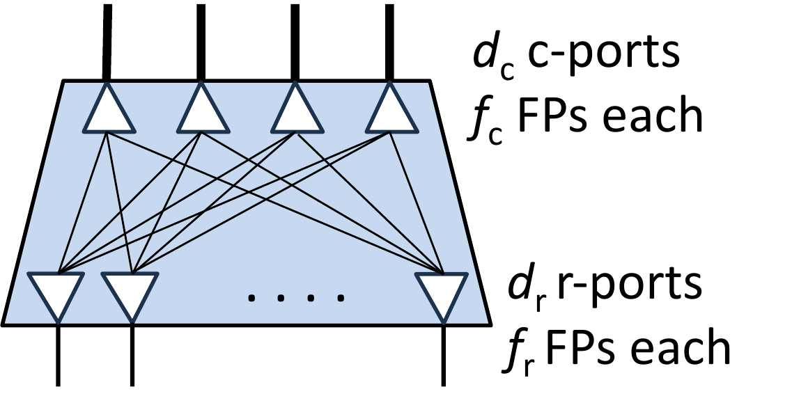
   <em>图 4：一个 ShuffleBox。</em>

为了通过 ShuffleBox 连接路由器，作者在每个 room 部署一组 ShuffleBox，称为 shuffle panel。路由器上行随机连接到 panel 中的 r-port。不同 room 中 panel 的 c-port 也随机连接。如果有 $R$ 个 panel，每个有 $C$ 个 ShuffleBox，则每个 panel 大约有 $\frac{(R-1)Cd_c}{R}$ 个 c-port 连接到其他 panel，本质上在 panel 之间构造随机图。未连接的 c-port 会插入 ShuffleBack，它把进入该 c-port 的光纤对两两桥接，例如 FP1 到 FP2，FP3 到 FP4。未连接路由器的 panel r-port 也会插入 ShuffleBack 来桥接 c-port 光纤对。

  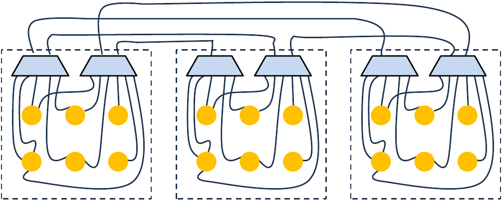
   <em>图 5：三 room 数据中心中的布线。路由器连接到本 room ShuffleBox 的 r-port；ShuffleBox 之间通过 c-port 互连。</em>

图 6 展示两台路由器形成逻辑连接的三种物理模式：同 room 路由器连到同一个 ShuffleBox，并通过带 ShuffleBack 的 c-port 桥接；不同 room 路由器的光纤对被 shuffle 到已连接的 c-port；路由器的光纤对最终落到另一个 room 中同一个带 ShuffleBack 的 r-port。最后一种模式里，两台 ToR 也可能在同一个 room。

  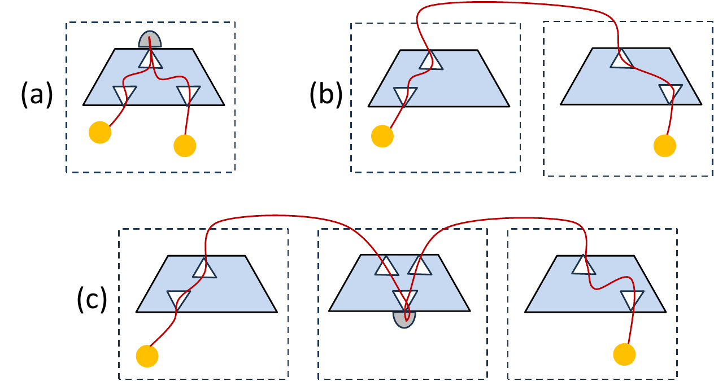
   <em>图 6：产生逻辑连接的物理连接模式。帽子符号表示 ShuffleBack。</em>

通过 ShuffleBox 连接的光损耗高于直连，但仍在商用收发器裕量内。作者禁用超过七个连接器的路径，以保持光信号质量。

**增量部署 room 和 rack。** RNG 可以增量部署。步骤是：新 room 准备时安装 shuffle panel；如果不是第一个 room，则随机移除一些既有 c-port 连接和 ShuffleBack，重新平衡 inter-panel connectivity，并把打开的 c-port 连接到新 panel；机架进入 room 时，把路由器上行随机连接到 r-port。

**ShuffleBox 配置。** 作者使用 $f_r=4$，对应 400Gbps 物理端口的 4 个 breakout lane。为让一个 r-port 中来自路由器的每个光纤对都能去不同地方，取 $d_c=f_r=4$。取 $f_c=32$，在商用连接器可得性和重平衡工作量之间折中。因为 $d_r f_r=d_c f_c$，得到 $d_r=32$。这种配置下，每个 c-port 的光纤对进入不同 r-port，每个 r-port 的光纤对进入不同 c-port，形成 full bipartite 的 shuffle 模式。

**布线复杂度。** 对 $n$ 台路由器和 $R$ 个 room，物理连接的端点对数量是 $n + \frac{R(R-1)}{2}$，而不是 $n^2$ 个逻辑连接对。每个 shuffle panel 被视为一个端点，因为 trunk cable 到 panel 后，panel 内部分配很简单。跨 room 线缆限制在 $\frac{R(R-1)}{2}$ 条 panel 间 trunk。除 router 到 r-port 的连接外，其他布线都可以在机架进入前完成。因此 RNG 的布线复杂度与 fat-tree 同一量级。重平衡 inter-panel connectivity 是 RNG 独有操作，但只在准备新 room 时少量发生。

**成本。** ShuffleBox 和 ShuffleBack 是新的无源光学组件，用于简化布线。由于是无源设备，其成本远低于交换机和收发器，并接近传统 patch panel 和 loopback [41, 42]。

**得到的图。** 虽然物理构造限制了一部分随机性，例如 c-port 边在 room 间均衡、bundle 边可能连接多对路由器，逻辑图仍具有与无约束随机图相同的 spectral gap，因此是优秀的 expander [23]。

## 7. 性能建模

按照准随机图的常见做法，分析会假设图是真正随机图。随机图本身和 spraying 带来的去相关，使 RNG 性能可以建模。模型必然有简化假设，但实验显示预测相当准确。本文给出路径长度、边不相交路径数、oversubscription 的近似公式，严格数学陈述和证明放在附录。

作者考虑的工作区间是：$(i)$ $2(\ln(n)+5) \le d \ll n$；$(ii)$ $p \ge (n/d^2)^{1/\ell}$；$(iii)$ $h \ll d$。其中 $\ell$ 是 Spraypoint waypoint level 数。这个区间中随机性尾部被削弱，性能更可预测；同时它仍然足够宽。商用交换机至少支持 128 条 breakout lane [43, 44]，因此对大 fabric 也能选择满足下界的 $d$。

### 7.1 边不相交路径

Spraypoint 利用扩展性计算许多边不相交路径。高概率下，$s$ 和 $t$ 之间的边不相交路径数近似为：

$$
\begin{cases}
d(1-\exp(-h)) & \text{if } s \notin WP_0(t) \\
\min[d-p, d(1-\exp(-(1-p/d)h))] & \text{if } s \in WP_0(t)
\end{cases}
$$

直觉是：若 $s$ 不是 $t$ 的邻居，对 $s$ 的每个邻居 spray 一个包，能到达多少个 $t$ 的邻居，就接近有多少条边不相交路径。这个过程类似 balls-and-bins 计算 [45]。若 $s \in WP_0(t)$，$s$ 的 $p$ 个邻居在 $WP_1(t)$ 中，spray 到这些 waypoint 的流量可能回到 $s$，因此公式会扣掉一部分。

结论是：对两类源节点，相比最大可能值 $d$ 的损失都与 $\exp(-h)$ 成正比。因此较小的 $h>1$ 已经足够好。从 $h=1$ 到 $h=2$，$\exp(-h)$ 从 0.37 降到 0.13，收益很大；继续增大收益快速递减。对相邻源节点，高 $p$ 会降低边不相交路径数。

### 7.2 路径长度

RNG 路径长度取决于 Spraypoint 各 level 的大小。包先随机 spray 到一个节点，然后 pointing hop 数由该节点的 level 决定。高概率下，长度为 $i$ 的路径比例近似为：

$$
\begin{cases}
1/n & i=1 \\
p^{i-2}d/n & 2 \le i \le \ell+2 \\
\exp(-p^\ell d^2/n) & i=\ell+4 \\
\text{rest} & i=\ell+3
\end{cases}
$$

图 7 比较模型和仿真，设置 $n=1K,d=64$，考虑两个 $p$ 值。模型和仿真匹配较好，尤其在 $p=2$ 时。$pd>n$ 时，低阶项开始影响 level 大小；本文为简化忽略它们。

  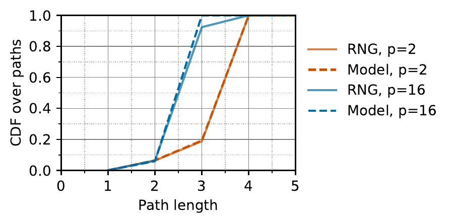
   <em>图 7：路径长度分布。</em>

几个结论：在实践区间 $\ell=1$ 时，最大路径长度是 5，且 5 跳路径比例可忽略，例如 $n=1K,d=64,p=2$ 时 $\exp(-pd^2/n) \approx 0.0003$。RNG 平均路径长度小于 3-tier fat-tree，因为后者大多数 ToR-ToR 路径是 4 跳。同一端点对之间 RNG 路径长度也可能不同，而 fat-tree 中同一端点对路径长度相同。$h$ 不影响路径长度。

### 7.3 吞吐与 oversubscription ratio

网络吞吐的核心指标之一是 oversubscription ratio。它表示在所有可能流量矩阵中，网络至少能交付的流量比例。Fat-tree 可以直接从层次结构分析 oversubscription，但 expander 不行。

模型基于两个观察。第一，最坏流量矩阵是 matching：每个节点全速发给一个节点，同时全速从一个节点收 [15]。本文用随机 source-destination pairing 来建模随机 oversubscription。虽然它未必总是最坏情况，但 Spraypoint 的 spraying 会去相关路径长度，随机情形能较好反映趋势 [17, 46, 47, 48]。第二，对给定流量矩阵，吞吐最大、oversubscription 最小时，流量应尽可能走最短路径。

作者估计随机 matching 中每条 flow 可由 $i$ 跳路径承载的最大比例 $\mu_i$。实践中 $\ell=1$ 时最大路径长度为 5，长度 1 的概率可忽略，所以考虑 $i \in [2,5]$。

$$
\mu_2 = d/n
$$

$$
\phi_3 = \min(pd/n,1-d/n) \cdot (1-d/n) \cdot (1-(4d/n)^h)
$$

$$
\kappa_3 = (1-\phi_3)^6/2 + (1-\phi_3^2)^3/6 +1/3
$$

模型最终给出：

$$
\text{oversubscription ratio} \approx (\mu_2 + \mu_3 + \mu_4 + \mu_5)^{-1}
$$

其中：

$$
\mu_3 = \phi_3\kappa_3
$$

$$
\mu_4 = [1 - (p+1)d/n - \exp(-pd^2/n)] \cdot \Big(1 - [1- (1-2d/n)(1-(4d/n)^h)]^h\Big) \cdot (1-\mu_2 - 2\mu_3)/4
$$

$$
\mu_5 = \exp(-pd^2/n)(1-\mu_2 - 2\mu_3 - 3\mu_4)/5
$$

这个模型描述 router mesh 层的 oversubscription。若要做 server-to-server 端到端分析，还要把 ToR 层 oversubscription 乘进去。

### 7.4 设计 fabric

实际设计时，拓扑参数 $n,d,p,h$ 的确定取决于目标权衡，例如 path length 与 oversubscription。论文举了一个常见目标：连接 $s$ 台服务器，同时让端到端 oversubscription 小于 $r_e$，ToR 层 oversubscription 小于 $r_t$，并最小化成本，也就是 ToR 数量。

做法是二分搜索最小可行 $d$，满足：

$$
d \ge \left\lceil \frac{P}{r_t+1} \right\rceil, \quad d \ge 2\ln\left(\left\lceil \frac{s}{P-d} \right\rceil\right)+5, \quad d

  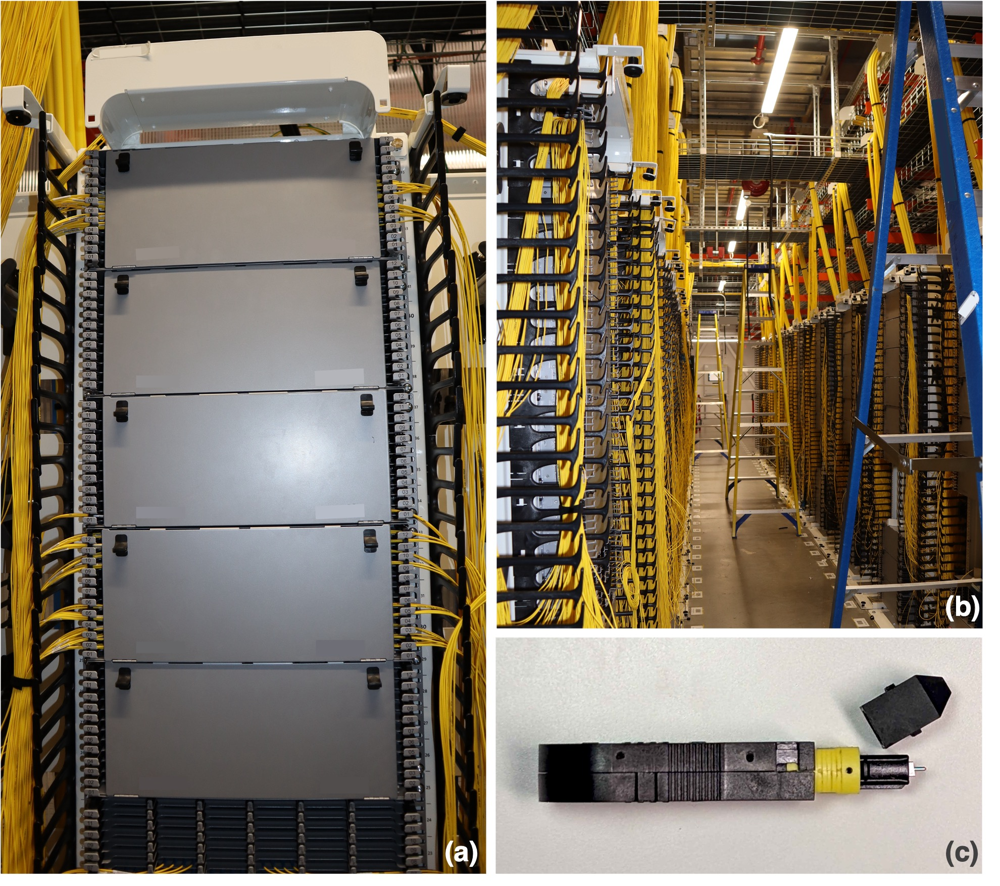
   <em>图 8：生产部署中的 ShuffleBox 模拟设备。（a）承载模拟 ShuffleBox 的机架之一；（b）模拟 ShuffleBox 的排；（c）带 4-FP MPO 连接器的 ShuffleBack dongle。</em>

**Spraypoint 性能。** 作者通过扩展 Amazon 基于最短路径的 link-state 协议实现 Spraypoint，复用拓扑传播组件，只修改 next hop 计算。对于规模类似的拓扑，Spraypoint 在故障后收敛时间等关键指标上与当前协议相近。

**布线经验。** 采用第 6 节方案布线 RNG 相对顺利。一个挑战是每个 room 要安装足够多的 ShuffleBox。因为一个 room 能放多少机架取决于功耗，因此作者用每个 room 路由器上行数的估计上界进行配置。RNG 随机图没有明显物理模式，操作员可能误接端口；实际误接率低于 1.5%。

**运维挑战。** 运营随机图需要升级大量网络管理工具。Fat-tree 层次结构已经深入工具链，例如设备命名、维护期间的冗余管理。Fat-tree 中 ToR 之间相互独立，升级可以按机架局部考虑；RNG 中必须考虑 ToR 间依赖，不能同时升级某个 ToR 的过多邻居。作者也确保故障定位正常，并构建了新工具来排查 ToR 间路径。

**应用性能。** 超大规模数据中心中，多数流量正在转向多路径传输协议 [37, 36, 38]。发送端把数据拆成几十个 flowlet，根据 hash 走不同网络路径；接收端重组和排序，对应用透明。发送端也会用时延作为选择 flowlet 的信号之一。

主要 benchmark 目标是验证路径时延差异不会影响应用性能。作者比较 RNG 与一个相同 oversubscription、相同服务器规格的生产 fat-tree fabric。结果按 fat-tree 均值归一化。

图 9 展示 127 条并发无限需求流在随机服务器对之间的吞吐分布。RNG 与 fat-tree 基本一致，说明两种网络路径时延差异对应用性能没有实质影响。

  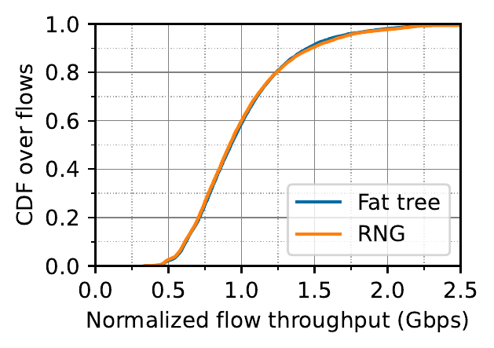
   <em>图 9：多路径传输每条 flow 的吞吐，按 fat-tree 均值归一化。</em>

图 10 左侧比较服务器对之间 64B 小包的 PPS，RNG 略高，因为背景流量更少；右侧展示客户端到多个服务器进行存储读的 IOPS，RNG 也匹配 fat-tree。

  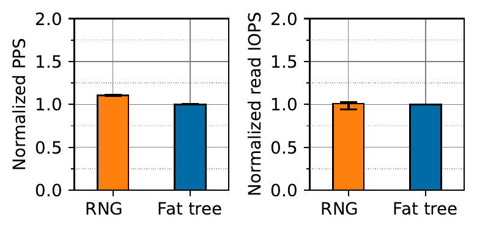
   <em>图 10：64B 包 PPS（左）和存储读 IOPS（右）。误差线表示标准差。</em>

这些 benchmark 以及没有用户报告性能问题，说明 RNG 在更低成本、更高容错的同时，可以匹配 fat-tree 性能。

## 9. 更广泛评估

生产 fabric benchmark 能验证真实应用表现，但要覆盖更广参数和工作负载，还需要仿真。作者评估 RNG 的 oversubscription ratio、Spraypoint 产生边不相交路径的能力，并与 fat-tree 比较吞吐和成本。

### 9.1 Oversubscription

Oversubscription ratio 描述网络最坏情况吞吐，并量化拥塞风险。Namyar 等证明最坏吞吐出现在 perfect unidirectional matching，每个节点全速发给对应节点 [15]。但他们没有给出如何在众多 matching 中找到最坏 matching。本文随机生成 100 个 matching，并用最差值估计 oversubscription。由于拓扑和路由都随机，分布很窄 [48, 47]。

给定一个 matching，如果每个发送方至少能发送其全速的 $1/r$ 且不让任何链路拥塞，则 oversubscription ratio 为 $r$。作者通过求解多商品流线性规划计算 $r$ [49]。这些 LP 很大，每个需要数小时，因此限制了能研究的最大 fabric。

图 11 比较仿真结果和模型。默认值为 $n=1000,d=64,p=4,h=2$，可支持 64K 台服务器、100Gbps 上行，并提供 3.25 的 oversubscription ratio。改变参数时，oversubscription 平滑变化，说明随机图支持细粒度性能等级。$h$ 和 $p$ 的影响在超过某个点后趋于平坦。

<table align="center">
  <tr>
    <td align="center" width="50%">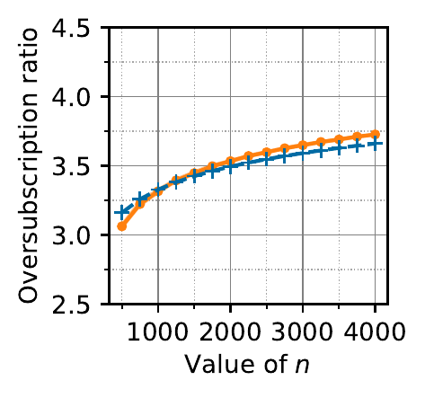 <em>图 11a：改变 n。</em></td>
    <td align="center" width="50%">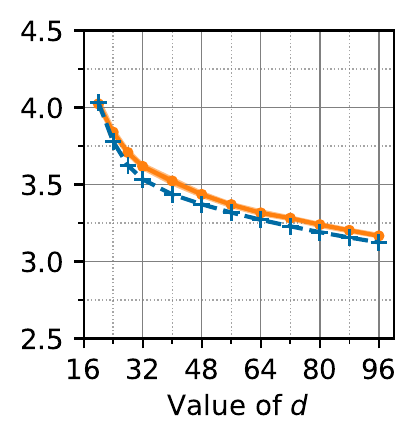 <em>图 11b：改变 d。</em></td>
  </tr>
  <tr>
    <td align="center" width="50%">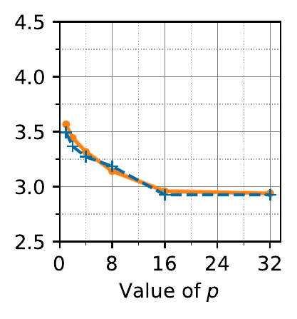 <em>图 11c：改变 p。</em></td>
    <td align="center" width="50%">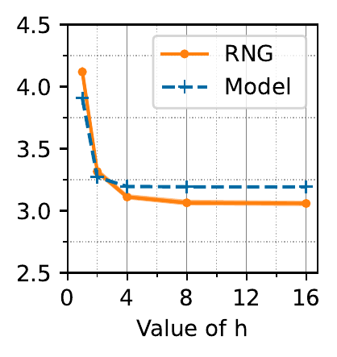 <em>图 11d：改变 h。</em></td>
  </tr>
</table>

<em>图 11：不同拓扑参数下的 oversubscription。默认值为 n=1000, d=64, p=4, h=2。</em>

模型与实验结果匹配较好，使运营者可以像规划 fat-tree 一样规划 RNG fabric，同时获得更低成本、更高容错和更细粒度的性能调节。部分图中参数严格来说在模型区间外，例如 $d=20$ 不满足 $d \ge 2(\ln(1000)+5)$，但模型在区间外也平滑退化。

### 9.2 边不相交路径

Spraypoint 的目标是找到许多边不相交路径。作者计算端点对之间的 min cut，它等于边不相交路径数量 [50]。图 12 展示默认参数下端点对 min cut 的 CDF，并与 $k$-shortest-path routing 比较。$k=8$ 是先前建议值，$k=64$ 等于节点 degree，但需要 8 倍资源。

几乎所有端点对上，Spraypoint 都找到超过 50 条边不相交路径；一半端点对超过 60 条，接近最大可能值 64。相比之下，8-shortest-paths 中位数为 5，64-shortest-paths 中位数为 35。这直接影响 oversubscription：两种 k-shortest 配置的 oversubscription 分别是 21.3 和 4.7，而 Spraypoint 是 3.25。Spraypoint 更容易实现，也能找到更多路径多样性。

  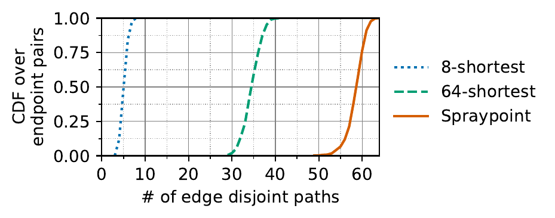
   <em>图 12：边不相交路径数量。</em>

### 9.3 相对 fat-tree 的吞吐

除了最坏流量外，运营者还需要验证其他流量模式。作者把任意流量模式看作三类基本模式组合：clique、hubs、matchings。

- Clique：一组节点彼此交换流量，例如 all-reduce、存储服务器复制。
- Hubs：部分节点向所有其他节点发送并从所有其他节点接收，例如 Web 或存储服务器。
- Matchings：节点把所有流量发给另一个节点，即前面研究过的模式。

这些模式中的节点是 ToR，而不是单台服务器，因为 ToR 级别更能压测 fabric [15]。每类模式都用 active fraction $f$ 参数化，其中 $0 \le f \le 1$。例如 clique($f=0.2$) 表示 clique 大小是节点数的 20%。每个 $f$ 生成 100 个随机流量矩阵，用前面的 $r$ 衡量网络至少能承载每条 flow 的比例。

图 13 中，两种拓扑都设计为支持 61.4K 台服务器、960 台 ToR、最坏 oversubscription 3:1。在这个配置中，RNG 使用的交换机少 45%。结果显示，对 clique 和 hubs，RNG 在很宽范围内最高好 30%。例外是 $f<0.1$ 的少数情况，fat-tree 好 5% 到 10%，因为最短路由可找到等于 ToR degree 的边不相交路径；RNG 在 $h=2$ 时这一数量低约 10%。对 matchings，$f<0.4$ 时 fat-tree 更好，之后 RNG 更好。

  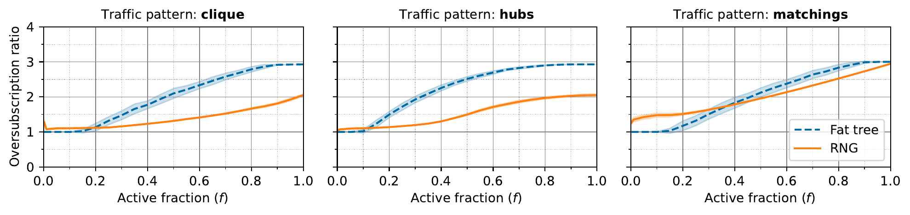
   <em>图 13：不同流量矩阵下的 oversubscription ratio，越低越好。两种拓扑都配置为最坏 3:1 oversubscription；RNG 使用的交换机少 45%。</em>

Amazon 运营者更偏好 RNG 的总体性能，尤其考虑它更低成本和更高容错。低 $f$ 下 fat-tree 稍好是可以接受的，因为这要求一个机架内所有服务器同步行动，这在多租户数据中心中很少见。

### 9.4 相对 fat-tree 的成本

先前工作给出的 expander 相对 fat-tree 成本差异很难比较，因为性能指标和网络规模不同。本文模型可以系统分析成本随 oversubscription 和网络规模的变化。

作者用两种拓扑所需交换机数量之比衡量相对成本。这个指标自动包含收发器，因为收发器数量与交换机端口数量成正比。它忽略线缆、连接器、patch panel 等无源光学组件；这些组件成本占少数，也与具体布线方法有关。交换机数量更通用、可复现。

图 14 显示不同 oversubscription 和端口数下，RNG 相对 3-tier fat-tree 的交换机数量减少。作者按第 7.4 节方法计算 RNG 所需交换机数，并与同 oversubscription 的 generalized 3-tier fat-tree 比较。两种拓扑中 ToR 都不 oversubscribe。

  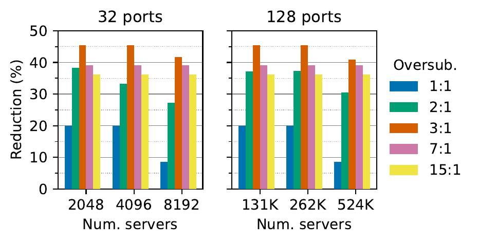
   <em>图 14：在两种端口数下，RNG 相对 3-tier fat-tree 的交换机数量减少。</em>

成本降低幅度从 9% 到 45%，差异接近 5 倍。这个模式在不同端口数和网络规模下类似，oversubscription ratio 是关键决定因素。1:1 non-blocking 场景收益较低，因为 fat-tree 本身没有困住容量；此时 RNG 的收益主要来自更短路径。oversubscription 从 1:1 增到 3:1 后，成本优势开始缓慢下降，因为高 oversubscription fat-tree 在 aggregation/spine 层本来就用更少交换机。

## 10. 相关工作

本文建立在长期研究基础上。Expander 作为路由意义上的“最优”图，早在 1990 年代就被定义 [51]；随机图近似最优 expander 也早已为人所知 [33]。许多工作提出了数据中心 expander 拓扑并研究其性能 [13, 14, 28, 16, 15, 17]。特别影响本文的是 Jellyfish、Xpander 和 Namyar 等人的 throughput-centric 分析。本文在此基础上解决路由、布线、性能可预测性三个未解决挑战，并部署了第一个生产 expander 网络。

也有非 expander 拓扑试图解决 fat-tree 部分问题，例如 HyperX、DCell、BCube [52, 53, 54]。作者选择随机图，因为它路径长度显著更短，而且这些其他拓扑在大规模、多 room 数据中心中的布线仍是开放问题。

容量可替代性也可以通过可重构硬件实现，但本文使用 expander，因为它不需要逻辑集中控制平面，也不需要非标准硬件。多数可重构设计需要控制平面预测全局流量需求并动态重构拓扑 [7, 6, 5, 4, 8]。超大规模数据中心、Web 工作负载的大量突发流量、以及重构延迟，都会让这种控制平面难以开发和运营。

还有 demand-oblivious 的可重构设计，不需要集中控制平面 [10, 55, 11]。它们使用快速按固定调度循环的新型光设备。任意时刻并不存在 all-to-all 连接，系统会基于 Birkhoff-von Neumann 流量矩阵分解，经中间节点转发 [56]。除依赖非商用硬件外，这些方案还带来时间同步、TCP flow 内乱序、吞吐下降、交换机级拥塞控制等软件风险。

## 11. 结论

基于准随机图的扁平 expander 拓扑，可以通过本文提出的路由和布线方法实际落地。借助本文模型，它们也可以按目标性能和成本进行设计。RNG 展示了一条重要路线：不依赖集中式需求预测，也不依赖可重构硬件，而是用随机图、分布式路由和可部署的光学布线组件，把 capacity fungibility 变成生产数据中心网络中的现实能力。

## 附录 A. 增量布线

第 6 节中的物理连接可以增量完成。第一个 room 准备时部署它的 shuffle panel；ShuffleBox 数量根据该 room 预计 ToR 上行数确定。初始时，所有 r-port 和 c-port 都插入 ShuffleBack。机架进入后，ToR 连接到随机 r-port，被选中的 r-port 上的 ShuffleBack 被移除。ToR 开始通过 c-port ShuffleBack 形成随机图，如图 6a。过程中并非所有 ToR 上行都会立即找到 match。

第二个 room 准备时，部署它的 shuffle panel，并把 c-port 连接到第一个 room 的 panel。如果两个 panel 大小相同，各自一半 c-port 连接对方；否则按比例调整。端口随机选择。这些连接通过两个 room 之间的 trunk cable 实现。建立连接时要移除 c-port 上的 ShuffleBack，于是某些 ToR 的连接模式会从图 6a 变成图 6c。

后续 room 也是类似流程：部署新 panel，然后重新平衡 c-port connectivity。例如从两个 room 变成三个 room 时，原本 room 1 一半 c-port 连 room 2；现在三分之一应连 room 2，三分之一连 room 3，三分之一保留 ShuffleBack。为此需要随机打断一些 room 1 和 room 2 之间的既有 c-port 连接，用释放出来的 c-port 连接 room 3。

重平衡会打断承载实时流量的逻辑链路，因此需要先 drain 受影响链路。严格来说，机架进入并移除 r-port ShuffleBack 时也会改变逻辑连接，但影响范围小得多：$f_r=4$，而 c-port 的 $f_c=32$。

### A.1 增长痛点

增量构造的一个副作用是：数据中心早期增长阶段，并非所有 ToR 上行都能形成有效邻接。对 room 1 中的上行来说，它必须连接到一个 r-port FP，而这个 FP 要通过 c-port ShuffleBack 桥接到另一个已连接上行的 r-port。当已填充 r-port 比例很小时，这个概率较低。第二个 room 也有类似现象，但较轻，因为一半上行会通过 c-port 连接去第一个 room 找 match。

图 15 展示部署更多 ToR 时，已部署上行中形成有效邻接的比例。仿真数据中心有 10 个 room，每个 100 个 ToR。room 1 中上行找到 match 的比例线性增长。room 2 开始后，匹配比例有短暂下降，因为 room 2 ToR 的匹配上行较少且其占比在增加；但最低点仍超过 90%。room 2 之后影响可忽略。

  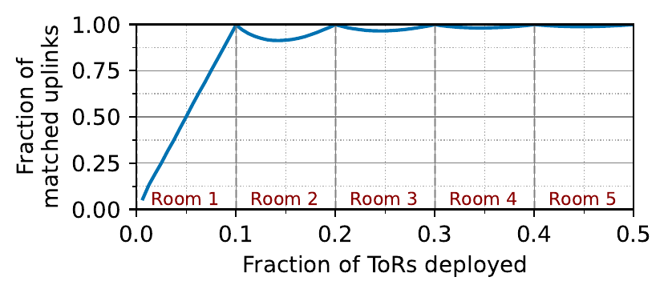
   <em>图 15：数据中心增长时，成功匹配的上行比例。</em>

图 16 显示，如果不分阶段，room 1 早期吞吐较差。Amazon 运营者认为这种行为对快速增长的数据中心可接受，因为低性能窗口很短，可以延迟应用上线。但对慢速增长的数据中心，早期性能差可能成为问题。

  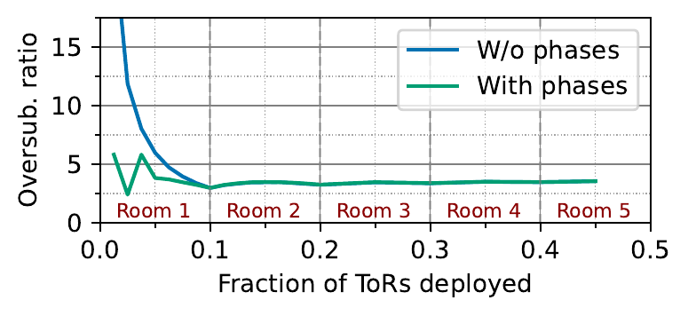
   <em>图 16：数据中心增长时的 oversubscription。</em>

为此，作者提出把第一个 room 的 ShuffleBox 划分成两个或更多 phase。初始 ToR 只连接 phase 1 ShuffleBox；当这些 ShuffleBox 填满后，再连接 phase 1 和 phase 2 的 c-port，并让后续 ToR 连接 phase 2。这个过程把一个 room 划分成更小的逻辑 room，从而缩短低性能窗口。图 16 中 With phases 曲线展示了两阶段方案的影响，其中第一阶段占 room 的 30%。

### A.2 扩容模型

扩容模型预测任意时间点 fabric 的平均 degree。扩容发生在 stage 中，每个 stage 对应一组新 ShuffleBox panel 和相关重布线。一个 stage 可以是一个 room，也可以是 room 内一个 phase。

令时间 $t$ 表示相对完整数据中心而言已经部署的路由器比例，其中 $0 \le t \le 1$。stage $[t_1,t_2]$ 从 $t_1$ 开始，到 $t_2$ 结束。每台路由器有 $d$ 条上行。

第一阶段没有前序路由器，因此 ToR 上行找到 match 的概率随已占用 r-port 比例线性增长。若第一阶段大小为 $T_0$，时间 $t$ 的平均 degree 是 $d t/T_0$。

后续 stage 中有三个不变量：任意 stage 结束时图 degree 为 $d$；前序 stage 的所有路由器保持 degree $d$；当前 stage 内新路由器落地时，期望能找到 match 的上行比例等于当前已部署路由器比例。

因此，stage $[t_1,t_2]$ 中的平均 degree 为：

$$
d\left[\frac{t_1}{t}+\frac{t-t_1}{t_2}\right]
$$

图 17 比较该模型和图 16 的仿真，曲线几乎不可区分。

  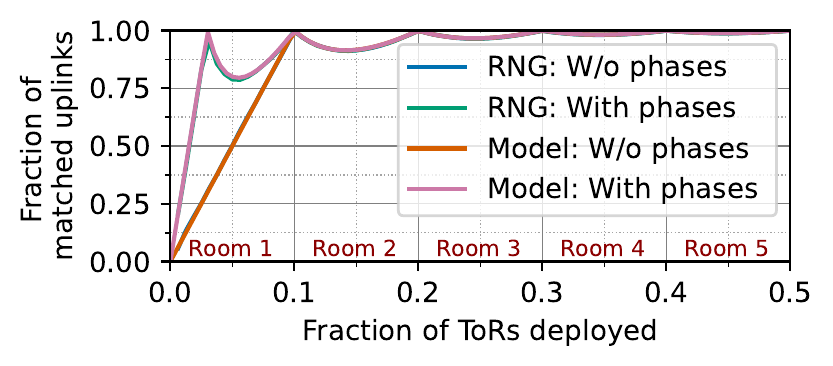
   <em>图 17：成功匹配上行比例的模型预测与仿真比较。</em>

### A.3 最优 phase

模型可用于计算最优 phase：给定运营者输入的 $\alpha$ 和 $\beta$，找最少 phase 数及其大小，使得当第一个 room 至少部署 $\beta$ 比例时，平均 degree 至少为 $\alpha d$。若 $\alpha \le \beta$，一个 phase 即可。若 $\alpha>\beta$，需要分阶段。

两阶段情况下，对给定 $\alpha$，可达到的最小 $\beta$ 为：

$$
\beta^* = \alpha(1-\sqrt{1-\alpha})^2
$$

且当第一阶段大小为 $\beta/\alpha$ 时达到最小值。证明利用模型中的双曲线 $t_1/t + t/t_2$，其最小值出现在几何均值 $\sqrt{t_1t_2}$，从而最小平均 degree 为：

$$
d(2\sqrt{t_1/t_2}-t_1/t_2)
$$

图 18 展示 $\alpha$ 与最优 $\beta$ 的关系。若希望 degree 至少 $0.8d$，则在第一个 room 部署约 25% 时就能达到，第一阶段约占该 room 的 30%。

  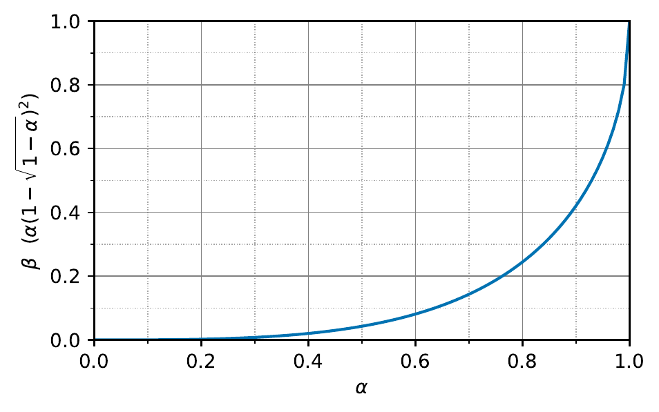
   <em>图 18：两阶段部署中，给定 alpha 可实现的最小 beta。</em>

## 附录 B. 降低时延

虽然 expander 拓扑跳数少于 fat-tree，但在大型数据中心中，路径可能更长，因为每一跳平均跨越半个数据中心长度。更高传播时延可能超过少跳数节省的交换延迟。

作者模拟一个跨度 300 米、4K ToR、10 个等大小 room 的数据中心。RNG 的 patching panel 位于每个 room 中央。Fat-tree 有 4 层，ToR 连接到 aggregation pod，pod 中两层交换机分别连接 ToR 和 spine；aggregation pod 位于每个 room 中央，所有 spine 位于数据中心中央 room [57]。两种拓扑都使用 100Gbps 链路，线缆沿 cable tray 铺设 [58]。图 19 先验证时延估计方法与生产 server mesh 实测吻合。

  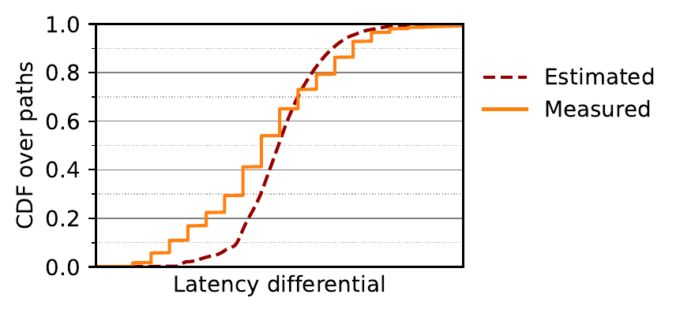
   <em>图 19：基于数据中心布局估计的时延与生产 fabric 实测对比。单位因保密省略。</em>

仿真中，fat-tree 大多数 ToR 对是 6 跳，RNG 大多数是 4 跳；但图 20 显示，RNG baseline 的单向中位时延比 fat-tree 高 15%（8.4 vs. 7.1 微秒）。差异看似小，但会随往返叠加，因此运营者很敏感。

  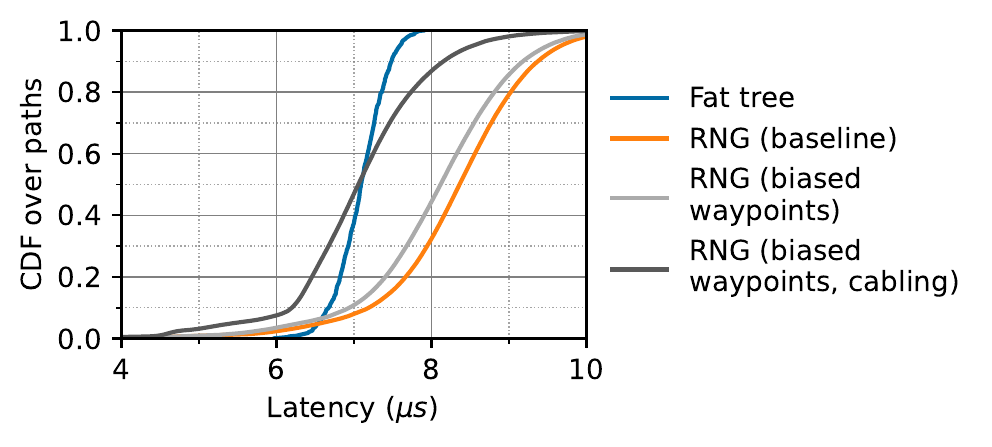
   <em>图 20：ToR-ToR 路径时延分布。</em>

作者用两个简单改动降低 RNG 时延且不损害性能。

**偏置 waypoint 选择。** 选择 waypoint 时，不再从 $v \in Nbr(t)$ 的邻居中均匀随机选 $p$ 个，而是优先选离 $t$ 更近的 waypoint。候选 $w$ 的排序指标是 $room\_dist(w,v)+room\_dist(v,t)$。使用粗粒度 room 距离而不是真实光纤长度，可以避免系统性偏好某些恰好离 cable tray 近的位置。

**偏置布线。** 减少 inter-room 连接数量，因为它们比 intra-room 更长。具体地，patching panel 到另一个 panel 的 c-port 连接数为：

$$
\alpha \times \frac{1}{R} \times C \times d_c
$$

其中 $C,R,d_c$ 分别是 ShuffleBox 数量、room 数、每个 ShuffleBox 的 c-port 数，$\alpha$ 控制 inter-room 连接量，且 $0 \le \alpha \le 1$。baseline 中 $\alpha=1$；作者使用 $\alpha=0.5$，将 inter-room 连接减半。因为 inter-room capacity 仍足够，所以不损害吞吐；同时也减少跨 room 线缆成本。

图 20 显示这两个改动使 RNG 中位时延接近 fat-tree。偏置 waypoint 选择降低 0.3 微秒，偏置布线进一步降低 1 微秒。还可以通过限制 spraying 到较近邻居、distance-aware 选择 $h$ 个 next hop 进一步降时延，但这些方法会减少边不相交路径或部分流量矩阵吞吐，因此只适合可接受性能下降的场景。

## 附录 C. 建模推导概览

RNG 建模优先追求简单公式，而不是数学上最紧的表达。它做了许多建模假设，并在 $n$ 变大时忽略低阶项。作者把工作区间限制在这些假设误差较小的区域：$2(\ln(n)+5)\le d \ll n$，$p\ge(n/d^2)^{1/\ell}$，$h\ll d$。由于拓扑和路由都是随机的，结论是高概率成立，低概率可能失败。

推导分四步。

**随机图预备。** 路由器图 $G=(V,E)$ 有 $n$ 个节点和 degree $d$。作者用 random configuration graph 建模 [59]：每个节点有 $d$ 个 half-edge，随机两两配对得到边。分析中常用两个工具：线性期望、union bound 和 Chernoff bound [60]。例如，若集合 $S$ 还有 $k$ 个未配对 half-edge，则外部节点 $v\notin S$ 成为 $S$ 邻居的概率至少 $1-\exp(-k/n)$。

**路径长度建模。** 固定目的 $t$，令 $WP_i(t)$ 为 waypoint level。作者证明高概率下：

$$
|WP_i(t)|=(1\pm o(1))dp^i, \quad 0\le i\le \ell
$$

若 $\lambda=p^\ell d^2/n$，则：

$$
|OR(t)|\le (\exp(-\lambda)+o(1))n
$$

并且 $OR(t)$ 中所有节点都连到 $IR(t)$。由此得到正文第 7.2 节的路径长度分布：长度 1 的路径有 $d$ 条；长度 $2\le i\le\ell+2$ 的路径约有 $p^{i-2}d^2$ 条；长度 $\ell+4$ 的路径至多约有 $\exp(-\lambda)nd$ 条；其余为 $\ell+3$。

**边不相交路径建模。** 对固定目的 $t$，定义 pointing graph $P(t)$，包含所有用于转发到 $t$ 的边。对源-目的对 $(s,t)$，Spraypoint graph $SP(s,t)$ 是 $s$ 的所有 incident edge 加上从 $N(s)$ 到 $t$ 的 Spraypoint path 的并集。作者把 $s$-$t$ mincut 连接到一个二分图最大匹配问题：若 $S\subseteq IR(t)$，把 $S$ 连到 $Nbr(t)$ 中其后代，则 mincut 等于该二分图最大匹配大小。

令 $\mu(\ell,r;h)$ 表示左侧 $\ell$ 个节点、右侧 $r$ 个节点、每个左侧节点随机选 $h$ 个右侧邻居时的期望最大匹配大小。则在 $h=o(d)$ 下：

- 若 $s\in Nbr(t)$，$s$-$t$ mincut 至少约为 $\mu(d-p,d;h)$。
- 若 $s\notin Nbr(t)$，mincut 至少约为 $\mu(d,d;h)$。

经验上：

$$
\mu(d,d;h)\approx d(1-\exp(-h))
$$

若 $d-p=\alpha d$，则：

$$
\mu(d-p,d;h)\approx \min[\alpha d, d(1-\exp(-\alpha h))]
$$

所以 $h=1$ 可达到约 $0.63d$，$h=2$ 达到约 $0.86d$，$h=4$ 达到约 $0.98d$。继续增大 $h$ 的收益被统计波动淹没。

| $p$ | $h=1$ | $h=2$ | $h=4$ |
|---|---:|---:|---:|
| $0$ | 0.63 | 0.86 | 0.98 |
| $d/4$ | 0.53 | 0.75 | 0.75 |
| $d/3$ | 0.49 | 0.66 | 0.66 |
| $d/2$ | 0.39 | 0.50 | 0.50 |

**Oversubscription 建模。** 作者把每条无向边视作两个有向 arc，每个 arc 容量为 1。需求矩阵 $M$ 是 doubly stochastic，$M_{s,t}$ 是 $s$ 发给 $t$ 的流量。若最大 $c$ 使得 $cM$ 可行，则 $c(M)$ 是 demand multiplier。Oversubscription ratio 是 $\max_M d/c(M)$。

核心原则包括：优先使用短路径；用随机 permutation matrix 代表平均情形；短路径消耗的容量用随机删除边来近似；估计每种长度路径的可用数量；用路径在不同位置上的重叠建模拥塞；最后用路径拥塞倒数估计每条路径能承载的流量。

对 $\ell=1$，路径长度在 2 到 5 之间。模型依次估计 $\mu_2,\mu_3,\mu_4,\mu_5$。长度 2 路径几乎不重叠，所以 $\mu_2=d/n$。长度 3 需要估计可行路径比例 $\phi_3$ 和拥塞修正 $\kappa_3$。更长路径拥塞接近最大值，因此简化为每条长度 $i$ 路径承载 $1/i$ 流量。最终得到正文第 7.3 节的多项式公式，并以 $(\mu_2^+ + \mu_3^+ + \mu_4^+ + \mu_5^+)^{-1}$ 作为 oversubscription 估计。

## 参考文献

[1] Gangidi, Adithya and Miao, Rui and Zheng, Shengbao and Bondu, Sai Jayesh and Goes, Guilherme and Morsy, Hany and Puri, Rohit and Riftadi, Mohammad and Shetty, Ashmitha Jeevaraj and Yang, Jingyi and Zhang, Shuqiang and Fernandez, Mikel Jimenez and Gandham, Shashidhar and Zeng, Hongyi。RDMA over Ethernet for Distributed Training at Meta Scale。Proc. ACM SIGCOMM Conference on Data Communication。2024。 https://doi.org/10.1145/3651890.3672233

[2] Qian, Kun and Xi, Yongqing and Cao, Jiamin and Gao, Jiaqi and Xu, Yichi and Guan, Yu and Fu, Binzhang and Shi, Xuemei and Zhu, Fangbo and Miao, Rui and Wang, Chao and Wang, Peng and Zhang, Pengcheng and Zeng, Xianlong and Ruan, Eddie and Yao, Zhiping and Zhai, Ennan and Cai, Dennis。Alibaba HPN: A Data Center Network for Large Language Model Training。Proc. ACM SIGCOMM Conference on Data Communication。2024。 https://doi.org/10.1145/3651890.3672265

[3] Singh, Arjun and Ong, Joon and Agarwal, Amit and Anderson, Glen and Armistead, Ashby and Bannon, Roy and Boving, Seb and Desai, Gaurav and Felderman, Bob and Germano, Paulie and Kanagala, Anand and Provost, Jeff and Simmons, Jason and Tanda, Eiichi and Wanderer, Jim and H\"olzle, Urs and Stuart, Stephen and Vahdat, Amin。Jupiter Rising: A Decade of Clos Topologies and Centralized Control in Google's Datacenter Network。Proc. ACM SIGCOMM Conference on Data Communication。2015。 https://doi.org/10.1145/2785956.2787508

[4] Ghobadi, Monia and Mahajan, Ratul and Phanishayee, Amar and Devanur, Nikhil and Kulkarni, Janardhan and Ranade, Gireeja and Blanche, Pierre-Alexandre and Rastegarfar, Houman and Glick, Madeleine and Kilper, Daniel。Projector: Agile reconfigurable data center interconnect。Proc. ACM SIGCOMM Conference on Data Communication。2016。

[5] Halperin, Daniel and Kandula, Srikanth and Padhye, Jitendra and Bahl, Paramvir and Wetherall, David。Augmenting data center networks with multi-gigabit wireless links。Proc. ACM SIGCOMM Conference on Data Communication。2011。

[6] Hamedazimi, Navid and Qazi, Zafar and Gupta, Himanshu and Sekar, Vyas and Das, Samir R and Longtin, Jon P and Shah, Himanshu and Tanwer, Ashish。Firefly: A reconfigurable wireless data center fabric using free-space optics。Proc. ACM SIGCOMM Conference on Data Communication。2014。

[7] Wang, Guohui and Andersen, David G. and Kaminsky, Michael and Papagiannaki, Konstantina and Ng, T.S. Eugene and Kozuch, Michael and Ryan, Michael。c-Through: part-time optics in data centers。Proc. ACM SIGCOMM Conference on Data Communication。2010。 https://doi.org/10.1145/1851182.1851222

[8] Farrington, Nathan and Porter, George and Radhakrishnan, Sivasankar and Bazzaz, Hamid Hajabdolali and Subramanya, Vikram and Fainman, Yeshaiahu and Papen, George and Vahdat, Amin。Helios: a hybrid electrical/optical switch architecture for modular data centers。Proc. ACM SIGCOMM Conference on Data Communication。2010。

[9] Zhou, Xia and Zhang, Zengbin and Zhu, Yibo and Li, Yubo and Kumar, Saipriya and Vahdat, Amin and Zhao, Ben Y and Zheng, Haitao。Mirror mirror on the ceiling: Flexible wireless links for data centers。ACM SIGCOMM Computer Communication Review。2012。

[10] Mellette, William M. and Forencich, Alex and Athapathu, Rukshani and Snoeren, Alex C. and Papen, George and Porter, George。Realizing RotorNet: Toward Practical Microsecond Scale Optical Networking。Proc. ACM SIGCOMM Conference on Data Communication。2024。 https://doi.org/10.1145/3651890.3672273

[11] Mellette, William M and Das, Rajdeep and Guo, Yibo and McGuinness, Rob and Snoeren, Alex C and Porter, George。Expanding across time to deliver bandwidth efficiency and low latency。USENIX Symposium on Networked Systems Design and Implementation (NSDI)。2020。

[12] Liu, Hong and Urata, Ryohei and Yasumura, Kevin and Zhou, Xiang and Bannon, Roy and Berger, Jill and Dashti, Pedram and Jouppi, Norm and Lam, Cedric and Li, Sheng and Mao, Erji and Nelson, Daniel and Papen, George and Tariq, Mukarram and Vahdat, Amin。Lightwave Fabrics: At-Scale Optical Circuit Switching for Datacenter and Machine Learning Systems。Proc. ACM SIGCOMM Conference on Data Communication。2023。 https://doi.org/10.1145/3603269.3604836

[13] Ankit Singla and Chi-Yao Hong and Lucian Popa and Philip Brighten Godfrey。Jellyfish: Networking Data Centers Randomly。Proceedings of the 9th USENIX Symposium on Networked Systems Design and Implementation (NSDI)。2012。 https://www.usenix.org/conference/nsdi12/technical-sessions/presentation/singla

[14] Valadarsky, Asaf and Shahaf, Gal and Dinitz, Michael and Schapira, Michael。Xpander: Towards Optimal-Performance Datacenters。Proc. International on Conference on emerging Networking EXperiments and Technologies (CoNEXT)。2016。 https://doi.org/10.1145/2999572.2999580

[15] Namyar, Pooria and Supittayapornpong, Sucha and Zhang, Mingyang and Yu, Minlan and Govindan, Ramesh。A throughput-centric view of the performance of datacenter topologies。Proc. ACM SIGCOMM Conference on Data Communication。2021。 https://doi.org/10.1145/3452296.3472913

[16] Kassing, Simon and Valadarsky, Asaf and Shahaf, Gal and Schapira, Michael and Singla, Ankit。Beyond fat-trees without antennae, mirrors, and disco-balls。Proc. ACM SIGCOMM Conference on Data Communication。2017。 https://doi.org/10.1145/3098822.3098836

[17] Jyothi, Sangeetha Abdu and Singla, Ankit and Godfrey, P Brighten and Kolla, Alexandra。Measuring and understanding throughput of network topologies。Proceedings of the International Conference for High Performance Computing, Networking, Storage and Analysis (SC)。2016。

[18] Mogul, Jeffrey C. and Wilkes, John。Physical Deployability Matters。Proc. ACM Workshop on Hot Topics in Networks (HotNets)。2023。 https://doi.org/10.1145/3626111.3628190

[19] Al-Fares, Mohammad and Loukissas, Alexander and Vahdat, Amin。A scalable, commodity data center network architecture。Proc. ACM SIGCOMM Conference on Data Communication。2008。 https://doi.org/10.1145/1402958.1402967

[20] Schlinker, Brandon and Mysore, Radhika Niranjan and Smith, Sean and Mogul, Jeffrey C. and Vahdat, Amin and Yu, Minlan and Katz-Bassett, Ethan and Rubin, Michael。Condor: Better Topologies Through Declarative Design.。Proc. ACM SIGCOMM Conference on Data Communication。2015。 http://dblp.uni-trier.de/db/conf/sigcomm/sigcomm2015.html#SchlinkerMSMVYK15

[21] Jayaram Mudigonda and Praveen Yalagandula and Jeffrey C. Mogul。Taming the Flying Cable Monster: A Topology Design and Optimization Framework for Data-Center Networks。USENIX Annual Technical Conference。2011。 https://api.semanticscholar.org/CorpusID:2989246

[22] F. R. K. Chung and R. L. Graham and R. M. Wilson。Quasi-Random Graphs。Combinatorica。1989。

[23] Wikipedia。Expander graph。2026。 https://en.wikipedia.org/wiki/Expander_graph

[24] Ohring, Sabine R and Ibel, Maximilian and Das, Sajal K and Kumar, Mohan J。On generalized fat trees。Proc. International Parallel Processing Symposium。1995。

[25] Allan Kaye。Rail-Optimised Networking: How NVIDIA is Rethinking AI Network Design in the Data Centre。2025。 https://vespertec.com/news/rail-optimised-networking-how-nvidia-is-rethinking-ai-network-design-data-centre/

[26] Eitan Zahavi。Fat-tree routing and node ordering providing contention free traffic for MPI global collectives。Journal of Parallel and Distributed Computing。2012。 https://www.sciencedirect.com/science/article/pii/S0743731512000305

[27] Greenberg, Albert and Hamilton, James R. and Jain, Navendu and Kandula, Srikanth and Kim, Changhoon and Lahiri, Parantap and Maltz, David A. and Patel, Parveen and Sengupta, Sudipta。VL2: a scalable and flexible data center network。Proc. ACM SIGCOMM Conference on Data Communication。2009。 https://doi.org/10.1145/1592568.1592576

[28] Besta, Maciej and Hoefler, Torsten。Slim fly: a cost effective low-diameter network topology。Proceedings of the International Conference for High Performance Computing, Networking, Storage and Analysis。2014。 https://doi.org/10.1109/SC.2014.34

[29] Mudigonda, Jayaram and Yalagandula, Praveen and Al-Fares, Mohammad and Mogul, Jeffrey C.。SPAIN: COTS data-center Ethernet for multipathing over arbitrary topologies。USENIX Symposium on Networked Systems Design and Implementation (NSDI)。2010。

[30] Solano, F. and Fabregat, R. and Marzo, J.L.。Full label space reduction in MPLS networks: asymmetric merged tunneling。IEEE Communications Letters。2005。 10.1109/LCOMM.2005.11016

[31] Solano, F. and Fabregat, R. and Donoso, Y. and Marzo, J.L.。Asymmetric tunnels in P2MP LSPs as a label space reduction method。IEEE International Conference on Communications (ICC)。2005。 10.1109/ICC.2005.1494318

[32] Harsh, Vipul and Jyothi, Sangeetha Abdu and Godfrey, P. Brighten。Spineless Data Centers。Proc. ACM Workshop on Hot Topics in Networks (HotNets)。2020。 https://doi.org/10.1145/3422604.3425945

[33] Joel Friedman。A proof of Alon’s second eigenvalue conjecture and related problems。J. of the American Mathematical Society。2008。

[34] Puder, Doron。Expansion of random graphs: new proofs, new results。Inventiones mathematicae。2014。 http://dx.doi.org/10.1007/s00222-014-0560-x

[35] Valiant, Leslie G and Brebner, Gordon J。Universal schemes for parallel communication。Proc. ACM Symposium on Theory of Computing (STOC)。1981。

[36] Damon Wischik and Costin Raiciu and Adam Greenhalgh and Mark Handley。Design, Implementation and Evaluation of Congestion Control for Multipath TCP。USENIX Symposium on Networked Systems Design and Implementation (NSDI)。2011。 https://www.usenix.org/conference/nsdi11/design-implementation-and-evaluation-congestion-control-multipath-tcp

[37] Shalev, Leah and Ayoub, Hani and Bshara, Nafea and Sabbag, Erez。A Cloud-Optimized Transport Protocol for Elastic and Scalable HPC。IEEE Micro。2020。 10.1109/MM.2020.3016891

[38] Singhvi, Arjun and Dukkipati, Nandita and Chandra, Prashant and Wassel, Hassan M. G. and Sharma, Naveen Kr. and Rebello, Anthony and Schuh, Henry and Kumar, Praveen and Montazeri, Behnam and Bansod, Neelesh and Thomas, Sarin and Cho, Inho and Seibert, Hyojeong Lee and Wu, Baijun and Yang, Rui and Li, Yuliang and Huang, Kai and Yin, Qianwen and Agarwal, Abhishek and Vaduvatha, Srinivas and Wang, Weihuang and Moshref, Masoud and Ji, Tao and Wetherall, David and Vahdat, Amin。Falcon: A Reliable, Low Latency Hardware Transport。Proc. ACM SIGCOMM Conference on Data Communication。2025。 https://doi.org/10.1145/3718958.3754353

[39] Krentsel, Alexander and Saran, Nitika and Koley, Bikash and Mandal, Subhasree and Narayanan, Ashok and Ratnasamy, Sylvia and Al-Shabibi, Ali and Shaikh, Anees and Shakir, Rob and Singla, Ankit and Weatherspoon, Hakim。A Decentralized SDN Architecture for the WAN。Proc. ACM SIGCOMM Conference on Data Communication。2024。 https://doi.org/10.1145/3651890.3672257

[40] Wikipedia。k-shortest path routing。2026。 https://en.wikipedia.org/wiki/K_shortest_path_routing

[41] fs.com。Fiber Distribution Panel Wiki, Types and Buying Tips。2019。 https://community.fs.com/article/fiber-distribution-panel-wiki-buying-tips.html

[42] fs.com。8 Fibers MTP Female Type 1 OM4 50/125 Multimode Fiber Loopback Module。2026。 https://www.fs.com/products/35796.html?now_cid=2686

[43] Broadcom。Tomahawk3 / BCM56980 Series。2026。 https://www.broadcom.com/products/ethernet-connectivity/switching/strataxgs/bcm56980-series

[44] Broadcom。Tomahawk 5 / BCM78900 series。2026。 https://www.broadcom.com/products/ethernet-connectivity/switching/strataxgs/bcm78900-series

[45] Wikipedia。Balls into bins problem。2026。 https://en.wikipedia.org/wiki/Balls_into_bins_problem

[46] Kodialam, Murali and Lakshman, TV and Sengupta, Sudipta。Traffic-oblivious routing in the hose model。IEEE/ACM Transactions on Networking。2011。

[47] Rajeev Motwani and Prabhakar Raghavan。Randomized Algorithms。Cambridge University Press。2001。

[48] Alan M. Frieze and P\'all Melsted。Maximum matchings in random bipartite graphs and the space utilization of Cuckoo Hash tables。Random Struct. Algorithms。2012。

[49] Wikipedia。Multi-commodity flow problem。2026。 https://en.wikipedia.org/wiki/Multi-commodity_flow_problem

[50] Wikipedia。Menger's Theorem。2026。 https://en.wikipedia.org/wiki/Menger%27s_theorem

[51] Shlomo Hoory and Nathan Linial and Avi Wigderson。Expander graphs and their applications。Bulletin of the AMS。2007。

[52] Ahn, Jung Ho and Binkert, Nathan and Davis, Al and McLaren, Moray and Schreiber, Robert S。HyperX: topology, routing, and packaging of efficient large-scale networks。Proceedings of the Conference on High Performance Computing Networking, Storage and Analysis。2009。

[53] Guo, Chuanxiong and Wu, Haitao and Tan, Kun and Shi, Lei and Zhang, Yongguang and Lu, Songwu。Dcell: a scalable and fault-tolerant network structure for data centers。Proc. ACM SIGCOMM Conference on Data Communication。2008。

[54] Guo, Chuanxiong and Lu, Guohan and Li, Dan and Wu, Haitao and Zhang, Xuan and Shi, Yunfeng and Tian, Chen and Zhang, Yongguang and Lu, Songwu。BCube: a high performance, server-centric network architecture for modular data centers。Proc. ACM SIGCOMM Conference on Data Communication。2009。

[55] Ballani, Hitesh and Costa, Paolo and Behrendt, Raphael and Cletheroe, Daniel and Haller, Istvan and Jozwik, Krzysztof and Karinou, Fotini and Lange, Sophie and Shi, Kai and Thomsen, Benn and Williams, Hugh。Sirius: A Flat Datacenter Network with Nanosecond Optical Switching。Proc. ACM SIGCOMM Conference on Data Communication。2020。 https://doi.org/10.1145/3387514.3406221

[56] Chang, Cheng-Shang and Lee, Duan-Shin and Jou, Yi-Shean。Load balanced Birkhoff--von Neumann switches, part I: One-stage buffering。Computer Communications。2002。

[57] Facebook。Introducing data center fabric, the next-generation Facebook data center network。2014。 https://engineering.fb.com/2014/11/14/production-engineering/introducing-data-center-fabric-the-next-generation-facebook-data-center-network/

[58] snaketray.com。The Essential Guide to Data Center Cabling。2026。 https://www.snaketray.com/data-center-cabling-guide/

[59] Nicholas Wormald。Models of Random Regular Graphs。Cambridge。1999。 https://web.williams.edu/Mathematics/sjmiller/public_html/ntprob19/handouts/graphs/Womald_ModelsRandomGraphs.pdf

[60] Devdutt Dubhashi and Alessandro Panconesi。Concentration of Measure for the Analysis of Randomized Algorithms。Cambridge。2009。
