# 使用 MRC 与 SRv6 构建具备韧性的 AI 超算网络

原题：Resilient AI Supercomputer Networking using MRC and SRv6

年份：2026

作者：

- OpenAI：Joao Araujo、Alex Chow、Mark Handley、Ryder Lewis、Christoph Paasch、Jitendra Padhye、Michael Papamichael、Greg Steinbrecher、Amin Tootoonchian、Lihua Yuan
- Microsoft：S. Anantharamu、Abhishek Dosi、Mohit Garg、Mahdieh Ghazi、Torsten Hoefler、Deepal Jayasinghe、Jithin Jose、Abdul Kabbani、Guohan Lu、Yang Wang
- AMD：K. Doddapaneni、Murali Garimella、Vipin Jain、Yanfang Le、H. Nagulapalli、S. Narayanan、Rong Pan、Rathina Sabesan、Raghava Sivaramu、Rip Sohan
- Broadcom：Eric Davis、Dragos Dumitrescu、Mohan Kalkunte、Bhaswar Mitra、Guglielmo Morandin、Adrian Popa、Costin Raiciu、Eric Spada、John Spillane、Niranjan Vaidya
- NVIDIA：Aviv Barnea、Idan Burstein、Elazar Cohen、Yamin Friedman、Noam Katz、Masoud Moshref、Yuval Shpigelman、Shahaf Shuler、Shy Shyman、Sayantan Sur

通信作者：mjh@openai.com、jijos@microsoft.com、rip.sohan@amd.com、eric.spada@broadcom.com、ssur@nvidia.com

## 摘要

当同步预训练作业运行在超大规模集群上时，尾延迟会主导整体性能。本文描述一种三管齐下的方法：

1. 新的基于 RDMA 的传输协议 MRC 会在大量路径上喷洒流量，并在路径之间主动做负载均衡，从而消除流碰撞问题。
2. 多平面 Clos 拓扑能同时获得高交换机基数与冗余性收益，使超过 10 万 GPU 的训练集群可以用两级拓扑构建，并提升物理冗余。
3. 使用基于 SRv6 的静态源路由，让 MRC 能够自行绕开故障。

本文描述我们在 OpenAI 和 Microsoft 最大训练集群中运行 MRC 与静态 SRv6 路由的经验。这些集群已经用于训练最新前沿模型。我们展示 MRC 如何让 AI 训练作业承受许多过去会中断训练的网络故障。

## 1. 引言

随着 AI 训练网络扩展到数十万 GPU，要让最大规模训练作业获得可接受的可用性和性能变得越来越困难。同步预训练尤其如此：大量 GPU 以锁步方式执行每个计算步骤，并在节点之间穿插通信，以组合流水线并行、数据并行、张量并行和专家并行等机制 [1, 2, 3]。目标是尽可能重叠通信与计算，使关键路径保持平衡并由计算主导。大规模实现这一点很困难，因为每轮通信的持续时间由最慢的一次传输决定。

随着计算规模扩大，通信越来越受异常值主导 [4]。HPC 社区长期将这种现象称为系统或网络“噪声” [5, 6]。更糟的是，网络故障会随着规模变大而更常见；当故障导致作业失败时，损失的 GPU 时间非常昂贵。那么，对于需要大量 GPU，甚至多达 10 万或更多 GPU 的同步计算作业，我们如何维持可接受的训练性能？

大体上，任何解决方案都需要做三件事：

- 均匀地负载均衡网络，避免流碰撞造成拥塞。
- 处理基于 incast 的拥塞，同时不制造异常尾延迟。
- 优雅地处理链路和网络 fabric 故障，而不让训练作业崩溃。

问题还不止这些。很小的团队需要管理多个超算网络，每个网络都有成千上万台交换机，并同时运行多个训练作业，每个作业又有自己的独特流量模式。我们不能依赖人工及时诊断和修复单个网络故障。因此，协议栈需要从设计上具备容错能力，网络本身也应拥有非常简单、几乎不需要主动管理的控制平面。故障链路或行为异常的交换机需要被自动绕开。不过，故障节点已经可以较容易地从运行中的作业中移除，而不需要全局协调。

为了解决超大训练集群中的这些问题，我们设计、构建并部署了 Multipath RC（MRC）。MRC 扩展了 RoCE [7] 的 Reliable Connection（RC）语义层，并借鉴了 Ultra Ethernet Transport（UET）[8, 9] 的经验。与 UET 类似，MRC 采用 packet spraying，基于 ECN 的自适应负载均衡、接收数据的乱序内存放置、选择性重传，并使用 packet trimming 缓解 incast。与 UET 不同，MRC 是对 RoCE 的最小扩展。MRC 复用并扩展现有 Verbs API，但我们的 AI 工作负载只需要其中一部分功能，因此在传输层只支持 RDMA write 和 write-with-immediate 操作。

知道我们会部署 MRC，使我们能够从高韧性的角度共同设计训练集群拓扑。此外，MRC 的自适应负载均衡非常擅长自行绕开故障。我们采取了一个不寻常的选择：关闭交换机中的动态路由，因为我们不希望两个自适应路由机制互相影响，而且动态路由并没有带来额外收益。相反，数据包使用 IPv6 Segment Routing（SRv6）沿静态路径进行源路由。静态路由乍看起来似乎与我们的目标相反，但本文会说明这种组合如何在最大规模上带来高韧性、高性能、低运维负担的训练集群。

本文描述我们在 OpenAI 和 Microsoft 设计、部署和运行 MRC 的经验。我们在 400 和 800 Gb/s RDMA NIC 中实现了 MRC：NVIDIA ConnectX-8、AMD Pollara 与 Vulcano，以及 Broadcom Thor Ultra。我们还在运行 Cumulus 和 SONiC 的 NVIDIA Spectrum-4/5 交换机中实现了 SRv6 支持，并与 Arista 合作，在基于 Broadcom Tomahawk 5 的 EOS 交换机中实现了 SRv6。MRC 已在多个超大 AI 训练集群中大规模生产使用，并被用于训练 ChatGPT 和 Codex 的前沿大语言模型。我们已经通过 OCP 以开放许可发布了 MRC 规范 [10]，供任何人使用。

## 2. 多平面拓扑协同设计

考虑一个假想集群：10 万 GPU，每个 GPU 配一个 800 Gb/s NIC。我们希望实现全截面带宽（full-bisection bandwidth），以简化工作负载放置。一种选择是使用当今最快以太网交换机构建传统三层 Clos 拓扑（图 1a）。目前数据中心级交换机可以达到 51.2 Tb/s，即 64 个 800 Gb/s 端口。每台 T0 交换机向下连接 32 个 NIC，向上连接 32 台 T1 交换机，形成 1024 NIC 的 pod。每台 T2 交换机连接 64 个不同 pod，形成 64K NIC 的集群。如果要连接 100K GPU，就需要四层交换机、网络超卖，或构建多个独立 rail。

另一种选择是按 lane 拆分 800 Gb/s NIC，把它用作 8 个 100 Gb/s 端口（图 1b）。我们使用同样 51.2 Tb/s 的交换机构建 8 个并行 100 Gb/s Clos 平面，但此时每台交换机有 512 个端口。每台 T0 交换机向下连接 256 个 NIC 端口，向上连接 256 台 T1 交换机。每台 T1 交换机又向下连接 512 台 T0 交换机，于是网络规模可达 131,072 个 GPU。在这种布局下，我们只用两层交换机就可以轻松容纳 100K GPU。

<table align="center">
  <tr>
    <td align="center" width="50%">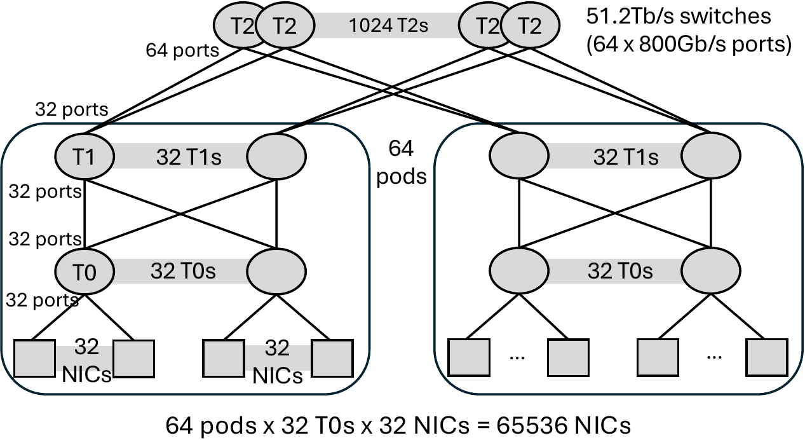 <em>图 1a：3 层 800 Gb/s 单平面拓扑。</em></td>
    <td align="center" width="50%">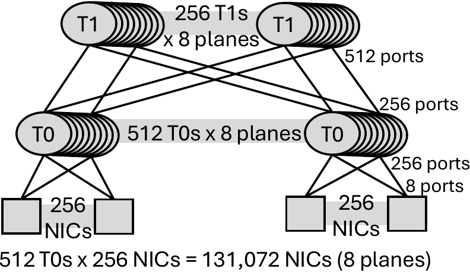 <em>图 1b：2 层 8x100 Gb/s 多平面拓扑。</em></td>
  </tr>
</table>

<em>图 1：3 层 800 Gb/s 单平面拓扑与 2 层 8x100 Gb/s 多平面拓扑对比。</em>

这种多平面网络有许多优点：

- 延迟更低，因为最长路径只穿过三台交换机，而不是五台或七台。
- 一跳内可达节点更多（256 而不是 32），更容易利用作业局部性，降低延迟，并减少 T0 上行负载。
- 成本和功耗更低。若要实现全截面带宽，相比三层网络只需要约 2/3 的光模块和 3/5 的交换机数量。
- 网络内故障影响小得多。例如，丢失一条 T0-T1 链路时，800 Gb/s 平面中某节点容量约下降 3%，而 100 Gb/s 平面中约下降 0.4%。
- 可以在不终止训练作业的情况下丢失一条 NIC-T0 链路。我们仍会损失 12% 的 NIC 带宽，但剩余容量足以轻松承受链路 flap。

因此，多平面设计相对单平面设计显然有很多优势，但也带来挑战。首先，工作负载需要能够在链路和 NIC 端口故障下存活。其次，要充分利用网络，我们需要均匀加载所有网络平面，并在每个平面内的大量路径上负载均衡，同时不能因流碰撞而损失性能。传统单路径传输协议很难做到这一点 [11]，而使用更低速的网络链路会让问题更难，因为这些链路更容易被打满。这正是 MRC 发挥作用的地方。

### 2.1 MRC 概览

MRC 扩展了 RoCEv2 Reliable Connection（RC）传输协议，使其支持多路径操作，并借鉴 UET [8, 9] 的若干特性。它支持普通 RoCE verbs 接口和 Queue Pair（QP）抽象，但只支持 write 和 write-with-immediate 操作。从协议层看，MRC 增加的主要特性如下：

- 每个数据包都包含 RDMA 虚拟地址和 remote key，使接收 NIC 无论数据包以什么顺序到达，都能立刻把每个到达的数据包写入内存。
- 每个数据包包含一个 entropy value（EV），用于决定其穿过网络的路径。MRC 数据包中的 32 位 EV 会分布在 UDP 源端口和 IPv6 flow label 中。在传统网络中，改变 EV 会让交换机把每个包哈希到 ECMP 集合中的不同路径。QP 启动时，发送方会为该 QP 生成一个 EV 集合，通常为 128 到 256 个条目。发送方随后轮转使用这个集合，对每个包使用不同 EV，使一个 QP 的所有包能在多平面网络的所有平面上喷洒到大量路径，而应用无需感知。这用于对网络做负载均衡。
- 喷洒很难和无损以太网使用的 Priority Flow Control（PFC）机制结合，因为单个流会经由数百条路径到达最后一跳交换机。此外，PFC 往往会在不同 collective 之间制造队头阻塞，伤害尾延迟。因此 MRC 关闭 PFC，并以 best-effort（有损）模式使用以太网。
- best-effort 以太网与乱序交付的组合要求协议更快地恢复丢包。MRC 实现了快速选择性重传，使用 Selective ACK（SACK）数据包精确指出哪些包已到达接收方。
- 为了进一步提升重传速度，尤其是在 incast 下，MRC 可以使用 packet trimming [12, 8]。在 packet trimming 中，原本会因拥塞被丢弃的数据包会被去掉 payload，并以高优先级转发到目的端。接收 NIC 随后生成 NACK 触发快速重传。这也让 MRC 能够区分拥塞丢包和其他丢包；在 AI 集群中，其他丢包主要来自链路 flap 和故障。

像 MRC 这样围绕 packet spraying 设计的协议，非常适合多平面网络。每个 EV 对应某个网络平面上的一条具体路径。当 MRC 生成 EV 集合时，会为每个平面选择相同数量的 EV。这立即使平面之间的流量均衡。

对于每个 EV，MRC 会维护少量路径健康状态。在每台交换机中，我们以常规随机方式启用 ECN，但在通向接收方的最后一跳关闭 ECN。在全截面带宽网络中，除了最后一跳 incast 之外，整体流量不应出现拥塞，因此 ECN 现在成为负载均衡信号。接收方把 ECN 信号回显给发送方，表示这条具体路径比其他路径更拥塞，发送方会临时避开它。不同 MRC 发送方在选择 EV 集合时不会互相协调，所以即使每个发送方自身均衡得很好，整体流量仍可能略有不均。基于 ECN 的负载均衡会抹平这种不均，避免内部队列增长到造成拥塞丢包的程度。

当数据包没有被 trimmed 而是真正丢失时，MRC 假定路径已经失败，并立即停止使用相应 EV。当然，并非所有丢包都来自路径故障，包也可能遭遇 bit error 或其他问题。因此，单个丢包后就永久退役一个 EV 可能导致可用 EV 不足。为避免这种情况，MRC 会发送后台路径探测，以判断它认为坏掉的路径是否真的坏了，并检测失效链路是否已经恢复。如果足够多的探测成功，该 EV 会被复活。

到这里，我们已经拥有一个能在几十微秒内检测路径故障并绕开的传输协议。

### 2.2 静态 Segment Routing

在传统数据中心网络中，我们会使用 BGP 这样的动态路由协议来决定可达性，并绕开故障链路。通常这可以工作，但收敛可能需要大量 RTT。不幸的是，高基数两层拓扑会让情况更糟。每个目的端都对应一个很大的 ECMP 集合，在 512 端口 T0 交换机中最多可达 256 个条目，每条上行一个。无故障时这不是问题，但大多数 T1 交换机可能至少有一条下行故障。因此，某个具体目的端可能无法通过某些 T1 交换机到达，于是 T0 交换机不能使用默认的、跨所有上行均衡的 ECMP 集合到达它。每台 T0 交换机所需的大型 ECMP 集合数量会接近 T0 交换机总数。动态路由和交换机转发引擎要支持如此多的大型 ECMP 集合很有挑战。大规模诊断路由问题也出了名地困难。

既然 MRC 会快速避开故障路径，而我们又构建了冗余拓扑，我们还需要动态路由吗？事实上，把端系统负载均衡与交换机动态路由组合起来，会让网络行为比单独运行任一机制都更难理解。MRC 会先对故障做出反应，避开坏路径；随后动态路由重新路由，改变 ECMP 映射，并扰乱负载均衡。

我们的立场是：运行 MRC 时，动态路由带来的问题多于解决的问题，所以我们直接关闭动态路由。但我们仍需要一种方法把 EV 映射到具体网络路径。一种选择是让 MRC 使用静态配置的 ECMP 路由，依靠 MRC 避开坏路径。问题是，EV 到路径之间仍没有简单映射。例如，很难把 MRC 基于 EV 的坏路径视图和精确物理路径关联起来，从而报告故障供维修。这使我们转向使用源路由进行喷洒，正如已有工作所建议的那样 [12]。

我们选择的方法是部署 IPv6 Segment Routing（SRv6）[13]。在 MRC NIC 中，QP 启动时会选择一组 EV，使每个 EV 中的若干 bit 直接嵌入网络每一跳的路径选择。每个 EV 随后映射到通向目的 NIC 的一条具体唯一网络路径。

SRv6 是一组方案。我们使用 micro-segment ID（uSID）格式 [14]，其中目的 IPv6 地址由 32 位 locator prefix 后接一串 16 位 uSID 组成，每个 uSID 对应路径上的一台具体交换机。我们使用 uN 风格的 uSID，即显式命名路径上的每台交换机。EV 与 SRv6 地址之间的关系在下一节详细描述。

图 2 展示 SRv6 转发过程。当数据包到达时，交换机会比较目的地址前 48 位与交换机配置的 SRv6 locator 和 uSID；如果匹配，这就是一份需要该交换机处理的合法 SRv6 包。交换机随后把地址中的 uSID 部分左移 16 位，把下一跳 uSID 移到前 48 位。这个新地址会按常规方式在交换机静态转发表中查找。该转发表在交换机安装时配置，通常不会改变。静态路由决定数据包使用哪个出口端口。在我们部署的所有交换机中，这种 uN 风格 SRv6 转发都能以线速执行。

  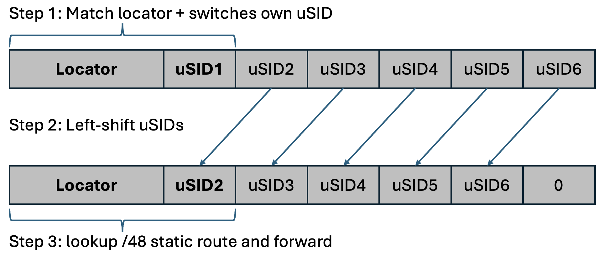
   <em>图 2：使用 uN uSID 的 SRv6 转发。</em>

MRC 数据包是 IPv6-in-IPv6 封装，外层目的地址是 SRv6 路径，内层目的地址包含目的 NIC 自身地址，使接收 NIC 能识别并解封装数据包，然后把它送入 MRC RDMA pipeline。

### 2.3 将 EV 映射到 SRv6 地址

MRC 设计上既能配合基于哈希的 ECMP 转发，也能配合 SRv6。EV 嵌入每个数据包，并分布在 UDP 源端口和 IPv6 flow label 中；执行 ECMP 的交换机会对这两个字段做哈希。EV 也会在 SACK 和 NACK 包中回显，用来指示某条路径的拥塞状态。

使用 SRv6 时，虽然交换机不会对 EV 哈希，EV 仍需要被携带在数据包中，这样接收方才能回显它。SRv6 地址本身不能被回显，因为它在转发过程中的移位操作会被擦除。

为避免为每条路径同时保存 SRv6 地址和 EV 状态，我们在每个 EV 与其对应 SRv6 地址之间使用算法映射。交换机 uSID 按网络结构分配，使 EV 值成为一个压缩表示：它编码了通向该目的端的 SRv6 路径之间会变化的 bit，以及要使用的 NIC 端口。

图 3 展示一个 QP 穿过 `src -> T0 -> T1 -> T0 -> dst` 时，如何创建 SRv6 目的地址。QP 启动时，NIC 会在节点特定配置文件中查找目的地址前缀，获得一份面向该行节点的通用 SRv6 地址模板。模板中的 dst uSID 会通过复制最后一跳下行链路编号，专门化为当前目的端。这个模板会被该 QP 发送的所有数据包使用。

  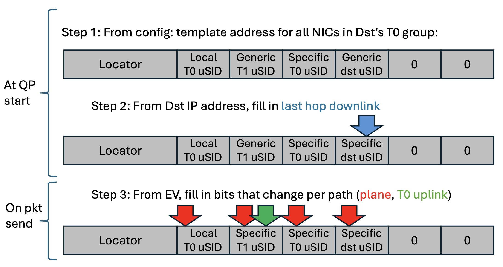
   <em>图 3：从 EV 和模板生成 SRv6 地址。</em>

NIC 还会为该 QP 创建一组 EV，在平面之间以及每个平面内的路径之间做条带化。每次发送数据包时，都会从活跃集合中选择一个新的 EV。随后，模板会被进一步专门化以生成最终目的地址：从 EV 中复制平面号到所有 uSID，并把 T0 上行编号复制到 T1 uSID。我们还使用该方案的扩展在集群之间转发。

### 2.4 选择可工作的路径

在传统协议中，资源管理被路由和传输拆分：路由向传输提供可工作的路径，传输在这些路径上管理拥塞。在静态源路由的 MRC 网络中，所有资源管理和故障处理都是 MRC 的职责。

QP 启动时，MRC 必须选择一组 EV，每个 EV 都映射到特定平面上的唯一一条路径。MRC 会在各平面之间均匀选择 EV，然后在每个平面内随机选择路径子集。同一 T0 组内的不同发送方不会协调选择。

在预训练作业启动时，我们会确保作业内所有节点的所有 NIC 端口都正常。MRC 支持 denylist，使我们能避开经过已知故障链路的路径。为此，我们实现了 Clustermapper，它由每个节点上的一个 agent 组成；这些 agent 共同映射当前哪些链路处于 down 状态或有过高丢包。静态 SRv6 路由让这非常简单：不同于 ECMP 哈希，我们准确知道 Clustermapper 探测包会走哪条路径，也知道等价 MRC 数据包会走同一路径。不同于基于交换机的 telemetry，得到的映射给出了转发平面健康状况的 ground truth。

事实上，对于预训练而言，并不需要用 Clustermapper 为故障 T0-T1 链路设置 denylist。QP 寿命很长，MRC 会快速绕过故障并稳定在好路径上。在 CX8 MRC 中，每个 QP 启动时会填充一个很大的 EV 集合，通常超过 100 个条目，外加一个用于故障的备用 EV 集。QP 开始在对应路径上喷洒数据包。有些路径处于 down 状态；数据包丢失并被重传，EV 被备用集合中的一个替换。即使没有先验知识，MRC 也能足够快地识别坏路径，因此轻微启动性能损失不是问题。

图 4 展示一个 75K GPU 预训练作业在未预填充 denylist 的情况下启动时的包丢失率。图中显示的是每节点四个 NIC 中的一个 NIC 上、作业内所有节点汇总的每秒总丢包数。该图使用对数刻度以显示背景丢包率。水平线表示每 NIC 每秒 1 个丢包；在 800 Gb/s 下，这相当于每 2500 万个包丢 1 个。整个作业的丢包率会在几分钟内远低于此线，但即使在第一分钟，每个 QP 丢失的包也少于 5 个。考虑到大型训练作业必须缓慢 ramp up 以避免扰动电网，这种启动瞬态对训练时间影响很小。

  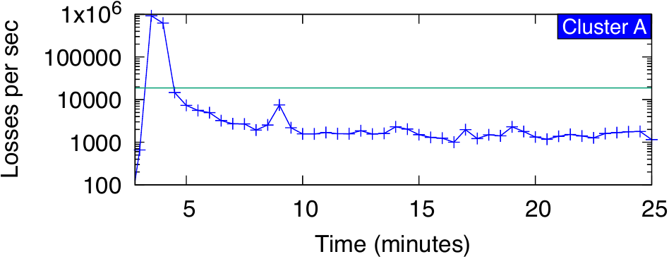
   <em>图 4：不预先剔除坏路径时的启动丢包。</em>

**反向路径。** MRC 会在反向路径上发送 RoCE cumulative ACK、MRC SACK 和 MRC NACK。前向路径上的 EV 集合会基于 SACK 和 NACK 信息更新，但反向路径数据包应该使用什么 EV？MRC 对反向路径丢包并不特别敏感，但它确实会影响尾延迟。

双向流量中，控制包可以使用该端点活跃 EV 集合中的任意 EV，但许多 collective QP 在任一时刻都是单向的。我们可以反转 SRv6 前向路径，但这并不总是有效。

我们发现一个效果很好的方案：为控制包保留一个小的反向 EV 集，每个平面至少一个 EV。只要 QP 入站活跃但没有产生出站流量，每个 RTT 接收方就会用随机选择的 EV 发送一个 EV probe 包。如果 probe 被确认，该平面的反向 EV 就设置为该 probe 的 EV。如果发送了数据流量，则反向 EV 会从数据 SACK 中更新，而不需要 EV probe。因此，反向 EV 集总是包含已知可用且正常工作的 EV。

## 3. 运维

MRC 的一个目标是简化网络运维，让小团队能够操作非常大的超算网络。关键在于，使用 MRC 后，大多数网络故障不需要网络运维人员快速响应。

我们的经验是，T0 与 T1 交换机之间的链路故障和链路 flap 大多可以忽略。我们仍会安排故障链路维修，但优先级更低。图 5 显示运行 Cluster A 上一个超大同步预训练作业时，交换机报告的 T0 与 T1 之间每分钟链路 flap 总数。这些链路仍被留在服务中，因为它们不会造成问题。MRC 把流量分散到足够多路径上；当某个 QP 使用的一条链路 flap 时，每个 QP 只会丢失非常少的数据包，通常只有一个，对应 EV 会被移除。丢失的数据包会在另一条路径上被选择性重传，对作业影响可以忽略。

  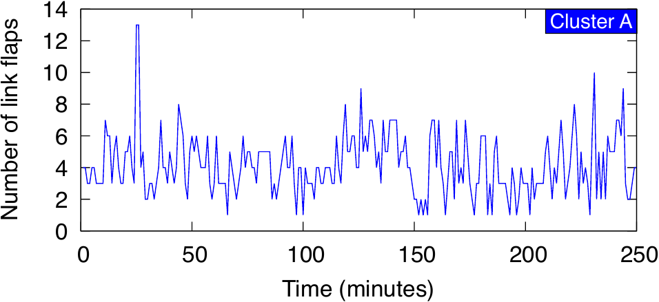
   <em>图 5：T0 与 T1 之间的链路 flap。</em>

在 MRC 之前，当某条 flappy 链路被标记维修时，我们会通过管理手段关闭它，使数据流量不能使用它。只有维修并测试后才重新启用。最初我们也对 MRC 采用同样做法，但后来发现没有必要。现在我们会在链路维修期间继续让它保持服务：MRC 会在链路掉线时把它映射出去，并且只有在足够多探测在一段时间内成功后才重新启用。这需要更少协调，并确保链路只要真正工作就可用，而太不可靠时不会被使用。它也能抵御不可避免的维修扰动：技术人员修一条链路时可能影响邻近链路，导致它们 flap。

交换机软件复杂且容易出 bug [15, 16, 17]，这可能阻碍故障检测，有时会导致控制平面无法绕过故障。根据一项覆盖 18 万台交换机、持续三个月的数据中心研究 [15]，17% 的交换机故障来自软件 bug。这类 bug 可能造成控制平面和数据平面分歧，即控制平面无法准确检测数据平面故障 [17, 15]。这些研究与我们的经验相符：我们见过各种 bug，包括控制平面和链路状态都正常，但交换机停止转发数据包的情况。最后这一类尤其棘手。

使用静态 SRv6 时，MRC 不关心控制平面状态：如果包不流动，它就移除路径。当我们看到一台 T1 交换机状态异常时，可以直接重启它，不用担心路由收敛，也不需要与活跃训练作业协调。MRC 会把经过故障交换机的 EV 映射出去，并在之后恢复它们，对作业性能影响可以忽略。对 NIC-T0 链路和 T0 交换机，我们需要更谨慎，因为它们有可测量影响。一个失败的 NIC 链路不会导致 QP 失败；相反，NIC 会检测到链路掉线，MRC 会重映射 EV 以避开故障端口。链路刚掉线时会丢很多包。CX8 的 MRC 实现中，重映射所有正在使用的许多 QP 的 EV 不是瞬时完成的，因此会造成作业吞吐的一次抖动。随后 MRC 使用 SACK 包中的端口状态位图通知远端 QP 端点该端口已 down，使它们也重映射 EV 以避开故障平面。通常几秒后，QP 会恢复完全功能，只是少用一个平面。

我们已经部署了四平面（4 x 200 Gb/s）和八平面（8 x 100 Gb/s）MRC 超算。NIC 端口故障在八平面中的影响显然更小，但即使是四平面，对训练作业性能的影响也相对较小，具体大小取决于作业布局，但可能显著小于丢失的容量。我们会检测故障并允许作业以降低的性能继续运行。大多数情况下端口会较快恢复，没有持久影响。当端口掉线且持续 down 时，我们会禁用该节点并报修。

让训练作业无需控制平面动作即可承受故障，只是运维故事的一部分。我们仍然需要良好 telemetry 来定位故障根因、调优作业性能，当然也要调试 MRC 本身。

Clustermapper 是关键。运行在所有集群节点上的 Clustermapper agent 会每毫秒共同探测网络中的每条链路。这给我们提供了细粒度健康数据，使我们能安排链路维修或交换机重启。每个节点上的 agent 会探测 16 或 32 个直接连接 T0（每端口一个，在每节点四个 NIC 上），方式是发送源路由探测包到 T0 再返回同一 agent。这可以识别 NIC-T0 链路或 T0 交换机问题。每个 agent 还会探测 T1 交换机的子集，同样源路由到 T1 再返回，使所有 T0-T1 链路都被高频探测。T0 与 T1 自探测组合使我们能立刻精确定位哪个链路或交换机有问题：如果 T0 探测没有问题但 T1 探测有问题，我们知道问题是 T0-T1 链路，而不是 NIC-T0 链路。我们也可以在 MRC 报告路径问题时按需运行探测，但实践中发现，即使没有工作负载运行，让 Clustermapper 检测问题也很有用，而且连续探测成本很低。

没有 SRv6 时，很难获得这种级别的网络健康 ground truth。由 agent 向网络中发送并回到自身的探测数据，比 pingmesh [18] 这类必须发到可能并不在线的远端节点的机制更容易解释。不同于 ECMP 哈希，探测包走哪条路径没有歧义，也没有动态路由在底层改变转发路径，而且我们知道 MRC 数据包走同样路径。虽然没有 SRv6 时也可以直接 ping 交换机，但 ICMP 探测由控制平面处理，限制了探测频率。使用 SRv6 时，交换机会像处理任何数据流量一样处理探测包，在数据平面完成处理，从而支持高频探测。

## 4. 平面间负载

为简化 MRC 行为，我们做了两个会产生后果的决策。首先，当 MRC 把一个 EV 从活跃集合中映射出去时，它会用同一平面中的另一个 EV 替换它。这样，当所有 NIC 的所有平面都可用时，平面之间的负载均衡会保持完全相等。我们做出这一选择，是为了避免目的端的假 incast：不同流的 T0 上行链路上的轻微拥塞可能导致它们不均匀地加载平面，当这些流在目的端汇聚时，就会让某些平面比其他平面更拥塞。

让活跃 EV 集在平面之间保持相等，意味着默认情况下有两种情况处理得不好。第一，如果后端 MRC 网络中存在任何单路径流量，MRC 会受到最拥塞平面的约束并损失容量。如果后端网络只运行 MRC，这显然不是问题。其后果是，如果单个平面中丢失足够多 T0-T1 链路，该平面会成为瓶颈，我们会损失性能。实践中，我们还没有在生产中看到这种情况。

第二，也部分是因为保持平面均匀加载，如果某条 NIC-T0 链路没有完全故障，但有不可接受的高丢包率，MRC 无法重新均衡以避开坏平面，因为它无法可靠判断问题在本端还是远端。Clustermapper 可以做到这一点，因为它会探测到本地 T0 并返回。因此我们把检测这种情况委托给 Clustermapper 的策略决策；随后可以通过指定匹配的 denylist 条目来避开坏平面。

实践中，保持所有平面均匀加载是一个非常有用的不变量。一旦 MRC 避开坏链路，所有平面在网络统计中通常看起来相同；如果某个平面比其他平面更差，通常就指向一个网络问题。

## 5. 实验

### 5.1 实验设置

我们展示来自四个不同 AI 训练集群的结果。集群配置和拓扑详情见表 1。所有集群都采用图 1b 所述的两层多平面拓扑。每个多平面 NIC 连接到一组 T0 交换机，每个平面一个。相应平面的 T0 交换机会在 T1 层合并。

表 1：实验平台配置。

| 集群 | NIC | 交换机 | 拓扑 |
| --- | --- | --- | --- |
| Cluster A | NVIDIA GB200 + CX8 (800 Gbps) | NVIDIA SP4 与 BRCM TH5 | 2 层 4 x 200 Gbps 多平面 |
| Cluster B | NVIDIA GB200 + CX8 (800 Gbps) | NVIDIA Spectrum 5 | 2 层 8 x 100 Gbps 多平面 |
| Cluster C | AMD MI355 + Pollara (400 Gbps) | Broadcom Tomahawk 5 | 2 层 4 x 100 Gbps 多平面 |
| Cluster D | NVIDIA RTX 6000 + Broadcom Thor Ultra | Broadcom Tomahawk 5 | 2 层 400 Gbps 单平面 |

如果某条流从一个 NIC 到同一 T0 组中的另一个 NIC，我们称其为 T0-local。反之，如果端点位于不同 T0 组，该流必须穿过 T1 交换机，我们称其为 cross-T1。

### 5.2 训练结果

MRC 已在非常大规模上用于训练 OpenAI 最近的前沿模型。图 5 所示 Cluster A 中 T0-T1 链路 flap 的恒定速率几乎没有影响性能。事实上，修复这些 flap 的优先级非常低，因为运维精力最好花在其他地方。

在训练作业中，我们观察到许多后端网络故障；很少导致作业失败或显著性能下降。丢失 NIC-T0 链路确实会影响性能，不过我们观察到大多数此类事件都是瞬态的，作业通常能快速恢复到全速而无需驱逐节点。

图 6 展示 OpenAI 在 Cluster A 上使用 CX8 NIC 的 MRC 运行一个 50K GPU 生产预训练作业时发生的事件。该超算网络配置为每 NIC 4 x 200 Gb/s 端口，MRC 会把每个 QP 喷洒到所有四个端口。一台 T0 交换机上的光模块出现故障，并快速连续 flap 其四条链路。这四条链路连接到四个不同节点的 NIC，其中三个节点当时活跃在训练作业中。图中展示了 NIC 认为链路 down 的时间，以及交换机认为链路 down 的时间，两者并不完全一致。

  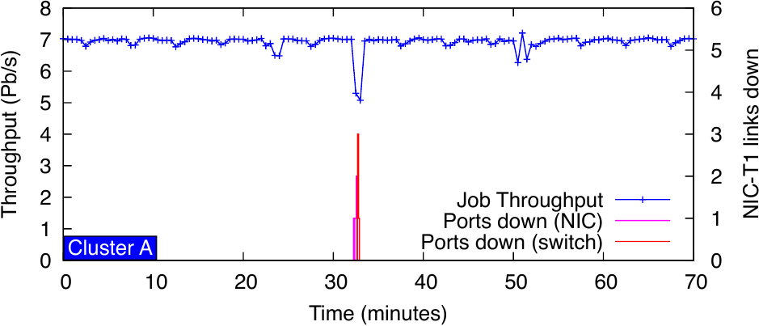
   <em>图 6：NIC-T0 交换机收发器 flap 的影响。</em>

由于这是同步预训练作业，最慢节点决定整体性能。在图 6 中，吞吐在 flap 的一分钟内约下降 25%，随后立即恢复到全速。作业没有崩溃，没有 QP 失败，受影响节点也不需要从作业中移除。这类收发器 glitch 比单链路 flap 少见，但偶尔确实会发生。

图 7 放大展示了受影响最严重的 8 个节点的丢包率。红色节点是端口发生 flap 的节点，蓝色节点是 flap 时正在向受影响节点发送的节点。MRC 恢复丢包的速度足够快，因此对作业影响相对较小。

  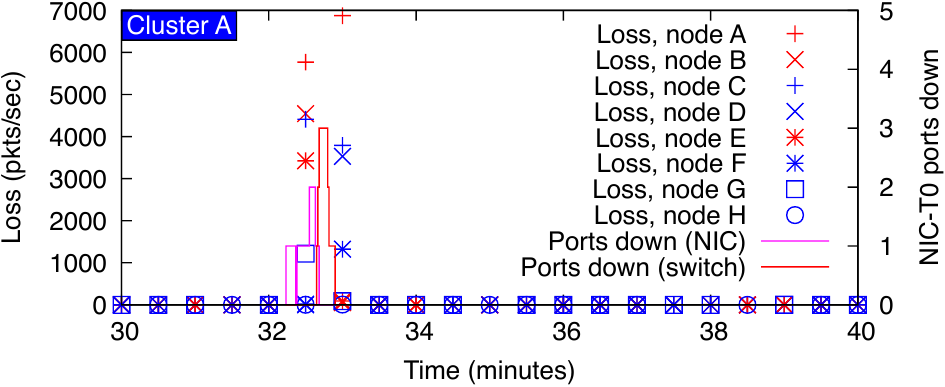
   <em>图 7：图 6 事件期间的包丢失率。</em>

在一个 75K GPU 预训练作业期间，我们遇到四次必须重启 T1 交换机的情况。图 8 展示其中一次。红线显示 Clustermapper 看到的该交换机丢包比例。交换机虽然保持 up，但停止转发数据包。自动化系统检测到这一点，并在 t=0 重启它。交换机在 t=2 分钟时完全恢复转发。紫线显示每分钟丢包比例，为了可见性乘以 10K。约四分之一 QP 受影响，约丢失 580K 个数据包。蓝线显示总作业吞吐：交换机最初故障时吞吐下降，因为许多 QP 丢包；但它们很快把坏路径映射出去，之后吞吐基本不受影响。当交换机实际重启时，则没有影响。

  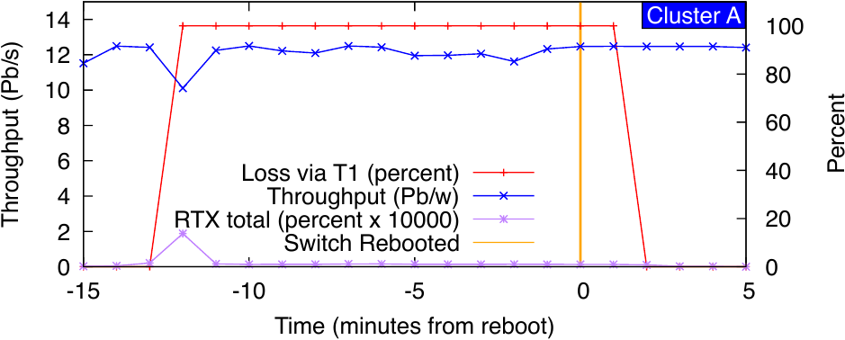
   <em>图 8：T1 交换机故障和重启的影响。</em>

尽管具备这种韧性，仍然存在一些单点故障。我们使用 800 Gb/s NIC 光模块，拆分成 4x200 Gb/s 链路。如果 NIC 收发器本身 flap，我们会丢失该 NIC 上所有端口，无法承受，因为 QP 会失败。大规模训练时我们确实看到过此类事件，但幸运的是它们很少见。不同的光学设计可能完全避免这一问题。

### 5.3 测试床结果

我们展示一系列实验，说明 MRC 在更受控的测试环境中的行为，测试对象包括 NVIDIA CX-8 NIC、AMD Pollara NIC 和 Broadcom Thor Ultra NIC 上的 MRC 实现。

#### 5.3.1 点对点通信性能

下表展示 Cluster B 上 CX-8 的 MRC 点对点延迟和带宽性能。测试使用 perftest 中的 `ib_write_lat` 和 `ib_write_bw`，分别在单 client 与单 server 之间使用 1 个和 4 个 QP。

| 拓扑 | 消息大小 | 指标 | 结果 |
| --- | --- | --- | --- |
| T0-local | 2 B | 延迟 | 5.09 μs |
| T0-local | 32 KB | 带宽 | 约 770 Gb/s |
| Cross-T1 | 2 B | 延迟 | 6.54 μs |
| Cross-T1 | 32 KB | 带宽 | 约 770 Gb/s |

带宽测试连续执行固定 32 KB 消息的 write，并报告应用层 GPU-to-GPU 带宽。T0-local 和 cross-T1 两种配置都达到约 770 Gb/s，对应理论峰值带宽的 96%。这表明稳态吞吐不受流量是否停留在单个 T0 内或跨 T0 边界的限制。

延迟测试使用 2 字节消息，测量从提交 write 到发送方收到 completion 的时间，并除以 2 近似单向延迟。T0-local 通信延迟为 5.09 μs，cross-T1 通信延迟更高，为 6.54 μs。T0-local 延迟反映固定的 MRC 控制路径开销，例如队列对处理、work request 处理和路径管理。Cross-T1 的额外延迟来自跨 T0 域时增加的交换机跳数。这些影响会轻微影响短消息延迟，但对大消息带宽影响可以忽略。

#### 5.3.2 MRC 对链路 down 和 flap 事件的响应

我们在 Cluster B 上研究 MRC 对网络故障的响应，包括网络不同位置的链路 down、链路 flap 以及收发器 flap。Cluster D 上类似实验的结果见附录。

首先，我们考察使用四个 QP 的传输在 NIC-T0 链路故障时如何优雅降级。我们在两个 T0-local NIC 之间运行双向 `ib_write_bw`，并依次关闭 NIC-T0 链路。如图 9a 所示，随着链路逐条下线，吞吐下降；链路恢复后吞吐也恢复。链路故障时，MRC 检测到 link down 事件，并在剩余平面上重均衡 EV。它还会在 SACK 包中更新 link-state bitmap，通知远端端点该链路不可用，促使远端 MRC 实例重映射 EV 集以避开故障平面。我们观察到在故障检测、EV 重映射和数据包重传期间会出现不到 1 秒的短暂中断，之后入站和出站 QP 都会在剩余链路上稳定下来。链路恢复后，两个方向的流量会很快恢复使用它们。

在图 9b 中，我们 flap 单个 CX8 NIC 上的八条链路中的四条，模拟现实生产故障场景：多个链路可能因共享 OSFP 端口或收发器而同时受影响。这类故障可能导致与该端口相关的所有链路同时 down，最多同时丢失四条链路。如图所示，当四条链路全部 down 时（约 5 秒处），MRC 很快稳定在约一半标称带宽；链路恢复后（约 17 秒处）又迅速恢复。实践中的链路 flap 持续时间通常更短；该实验通过禁用链路并在固定间隔后重新启用来合成 flap。

图 9c 展示 T0-T1 链路故障对 MRC 流量的影响。由于 MRC 会把每个 QP 的包喷洒到大量路径，T0-T1 链路故障的影响远小于 NIC-T0 故障。在该实验中，我们运行 cross-T1 `ib_write_bw`，并顺序合成关闭 20 条链路。运行期间收集的 telemetry 显示，多数链路在故障前都承载活跃流量，证明可用路径被广泛利用。随着链路 down，MRC 映射出受影响 EV，并在替代路径上重传丢失数据包。带宽以约 200 ms 粒度报告；即使活跃链路被移除，我们也观察到整体吞吐影响很小。

图 9d 还展示了同时 flap 8 条 T0-T1 链路并在几秒后恢复的影响，这可能发生在交换机收发器 flap 时。Telemetry 显示这些链路在 flap 前正在承载流量。与前一实验类似，MRC 会重路由流量并快速恢复，对工作负载层面性能影响可以忽略。

<table align="center">
  <tr>
    <td align="center" width="50%">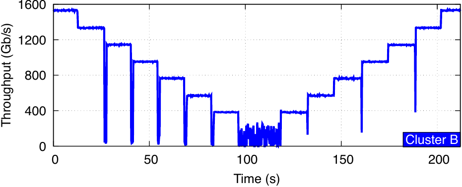 <em>图 9a：T0-local：NIC-T0 链路故障/恢复。</em></td>
    <td align="center" width="50%">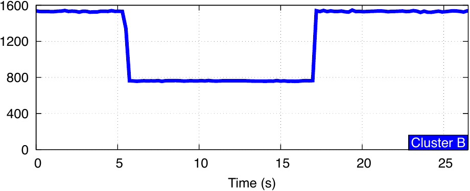 <em>图 9b：T0-local：四条 NIC 链路 flap。</em></td>
  </tr>
  <tr>
    <td align="center" width="50%">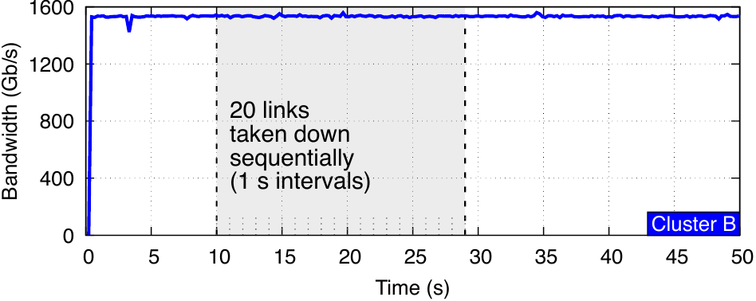 <em>图 9c：Cross-T1：T0-T1 链路故障。</em></td>
    <td align="center" width="50%">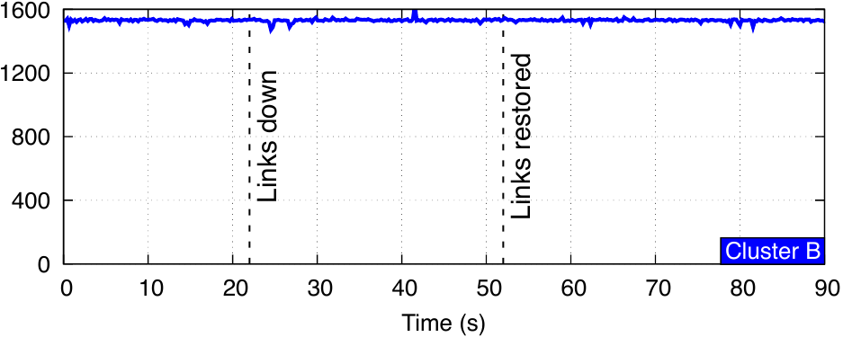 <em>图 9d：Cross-T1：T0-T1 链路 flap。</em></td>
  </tr>
</table>

<em>图 9：使用双向 ib_write_bw 的 T0-local 与 Cross-T1 可靠性结果。</em>

#### 5.3.3 T0/T1 交换机故障下的 MRC 行为

在大规模训练集群的生产工作负载中，交换机偶尔会失去响应或崩溃。为了评估其对工作负载性能的影响，我们在 Cluster B 上执行实验，在运行 `ib_write_bw` 产生网络流量时关闭 T0 和 T1 交换机。

图 10 展示实验中关闭 T0 交换机的影响。EV 重映射完成后，稳态带宽约下降 100 Gb/s，反映与故障 T0 交换机关联的 EV 被从活跃 EV 集移除。吞吐随后稳定在与剩余可用网络容量成比例的水平。该行为与图 9a 的结果非常相似，确认 MRC 故障处理由端到端路径可用性驱动，而不是由底层 fabric 故障的具体位置或类型驱动。因此，交换机级故障表现为可用路径多样性可预测地下降，同时保留应用进展并在剩余健康路径上维持稳定吞吐。

  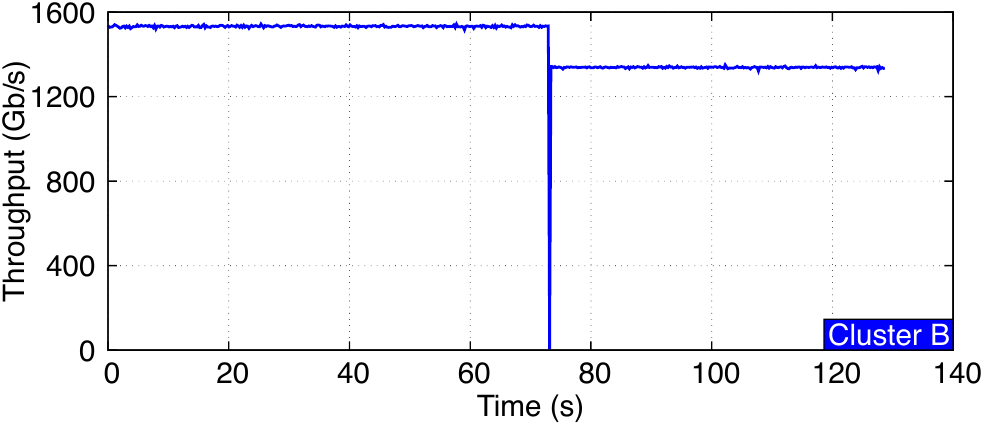
   <em>图 10：T0 交换机故障期间的 T0-local ib_write_bw。</em>

图 11 展示在一个使用四个 QP 的 cross-T1 `ib_write_bw` 实验中关闭 T1 交换机的影响。在该场景中，每个 QP 被喷洒到大量路径，且仍有足够替代 EV 可以维持聚合网络容量。因此，尽管发生故障，未观察到稳态带宽下降。一旦 T1 交换机恢复，瞬态波动消退，带宽返回稳定水平。

  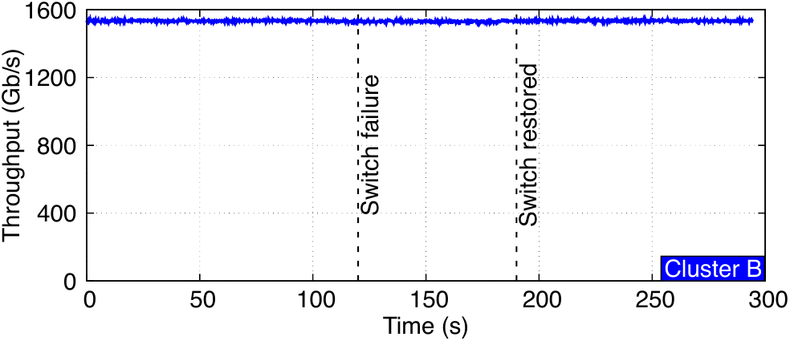
   <em>图 11：T1 故障/恢复期间的 Cross-T1 ib_write_bw。</em>

#### 5.3.4 对路径级丢包的鲁棒性

为了评估 MRC 在瞬态链路损伤下的鲁棒性，我们在 Cluster B 上使用 NVIDIA 的 MRC debug 能力，在 EV 级别注入受控错误。具体而言，我们配置某个选定 EV 丢弃其 20% 的包，并使用 cross-T1 双向 `ib_write_bw` 基准测量由此产生的 EV 状态转换和端到端性能。为了隔离并清晰观察 EV 状态更新，我们把系统限制在一个较小的固定 16 条路径集合中，每个 8 个平面强制仅使用 2 条路径。

实验期间，我们持续监控 EV 状态，以捕捉系统对注入故障的响应。如图 13 所示，EV-A 初始为 active，而 EV-B inactive。在约 51 秒时，当 EV-A 上注入丢包后，其状态立即转为 inactive，EV-B 被激活作为替代。该行为表明 MRC 能够迅速检测故障并把流量切换到替代 EV，这与图 12 中持续线速带宽的观察一致。

我们用不同丢包率重复实验，并观察到相同的定性行为：受影响 EV 会被迅速从活跃集合移除，流量透明地重定向到替代路径，应用层带宽保持稳定。

  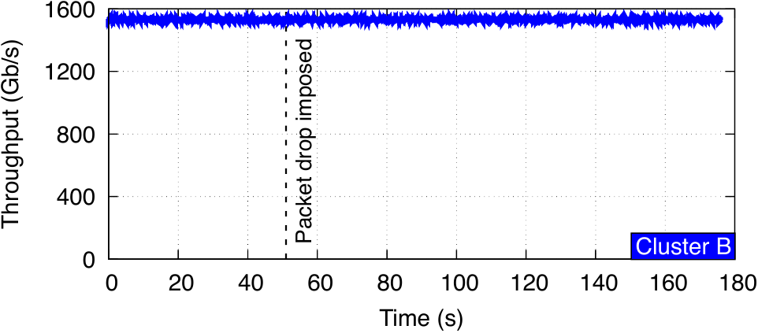
   <em>图 12：包丢弃可靠性实验。</em>

  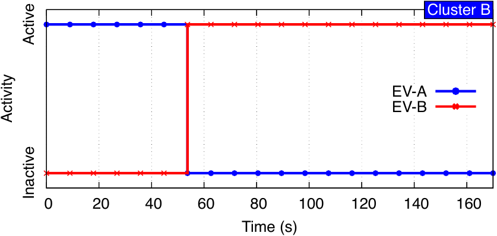
   <em>图 13：包丢弃实验期间的路径活跃状态。</em>

#### 5.3.5 跨 EV 的负载均衡

我们使用 Cluster B 中受控的双流实验评估 MRC 动态跨 EV 均衡负载的能力。该设置由两个通信对组成，它们在同一平面内通过两个 EV（EV-A 和 EV-B）运行。我们首先在 `client1` 和 `server1` 之间建立初始流。在稳态下，该流完全映射到 EV-A，达到接近线速带宽，而 EV-B 空闲。在约 65 秒时，我们引入 `client2` 和 `server2` 之间的第二条流，并明确强制它使用 EV-A。这造成瞬态拥塞，两条流争用同一 EV。

MRC 通过 ECN 检测到拥塞后，触发流量再分配，以在可用 EV 间重均衡负载。具体而言，`client1-server1` 流被迁移到 EV-B，而 `client2-server2` 流继续使用 EV-A。这一转换在图 14 的逐 EV 活跃轨迹中清晰可见：EV-A 从服务单一流转换为只承载第二条流，而 EV-B 变为 active 并接管被迁移的流。重要的是，该再分配没有可观察的性能退化。两个 client-server 流在整个转换期间都维持接近峰值带宽，聚合吞吐保持接近线速。结果表明，MRC 能够响应动态负载变化，有效跨 EV 重均衡流量，并以最小扰动维持稳定高吞吐。

  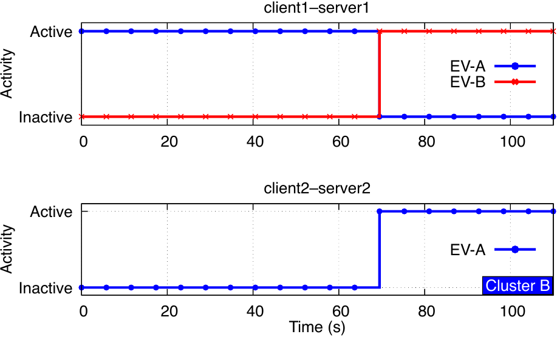
   <em>图 14：负载均衡实验期间的路径活跃状态。</em>

#### 5.3.6 大规模 NCCL Collective 执行

我们还在 Cluster B 上进行了 NCCL 微基准实验，以评估 MRC 的可扩展性。具体而言，我们使用 NCCL-tests 的 `sendrecv` 基准，其中每个节点同时向相邻 peer 发送数据并从其接收数据，形成稳态双向通信模式。报告的带宽对应测量到的每 NIC 吞吐。如图 15 所示，在 42K GPU 规模下，MRC 上的 NCCL 对大消息大小可达到最高 92 GBytes/s。

  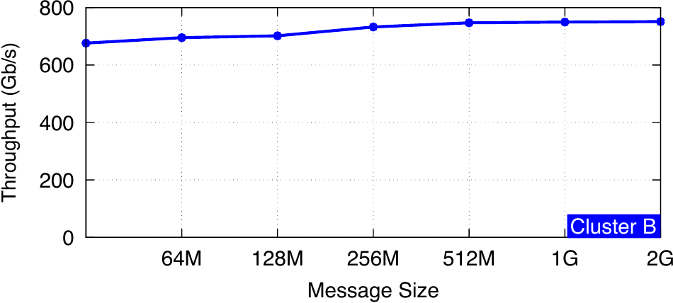
   <em>图 15：42K GPU 规模下的 NCCL send/recv 性能。</em>

#### 5.3.7 与 RoCE 对比

我们没有一个能够直接比较 MRC 和 RoCE 的大规模部署，但我们构建了两个小规模测试床进行比较：一个使用 AMD Pollara NIC（Cluster C），另一个使用 Broadcom Thor Ultra NIC（Cluster D）。

Cluster C 由 64 个 GPU 组成，每个 GPU 配一个 Pollara 400 Gb/s NIC，使用 TH5 交换机构建两层 Clos 拓扑。对 RoCE，我们配置常见的单平面网络，使用 400 Gb/s 链路和 ECMP 路由。在该配置中启用 PFC，并使用 DCQCN 作为拥塞控制，以避免过多触发 PFC。对 MRC，我们配置四平面网络，每 NIC 四条 100 Gb/s 链路；关闭 PFC 并使用 SRv6 路由。这是我们能构建的最接近同条件比较，同时也让每个协议处在自己偏好的环境中：GPU、NIC、交换机和聚合带宽完全相同。

我们希望理解两个问题。第一，即使 RoCE 使用 QP scaling，MRC 是否仍能更好地做负载均衡？第二，MRC 的选择性重传是否真的能帮助典型 AI collective 面对网络问题？为此，我们运行两组实验。首先，我们在 ring 上运行 all-reduce；通常每个节点需要同时向一个节点发送并从一个节点接收，目标是所有传输达到线速。任何 glitch 都会造成 bubble，伤害整体性能。其次，我们运行 all-to-all；每个节点需要同时向多个节点发送并从多个节点接收。目标是观察一种可能导致 incast 拥塞的 collective 中的负载均衡和重传性能。

图 16 显示随消息大小增加执行 all-reduce 时的平均带宽。对 MRC 使用 1 个 QP；对 RoCEv2 展示 1 个 QP 和 16 个 QP 的结果。实线表示没有诱导丢包的基线结果。小消息下 collective 受延迟限制，RoCE 和 MRC 差异不大。更大消息下逐渐受带宽限制。使用 1 个 QP 的 RoCE 会遭遇 ECMP 哈希碰撞，通常只能达到约一半可用吞吐。RoCE 改善负载均衡的传统方式是 QP scaling，即把一次传输分散到多个 QP 上，减轻流碰撞影响。我们发现，对 RoCE 来说 QP scaling 确实有帮助，但超过 8 个 QP 后收益很小（图中展示 16 个）。相比之下，一个 MRC QP 喷洒到 256 条路径，性能超过 16 个 QP，主要因为它很好地完成了网络负载均衡。

  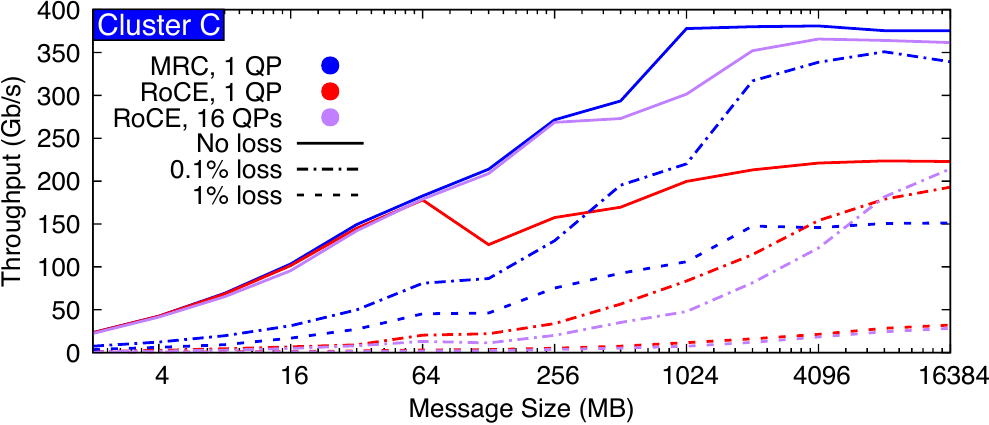
   <em>图 16：MRC 与 RoCE 执行 64 路 ring all-reduce，改变消息大小和丢包率。</em>

虚线展示我们加入 0.1% 和 1% 丢包时的性能。我们通过向集群所有 NIC 添加 inline P4 [19] 程序，以指定速率随机丢弃入站数据包。RoCE 本就不是为抗丢包设计的，正如预期，其性能很差。MRC 更具韧性；大消息下，它能足够快地重传，使 0.1% 丢包影响很小。小消息下 collective 更受延迟限制，恢复丢包的影响更大，因为尾部丢包无法被掩盖。不过 MRC 仍表现相对较好。我们不期望 AI 集群存在持续高丢包率，但会看到各种瞬态丢包原因；同步预训练不关心平均性能，只关心尾部。因此在大规模下，拥有一个容忍丢包的协议很重要。

在 1% 丢包下，RoCE 基本不可用，即使 MRC 也只能达到约三分之一目标吞吐。这足以承受短暂瞬态丢包 burst，但不足以持续训练。值得注意的是，这个测试表现比真实典型场景中 MRC 会得到的结果更差，因为丢包同时施加在所有平面上。如果 T0-T1 链路以高比率丢包，MRC 会像图 13 中那样停止使用它。如果 NIC-T0 链路以高比率丢包，Clustermapper 监控会检测到它，并可添加 denylist 条目避开坏平面，把性能退化限制在丢掉一个平面所损失的带宽比例。是否足以让该节点继续留在训练作业中，则是策略决策。

图 17 显示随消息大小增加执行 all-to-all 时的平均带宽。实线是无丢包基线，虚线添加随机丢包。在这种情况下，更多 QP 同时活跃，因此 RoCE 的负载均衡不是主要问题。我们确实看到 QP scaling 没有帮助 RoCE：每目的端 16 个 RoCE QP 反而略差于 1 个 QP，超过 2 个 QP 后性能开始略微下降。所有消息大小下 MRC 都优于 RoCE，但差异在带宽受限区间更大。

  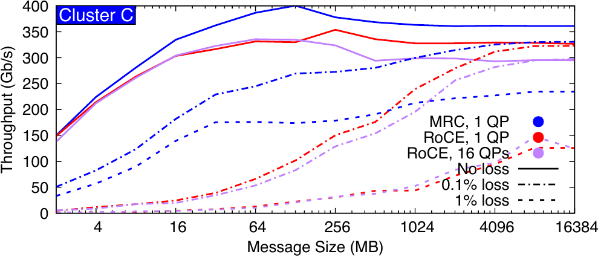
   <em>图 17：MRC 与 RoCE 执行 64 路 all-to-all，改变消息大小和丢包率。</em>

在丢包情况下，RoCE 比 MRC 更受影响，符合预期，但小消息下差异更大。在大消息和 0.1% 丢包下，RoCE 几乎看不到退化。这是因为同时活跃的 QP 很多，每个 QP 在途包很少；当传输足够大时，一个 QP 因重传暂停主要会被其他活跃 QP 掩盖。小消息下没有时间掩盖丢包，RoCE 表现很差。尽管该测试在所有平面上造成丢包，MRC 基于 SACK 的重传在这里仍有很大帮助。

#### 5.3.8 连带损伤

执行不同训练并行维度的多个 collective 可能同时运行并互相干扰。这在 PFC 下尤其可能成为问题，而 MRC 设计上就是为了避免它。无损网络在 incast 流量模式下很吃力，因为拥塞会扩散并影响无关的“victim”流量。为测试这种行为，我们运行一个跨 spine 的 7 对 1 incast 流量模式，同时并行运行另一条到同机架空闲目的端的“victim”连接。

该实验测试床是 Cluster D，一个小规模测试床，包含 16 台服务器，每台有一个 RTX6000 GPU 和一个 Broadcom Thor Ultra NIC。我们使用 Broadcom TH5 交换机上的 VRF 模拟单平面两层 Clos 拓扑，包含 4 个机架，每个机架 4 台服务器和 4 台 spine 交换机。受服务器限制，该测试床所有链路以 400 Gb/s 运行。

使用 RoCE 时，如果不使用 DCQCN 而只依靠 PFC 管理拥塞，victim flow 会被拉低到仅略高于 incast 流的速率（详见附录）。DCQCN 设计上用于显著减少 PFC，我们发现它确实有帮助，但仍不够。使用单 QP 时（图 18a），victim flow 性能仍下降约 25%。使用八个 QP 时（图 18b），共享更差，但对 victim flow 的平均影响较小；然而存在一些 1 秒区间，victim 吞吐为 100 Gb/s，相比最优下降 75%。在两种情况下，DCQCN 都无法正确控制瓶颈队列，仍会产生一些 PFC。相比之下，MRC（图 18c）几乎完美地在 incast 流之间共享瓶颈链路，且不影响 victim flow。

<table align="center">
  <tr>
    <td align="center" width="33%">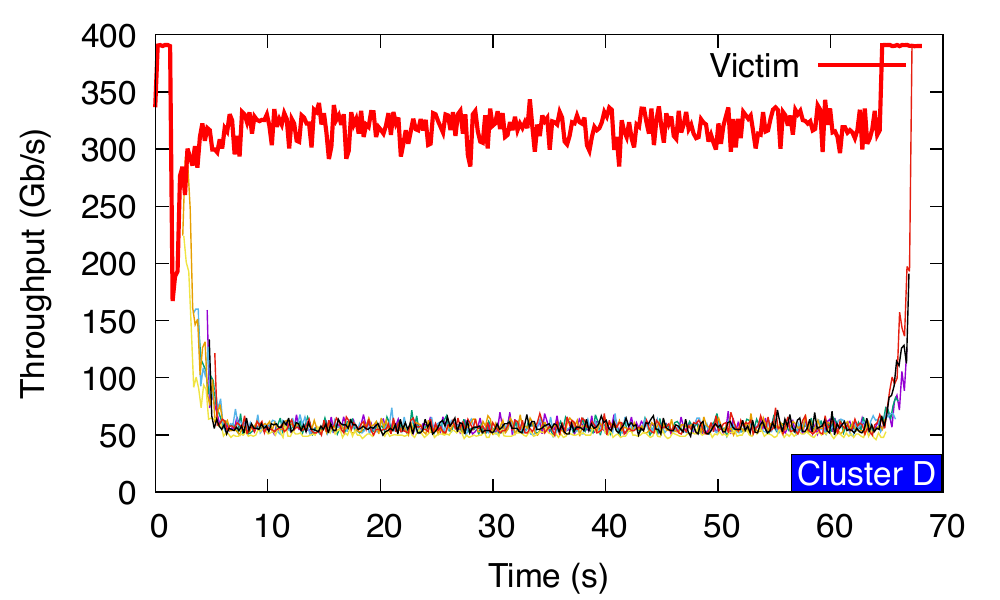 <em>图 18a：RoCEv2 + DCQCN，1 QP。</em></td>
    <td align="center" width="33%">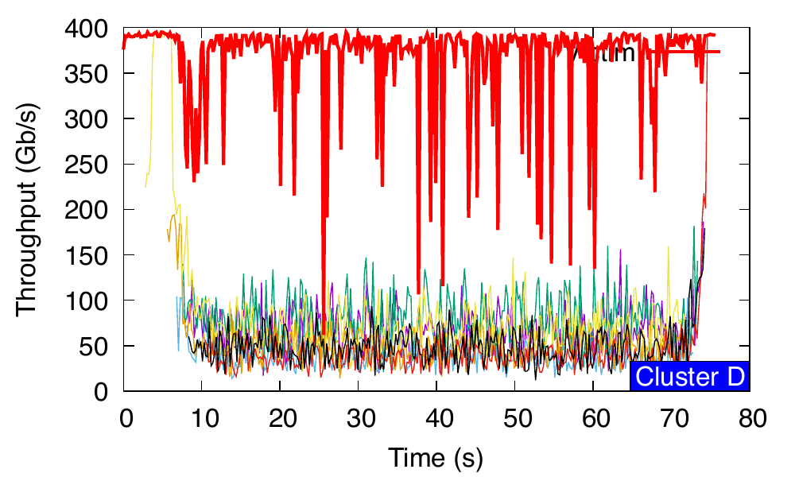 <em>图 18b：RoCEv2 + DCQCN，8 QP。</em></td>
    <td align="center" width="33%">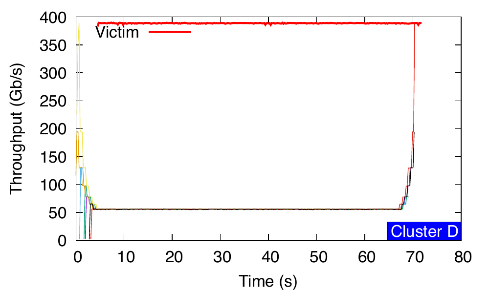 <em>图 18c：MRC，1 QP。</em></td>
  </tr>
</table>

<em>图 18：7 对 1 incast，并有一个目的端为同机架另一节点的 victim flow。</em>

原则上，调优 DCQCN 参数应能缓解这个问题。然而，正确配置 DCQCN 很困难，因为它依赖流量模式，甚至有 hyperscaler 在生产中禁用了它 [20]。附录提供了一些调优结果来说明这一点。

## 6. 相关工作

负载均衡有效性由分布粒度决定：per-flow、per-subflow 和 per-packet。使用 per-flow ECMP 的单路径传输（RoCEv2）[21] 简单但容易碰撞。改善流放置的方案包括集中式方案（Hedera [11] 或 MicroTE [22]）、基于交换机的方案（Flowlet switching [23]、Presto [24] 和 DLB [25]）以及基于主机的方案（例如 PLB [26]、Flowcut [27] 和 FlowBender [28]）。这些方法通常对 bursty AI 流量反应太慢，并且在高负载下成功有限。要高效避免碰撞，需要多路径操作。提供 host 侧按流有序交付的交换机多路径方案也存在（Drill [29]、CONGA [30] 和 Stardust [31]；以及 Broadcom 和 Cisco 的商业产品），但这些是专有方案，并要求同构网络。

今天许多部署依赖带 ECMP 路由的 RoCEv2，但使用应用层多路径传输，通常在 collective 通信层实现，以降低碰撞影响，例如 NCCL [32] QP scaling、MSCCL [33]、NCCLX [34]、UCCL [35]。应用层多路径能缓解问题，但不能完全解决问题，这一点在我们的评估中已有体现。

Multipath TCP（MPTCP [36]）通过把单个连接分散到多个 subflow 上提高利用率。MPTCP 及类似方法需要为每个 subflow 保持状态，但可用于任何数据中心拓扑，并且特别适合长时间运行的流量。Google 的 Falcon [37] 使用这一方法在 NIC 中实现 RoCEv2 的多路径替代。

针对 Clos 网络，有人提出 per-packet 负载均衡或 packet spraying，以减少状态量。RPS [38]、Homa [39] 和 NDP [12] 不感知路径状态，因此难以处理非对称拥塞和部分/灰色故障。通过为每条（虚拟）路径保持少量状态，MPRDMA [40]、Hermes [41]、REPS [42] 或 Strack 等反馈驱动方法利用 ECN 或延迟信号，把流量从拥塞或故障路径上移开。

MRC 修改 RoCEv2 以启用 packet-level 负载均衡、选择性重传，并提升多平面网络中的可靠性。其目标部署环境是支持 packet trimming 的 best-effort（即有损）网络。为此，MRC 建立在大量已有工作之上。IRN 是最早向 RoCEv2 添加选择性重传的方法之一 [43]；MPRDMA 则添加了多路径操作、选择性重传以及 per-path 状态 [40]。这些方法仍依赖无损网络，但完全避免 HoL blocking 问题很困难。

MRC 类似于 Ultra Ethernet Transport，这是一个行业驱动的标准，用全新协议栈替换 RoCEv2，目标是同时支持 HPC 与 AI 工作负载 [8]。UET 已标准化 packet trimming，并且同样以 best-effort 网络运行为目标。

不同于大多数使用主机驱动 ECMP 路由或交换机喷洒的已有工作，MRC 使用 SRv6 源路由以提升大规模鲁棒性。Filsfils 等人 [44] 已验证基于 SRv6 micro-segment（uSID）的路径放置可用于单路径 RoCEv2。

我们不是第一个提出 AI 网络拓扑协同设计的工作（该领域综述见 [45]）。Alibaba 的 HPN [46] 使用 dual-ToR、rail 优化网络，在两层设计中连接最多 15K GPU。Wang 等人 [47] 提出使用 rail-only 方案，只用单层交换机。不过，我们是最早设计并部署多平面网络、用两层交换机达到 100K+ GPU 规模的团队之一。

多个 hyperscaler 的经验都强调了故障对训练作业的负面影响 [48, 46]。我们的多平面、静态路由 SRv6 方案直接针对“让作业承受网络故障”这一目标。

## 7. 结论

MRC 的设计目标是通过把每个 QP 喷洒到所有平面以及每个平面内的多条路径上，对多平面网络做负载均衡，同时执行细粒度主动负载均衡并绕开故障。我们在 Nvidia、Broadcom 和 AMD 的 800 Gb/s NIC 中实现了 MRC，并构建了多个在后端网络中使用 MRC 的两层多平面拓扑超算。MRC 绕开故障的能力使我们能够关闭动态路由；相反，我们使用 SRv6 源路由，并在交换机中配置静态路由。这些超算已经用于训练 OpenAI 最新的前沿模型。我们观察到，该设计让超大 AI 预训练作业能够承受过去会导致作业失败的网络故障，同时大多数故障对作业 step time 影响很小。我们发现，静态源路由提供了非常好的可观测性并降低运维负担；而 MRC 的韧性意味着许多网络故障甚至不再需要紧急维修。

## 8. 致谢

MRC 的开发和成功部署涉及许多人。作者特别感谢以下人员（按字母顺序）：

Rukhsana Ansari、Dragos Argint、Cristi Baciu、Bar Becker、Omri Ben David、Shai Ben Haim、Paul Blakey、Jeremias Blendin、Brian Box、Greg Brockman、Mihai Brodschi、Evan Burness、Trevor Cai、Rory Carmichael、Miguel Castro、Peng Cheng、James Crooks、Janet Cui、Valerie Cutts、Michael Dalton、Biswa Dash、Shawn Dashuai Zhang、Mark Debbage、Karl Deng、Weixin Deng、Gregor Dick、Saurabh Dighe、Qixin Dong、Gili Doweck、Iulian Dracea、Peter Dunning、Yakov Dyadkin、Madan Easwaramoorthy、Elliot Edmunds、Sally Egan、Lior Erets Kdosha、Ze Gan、Naren Gathoo、Renaud Gaubert、Ahmad Ghalayini、Jeff Glover、Guru Harakere、Damian Hazen、John Huber、Richard Hughes、Rita Hui、Tony Hurson、Changho Hwang、Iva Ivanov、Vivek Jain、Riff Jiang、Anuj Kalia、Ali Kamali、Nemanja Kamenica、Vivek Kashyap、Bhunu Kathavarayan、Ady Khalifa、Xinhao Kong、Shilpa Kothapalli、Gawaskar Kumar、Ariel Levkovich、Binyang Li、Xin Liu、Jie Mao、Ilias Marinos、Charlie Mbariky、Scott McDaniel、John Mead、Sharad Mehrotra、Luke Melton、Yan Mo、Scott Moe、Malek Musleh、Nikhil Nanal、Suresh Nedunchezhian、Duc Phong Nguyen、Lisa Nguyen、Wael Noureddine、Vlad Olteanu、Shane O’Neil、Shahar Oren、Kumaresh Perumal、Jonas Pfefferle、Rajesh Pukhraj Jain、Catalin Puscoci、Melur Raghuraman、Mahdi Ramezani、David Riddoch、Uday Ruddarraju、Kathryn Russell、Neelabh Sahay、Lorenzo Saino、Rafael Salas、Siva Santosh Pyla、Emnaual Scaria、Brent Schartung、Karen Schramm、Hemal Shah、Gilad Shainer、Sanjay Shanbhogue、Rohit Sharma、Eden Shimoni、Delna Sholapurwalla、Pradeep Sindhu、Prince Sunny、Vijay Swaminathan、Jason Teplitz、Gaurav Thareja、Bejoy Thomas、Sam Truslow、Dev Upadhyay、Vamsi Vadlamuri、Srihari Vegesna、Ram Velaga、Jijun Wang、Yossi Wortzel、Changrong Wu、Weijia Yuan、Reza Zamani、Jie Zhang、Yanzhao Zhang。

## 附录：Broadcom Thor Ultra 结果

我们提供一些额外结果，展示 Cluster D 中 Broadcom Thor Ultra NIC 上 MRC 的鲁棒性。Cluster D 是一个小型 400 Gb/s 单平面两层网络。MRC 使用 SRv6，并与启用 PFC 和 DCQCN 的 Thor Ultra 普通 RoCE 实现比较。

首先，我们测试 Thor Ultra 上 MRC 对链路故障的韧性。在图 A1a 中，NIC-T0 和 T0-T1 链路都是 400 Gb/s，我们展示当逐步让四条 T0-T1 链路中的三条故障时，`ib_write_bw` 报告的吞吐。在这种情况下，剩余 T0-T1 链路上有足够容量；与图 9d 一样，Thor Ultra 上的 MRC 能够快速从故障链路中恢复，对端到端吞吐没有可见影响。

在下一组实验中，我们把 T0-T1 链路速度降到 100 Gb/s，使得链路故障时会产生带宽瓶颈。图 A1b 展示顺序禁用四条链路中的三条再恢复它们的影响。该实验不同于图 9a，因为故障并非直接连接的 NIC 链路。MRC 能够 fail onto 剩余路径，同时吞吐会跟踪剩余可用容量。图 A1c 展示同一实验的变体：一次丢掉两条链路，然后恢复；结果确认 MRC 能紧密跟踪可用容量。

<table align="center">
  <tr>
    <td align="center" width="33%">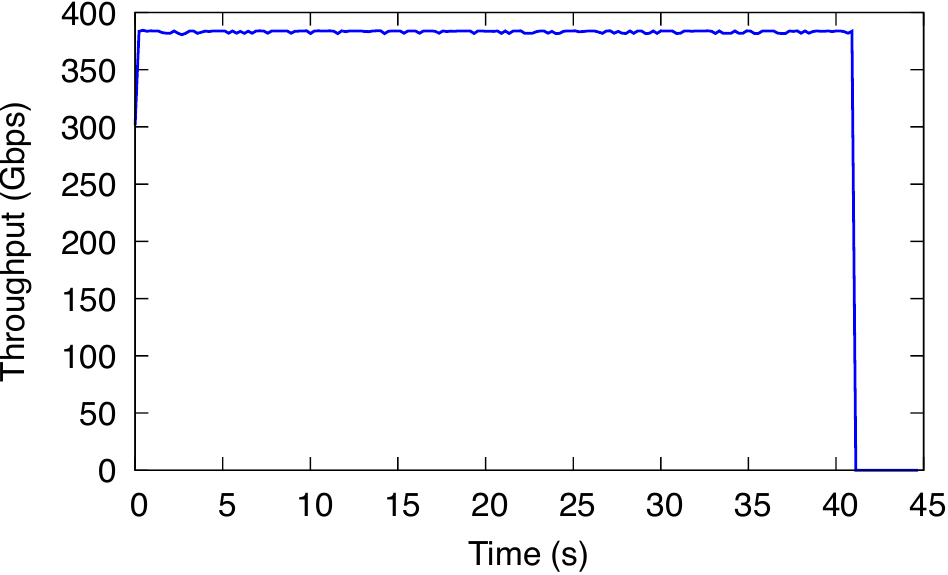 <em>图 A1a：顺序移除四条 400 Gb/s T0-T1 链路中的三条时的吞吐。</em></td>
    <td align="center" width="33%">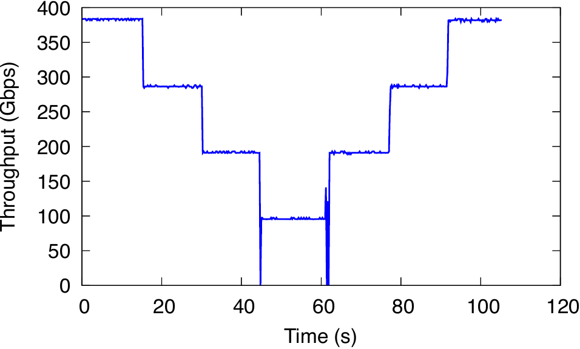 <em>图 A1b：顺序移除并恢复四条 100 Gb/s T0-T1 链路中的三条。</em></td>
    <td align="center" width="33%">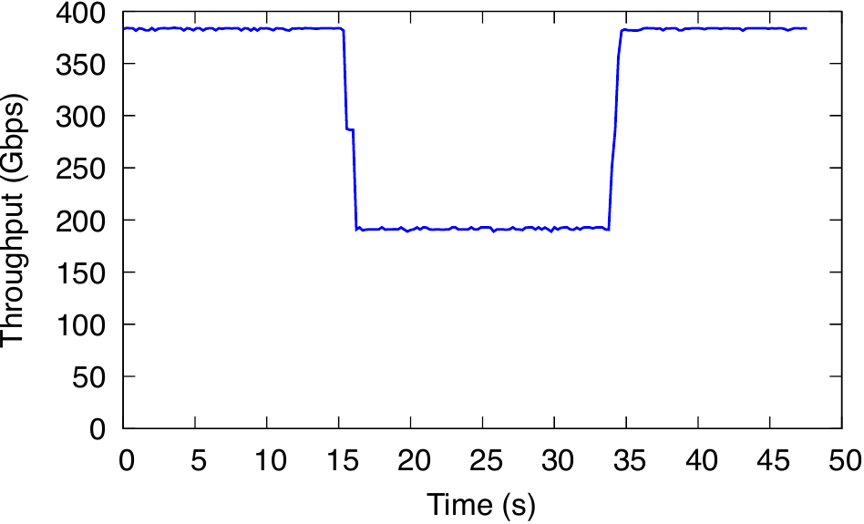 <em>图 A1c：移除并恢复四条 100 Gb/s T0-T1 链路中的两条。</em></td>
  </tr>
</table>

<em>图 A1：不同机架两台服务器之间发生故障时的 ib_write_bw 性能。</em>

**负载均衡微基准。** MRC 的喷洒和主动负载均衡旨在消除流碰撞导致的拥塞。这里展示一些 RoCEv2 结果，说明该问题的性质。

我们让两个机架（8 台 host）以一对一模式通过 `ib_write_bw` 向另两个机架发送数据，并完全打满 T0 上行。当 RoCEv2 每次传输使用单 QP 时，一些流达到线速，但另一些流因流碰撞只能达到一半或三分之一线速；使用 DCQCN [49] 或仅使用 PFC 时结果相同，碰撞数量在不同运行之间变化。图 A2a 展示一次使用 PFC 但不使用 DCQCN 的运行。相比之下，在同一场景中，使用单 QP 的 MRC 能让所有流达到 390 Gbps（图中未展示）。

每次传输使用 8 个 QP 时，是否只用 PFC 或使用 DCQCN+PFC 变得重要，如图 A2b 和 A2c 所示。只使用 PFC 时，多个 QP 只能略有帮助：经历最严重拥塞的 QP 会让发送 NIC 被 PFC 限速，进而拖慢同一 host 上的所有其他 QP。DCQCN 通过基于 ECN 信号降低发送速率来避免这一现象 [49]。同样，对 MRC 来说，使用 8 个 QP 时吞吐也是线速。

<table align="center">
  <tr>
    <td align="center" width="33%">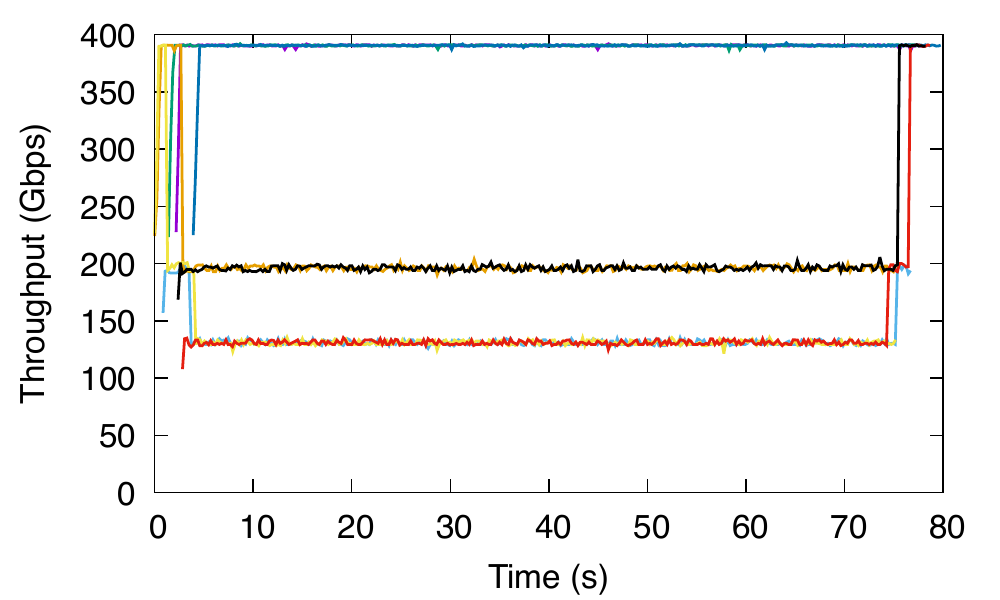 <em>图 A2a：RoCEv2 + PFC，1 QP。</em></td>
    <td align="center" width="33%">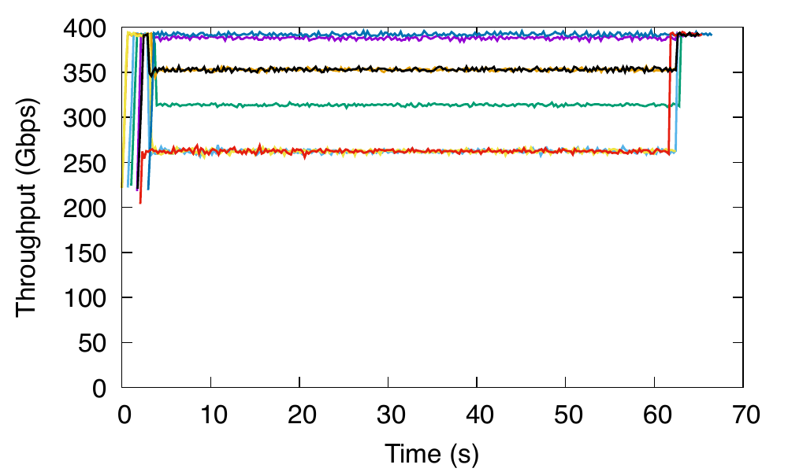 <em>图 A2b：RoCEv2 + PFC，8 QP。</em></td>
    <td align="center" width="33%">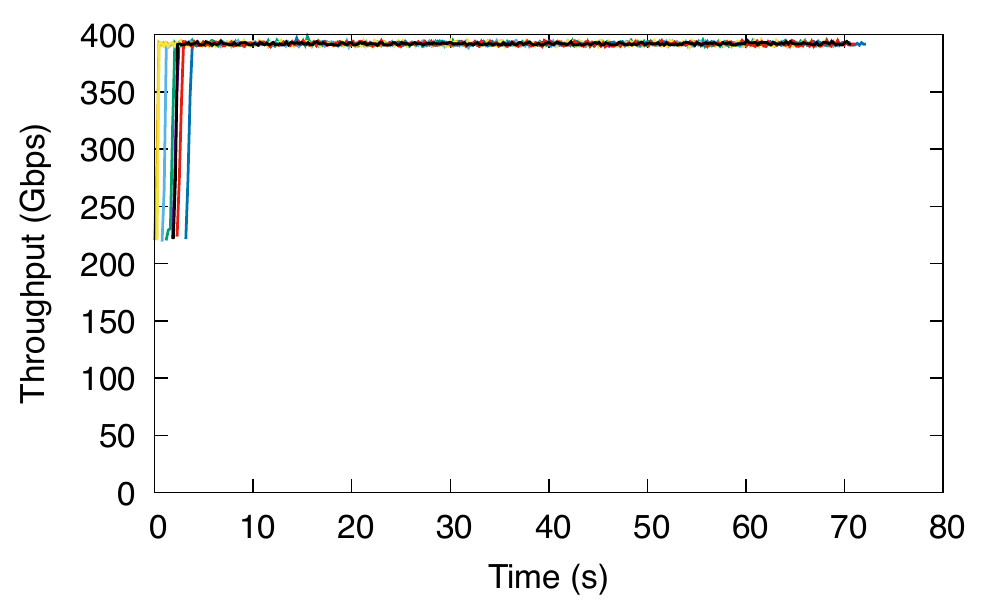 <em>图 A2c：RoCEv2 + DCQCN，8 QP。</em></td>
  </tr>
</table>

<em>图 A2：两个机架中的服务器向另两个机架中的服务器发送流量时的 permutation 吞吐。</em>

**Incast 的连带损伤。** 如第 5.3.8 节所述，无损网络在 incast 流量模式下很难处理拥塞扩散以及对无关 victim 流量的影响。这里展示同样的跨 spine 7 对 1 incast 流量模式的一些额外结果：它并行运行一条 victim 连接，分别使用 RoCEv2 仅 PFC 和 MRC 8 QP。RoCEv2 + DCQCN 和 MRC 1 QP 的结果已在图 18a、18b、18c 展示。

结果见图 A3a、A3b、A3c。仅使用 PFC 时，对 victim flow 的影响非常严重：victim flow 只能达到 30 到 100 Gb/s，具体取决于 ECMP 路径选择和公平性。MRC 8 QP 与 1 QP 表现完全相同，能在 incast 流之间完美共享瓶颈链路，并且不影响 victim flow。

<table align="center">
  <tr>
    <td align="center" width="33%">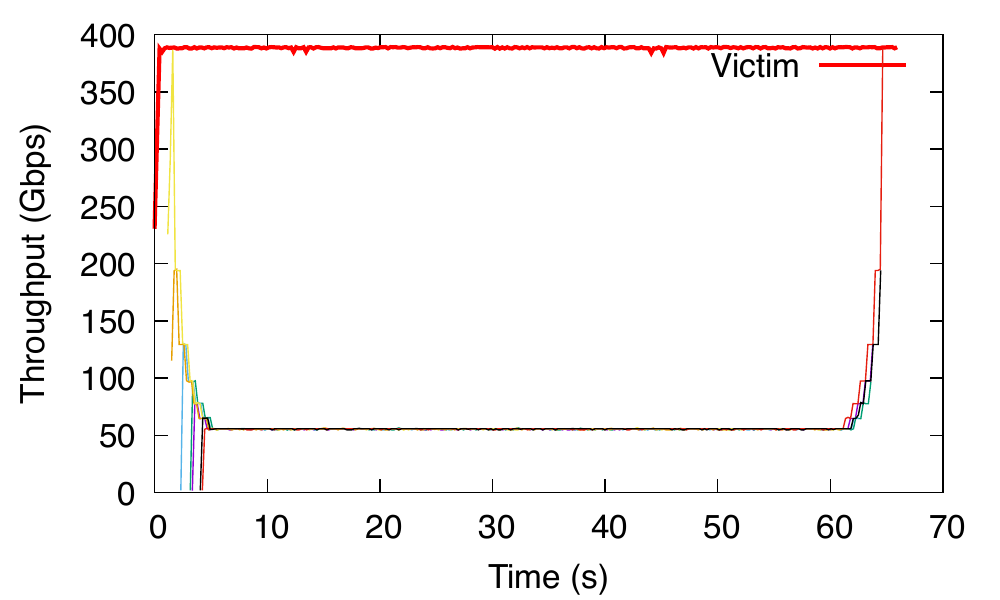 <em>图 A3a：MRC，8 QP。</em></td>
    <td align="center" width="33%">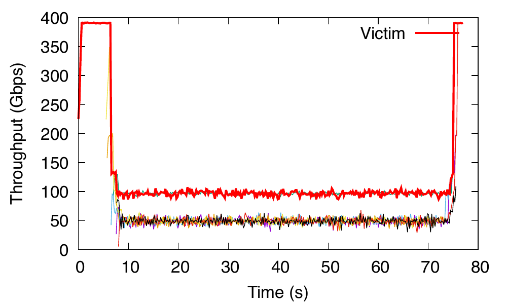 <em>图 A3b：RoCEv2 仅 PFC，1 QP。</em></td>
    <td align="center" width="33%">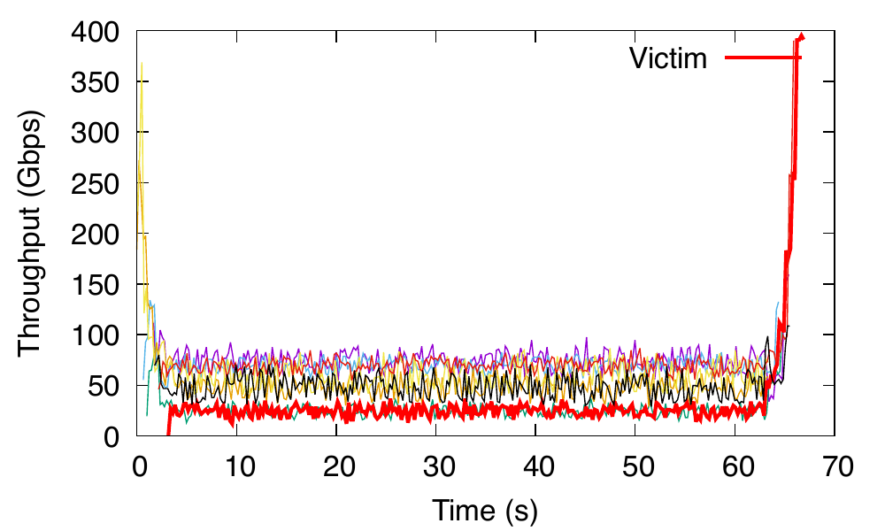 <em>图 A3c：RoCEv2 仅 PFC，8 QP。</em></td>
  </tr>
</table>

<em>图 A3：7 对 1 incast，并有一个目的端为同机架另一节点的 victim flow。</em>

原则上，DCQCN 参数调优应能解决这一问题。然而，正确配置 DCQCN 很难，因为它依赖流量模式。

为说明原因，图 A4 展示一个 15 对 1 incast 中目的端 ToR 队列大小，流每隔 5 秒依次到达。我们测试了三种推荐给客户的 DCQCN profile：默认 profile（图 A4a）、更激进 profile（图 A4b）和最激进 profile（图 A4c）。默认情况下，少量流（少于 10 个）时队列可控，随后进入 PFC 模式，但瓶颈吞吐为线速。在更激进 profile 中，队列可控（但动态范围很大），但队列有时为空，导致瓶颈吞吐约损失 10%。最后，最激进设置下，队列使用量尖峰相似，但平均利用率更低，总吞吐比线速慢 20%。

<table align="center">
  <tr>
    <td align="center" width="33%">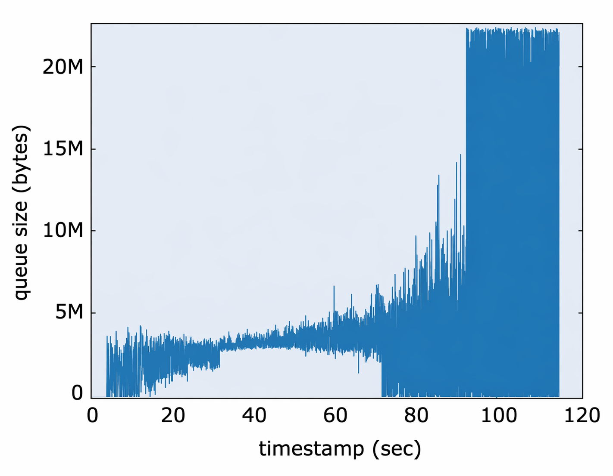 <em>图 A4a：默认 DCQCN 参数。</em></td>
    <td align="center" width="33%">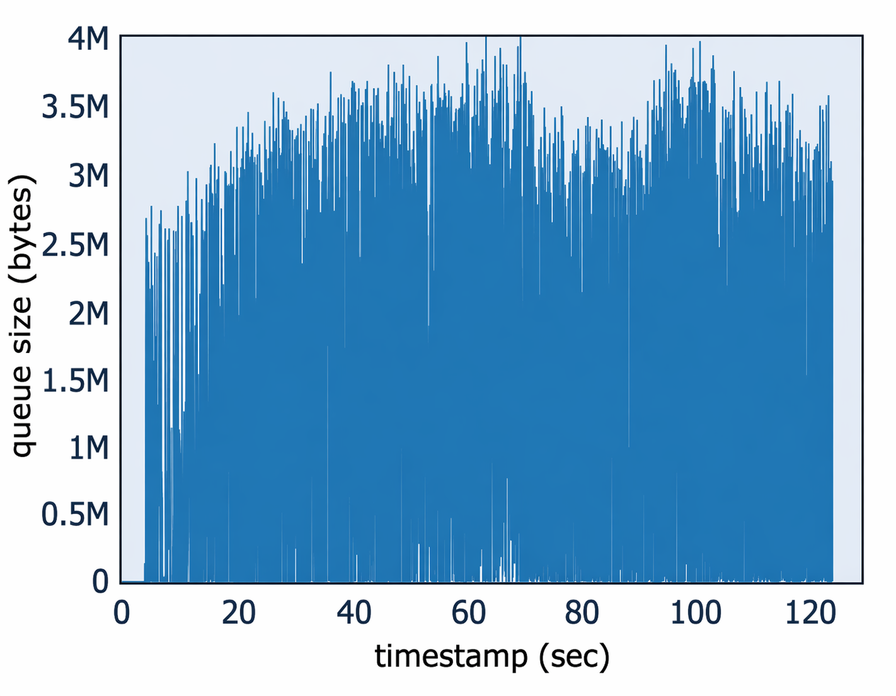 <em>图 A4b：更激进的拥塞控制 profile。</em></td>
    <td align="center" width="33%">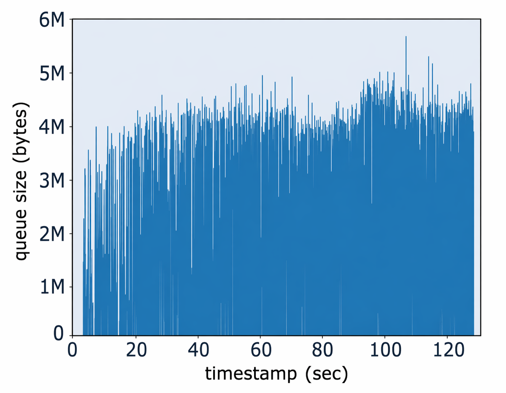 <em>图 A4c：最激进的拥塞控制 profile。</em></td>
  </tr>
</table>

<em>图 A4：15 对 1 incast 中，流每隔 5 秒到达时，DCQCN leaf-host 队列动态。</em>

## 参考文献
[1] Ben-Nun, Tal; Hoefler, Torsten。Demystifying Parallel and Distributed Deep Learning: An In-depth Concurrency Analysis。ACM Comput. Surv., 2019。DOI: 10.1145/3320060。URL: https://doi.org/10.1145/3320060。

[2] Samyam Rajbhandari; Conglong Li; Zhewei Yao; Minjia Zhang; Reza Yazdani Aminabadi; Ammar Ahmad Awan; Jeff Rasley; Yuxiong He。DeepSpeed-MoE: Advancing Mixture-of-Experts Inference and Training to Power Next-Generation AI Scale。2022。URL: https://arxiv.org/abs/2201.05596。

[3] Yan, Zijie; Bai, Hongxiao; Yao, Xin; Liu, Dennis; Liu, Tong; Liu, Hongbin; Li, Pingtian; Wu, Evan; Fan, Shiqing; Tao, Li; others。Scalable Training of Mixture-of-Experts Models with Megatron Core。arXiv preprint arXiv:2603.07685, 2026。

[4] Dean, Jeffrey; Barroso, Luiz Andr\'e。The tail at scale。Commun. ACM, 2013。DOI: 10.1145/2408776.2408794。URL: https://doi.org/10.1145/2408776.2408794。

[5] Hoefler, Torsten; Schneider, Timo; Lumsdaine, Andrew。Characterizing the Influence of System Noise on Large-Scale Applications by Simulation。Proceedings of the 2010 ACM/IEEE International Conference for High Performance Computing, Networking, Storage and Analysis, 2010。DOI: 10.1109/SC.2010.12。URL: https://doi.org/10.1109/SC.2010.12。

[6] Petrini, Fabrizio; Kerbyson, Darren J.; Pakin, Scott。The Case of the Missing Supercomputer Performance: Achieving Optimal Performance on the 8,192 Processors of ASCI Q。Proceedings of the 2003 ACM/IEEE Conference on Supercomputing, 2003。DOI: 10.1145/1048935.1050204。URL: https://doi.org/10.1145/1048935.1050204。

[7] InfiniBand Trade Association (IBTA)。The RoCE Initiative。(Accessed: May 2021)。URL: https://www.infinibandta.org/roce-initiative/。

[8] Ultra Ethernet Consortium。Ultra Ethernet Specification v1.0.1。2025。URL: https://ultraethernet.org/wp-content/uploads/sites/20/2025/10/UE-Specification-1.0.1.pdf。

[9] Torsten Hoefler; Karen Schramm; Eric Spada; Keith Underwood; Cedell Alexander; Bob Alverson; Paul Bottorff; Adrian Caulfield; Mark Handley; Cathy Huang; Costin Raiciu; Abdul Kabbani; Eugene Opsasnick; Rong Pan; Adee Ran; Rip Sohan。Ultra Ethernet's Design Principles and Architectural Innovations。2025。URL: https://arxiv.org/abs/2508.08906。

[10] Rip Sohan; Eric Spada; Eric Davis; Mark Handley; Idan Burstein; Tony Hurson; Jithin Jose; Vivek Kashyap; Rong Pan; Sayantan Sur。Multipath Reliable Connection (MRC) Specification。Open Compute Project, 2026。

[11] Al-Fares, Mohammad; Radhakrishnan, Sivasankar; Raghavan, Barath; Huang, Nelson; Vahdat, Amin。Hedera: Dynamic Flow Scheduling for Data Center Networks。Networked Systems Design and Implementation (NSDI), 2010。

[12] Handley, Mark; Raiciu, Costin; Agache, Alexandru; Voinescu, Andrei; Moore, Andrew W.; Antichi, Gianni; W\'ojcik, Marcin。Re-architecting Datacenter Networks and Stacks for Low Latency and High Performance。Special Interest Group on Data Communication (SIGCOMM), 2017。

[13] Clarence Filsfils; Darren Dukes; Stefano Previdi; John Leddy; Satoru Matsushima; Daniel Voyer。Segment Routing over IPv6 (SRv6) Network Programming。RFC Editor, 2021。DOI: 10.17487/RFC8986。URL: https://www.rfc-editor.org/info/rfc8986。

[14] Weiqiang Cheng; Clarence Filsfils; Zhenbin Li; Bruno Decraene; Dezhong Cai; Daniel Voyer; Francois Clad; Shay Zadok; Jim Guichard; Aihua Liu; Robert Raszuk; Cheng Li。Compressed SRv6 Segment List Encoding。RFC Editor, 2025。DOI: 10.17487/RFC9800。URL: https://www.rfc-editor.org/info/rfc9800。

[15] Singh, Rachee; Mukhtar, Muqeet; Krishna, Ashay; Parkhi, Aniruddha; Padhye, Jitendra; Maltz, David。Surviving switch failures in cloud datacenters。SIGCOMM Comput. Commun. Rev., 2021。DOI: 10.1145/3464994.3464996。URL: https://doi.org/10.1145/3464994.3464996。

[16] Yin, Zuoning; Caesar, Matthew; Zhou, Yuanyuan。Towards understanding bugs in open source router software。SIGCOMM Comput. Commun. Rev., 2010。DOI: 10.1145/1823844.1823849。URL: https://doi.org/10.1145/1823844.1823849。

[17] Liu, Hongqiang; Zhu, Yibo; Padhye, Jitu; Cao, Jiaxin; Tallapragada, Sri; Lopes, Nuno; Rybalchenko, Andrey; Lu, Guohan; Yuan, Lihua。CrystalNet: Faithfully Emulating Large Production Networks。SOSP '17 Proceedings of the 26th Symposium on Operating Systems Principles, 2017。URL: https://www.microsoft.com/en-us/research/publication/crystalnet-faithfully-emulating-large-production-networks/。

[18] Guo, Chuanxiong; Yuan, Lihua; Xiang, Dong; Dang, Yingnong; Huang, Ray; Maltz, Dave; Liu, Zhaoyi; Wang, Vin; Pang, Bin; Chen, Hua; Lin, Zhi-Wei; Kurien, Varugis。Pingmesh: A Large-Scale System for Data Center Network Latency Measurement and Analysis。SIGCOMM Comput. Commun. Rev., 2015。DOI: 10.1145/2829988.2787496。URL: https://doi.org/10.1145/2829988.2787496。

[19] P4 Open Source Programming Language。https://p4.org/。

[20] Gangidi, Adithya; Miao, Rui; Zheng, Shengbao; Bondu, Sai Jayesh; Goes, Guilherme; Morsy, Hany; Puri, Rohit; Riftadi, Mohammad; Shetty, Ashmitha Jeevaraj; Yang, Jingyi; Zhang, Shuqiang; Fernandez, Mikel Jimenez; Gandham, Shashidhar; Zeng, Hongyi。RDMA over Ethernet for Distributed Training at Meta Scale。Proceedings of the ACM SIGCOMM 2024 Conference, 2024。DOI: 10.1145/3651890.3672233。URL: https://doi.org/10.1145/3651890.3672233。

[21] C. Hopps。Analysis of an Equal-Cost Multi-Path Algorithm。RFC Editor, 2009。URL: https://www.ietf.org/rfc/rfc2992.txt。

[22] Benson, Theophilus; Anand, Ashok; Akella, Aditya; Zhang, Ming。MicroTE: fine grained traffic engineering for data centers。Proceedings of the Seventh COnference on Emerging Networking EXperiments and Technologies, 2011。DOI: 10.1145/2079296.2079304。URL: https://doi.org/10.1145/2079296.2079304。

[23] Erico Vanini; Rong Pan; Mohammad Alizadeh; Parvin Taheri; Tom Edsall。Let It Flow: Resilient Asymmetric Load Balancing with Flowlet Switching。14th USENIX Symposium on Networked Systems Design and Implementation (NSDI 17), 2017。URL: https://www.usenix.org/conference/nsdi17/technical-sessions/presentation/vanini。

[24] He, Keqiang; Rozner, Eric; Agarwal, Kanak; Felter, Wes; Carter, John; Akella, Aditya。Presto: Edge-Based Load Balancing for Fast Datacenter Networks。Proceedings of the 2015 ACM Conference on Special Interest Group on Data Communication, 2015。DOI: 10.1145/2785956.2787507。URL: https://doi.org/10.1145/2785956.2787507。

[25] Broadcom。ECMP Dynamic Load Balancing。https://docs.broadcom.com/doc/56980-DS, 2019。

[26] Qureshi, Mubashir Adnan; Cheng, Yuchung; Yin, Qianwen; Fu, Qiaobin; Kumar, Gautam; Moshref, Masoud; Yan, Junhua; Jacobson, Van; Wetherall, David; Kabbani, Abdul。PLB: congestion signals are simple and effective for network load balancing。Proceedings of the ACM SIGCOMM 2022 Conference, 2022。DOI: 10.1145/3544216.3544226。URL: https://doi.org/10.1145/3544216.3544226。

[27] Bonato, Tommaso; De Sensi, Daniele; Di Girolamo, Salvatore; Bataineh, Abdulla; Hewson, David; Roweth, Duncan; Hoefler, Torsten。Flowcut Switching: High-Performance Adaptive Routing With In-Order Delivery Guarantees。IEEE Transactions on Networking, 2026。DOI: 10.1109/TON.2025.3636209。

[28] Kabbani, Abdul; Vamanan, Balajee; Hasan, Jahangir; Duchene, Fabien。FlowBender: Flow-level Adaptive Routing for Improved Latency and Throughput in Datacenter Networks。Conference on Emerging Networking Experiments and Technologies (CoNEXT), 2014。

[29] Ghorbani, Soudeh; Yang, Zibin; Godfrey, P. Brighten; Ganjali, Yashar; Firoozshahian, Amin。DRILL: Micro Load Balancing for Low-Latency Data Center Networks。Proceedings of the Conference of the ACM Special Interest Group on Data Communication, 2017。DOI: 10.1145/3098822.3098839。URL: https://doi.org/10.1145/3098822.3098839。

[30] Alizadeh, Mohammad; Edsall, Tom; Dharmapurikar, Sarang; Vaidyanathan, Ramanan; Chu, Kevin; Fingerhut, Andy; Lam, Vinh The; Matus, Francis; Pan, Rong; Yadav, Navindra; Varghese, George。CONGA: Distributed Congestion-aware Load Balancing for Datacenters。Special Interest Group on Data Communication (SIGCOMM), 2014。

[31] Noa Zilberman; Gabi Bracha; Golan Schzukin。Stardust: Divide and Conquer in the Data Center Network。16th USENIX Symposium on Networked Systems Design and Implementation (NSDI 19), 2019。URL: https://www.usenix.org/conference/nsdi19/presentation/zilberman。

[32] Zhiyi Hu; Siyuan Shen; Tommaso Bonato; Sylvain Jeaugey; Cedell Alexander; Eric Spada; James Dinan; Jeff Hammond; Torsten Hoefler。Demystifying NCCL: An In-depth Analysis of GPU Communication Protocols and Algorithms。2026。URL: https://arxiv.org/abs/2507.04786。

[33] Aashaka Shah; Vijay Chidambaram; Meghan Cowan; Saeed Maleki; Madan Musuvathi; Todd Mytkowicz; Jacob Nelson; Olli Saarikivi; Rachee Singh。TACCL: Guiding Collective Algorithm Synthesis using Communication Sketches。2022。URL: https://arxiv.org/abs/2111.04867。

[34] Min Si; Pavan Balaji; Yongzhou Chen; Ching-Hsiang Chu; Adi Gangidi; Saif Hasan; Subodh Iyengar; Dan Johnson; Bingzhe Liu; Regina Ren; Deep Shah; Ashmitha Jeevaraj Shetty; Greg Steinbrecher; Yulun Wang; Bruce Wu; Xinfeng Xie; Jingyi Yang; Mingran Yang; Kenny Yu; Minlan Yu; Cen Zhao; Wes Bland; Denis Boyda; Suman Gumudavelli; Prashanth Kannan; Cristian Lumezanu; Rui Miao; Zhe Qu; Venkat Ramesh; Maxim Samoylov; Jan Seidel; Srikanth Sundaresan; Feng Tian; Qiye Tan; Shuqiang Zhang; Yimeng Zhao; Shengbao Zheng; Art Zhu; Hongyi Zeng。Collective Communication for 100k+ GPUs。2026。URL: https://arxiv.org/abs/2510.20171。

[35] Zhou, Yang; Chen, Zhongjie; Mao, Ziming; Lao, ChonLam; Yang, Shuo; Kannan, Pravein Govindan; Gao, Jiaqi; Zhao, Yilong; Wu, Yongji; You, Kaichao; Ren, Fengyuan; Xu, Zhiying; Raiciu, Costin; Stoica, Ion。UCCL-Tran: An Extensible Software Transport Layer for Machine Learning Workloads。USENIX OSDI, 2026。

[36] Raiciu, Costin; Barre, Sebastien; Pluntke, Christopher; Greenhalgh, Adam; Wischik, Damon; Handley, Mark。Improving Datacenter Performance and Robustness with Multipath TCP。Special Interest Group on Data Communication (SIGCOMM), 2010。

[37] Singhvi, Arjun; Dukkipati, Nandita; Chandra, Prashant; Wassel, Hassan M. G.; Sharma, Naveen Kr.; Rebello, Anthony; Schuh, Henry; Kumar, Praveen; Montazeri, Behnam; Bansod, Neelesh; Thomas, Sarin; Cho, Inho; Seibert, Hyojeong Lee; Wu, Baijun; Yang, Rui; Li, Yuliang; Huang, Kai; Yin, Qianwen; Agarwal, Abhishek; Vaduvatha, Srinivas; Wang, Weihuang; Moshref, Masoud; Ji, Tao; Wetherall, David; Vahdat, Amin。Falcon: A Reliable, Low Latency Hardware Transport。Proceedings of the ACM SIGCOMM 2025 Conference, 2025。DOI: 10.1145/3718958.3754353。URL: https://doi.org/10.1145/3718958.3754353。

[38] Dixit, Advait; Prokash, Pawan; Hu, Charlie Y.; Kompella, Ramona R。On the Impact of Packet Spraying in Data Center Networks。International Conference on Computer Communications (INFOCOM), 2013。

[39] Montazeri, Behnam; Li, Yilong; Alizadeh, Mohammad; Ousterhout, John。Homa: A Receiver-driven Low-latency Transport Protocol Using Network Priorities。Special Interest Group on Data Communication (SIGCOMM), 2018。

[40] Yuanwei Lu; Guo Chen; Bojie Li; Kun Tan; Yongqiang Xiong; Peng Cheng; Jiansong Zhang; Enhong Chen; Thomas Moscibroda。Multi-Path Transport for RDMA in Datacenters。15th USENIX Symposium on Networked Systems Design and Implementation (NSDI 18), 2018。URL: https://www.usenix.org/conference/nsdi18/presentation/lu。

[41] Zhang, Hong; Zhang, Junxue; Bai, Wei; Chen, Kai; Chowdhury, Mosharaf。Resilient Datacenter Load Balancing in the Wild。Proceedings of the Conference of the ACM Special Interest Group on Data Communication, 2017。DOI: 10.1145/3098822.3098841。URL: https://doi.org/10.1145/3098822.3098841。

[42] Tommaso Bonato; Abdul Kabbani; Ahmad Ghalayini; Michael Papamichael; Mohammad Dohadwala; Lukas Gianinazzi; Mikhail Khalilov; Elias Achermann; Daniele De Sensi; Torsten Hoefler。REPS: Recycled Entropy Packet Spraying for Adaptive Load Balancing and Failure Mitigation。2026。DOI: https://doi.org/10.1145/3767295.3769320。URL: https://arxiv.org/abs/2407.21625。

[43] Mittal, Radhika; Shpiner, Alexander; Panda, Aurojit; Zahavi, Eitan; Krishnamurthy, Arvind; Ratnasamy, Sylvia; Shenker, Scott。Revisiting Network Support for RDMA。Proceedings of the 2018 Conference of the ACM Special Interest Group on Data Communication, 2018。DOI: 10.1145/3230543.3230557。URL: https://doi.org/10.1145/3230543.3230557。

[44] Clarence Filsfils; Pablo Camarillo; Ahmed Abdelsalam; Arianna Quinci; Angelo Tulumello; Andrea Mayer; Pierpaolo Loreti; Lorenzo Bracciale; Stefano Salsano。Toward Deterministic Path Placement in AI Backends: A Practical SRv6-Based Architecture。21st International Conference on Network and Service Management (CNSM), 2025。URL: https://dl.ifip.org/db/conf/cnsm/cnsm2025/1571173126.pdf。

[45] Gherghescu, Alexandru M.; Badoiu, Vlad-Andrei; Agache, Alexandru; Dumitru, Mihai-Valentin; Vasilescu, Iuliu; Mantu, Radu; Raiciu, Costin。I've Got 99 Problems But FLOPS Ain't One。Proceedings of the 23rd ACM Workshop on Hot Topics in Networks, 2024。DOI: 10.1145/3696348.3696893。URL: https://doi.org/10.1145/3696348.3696893。

[46] Qian, Kun; Xi, Yongqing; Cao, Jiamin; Gao, Jiaqi; Xu, Yichi; Guan, Yu; Fu, Binzhang; Shi, Xuemei; Zhu, Fangbo; Miao, Rui; Wang, Chao; Wang, Peng; Zhang, Pengcheng; Zeng, Xianlong; Ruan, Eddie; Yao, Zhiping; Zhai, Ennan; Cai, Dennis。Alibaba HPN: A Data Center Network for Large Language Model Training。Proceedings of the ACM SIGCOMM 2024 Conference, 2024。DOI: 10.1145/3651890.3672265。URL: https://doi.org/10.1145/3651890.3672265。

[47] Wang, Weiyang; Ghobadi, Manya; Shakeri, Kayvon; Zhang, Ying; Hasani, Naader。Rail-only: A Low-Cost High-Performance Network for Training LLMs with Trillion Parameters。2024 IEEE Symposium on High-Performance Interconnects (HOTI), 2024。DOI: 10.1109/HOTI63208.2024.00013。

[48] Aaron Grattafiori et al。The LLaMa 3 Herd of Models。2024。URL: https://arxiv.org/abs/2407.21783。

[49] Zhu, Yibo; Eran, Haggai; Firestone, Daniel; Guo, Chuanxiong; Lipshteyn, Marina; Liron, Yehonatan; Padhye, Jitendra; Raindel, Shachar; Yahia, Mohamad Haj; Zhang, Ming。Congestion Control for Large-Scale RDMA Deployments。Proceedings of the 2015 ACM Conference on Special Interest Group on Data Communication, 2015。DOI: 10.1145/2785956.2787484。URL: https://doi.org/10.1145/2785956.2787484。
