# An Extensible Software Transport Layer for GPU Networking
## 论文信息
- 标题：An Extensible Software Transport Layer for GPU Networking
- 年份：2026
- 会议/期刊：USENIX OSDI 2026（已发表）
- 作者：Yang Zhou、Zhongjie Chen、Ziming Mao、ChonLam Lao、Shuo Yang、Pravein Govindan Kannan、Jiaqi Gao、Yilong Zhao、Yongji Wu、Kaichao You、Fengyuan Ren、Zhiying Xu、Costin Raiciu、Ion Stoica
- 机构：
  - UC Berkeley：Yang Zhou、Ziming Mao、Shuo Yang、Yilong Zhao、Yongji Wu、Kaichao You、Ion Stoica
  - UC Davis：Yang Zhou
  - Tsinghua University：Zhongjie Chen、Kaichao You、Fengyuan Ren
  - Harvard University：ChonLam Lao
  - IBM Research：Pravein Govindan Kannan
  - Unaffiliated：Jiaqi Gao
  - Amazon Web Services：Zhiying Xu
  - University Politehnica of Bucharest / Broadcom：Costin Raiciu
## 摘要
快速发展的机器学习 (ML) 工作负载对网络的要求越来越高。然而，RDMA NICs 上的主机网络传输很难发展，导致 ML 工作负载出现问题。例如，单路径 RDMA 流量很容易发生流冲突，从而严重降低集体通信性能。我们推出了 UCCL，这是一个可扩展的软件传输层，用于发展 GPU 网络。 UCCL 将现有 RDMA NICs 的数据路径和控制路径解耦，并在主机 CPUs 上高效运行控制路径传输。这种软件可扩展性带来了机器学习工作负载硬件无法实现的传输创新，例如解决流冲突的多路径传输。与现有 RDMA NICs 相比，UCCL 之上的 ML 集合的性能提高了 4.5 倍。

## 1. 引言

机器学习 (ML) 工作负载及其对网络的要求正在迅速发展。不到十年前，深度神经网络只有数百万个参数，并在数百个 CPUs/GPUs 上使用参数服务器或 allreduce 集体通信 [59] 进行训练。五年后，大型语言模型（LLMs）开始激增，拥有数十亿个参数，并在数千个更强大的 GPUs 上进行训练，这些模型具有多级并行性和多样化的集合，例如 allreduce、allgather 和 reduce-scatter [39, 12]。近两年，LLM大规模服务已成常态；预填充解码分解 [104] 作为一种高效的服务技术，需要快速的点对点通信。今年，像 DeepSeek-V3 [62] 这样的专家混合 (MoE) 模型变得非常流行，其特点是数百个 GPUs 之间的 all-to-all 通信具有挑战性。

然而，网络技术，尤其是 RDMA NICs 上的主机网络传输，很难适应和发展以更好地满足 ML 工作负载的需求。从本质上讲，硬件变更非常耗时，并且比软件变更花费的时间要长得多。这可能导致应用程序需求与现有硬件优化之间不匹配，这通常会导致性能下降。例如，Meta 报告说，DCQCN [106]（RDMA NICs 支持的数据中心中流行的拥塞控制 (CC) 算法）对于低流熵和高流量突发性的 LLM 训练工作负载效果不佳 [33]。因此，Meta决定在NICs中禁用CC的支持，转而在应用层实现流量调度。同样，DeepSeek 在运行大规模 all-to-all 来服务 MoE 模型时禁用了 CC [28]。然而，在没有 CC 的情况下运行大规模 RDMA 网络很脆弱，因为它可能导致死锁、队头阻塞和普遍拥塞 [45,40,69,106,11,34]。

在另一个示例中，Alibaba 在 LLM 训练期间观察到集体通信的性能严重下降。这是由于高水平的流冲突造成的，而流冲突又是由 RDMA NICs 每个连接仅支持单流/路径 [83] 引起的。为了避免这个问题，Alibaba使用轨道优化的双平面架构重新设计了LLM训练的网络拓扑。然而，这种重新设计的构建和维护成本高昂。正如我们将在 §3.2 中展示的那样，在应用程序级别实现多路径的纯软件解决方案可以避免此类拓扑更改。

在 §2.2 中，我们讨论了 ML 工作负载需要调整 RDMA 硬件支持的另外四个示例，包括 MoE 服务中的网络播送、半可靠梯度传输、高效丢失恢复以及避免供应商锁定。此外，现有的硬件烘焙主机网络传输层使得很难生产新的研究提案 [96, 56, 15, 81] 来提高现实场景中 ML 工作负载的性能。

这些示例表明网络可扩展性是数据中心网络的关键挑战之一。在本文中，我们通过提出并实现称为 UCCL (Ultra-CCL) 的纯软件可扩展传输层，重点关注在支持 RDMA 的主机环境中解决这一挑战。这种纯软件方法可以更轻松地有效支持新的 ML 工作负载，例如，CC 算法可以比现有的 DCQCN 更好地支持 ML 流量，以及用于减轻流冲突的多路径。为了实现这种方法，我们需要解决两个挑战：（1）如何解耦现有RDMA NICs的数据和控制路径？数据路径处理 GPU 的网络数据传输，而控制路径则管理 CC、数据包可靠性和多路径负载平衡 (LB) 等传输控制决策。只有将控制路径与数据路径解耦，才能在CPU上实现。 (2) CPU 上运行的控制路径如何实现硬件级性能？鉴于 GPU 服务器间的高带宽（可能超过 3.2 Tbps），这是一项挑战 [6, 67]。

为了解决第一个挑战，UCCL 重新利用了现有 RDMA NICs 的功能，以实现高效的数据和控制路径分离。特别是，UCCL 利用 RDMA 不可靠连接 (UC) 来绕过硬件烘焙的 CC 和数据包可靠性逻辑，并使用 RDMA 立即数据在发送方和接收方 CPUs 之间传递传输控制状态。对于一些不支持UC的NICs，例如AWS EFA [88]，UCCL利用RDMA不可靠数据报（UD）的分散-聚集功能来实现分离。

为了应对第二个挑战，UCCL 利用了一系列针对 ML 工作负载的独特特征量身定制的技术。一方面，UCCL 利用 GPUDirect [27] 来减轻 CPU 开销。另一方面，UCCL 采用控制合并来为每个 32KB 数据块而不是每个数据包做出传输控制决策；这很有效，因为许多传输决策（例如 CC）不需要每个数据包反应，而只需要每个 RTT 以避免过度反应 [61, 38]。因此，UCCL 可以使用单个 CPU 内核处理 400 Gbps 单向流量，并实现与基于硬件的传输相同的消息延迟。 UCCL 每个连接利用 256 个 RDMA QPs (Queue Pairs) 来执行多路径，而无需担心先前工作中强调的高 QP 上下文交换开销 [98]；这是因为 ML 工作负载的特点是使用大多数 MTU 大小的大数据包进行批量数据传输，这可以有效地分摊交换开销。 UCCL的软件传输在现代GPU服务器中实用且经济，这些服务器通常拥有数百个强大的CPU核心；事实上，这些 CPU 内核通常未得到充分利用。例如，根据我们与主要 GPU 供应商的模型训练团队的私下对话，当使用内部版本的 Megatron-LM [78] 进行模型训练时，他们的 CPU 利用率在 128 个核心中平均为 14.5%。

UCCL 提供了富有表现力且易于使用的界面。为了展示该接口的多功能性以及 UCCL 的可扩展性的强大功能，我们使用三个案例研究。首先，我们实现了一种多路径传输协议，该协议通过利用数据包喷射来减轻流冲突，即从单个连接跨不同路径随机发送数据包[30]。与硬件上现有的 RDMA 传输相比，使用我们的传输的 ML 集合在 NVIDIA ConnectX-7 NICs 上实现了高达 4.5 倍的吞吐量提升，在具有铁路优化拓扑的 Broadcom Thor-2 NICs 上实现了高达 1.9 倍的吞吐量提升。其次，我们实现了接收器驱动的协议 EQDS [81] 来处理类似 MoE 的工作负载中的网络播送，与 InfiniBand 内置传输相比，消息尾部延迟提高了 4.9 倍。第三，我们实现选择性重传[66]以实现有效的传输丢失恢复，并在丢包情况下展示其相对于RDMA硬件传输的优越性。这些案例研究强调，UCCL 可以有效地实现传输协议的创新，而这些创新在当今的网络堆栈中很难实现，而无需进行昂贵且耗时的更改。 UCCL 在 [https://github.com/uccl-project/uccl](https://github.com/uccl-project/uccl) 上开源。

## 2. 背景与动机

### 2.1 GPU 网络：从 RDMA 到集合通信

GPU 网络是极其异构的。在高层，GPU 集体通信库（如 NVIDIA NCCL [79] 和 AMD RCCL [8]）使用 RDMA 和内核 TCP（非 RDMA）进行服务器间网络，首选 RDMA，因为它更快、更高效。 RDMA 提供各种称为队列对 (QPs) 的通信原语，包括可靠连接 (RC)、不可靠连接 (UC) 和不可靠数据报 (UD)：

- RC 提供一对一的消息语义（每个操作最多 1GB），并具有 NIC 硬件处理数据包可靠性和 CC。一些供应商（例如 NVIDIA）允许禁用 CC。
- UC 还提供一对一的消息语义，但没有用于数据包可靠性的 NIC 硬件逻辑或 CC。
- UD 提供一对多数据报语义，即每个操作在一个 MTU 下，没有数据包可靠性或 CC。

一些云提供商构建自己的 RDMA NICs 和 QPs。例如，AWS EFA NICs 将 RC 替换为实现数据报语义、多路径、数据包可靠性的 SRD（可扩展可靠数据报）[89] 和 CC。

要使用 RDMA NICs，CPU 发出动词操作，例如通过 QPs 传输数据的两侧发送/接收和一侧读/写。在内部，动词构建一个工作队列条目 (WQE) 并对 RDMA NIC 寄存器执行 MMIO 写入。完成后，根据动词是否是双向的，RDMA NIC 生成一个完成队列条目 (CQE) 供软件使用。请注意，UD 仅支持双面动词，UC 支持除 RDMA read 之外的所有动词，而 RC 支持所有动词。 RDMA 流量可以通过不同的网络结构，例如 RoCE（融合 Ethernet 上的 RDMA）和 InfiniBand。

图 1 显示了集体通信如何使用 RDMA 的概述。一旦 ML 应用程序调用像 allreduce 这样的集合体，集合体库就会在每个参与者 GPU 上启动一个缩减内核来处理数据缩减/复制。接下来，发送方 CPU 在 RC QPs 上发出多个 RDMA 写入，以逐块传输数据。接收器 CPU 轮询其存储器中的完成标志，发送器在写入完成时设置该完成标志。该库管理 GPU 内存上的一组传输缓冲区来缓冲 RDMA 数据，并依赖 GPU 内核在传输缓冲区和应用程序张量缓冲区之间复制数据。 GPU 内核还在传输缓冲区（来自多个发送方 GPUs）上执行归约（例如 sum、max）到张量缓冲区。

<p align="center">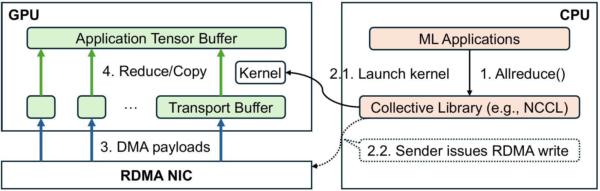<br><em>图 1：通过 RDMA（接收方）进行集体通信。接收器直接将数据接收到GPU内存中（例如GPUDirect [27]）；发送方的工作方式类似，只是它会在步骤 2 中另外发出 RDMA 写入。</em></p>

### 2.2 可扩展性的动机

与软件应用程序相比，RDMA NICs 上的主机网络传输很难发展。这给快速发展的机器学习工作负载带来了问题。我们在第 1 节中展示了两个这样的例子；下面，我们给出了四个额外的例子来激发对传输层可扩展性的需求。

**用于incast的接收器驱动的CC。** 最近的MoE服务工作负载容易出现网络incast问题。在 DeepSeek 的 671B V3 模型 [62] 在线部署中，每个 320 个 GPUs 都拥有一个专家模块，其中隐藏状态在 GPUs 上的专家模块之间交换，即专家并行 (EP)。随着请求模式和负载随着时间的推移而变化，一些专家变得比其他专家更热，从其他专家接收更多网络流量，从而导致网络播送问题。 DeepSeek 报告称，最热门的专家可能会收到比普通专家多 10 倍的负载。 EPLB [29]等专家负载平衡算法尝试通过动态复制专家来平衡负载。然而，这种情况发生的速度要慢得多（例如，10 分钟[28]），以避免移动专家的高成本，从而无法处理瞬态的 incast。这种瞬态网络播送可以通过接收器驱动的 CC [42, 81] 来更好地处理，它控制最后一跳拥塞——不幸的是，商用 RDMA NICs 上没有接收器驱动的 CC。

**应用程序传输协同设计。** 协同设计应用程序和传输行为可以带来巨大的性能优势。例如，最近的工作 MLT [96] 为 ML 训练定制了损失恢复行为，以允许基于应用程序的梯度重要性进行半可靠传输。尽管取得了巨大的性能提升，但由于缺乏足够的可编程性，即使对于最新的 NVIDIA ConnectX-7 [75]，将 MLT 集成到现有的 RDMA NICs 中也是不可行的。

**低效的丢包恢复。** RDMA NICs 在丢包情况下表现不佳，尤其是老一代的 NICs [92, 69, 60, 98]。这是由于片上 SRAM 限制有限，导致这些 NICs 上硬编码的低效 go-back-N 重传逻辑造成的。因此，RDMA 部署通常需要优先流量控制 (PFC) 来实现无损网络结构。然而，PFC 可能会导致死锁、队头阻塞和受害者流 [45, 69]，并且随着 GPU 网络带宽的不断增加，这种可能性会更高（为此，我们请参阅[45]中的第 4 页）。如果我们能够通过更有效的选择性重传来扩展 GPU 网络的传输层，我们就可以更好地处理数据包丢失并减少对 PFC 的依赖[69]。

**异构NICs。** 由于不断扩展、成本优化以及避免供应商锁定，数据中心通常由多代和供应商的RDMA NICs组成。虽然 NVIDIA、Broadcom、AMD 和更多供应商都拥有用于 ML 的 400 Gbps RDMA NICs [75,17,9]，但它们具有略有不同的控制路径逻辑，例如数据包可靠性和 CC。实际上，正如 Alibaba [60] 所报告的，当来自不同代/供应商的 NICs 之间进行通信时，这种异构性会将可实现的带宽减少 2-33 倍。 Flor [60] 之前的工作表明，在软件中可扩展地对齐这些 NICs 的控制路径逻辑可以避免如此严重的性能下降。

### 2.3 关于可扩展性的已有工作

**利用 SmartNIC。** 最近的几项努力旨在通过将 RDMA 传输卸载到 SmartNIC RISC 内核来使 RDMA 传输可编程，但它们在可扩展性和性能方面受到限制。 Google Falcon SmartNIC [38, 37] 仅支持基于延迟的 Swift CC [55] 的编程速率更新操作以及有限路径 [84] 的路径选择决策；类似的限制也适用于硬件 RDMA NICs 上的固件更新。 AMD Pensando SmartNICs[9]支持使用P4语言[16]对其传输层进行编程，但P4的可编程性有限，例如难以实现高效的丢失恢复；目前还不清楚它们是否可以支持接收器驱动的 CC。基于 FPGA 的 SmartNIC 提供了更高的性能，但由于硬件资源限制，可扩展性有限 [98]。 AWS EFA SmartNIC [88] 使用 NIC ARM 内核实现专有的多路径可靠传输 SRD [89] 和无序数据包传输，以解决 HPC 和 ML 工作负载中的网络拥塞问题。 SRD协议采用EFA专用固件实现，支持实时升级，扩展性好。然而，我们根据经验发现，AWS `p4d.24xlarge` GPU VM 上的 EFA SmartNIC 对于连接密集型 all-to-all 集合的性能较差（请参阅第 6.1 节）。我们将此归因于 SmartNIC ARM 内核由于功率限制而导致处理能力和缓存容量有限，先前对公开可用的 SmartNIC 的研究也证明了这一点 [82,63,86]。

请注意，上述 all-to-all 测量在 `p4d.24xlarge` 实例上使用 AWS EFA NICs，因此它可能不适用于 `p5/p5en/p6` 实例上的新一代 EFA NICs。具体来说，不断变化的 EFA 固件和升级的 EFA 硬件可能会导致连接密集型 all-to-all 集合体出现不同的性能结果。一般来说，如果这些 SmartNIC 升级为具有更高的处理能力和缓存容量，以更好地处理 all-to-all，我们将其视为对 UCCL 针对 GPU 网络的软件可扩展性高级方法的呼应。

**利用 CPUs。** 一系列工作利用主机 CPUs 在 GPU 网络中做出更好的控制决策。 ZeroNIC [92]修改了 NIC 硬件以在 CPUs 上运行 RDMA 传输的控制路径，同时在 GPUDirect 之后的 NIC 上保留数据路径。相比之下，UCCL 的目标是在不修改现有硬件的情况下更加实用；与 ZeroNIC 的单路径传输相比，UCCL 在设计上支持高效的多路径。 Flor[60]利用 RDMA UC 绕过 RDMA 硬件的控制路径，并在 CPUs 上实现灵活的软件控制。 Flor 的目标是基于 CPU 的存储应用程序，每台服务器的流量为 100 Gbps，而 UCCL 的目标是网络密集型的 ML 应用程序，每台服务器的流量为 3.2+ Tbps [6, 67]，并开发多路径以避免流冲突。为此，UCCL 采用了多 QP、连接拆分等多种不同的设计（参见§3.2和§3.3）。

**其他努力。** 设计传输协议来解决特定的网络挑战。超以太网联盟 (UEC) [21] 通过数据包喷射标准化了多种多路径传输协议，以解决 ML 工作负载的流冲突问题：一种基于 STrack [56] 和 SMaRTT-REPS [15] 的发送器驱动协议，以及一种基于 EQDS [81] 的接收器驱动协议。在 UEC 之前，MP-RDMA [64] 和 MPTCP [73] 为 CPU 工作负载设计了多路径协议，以提高网络故障下的鲁棒性。总体而言，这些协议利用各种拥塞信号，例如显式拥塞通知 (ECN) [3]、RTT [68] 和数据包修剪状态 [20、42、81] 来做出多路径 CC 和 LB 决策。

## 3. UCCL 设计

图2a显示了UCCL的高层架构。 UCCL 层位于 NCCL 等集体库和 NIC 硬件公开的低级通信原语之间，例如 RDMA NICs 上的 RC、UC 和 UD，以及用于非 RDMA NICs 的 AF_XDP [93]（用户空间快速数据包 IO）。 ML 应用程序使用集合 API（例如“allreduce”）和点对点 API（例如集合库公开的“SendRecv”），而不直接与 UCCL 层交互。集体库和 UCCL 层都编译为单独的共享库，即 NCCL 的“libnccl.so”和“libnccl-net.so”，为 ML 应用程序提供直接替代，无需修改代码或重新编译。 UCCL 利用现有集体库 [23, 7] 的网络插件系统来避免在大多数情况下更改库代码，但 UCCL 相对于 UD 的例外情况需要稍微修改代码（第 3.1 节中详细介绍）。为简洁起见，其余论文针对 RDMA NICs，例如 NVIDIA ConnectX NICs 和 AWS EFA NICs [88]；当针对非 RDMA NICs 时，我们会明确提及。

<table align="center">
  <tr>
    <td align="center" width="50%">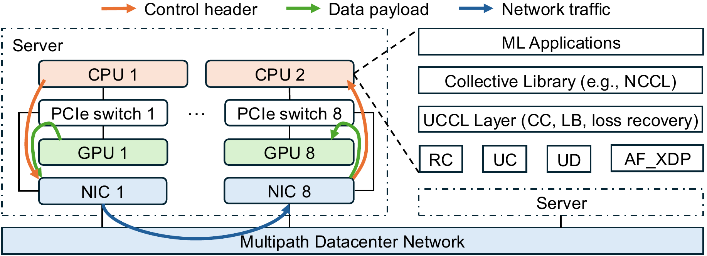<br><em>图 2a：UCCL 架构。</em></td>
    <td align="center" width="50%">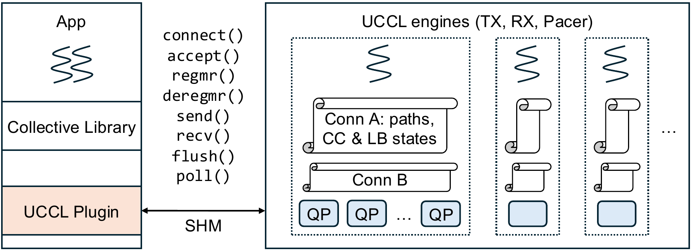<br><em>图 2b：UCCL 线程模型。</em></td>
  </tr>
</table>

<p align="center"><em>图 2：GPU 网络的 UCCL 可扩展传输概述。我们假设 GPU 服务器 [22] 具有常见的服务器内拓扑，其中各个 PCIe 交换机直接连接一些 GPUs、NICs 和 CPU，在它们之间提供高带宽数据传输。</em></p>

图 2 显示了 UCCL 层的线程模型。 UCCL 插件通过共享内存与一组 UCCL 引擎线程交互，以创建连接、向 RDMA NICs 注册/取消注册 GPU 内存区域，以及发送/接收/刷新/轮询网络消息。每个引擎线程都运行 UCCL 多路径可靠传输的 TX、RX 和 pacing 功能，用于多个 UCCL 连接。如§3.1中所述，UCCL 引擎指示 RDMA NIC 接收网络数据，分割控制标头和应用程序数据有效负载，并将它们分别直接 DMA 到 CPU 和 GPU 内存中。整个过程通过使用适当的 RDMA 原语尽可能绕过 RDMA NIC 硬件上的数据包可靠性和 CC 逻辑。在获得 CPU 中的控制标头后，UCCL 引擎会做出 CC、LB 等传输决策，并处理数据包丢失和重新排序。由于这些决策是由 CPU 上的普通用户空间进程执行的，而不是在 RDMA NIC 硬件上执行，因此集体库或 ML 应用程序开发人员可以轻松扩展它们。

在UCCL中，一对特定的NICs之间的所有连接共享同一组QPs（例如256），包括多个GPUs共享一个NIC的情况。此设计充分利用底层多路径数据中心网络，同时不会消耗太多 QPs (§3.2)。 UCCL 进一步集成了一系列技术来尽可能高效地运行软件传输，例如控制合并、连接拆分、链式发布等（第 3.3 节）。 UCCL 还支持通过 AF_XDP 用户空间数据包 IO 扩展非 RDMA NICs 的传输，绕过传统的内核 TCP 堆栈。我们现在在本节的其余部分中描述它们。

### 3.1 分离控制路径与数据路径

分离控制路径和数据路径的总体目标是在 CPU 上运行可扩展传输，同时以 GPUDirect 方式高效地将数据传输到 GPUs 或从 GPUs 传输数据。这个目标有三个具体方面：（1）我们应该在数据路径中涉及尽可能少的控制逻辑，让CPU做出更多的传输决策，例如CC和数据包可靠性。 (2) 为了提高数据路径效率，我们必须达到 GPUDirect [35, 92]。 (3)我们应该支持异构RDMA NICs。例如，NVIDIA NICs 支持 UC，而 Broadcom 和 AWS EFA 则不支持。

**UC 作为首选 QP。** 只要 RDMA NIC 上可用，UCCL 就会选择 UC 作为首选 QP，类似于 Flor [60]，因为它支持高效的分段和重组卸载到 NIC（与 UD 相比），而绕过硬件烘焙的 CC、丢失恢复和乱序数据包处理（与 RC 相比）。如图3所示，UCCL使用高效的RDMA write动词通过UC传输数据块；该动词以双向模式运行，因此发送者和接收者 CPUs 都可以对数据传输做出反应。对于数据路径，发送方 CPU 在发出动词时指定源数据块和目标数据块的地址，然后发送方 NIC 会自动将源数据块分割成 MTU 大小的数据包，并添加数据包头并将其发送出去。当接收到这些数据包时，接收方 NIC 将删除数据包标头并将有效负载重新组装到发送方 CPU 指定的连续内存区域中。

<p align="center"><br><em>图 3：利用 RDMA `write_with_imm` 来分离 UC/RC 的控制标头和数据负载。</em></p>

对于控制路径，使用立即写入允许将 32 位“imm_data”从发送方 CPU 传送到接收方 CPU，作为 UCCL 传输的控制标头。图 3 显示了一个示例。 UC 保证任何成功到达的块都会生成嵌入了“imm_data”的 CQE，然后由接收者 CPU 消耗。在 32 位预算内，UCCL 为连接 ID 分配 8 位，为消息 ID 分配 7 位，UCCL 引擎上的每对 NICs 支持 256 个连接，每个连接支持 128 个正在传输的消息，这足以进行集体通信。然后，UCCL 为块序列号 (CSN) 分配 8 位，以标识正在传输的消息中块的位置。另外 1 位被分配用于标记消息的最后一个块。其余 8 位保留用于更高级的 CC，例如接收器驱动的（参见§4.2）。

**RC 禁用 CC。** 实际上，不同的 RDMA NIC 供应商 [60] 并不总是支持 UC，例如 Broadcom [17]。在这些情况下，UCCL 将选择 RC，并将 CC 配置为禁用，然后以与 UC 类似的方式利用立即写入。一方面，RC 阻止 UCCL 定制 NIC 硬件中烘焙的数据包可靠性机制；另一方面，它允许在硬件中实现更快的 ACK 和更精确的 RTT 估计。

**UD作为最后的手段。** 有些RDMA NICs不允许为其RC QPs禁用CC，例如AWS EFA NICs（准确地说，EFA NICs不允许）没有 RC，只有 SRD）。为了支持它们，UCCL 利用了 UD，但与 UC 和 RC 相比，CPU 的使用率更高。一方面，UD 完全绕过了 RDMA NICs 上的任何硬件控制逻辑，这与我们的目标非常一致。另一方面，UD 仅支持发送/接收 MTU 大小的数据（即无分段或重组卸载）；所以UCCL需要消耗更多的CPU周期来进行分段和重组。

**分离的挑战。** UCCL over UD 的一个关键挑战是 UD 不支持 RDMA 立即写入（但仅支持 `send/recv` 动词），因此 UCCL over UD 无法将立即数据指定为传输控制头。那么UCCL如何使用UD分离控制头和数据负载（即将它们分别放置到CPU和GPU）？ UCCL必须保证控制头和数据负载在丢失状态和到达顺序方面是命运共享的，以便UCCL可以根据控制头做出有效的传输决策。一种稻草人解决方案是将控制标头和数据有效负载作为单个数据包一起传输到目标 GPU 内存中，然后 CPU 从 GPU 内存中读取控制标头。但这会带来额外的性能开销。

UCCL 的方法是利用分散-聚集功能，让 NIC 硬件在 RDMA 发送期间自动合并控制标头和数据负载，并在 RDMA 接收期间将这两者分开；图 4 显示了一个示例。在发送方，CPU 发出带有两个条目“sg_list”的 RDMA 发送动词，该动词指定 CPU 上的控制头地址+长度，以及 GPU 上的数据有效负载地址+长度。然后，RDMA NIC 会分别从 CPU 和 GPU 中读取标头和负载，并将它们合并成单个网络数据包发送出去，只要总长度不超过 MTU 大小即可。在接收端，CPU 预先发布一个带有两个条目“sg_list”的recv动词，分别指定标头和有效负载的接收地址+长度。请注意，标头长度必须是发送方和接收方同意的固定值，例如本例中的 64B；在recv动词中指定的有效负载长度不需要与send动词完全匹配，但不应更小。随后，当数据包到达接收器 NIC 时，NIC 将按照固定标头长度的边界，自动将标头和有效负载拆分到 CPU 和 GPU 上。 UCCL 的方法始终保持控制标头与数据有效负载共享命运，并避免 CPU 从 GPU 读取任何额外的标头。

<p align="center">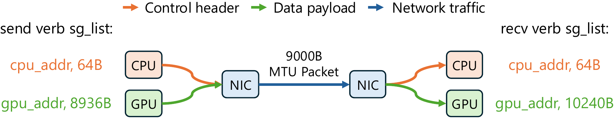<br><em>图 4：利用 RDMA 发送/接收分散收集来分离 UD 的控制标头和数据有效负载。</em></p>

**重组的挑战。** UCCL相对于UD仍然面临另一个挑战，即如何在接收器GPU上正确有效地重新组装数据包。回想一下，UD 不支持重组卸载到 NIC，并且仅允许在一个动词中发送/接收单个数据包（第 2.1 节）。我们注意到发送方分段相对容易，因为 CPU 可以将传输发送缓冲区划分为单独的数据有效负载（基于 MTU 大小），并在发送动词中指定它们的地址。然而，对于接收端重组，即使 CPU 预先发布指定从传输接收缓冲区中提取的按顺序单个数据有效负载地址的接收动词，由于多路径网络上的数据包丢失或重新排序，数据包将以无序方式降落到缓冲区中。这种重组挑战是 UD 所独有的，因为 UC/RC 允许发送方在带有立即动词的写入中直接指定接收方 GPU 缓冲区地址。

解决这一挑战需要某种形式的分散 memcpy GPU 内核，它将无序数据有效负载复制到传输接收缓冲区（遵循接收器 CPU 给出的正确顺序）。但问题是在哪里启动和运行这样的内核。为了避免额外的内核启动开销，UCCL 选择将这种分散的 memcpy 操作融合到集合库中现有的缩减内核中（第 2.1 节）。我们的融合内核将首先执行分散的 memcpy 将无序数据有效负载复制到传输缓冲区中，然后执行从传输缓冲区到应用程序张量缓冲区的原始缩减工作。这种方法的唯一开销是额外的 GPU 内存带宽消耗，但这受到网络带宽的限制。鉴于 GPU 内存带宽较高（例如，A100 中为 1.6-2.0 TB/s），这种额外的带宽消耗可以忽略不计。

**对于非 RDMA NICs。** UCCL 使用 AF_XDP 技术在 UDP 上构建可靠的传输，这是一种高效的内核套接字，允许 NIC 直接将 DMA 网络数据包发送到用户空间内存区域。我们选择 AF_XDP，因为它实现了与 DPDK [105] 类似的高性能，但它是内核原生的，不需要特殊的 NIC 驱动程序，因此易于部署 [95]。与 NCCL 等集体库如何将内核 TCP 用于非 RDMA NICs 类似，AF_XDP 上的 UCCL 在 CPU 上进行数据包重组，然后使用“cudaMemcpy()”将接收到的消息传输到 GPU。

### 3.2 利用多路径

GPU 网络可扩展性的关键动机之一是利用现代数据中心网络的多路径能力（§2.2）。 UCCL 通过使用多个 UC、RC 或 UD QPs 来实现此目的，如图 5 所示。基本上，来自不同 QPs 的网络流量可能会经过不同的网络路径，因为 RoCE 和 Infiniband 通常使用 ECMP（等成本多路径）进行源和目标的多路径路由QP 数字作为哈希输入 [33, 77]。对于 UC 和 RC，UCCL 默认使用 256 个 QPs，它提供了最近传输研究使用的最多 256 个不同的网络路径 [56, 15]。对于 UD，UCCL 通过组合不同的源和目标 QPs，使用更少数量的 QPs。例如，16个源UD QPs和16个目的地UD QPs将提供最多16×16=256条不同的网络路径，因为对于无连接的UD，每个源QP可以将数据包发送到任何目的地QP。 UCCL 还支持不同集合的可配置数量的 QPs，例如，较小的数量可能适合具有相对较高熵的 all-to-all [33]。为了避免烧毁过多的 QPs，特别是当集合库在同一对 NICs 之间创建多个连接时（例如，由于多个 GPUs 共享一个 NIC），UCCL 让所有这些连接共享同一组 QPs。

<p align="center">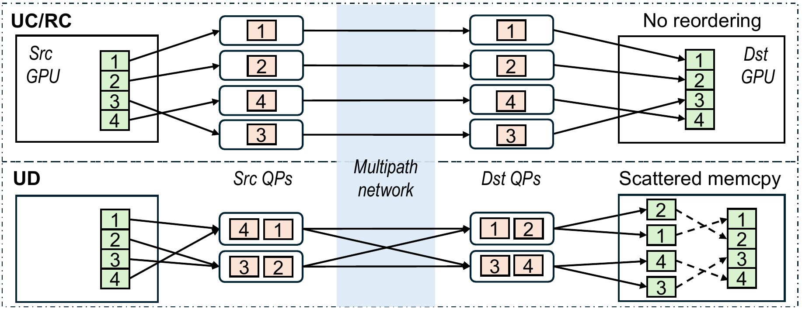<br><em>图 5：UCCL 中的多路径和处理数据包重新排序。</em></p>

我们注意到，做出这种多 QP 设计选择并非易事，特别是之前的一系列工作强调了 RDMA NICs [51、50、19、71、54、98、58] 上严重的 QP 可扩展性问题。例如，SRNIC [98] 报告称，当 RC QPs 从 256 扩展到 512 时，带宽下降约 23%，当扩展到 16k 时，带宽下降 46%。此带宽下降是由 QP 交换开销引起的：NIC 只能在其 SRAM 上保存/缓存有限的 QP 上下文，并且必须通过 PCIe 将过多的剩余内容溢出/交换到主机 DRAM，从而导致频繁的 QP 交换。令人惊讶的是，我们没有观察到集体通信如此严重的性能下降 - 图 6 显示，当将 RC QPs 从 60 扩展到 60k 时，性能仅下降约 17%，而 UC（其 QP 上下文大小比 RC 更小）的下降可以忽略不计。

<p align="center"></p>

<table align="center">
  <tr>
    <td align="center" width="50%">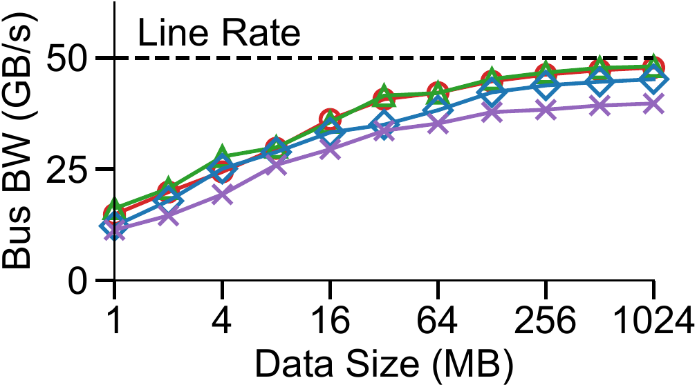<br><em>图 6a：对于 RC QPs。</em></td>
    <td align="center" width="50%">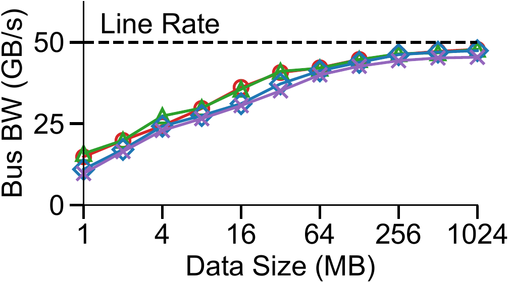<br><em>图 6b：对于 UC QPs。</em></td>
  </tr>
</table>

<p align="center"><em>图 6：CX_IB 测试台上的 UCCL all-to-all 网络带宽（16 400G NICs，详细信息请参阅§6），每个 NIC 具有不同数量的 QPs。每个 NIC 60 个 QPs 对应于生产 [33, 56] 中典型的 NCCL QP 缩放因子 4（即每个连接 4 个 QPs）。每个 NIC 60K QPs 基本上模拟了 UCCL all-to-all 在 241 GPUs 上的 QP 交换开销，每个连接使用 256 个路径（即 61440/256=240，加上 1 以包含其自身）或使用 961 GPUs 64 条路径。这已经涵盖了据我们所知最大规模的集体，即Meta 的 256 个 GPUs [33] 和 DeepSeek-V3 的 320 个 GPUs [62]。</em></p>

这种反直觉现象背后有两个原因。首先，ML 工作负载的特点是消息量大，因此集合体主要传输 MTU 大小的数据包；如此大的传输有效地分摊了 QP 交换开销。其次，对于 GPUDirect，GPU 数据传输仅通过 PCIe 交换机，而不通过连接到 CPU 的 PCIe 根联合体 [53]；因此，GPU-NIC 流量和 CPU-NIC 流量之间不存在 PCIe 争用（当 NIC 交换 QP 上下文和 CPU 发布动词时发生）。相比之下，之前的工作重点是小消息 CPU 工作负载，例如内存中的键值存储，每次只为每个 QP 传输数十个字节，因此受到 QP 交换开销和 PCIe 流量争用的瓶颈。稍后在第 3.3 节中，我们展示了 UCCL 通过以更大的块粒度（例如 32KB）传输数据来优化传输效率，进一步减少 QP 交换开销。

对于非RDMA NIC多路径，UCCL在AF_XDP中发送报文之前，在报文中指定不同的UDP端口。与单路径传输相比，这不会增加任何开销。

**处理乱序数据包。** 许多因素可能导致乱序数据包传送，包括多路径、数据包丢失以及 RDMA 硬件中不可预测的多 QP 调度程序 [98]。现有的 RDMA NICs 在处理无序数据包时表现不佳，因为由于片上 SRAM 限制有限，它们无法维护大型重新排序缓冲区和状态 [69, 98]。相比之下，UCCL 凭借其软件灵活性以及数据和控制路径的分离，能够有效处理乱序数据包。基本上，UCCL 遵循典型的 TCP 设计，使用“seq”和“ack”编号来指导数据包重新排序、快速重传（在重复 ACK 时）和超时重传。 UCCL 设置了更大的重复 ACK 阈值以实现快速重传，而不是 TCP 中默认的三个阈值，以适应多路径导致的更频繁的数据包重新排序。与 TCP 不同，UCCL 在 GPU 内存中维护其数据包重新排序缓冲区，并让 NIC 直接在那里 DMA 网络数据。图 5 通过示例描述了此过程。对于 UC/RC，重新排序缓冲区是单独的数据块，发送者 CPU 在发布动词时指定按顺序的块地址。对于 UD，重新排序缓冲区是单独的数据包有效负载，并且 GPU 缩减内核在将数据包复制到传输缓冲区时对数据包进行重新排序（第 3.1 节）。

### 3.3 走向高效的软件传输

到目前为止，我们已经讨论了UCCL如何解耦控制路径和数据路径以在CPU上做出灵活的传输决策，以及UCCL如何实现多路径。下一个问题是如何有效地实现软件多路径传输以支持 GPU 网络中的高带宽。这是具有挑战性的，因为单个 GPU 服务器可能具有 8×400 Gbps RDMA NICs，双向带宽总计 3.2 Tbps [46]；下一代RDMA NIC将实现800 Gbps [26]，呈现6.4 Tbps带宽。作为参考，Google 的软件传输 Snap [65] 可以在 CPU 核心上处理 80 Gbps 流量（尽管它们不使用 RDMA NICs）。我们的目标是使用 1 个 CPU 核心来处理 400G 单向流量（即 2 个核心用于 400G 双向流量；不包括接收器驱动的 CC 可能的起搏器核心）。为此，我们利用以下技术：

**运行到完成执行。** 每个 UCCL 引擎线程以高效的运行到完成方式运行一组连接的 RX、TX、pacing、超时检测和重传功能 [13, 49]。 UCCL 采用赤字循环 (DRR) [90] 调度来在多个功能和连接之间公平地复用一个引擎线程。

**连接拆分。** 为了更有效地处理每个 NIC 400+ Gbps 的流量，UCCL 放弃了 Flor [60] 单一 CPU 核心用于一个连接的设计，而是利用多个核心进行一个连接的连接拆分。基本上，UCCL 在负责特定 NIC 的所有引擎线程之间平均分配 256 个 QPs；每个引擎线程都有自己的 CC 和 LB 连接状态，形成子连接。在每个子连接内，UCCL 使用 RDMA SRQ 和 SCQ（共享接收/完成队列）来减少轮询多个接收和完成队列时的开销。 UCCL 插件之上的应用程序线程负责在通过 SHM 分派消息时选择负载最小的引擎（例如，未消耗消息最少的引擎）。通过这种方式，UCCL可以将单个连接的传输处理扩展到多个核心，并在运行时处理CPUs之间的瞬时负载不平衡。它还通过避免从单个核心一次发送所有消息来减少 TX 数据包突发。

**控制合并。** 控制决策粒度和软件传输效率之间存在固有的权衡。人们可以为每个数据包运行 CC、LB 和可靠性逻辑，以实现对传输行为的精确控制，但代价是消耗更多的 CPU 内核。或者，可以通过合并多个相同路径数据包并一起做出控制决策来放宽控制粒度，从而降低 CPU 消耗。对于 UC/RC，这也意味着 RDMA 写入可以直接将多个数据包作为单个数据块传输，利用 NIC 卸载的分段和重组。 UCCL采用了这种控制合并设计，默认块大小为32KB，达到了平衡的权衡。在此块大小下，UCCL 可以通过 1 个 CPU 内核（§6.4.2）使 400 Gbps 单向带宽饱和，同时不会严重破坏传输行为/性能（请参阅§C.4.1 中的数据包级模拟）。尽管如此，UCCL 还可以根据拥塞程度自适应调整块大小，例如，当拥塞窗口（“cwnd”）降至阈值以下或发生严重丢包时，切换到较小的块大小以进行更精确的控制。

**链式发布。** UD 不支持用于分段和重组的 NIC 卸载，因此在发出 send/recv 动词（例如，对于单个数据包）时，它会比 UC/RC 产生更多的 MMIO 写入。为了减少此类开销，UCCL 利用 RDMA NICs 的链式发布功能来发出一次 MMIO 写入，以发布最多 32 个发送/接收动词。具体来说，这 32 个动词的 WQE 通过前面的 WQE 中的“next”指针链接在一起，并在一次 MMIO 写入中发布到 RDMA NIC。

### 3.4 拥塞信号

相对受限的拥塞信号是 RDMA NICs 上基于软件的可靠传输的常见限制，包括 UCCL 和 Flor [60]。这是因为现有的 RDMA NICs 消耗包含 ECN 标记 [3] 和数据包修剪状态 [20、42、81] 等拥塞信号的数据包标头，并且仅将数据包有效负载传递给软件。幸运的是，该软件仍然可以通过利用许多 RDMA NICs 支持的硬件 TX/RX 时间戳来使用 RTT 拥塞信号，并依赖丢包作为最后手段的拥塞信号。因此，我们当前的 UCCL 实现使用每个路径的 RTT 和数据包丢失来检测拥塞并选择路径。事实上，基于延迟的 CC 和 LB 已广泛应用于 Google 的数据中心 [55, 84]。

**信号保真度。** 使用RTT在软件中运行CC和LB也会引起信号保真度问题。总体而言，影响保真度的因素有3个：1发送方的RTT准确估计，2发送方或接收方的CC决策延迟，即从接收拥塞信号（例如，ACK派生的时间戳）到更新拥塞窗口/速率的软件延迟，以及3接收方的ACK周转延迟，即接收数据之间的延迟块并发送回 ACK。对于 1，UCCL 利用 NIC 硬件时间戳，并从 RTT 中排除 ACK 周转延迟（类似于 Swift [55]）。对于2和3，理论上，这些延迟会影响发送方对网络条件变化的反应速度，从而影响决策精度；然而，在实践中，即使基于硬件的传输也会以每个 RTT 的粒度（例如数十微秒）而不是每个 ACK 来处理 CC 事件，以避免过度反应 [61]。例如，Google Falcon 硬件传输运行 CC，以每个 RTT 更新一次速率[38]。因此，软件引入的几微秒的决策延迟可以忽略不计。尽管如此，UCCL仍然采用了多种技术来减少这两个延迟：与Flor[60]类似，UCCL为ACK使用专用的高优先级QP（使用网络内优先级，例如DSCP），并且总是首先轮询其完成队列； UCCL在DRR调度期间进一步分配ACK轮询更高的处理预算。我们在第 6.5.2 节中量化了这些延迟。

## 4. 可扩展性案例研究

UCCL 提供富有表现力的接口来实现和扩展多路径传输。由于篇幅限制，我们在附录 A 中对其进行了详细说明。集体库和应用程序开发人员还可以直接扩展 UCCL 传输代码，例如使用 MLT [96] 中的新丢失恢复方案，并将其快速部署在正常的用户空间进程中。我们现在演示 UCCL 可扩展性如何实现最适合不同 ML 工作负载的新传输设计。

### 4.1 使用数据包喷射的多路径传输

最近的传输研究 [56, 15] 和 UEC 提倡使用数百条路径进行数据包喷射，作为解决 ML 工作负载中流冲突的有效方法。由于每路径状态（例如路径 RTT）过多，硬件 NICs 实施数据包喷射自然具有挑战性。相反，UCCL 可以通过在软件中维护每个路径的 RTT 来轻松支持数据包喷射。 UCCL的软件传输使用二次幂采样[70]来选择具有最低RTT的路径，然后运行CC来决定传输多少数据包和什么速率。 UCCL 实现了两种 CC 算法：一种是 Linux 内核 TCP 中使用的 CUBIC [41]，作为默认的 CC，另一种是 Swift [55]，Google 使用的基于 RTT 的 CC。 UCCL 支持每路径 CC 状态（例如，每路径 `cwnd`）和控制所有路径的全局 CC 状态；两者在我们的测试平台上都取得了相似的集体表现。 UCCL 在评估过程中默认使用全局 CC。

### 4.2 接收端驱动的拥塞控制

接收器驱动的传输，例如 EQDS [81]、NDP [42] 和 Homa [72]，通过向发送器分配信用来主动控制接收器处的数据包发送速率。事实证明，这些传输可以有效解决网络播送的最后一跳拥塞，这可能发生在 MoE 服务中（第 2.2 节）。然而，据我们所知，没有现成的 NICs 支持接收器驱动的传输。原因之一是它们与流行的发送器驱动的有很大不同，并且实现它们需要 NIC 硬件修改。相反，UCCL 的可扩展性使开发人员能够在软件中快速实现和调整接收器驱动的传输。我们选择在 UCCL 中实现 EQDS [81] 作为示例，这是 UEC [21] 采用的最先进的接收器驱动传输。我们的 EQDS 实现紧密遵循 EQDS 论文 [81]，接收器上的每个 NIC 都有一个专用的定步器线程，为发送器发出信用数据包。欲了解更多详情，请参阅附录 B。

### 4.3 高效丢包恢复

UCCL 允许自定义传输丢失恢复逻辑，以支持除许多 RDMA NICs 中的 go-back-N 重传之外的更高级机制。 Go-back-N 直接丢弃无序数据包，以避免在昂贵的片上 SRAM 上缓冲它们，但这在发生数据包丢失时性能较差 [50,98,106]。相反，我们通过在 GPU 内存中维护重新排序缓冲区，在 UCCL 中实现更有效的选择性重传 [66]（第 3.2 节）。我们的实现遵循 TCP 中的标准选择性重传机制，并使用“std::map”来跟踪任意数量的无序数据包。通过 UCCL 中更高效的丢失恢复，ML 工作负载可以在没有 PFC 的有损数据中心网络中运行（§2.2）。

我们注意到，最新一代的 NVIDIA RDMA NICs [75] 已实现了有限形式的选择性重传，并具有较小的固定跟踪窗口（以保持较低的 SRAM 使用率）。当未确认的传输数据包数量超出该窗口时，它将回退到 go-back-N；在网络带宽增加、飞行数据包增多的 ML 集群中，这种基于硬件的丢失恢复很难像 UCCL 中灵活的基于软件的丢失恢复那样有效。

## 5. 实现

我们用 28.4K 行 C++ 实现 UCCL 作为 NCCL/RCCL 的网络插件，NVIDIA/AMD GPUs 的标准集体库。我们当前的实现通过 RC 和 UC 支持 NVIDIA RDMA NICs，通过 RC 支持 Broadcom RDMA NICs，通过 AWS EFA NICs UD/SRD 和 AWS ENA 非 RDMA NICs 通过 AF_XDP。 UCCL 利用 RDMA NICs 的标准“libibverbs”，以及针对非 RDMA NICs 的内核内置 AF_XDP；因此，它自然应该支持其他厂商的NICs。为了在 AWS EFA NICs 使用 UD 时启用分散 memcpy，我们向 NCCL 代码库添加或修改了约 170 LoC，包括分散 memcpy GPU 内核和通过 CPU-GPU 共享内存将数据包指针传递到内核的 C++ 代码（创建通过`cudaHostAlloc()`）。我们向 NCCL 网络插件系统添加了两个新接口：“irecv_scattered”，用于接收分散数据包列表中的数据；“irecv_free_ptrs”，用于在分散 memcpy 后释放分散数据包缓冲区。 UCCL还支持多进程运行NCCL。

有一些实施细节值得注意。对于NVIDIA NICs，为了根据NIC硬件TX/RX时间戳和CPU ACK时间戳计算网络RTT，我们按照Swift [55]实现了NIC-CPU时钟同步方案。我们使用100μs的同步时间间隔。对于尚不支持硬件时间戳的AWS EFA NICs，我们根据软件时间戳减去主机处估计的数据包排队延迟来计算RTT。我们通过将排队数据包的大小除以 NIC 带宽来估计排队延迟。对于 AWS EFA NICs，我们发现为连接分配 UD QPs 和连续的 QP 编号会产生比不分配更好的性能。我们怀疑这是因为 EFA NICs 在将 QP（及其关联数据包）映射到 ARM 内核时执行循环分配；连续分配有助于将连接的 QPs 映射到不同的 ARM 内核，从而避免负载不平衡。

## 6. 评估

在本节中，我们旨在回答以下问题：

- 与基于硬件的多路径传输 (§6.1) 相比，UCCL 软件多路径传输的总体性能如何？
- UCCL 能否提高 ML 应用程序性能（§6.2）？
- UCCL 可扩展性是否有利于某些工作负载 (§6.3)？
- UCCL（§6.4）的可扩展性如何？
- 不同的设计如何影响 UCCL (§6.5)？

**测试平台。** 表1描述了我们的评估测试平台。同机架下的CX_IB测试床主要作为UCCL软件实现的性能压力测试，没有网络拥塞或流量冲突。跨两个机架的 CX_ETH 测试台评估 UCCL 如何处理网络拥塞和流量冲突。跨机架的 AMD 和 EFA 测试台评估 UCCL 的通用性（即适用于 AMD GPUs 和 Broadcom/EFA NICs）。每台 AMD 服务器有 8 台中的一台 NIC；因此，我们仅使用7台GPUs进行评估。对于某些测试，我们尝试通过禁用 NCCL NVLink（或 RCCL xGMI）和 SHM 通信来模拟更大的测试台。这迫使服务器内的 GPUs 通过网络进行通信，每个 GPU 本质上就像一个虚拟服务器，例如 CX_IB 变成 16 个虚拟 GPU 服务器，每个服务器都有 400G 带宽。

<div align="center">

| Name | # of Servers | Network | Topology | MTU | NIC | GPU | CPU |
| --- | --- | --- | --- | --- | --- | --- | --- |
| CX_IB | 2 | InfiniBand | Same rack | 4KB | NVIDIA ConnectX-7 400G ×8 | NVIDIA H100-80G ×8 | 128 cores |
| CX_ETH | 6 | Ethernet | Cross racks, fat-tree | 4KB | NVIDIA ConnectX-7 400G ×8 | NVIDIA H100-80G ×8 | 160 cores |
| AMD | 4 | Ethernet | Cross racks, rail-optimized | 4KB | Broadcom Thor-2 400G ×7 | AMD MI300X-192G ×7 | 128 cores |
| EFA | 4 | Ethernet | Cross racks, fat-tree | 9KB | AWS EFA 100G ×4 | NVIDIA A100-40G ×8 | 96 cores |

<em>表 1：评估试验台。EFA 是从 AWS 与 `p4d.24xlarge` 实例一起租用的。为简洁起见，我们也将 ConnectX-7 称为 CX-7。</em>
</div>


**实验设置。** 对于集体性能评估，我们使用NCCL v2.23.4 [25]和NCCL-tests `9d26b84` [24]，这是我们开始将UCCL集成到NCCL时的最新版本，并重点关注代表性的allreduce和all-to-all集体。 NCCL 测试改变集体消息大小并测量所实现的总线带宽。我们重点关注 1MB 到 1GB 的消息大小，这通常用于实际的 ML 工作负载 [83,97,99]。对于 AMD GPUs，我们使用 RCCL `532f54c` [2] 和 RCCL-test `5b27b96` [1]。

**比较基线。** 在 CX_IB 测试台上，我们将 UCCL 与使用 CX-7 RC 的 NCCL 内置 RDMA 支持进行比较。 UCCL 对每个 NIC 对使用 256 个 UC/RC QPs，而 NCCL 内置使用 QP 缩放，每个连接使用 4 个 RC QPs [33, 56]。除非指定，UCCL 在 CX_IB 上使用 CUBIC CC，其性能比无损 InfiniBand 中的 Swift 更好。由于InfiniBand没有丢包，CUBIC可以减少`cwnd`，避免严重的网络拥塞，我们在UCCL CUBIC CC中强制设置最大`cwnd`值来限制最大飞行字节数，类似于TCP流控。

在 EFA 测试台上，我们将 UCCL 与使用多路径 SRD [89] 的官方 AWS NCCL-EFA 插件 v1.13.2 [5] 进行比较。 UCCL 使用 10×26=260 UD QPs 来服务所有连接，这在经验上产生了最佳性能，而 NCCL-EFA 插件使用 AWS 推荐的最佳参数。 UCCL 默认在 EFA 上使用 CUBIC CC，因为 EFA NICs 不支持对 Swift CC 至关重要的硬件时间戳。在这两个测试台中，UCCL 将每路径 RTT 用于多路径 LB (§4.1)。

作为可扩展软件传输的成本，UCCL 之上的 NCCL 使用比普通 NCCL 更多的 CPU 内核。默认情况下，普通 NCCL 每个 GPU 使用 2 个核心，而 UCCL 每个 NIC 使用 2 个以上核心来运行引擎线程，每个 NIC 由于起搏器而使用 1 个附加核心用于接收器驱动的 CC。

### 6.1 集合通信性能

**在 CX_IB 上。** 图7比较了 UCCL 与 ConnectX-7 在 CX_IB 测试台上的 allreduce 和 all-to-all 性能。 UCCL UC/RC 在各种数据大小下的性能几乎与 ConnectX-7 相同，只是 UCCL UC 在 128MB 后的 allreduce 的性能比 ConnectX-7 和 UCCL RC 稍差（即小于 4%）。对于 allreduce 来说，这个异常是因为 UC 中处理数据包可靠性的额外开销；对于 all-to-all，ConnectX-7 和 UCCL RC 的性能并不比 UCCL UC 更好，因为 all-to-all 是连接密集型的，会导致 RC 出现更多 QP 交换。这些实验证实，UCCL 可以在软件中做出高效的控制决策，达到用于 ML 集体的基于 ASIC 的 RDMA NICs（即 NVIDIA ConnectX-7）的性能。

<p align="center"></p>

<table align="center">
  <tr>
    <td align="center" width="50%">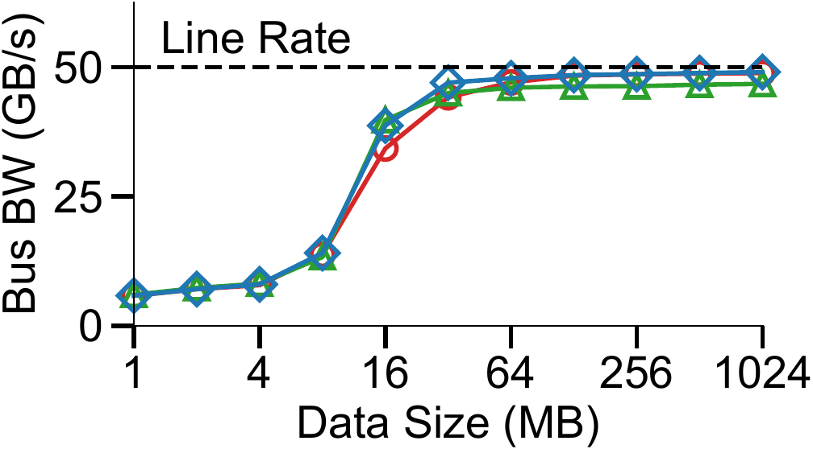<br><em>图 7a：Allreduce。</em></td>
    <td align="center" width="50%">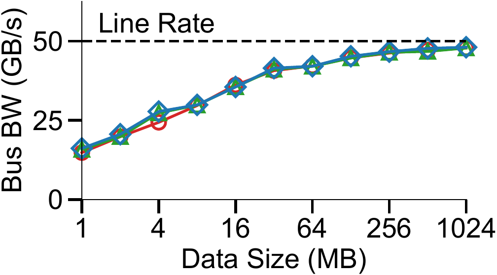<br><em>图 7b：All-to-all。</em></td>
  </tr>
</table>

<p align="center"><em>图 7：CX_IB 上的 NCCL-tests 结果（禁用 NVLink+SHM 来模拟更大的测试台）。</em></p>

**在 CX_ETH 上。** 图8比较了 UCCL 与 ConnectX-7 在 CX_ETH 测试平台上的性能。对于 CX-7 上的 NCCL，我们通过调整“NCCL_IB_QPS_PER_CONNECTION”为两个 GPUs 之间的每个连接使用多个 QPs。然而，在较大的消息大小和较低的峰值性能下，它仍然会遭受显着的性能下降。这是因为胖树拓扑中的流冲突会导致严重的网络拥塞，进而导致 CX-7 CC 机制中的指数退避。相反，通过在软件中做出更明智的 LB 和 CC 决策，UCCL 能够随着消息大小的增加而稳定地提高性能。总体而言，UCCL 的 allreduce 性能比 CX-7 分别高出 2.32/1.60/1.24×（相当于 4/8/16 QPs），而 all-to-all 性能则分别比 CX-7 高出 1.79/3.82/4.54×。

<p align="center"></p>

<table align="center">
  <tr>
    <td align="center" width="50%">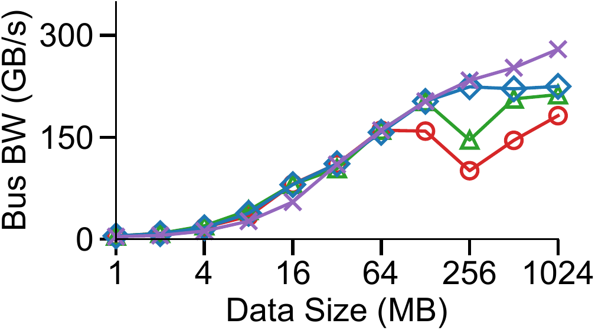<br><em>图 8a：Allreduce。</em></td>
    <td align="center" width="50%">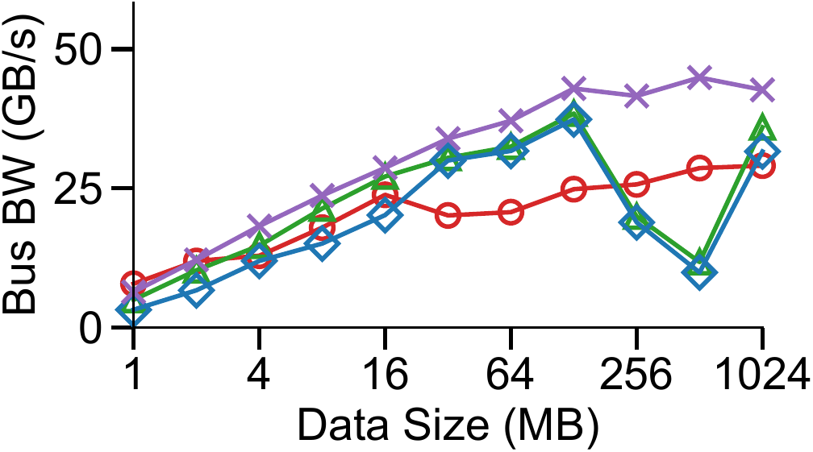<br><em>图 8b：All-to-all。</em></td>
  </tr>
</table>

<p align="center"><em>图 8：CX_ETH 上的 NCCL-tests 结果（启用 NVLink+SHM）。</em></p>

**在AMD上。** 图9为AMD测试平台上的性能对比。该测试台具有轨道优化的拓扑，与 PXN 技术一起使用时有助于减少网络拥塞 [74]。即使在这种拓扑下，UCCL 的性能仍然优于 Thor-2 高达 1.34/1.23/1.08×（对应 4/8/16 QPs），allreduce 和 all-to-all 的性能优于 allreduce 和 all-to-all 1.62/1.62/1.93×，更好地控制网络拥塞。

<p align="center"></p>

<table align="center">
  <tr>
    <td align="center" width="50%">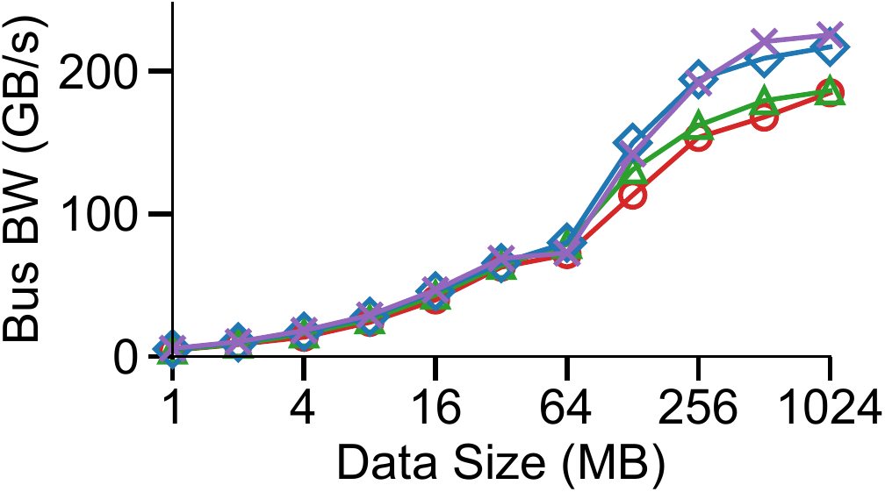<br><em>图 9a：Allreduce。</em></td>
    <td align="center" width="50%">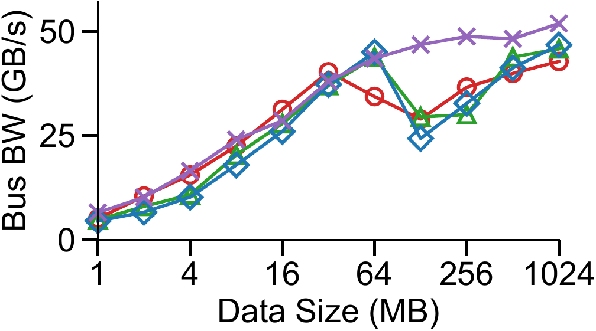<br><em>图 9b：All-to-all。</em></td>
  </tr>
</table>

<p align="center"><em>图 9：AMD 上的 RCCL-tests 结果（启用 xGMI+SHM）。</em></p>

**在EFA上。** 图10比较了UCCL和SRD在EFA测试平台上的集体性能。 UCCL、CUBIC和EQDS实现了相似的性能，但比SRD有显着改进（256MB allreduce除外）：对于allreduce，UCCL的性能比SRD高出1.27倍；对于all-to-all，加速比高达3.27倍。 UCCL 优于 SRD，因为强大的 CPU 内核在做出传输决策时比“p4d.24xlarge”EFA NICs（运行 SRD）上的弱 ARM 内核更快，特别是在处理连接密集型 all-to-all 时。令人惊讶的是，简单的CUBIC CC 表现非常好。这主要是因为UCCL利用了数百条网络路径，在发送数据包之前避开了拥塞的路径；所以大多数时候，CC并不参与其中。 256MB之后的小性能差距是由UCCL添加的额外控制头造成的，而SRD直接重用UDP头作为其控制头（UCCL无法重用，因为它没有暴露给CPU软件）。
UCCL 还可以直接利用 EFA NICs 的 SRD 协议来发送/接收单独的数据报包，表示为 UCCL SRD。 UCCL SRD 在 CPU 中进行连接管理和多路径负载平衡，在 GPU (§3.1) 中进行数据包重组，克服了 `p4d.24xlarge` 上 SmartNIC 的有限处理能力和缓存容量。因此，它实现了与 UCCL、CUBIC 和 EQDS 类似的高性能。

<p align="center"></p>

<table align="center">
  <tr>
    <td align="center" width="50%">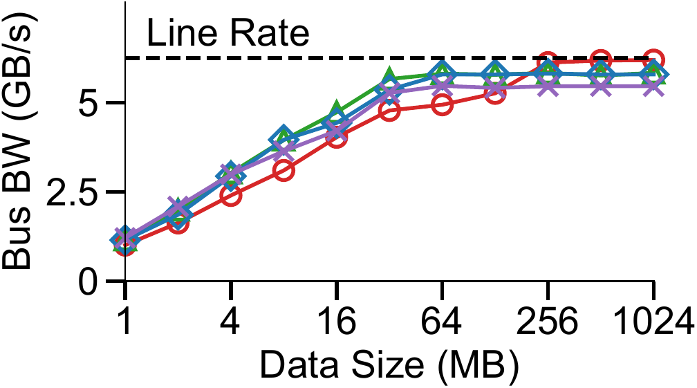<br><em>图 10a：Allreduce。</em></td>
    <td align="center" width="50%">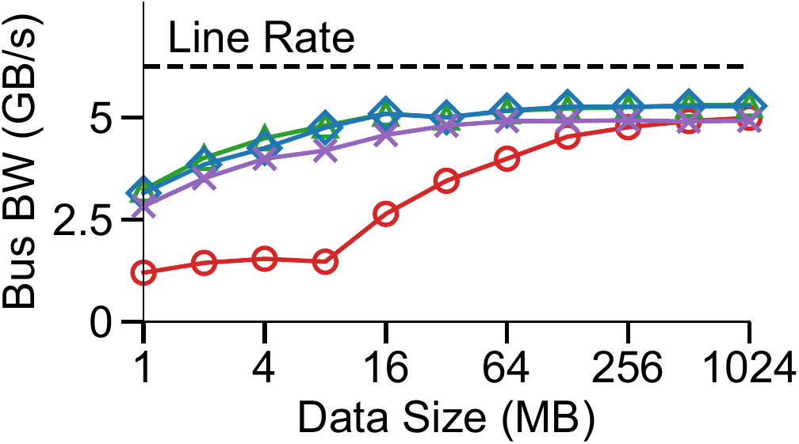<br><em>图 10b：All-to-all。</em></td>
  </tr>
</table>

<p align="center"><em>图 10：EFA 上的 NCCL-tests 结果（禁用 NVLink+SHM）。</em></p>

图 11 显示了启用 NVLink 和 SHM 时 EFA 测试台上的集体性能比较（意味着较小的测试台）。尽管大量数据流量通过高带宽 NVLink，UCCL 仍然实现了比 SRD 更高或相当的集体性能，即 allreduce 高达 1.57 倍，all-to-all 高达 2.14 倍。

<p align="center"></p>

<table align="center">
  <tr>
    <td align="center" width="50%">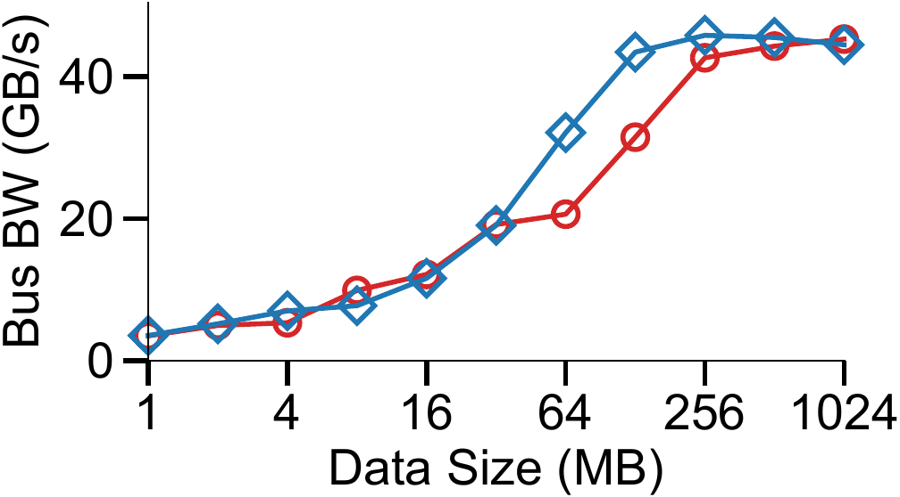<br><em>图 11a：Allreduce。</em></td>
    <td align="center" width="50%">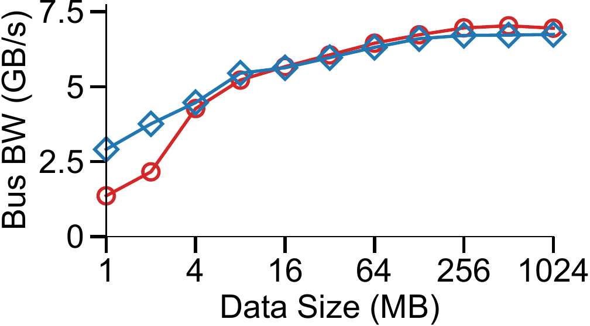<br><em>图 11b：All-to-all。</em></td>
  </tr>
</table>

<p align="center"><em>图 11：EFA 上的 NCCL-tests 结果（启用 NVLink+SHM）。</em></p>

由于篇幅限制，我们在附录 C.1 中展示了更多集体的结果，在附录 C.2 中展示了非 RDMA NICs 的结果（高达 4.1 倍的性能提升）。

### 6.2 应用性能

UCCL 的动机是 LLM 训练和服务工作负载的实际需求。我们运行两个应用程序来评估 UCCL 如何提高 EFA 测试台上的 ML 工作负载性能。一种是 PyTorch 中经典的 ResNet [44] 分布式训练，采用广泛使用的 1F1B 机制 [43, 101]，试图将通信与计算重叠。然而，由于GPU计算能力的增长速度远远快于网络带宽的增长速度，通信时间无法完全被计算时间隐藏，尤其是在EFA上。另一个是类似 DeepSeek-V3 的 MoE 服务应用程序。然而，在我们的测试平台上直接提供 DeepSeek-V3 是不切实际的，因为（1）它使用定制的通信库而不是标准的 NCCL，因此它不能直接使用 UCCL，并且（2）它需要大量的 GPUs 来运行有意义的专家并行性，例如 DeepSeek [62] 的 320 个 GPUs 和 96 GPUs 由 SGLang [94]。相反，我们从[100]中获得了真实的 DeepSeek-V3 跟踪，包括 GPU 计算时间和网络消息大小（即隐藏状态大小），并使用 PyTorch 和 NCCL 模拟计算和通信行为。

图12a显示了ResNet分布式训练的结果。与 SRD 相比，UCCL 减少了 1.07-1.11 倍的训练纪元时间。图 12b 显示了 DeepSeek-V3 服务的结果。 UCCL 将每个请求的预填充和解码延迟分别减少了 1.13 倍和 1.42 倍。这些实验表明，UCCL 能够为现实世界的机器学习应用带来显着的好处。

<table align="center">
  <tr>
    <td align="center" width="50%">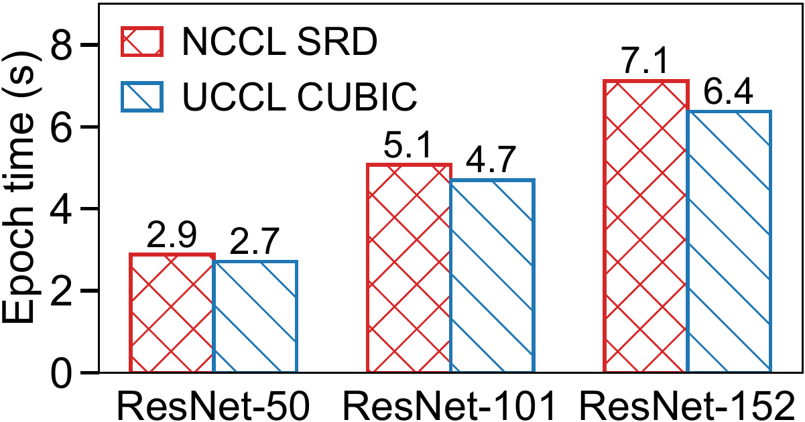<br><em>图 12a：ResNet分布式训练。</em></td>
    <td align="center" width="50%">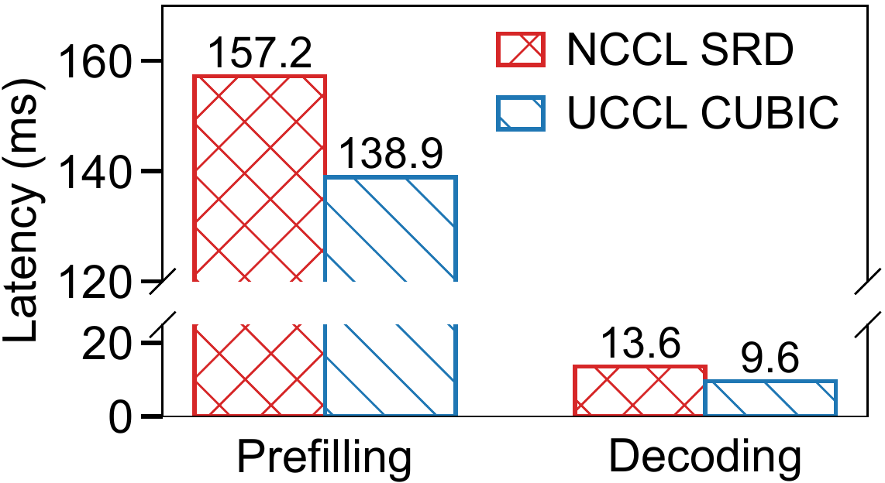<br><em>图 12b：DeepSeek-V3 与 EP（跟踪驱动仿真）一起使用。</em></td>
  </tr>
</table>

<p align="center"><em>图 12：EFA 上的应用结果（NVLink+SHM 禁用）。</em></p>

### 6.3 UCCL 可扩展性

#### 6.3.1 处理网络 incast

在共享 RDMA 网络中，由于 PFC 传播，网络播送可能会导致受害者流 [98,45,69]。这种网络播送可能是由 MoE 服务中的专家并行性（第 2.2 节）和 LLM 训练的多级并行性中的聚集/减少集体引起的 [12, 39]。此实验尝试创建一个网络播送与其他集体流量共存的场景，并评估 UCCL 与 CX_IB 上的 RDMA 硬件传输相比的性能。我们将 15 对 1 的播送流量和 16-NIC 排列流量 [85、18、56、15] 放在一起，其中每个 NIC 将数据流式传输到另一个，并且没有 NIC 接收多个流，这代表了典型的集合。对于这两种类型的流量，每个 NIC 发送 1MB 消息，最多有 4 条消息在传输中。我们比较了 UCCL 中接收器驱动的 EQDS 与 ConnectX-7 中发送器驱动的 InfiniBand CC。

图 13a 和图 13b 分别显示了 incast 流量和排列流量的 FCT 分布。与InfiniBand相比，UCCL EQDS对于incast流量减少了1.73×/1.72×的P99/P99.9延迟，对于permutation流量减少了4.50×/4.88×。这是因为InfiniBand CC仅在incast交换机端口出现严重拥塞和队列堆积时才降低发送速率；但这已经太晚了，因为基于信用的流量控制 [47]（PFC 相当于 InfiniBand）已经暂停了所有上游端口和严重干扰的受害者流（即排列流量）。相反，UCCL EQDS 在接收端主动控制所有发送方的速率，从而减少队列堆积并避免上行端口进入暂停状态。

<p align="center"></p>

<table align="center">
  <tr>
    <td align="center" width="50%">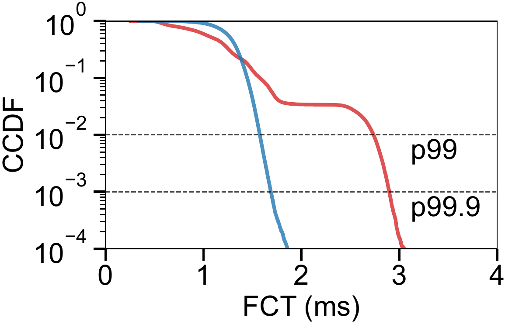<br><em>图 13a：Incast 流量。</em></td>
    <td align="center" width="50%">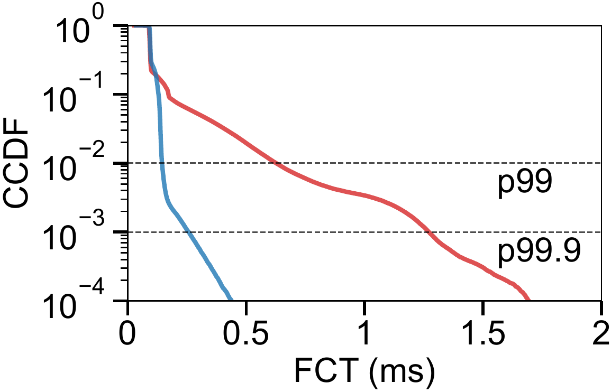<br><em>图 13b：排列流量。</em></td>
  </tr>
</table>

<p align="center"><em>图 13：当共置 15 对 1 播送和排列流量时，CX_IB 上 FCT（流完成时间）的补充 CDF。</em></p>

#### 6.3.2 处理丢包

然后，与基于硬件的丢失恢复相比，我们评估 UCCL 选择性重传如何处理数据包丢失。此外，UCCL 将传输决策（如块粒度的丢失恢复）合并起来，以实现高软件效率；因此，我们还测试了这种设计选择是否会导致丢失恢复性能不佳。为此，当在 UCCL UC 上运行 NCCL 集合时，我们在软件中测量了不同的数据包丢失率。我们的丢包检测已经考虑了 UCCL 中的分块性质，任何丢包都会导致整个块丢失。不幸的是，我们无法检测 CX_IB NICs 的数据包丢失情况，因为这需要重新配置 NIC 或切换行为，而这两者都是我们无权访问的。相反，我们引用了先前文献 Flor [60] 中的类似数字。

我们从 AMD 测试台中挑选两台 GPUs，每台使用一台 NIC 进行通信。客户端 NIC 与服务器 NIC 建立连接并保留 16 条飞行消息。与 Flor [60] 类似，我们使用单个 QP 进行连接，并禁用拥塞控制以避免发送速率回退。我们改变消息大小（32KB~1MB）并测量不同丢包率下的吞吐量。图 14 显示了结果。 UCCL 在 1/16384、1/4096 丢包率下仅出现约 1% 的性能下降，而据报道，RDMA 硬件传输在 Flor [60] 中下降了 26%~42%。即使在 1/1024 和 1/256 的高丢包率下，UCCL 也仅经历了 6%~30% 的性能下降，而 RDMA 硬件传输的性能下降了 59%~76%。

<p align="center"></p>

<p align="center">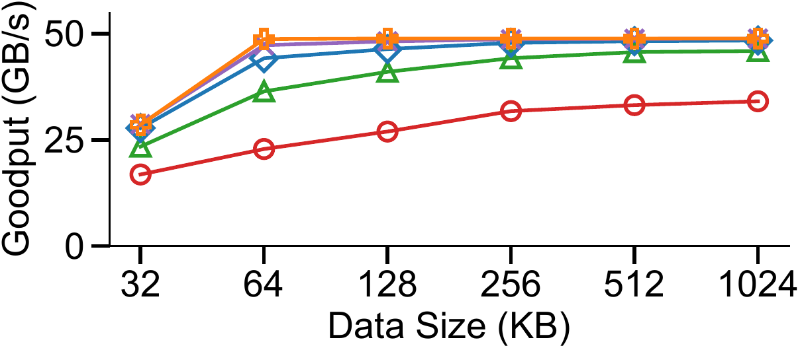<br><em>图 14：UCCL 在不同丢包率下的 Goodput。UCCL 通过动态 RTO 阈值（大约几个 RTT）实现选择性重传。</em></p>

### 6.4 UCCL 可扩展性评估

#### 6.4.1 改变块大小

图 15a 显示了改变块大小时 CX_IB 测试台上的 all-to-all 性能。我们的结果表明，使线路速率饱和需要中等大小的块，即 16KB 或 4 MTU 大小的块。该实验展示了 UCCL 软件传输的控制合并的性能优势。

#### 6.4.2 改变 CPU 核数

图 15b 显示了改变每个 NIC 的 UCCL 引擎/CPU 内核数量时的 all-to-all 性能。对于具有分段和重组卸载功能的基于 ASIC 的 NICs，即使 1 个 CPU 核心只能饱和双向 29GB/s，两个 CPU 核心也足以饱和 50GB/s 的全线速。从“2CPU”切换到“4CPU”时 16MB 的性能略有下降应该是由运行时变化引起的。该实验证实了UCCL软件传输的高效率，即1个CPU核心饱和400G单向流量（2个CPU核心饱和400G双向）。

<table align="center">
  <tr>
    <td align="center" width="50%"><br>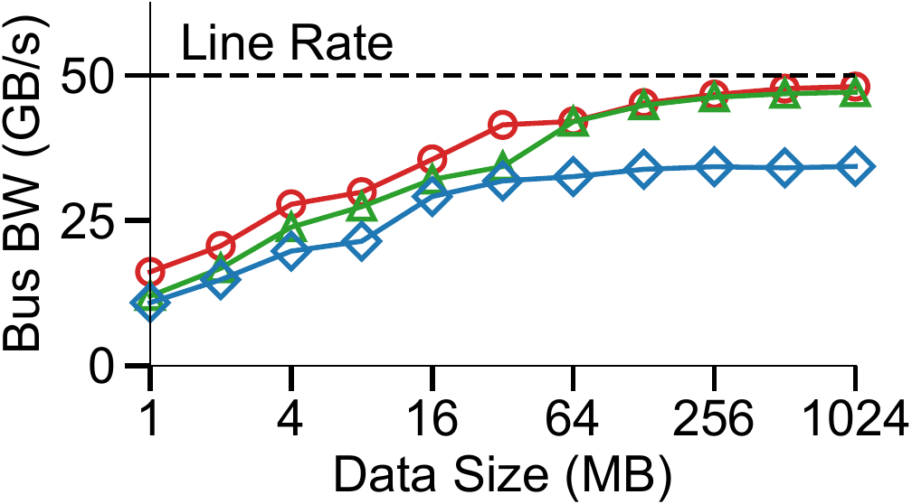<br><em>图 15a：不同的块大小。</em></td>
    <td align="center" width="50%"><br>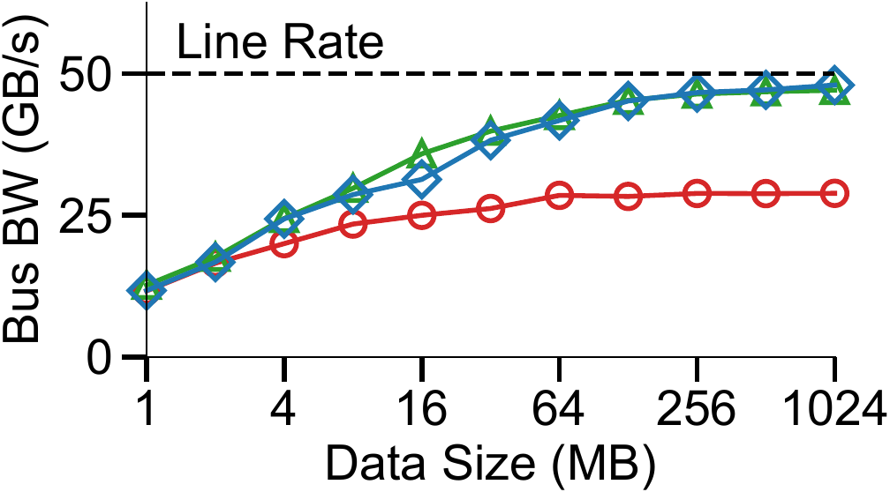<br><em>图 15b：不同的 CPU 内核。</em></td>
  </tr>
</table>

<p align="center"><em>图 15：CX_IB 上的 UCCL all-to-all 在不同块大小和每个 NIC 不同 CPU 核数下的性能（禁用 NVLink+SHM）。</em></p>

我们在附录 C.3 中展示了当 CPU 内核、GPUs 和 EFA 上的路径数量不同时的更多可扩展性研究。

### 6.5 设计细节拆解

#### 6.5.1 连接拆分

我们现在评估连接拆分如何影响 UCCL 中的集体性能。如果没有连接拆分，每个 UCCL 连接都会映射到每个 NIC 的两个 UCCL 引擎中的一个引擎；通过拆分，每个 UCCL 连接在两个 UCCL 引擎之间调度和负载平衡其消息。我们的实验结果表明，在没有连接拆分的情况下，allreduce 和 all-to-all 在 CX_IB 上的最大总线带宽仅分别达到 45.7 和 39.9 GB/s，而在进行拆分的情况下，UCCL 分别达到 48.9 和 48.5 GB/s，线路速率饱和。这是因为连接拆分使多个 CPU 核心能够以负载平衡的方式处理传输中的消息。我们预计，随着 NIC 扩展到 800 Gbps [26]，连接分离将变得更加重要。

#### 6.5.2 软件中的拥塞信号保真度

UCCL 实现了将传输从硬件转移到软件的根本转变。该实验评估了软件传输在拥塞信号保真度方面的牺牲程度。我们查看第 3.4 节中提到的两个重要指标：CC 决策延迟和 ACK 周转延迟。 表 2 显示了结果。轻载时，P50和P99的两个延迟都被限制在最多10μs；在高负载下，P99 的时间增长至 36μs。两者都与 10-40 μs 的典型数据中心 RTT 相当[36]。因此，该实验证实了 UCCL 软件传输具有足够高的 CC 保真度，可以针对每个 RTT 做出精确的传输决策 [61, 38]。

<div align="center">

| Delay (μs) | Allreduce Light | All-to-All Light | Allreduce Heavy | All-to-All Heavy |
| --- | ---: | ---: | ---: | ---: |
| CC decision P50 | 1.7 | 1.7 | 2.1 | 2.9 |
| CC decision P99 | 3.6 | 3.4 | 7.0 | 10.8 |
| ACK turnaround P50 | 2.0 | 3.0 | 4.0 | 7.0 |
| ACK turnaround P99 | 3.0 | 10.0 | 10.0 | 36.0 |

<em>表 2：CX_IB 上的 CC 决策延迟和 ACK 周转延迟。“Light”使用 1KB-64KB 消息，而“Heavy”使用 1GB 消息。</em>
</div>


我们在附录 C.4 中展示了更多设计深入分析，包括块大小的影响、LB 策略、内核融合（用于分散的 memcpy）和 PCIe 开销分析。

## 7. 讨论

**HW-SW 接口。** UCCL 解决了许多挑战，在现有 RDMA NICs 上支持可扩展传输和高效多路径，但代价是 QP 交换开销（尽管对于 ML 集体而言并不高）、控制合并等。如果 RDMA NICs 中有更好的软硬件接口，UCCL的性能和控制粒度将得到进一步提升。根据我们开发UCCL的经验，我们想强调几点：（1）UC抽象在分段和重组卸载方面非常强大，但是使用许多UC QPs进行多路径会产生一定程度的QP交换开销；相反，它应该演变成多路径 UC 抽象，允许软件在单个 QP 上为不同动词指定不同的流熵，就像 UCCL 为 AF_XDP 指定不同的 UDP 端口一样。 (2) NIC HW应该向SW暴露更多的拥塞信号，例如ECN标记和数据包修剪信息；这些信号可以像硬件时间戳一样嵌入到 CQE 中。

**GPU 驱动的通信。** 像 DeepEP [28] 利用 NVIDIA IBGDA [80] 直接从 GPUs 向 RDMA NICs 发出 RDMA 动词。虽然看似与 UCCL 的 CPU 驱动设计相冲突，但 GPU 驱动的通信仍然可以与 UCCL 兼容。关键是利用 IBGDA CPU 辅助模式 [76]，其中 GPU 将 RDMA 请求转发到发出 RDMA 动词的 CPU 代理；这样，我们就可以在 CPU 代理内部实现 UCCL 的可扩展传输层。权衡在于性能：NVIDIA 报告称，与传统 IBGDA 相比，这种 CPU 辅助 IBGDA 将牺牲 10% 的性能[76]。我们打算将CPU辅助IBGDA + UCCL的集成和性能增强作为未来的工作。

## 8. 其他相关工作

最近的工作 SCR [102] 在 NVIDIA BlueField-3 SmartNIC 的 DPA（DataPath Accelerator，本质上是 16 个 RISC-V 内核）上实现了接收器驱动的 CC 和多路径。它会有与 AWS EFA NICs 类似的性能问题。此外，DPA 可编程性仅限于 NIC 硬件支持的功能，例如，仅基于速率的控制，而数据包可靠性和重传仍然内置于硬件中。因此，SCR 需要改变原来的接收器驱动的 CC，让积分代表可用带宽而不是字节。对于多路径，SCR仅演示两条路径；鉴于 DPA [102] 中的 L1/L2 缓存有限，尚不清楚 SCR 是否可以扩展到数百条路径 [56,15,81]。

Google GPUDirect-TCPX [4] 通过利用某些非 RDMA NICs 中的标头数据拆分功能，将 GPUDirect 集成到内核 TCP 堆栈中。相反，UCCL 同时针对 RDMA 和非 RDMA NICs，并进一步支持高效的多路径。 C4 [31] 在 LLM 训练中进行粗粒度的流级流量规划和路径选择，而无需对低级 RDMA 传输组件（例如 CC 和丢失恢复）进行编程。 MSCCL[10]支持自定义集体通信算法，可以与UCCL配合使用。最后，UCCL 的灵感来自一系列针对 CPU 应用程序可扩展性的工作，例如用于可扩展 RDMA 传输的 Google 1RMA [91]、eRPC [50]、RoGUE [57] 和 IO-TCP [52]，以及 SPIN [14]、Exokernel [32] 和 VINO [87]用于可扩展操作系统。

## 9. 结论

UCCL 是用于 GPU 网络的可扩展且高效的软件传输层。它通过将现有RDMA NICs的控制路径和数据路径分离并在软件中运行传输控制路径来实现网络可扩展性。同时，它通过利用控制合并和连接拆分等技术实现硬件级性能。我们希望 UCCL 为 ML 工作负载网络传输的新研究提案的产品化打开大门。 UCCL 在 [https://github.com/uccl-project/uccl](https://github.com/uccl-project/uccl) 上开源。

## 附录 A. 可扩展性接口

通过在软件中执行控制决策，UCCL 可以灵活扩展其传输实现以适应不同的场景。为了简化新的多路径传输的开发，例如不同路径之间的新 CC 或 LB 策略，UCCL 向集体库或 ML 应用程序开发人员公开了一组表达接口，如清单代码 1 所示。

- 当 UCCL 对消息进行分块传输时，`onChunkSize` 被调用，它暂时返回允许的块大小。 CC 可以在这里强制执行窗口控制。返回后，UCCL 将为该块构建一个 `chunk_desc`。
- `onPacingChunk` 确定块是否需要在计时轮中排队以进行速率调整，如果是则返回 true。
- 当块准备好传输时调用“onSelectPath”。 `conn_state` 包含用于选择路径的丰富信息，例如每个路径的 RTT 记分板。它返回选定的“path_id”（即 QP ID）进行传输。
- 当可靠传输想要重传一个块时，`onTxRtxChunk` 被调用，如果允许重传该块，则返回 true。 CC 可以在这里对重传的块强制执行窗口控制。
- `onRxChunk` 在接收数据块时被调用。
- 当接收到重传的块时，`onRxRtxChunk` 被调用。 CC 可以在这里对重传块做出反应。
- 当收到 ACK 时，调用 `onRxACK`。 CC 可以在这里对 ACK 做出反应。
- `onRxCredit` 在收到信用时被调用。接收器驱动的 CC 可以对此处的信用做出反应。

```cpp
func onChunkSize(conn_state, remaining_bytes) -> chunk_sz;
func onPacingChunk(conn_state, chunk_desc) -> pacing_or_not;
func onSelectPath(conn_state, chunk_desc) -> path_id;
func onTxRtxChunk(conn_state, chunk_desc) -> rtx_or_not;
func onRxChunk(conn_state, ctrl_hdr);
func onRxRtxChunk(conn_state, ctrl_hdr);
func onRxACK(conn_state, sack_hdr);
func onRxCredit(conn_state, credit_hdr):
```

<p align="center"><em>代码 1：用于扩展多路径传输的 UCCL 接口。</em></p>

## 附录 B. UCCL 下的 EQDS 实现

图 16 显示了总体实现。对于每个 NIC，UCCL 创建一个专用的定速器线程，该线程以恒定速率（源自 NIC 带宽）运行，以选择候选发送者、分配信用并按照 EQDS 算法发送信用。每个起搏器线程使用信用值 UD QP 来发送信用值数据包，并且每个 TX&RX 线程也有自己的信用值 QP 用于从远程起搏器接收信用值数据包。 pacer线程维护三个列表，即rtx（重传）、active和idle发送者列表，优先级从高到低。 TX&RX 线程接收到数据块后，它们将通过 SHM 中的高效原子写入来通知pacer 线程。然后pacer会更新发件人列表：遇到丢包的发件人会被放入rtx列表中；满足要求的发件人将被纳入空闲列表；否则，它们将被放入活动列表中。需要注意的是，由于我们的 RDMA NICs 和交换机中不提供数据包传输，因此 UCCL 使用超时 + RTS（请求发送）作为替代，如 EQDS 论文所建议的那样。

<p align="center">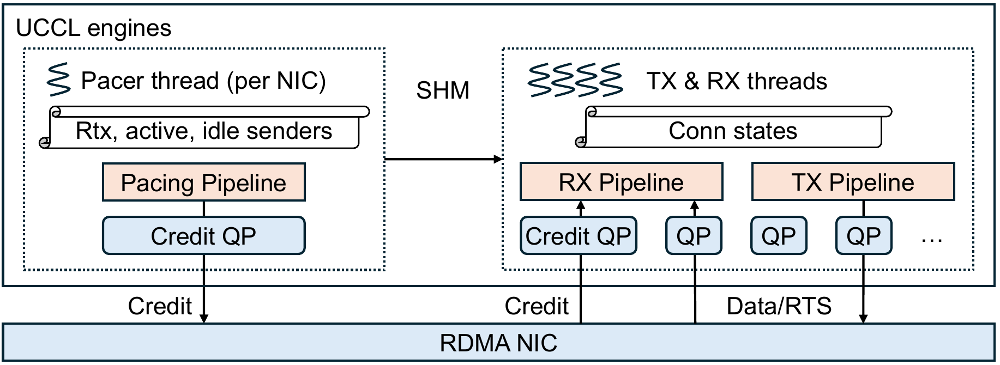<br><em>图 16：在UCCL下实现接收器驱动的CC。</em></p>

## 附录 C. 更多评估结果

### C.1 ML 工作负载中的更多集合通信

#### C.1.1 Allgather 与 reduce-scatter

这两个是 PyTorch FSDP（完全分片数据并行）[103] 中使用的代表性集合，表现出较低的网络拥塞[33]。图 17a 和图 17b 比较了 UCCL 和 SRD 在 EFA 测试台上的 allgather 和 reduce-scatter 性能。UCCL 在 allgather 上比 SRD 快最高 1.68 倍，在 reduce-scatter 上比 SRD 快最高 2.18 倍。

<p align="center"></p>

<table align="center">
  <tr>
    <td align="center" width="50%">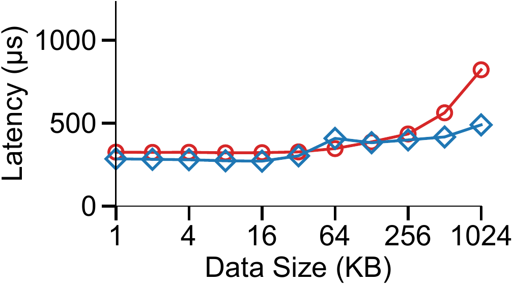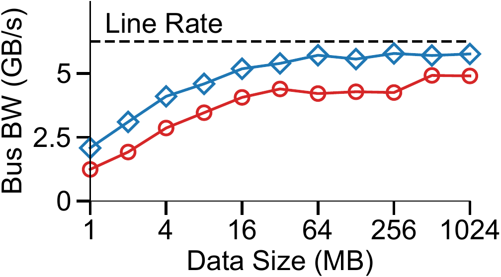<br><em>图 17a：Allgather。</em></td>
    <td align="center" width="50%">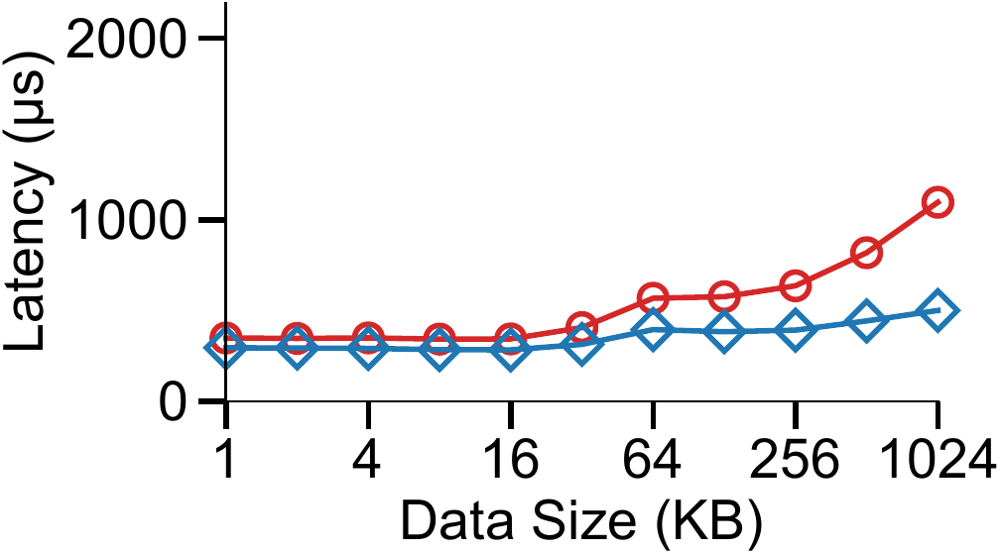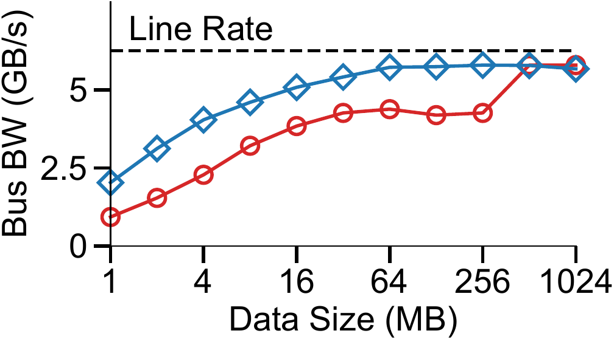<br><em>图 17b：Reduce-scatter。</em></td>
  </tr>
</table>

<p align="center"><em>图 17：EFA 上的 NCCL-tests 结果（禁用 NVLink+SHM 来模拟更大的测试台）。</em></p>

#### C.1.2 多集合通信

多集体中，各服务器本地等级相同的 GPUs 组成一个集体，多个集体并行执行。例如，multi-allreduce 用于具有服务器内张量并行性 (TP) + 服务器间数据并行性 (DP) 的 ML 工作负载。我们通过在 NCCL-tests 中设置环境变量“NCCL_TESTS_SPLIT_MASK=0x7”来评估多集体性能。图 18a 到图 18d 比较了 UCCL 和 SRD 在 EFA 测试台上的 multi-allreduce、multi-all-to-all、multi-allgather 和 multi-reduce-scatter 性能。对于 multi-allreduce、multi-all-to-all、multi-allgather 和 multi-reduce-scatter，UCCL 的性能分别比 SRD 高出 1.54×、1.22×、1.46× 和 1.44×。

<p align="center"></p>

<table align="center">
  <tr>
    <td align="center" width="50%">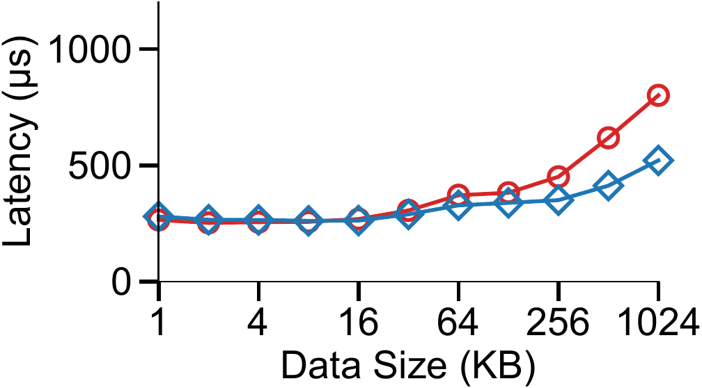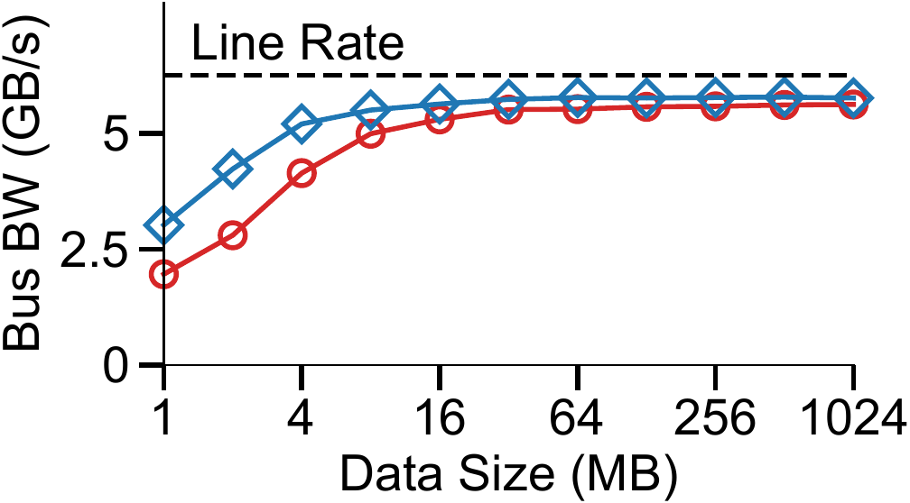<br><em>图 18a：Multi-allreduce。</em></td>
    <td align="center" width="50%">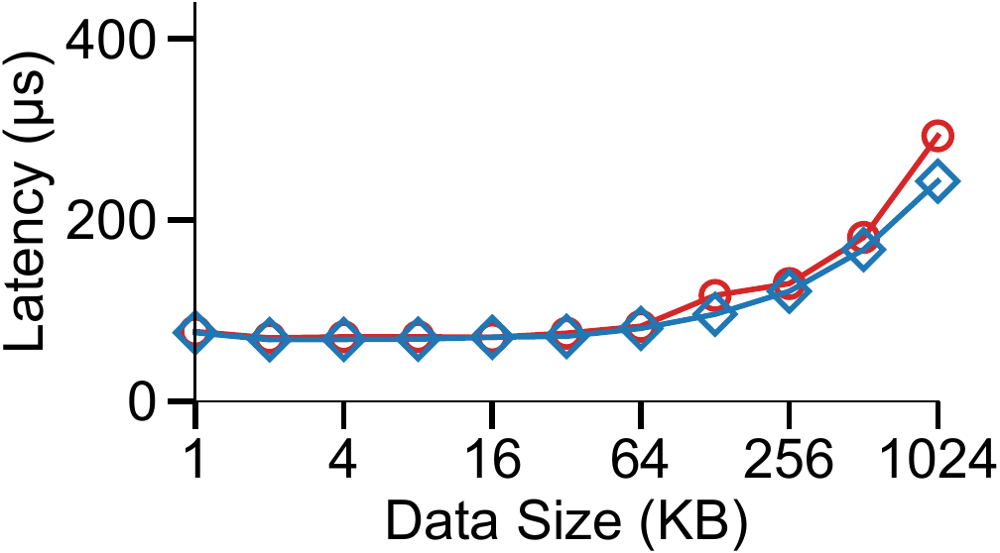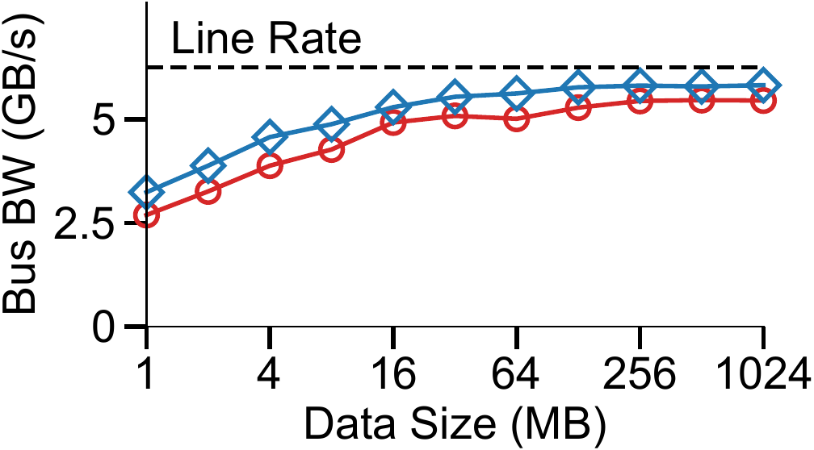<br><em>图 18b：Multi-all-to-all。</em></td>
  </tr>
  <tr>
    <td align="center" width="50%">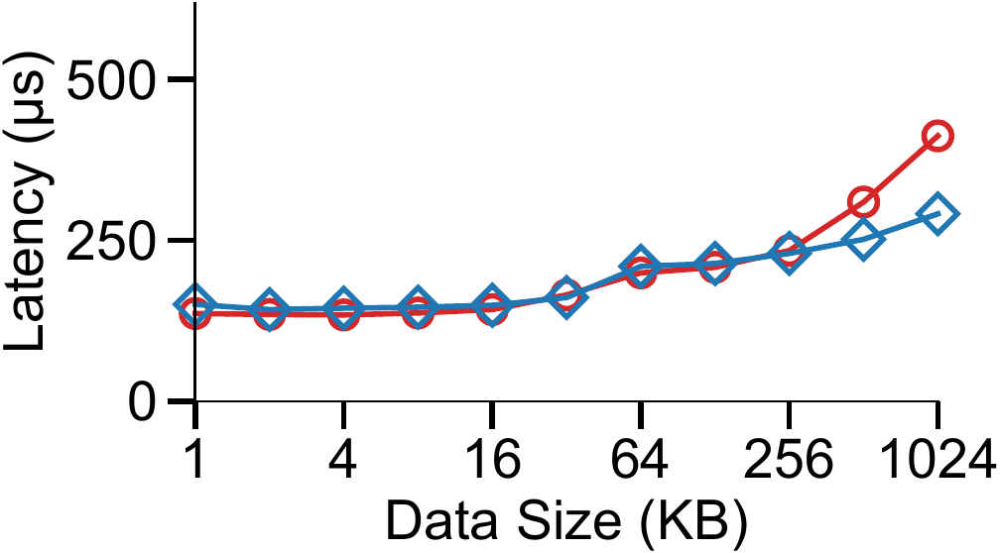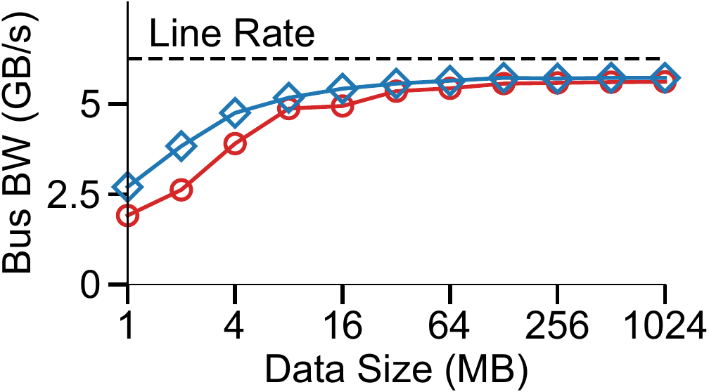<br><em>图 18c：Multi-allgather。</em></td>
    <td align="center" width="50%">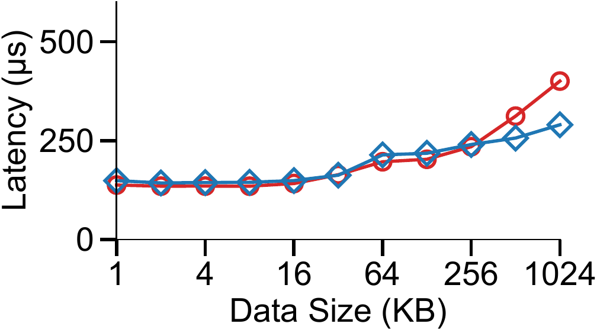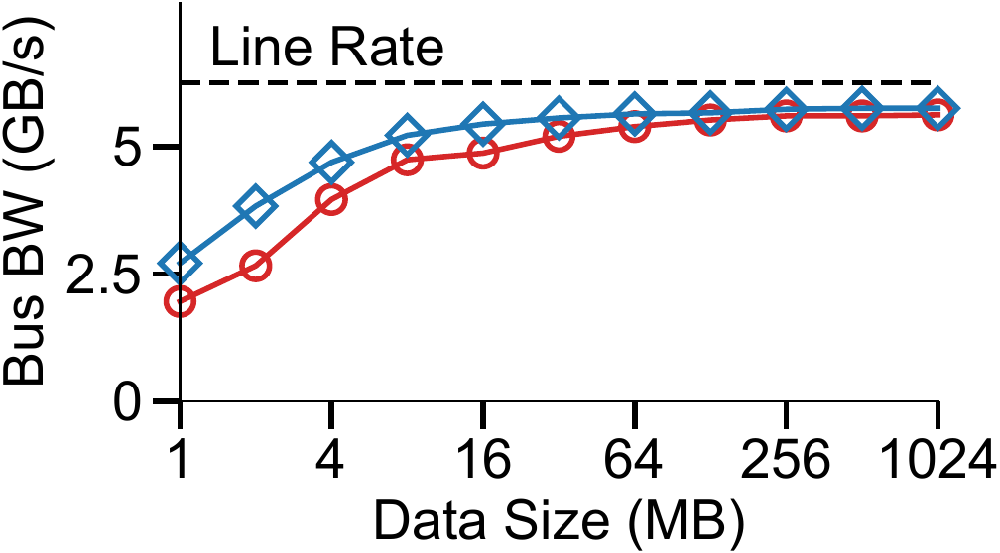<br><em>图 18d：Multi-reduce-scatter。</em></td>
  </tr>
</table>

<p align="center"><em>图 18：EFA 上的多集体结果（NVLink+SHM 禁用）。</em></p>

### C.2 UCCL 的 AF_XDP 性能

图 19 比较了 UCCL AF_XDP 与 NCCL 内核 TCP（带或不带邻近放置组 (PPG)）的总体性能。此实验在 AWS 上完成，两台 50 Gbps 虚拟机通过不支持 RDMA 的 AWS ENA NICs 连接。我们将 NCCL 配置为使用多个 TCP 连接来实现最佳性能。借助可在虚拟机之间提供较低网络 RTT 的 PPG，UCCL 在小/大消息范围内的性能比 NCCL 高出 4.1 倍/2.3 倍；如果没有 PPG，UCCL 的性能可提高 2.7 倍/2.1 倍。这一巨大收益是因为 UCCL 在快速用户空间数据包 IO 技术 AF_XDP 之上实现了高效的多路径传输，从而节省了大量的用户内核上下文切换开销和内核 TCP 中的重量级网络堆栈遍历。对于超过 16MB 的数据大小，由于不支持 GPUDirect，AF_XDP 和 TCP 都会遇到瓶颈。

<p align="center"></p>

<table align="center">
  <tr>
    <td align="center" width="50%">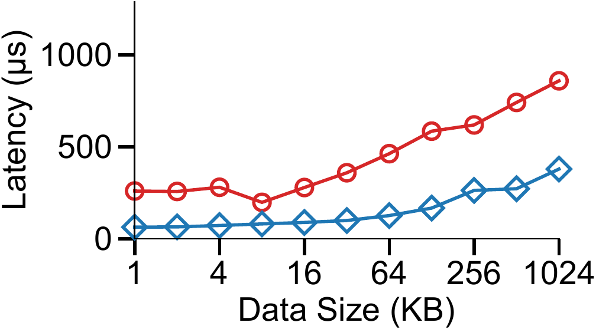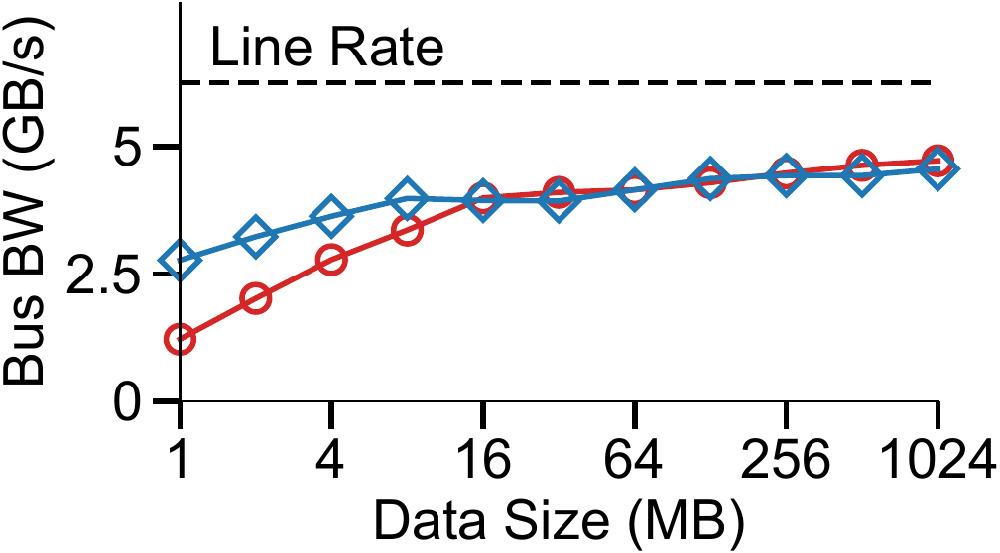<br><em>图 19a：使用邻近放置组。</em></td>
    <td align="center" width="50%">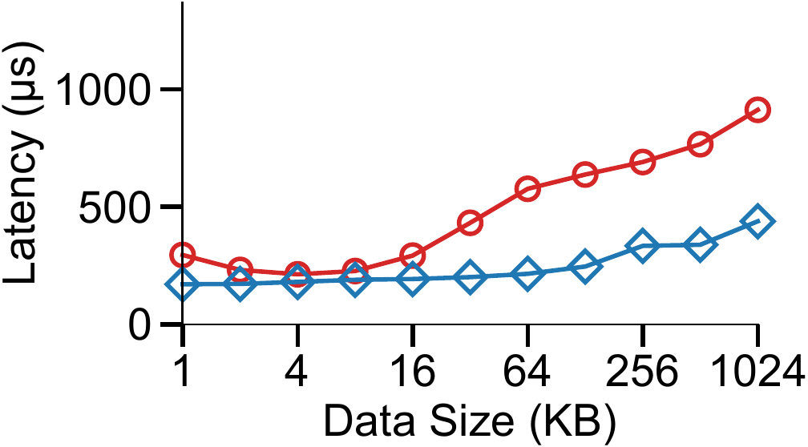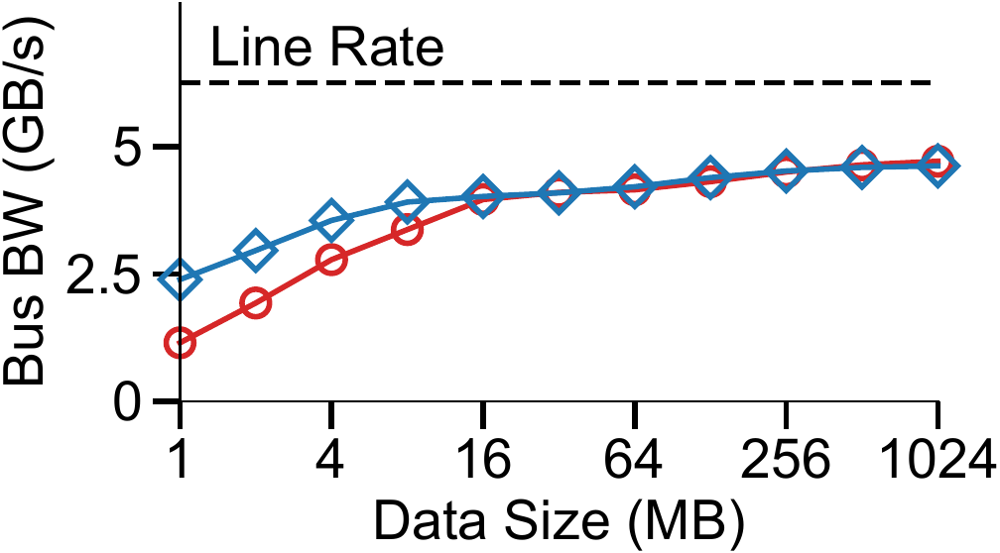<br><em>图 19b：不使用邻近放置组。</em></td>
  </tr>
</table>

<p align="center"><em>图 19：使用两个 AWS `g4dn.8xlarge` VM（每个 VM 具有 50 Gbps AWS ENA NIC）评估非 RDMA NICs 上的性能。</em></p>

### C.3 UCCL 可扩展性

#### C.3.1 改变 EFA 上每个 NIC 的 CPU 核数

图 20 显示了每个 NIC 的 CPU 内核数量如何影响 EFA 上的 UCCL 性能。如第 6.4.2 节中所述，即使对于连接密集型 all-to-all 集合，2 个内核也足以使 EFA 线路速率饱和。总体而言，得益于链式发布，UCCL 相对于 UD 能够使用 1 个内核来处理 EFA NICs 上的 100 Gbps 单向流量。

<p align="center"></p>

<table align="center">
  <tr>
    <td align="center" width="50%">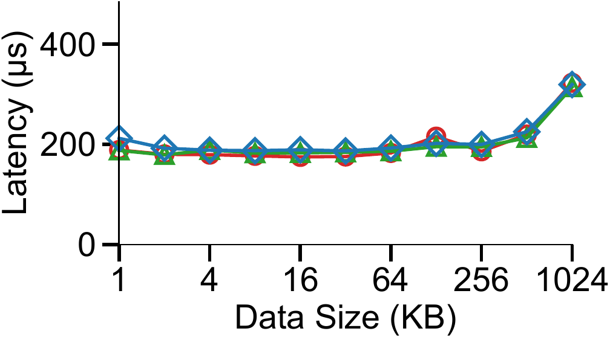<br><em>图 20a</em></td>
    <td align="center" width="50%">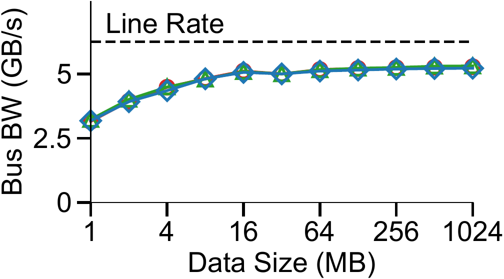<br><em>图 20b</em></td>
  </tr>
</table>

<p align="center"><em>图 20：EFA 上的 UCCL all-to-all，每个 NIC 具有不同数量的 CPU 内核（禁用 NVLink+SHM）。</em></p>

#### C.3.2 改变 EFA 上的 GPU 数量

图 21 显示了 UCCL 如何随 EFA 上的 GPUs 数量进行缩放。正如预期的那样，UCCL 使用更少的 GPUs 实现了更低的延迟和更高的总线带宽。但最终，UCCL 能够以 64MB 数据大小接近线速。 UCCL 利用 EFA NICs 上的无连接 UD，因此不会遇到 QP 可扩展性问题。

<p align="center"></p>

<table align="center">
  <tr>
    <td align="center" width="50%">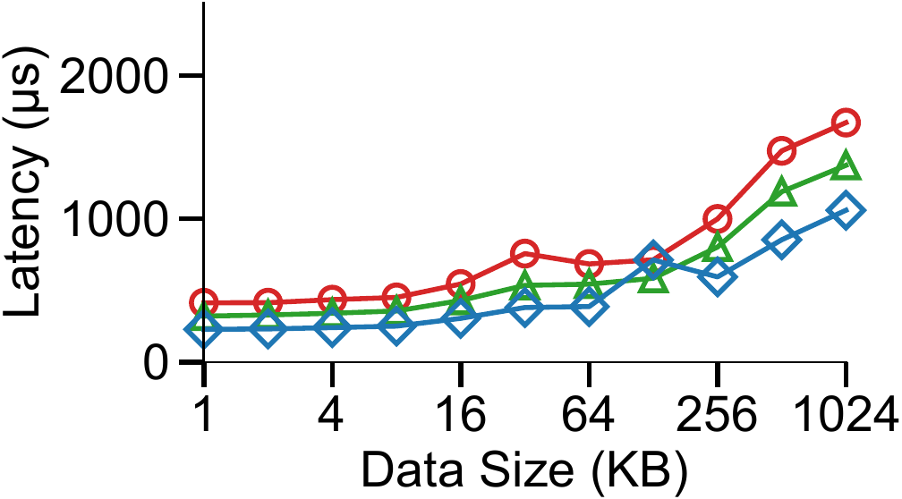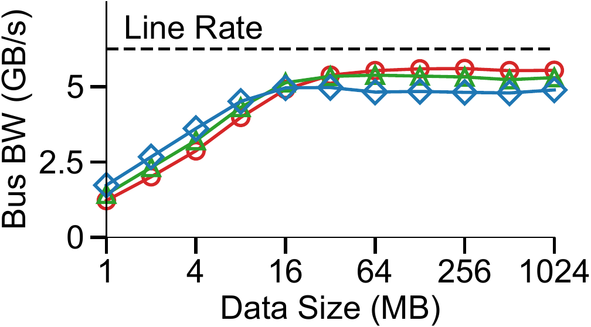<br><em>图 21a：Allreduce。</em></td>
    <td align="center" width="50%">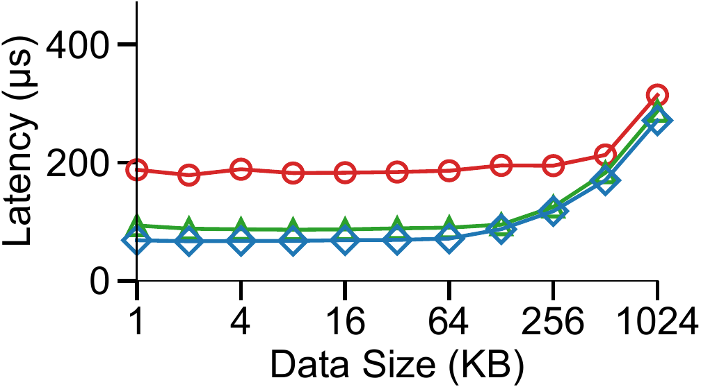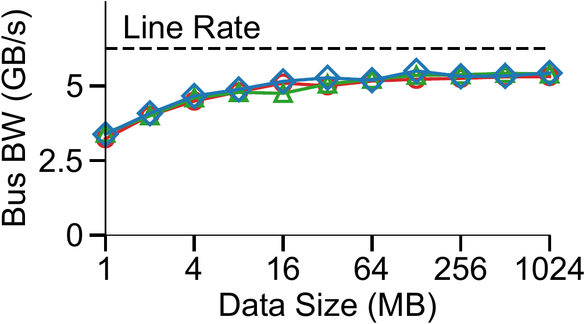<br><em>图 21b：All-to-all。</em></td>
  </tr>
</table>

<p align="center"><em>图 21：UCCL 集合在 EFA 上，并具有不同数量的 GPUs（NVLink+SHM 已禁用）。</em></p>

#### C.3.3 改变 EFA 上的路径数量

图 22 改变了 EFA 测试台上的路径数量（跨具有多个网络路径的机架）。这里的高级观点是，多路径有助于减轻由流冲突等引起的网络拥塞。我们预计多路径传输将在具有更多网络路径的更大测试平台上发挥更大的作用。

<p align="center"></p>

<table align="center">
  <tr>
    <td align="center" width="50%">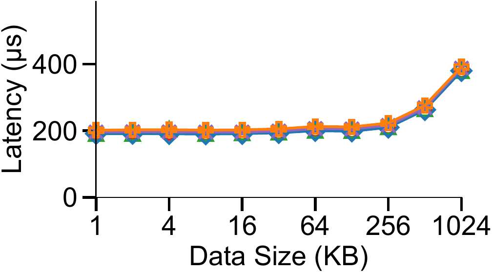<br><em>图 22a</em></td>
    <td align="center" width="50%">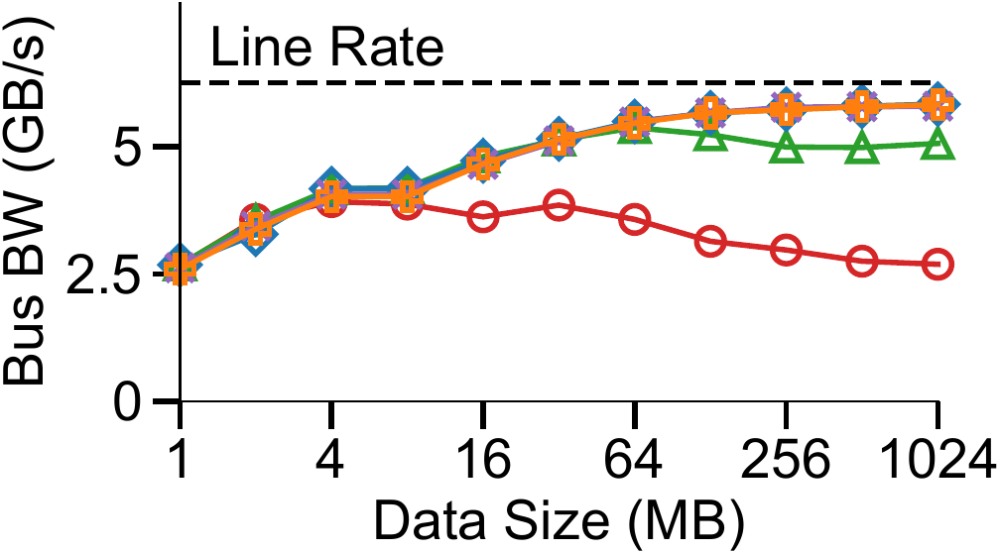<br><em>图 22b</em></td>
  </tr>
</table>

<p align="center"><em>图 22：EFA 上的 UCCL all-to-all 具有不同数量的路径（NVLink + SHM 禁用）。</em></p>

#### C.3.4 在 60K QPs 下改变块大小

图 23 比较了在 60K RC/UC QPs 下改变块大小时 UCCL 与 NCCL 的性能。总体而言，我们发现UCCL RC的可扩展性比UC差，因为它需要在NIC硬件上维护更多的连接状态；相反，具有 32KB 块大小的 UCCL UC 可以接近 256MB 数据大小的线速率。在 16KB 块大小下，UC 的性能比 RC 差，因为我们当前的实现使用单个 ACK QP，它可能会被 60K 数据 QPs 饿死；当在较小的块大小下有更频繁的动词操作时，这种饥饿变得更加严重，导致软件ACK不能及时返回。

<p align="center"></p>

<table align="center">
  <tr>
    <td align="center" width="50%">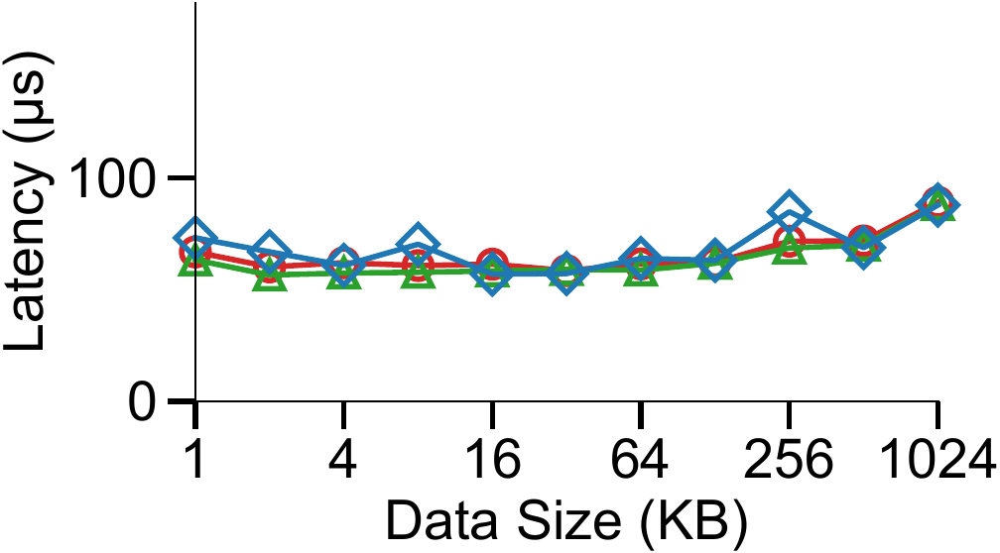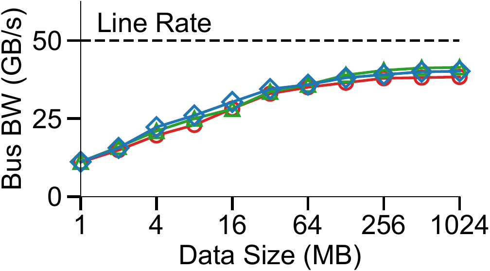<br><em>图 23a：对于 RC QPs。</em></td>
    <td align="center" width="50%">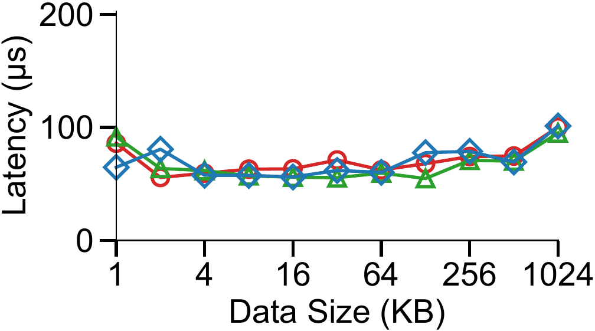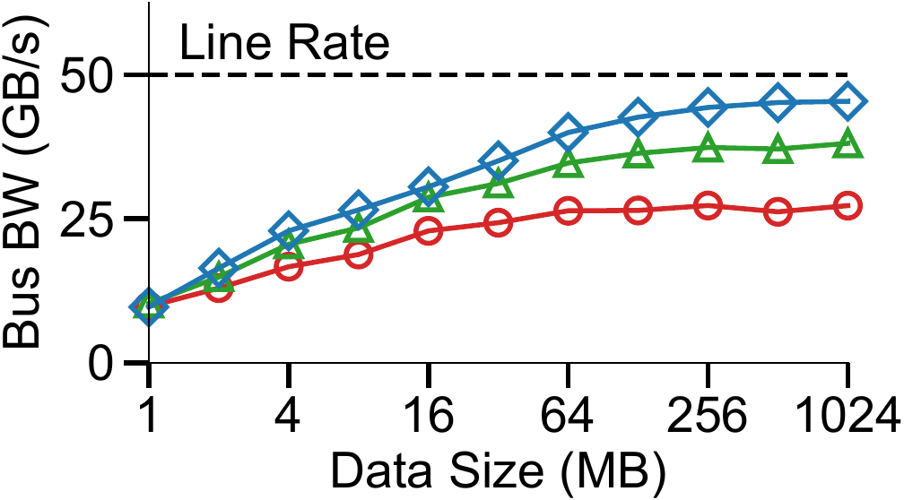<br><em>图 23b：对于 UC QPs。</em></td>
  </tr>
</table>

<p align="center"><em>图 23：使用 60K QPs 时，CX-7 上 UCCL 集合在不同块大小下的性能（禁用 NVLink+SHM）。</em></p>

### C.4 设计细节拆解

#### C.4.1 块大小和负载均衡策略的影响

本实验旨在研究块大小和 LB 策略对各种 ML 传输（不仅仅是 UCCL 中实现的传输）性能的影响。为此，我们使用数据包级网络模拟器“htsim”[21]，并根据他们的论文[56,15,81]实现UEC标准多路径传输。我们进一步修改“htsim”中的传输实现，以改变块大小和 LB 策略，例如，基于 ECN 或 RTT，连接分裂与否。我们通过更改模拟器中的 MTU 大小来改变块大小，而无需修改任何传输模拟代码。我们通过维护每个路径的 ECN/RTT 并修改传输发送方为每个数据包选择路径的代码来改变 LB 策略。与之前的工作[85,18,56,15]类似，我们专注于排列流量模式来对传输进行压力测试，其中每个 NIC 将流量流式传输到另一个，并且没有人接收多个流。我们在完全配置的三层 fattree 下模拟 1024 个 400G NICs，每个 NIC 使用 256 条路径传输 64MB 流量，理想完成时间为 1.28ms。

表3显示了不同设计下的排列流量完成时间。总体而言，使用 32KB 块大小并切换到 RTT 会使发送方驱动的传输性能降低 17.9%，而接收方驱动的传输性能仅降低 2.8%，而连接拆分不会降低。采用 16KB 块大小时，发送方驱动的传输性能下降仅为 4.1%。接收器驱动的性能更好，因为 EQDS 利用交换机内数据包修剪来快速检测网络拥塞并做出反应 [42, 81]。总体而言，该实验表明控制合并确实会导致传输性能下降，但大多数情况下下降程度是中等的；同时，连接分裂对传输性能的影响可以忽略不计。

<div align="center">

| Permutation traffic completion time (ms) | Sender-driven | Receiver-driven |
| --- | ---: | ---: |
| 4KB + ECN (UEC default) | 1.45 | 1.43 |
| 32KB + ECN | 1.62 (+11.7%) | 1.47 (+2.8%) |
| 32KB + RTT | 1.71 (+17.9%) | 1.47 (+2.8%) |
| 32KB + RTT + ConnSplit | 1.70 (+17.2%) | 1.47 (+2.8%) |
| 16KB + RTT + ConnSplit | 1.51 (+4.1%) | 1.42 (-0.7%) |

<em>表 3：块大小和 LB 策略的影响。“ConnSplit”表示连接拆分，它首先选择负载最小的引擎，然后使用二次幂采样 (§4.1) 从该引擎的路径/QPs 中选择负载最小的路径。</em>
</div>


#### C.4.2 内核融合的影响

该实验旨在量化分散 memcpy 的开销，并证明 UCCL 在内核启动上采用内核融合的设计选择是合理的（第 3.1 节）。在内核启动方式中，UCCL在启动时为每个UCCL引擎启动一个专用的复制线程（在CPU中）；接收到传输缓冲区的所有数据包后，引擎通过共享内存队列通知其关联的复制线程；然后复制线程启动一个GPU内核来异步执行分散memcpy（该内核与缩减内核不同）。我们通过自适应批处理进一步优化内核启动开销[13]。请注意，我们不能持久运行 GPU 内核，因为这会导致常用的“cudaDeviceSynchronize()”死锁。我们还通过完全跳过数据包重组并在 NCCL 测试中禁用数据正确性检查来模拟没有分散 memcpy 的性能。

图 24 显示了集体性能。与无 memcpy 相比，分散的 memcpy 引入的性能开销较小（allreduce 和 all-to-all 分别小于 8% 和 5%）。对于较小的消息延迟和较大的消息带宽，内核启动的性能比内核融合差。内核启动性能欠佳是因为内核启动开销较高，尤其是对于小消息。

<p align="center"></p>

<table align="center">
  <tr>
    <td align="center" width="50%">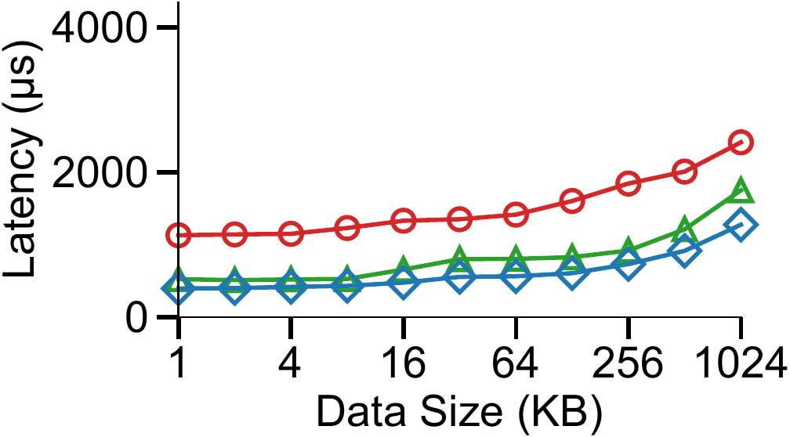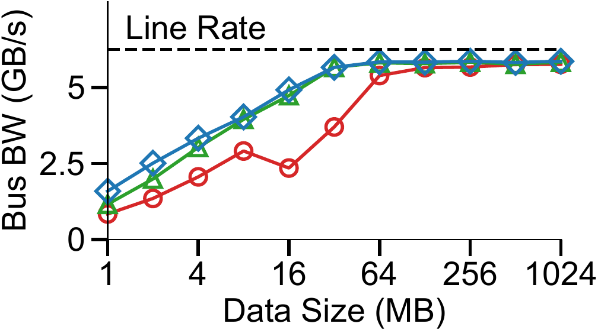<br><em>图 24a：Allreduce。</em></td>
    <td align="center" width="50%">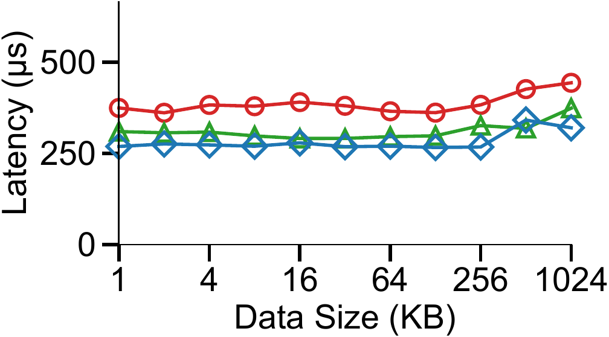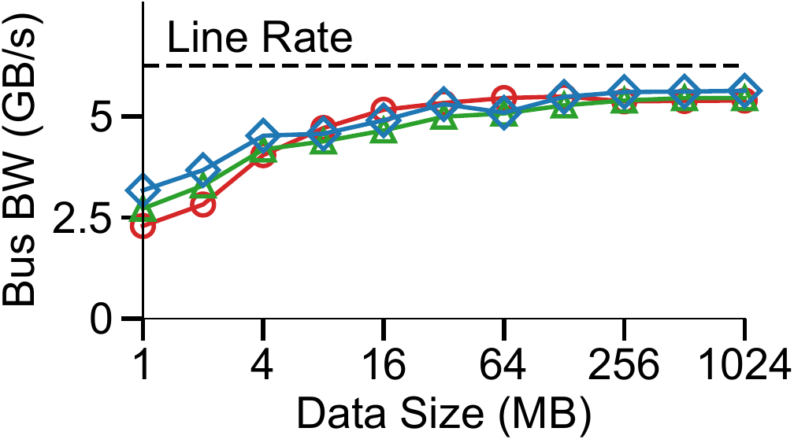<br><em>图 24b：All-to-all。</em></td>
  </tr>
</table>

<p align="center"><em>图 24：EFA 上的 NCCL-tests 结果（禁用 NVLink+SHM）。</em></p>

#### C.4.3 PCIe 开销

本实验旨在研究UCCL的多路径设计引入的PCIe开销。我们在 CX_IB 测试台上测量 PCIe 开销，而 AWS 虚拟化层阻止我们访问低级 PCIe 指标。我们重新运行第 6.1 节中的 all-to-all 实验，并使用“pcm-pcie”[48]量化 MMIO 事件和 CPU-NIC PCIe 流量。图 25 和图 26 显示了结果。正如预期的那样，与 CX-7 上的普通 NCCL 相比，UCCL 会产生更高的 MMIO 活动和 PCIe 带宽消耗。 UCCL 会引发更多的 MMIO 事件，因为它发布了更多动词：UCCL 每个动词传输一个 32KB 的小块，而 CX-7 之上的普通 NCCL 每个动词传输一个传输缓冲区大小的消息（例如，默认 128KB）。 UCCL 的额外 PCIe 流量主要来自 NIC 交换 QPs（即从 CPU 内存中获取未缓存的 QP 上下文），因为 UCCL 使用 256 UC/RC QPs 进行多路径。 UCCL UC 比 RC 消耗的带宽略多，因为它在 CPU 上的软件中实现了可靠性和选择性重传。

<p align="center"></p>

<table align="center">
  <tr>
    <td align="center" width="50%">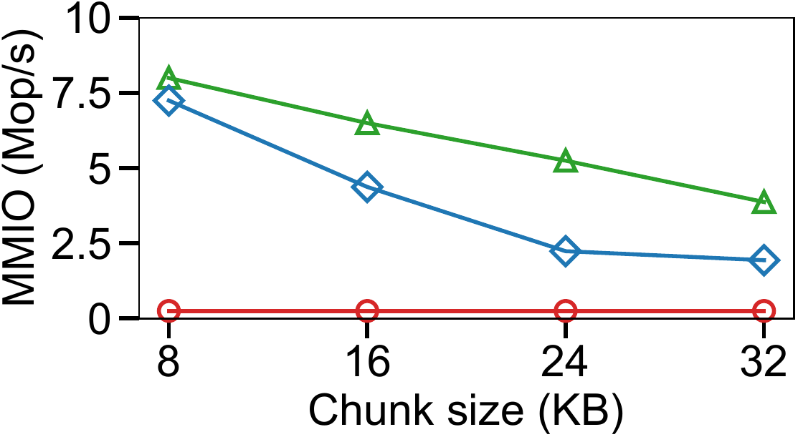<br><em>图 25a</em></td>
    <td align="center" width="50%">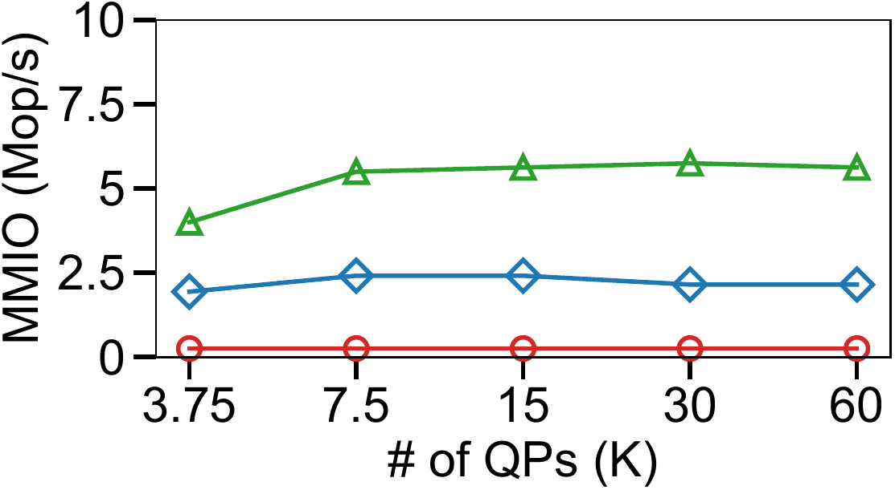<br><em>图 25b</em></td>
  </tr>
</table>

<p align="center"><em>图 25：各种块大小下每个 NIC 的 MMIO 事件数量以及 CX_IB 上的 QPs 数量。</em></p>

<p align="center">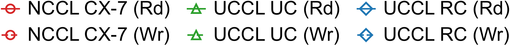</p>

<table align="center">
  <tr>
    <td align="center" width="50%">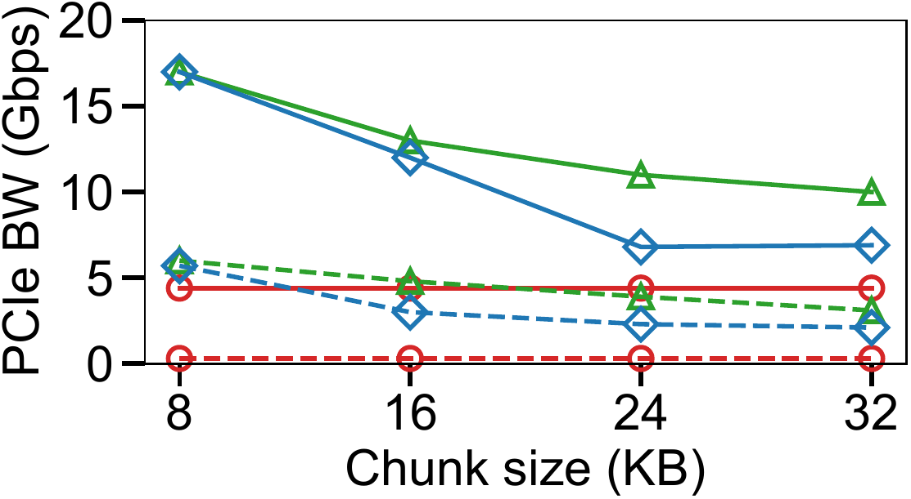<br><em>图 26a</em></td>
    <td align="center" width="50%">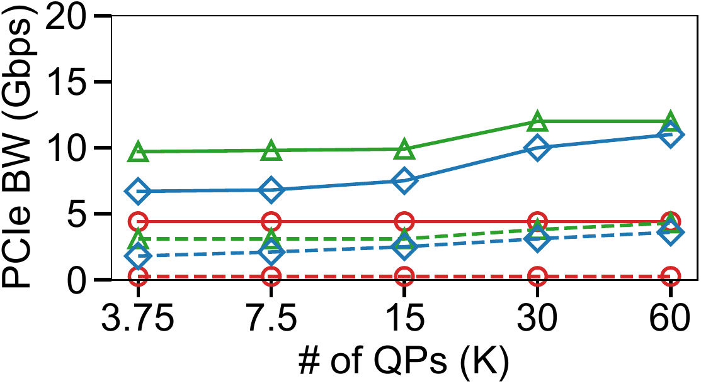<br><em>图 26b</em></td>
  </tr>
</table>

<p align="center"><em>图 26：每个 NIC 在 CX_IB 上不同块大小和 QPs 数量下的额外 PCIe 流量。Rd：PCIe 设备从 CPU 读取；Wr：PCIe 设备写入 CPU。</em></p>

我们得出的结论是，随着块大小的减小，MMIO 事件的数量和额外的 PCIe 流量显着增加，但 QPs 的数量几乎不会影响它们。 UCCL 根据此观察结果在控制决策粒度和性能之间进行合理的权衡，并使用 32KB 块大小作为默认值（第 3.3 节）。我们注意到，与 PCIe 链路容量相比，额外的 PCIe 带宽开销很小。例如，CX_IB 上的 PCIe 5.0×16 容量为每个方向 512Gbps，UCCL（32KB，60k QPs）的开销占比不到 2.5%（12/512=2.3%）。

## 参考文献

[1] Advanced Micro Devices, Inc.. 2025a. RCCL Tests. https://github.com/ROCm/rccl-tests/tree/5b27b961b2543b3af2bb1cf5ca8ee0505226ba92.

[2] Advanced Micro Devices, Inc.. 2025b. ROCm Communication Collectives Library (RCCL). https://github.com/ROCm/rccl/tree/532f54c2444501b3655e65fbce6d00d4bfc19c0b.

[3] Mohammad Alizadeh, Albert Greenberg, David A. Maltz, Jitendra Padhye, Parveen Patel, Balaji Prabhakar, Sudipta Sengupta, and Murari Sridharan. 2010. Data Center TCP (DCTCP). In Proceedings of ACM SIGCOMM. 63–74.

[4] Mina Almasry and Willem de Bruijn, Eric Dumazet, Kaiyuan Zhang. 2023. Device Memory TCP: Transferring Data from/to Device Memory Efficiently. Netdev 0x17 Conference.

[5] Amazon Web Services. 2024. AWS OFI NCCL. https://github.com/aws/aws-ofi-nccl/tree/v1.13.2-aws.

[6] Amazon Web Services. 2025. Amazon EC2 P5 Instances. https://aws.amazon.com/ec2/instance-types/p5/.

[7] AMD. 2025. RCCL Net Plugin Documentation. https://github.com/ROCm/rccl/tree/develop/ext-net.

[8] AMD. 2025. ROCm Communication Collectives Library (RCCL). https://github.com/ROCm/rccl.

[9] AMD Pensando. 2024. AMD Pollara 400 Card. https://www.amd.com/content/dam/amd/en/documents/pensando-technical-docs/product-briefs/pensando-pollara-400-product-brief.pdf.

[10] Azure/msccl. 2024. Microsoft Collective Communication Library (MSCCL). https://github.com/Azure/msccl.

[11] Wei Bai, Shanim Sainul Abdeen, Ankit Agrawal, Krishan Kumar Attre, Paramvir Bahl, Ameya Bhagat, Gowri Bhaskara, Tanya Brokhman, Lei Cao, Ahmad Cheema, et al. 2023. Empowering Azure Storage with RDMA. In Proceedings of USENIX NSDI. 49--67.

[12] Paul Barham, Aakanksha Chowdhery, Jeff Dean, Sanjay Ghemawat, Steven Hand, Daniel Hurt, Michael Isard, Hyeontaek Lim, Ruoming Pang, Sudip Roy, et al. 2022. Pathways: Asynchronous Distributed Dataflow for ML. Proceedings of Machine Learning and Systems 4 (2022), 430--449.

[13] Adam Belay, George Prekas, Ana Klimovic, Samuel Grossman, Christos Kozyrakis, and Edouard Bugnion. 2014. IX: A Protected Dataplane Operating System for High Throughput and Low Latency. In Proceedings of USENIX OSDI. 49--65.

[14] Brian N Bershad, Stefan Savage, Przemyslaw Pardyak, Emin G\"un Sirer, Marc E Fiuczynski, David Becker, Craig Chambers, and Susan Eggers. 1995. Extensibility Safety and Performance in the SPIN Operating System. In Proceedings of ACM SOSP. 267--283.

[15] Tommaso Bonato, Abdul Kabbani, Daniele De Sensi, Rong Pan, Yanfang Le, Costin Raiciu, Mark Handley, Timo Schneider, Nils Blach, Ahmad Ghalayini, et al. 2024. SMaRTT-REPS: Sender-based Marked Rapidly-adapting Trimmed & Timed Transport with Recycled Entropies. arXiv e-prints (2024), arXiv--2404.

[16] Pat Bosshart, Dan Daly, Glen Gibb, Martin Izzard, Nick McKeown, Jennifer Rexford, Cole Schlesinger, Dan Talayco, Amin Vahdat, George Varghese, et al. 2014. P4: Programming Protocol-Independent Packet Processors. ACM SIGCOMM Computer Communication Review 44, 3 (2014), 87--95.

[17] Broadcom. 2024. Broadcom High-Performance 400G RoCE / RDMA NICs. https://www.broadcom.com/info/nic/performance-ethernet-adapters.

[18] Jiaxin Cao, Rui Xia, Pengkun Yang, Chuanxiong Guo, Guohan Lu, Lihua Yuan, Yixin Zheng, Haitao Wu, Yongqiang Xiong, and Dave Maltz. 2013. Per-Packet Load-Balanced, Low-Latency Routing for Clos-Based Data Center Networks. In Proceedings of the ACM CoNEXT. 49--60.

[19] Youmin Chen, Youyou Lu, and Jiwu Shu. 2019. Scalable RDMA RPC on Reliable Connection with Efficient Resource Sharing. In Proceedings of EuroSys. 1--14.

[20] Peng Cheng, Fengyuan Ren, Ran Shu, and Chuang Lin. 2014. Catch the whole lot in an action: Rapid precise packet loss notification in data center. In 11th USENIX Symposium on Networked Systems Design and Implementation (NSDI 14). 17--28.

[21] Ultra Ethernet Consortium. 2023. The New Era Needs a New Network. https://ultraethernet.org/.

[22] NVIDIA Corporation. 2025a. DGX H100/200 System Topology. https://docs.nvidia.com/dgx/dgxh100-user-guide/introduction-to-dgxh100.html#dgx-h100-200-system-topology.

[23] NVIDIA Corporation. 2025b. NCCL Net Plugin Documentation. https://github.com/NVIDIA/nccl/blob/master/ext-net/README.md.

[24] NVIDIA Corporation. 2025c. NCCL Tests. https://github.com/NVIDIA/nccl-tests/tree/9d26b8422ba76c098df996b96e13b8ddf3a71165.

[25] NVIDIA Corporation. 2025d. NCCL v2.23.4-1. https://github.com/NVIDIA/nccl/tree/2ea4ee94bfb04c886c79ccae60ac9961000fdee2.

[26] NVIDIA Corporation. 2025e. NVIDIA Ethernet SuperNICs: Next-generation networking for the next wave of AI. https://www.nvidia.com/en-us/networking/products/ethernet/supernic/.

[27] NVIDIA Corporation. 2025f. NVIDIA GPUDirect: Enhancing Data Movement and Access for GPUs. https://developer.nvidia.com/gpudirect.

[28] DeepSeek. 2025. DeepEP: an Efficient Expert-Parallel Communication Library. https://github.com/deepseek-ai/DeepEP.

[29] DeepSeek AI. 2025. Expert Parallelism Load Balancer (EPLB). https://github.com/deepseek-ai/EPLB.

[30] Advait Dixit, Pawan Prakash, Y Charlie Hu, and Ramana Rao Kompella. 2013. On the Impact of Packet Spraying in Data Center Networks. In Proceedings of IEEE INFOCOM. IEEE, 2130--2138.

[31] Jianbo Dong, Bin Luo, Jun Zhang, Pengcheng Zhang, Fei Feng, Yikai Zhu, Ang Liu, Zian Chen, Yi Shi, Hairong Jiao, et al. 2024. Boosting Large-Scale Parallel Training Efficiency with C4: A Communication-Driven Approach. arXiv preprint arXiv:2406.04594 (2024).

[32] Dawson R Engler, M Frans Kaashoek, and James O'Toole Jr. 1995. Exokernel: An Operating System Architecture for Application-Level Resource Management. ACM SIGOPS Operating Systems Review 29, 5 (1995), 251--266.

[33] Adithya Gangidi, Rui Miao, Shengbao Zheng, Sai Jayesh Bondu, Guilherme Goes, Hany Morsy, Rohit Puri, Mohammad Riftadi, Ashmitha Jeevaraj Shetty, Jingyi Yang, Shuqiang Zhang, Mikel Jimenez Fernandez, Shashidhar Gandham, and Hongyi Zeng. 2024. RDMA over Ethernet for Distributed Training at Meta Scale. In Proceedings of ACM SIGCOMM 2024 Conference. 57–70.

[34] Yixiao Gao, Qiang Li, Lingbo Tang, Yongqing Xi, Pengcheng Zhang, Wenwen Peng, Bo Li, Yaohui Wu, Shaozong Liu, Lei Yan, et al. 2021. When Cloud Storage Meets RDMA. In Proceedings of USENIX NSDI. 519--533.

[35] Talia Gershon, Seetharami Seelam, Brian Belgodere, Milton Bonilla, Lan Hoang, Danny Barnett, I Chung, Apoorve Mohan, Ming-Hung Chen, Lixiang Luo, et al. 2024. The Infrastructure Powering IBM's Gen AI Model Development. arXiv preprint arXiv:2407.05467 (2024).

[36] Dan Gibson, Hema Hariharan, Eric Lance, Moray McLaren, Behnam Montazeri, Arjun Singh, Stephen Wang, Hassan MG Wassel, Zhehua Wu, Sunghwan Yoo, et al. 2022. Aquila: A Unified, Low-Latency Fabric for Datacenter Networks. In Proceedings of USENIX NSDI. 1249--1266.

[37] Google. 2024. Falcon Transport Protocol. https://github.com/opencomputeproject/OCP-NET-Falcon.

[38] Google. 2024. Introduction to Falcon Reliable Transport. https://netdevconf.info/0x18/sessions/talk/introduction-to-falcon-reliable-transport.html.

[39] Aaron Grattafiori, Abhimanyu Dubey, Abhinav Jauhri, Abhinav Pandey, Abhishek Kadian, Ahmad Al-Dahle, Aiesha Letman, Akhil Mathur, Alan Schelten, Alex Vaughan, et al. 2024. The Llama 3 Herd of Models. arXiv preprint arXiv:2407.21783 (2024).

[40] Chuanxiong Guo, Haitao Wu, Zhong Deng, Gaurav Soni, Jianxi Ye, Jitu Padhye, and Marina Lipshteyn. 2016. RDMA over Commodity Ethernet at Scale. In Proceedings of ACM SIGCOMM. 202--215.

[41] Sangtae Ha, Injong Rhee, and Lisong Xu. 2008. CUBIC: a New TCP-Friendly High-Speed TCP Variant. ACM SIGOPS operating systems review 42, 5 (2008), 64--74.

[42] Mark Handley, Costin Raiciu, Alexandru Agache, Andrei Voinescu, Andrew W. Moore, Gianni Antichi, and Marcin W\'ojcik. 2017. Re-architecting Datacenter Networks and Stacks for Low Latency and High Performance. In Proceedings of ACM SIGCOMM. 29–42.

[43] Aaron Harlap, Deepak Narayanan, Amar Phanishayee, Vivek Seshadri, Nikhil Devanur, Greg Ganger, and Phil Gibbons. 2018. PipeDream: Fast and Efficient Pipeline Parallel DNN Training. arXiv preprint arXiv:1806.03377 (2018).

[44] Kaiming He, Xiangyu Zhang, Shaoqing Ren, and Jian Sun. 2016. Deep Residual Learning for Image Recognition. In Proceedings of the IEEE conference on computer vision and pattern recognition. 770--778.

[45] Shuihai Hu, Yibo Zhu, Peng Cheng, Chuanxiong Guo, Kun Tan, Jitendra Padhye, and Kai Chen. 2016. Deadlocks in Datacenter Networks: Why Do They Form, and How to Avoid Them. In Proceedings of ACM HotNets. 92--98.

[46] Cheng Huang, Huseyin Simitci, Yikang Xu, Aaron Ogus, Brad Calder, Parikshit Gopalan, Jin Li, and Sergey Yekhanin. 2012. Erasure Coding in Windows Azure Storage. In Proceedings of USENIX ATC. 15--26.

[47] InfiniBand Trade Association. 2020. InfiniBandTM Architecture Specification Volume 1 Release 1.4. % https://cw.infinibandta.org/document/dl/8567 %

[48] Intel. 2025. Performance Counter Monitor. https://github.com/intel/pcm/.

[49] Muhammad Asim Jamshed, YoungGyoun Moon, Donghwi Kim, Dongsu Han, and KyoungSoo Park. 2017. mOS: A Reusable Networking Stack for Flow Monitoring Middleboxes. In Proceedings of USENIX NSDI. 113--129.

[50] Anuj Kalia, Michael Kaminsky, and David Andersen. 2019. Datacenter RPCs can be General and Fast. In Proceedings of USENIX NSDI. 1--16.

[51] Anuj Kalia, Michael Kaminsky, and David G Andersen. 2016. FaSST: Fast, Scalable and Simple Distributed Transactions with Two-Sided (RDMA) Datagram RPCs. In Proceedings of USENIX OSDI. 185--201.

[52] Taehyun Kim, Deondre Martin Ng, Junzhi Gong, Youngjin Kwon, Minlan Yu, and KyoungSoo Park. 2023. Rearchitecting the TCP Stack for I/O-Offloaded Content Delivery. In Proceedings of USENIX NSDI. 275--292.

[53] Xinhao Kong, Jiaqi Lou, Wei Bai, Nam Sung Kim, and Danyang Zhuo. 2023. Towards a Manageable Intra-Host Network. In Proceedings of the 19th Workshop on Hot Topics in Operating Systems. 206--213.

[54] Xinhao Kong, Yibo Zhu, Huaping Zhou, Zhuo Jiang, Jianxi Ye, Chuanxiong Guo, and Danyang Zhuo. 2022. Collie: Finding Performance Anomalies in RDMA Subsystems. In Proceedings of USENIX NSDI. 287--305.

[55] Gautam Kumar, Nandita Dukkipati, Keon Jang, Hassan MG Wassel, Xian Wu, Behnam Montazeri, Yaogong Wang, Kevin Springborn, Christopher Alfeld, Michael Ryan, et al. 2020. Swift: Delay is Simple and Effective for Congestion Control in the Datacenter. In Proceedings of ACM SIGCOMM. 514--528.

[56] Yanfang Le, Rong Pan, Peter Newman, Jeremias Blendin, Abdul Kabbani, Vipin Jain, Raghava Sivaramu, and Francis Matus. 2024. STrack: A Reliable Multipath Transport for AI/ML Clusters. arXiv preprint arXiv:2407.15266 (2024).

[57] Yanfang Le, Brent Stephens, Arjun Singhvi, Aditya Akella, and Michael M Swift. 2018. RoGUE: RDMA over Generic Unconverged Ethernet. In Proceedings of ACM SoCC. 225--236.

[58] Sugi Lee, Mingyu Choi, Ikjun Yeom, and Younghoon Kim. 2024. PeRF: Preemption-Enabled RDMA Framework. In Proceedings of USENIX ATC. 209--225.

[59] Mu Li, David G Andersen, Alexander Smola, and Kai Yu. 2014. Communication efficient distributed machine learning with the parameter server. Advances in neural information processing systems 27 (2014).

[60] Qiang Li, Yixiao Gao, Xiaoliang Wang, Haonan Qiu, Yanfang Le, Derui Liu, Qiao Xiang, Fei Feng, Peng Zhang, Bo Li, et al. 2023. Flor: An Open High Performance RDMA Framework over Heterogeneous RNICs. In Proceedings of USENIX OSDI. 931--948.

[61] Yuliang Li, Rui Miao, Hongqiang Harry Liu, Yan Zhuang, Fei Feng, Lingbo Tang, Zheng Cao, Ming Zhang, Frank Kelly, Mohammad Alizadeh, et al. 2019. HPCC: High Precision Congestion Control. In Proceedings of ACM SIGCOMM. 44--58.

[62] Aixin Liu, Bei Feng, Bing Xue, Bingxuan Wang, Bochao Wu, Chengda Lu, Chenggang Zhao, Chengqi Deng, Chenyu Zhang, Chong Ruan, et al. 2024. DeepSeek-V3 Technical Report. arXiv preprint arXiv:2412.19437 (2024).

[63] Ming Liu, Tianyi Cui, Henry Schuh, Arvind Krishnamurthy, Simon Peter, and Karan Gupta. 2019. Offloading Distributed Applications onto SmartNICs Using iPipe. In Proceedings of ACM SIGCOMM. 318--333.

[64] Yuanwei Lu, Guo Chen, Bojie Li, Kun Tan, Yongqiang Xiong, Peng Cheng, Jiansong Zhang, Enhong Chen, and Thomas Moscibroda. 2018. Multi-Path Transport for RDMA in Datacenters. In Proceedings of USENIX NSDI. 357--371.

[65] Michael Marty, Marc de Kruijf, Jacob Adriaens, Christopher Alfeld, Sean Bauer, Carlo Contavalli, Michael Dalton, Nandita Dukkipati, William C Evans, Steve Gribble, et al. 2019. Snap: A Microkernel Approach to Host Networking. In Proceedings of ACM SOSP. 399--413.

[66] Matt Mathis, Jamshid Mahdavi, Sally Floyd, and Allyn Romanow. 1996. TCP Selective Acknowledgment Options. https://datatracker.ietf.org/doc/html/rfc2018.

[67] Microsoft Azure. 2024. ND-H100-v5 sizes series. https://learn.microsoft.com/en-us/azure/virtual-machines/sizes/gpu-accelerated/ndh100v5-series.

[68] Radhika Mittal, Vinh The Lam, Nandita Dukkipati, Emily Blem, Hassan Wassel, Monia Ghobadi, Amin Vahdat, Yaogong Wang, David Wetherall, and David Zats. 2015. TIMELY: RTT-based Congestion Control for the Datacenter. ACM SIGCOMM Computer Communication Review 45, 4 (2015), 537--550.

[69] Radhika Mittal, Alexander Shpiner, Aurojit Panda, Eitan Zahavi, Arvind Krishnamurthy, Sylvia Ratnasamy, and Scott Shenker. 2018. Revisiting Network Support for RDMA. In Proceedings of ACM SIGCOMM. 313--326.

[70] Michael Mitzenmacher. 2001. The Power of Two Choices in Randomized Load Balancing. IEEE Transactions on Parallel and Distributed Systems 12, 10 (2001), 1094--1104.

[71] Sumit Kumar Monga, Sanidhya Kashyap, and Changwoo Min. 2021. Birds of a feather flock together: Scaling RDMA RPCs with Flock. In Proceedings of ACM SOSP. 212--227.

[72] Behnam Montazeri, Yilong Li, Mohammad Alizadeh, and John Ousterhout. 2018. Homa: A Receiver-Driven Low-Latency Transport Protocol Using Network Priorities. In Proceedings of ACM SIGCOMM. 221--235.

[73] Multipath TCP community. 2023. Multipath TCP. https://www.multipath-tcp.org/.

[74] NVIDIA Corporation. 2022. Doubling all2all Performance with NVIDIA Collective Communication Library 2.12. https://developer.nvidia.com/blog/doubling-all2all-performance-with-nvidia-collective-communication-library-2-12/.

[75] NVIDIA Corporation. 2024a. ConnectX-7 400G Adapters. https://resources.nvidia.com/en-us-accelerated-networking-resource-library/connectx-7-datasheet.

[76] NVIDIA Corporation. 2024b. CPU-assisted InfiniBand GPU Direct Async. https://developer.nvidia.com/blog/enhancing-application-portability-and-compatibility-across-new-platforms-using-nvidia-magnum-io-nvshmem-3-0/##cpu-assisted_infiniband_gpu_direct_async%C2%A0.

[77] NVIDIA Corporation. 2024c. Recommended Topologies for Implementing an HPC Cluster with NVIDIA Quantum InfiniBand Solutions - Part 2: Hash-Based Forwarding. https://enterprise-support.nvidia.com/s/article/Recommended-Topologies-for-Implementing-an-HPC-Cluster-with-NVIDIA-Quantum-InfiniBand-Solutions-Part-2#Hash-BasedForwarding.

[78] NVIDIA Corporation. 2025a. Megatron-LM & Megatron-Core. https://github.com/NVIDIA/Megatron-LM.

[79] NVIDIA Corporation. 2025b. NVIDIA Collective Communications Library (NCCL). https://github.com/NVIDIA/nccl.

[80] NVIDIA Corporation. 2025c. Using the NVSHMEM InfiniBand GPUDirect Async Transport. https://docs.nvidia.com/nvshmem/api/using.html##using-the-nvshmem-infiniband-gpudirect-async-transport.

[81] Vladimir Olteanu, Haggai Eran, Dragos Dumitrescu, Adrian Popa, Cristi Baciu, Mark Silberstein, Georgios Nikolaidis, Mark Handley, and Costin Raiciu. 2022. An edge-queued datagram service for all datacenter traffic. In 19th USENIX Symposium on Networked Systems Design and Implementation (NSDI 22). 761--777.

[82] Phitchaya Mangpo Phothilimthana, Ming Liu, Antoine Kaufmann, Simon Peter, Rastislav Bodik, and Thomas Anderson. 2018. Floem: A Programming System for NIC-Accelerated Network Applications. In Proceedings of USENIX OSDI. 663--679.

[83] Kun Qian, Yongqing Xi, Jiamin Cao, Jiaqi Gao, Yichi Xu, Yu Guan, Binzhang Fu, Xuemei Shi, Fangbo Zhu, Rui Miao, Chao Wang, Peng Wang, Pengcheng Zhang, Xianlong Zeng, Eddie Ruan, Zhiping Yao, Ennan Zhai, and Dennis Cai. 2024. Alibaba HPN: A Data Center Network for Large Language Model Training. In Proceedings of ACM SIGCOMM. 691–706.

[84] Mubashir Adnan Qureshi, Yuchung Cheng, Qianwen Yin, Qiaobin Fu, Gautam Kumar, Masoud Moshref, Junhua Yan, Van Jacobson, David Wetherall, and Abdul Kabbani. 2022. PLB: Congestion Signals Are Simple and Effective for Network Load Balancing. In Proceedings of ACM SIGCOMM. 207--218.

[85] Costin Raiciu, Sebastien Barre, Christopher Pluntke, Adam Greenhalgh, Damon Wischik, and Mark Handley. 2011. Improving Datacenter Performance and Robustness with Multipath TCP. ACM SIGCOMM Computer Communication Review 41, 4 (2011), 266--277.

[86] Henry N Schuh, Weihao Liang, Ming Liu, Jacob Nelson, and Arvind Krishnamurthy. 2021. Xenic: SmartNIC-Accelerated Distributed Transactions. In Proceedings of ACM SOSP. 740--755.

[87] Margo I Seltzer, Yasuhiro Endo, Christopher Small, and Keith A Smith. 1996. Dealing with Disaster: Surviving Misbehaved Kernel Extensions. ACM SIGOPS Operating Systems Review 30, 213-228 (1996), 10--1145.

[88] Amazon Web Services. 2025. Elastic Fabric Adapter. https://aws.amazon.com/hpc/efa/.

[89] Leah Shalev, Hani Ayoub, Nafea Bshara, and Erez Sabbag. 2020. A Cloud-Optimized Transport Protocol for Elastic and Scalable HPC. IEEE micro 40, 6 (2020), 67--73.

[90] Madhavapeddi Shreedhar and George Varghese. 1995. Efficient Fair Queueing using Deficit Round Robin. In Proceedings of the conference on Applications, technologies, architectures, and protocols for computer communication. 231--242.

[91] Arjun Singhvi, Aditya Akella, Dan Gibson, Thomas F. Wenisch, Monica Wong-Chan, Sean Clark, Milo M.K. Martin, Moray McLaren, Prashant Chandra, Rob Cauble, and et al. 2020. 1RMA: Re-Envisioning Remote Memory Access for Multi-Tenant Datacenters. In Proceedings of ACM SIGCOMM. 708--721.

[92] Athinagoras Skiadopoulos, Zhiqiang Xie, Mark Zhao, Qizhe Cai, Saksham Agarwal, Jacob Adelmann, David Ahern, Carlo Contavalli, Michael Goldflam, Vitaly Mayatskikh, et al. 2024. High-Throughput and Flexible Host Networking for Accelerated Computing. In Proceedings of USENIX OSDI. 405--423.

[93] The Linux kernel development community. 2025. AF_XDP. https://docs.kernel.org/networking/af_xdp.html.

[94] The SGLang Team. 2025. Deploying DeepSeek with PD Disaggregation and Large-Scale Expert Parallelism on 96 H100 GPUs. https://lmsys.org/blog/2025-05-05-large-scale-ep/.

[95] William Tu, Yi-Hung Wei, Gianni Antichi, and Ben Pfaff. 2021. Revisiting the Open vSwitch Dataplane Ten Years Later. In Proceedings of ACM SIGCOMM. 245--257.

[96] Hao Wang, Han Tian, Jingrong Chen, Xinchen Wan, Jiacheng Xia, Gaoxiong Zeng, Wei Bai, Junchen Jiang, Yong Wang, and Kai Chen. 2024. Towards Domain-Specific Network Transport for Distributed DNN Training. In Proceedings of USENIX NSDI. 1421--1443.

[97] Xizheng Wang, Qingxu Li, Yichi Xu, Gang Lu, Dan Li, Li Chen, Heyang Zhou, Linkang Zheng, Sen Zhang, Yikai Zhu, et al. 2025. SimAI: Unifying Architecture Design and Performance Tuning for Large-Scale Large Language Model Training with Scalability and Precision. In Proceedings of USENIX NSDI. 541--558.

[98] Zilong Wang, Layong Luo, Qingsong Ning, Chaoliang Zeng, Wenxue Li, Xinchen Wan, Peng Xie, Tao Feng, Ke Cheng, Xiongfei Geng, et al. 2023. SRNIC: A Scalable Architecture for RDMA NICs. In Proceedings of USENIX NSDI. 1--14.

[99] Guanbin Xu, Zhihao Le, Yinhe Chen, Zhiqi Lin, Zewen Jin, Youshan Miao, and Cheng Li. 2025. AutoCCL: Automated Collective Communication Tuning for Accelerating Distributed and Parallel DNN Training. In Proceedings of USENIX NSDI. 667--683.

[100] personzartbot/shallowsim. 2025. DeepSeek-V3/R1 Inference Performance Simulator. https://github.com/zartbot/shallowsim/tree/main.

[101] Hao Zhang, Zeyu Zheng, Shizhen Xu, Wei Dai, Qirong Ho, Xiaodan Liang, Zhiting Hu, Jinliang Wei, Pengtao Xie, and Eric P Xing. 2017. Poseidon: An Efficient Communication Architecture for Distributed Deep Learning on GPU Clusters. In Proceedings of USENIX ATC. 181--193.

[102] Chenxingyu Zhao, Jaehong Min, Ming Liu, and Arvind Krishnamurthy. 2025. White-Boxing RDMA with Packet-Granular Software Control. In Proceedings of USENIX NSDI.

[103] Yanli Zhao, Andrew Gu, Rohan Varma, Liang Luo, Chien-Chin Huang, Min Xu, Less Wright, Hamid Shojanazeri, Myle Ott, Sam Shleifer, et al. 2023. PyTorch FSDP: Experiences on Scaling Fully Sharded Data Parallel. arXiv preprint arXiv:2304.11277 (2023).

[104] Yinmin Zhong, Shengyu Liu, Junda Chen, Jianbo Hu, Yibo Zhu, Xuanzhe Liu, Xin Jin, and Hao Zhang. 2024. DistServe: Disaggregating Prefill and Decoding for Goodput-optimized Large Language Model Serving. In Proceedings of USENIX OSDI. 193--210.

[105] Yang Zhou, Xingyu Xiang, Matthew Kiley, Sowmya Dharanipragada, and Minlan Yu. 2024. DINT: Fast In-Kernel Distributed Transactions with eBPF. In Proceedings of USENIX NSDI.

[106] Yibo Zhu, Haggai Eran, Daniel Firestone, Chuanxiong Guo, Marina Lipshteyn, Yehonatan Liron, Jitendra Padhye, Shachar Raindel, Mohamad Haj Yahia, and Ming Zhang. 2015. Congestion Control for Large-Scale RDMA Deployments. In Proceedings of ACM SIGCOMM. 523–536.
