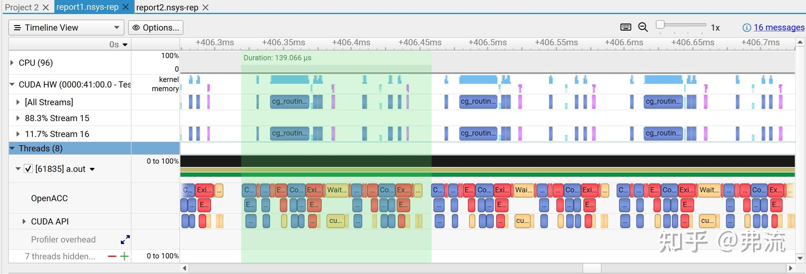
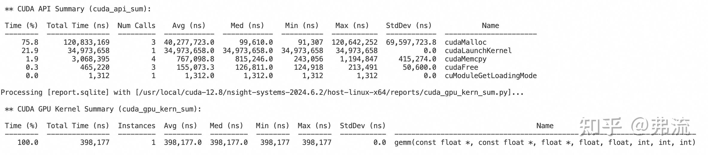
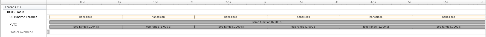
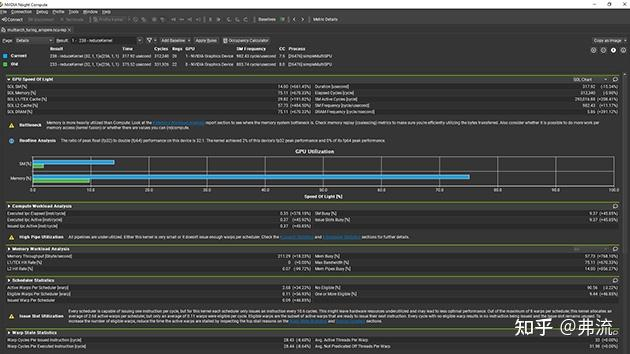
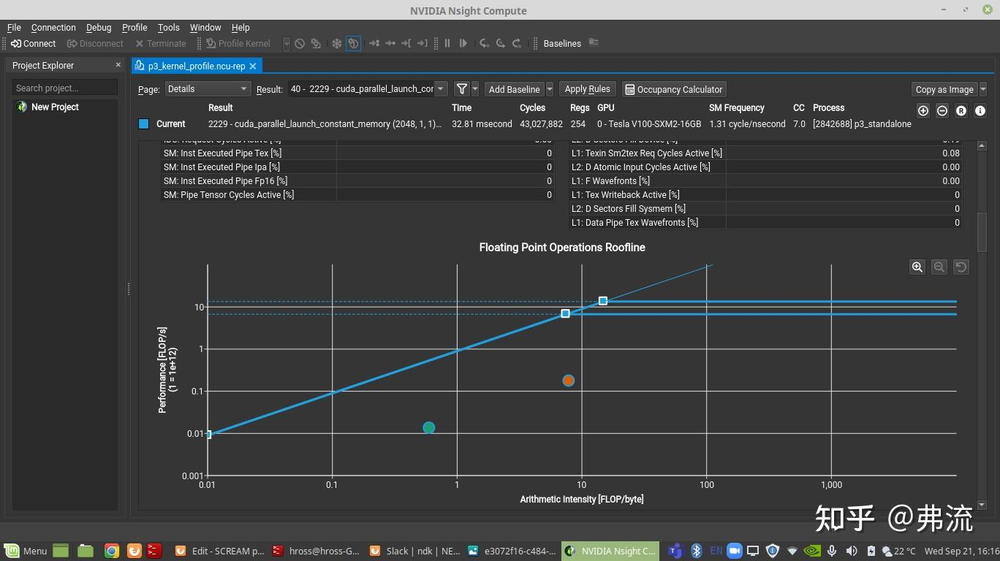
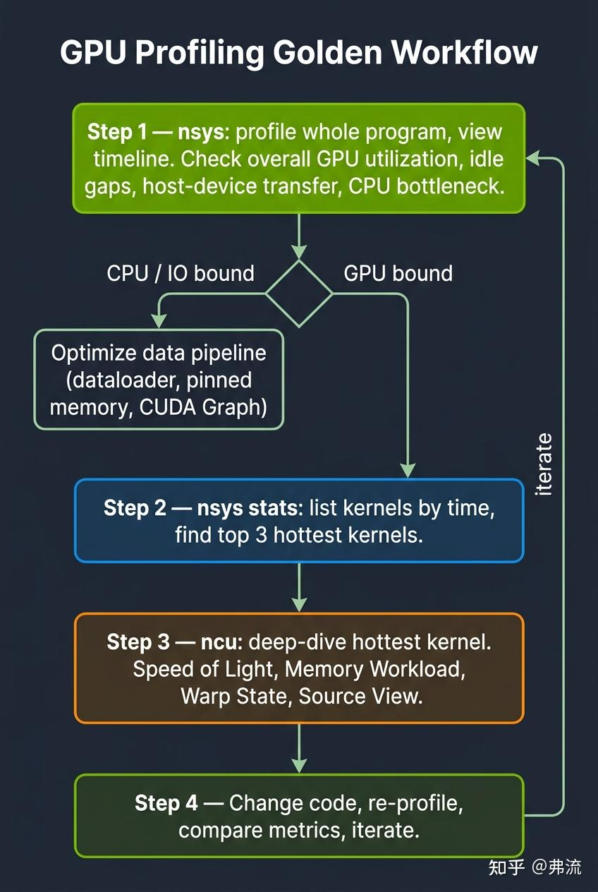

> 这篇文章是之前图解 CUDA 系列留的尾巴之一，不教你 nsys 和 ncu 有多少功能——官方文档写得比我详细。本文只解决一件事：**让你看到一个慢的 CUDA 程序，知道下一步该敲什么命令，该看哪个指标，该改什么代码。** 把“看 timeline → 定位瓶颈 → 优化验证”刻进肌肉记忆。

## 1. 一个常见错误：上来就 ncu

我见过太多人写 CUDA，profile 的第一反应是：

```bash
ncu --set full ./my_program
```

然后被几百个指标淹没，看着 Roofline 图、Warp State 表、Memory Throughput，完全不知道该从哪儿下手。最后退而求其次，只敢盯着“kernel 总时长”看，优化全凭直觉。

这种用法的本质问题是：**ncu 是用来深挖某个 kernel 内部细节的，它假设你已经知道要看哪个 kernel**。如果你连哪个 kernel 是瓶颈都不清楚，直接打开 ncu 就像不知道病在哪却直接做核磁共振——拿到一堆数据，但定位不了问题。

正确的姿势是：**先用 nsys 看全局时间线**，定位到值得深挖的 kernel，**再用 ncu 拆解**。

## 2. 一句话定位两个工具

> **nsys 是导航仪，ncu 是发动机诊断仪。**

- **Nsight Systems（nsys）**：系统级时间线，跨 CPU、GPU、CUDA API、cuDNN、NCCL，开销低，可全程跑。
- **Nsight Compute（ncu）**：单 kernel 微观分析，包含大量硬件指标，开销很高，只适合针对关键 kernel 深挖。

它们不是替代关系，而是**配合关系**。任何认真的 GPU 优化工作流，这两个工具都得用上，而且有先后顺序。

## 3. Nsight Systems：导航仪

### 3.1 nsys 能告诉你什么

nsys 帮你回答的是：**整个程序的时间花在哪里了**。

典型问题包括：

- CPU 和 GPU 在每个时刻分别在做什么。
- Kernel 启动顺序是什么，stream 之间是否真的并行。
- Host↔Device memcpy 占了多少时间。
- 各个 CUDA API、cuDNN、cuBLAS 调用的时序。
- 多 GPU 之间的 NCCL 通信开销。
- Python 解释器、PyTorch op 能否被 trace 到。
- 整个程序的瓶颈在 CPU 还是 GPU，有没有 GPU 空转间隙。

一个典型的 nsys timeline 长这样：



光是这张图，你就能直接看出：

- 是 CPU 拖了 GPU 后腿，还是 GPU 真的在算。
- 哪些 kernel 之间有间隙，可能是 launch overhead 或同步问题。
- 多 stream 是真的并行了，还是串行了。
- 通信是不是和计算 overlap 了。

### 3.2 nsys 命令速查

最常用的几个命令记住就够用：

```bash
# 基本用法：跑一遍程序，生成报告
nsys profile -o report ./my_program

# PyTorch 训练：加上 NVTX、cuDNN 等 trace
nsys profile -t cuda,nvtx,cudnn,cublas,osrt \
  --capture-range=cudaProfilerApi \
  -o train \
  python train.py

# 多 GPU 分布式
nsys profile -t cuda,nvtx,nccl \
  -o dist \
  mpirun -n 4 python dist_train.py

# 打开 GUI 看报告
nsys-ui report.nsys-rep

# 不想开 GUI，命令行直接看 kernel 时间排序
nsys stats --report cuda_gpu_kern_sum report.nsys-rep
```

最后那个 `nsys stats` 是个被低估的神器。以一个简单的 GEMM 为例，输出大概长这样：



**这就是你接下来用 ncu 深挖的目标清单**：从上往下，先 attention，再 layernorm，再 GEMM。不要凭直觉猜哪个 kernel 慢——让数据告诉你。

### 3.3 怎么读 nsys timeline

打开 GUI 后，几个关键观察点：

**第一眼：GPU 利用率条。** 顶部有个 GPU utilization 横条，显示某个时刻 GPU 在不在算东西。如果这条线**经常断**，说明 GPU 在空转，问题可能在 CPU，例如 DataLoader、Python 开销、Host 端同步等。

**第二眼：CUDA HW row。** 这里展示 GPU 上实际执行的 kernel。每个色块是一个 kernel，长度对应执行时间。如果你看到：

- **色块之间有明显空隙**：可能是 launch overhead 或 stream 同步问题。
- **某个色块特别长**：这就是你要用 ncu 深挖的 kernel。
- **多 stream 排成一行**：可能没并行起来，需要检查 stream 同步或依赖关系。

**第三眼：CUDA API row。** 这里展示 CPU 侧的 CUDA API 调用。如果你看到 `cudaMemcpy` 占了大量时间，说明 Host-Device 传输是瓶颈，可以考虑 pinned memory、`cudaMemcpyAsync`，或者提前把数据搬好。

**第四眼：NVTX ranges。** 如果你打了 NVTX 标记，就能按代码语义分段，直接看出 “forward 占 20ms，backward 占 30ms，optimizer 占 5ms”。NVTX 的价值，就是把无意义的 kernel 名字变成业务语义。

### 3.4 NVTX：让 timeline 真正可读

光看一堆 `Eigen::internal::generic_xxx` 这种 kernel 名，根本不知道对应业务的哪个阶段。在代码里插入 NVTX 标记，timeline 立刻变得可读。

C++ 示例：

```cpp
#include <nvtx3/nvToolsExt.h>
#include <thread>
#include <chrono>

void some_function() {
    nvtxRangePush(__func__);

    for (int i = 0; i < 6; ++i) {
        nvtxRangePush("loop range");
        std::this_thread::sleep_for(std::chrono::seconds{1});
        nvtxRangePop();
    }

    nvtxRangePop();
}
```



PyTorch 用户更省事，可以直接用内置 API：

```python
with torch.cuda.nvtx.range("forward"):
    output = model(input)

with torch.cuda.nvtx.range("backward"):
    loss.backward()
```

PyTorch profiler 也会自动给每个 op 加 NVTX 标记。**配合 nsys 用，你能看到从 Python 调用到 CUDA kernel 的完整链路**，这是其他工具给不了的视角。

## 4. Nsight Compute：发动机诊断仪

参考视频：[https://images.nvidia.cn/cn/youtube-replicates/04dJ-aePYpE.mp4](https://images.nvidia.cn/cn/youtube-replicates/04dJ-aePYpE.mp4)



### 4.1 ncu 能告诉你什么

ncu 帮你回答的是：**这个具体的 kernel 内部到底卡在哪**。它收集的指标非常细：

- 每条 SASS 指令的执行次数和 stall 原因。
- 寄存器用量、shared memory 用量、occupancy。
- L1、L2、DRAM 各级带宽和命中率。
- Warp scheduler 的发射率，即 issue slots busy。
- Roofline 图，即算访比和硬件上限的关系。
- Memory coalescing 效率，例如 sector utilization。
- Bank conflict 次数。
- Tensor Core 利用率。
- Source View：每行 CUDA、PTX、SASS 代码对应的指标。

但你不需要每次都看完所有这些。**90% 的优化只需要从 4 个 section 起步**。

### 4.2 必看的 4 个 section

#### 4.2.1 GPU Speed Of Light

这是最顶层的总览，直接告诉你这个 kernel 是 compute-bound 还是 memory-bound。重点看两个数字：

- **SM Utilization**：计算利用率。
- **Memory Throughput**：访存利用率。

哪个高，哪个更接近硬件上限，通常就说明瓶颈在哪。如果两个都低，通常是 latency-bound，scheduler 喂不饱，可能意味着 occupancy 或 ILP 不够。

#### 4.2.2 Memory Workload Analysis

这是访存全景图。关键指标包括：

- **L1 / L2 / DRAM 各级带宽和命中率**。
- **Sectors per request**：理想状态接近满载 cache line，太低说明访存不合并。
- **L1 hit rate / L2 hit rate**：命中率低说明 cache 复用差。

如果你的 kernel 是 memory-bound，问题十有八九要从这里开始找。

#### 4.2.3 Scheduler Statistics + Warp State Statistics

这两个 section 告诉你 warp scheduler 为什么发射不出指令：

- **Issued Warp Per Scheduler**：理想情况应尽量高，低说明 scheduler 经常没活可发。
- **Warp Cycles Per Issued Instruction**：每条指令发射前，warp 平均等了多少 cycle。
- **Stall reasons**：核心信息，说明 warp 到底卡在哪里。

常见 stall 原因：

- `Stall Long Scoreboard`：等待 global memory，通常说明访存太慢。
- `Stall Short Scoreboard`：等待 shared memory，常见原因是 bank conflict 或 shared memory 读写竞争。
- `Stall Barrier`：等待 `__syncthreads()`，通常说明同步太频繁或不同 warp 工作量不均。
- `Stall Wait`：等待指令依赖，常见原因是 ILP 不够。

**这个 section 的 stall 原因比 stall 次数重要 10 倍**。每种原因对应完全不同的优化方向。

#### 4.2.4 Source View

Source View 会把 CUDA 源码、PTX、SASS 三列对齐，每行旁边标注指标，例如指令次数、stall 次数、内存事务数。

**这是 ncu 最强大的功能之一，但很多人没用过。** 它能直接定位到是哪一行代码导致了非合并访存，或者哪个 `if` 分支引发了 divergence。要看 Source View，编译时必须带 `-lineinfo`，profile 时建议加 `--import-source yes`。

### 4.3 Roofline：一图判断瓶颈类型

Roofline 图是 ncu 的精华。横轴是 Arithmetic Intensity，即算访比（FLOP/Byte）；纵轴是实际算力（FLOPS）。



判断方式：

- Kernel 落在拐点左边：通常是 memory-bound，优化方向是**抬高 AI**，例如 tiling、数据复用、减少访存。
- Kernel 落在拐点右边：通常是 compute-bound，优化方向是**使用更高效的算法或硬件指令**，例如 Tensor Core、降精度等。

A100 的拐点 AI 大约是 12.5 FLOP/Byte（FP32）。如果你的算子 AI 低于这个，无论怎么优化访存模式，**带宽都可能是天花板**，必须想办法增加数据复用。

### 4.4 ncu 命令速查

```bash
# 全套指标：最详细，但最慢
ncu --set full -o report ./my_program

# 只看特定 kernel：强烈推荐，快很多
ncu -k regex:gemm.* --set full -o report ./my_program

# 只看某几个 section：更快
ncu --section MemoryWorkloadAnalysis \
  --section SchedulerStats \
  --section WarpStateStats \
  -o quick \
  ./my_program

# Roofline + Source View：分析单个 kernel 必备
ncu -k my_kernel \
  --set full \
  --import-source yes \
  -o detail \
  ./my_program

# 跳过前 N 次启动，从第 M 次开始 profile，避免 warmup 干扰
ncu -k my_kernel --launch-skip 10 --launch-count 1 ./my_program

# 打开 GUI
ncu-ui report.ncu-rep
```

编译时记得加 `-lineinfo`：

```bash
nvcc -lineinfo -O3 -arch=sm_80 my_kernel.cu -o my_program
```

没有 `-lineinfo`，ncu 的 Source View 是断的，只能看 SASS。

### 4.5 一个常被忽略的细节：kernel replay

ncu 的高开销不是来自“profile 慢”，而是来自 **kernel replay**。为了收集所有指标，ncu 会把你的 kernel **执行很多次**，每次收集不同指标。对于有副作用的 kernel，例如修改全局状态，这可能导致问题。

如果你的 kernel 是确定性的、纯计算的，replay 通常没问题。如果涉及随机数或外部状态，可能需要使用 `--replay-mode application`，让整个程序重跑，而不是只 replay 单个 kernel。

## 5. 黄金工作流：四步法

把上面所有内容串成一个流程，这就是肌肉记忆的核心：



四步法的核心是**自上而下，逐层细化**：

1. **第 1 步**：先判断是整体调度问题，还是 kernel 性能问题。
2. **第 2 步**：在 kernel 问题里找到最值得优化的目标。
3. **第 3 步**：深入这个 kernel，精确定位瓶颈类型。
4. **第 4 步**：验证优化效果，然后回到第 1 步迭代。

**最常见的错误顺序**：跳过第 1 步，上来就第 3 步。结果就是没定位到真正问题，优化了一个不重要的 kernel，整体没有提升。

## 6. 进阶技巧

### 6.1 CUDA Graph 配合 nsys

如果你的 kernel 很小但很多，典型表现是 launch-bound，nsys timeline 上会看到大量小色块紧密排列，kernel 之间还有间隙。

```bash
nsys profile --capture-range=cudaProfilerApi ./small_kernels
```

如果间隙总和不可忽略，可以考虑用 CUDA Graph 把多个 kernel 打包，一次 launch 多个 kernel，消除 launch overhead。改完之后，nsys 上你会看到色块贴得更紧，gap 消失或明显缩小。

### 6.2 PyTorch Profiler + Chrome Trace

PyTorch 自带的 profiler 可以输出 Chrome trace 格式，直接在 `chrome://tracing` 中查看，比 nsys 更适合分析 PyTorch 层面的 op。

```python
from torch.profiler import profile, ProfilerActivity

with profile(activities=[ProfilerActivity.CPU, ProfilerActivity.CUDA]) as prof:
    train_one_step()

prof.export_chrome_trace("trace.json")
```

不过对于真正的 CUDA-level 分析，nsys 还是更强。两者结合使用时，可以用 Chrome trace 看 op 级别，用 nsys 看 kernel 级别。

### 6.3 ncu 的 baseline 对比

ncu 支持把两次 profile 结果做对比，直接看指标差异：

```bash
ncu --set full -o before ./version1
ncu --set full -o after ./version2
ncu-ui  # 在 GUI 里 Add Baseline 后载入 after.ncu-rep
```

每个指标旁边会显示 `↑+30%` 之类的变化。**这是验证优化效果的标准姿势**，比口算靠谱得多。

### 6.4 命令行 stats 出汇总报告

不开 GUI 也能拿到完整统计：

```bash
# kernel 时间排序
nsys stats --report cuda_gpu_kern_sum report.nsys-rep

# memcpy 统计
nsys stats --report cuda_gpu_mem_size_sum report.nsys-rep

# CUDA API 调用统计
nsys stats --report cuda_api_sum report.nsys-rep

# 所有报告
nsys stats --report all report.nsys-rep
```

适合写在 CI 脚本里做性能回归检测。

## 7. 常见反模式

### 7.1 反模式一：profile 时跑得太短

有些算子在前几次执行时是 cold cache 状态，延迟特别长。如果只跑一次 profile，数据会失真。

建议至少 warmup 10 次，profile 时再跑 10 次取平均。ncu 的 `--launch-skip` 就是为这类场景准备的。

### 7.2 反模式二：用 Debug 编译跑 profile

`-G` 会关闭很多优化，profile 出来的结果跟 Release 完全不一样，参考价值很低。

正确做法是使用 `-O3` 编译，同时加 `-lineinfo` 保留源码映射信息，但不要关闭优化。

### 7.3 反模式三：一次改多处然后 profile

比如同时改 tile size、加 shared memory、调 occupancy，然后 profile 发现快了。但你不知道是哪一处带来的提升，也不知道哪一处其实拖了后腿。

正确做法是：**每次只改一件事，profile 验证，再改下一件。**

### 7.4 反模式四：只看时间，不看指标

“快了 20%” 不是终点，而是起点。你还需要看是哪个指标变化导致的：是 sector utilization 上去了，还是 occupancy 上去了，还是 Tensor Core 用上了。

**指标变化才是优化的因果链**，只看时间是结果论。

### 7.5 反模式五：无视 launch overhead

小 kernel（<10µs）的 launch overhead 可能比执行时间还长。这种情况下，优化 kernel 内部通常没有意义，要做的是 kernel fusion 或 CUDA Graph。

**nsys 上能直接看到 kernel 之间的间隙，这是判断 launch-bound 的关键。**

## 8. 总结：工作流口诀

把整篇文章压成几条记得住的口诀：

1. **先 nsys，后 ncu。** 没有例外。
2. **nsys 看时间线，ncu 看指标。** 时间线告诉你“哪儿”，指标告诉你“为什么”。
3. **ncu 只看 4 个 section 起步。** Speed of Light、Memory Workload、Warp State、Source View。其他指标遇到具体问题再深挖。
4. **Stall 原因比 stall 次数重要。** Long Scoreboard 是 global memory，Short Scoreboard 是 shared memory，Barrier 是 sync 太多，Wait 是 ILP 不够。
5. **一次只改一件事，profile 验证。** ncu baseline 对比功能是标配。
6. **编译加 `-lineinfo` 和 `-O3`，运行加 NVTX。** 工具用起来才有意义。
7. **Profile 不是检查作业，而是引导诊断。** 从全局到局部，每一步都在缩小问题范围。

掌握这套工作流之后，你看 CUDA 程序的眼光会完全不一样。不再是“我猜这里慢”，而是“数据告诉我这里慢，原因是 X，改 Y 应该能优化”。这就是从 CUDA 入门到入味的关键一步。

CUDA 优化里有个共识：**会写 kernel 不算什么，会 profile 才是真功夫**。因为 kernel 的写法可以学，但找到正确的优化方向、判断改完之后是不是真的有用，需要工具支持。nsys 和 ncu 就是你的眼睛和听诊器，不会用，优化就是闭着眼睛开车。

下次再看到性能问题，先打开 nsys。

## 参考资料

- [https://zhuanlan.zhihu.com/p/691307737](https://zhuanlan.zhihu.com/p/691307737)
- Nsight Systems User Guide：[https://docs.nvidia.com/nsight-systems/UserGuide/index.html](https://docs.nvidia.com/nsight-systems/UserGuide/index.html)
- Mastering Nvidia Nsight GPU Profiling：[https://www.youtube.com/watch?v=o-etY6VLHZo](https://www.youtube.com/watch?v=o-etY6VLHZo)
