## 引言

nsys 的使用对性能优化来说非常重要，但很长一段时间以来，只是会简单抓取，**很难有效定位**，或是分析什么有效信息，也没有找到太好的教程。不过因为用的比较多，磕磕绊绊大约 nsys 吃的也差不多了。当然更高阶的用法还需要继续学习，当前把一些理解分享一下。

## 第一章：Nsight Systems 介绍

### 1.1 GPU 性能分析工具生态概览

CUDA 生态除了开箱即用的算子库以及各类训练推理框架，还包括一些非常易用的性能优化工具。

由下图可见，当前在 CUDA 生态下，NVIDIA 从 IDE debug 工具、profile 工具，到 Libraries API 深入底层，有一整套性能分析工具。


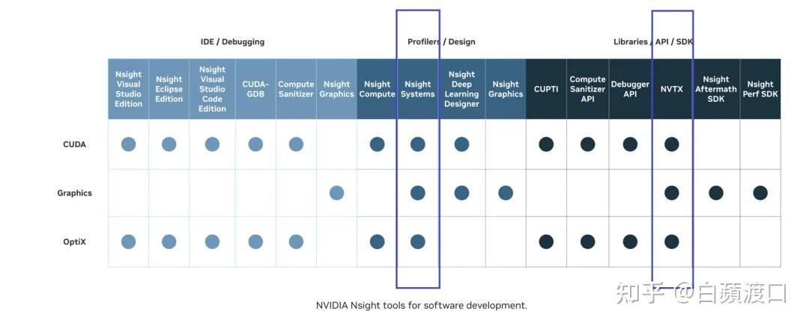


### 1.2 Nsight Systems 核心能力

NVIDIA Nsight Systems 是一款跨平台性能分析工具，旨在帮助开发者深入理解应用程序和系统的性能瓶颈，特别是在 GPU 计算、多线程和分布式应用场景中。它支持多种 API 跟踪、CPU/GPU 采样、上下文切换跟踪以及系统层面的事件采集。

| 功能类别 | 主要内容 | 作用 / 价值 |
| --- | --- | --- |
| ① GPU Timeline 完整视图 | CUDA API 调用时序<br>GPU Kernel 执行时间线<br>Memory Transfer 可视化<br>Stream 并发情况 | 展示 GPU 上的执行全貌，帮助定位 Kernel 重叠度、数据传输与计算的重叠情况 |
| ② CPU-GPU 交互分析 | Host–Device 数据传输瓶颈识别<br>CPU 等待 GPU 的空闲时间<br>异步调用效率分析 | 揭示 CPU 与 GPU 协同是否高效，发现数据传输或同步点带来的性能损耗 |
| ③ 多层次性能指标 | GPU 利用率统计<br>Memory 带宽利用率<br>Kernel Launch 开销<br>Context Switch 分析 | 提供量化指标，帮助分析算力使用是否饱和、是否存在频繁小 Kernel 等低效模式 |
| ④ 系统资源监控 | GPU 温度 / 功耗<br>PCIe 带宽使用情况<br>多 GPU 系统的负载均衡 | 从硬件维度辅助性能调优，避免功耗过高、PCIe 拥塞或 GPU 负载不均衡 |
| ⑤ 第三方库透明分析 | cuDNN、cuBLAS 等库性能<br>自定义 CUDA kernel 性能<br>驱动层面的性能瓶颈 | 无需修改库源码即可分析性能，定位到算子级 / kernel 级瓶颈，区分是库问题还是自定义代码问题 |

### 1.3 采集与分析流程

1.  **平台支持**

    Nsight Systems（nsys）是跨平台工具，支持 **Windows、Linux、macOS**，提供对应的 CLI 和 GUI 版本。

2.  **数据采集**

    -   使用 nsys CLI 工具在目标环境（服务器 / 多 GPU 系统）上运行程序，收集性能数据。
    -   生成 `.nsys-rep` 或旧版本的 `.qdrep` 报告文件。

3.  **数据分析**

    -   将生成的 trace 文件拷贝到个人 PC 或分析工作站。
    -   使用 nsys GUI 工具加载文件，可视化分析 **GPU 时间线、CPU-GPU 交互、内存传输、Kernel 执行、库函数性能** 等。
    -   可进行筛选、放大关键阶段、对比不同运行配置等操作。

### 1.4 安装方式

默认安装 CUDA Toolkit 的时候，nsys 也会一并安装，但是大部分问题定位是在 Docker 中，训练镜像可能没有 nsys 组件，就需要手动去下载。

需要注意的是，Ubuntu 系统安装 deb 包，RHEL 系列系统安装 rpm 包。

并且需要与当前 Docker 下的 CUDA 环境发布时间基本一致，**否则会有兼容性问题**。

假设当前 Docker 中使用 CentOS 7、CUDA 11.8，考虑到 CUDA 11.8 于 2022 年 12 月发布，则需要安装 2023 年 1 月发布的命令行版本 rpm 包（避免缺失 GUI 依赖库导致报错）。


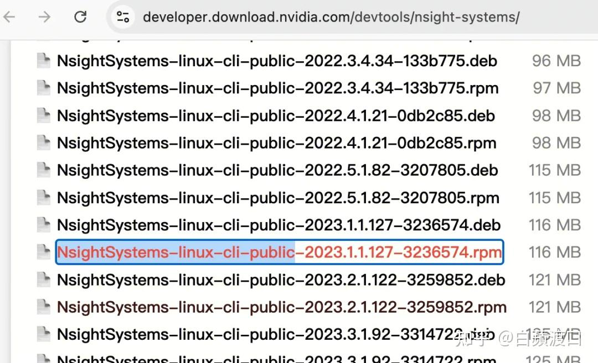


> nsys 下载地址如下：
> [https://developer.download.nvidia.com/devtools/nsight-systems](https://developer.download.nvidia.com/devtools/nsight-systems)

## 第二章：Nsight Systems Profile 使用指南

### 2.1 采集模式对比

**nsys 提供两种性能抓取方式：**

#### 直接 Profile 模式

-   在命令行中预先指定要抓取的内容，以及起止条件（如持续时间、直到程序结束）。
-   工具会在达到条件时自动停止抓取。
-   **优点**：简单易用，适合全流程或确定阶段的性能采集，无需人工干预。
-   **缺点**：缺乏灵活性，无法根据程序实际运行情况临时调整抓取时机，容易产生无关数据或错过关键片段。

#### 交互式 Launch 模式

-   通过 `nsys launch` 启动目标进程，在另一终端中手动触发开始/结束。
-   可以在观察到程序运行状态后，再选择具体时段进行抓取。
-   同一个 session 可以交互式抓取多次。
-   **优点**：更灵活，能针对性捕捉不同阶段的性能数据，减少无效数据采集，文件体积也更小。
-   **缺点**：需要人工干预，操作复杂度更高，不适合无人值守或批量任务。

如果明确知道要分析的阶段，且希望流程自动化，推荐使用 **直接 profile**。

如果想在程序运行过程中观察状态，并灵活抓取关键时段，则 **交互式 profile** 更合适。

⚠️无论用哪种模式，收集时间尽量控制在 1min 以内，否则太大无法分析。

### 2.1.1 Profile 模式 vs Launch 模式

**Profile 模式**

```bash
# profile 模式：启动并分析新进程
nsys profile torchrun train.py
```

**参数说明：**

用 torchrun 代指实际的训练启动命令。

当前启动之后，nsys 会在 train.py 进程结束之后生成一个 nsys-rep 后缀的文件。

**Launch 模式**

```bash
# 先启动任务
nsys launch torchrun train.py

# 新开一个窗口，查看 session 状态
nsys status

# 手动开始 / 结束抓取
nsys start
nsys stop
```

### 2.1.2 关键参数配置详解

详细参数可见，有很多开关，这里仅仅常用收集参数。

官方文档：[https://docs.nvidia.com/nsight-systems/UserGuide/index.html](https://docs.nvidia.com/nsight-systems/UserGuide/index.html)

一般来说，使用如下命令收集：

```bash
nsys profile \
  --trace cuda,osrt,nvtx,cudnn,cublas \
  --gpu-metrics-device=all \
  --duration=60 \
  --delay=120 \
  --cuda-memory-usage true \
  --output profile_log \
  torchrun train.py
```

参数说明：

-   `--trace cuda,osrt,nvtx,cudnn,cublas`：指定收集内容，默认通常包含 `cuda`、`opengl`、`nvtx`、`osrt`。
-   `--gpu-metrics-device=all`：收集 GPU 相关指标。
-   `--duration=60`：采集 60 秒。
-   `--delay=120`：延迟 120 秒后开始采集。
-   `--cuda-memory-usage true`：记录显存使用情况。
-   `--output profile_log`：指定输出路径和文件名前缀。

**⚠️注意事项**

1.  **延迟视情况而定**：比如训练在 30 分钟之后进入稳定阶段，就需要延迟约 1800s
2.  收集时间不宜过长，控制在 **60s 之内**
3.  默认输出路径为当前路径，建议更改到有权限的输出目录，避免写到 `/tmp` 或无权限路径导致保存失败
4.  如果输出路径是多节点共享存储，**输出文件名要带 hostname、rank 或时间戳**，否则多进程可能互相覆盖
5.  假设平台调度，存在某一个 pod 写完其他 pod 会被杀死的情况，建议使用 launch 方式收集
6.  ⚠️注意 CPU 权限配置，如果非管理员权限采集 CPU 详细信息，需要修改系统配置

```bash
echo 0 | sudo tee /proc/sys/kernel/perf_event_paranoid
```

### 2.2 NVTX 标记技巧

**NVTX（NVIDIA Tools Extension）** 是 NVIDIA 提供的一套标注工具接口。

它允许开发者在代码中插入 **标记（marker）** 或 **区间（range）**，用来标识某段逻辑或操作。

在使用 **nsys** 进行性能分析时，这些标记会显示在时间轴上，方便开发者快速定位和分析程序的关键阶段。

如下图所示，可以清晰地看到程序每一步运行所在的状态。


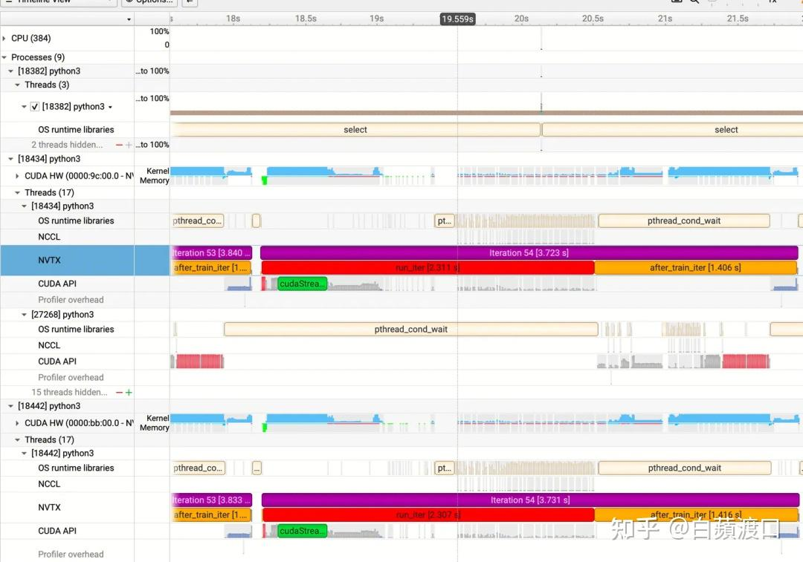


### 2.2.1 Python 中的 NVTX 使用

安装 `nvtx`：

```bash
pip install nvtx
```

主要使用方式：

```python
import nvtx


@nvtx.annotate("data_loading", color="blue")
def load_data():
    # 数据加载逻辑
    pass


# 上下文管理器
with nvtx.annotate("backward_pass", color="red"):
    loss.backward()


# 手动标记方式 1
range_id = nvtx.start_range("my_code_range", domain="my_domain")
loss.backward()
nvtx.end_range(range_id)


# 手动标记方式 2
nvtx.push_range("my_code_range", domain="my_domain")
model.train()
nvtx.pop_range(domain="my_domain")
```

新版的 nvtx 还提供了两种自动注解函数名字的方式：

```python
# 直接在代码中使用 nvtx.Profile()
import time
import nvtx

pr = nvtx.Profile()
pr.enable()
time.sleep(1)
pr.disable()
time.sleep(1)
```

也可以将 `nvtx` 作为命令行工具调用，不改源码即可自动给函数加标记：

```bash
python -m nvtx script.py
```

同时新版 nsys 可以自动为 PyTorch autograd 添加 NVTX 标记：

```bash
nsys profile --pytorch=autograd-nvtx python train.py
```


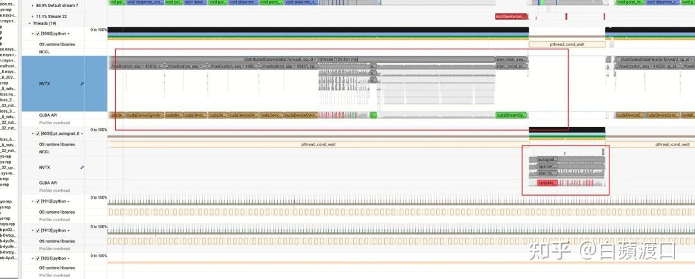


## 第三章：Nsight Systems 分析指南

抓取 **Nsight Systems (nsys)** 的结果本身并不复杂，真正的挑战在于 **如何进行有效分析** —— 如何从繁杂的信息中快速定位性能瓶颈，进一步找到问题的根因。

本章将从以下三个方面展开：

1.  **CPU-GPU 协同的编程范式**

    介绍 CPU 与 GPU 协同工作的基本原理和常见模式，为后续性能分析提供理论背景。

2.  **Nsight Systems GUI 功能**

    -   讲解 GUI 中可视化分析的核心数据类型，例如 GPU 时间线、CPU-GPU 交互、Kernel 执行、内存传输、库函数性能等。
    -   演示如何通过筛选关键阶段、放大重点区间、对比不同运行配置来发现问题。

3.  **Nsight Systems Profile 分析流程**

    -   总结常见的分析切入点和方法论。
    -   说明如何从全局视角入手，逐层下钻，最终定位性能瓶颈与根因。

### 3.1 CPU–GPU 协同的编程范式

在深度学习训练或推理中，**CPU 与 GPU 协同执行是性能分析的基础**。理解这一协同机制对于优化深度学习系统性能至关重要。通常流程可以拆解为以下几个层次：

### 3.1.1 应用层（Python / PyTorch）

**用户代码层面：** 大多数深度学习逻辑写在 Python 层（如 nn.Module、loss.backward()），这层代码主要负责模型定义、训练循环控制和数据流管理。

**框架调度层面：** PyTorch 作为中间层，封装了底层算子调用，通过 C++ ATen 库和 CUDA Runtime 将高级操作转换为具体的 GPU kernel 调用。每个 PyTorch 操作（如 torch.matmul、torch.relu）会被分解为一个或多个 CUDA kernel。

**关键理解：**

-   Python 代码本身永远不在 GPU 上运行
-   每次张量操作都会触发 kernel launch 开销，频繁的小操作会导致性能损失
-   算子融合（operator fusion）可以减少 kernel 启动次数，提升整体性能

### 3.1.2 Host 与 Device 的内存模型

在 GPU 编程中，Host 一般代指 CPU 及其相关资源，Device 一般代指 GPU 及其相关资源。理解两者的内存特性和数据传输机制是性能优化的关键。

#### 内存架构对比

**Host Memory（CPU 内存，DDR）**：

-   **数据源头**：DataLoader 首先将批次数据从存储设备加载到系统内存
-   **代码执行**：存储模型代码、Python 解释器、深度学习框架逻辑等运行时环境
-   **容量特点**：容量大（通常 64-512GB），成本相对较低
-   **性能特点**：访问延迟较高（~100-300ns），带宽相对有限（~100GB/s）
-   **适用场景**：数据预处理、存储、控制逻辑执行

**Device Memory（GPU 显存，HBM）**：

-   **计算要求**：**GPU 所有计算必须在显存中完成**，这是 GPU 架构的硬性要求
-   **容量限制**：容量相对有限（通常 16-80GB），成本较高，是深度学习模型规模的重要约束
-   **性能优势**：**超高带宽**（~4TB/s），低延迟访问，专为并行计算优化
-   **存储内容**：模型参数、输入数据、中间激活值、梯度、优化器状态等训练/推理所需的所有数据

### 3.1.3 数据传输路径

现代深度学习系统中的数据传输主要包含三种模式：

**H2D (Host-to-Device) 传输**：

-   **传输内容**：训练数据、模型参数、配置信息从 CPU 内存传输到 GPU 显存
-   **典型场景**：批次数据上传、模型权重初始化、超参数传递
-   **性能瓶颈**：PCIe 带宽限制（~32GB/s），通常是训练流水线的主要瓶颈
-   **优化策略**：Pinned Memory、异步传输、数据预取

**D2H (Device-to-Host) 传输**：

-   **传输内容**：训练结果、损失值、模型检查点从 GPU 显存传输到 CPU 内存
-   **典型场景**：损失值回传、模型保存、中间结果验证、调试信息提取
-   **频率特点**：通常频率较低，但对调试和监控至关重要
-   **注意事项**：会触发 GPU-CPU 同步，可能打断训练流水线

**D2D (Device-to-Device) 传输**：

-   **传输内容**：GPU 间直接数据交换，bypass CPU 和系统内存
-   **典型场景**：
    -   **分布式训练**：梯度同步（AllReduce）、参数广播（Broadcast）
    -   **模型并行**：不同 GPU 负责模型的不同部分，需要交换中间激活
    -   **数据并行**：多 GPU 间的负载均衡和结果聚合

-   **技术实现**：
    -   **NVLink**：NVIDIA GPU 间的专用高速互联（~600GB/s），NVSwitch 支持多 GPU 全连接的交换矩阵
    -   **RDMA**：跨节点的高速网络互联

-   **性能优势**：带宽远高于 PCIe，延迟更低，是大规模分布式训练的基础

### 3.1.4 Stream 并发与 CPU↔GPU 协作

#### CUDA Stream 机制

**Stream 概念**：CUDA Stream 是 GPU 上的 **任务执行队列**，保证队列内任务按顺序执行：

-   CPU 将任务（kernel 启动、内存拷贝、同步操作）提交到指定 Stream
-   **Stream 内串行，Stream 间并行**：不同 Stream 上的任务可以并发执行
-   默认使用 `default stream`，也可创建多个用户 Stream

#### 执行模式对比

**异步模式（默认推荐）**：

```python
# CPU 提交任务后立即返回，不等待 GPU 完成
x_gpu = x.cuda(non_blocking=True)  # 异步内存拷贝
y = torch.matmul(x_gpu, w)         # 异步 kernel 启动
z = torch.relu(y)                  # 异步 kernel 启动
```

**优势**：

-   CPU 将任务提交到 Stream 后 **立即返回**，可以并行准备下一个 batch
-   GPU 在后台执行， **CPU 与 GPU 时间重叠**
-   数据传输和计算可以在不同 Stream 上并发， **提升整体利用率**

**同步模式（阻塞调用）**：

```bash
export CUDA_LAUNCH_BLOCKING=1  # 环境变量强制同步
```

**特点**：

-   强制 CPU 等待每个 GPU 操作完成
-   **CPU 与 GPU 都失去并行性**，性能显著下降
-   主要用于 **调试定位错误**（便于确定具体哪个 kernel 出错）

由于 **默认异步执行**，CPU 可能在 GPU 尚未完成计算时就继续执行后续代码，导致：

-   **数据竞争**：访问尚未计算完成的结果
-   **时序错误**：依赖关系被破坏
-   **错误的性能测量**：计时不准确

#### 常用同步方式

**PyTorch 同步 API**：

```python
torch.cuda.synchronize()        # 等待当前设备上所有 Stream 完成
torch.cuda.synchronize(device)  # 等待指定设备完成
```

**CUDA 原生同步**：

```python
import pycuda.driver as cuda

cuda.Context.synchronize()  # 等待当前 context 完成
stream.synchronize()        # 等待特定 stream 完成
```

**隐式同步场景**：

-   **数据回传**：`.cpu()` 或 `.numpy()` 会触发隐式同步
-   **跨设备操作**：不同 GPU 间的数据拷贝
-   **Host 端访问**：`tensor.item()` 获取标量值

#### 典型应用场景

**精确计时 Benchmark**：

```python
torch.cuda.synchronize()
start_time = time.time()

result = model(input_data)

torch.cuda.synchronize()  # 确保计算完成
end_time = time.time()
```

**调试错误定位**：

```python
# 每个操作后同步，精确定位出错位置
x = torch.matmul(a, b)
torch.cuda.synchronize()  # 如果上一行出错，这里会抛出异常
```

### 3.1.5 GPU 计算模型

#### Kernel 执行机制

**Kernel Launch 过程**：

-   CPU 通过 CUDA Runtime API（如 `cudaLaunchKernel`）启动 kernel
-   配置执行参数：grid 维度、block 维度、shared memory 大小等
-   **异步提交** 到 GPU 执行队列，CPU 可立即返回继续执行

#### 大规模并行架构

**线程层次结构**：

-   **Thread**：最小执行单元，每个线程处理一个数据元素
-   **Warp**：32 个线程为一组，SIMD 执行（单指令多数据）
-   **Block**：多个 warp 组成，共享 shared memory 和同步原语
-   **Grid**：多个 block 组成，对应一次 kernel 启动

**调度特点**：

-   GPU 拥有数千个 CUDA core，可同时执行 **数万个线程**
-   **warp 级调度**：当一个 warp 等待内存访问时，调度器切换到其他 warp
-   通过 **大量线程掩盖访存延迟**，实现高吞吐量计算

#### 内存层次结构

**显存（HBM - High Bandwidth Memory）**：

-   存放模型参数、输入数据、中间激活、梯度等
-   带宽极高（~1TB/s）但延迟相对较大（~300-500 cycles）

**L2 Cache**：

-   所有 SM（Streaming Multiprocessor）共享
-   容量通常几 MB，用于缓存频繁访问的数据

**Shared Memory**：

-   Block 内线程共享的快速存储（~100 cycles 延迟）
-   容量小（48-164KB），需要程序员手动管理

**寄存器文件**：

-   线程私有，延迟最低（1-2 cycles）
-   数量有限，寄存器不足会导致 `spill` 到显存

### 3.1.6 常见性能瓶颈与优化策略

#### Host-Device 传输瓶颈

**问题表现**：

-   PCIe 带宽利用率高（>80%）
-   GPU 计算单元空闲等待数据

**优化策略**：

-   **启用 pinned memory**：`DataLoader(pin_memory=True)`
-   **异步数据传输**：使用多个 Stream 并发传输
-   **数据预处理前移**：在 GPU 上进行数据增强
-   **减少传输频率**：增大 batch size，减少传输次数

#### CPU 成为瓶颈

**问题表现**：

-   CPU 利用率持续高位
-   GPU 利用率波动，出现周期性空闲

**根本原因**：

-   **Python GIL 限制**：单线程执行限制
-   **数据加载慢**：磁盘 I/O 或预处理复杂
-   **频繁同步**：过多的 `.cpu()` 或显式同步调用

**优化策略**：

-   **多进程 DataLoader**：`DataLoader(num_workers=4-8)`
-   **数据缓存**：使用 SSD 或内存缓存训练数据
-   **减少同步点**：避免不必要的 CPU-GPU 同步
-   **JIT 编译**：`torch.jit.script` 减少 Python 解释开销

#### Kernel 启动开销过大

**问题表现**：

-   大量小 kernel（执行时间 < 10μs）
-   GPU timeline 呈现“锯齿状”，kernel 间空隙明显

**优化策略**：

-   **算子融合**：将多个操作合并为单个 kernel
-   **向量化操作**：使用张量运算替代循环
-   **批处理**：增加单次操作的数据量
-   **Graph 模式**：torch.fx 或 torch.jit 进行计算图优化

#### Stream 并发不足

**问题表现**：

-   GPU timeline 存在明显“空洞”
-   数据传输与计算无法重叠
-   多 GPU 系统中存在负载不均

**优化策略**：

-   **多 Stream 设计**：分离计算、通信、数据传输
-   **Pipeline 并行**：多个 batch 流水线处理
-   **异步执行**：避免不必要的同步操作
-   **负载均衡**：合理分配任务到不同 Stream

### 3.2 Nsight Systems GUI 功能

很多同学抓完 nsys 之后，因为对 Nsight Systems GUI 不太熟悉，无从下手，不知道该从哪里看。本节会从界面功能开始介绍，说明应该重点关注哪些信息。

### 3.2.1 Nsight Systems GUI 界面解析

将抓取好的 `.nsys-rep` 文件拖入 GUI 后，界面主要分为三个功能区域。需要特别注意的是，GUI 版本必须高于或等于 CLI 版本才能正常打开和解析文件。


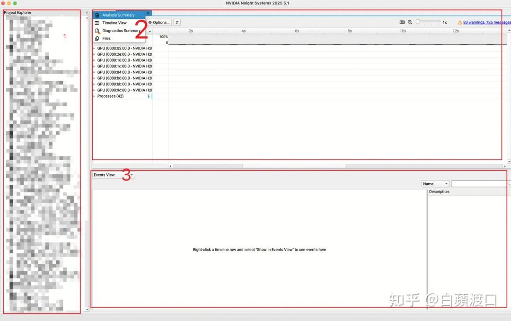


#### 区域 1：历史记录区

主要显示过往打开过的性能分析文件，属于历史记录和快速访问区域。该区域会保存最近使用的项目文件路径，方便用户快速重新加载之前的分析结果，日常性能分析中无需过多关注。

#### 区域 2：主功能导航区

##### Analysis Summary（分析总览）

对整体性能进行全面总结，是性能分析的起始点：

-   软硬件信息：CPU 型号、GPU 规格、内存容量、CUDA 版本等系统配置
-   环境变量：影响性能的关键环境设置（如 `CUDA_VISIBLE_DEVICES`、`OMP_NUM_THREADS` 等）
-   进程与线程统计：不同线程的数量分布和执行特征
-   CPU 利用率概览：整体 CPU 使用情况和负载分布
-   GPU 利用率摘要：GPU 计算单元、内存带宽的整体使用效率

这是一个非常实用的性能概览面板，建议每次分析时首先查看。

##### Timeline View（时间线视图）

最核心的 CPU-GPU 协作时间线，是性能瓶颈分析的主战场：

-   多层时间线：CPU 线程、GPU Stream、内存传输等多维度并行展示
-   事件可视化：kernel 执行、API 调用、内存拷贝等事件的时序关系
-   交互式缩放：支持时间轴的放大缩小，精确定位性能热点
-   依赖关系：直观显示 CPU-GPU 间的同步点和数据依赖

这是分析性能瓶颈的核心视图，大部分性能问题都能在此找到答案。

##### Diagnostics Summary（诊断摘要）

显示抓取过程中的技术细节：

-   进程注入信息：profiling 工具如何附加到目标进程
-   采样配置：数据收集的频率和范围设置
-   系统状态：抓取期间的系统资源状态
-   错误或警告：数据收集过程中遇到的问题

实用性相对较小，主要用于排查 profiling 工具本身的问题。

##### Files（文件管理）

列出抓取到的各类信息文件：

-   原始数据文件：底层性能计数器数据
-   处理后的报告：各种格式的分析结果
-   导出选项：支持将特定数据导出为 CSV、JSON 等格式
-   文件大小统计：帮助理解数据收集的完整性

可根据具体分析需求进行查看或导出，便于后续深入分析或报告生成。

#### 区域 3：详细分析区（仅在 Timeline View 下激活）

当选择 Timeline View 后，区域 3 会动态显示多个专业分析面板：


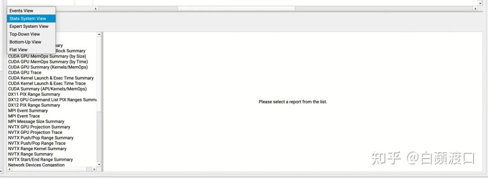


##### Event View（事件视图）

分析当前选中时间区间内的具体事件：

-   事件列表：详细显示选中时间段内发生的所有操作
-   事件属性：每个事件的持续时间、参数、返回值等详细信息
-   过滤功能：可按事件类型、持续时间等条件筛选
-   统计信息：事件频次、平均耗时等聚合数据

##### System Status View（系统状态视图）

汇总各种性能指标与系统状态：

-   资源利用率：实时 CPU、GPU、内存使用情况
-   温度和功耗：硬件运行状态监控
-   带宽利用率：PCIe、内存带宽的使用效率
-   队列深度：GPU Stream 和 CPU 任务队列状态

这是性能瓶颈定位的重要参考面板。

##### Expert System View（专家系统视图）

AI 驱动的性能优化建议引擎：

-   瓶颈识别：自动检测 CPU idle、GPU underutilization 等问题
-   优化建议：针对不同性能问题给出具体的代码级优化建议
-   最佳实践：基于检测到的模式推荐行业最佳实践
-   量化分析：给出优化后的预期性能提升幅度

对于性能优化新手特别有价值。

##### Top-Down View / Bottom-Up View（调用堆栈分析）

Top-Down View（自顶向下）：

-   从程序入口开始，逐层展示函数调用关系
-   适合理解程序整体执行流程和主要时间消耗
-   便于识别高层次的性能瓶颈

Bottom-Up View（自下向上）：

-   从最底层的 kernel 或函数开始，向上聚合调用关系
-   适合定位具体的性能热点函数
-   便于发现被多处调用的共同瓶颈

这两个视图互为补充，用于深入分析函数调用路径及精确定位性能瓶颈。

##### Flat View（平面视图）

显示各函数或事件的扁平化统计信息：

-   执行时间排序：按照总耗时或平均耗时排列函数
-   调用频次统计：显示每个函数的调用次数
-   性能热点标识：快速识别最耗时的操作
-   比例分析：各函数在总执行时间中的占比

便于快速定位性能热点，是性能优化的重要入口。

**使用建议**：建议按照 Analysis Summary → Timeline View → System Status View → Expert System View → Event View 的顺序进行分析，从宏观到微观，从概览到细节，逐步深入性能瓶颈的根因。

### 3.2.2 Timeline View 操作介绍

#### 内容概览

在选择 **Timeline** 视图后，**区域 2** 会呈现三栏内容：

-   **CPU**：展示进程在 CPU 上的分布情况。
-   **GPU**：由于开启了 GPU Metric，可以看到部分 GPU 硬件指标。
-   **Processes**：显示训练的主进程以及数据加载进程。当前是单机八卡训练，也就是说有 8 个训练主进程和 n 个 dataset worker。

当我们展开某个 **Processes** 项时，**区域 2.2** 会进一步分为两栏：

-   **CUDA HW**：对应 GPU 侧的执行情况，包含 **Stream**（任务队列）和 **Kernel**（实际在 GPU 上执行的计算任务）。
-   **Threads**：对应 CPU 侧的执行情况，主要展示 Python 中的线程活动。


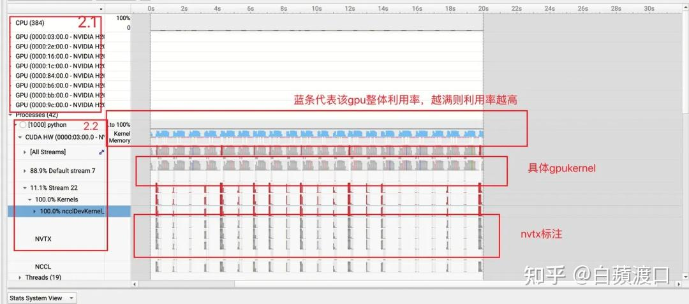


**OS Runtime Library（操作系统运行时库）**指由 CPU 发起并在 CPU 上执行的系统级操作，包括线程管理、内存分配、文件 I/O 等基础系统调用。

**CUDA HW（CUDA 硬件层）** 指实际在 GPU 硬件上执行的计算操作，主要包括各种 CUDA kernel 的执行过程，这些操作直接利用 GPU 的并行计算能力。

**CUDA API（CUDA 应用程序接口）** 指由 CPU 发起、用于操控 GPU 的接口调用，如内存分配（`cudaMalloc`）、数据传输（`cudaMemcpy`）、kernel 启动等操作。这些 API 在 CPU 上执行，但其目的是管理和调度 GPU 资源。

简而言之：

-   **OS Runtime Library**：CPU → CPU，系统操作。
-   **CUDA HW**：GPU → GPU，实际计算。
-   **CUDA API**：CPU → GPU，GPU 管理。

#### 操作方式

1.  **时间维度缩放**

    -   **缩放操作**：将鼠标悬停在 Timeline 视图后，**按住 Cmd 键（Mac）或 Ctrl 键（Windows/Linux）+ 滚轮滚动**，可以对时间轴进行精确缩放。
    -   **缩放中心**：缩放会以鼠标当前位置为中心点进行，便于快速定位到感兴趣的时间段。
    -   **缩放范围**：支持从毫秒级到纳秒级的多层次缩放，满足不同粒度的性能分析需求。

2.  **聚焦分析**

    -   **Filter & Zoom In**：选定区域后可以**过滤并放大到当前区域**，专注分析特定时间段的性能表现。
    -   **上下文保持**：放大后仍可通过导航操作查看相邻时间段的上下文信息。

3.  **Y 轴缩放**

    -   **垂直缩放**：右上角的**加减号按钮**可以控制 Y 轴方向的显示密度。
    -   **适应内容**：当进程或线程数量较多时，可以通过 Y 轴缩放调整显示效果。
    -   **层级管理**：帮助在复杂的多进程、多线程场景下保持界面清晰。


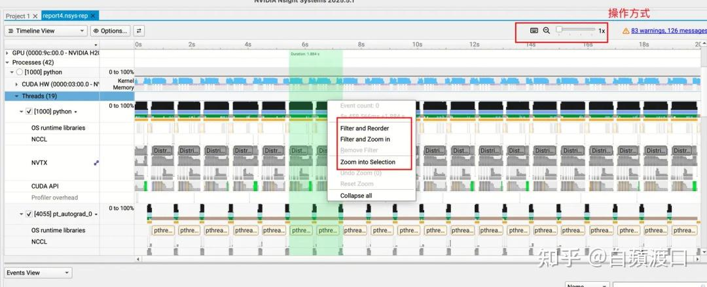


#### System Status View

这里会有各类统计信息，非常关键，可以着重去分析，这里取两个例子来说明。

**GPU Kernel Summary**：这里会统计所有在 GPU 上执行的 kernel。可以看到当前训练程序有 50% 的时间都在处理前两个算子，因此可以优先考虑优化这部分。


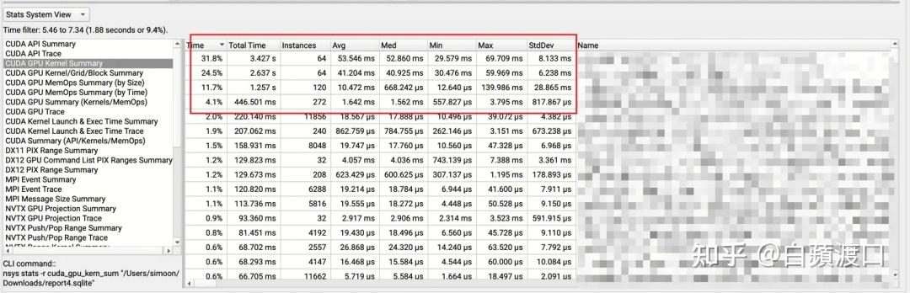


同时关注到 **CUDA API Summary** 中，`cudaDeviceSynchronize` 占比 53.9%，意味着超过一半的执行时间消耗在设备同步上。它调用了 256 次，平均每次 23.7ms，说明程序中存在频繁的强制同步。

这个 API 会强制 CPU 等待 GPU 完成所有操作，破坏 CPU-GPU 异步执行优势。常见来源包括代码中过多使用 `.cpu()`、`.numpy()`、`.item()` 等隐式同步操作，或者调试代码中的显式 `torch.cuda.synchronize()` 未清理。


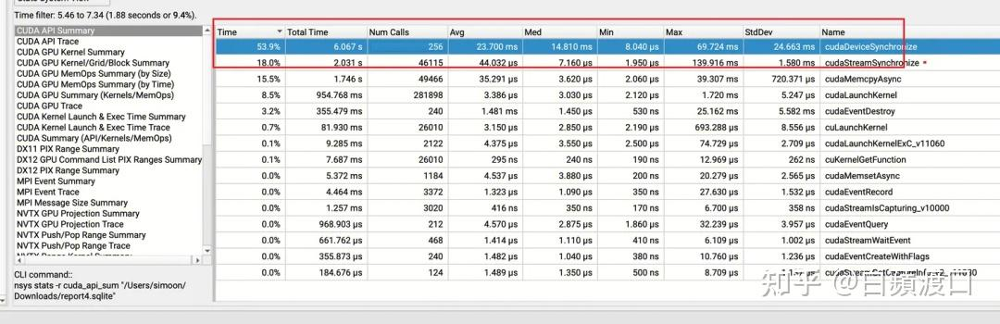


#### Timeline 分析

从 timeline 中可以看到 `memcpy` 操作，H2D 意味着数据从 CPU 内存被加载到 GPU 显存中，一般代表一次训练迭代的开始。连续两次 H2D 之间的间隔，通常可以近似观察一次迭代周期。


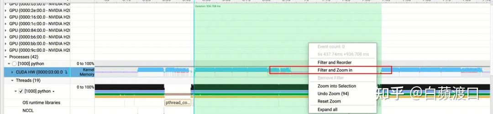


选中给定时间段后，对应的 System Status View 信息也会同步更新。


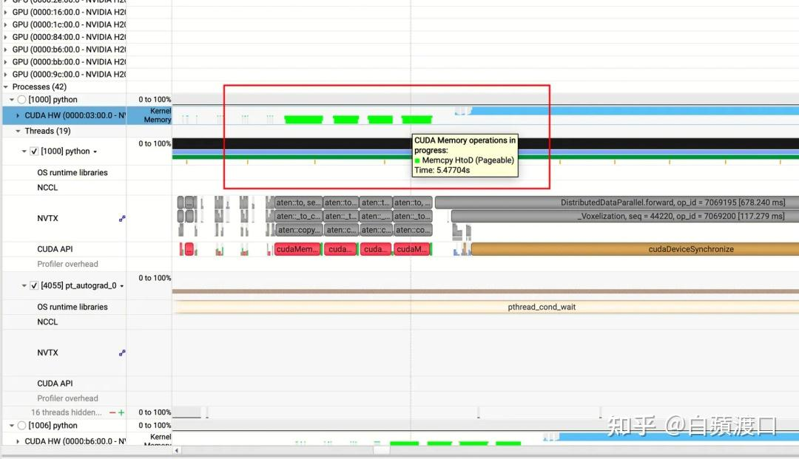


zoom in 之后可以看到非常明显的空白区间，也就是说这段时间 GPU 利用率很低。展开 CUDA API 和 Stream 中的 kernel 后可以发现，存在大量 H2D、D2H 操作，严重影响了训练吞吐。


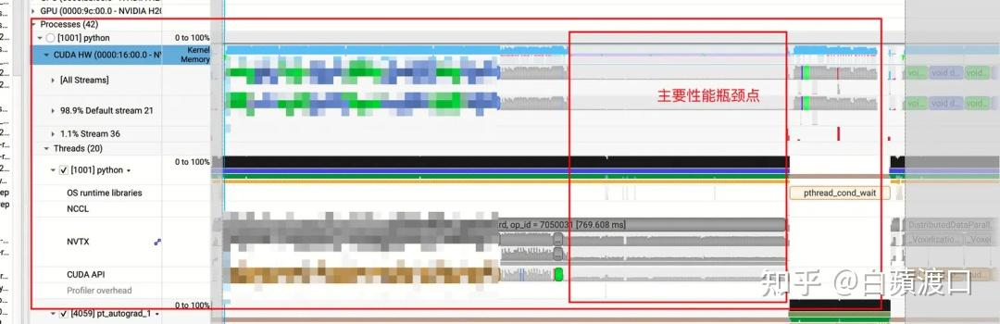


### 3.3 使用 nsys 分析的一般流程

在实际应用中，使用 nsys 进行性能分析主要涉及两种典型场景：

**第一种场景：性能瓶颈定位分析**：当程序运行性能不达预期或存在明显的性能瓶颈时，需要通过 nsys 深入分析系统的执行过程，**识别关键的性能瓶颈点**，为后续的针对性优化提供数据支撑。

**第二种场景：性能差异对比分析**：当程序在不同环境、配置或输入条件下表现出显著的性能差异时（例如在某些情况下运行正常，而在其他情况下出现性能问题），需要通过 nsys **对比分析不同场景下的执行特征**，找出导致性能差异的根本原因。

### 3.3.1 程序性能瓶颈点分析

寻找程序的性能瓶颈并不是一件很简单的事情，在 3.2 节中我们有示范过简单的定位方式。

几个简单的原则是：

1.  **自顶向下的分析策略**

    -   首先从整体时间线视图观察程序的总体执行模式。
    -   识别占用时间最长的阶段或操作。
    -   逐步深入到具体的 kernel 或 API 调用层面。

2.  **关注关键性能指标**

    -   **GPU 利用率**：检查 GPU 是否充分利用，避免空闲等待。
    -   **内存带宽利用率**：分析是否存在内存访问瓶颈。
    -   **Kernel 执行时间**：找出耗时最长的计算 kernel。
    -   **数据传输开销**：检查 Host-Device 间的数据拷贝是否过频繁。

3.  **识别常见瓶颈模式**

    -   **计算密集型瓶颈**：kernel 执行时间过长。
    -   **内存带宽瓶颈**：内存访问模式不优化。
    -   **同步等待瓶颈**：频繁的 CPU-GPU 同步操作。
    -   **资源竞争瓶颈**：多 stream 间的资源争用。

一条从头到尾连续饱满的 GPU 利用率蓝条，通常是比较理想的结果。


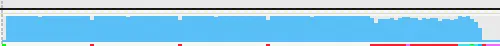


### 3.3.2 程序性能差异点分析

考虑如下场景，当前进程在机器 1 上是正常运行的，但是在机器 2 上却无法复现对应的性能，这个时候需要通过对比分析来找出差异点。

典型的差异分析场景包括：

1.  **硬件环境差异**

    -   不同 GPU 型号或架构导致的性能差异。
    -   内存容量或带宽规格的不同。
    -   PCIe 版本或 CPU 性能的差异。

2.  **软件环境差异**

    -   CUDA 驱动版本不一致。
    -   系统负载或后台进程的影响。
    -   编译器优化级别或链接库版本差异。

3.  **差异点定位方法**

    -   **并行对比分析**：同时在两台机器上运行 nsys，对比相同时间段的执行特征。
    -   **关键指标对比**：重点比较 kernel 执行时间、内存使用模式、GPU 利用率等核心指标。
    -   **执行路径对比**：检查程序是否在不同环境下走了不同的执行分支。
    -   **资源使用对比**：分析内存分配模式、stream 使用情况等是否存在差异。

4.  **分析工作流程**

    -   收集两个环境下的完整 nsys profile 数据。
    -   使用 timeline 视图进行宏观对比，识别明显的执行模式差异。
    -   深入到具体的 API 调用和 kernel 执行层面进行微观分析。
    -   结合系统环境信息，定位导致差异的根本原因。

## 第四章：实战演练 - LLM 训练推理性能优化案例

### 4.1 大模型训练 Megatron-LM 优化

在大模型训练框架 Megatron-LM 中，通常已经定义好了 profile 相关接口参数，可以指定 step 范围进行定向抓取。


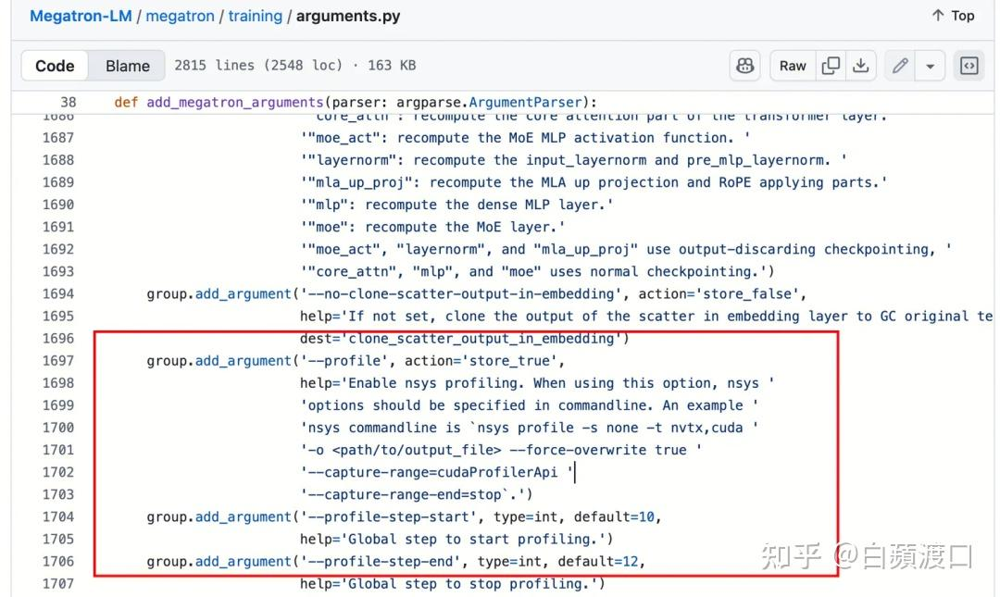


抓取 nsys 之后，可以看到非常详细的 kernel 执行情况。如果大部分通信与计算能够重叠，蓝色的 GPU 利用率也会保持在较饱满的状态。


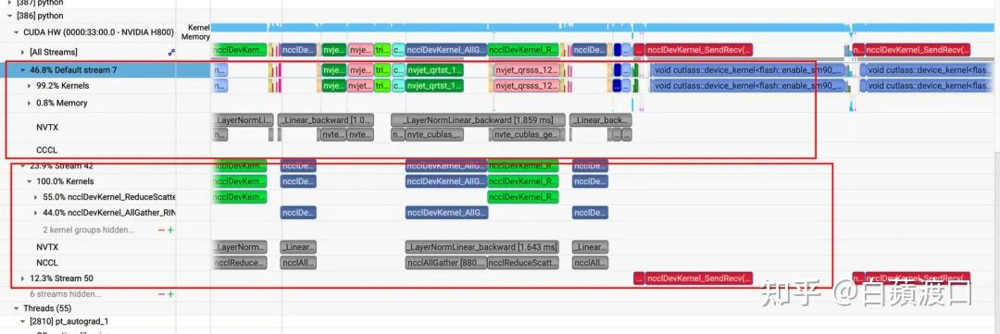


### 4.2 SGLang 推理服务优化实战

当前大模型推理对性能优化要求非常高。以 SGLang 为例，官方文档中提供了 profile 抓取方法。

同时提供了 PyTorch Profiler 与 nsys 两种方式，并且支持在线场景和离线场景的 profile。

[https://docs.sglang.ai/developer_guide/benchmark_and_profiling.html](https://docs.sglang.ai/developer_guide/benchmark_and_profiling.html)


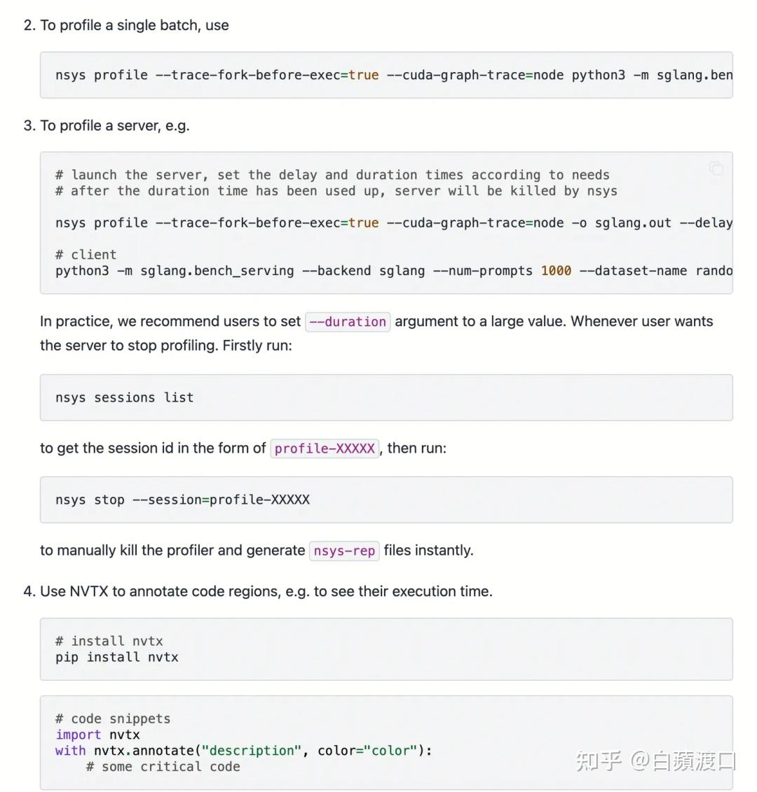


### 4.3 更多案例分析

在 haihub 中提供了基础镜像，可以快速拉起很多 demo 实验，包括各种大模型训练、stable diffusion 的微调、检测模型等等。

并且已经预装了 Nsight Systems CLI 工具，可以尝试抓取 nsys，分析各类瓶颈点。

[https://haihub.cloud.tencent.com/detail?imageId=tencent/taco-train/hccpnv6](https://haihub.cloud.tencent.com/detail?imageId=tencent/taco-train/hccpnv6)

## 总结

本文尽量详细介绍了 nsys 的用法和使用注意事项，并给出了一些案例辅助分析。

不过当前没有一个太好的手把手指引教学的案例，未来有机会再补。

**性能优化是一个持续迭代的过程**，希望本文能够为读者在这条道路上提供有价值的指导和参考。

欢迎大家批评指正。

> 部分参考资料：
> [https://docs.nvidia.com/nsight-systems/index.html](https://docs.nvidia.com/nsight-systems/index.html)
> [https://www.youtube.com/playlist?list=PL5B692fm6--ukF8S7ul5NmceZhXLRv_lR](https://www.youtube.com/playlist?list=PL5B692fm6--ukF8S7ul5NmceZhXLRv_lR)
> [https://zhuanlan.zhihu.com/p/691307737](https://zhuanlan.zhihu.com/p/691307737)
