> 文章通过三个递进的视角，由表及里试图回答以下三个问题：  
> **Symmetric Memory 是什么，它在硬件上是如何工作的？**  
> **Symmetric Memory 的发展，对上层应用和开发者意味着什么？**  
> **为什么是 Symmetric Memory，它在整个计算技术演进中处于什么位置？**

## 1. NCCL 视角下的 Symmetric Memory

> 随着 NVIDIA NVL72 等大规模 Scale-Up 系统的出现，GPU 间的互联模式正在发生根本性变化。在一个 NVLink 域中，互联的 GPU 数量从过去的 8 个扩展至 72 个甚至更多，域内任意两个 GPU 间的单向带宽可达 900GB/s。  
> 这种架构使得过去部分必须通过网络接口卡（NIC）进行的跨节点通信，现在可在一个统一、高速的 NVLink 域内完成。

大模型训练这一场景需求推动着硬件前往特定的方向演进。 而硬件的演进必然要求通信软件库进行相应变革，以充分利用其潜力。NCCL 2.27 版本引入的 Symmetric Memory（对称内存模型），正是为应对这一变革而设计的方案。

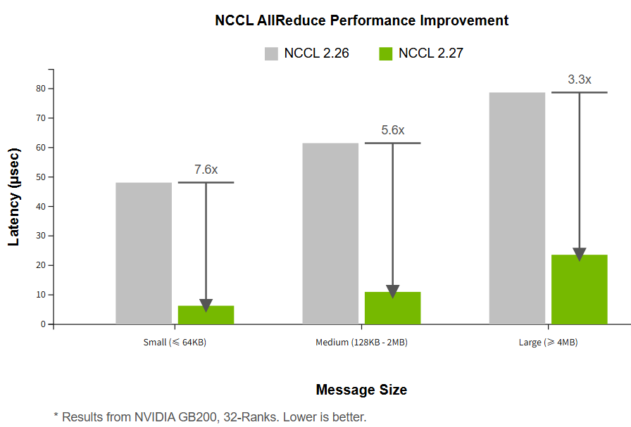

> 通过利用 Symmetric Memory ，在 NVIDIA GB200 (32-Ranks) 平台上，与 NCCL 2.26 相比，AllReduce 操作的延迟在**小消息（≤64KB）下降低了约 7.6 倍**，中等消息下降低约 5.6 倍，大消息下降约 3.3 倍。

本部分旨在简单分析 Symmetric Memory 模式下 nccl 的工作原理，在 NCCL 通信库的视角下阐明其相比 **NVLink 域内**的传统 Ring 算法，如何在 Scale-Up 场景下实现更高通信性能，并降低对 GPU 计算资源（SM）的占用。

### 1.1 硬件基础

要理解 Symmetric Memory，首先需要了解其依赖的底层硬件能力。它并非凭空创造新的通信方式，而是对现有硬件潜能的充分封装和利用。

**对等内存直接访问 (Peer Memory Access over NVLink)**

> 想象一下，GPU-A 可以直接读写 GPU-B 的显存，就像操作自己的本地内存一样。这就是通过 NVLink 实现的对等内存直接访问（P2P Access）。

通过 NVLink 互联的 GPU **通常**具备对等内存直接访问（P2P Access）的能力。其核心机制是利用 CUDA 的虚拟内存管理（VMM）能力。一个本地 GPU 可以将远程 GPU 的物理显存块（HBM）映射到自己的虚拟地址空间中。

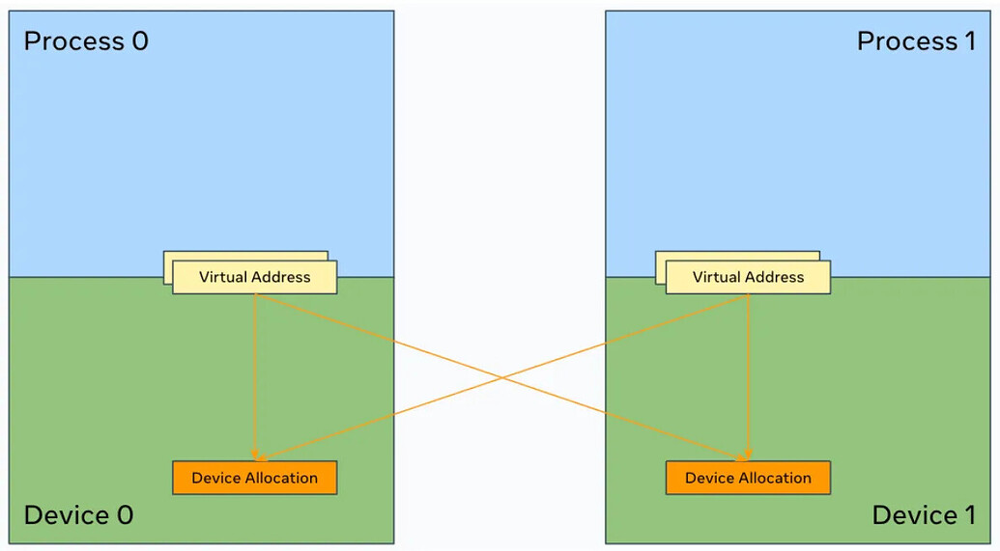

映射完成后，本地 GPU 上的 CUDA 内核便可以通过标准的内存操作指令（PTX ISA 中的 ld/st 指令）直接对该虚拟地址进行读写，如同操作本地内存。硬件会自动处理跨越 NVLink 的访问请求，对上层 CUDA 核透明。

```cpp
// 来源: NVIDIA PTX ISA Documentation
// 语法: ld.space.type d, [a];
// 从全局内存地址[a]加载数据到寄存器 d
ld.global.u64  %rd, [%addr];
// 语法: st.space.type [a], b;
// 将寄存器 b 的数据存储到全局内存地址[a]
st.global.u64  [%addr], %rd;
```

这种硬件支持的 P2P Access 是实现**零拷贝（Zero-Copy）** 通信的基础，数据可以直接从源用户缓冲区流向目标用户缓冲区，无需软件层面的中间拷贝。

需要强调的是，P2P Access 是一种底层的硬件能力。上层软件库（如 NCCL）具体如何利用这种能力，则决定了其通信模型的效率和范式。

**NVSwitch 层服务 (NVLS)**

从第三代NVSwitch开始，**NVSwitch芯片**本身集成了更高级的数据处理能力，即NVLS（NVSwitch Level Services）。其中与集合通信最相关的两项是多播（Multicast）和**NVSwitch**内规约（In-Switch Reduction）。

-   **多播 (Multicast)**: 当一个GPU向一个特殊的多播地址执行store（写）操作时，NVSwitch硬件可以自动将这份数据复制并分发给NVLink域内所有其他的GPU。这实现了硬件层面的**一对多广播**功能。

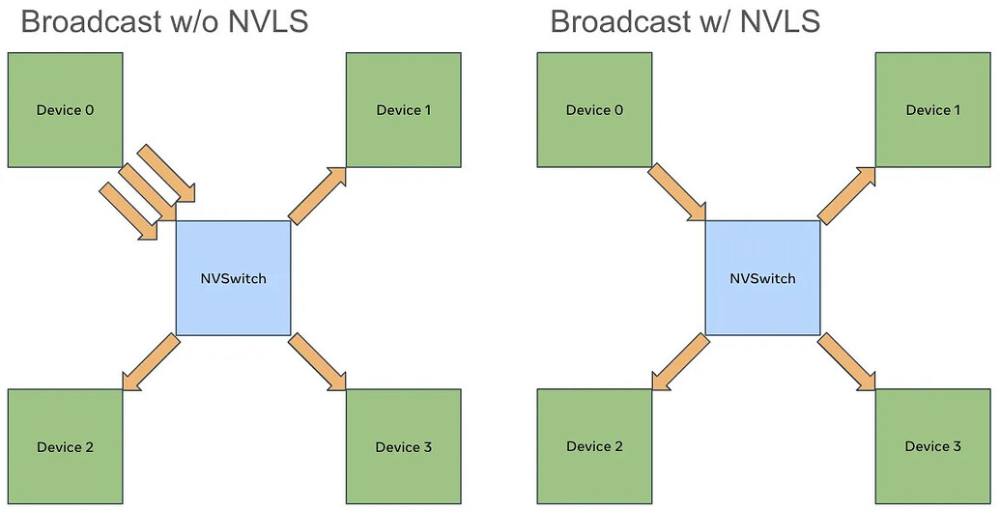

-   **NVSwitch内规约 (In-Switch Reduction)**: 当一个GPU从一个多播地址执行load（读）操作时，NVSwitch硬件可以主动从所有GPU的对应内存地址收集数据，在NVSwitch内部的逻辑单元上完成规约计算（如SUM），然后将最终的规约结果返回给发起操作的GPU。这实现了硬件层面的**多对一规约**功能。

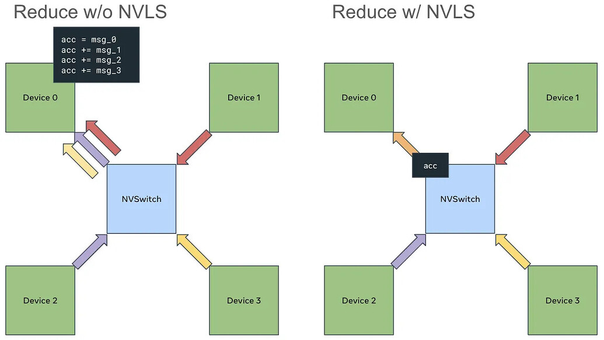

这两项能力允许将传统的、完全由GPU SM执行的广播和规约计算，**卸载（Offload）** 到NVSwitch硬件上执行。在使用基于Symmetric Memory的相关功能时在检测到硬件支持时，会利用一种名为**Multimem**的引擎来调用这些硬件功能。

### 1.2 传统 Ring 算法在全互联 NVLink 域内的局限性

在引入 Symmetric Memory 之前，Ring 算法是 NCCL 在多种场景下的基础和回退算法。它的设计具有普适性，能够兼容所有硬件，但在 NVSwitch 构建的全互联、低延迟域内，其设计哲学使其无法完全发挥硬件优势，并暴露出局限性。

**中转缓冲区模型**

这里讨论能 P2P 情况下的场景，传统 NCCL P2P 通信的核心，同样利用了硬件的 P2P Access 能力，但它并未直接作用于最终的用户数据，而是构建了一种基于**中转缓冲区**和**进程间通信（IPC）句柄交换**的软件模型。其数据路径并非用户缓冲区到用户缓冲区的直接传输。

当两个 GPU 进程建立 P2P 连接时，它们会执行以下步骤：

1\. 每个进程在自己的 GPU 上分配一块内存作为通信的中转缓冲区（ncclP2pBuff）。

2\. 通过 ncclP2pImportShareableBuffer 等函数，交换各自缓冲区的 IPC 句柄（ncclIpcDesc）。

3\. 接收方进程将发送方进程的缓冲区 IPC 句柄导入，从而将远程的中转缓冲区映射到自己的虚拟地址空间。

```cpp
// 来源: NCCL 源码, src/transport/p2p.h
// IPC (Inter-Process Communication) handle for a shared buffer.
struct ncclIpcDesc {
  char commId[NCCL_COMM_ID_SIZE];
  int rank;
  int gfd; // global file descriptor
};

// Buffer structure used for P2P communication.
struct ncclP2pBuff {
  void* directPtr;      // Direct pointer for SM access (if available)
  size_t size;
  ncclIpcDesc ipcDesc; // IPC handle for mapping remote buffers
};

// Connection information structure.
struct p2pConnectInfo {
  int rank;
  int read;
  struct ncclP2pBuff p2pBuff; // The intermediate buffer
  // Used by CE memcpy
  ncclShmIpcDesc_t desc;
};
//结构体 ncclP2pBuff 及其成员 ipcDesc 是实现跨进程内存映射的关键。p2pConnectInfo 则封装了连接所需的所有信息，其核心是 p2pBuff 这个中转缓冲区。这种设计要求数据必须先暂存在该缓冲区中，从而产生了拷贝开销。
```

这个模型决定了数据传输的路径为：

`发送方用户输入 Buffer -> 发送方 NCCL 中转 Buffer -> 接收方 NCCL 中转 Buffer -> 接收方用户输出 Buffer`

这个过程涉及至少一次额外的内存拷贝，并建立了一个严格的生产者-消费者同步模型：数据必须先被完整地写入中转区，然后才能被读取。

**基于 P2P 链路的链式通信**

Ring 算法在上述 P2P 通信模型的基础上，将所有参与通信的 GPU 逻辑上组织成一个环形拓扑。数据以分块（chunk）的形式，在环上进行逐跳（hop-by-hop）传递。

一个完整的 Ring AllReduce 操作包含两个阶段：Reduce-Scatter 和 AllGather。

-   **Reduce-Scatter**: 数据块在环上传递 N-1 次，每经过一个 GPU，该 GPU 会将上游传来的数据与自己的数据进行规约计算，并将结果传递给下游。
-   **AllGather**: 规约完成的数据块再次在环上传递 N-1 次，以便每个 GPU 都拥有所有数据块的最终完整结果。

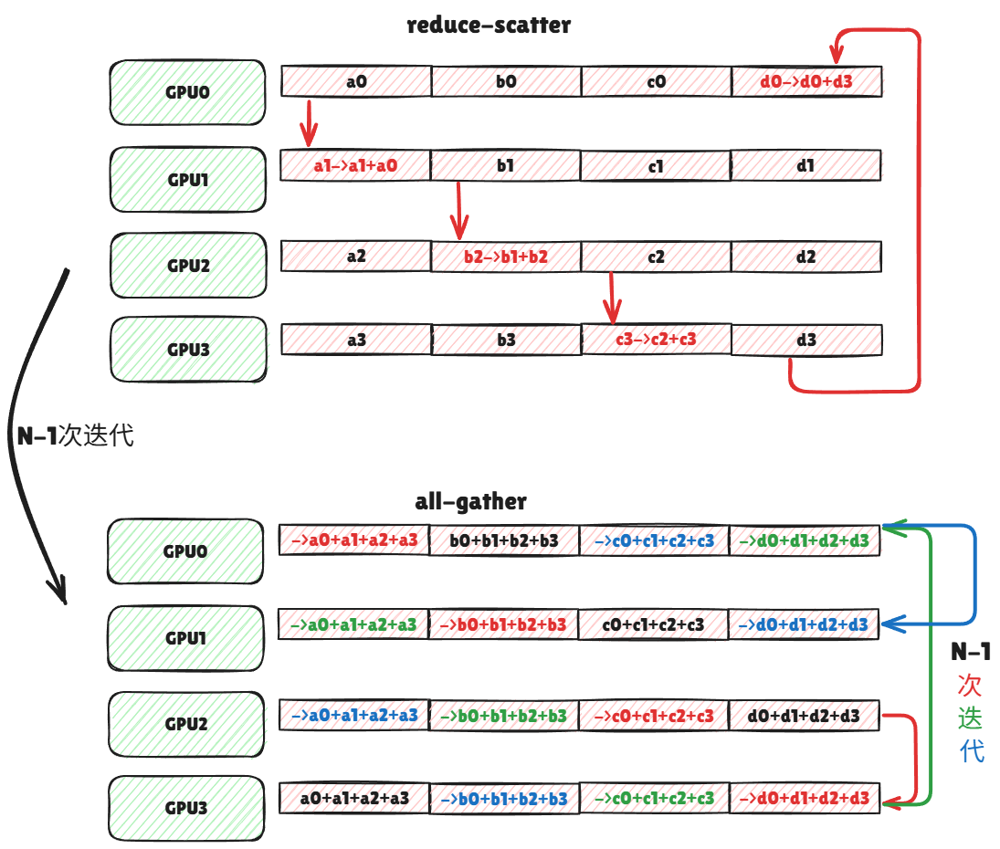

> N: 参与通信的 GPU 数量。 M: 每个 GPU 的初始数据大小 (以字节为单位)。

-   **算法名称:** 环形规约 (Ring AllReduce)
-   **适用场景/限制条件:**

-   作为 NCCL 的基础和回退算法，兼容所有硬件。
-   在跨节点（Inter-Node）通信中，因其对带宽的有效利用而成为最优算法之一。
-   在 NVLink 域内，其 O (N) 的延迟使其在小消息和大规模 GPU 场景下性能受限。

-   **理论通信量：** 2 \* (N-1) \* M

-   在 Reduce-Scatter 和 AllGather 两个阶段，每个数据块 M 都需要在环上移动 N-1 次。

-   **算法步骤数：** 2\*(N-1) (与 N 线性相关)

**在全互联 NVLink 域内的局限性**

基于上述机制，当 Ring 算法运行在 NVSwitch 构建的全互联域内时，其设计与硬件能力产生了冲突，导致了以下核心限制：

-   **延迟与 GPU 数量成正比 (O(N) 延迟)**  
    Ring 算法的链式、逐跳传递机制，导致其通信延迟直接与参与通信的 GPU 数量 N 成正比。在 NVL72 这样的 72-GPU 域中，2 \* (71)个串行步骤带来的同步和握手开销，在小消息场景下会远超实际数据传输时间，成为性能瓶颈。
-   **数据中转与内存拷贝开销**  
    如之前所述，Ring 算法继承了 P2P 通信的中转缓冲区机制。数据无法直接从源用户内存流向目标用户内存，必须经过 NCCL 内部 Buffer 的暂存。这次额外的内存拷贝引入了不必要的延迟和带宽消耗。
-   **同步开销与计算资源占用**  
    严格的生产者-消费者同步模型，使得通信与计算的有效重叠变得困难。更重要的是，为了在高带宽的 NVLink 上获得足够的吞吐量，NCCL 需要启动大量的 channels 来并行处理不同的数据块。每个 channel 在软件层面对应一个 CUDA block (CTA)。在实践中，Ring 算法可能需要“十几甚至数十个 channels”才能饱和带宽。这些 CUDA block 会直接占用 GPU 的 SM 资源，与用户的核心计算任务（如矩阵乘法）形成竞争，从而影响整体计算效率。

### 1.3 基于 Symmetric Memory 的优化

**在 2.28中，NCCL 构建了一个基于CUDA虚拟内存管理（VMM）构建的、为节点内所有GPU提供统一、扁平化、对称虚拟地址空间的底层基础设施，来实现 Symmetric Memory 的设计。**

采用 Symmetric Memory 的设计从根本上改变了节点内的通信范式,解决了传统 Ring 算法在全互联域内的局限性。 它不再依赖消息传递和中转缓冲区，而是建立在一个**远程内存访问模型 (RMA)** 模型之上，其设计哲学与 NVSwitch 的全互联拓扑高度契合。

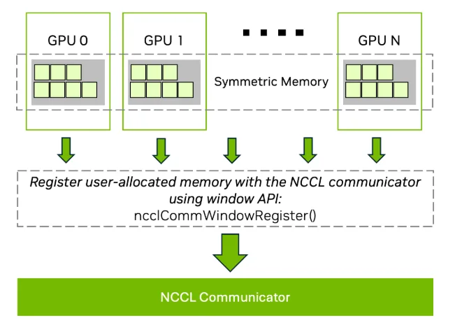

**核心机制：注册用户内存与零拷贝 P2P 访问**

它通过 `ncclCommWindowRegister`（C++ API）或 PyTorch 的 `torch.distributed._symmetric_memory`（Python API）等接口，将用户提供的输入/输出 Tensor 注册到 NCCL。

完成注册后，在一个 NVLink 域内的任何一个 GPU，都可以获得一个直接指向其他任意 GPU 已注册内存的虚拟地址指针。 注册过程在底层执行了以下关键操作：

1\. NCCL 收集 NVLink 域内所有参与进程的用户 Tensor 物理地址信息。

2\. 利用 CUDA 的虚拟内存管理（VMM）能力，为每个 GPU 创建指向域内所有其他 GPU 已注册内存的**直接虚拟地址映射**。

> 首次注册使所有 GPU会预留一个**一个巨大的、对齐的、连续的虚拟地址空间**`lsaFlatBase`  
> 每次注册时NCCL会将用户缓冲区的物理内存，通过句柄交换和`cuMemMap`，映射到这个全局空间中每个GPU对应的逻辑位置上。

这个映射的建立，赋予了本地 GPU 内核通过标准的 `load/store` PTX 指令直接访问远程 GPU 用户内存的能力。

这种硬件支持的 **P2P Access** 是实现**零拷贝 (Zero-Copy)** 的基础。数据可以直接从源用户 Buffer 流向目标用户 Buffer 或处理单元（SM 寄存器），完全消除了传统 Ring 算法中的中转拷贝。

**硬件卸载：自适应的 Multimem 引擎**

Symmetric Memory 框架本身是一个通用的直接内存访问模型，但它内部包含两个层次的执行方法，以适应不同的硬件：

-   **纯 P2P load/store**: 这是在任何支持 P2P Access 的 NVLink 系统上都能运行的模式。它利用直接内存访问能力执行零拷贝通信，但集合操作中的规约计算（Reduce）仍在 GPU 的 SM 上完成。
-   **硬件卸载 Multimem**: 当检测到系统硬件（NVSwitch V3+）支持多播（Multicast）时，Symmetric Memory 会切换到此引擎。它利用特殊的 `multimem` PTX 指令，将广播（Broadcast）和规约（Reduction）操作**卸载 (Offload)** 到 NVSwitch 硬件上执行，从而将 GPU SM 从规约计算中解放出来。

### 1.4 基于 Symmetric Memory 的相关内核实现

基于直接内存访问和 Multimem 能力，NCCL 为 Symmetric Memory 设计了一系列全新的、专用于节点内通信的 CUDA 内核。这些内核摒弃了 Ring 算法的 O(N)延迟模型，转向了 O(1)或两步式模型。

我们以 AllReduce 为例，分析其中两种最具代表性的算法。

**One-Shot AllReduce**

该算法专为小消息场景设计，其首要目标是最小化延迟。

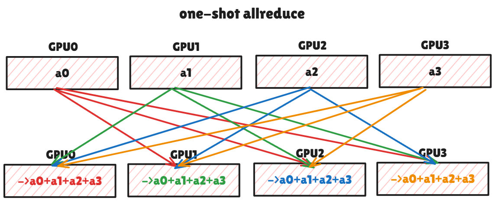

-   **内核名称:** `AllReduce_AGxLLMC_R` (Multimem 版本), `AllReduce_AGxLL_R` (纯 P2P 版本)

-   命名规则 AG (AllGather) + LL (Low Latency) + MC (Multicast) + R (Reduce)

-   **算法流程 (One-Shot)**:

-   **AllGather 阶段**: 每个 GPU 将其本地的全部数据 M，发送给所有其他 N-1 个 GPU。

-   **Multimem 版**: GPU 向一个多播地址执行**一次** store 操作。NVSwitch 硬件负责将这份数据广播给所有其他 N-1 个 GPU。
-   **纯 P2P 版**: GPU 的 SM 主动执行 **N-1 次** store 操作，将自己的数据分别写入其他 N-1 个 GPU 的接收缓冲区。

-   **本地 Reduce 阶段**: AllGather 完成后，每个 GPU 的接收缓冲区中都包含了来自所有 N 个 GPU 的原始数据。每个 GPU 在**自己的 SM 上**对这 N 份数据进行规约计算，得到最终结果。

-   **性能分析**:

-   **延迟**: 算法步骤与 N 无关，延迟为 O(1)。所有 GPU 可以并行地对外发送数据。
-   **通信量**: 每个 GPU 需要接收 (N-1)\*M 的数据，总通信量较高，因此不适合大消息。
-   **SM 占用**: 在纯 P2P 版中，SM 需要积极参与数据分发；在两个版本中，SM 都需要执行完整的本地规约计算。因此 SM 占用相对较高。

```cpp
// 来源: nccl-tests 源码, all_reduce/all_reduce.cu
// --- 纯 P2P 版本 (allReduceLsaKernel) ---
// 每个线程处理一个元素
template <typename T>
__global__ void allReduceLsaKernel(...) {
  // ... (grid-stride loop setup)
  for (size_t offset = globalTid; offset < count; offset += globalNthreads) {
    T v = T{0};

    // 1. 软件实现的 AllGather+Reduce: SM 循环 N 次，通过 P2P load 累加
    for (int peer=0; peer<nRanks; peer++) {
      T* sendPtr = (T*)ncclGetLsaPointer(sendwin, sendoffset, peer);
      v += sendPtr[offset]; // <-- P2P load + SM reduce
    }

    // 2. 软件实现的 Broadcast: SM 循环 N 次，通过 P2P store 写回
    for (int peer=0; peer<nRanks; peer++) {
      T* recvPtr = (T*)ncclGetLsaPointer(recvwin, recvoffset, peer);
      recvPtr[offset] = v; // <-- P2P store
    }
  }
  // ...
}

// --- Multimem 版本 (allReduceMultimemKernel) ---
template <typename T>
__global__ void allReduceMultimemKernel(...) {
  // ... (grid-stride loop setup)
  T* send_ptr = reinterpret_cast<T*>(ncclGetLsaMultimemPointer(sendwin, sendoffset, devComm));
  T* recv_ptr = reinterpret_cast<T*>(ncclGetLsaMultimemPointer(recvwin, recvoffset, devComm));

  for (size_t offset=globalTid; offset < count; offset += globalNthreads) {
      // 1. 硬件实现的 AllGather+Reduce: 单次调用触发硬件规约
      T v = multimemLoadSum<T,T>(send_ptr + offset); // <-- Hardware Reduce

      // 2. 硬件实现的 Broadcast: 单次调用触发硬件广播
      multimemStore<T,T>(recv_ptr + offset, v);   // <-- Hardware Broadcast
  }
  // ...
}
//allReduceLsaKernel 中的两层嵌套 for 循环清晰地展示了“SM 循环广播+本地 SM 规约”的软件实现模式。而 allReduceMultimemKernel 则通过 multimemLoadSum 和 multimemStore 这两个高级原语，将同样的逻辑卸载到了 NVSwitch 硬件上，极大地降低了 SM 的负载和指令开销。
```

  

**Two-Shot AllReduce**

该算法为中到大消息设计，目标是在实现最优通信量的同时，保持低步骤数和低 SM 占用。

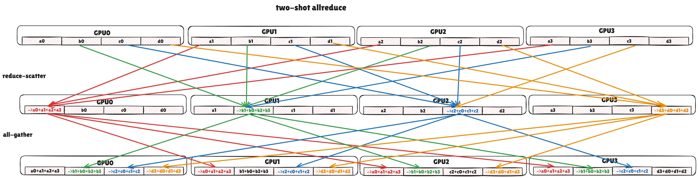

-   **内核名称:** `AllReduce_RSxLDMC_AGxSTMC` (Multimem 版本), `AllReduce_RSxLD_AGxST` (纯 P2P 版本)

-   命名规则 RS (ReduceScatter) + LD (Load) + MC (Multicast) + AG (AllGather) + ST (Store) + MC (Multicast)。

-   **算法流程 (Two-Shot)**:

-   **Reduce-Scatter 阶段**: 输出数据被逻辑切分为 N 块，每个 GPU i 仅负责规约第 i 块的结果。

-   **Multimem 版**: GPU i 发起**一次** multimem load 操作。NVSwitch 硬件负责从所有 N 个 GPU 收集第 i 块数据，在 **NVSwitch 芯片**上完成规约，并将结果返回给 GPU i。
-   **纯 P2P 版**: GPU i 通过并行的 load 操作，从其他 N-1 个 GPU 读取第 i 块数据，然后在**自己的 SM** 上完成规约。

-   **AllGather 阶段**: 此刻，每个 GPU i 都持有最终结果的一个分块。

-   **Multimem 版**: GPU i 向一个多播地址执行**一次** store 操作，NVSwitch 硬件将该结果块广播给所有其他 GPU。
-   **纯 P2P 版**: GPU i 通过并行的 store 操作，将自己的结果块写入所有其他 N-1 个 GPU 的对应接收位置。

-   **性能分析:**

-   **纯 P2P 版本**

-   **通信速度:** 延迟为 O (1)。由两个并行的 P2P load/store 阶段组成。
-   **资源占用:**

-   **SM 占用:** **低** (通信) + **中** (规约)。SM 在通信阶段仅负责发起 load/store 指令，但在 Reduce-Scatter 阶段，它需要对从 N-1 个 peer load 回来的数据块执行规约计算。
-   **内存占用:** 低，只需要少量临时寄存器空间。
-   **计算位置:** 规约计算在 **GPU SM** 上完成。

-   **Multimem**

-   **通信速度:** 延迟为 O (1)，且**优于**纯 P2P 版本，因为通信由两次高效的 multimem 操作完成。
-   **资源占用:**

-   **SM 占用:** **极低**。SM 在整个过程中**几乎完全空闲**，只负责发起两次 multimem 指令。
-   **内存占用:** 低。
-   **计算位置:** 规约计算被完全卸载到 **NVSwitch** 硬件上。这是与所有其他情况最本质的区别。

为了清晰地展示 Symmetric Memory 带来的变革，我们将传统 Ring 算法与 Symmetric Memory 的两种 AllReduce 实现进行多维度对比。

> 此处的对比均基于**节点内（Intra-Node）NVLink Fabric** 通信场景。

| 对比维度 | Ring AllReduce | Symmetric Memory (One-Shot) | Symmetric Memory (Two-Shot) |
| ----- | ----- | ----- | ----- |
| 核心模型 | 消息传递 (中转缓冲区) | 直接内存访问 (零拷贝) | 直接内存访问 (零拷贝) |
| 算法复杂度 | O(N) | O(1) | O(1) |
| 主要步骤数 | 2 * (N-1) | 1 (广播) + 1 (本地规约) | 1 (Reduce-Scatter) + 1 (AllGather) |
| 每GPU收发数据量 | ~2 * (N-1)/N * M | ~NM (高) | ~2 * (N-1)/N * M |
| 规约计算位置 | GPU SM | GPU SM | NVSwitch硬件 / GPU SM |
| SM资源占用 | 高 (需大量channels饱和带宽) | 中到高 (需执行完整本地规约) | 极低 (Multimem) / 中 |
| 最佳适用场景 | 跨节点网络 / 节点内回退 | 节点内，极小消息，延迟绝对敏感 | 节点内，中到大消息，吞吐量/SM资源敏感 |

> 值得一提的是NCCL2.28之后，Symmetric Memory之外，基于Ring的算法也在往直接内存访问方向进行优化,来进行零拷贝优化，不过这就超出了本文的主题了

  

### 1.5 总结

Ring 算法的设计目标是普适性，而 Symmetric Memory 的设计则是为了在特定硬件（全互联 NVLink 域）上实现极致性能。

* * *

## 2. Pytorch 视角下的 Symmetric Memory

> 您是否曾想过，将一个拥有数十个 GPU 的集群，不像过去那样看作多个独立的计算单元，而是将其作为一个统一的、拥有海量内存和计算能力的巨型 GPU 来编程？  
> PyTorch 中引入的 Symmetric Memory，正是使这一愿景成为现实的关键一步。

近年来，随着大语言模型（LLM）的飞速发展，我们观察到一个清晰的趋势：为了追求极致性能，分布式并行方案的设计越来越需要“硬件感知”能力，而更广更深的硬件交互也带来了开发的复杂度。

随着大模型并行策略日益复杂，开发者需要的不再是功能固定的通信原语，而是可以直接访问所有远程 GPU 显存的底层能力。

为了应对这些挑战，PyTorch 分布式编程的范式正在发生转变：从提供固定的高级通信 API，转向提供灵活的、开发者可编程的底层工具。

Symmetric Memory 借鉴了共享内存（Shared Memory）的设计哲学，可以在 GPU 集群中构建了一个可编程分布式共享内存模型，允许任何一个 GPU 通过简单的内存读写指令，直接、细粒度地访问其他 GPU 的显存。

> 对于 PyTorch 而言 Symmetric Memory 有助于开发**一个独立的、直接面向开发者的、可编程的分布式共享内存模型**。  
> 而对于 NCCL 而言则主要是利用 Symmetric Memory 来实现更高效的内部集合通信。

在介绍 Symmetric Memory 实现的可编程分布式共享内存模型前，我们先了解一下传统模型的不足

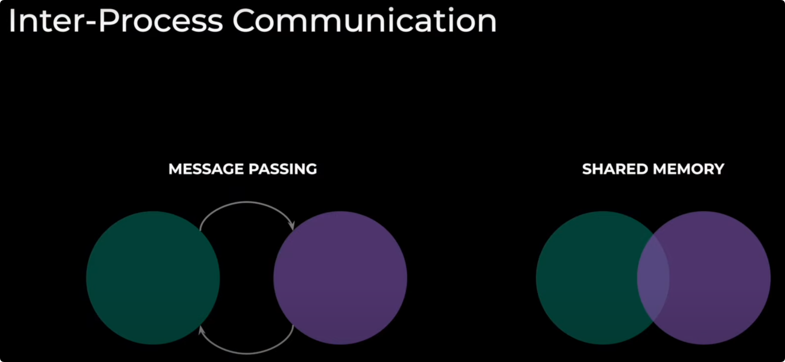

传统的分布式通信，无论是基于 NCCL 还是 MPI，其根基都是**消息传递（Message Passing）** 模型。这种模型在松耦合的跨节点网络中非常成功，但在紧耦合的 NVLink 域内，其固有瓶颈日益凸显：

1\. **开销与同步**：每次通信都伴随着软件栈的开销和强制的收发双方同步点。这使得细粒度的、异步的数据交换变得困难且低效。

2\. **资源竞争**：为了处理大量的通信请求，通信库（NCCL）本身需要占用大量 SM 资源，这直接与核心的计算任务争抢宝贵的算力。

3\. **表达力有限**：标准集合通信原语（AllReduce, AllGather 等）功能固定。对于需要根据数据内容动态决定通信路径的复杂场景（如 MoE 的动态路由），标准原语无能为力，需要用户进行复杂的、通常涉及 CPU 回传的自定义处理，效率极低。

现在，我们通过 Symmetric Memory 实现的内存模型，可实现高性能、低延迟的集合操作，且掩盖了底层编程的复杂度。

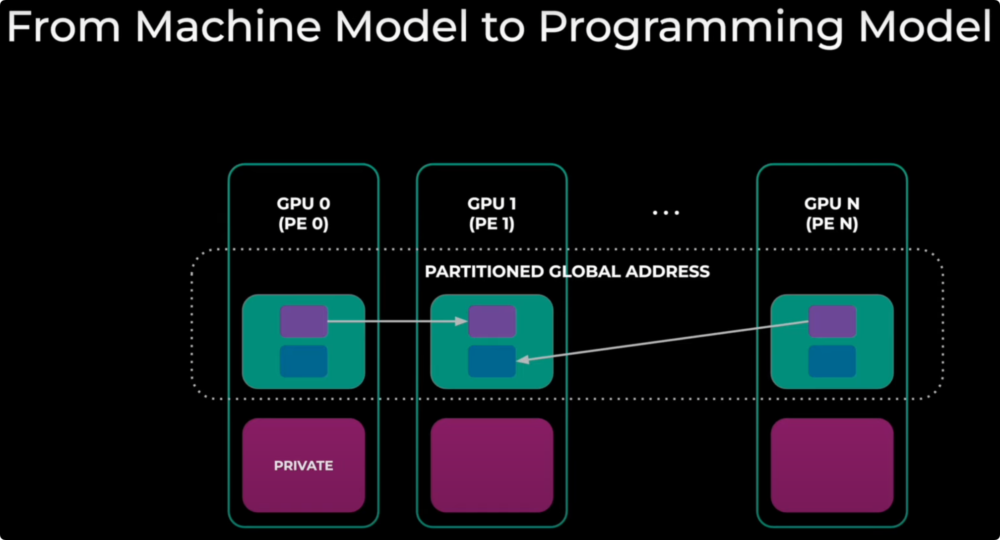

  

### 2.1 Symmetric Memory 的开发方式

一个基本的 Symmetric Memory（对称内存）示例 **创建对称张量：**

```python
t = symm_mem.empty(128, device=「cuda」)
hdl = symm_mem.rendezvous(t, group)
```

**调用 SymmMem 操作：**

```python
ops.symm_mem.one_shot_all_reduce(t, 「sum」, group)
```

**编写 CUDA 内核：**

```cpp
__global__ void kernel(T** buffers,
                       T* my_data, U** signal_pads) 
{
    // 确保对等节点已准备就绪
    sync_remote_blocks(signal_pads);
    // 循环遍历对等节点和数据以进行交换
    buffers[peer][i] = my_data[i];
    // 再次同步
    sync_remote_blocks(signal_pads);
}
```

**编写 triton 内核：**

```python
@triton.jit
def kernel(symm_ptrs, symm_signals, my_data, my_rank):
    offss = tl.arange(0, BLOCK_SIZE)
    # loop over data
    val = tl.load(my_data + offss)
    tl.store(symm_ptrs[my_rank] + offss, val)
    symm_mem_sync(symm_signals, hasPreviousMemAccess=True, hasSubsequenceMemAccess=True)
    # loop over peers
    val = tl.load(symm_ptrs[peer] + offss)
    # do some compute with val
    ...
    symm_mem_sync(symm_signals, ...)
```

以上只是针对 NVLink 域或者说机内的场景，事实上 PyTorch 基于 **IBGDA** 也实现了**机间**的 Symmetric Memory，本文不再赘述，感兴趣自行查看。

### 2.2 Symmetric Memory 带来的优化

**异步张量并行（Async-TP）**

异步张量并行的核心思想是通过解耦相互依赖的通信与计算算子，我们可以创造原本无法实现的计算通信重叠机会。

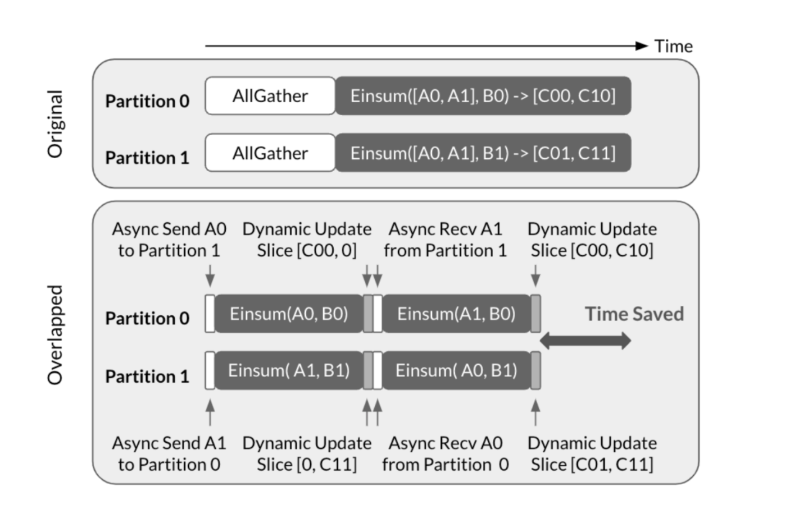

  

> 原始（Original）策略是串行的：必须先执行 AllGather 通信，等所有分区都拿到完整数据后，才能开始 Einsum 计算。这导致在通信期间，计算资源处于空闲等待状态。  
> 重叠（Overlapped）策略是并行的：它将大的计算任务拆分。分区可以立即使用本地数据（如 A0）开始第一部分计算，与此同时，通过异步通信在后台收发下一部分计算所需的远端数据（如 A1）。

虽然异步张量并行的概念在理论上很直观，但要实现高性能的 CUDA 版本却面临诸多挑战。由于易用性考虑，开发者可能倾向于使用 NCCL send/recv 接口。然而传统 NCCL send/recv 具有某些特性，使其并非异步张量并行的理想选择：

-   重叠计算与通信之间的资源争用，NCCL 发送/接收内核需要利用流多处理器（SM）通过 NVLink 传输数据，这会减少可用于重叠矩阵乘法内核的 SM 数量并降低其执行速度。此外还有波次（wave）造成的影响。
-   双向同步机制，NCCL 发送/接收内核执行双向同步，意味着发送方和接收方在操作完成前都会处于阻塞状态。这种方法对于算子内并行的数据传输并非总是最优解。

在 PyTorch 实现了 Symmetric Memory 来充分利用 NVLink 的 P2P 能力后，我们就能避免以上缺陷。

-   Symmetric Memory 机制允许设备通过将远端设备内存映射到自身虚拟内存地址空间，直接访问对等设备上分配的内存。这种机制使得内存操作（加载/存储/原子操作等）能够通过 NVLink 执行。
-   此外，当通过 cudaMemcpyAsync 向对等设备传输连续数据时，操作可以提交给复制引擎（Copy Engine）处理且不需要任何 SM 参与，从而避免了前文讨论的资源争用问题。

当然异步张量并行的优化要做的不止这些，详情参考

[pytorch-symmetricmemory-harnessing-nvlink-programmability-with-ease](https://link.zhihu.com/?target=https%3A//dev-discuss.pytorch.org/t/pytorch-symmetricmemory-harnessing-nvlink-programmability-with-ease/2798)

[distributed-w-torchtitan-introducing-async-tensor-parallelism-in-pytorch](https://link.zhihu.com/?target=https%3A//discuss.pytorch.org/t/distributed-w-torchtitan-introducing-async-tensor-parallelism-in-pytorch/209487%23note2)

  

**通过 Symmetric Memory 实现高效 A2A 来优化 MOE 模型**

MoE 模型依赖一个关键的“Token Shuffle”步骤，其本质是 All-to-All 通信，用于在 GPU 之间重新分发数据。

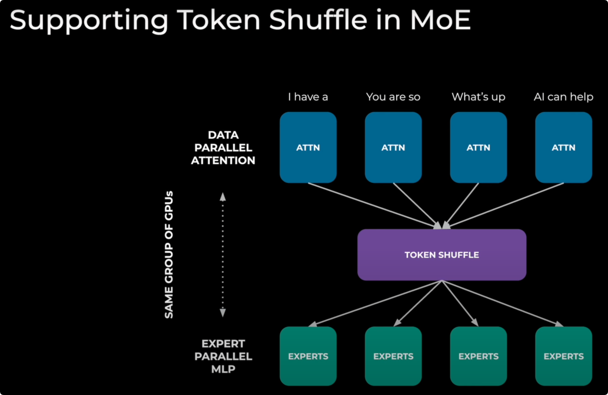

> MOE 混合专家模型的一种工作流程为  
> 1\. 输入处理 (DATA PARALLEL ATTENTION)：输入数据（Tokens）被分配到多块 GPU 上，进行并行的初步处理（Attention 计算）。  
> 2\. 数据重排 (TOKEN SHUFFLE)：这是核心的通信步骤。所有 GPU 需要相互交换数据，将每个 Token 发送到指定的“专家”（Expert）GPU 那里去。这是一个 All-to-All（A2A）类型的通信。  
> 3\. 专家处理 (EXPERT PARALLEL MLP)：数据到达指定的专家 GPU 后，由这些专家模块完成后续的计算。

此次 All-to-All 通信的模式是动态的。每个 GPU 需要发送给其他 GPU 的数据量和具体内容，取决于在 GPU 上实时计算出的结果。

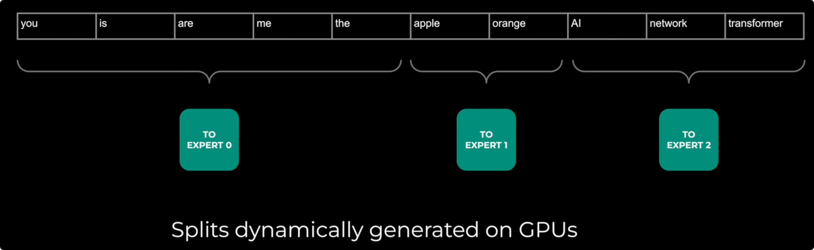

> Token Shuffle 过程中的难点是  
> 1\. 动态分组：一个 GPU 上的输入 Tokens 序列，需要被分割成多个组，每个组发送给一个不同的专家（Expert 0, 1, 2）。  
> 2\. GPU 上实时决定：关键在于，如何对 Tokens 进行分组（即每个组包含哪些 Tokens，总共有多少个），这个分组信息（Splits）不是预先设定的。它是由上一步的计算在 GPU 上动态生成的。

通过消除 GPU 与 CPU 之间的同步开销，基于 Symmetric Memory 这种编程模型实现的 **on device A2A** 比传统方法更加高效。

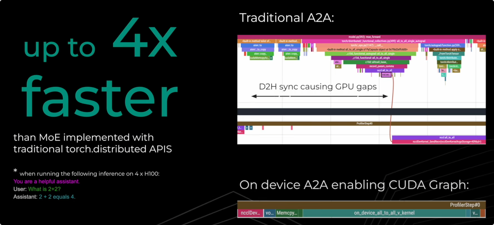

**On device A2A 的优势**

-   设备端直接执行 (On device)：Symmetric Memory 允许一个 GPU 上的 CUDA 核（Kernel）直接读取其他 GPU 显存中的数据。
-   消除 CPU 同步：当动态路由信息在 GPU 上计算出来后，执行通信的内核无需通知 CPU，可以直接在 GPU 设备端读取这些信息，并立即开始相应的数据传输。
-   连续执行无等待：整个过程（计算路由 -> 读取路由 -> 执行通信）都在 GPU 上连续完成，没有任何停顿。性能时间线表现为一个紧密连接的执行块，消除了“GPU gaps”。
-   启用 CUDA Graph：由于执行过程不依赖 CPU，可以将这整个无缝衔接的流程录制为 CUDA Graph，从而极大地降低后续执行时的内核启动开销，进一步提升性能。

### 2.3 Symmetric Memory 的未来

Symmetric Memory 或者说**可编程分布式共享内存模型**的故事才刚刚开始。正如 PyTorch 团队所规划的，其未来的发展方向包括：

-   **跨越节点边界**：结合 RDMA（如 IBGDA）技术，将这种对称内存模型从节点内扩展到整个集群，是其发展的必然路径。届时，开发者将能以统一的方式访问数据中心内任意 GPU 的内存。
-   **与 compile 的深度融合**：未来的理想状态是，开发者只需编写逻辑上单 GPU 的程序，而 torch.compile 等编译器能够自动分析数据依赖，将必要的内存访问转换为 Symmetric Memory 的底层操作，自动实现分布式并行。
-   **容错与可扩展性**：随着内存空间的急剧扩大，如何在这个统一的内存模型上高效地处理硬件故障、实现数据一致性，将是未来研究的核心挑战。
-   **多硬件支持**: 将其设计理念推广到 AMD 等其他硬件平台。

### 2.4 总结

总而言之，Symmetric Memory 的广泛应用代表了一种范式的转变：从传统的、基于消息传递的通信模型，转向基于直接内存访问的分布式共享内存模型。

它通过充分利用硬件的能力（比如 NVLink 硬件的 P2P 和 NVLS），在紧耦合的 Scale-Up 系统中实现了近乎零拷贝的通信、极低的延迟和计算资源消（低 SM 占用），以及对复杂通信模式的支持。

此外，对于 Scale-Out 场景和非 NVIDIA 的硬件也有表现出巨大潜力。

其设计哲学为构建更统一、更高效的大规模分布式计算系统指明了方向。

* * *

## 3. HPC 视角下的 Symmetric Memory

> 本着写都写了就写完的原则，我们还是有必要追根溯源一下 Symmetric Memory 的思想源头——**OpenSHMEM**。理解其存储模型与编程范式，将为我们理解当今 GPU 上的对称内存实现提供一个更广阔的视角。  
> 这是一个漫长的故事，为了方便理解我会将其稍加包装……  
> 首先，我们将建立一个宏观的视角，探寻现代高性能计算（HPC）中的内存与通信。

高性能计算（HPC）系统的性能瓶颈，长期以来都在**计算、存储与通信**这三者之间游移。

在HPC与大规模人工智能模型的驱动下，传统的、以CPU为中心的内存模型已不足以应对需求。系统的设计正从计算中心化转向数据中心化，这直接引发了内存与存储层次的深刻变革。理解这一变革是探讨Symmetric Memory等高级通信技术的前提。

### 3.1 扩展的内存层次结构

现代计算节点的内存不再是单一的DRAM。它已演变为一个多层次、异构的复杂体系，从访问速度和容量来看，大致可分为：

-   **本地高速内存 (Local Memory)**：包括CPU的各级缓存（SRAM）、GPU内部的共享内存以及高带宽内存（HBM）。
-   **主机内存 (Host Memory)**：节点内的主DRAM内存。
-   **远端内存 (Far Memory)**：这一概念涵盖了节点内部访问延迟高于主DRAM的内存资源。根据讲座中的定义，它包括：

-   NUMA架构中的非本地节点内存。
-   通过DIMM插槽连接的持久性内存（PMem）。
-   通过PCIe总线连接的CXL（Compute Express Link）内存扩展设备。

-   **分离式内存 (Disaggregated Memory)**：这是更进一步的架构演进，指内存资源被物理分离出来，形成独立的内存节点或内存池。计算节点通过高性能网络（Fabric）按需访问这些资源。这种架构的实现依赖于关键技术：

-   **RDMA (Remote Direct Memory Access)**：允许一个节点的网络接口卡（NIC）直接读写另一个节点的内存，绕过对方的CPU和操作系统，是实现低延迟、高带宽跨机内存访问的基础。
-   **CXL over Fabric**: CXL 3.0及以上标准定义的CXL.mem协议，允许通过交换机（Switch）将内存资源池化，供多个计算节点共享。

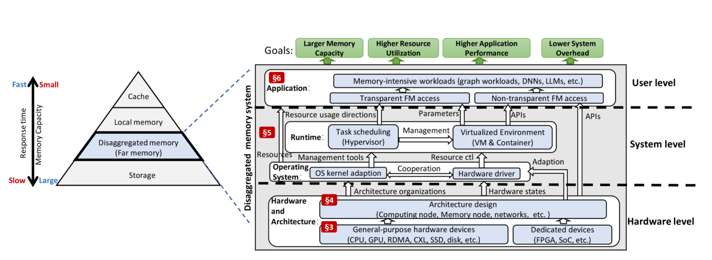

> 上图直观地展示了分布式内存系统的逻辑架构。左侧的金字塔模型清晰地标示出分布式内存（Disaggregated memory / Far memory）在现代内存层次中的位置——其访问速度慢于本地内存（Local memory），但容量远大于后者。  
> 右侧的系统框图则从硬件、系统和用户三个层面，详细描绘了实现这一架构所需的软硬件组件，包括底层的RDMA、CXL等通用硬件，以及操作系统和运行时的协同支持。

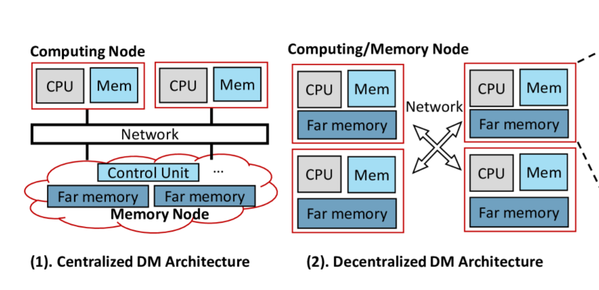

> 此图进一步展示了分离式内存（DM）的两种主要物理实现架构。左侧的中心化架构 (Centralized Architecture)将计算节点与内存节点物理分离，所有远端内存（Far memory）集中在专用的内存池中，由统一的控制器管理。右侧的去中心化架构 (Decentralized Architecture) 则将远端内存分布在各个计算节点上，每个节点既是计算资源，也为其他节点提供内存资源，形成一个逻辑上统一、物理上分布的内存池。

这个扩展的内存层次结构，打破了计算与内存的物理绑定，为资源池化和弹性伸缩提供了硬件基础。

本文所讨论的GPU集群内存模型正是去中心化架构，并通过高速硬件设备实现超高的通信性能。然而，**如何在这个复杂的层次结构上高效地移动数据并不仅仅取决于硬件，还取决于底层的通信范式。**

### 3.2 底层通信的抉择

在分布式计算中，节点间的通信模型从根本上可分为两类：**双边通信（Two-Sided）** 和 **单边通信（One-Sided）**。

**双边通信：消息传递模型 (Message Passing)**

以 MPI (Message Passing Interface) 为代表的双边通信，是 HPC 领域最广为人知、应用最广泛的模型。它的核心是 `send` 和 `recv` 操作的配对。

-   **工作模式**：发送方（Sender）和接收方（Receiver）必须显式地进行一次“握手”。发送方打包好数据和元数据（目标、大小、标签等）发起 `send`，接收方则需要准备好缓冲区并调用匹配的 `recv`。两者在底层通过匹配协议（Matching Protocol）对齐后，数据才开始传输。
-   **核心特征**：**数据移动与同步是耦合的**。一次成功的 `send/recv` 不仅意味着数据传输完成，也构成了一个程序执行顺序上的强同步点。
-   **优点**：模型通用性极强，几乎可以在任何网络上实现（甚至 TCP/IP），因此可移植性高，这也是 MPI 历久不衰的关键。
-   **挑战**：对 GPU 的不太适配

1.  **开销与延迟**：每次通信都伴随着握手协议的开销，在需要频繁、细粒度数据交换的场景下，延迟显著。
2.  **僵化的同步**：收发双方的严格配对，使得实现灵活的异步计算通信重叠变得复杂，容易导致 GPU 空闲等待。
3.  **过度的通用性成为负担**：MPI 的诸多特性在 CPU 上很强大，但对于 GPU 却是沉重的负担。MPI 的复杂特性，如**任意嵌套的数据类型**、**通配符接收 (ANY\_SOURCE)** 和**复杂的匹配逻辑**，极难在 GPU 端高效实现，若要从 CUDA Kernel 中直接发起通信，会带来难以接受的复杂性和性能开销。（MPI正在逐步增强GPU异构支持）

正是因为 MPI 在 GPU 上的这些固有瓶颈，NVIDIA 开发了 **NCCL (NVIDIA Collective Communications Library)**。

NCCL 并非 MPI 的完全替代品，而是一个高度优化的、专为 GPU 设计的通信库。它舍弃了 MPI 的大部分通用性，专注于极致性能的集合通信（Collectives），并与 CUDA Stream 模型深度融合，从而在 GPU 集群中实现了远超传统 MPI 的效率。

**单边通信：远程内存访问模型 (RMA)**

以 OpenSHMEM 为代表的单边通信，则提供了一种截然不同的思路，它也是 Symmetric Memory 的直系思想源头。

-   **工作模式**：它基于 **PGAS (Partitioned Global Address Space)** 模型，将所有节点的内存逻辑上视为一个可全局寻址的共享空间。通信仅需由发起方（Initiator）调用 `put` (远程写) 或 `get` (远程读) 即可完成。
-   **核心特征**：**数据移动与同步是解耦的**，同步责任转移给开发者。`put` 操作会直接将数据写入目标地址，远端进程对此**无需感知**。程序的同步需要通过独立的、显式的操作来保证，如 `fence`（确保本地操作对远端可见）或 `barrier`（全局同步）。
-   **优点**：

1.  **低延迟**：消除了双边握手，通信路径更短、更高效。
2.  **高灵活性**：开发者可以精确控制数据传输和同步的时机，更容易将通信延迟隐藏在计算之中。
3.  **天然适合非结构化通信**：当发起方知道要发送什么、发到哪，但接收方不确定何时会有数据到达时（这正是 MoE 动态路由的典型场景），put 操作是最高效的模型。deepseek等公司的实践已经证明，基于此模型可以构建出业界领先的低延迟 MoE 通信方案。

-   **挑战**：需要 RDMA 网卡等硬件支持才能发挥最佳性能。同时，由于同步需要开发者手动管理，对编程的严谨性要求更高。

为了将这一高效的通信模型引入 GPU 生态，NVIDIA 开发了 **NVSHMEM**。

作为 OpenSHMEM 思想在 GPU 上的实现，NVSHMEM 不仅提供了基于 GPU 显存的 **Symmetric Heap**（对称堆， Symmetric Memory 的一种实现），也实现了**设备端发起（Device-Initiated Communication）** 能力，允许 CUDA Kernel 直接发起 put/get 操作，从而实现了极致的低延迟通信。

> **设备端发起的通信能力**能带来不错提升但**需要硬件支持**，这种能力实现了**持久内核（Persistent Kernels）** 的理想，即 GPU 可以长时间运行内核，在其中交错执行计算和通信，而无需频繁返回到主机进行同步。

```cpp
__global__ void nvshmem_kernel(double *data, int my_pe, int n_pes) 
{
    int tid = threadIdx.x + blockIdx.x * blockDim.x;    
    // 直接在 GPU 内核中发起通信
    for (int pe = 0; pe < n_pes; pe++) 
    {
        if (pe != my_pe) 
        {
            // 单边 PUT 操作，无需接收方参与
            nvshmem_double_put(&data[tid], &data[tid], 1, pe);
        }
    }    
    // 在内核中等待数据到达
    nvshmem_barrier_all();
}
```

下图展示了**以前** NCCL 与 NVSHMEM 的设计逻辑

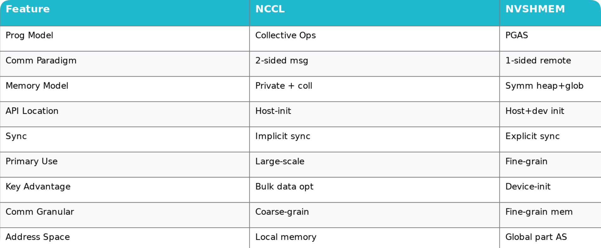

  

**分野与融合：NVSHMEM 与 NCCL 的演进**

至此，我们看到了两条并行的发展路径：

-   **NCCL**：始于解决 MPI 在 GPU 上的不足，专注于集合通信，内部采用类似**双边**的消息传递机制，通过高度工程优化取得了巨大成功。
-   **NVSHMEM**：采用 OpenSHMEM 的**单边**通信哲学，提供更底层的、可编程的远程内存访问能力，在特定场景（如 MoE，并行卷积等）中展现出优势。

当然 NCCL 与 NVSHMEM 也存在各自的“阿喀琉斯之踵”：

-   **NCCL 的局限**：其强项在于高度优化的结构化集合通信，但对于需要根据数据内容进行**动态、非结构化**通信的场景（如 MoE 路由），其固定的 API **表达能力有限**。此外，其内部模型为了饱和带宽需占用大量 SM 资源，与核心计算任务形成**资源竞争**。
-   **NVSHMEM 的局限**：其极致性能来自于**严格的对称性假设**。对称堆的分配是**集体操作**，要求所有 GPU 步调完全一致，且缺乏灵活的**通信子域**。这使得构建现代大模型中常见的多层次、异构并行工作流变得极为繁琐。

随着大模型的发展方向和 GPU 硬件的 「Scale-Up」 ，传统 NCCL 内部的双边模型开始遇到瓶颈。

作为业内公认的通信操作最佳实践，为了追求极致的节点内通信性能，NCCL 开始吸收单边通信和对称内存的思想，使得 NCCL 也对 Symmetric Memory 和一系列单边操作进行实现。

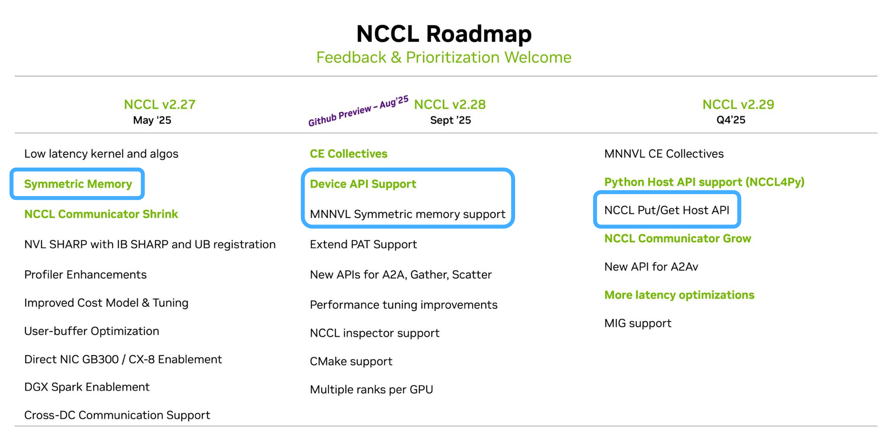

  

### 3.3 上层应用的构建

如果说 NCCL Symmetric Memory 或者 NVSHMEM 的使用是为了优化集合通信算法，那么 PyTorch 则将 Symmetric Memory 提升到了一个全新的维度：一个**直接面向开发者、可编程的分布式共享内存模型**。

随着 DeepSeek 的横空出世，开发者试图去掌握底层的硬件。而越接近底层，开发的复杂度就越高，所以 PyTorch 选择了进行封装底层的能力。

PyTorch Symmetric Memory 的实现并非单一的铁板一块，而是多后端框架。这使得开发者可以根据硬件环境、依赖库和性能需求，选择最合适的底层执行引擎。

> 这部分时效性比较强，以下只对当前版本

-   **默认后端 (NCCL + VMM)**

-   **底层机制**：该后端完美承接了前文所述的 NCCL Symmetric Memory 机制。通过 ncclCommWindowRegister 收集所有 GPU 的物理内存信息，并利用 CUDA 的虚拟内存管理 (VMM) 在每个 GPU 上建立起指向所有对等 GPU 的直接虚拟地址映射。
-   **执行方式**：在 CUDA Kernel 内部，可以直接通过标准的 load/store 指令（或更高效的 multimem PTX 指令）像访问本地内存一样访问远程 GPU 的对称 Tensor。

-   **NVSHMEM 后端 (可选)**

-   **启用方式**：`torch.distributed._symmetric_memory.set_backend("NVSHMEM")`
-   **底层机制**：直接调用 NVSHMEM 库的 nvshmem\_malloc 来分配对称堆，并使用其单边通信原语 (nvshmem\_putmem/nvshmem\_getmem) 和设备端 API。

-   **实验性后端**，纯 NCCL 等...

PyTorch 的多后端架构最终通过对 CUDA 和 Triton Kernel 的支持，将底层能力交到了开发者手中。

此处以 Perplexity.ai 开源的 pplx-kernels 库作为在 Triton 中支持 Symmetric Memory 的一个示例，其开发思路如下：

1\. **Python 侧封装**：在 Python 层分配对称 Tensor，并通过一个 BackendContext 对象收集所有 ranks 的指针。

2\. **Kernel 调用**：将指针数组作为参数传递给 Triton Kernel。

3\. **Triton 侧编程**：在 Triton JIT Kernel 中，开发者可以像操作普通 tl.pointer 一样，通过 tl.load 和 tl.store 对远程指针进行读写，语法上与访问本地内存几乎没有区别。

```python
# Python side
import torch
import triton
import triton.language as tl
from pplx_kernels import BackendContext

# 1. 创建对称 Tensor 和上下文
symm_tensor = ...
ctx = BackendContext(symm_tensor, backend=「NVSHMEM」) # or 「DEFAULT」

# 2. 调用 Triton Kernel
my_triton_kernel[(...)] (ctx.pointers, ...)

# Triton JIT Kernel
@triton.jit
def my_triton_kernel(symm_ptrs, ... , MY_RANK, PEER_RANK):
    # ... a bunch of offsets calculation ...   
    # 从本地数据加载
    local_val = tl.load(my_data_ptr + offsets)
    # 直接 store 到远程 GPU 的对称内存
    peer_ptr = tl.load(symm_ptrs + PEER_RANK) # 加载远程 rank 的基地址
    tl.store(peer_ptr + offsets, local_val)
    # Triton 内置的同步原语，确保内存操作完成
    tl.experimental.symm_mem_sync()
    # 直接 load 远程 GPU 的数据
    remote_val = tl.load(peer_ptr + offsets)  
    # ... a custom computation ...
```

### 3.4 当前的局限性

上文中 A2A 使用对称内存进行优化，MoE 模型依赖 A2A 通信。

但是当 MoE 模型扩展到多节点时，这时候就离开了 Scale-Up 的领域，进入了机间互联的情况。

在 DeepEP 时期，跨节点场景下，NVSHMEM 通过 RDMA 实现 Put/Get 操作

默认在每对 GPU 之间仅**绑定一个 IB Queue Pair (QP)**，通过单一发送队列驱动所有 RDMA 写/读。当同一对 QP 上排队的请求激增时，**QP 的深度限制**与 **Completion Queue (CQ) 轮询锁**成为主机阻塞和 NIC 排队的核心瓶颈。

结果造成原本一条 `nvshmem_putmem` 从 GPU 设备发起的 RDMA 请求，会在主机侧因单 QP CQ 轮询与 IOCTL 同步而**被显著延迟**。

这在小消息延迟至关重要的 MoE All-to-All 中尤为致命——大量小包涌入同一个 QP，排队与 CQ 竞争导致延迟暴涨。

DeepEP 的工作正是针对这一场景的深度优化典范

-   利用 **Shared Receive Queue (SRQ)** 与 **eXtended Reliable Connection (XRC)**，将原本 1：1 的 QP 映射改为**每多个 PE 复用一个 SRQ**，或为每个线程流量分配独立 SRQ 池。
-   利用 IB **Scatter/Gather RDMA**，DeepEP 将多段用户数据在主机侧 **打包** 为**单个 RDMA 写请求**，减少 QP 交互次数。
-   在 NVSHMEM Put/Get 之后，引入**设备端原子计数器**（使用 `nvshmem_atomic_inc` 与 `nvshmem_atomic_wait_until`），减少 CPU 干预。
-   **IBGDA** 等其他手段......

DeepEP 通过对底层硬件的高度掌控，实现低延迟分布式通信，也推广了相关技术，一定程度引导了硬件的发展方向......

但是不管是 NVSHMEM 还是 NCCL 在当前跨节点时实现的对称内存还是存在局限性。

在笔者看来，当前跨节点实现都更依赖于底层的 RDMA 协议，尚未达到节点内 P2P 访问那样的“零拷贝”和“指针级”，不够优雅。

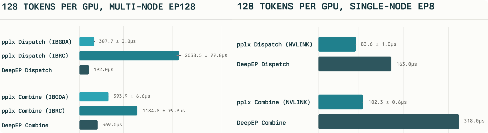

此外 NVSHMEM 这种通信库与 NCCL 提供最优的各种实现不同，开发者面临一个难题，如果不能做到极致快，就不如不做。这也是最求极致性能的 trade-off。

> If it's not fast, don't do it

**所以你永远可以相信 NCCL!**

### 3.5 总结

过去，开发者需要在 NCCL 的易用性与 NVSHMEM 的灵活性之间做出选择，但这一界限正在迅速模糊。

不管是 **MPI（NCCL）** 还是 **OpenSHMEM（NVSHMEM）**，通信库的发展始终受到时代、硬件和应用的共同驱动。

* * *

> 回答问题：  
> **NCCL 层面 (硬件实现)**：它通过P2P零拷贝和硬件卸载实现，通过它可以用O(1)复杂度的算法取代传统Ring算法，也可以做到高效的A2A算法，在节点内实现了极致的通信性能。  
> **PyTorch 层面 (应用价值)**：它不仅是内部优化，更是一种**可编程**的内存模型。开发者能用它高效实现异步并行、MoE模型的动态路由等复杂通信模式，而无效去了解低级的底层通信，解锁了新的优化可能。  
> **HPC 层面 (思想源头)**：它并非凭空出现，而是高性能计算中经典的单边通信思想（冷饭炒热），在现代GPU硬件（如NVLink）和AI应用（大模型）需求下的必然演进与融合。
